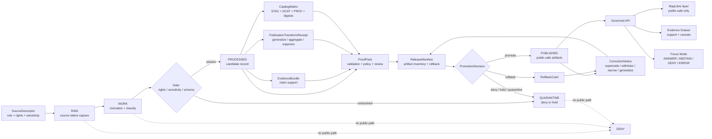

<!-- [KFM_META_BLOCK_V2]
doc_id: kfm://doc/TODO-NEEDS-UUID
title: Catalog and Proof Objects
type: standard
version: v1
status: draft
owners: TODO-NEEDS-OWNER
created: TODO-NEEDS-VERIFICATION
updated: 2026-05-06
policy_label: TODO-NEEDS-VERIFICATION
related: [../README.md, ../../README.md, ../../../adr/ADR-0011-catalog-proof-release-separation.md, ../../../adr/ADR-0009-sensitive-location-policy.md, ../../../adr/ADR-0014-truth-path.md, ../../../adr/ADR-0002-responsibility-root-monorepo.md]
tags: [kfm, archaeology, catalog, proof, release, evidencebundle, catalogmatrix, releasemanifest, sensitive-location, rollback]
notes: [Revises existing minimal catalog/proof object note for docs/domains/archaeology/governance/CATALOG_AND_PROOF_OBJECTS.md. Target file and archaeology README were confirmed through the GitHub connector. Owners, doc_id, policy_label, created date, schema subpath, CI enforcement, emitted proof examples, and steward process remain NEEDS VERIFICATION.]
[/KFM_META_BLOCK_V2] -->

<a id="top"></a>

# Catalog and Proof Objects

Purpose: define the archaeology lane’s release-grade closure set so public archaeology outputs remain evidence-bound, policy-safe, cataloged, reviewable, correctable, and reversible.

<p align="center">
  
  
  
  
  
  
</p>

<p align="center">
  <a href="#scope">Scope</a> ·
  <a href="#repo-fit">Repo fit</a> ·
  <a href="#closure-law">Closure law</a> ·
  <a href="#release-closure-flow">Flow</a> ·
  <a href="#object-family-matrix">Object matrix</a> ·
  <a href="#archaeology-release-profiles">Release profiles</a> ·
  <a href="#catalog-closure">Catalog closure</a> ·
  <a href="#proof-expectations">Proof expectations</a> ·
  <a href="#validation-gates">Validation gates</a> ·
  <a href="#change-and-retention-rules">Change rules</a> ·
  <a href="#definition-of-done">Definition of done</a>
</p>

> [!IMPORTANT]
> **This document is a governance contract, not proof that every named object already exists.**
>
> The current file path is confirmed, but object schemas, validators, emitted proof packs, release manifests, catalog matrices, CI gates, and steward review records remain **NEEDS VERIFICATION** unless verified in the repository.

> [!WARNING]
> Archaeology publication is high-risk. Exact site locations, burial contexts, sacred places, collection-security details, private-landowner exposure, looting-risk locations, and steward-controlled cultural knowledge are **denied on public surfaces by default**. Public output requires reviewed generalized, redacted, aggregated, suppressed, or withheld treatment.

---

## Scope

This file defines how catalog records, proof objects, receipts, release manifests, correction notices, and rollback references should fit together for the KFM Archaeology lane.

It covers:

- catalog closure for archaeology datasets, layers, candidate features, survey coverage, public story assets, and public-safe exports;
- proof expectations before an archaeology release candidate becomes public or semi-public;
- the separation between **receipts**, **catalog records**, **proof packs**, **release manifests**, and **promotion decisions**;
- public-safe archaeology release profiles;
- required no-leak and closure checks for exact-location-sensitive material;
- change, correction, supersession, rollback, and retention rules.

It does not define:

- executable JSON Schemas;
- Rego/Python policy code;
- live source connectors;
- route handlers;
- MapLibre components;
- exact steward review procedures;
- source-specific rights determinations;
- public release approval for any real archaeology data.

Those belong in the appropriate responsibility roots after repository conventions and stewardship requirements are verified.

<p align="right"><a href="#top">Back to top ↑</a></p>

---

## Repo fit

| Field | Value |
|---|---|
| Current path | `docs/domains/archaeology/governance/CATALOG_AND_PROOF_OBJECTS.md` |
| Owning root | `docs/` — human-facing control plane |
| Lane | `docs/domains/archaeology/` |
| Document role | Governance reference for archaeology catalog/proof/release closure |
| Upstream lane entry | [`../README.md`](../README.md) |
| Upstream domain index | [`../../README.md`](../../README.md) |
| Cross-cutting ADRs | [`ADR-0011 catalog/proof/release separation`](../../../adr/ADR-0011-catalog-proof-release-separation.md), [`ADR-0009 sensitive location policy`](../../../adr/ADR-0009-sensitive-location-policy.md), [`ADR-0014 truth path`](../../../adr/ADR-0014-truth-path.md), [`ADR-0002 responsibility-root monorepo`](../../../adr/ADR-0002-responsibility-root-monorepo.md) |
| Downstream machine surfaces | `NEEDS VERIFICATION` — schema, policy, validator, release, catalog, and proof homes must be confirmed before linking as current implementation |
| Public posture | Public-safe artifacts only; exact sensitive locations denied by default |
| Runtime posture | Governed API / released artifacts only; no direct RAW, WORK, QUARANTINE, restricted store, graph-internal, vector-index, or model-runtime reads |

### Accepted inputs

This governance document may receive:

| Input | Accepted when | Required handling |
|---|---|---|
| Object-family requirements | The object is needed to preserve evidence, catalog, release, correction, or rollback state | Add to the matrix with truth role and validation burden |
| Release profile changes | The outward archaeology publication pattern changes | Update release profiles, gates, and no-leak checks together |
| New artifact class | A new public-safe layer, export, story asset, 3D asset, catalog item, or review artifact is introduced | Define catalog closure and proof burden before publication |
| Sensitivity rule changes | Steward, cultural, rights, looting-risk, or exact-location posture changes | Update validation gates and correction/rollback rules |
| Fixture or validator expectations | New valid/invalid examples are needed | Add as `PROPOSED` until tests and paths are confirmed |

### Exclusions

| Excluded material | Where it goes instead | Reason |
|---|---|---|
| Raw archaeology records | `data/raw/<archaeology path>` or repo-confirmed lifecycle home | This doc is not source storage |
| Working transforms or failed records | `data/work/`, `data/quarantine/`, or repo-confirmed lifecycle home | Public docs must not carry sensitive intermediate material |
| JSON Schemas | `schemas/` or repo-confirmed schema home | Machine shape must be executable and versioned |
| Human-readable semantic contracts | `contracts/` or repo-confirmed contract home | Object meaning belongs in contract docs |
| Policy-as-code | `policy/` or repo-confirmed policy home | Admissibility rules must be testable |
| Validator code | `tools/validators/` or repo-confirmed tooling home | Enforcement does not belong in prose |
| Release manifests and proof packs | `release/`, `data/proofs/`, or repo-confirmed release/proof home | Emitted trust objects are artifacts, not documentation |
| Exact real site coordinates | Restricted/steward-only stores | Public docs must not become a disclosure surface |

<p align="right"><a href="#top">Back to top ↑</a></p>

---

## Closure law

KFM archaeology release closure follows the shared KFM truth path:

```text
SOURCE EDGE
  -> RAW
  -> WORK / QUARANTINE
  -> PROCESSED
  -> CATALOG / TRIPLET
  -> REVIEW / POLICY / PROOF
  -> RELEASE
  -> PUBLISHED
  -> GOVERNED API / TILE SERVICE / EXPORT
  -> MAP SHELL / EVIDENCE DRAWER / FOCUS MODE
```

For this lane:

1. **Catalog records make artifacts discoverable. They do not authorize release.**
2. **Receipts record process memory. They do not substitute for proof.**
3. **EvidenceBundles support claims. They do not by themselves publish artifacts.**
4. **Proof packs assemble release-grade verification. They do not replace the release manifest.**
5. **Release manifests bind released artifacts, digests, aliases, release state, correction state, and rollback targets.**
6. **Promotion decisions change admissible public state. They are not file moves.**
7. **Correction notices and rollback cards keep lineage visible after publication changes.**
8. **Public archaeology artifacts require public-safe geometry treatment and a transform receipt when precision is reduced, withheld, aggregated, or suppressed.**

> [!CAUTION]
> A file stored under a public-looking path is not public truth unless a valid release closure set exists. Conversely, a released public summary must not leak restricted geometry through catalog metadata, layer bounds, source IDs, high-zoom tiles, Evidence Drawer fields, graph edges, search indexes, screenshots, logs, or Focus Mode context.

<p align="right"><a href="#top">Back to top ↑</a></p>

---

## Release closure flow



<p align="right"><a href="#top">Back to top ↑</a></p>

---

## Object family matrix

| Object family | Truth role | Archaeology-specific requirement | Public exposure | Missing-object outcome |
|---|---|---|---|---|
| `SourceDescriptor` | Source identity, source role, rights, cadence, sensitivity hints | Must state whether source can support site record, survey coverage, candidate anomaly, report citation, steward knowledge, lab result, or public derivative | Public-safe summary only | `DENY` source activation or `QUARANTINE` candidate |
| `EvidenceRef` | Link from claim/artifact/layer to support | Must not point public users to restricted exact geometry | Public-safe reference allowed | `ABSTAIN` or release hold |
| `EvidenceBundle` | Inspectable support package | Must include source role, citation, spatial/temporal scope, sensitivity summary, review state, and public-safe support boundary | Public-safe subset only | `ABSTAIN`, `DENY`, or proof failure |
| `ValidationReport` | Schema and semantic validation result | Must check candidate-vs-confirmed status, source role, rights, sensitivity, temporal scope, and geometry posture | Public-safe result summary | Release hold or `ERROR` |
| `PolicyDecision` | Allow, deny, restrict, abstain, or review-needed result | Must include exact-location denial and public-safe transform obligations | Public-safe reason codes allowed | `DENY` release or runtime request |
| `ReviewRecord` | Steward/domain/policy review state | Required for cultural sensitivity, steward-controlled knowledge, site precision, burial/sacred context, looting risk, or uncertain rights | Public-safe review status only | Hold release |
| `RunReceipt` | Process memory | Records ingest, transform, validation, catalog, or dry-run execution; cannot authorize release | Usually internal or public-safe audit summary | Cannot satisfy proof gates alone |
| `PublicationTransformReceipt` | Redaction/generalization/suppression/aggregation proof | Required when exact geometry or sensitive attributes are transformed for public release | Public-safe transform summary | `DENY` public artifact |
| `CatalogMatrix` | Catalog closure and digest crosswalk | Must align internal IDs, STAC/DCAT/PROV refs where used, release IDs, artifact digests, EvidenceBundle refs, transform receipts, and correction state | Public-safe catalog closure allowed | Release hold / `ERROR` |
| `ProofPack` | Release-grade verification bundle | Must bind evidence, validation, policy, review, transform, catalog, artifact digest, and rollback readiness | Public-safe proof summary allowed | Release hold |
| `ReleaseManifest` | Released artifact inventory | Must name artifacts, digests, media types, public aliases, release scope, sensitivity posture, proof refs, catalog refs, and rollback target | Public-safe manifest allowed | Not published |
| `PromotionDecision` | Governed state transition | Must state promote, hold, deny, quarantine, withdraw, or rollback with reason codes | Public-safe decision status allowed | No publication state change |
| `CorrectionNotice` | Visible correction, withdrawal, supersession, narrowing, or generalization record | Must preserve affected release IDs and public trust state | Public-safe notice required when public meaning changes | Silent replacement blocked |
| `RollbackCard` | Safe reversion target and rollback steps | Required before public release of an archaeology artifact | Public-safe rollback availability allowed | Release blocked |
| `LayerManifest` | Released map-layer delivery contract | Must reference public-safe geometry, layer bounds that do not leak precision, evidence refs, catalog refs, and release state | Public | Layer hidden / `DENY` |
| `RuntimeResponseEnvelope` | Governed API / Focus response | Must carry finite outcome, evidence refs, policy decision, release state, and citation validation | Public or role-scoped | `ERROR`, `ABSTAIN`, or `DENY` |

> [!NOTE]
> Object names are expected KFM vocabulary. Exact schema IDs, file paths, and field names must follow the repository’s confirmed schema-home and contract conventions.

<p align="right"><a href="#top">Back to top ↑</a></p>

---

## Archaeology release profiles

| Release profile | Intended use | Required closure | Public geometry posture | Default outcome if incomplete |
|---|---|---|---|---|
| Restricted exact site record | Steward/internal review, audit, or protected analysis | SourceDescriptor, EvidenceBundle, sensitivity classification, restricted review record, access policy | Not public | `DENY` public exposure |
| Public generalized site-area summary | Public education, overview maps, non-sensitive storytelling | EvidenceBundle, PublicationTransformReceipt, PolicyDecision, ReviewRecord, CatalogMatrix, ProofPack, ReleaseManifest, RollbackCard | Generalized, suppressed, aggregated, or withheld | `DENY` |
| Survey coverage layer | Show what area was surveyed without revealing site locations | SourceDescriptor, survey evidence, rights, catalog refs, proof pack, layer manifest | Coverage geometry only; no exact finds | Hold release |
| Candidate anomaly layer | Show remote-sensing/geophysical candidates where safe | Candidate-feature EvidenceBundle, uncertainty label, review state, transform receipt if needed | Candidate and generalized; never confirmed-site labeling without review | `ABSTAIN` or `DENY` |
| Report / bibliographic citation index | Public source discovery and citation support | Citation metadata, rights posture, EvidenceBundle refs, catalog closure | Usually non-coordinate or generalized | Hold release if rights unclear |
| Public story or dossier asset | Narrative explanation with Evidence Drawer support | ReleaseManifest, ProofPack, public-safe EvidenceBundle subset, correction path | Public-safe only | `ABSTAIN` or hidden asset |
| 3D / 2.5D site documentation | Research, review, or carefully scoped public interpretation | Source provenance, access controls, transform receipt, proof pack, review state, release manifest | Restricted by default; public only if no precision leak | `DENY` |
| Export bundle | Public-safe data download | ReleaseManifest, artifact digests, catalog closure, proof pack, rollback card, correction notice path | Public-safe fields and geometry only | Block export |

<p align="right"><a href="#top">Back to top ↑</a></p>

---

## Catalog closure

Catalog closure is the check that public-facing discovery records, provenance records, released artifacts, and proof objects all describe the same release.

### Minimum catalog closure set

A releasable archaeology publication should provide a coherent closure set:

- `ReleaseManifest`;
- `EvidenceBundle` references;
- STAC item/asset references where STAC is used;
- DCAT dataset/distribution references where DCAT is used;
- PROV entity/activity/agent references where PROV is used;
- `CatalogMatrix`;
- `PolicyDecision`;
- `ReviewRecord` where required;
- `PublicationTransformReceipt` when geometry or sensitive fields are transformed;
- `ProofPack`;
- `CorrectionNotice` reference or explicit current/no-correction state;
- `RollbackCard`.

### CatalogMatrix checks

| Check | Required behavior |
|---|---|
| Identity closure | Dataset IDs, layer IDs, release IDs, and artifact IDs resolve without ambiguity |
| Digest closure | Artifact digests in catalog records match release manifest digests |
| Evidence closure | Every public claim or public layer has EvidenceBundle support or returns `ABSTAIN` |
| Transform closure | Public-safe geometry has a transform receipt and release-scoped policy basis |
| Rights closure | Source terms and public release posture are represented or release is denied |
| Sensitivity closure | Sensitive-location classification and outward precision class are represented |
| Temporal closure | Source time, observation time, processing time, release time, and correction time are not collapsed when material |
| Catalog/proof split | Catalog records cannot be used as proof packs or promotion decisions |
| Correction closure | Superseded, withdrawn, narrowed, generalized, or corrected releases remain visible |
| Rollback closure | A prior safe release target or safe withdrawal path is available |

<p align="right"><a href="#top">Back to top ↑</a></p>

---

## Proof expectations

Release-grade proof must answer four reviewer questions:

1. **What is being released?**
2. **What evidence supports it?**
3. **Why is it safe and allowed to release?**
4. **How can it be corrected, withdrawn, superseded, or rolled back?**

### Required proof dimensions

| Dimension | Required proof |
|---|---|
| Source | SourceDescriptor with role, authority limits, rights, cadence, citation expectations, and sensitivity hints |
| Evidence | EvidenceRef resolution to EvidenceBundle; unresolved support returns `ABSTAIN` or blocks release |
| Identity | Stable release IDs, artifact IDs, digests, version refs, and spec/content hash where adopted |
| Geometry | Public-safe geometry class and transform receipt for any precision reduction or withholding |
| Sensitivity | Exact-location, cultural, burial/sacred, looting-risk, private-landowner, collection-security, and steward-controlled knowledge checks |
| Rights | Rights and redistribution posture; unknown rights deny public release |
| Review | Steward/domain/policy review record when risk class requires it |
| Catalog | CatalogMatrix closure across internal and outward catalog/provenance surfaces |
| Release | ReleaseManifest with artifacts, digests, proof refs, public aliases, release state, and rollback target |
| Runtime | RuntimeResponseEnvelope / DecisionEnvelope with finite outcomes where exposed through API or Focus Mode |
| Correction | CorrectionNotice path and current/superseded/withdrawn/narrowed/generalized state |
| Rollback | RollbackCard or withdrawal path before public exposure |

### Denial examples

| Reason code | Meaning |
|---|---|
| `archaeology.exact_location_public_denied` | Public output would expose exact or reconstructable sensitive location |
| `archaeology.cultural_review_missing` | Required cultural/steward review is missing |
| `archaeology.looting_risk_unresolved` | Disclosure risk has not been resolved |
| `archaeology.candidate_confirmed_without_review` | Remote-sensing/geophysical/model candidate is being treated as confirmed |
| `rights.unknown` | Rights or redistribution posture is unresolved |
| `evidence.bundle_missing` | EvidenceRef cannot resolve to EvidenceBundle |
| `catalog.matrix_missing` | Catalog closure is missing |
| `proof.pack_missing` | Release-grade proof is missing |
| `release.manifest_missing` | Release inventory is missing |
| `rollback.target_missing` | Release lacks rollback or withdrawal target |
| `receipt.used_as_proof` | A run receipt is being used as proof |
| `catalog.used_as_promotion` | Catalog metadata is being used as release approval |
| `model.output_used_as_authority` | AI/model output is being used as root truth |
| `public_payload.internal_ref` | Public payload exposes restricted or internal reference |

<p align="right"><a href="#top">Back to top ↑</a></p>

---

## Companion surfaces

The exact repository homes below are **NEEDS VERIFICATION**. They are included to show required responsibility separation, not to claim current implementation.

| Surface | Candidate home | Status | What changes it |
|---|---|---:|---|
| Human lane entry | `docs/domains/archaeology/README.md` | CONFIRMED | Lane scope, trust posture, or navigation changes |
| Catalog/proof governance | `docs/domains/archaeology/governance/CATALOG_AND_PROOF_OBJECTS.md` | CONFIRMED target path | Release object, proof, catalog, correction, or rollback rule changes |
| Sensitive-location decision | `docs/adr/ADR-0009-sensitive-location-policy.md` | CONFIRMED path / draft status | Cross-domain location policy changes |
| Catalog/proof/release separation | `docs/adr/ADR-0011-catalog-proof-release-separation.md` | CONFIRMED path / draft status | Trust-object authority changes |
| Truth path decision | `docs/adr/ADR-0014-truth-path.md` | CONFIRMED path / draft status | Lifecycle or trust membrane changes |
| Source registry | `data/registry/<archaeology>/sources.*` | NEEDS VERIFICATION | New source, source rights change, cadence change, source role change |
| Dataset/layer registry | `data/registry/<archaeology>/datasets.*`, `layers.*` | NEEDS VERIFICATION | New dataset/layer or release profile |
| Machine schemas | `schemas/contracts/v1/<repo-confirmed archaeology subpath>/` | NEEDS VERIFICATION | Object family or field change |
| Semantic contracts | `contracts/<repo-confirmed archaeology subpath>/` | NEEDS VERIFICATION | Object meaning or invariant change |
| Policy | `policy/<repo-confirmed archaeology subpath>/` | NEEDS VERIFICATION | Release, sensitivity, rights, review, or runtime policy change |
| Receipts | `data/receipts/<archaeology>/` | NEEDS VERIFICATION | Ingest, transform, validation, AI, or release dry-run |
| Proofs | `data/proofs/<archaeology>/` | NEEDS VERIFICATION | Release-grade proof assembly |
| Catalog records | `data/catalog/stac/<archaeology>/`, `data/catalog/dcat/<archaeology>/`, `data/catalog/prov/<archaeology>/` | NEEDS VERIFICATION | Catalog/provenance export refresh |
| Published artifacts | `data/published/<archaeology>/` or repo-confirmed published home | NEEDS VERIFICATION | Promotion decision |
| Release records | `release/<archaeology>/` or repo-confirmed release home | NEEDS VERIFICATION | Release candidate, promotion, correction, rollback |
| Validators | `tools/validators/<archaeology>/` | NEEDS VERIFICATION | New gate or object-family rule |
| Fixtures and tests | `fixtures/<archaeology>/`, `tests/<archaeology>/`, or repo-confirmed homes | NEEDS VERIFICATION | New valid/invalid example or regression |
| Runtime API | `apps/<governed-api>/...` | UNKNOWN | API convention and route inventory |
| UI layer / Evidence Drawer | `apps/<web>/...`, `web/`, or repo-confirmed UI home | UNKNOWN | UI convention and component inventory |

<p align="right"><a href="#top">Back to top ↑</a></p>

---

## Validation gates

A public archaeology release candidate must pass these gates before it can be promoted.

| Gate | Must prove | Failure outcome |
|---|---|---|
| Source descriptor | Source role, rights, access class, citation expectations, cadence, and sensitivity hints are known | `DENY` or `QUARANTINE` |
| Schema / semantic validation | Candidate objects conform to accepted schemas and lane semantics | `ERROR` or return to `WORK` |
| Rights | Public release rights are known and compatible with intended audience | `DENY` |
| Sensitivity classification | Exact-location and cultural/steward risk are classified | `DENY` |
| Candidate-status integrity | Candidate anomaly is not labeled as confirmed site without review | `ABSTAIN` or `DENY` |
| Geometry no-leak | Public artifacts contain no exact or reconstructable sensitive geometry | `DENY` |
| Transform receipt | Any generalized, aggregated, suppressed, delayed, or withheld outward geometry has a receipt | `DENY` |
| Evidence closure | Every consequential public claim resolves to EvidenceBundle support | `ABSTAIN` or release hold |
| Review | Required steward/domain/cultural/policy review exists | Hold release |
| Catalog closure | CatalogMatrix aligns release, artifacts, digests, evidence, transform, STAC/DCAT/PROV where used, and correction state | `ERROR` or hold release |
| Proof pack | ProofPack includes validation, policy, evidence, review, sensitivity, transform, catalog, release, and rollback refs | Hold release |
| Release manifest | ReleaseManifest inventories all public artifacts and rollback targets | Hold release |
| Runtime envelope | API/Focus surfaces use finite outcomes and do not expose restricted data | `DENY`, `ABSTAIN`, or `ERROR` |
| Correction / rollback | Correction and rollback state are queryable | Block release |

### Minimum negative fixtures

Add or verify invalid fixtures for:

- exact archaeological point in public layer;
- generalized public layer without transform receipt;
- candidate anomaly promoted as confirmed site without review;
- EvidenceBundle missing for public claim;
- catalog record used as proof;
- receipt used as proof;
- release manifest missing rollback target;
- public Evidence Drawer payload containing restricted source geometry or internal source ID;
- Focus Mode exact-location request returning an answer instead of `DENY`;
- unknown rights published publicly;
- withdrawn release still displayed as current.

<p align="right"><a href="#top">Back to top ↑</a></p>

---

## Public payload no-leak checklist

Public payloads include API responses, layer manifests, tiles, downloads, story nodes, evidence drawer payloads, screenshots, public catalog pages, search indexes, graph projections, AI context packs, and logs visible to public or semi-public users.

- [ ] No exact coordinates, raw geometry, fine-grain bbox, high-zoom tile reference, or unreviewed centroid.
- [ ] No hidden alternate coordinate fields.
- [ ] No internal restricted source IDs that can join back to exact records.
- [ ] No collection-security, access-route, landowner, private access, or storage details.
- [ ] No candidate anomaly labeled as confirmed site without review.
- [ ] No source URL or catalog record that exposes restricted geometry indirectly.
- [ ] No Evidence Drawer field that reveals more precision than the map.
- [ ] No graph edge, vector index, or search facet that reconstructs restricted precision.
- [ ] No AI context containing restricted geometry for public Focus Mode.
- [ ] No logs or validation messages exposed publicly with restricted coordinates.
- [ ] No small-count aggregation that re-identifies a protected site or steward-controlled place.
- [ ] No stale correction state shown as current.
- [ ] No public artifact without ReleaseManifest and rollback target.

<p align="right"><a href="#top">Back to top ↑</a></p>

---

## Illustrative contract sketch

The exact schema home and fields are **NEEDS VERIFICATION**. This sketch is here to make required closure explicit.

```yaml
archaeology_release_candidate:
  candidate_id: "archaeology.release_candidate.<stable-id>"
  lane: "archaeology"
  release_profile: "public_generalized_site_area | survey_coverage | candidate_anomaly | public_story | export_bundle"
  sensitivity:
    exact_location_public: "DENY"
    outward_precision_class: "generalized | aggregated | suppressed | withheld"
    review_required: true
    reason_codes:
      - "archaeology.exact_location_public_denied"

  source_refs:
    source_descriptor_refs: []
    dataset_version_refs: []

  evidence:
    evidence_refs: []
    evidence_bundle_refs: []

  transforms:
    publication_transform_receipt_refs: []

  validation:
    validation_report_refs: []
    policy_decision_refs: []
    review_record_refs: []

  catalog:
    catalog_matrix_ref: "TODO"
    stac_refs: []
    dcat_refs: []
    prov_refs: []

  proof:
    proof_pack_ref: "TODO"

  release:
    release_manifest_ref: "TODO"
    rollback_card_ref: "TODO"
    correction_notice_ref: null

  decision:
    promotion_decision_ref: "TODO"
    outcome: "promote | hold | deny | quarantine | rollback | withdraw"
```

<p align="right"><a href="#top">Back to top ↑</a></p>

---

## Change and retention rules

| Change event | Required update | Retention rule |
|---|---|---|
| New archaeology source | Source registry, source descriptor, rights review, sensitivity defaults, citation expectations, validator fixtures | Do not activate public connector until source role and rights are reviewed |
| New object family | Contract, schema, fixtures, validators, catalog/proof docs | Version object family; do not silently redefine old meaning |
| New public layer | LayerManifest, catalog refs, EvidenceBundle refs, proof pack, release manifest, no-leak tests | Keep old layer release queryable if superseded |
| New transform/generalization rule | Policy, transform receipt schema/fixture, validator, release profile | Preserve old transform receipts; never rewrite history |
| Backfill | RunReceipt, ValidationReport, CatalogMatrix delta, release decision if public output changes | Old receipts and proof packs remain queryable |
| Correction | CorrectionNotice, updated release manifest, catalog state, UI trust state | Prior release remains visible as corrected/superseded/withdrawn |
| Rollback | RollbackCard, PromotionDecision, correction notice if public meaning changed | Rollback is a new auditable action, not deletion |
| Deprecated artifact | Mark superseded/deprecated with successor refs | Preserve lineage until retention policy allows archival |
| Rebuilt derivative | Recompute digests and compare against ReleaseManifest expectations | Derived products remain rebuildable and subordinate |
| Schema version | Add successor mapping, migration note, valid/invalid fixtures | Do not break historical proof object interpretation |
| Policy denial change | Update reason codes, fixtures, policy tests, docs, and runtime expectations together | Denied releases remain explainable |

<p align="right"><a href="#top">Back to top ↑</a></p>

---

## Reviewer checklist

Before approving a public or semi-public archaeology release candidate:

- [ ] The release candidate has a SourceDescriptor and source role is appropriate for the claim.
- [ ] Rights and redistribution posture are known.
- [ ] Sensitivity classification is present.
- [ ] Exact public geometry is denied unless a future reviewed exception explicitly allows it.
- [ ] Public geometry is generalized, aggregated, suppressed, withheld, or otherwise public-safe.
- [ ] PublicationTransformReceipt exists for any public geometry/sensitive-field transform.
- [ ] Candidate anomalies remain labeled as candidate unless review confirms stronger status.
- [ ] EvidenceRefs resolve to EvidenceBundles.
- [ ] CatalogMatrix aligns artifact digests, release IDs, EvidenceBundle refs, catalog refs, and transform receipts.
- [ ] ProofPack includes validation, policy, evidence, review, sensitivity, catalog, and rollback support.
- [ ] ReleaseManifest inventories all public artifacts and digests.
- [ ] PromotionDecision exists and is not replaced by a file move.
- [ ] CorrectionNotice path exists for future public meaning changes.
- [ ] RollbackCard or withdrawal path exists.
- [ ] Public payload no-leak tests pass.
- [ ] Evidence Drawer and Focus Mode do not expose restricted precision.
- [ ] The release remains cite-or-abstain.

<p align="right"><a href="#top">Back to top ↑</a></p>

---

## Open verification items

| Item | Status | Required action |
|---|---:|---|
| `doc_id`, owner, created date, policy label | NEEDS VERIFICATION | Fill from document registry / ownership process |
| Schema subpath for archaeology objects | NEEDS VERIFICATION | Confirm whether the repo uses `schemas/contracts/v1/domains/archaeology/`, `schemas/contracts/v1/archaeology/`, or another accepted home |
| Contract subpath for archaeology object meanings | NEEDS VERIFICATION | Confirm semantic contract convention |
| Policy engine and policy path | UNKNOWN | Confirm Rego, Python validators, or repo-native policy implementation |
| Source registry path and source descriptor examples | UNKNOWN | Inspect `data/registry/` and archaeology source registry |
| Emitted catalog/proof/release examples | UNKNOWN | Inspect release/proof/catalog artifacts after implementation |
| Release manifest and rollback object names | NEEDS VERIFICATION | Align with accepted release/correction object schemas |
| Steward/cultural review process | NEEDS VERIFICATION | Identify required review roles and restricted workflow |
| Public generalization thresholds | NEEDS VERIFICATION | Decide with stewards/policy; encode as policy and fixtures |
| Map layer and Evidence Drawer implementation paths | UNKNOWN | Verify UI/app convention before linking or naming components |
| CI gate names and commands | UNKNOWN | Inspect `.github/workflows/` and repo scripts before claiming enforcement |
| Sensitive-location incident response | NEEDS VERIFICATION | Confirm rollback/withdrawal runbook and escalation path |

<p align="right"><a href="#top">Back to top ↑</a></p>

---

## Definition of done

This governance document is ready for review when:

- [ ] Meta block placeholders are resolved or deliberately tracked.
- [ ] Related links point only to confirmed files or clearly marked placeholders.
- [ ] Schema-home and policy-home conventions are reconciled with repository ADRs.
- [ ] Object family matrix aligns with current shared KFM object names.
- [ ] Release profiles cover public generalized site area, survey coverage, candidate anomalies, public story assets, 3D/site documentation, and exports.
- [ ] Exact-location denial is visible in the validation gates.
- [ ] Receipt/proof/catalog/release separation is explicit.
- [ ] Public payload no-leak checklist has matching fixtures or validator backlog items.
- [ ] Correction and rollback expectations are visible.
- [ ] Open verification items are assigned or intentionally deferred.
- [ ] No implementation maturity is claimed without repository evidence.

<p align="right"><a href="#top">Back to top ↑</a></p>
