<!-- [KFM_META_BLOCK_V2]
doc_id: kfm://doc/NEEDS-VERIFICATION-docs-domains-archaeology-governance-file-map
title: Archaeology Governance File Map
type: standard
version: v1
status: draft
owners: TODO-NEEDS-OWNER
created: TODO-NEEDS-GIT-HISTORY
updated: 2026-05-06
policy_label: NEEDS-VERIFICATION-public-or-restricted
related: [docs/domains/archaeology/README.md, docs/domains/archaeology/architecture/ARCHITECTURE.md, docs/domains/archaeology/architecture/DOMAIN_MODEL.md, docs/domains/archaeology/governance/SOURCE_REGISTRY.md, docs/domains/archaeology/governance/SENSITIVITY_AND_RIGHTS.md, docs/domains/archaeology/governance/VALIDATION_AND_POLICY.md, docs/domains/archaeology/governance/CATALOG_AND_PROOF_OBJECTS.md, docs/domains/archaeology/governance/OPEN_QUESTIONS.md, docs/domains/archaeology/operations/RUNBOOK.md, docs/domains/archaeology/CHANGELOG.md]
tags: [kfm, archaeology, file-map, governance, documentation-control, sensitivity, rights, evidence, release, rollback]
notes: [Revises the existing archaeology FILE_MAP from a flat file-purpose table into a governed documentation control map. doc_id, owner, creation date, policy label, CODEOWNERS, schema-home authority, machine registry homes, API/UI homes, tests, workflows, and release enforcement remain NEEDS VERIFICATION.]
[/KFM_META_BLOCK_V2] -->

<a id="top"></a>

# Archaeology Governance File Map

Human-readable map of the archaeology lane’s documentation, governance surfaces, machine handoffs, verification gaps, and safe update rules.

<p align="center">
  
  
  
  
  
  
</p>

> [!IMPORTANT]
> **Status:** `draft`  
> **Owners:** `TODO-NEEDS-OWNER`  
> **Path:** `docs/domains/archaeology/governance/FILE_MAP.md`  
> **Owning root:** `docs/` — human-facing control plane and domain documentation.  
> **Impact:** This file is the lane’s navigation and control surface. It helps maintainers know which archaeology docs exist, which surfaces are only planned, and which changes require docs, schema, policy, fixture, API/UI, catalog, release, correction, or rollback updates.  
> **Quick jumps:** [Scope](#scope) · [Repo fit](#repo-fit) · [Accepted inputs](#accepted-inputs) · [Exclusions](#exclusions) · [Confirmed docs](#confirmed-docs) · [Planned or unverified surfaces](#planned-or-unverified-surfaces) · [Directory map](#directory-map) · [Handoff map](#handoff-map) · [Update rules](#update-rules) · [Definition of done](#definition-of-done)

> [!WARNING]
> Archaeology is a high-sensitivity lane. Exact public archaeological site locations are denied by default. Public output requires reviewed generalized, suppressed, redacted, delayed, aggregated, or otherwise public-safe representation with evidence support, rights review, sensitivity review, release state, correction path, and rollback target.

---

## Scope

This file maps the documentation and adjacent control surfaces for the KFM Archaeology lane.

It is meant to answer:

- which archaeology files are confirmed in this documentation surface;
- what each file owns;
- which files are architecture, governance, operations, or history;
- which machine/runtime surfaces are downstream handoffs rather than prose docs;
- which advertised or proposed surfaces still need verification before maintainers rely on them;
- what must be updated together when archaeology source, sensitivity, validation, public geometry, release, correction, rollback, API, UI, or Focus Mode behavior changes.

This file is **not** a source registry, schema, policy bundle, validator, runtime route, release manifest, proof pack, or publication approval.

[Back to top](#top)

---

## Repo fit

| Field | Value |
|---|---|
| Current file | `docs/domains/archaeology/governance/FILE_MAP.md` |
| Current role | Navigation, documentation control, and update-impact guide |
| Owning responsibility root | `docs/` |
| Domain root | [`../README.md`](../README.md) |
| Architecture docs | [`../architecture/ARCHITECTURE.md`](../architecture/ARCHITECTURE.md), [`../architecture/DOMAIN_MODEL.md`](../architecture/DOMAIN_MODEL.md) |
| Governance docs | [`./SOURCE_REGISTRY.md`](./SOURCE_REGISTRY.md), [`./SENSITIVITY_AND_RIGHTS.md`](./SENSITIVITY_AND_RIGHTS.md), [`./VALIDATION_AND_POLICY.md`](./VALIDATION_AND_POLICY.md), [`./CATALOG_AND_PROOF_OBJECTS.md`](./CATALOG_AND_PROOF_OBJECTS.md), [`./OPEN_QUESTIONS.md`](./OPEN_QUESTIONS.md) |
| Operations docs | [`../operations/RUNBOOK.md`](../operations/RUNBOOK.md) |
| History | [`../CHANGELOG.md`](../CHANGELOG.md) |
| Shared doctrine links | [`../../../doctrine/lifecycle-law.md`](../../../doctrine/lifecycle-law.md), [`../../../adr/ADR-0014-truth-path.md`](../../../adr/ADR-0014-truth-path.md), [`../../../adr/ADR-0009-sensitive-location-policy.md`](../../../adr/ADR-0009-sensitive-location-policy.md), [`../../../architecture/governed-api.md`](../../../architecture/governed-api.md), [`../../../security/public-surface-boundary.md`](../../../security/public-surface-boundary.md), [`../../../runbooks/publication.md`](../../../runbooks/publication.md) |
| Directory Rules basis | Domain documentation belongs under `docs/domains/<domain>/`; domain names should not become repo-root folders. |
| Current repo confidence | `CONFIRMED` for the paths listed under [Confirmed docs](#confirmed-docs); `NEEDS VERIFICATION` for machine/runtime enforcement and planned surfaces. |

### File-map posture

| Label | Meaning in this file |
|---|---|
| `CONFIRMED` | Path was verified in the accessible repository evidence used for this revision. |
| `PROPOSED` | Recommended or doctrinally expected surface, but not verified as a current file here. |
| `NEEDS VERIFICATION` | A specific check is required before treating the item as settled. |
| `UNKNOWN` | Not verified from current repository, runtime, test, workflow, or release evidence. |

[Back to top](#top)

---

## Accepted inputs

Use this file for documentation-control information about the archaeology lane.

| Accepted input | Belongs here when it… | Example |
|---|---|---|
| File inventory | Maps confirmed archaeology docs and their responsibilities. | “`SOURCE_REGISTRY.md` owns human source-admission guidance.” |
| Ownership and status notes | Marks owner, policy label, and verification gaps without guessing. | `TODO-NEEDS-OWNER`, `NEEDS VERIFICATION`. |
| Update-impact rules | Explains which docs or downstream files must change together. | Sensitivity rule changes affect policy fixtures, public DTO checks, and release docs. |
| Handoff boundaries | Routes machine/runtime concerns to responsibility roots. | Schemas belong under `schemas/`; policy under `policy/`; validators under `tools/` or repo-confirmed homes. |
| Missing or unverified surfaces | Preserves planned surfaces without claiming they exist. | `API_AND_UI_SURFACES.md` remains `NEEDS VERIFICATION` until located or created. |
| Review checklist | Gives maintainers a compact completion gate. | Confirm links, owners, doc_id, sensitive-location posture, and rollback references. |

---

## Exclusions

| Does not belong here | Proper home | Why |
|---|---|---|
| RAW, WORK, QUARANTINE, or PROCESSED archaeology data | `data/raw/archaeology/`, `data/work/archaeology/`, `data/quarantine/archaeology/`, `data/processed/archaeology/` or repo-confirmed equivalents | File maps are not data stores. |
| Machine source descriptor instances | `data/registry/` or repo-confirmed source registry home | This file links to registry guidance; it does not store source truth. |
| JSON Schema, OpenAPI, DTOs, or runtime envelope definitions | `schemas/`, `contracts/`, or repo-confirmed contract/schema homes | Machine contracts need versioning, fixtures, and validators. |
| Executable policy | `policy/` | Policy must be testable and fail closed. |
| Validators and scripts | `tools/`, `scripts/`, `packages/`, or repo-confirmed implementation roots | Runtime checks should not live in prose. |
| Release manifests, proof packs, receipts, correction notices, rollback cards | `release/`, `data/proofs/`, `data/receipts/`, `data/catalog/`, or repo-confirmed emitted-object homes | Publication artifacts must remain auditable and separately validated. |
| API route handlers or UI components | `apps/`, `web/`, `ui/`, or repo-confirmed runtime roots | Public surfaces must consume governed API/released artifacts and should not be invented here. |
| Exact archaeological coordinates or restricted source details | Restricted data/review stores | This document must never become a leakage vector. |

[Back to top](#top)

---

## Confirmed docs

These paths were verified as part of the documentation surface for this revision.

| File | Status | Owns | Must not own | Update when… |
|---|---:|---|---|---|
| [`../README.md`](../README.md) | `CONFIRMED` | Lane landing page, public-location warning, scope, inputs, exclusions, lifecycle, source-role posture, and quick orientation. | Machine schemas, source records, live connectors, or release approval. | Lane scope, public posture, source families, lifecycle, API/UI posture, or definition of done changes. |
| [`../architecture/ARCHITECTURE.md`](../architecture/ARCHITECTURE.md) | `CONFIRMED` | Architecture boundary, lifecycle flow, layer responsibilities, source roles, sensitivity/rights posture, runtime surfaces, validation gates, and change discipline. | Proof of runtime enforcement or current route/workflow/test behavior. | Architecture seams, trust membrane, public geometry policy, release requirements, or runtime responsibilities change. |
| [`../architecture/DOMAIN_MODEL.md`](../architecture/DOMAIN_MODEL.md) | `CONFIRMED` | Archaeology semantic model: sites, components, features, stratigraphy, survey/excavation, artifacts, samples, lab results, candidate features, and public-safe profiles. | Executable schema authority. | Object families, relationship grammar, geometry profiles, temporal model, or public-safe profiles change. |
| [`./SOURCE_REGISTRY.md`](./SOURCE_REGISTRY.md) | `CONFIRMED` | Human source-admission companion: descriptor minimums, source roles, activation states, rights/sensitivity review, and candidate source-family posture. | Machine descriptor instances or source-native data. | A source family, descriptor field, source role, activation rule, or registry layout changes. |
| [`./SENSITIVITY_AND_RIGHTS.md`](./SENSITIVITY_AND_RIGHTS.md) | `CONFIRMED` | Fail-closed sensitivity and rights posture, high-sensitivity classes, public release requirements, and denial triggers. | Detailed policy-as-code or real restricted content. | Rights, public geometry treatment, sensitivity classes, consent/stewardship rules, or denial triggers change. |
| [`./VALIDATION_AND_POLICY.md`](./VALIDATION_AND_POLICY.md) | `CONFIRMED` | Validation gates, policy outcomes, mandatory denials, public output rules, candidate-feature rules, EvidenceBundle/citation closure, fixtures, validators, reason codes, and obligations. | Executable policy or CI proof by itself. | Validation gates, reason codes, policy outcomes, public DTO rules, Focus Mode behavior, or fixture requirements change. |
| [`./CATALOG_AND_PROOF_OBJECTS.md`](./CATALOG_AND_PROOF_OBJECTS.md) | `CONFIRMED` | Closure set and proof expectations: release manifest, EvidenceBundle references, STAC/DCAT/PROV records, policy decision receipt, transform receipt, digests, correction lineage, rollback card. | Release authority or emitted proof objects. | Catalog/proof/release object names, required closure checks, digests, correction lineage, or rollback expectations change. |
| [`./OPEN_QUESTIONS.md`](./OPEN_QUESTIONS.md) | `CONFIRMED` | Short unresolved-governance list: owner, schema home, policy runtime, stewardship/tribal/cultural protocol, public thresholds, API/UI canonical paths. | Issue tracker replacement or hidden decision record. | Any listed question is answered, superseded, or moved to an ADR/register. |
| [`../operations/RUNBOOK.md`](../operations/RUNBOOK.md) | `CONFIRMED` | Safe first-run sequence and incident handling for sensitivity leakage. | General domain doctrine or machine release manifest. | Operating sequence, validation order, incident response, rollback, or release-disabling steps change. |
| [`../CHANGELOG.md`](../CHANGELOG.md) | `CONFIRMED` | Human-readable change history for the archaeology documentation set. | Source of truth for current file existence without verification. | Any archaeology doc surface is added, moved, renamed, deprecated, or materially revised. |
| [`./FILE_MAP.md`](./FILE_MAP.md) | `CONFIRMED` | This navigation/control map. | Canonical source, schema, policy, runtime, or release authority. | Any file ownership, path, status, handoff, or update rule changes. |

[Back to top](#top)

---

## Planned or unverified surfaces

These surfaces are useful to track, but this file does not claim they currently exist or enforce anything.

| Surface | Status | Proposed / likely role | Verification needed |
|---|---:|---|---|
| `docs/domains/archaeology/governance/API_AND_UI_SURFACES.md` | `NEEDS VERIFICATION` | Human companion for governed API, MapLibre, Evidence Drawer, Focus Mode, Story/export, review console, and public DTO boundaries. | Locate existing file, create it, or remove stale references from neighboring docs and changelog. |
| `docs/domains/archaeology/governance/DATA_LIFECYCLE.md` | `NEEDS VERIFICATION` | Lane-specific lifecycle semantics for RAW, WORK, QUARANTINE, PROCESSED, CATALOG/TRIPLET, PUBLISHED. | Locate existing file or create from architecture/runbook material. |
| `docs/domains/archaeology/governance/PROMOTION_AND_ROLLBACK.md` | `NEEDS VERIFICATION` | Human release, promotion, correction, withdrawal, and rollback companion. | Locate existing file or create; coordinate with publication runbook and catalog/proof docs. |
| `docs/domains/archaeology/governance/BACKLOG.md` | `NEEDS VERIFICATION` | Lane-local backlog if the repo wants one. | Confirm whether backlog belongs here, in `OPEN_QUESTIONS.md`, or in `docs/registers/VERIFICATION_BACKLOG.md`. |
| `docs/adr/ADR-archaeology-schema-home.md` | `PROPOSED` | Resolve archaeology schema/contract placement and compatibility migration. | Confirm ADR naming convention and whether a broader schema-home ADR already covers this. |
| `docs/adr/ADR-archaeology-location-sensitivity.md` | `PROPOSED` | Lane-specific supplement to sensitive-location policy. | Confirm if cross-domain sensitive-location ADR is sufficient or lane ADR is needed. |
| `docs/adr/ADR-archaeology-public-vs-restricted-geometry.md` | `PROPOSED` | Define public geometry profiles, precision thresholds, transform receipts, and reconstruction-risk checks. | Steward/policy review and fixture coverage. |
| `data/registry/archaeology/` or `data/registry/sources/archaeology/` | `NEEDS VERIFICATION` | Machine source descriptors, datasets, publication profiles, activation states, and verification backlog. | Confirm canonical registry layout before creating or moving files. |
| `contracts/domains/archaeology/` | `NEEDS VERIFICATION` | Human-readable semantics for archaeology trust/object families. | Confirm contract home and relationship to `schemas/`. |
| `schemas/contracts/v1/domains/archaeology/` | `NEEDS VERIFICATION` | Machine-checkable schema home for archaeology objects and payloads if adopted by repo convention. | Confirm active schema-home ADR and naming convention. |
| `policy/domains/archaeology/` | `NEEDS VERIFICATION` | Executable policy for exact-location denial, rights, sensitivity, candidate-feature handling, and public DTO safety. | Confirm policy runtime and path convention. |
| `fixtures/domains/archaeology/` or `tests/fixtures/archaeology/` | `NEEDS VERIFICATION` | Positive and negative fixtures for public-safe summaries, exact-location denial, candidate feature denial, catalog closure, and rollback. | Confirm fixture home and test runner. |
| `tests/domains/archaeology/` | `NEEDS VERIFICATION` | Automated tests for schema, policy, validator, public DTO, catalog/proof, release, and Focus Mode negative states. | Confirm test framework and CI wiring. |
| `tools/validators/archaeology/` | `NEEDS VERIFICATION` | Local validators for descriptors, sensitivity, public geometry, EvidenceBundle closure, catalog closure, public DTO safety, and release readiness. | Confirm validator language and package conventions. |
| `apps/.../archaeology` | `UNKNOWN` | Governed API route handlers, OpenAPI contract, MapLibre layer descriptors, Evidence Drawer payloads, and Focus Mode panels. | Inventory actual API/UI roots before naming paths. |
| `.github/workflows/*archaeology*` | `UNKNOWN` | CI orchestration for archaeology-specific validation if adopted. | Inventory workflow YAML and required checks before claiming enforcement. |

> [!NOTE]
> A planned or unverified surface should not be promoted into a clickable “confirmed” link until the path is verified in the active branch.

[Back to top](#top)

---

## Directory map

```mermaid
flowchart TD
    A[docs/domains/archaeology<br/>lane docs] --> B[README.md<br/>orientation]
    A --> C[architecture/]
    C --> C1[ARCHITECTURE.md]
    C --> C2[DOMAIN_MODEL.md]
    A --> D[governance/]
    D --> D1[FILE_MAP.md]
    D --> D2[SOURCE_REGISTRY.md]
    D --> D3[SENSITIVITY_AND_RIGHTS.md]
    D --> D4[VALIDATION_AND_POLICY.md]
    D --> D5[CATALOG_AND_PROOF_OBJECTS.md]
    D --> D6[OPEN_QUESTIONS.md]
    D --> D7[planned API/UI, lifecycle, promotion docs<br/>NEEDS VERIFICATION]
    A --> E[operations/]
    E --> E1[RUNBOOK.md]
    A --> F[CHANGELOG.md]

    D --> G[data/registry<br/>SourceDescriptor handoff]
    D --> H[schemas/contracts/v1<br/>machine schema handoff]
    D --> I[contracts/domains<br/>semantic contract handoff]
    D --> J[policy/domains<br/>policy-as-code handoff]
    D --> K[tests + fixtures<br/>proof of gates]
    D --> L[apps / governed API / UI<br/>runtime consumers]
    D --> M[release + data/proofs + data/receipts<br/>publication closure]
```



[Back to top](#top)

---

## Handoff map

Use this table when a documentation change has downstream consequences.

| If this changes… | Update these docs | Check these machine/runtime homes | Required trust question |
|---|---|---|---|
| Source family or source role | [`SOURCE_REGISTRY.md`](./SOURCE_REGISTRY.md), [`DOMAIN_MODEL.md`](../architecture/DOMAIN_MODEL.md), [`VALIDATION_AND_POLICY.md`](./VALIDATION_AND_POLICY.md) | `data/registry/`, `contracts/`, `schemas/`, `policy/`, fixtures | What claims can this source support, and what must it not support alone? |
| Exact-location or sensitivity rule | [`SENSITIVITY_AND_RIGHTS.md`](./SENSITIVITY_AND_RIGHTS.md), [`VALIDATION_AND_POLICY.md`](./VALIDATION_AND_POLICY.md), [`ARCHITECTURE.md`](../architecture/ARCHITECTURE.md) | `policy/`, fixtures, public DTO tests, layer manifests, release checks | Could a public user reconstruct a sensitive site? |
| Object family or relationship | [`DOMAIN_MODEL.md`](../architecture/DOMAIN_MODEL.md), [`ARCHITECTURE.md`](../architecture/ARCHITECTURE.md) | `contracts/`, `schemas/`, fixtures, validators, API DTOs | Does the object remain evidence-bound and source-role-aware? |
| Public geometry profile | [`SENSITIVITY_AND_RIGHTS.md`](./SENSITIVITY_AND_RIGHTS.md), [`VALIDATION_AND_POLICY.md`](./VALIDATION_AND_POLICY.md), planned `PROMOTION_AND_ROLLBACK.md` | transform receipts, policy tests, layer manifests, release manifest | Is public geometry generalized, suppressed, redacted, delayed, aggregated, or explicitly allowed? |
| Evidence or citation requirement | [`VALIDATION_AND_POLICY.md`](./VALIDATION_AND_POLICY.md), [`CATALOG_AND_PROOF_OBJECTS.md`](./CATALOG_AND_PROOF_OBJECTS.md) | EvidenceBundle resolver, citation validator, Focus Mode fixtures | Does the claim resolve `EvidenceRef -> EvidenceBundle`, or must it abstain/deny? |
| Catalog/proof closure | [`CATALOG_AND_PROOF_OBJECTS.md`](./CATALOG_AND_PROOF_OBJECTS.md), [`RUNBOOK.md`](../operations/RUNBOOK.md) | STAC/DCAT/PROV, catalog matrix, proof pack, release manifest, rollback card | Can a public artifact be audited, corrected, and rolled back? |
| API/UI behavior | planned `API_AND_UI_SURFACES.md`, [`VALIDATION_AND_POLICY.md`](./VALIDATION_AND_POLICY.md), [`ARCHITECTURE.md`](../architecture/ARCHITECTURE.md) | governed API, OpenAPI, MapLibre layer descriptors, Evidence Drawer, Focus Mode tests | Are public surfaces downstream of released artifacts and governed API only? |
| Incident response | [`RUNBOOK.md`](../operations/RUNBOOK.md), [`CATALOG_AND_PROOF_OBJECTS.md`](./CATALOG_AND_PROOF_OBJECTS.md), planned `PROMOTION_AND_ROLLBACK.md` | release manifest, rollback card, correction notice, affected artifacts | Can the unsafe release be disabled and corrected without hiding lineage? |
| File added, moved, renamed, or deprecated | this file, [`../CHANGELOG.md`](../CHANGELOG.md), [`OPEN_QUESTIONS.md`](./OPEN_QUESTIONS.md) when unresolved | link checker, document registry, CODEOWNERS, ADRs if needed | Did the path change preserve responsibility roots and avoid parallel authorities? |

[Back to top](#top)

---

## Update rules

### Keep this map synchronized

Update `FILE_MAP.md` in the same PR when:

- an archaeology doc is added, moved, renamed, deprecated, or deleted;
- a neighboring doc changes ownership or responsibility;
- a planned surface becomes verified;
- a confirmed surface is superseded;
- a link target changes;
- an ADR settles a previously unverified path;
- a source, sensitivity, validation, policy, release, rollback, API, UI, or Focus Mode rule changes the file ownership matrix.

### Do not over-upgrade status

| Tempting shortcut | Correct handling |
|---|---|
| “The changelog says a file exists.” | Treat as a clue; verify the path in the active branch before marking `CONFIRMED`. |
| “A PDF plan proposes the path.” | Mark `PROPOSED` until repo evidence confirms it. |
| “A similar file exists in another lane.” | Treat as a pattern, not proof. |
| “The UI can hide restricted fields.” | Require public DTO tests; UI filtering is not a safety boundary. |
| “The file is a map, so exact points are okay.” | Deny public exact archaeology locations by default. |
| “A source is public online.” | Public availability is not rights, sensitivity, or release clearance. |
| “A remote-sensing anomaly looks archaeological.” | Keep it candidate-only until evidence and review support stronger status. |

### File-status promotion checklist

Before changing a row from `PROPOSED` or `NEEDS VERIFICATION` to `CONFIRMED`:

- [ ] Fetch or inspect the exact path in the active branch.
- [ ] Confirm the file’s role from its own content, not just its name.
- [ ] Confirm relative links from this file resolve.
- [ ] Check whether the file has a KFM meta block or documented exception.
- [ ] Check for owner and policy-label placeholders.
- [ ] Confirm whether downstream machine/runtime behavior is implemented or still only documented.
- [ ] Add or update `CHANGELOG.md`.
- [ ] Update `OPEN_QUESTIONS.md` if the verification closes or narrows a gap.

[Back to top](#top)

---

## Definition of done

A revision to this file is ready for review when:

- [ ] The KFM Meta Block V2 is present and unresolved values are clear placeholders.
- [ ] Status, owners, policy label, related links, and notes are synchronized with the visible file role.
- [ ] All confirmed links were checked from `docs/domains/archaeology/governance/FILE_MAP.md`.
- [ ] Planned or missing surfaces are labeled `PROPOSED`, `UNKNOWN`, or `NEEDS VERIFICATION`.
- [ ] Exact public archaeology location denial remains visible.
- [ ] The map does not claim schemas, policies, tests, CI, API routes, UI components, source descriptors, proof packs, release manifests, dashboards, or runtime behavior unless verified.
- [ ] The file routes data, schemas, contracts, policies, fixtures, tests, validators, runtime code, and release artifacts to their responsibility roots.
- [ ] `CHANGELOG.md` is updated for material file-map changes.
- [ ] `OPEN_QUESTIONS.md` is updated for any newly closed or newly discovered verification item.
- [ ] Reviewers can tell what exists, what is planned, what is unknown, and what must fail closed.

---

## Open verification

| Item | Status | Why it matters |
|---|---:|---|
| `doc_id` UUID | `NEEDS VERIFICATION` | Required for durable document identity and registry links. |
| File owner | `TODO-NEEDS-OWNER` | Required for review, stewardship, CODEOWNERS, and escalation. |
| Original created date | `TODO-NEEDS-GIT-HISTORY` | Should come from Git history or document registry, not guesswork. |
| Policy label | `NEEDS VERIFICATION` | Determines whether this file is public-safe or restricted. |
| CODEOWNERS coverage | `UNKNOWN` | Review ownership cannot be assumed. |
| Machine registry layout | `NEEDS VERIFICATION` | Prevents parallel source descriptor homes. |
| Contract/schema home | `NEEDS VERIFICATION` | Prevents `contracts/` versus `schemas/` authority drift. |
| Policy runtime and path | `UNKNOWN` | Determines how exact-location denial and source-rights policy are enforced. |
| Fixture and test homes | `UNKNOWN` | Determines how file-map claims become regression-proof. |
| API/UI canonical paths | `UNKNOWN` | Prevents invented route/component paths. |
| Planned companion docs | `NEEDS VERIFICATION` | `API_AND_UI_SURFACES.md`, `DATA_LIFECYCLE.md`, `PROMOTION_AND_ROLLBACK.md`, and `BACKLOG.md` need locate/create/deprecate decisions. |
| Release/proof object implementation | `UNKNOWN` | Publication maturity cannot be claimed without release/proof evidence. |
| Stewardship, tribal, cultural, and rights review process | `NEEDS VERIFICATION` | Required before sensitive archaeology source activation or public derivatives. |

[Back to top](#top)

---

## Appendix: maintainer notes

<details>
<summary><strong>Reviewer quick card</strong></summary>

```yaml
goal:
  - Update archaeology file map without weakening trust boundaries.

owning_root:
  - docs/

directory_rules_basis:
  - Domain documentation belongs under docs/domains/archaeology/.
  - Machine schemas, contracts, policies, fixtures, tests, data, runtime code, and release artifacts stay in their responsibility roots.

sensitivity_check:
  - Exact public archaeology locations remain DENY by default.
  - Candidate features remain candidate-only until evidence and review support stronger claims.

evidence_check:
  - Consequential claims still require EvidenceRef -> EvidenceBundle.
  - Catalog/proof/release/correction/rollback surfaces remain separate.

verification_check:
  - Confirmed rows were inspected.
  - Proposed or unknown rows were not silently upgraded.

rollback:
  - Revert this file-map change and restore previous navigation table.
  - Re-open any verification item incorrectly marked confirmed.
```

</details>

<details>
<summary><strong>Anti-patterns this file should catch</strong></summary>

| Anti-pattern | File-map response |
|---|---|
| Adding a root-level `archaeology/` folder | Reject; route to responsibility roots. |
| Treating `FILE_MAP.md` as a source registry | Move source instances to registry home and link here. |
| Treating a PDF plan as current implementation | Mark `PROPOSED` until active repo evidence verifies it. |
| Treating changelog wording as file existence proof | Verify the path and update this map. |
| Duplicating policy prose without executable gate | Link to policy home or mark `NEEDS VERIFICATION`. |
| Adding public layer docs without DTO leak tests | Keep runtime surface `NEEDS VERIFICATION`. |
| Removing rollback/correction references from release docs | Block review or add open verification item. |

</details>

[Back to top](#top)
