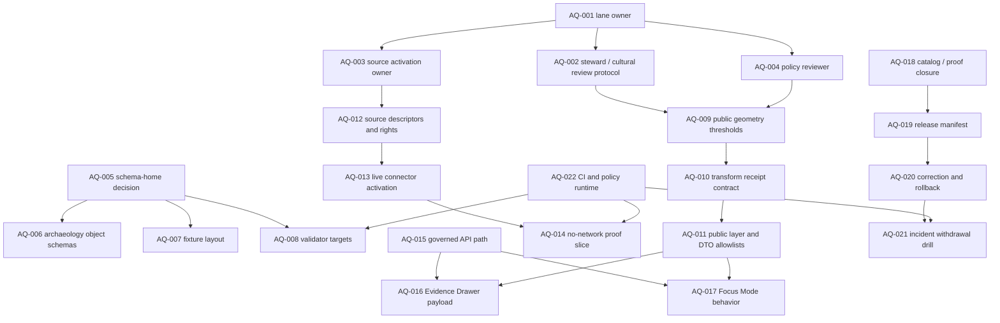

<!-- [KFM_META_BLOCK_V2]
doc_id: kfm://doc/TODO-NEEDS-UUID
title: Archaeology Governance Open Questions
type: standard
version: v1
status: draft
owners: TODO-NEEDS-OWNER
created: TODO-NEEDS-GIT-CREATED-DATE
updated: 2026-05-06
policy_label: TODO-NEEDS-POLICY-LABEL
related: [../README.md, ./FILE_MAP.md, ../../../adr/ADR-0001-schema-home.md, ../../../adr/ADR-0009-sensitive-location-policy.md, ../../../adr/ADR-0014-truth-path.md, ../../../registers/VERIFICATION_BACKLOG.md]
tags: [kfm, archaeology, governance, open-questions, sensitivity, rights, evidence, publication]
notes: [Revision expands the existing open-question bullets into a governed decision register. doc_id, owner, created date, policy label, and final related-link set remain NEEDS VERIFICATION.]
[/KFM_META_BLOCK_V2] -->

<a id="top"></a>

# Archaeology Governance Open Questions

Purpose: track the unresolved decisions that must be answered before the KFM Archaeology lane can safely move from doctrine and planning into source activation, validation, publication, API/UI exposure, and rollback-capable release.


> [!IMPORTANT]
> This file is a **decision register**, not a release approval. It should preserve open questions until they are resolved by repo evidence, accepted ADRs, source-rights review, steward review, policy tests, fixtures, validation reports, or release/proof artifacts.

> [!WARNING]
> Archaeology has a high sensitivity burden. Exact archaeological site locations, burial contexts, sacred or culturally sensitive places, collection-security details, private-landowner information, and looting-risk geometry are **DENY by default** for public or semi-public exposure unless a reviewed public-safe profile proves otherwise.

## Quick navigation

| Section | Use |
|---|---|
| [How to use this register](#how-to-use-this-register) | Review rules and state meanings |
| [Decision dependency map](#decision-dependency-map) | Which questions block other questions |
| [Open question register](#open-question-register) | Active unresolved decisions |
| [Resolution workflow](#resolution-workflow) | How a question becomes decided |
| [Closeout checklist](#closeout-checklist) | Gates before marking a question resolved |
| [Legacy question mapping](#legacy-question-mapping) | Preservation map from the original bullets |
| [Appendix: resolution card template](#appendix-resolution-card-template) | Copy/paste template for new decisions |

---

## How to use this register

This document belongs under the `docs/` responsibility root because it is a human-facing governance control surface for the Archaeology lane. The current file path is:

```text
docs/domains/archaeology/governance/OPEN_QUESTIONS.md
```

Repo-adjacent documents:

- [Archaeology lane README](../README.md)
- [Archaeology file map](./FILE_MAP.md)
- [ADR-0001: Canonical Schema Home for Machine Contracts](../../../adr/ADR-0001-schema-home.md)
- [ADR-0009: Sensitive Location Policy](../../../adr/ADR-0009-sensitive-location-policy.md)
- [ADR-0014: KFM Truth Path and Public Trust Membrane](../../../adr/ADR-0014-truth-path.md)
- [Verification backlog](../../../registers/VERIFICATION_BACKLOG.md)

### Register states

| State | Meaning | What changes the state |
|---|---|---|
| `OPEN` | The question is known and unresolved. | Add owner, evidence, and next action. |
| `NEEDS VERIFICATION` | A concrete check is required before the answer can be trusted. | Inspect repo files, ADRs, schemas, policies, tests, source terms, or review artifacts. |
| `BLOCKED` | The answer cannot advance until another decision lands. | Resolve the blocking ADR, owner, source, policy, or path issue. |
| `READY FOR ADR` | The decision is consequential enough to need an ADR or formal register entry. | Draft ADR or decision record. |
| `PROPOSED` | A candidate answer exists but has not been validated. | Add tests, fixtures, review, and compatibility notes. |
| `DECIDED` | The answer is backed by sufficient repo evidence, ADR acceptance, or review proof. | Link the decision artifact and keep rollback/supersession visible. |
| `SUPERSEDED` | A later decision replaced the answer. | Link the successor and preserve this history. |

### Truth labels

Use the narrowest truthful label:

| Label | Meaning here |
|---|---|
| `CONFIRMED` | Verified from current repo evidence, accepted ADR, source registry, test, workflow, receipt, release/proof artifact, or authoritative KFM doctrine. |
| `PROPOSED` | Recommended decision or target path not yet verified in the implementation. |
| `UNKNOWN` | Not verified strongly enough to act on. |
| `NEEDS VERIFICATION` | Specific evidence can answer the question, but that check has not been completed. |

[Back to top](#top)

---

## Decision dependency map



> [!NOTE]
> This map is dependency guidance. It does not prove that the listed contracts, validators, APIs, workflows, or source connectors exist.

---

## Open question register

### A. Ownership, stewardship, and review

| ID | Question | State | Truth label | Blocks | Next evidence needed |
|---|---|---:|---:|---|---|
| `AQ-001` | Who is the canonical owner for the Archaeology lane? | `OPEN` | `UNKNOWN` | CODEOWNERS, review routing, source activation, release approval | Confirm lane owner in repo ownership docs, CODEOWNERS, ADR index, or governance register. |
| `AQ-002` | What steward, tribal, cultural, landowner, or institutional review protocol governs archaeology releases? | `OPEN` | `NEEDS VERIFICATION` | Public release, exact-location decisions, source activation | Create or link a reviewed protocol that defines reviewer roles, escalation, consultation, and restricted/public decisions. |
| `AQ-003` | Who may approve source descriptors for archaeology sources? | `OPEN` | `UNKNOWN` | Live connectors, rights review, public release | Confirm source-steward role and approval artifact. |
| `AQ-004` | Who owns sensitive-location policy review for archaeology-specific cases? | `OPEN` | `NEEDS VERIFICATION` | Public geometry thresholds, transform receipts, Focus Mode denial handling | Link to ADR-0009 owner, policy reviewer, or domain-specific policy extension. |
| `AQ-005` | Which review records are required before a public archaeology artifact can be promoted? | `OPEN` | `NEEDS VERIFICATION` | Promotion, release manifest, rollback | Define required `ReviewRecord` fields and reviewer classes for archaeology release candidates. |

### B. Directory, metadata, and schema authority

| ID | Question | State | Truth label | Blocks | Next evidence needed |
|---|---|---:|---:|---|---|
| `AQ-006` | Is this governance subfolder the canonical home for archaeology governance docs? | `OPEN` | `NEEDS VERIFICATION` | Link hygiene, docs index, file map | Reconcile `docs/domains/archaeology/governance/` with the lane README and file map. |
| `AQ-007` | Should `OPEN_QUESTIONS.md` be indexed from `../README.md`, `./FILE_MAP.md`, `docs/domains/README.md`, or a register? | `OPEN` | `NEEDS VERIFICATION` | Discoverability, review workflow | Update the relevant index once the path is accepted. |
| `AQ-008` | What is the approved schema-home path for archaeology machine contracts? | `OPEN` | `NEEDS VERIFICATION` | Object schemas, validators, fixtures, API DTOs | Follow ADR-0001; verify whether `schemas/contracts/v1/archaeology/` is accepted and enforced. |
| `AQ-009` | Are `contracts/domains/archaeology/` narrative contracts needed, and how do they reference canonical schemas? | `OPEN` | `PROPOSED` | Contract/schema drift controls | Inventory existing `contracts/` and `schemas/` consumers before adding or moving files. |
| `AQ-010` | What metadata block values should this file use after acceptance? | `OPEN` | `NEEDS VERIFICATION` | Publication status, document registry | Confirm `doc_id`, owner, created date, policy label, related paths, and document registry entry. |

### C. Source activation, rights, and admissibility

| ID | Question | State | Truth label | Blocks | Next evidence needed |
|---|---|---:|---:|---|---|
| `AQ-011` | Which archaeology source families are admissible for first-wave intake? | `OPEN` | `NEEDS VERIFICATION` | Source descriptors, fixtures, source registry | List candidate source families and classify by source role, rights, access class, update cadence, and public-release eligibility. |
| `AQ-012` | What rights and attribution checks are mandatory before source activation? | `OPEN` | `NEEDS VERIFICATION` | Live connector activation | Define source-rights review fields and denial behavior for unknown rights. |
| `AQ-013` | Which source roles are allowed to support public claims, restricted review, candidate features, or internal-only context? | `OPEN` | `NEEDS VERIFICATION` | EvidenceBundle support, public summaries, Focus answers | Add a source-role matrix for field/survey, archival, lab, oral/steward, regulatory, remote sensing, modeled, and derived public sources. |
| `AQ-014` | What is the minimum no-network archaeology proof slice? | `OPEN` | `PROPOSED` | CI, validator design, release dry run | Build synthetic fixtures before any live source connector. |
| `AQ-015` | What conditions allow a live archaeology connector to be enabled? | `OPEN` | `BLOCKED` | Live connector activation | Requires `AQ-001`, `AQ-002`, `AQ-011`, `AQ-012`, `AQ-014`, policy tests, and source descriptors. |

### D. Sensitivity, public geometry, and geoprivacy

| ID | Question | State | Truth label | Blocks | Next evidence needed |
|---|---|---:|---:|---|---|
| `AQ-016` | What public generalization, aggregation, suppression, or withholding thresholds are approved for archaeology? | `OPEN` | `NEEDS VERIFICATION` | Public layers, public API DTOs, exports, stories | Create a domain-specific threshold policy or ADR extension. |
| `AQ-017` | Which archaeology classes are always restricted or steward-only? | `OPEN` | `NEEDS VERIFICATION` | Source activation, release profile, public DTOs | Define classes for burial, human remains, sacred site, cultural sensitivity, looting risk, private landowner, collection security, and restricted steward knowledge. |
| `AQ-018` | What transform receipt proves a restricted-to-public geometry change? | `OPEN` | `NEEDS VERIFICATION` | Public artifacts, layer manifest, catalog closure | Define required `publication_transform_receipt` or geoprivacy receipt fields and fixtures. |
| `AQ-019` | What public-safe fields may appear in archaeology map layers, API DTOs, Evidence Drawer payloads, exports, screenshots, and docs examples? | `OPEN` | `NEEDS VERIFICATION` | Public payload validation | Build an allowlist. Do not rely only on a blocklist. |
| `AQ-020` | How should candidate remote-sensing, LiDAR, geophysical, or model anomalies be labeled? | `OPEN` | `NEEDS VERIFICATION` | Candidate-feature schemas, public interpretation | Ensure candidate features cannot be treated as confirmed sites without evidence and review. |
| `AQ-021` | How should reverse-engineering risk be tested for public archaeology outputs? | `OPEN` | `NEEDS VERIFICATION` | Public release and incident prevention | Add tests for high-zoom tiles, centroids, source IDs, timestamps, small counts, repeated releases, joins, and logs. |

### E. Evidence, catalog, proof, correction, and rollback

| ID | Question | State | Truth label | Blocks | Next evidence needed |
|---|---|---:|---:|---|---|
| `AQ-022` | What fields must an archaeology `EvidenceBundle` include? | `OPEN` | `NEEDS VERIFICATION` | Claims, drawer payload, Focus answers | Define evidence support, source role, spatial scope, temporal scope, rights, sensitivity, review state, limitations, and citation fields. |
| `AQ-023` | Which object families require archaeology-specific schemas? | `OPEN` | `PROPOSED` | Schema wave, fixtures, validators | Start with site summary, component, feature, survey observation, candidate feature, source descriptor, EvidenceBundle, DecisionEnvelope, transform receipt, layer manifest, and release manifest. |
| `AQ-024` | What catalog closure is required before a public archaeology artifact is released? | `OPEN` | `NEEDS VERIFICATION` | Release promotion | Decide the STAC/DCAT/PROV or repo-equivalent minimum for archaeology distributions and proof objects. |
| `AQ-025` | How are correction notices, withdrawals, supersessions, and rollback cards represented for archaeology? | `OPEN` | `NEEDS VERIFICATION` | Release, public trust surfaces, incident response | Define correction/rollback fields, public notice behavior, and old-release preservation. |
| `AQ-026` | Where should archaeology receipts and proof artifacts live? | `OPEN` | `NEEDS VERIFICATION` | Data lifecycle, auditability | Verify repo lifecycle homes for `data/receipts/`, `data/proofs/`, `release/`, or domain-specific subpaths. |

### F. Policy runtime, validation, tests, and CI

| ID | Question | State | Truth label | Blocks | Next evidence needed |
|---|---|---:|---:|---|---|
| `AQ-027` | Which policy-runtime stack is canonical in this repository? | `OPEN` | `UNKNOWN` | Policy gates, CI, release dry run | Confirm whether policy uses OPA/Rego, Python validators, both, or another repo-native mechanism. |
| `AQ-028` | Which validator paths and commands are repo-native for archaeology? | `OPEN` | `UNKNOWN` | PR acceptance, CI, release promotion | Inventory `tools/validators/`, `tests/`, `fixtures/`, workflow files, and existing conventions before naming commands. |
| `AQ-029` | Which negative tests are mandatory before public release? | `OPEN` | `NEEDS VERIFICATION` | Promotion gate | Add tests for exact site leak, missing review, unknown rights, unknown sensitivity, missing transform receipt, candidate-as-confirmed, uncited Focus answer, and direct internal-stage access. |
| `AQ-030` | What fixture layout should prove valid and invalid archaeology cases? | `OPEN` | `NEEDS VERIFICATION` | Schema validation, policy tests, CI | Confirm whether fixtures live under `fixtures/`, `tests/fixtures/`, `data/fixtures/`, or another accepted path. |
| `AQ-031` | Which CI workflow must run archaeology checks? | `OPEN` | `UNKNOWN` | Merge gates, release gates | Verify `.github/workflows/` and baseline CI conventions before proposing workflow names. |
| `AQ-032` | How is a failed public-sensitive-location check surfaced to maintainers? | `OPEN` | `NEEDS VERIFICATION` | Review workflow, incident response | Decide whether failures emit validation report, policy decision, review task, issue, receipt, or all of these. |

### G. Governed API, MapLibre, Evidence Drawer, Focus Mode, and exports

| ID | Question | State | Truth label | Blocks | Next evidence needed |
|---|---|---:|---:|---|---|
| `AQ-033` | Which exact API path or app owns archaeology endpoints? | `OPEN` | `UNKNOWN` | API contract, UI integration | Inventory actual API app paths and route conventions before naming routes. |
| `AQ-034` | Which UI tree owns archaeology MapLibre layer descriptors and Evidence Drawer components? | `OPEN` | `UNKNOWN` | Map layer implementation | Inventory actual web/UI roots and existing layer registry conventions. |
| `AQ-035` | What must the archaeology Evidence Drawer show when geometry is generalized, withheld, redacted, or restricted? | `OPEN` | `NEEDS VERIFICATION` | Drawer payload contract | Include source role, evidence state, rights, sensitivity posture, review state, transform receipt, release state, correction state, and safe upstream pointers. |
| `AQ-036` | What must Focus Mode return for public exact-location questions? | `OPEN` | `NEEDS VERIFICATION` | Focus envelope, policy tests | Public exact-location requests should return `DENY` with safe reason codes and no restricted detail. |
| `AQ-037` | How should Focus Mode answer safe “why is this generalized?” questions? | `OPEN` | `NEEDS VERIFICATION` | Focus envelope, EvidenceBundle citation validation | Allow only evidence-bounded explanation with citations and no reconstruction clues. |
| `AQ-038` | What export/share preview rules preserve trust cues and public-safe geometry? | `OPEN` | `NEEDS VERIFICATION` | Exports, stories, screenshots | Define export allowlists, trust chips, correction state, release state, and no-leak checks. |
| `AQ-039` | How should steward-only UI surfaces differ from public UI surfaces without creating a parallel truth system? | `OPEN` | `NEEDS VERIFICATION` | Review console, drawer tiers, role gating | Define role-gated payload deltas and audit requirements while preserving the same evidence law. |

[Back to top](#top)

---

## Resolution workflow

Use this workflow for every question above.

1. **Assign a decision owner.** Leave `UNKNOWN` visible until a real owner is confirmed.
2. **Link the evidence.** Use repo files, accepted ADRs, source descriptors, fixtures, tests, policy decisions, validation reports, release manifests, proof packs, receipts, or review records.
3. **Classify the decision.** Mark as documentation-only, ADR-required, policy-required, schema-required, source-required, fixture-required, or release-required.
4. **Add a negative path.** Sensitive archaeology decisions need at least one failure case, not only a happy path.
5. **Update adjacent docs.** Keep [README](../README.md), [FILE_MAP](./FILE_MAP.md), ADRs, source registries, schemas, policy docs, test docs, and API/UI docs aligned.
6. **Record rollback or supersession.** A decision that affects public release, geometry, or policy must state how to withdraw or supersede it.
7. **Change state only when supported.** Do not mark `DECIDED` because a paragraph sounds plausible.

### Resolution evidence hierarchy

| Strongest first | Evidence type |
|---:|---|
| 1 | Current repo files, accepted ADRs, schemas, policies, tests, CI results, release/proof artifacts, receipts, review records |
| 2 | Attached KFM doctrine and architecture documents |
| 3 | Official external standards or source-system documentation when version/source facts need current verification |
| 4 | Prior reports, generated plans, exploratory packets, or lineage docs |
| 5 | Inference or proposal |

> [!CAUTION]
> Lower evidence layers can clarify a decision, but they should not override current repo evidence or accepted KFM doctrine without an explicit proposed correction.

[Back to top](#top)

---

## Closeout checklist

A question may move to `DECIDED` only when the answer has enough support for its consequence level.

- [ ] Decision owner is named.
- [ ] Required reviewer or steward role is named.
- [ ] Evidence source is linked.
- [ ] Related ADR, register entry, or source descriptor is linked when required.
- [ ] Directory Rules basis is clear for any path decision.
- [ ] Schema-home impact is checked against ADR-0001.
- [ ] Sensitive-location impact is checked against ADR-0009.
- [ ] Truth-path/public-membrane impact is checked against ADR-0014.
- [ ] Valid and invalid fixtures exist when the decision affects validation or policy.
- [ ] Public payload allowlists are updated when the decision affects API/UI/export output.
- [ ] Evidence Drawer and Focus Mode behavior are updated when user-facing claims are affected.
- [ ] Release/correction/rollback impact is documented.
- [ ] Adjacent docs and file maps are updated.
- [ ] Remaining unknowns are carried forward instead of hidden.

---

## Legacy question mapping

The original file contained six bullets. They are preserved and expanded here rather than discarded.

| Original question | New register ID |
|---|---|
| Who is the canonical archaeology lane owner? | `AQ-001` |
| What is the approved schema-home path for archaeology contracts? | `AQ-008` |
| Which policy-runtime stack is canonical in this repository? | `AQ-027` |
| What stewardship/tribal/cultural review protocol governs sensitive releases? | `AQ-002` |
| What public generalization thresholds are approved? | `AQ-016` |
| Which exact API and UI paths are canonical in this checkout? | `AQ-033`, `AQ-034` |

---

## Appendix: resolution card template

<details>
<summary><strong>Copy/paste template for resolving a question</strong></summary>

```markdown
### Resolution card

| Field | Value |
|---|---|
| Question ID | `AQ-___` |
| Proposed answer |  |
| Decision state | `PROPOSED` / `READY FOR ADR` / `DECIDED` / `SUPERSEDED` |
| Truth label | `CONFIRMED` / `PROPOSED` / `UNKNOWN` / `NEEDS VERIFICATION` |
| Owner |  |
| Reviewer / steward |  |
| Evidence source |  |
| ADR or register entry |  |
| Directory Rules basis |  |
| Schema / contract impact |  |
| Policy impact |  |
| Source-rights impact |  |
| Sensitivity / exact-location impact |  |
| API / UI / Evidence Drawer / Focus impact |  |
| Tests or fixtures added |  |
| Release / correction / rollback impact |  |
| Remaining unknowns |  |
| Supersession or rollback path |  |
```

</details>

<details>
<summary><strong>Maintenance notes</strong></summary>

- Keep `UNKNOWN` visible until the repo, owner, source, policy, or runtime evidence is inspected.
- Do not resolve an archaeology-sensitive question by prose alone.
- Do not add public exact-location examples, even as documentation fixtures.
- Keep public-safe geometry, generalized geometry, redacted geometry, and withheld geometry distinct.
- Keep candidate features distinct from confirmed archaeological sites.
- Keep policy denial, evidence abstention, runtime error, and successful answer visually and semantically distinct.
- Update this file whenever a related ADR, source descriptor, schema, policy test, validator, API contract, UI payload, release manifest, correction notice, or rollback card changes the decision state.

</details>

[Back to top](#top)
