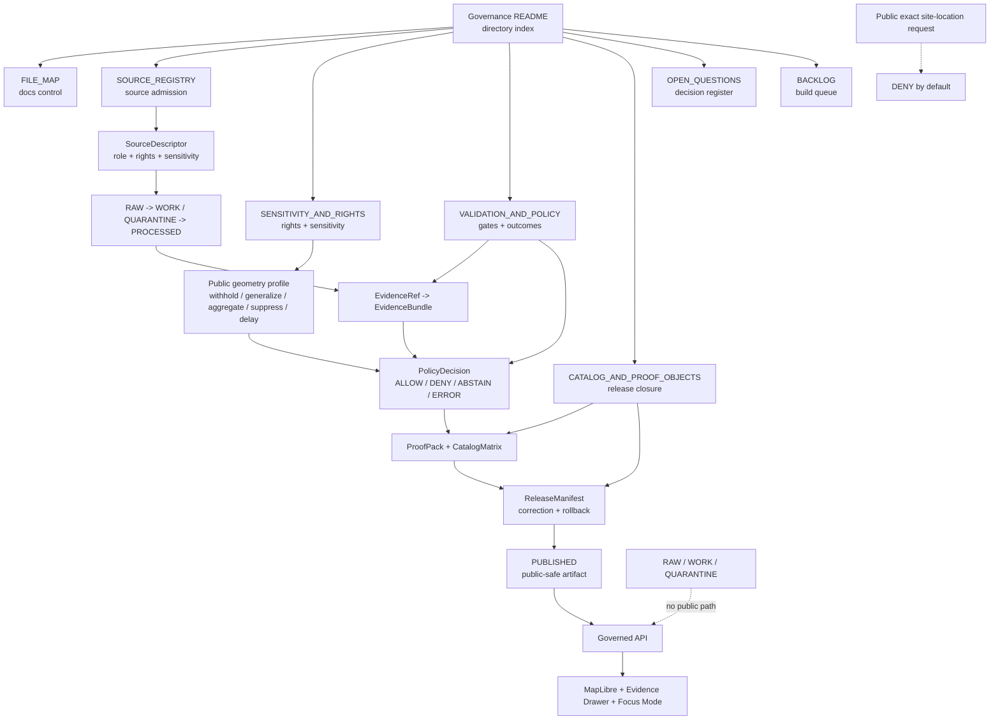

<!-- [KFM_META_BLOCK_V2]
doc_id: kfm://doc/NEEDS-VERIFICATION-docs-domains-archaeology-governance-readme
title: Archaeology Governance
type: standard
version: v1
status: draft
owners: TODO-NEEDS-OWNER
created: NEEDS-VERIFICATION-GIT-HISTORY
updated: 2026-05-06
policy_label: NEEDS-VERIFICATION-public-or-restricted
related: [../README.md, ../architecture/ARCHITECTURE.md, ../architecture/DOMAIN_MODEL.md, ../architecture/API_AND_UI_SURFACES.md, ./FILE_MAP.md, ./SOURCE_REGISTRY.md, ./SENSITIVITY_AND_RIGHTS.md, ./VALIDATION_AND_POLICY.md, ./CATALOG_AND_PROOF_OBJECTS.md, ./OPEN_QUESTIONS.md, ./BACKLOG.md, ../operations/DATA_LIFECYCLE.md, ../operations/PROMOTION_AND_ROLLBACK.md, ../operations/RUNBOOK.md, ../CHANGELOG.md, ../../../adr/ADR-0009-sensitive-location-policy.md, ../../../adr/ADR-0014-truth-path.md, ../../../doctrine/lifecycle-law.md, ../../../architecture/governed-api.md, ../../../security/public-surface-boundary.md]
tags: [kfm, archaeology, governance, sensitivity, rights, source-registry, validation, policy, catalog, proof, release, rollback]
notes: [Target README path was confirmed in GitHub main, but current content was effectively empty before this revision; doc_id, owner, created date, policy label, CODEOWNERS mapping, executable schema/policy/test/CI enforcement, live source rights, runtime surfaces, release objects, and steward review protocol remain NEEDS VERIFICATION.]
[/KFM_META_BLOCK_V2] -->

<a id="top"></a>

# Archaeology Governance

Governance index for archaeology source admission, sensitivity, rights, validation, catalog/proof closure, open decisions, and backlog control.

> [!NOTE]
> **Status:** `experimental`  
> **Document status:** `draft`  
> **Owners:** `TODO-NEEDS-OWNER`  
> **Path:** `docs/domains/archaeology/governance/README.md`  
> **Owning root:** `docs/` — human-facing control plane and domain documentation  
> **Current file role:** directory README for the archaeology governance subfolder  
> **Quick jumps:** [Scope](#scope) · [Repo fit](#repo-fit) · [Accepted inputs](#accepted-inputs) · [Exclusions](#exclusions) · [Directory tree](#directory-tree) · [Governance surfaces](#governance-surfaces) · [Decision map](#decision-map) · [Operating rules](#operating-rules) · [Validation handoffs](#validation-handoffs) · [Quickstart](#quickstart) · [Definition of done](#definition-of-done) · [Open verification](#open-verification)


> [!WARNING]
> Archaeology is a high-sensitivity KFM lane. Exact public archaeological site locations are **denied by default**. Public output requires evidence support, source-role fit, rights review, sensitivity review, public-safe geometry treatment, release proof, correction path, and rollback target.

> [!IMPORTANT]
> This folder is a governance surface, not a publication surface. These Markdown files help reviewers reason about source admission, sensitivity, validation, policy, catalog/proof closure, unresolved decisions, and build backlog. They do **not** by themselves activate sources, publish artifacts, enforce policy, prove CI, or certify runtime behavior.

---

## Scope

This README orients maintainers and reviewers inside:

```text
docs/domains/archaeology/governance/
```

It explains how the archaeology governance documents fit together and where their responsibilities stop.

This directory covers:

- human source-admission guidance;
- rights and sensitivity controls;
- public geometry and exact-location denial posture;
- validation and policy expectations;
- catalog, proof, release, correction, and rollback closure;
- lane-local open questions;
- lane-local governance backlog;
- documentation control and update-impact mapping.

This directory does **not** contain raw archaeology records, exact site coordinates, executable schemas, policy code, validators, tests, source descriptors, release manifests, proof packs, API routes, UI components, dashboards, runtime logs, or publication approvals.

[Back to top](#top)

---

## Repo fit

| Relationship | Path | Status | Role |
|---|---|---:|---|
| Current README | `docs/domains/archaeology/governance/README.md` | `CONFIRMED path / revised content` | Governance subfolder landing page |
| Lane landing page | [`../README.md`](../README.md) | `CONFIRMED` | Archaeology lane orientation, trust posture, inputs, exclusions, lifecycle, and runtime expectations |
| Architecture boundary | [`../architecture/ARCHITECTURE.md`](../architecture/ARCHITECTURE.md) | `CONFIRMED` | Lane architecture, lifecycle boundary, source roles, public geometry posture, runtime surfaces |
| Domain model | [`../architecture/DOMAIN_MODEL.md`](../architecture/DOMAIN_MODEL.md) | `CONFIRMED` | Archaeology object families, relationships, temporal model, geometry profiles |
| API/UI companion | [`../architecture/API_AND_UI_SURFACES.md`](../architecture/API_AND_UI_SURFACES.md) | `CONFIRMED` | Governed API, MapLibre, Evidence Drawer, Focus Mode, story/export surface guidance |
| Operations | [`../operations/`](../operations/) | `CONFIRMED` | Data lifecycle, promotion/rollback, and runbook guidance |
| Change history | [`../CHANGELOG.md`](../CHANGELOG.md) | `CONFIRMED` | Archaeology documentation change history |

### Directory Rules basis

This README belongs under `docs/domains/archaeology/governance/` because it is human-facing domain governance documentation. Under KFM Directory Rules, domain names should not become root folders. Domain-specific machine and runtime surfaces belong under responsibility roots such as `schemas/`, `contracts/`, `policy/`, `tests/`, `fixtures/`, `tools/`, `apps/`, `data/`, and `release/`.

| Concern | Proper responsibility root | Status for archaeology-specific implementation |
|---|---|---:|
| Human governance docs | `docs/` | `CONFIRMED` for this documentation surface |
| Machine source descriptors | `data/registry/` | `NEEDS VERIFICATION` |
| Semantic contracts | `contracts/` | `NEEDS VERIFICATION` |
| Machine schemas | `schemas/` | `NEEDS VERIFICATION` |
| Policy-as-code | `policy/` | `NEEDS VERIFICATION` |
| Fixtures and tests | `fixtures/`, `tests/` | `NEEDS VERIFICATION` |
| Validators and scripts | `tools/`, `scripts/`, `packages/` | `NEEDS VERIFICATION` |
| API and UI runtime | `apps/`, `web/`, `ui/`, or repo-confirmed runtime roots | `NEEDS VERIFICATION` |
| Receipts, proofs, catalog, published data | `data/receipts/`, `data/proofs/`, `data/catalog/`, `data/published/` | `NEEDS VERIFICATION` |
| Release state and rollback | `release/` or repo-confirmed release root | `NEEDS VERIFICATION` |

[Back to top](#top)

---

## Accepted inputs

Use this folder for governance guidance and review control.

| Accepted input | Belongs here when it… | Primary file |
|---|---|---|
| Source admission guidance | Defines what source descriptors must say before archaeology sources can enter governed intake | [`SOURCE_REGISTRY.md`](./SOURCE_REGISTRY.md) |
| Source-role vocabulary | Separates field, archival, lab, steward, regulatory, remote-sensing, collection, and derived-public support | [`SOURCE_REGISTRY.md`](./SOURCE_REGISTRY.md) |
| Rights and sensitivity rules | Explains unknown-rights denial, exact-location denial, steward review, public geometry classes, and release requirements | [`SENSITIVITY_AND_RIGHTS.md`](./SENSITIVITY_AND_RIGHTS.md) |
| Validation and policy gates | Defines denial, abstention, evidence closure, public DTO safety, citation validation, release readiness, and rollback checks | [`VALIDATION_AND_POLICY.md`](./VALIDATION_AND_POLICY.md) |
| Catalog/proof/release expectations | Explains EvidenceBundle, PolicyDecision, ReviewRecord, ProofPack, CatalogMatrix, ReleaseManifest, CorrectionNotice, and RollbackCard closure | [`CATALOG_AND_PROOF_OBJECTS.md`](./CATALOG_AND_PROOF_OBJECTS.md) |
| Documentation control | Maps confirmed docs, planned surfaces, handoffs, update rules, and anti-drift checks | [`FILE_MAP.md`](./FILE_MAP.md) |
| Unresolved decisions | Tracks owner, schema home, source activation, stewardship protocol, public thresholds, API/UI path, CI, release, and rollback questions | [`OPEN_QUESTIONS.md`](./OPEN_QUESTIONS.md) |
| Build and verification tasks | Orders control-plane blockers, executable proof, release hardening, incident drills, and domain growth | [`BACKLOG.md`](./BACKLOG.md) |

[Back to top](#top)

---

## Exclusions

| Does not belong here | Correct home | Why |
|---|---|---|
| Real exact archaeological coordinates | Restricted/steward-only governed data store | Public governance docs must never become a disclosure surface |
| RAW source-native records | `data/raw/archaeology/` or repo-confirmed RAW home | Source-native material must preserve lifecycle state and access controls |
| WORK transforms, OCR, georeferencing drafts, QA outputs, candidate anomalies | `data/work/archaeology/` or repo-confirmed WORK home | Working material requires receipts and validation state |
| Rights-unclear or sensitive review-pending material | `data/quarantine/archaeology/` or repo-confirmed quarantine home | Unknown rights or sensitivity fails closed |
| SourceDescriptor instances | `data/registry/` or repo-confirmed source registry home | This folder explains source admission; it does not store machine registry truth |
| JSON Schemas or OpenAPI | `schemas/` and/or repo-confirmed schema home | Machine shape must be executable and versioned |
| Human semantic contracts | `contracts/` or repo-confirmed contract home | Object meaning belongs in contracts, not a directory README |
| Executable policy | `policy/` or repo-confirmed policy home | Admissibility must be testable |
| Validators, scripts, implementation helpers | `tools/`, `scripts/`, `packages/`, or repo-confirmed homes | Enforcement does not belong in prose |
| Receipts, proof packs, release manifests, rollback cards, catalog records | `data/receipts/`, `data/proofs/`, `data/catalog/`, `release/`, or repo-confirmed homes | Emitted trust objects are artifacts, not documentation |
| API route handlers or UI components | `apps/`, `web/`, `ui/`, or repo-confirmed runtime roots | Runtime surfaces consume governed state; they are not governance Markdown |
| AI-generated archaeology claims | Governed runtime envelope with evidence, policy, citations, and finite outcome | Generated text is interpretive, not source truth |

[Back to top](#top)

---

## Directory tree

```text
docs/domains/archaeology/governance/
├── README.md                    # this governance directory index
├── BACKLOG.md                   # prioritized governance and verification work queue
├── CATALOG_AND_PROOF_OBJECTS.md # catalog/proof/release/correction/rollback closure
├── FILE_MAP.md                  # documentation control and update-impact map
├── OPEN_QUESTIONS.md            # active decision register
├── SENSITIVITY_AND_RIGHTS.md    # rights, sensitivity, public geometry, denial controls
├── SOURCE_REGISTRY.md           # human source-admission and source-role guide
└── VALIDATION_AND_POLICY.md     # validation gates, finite outcomes, mandatory denials
```

> [!NOTE]
> This tree is confirmed for the documentation surface. It does not prove executable schemas, policy code, validators, CI workflows, route handlers, UI components, release manifests, proof packs, or runtime enforcement.

[Back to top](#top)

---

## Governance surfaces

| File | What it owns | What it must not own | Update when… |
|---|---|---|---|
| [`README.md`](./README.md) | Governance directory orientation, repo fit, accepted inputs, exclusions, navigation, and high-level gate map | Machine registry, executable policy, source data, runtime proof | Any governance file is added, moved, renamed, deprecated, or materially changes role |
| [`SOURCE_REGISTRY.md`](./SOURCE_REGISTRY.md) | Human source-admission rules, descriptor minimums, source roles, activation states, rights/sensitivity review expectations | Source-native payloads or machine descriptor instances | Source family, source role, descriptor minimum, rights review, or activation posture changes |
| [`SENSITIVITY_AND_RIGHTS.md`](./SENSITIVITY_AND_RIGHTS.md) | Exact-location denial, rights matrix, sensitivity classes, public geometry policy, steward review, denial triggers | Executable policy or real restricted content | Public geometry classes, sensitivity rules, rights posture, or release controls change |
| [`VALIDATION_AND_POLICY.md`](./VALIDATION_AND_POLICY.md) | Validation law, gates, outcomes, mandatory denials, public output rules, fixture/validator expectations | Policy-as-code, schemas, runtime claims | Gate logic, reason codes, public DTO rules, citation requirements, Focus Mode behavior, or release checks change |
| [`CATALOG_AND_PROOF_OBJECTS.md`](./CATALOG_AND_PROOF_OBJECTS.md) | EvidenceBundle, PolicyDecision, ReviewRecord, ProofPack, CatalogMatrix, ReleaseManifest, CorrectionNotice, RollbackCard expectations | Release authority or emitted proof objects | Proof, catalog, release, correction, rollback, or closure requirements change |
| [`FILE_MAP.md`](./FILE_MAP.md) | Confirmed docs, planned/unverified surfaces, handoff map, update rules, file-status promotion checks | Source registry, schema registry, or implementation proof | Any file ownership, path, status, handoff, or update rule changes |
| [`OPEN_QUESTIONS.md`](./OPEN_QUESTIONS.md) | Decision register for unresolved owners, schema home, source activation, review protocol, thresholds, API/UI paths, CI, release, rollback | Issue tracker replacement or hidden decision record | A question is answered, superseded, converted to ADR, or newly discovered |
| [`BACKLOG.md`](./BACKLOG.md) | Prioritized work queue for control-plane blockers, executable proof, release hardening, incident drills, and growth | Evidence of implementation by itself | Governance task state, priority, dependency, or definition of done changes |

[Back to top](#top)

---

## Decision map



[Back to top](#top)

---

## Operating rules

| Rule | Consequence |
|---|---|
| Exact public archaeological site geometry is denied by default. | Public outputs use withheld, generalized, aggregated, redacted, suppressed, delayed, or otherwise approved public-safe representation. |
| Unknown rights block public release. | Rights-unclear material stays held, quarantined, or restricted until review resolves use and redistribution. |
| Unknown sensitivity blocks public release. | Missing sensitivity classification is not treated as safe. |
| Source role is load-bearing. | Field, lab, archival, steward, regulatory, remote-sensing, collection, and derived-public sources cannot be collapsed into one authority type. |
| Candidate features are not confirmed sites. | LiDAR, aerial, satellite, geophysical, ML, model, or anomaly outputs stay candidate-only until evidence and review support a stronger claim. |
| Evidence resolves before explanation. | Consequential claims require `EvidenceRef -> EvidenceBundle` or return `ABSTAIN`, `DENY`, or `ERROR`. |
| Public geometry transforms require receipts. | Generalization, suppression, aggregation, withholding, redaction, or delay must be auditable. |
| Receipts are not proof. | A RunReceipt or TransformReceipt records process evidence, but release requires proof and manifest closure. |
| Catalog records are not release approval. | Catalog discoverability does not authorize publication. |
| Promotion is a governed state transition. | Release requires validation, policy, review, proof, release manifest, correction path, and rollback target. |
| UI and AI are downstream. | MapLibre, Evidence Drawer, Focus Mode, stories, exports, graph/search/vector projections, and optional 3D scenes consume governed payloads and released artifacts only. |

> [!CAUTION]
> A public map can leak a restricted site even if the point is visually hidden. Check fields, centroids, bounding boxes, tile coordinates, source IDs, timestamps, graph edges, search indexes, catalog metadata, screenshots, exports, Evidence Drawer payloads, and Focus Mode context for reconstruction risk.

[Back to top](#top)

---

## Validation handoffs

| Gate family | Governance file | Downstream handoff | Enforcement status |
|---|---|---|---:|
| Source descriptor completeness | [`SOURCE_REGISTRY.md`](./SOURCE_REGISTRY.md) | `data/registry/`, schema fixtures, source validators | `NEEDS VERIFICATION` |
| Rights review | [`SENSITIVITY_AND_RIGHTS.md`](./SENSITIVITY_AND_RIGHTS.md) | policy rules, source descriptors, release checks | `NEEDS VERIFICATION` |
| Sensitivity classification | [`SENSITIVITY_AND_RIGHTS.md`](./SENSITIVITY_AND_RIGHTS.md) | policy rules, public DTO tests, layer manifests, transform receipts | `NEEDS VERIFICATION` |
| Source-role support | [`SOURCE_REGISTRY.md`](./SOURCE_REGISTRY.md), [`VALIDATION_AND_POLICY.md`](./VALIDATION_AND_POLICY.md) | EvidenceBundle resolver, policy checks, drawer/focus payloads | `NEEDS VERIFICATION` |
| Evidence closure | [`VALIDATION_AND_POLICY.md`](./VALIDATION_AND_POLICY.md) | EvidenceBundle schemas, fixtures, citation validator | `NEEDS VERIFICATION` |
| Candidate-feature boundary | [`SOURCE_REGISTRY.md`](./SOURCE_REGISTRY.md), [`VALIDATION_AND_POLICY.md`](./VALIDATION_AND_POLICY.md) | candidate-feature schemas, policy tests, review records | `NEEDS VERIFICATION` |
| Public geometry transform | [`SENSITIVITY_AND_RIGHTS.md`](./SENSITIVITY_AND_RIGHTS.md), [`CATALOG_AND_PROOF_OBJECTS.md`](./CATALOG_AND_PROOF_OBJECTS.md) | transform receipts, public layer checks, release manifests | `NEEDS VERIFICATION` |
| Public payload no-leak | [`VALIDATION_AND_POLICY.md`](./VALIDATION_AND_POLICY.md) | API contract tests, layer tests, Evidence Drawer tests, Focus Mode tests | `NEEDS VERIFICATION` |
| Catalog/proof closure | [`CATALOG_AND_PROOF_OBJECTS.md`](./CATALOG_AND_PROOF_OBJECTS.md) | CatalogMatrix, ProofPack, ReleaseManifest, digests | `NEEDS VERIFICATION` |
| Correction and rollback | [`CATALOG_AND_PROOF_OBJECTS.md`](./CATALOG_AND_PROOF_OBJECTS.md), [`../operations/PROMOTION_AND_ROLLBACK.md`](../operations/PROMOTION_AND_ROLLBACK.md) | CorrectionNotice, RollbackCard, release withdrawal drills | `NEEDS VERIFICATION` |

### Mandatory negative-path fixtures

At minimum, archaeology governance should be backed by fixtures for:

- public exact site point → `DENY`;
- burial, sacred, human-remains, culturally sensitive, private-land, or collection-security exact location in public payload → `DENY`;
- unknown-rights source in public release candidate → `DENY`;
- unresolved sensitivity in public release candidate → `DENY`;
- candidate anomaly promoted as confirmed site without review → `DENY`;
- public generalized geometry without transform receipt → `DENY`;
- public DTO containing RAW, WORK, QUARANTINE, restricted-store, graph-internal, vector-index, or model-runtime reference → `DENY`;
- Evidence Drawer payload revealing restricted precision → `DENY`;
- Focus Mode exact-location request returning an answer → `DENY`;
- consequential claim without resolvable EvidenceBundle → `ABSTAIN` or `DENY`;
- release manifest without rollback target → block promotion.

[Back to top](#top)

---

## Quickstart

Use this sequence after mounting or otherwise accessing the real repository. These commands are read-only unless a later step intentionally edits files.

```bash
# Confirm active repository state.
git status --short
git branch --show-current || true
git rev-parse --show-toplevel || true

# Inspect this governance surface.
find docs/domains/archaeology/governance -maxdepth 2 -type f | sort

# Inspect adjacent archaeology docs.
find docs/domains/archaeology -maxdepth 3 -type f | sort

# Look for archaeology-specific machine/runtime handoffs without assuming they exist.
find data/registry \
     contracts \
     schemas \
     policy \
     fixtures \
     tests \
     tools \
     apps \
     release \
     data/receipts \
     data/proofs \
     data/catalog \
     -maxdepth 5 -type f 2>/dev/null \
  | grep -Ei 'archaeology|sensitive|location|evidence|release|rollback|catalog|proof|policy' \
  | sort
```

After repo-native homes are verified, the first safe executable slice should be no-network and fixture-first.

```bash
# PROPOSED only — replace with repo-native commands after verification.
python tools/validators/archaeology/run_all.py \
  --fixtures tests/fixtures/archaeology

python tools/validators/archaeology/validate_no_sensitive_public_fields.py
python tools/validators/archaeology/validate_no_raw_public_refs.py
python tools/validators/archaeology/validate_catalog_closure.py
python tools/validators/archaeology/validate_focus_payload.py

python -m pytest tests/archaeology tests/fixtures/archaeology
```

> [!WARNING]
> Do not activate live archaeology connectors, public map layers, exact-site publication, Focus Mode answers, exports, or story surfaces until source rights, steward review, sensitivity classification, public geometry profiles, fixtures, policy gates, catalog closure, release manifests, correction paths, and rollback targets are verified.

[Back to top](#top)

---

## Definition of done

A revision to this governance README is ready for review when:

- [ ] KFM Meta Block V2 is present and unresolved values are explicit.
- [ ] Status, owners, path, owning root, and policy label are visible.
- [ ] README-like minimums are present: title, one-line purpose, repo fit, accepted inputs, and exclusions.
- [ ] Directory Rules placement is preserved under `docs/domains/archaeology/governance/`.
- [ ] Confirmed governance files are linked with relative links from this directory.
- [ ] Machine/runtime handoffs are routed to responsibility roots and labeled `NEEDS VERIFICATION` unless verified.
- [ ] Exact public archaeological site-location denial is visible near the top.
- [ ] Unknown rights and unknown sensitivity fail closed.
- [ ] Candidate features are kept distinct from confirmed archaeological sites.
- [ ] `EvidenceRef -> EvidenceBundle` is required for consequential claims.
- [ ] Public geometry transforms require receipts.
- [ ] Catalog, proof, release, correction, and rollback closure are visible.
- [ ] MapLibre, Evidence Drawer, Focus Mode, stories, exports, graph/search/vector projections, and optional 3D scenes are downstream of governed API and released artifacts.
- [ ] No executable enforcement, schema, policy, CI, route, UI, dashboard, release, or runtime claim is made without direct evidence.
- [ ] `FILE_MAP.md`, `OPEN_QUESTIONS.md`, `BACKLOG.md`, and `CHANGELOG.md` are updated if this README changes file ownership, status, scope, or governance role.

[Back to top](#top)

---

## Open verification

| Item | Status | Why it matters |
|---|---:|---|
| Stable `doc_id` | `NEEDS VERIFICATION` | Required for document registry and durable cross-references |
| Owner / CODEOWNERS mapping | `TODO-NEEDS-OWNER` | Required for review routing, source activation, policy decisions, and release escalation |
| Created date | `NEEDS VERIFICATION-GIT-HISTORY` | Should come from Git history or document registry |
| Policy label | `NEEDS VERIFICATION` | Determines whether this README is public, restricted, or mixed |
| Machine registry layout | `NEEDS VERIFICATION` | Prevents parallel source descriptor homes |
| Schema-home ADR and archaeology schema path | `NEEDS VERIFICATION` | Prevents `contracts/` vs `schemas/` authority drift |
| Policy runtime and policy path | `UNKNOWN` | Required before claiming exact-location denial is executable |
| Fixture and test homes | `UNKNOWN` | Required before claiming regression coverage |
| Validator language and commands | `UNKNOWN` | Required before claiming local enforcement |
| Governed API path | `UNKNOWN` | Prevents invented route names |
| MapLibre / Evidence Drawer / Focus Mode implementation paths | `UNKNOWN` | Prevents UI path drift and trust-surface bypass |
| Release manifest / proof pack / catalog implementation | `UNKNOWN` | Publication maturity cannot be claimed from docs alone |
| Stewardship, tribal, cultural, rights, landowner, and collection review protocol | `NEEDS VERIFICATION` | Required before sensitive source activation or public derivatives |
| Public generalization thresholds | `NEEDS VERIFICATION` | Required before public archaeology layers or exports |
| CI workflow enforcement | `UNKNOWN` | Existing workflows were not verified for this exact governance surface |
| Runtime logs, dashboards, deployment posture | `UNKNOWN` | Operational maturity is not established by Markdown |

[Back to top](#top)

---

## Appendix: reviewer cards

<details>
<summary><strong>Governance README review card</strong></summary>

```yaml
target_file: docs/domains/archaeology/governance/README.md
owning_root: docs/
domain_lane: archaeology

must_preserve:
  - exact public archaeology location DENY by default
  - unknown rights block public release
  - unknown sensitivity blocks public release
  - candidate features are not confirmed sites
  - EvidenceRef resolves to EvidenceBundle before consequential claims
  - public geometry transforms require receipts
  - release requires proof, correction path, and rollback target
  - public clients consume governed API / released artifacts only

check_before_merge:
  - relative links resolve
  - meta block values are synchronized or marked NEEDS VERIFICATION
  - no executable enforcement is claimed without evidence
  - no machine/runtime homes are invented
  - adjacent FILE_MAP, OPEN_QUESTIONS, BACKLOG, and CHANGELOG impact is considered

rollback:
  - revert README changes
  - reopen any verification item incorrectly marked confirmed
  - restore prior navigation if a companion file was moved or renamed
```

</details>

<details>
<summary><strong>Anti-patterns this README should prevent</strong></summary>

| Anti-pattern | Why it fails | Correct response |
|---|---|---|
| Creating a root-level `archaeology/` folder | Violates responsibility-root directory law | Keep domain work under responsibility roots |
| Treating this README as a source registry | Prose guidance is not machine source truth | Put descriptor instances in repo-confirmed registry home |
| Treating this README as policy enforcement | Markdown cannot deny unsafe payloads by itself | Add policy-as-code, fixtures, validators, and CI |
| Publishing exact site points because a source is public | Public availability is not release permission | Deny exact public location unless reviewed exception exists |
| Treating remote-sensing anomalies as sites | Candidate evidence is not confirmation | Preserve candidate state and require evidence/review |
| Hiding restricted fields in UI while API still emits them | UI filtering is not a safety boundary | Emit only public-safe DTOs from governed API |
| Using catalog metadata as proof | Catalog records are discoverability objects | Require proof pack and release manifest |
| Letting Focus Mode answer from model memory | Generated text is not evidence | Scope to released EvidenceBundles and validate citations |
| Correcting by overwriting a public artifact | Erases lineage | Issue CorrectionNotice and preserve rollback path |

</details>

[Back to top](#top)
