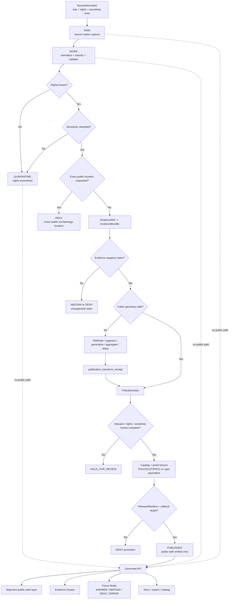

<!-- [KFM_META_BLOCK_V2]
doc_id: kfm://doc/NEEDS-VERIFICATION-docs-domains-archaeology-governance-sensitivity-and-rights
title: Archaeology Sensitivity and Rights
type: standard
version: v1
status: draft
owners: TODO-NEEDS-OWNER
created: TODO-NEEDS-GIT-HISTORY
updated: 2026-05-06
policy_label: NEEDS-VERIFICATION-public-or-restricted
related: [../README.md, ../architecture/ARCHITECTURE.md, ../architecture/DOMAIN_MODEL.md, ./SOURCE_REGISTRY.md, ./VALIDATION_AND_POLICY.md, ./CATALOG_AND_PROOF_OBJECTS.md, ./FILE_MAP.md, ./OPEN_QUESTIONS.md, ../operations/RUNBOOK.md, ../../../doctrine/lifecycle-law.md, ../../../adr/ADR-0009-sensitive-location-policy.md, ../../../architecture/governed-api.md, ../../../security/public-surface-boundary.md, ../../../runbooks/publication.md]
tags: [kfm, archaeology, sensitivity, rights, geoprivacy, cultural-heritage, steward-review, public-safe-geometry, exact-location-denial]
notes: [Existing file revised from a thin sensitivity-and-rights stub into a governed release-control document. doc_id, owner, created date, policy label, executable policy home, schema home, CI enforcement, live source rights, steward review protocol, and public generalization thresholds remain NEEDS VERIFICATION.]
[/KFM_META_BLOCK_V2] -->

<a id="top"></a>

# Archaeology Sensitivity and Rights

Rights, sensitivity, public-geometry, steward-review, and release-control rules for archaeology material in KFM.

<p align="center">
  
  
  
  
  
  
</p>

<p align="center">
  <a href="#status-and-reading-rule">Status</a> ·
  <a href="#scope">Scope</a> ·
  <a href="#repo-fit">Repo fit</a> ·
  <a href="#accepted-inputs">Inputs</a> ·
  <a href="#exclusions">Exclusions</a> ·
  <a href="#sensitivity-classes">Sensitivity</a> ·
  <a href="#rights-and-release-matrix">Rights</a> ·
  <a href="#public-geometry-policy">Public geometry</a> ·
  <a href="#denial-triggers">Denials</a> ·
  <a href="#governed-flow">Flow</a> ·
  <a href="#definition-of-done">Done</a>
</p>

> [!WARNING]
> **Archaeology fails closed.** Exact public archaeological site locations are denied by default. Unknown rights, unresolved stewardship, unclear sensitivity, missing EvidenceBundle support, missing public-geometry transform receipt, or missing rollback path blocks public release.

---

## Status and reading rule

| Field | Value |
|---|---|
| Target path | `docs/domains/archaeology/governance/SENSITIVITY_AND_RIGHTS.md` |
| Owning root | `docs/` — human-facing doctrine and governance explanation |
| Lane | `archaeology` |
| Document role | Sensitivity, rights, public geometry, release, and denial control document |
| Status | `draft` |
| Current enforcement maturity | `NEEDS VERIFICATION` |
| Default public exact-location posture | `DENY` |
| Default unknown-rights posture | `DENY public release` / `QUARANTINE` candidate use |
| Runtime posture | Governed API and released public-safe artifacts only |
| Maintenance rule | Update this file whenever archaeology rights, sensitivity, public geometry, review, publication, catalog/proof, API/UI exposure, Focus Mode behavior, correction, or rollback behavior changes |

This file is a **standard governance document**. It explains archaeology sensitivity and rights rules. It does **not** by itself implement policy-as-code, validators, schemas, CI gates, release manifests, API middleware, MapLibre filtering, Evidence Drawer payload checks, or Focus Mode enforcement.

Use the narrowest truth label available:

| Label | Use |
|---|---|
| `CONFIRMED` | Verified from current repo evidence, adjacent docs, current-session command output, or governing KFM doctrine. |
| `PROPOSED` | Recommended implementation, file home, gate, fixture, schema, or rule not yet verified as active enforcement. |
| `UNKNOWN` | Not verified from current repo files, tests, workflows, runtime logs, dashboards, release artifacts, or steward records. |
| `NEEDS VERIFICATION` | Checkable item that must be confirmed before implementation or publication relies on it. |
| `DENY` | Policy blocks the requested action. |
| `ABSTAIN` | Evidence, scope, rights, or source-role support is insufficient for a claim. |
| `ERROR` | A system, schema, resolver, validator, catalog, release, or runtime failure prevents trustworthy handling. |

[Back to top](#top)

---

## Scope

This file governs how archaeology material is classified, held, transformed, released, explained, corrected, or denied when rights or sensitivity matter.

It covers:

- exact archaeological site locations;
- burial, human-remains, sacred-site, culturally sensitive, steward-controlled, or community-restricted knowledge;
- private landowner, access-route, parcel-linked, or collection-security exposure;
- looting-prone site details;
- source rights, redistribution, attribution, consent, and controlled-access terms;
- public geometry treatment: withheld, generalized, aggregated, suppressed, delayed, or explicitly allowed;
- public DTO, MapLibre layer, Evidence Drawer, Focus Mode, story, export, search, graph, vector-index, catalog, and screenshot exposure;
- transform receipts, policy decisions, review records, release manifests, correction notices, and rollback cards.

It preserves the original file’s core rules and expands them into a reviewable release-control surface.

### Core law

```text
Unknown rights          -> DENY public release
Unknown sensitivity     -> DENY public release
Exact public site point -> DENY by default
Missing EvidenceBundle  -> ABSTAIN / DENY
Missing transform proof -> DENY release
Missing rollback target -> DENY promotion
```

[Back to top](#top)

---

## Repo fit

| Relationship | Path | Status | Role |
|---|---|---:|---|
| Lane landing page | [`../README.md`](../README.md) | `CONFIRMED` | Archaeology lane overview and fail-closed posture |
| Architecture boundary | [`../architecture/ARCHITECTURE.md`](../architecture/ARCHITECTURE.md) | `CONFIRMED` | Lifecycle, governed serving, and public-location boundary |
| Domain model | [`../architecture/DOMAIN_MODEL.md`](../architecture/DOMAIN_MODEL.md) | `CONFIRMED` | Archaeology object families, geometry profiles, and public-safe representation |
| Source registry companion | [`./SOURCE_REGISTRY.md`](./SOURCE_REGISTRY.md) | `CONFIRMED` | Source descriptor minimums, source roles, and activation states |
| Validation and policy | [`./VALIDATION_AND_POLICY.md`](./VALIDATION_AND_POLICY.md) | `CONFIRMED` | Validation gates, policy outcomes, mandatory denials |
| Catalog and proof objects | [`./CATALOG_AND_PROOF_OBJECTS.md`](./CATALOG_AND_PROOF_OBJECTS.md) | `CONFIRMED` | Release closure set and proof expectations |
| File map | [`./FILE_MAP.md`](./FILE_MAP.md) | `CONFIRMED` | Human map of archaeology governance docs |
| Open questions | [`./OPEN_QUESTIONS.md`](./OPEN_QUESTIONS.md) | `CONFIRMED` | Owner, schema-home, review, API/UI, and threshold gaps |
| Runbook | [`../operations/RUNBOOK.md`](../operations/RUNBOOK.md) | `CONFIRMED` | Safe first-run and incident-handling checklist |
| Lifecycle doctrine | [`../../../doctrine/lifecycle-law.md`](../../../doctrine/lifecycle-law.md) | `CONFIRMED` | Shared KFM lifecycle law |
| Sensitive-location ADR | [`../../../adr/ADR-0009-sensitive-location-policy.md`](../../../adr/ADR-0009-sensitive-location-policy.md) | `CONFIRMED` | Cross-domain exact-location default-deny policy |
| Governed API | [`../../../architecture/governed-api.md`](../../../architecture/governed-api.md) | `CONFIRMED path from repo search; content not revalidated in this edit` | API trust membrane and finite outward response boundary |
| Public surface boundary | [`../../../security/public-surface-boundary.md`](../../../security/public-surface-boundary.md) | `CONFIRMED` | Fail-closed public-surface warning |
| Publication runbook | [`../../../runbooks/publication.md`](../../../runbooks/publication.md) | `CONFIRMED` | Promotion, release, correction, withdrawal, and rollback procedure |

### Directory Rules basis

This file belongs under `docs/domains/archaeology/governance/` because it is human-facing domain governance. It must point to machine-readable registries, schemas, policies, validators, fixtures, and emitted artifacts where those surfaces exist, but it must not become those surfaces and must not create a root-level `archaeology/` folder.

> [!NOTE]
> Machine homes for archaeology schemas, contracts, policy, fixtures, validators, release objects, and runtime routes remain `NEEDS VERIFICATION` unless directly confirmed in the active checkout.

[Back to top](#top)

---

## Accepted inputs

Use this file to classify and govern archaeology material before it can move toward public or semi-public release.

| Accepted input | Belongs here when it defines… | Required posture |
|---|---|---|
| Sensitivity class | Location, cultural, burial, landowner, collection, or misuse risk | Fail closed until classified |
| Rights posture | License, terms, permission, redistribution, access, consent, citation, or attribution | Unknown blocks public release |
| Public geometry treatment | Withholding, generalization, aggregation, suppression, delay, or explicit allow | Transform receipt required when geometry changes |
| Steward review burden | Cultural, tribal, community, agency, landowner, collection, domain, policy, or security review | Review required before release when triggered |
| Denial rule | Exact-location, source-role, rights, sensitivity, evidence, citation, catalog, public DTO, or rollback blocker | Finite `DENY`, `ABSTAIN`, or `ERROR` behavior |
| Release obligation | Required EvidenceBundle, PolicyDecision, ReviewRecord, ReleaseManifest, CorrectionNotice, or RollbackCard | Promotion blocked until closure |
| Public-surface warning | API, MapLibre, Evidence Drawer, Focus Mode, story, export, graph, search, vector, or catalog leak risk | Public payload allowlist required |
| Incident rule | Suspected disclosure, wrong release class, rights change, source withdrawal, or policy change | Disable release, issue correction, execute rollback |

---

## Exclusions

| Excluded material | Why it does not belong here | Put it instead |
|---|---|---|
| Real exact archaeological coordinates | This public governance doc must not become a leak vector | Restricted/steward-only governed data store |
| Source-native payloads, reports, rasters, shapefiles, point clouds, scans, or spreadsheets | This file is prose governance, not data storage | `data/raw/archaeology/` or repo-confirmed RAW equivalent |
| Working transforms, georeferencing drafts, extraction output, candidate anomalies, or QA files | WORK products require receipts and validation state | `data/work/archaeology/` or repo-confirmed WORK equivalent |
| Rights-unclear, unsafe, or review-pending material | Must fail closed with reason and disposition | `data/quarantine/archaeology/` or repo-confirmed quarantine equivalent |
| Machine SourceDescriptor instances | This file explains rules; descriptors belong in the registry | `data/registry/…` after convention verification |
| Executable policy rules | Prose cannot enforce gates | `policy/` or repo-confirmed policy home |
| JSON Schema, OpenAPI, or semantic contracts | Machine and semantic contracts need versioned homes | `schemas/` and `contracts/` or repo-confirmed equivalents |
| Receipts, proof packs, release manifests, rollback cards, catalog records | Emitted governance artifacts must remain auditable | `data/receipts/`, `data/proofs/`, `data/catalog/`, `release/`, or repo-confirmed equivalents |
| Live source credentials, private steward contacts, or collection-security details | Documentation must not leak sensitive access paths | Secret manager, restricted runbook, or steward-only channel |
| AI-generated archaeology claims | Generated text is not evidence | Governed runtime envelope with resolved evidence, policy decision, and citations |

[Back to top](#top)

---

## Sensitivity classes

The original file named five high-sensitivity classes. This revision keeps them and expands the review matrix.

| Sensitivity class | Default public outcome | Why it matters | Required before any outward derivative |
|---|---:|---|---|
| Exact archaeological site geometry | `DENY` | Can enable looting, trespass, site damage, or unauthorized access | Approved public geometry profile and transform receipt |
| Burial or human remains | `DENY` | High cultural, legal, ethical, and steward-review burden | Steward/cultural/legal review; likely withholding |
| Sacred or culturally sensitive place | `DENY` | May expose restricted or steward-controlled knowledge | Permission, steward review, and public-safe narrative/generalized form |
| Looting-prone site detail | `DENY` | Can materially increase misuse risk | Suppression/generalization review and no reconstruction path |
| Private landowner identity, parcel linkage, access route, or permission detail | `DENY` | Privacy and security risk | Redaction, restriction, or public omission |
| Collection storage, accession-security, repository-security, or security-sensitive detail | `DENY` | Can expose collections, facilities, or vulnerable holdings | Restricted operations context only |
| Steward-controlled oral, cultural, tribal, sovereign, or community knowledge | `HOLD_FOR_REVIEW` / `DENY` | Permission, cultural protocol, or sovereignty may control disclosure | Explicit review and allowed outward form |
| Candidate-feature precision from LiDAR, aerial, satellite, geophysical, or model sources | `ABSTAIN` or `DENY` if treated as confirmed | Candidate evidence is not site confirmation | Candidate-only label, evidence limits, review state |
| Unknown sensitivity | `DENY` / `QUARANTINE` | Unknown risk cannot be public-safe by assumption | Sensitivity classification and review |
| Previously published but newly reclassified sensitive material | `WITHDRAW_OR_ROLLBACK` | Release state can become unsafe over time | Correction notice, release update, rollback or successor release |

> [!CAUTION]
> A record can be sensitive even when it does not contain a raw coordinate. Small polygons, centroids, bounding boxes, high-zoom tiles, repeated timestamps, source record IDs, access descriptions, screenshots, graph neighbors, or joined public layers can reconstruct restricted locations.

[Back to top](#top)

---

## Rights and release matrix

Rights are release gates, not documentation details.

| Rights posture | Public release | Internal use | Required action |
|---|---:|---:|---|
| `public_release_allowed` | Possible after sensitivity and evidence gates pass | Allowed within lifecycle controls | Preserve attribution, source role, release scope, and correction path |
| `public_summary_only` | Only public-safe summaries or metadata | Allowed within scope | Release only approved summary fields and safe geometry class |
| `restricted_use_only` | `DENY` public release | Role-gated internal or steward review only | Keep restricted; record review and access class |
| `permission_required` | `HOLD_FOR_REVIEW` | Hold or restricted review | Obtain permission or deny release |
| `steward_review_required` | `HOLD_FOR_REVIEW` | Role-gated review only | Record steward decision and allowed outward form |
| `unknown_rights` | `DENY` public release | `QUARANTINE` or hold | Resolve rights before use as release support |
| `incompatible_terms` | `DENY` | Usually deny or quarantine | Do not publish; record reason |
| `withdrawn_or_terms_changed` | `WITHDRAW_OR_ROLLBACK` if published | Reassess | Correction notice, release review, and rollback impact assessment |

### Rights minimums

A release candidate must identify:

- source identity and source role;
- license, terms, permission, consent, or access restriction;
- redistribution posture;
- attribution and citation obligations;
- source freshness and version;
- audience allowed;
- geographic and temporal scope allowed;
- public geometry precision allowed;
- derivative publication allowance;
- withdrawal, supersession, or terms-change handling.

> [!IMPORTANT]
> Public availability is not the same as KFM publication permission. A public website, scanned report, portal, or map service can still be unsuitable for public re-publication, public geometry release, or AI context use.

[Back to top](#top)

---

## Public geometry policy

Public archaeology geometry must be release-profiled. Public clients should receive only public-safe geometry and public-safe attributes.

| Public geometry class | Meaning | Release requirement |
|---|---|---|
| `withheld` | No public geometry emitted | PolicyDecision and safe explanation |
| `suppressed` | Sensitive location omitted from public artifact | Suppression reason, release scope, and rollback path |
| `generalized` | Geometry coarsened to approved public geography | Transform receipt, reviewer/policy basis, approved precision |
| `aggregated` | Output grouped to safe region or threshold | Aggregation receipt and reconstruction-risk check |
| `delayed` | Exposure embargoed or time-shifted | Embargo basis and release-time validation |
| `public_exact_allowed` | Exact public geometry allowed | Explicit rights, sensitivity, source role, reviewer support, and release proof; rare and visible |
| `no_public_release` | No public geometry or narrative location | Denial reason and restricted review path |

### Public geometry safety checks

Public release must inspect:

- raw geometry fields;
- alternate coordinate fields;
- centroids, bounding boxes, tile coordinates, source XY fields, and route/access descriptions;
- high-zoom tiles, screenshots, and exported map state;
- source record IDs that can be joined back to restricted location;
- timestamps or repeated observations that narrow location;
- nearby public layers that can triangulate the protected place;
- graph/search/vector fields that preserve restricted geometry or joins;
- Evidence Drawer, Focus Mode, story, and export payloads;
- STAC/DCAT/PROV/catalog metadata that may carry geometry or source URLs.

```text
Restricted exact support
  -> classify sensitivity
  -> choose public geometry class
  -> transform / withhold / suppress / aggregate / delay
  -> emit publication_transform_receipt
  -> validate no reconstruction path
  -> release only through governed API and release manifest
```

[Back to top](#top)

---

## Public-surface allowlist

Blocklists are not enough. Public archaeology payloads should be built from explicit allowlists.

| Surface | Allowed only when | Must never expose |
|---|---|---|
| Public API response | Release manifest allows audience and precision | RAW/WORK/QUARANTINE paths, restricted geometry, internal refs, private/steward IDs |
| MapLibre layer | Layer references released public-safe artifacts | Hidden point properties, unreviewed high-zoom detail, client-only filtering of restricted records |
| Evidence Drawer | Drawer fields are public-safe and evidence-backed | Restricted source rows, exact coordinates, collection-security details, private access details |
| Focus Mode | Context is released, public-safe, and citation-validated | Exact-location recovery, coordinate inference, access routes, uncited sensitive claims |
| Story / dossier | Narrative is release-bound and evidence-supported | Unreviewed certainty, screenshots with sensitive precision, source-sensitive identifiers |
| Export / share | Export manifest preserves trust metadata | Trust-stripped CSV/GeoJSON/tiles/screenshots that widen access or precision |
| Catalog / discovery | Catalog record is public-safe | Restricted geometry, sensitive source URLs, reconstruction clues |
| Graph / search / vector projection | Projection is derivative and field-allowlisted | Restricted geometry, source-native coordinates, private/steward keys |

[Back to top](#top)

---

## Denial triggers

The original file named four denial triggers. This revision preserves them and expands the release-control set.

| Trigger | Required outcome | Why |
|---|---|---|
| Unknown rights | `DENY` public release | Redistribution and exposure are unresolved |
| Unresolved stewardship, consent, cultural, tribal, community, agency, landowner, or collection review | `HOLD_FOR_REVIEW` or `DENY` | Review obligations are unresolved |
| Exact sensitive geometry in public payloads | `DENY` | Public exposure may cause harm |
| Unsupported claim lacking evidence references | `ABSTAIN`, `DENY`, or `ERROR` | Public claims must be inspectable |
| Public exact-site-location request | `DENY` | Exact archaeology locations fail closed |
| Burial, human remains, sacred-site, or culturally sensitive exact geometry in public payload | `DENY` | High-sensitivity classes require withholding or special review |
| Private landowner, access route, parcel-linked, or collection-security detail in public payload | `DENY` | Privacy and security risk |
| Candidate feature treated as confirmed site without review | `DENY` | Candidate evidence is not site confirmation |
| Missing public-geometry transform receipt | `DENY` release | Public-safe transformation must be auditable |
| EvidenceRef cannot resolve to EvidenceBundle | `ABSTAIN` or `DENY` | Evidence support is missing |
| Citation validation fails | `ABSTAIN` or `DENY` | Public text and Focus responses must cite support when needed |
| Public DTO references RAW, WORK, QUARANTINE, restricted store, model runtime, vector index, or graph internal directly | `DENY` | Breaks lifecycle law and trust membrane |
| Catalog/proof/release references do not close | `ERROR` or `DENY promotion` | Publication support is inconsistent |
| Release candidate lacks correction path or rollback target | `DENY promotion` | Published claims must be reversible |
| AI or Focus Mode tries to reveal or infer restricted exact location | `DENY` | AI is evidence-subordinate and policy-bound |

[Back to top](#top)

---

## Governed flow



[Back to top](#top)

---

## Review card

Use this card before any archaeology source, layer, public summary, story, export, catalog record, API payload, Evidence Drawer payload, or Focus Mode answer moves toward public or semi-public exposure.

| Review item | Required answer |
|---|---|
| Source identity | What source and source role support the material? |
| Rights posture | Are rights, terms, redistribution, attribution, consent, and access posture known? |
| Sensitivity posture | Does the material involve exact site geometry, burial/remains, sacred/cultural sensitivity, private land, collection security, looting risk, or steward-controlled knowledge? |
| Audience | Who can see the output: public, internal, restricted, steward-only, or role-gated? |
| Geometry profile | Is geometry withheld, suppressed, generalized, aggregated, delayed, public-exact, or not released? |
| Transform proof | Does any public-safe geometry transform have a receipt? |
| Evidence support | Do all consequential claims resolve `EvidenceRef -> EvidenceBundle`? |
| Source-role support | Is the source allowed to support the claim type being made? |
| Candidate status | Is any remote-sensing, LiDAR, aerial, satellite, geophysical, or model output clearly candidate-only? |
| Review requirement | Is cultural, tribal, community, agency, landowner, collection, rights, policy, or domain review required and complete? |
| Public payload allowlist | Are public fields explicitly allowlisted? |
| Catalog/proof closure | Do catalog, proof, policy, evidence, and release references close? |
| Correction path | How will errors be corrected, withdrawn, or superseded? |
| Rollback path | What release or artifact can be disabled, withdrawn, or restored? |
| User explanation | Can the UI explain withheld/generalized/denied status without leaking restricted detail? |

[Back to top](#top)

---

## Reason and obligation codes

Use these starter codes until the repo-wide reason-code and obligation-code registry confirms canonical names.

### Reason codes

| Code | Meaning |
|---|---|
| `archaeology.exact_location_denied` | Public output requested exact archaeological location. |
| `archaeology.sensitive_geometry_public` | Sensitive geometry appears in public surface. |
| `archaeology.burial_or_human_remains` | Burial or human-remains sensitivity blocks exposure. |
| `archaeology.sacred_or_cultural_sensitivity` | Sacred, cultural, or steward sensitivity requires withholding or review. |
| `archaeology.private_land_access_risk` | Output could expose private landowner, parcel, or access details. |
| `archaeology.collection_security_risk` | Output could expose storage, accession, repository, or collection vulnerability. |
| `archaeology.looting_risk` | Output increases looting or misuse risk. |
| `rights.unknown` | Rights or redistribution posture is unresolved. |
| `rights.incompatible_terms` | Source terms do not permit requested release. |
| `stewardship.review_missing` | Required steward, cultural, domain, landowner, or collection review is absent. |
| `source_role.inadequate` | Source role cannot support the requested claim. |
| `evidence.bundle_missing` | EvidenceRef cannot resolve to EvidenceBundle. |
| `citation.failed` | Citation validation failed. |
| `candidate_feature.not_reviewed` | Candidate feature is being treated as confirmed without review. |
| `public_payload.internal_ref` | Public payload contains internal lifecycle or restricted references. |
| `public_payload.field_not_allowed` | Public payload includes a field outside the allowlist. |
| `catalog.closure_failed` | Catalog, proof, release, and evidence references do not close. |
| `release.rollback_missing` | Release lacks rollback target. |
| `ai.coordinate_disclosure_denied` | AI or Focus Mode attempted to disclose or infer restricted precision. |
| `runtime.error` | Runtime or validator failure prevents trustworthy handling. |

### Obligation codes

| Code | Required action |
|---|---|
| `withhold_geometry` | Emit no public geometry. |
| `suppress_feature` | Omit sensitive feature from public output. |
| `generalize_geometry` | Reduce precision to an approved public-safe geography. |
| `aggregate_output` | Publish only grouped or thresholded output. |
| `delay_release` | Apply embargo or delayed public exposure. |
| `emit_transform_receipt` | Record restricted-to-public-safe transformation. |
| `require_rights_review` | Resolve rights before release. |
| `require_steward_review` | Route to steward, cultural, domain, landowner, or collection reviewer. |
| `resolve_evidence_bundle` | Resolve EvidenceRef before claim exposure. |
| `validate_citations` | Confirm citations support outward claims. |
| `field_allowlist` | Emit only approved public fields. |
| `record_policy_decision` | Store finite policy outcome and reason codes. |
| `record_review` | Attach ReviewRecord to release candidate. |
| `publish_correction_notice` | Issue visible correction, withdrawal, or supersession. |
| `execute_rollback_card` | Disable, withdraw, or restore release-facing artifacts. |

[Back to top](#top)

---

## Release requirements

The original file required:

- explicit rights or redistribution eligibility;
- reviewed public publication profile;
- approved geometry treatment;
- transform receipt linking restricted representation to public representation.

This revision preserves those requirements and adds the full release closure set.

A public or semi-public archaeology release must include:

| Required object or state | Purpose |
|---|---|
| `SourceDescriptor` | Source identity, role, authority limits, rights, cadence, access, and sensitivity hints |
| `EvidenceBundle` | Inspectable support for consequential claims |
| `RightsAssessment` or equivalent review state | Release, attribution, redistribution, consent, and terms posture |
| `SensitivityClassification` | Exact-location, cultural, burial, landowner, collection, looting, and public-precision posture |
| `PolicyDecision` | Finite allow/deny/abstain/error decision with reasons and obligations |
| `ReviewRecord` | Steward, cultural, domain, rights, policy, security, or release review when required |
| `publication_transform_receipt` | Required when geometry is withheld, generalized, aggregated, delayed, redacted, or suppressed |
| `ValidationReport` | Schema, evidence, rights, sensitivity, geometry, DTO, catalog, release, and rollback checks |
| `CatalogRecord` / `CatalogMatrix` | STAC/DCAT/PROV or repo-equivalent catalog/provenance closure |
| `ReleaseManifest` | Published artifact set, digests, scope, audience, policy refs, proof refs, and rollback links |
| `CorrectionNotice` path | Visible correction, withdrawal, or supersession mechanism |
| `RollbackCard` | Operational reversal or withdrawal target |

Promotion is blocked unless the release candidate can show the closure chain:

```text
SourceDescriptor
  -> EvidenceBundle
  -> RightsAssessment
  -> SensitivityClassification
  -> PolicyDecision
  -> ReviewRecord
  -> TransformReceipt
  -> ValidationReport
  -> Catalog/Proof closure
  -> ReleaseManifest
  -> CorrectionNotice path
  -> RollbackCard
```

[Back to top](#top)

---

## Fixtures and validators

> [!NOTE]
> Paths below are `PROPOSED / NEEDS VERIFICATION`. Adapt to repo-native schema, policy, fixture, validator, and CI conventions before creating files.

### Required fixture families

| Fixture family | Required case |
|---|---|
| Valid public generalized summary | Public-safe geometry, EvidenceBundle, transform receipt, policy decision, catalog closure, release manifest, rollback target |
| Invalid exact public site | Exact sensitive geometry appears in public API/layer/export payload; must deny |
| Invalid unknown rights | Source rights unresolved; must deny publication |
| Invalid missing steward review | Steward/cultural/domain review required but absent; must hold or deny |
| Invalid candidate promotion | LiDAR/geophysical/model candidate labeled as confirmed site; must deny |
| Invalid missing transform receipt | Public generalized output lacks transform receipt; must deny |
| Invalid EvidenceBundle gap | Consequential claim lacks resolvable EvidenceBundle; must abstain or deny |
| Invalid public DTO leak | RAW/WORK/QUARANTINE or restricted ref appears in public payload; must deny |
| Invalid uncited Focus answer | Focus response lacks citations or evidence support; must abstain or deny |
| Invalid catalog closure | STAC/DCAT/PROV/release/EvidenceBundle digests or refs mismatch; must error or deny |
| Invalid missing rollback | Release candidate lacks rollback target; must deny promotion |
| Valid correction/withdrawal | Correction notice and rollback card preserve lineage and public-safe state |

### Candidate validators

| Validator | Purpose |
|---|---|
| `validate_rights_posture` | Rights, redistribution, attribution, source terms, consent, access mode |
| `validate_sensitivity_classification` | Exact location, burial, sacred/cultural, landowner, collection, looting, unknown sensitivity |
| `validate_public_geometry_policy` | Withheld/generalized/aggregated/suppressed/delayed/exact public geometry class |
| `validate_public_geometry_transform_receipt` | Transform receipt presence, scope, digests, reason codes |
| `validate_no_sensitive_public_fields` | Public payload field allowlist and no reconstruction fields |
| `validate_no_raw_public_refs` | No public RAW/WORK/QUARANTINE/internal/model/vector/graph refs |
| `validate_source_role_support` | Source role supports the claim type |
| `validate_evidence_bundle` | EvidenceRef resolution and claim support |
| `validate_candidate_feature_boundary` | Candidate-only sources are not promoted as confirmed sites |
| `validate_evidence_drawer_payload` | Drawer is public-safe and includes support, rights, sensitivity, review, transform, release, correction context |
| `validate_focus_payload` | Focus answer has safe scope, finite outcome, policy reason, and validated citations |
| `validate_catalog_closure` | Catalog/proof/release/evidence refs align |
| `validate_release_manifest` | Artifact digests, proof refs, policy decisions, review state, rollback links |
| `validate_sensitive_location_incident_response` | Leak response disables release, issues correction, and executes rollback |

### Illustrative local check bundle

```bash
# PROPOSED only — replace with repo-native commands after paths and tools are verified.

git status --short
git branch --show-current || true

python tools/validators/archaeology/run_all.py \
  --fixtures tests/fixtures/archaeology

python tools/validators/archaeology/validate_rights_posture.py
python tools/validators/archaeology/validate_sensitivity_classification.py
python tools/validators/archaeology/validate_public_geometry_policy.py
python tools/validators/archaeology/validate_no_sensitive_public_fields.py
python tools/validators/archaeology/validate_no_raw_public_refs.py
python tools/validators/archaeology/validate_catalog_closure.py
python tools/validators/archaeology/validate_focus_payload.py

python -m pytest tests/archaeology tests/fixtures/archaeology
```

[Back to top](#top)

---

## Change rules

Every sensitivity or rights change can affect publication safety. Treat these as governance changes, not wording updates.

| Change | Required companion updates |
|---|---|
| New source family | `SOURCE_REGISTRY.md`, SourceDescriptor fixture, rights review, sensitivity defaults, source role, verification backlog |
| New sensitivity class | This file, `VALIDATION_AND_POLICY.md`, policy fixtures, public DTO tests, transform receipt expectations |
| New rights state | This file, source registry, policy reason codes, release checks, fixtures |
| New public geometry profile | This file, domain model, sensitive-location policy, transform receipt schema/fixture, public layer/API/UI docs |
| Public generalization threshold changes | This file, ADR or decision note, fixtures, validator tests, affected release manifests |
| Steward review rule changes | This file, source registry, runbook, review record expectations, release gates |
| Public layer added | Layer manifest, EvidenceBundle fixture, transform receipt, catalog/proof closure, release manifest, rollback card |
| Evidence Drawer payload changes | Drawer payload docs/schema, public field allowlist, sensitivity tests, reason/obligation codes |
| Focus Mode behavior changes | Runtime envelope, citation validation, exact-location denial tests, policy reason codes |
| Published material reclassified as sensitive | Correction notice, release manifest update, rollback card, public-surface disablement |
| Source rights change or withdrawal | Rights review, affected EvidenceBundles, release/correction notice, rollback impact |
| Machine home relocation | ADR or migration note, compatibility map, link updates, non-regression test |

[Back to top](#top)

---

## Incident handling

A suspected archaeology sensitivity leak is a release incident.

| Step | Required action |
|---|---|
| Detect | Identify release ID, artifact, route, layer, export, screenshot, catalog record, search/vector/graph projection, or Focus output involved. |
| Disable | Disable or withdraw affected public route, layer, artifact, export, or alias. |
| Preserve | Preserve audit evidence, release manifest, artifact digest, payload sample, logs, and suspected leak details in restricted incident handling. |
| Classify | Determine sensitivity class, rights impact, audience, public reach, and reconstruction risk. |
| Notify | Route to domain steward, rights/policy owner, release operator, and security/steward reviewer as required. |
| Correct | Publish CorrectionNotice or withdrawal state when public meaning was affected. |
| Roll back | Execute RollbackCard or disable public alias. |
| Revalidate | Re-run public payload, catalog/proof, geometry, transform receipt, drawer, Focus, export, and search/graph/vector checks. |
| Learn | Add negative fixture so the leak pattern cannot recur. |

```text
suspected leak
  -> disable affected release surface
  -> preserve audit material
  -> classify sensitivity and rights impact
  -> notify required reviewers
  -> correction notice / withdrawal
  -> rollback card
  -> validator + fixture update
  -> re-release only after closure
```

[Back to top](#top)

---

## Definition of done

A revision to this file is ready for review when:

- [ ] KFM Meta Block V2 is present and unresolved values are explicit placeholders.
- [ ] The target path and neighboring archaeology docs were checked in the active repo or marked `NEEDS VERIFICATION`.
- [ ] Directory Rules placement is preserved under `docs/domains/archaeology/governance/`.
- [ ] Exact public archaeological site location remains `DENY` by default.
- [ ] Unknown rights and unknown sensitivity block public release.
- [ ] Burial, human-remains, sacred/cultural, private land, collection-security, and looting-risk classes are visible.
- [ ] Public geometry classes and transform receipt requirements are explicit.
- [ ] Source-role and EvidenceBundle support are required for consequential claims.
- [ ] Candidate-feature outputs cannot become confirmed sites without evidence and review.
- [ ] Public API, MapLibre, Evidence Drawer, Focus Mode, export, story, catalog, search, graph, and vector surfaces use public-safe allowlists.
- [ ] Catalog/proof/release/correction/rollback closure is required before promotion.
- [ ] Incident handling includes disablement, correction, rollback, revalidation, and negative fixture update.
- [ ] Executable enforcement, schema paths, policy paths, validators, CI workflows, and runtime behavior are not claimed without evidence.
- [ ] Open verification items remain visible and actionable.

[Back to top](#top)

---

## Open verification backlog

| Item | Status | Why it matters |
|---|---:|---|
| Stable `doc_id` | `NEEDS VERIFICATION` | Required for document registry and durable cross-reference |
| Created date | `TODO-NEEDS-GIT-HISTORY` | Must come from Git history or document registry |
| Owner | `TODO-NEEDS-OWNER` | Required for review, release escalation, and maintenance |
| Policy label | `NEEDS VERIFICATION` | Determines whether this doc is public, restricted, or mixed |
| Archaeology lane steward | `UNKNOWN` | Required for sensitive release and incident review |
| Steward, tribal, cultural, landowner, agency, and collection review protocol | `NEEDS VERIFICATION` | Required before sensitive source activation or public derivative release |
| Public generalization thresholds | `NEEDS VERIFICATION` | Required before public map, export, catalog, or API precision is accepted |
| Machine source registry layout | `NEEDS VERIFICATION` | Avoids parallel registry authority |
| Schema and contract homes | `NEEDS VERIFICATION` | Prevents `contracts/` and `schemas/` drift |
| Policy engine and test runner | `UNKNOWN` | Determines executable enforcement |
| Public DTO and layer-manifest implementation | `UNKNOWN` | Needed to prove no restricted field leakage |
| Evidence Drawer and Focus Mode payload paths | `UNKNOWN` | Needed to verify public-safe explanatory behavior |
| CI enforcement | `UNKNOWN` | Enforcement cannot be claimed without workflow/test evidence |
| Release manifest, correction, and rollback implementation | `UNKNOWN` | Publication cannot be claimed without release/proof evidence |
| Active archaeology sources and rights terms | `UNKNOWN` | No live source descriptors were verified during this edit |

---

## Appendix: anti-patterns

<details>
<summary><strong>Do not let these into archaeology release work</strong></summary>

- Publishing exact site points because a source contains them.
- Treating public source availability as redistribution permission.
- Treating LiDAR, aerial, satellite, geophysical, or model anomalies as confirmed sites.
- Relying on MapLibre client-side filtering to protect restricted geometry.
- Returning restricted fields from the API and hiding them in the UI.
- Publishing generalized geometry without a transform receipt.
- Letting catalog metadata leak restricted geometry or source record URLs.
- Treating Evidence Drawer as optional for consequential public claims.
- Allowing Focus Mode to answer exact-location or access-route questions.
- Exporting trust-stripped CSV, GeoJSON, screenshots, or tiles.
- Treating release as a file copy or tile upload.
- Correcting by overwriting public artifacts without CorrectionNotice and rollback lineage.
- Duplicating sensitivity rules in prose, policy, schemas, and UI without fixtures to keep them aligned.

</details>

<details>
<summary><strong>Maintenance notes for future editors</strong></summary>

1. Keep exact public archaeology location denial visible near the top of the document.
2. Do not turn proposed machine paths into confirmed paths without current repo evidence.
3. Keep rights and sensitivity defaults fail-closed.
4. Update `SOURCE_REGISTRY.md` when rights, source role, activation, or steward review changes.
5. Update `VALIDATION_AND_POLICY.md` when denial triggers, reason codes, obligation codes, or gate order changes.
6. Update `CATALOG_AND_PROOF_OBJECTS.md` when release closure expectations change.
7. Add negative fixtures for every new sensitive-location leak pattern.
8. Do not embed real sensitive coordinates in examples, tests, docs, screenshots, or prompt fixtures.
9. Prefer one tested denial over a paragraph of reassurance.
10. Preserve correction and rollback history.

</details>

[Back to top](#top)
