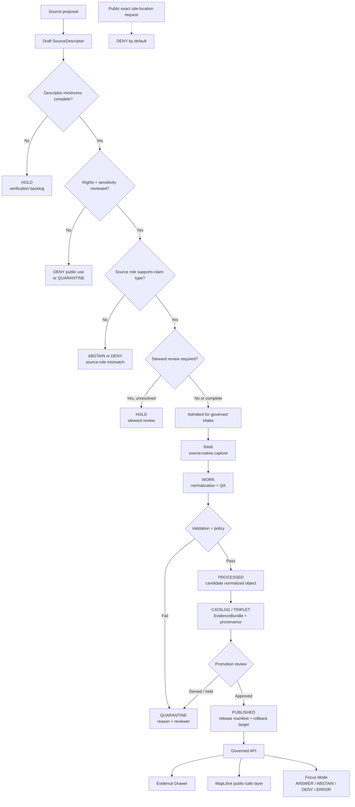

<!-- [KFM_META_BLOCK_V2]
doc_id: kfm://doc/TODO-NEEDS-UUID
title: Archaeology Source Registry (Human Companion)
type: standard
version: v1
status: draft
owners: TODO-NEEDS-OWNER
created: TODO-NEEDS-GIT-HISTORY
updated: 2026-05-06
policy_label: TODO-NEEDS-POLICY-REVIEW
related: [../README.md, ../architecture/ARCHITECTURE.md, ./SENSITIVITY_AND_RIGHTS.md, ./VALIDATION_AND_POLICY.md, ./CATALOG_AND_PROOF_OBJECTS.md, ./FILE_MAP.md, ../../../sources/README.md, ../../../../data/registry/README.md, ../../../../policy/README.md, ../../../../schemas/README.md, ../../../../contracts/README.md, ../../../../tests/README.md]
tags: [kfm, archaeology, source-registry, source-descriptor, source-role, sensitivity, rights, evidence, steward-review]
notes: [Existing file revised from a thin human companion into a source-admission control document. doc_id, created date, owner, policy label, exact branch state, and machine registry layout still need verification before publication.]
[/KFM_META_BLOCK_V2] -->

<a id="top"></a>

# Archaeology Source Registry (Human Companion)

Human-readable source-admission rules for archaeology source descriptors, source roles, rights, sensitivity, steward review, public-safe publication, and fail-closed activation.

<p align="left">
  
  
  
  
  
  
</p>

> [!IMPORTANT]
> **Status:** `draft`  
> **Owners:** `TODO-NEEDS-OWNER`  
> **Path:** `docs/domains/archaeology/governance/SOURCE_REGISTRY.md`  
> **Role:** human companion for source descriptors; not the machine registry, not raw data, not a release manifest, and not source authority by itself.  
> **Quick jumps:** [Scope](#scope) · [Repo fit](#repo-fit) · [Accepted inputs](#accepted-inputs) · [Exclusions](#exclusions) · [Descriptor minimums](#descriptor-minimums) · [Source roles](#source-roles) · [Admission flow](#admission-flow) · [Activation states](#activation-states) · [Change rules](#change-rules) · [Validation gates](#validation-gates) · [Definition of done](#definition-of-done)

> [!WARNING]
> Archaeology source records can carry looting risk, cultural sensitivity, burial or human-remains context, private-landowner exposure, steward-controlled knowledge, collection-security concerns, or exact-location risk. Unknown rights, unresolved sensitivity, missing source role, or absent steward review blocks activation and public release.

---

## Scope

This file defines how archaeology sources become **reviewable candidates** for KFM intake.

It preserves the current file’s original purpose—“the human-readable companion for source descriptors”—and expands it into a maintainable registry guide for:

- source descriptor minimums;
- archaeology source-role classes;
- source activation and deactivation states;
- rights, redistribution, and citation expectations;
- sensitivity defaults and public-geometry treatment;
- steward, cultural, and restricted-knowledge review;
- validation gates before ingestion, publication, API exposure, map rendering, Evidence Drawer use, or Focus Mode answers.

This file does **not** activate live sources. It does not prove that the machine source registry, schemas, policy tests, validators, workflows, API routes, or UI components already enforce these rules.

[Back to top](#top)

---

## Repo fit

| Relation | Path | Role | Current status |
|---|---|---|---|
| Current file | `docs/domains/archaeology/governance/SOURCE_REGISTRY.md` | Human source-registry companion for archaeology | **CONFIRMED path exists in public repo snapshot; this revision is proposed content** |
| Lane landing page | [`../README.md`](../README.md) | Archaeology lane orientation, trust posture, and public-location warning | **CONFIRMED path in public repo snapshot** |
| Architecture boundary | [`../architecture/ARCHITECTURE.md`](../architecture/ARCHITECTURE.md) | Layering, lifecycle, governance, governed API, and UI constraints | **CONFIRMED path in public repo snapshot** |
| Sensitivity and rights | [`./SENSITIVITY_AND_RIGHTS.md`](./SENSITIVITY_AND_RIGHTS.md) | High-sensitivity classes, public-release requirements, denial triggers | **CONFIRMED path in public repo snapshot** |
| Validation and policy | [`./VALIDATION_AND_POLICY.md`](./VALIDATION_AND_POLICY.md) | Required gates and finite policy outcomes | **CONFIRMED path in public repo snapshot** |
| Catalog and proof objects | [`./CATALOG_AND_PROOF_OBJECTS.md`](./CATALOG_AND_PROOF_OBJECTS.md) | Release closure expectations and proof requirements | **CONFIRMED path in public repo snapshot** |
| File map | [`./FILE_MAP.md`](./FILE_MAP.md) | Human map of archaeology governance files | **CONFIRMED path in public repo snapshot** |
| Cross-domain source guidance | [`../../../sources/README.md`](../../../sources/README.md) | Source admission, source roles, refresh posture, and review card | **CONFIRMED path in public repo snapshot** |
| Machine/data registry guide | [`../../../../data/registry/README.md`](../../../../data/registry/README.md) | SourceDescriptor and data-registry placement rules | **CONFIRMED path in public repo snapshot** |
| Policy parent | [`../../../../policy/README.md`](../../../../policy/README.md) | Rights, sensitivity, release, runtime, and correction decision posture | **CONFIRMED path in public repo snapshot** |

### Directory Rules basis

This file belongs under `docs/domains/archaeology/governance/` because it is a human-facing domain governance document. It should point to machine-readable source descriptor instances under the repo-approved data-registry layout, but it should not create a root-level `archaeology/` folder or become the machine registry itself.

> [!NOTE]
> Machine registry placement remains **NEEDS VERIFICATION**. Use the repo-approved `data/registry/` pattern when confirmed. If both `data/registry/archaeology/sources.yaml` and `data/registry/sources/archaeology/<source_id>.yaml` appear in current or future work, resolve the convention by ADR or migration note before expanding source descriptors.

[Back to top](#top)

---

## Accepted inputs

Use this document for archaeology source-admission guidance and source-review expectations.

| Accepted input | Belongs here when it… | Minimum posture |
|---|---|---|
| Source descriptor rules | Defines what every archaeology source descriptor must contain | **Required before live fetch or scheduling** |
| Source-role vocabulary | Explains what different archaeology source families can and cannot support | **Fail closed on unknown role** |
| Rights and citation expectations | Defines what must be known before ingest, transformation, EvidenceBundle use, or public release | **Unknown rights block public release** |
| Sensitivity defaults | Declares default treatment for exact locations, burial/remains context, cultural sensitivity, landowner risk, and collection-security risk | **Deny exact public geometry by default** |
| Steward review burden | States when tribal, cultural, agency, collection, landowner, or domain-steward review is required | **Review required before promotion** |
| Candidate-feature rules | Prevents LiDAR, aerial, satellite, geophysical, or model outputs from being treated as confirmed sites | **Candidate until evidence and review support stronger claim** |
| Registry update instructions | Tells maintainers which docs, registry files, fixtures, schemas, policies, and validators must change together | **No silent source expansion** |

---

## Exclusions

| Excluded material | Why it does not belong here | Put it instead |
|---|---|---|
| Source-native payloads, scans, PDFs, rasters, point clouds, shapefiles, spreadsheets, or exports | This file is prose guidance, not data storage | `data/raw/archaeology/` or repo-approved RAW equivalent |
| Working files, extraction outputs, OCR, georeferencing drafts, model candidates, or QA work | WORK products require receipts and validation state | `data/work/archaeology/` or repo-approved WORK equivalent |
| Blocked, unsafe, rights-unclear, or review-pending material | Quarantine state needs reason, reviewer, and disposition | `data/quarantine/archaeology/` or repo-approved quarantine equivalent |
| Machine source descriptor instances | This document explains descriptors; instances belong in the registry | `data/registry/…` after convention verification |
| Executable schemas | Machine shape should not live in prose | `schemas/` or repo-approved schema home |
| Human object contracts | Semantic object meaning belongs with contracts | `contracts/` or repo-approved contract home |
| Policy-as-code | Policy must be executable and testable | `policy/` |
| Receipts, proof packs, release manifests, rollback cards, catalog objects | Emitted governance artifacts are downstream of validation and release | `data/receipts/`, `data/proofs/`, `data/catalog/`, `release/`, or repo-approved equivalents |
| Public exact archaeological site coordinates | Default public exposure risk is too high | Restricted/steward-only governed access surface |
| Secrets, private steward contacts, access credentials, collection-security details | Public docs must not leak operational or sensitive access information | Secret manager, restricted runbook, or steward-only channel |
| AI-generated summaries without EvidenceBundle resolution | Generated language is not source truth | Governed runtime envelope with citations, policy decision, and finite outcome |

[Back to top](#top)

---

## Descriptor minimums

Every archaeology source descriptor should be explicit enough for a reviewer to answer: **what is this source allowed to mean in KFM, and what must it never expose publicly without more review?**

| Field group | Required questions | Example fields |
|---|---|---|
| Identity | What is this source, who maintains it, and how is it identified? | `source_id`, `title`, `publisher`, `steward`, `contact_policy`, `source_family`, `source_uri` |
| Role | What source role does it play? | `source_role`, `authority_tier`, `knowledge_character`, `claim_types_supported`, `claim_types_not_supported` |
| Scope | Where, when, and for what domain does it apply? | `spatial_scope`, `temporal_scope`, `jurisdiction`, `subject_domains`, `site_scope`, `collection_scope` |
| Access | How may KFM obtain or refresh it? | `access_mode`, `authentication_posture`, `cadence`, `refresh_rule`, `manual_review_required` |
| Rights | What can KFM do with it? | `license_or_terms`, `redistribution_posture`, `attribution_required`, `public_release_allowed`, `rights_review_state` |
| Sensitivity | What exposure risks apply? | `sensitivity_classes`, `default_visibility`, `exact_location_policy`, `generalization_required`, `steward_review_required` |
| Evidence support | What evidence can it support? | `evidence_ref_policy`, `citation_expectation`, `source_record_linkage`, `confidence_or_uncertainty_fields` |
| Geometry | What is the geometry support and precision burden? | `native_crs`, `geometry_type`, `precision_class`, `public_geometry_treatment`, `transform_receipt_required` |
| Temporal model | What times must stay distinct? | `observed_time`, `source_date`, `valid_time`, `retrieved_at`, `reviewed_at`, `release_time` |
| Validation | What must pass before admission or use? | `required_fields`, `schema_ref`, `valid_fixture_ref`, `invalid_fixture_ref`, `policy_fixture_ref` |
| Lifecycle | Where can the source move next? | `raw_target`, `work_target`, `quarantine_target`, `processed_target`, `catalog_target` |
| Publication | What is allowed after review? | `publication_profile`, `release_gate`, `allowed_public_derivatives`, `denied_public_derivatives` |
| Continuity | What lineage must survive? | `supersedes`, `superseded_by`, `previous_ids`, `deprecation_reason`, `correction_policy` |
| Verification | What remains unresolved? | `verification_status`, `open_questions`, `reviewer`, `last_reviewed_at`, `next_review_due` |

### Required descriptor defaults

When the field is unknown, use the safer default.

| Condition | Default outcome |
|---|---|
| Source role unknown | `DENY` activation |
| Rights or redistribution unknown | `DENY` public release; `QUARANTINE` or `HOLD` source use |
| Sensitivity unknown | `RESTRICTED` / `DENY_PUBLIC_EXPOSURE` |
| Exact site geometry requested for public output | `DENY` |
| Steward review unresolved | `HOLD` or `DENY` promotion |
| Candidate-feature source lacks review | `candidate_only` |
| EvidenceRef cannot resolve to EvidenceBundle | `ABSTAIN`, `DENY`, or `ERROR` depending on surface |
| Citation support missing for consequential claim | `ABSTAIN` or `DENY` |
| Public geometry transform lacks receipt | `DENY` release |

[Back to top](#top)

---

## Source roles

Source roles prevent KFM from flattening evidence into “data.”

| Source role | Typical source material | Can support | Must not support alone |
|---|---|---|---|
| Field / survey / excavation | Survey forms, excavation units, transects, field observations, provenience records, field notes | Field context, observation, provenience, survey coverage, excavation context | Public exact site disclosure without review; broad cultural interpretation without source support |
| Lab / analytical / chronometric | Radiocarbon, OSL, archaeobotanical, zooarchaeological, materials analysis, residue, isotopic, dating or lab reports | Method-specific findings, chronology support, sample interpretation with uncertainty | Unqualified date certainty, site confirmation outside sample context |
| Archival / documentary / report | Cultural-resource reports, published articles, gray literature, historic maps, photographs, notebooks, catalogs | Documentary support, historical context, citations, interpretive claims within source scope | Exact modern location or confirmed site boundary without geospatial review |
| Oral / steward / cultural knowledge | Steward-reviewed knowledge, oral history, tribal/cultural context, restricted narratives | Contextual or interpretive support when permission and review allow | Public claim or public geometry without explicit steward approval |
| Regulatory / administrative / inventory | Inventory records, legal/designation files, agency context, administrative forms | Administrative status, listing/inventory context, source-of-record trace | Cultural truth, physical boundary proof, or public exact location by itself |
| Remote sensing / geophysical / modeled | LiDAR, aerial imagery, satellite imagery, GPR, magnetometry, resistivity, predictive models, anomaly surfaces | Candidate features, survey targeting, context, supporting interpretation | Confirmed site status without field/evidence review |
| Collection / repository / museum | Collection records, accession data, storage/repository records, object catalogs | Collection custody, artifact context, repository citation | Public storage/security details; complete provenience unless source supports it |
| Derived public | Generalized summaries, redacted public layers, public story assets, survey-coverage summaries | Public-safe orientation after release gate | Canonical truth, restricted-data substitute, or exact-location proxy |
| Restricted canonical / steward-only | Exact site geometry, controlled source packets, restricted review records | Steward, review, correction, and restricted operations | Public DTO, public tile, public graph edge, public export, or direct Focus Mode answer |

> [!CAUTION]
> A source can be authoritative for one claim and contextual for another. Source descriptors must name the claim type they support, not merely identify the source.

---

## Candidate source-family register

This is a **source-family register**, not a list of activated sources.

| Source family | Default activation | Public posture | Required review |
|---|---:|---|---|
| Field, survey, and excavation records | `disabled` until descriptor and steward review | Public exact geometry denied | Domain steward + sensitivity review |
| Lab and chronometric records | `disabled` until method and evidence linkage review | Public only with uncertainty and citation context | Domain steward + evidence review |
| Archival reports and documentary sources | `disabled` until rights and citation review | Public excerpts/metadata only when rights allow | Rights + citation review |
| Oral, steward, or cultural knowledge | `disabled` and restricted by default | Public release denied unless approved | Steward/cultural review required |
| Regulatory or inventory records | `disabled` until authority role is explicit | Public only through approved generalization/profile | Source-role + sensitivity review |
| Remote sensing, geophysical, and modeled products | `disabled` until candidate-feature handling is explicit | Candidate surfaces only; no confirmed-site claim | Domain + method review |
| Collection/repository metadata | `disabled` until rights/security review | Storage/security details restricted | Collection/security review |
| Derived public products | `disabled` until transform receipt and release manifest exist | Public-safe only | Policy + release review |

[Back to top](#top)

---

## Admission flow



[Back to top](#top)

---

## Activation states

| State | Meaning | Next allowed move |
|---|---|---|
| `candidate` | Source family named, but descriptor not complete | Draft descriptor or reject |
| `draft_descriptor` | Descriptor exists but needs owner, rights, sensitivity, role, steward, fixture, or validation review | Complete review or hold |
| `disabled` | Descriptor may exist, but live fetch/activation is not allowed | Activate only after review gate |
| `admitted_internal` | Source may enter RAW/WORK for governed internal processing | Validate, quarantine, or process |
| `restricted` | Source may be used only by authorized roles or steward review | Restricted processing or public-safe derivative |
| `candidate_feature_only` | Source may create candidate features only | Field/evidence review before stronger status |
| `public_candidate` | Public-safe derivative may be considered after proof/release gates | Release review |
| `published_source_basis` | Source supports a released public-safe artifact via EvidenceBundle and release manifest | Maintain, correct, supersede, or rollback |
| `deprecated` | Source has been superseded but retained for lineage | Keep citations/release lineage; avoid new use |
| `withdrawn` | Source basis is no longer valid for released claims | Correction or rollback |
| `denied` | Source is blocked by rights, sensitivity, authority, policy, or evidence failure | Archive rationale; do not activate |

---

## Machine registry bridge

This file is the human guidance layer. Machine descriptor instances should live in the repo-approved registry layout.

### Preferred review pattern

| Step | Required update |
|---|---|
| Add source family | Update this file and the machine source registry index |
| Add descriptor instance | Add a SourceDescriptor under the approved `data/registry/` pattern |
| Add sensitivity class | Update `SENSITIVITY_AND_RIGHTS.md`, sensitivity registry, policy fixtures, and tests |
| Add public derivative | Add publication profile, transform receipt fixture, LayerManifest expectation, catalog/proof closure, and release gate |
| Add source role | Update source-role table, descriptor schema/fixtures, policy reason codes, and Evidence Drawer payload expectations |
| Deactivate source | Update activation state, deprecation/withdrawal reason, successor, correction impact, and rollback references |

### Illustrative descriptor skeleton

This is illustrative only. Use the actual repo schema after schema-home verification.

```yaml
source_id: TODO-NEEDS-STABLE-ID
title: TODO-NEEDS-SOURCE-TITLE
status: draft_descriptor

ownership:
  external_steward: TODO-NEEDS-STEWARD
  kfm_reviewer: TODO-NEEDS-OWNER
  contact_policy: restricted_or_public_safe_reference_only

role:
  source_role: TODO-NEEDS-SOURCE-ROLE
  authority_tier: TODO-NEEDS-VERIFICATION
  knowledge_character: field_observation | archival | regulatory | oral_steward | remote_sensing | derived_public | restricted
  claim_types_supported: []
  claim_types_not_supported: []

scope:
  spatial_scope: TODO-NEEDS-VERIFICATION
  temporal_scope: TODO-NEEDS-VERIFICATION
  subject_domains:
    - archaeology

rights:
  license_or_terms: TODO-NEEDS-VERIFICATION
  attribution_required: TODO-NEEDS-VERIFICATION
  redistribution_posture: unknown
  public_release_allowed: false
  rights_review_state: needs_review

sensitivity:
  default_visibility: restricted
  sensitivity_classes:
    - exact_archaeological_location
  exact_location_policy: deny_public_by_default
  steward_review_required: true
  public_geometry_treatment: suppressed | generalized | redacted | none_allowed
  transform_receipt_required: true

geometry:
  native_crs: TODO-NEEDS-VERIFICATION
  geometry_type: TODO-NEEDS-VERIFICATION
  precision_class: restricted_exact | generalized | approximate | nonspatial
  public_geometry_allowed: false

temporal:
  source_date: TODO-NEEDS-VERIFICATION
  observed_time: TODO-NEEDS-VERIFICATION
  valid_time: TODO-NEEDS-VERIFICATION
  retrieved_at: TODO-NEEDS-VERIFICATION
  review_time: TODO-NEEDS-VERIFICATION

validation:
  schema_ref: TODO-NEEDS-SCHEMA-HOME
  valid_fixture_ref: TODO-NEEDS-FIXTURE
  invalid_fixture_ref: TODO-NEEDS-FIXTURE
  policy_fixture_ref: TODO-NEEDS-FIXTURE
  required_checks:
    - source_role_known
    - rights_reviewed
    - sensitivity_reviewed
    - evidence_refs_resolvable
    - public_geometry_safe

lifecycle:
  raw_target: data/raw/archaeology/NEEDS-VERIFICATION
  work_target: data/work/archaeology/NEEDS-VERIFICATION
  quarantine_target: data/quarantine/archaeology/NEEDS-VERIFICATION
  processed_target: data/processed/archaeology/NEEDS-VERIFICATION

publication:
  release_gate: required
  allowed_public_derivatives: []
  denied_public_derivatives:
    - exact_site_coordinates
    - restricted_source_rows
    - collection_security_details

continuity:
  previous_ids: []
  supersedes: []
  superseded_by: []
  correction_policy: correction_notice_and_release_manifest_update

verification:
  verification_status: draft
  open_questions:
    - TODO-NEEDS-VERIFICATION
  last_reviewed_at: TODO-NEEDS-YYYY-MM-DD
  next_review_due: TODO-NEEDS-YYYY-MM-DD
```

[Back to top](#top)

---

## Validation gates

| Gate | Pass condition | Fail-closed outcome |
|---|---|---|
| Descriptor completeness | Minimum identity, role, rights, sensitivity, scope, geometry, temporal, validation, lifecycle, and publication fields are present | `HOLD` |
| Source role | Role is known and supports the requested claim type | `ABSTAIN` or `DENY` |
| Rights | Rights, redistribution, attribution, and public-release posture are reviewed | `DENY public release` |
| Sensitivity | Sensitivity class and exact-location treatment are explicit | `RESTRICTED` or `DENY` |
| Steward review | Required cultural/steward/domain review is complete | `HOLD` |
| Geometry safety | Public DTO/layer/export cannot expose restricted exact geometry or a proxy for it | `DENY release` |
| Candidate feature | Candidate-only source is not promoted as confirmed without evidence and review | `DENY stronger claim` |
| Evidence closure | Consequential claims resolve `EvidenceRef -> EvidenceBundle` | `ABSTAIN`, `DENY`, or `ERROR` |
| Citation support | Outward claim has citation support where evidence is required | `ABSTAIN` or `DENY` |
| Catalog/proof closure | Release manifest, catalog/provenance refs, policy decision, transform receipt, and rollback target align | `HOLD` or `ERROR` |
| Public path safety | No public API, tile, drawer, graph, search, export, or Focus payload reads RAW/WORK/QUARANTINE/restricted stores directly | `DENY` |
| Correction readiness | Supersession, withdrawal, correction, and rollback path are defined before publication | `HOLD` |

---

## Change rules

Every source change is a governance change.

| Change | Required companion updates |
|---|---|
| New source family | Source registry, descriptor fixture, sensitivity review, source-role table, verification backlog |
| New descriptor field | Schema, contract/object card, valid fixture, invalid fixture, validator, docs |
| New source role | Source role table, policy reason codes, Evidence Drawer wording, Focus Mode denial/abstention rules |
| New sensitivity class | `SENSITIVITY_AND_RIGHTS.md`, policy tests, public DTO tests, transform receipt fixture |
| New public layer or derivative | Layer registry, transform receipt, EvidenceBundle fixture, catalog/proof closure, release manifest, rollback card |
| Source terms change | Rights review, activation state, affected releases, correction or rollback impact |
| Source deprecation | Status index, successor pointer, affected EvidenceBundles, release/correction notes |
| Source withdrawal | CorrectionNotice, ReleaseManifest update, rollback target, public notice if applicable |
| Machine registry relocation | ADR or migration note, compatibility map, link updates, non-regression test |
| Public geometry treatment change | Public-vs-restricted geometry ADR, transform receipt schema/fixtures, policy tests, layer/API/UI docs |

[Back to top](#top)

---

## Review card

Use this card before a source descriptor moves beyond `draft_descriptor`.

| Review item | Required answer |
|---|---|
| Source identity | What stable ID and title will KFM use? |
| External steward | Who maintains or governs the source? |
| KFM reviewer | Who is responsible for source admission review? |
| Source role | Which claim types may this source support? |
| Source-role limits | Which claim types must it not support alone? |
| Rights posture | Are license, terms, attribution, redistribution, and automation posture known? |
| Sensitivity posture | Does it include exact locations, cultural knowledge, burials/remains, landowner exposure, collection-security concerns, or other restricted details? |
| Geometry posture | What precision exists, what CRS/support applies, and what public treatment is allowed? |
| Temporal posture | Which times are source, observation, valid, retrieval, review, release, or correction times? |
| Evidence posture | How will records resolve to EvidenceBundles and citations? |
| Public profile | What, if anything, may become public after review? |
| Required transforms | Is a generalization, redaction, suppression, or delay transform required? |
| Candidate-only handling | Could the source create candidate features only? |
| Validation fixtures | Where are the valid, invalid, and policy fixtures? |
| Activation state | Why is the source allowed to remain disabled, internal, restricted, or public-candidate? |
| Rollback impact | What published artifacts would require correction or rollback if this source changes? |

---

## Definition of done

A revision to this source-registry companion is ready for review when:

- [ ] KFM Meta Block V2 is present and unresolved values are explicit placeholders.
- [ ] The target path and neighboring archaeology docs were checked in the active repo or marked `NEEDS VERIFICATION`.
- [ ] Directory Rules placement is preserved: this remains under `docs/domains/archaeology/governance/`.
- [ ] The document does not claim live connector activation, public release, validator enforcement, workflow enforcement, or runtime behavior without evidence.
- [ ] Descriptor minimums include source identity, role, rights, sensitivity, geometry, time, validation, lifecycle, publication, continuity, and verification fields.
- [ ] Exact public archaeological site geometry remains denied by default.
- [ ] Remote-sensing, geophysical, and modeled material remains candidate-only until evidence and review support stronger claims.
- [ ] Unknown rights, unresolved steward review, source-role mismatch, and public restricted-geometry exposure fail closed.
- [ ] Machine registry layout is labeled `NEEDS VERIFICATION` unless the repo convention is confirmed.
- [ ] Change rules name the required registry, docs, schema, policy, fixture, validation, catalog/proof, release, and rollback updates.
- [ ] Open questions remain visible rather than being smoothed into confident prose.

[Back to top](#top)

---

## Open verification backlog

| Item | Status | Why it matters |
|---|---:|---|
| `doc_id` | `TODO-NEEDS-UUID` | Required for KFM document identity |
| Created date | `TODO-NEEDS-GIT-HISTORY` | Existing file predates this revision, but creation history was not verified |
| Owner | `TODO-NEEDS-OWNER` | Lane ownership and review burden must be explicit |
| Policy label | `TODO-NEEDS-POLICY-REVIEW` | Archaeology governance docs may be public-safe, restricted, or mixed depending on project policy |
| Machine registry layout | `NEEDS VERIFICATION` | Avoids parallel `data/registry/archaeology/` versus `data/registry/sources/archaeology/` authority |
| SourceDescriptor schema path | `NEEDS VERIFICATION` | Prevents contracts/schemas drift |
| Policy engine and test runner | `UNKNOWN` | Determines executable gate implementation |
| Steward/cultural review process | `NEEDS VERIFICATION` | Required before sensitive source activation or public derivatives |
| Public generalization thresholds | `NEEDS VERIFICATION` | Required before public archaeology layers or exports |
| Existing active archaeology sources | `UNKNOWN` | No active source descriptors were inspected in this task |
| CI enforcement | `UNKNOWN` | Existing workflows/tests were not verified for this exact file |
| Public API/UI integration | `UNKNOWN` | Source registry rules should inform payloads, but no route/component behavior is claimed here |

---

## Appendix: anti-patterns

<details>
<summary><strong>Do not let these into archaeology source admission</strong></summary>

- Treating a reachable dataset, portal, report, scan, or map service as admissible because it exists.
- Treating a remote-sensing anomaly as a confirmed archaeological site.
- Publishing exact site coordinates because the source file contains them.
- Publishing generalized output without a transform receipt and release manifest.
- Treating a regulatory or inventory record as complete cultural or physical truth.
- Flattening steward-controlled or oral knowledge into public claims without permission.
- Treating collection/repository metadata as safe for public storage-location exposure.
- Allowing Focus Mode to answer exact-location questions from restricted context.
- Using `data/registry/` as a raw data dump.
- Duplicating source descriptor meaning in both prose and machine registries without a schema/contract authority decision.
- Silently deleting, renaming, replacing, or moving source descriptors without lineage, successor, and rollback notes.

</details>

<details>
<summary><strong>Maintenance notes for future editors</strong></summary>

1. Keep this file focused on human source-admission guidance.
2. Put machine descriptor instances in the repo-approved registry layout.
3. Link to schemas, policy, fixtures, and validators only when verified or clearly marked as proposed.
4. Update `SENSITIVITY_AND_RIGHTS.md` and `VALIDATION_AND_POLICY.md` when source admission changes public exposure or denial behavior.
5. Preserve exact-location denial near the top of the file.
6. Add a correction note when a source family, role, or activation rule is superseded.
7. Prefer one tested denial fixture over more prose.

</details>

[Back to top](#top)
