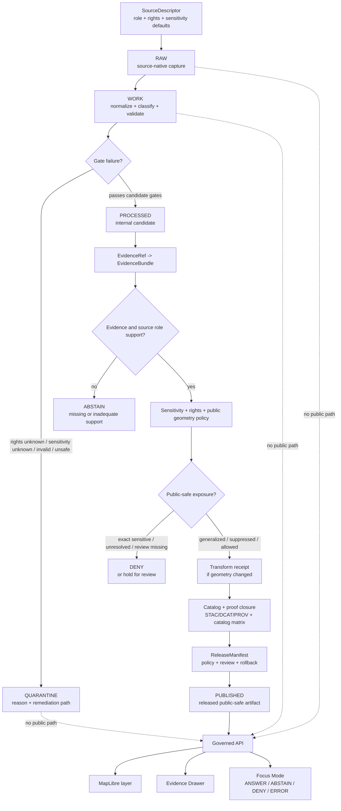

<!-- [KFM_META_BLOCK_V2]
doc_id: kfm://doc/NEEDS-VERIFICATION-docs-domains-archaeology-governance-validation-and-policy
title: Archaeology Validation and Policy
type: standard
version: v1
status: draft
owners: TODO-NEEDS-OWNER
created: NEEDS-VERIFICATION-YYYY-MM-DD
updated: 2026-05-06
policy_label: NEEDS-VERIFICATION-public-or-restricted
related: [../README.md, ../architecture/ARCHITECTURE.md, ../architecture/DOMAIN_MODEL.md, ./SOURCE_REGISTRY.md, ./SENSITIVITY_AND_RIGHTS.md, ./CATALOG_AND_PROOF_OBJECTS.md, ./FILE_MAP.md, ./OPEN_QUESTIONS.md, ../operations/RUNBOOK.md, ../../../doctrine/lifecycle-law.md, ../../../adr/ADR-0009-sensitive-location-policy.md, ../../../architecture/governed-api.md, ../../../security/public-surface-boundary.md, ../../../runbooks/publication.md]
tags: [kfm, archaeology, validation, policy, sensitivity, rights, evidence, publication, exact-location-denial]
notes: [Revises existing short validation and policy stub; doc_id, owner, created date, policy label, executable policy home, schema home, CI wiring, and runtime enforcement remain NEEDS VERIFICATION.]
[/KFM_META_BLOCK_V2] -->

<a id="top"></a>

# Archaeology Validation and Policy

Validation and policy rules for keeping KFM archaeology claims evidence-bound, source-role-aware, rights-safe, sensitivity-safe, reviewable, publishable only through governed release, and reversible.

<p align="center">
  
  
  
  
  
  
</p>

<p align="center">
  <a href="#status-and-reading-rule">Status</a> ·
  <a href="#repo-fit">Repo fit</a> ·
  <a href="#validation-law">Validation law</a> ·
  <a href="#governed-flow">Flow</a> ·
  <a href="#validation-gates">Validation gates</a> ·
  <a href="#policy-outcomes">Policy outcomes</a> ·
  <a href="#mandatory-denials">Mandatory denials</a> ·
  <a href="#public-output-rules">Public output</a> ·
  <a href="#fixtures-and-validators">Fixtures & validators</a> ·
  <a href="#definition-of-done">Done</a> ·
  <a href="#open-verification">Open verification</a>
</p>

> [!WARNING]
> Archaeology validation is a public-safety control, not a formatting step. KFM denies exact public archaeological site locations by default. Public outputs require reviewed generalized, suppressed, withheld, or otherwise public-safe representation with transform receipts, EvidenceBundle support, policy decision, release manifest, correction path, and rollback target.

---

## Status and reading rule

| Field | Value |
|---|---|
| Target path | `docs/domains/archaeology/governance/VALIDATION_AND_POLICY.md` |
| Owning root | `docs/` — human-facing doctrine and governance explanation |
| Lane | `archaeology` |
| Document role | Validation and policy companion for the archaeology lane |
| Status | `draft` |
| Current enforcement maturity | `NEEDS VERIFICATION` |
| Default public exact-location posture | `DENY` |
| Evidence posture | `EvidenceRef -> EvidenceBundle` or abstain / deny |
| Public runtime posture | governed API and released artifacts only |
| Maintenance rule | Update this file whenever archaeology validation, policy, source-role, rights, sensitivity, public geometry, Evidence Drawer, Focus Mode, release, correction, or rollback behavior changes |

This file is a **standard governance document**, not executable policy by itself. It describes the rules that should be enforced by repo-native schemas, fixtures, validators, policy bundles, CI checks, promotion gates, governed API envelopes, MapLibre layer manifests, Evidence Drawer payloads, Focus Mode outcomes, release manifests, and rollback/correction records.

### Truth labels used here

| Label | Use |
|---|---|
| `CONFIRMED` | Verified from current repo evidence, adjacent docs, or governing KFM doctrine. |
| `PROPOSED` | Recommended implementation or file home not yet verified as active enforcement. |
| `UNKNOWN` | Not verified from current repo files, tests, workflows, runtime logs, dashboards, or release artifacts. |
| `NEEDS VERIFICATION` | Checkable item that must be confirmed before it can support implementation or publication. |
| `DENY` | Policy blocks the requested action or publication. |
| `ABSTAIN` | Evidence is insufficient, unresolved, conflicted, stale, or outside scope. |
| `ERROR` | The system cannot complete a trustworthy decision because a required check failed or malfunctioned. |

[Back to top](#top)

---

## Repo fit

| Relationship | Path | Status | Role |
|---|---|---:|---|
| Lane landing page | [`../README.md`](../README.md) | `CONFIRMED` | Archaeology lane overview and public exact-location warning |
| Architecture boundary | [`../architecture/ARCHITECTURE.md`](../architecture/ARCHITECTURE.md) | `CONFIRMED` | Layering, lifecycle, governed serving, and companion-doc list |
| Domain model | [`../architecture/DOMAIN_MODEL.md`](../architecture/DOMAIN_MODEL.md) | `CONFIRMED` | Archaeology object families and public-safe representation expectations |
| Source registry companion | [`./SOURCE_REGISTRY.md`](./SOURCE_REGISTRY.md) | `CONFIRMED` | Source descriptor minimums and source-role classes |
| Sensitivity and rights | [`./SENSITIVITY_AND_RIGHTS.md`](./SENSITIVITY_AND_RIGHTS.md) | `CONFIRMED` | Rights, high-sensitivity classes, and release requirements |
| Catalog and proof objects | [`./CATALOG_AND_PROOF_OBJECTS.md`](./CATALOG_AND_PROOF_OBJECTS.md) | `CONFIRMED` | Catalog closure and proof expectations |
| File map | [`./FILE_MAP.md`](./FILE_MAP.md) | `CONFIRMED` | Archaeology documentation surface map |
| Open questions | [`./OPEN_QUESTIONS.md`](./OPEN_QUESTIONS.md) | `CONFIRMED` | Owner, schema-home, review, policy-runtime, and path gaps |
| Runbook | [`../operations/RUNBOOK.md`](../operations/RUNBOOK.md) | `CONFIRMED` | Safe first-run and incident handling checklist |
| Lifecycle doctrine | [`../../../doctrine/lifecycle-law.md`](../../../doctrine/lifecycle-law.md) | `CONFIRMED` | Shared KFM lifecycle law and publication posture |
| Sensitive-location ADR | [`../../../adr/ADR-0009-sensitive-location-policy.md`](../../../adr/ADR-0009-sensitive-location-policy.md) | `CONFIRMED` | Cross-domain exact-location denial and geoprivacy decision |
| Governed API | [`../../../architecture/governed-api.md`](../../../architecture/governed-api.md) | `CONFIRMED` | Trust membrane for outward responses |
| Public surface boundary | [`../../../security/public-surface-boundary.md`](../../../security/public-surface-boundary.md) | `CONFIRMED` | Fail-closed public surface warning |
| Publication runbook | [`../../../runbooks/publication.md`](../../../runbooks/publication.md) | `CONFIRMED` | Promotion, release, rollback, and correction procedure |

### Accepted inputs for this document

This file may contain:

- validation gates;
- policy outcomes and denial rules;
- reason-code and obligation-code vocabulary;
- public DTO, layer, Evidence Drawer, Focus Mode, export, and story safety rules;
- release, correction, and rollback requirements;
- fixture and validator expectations;
- review checklists;
- implementation homes labeled `PROPOSED` or `NEEDS VERIFICATION`.

### Exclusions

| Does not belong here | Proper home | Why |
|---|---|---|
| Executable policy code | `policy/` or repo-confirmed policy home | This file explains policy; it does not enforce it. |
| JSON Schema or OpenAPI files | `schemas/`, `contracts/`, or accepted schema/contract home | Machine contracts must be versioned and testable. |
| Real source records | `data/registry/archaeology/` or accepted source registry home | Source records need descriptor validation and source authority review. |
| RAW, WORK, QUARANTINE, or PROCESSED data | Data lifecycle homes | Documentation must not become storage. |
| Release artifacts, proofs, receipts, catalog records | `data/receipts/`, `data/proofs/`, `data/catalog/`, `release/`, or repo-confirmed homes | Emitted proof objects must remain auditable and separately validated. |
| Live source credentials or private steward contacts | Secrets management or restricted operational runbooks | Public docs must not leak sensitive access details. |
| Real exact archaeological coordinates | Restricted/steward-only data stores | This document must never become a leakage vector. |

> [!NOTE]
> Candidate machine homes for archaeology policy and validation remain `NEEDS VERIFICATION`. Do not create parallel `policy/`, `schemas/`, `contracts/`, or validator homes to satisfy this document. Resolve the repo’s active schema and policy conventions before landing executable files.

[Back to top](#top)

---

## Validation law

Every archaeology output that carries a claim, feature, place, geometry, artifact, source assertion, date, chronology, cultural association, component, feature interpretation, survey result, excavation record, remote-sensing candidate, Evidence Drawer payload, Focus Mode answer, MapLibre layer, export, story, catalog record, or public summary must pass three questions:

1. **Can the claim be supported?**  
   `EvidenceRef` must resolve to an `EvidenceBundle`, and the source role must support the claim type.

2. **Can the claim be exposed?**  
   Rights, sensitivity, stewardship, cultural review, private-land, collection-security, exact-location, public geometry, and release posture must allow the requested audience and precision.

3. **Can the claim be corrected or reversed?**  
   Promotion must produce release/proof linkage, correction lineage, and rollback target before public or semi-public exposure.

If any answer is unresolved, unsafe, unsupported, or not reviewable, KFM returns `ABSTAIN`, `DENY`, or `ERROR` instead of publishing or generating confident prose.

[Back to top](#top)

---

## Governed flow



[Back to top](#top)

---

## Validation gates

The existing stub named seven gates. This revision preserves those gates and expands them into a reviewable matrix.

| Gate | Must prove | Blocks when | Required outcome |
|---|---|---|---|
| **V0 — source descriptor** | `source_id`, steward/owner, source role, rights posture, sensitivity defaults, cadence/freshness, citation expectations, and activation state are present. | Source role, rights, sensitivity, owner, or activation posture is missing. | `DENY` activation or `QUARANTINE` candidate. |
| **V1 — schema validity** | Object, DTO, manifest, catalog record, receipt, and envelope shapes match the accepted schema home. | Required fields are missing, enums drift, or public DTO shape is unvalidated. | `ERROR` or `QUARANTINE`. |
| **V2 — rights completeness** | Rights, redistribution eligibility, license/access restrictions, oral/steward permission, and attribution obligations are known. | Rights are unknown, controlled, incompatible, or consent is missing. | `DENY` publication. |
| **V3 — sensitivity safety** | Exact location, burial, human remains, sacred/cultural sensitivity, private landowner, collection-security, looting risk, and public geometry posture are classified. | Sensitive exact geometry or reconstruction proxies appear in public surfaces. | `DENY`; transform, suppress, withhold, or restrict. |
| **V4 — evidence resolution** | Consequential claims resolve `EvidenceRef -> EvidenceBundle`. | EvidenceRef is unresolved, evidence is stale/conflicted, source role is inadequate, or support is missing. | `ABSTAIN`, `DENY`, or `ERROR`. |
| **V5 — citation support** | Public text, Focus answers, Evidence Drawer claims, story nodes, and exports have validated citations. | Citation is missing, invalid, unsupported, or points to inadmissible evidence. | `ABSTAIN` or `DENY`. |
| **V6 — candidate-feature handling** | Remote-sensing, LiDAR, aerial, satellite, geophysical, ML, or anomaly records are labeled as candidate features until reviewed. | Candidate feature is promoted as confirmed site without evidence and review. | `DENY` promotion. |
| **V7 — public geometry transform** | Public generalized, redacted, aggregated, delayed, or suppressed geometry has a transform receipt. | Public geometry differs from restricted support without a receipt, reviewer reference, or policy basis. | `DENY` publication. |
| **V8 — catalog closure** | STAC/DCAT/PROV or repo-equivalent catalog records align with release manifest, EvidenceBundle, transform receipt, and digests. | Catalog/proof/release references do not close. | `ERROR` or `DENY` promotion. |
| **V9 — public DTO safety** | Public API, layer, drawer, Focus, story, search, graph, vector, export, and screenshot payloads omit restricted fields and internal refs. | Payload references RAW, WORK, QUARANTINE, restricted geometry, direct model runtime, vector index, graph internal, or canonical store directly. | `DENY` public response. |
| **V10 — review state** | Required steward, cultural, rights, domain, policy, security, or release review is recorded. | Reviewer, review basis, or decision scope is missing. | `HOLD_FOR_REVIEW` or `DENY`. |
| **V11 — promotion readiness** | Promotion candidate has policy decision, proof refs, catalog refs, review state, release manifest, correction path, and rollback target. | Promotion lacks proof objects, rights/sensitivity review, catalog closure, release manifest, or rollback. | `DENY` promotion. |
| **V12 — rollback and correction** | Published output can be corrected, superseded, withdrawn, or rolled back visibly. | No rollback target, correction route, or public-safe incident handling path exists. | `DENY` promotion. |

### Gate ordering

```text
source descriptor
  -> schema and shape
  -> rights
  -> sensitivity
  -> evidence resolution
  -> citation support
  -> candidate-feature check
  -> transform receipt
  -> catalog/proof closure
  -> public DTO safety
  -> review state
  -> promotion readiness
  -> rollback/correction
```

> [!IMPORTANT]
> A later gate cannot rescue a failed earlier gate by hiding the defect. For example, a MapLibre layer that filters a restricted point client-side still fails public DTO safety if the payload contains reconstructable exact geometry.

[Back to top](#top)

---

## Policy outcomes

The existing stub named four policy outcomes. Keep them stable for archaeology gate decisions unless the repo-wide policy registry later defines a narrower enum.

| Outcome | Meaning | Typical archaeology use |
|---|---|---|
| `ALLOW` | The candidate is policy-compatible for the requested audience and precision. | Public-safe generalized summary with EvidenceBundle, rights, transform receipt, release manifest, and rollback target. |
| `DENY` | Policy blocks the requested action. | Exact public site location, unknown rights, unresolved stewardship, sensitive geometry leak, uncited AI answer, or candidate-as-confirmed-site promotion. |
| `ABSTAIN` | KFM cannot support the requested claim or answer strongly enough. | EvidenceBundle missing, source role inadequate, chronology unsupported, stale support, conflicted interpretation, or requested precision not supportable. |
| `ERROR` | A system, schema, validator, resolver, catalog, or runtime failure prevents a trustworthy decision. | Schema validation crash, catalog closure mismatch, unreachable EvidenceBundle resolver, malformed PolicyDecision, missing release manifest digest. |

### Runtime outcome distinction

For Focus Mode and governed API responses, use the finite runtime outcome family:

| Runtime outcome | Relationship to policy |
|---|---|
| `ANSWER` | Only after evidence, citation, policy, release, and sensitivity checks pass. |
| `ABSTAIN` | Evidence or scope is insufficient. |
| `DENY` | Policy or access blocks the request. |
| `ERROR` | System or validation failure. |

### Publication disposition distinction

For release and review workflows, keep publication-state decisions explicit:

| Disposition | Meaning |
|---|---|
| `PROMOTE_PUBLIC_SAFE` | Candidate may become public-safe published material. |
| `HOLD_FOR_REVIEW` | Review is required before any outward change. |
| `WITHHOLD` | Exact or sensitive detail is intentionally not exposed. |
| `GENERALIZE_OR_SUPPRESS` | A public-safe transform is required before release. |
| `WITHDRAW_OR_ROLLBACK` | A published output must be removed, superseded, or reverted. |

These publication dispositions are guidance until a repo-wide enum is confirmed.

[Back to top](#top)

---

## Mandatory denials

The existing stub named three mandatory denials. This revision preserves them and adds archaeology-specific denial triggers.

| Denial trigger | Required result | Why |
|---|---|---|
| Public exact-site-location request | `DENY` | Exact archaeological locations can expose looting, sacred/cultural, burial, private land, or collection-security risk. |
| Uncited consequential Focus response | `DENY` or `ABSTAIN` | Generated text is not evidence; citation validation must pass before `ANSWER`. |
| Candidate feature promoted as confirmed site without review | `DENY` | Remote-sensing, geophysical, LiDAR, aerial, satellite, or model candidates are not confirmation. |
| Unknown rights or redistribution posture | `DENY` publication | KFM cannot publish when source terms are unresolved. |
| Unresolved stewardship, consent, cultural, tribal, or community review | `HOLD_FOR_REVIEW` or `DENY` | Steward-controlled or culturally sensitive knowledge requires explicit review. |
| Burial, human remains, sacred-site, or culturally sensitive exact geometry in public payload | `DENY` | High-sensitivity classes fail closed. |
| Private landowner identity, access route, or parcel-linked exposure in public payload | `DENY` | Public outputs must not expose private access or identity details. |
| Collection storage, security-sensitive details, or looting-risk detail in public payload | `DENY` | Public outputs must not increase misuse risk. |
| Public DTO, layer, story, export, search, graph, or vector payload references RAW / WORK / QUARANTINE | `DENY` | Public surfaces must use governed APIs and released artifacts only. |
| Public STAC/DCAT/PROV/catalog record contains restricted exact coordinates | `DENY` | Metadata can leak location just as surely as a map layer. |
| EvidenceRef cannot resolve to EvidenceBundle for a consequential claim | `ABSTAIN` or `DENY` | Public claims must be inspectable. |
| Missing rollback or correction path for a promoted artifact | `DENY` promotion | Released claims must be reversible and correctable. |
| Direct browser or public client call to model runtime for archaeology claims | `DENY` | AI is evidence-subordinate and must sit behind governed API policy checks. |

[Back to top](#top)

---

## Public output rules

Public archaeology output must be treated as a **release profile**, not as a raw domain object.

| Surface | Allowed only when | Must never expose |
|---|---|---|
| Public API response | Release manifest and policy decision allow the requested audience. | Restricted exact geometry, RAW/WORK/QUARANTINE paths, internal refs, source-native coordinates, private/steward IDs. |
| MapLibre layer | Layer manifest points to released public-safe assets. | Hidden raw point properties, high-zoom sensitive locations, client-only filtering of restricted data. |
| Evidence Drawer | EvidenceBundle, source role, rights, sensitivity, review, transform, correction, and release context are safe to display. | Restricted source rows, exact coordinates, collection security details, or private land access. |
| Focus Mode | Question is scoped to released public-safe evidence and citations validate. | Exact location inference, coordinate recovery, route/access instructions, uncited interpretation. |
| Story or dossier | Narrative is evidence-bound and public-safe. | Source-sensitive identifiers, unreviewed site certainty, exact coordinates, or stealth precision in screenshots. |
| Export / share | Export manifest preserves release, citation, policy, correction, and generalization state. | Trust-stripped CSV/GeoJSON/tiles/screenshots that widen access or precision. |
| Catalog / discovery | Catalog record is public-safe and rights-compatible. | Restricted exact geometry, sensitive source URLs, public reconstruction clues. |
| Graph / triplet / search / vector projection | Projection is derivative and field-allowlisted. | Restricted geometry, source-native coordinates, private/steward keys, or claim certainty unsupported by evidence. |

### Public-safe geometry classes

| Class | Release meaning | Required support |
|---|---|---|
| `withheld` | No public geometry is emitted. | PolicyDecision and safe explanation. |
| `generalized` | Geometry is coarsened to an approved public geography. | Transform receipt, reviewer/policy basis, public precision rule. |
| `suppressed` | Sensitive location is omitted from public output. | PolicyDecision and release manifest state. |
| `aggregated` | Output is grouped to a safe region or threshold. | Aggregation receipt and small-count/reconstruction check. |
| `delayed` | Exposure is time-shifted or embargoed. | Embargo basis and release-time validation. |
| `public_exact_allowed` | Exact public geometry is allowed. | Explicit rights, sensitivity, source role, and review support. This should be rare and reviewer-visible. |

[Back to top](#top)

---

## Candidate feature rules

Archaeology can use LiDAR, aerial imagery, satellite imagery, geophysical survey, image-derived models, 2.5D/3D records, and analytic surfaces as evidence or discovery aids. They must not collapse into confirmed site truth.

| Candidate source | Valid KFM role | Invalid shortcut |
|---|---|---|
| LiDAR / DEM / terrain | Candidate-feature detection, landscape context, survey planning, preservation assessment | Confirmed site without corroborating evidence and review |
| Aerial / satellite imagery | Candidate surface, historic context, change detection, public-safe illustration | Exact site claim without source-role support |
| Magnetometry / resistivity / GPR | Geophysical observation and anomaly context | Cultural affiliation, chronology, or site confirmation alone |
| 2.5D / 3D model | Documentation, spatial relationship review, surface/subsurface interpretation support | Public exact-location leak or persuasive “digital twin” truth |
| ML / model output | Prioritization, candidate detection, confidence-bounded flag | Authoritative site record or public claim without review |
| Archival map georeferencing | Documentary support with uncertainty | Surveyed alignment or exact modern location without review |

Required fields for candidate-feature payloads:

- `candidate_status`
- `not_confirmed_site: true`
- `source_role`
- `evidence_refs`
- `review_state`
- `confidence_or_uncertainty`
- `public_geometry_class`
- `limitations`
- `last_reviewed_at` or `review_required`

[Back to top](#top)

---

## Evidence and citation closure

A consequential archaeology claim must resolve through support.

```text
public claim
  -> EvidenceRef
  -> EvidenceBundle
  -> source descriptor
  -> rights and sensitivity posture
  -> review state
  -> catalog/proof/release refs
  -> correction and rollback refs
```

| Claim type | Minimum support |
|---|---|
| Site exists | Appropriate field, inventory, report, archival, or steward-reviewed evidence; candidate-only sources are insufficient alone. |
| Feature interpretation | Provenience, context, source role, review, and uncertainty/alternative interpretations where material. |
| Chronology | Chronometric or documentary support with method, calibration/context, uncertainty, and source role. |
| Cultural affiliation or steward-controlled interpretation | Steward/cultural review and permission; do not infer from geography alone. |
| Survey coverage | Survey/project records, methods, area/time scope, and public-safe geometry treatment. |
| Artifact or assemblage statement | Provenience/context and collection/repository references where public-safe. |
| Public generalized map claim | Transform receipt, public geometry policy, release manifest, and EvidenceBundle refs. |
| Focus Mode answer | Policy-safe context, EvidenceBundle support, citation validation, finite runtime envelope. |

> [!IMPORTANT]
> KFM must not use summaries, model outputs, map popups, 3D scenes, vector indexes, or graph edges as substitutes for EvidenceBundle support.

[Back to top](#top)

---

## Catalog, proof, release, correction, and rollback

A releasable archaeology publication should close the following set.

| Object | Required role |
|---|---|
| `EvidenceBundle` | Inspectable support for claims and public explanations. |
| `PolicyDecision` | Allow, deny, abstain, or error outcome with reason codes and obligations. |
| `publication_transform_receipt` | Required when restricted geometry becomes public-safe geometry. |
| `ValidationReport` | Schema, rights, sensitivity, evidence, public DTO, catalog, release, and rollback checks. |
| `STAC` / `DCAT` / `PROV` or repo-equivalent catalog records | Discoverability, rights, distributions, provenance, and access restrictions. |
| `catalog_matrix` | Cross-object closure across catalog, evidence, release, and digest references. |
| `release_manifest` | Published artifact set, digests, proof refs, policy decision, review state, public aliases, and rollback links. |
| `correction_notice` | Public correction, withdrawal, supersession, or amended claim lineage. |
| `rollback_card` | Operational path to disable, withdraw, or restore release-facing artifacts. |

### Promotion may proceed only when

- the source descriptor is complete;
- rights and sensitivity are explicit;
- public geometry posture is safe;
- EvidenceRefs resolve;
- citations validate;
- candidate features are not mislabeled as confirmed sites;
- catalog/proof closure is internally consistent;
- review state is complete;
- release manifest exists;
- correction and rollback paths exist;
- governed API and UI payloads cannot leak internal or restricted state.

[Back to top](#top)

---

## Fixtures and validators

> [!NOTE]
> Paths below are `PROPOSED / NEEDS VERIFICATION`. They describe the intended validation surface. Confirm the repo’s active schema, policy, test, fixture, and CI conventions before creating or moving files.

### Fixture families

| Fixture family | Required cases |
|---|---|
| Valid public generalized summary | Public-safe geometry, transform receipt, EvidenceBundle, catalog closure, release manifest, rollback target. |
| Invalid exact public site | Exact sensitive geometry appears in public payload. Must deny. |
| Invalid unknown rights | Source rights unresolved. Must deny publication. |
| Invalid unresolved EvidenceRef | EvidenceRef cannot resolve to EvidenceBundle. Must abstain or deny. |
| Invalid candidate promotion | Candidate anomaly labeled as confirmed site without review. Must deny. |
| Invalid public DTO leak | RAW/WORK/QUARANTINE or restricted ref appears in outward payload. Must deny. |
| Invalid uncited Focus answer | Focus response lacks citations or EvidenceBundle support. Must deny or abstain. |
| Invalid catalog closure | STAC/DCAT/PROV/release/EvidenceBundle digests or refs mismatch. Must error or deny. |
| Invalid missing rollback | Release candidate lacks rollback target. Must deny promotion. |
| Valid withdrawal/correction | Correction notice and rollback card preserve lineage and public-safe state. |

### Candidate validators

| Validator | Purpose |
|---|---|
| `validate_source_descriptor` | Source role, rights, sensitivity defaults, cadence, citation expectations, and activation state. |
| `validate_schema` | Object, envelope, receipt, manifest, catalog, and DTO shape. |
| `validate_rights` | Rights, redistribution, attribution, source terms, oral/steward permission. |
| `validate_sensitivity` | Exact-location, burial, sacred/cultural, private land, collection security, looting risk. |
| `validate_evidence_bundle` | EvidenceRef resolution and claim support. |
| `validate_candidate_feature` | Candidate status and review boundary. |
| `validate_public_geometry_transform` | Transform receipt and public-safe geometry class. |
| `validate_no_raw_public_refs` | No public RAW/WORK/QUARANTINE/internal/model/vector/graph leakage. |
| `validate_layer_descriptor` | Map layer references only released public-safe assets or governed endpoints. |
| `validate_evidence_drawer_payload` | Drawer shows source role, rights, sensitivity, review, evidence, transform, correction, and release state safely. |
| `validate_focus_payload` | Focus output has safe scope, finite outcome, citations, and denial behavior. |
| `validate_catalog_closure` | STAC/DCAT/PROV/catalog matrix/release/EvidenceBundle closure. |
| `validate_release_manifest` | Artifact digests, proof refs, policy decision, review state, rollback links, public aliases. |
| `validate_promotion_candidate` | Blocks release without reviewer, policy pass, proof objects, rights/sensitivity review, catalog closure, and rollback. |

### Illustrative local check bundle

```bash
# PROPOSED only — adapt to repo-native commands after policy, schema, and test homes are verified.

git status --short
git branch --show-current || true

python tools/validators/archaeology/run_all.py \
  --fixtures tests/fixtures/archaeology

python tools/validators/archaeology/validate_no_raw_public_refs.py
python tools/validators/archaeology/validate_catalog_closure.py
python tools/validators/archaeology/validate_ai_citations.py

python -m pytest tests/archaeology tests/fixtures/archaeology
```

[Back to top](#top)

---

## Reason codes and obligations

Use these starter codes consistently until the repo-wide reason-code registry confirms canonical names.

### Reason codes

| Code | Meaning |
|---|---|
| `archaeology.exact_location_denied` | Public output requested exact archaeological location. |
| `archaeology.sensitive_geometry_public` | Sensitive geometry appears in public surface. |
| `archaeology.burial_or_human_remains` | Burial or human-remains sensitivity blocks exposure. |
| `archaeology.sacred_or_cultural_sensitivity` | Sacred/cultural/steward sensitivity requires withholding or review. |
| `archaeology.private_land_access_risk` | Output could expose private landowner or access details. |
| `archaeology.collection_security_risk` | Output could expose storage/security or collection vulnerability. |
| `archaeology.looting_risk` | Output increases looting or misuse risk. |
| `rights.unknown` | Rights or redistribution posture is unresolved. |
| `stewardship.review_missing` | Required steward/cultural/domain review is absent. |
| `source_role.inadequate` | Source role cannot support the claim type. |
| `evidence.bundle_missing` | EvidenceRef cannot resolve to EvidenceBundle. |
| `citation.failed` | Citation validation failed. |
| `candidate_feature.not_reviewed` | Candidate feature is being treated as confirmed without review. |
| `public_payload.internal_ref` | Public payload contains internal lifecycle or restricted reference. |
| `catalog.closure_failed` | Catalog/proof/release/evidence refs do not close. |
| `release.rollback_missing` | Release lacks rollback target. |
| `ai.uncited_answer_denied` | AI/Focus response lacks validated citations. |
| `runtime.error` | Runtime or validator failure prevents trustworthy handling. |

### Obligation codes

| Code | Required action |
|---|---|
| `withhold_geometry` | Emit no public geometry. |
| `generalize_geometry` | Reduce precision to approved public-safe geography. |
| `suppress_feature` | Omit sensitive feature from public output. |
| `aggregate_output` | Publish only thresholded or grouped output. |
| `emit_transform_receipt` | Record transformation from restricted to public-safe output. |
| `require_steward_review` | Route to required steward/cultural/domain reviewer. |
| `require_rights_review` | Resolve rights before publication. |
| `resolve_evidence_bundle` | Resolve EvidenceRef before claim can be answered. |
| `validate_citations` | Confirm citations support the claim. |
| `field_allowlist` | Emit only approved public fields. |
| `add_correction_notice` | Preserve public correction/supersession lineage. |
| `attach_rollback_card` | Preserve rollback path before promotion. |

[Back to top](#top)

---

## Definition of done

A validation and policy change is reviewable when:

- [ ] KFM Meta Block V2 values are verified or deliberately marked as placeholders.
- [ ] Adjacent archaeology links are still valid.
- [ ] Source descriptor, rights, sensitivity, evidence, citation, public geometry, catalog, release, correction, and rollback gates remain visible.
- [ ] Exact public archaeology location disclosure is denied by default.
- [ ] Candidate-feature handling prevents remote-sensing/geophysical/model anomalies from becoming confirmed sites without review.
- [ ] Public DTO, layer, drawer, Focus, export, story, catalog, graph, search, and vector projection leak checks are represented.
- [ ] Policy outcomes include `ALLOW`, `DENY`, `ABSTAIN`, and `ERROR`.
- [ ] Runtime outcomes include `ANSWER`, `ABSTAIN`, `DENY`, and `ERROR` where Focus/governed API behavior is discussed.
- [ ] Mandatory denial cases have valid and invalid fixtures or are listed as fixture debt.
- [ ] Release candidates require catalog/proof closure, release manifest, correction path, and rollback target.
- [ ] Any executable policy, schema, validator, fixture, or workflow path introduced here is either verified or labeled `PROPOSED / NEEDS VERIFICATION`.
- [ ] The archaeology runbook is updated if operator behavior changes.
- [ ] The publication runbook, sensitive-location ADR, and governed API architecture are updated if cross-domain behavior changes.

[Back to top](#top)

---

## Review checklist

<details>
<summary><strong>Archaeology public-release reviewer checklist</strong></summary>

- [ ] SourceDescriptor exists and source activation is allowed.
- [ ] Source role supports the claim type.
- [ ] Rights and redistribution are known.
- [ ] Sensitivity classification exists.
- [ ] Exact public site geometry is absent unless explicitly approved.
- [ ] Burial/human remains/sacred/cultural/private-land/collection-security risk is resolved or denied.
- [ ] Public geometry treatment is `withheld`, `generalized`, `suppressed`, `aggregated`, `delayed`, or explicitly `public_exact_allowed`.
- [ ] Transform receipt exists for every public geometry transform.
- [ ] Candidate features remain marked as candidate until reviewed.
- [ ] EvidenceRefs resolve to EvidenceBundles.
- [ ] Citations validate.
- [ ] Catalog/proof closure passes.
- [ ] Public DTOs do not expose internal lifecycle or restricted references.
- [ ] Evidence Drawer payload is safe and complete.
- [ ] Focus Mode returns finite evidence-bounded outcomes.
- [ ] PromotionDecision or policy decision is recorded.
- [ ] ReleaseManifest exists.
- [ ] CorrectionNotice path exists.
- [ ] RollbackCard or rollback target exists.
- [ ] Required steward/domain/policy/security/cultural review is complete.

</details>

[Back to top](#top)

---

## Open verification

| Item | Status | Why it matters |
|---|---:|---|
| Canonical archaeology lane owner | `UNKNOWN` | Required for release, review, escalation, and CODEOWNERS. |
| Stable `doc_id` | `NEEDS VERIFICATION` | Required before publish/review status. |
| Created date | `NEEDS VERIFICATION` | Should come from Git history or document registry. |
| Policy label | `NEEDS VERIFICATION` | This file discusses sensitive policy behavior; final public/restricted label must be confirmed. |
| Schema home for archaeology contracts | `NEEDS VERIFICATION` | Prevents `contracts/` versus `schemas/` drift. |
| Executable policy home | `NEEDS VERIFICATION` | Prevents `policy/archaeology`, `policy/domains/archaeology`, and compatibility paths from diverging. |
| Policy runtime stack | `UNKNOWN` | Determines Rego/Python parity, fixture format, and CI enforcement. |
| Validator command names | `UNKNOWN` | Avoids inventing runnable commands. |
| CI workflow coverage | `UNKNOWN` | No enforcement claim without workflow and run evidence. |
| Source rights and steward review protocol | `NEEDS VERIFICATION` | Blocks live source activation and public release. |
| Public generalization thresholds | `NEEDS VERIFICATION` | Required for public geometry transform receipts. |
| API and UI path canon | `NEEDS VERIFICATION` | Prevents bypassing governed API and trust-visible UI. |
| Current release/proof object implementation | `UNKNOWN` | Do not claim PromotionDecision, ReleaseManifest, ProofPack, or rollback enforcement until verified. |
| Runtime behavior | `UNKNOWN` | Requires tests, logs, dashboards, or running service evidence. |

[Back to top](#top)
