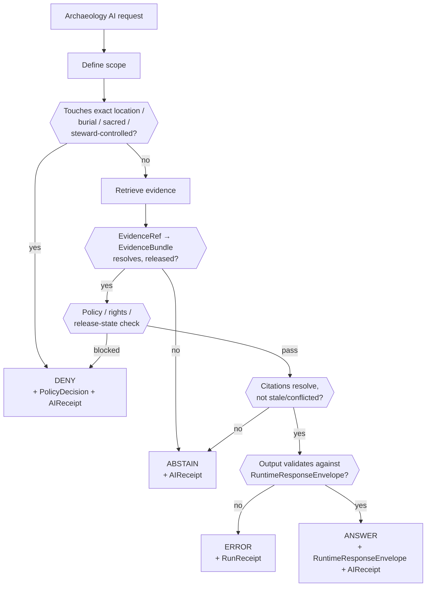

<!-- [KFM_META_BLOCK_V2]
doc_id: kfm://doc/PLACEHOLDER-uuid
title: Archaeology — Governed AI Behavior
type: standard
version: v1
status: draft
owners: <archaeology-domain-steward> + <governed-ai-steward> (PLACEHOLDER — confirm)
created: 2026-05-28
updated: 2026-05-28
policy_label: public
related: [docs/domains/archaeology/README.md, docs/domains/archaeology/cross-lane-relations.md, ai-build-operating-contract.md, policy/sensitivity/archaeology/]
tags: [kfm, archaeology, governed-ai, gai, sensitive-domain]
notes: [CONTRACT_VERSION = "3.0.0" pinned; repo paths/routes PROPOSED, repo not mounted this session]
[/KFM_META_BLOCK_V2] -->

<a id="top"></a>

# 🤖 Archaeology — Governed AI Behavior

> What AI may and may not do over the Archaeology / Cultural Heritage lane: evidence-first, policy-gated, exact-location-denied, and never the root truth source.


**Status:** `draft` · **Owners:** `<archaeology-domain-steward>` + `<governed-ai-steward>` (PLACEHOLDER) · **Updated:** 2026-05-28

> [!CAUTION]
> **Sensitive domain.** AI over Archaeology operates under a `DENY`-by-default posture. Exact site coordinates, burial, human remains, sacred sites, collection-security detail, and looting-risk exposure **fail closed** — the AI cannot disclose, infer, or reconstruct them, and must `DENY` requests that would. Disposition is governed by `ai-build-operating-contract.md` §23.2; this doc does **not** re-derive it.

---

## Quick jump

- [1. Scope](#1-scope)
- [2. Repo fit](#2-repo-fit)
- [3. The governed-AI ordering](#3-the-governed-ai-ordering)
- [4. What AI may do](#4-what-ai-may-do)
- [5. What AI must not do](#5-what-ai-must-not-do)
- [6. Outcomes: when to ANSWER, ABSTAIN, DENY, ERROR](#6-outcomes-when-to-answer-abstain-deny-error)
- [7. Decision flow](#7-decision-flow)
- [8. API and runtime surfaces](#8-api-and-runtime-surfaces)
- [9. AIReceipt and citation validation](#9-aireceipt-and-citation-validation)
- [10. Sensitivity posture for AI output](#10-sensitivity-posture-for-ai-output)
- [11. Open questions register](#open-questions-register)
- [12. Open verification backlog](#open-verification-backlog)
- [13. Changelog](#changelog-v0--v1)
- [14. Definition of done](#definition-of-done)
- [Related docs](#related-docs)

---

## 1. Scope

This document specifies **governed AI behavior** for the Archaeology / Cultural Heritage domain: the order in which AI must work, what it may produce, what it must refuse, the finite outcomes it can return, and the accountability artifacts it must emit.

> [!NOTE]
> **Truth labels in this doc.** The governed-AI behavior statement is `CONFIRMED` doctrine (Atlas §15.L), as is the contract's governed-AI ordering (`ai-build-operating-contract.md` §1.8) and the runtime outcome set (§8). API routes, schema homes, and validators are `PROPOSED` — doctrine names the surfaces; implementation is unverified in this session. No repository is mounted, so all paths/routes are `PROPOSED`.

The single anchoring statement (`CONFIRMED` doctrine / `PROPOSED` implementation, Atlas §15.L):

> AI may summarize released Archaeology `EvidenceBundle`s, compare evidence, explain limitations, and draft steward-review notes; AI must **`ABSTAIN`** when evidence is insufficient and **`DENY`** where policy, rights, sensitivity, or release state blocks the request.

[↑ Back to top](#top)

---

## 2. Repo fit

| Aspect | Value | Status |
|---|---|---|
| Proposed path | `docs/domains/archaeology/governed-ai-behavior.md` | `PROPOSED` |
| Owning responsibility root | `docs/` (explains something to humans) | `CONFIRMED` rule |
| Domain segment | `archaeology` as a lane inside `docs/`, never a root | `CONFIRMED` rule |
| Upstream (governs this doc) | `ai-build-operating-contract.md` §1.8, §8, §23.2; `[GAI]` doctrine | `CONFIRMED` rule / `PROPOSED` presence |
| Sibling lanes | `docs/domains/archaeology/README.md`, `docs/domains/archaeology/cross-lane-relations.md` | `PROPOSED` |
| Runtime counterpart | Provider-neutral model adapter + policy pre/post check + `AIReceipt` | `PROPOSED` |
| Policy counterpart | `policy/sensitivity/archaeology/` | `PROPOSED` |

**Directory Rules basis.** A doc that *explains to humans* belongs under `docs/`; a domain name is a **segment inside** a responsibility root, never a root folder. `archaeology` lives at `docs/domains/archaeology/`.

[↑ Back to top](#top)

---

## 3. The governed-AI ordering

`CONFIRMED` doctrine — `ai-build-operating-contract.md` §1.8. AI is **interpretive, not the root truth source**; `EvidenceBundle` outranks generated language. The AI MUST work in this order and MUST NOT let fluent generation stand in for evidence, policy, review state, source authority, or release state.

```text
define scope
  → retrieve evidence
  → resolve EvidenceRef to EvidenceBundle
  → apply policy and sensitivity checks
  → answer with traceability, bounded confidence, or narrowed scope
```

> [!IMPORTANT]
> For Archaeology specifically, the policy/sensitivity step is **not advisory**. If the request touches exact location, burial, sacred, or steward-controlled material, the sensitivity check forces `DENY` regardless of how much evidence exists. Evidence sufficiency never overrides the sensitivity floor.

[↑ Back to top](#top)

---

## 4. What AI may do

`CONFIRMED` doctrine (Atlas §15.L). Over **released** Archaeology evidence, AI may:

- **Summarize** released Archaeology `EvidenceBundle`s.
- **Compare** evidence across released bundles.
- **Explain limitations** — uncertainty, interpretation bounds, evidence gaps.
- **Draft steward-review notes** as candidate text for human review.

All four are *interpretive acts over released, policy-cleared evidence*. None of them constitute approval, release, or publication.

[↑ Back to top](#top)

---

## 5. What AI must not do

`CONFIRMED` doctrine (`[GAI]` guardrails; contract §1.8). The AI MUST NOT:

| Must not | Why |
|---|---|
| Disclose, infer, or reconstruct **exact site locations** | Looting / cultural-harm risk; fails closed under §23.2 |
| Treat rendered map features as evidence | Rendered features are *candidates*; `EvidenceBundle` carries truth support |
| Invent support from map pixels, feature properties, vector search, or model memory | Generation is not evidence |
| Return uncited authoritative claims | Every `ANSWER` claim must cite a resolvable `EvidenceRef` |
| Access `RAW` / `WORK` / `QUARANTINE` content as prompt context | No pre-release material reaches the model |
| Approve release, change review state, or publish | AI suggestions are not approvals |
| Persist hidden chain-of-thought as an evidence object | `AIReceipt` records accountability, **not** reasoning traces |
| Promote a `candidate` to a confirmed site | Anti-collapse rule; candidate ≠ observed |

> [!WARNING]
> A `CandidateFeature` (e.g., a remote-sensing or LiDAR anomaly) is **not** a confirmed `Archaeological Site`. AI must preserve that distinction in every summary and must never narrate an anomaly into a site.

[↑ Back to top](#top)

---

## 6. Outcomes: when to ANSWER, ABSTAIN, DENY, ERROR

`CONFIRMED` doctrine — the finite runtime outcome set (`ai-build-operating-contract.md` §8). For Archaeology, the trigger conditions are:

| Outcome | Trigger | Receipt |
|---|---|---|
| `ANSWER` | Released evidence is sufficient, citations resolve, no sensitivity/policy block | `RuntimeResponseEnvelope`, `AIReceipt` |
| `ABSTAIN` | Evidence insufficient, citation validation fails, or sources stale/conflicted with no resolution | `RuntimeResponseEnvelope`, `AIReceipt` |
| `DENY` | Policy, rights, sensitivity, or release state blocks the request (e.g., exact location, sacred/burial, unresolved cultural review) | `RuntimeResponseEnvelope`, `AIReceipt`, `PolicyDecision` |
| `ERROR` | System/tooling/validation failure, malformed input, broken dependency | `RuntimeResponseEnvelope`, `RunReceipt` |
| `NARROWED` / `BOUNDED` | Answer issued within tighter scope or with explicit confidence bounds | `RuntimeResponseEnvelope` (optional extension) |

> [!NOTE]
> `ABSTAIN` and `DENY` are different claims. `ABSTAIN` says *"not enough admissible evidence."* `DENY` says *"policy/sensitivity forbids this regardless of evidence."* For Archaeology, an exact-location request is always `DENY`, never `ABSTAIN`.

[↑ Back to top](#top)

---

## 7. Decision flow



> [!NOTE]
> `NEEDS VERIFICATION` — this flow reflects **doctrine ordering** (contract §1.8 + §8 + §21), not a verified runtime implementation. The sensitivity gate is placed first deliberately: it fails closed before any retrieval cost.

[↑ Back to top](#top)

---

## 8. API and runtime surfaces

`PROPOSED` governed surfaces (Atlas §15.J). Exact routes are `UNKNOWN` (no mounted repo).

| Endpoint or artifact | DTO / schema | Outcomes | Status |
|---|---|---|---|
| Archaeology feature/detail resolver; route TBD | `ArchaeologyDecisionEnvelope` | `ANSWER` / `ABSTAIN` / `DENY` / `ERROR` | `PROPOSED`; exact route `UNKNOWN` |
| Archaeology Evidence Drawer payload | `EvidenceDrawerPayload` + `EvidenceBundle` projection | `ANSWER` / `ABSTAIN` / `DENY` / `ERROR` | `PROPOSED`; evidence + policy filtered |
| Archaeology Focus Mode answer | `RuntimeResponseEnvelope` + `AIReceipt` | `ANSWER` / `ABSTAIN` / `DENY` / `ERROR` | `PROPOSED`; **AI never root truth** |
| Schema responsibility root | `schemas/contracts/v1/` | finite validator outcomes | `PROPOSED`; verify with Directory Rules + ADR |

> [!IMPORTANT]
> A Focus Mode answer is built from `EvidenceBundle` support, **not** from rendered features alone. Rendered features are candidates; the bundle carries truth support. A popup may summarize, but the Evidence Drawer resolves evidence and policy state.

[↑ Back to top](#top)

---

## 9. AIReceipt and citation validation

Every Archaeology inference emits an **`AIReceipt`** — the AI's promise of accountability. It records what the AI saw, what it was told to do, and what it produced, **without** persisting hidden chain-of-thought as evidence (`CONFIRMED` doctrine; schema `PROPOSED`, §21).

<details>
<summary><strong>AIReceipt shape (PROPOSED — §21)</strong></summary>

```text
AIReceipt {
  receipt_id: stable_id,
  provider_id: e.g., "ollama:local",
  model_pin: e.g., "model_name@sha256:…",
  parameter_pin: {temperature, top_p, seed, num_ctx, …},
  prompt_contract_hash: spec_hash(prompt_contract),
  context_refs: [EvidenceBundle.id, MapContextEnvelope.id, …],
  pre_policy_check: PolicyDecision.id,
  post_policy_check: PolicyDecision.id,
  citation_validation: CitationValidationReport.id,
  outcome: ANSWER | ABSTAIN | DENY | ERROR,
  reason_codes: [...],
  output_envelope_hash: spec_hash(RuntimeResponseEnvelope),
  timing_ms: int,
  timestamp_utc: ISO8601
}
```

</details>

**Citation validation rules** (`PROPOSED`, §21) applied to every Archaeology `ANSWER`:

1. Every claim cites at least one `EvidenceRef`.
2. Each cited `EvidenceRef` resolves to an `EvidenceBundle` in a **released** state.
3. Stale citations (freshness threshold exceeded) force `ABSTAIN` → `SOURCE_STALE`.
4. Conflicted citations are **surfaced, not silently picked**.
5. Structured output is validated against the runtime envelope schema before display; schema failure → `ERROR`.

> [!CAUTION]
> Local-runtime config matters. Default context windows can change between releases; `num_ctx` / context length must be **explicit and captured in `AIReceipt`**. Runtime-config drift triggers a fail-safe fallback.

[↑ Back to top](#top)

---

## 10. Sensitivity posture for AI output

The §23.2 row that governs AI output for this lane (`CONFIRMED` doctrine; defaults `PROPOSED` until steward ratification):

| Field | Value |
|---|---|
| Default disposition at public surface | `DENY` exact coordinates; generalize to county/region |
| Required transform before any release | Geometry generalization; redact precise UTM |
| Required reviewer beyond domain steward | Tribal/cultural reviewer; rights-holder rep |
| Required receipts/manifests | `RedactionReceipt`; `PolicyDecision`; `MapReleaseManifest` |

The AI does not perform these transforms or reviews; it **respects their outcomes**. AI may only summarize what has already cleared transform, review, and release. When any of those are missing or unresolved, the AI `DENY`s or `ABSTAIN`s — it never fills the gap with generation.

[↑ Back to top](#top)

---

## Open questions register

| ID | Question | Owner role | Resolution path |
|---|---|---|---|
| OQ-ARCH-GAI-01 | What is the exact route for the Archaeology Focus Mode answer endpoint? | governed-ai steward | repo inspection / ADR |
| OQ-ARCH-GAI-02 | Where does `ArchaeologyDecisionEnvelope` live — `schemas/contracts/v1/archaeology/` or a shared envelope home? | schema steward | Directory Rules §2.4 / ADR |
| OQ-ARCH-GAI-03 | What `reason_codes` vocabulary distinguishes Archaeology `DENY` causes (exact-location vs. sacred vs. unresolved review)? | governed-ai + archaeology stewards | ADR |
| OQ-ARCH-GAI-04 | Is there a dedicated "AI exact-location denial" validator, and where? | policy steward | repo inspection |

## Open verification backlog

These items remain `NEEDS VERIFICATION` before promotion from `draft` to `published`:

1. Confirm `docs/domains/archaeology/` exists or is created with a lane README.
2. Confirm the `AIReceipt` schema home and field set against the mounted repo.
3. Confirm citation-validation rules are implemented (currently `PROPOSED`, §21).
4. Confirm the §23.2 Archaeology defaults are ratified.
5. Confirm the "AI exact-location denial" test exists (Atlas §15.K lists it as `PROPOSED`).

## Changelog v0 → v1

| Change | Type (per contract §37) | Reason |
|---|---|---|
| Initial draft of Archaeology governed-AI behavior | new | Synthesizes Atlas §15.L + §15.J, contract §1.8/§8/§21, §23.2 |
| Pinned `CONTRACT_VERSION = "3.0.0"` | clarification | Doctrine-adjacent doc requirement |

> **Backward compatibility.** New document; no prior anchors to preserve. Section anchors are stable for future revisions.

## Definition of done

This document is done enough to enter the repository when:

- it is placed according to Directory Rules (`docs/domains/archaeology/`);
- a docs steward, the archaeology domain steward, and the governed-AI steward review it;
- it is linked from the archaeology lane README and the doctrine/GAI index;
- it does not conflict with accepted ADRs;
- any conflict with current repo conventions is logged in `docs/registers/DRIFT_REGISTER.md`;
- the `GENERATED_RECEIPT.json` planned in Section 2 is wired into CI;
- future changes follow the operating contract's §37 lifecycle.

---

## Related docs

- `docs/domains/archaeology/README.md` — archaeology lane landing page (`PROPOSED`)
- `docs/domains/archaeology/cross-lane-relations.md` — sibling cross-lane doc (`PROPOSED`)
- `ai-build-operating-contract.md` — §1.8 governed-AI rule, §8 outcomes, §21 AIReceipt, §23.2 matrix (canonical)
- `policy/sensitivity/archaeology/` — fail-closed policy home (`PROPOSED`)
- `docs/registers/DRIFT_REGISTER.md` — conflict log (`PROPOSED`)

**Last updated:** 2026-05-28 · `CONTRACT_VERSION = "3.0.0"`

[↑ Back to top](#top)
