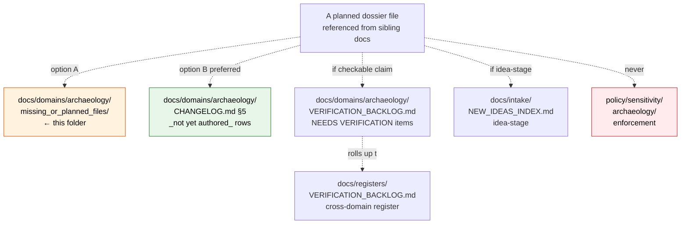

<!-- [KFM_META_BLOCK_V2]
doc_id: kfm://doc/docs-domains-archaeology-missing-or-planned-files-readme
title: Archaeology Dossier — missing_or_planned_files/ README
type: standard
version: v1
status: draft
owners: <TODO: archaeology-steward; docs-steward; sovereignty-review-liaison>
created: 2026-05-27
updated: 2026-05-27
policy_label: public
related:
  - docs/doctrine/ai-build-operating-contract.md
  - docs/doctrine/directory-rules.md
  - docs/domains/archaeology/README.md
  - docs/domains/archaeology/VERIFICATION_BACKLOG.md
  - docs/domains/archaeology/CHANGELOG.md
  - docs/registers/VERIFICATION_BACKLOG.md
  - docs/registers/DRIFT_REGISTER.md
  - docs/intake/NEW_IDEAS_INDEX.md
  - docs/adr/README.md
  - policy/sensitivity/archaeology/
tags: [kfm, archaeology, planning, dossier, governance, sensitive-domain]
notes:
  - CONTRACT_VERSION = "3.0.0" (pinned per ai-build-operating-contract.md §37).
  - Planning index ONLY — NEVER a content store for archaeology data.
  - Folder placement and naming are PROPOSED; potential ADR-class per Directory Rules §2.4(5) — see OQ-AR-MPF-01.
  - Inherits Archaeology domain sensitivity envelope: T4 default for site coords, T4 forever for human remains / sacred sites.
[/KFM_META_BLOCK_V2] -->

# Archaeology Dossier — `missing_or_planned_files/` README

> Per-folder README for a **planning index** inside the Archaeology dossier. Tracks the existence and intended scope of dossier files that have been referenced from sibling docs but **not yet authored** — and **forbids** the folder from becoming a content store for sensitive archaeological material.

  
  
  
  
  
  
  
  
  <!-- TODO: replace with live Shields.io endpoints (CI status, last-updated, sovereignty-review-status) once verified against the mounted repo. -->

**Status:** draft · **Owners:** _TODO: archaeology-steward; docs-steward; sovereignty-review-liaison_ · **Last updated:** 2026-05-27

> [!CAUTION]
> **This folder is a planning index. It is NOT a content store.** Archaeology defaults to **T4 (Denied)** for site coordinates and **T4 forever** for human remains, sacred sites, and sovereignty-sensitive material (Atlas v1.1 Ch. 24.5.2). Nothing in this folder may carry actual site geometry, coordinates, oral-history transcripts, cultural-knowledge notes, candidate-site lists, collection-security details, or any T4-class content — **even in draft, even commented out, even in filenames**. Enforcement of Archaeology sensitivity lives in `policy/sensitivity/archaeology/`, not here.

> [!WARNING]
> **Placement is PROPOSED and may be ADR-class.** This folder potentially creates a parallel home for planning/intake content already served by `docs/registers/VERIFICATION_BACKLOG.md`, the per-domain `VERIFICATION_BACKLOG.md`, the per-domain `CHANGELOG.md` `_not yet authored_` rows, and `docs/intake/NEW_IDEAS_INDEX.md`. Directory Rules §2.4(5) flags parallel registry homes as ADR-class. See [OQ-AR-MPF-01](#8-open-questions-register) for the resolution path. Until that ADR is filed and accepted, the folder MUST stay narrowly scoped per §3 below.

---

## 0. Status & Authority

| Field | Value |
|---|---|
| **Document type** | Per-folder README under the §15 contract. |
| **Edition** | v1 draft. |
| **Proposed repo path** | `docs/domains/archaeology/missing_or_planned_files/README.md` |
| **Folder class** | **Domain-internal subfolder** (PROPOSED). Not a canonical root, not a compatibility root. Sits beneath the canonical responsibility root `docs/` and the canonical per-domain dossier `docs/domains/archaeology/`. |
| **Placement basis** | **PROPOSED** — Directory Rules §4 Step 3 (domain-segment under canonical root) admits the parent; the subfolder itself is **PROPOSED** and **potentially ADR-class** per §2.4(5). See OQ-AR-MPF-01. |
| **Naming convention** | **PROPOSED — non-standard.** `missing_or_planned_files` uses lowercase_with_underscores; Directory Rules' documented folder conventions are lowercase (`runbooks/`) or lowercase-with-hyphens (`roads-rail-trade/`). A rename to `missing-or-planned-files/` would match the existing multi-word convention. Flagged at [OQ-AR-MPF-02](#8-open-questions-register). |
| **Operating contract** | `ai-build-operating-contract.md` — `CONTRACT_VERSION = "3.0.0"`. |
| **Sensitivity envelope** | **T4 inherited** from the Archaeology domain. Site location T4 default; human remains / sacred sites T4 forever (Atlas v1.1 Ch. 24.5.2). Sovereignty-review path required for any release (Atlas v1.1 Ch. 24.13). |
| **Sensitivity enforcement home** | `policy/sensitivity/archaeology/` (PROPOSED canonical, Atlas Ch. 24.13). **Not** this folder. |
| **Status of this file in any repo** | `draft` until reviewed and merged. AI-authored — `GENERATED_RECEIPT.json` required at merge per contract §34. |
| **Required reviewers** | Docs steward + Archaeology-domain steward + policy steward + sovereignty-review liaison + AI surface steward (receipt review per contract §33). |

---

## Contents

1. [Purpose and scope](#1-purpose-and-scope)
2. [Authority level and folder class (§15 contract)](#2-authority-level-and-folder-class-15-contract)
3. [What belongs here](#3-what-belongs-here)
4. [What does NOT belong here](#4-what-does-not-belong-here)
5. [Inputs, outputs, validation, review burden (§15 contract)](#5-inputs-outputs-validation-review-burden-15-contract)
6. [Relationship to existing planning surfaces](#6-relationship-to-existing-planning-surfaces)
7. [Sensitivity envelope (inherited)](#7-sensitivity-envelope-inherited)
8. [Open questions register](#8-open-questions-register)
9. [Open verification backlog](#9-open-verification-backlog)
10. [Definition of done](#10-definition-of-done)
11. [Related docs and ADRs](#11-related-docs-and-adrs)

---

## 1. Purpose and scope

This folder exists to **track placeholders** for Archaeology dossier files that have been referenced from sibling documents but not yet authored — and to **prevent those placeholders from quietly accumulating sensitive content** under a benign folder name.

### What this folder does

- Holds a **planning index** (this README plus, optionally, very thin per-file stubs that contain only forward-looking metadata).
- Names files that other Archaeology dossier docs reference as TODO targets, so reviewers can see in one place what is promised but not delivered.
- Surfaces the placement and naming question (OQ-AR-MPF-01, OQ-AR-MPF-02) for ADR resolution.

### What this folder is NOT

- Not a register. Not a backlog. Not an intake. Not a CHANGELOG. Not a sensitivity policy.
- Not a substitute for `docs/registers/VERIFICATION_BACKLOG.md` or the per-domain `VERIFICATION_BACKLOG.md` (when they exist).
- Not a substitute for the `CHANGELOG.md` `_not yet authored_` row pattern.
- Not a holding pen for sensitive archaeological material in any form.

> [!IMPORTANT]
> If a planned file's content turns out to need sensitive material (e.g., a draft of `PRESERVATION_MATRIX.md` discussing site-specific transforms), that file is authored **outside this folder** — under the proper responsibility root (`policy/sensitivity/archaeology/` for policy text, `data/quarantine/` for unresolved candidate material, etc.). This folder receives only the **stub marker**, not the content.

[↑ Back to top](#contents)

---

## 2. Authority level and folder class (§15 contract)

Per Directory Rules §15, every folder has a README declaring its class. This folder's declaration:

| §15 field | Value |
|---|---|
| **Purpose** | Planning index for not-yet-authored files referenced from the Archaeology dossier; surfaces ADR-class placement question. |
| **Authority level** | **Domain-internal subfolder.** **Not** canonical. **Not** compatibility. The class is **PROPOSED**; if adopted across domains, it would need an entry in Directory Rules §6.1. |
| **Compatibility class** (if compatibility) | N/A. |
| **Status** | **PROPOSED.** Subject to ADR-class review per Directory Rules §2.4(5). |
| **What belongs here** | See [§3](#3-what-belongs-here). Narrow. |
| **What does NOT belong here** | See [§4](#4-what-does-not-belong-here). Broad and explicit. |
| **Inputs** | TODO references from sibling Archaeology dossier docs (e.g., `README.md`, `VERIFICATION_BACKLOG.md`, `CHANGELOG.md`); no source-data inputs. |
| **Outputs** | Planning visibility only. No artifacts feed downstream consumers. |
| **Validation** | Stub-file content scan: no T4-class material may appear in any file in this folder. Validator PROPOSED; see [§9 item 4](#9-open-verification-backlog). |
| **Review burden** | Docs steward + archaeology-domain steward + sovereignty-review liaison on every PR touching this folder. |
| **Related folders** | `docs/domains/archaeology/` (parent), `docs/registers/`, `docs/intake/`, `policy/sensitivity/archaeology/`. |
| **ADRs** | **NEEDS** — ADR proposed to resolve OQ-AR-MPF-01 (does this folder pass §2.4(5)?). |
| **Last reviewed** | 2026-05-27. |

[↑ Back to top](#contents)

---

## 3. What belongs here

CONFIRMED narrow scope. The full list:

- **This README** (`README.md`) — the §15-contract README you are reading.
- **Optional thin stub files**, one per planned dossier file, named identically to the planned file (e.g., `ARCHITECTURE.md`, `PRESERVATION_MATRIX.md`). Each stub MUST contain only:
  - the KFM Meta Block v2 with `status: planned`;
  - a one-paragraph statement of intended scope (no archaeological content);
  - a link to the doc(s) that reference it as a TODO;
  - a target authoring date (PROPOSED) and owner role;
  - the same sensitivity callout from §0 of this README.
- Nothing else.

Stub files SHOULD remain under ~30 lines. A stub that grows beyond that is signaling it should become an authored draft — at which point it belongs in `docs/domains/archaeology/` (the parent), not here.

> [!TIP]
> The cleanest pattern is: no per-file stubs at all. List planned files in the Archaeology `CHANGELOG.md` §5 `_not yet authored_` rows (the pattern established for the Agriculture dossier) and use this folder for the README alone. Per-file stubs are PROPOSED here only because the folder exists by request.

[↑ Back to top](#contents)

---

## 4. What does NOT belong here

EXPLICIT deny list. The §15 contract treats "what does NOT belong" as load-bearing as "what does belong." For an archaeology subfolder, that list is broader and stricter than usual.

**Sensitivity-class deny (T4-inherited, ABSOLUTE):**

- ❌ Archaeological site coordinates, exact or generalized.
- ❌ Site names, codes, or identifiers tied to a real location.
- ❌ Human remains location, burial site, or sacred-site information.
- ❌ Oral history transcripts or cultural-knowledge notes.
- ❌ Sovereignty-sensitive material of any kind (treaty, tribal-relationship, repatriation context).
- ❌ Private landowner details, collection-security details, looting-risk exposure.
- ❌ Candidate features that have not cleared sovereignty review.
- ❌ Field-survey records, excavation records, provenience packets.
- ❌ Artifact / collection / repository records.
- ❌ Source-credential information (SHPO access tokens, lab-report credentials, etc.).
- ❌ Anything that, if leaked, would violate a `policy/sensitivity/archaeology/` rule.

**Authority-class deny:**

- ❌ Sensitivity-policy text (lives in `policy/sensitivity/archaeology/`).
- ❌ Object-family contract text (lives in `contracts/archaeology/`).
- ❌ Schema files (live in `schemas/contracts/v1/archaeology/` or `schemas/contracts/v1/domains/archaeology/` per the open schema-home question, ADR-S-01).
- ❌ Source descriptors (live in `data/registry/sources/archaeology/`).
- ❌ Release manifests, rollback cards, correction notices (live in `release/`).
- ❌ Verification-backlog items (live in `docs/domains/archaeology/VERIFICATION_BACKLOG.md` per-domain or `docs/registers/VERIFICATION_BACKLOG.md` cross-domain).
- ❌ Idea-intake candidates (live in `docs/intake/`).
- ❌ Receipts of any kind (`RunReceipt`, `AIReceipt`, `GENERATED_RECEIPT.json`, `RedactionReceipt`, `AggregationReceipt`).

**Operational deny:**

- ❌ AI-drafted summaries of archaeological content, even abstracted.
- ❌ Commented-out content (commented sensitive material is still sensitive material).
- ❌ Filenames that themselves reveal site names or identifiers.
- ❌ Any content that would benefit from a `RealityBoundaryNote` to render safely.

> [!CAUTION]
> If a contributor finds themselves writing a deny-listed item into a file here, the file does not belong in this folder. Stop, move the work to the proper responsibility root, and quarantine any in-progress draft per `policy/sensitivity/archaeology/` (PROPOSED). When in doubt, **abstain and route to the archaeology-domain steward**.

[↑ Back to top](#contents)

---

## 5. Inputs, outputs, validation, review burden (§15 contract)

| §15 field | Detail |
|---|---|
| **Inputs** | TODO references and `_not yet authored_` markers from sibling Archaeology dossier docs. No source-data inputs of any kind. No connector output. No AI-drafted archaeological content. |
| **Outputs** | Planning visibility only. Reviewers learn which dossier files are promised but not delivered. **No downstream consumer** (pipeline, governed-API route, catalog matrix, release manifest) reads from this folder. |
| **Validation** | (PROPOSED) `tests/domains/archaeology/test_missing_or_planned_files_no_t4_leak.py` — a content scan asserting that no file in this folder contains site coordinates, identifiers, sensitive geometry, or terms blacklisted by `policy/sensitivity/archaeology/`. Failure-closed: PR rejected at CI. |
| **Review burden** | Every PR touching this folder requires: docs steward + archaeology-domain steward + sovereignty-review liaison. PRs that add stub files require an explicit acknowledgement that the stub contains no archaeological content. AI-authored PRs additionally require AI surface steward review per contract §33. |
| **Related folders** | `docs/domains/archaeology/` (parent dossier), `docs/registers/` (cross-domain registers), `docs/intake/` (idea intake), `policy/sensitivity/archaeology/` (sensitivity enforcement), `data/quarantine/` (unresolved candidate material). |
| **ADRs governing this folder** | None yet accepted. ADR proposed for OQ-AR-MPF-01 (parallel-home question) and optionally OQ-AR-MPF-02 (naming convention). |
| **Last reviewed** | 2026-05-27. |

[↑ Back to top](#contents)

---

## 6. Relationship to existing planning surfaces

PROPOSED. The KFM doctrine stack already has several planning surfaces. This folder, if retained, must not duplicate them.

| Surface | Tracks | Why this folder is not a replacement |
|---|---|---|
| **`CHANGELOG.md` §5 `_not yet authored_` rows** (preferred) | Files referenced as TODO across the dossier | Lighter, single-file, already established for the Agriculture dossier; no parallel-home concern. |
| **`VERIFICATION_BACKLOG.md`** (per-domain) | Items that NEEDS VERIFICATION | Tracks claims to verify, not files to write. Different object of trust. |
| **`docs/registers/VERIFICATION_BACKLOG.md`** | Cross-domain roll-up | Same as above, broader scope. |
| **`docs/intake/`** | Idea-stage candidates not yet promoted to dossier scope | Wrong stage; intake is for ideas, not for files already promised in dossier docs. |
| **`policy/sensitivity/archaeology/`** | Sensitivity enforcement | Authority, not planning. This folder never substitutes for policy. |

> [!IMPORTANT]
> The **preferred** path forward is to track not-yet-authored Archaeology dossier files as `_not yet authored_` rows in `docs/domains/archaeology/CHANGELOG.md` §5 (mirroring the Agriculture dossier pattern), and to retire this folder once OQ-AR-MPF-01 is resolved. The folder is honored here because it was requested; the README does not pretend the folder is essential.

[↑ Back to top](#contents)

---

## 7. Sensitivity envelope (inherited)

The Archaeology domain's sensitivity envelope (CONFIRMED, Atlas v1.1 Ch. 24.5.2) flows into this folder unchanged:

| Object class | Default tier | Allowed transforms | Required gates |
|---|---|---|---|
| Archaeological site location | **T4** | Steward + cultural review + generalized geometry (coarse cell) + `RedactionReceipt` → T2 / T1. | `RedactionReceipt` + `ReviewRecord` + `PolicyDecision`. |
| Human remains / sacred sites | **T4 forever** | No transform releases this to T0; T3 only under explicit named authorization. | Sovereignty review + `ReviewRecord` + `PolicyDecision`. |
| Oral history / cultural knowledge | **Source-rights NEEDS VERIFICATION; sensitive joins fail closed** (Atlas v1.0 Ch. 15 §D). | Per source rights; default deny. | Source-rights review + steward review. |
| Private landowner / collection-security details | **T4** | None permit public release without policy + steward review. | `PolicyDecision` + `ReviewRecord`. |
| `CandidateFeature` (not yet promoted) | Held in WORK / QUARANTINE | Not public; promotion requires review. | Promotion gate; no PUBLISHED edge to WORK / QUARANTINE. |

This folder participates in the envelope by hosting **none of the above**. It is a planning index. The envelope is named here so reviewers and contributors know what they are committing to keep out.

> [!CAUTION]
> **KFM is never an alert authority** (Atlas v1.1 Ch. 24.13, Hazards row — but the principle applies whenever public exposure is at stake). For Archaeology, that principle reads: **KFM is never an aggregator of site locations, even in draft folders**. The deny boundary holds here too.

[↑ Back to top](#contents)

---

## 8. Open questions register

PROPOSED. Questions about this folder, distinct from Archaeology-domain verification items.

| ID | Question | Owner role | Resolution path |
|---|---|---|---|
| **OQ-AR-MPF-01** | Does `docs/domains/<domain>/missing_or_planned_files/` create a **parallel registry home** under Directory Rules §2.4(5)? If yes, ADR required before adoption beyond this initial placement. Preferred-path question: should this concern retire the folder in favor of the `CHANGELOG.md` `_not yet authored_` rows pattern? | Docs steward + Directory-Rules editor + archaeology-domain steward | ADR; alternatively a Directory Rules §6.1 amendment to legitimize per-domain planning subfolders. |
| **OQ-AR-MPF-02** | Should the folder be renamed `missing-or-planned-files/` (lowercase-with-hyphens) to match the existing multi-word folder convention (`roads-rail-trade/`, `people-dna-land/`)? `missing_or_planned_files` (underscores) does not match Directory Rules §6.1.a's documented conventions. | Docs steward | Routine rename in the same PR sequence as OQ-AR-MPF-01 if folder is retained. |
| **OQ-AR-MPF-03** | Should the **planned-file stub** pattern (PROPOSED in §3) be canonized or rejected? Per-file stubs are easy to misuse as drafts; a single index inside this README may suffice. | Docs steward + archaeology-domain steward | Convention vote; codify in this README or in `docs/doctrine/` if generalized. |
| **OQ-AR-MPF-04** | If this folder is generalized across all 16 domains (`docs/domains/<domain>/missing_or_planned_files/`), what is the minimum sensitivity envelope each domain inherits? Archaeology, Fauna, Flora, People/DNA, Settlements/Infrastructure-critical assets, and Hazards all carry T4 lanes — each needs its own deny list. | Docs steward + each domain steward | ADR; produce a template README per domain. |
| **OQ-AR-MPF-05** | Should the validator `tests/domains/archaeology/test_missing_or_planned_files_no_t4_leak.py` (PROPOSED §5) be a **repo-wide** scanner across all dossier subfolders, or stay domain-scoped? | Docs steward + policy steward | ADR if cross-domain. |

[↑ Back to top](#contents)

---

## 9. Open verification backlog

PROPOSED. Items that remain `NEEDS VERIFICATION` for this file (and this folder) before promotion from `draft` to `published`.

1. Confirm placement at `docs/domains/archaeology/missing_or_planned_files/README.md` exists (or land it there).
2. Confirm `docs/domains/archaeology/README.md` exists and references this folder; if it does not, that absence is a gap, not drift.
3. Confirm `docs/domains/archaeology/CHANGELOG.md` (PROPOSED, parallel to the Agriculture pattern) is the **preferred** alternative — i.e., that adopting the `_not yet authored_` row pattern there would supersede this folder's purpose.
4. Confirm the PROPOSED validator (`test_missing_or_planned_files_no_t4_leak.py`) is feasible against `policy/sensitivity/archaeology/` term lists; if `policy/sensitivity/archaeology/` does not yet define a term list, defer to OQ-AR-MPF-01 / OQ-AR-MPF-05.
5. Confirm `archaeology-steward`, `docs-steward`, `sovereignty-review-liaison`, and `policy-steward` are roles defined in `CODEOWNERS` (or equivalent).
6. Confirm `GENERATED_RECEIPT.json` for this file's authorship is emitted at merge and references `CONTRACT_VERSION = "3.0.0"`.
7. Confirm any in-flight or accidentally-committed stub files in this folder pass the deny list in §4. If not, quarantine immediately.

[↑ Back to top](#contents)

---

## 10. Definition of done

This README (and the folder it documents) is done enough to enter the repository when:

- the folder is placed at `docs/domains/archaeology/missing_or_planned_files/` per Directory Rules §4 Step 3, **with this README at its root**;
- a docs steward, the archaeology-domain steward, the policy steward, and a sovereignty-review liaison have reviewed and approved it;
- it is linked from `docs/domains/archaeology/README.md` (when authored) and from any sibling doc that references planned dossier files;
- **OQ-AR-MPF-01 has at minimum been filed as a PROPOSED ADR** — the folder MAY land before the ADR is accepted, but MUST NOT land without the ADR being open;
- any conflict between this folder and the preferred `CHANGELOG.md` `_not yet authored_` row pattern is logged in `docs/registers/DRIFT_REGISTER.md`;
- the PROPOSED validator from §5 is at least planned (a `tests/domains/archaeology/` issue exists, even if the test is not yet written);
- the `GENERATED_RECEIPT.json` planned for AI authorship is wired into CI per contract §34 with `CONTRACT_VERSION = "3.0.0"`;
- no file in the folder, including this README, contains any T4-class archaeological content per §4;
- future changes follow contract §37 lifecycle.

[↑ Back to top](#contents)

---

## 11. Related docs and ADRs

PROPOSED links. All paths are PROPOSED until verified against a mounted repo.

- [`docs/doctrine/ai-build-operating-contract.md`](../../../doctrine/ai-build-operating-contract.md) — _TODO_ — operating contract v3.0; `CONTRACT_VERSION = "3.0.0"`.
- [`docs/doctrine/directory-rules.md`](../../../doctrine/directory-rules.md) — _TODO_ — placement, ADR triggers (§2.4), §15 per-folder README contract.
- [`../README.md`](../README.md) — _TODO_ — Archaeology domain README (existence NEEDS VERIFICATION).
- [`../VERIFICATION_BACKLOG.md`](../VERIFICATION_BACKLOG.md) — _TODO_ — Archaeology verification backlog (per-domain).
- [`../CHANGELOG.md`](../CHANGELOG.md) — _TODO_ — Archaeology dossier changelog (PROPOSED; preferred home for `_not yet authored_` rows).
- [`docs/registers/VERIFICATION_BACKLOG.md`](../../../registers/VERIFICATION_BACKLOG.md) — _TODO_ — cross-domain register.
- [`docs/registers/DRIFT_REGISTER.md`](../../../registers/DRIFT_REGISTER.md) — _TODO_ — drift between this folder and the preferred pattern (when applicable).
- [`docs/intake/NEW_IDEAS_INDEX.md`](../../../intake/NEW_IDEAS_INDEX.md) — _TODO_ — idea-stage candidates (different stage than this folder).
- [`docs/adr/README.md`](../../../adr/README.md) — _TODO_ — ADR index; OQ-AR-MPF-01 and OQ-AR-MPF-02 to be filed here.
- [`policy/sensitivity/archaeology/`](../../../../policy/sensitivity/archaeology/) — _TODO_ — sensitivity enforcement (canonical per Atlas v1.1 Ch. 24.13).

**ADRs governing this folder (when filed):**

- ADR-PROPOSED — Parallel-home question for per-domain `missing_or_planned_files/` subfolders (OQ-AR-MPF-01).
- ADR-S-NN (PROPOSED) — Per-domain sensitivity-aware planning-subfolder template, if generalized (OQ-AR-MPF-04).

---

> [!NOTE]
> **Last updated:** 2026-05-27 · **Edition:** v1 draft · **`CONTRACT_VERSION = "3.0.0"`** · **Folder class:** domain-internal subfolder (PROPOSED) · **Sensitivity:** T4 inherited · **Authority:** Directory Rules §15 per-folder README contract.

[↑ Back to top](#contents)
