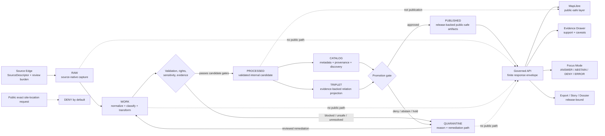
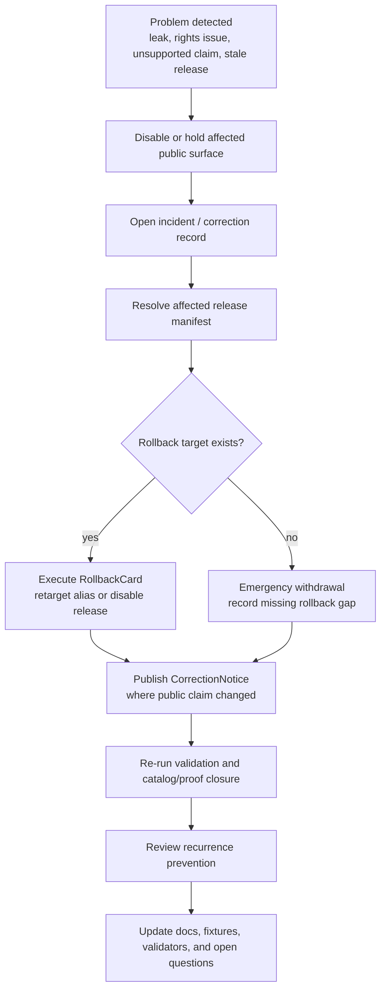

<!-- [KFM_META_BLOCK_V2]
doc_id: kfm://doc/NEEDS-VERIFICATION-docs-domains-archaeology-operations-data-lifecycle
title: Archaeology Data Lifecycle
type: standard
version: v1
status: draft
owners: TODO-NEEDS-OWNER
created: NEEDS-VERIFICATION-YYYY-MM-DD
updated: 2026-05-06
policy_label: NEEDS-VERIFICATION-public-or-restricted
related: [../README.md, ../architecture/ARCHITECTURE.md, ../architecture/DOMAIN_MODEL.md, ../governance/SOURCE_REGISTRY.md, ../governance/SENSITIVITY_AND_RIGHTS.md, ../governance/VALIDATION_AND_POLICY.md, ../governance/CATALOG_AND_PROOF_OBJECTS.md, ../governance/FILE_MAP.md, ../governance/OPEN_QUESTIONS.md, ./RUNBOOK.md, ./PROMOTION_AND_ROLLBACK.md, ../../../doctrine/lifecycle-law.md]
tags: [kfm, archaeology, data-lifecycle, evidence, sensitivity, rights, quarantine, publication, rollback]
notes: [Revises the existing short DATA_LIFECYCLE.md stub into an operations-grade lifecycle guide. doc_id, owners, created date, policy label, schema-home authority, machine validator coverage, CI workflow enforcement, runtime API/UI behavior, steward review process, and active source posture remain NEEDS VERIFICATION.]
[/KFM_META_BLOCK_V2] -->

<a id="top"></a>

# Archaeology Data Lifecycle

Operational lifecycle rules for moving archaeology evidence from source intake to public-safe release without exposing sensitive locations, weakening provenance, or bypassing KFM’s governed trust membrane.

<p align="center">
  
  
  
  
  
  
</p>

> [!IMPORTANT]
> **Status:** `draft`  
> **Owners:** `TODO-NEEDS-OWNER`  
> **Path:** `docs/domains/archaeology/operations/DATA_LIFECYCLE.md`  
> **Owning root:** `docs/` — human-facing domain operations guidance.  
> **Document posture:** `CONFIRMED` for the lifecycle doctrine and visible archaeology documentation surface; `PROPOSED` for machine lifecycle artifacts and command examples; `UNKNOWN / NEEDS VERIFICATION` for active validators, policies, workflows, release objects, source descriptors, API routes, UI components, and runtime behavior.

## Quick navigation

| Start here | Lifecycle | Controls | Review |
|---|---|---|---|
| [Scope](#scope) | [Truth path](#truth-path) | [Archaeology-specific gates](#archaeology-specific-gates) | [Definition of done](#definition-of-done) |
| [Repo fit](#repo-fit) | [Lifecycle map](#lifecycle-map) | [Storage and artifact posture](#storage-and-artifact-posture) | [Open verification](#open-verification) |
| [Accepted inputs](#accepted-inputs) | [State semantics](#state-semantics) | [Validation and promotion checks](#validation-and-promotion-checks) | [Maintenance checklist](#maintenance-checklist) |
| [Exclusions](#exclusions) | [Allowed transitions](#allowed-transitions) | [Incident and rollback flow](#incident-and-rollback-flow) | [Appendix](#appendix) |

> [!WARNING]
> Archaeology lifecycle controls are public-safety controls. Exact archaeological site locations, burial or human-remains context, sacred or culturally sensitive places, private-land access details, and collection-security details are denied on public surfaces by default. Public output requires reviewed public-safe representation and release-backed evidence.

---

## Scope

This file defines how archaeology material should move through the KFM lifecycle:

```text
SOURCE EDGE -> RAW -> WORK / QUARANTINE -> PROCESSED -> CATALOG / TRIPLET -> PUBLISHED
```

It is the operational companion for archaeology intake, transformation, quarantine, validation, catalog closure, release, correction, and rollback.

It covers:

- archaeology source packets and source descriptors;
- source-native records, reports, scans, rasters, imagery, field packets, lab results, and candidate-feature material;
- restricted exact geometry and public-safe transformed geometry;
- evidence resolution and public claim support;
- lifecycle state transitions and failure outcomes;
- release manifests, transform receipts, proof objects, correction notices, and rollback cards;
- governed API, MapLibre, Evidence Drawer, Focus Mode, export, and story handoff expectations.

It does **not** prove that executable validators, schemas, policies, CI workflows, source registries, release bundles, or runtime routes already enforce this lifecycle. Those claims require current repo implementation evidence.

[Back to top](#top)

---

## Repo fit

| Relationship | Path | Status | Role |
|---|---|---:|---|
| Current file | `docs/domains/archaeology/operations/DATA_LIFECYCLE.md` | `CONFIRMED file exists` | Lifecycle operations guide for the archaeology lane |
| Lane landing page | [`../README.md`](../README.md) | `CONFIRMED` | Lane overview and exact-location warning |
| Architecture boundary | [`../architecture/ARCHITECTURE.md`](../architecture/ARCHITECTURE.md) | `CONFIRMED` | Lifecycle layering, trust membrane, runtime boundary |
| Domain model | [`../architecture/DOMAIN_MODEL.md`](../architecture/DOMAIN_MODEL.md) | `CONFIRMED` | Archaeology object families, geometry profiles, evidence claims |
| Source registry guide | [`../governance/SOURCE_REGISTRY.md`](../governance/SOURCE_REGISTRY.md) | `CONFIRMED` | Source descriptors, roles, activation states |
| Sensitivity and rights | [`../governance/SENSITIVITY_AND_RIGHTS.md`](../governance/SENSITIVITY_AND_RIGHTS.md) | `CONFIRMED` | High-sensitivity classes, release requirements, denial triggers |
| Validation and policy | [`../governance/VALIDATION_AND_POLICY.md`](../governance/VALIDATION_AND_POLICY.md) | `CONFIRMED` | Validation gates and finite policy outcomes |
| Catalog and proof objects | [`../governance/CATALOG_AND_PROOF_OBJECTS.md`](../governance/CATALOG_AND_PROOF_OBJECTS.md) | `CONFIRMED` | Catalog closure and proof expectations |
| File map | [`../governance/FILE_MAP.md`](../governance/FILE_MAP.md) | `CONFIRMED` | Archaeology documentation surface map |
| Open questions | [`../governance/OPEN_QUESTIONS.md`](../governance/OPEN_QUESTIONS.md) | `CONFIRMED` | Owner, schema-home, steward, API/UI, policy-runtime gaps |
| Runbook | [`./RUNBOOK.md`](./RUNBOOK.md) | `CONFIRMED` | Operator checklist and incident response |
| Promotion and rollback | [`./PROMOTION_AND_ROLLBACK.md`](./PROMOTION_AND_ROLLBACK.md) | `CONFIRMED` | Promotion requirements and rollback rules |
| Shared lifecycle doctrine | [`../../../doctrine/lifecycle-law.md`](../../../doctrine/lifecycle-law.md) | `CONFIRMED` | Project-wide lifecycle law and trust path |

### Directory Rules basis

This file belongs in `docs/domains/archaeology/operations/` because it is a human-facing domain operations guide. Domain-specific lifecycle data, policies, validators, tests, schemas, and releases should live under their responsibility roots, not under a new root-level `archaeology/` folder.

Candidate machine homes remain `NEEDS VERIFICATION` until active repo conventions and ADRs confirm them.

[Back to top](#top)

---

## Accepted inputs

Accepted inputs are candidates for governed intake. They do not become public by entering the lifecycle.

| Input family | Examples | First required state | Required before processing |
|---|---|---|---|
| Source proposals | New source family, report collection, archive, agency export, steward packet | `SOURCE EDGE` | SourceDescriptor draft, source role, rights posture, sensitivity defaults |
| Source-native files | PDFs, spreadsheets, scans, images, shapefiles, rasters, point clouds, exports | `RAW` | Intake receipt, source refs, checksums where practical |
| Field and survey packets | Survey forms, transects, observations, excavation/test units, field notes | `RAW` then `WORK` | Provenance, source role, spatial precision, sensitivity class |
| Site and component records | Site records, components, features, provenience contexts, stratigraphic units | `WORK` / `PROCESSED` | EvidenceRefs, review state, restricted geometry profile |
| Artifact and assemblage records | Artifacts, assemblages, repository references, collections context | `WORK` / `PROCESSED` | Provenience, collection/security review, public field allowlist |
| Lab and chronometric records | Samples, lab results, dates, calibration notes, method context | `WORK` / `PROCESSED` | Method, uncertainty, sample lineage, citation support |
| Reports and archival sources | Gray literature, bibliographic records, historic maps, archival descriptions | `SOURCE EDGE` / `RAW` | Rights, citation expectations, source-role mapping |
| Steward or cultural knowledge | Oral history, tribal/cultural context, restricted steward knowledge | `QUARANTINE` or restricted `WORK` until reviewed | Permission, role-gated review, public-deny default |
| Remote sensing and geophysics | LiDAR, aerial/satellite imagery, GPR, magnetometry, resistivity, model anomalies | `WORK` candidate | Candidate-feature status, uncertainty, no confirmed-site implication |
| Public derivatives | Generalized summaries, public-safe survey coverage, public layer descriptors | `PUBLISHED` only after release | Transform receipt, EvidenceBundle, policy decision, release manifest, rollback card |

---

## Exclusions

| Excluded from this lifecycle doc | Why | Correct handling |
|---|---|---|
| Public exact archaeological site coordinates | High sensitivity and looting risk | Restricted/steward-only lifecycle path; public `DENY` by default |
| Burial, human remains, sacred-site, or culturally sensitive exact locations | High consequence and steward/cultural review burden | Restricted review path; public withheld, generalized, or suppressed only if approved |
| Private landowner identity, access routes, or access permissions | Privacy and site-security risk | Restricted operational/steward context |
| Collection storage or security-sensitive details | Collection and looting risk | Restricted operations/security context |
| Unknown-rights source material in public release | Rights and redistribution are unresolved | `QUARANTINE`, `DENY`, or hold for review |
| Unreviewed anomaly labeled as a site | Candidate evidence is not confirmation | Candidate feature with review state |
| RAW, WORK, or QUARANTINE references in public payloads | Breaks lifecycle law and public trust membrane | Governed DTOs backed by released artifacts |
| Direct model output as evidence | AI is interpretive, not a source of truth | Evidence-bounded runtime envelope with validated citations |
| Graph, search, vector, tile, export, dashboard, story, or scene as canonical truth | Derived surfaces are rebuildable carriers | Link to canonical evidence, catalog/proof closure, and release manifest |
| Secrets, credentials, private steward contacts, or restricted access notes | Public docs must not leak operational controls | Secret manager, restricted runbook, or steward-only system |

[Back to top](#top)

---

## Truth path

The lifecycle is a **governed truth path**, not a folder convention.

```text
SOURCE EDGE -> RAW -> WORK / QUARANTINE -> PROCESSED -> CATALOG / TRIPLET -> PUBLISHED
```

For archaeology, each boundary carries a public-safety burden:

1. **Source edge** determines whether the source is eligible for intake.
2. **RAW** preserves source-native evidence and integrity.
3. **WORK** transforms and classifies material without public exposure.
4. **QUARANTINE** holds invalid, unsafe, rights-unclear, unsupported, or steward-blocked material.
5. **PROCESSED** contains validated candidates, still not public truth.
6. **CATALOG / TRIPLET** makes material discoverable or linkable without authorizing publication by itself.
7. **PUBLISHED** exposes only release-backed, public-safe artifacts through governed surfaces.

> [!IMPORTANT]
> `PROCESSED` is not `PUBLISHED`. A validated archaeology record still needs evidence closure, rights and sensitivity review, policy decision, catalog/proof closure, review state, release manifest, correction path, and rollback target before public exposure.

---

## Lifecycle map



[Back to top](#top)

---

## State semantics

| State | What belongs here | Required records | Must not do |
|---|---|---|---|
| `SOURCE EDGE` | Source discovery, source terms, source proposals, steward constraints, candidate source descriptors | Draft `SourceDescriptor`, source-role claim, rights/sensitivity defaults, open verification notes | Treat source availability as permission to ingest or publish |
| `RAW` | Source-native files and payloads preserved for audit | Intake receipt, source refs, checksum/digest where practical, retrieval context | Mutate in place, normalize silently, serve publicly, or strip source-native context |
| `WORK` | OCR, georeferencing, extraction, normalization, classification, joins, public-geometry transforms under review, candidate-feature processing | Run receipt, transform parameters, tool/version context, validation draft, sensitivity review notes | Serve public UI/API/layers, treat anomalies as confirmed sites, or overwrite without receipt |
| `QUARANTINE` | Invalid, unsupported, rights-unclear, steward-blocked, sensitive, ambiguous, or unsafe material | Quarantine reason, failed gate, reviewer/remediation path, affected source/artifact refs | Become shadow production, be deleted without disposition, or feed public outputs |
| `PROCESSED` | Normalized and validated internal candidate artifacts, restricted canonical records, public-safe candidate derivatives awaiting release | Validation report, artifact digests, evidence refs, sensitivity/rights posture | Act as public source of truth or bypass release review |
| `CATALOG` | Metadata, discovery records, STAC/DCAT/PROV-style closure, dataset/layer summaries, catalog matrix candidates | Catalog record, provenance refs, rights/access metadata, evidence and release candidate refs | Expose restricted geometry in metadata or imply release by discoverability |
| `TRIPLET` | Evidence-backed relationship projections for graph/navigation/cross-domain discovery | Relation evidence, projection receipt, source-role support, confidence/caveat fields | Replace canonical evidence, leak restricted relation detail, or support unsupported inference |
| `PUBLISHED` | Released public-safe artifacts, governed DTOs, public-safe layers, exports, story payloads, approved Evidence Drawer and Focus context | Release manifest, proof refs, PolicyDecision, ReviewRecord, transform receipt if needed, correction path, rollback card | Publish by file move, leak restricted fields, silently overwrite, or omit rollback/correction |

[Back to top](#top)

---

## Allowed transitions

| Transition | Allowed when | Emits or requires | Failure outcome |
|---|---|---|---|
| `SOURCE EDGE -> RAW` | Source descriptor is reviewable and capture is allowed | Intake receipt, source identity, retrieval context, initial rights/sensitivity posture | `DENY`, `HOLD`, or `ERROR` |
| `RAW -> WORK` | Raw capture is identifiable and transform is declared | Run receipt, transform plan, source refs | `QUARANTINE` or `ERROR` |
| `WORK -> QUARANTINE` | Any rights, sensitivity, source-role, schema, evidence, geometry, steward, or validation gate fails or is unresolved | Quarantine reason, failed gate, remediation or denial path | Stay quarantined until disposition |
| `QUARANTINE -> WORK` | A reviewer or policy-approved remediation path exists | Review record, remediation receipt, updated validation | Remain quarantined |
| `WORK -> PROCESSED` | Object shape, source role, evidence linkage, spatial/temporal semantics, and sensitivity classification pass candidate validation | Validation report, artifact digest, evidence refs | `QUARANTINE` |
| `PROCESSED -> CATALOG` | Candidate can be described without leaking restricted details | Catalog record, provenance refs, rights/access metadata | Hold or quarantine |
| `PROCESSED -> TRIPLET` | Relationship projection is evidence-backed and public-safe for its intended audience | Triplet/projection receipt, EvidenceBundle refs, confidence/caveats | `ABSTAIN`, `DENY`, or hold |
| `CATALOG / TRIPLET -> PUBLISHED` | Promotion gate passes | PolicyDecision, ReviewRecord, ProofPack, ReleaseManifest, correction path, rollback card | `DENY`, `ABSTAIN`, `ERROR`, or `HOLD_FOR_REVIEW` |
| `PUBLISHED -> CORRECTED` | Evidence, rights, policy, review, or source condition changes | CorrectionNotice, successor refs, updated release/catalog/proof refs | Block silent overwrite |
| `PUBLISHED -> WITHDRAWN / ROLLED_BACK` | Release is unsafe, stale, superseded, or invalid | RollbackCard, public-safe notice when required, alias retarget/disable action | Block deletion without lineage |

---

## Archaeology-specific gates

### 1. Exact-location gate

Exact public archaeological site geometry is denied by default.

| Request or artifact condition | Required outcome |
|---|---|
| Public API asks for exact site coordinate | `DENY` |
| Public map layer contains exact or reconstructable restricted geometry | `DENY` release |
| Evidence Drawer payload includes hidden exact coordinates or source-native IDs that reconstruct location | `DENY` release |
| Focus Mode attempts to reveal or infer exact location | `DENY` |
| Public catalog metadata leaks bounding boxes, centroids, filenames, source IDs, or precision that reconstruct location | `DENY` release |
| Reviewed public-safe geometry exists with transform receipt | Eligible for promotion review |

### 2. Candidate-feature gate

Candidate features are not confirmed archaeological sites.

| Candidate source | Valid lifecycle use | Invalid transition |
|---|---|---|
| LiDAR / DEM / terrain | Candidate detection, landscape context, survey planning | Direct promotion to confirmed site |
| Aerial or satellite imagery | Candidate surface, change context, broad pattern | Exact site truth without review |
| GPR / magnetometry / resistivity | Geophysical observation, anomaly context | Cultural affiliation or chronology claim alone |
| ML / predictive model output | Triage and review queue | Authoritative site record |
| Archival georeferencing | Documentary support with uncertainty | Surveyed modern boundary without review |

Required candidate fields:

```yaml
candidate_status: candidate_only
not_confirmed_site: true
source_role: remote_sensing | geophysical | modeled | archival | NEEDS_VERIFICATION
review_state: review_required
confidence_or_uncertainty: NEEDS_VERIFICATION
evidence_refs: []
limitations: []
public_geometry_class: withheld | generalized | suppressed | restricted
```

### 3. Public geometry transform gate

Any restricted-to-public geometry change must emit a transform receipt.

| Public geometry class | Meaning | Required support |
|---|---|---|
| `withheld` | No public geometry is emitted | PolicyDecision and public-safe explanation |
| `suppressed` | Sensitive geometry is omitted from output | Suppression reason and release manifest |
| `generalized` | Geometry is coarsened to an approved geography | Transform receipt and reviewer/policy basis |
| `aggregated` | Output is grouped or thresholded | Aggregation receipt and reconstruction-risk check |
| `delayed` | Exposure is time-shifted or embargoed | Embargo basis and release-time validation |
| `public_exact_allowed` | Exact public geometry allowed by exception | Explicit rights, sensitivity, source-role, and review proof; should be rare |

### 4. Evidence-closure gate

Every consequential public archaeology claim must resolve:

```text
claim -> EvidenceRef -> EvidenceBundle -> SourceDescriptor -> PolicyDecision -> ReviewRecord -> ReleaseManifest
```

If closure fails, the correct outcome is:

| Failure | Outcome |
|---|---|
| EvidenceRef missing | `ABSTAIN` or `ERROR` |
| EvidenceBundle unresolved | `ABSTAIN` |
| Source role cannot support claim | `ABSTAIN` or `DENY` |
| Rights or sensitivity unresolved | `DENY` |
| Review required but missing | `HOLD_FOR_REVIEW` or `DENY` |
| Release manifest missing | `DENY` promotion |

[Back to top](#top)

---

## Storage and artifact posture

> [!NOTE]
> The locations below are responsibility-root candidates aligned with KFM directory doctrine. Treat deeper machine homes as `NEEDS VERIFICATION` until the active repo ADRs and conventions confirm exact paths.

| Lifecycle responsibility | Candidate home | Status | Notes |
|---|---|---:|---|
| Source descriptors | `data/registry/archaeology/` or repo-approved registry layout | `NEEDS VERIFICATION` | Source descriptors must precede live connectors |
| RAW source-native captures | `data/raw/archaeology/` | `NEEDS VERIFICATION` | Immutable source-native material; no public path |
| WORK transforms | `data/work/archaeology/` | `NEEDS VERIFICATION` | OCR, georeferencing, normalization, transforms, candidate derivation |
| QUARANTINE holds | `data/quarantine/archaeology/` | `NEEDS VERIFICATION` | Failed gates, unresolved rights, steward holds, unsafe material |
| PROCESSED candidates | `data/processed/archaeology/` | `NEEDS VERIFICATION` | Validated internal candidates; not public by default |
| Catalog records | `data/catalog/archaeology/` or STAC/DCAT/PROV-specific homes | `NEEDS VERIFICATION` | Public catalog records must not leak restricted geometry |
| Triplet projections | `data/triplets/archaeology/` | `NEEDS VERIFICATION` | Evidence-backed graph derivatives |
| Receipts | `data/receipts/archaeology/` | `NEEDS VERIFICATION` | Intake, run, transform, quarantine, validation, correction receipts |
| Proof objects | `data/proofs/archaeology/` | `NEEDS VERIFICATION` | Release-significant evidence and validation bundles |
| Published artifacts | `data/published/archaeology/` or release-backed artifact home | `NEEDS VERIFICATION` | Only public-safe release-backed artifacts |
| Release records | `release/archaeology/` or repo-approved release home | `NEEDS VERIFICATION` | Release manifests, rollback cards, public aliases |
| Human docs | `docs/domains/archaeology/` | `CONFIRMED` | Human doctrine, architecture, operations, governance |
| Policy-as-code | `policy/domains/archaeology/` or repo-approved policy home | `NEEDS VERIFICATION` | Executable denial and promotion gates |
| Machine schemas | `schemas/contracts/v1/domains/archaeology/` or repo-approved schema home | `NEEDS VERIFICATION` | Confirm schema-home ADR before landing |
| Validators | `tools/validators/archaeology/` or repo-native equivalent | `NEEDS VERIFICATION` | Do not claim enforcement until tests/workflows prove it |

### Keep these boundaries separate

| Boundary | Why it matters |
|---|---|
| `receipt != proof` | A run occurred does not mean a release is safe. |
| `catalog != publication` | Discoverability is not public authorization. |
| `triplet != truth` | Graph edges are projections, not canonical evidence. |
| `processed != published` | Validated internal candidates still require policy and release gates. |
| `public layer != source record` | Map tiles and layer DTOs are public-safe carriers only. |
| `AI answer != evidence` | Generated text must remain downstream of EvidenceBundle and policy. |

---

## Validation and promotion checks

| Check | Required before | Failure behavior |
|---|---|---|
| Source descriptor completeness | `SOURCE EDGE -> RAW` | `DENY` activation or hold source proposal |
| Intake integrity | `RAW` acceptance | `ERROR` or quarantine |
| Source role supports claim | Evidence use and public claim | `ABSTAIN` or `DENY` |
| Rights and redistribution known | Public release | `DENY` |
| Sensitivity class known | Public or semi-public use | `DENY` or quarantine |
| Exact public location absent | Any public payload | `DENY` |
| Candidate not promoted as confirmed | Processed candidate / public claim | `DENY` |
| Public geometry transform receipt present | Public generalized/suppressed/aggregated output | `DENY` |
| EvidenceRef resolves to EvidenceBundle | Claim, drawer, Focus, export, story | `ABSTAIN`, `DENY`, or `ERROR` |
| Catalog/proof closure complete | Promotion | `ERROR` or `DENY` |
| Release manifest complete | Publication | `DENY` promotion |
| Rollback target attached | Publication | `DENY` promotion |
| Public DTO field allowlist passes | Governed API / UI handoff | `DENY` |
| Correction path exists | Publication | `DENY` promotion |

### Illustrative validation sequence

```bash
# PROPOSED only — adapt to repo-native tooling after schema, policy, and CI homes are verified.

git status --short

python tools/validators/archaeology/validate_source_descriptors.py
python tools/validators/archaeology/validate_lifecycle_transitions.py
python tools/validators/archaeology/validate_public_geometry_safety.py
python tools/validators/archaeology/validate_candidate_feature_boundary.py
python tools/validators/archaeology/validate_evidence_bundle_closure.py
python tools/validators/archaeology/validate_catalog_proof_closure.py
python tools/validators/archaeology/validate_release_manifest.py
python tools/validators/archaeology/validate_rollback_card.py

python -m pytest tests/domains/archaeology tests/fixtures/archaeology
```

> [!CAUTION]
> Do not copy these commands into CI as authoritative until the repo’s actual validator language, fixture root, schema home, and policy runtime are confirmed.

[Back to top](#top)

---

## Incident and rollback flow

Sensitivity leakage, rights errors, unsupported claims, catalog/proof mismatch, or public DTO leakage should follow a visible rollback path.



### Immediate incident handling

| Incident | First action | Required follow-up |
|---|---|---|
| Public exact-location leak | Disable affected release, route, layer, export, or story | Correction notice, rollback card execution, DTO/layer validator fix |
| Catalog metadata leak | Remove or disable public catalog distribution | Catalog/proof closure fix and negative fixture |
| Candidate treated as confirmed site | Withdraw or correct claim | Candidate-feature validator and Evidence Drawer wording fix |
| Rights found invalid after release | Withdraw or restrict affected artifact | Rights review, correction notice, affected EvidenceBundle update |
| EvidenceBundle becomes unresolved | Mark claim stale or withdraw release | Evidence resolver repair, correction if public |
| Focus Mode reveals restricted location | Disable archaeology Focus path or exact-location question class | Citation/policy scope validator and runtime denial fixture |
| Rollback path missing | Disable public artifact and record incident gap | Create rollback card and update release readiness gate |

---

## Operator workflow

Use this sequence before a lifecycle-sensitive archaeology change is promoted.

1. Confirm the target files and branch state.
2. Confirm no live archaeology connector is being activated by documentation alone.
3. Review source descriptors, rights, sensitivity, and steward requirements.
4. Validate object shape, evidence closure, and source-role support.
5. Validate public geometry safety and transform receipts.
6. Validate catalog/proof/release closure.
7. Validate governed API, MapLibre, Evidence Drawer, Focus Mode, export, and story payload allowlists.
8. Confirm release manifest, correction path, and rollback card.
9. Run negative fixtures for exact-location leaks, candidate-feature promotion, unknown rights, unresolved EvidenceBundle, internal-path exposure, and missing rollback.
10. Promote only after review evidence is complete.

[Back to top](#top)

---

## Definition of done

A lifecycle-sensitive archaeology change is ready for review when:

- [ ] The KFM Meta Block has a verified `doc_id`, owner, creation date, and policy label or explicit placeholders remain.
- [ ] No root-level `archaeology/` folder is introduced.
- [ ] Source descriptors exist before any live source intake or connector activation.
- [ ] RAW material is immutable and never used by public routes.
- [ ] WORK and QUARANTINE cannot feed public API, map, drawer, Focus, export, or story surfaces.
- [ ] Quarantine states include reason codes and remediation/disposition paths.
- [ ] PROCESSED candidates are not treated as public truth.
- [ ] Catalog and triplet projections preserve evidence and provenance without authorizing release by themselves.
- [ ] Public outputs use release-backed artifacts and governed API DTOs only.
- [ ] Exact public site geometry is denied by default in docs, fixtures, policy, and payload checks.
- [ ] Candidate features cannot become confirmed sites without evidence and review.
- [ ] Public geometry transforms emit receipts.
- [ ] Consequential claims resolve `EvidenceRef -> EvidenceBundle`.
- [ ] Rights, sensitivity, steward review, and source-role posture are recorded.
- [ ] Release manifest, proof refs, correction path, and rollback card exist before publication.
- [ ] Incident handling can disable or roll back affected public surfaces.
- [ ] Related docs, schemas, policies, fixtures, validators, API/UI contracts, runbooks, and open questions are updated or explicitly deferred.

---

## Open verification

| Item | Status | Why it matters |
|---|---:|---|
| Stable `doc_id` | `NEEDS VERIFICATION` | Required for document registry and durable cross-references |
| Canonical owner | `UNKNOWN` | Required for review, CODEOWNERS, escalation, and release decisions |
| Created date | `NEEDS VERIFICATION` | Must come from Git history or document registry |
| Policy label | `NEEDS VERIFICATION` | Determines public/restricted handling of this doc |
| Machine source registry path | `NEEDS VERIFICATION` | Prevents duplicate registry homes |
| Schema-home authority | `NEEDS VERIFICATION` | Prevents `contracts/` and `schemas/` drift |
| Policy runtime stack | `UNKNOWN` | Determines executable denial behavior |
| Validator language and fixture roots | `UNKNOWN` | Commands must follow repo-native tools |
| Active archaeology source descriptors | `UNKNOWN` | Blocks claims about current source activation |
| Steward, tribal, cultural, landowner, or collection review protocol | `NEEDS VERIFICATION` | Blocks sensitive source activation and public release |
| Public generalization thresholds | `NEEDS VERIFICATION` | Required before map or export release |
| API and UI implementation paths | `UNKNOWN` | Prevents invented runtime route/component claims |
| CI workflow coverage | `UNKNOWN` | Enforcement cannot be claimed from docs alone |
| Existing proof packs, release manifests, correction notices, rollback cards | `UNKNOWN` | Publication maturity must be verified from emitted artifacts |
| Runtime logs, dashboards, deployments | `UNKNOWN` | Operational maturity is not established by documentation |

[Back to top](#top)

---

## Maintenance checklist

<details>
<summary><strong>Use this checklist when editing this file</strong></summary>

- [ ] Preserve the top-level lifecycle string.
- [ ] Preserve exact public archaeology location `DENY` near the top.
- [ ] Keep `PROCESSED` distinct from `PUBLISHED`.
- [ ] Keep `CATALOG` and `TRIPLET` as discovery/linkage states, not publication states.
- [ ] Add new paths only under responsibility roots and label unverified machine homes.
- [ ] Update [`../governance/SENSITIVITY_AND_RIGHTS.md`](../governance/SENSITIVITY_AND_RIGHTS.md) when sensitivity rules change.
- [ ] Update [`../governance/VALIDATION_AND_POLICY.md`](../governance/VALIDATION_AND_POLICY.md) when gates or outcomes change.
- [ ] Update [`../governance/CATALOG_AND_PROOF_OBJECTS.md`](../governance/CATALOG_AND_PROOF_OBJECTS.md) when release closure changes.
- [ ] Update [`./PROMOTION_AND_ROLLBACK.md`](./PROMOTION_AND_ROLLBACK.md) when promotion, rollback, or correction procedure changes.
- [ ] Add negative fixtures for any new public exposure path.
- [ ] Do not claim CI, validator, policy, API, UI, or runtime enforcement without direct evidence.

</details>

---

## Appendix

<details>
<summary><strong>Reason-code starter set</strong></summary>

| Code | Meaning |
|---|---|
| `archaeology.exact_location_denied` | Public request or artifact attempts exact archaeological location exposure |
| `archaeology.sensitive_geometry_public` | Public payload contains restricted or reconstructable sensitive geometry |
| `archaeology.burial_or_human_remains` | Burial or human-remains context blocks exposure |
| `archaeology.sacred_or_cultural_sensitivity` | Sacred/cultural/steward sensitivity blocks exposure or requires review |
| `archaeology.private_land_access_risk` | Output may expose private landowner or access details |
| `archaeology.collection_security_risk` | Output may expose storage, collection, or security-sensitive details |
| `archaeology.looting_risk` | Output increases looting or misuse risk |
| `candidate_feature.not_reviewed` | Candidate is being treated as confirmed without review |
| `rights.unknown` | Rights or redistribution posture is unresolved |
| `stewardship.review_missing` | Required steward/cultural/domain review is absent |
| `source_role.inadequate` | Source role cannot support requested claim |
| `evidence.bundle_missing` | EvidenceRef cannot resolve to EvidenceBundle |
| `citation.failed` | Citation validation failed |
| `public_payload.internal_ref` | Public payload references internal lifecycle or restricted object |
| `catalog.closure_failed` | Catalog, proof, release, or evidence references do not close |
| `release.rollback_missing` | Release lacks rollback target |
| `ai.uncited_answer_denied` | AI/Focus answer lacks validated evidence support |
| `runtime.error` | System or validator failure prevents trustworthy handling |

</details>

<details>
<summary><strong>Lifecycle anti-patterns</strong></summary>

| Anti-pattern | Why it fails | Required correction |
|---|---|---|
| Publishing a source because it is reachable | Availability is not rights, sensitivity, or steward clearance | Add SourceDescriptor, rights review, sensitivity review, and policy gate |
| Treating a map tile as proof | Tiles are derived carriers | Link layer to EvidenceBundle and ReleaseManifest |
| Using `processed/` as public | `PROCESSED` is still candidate state | Promote through proof/review/release |
| Client-side hiding of restricted fields | UI filtering is not a trust boundary | Emit only public-safe DTOs from governed API |
| Treating an anomaly as a site | Candidate evidence is not confirmation | Require source evidence and review |
| Publishing generalized geometry without receipt | Public users and reviewers cannot inspect transformation | Emit publication transform receipt |
| Correcting by overwriting released files | Erases lineage | Publish CorrectionNotice and preserve release history |
| Letting Focus Mode infer withheld coordinates | AI is downstream and policy-bound | Deny exact-location requests and validate citations |

</details>

[Back to top](#top)
