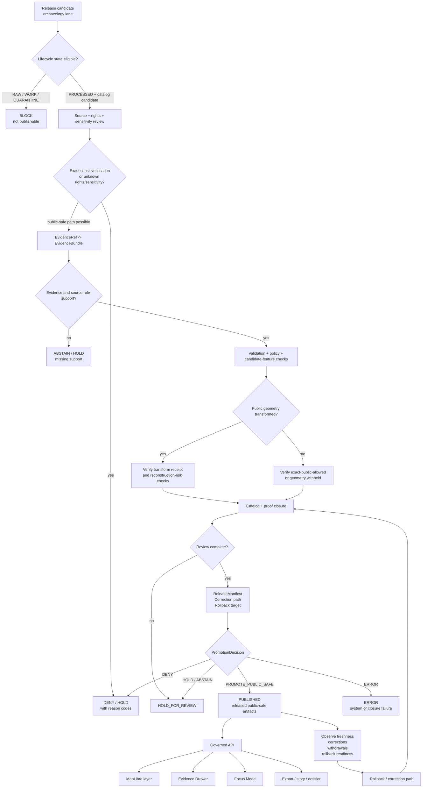
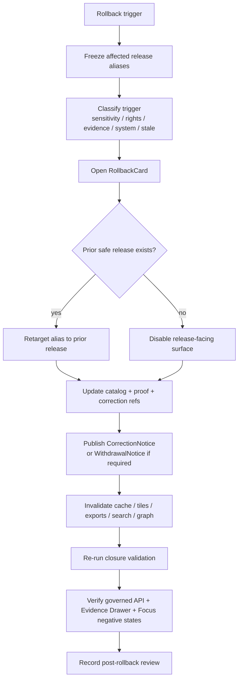

<!-- [KFM_META_BLOCK_V2]
doc_id: kfm://doc/NEEDS-VERIFICATION-docs-domains-archaeology-operations-promotion-and-rollback
title: Archaeology Promotion and Rollback
type: standard
version: v1
status: draft
owners: TODO-NEEDS-OWNER
created: NEEDS-VERIFICATION-YYYY-MM-DD
updated: 2026-05-06
policy_label: NEEDS-VERIFICATION-public-or-restricted
related: [../README.md, ./RUNBOOK.md, ../architecture/ARCHITECTURE.md, ../governance/VALIDATION_AND_POLICY.md, ../governance/SENSITIVITY_AND_RIGHTS.md, ../governance/CATALOG_AND_PROOF_OBJECTS.md, ../governance/FILE_MAP.md, ../../../doctrine/lifecycle-law.md, ../../../runbooks/publication.md, ../../../adr/ADR-0009-sensitive-location-policy.md, ../../../architecture/governed-api.md]
tags: [kfm, archaeology, promotion, rollback, release, correction, evidence, sensitivity, rights, governance]
notes: [Revises the existing thin archaeology promotion and rollback operations stub; owner, stable doc_id, created date, policy label, executable release tooling, workflow names, schema homes, CI enforcement, and release object locations require verification.]
[/KFM_META_BLOCK_V2] -->

<a id="top"></a>

# Archaeology Promotion and Rollback

Release-facing operating rules for promoting, correcting, withdrawing, and rolling back KFM archaeology artifacts without exposing restricted locations or losing evidence lineage.

<p align="center">
  
  
  
  
  
  
</p>

<p align="center">
  <a href="#status-and-reading-rule">Status</a> ·
  <a href="#repo-fit">Repo fit</a> ·
  <a href="#inputs">Inputs</a> ·
  <a href="#promotion-law">Promotion law</a> ·
  <a href="#promotion-flow">Flow</a> ·
  <a href="#gate-sequence">Gates</a> ·
  <a href="#release-packet">Release packet</a> ·
  <a href="#rollback">Rollback</a> ·
  <a href="#incident-handling">Incident handling</a> ·
  <a href="#definition-of-done">Done</a>
</p>

> [!WARNING]
> Archaeology release operations are public-safety operations. A map layer, catalog record, export, Evidence Drawer payload, Focus Mode answer, or story node can leak sensitive archaeological locations even when the UI appears to hide them. Promotion is blocked unless the outward release is evidence-bound, policy-safe, reviewable, correctable, and rollback-capable.

---

## Status and reading rule

| Field | Value |
|---|---|
| Target path | `docs/domains/archaeology/operations/PROMOTION_AND_ROLLBACK.md` |
| Owning root | `docs/` — human-facing domain operations documentation |
| Lane | `archaeology` |
| Document role | Promotion, withdrawal, correction, and rollback procedure for archaeology releases |
| Status | `draft` |
| Enforcement maturity | `NEEDS VERIFICATION` |
| Default exact-location posture | `DENY` for public and ordinary UI surfaces |
| Public release posture | governed API and released public-safe artifacts only |
| Maintenance trigger | Update this file whenever archaeology promotion, release, proof, catalog, policy, review, correction, incident, rollback, or public geometry behavior changes |

This file is a **standard operations document**. It explains the release procedure that should be enforced by repo-native schemas, policies, fixtures, validators, CI checks, proof objects, release manifests, governed API envelopes, Evidence Drawer payloads, Focus Mode outcomes, correction notices, and rollback cards.

It does **not** by itself prove that those executable controls currently pass in CI or exist for every archaeology surface.

[Back to top](#top)

---

## Repo fit

| Relationship | Path | Status | Role |
|---|---|---:|---|
| Lane landing page | [`../README.md`](../README.md) | `CONFIRMED` | Archaeology lane posture, exact-location warning, and navigation |
| Operations companion | [`./RUNBOOK.md`](./RUNBOOK.md) | `CONFIRMED` | Safe first-run and incident checklist |
| Architecture boundary | [`../architecture/ARCHITECTURE.md`](../architecture/ARCHITECTURE.md) | `CONFIRMED` | Lifecycle, source-role, public geometry, API/UI, and release boundaries |
| Validation and policy | [`../governance/VALIDATION_AND_POLICY.md`](../governance/VALIDATION_AND_POLICY.md) | `CONFIRMED` | Validation gates, mandatory denials, and policy outcomes |
| Sensitivity and rights | [`../governance/SENSITIVITY_AND_RIGHTS.md`](../governance/SENSITIVITY_AND_RIGHTS.md) | `CONFIRMED` | Rights/sensitivity default posture and denial triggers |
| Catalog and proof | [`../governance/CATALOG_AND_PROOF_OBJECTS.md`](../governance/CATALOG_AND_PROOF_OBJECTS.md) | `CONFIRMED` | Closure set and proof expectations |
| File map | [`../governance/FILE_MAP.md`](../governance/FILE_MAP.md) | `CONFIRMED` | Archaeology documentation surface map |
| Lifecycle doctrine | [`../../../doctrine/lifecycle-law.md`](../../../doctrine/lifecycle-law.md) | `CONFIRMED` | Shared KFM lifecycle and publication law |
| Publication runbook | [`../../../runbooks/publication.md`](../../../runbooks/publication.md) | `CONFIRMED` | Cross-domain publication, promotion, rollback, and correction procedure |
| Sensitive-location ADR | [`../../../adr/ADR-0009-sensitive-location-policy.md`](../../../adr/ADR-0009-sensitive-location-policy.md) | `CONFIRMED` | Cross-domain exact sensitive location denial policy |
| Governed API architecture | [`../../../architecture/governed-api.md`](../../../architecture/governed-api.md) | `CONFIRMED` | Trust membrane for public, steward, map, Focus, and export responses |

### Directory Rules basis

This file belongs under `docs/domains/archaeology/operations/` because it is human-facing operating guidance for the archaeology lane. It does not belong in a root-level `archaeology/` folder, and it does not own machine schemas, executable policy, data artifacts, release proof packs, or runtime routes.

### Downstream implementation surfaces

The exact implementation homes remain `NEEDS VERIFICATION`, but promotion and rollback behavior should coordinate with these responsibility roots:

| Concern | Responsibility root | Status |
|---|---|---:|
| Human meaning and runbooks | `docs/` | `CONFIRMED docs surface` |
| Semantic contracts | `contracts/` | `NEEDS VERIFICATION` |
| Machine schemas | `schemas/` | `NEEDS VERIFICATION` |
| Policy-as-code | `policy/` | `NEEDS VERIFICATION` |
| Fixtures and tests | `fixtures/`, `tests/` | `NEEDS VERIFICATION` |
| Validators and CI helpers | `tools/`, `.github/` | `NEEDS VERIFICATION` |
| Receipts, proofs, catalog records, published artifacts | `data/`, `release/` | `NEEDS VERIFICATION` |
| Governed API and UI consumers | `apps/`, repo-confirmed UI roots | `NEEDS VERIFICATION` |

[Back to top](#top)

---

## Inputs

A promotion review may accept the following inputs only when they are traceable and reviewable.

| Input | Required posture before promotion |
|---|---|
| `SourceDescriptor` | Source identity, role, rights, access, cadence, sensitivity defaults, and citation expectations are recorded. |
| `EvidenceBundle` | Every consequential outward claim resolves from `EvidenceRef` to support. |
| `ValidationReport` | Schema, source-role, rights, sensitivity, geometry, catalog, DTO, and runtime checks are recorded. |
| `PolicyDecision` | Allow, deny, abstain, or error outcome is recorded with reason codes and obligations. |
| `ReviewRecord` | Required domain, steward, cultural, rights, policy, security, or release review is complete. |
| `publication_transform_receipt` | Required when restricted geometry becomes generalized, aggregated, suppressed, withheld, or otherwise public-safe. |
| Catalog/provenance records | STAC/DCAT/PROV or repo-equivalent records align with release, evidence, proof, and rights state. |
| `ProofPack` or proof assembly | Digests, validation reports, evidence refs, policy decisions, review records, and catalog closure are cross-linked. |
| `ReleaseManifest` | Artifact list, digests, release scope, audience, public aliases, correction path, and rollback target are named. |
| `CorrectionNotice` | Required for public correction, withdrawal, supersession, or post-release change. |
| `RollbackCard` / rollback plan | Required before a release can be promoted. |
| Runtime smoke result | Governed API, MapLibre, Evidence Drawer, Focus Mode, export, and story surfaces resolve only released public-safe scope. |

---

## Exclusions

These materials must not be promoted, reviewed as release proof, or used as public archaeology publication authority.

| Excluded from promotion authority | Correct handling |
|---|---|
| RAW source captures | Preserve in lifecycle storage; never serve directly to public clients. |
| WORK transforms and QA scratch products | Validate and either process, quarantine, or discard with disposition. |
| QUARANTINE material | Hold until rights, sensitivity, evidence, source-role, or validation gaps are resolved. |
| Unpublished PROCESSED candidates | Treat as internal candidate state, not public truth. |
| Direct canonical/internal store reads | Route through governed API and released artifacts. |
| Direct model runtime output | Use only behind governed API with evidence and citation validation. |
| Graph, vector, search, tile, scene, summary, or dashboard output as proof | Treat as derivative carriers tied to release and evidence. |
| Unknown-rights material | Deny public release or hold for rights review. |
| Exact sensitive archaeology geometry in public payloads | Deny by default. |
| Client-side filtering as security | Emit only public-safe server-side payloads and artifacts. |
| Silent overwrite of published artifacts | Use correction, supersession, withdrawal, or rollback lineage. |

[Back to top](#top)

---

## Promotion law

KFM archaeology promotion follows the shared lifecycle law:

```text
SOURCE EDGE -> RAW -> WORK / QUARANTINE -> PROCESSED -> CATALOG / TRIPLET -> PUBLISHED
```

Promotion is the governed state transition from release candidate to published scope. It is **not**:

- a file copy;
- a tile upload;
- a passing validator alone;
- a catalog entry alone;
- a map layer toggle;
- a generated story;
- a model answer;
- a screenshot;
- a graph edge;
- a reviewer comment without release state.

### Non-negotiable archaeology release rules

| Rule | Release consequence |
|---|---|
| Public exact archaeological site locations are denied by default. | Any public exact geometry request returns `DENY` unless a reviewed policy exception and release proof explicitly allow it. |
| Candidate features are not confirmed sites. | Remote-sensing, LiDAR, aerial, geophysical, model, or anomaly outputs remain candidate features until evidence and review support stronger status. |
| Unknown rights fail closed. | Public release is blocked until rights and redistribution are resolved. |
| Unknown sensitivity fails closed. | Public release is blocked until sensitivity classification and public geometry posture are resolved. |
| Public geometry transforms need receipts. | Generalized, aggregated, suppressed, delayed, redacted, or withheld geometry must link to a transform receipt. |
| Evidence must resolve. | Consequential claims require `EvidenceRef -> EvidenceBundle`, or the response must `ABSTAIN`, `DENY`, or `ERROR`. |
| Release requires rollback. | A candidate without rollback target or withdrawal path cannot be promoted. |
| Correction lineage is first-class. | Public errors, withdrawals, supersessions, and rollback actions remain visible and auditable. |

[Back to top](#top)

---

## Promotion flow



[Back to top](#top)

---

## Gate sequence

The gate names below are documentation-level labels. Normalize them to repo-native schema and workflow names before making them executable.

| Gate | Name | Must prove | Failure outcome |
|---|---|---|---|
| **A0** | Candidate identity | Candidate ID, lane, release class, audience, artifact refs, and lifecycle state are explicit. | `ERROR` or `HOLD` |
| **A1** | Source descriptor | Source role, owner/steward, rights, access, cadence, citation, and sensitivity defaults exist. | `DENY` activation or `QUARANTINE` |
| **A2** | Rights completeness | Rights and redistribution posture allow the requested release class. | `DENY` |
| **A3** | Sensitivity classification | Exact-location, burial/human remains, sacred/cultural, private-land, collection-security, and looting-risk classes are evaluated. | `DENY` or `HOLD_FOR_REVIEW` |
| **A4** | Evidence closure | Consequential claims resolve `EvidenceRef -> EvidenceBundle`. | `ABSTAIN`, `DENY`, or `ERROR` |
| **A5** | Candidate-feature discipline | Candidate anomalies are not promoted as confirmed sites without review. | `DENY` |
| **A6** | Public geometry posture | Public geometry is withheld, generalized, aggregated, suppressed, delayed, or explicitly allowed. | `DENY` |
| **A7** | Transform receipt | Public-safe geometry transforms have receipts with policy basis and digest/linkage refs. | `DENY` |
| **A8** | Catalog and proof closure | Catalog/provenance, proof refs, evidence refs, policy refs, and release refs align. | `ERROR` or `HOLD` |
| **A9** | Public payload safety | API, layer, Evidence Drawer, Focus, search, graph, vector, export, and story payloads contain no restricted coordinates or internal refs. | `DENY` |
| **A10** | Review closure | Required steward, cultural, rights, policy, security, domain, or release reviews are recorded. | `HOLD_FOR_REVIEW` |
| **A11** | Release assembly | `ReleaseManifest` names artifacts, digests, audience, public aliases, release state, correction path, and rollback target. | `ERROR` or `HOLD` |
| **A12** | Runtime readiness | Governed API, MapLibre, Evidence Drawer, Focus Mode, and exports consume only released public-safe scope and finite outcomes. | `HOLD` |
| **A13** | Promotion decision | Decision is finite, reason-coded, auditable, and linked to release/proof/review records. | Non-promote outcomes remain non-public |

> [!IMPORTANT]
> A later gate cannot hide an earlier failure. For example, a map that hides exact coordinates client-side still fails if the API payload, tile property, catalog record, Evidence Drawer payload, or export contains reconstructable restricted geometry.

[Back to top](#top)

---

## Release packet

A promotion review should assemble a compact release packet.

| Packet section | Minimum contents |
|---|---|
| Candidate identity | candidate ID, lane, release class, audience, scope, artifact refs |
| Source inventory | source descriptors, source roles, rights, sensitivity defaults, citation posture |
| Claims inventory | outward claims, EvidenceRefs, EvidenceBundle refs, claim scope, limitations |
| Rights and sensitivity | rights disposition, sensitivity classification, public geometry class, review needs |
| Public geometry treatment | withheld/generalized/aggregated/suppressed/delayed/exact-public-allowed state plus transform receipts |
| Validation reports | schema, spatial, temporal, source-role, rights, sensitivity, DTO, catalog, runtime checks |
| Policy decisions | outcomes, reason codes, obligations, denied/abstained fields |
| Review records | steward, cultural, rights, domain, policy, security, release manager, UI trust review where needed |
| Catalog/proof closure | catalog records, provenance refs, proof objects, digests, cross-object reference integrity |
| Release manifest | artifact set, digests, public aliases, release state, effective time, rollback target |
| Runtime readiness | governed API, MapLibre, Evidence Drawer, Focus Mode, export/story checks |
| Correction and rollback | correction route, withdrawal mode, rollback card, prior release target, cache invalidation notes |

### Release packet decision card

| Question | Required answer |
|---|---|
| What will become visible? | Artifact list, outward routes, aliases, layers, claims, and audience. |
| Why is visibility allowed? | Evidence, rights, sensitivity, review, policy, and release proof. |
| What precision is visible? | Public geometry class and transform receipt. |
| What is withheld? | Restricted geometry, source details, internal refs, private/steward fields, and reason codes. |
| How can users inspect support? | EvidenceBundle and catalog/proof references. |
| How can it be corrected? | CorrectionNotice route and affected surface list. |
| How can it be reversed? | RollbackCard, prior release target, withdrawal action, and validation rerun. |

---

## Promotion decisions

Use finite decisions. Do not smooth a denial or abstention into a confident release note.

| Decision | Meaning | Public effect |
|---|---|---|
| `PROMOTE_PUBLIC_SAFE` | Candidate may become published under the named public-safe release scope. | Release artifacts may be exposed through governed surfaces. |
| `PROMOTE_RESTRICTED` | Candidate may be available only to a restricted or steward audience. | Public surfaces remain denied or generalized. |
| `HOLD_FOR_REVIEW` | Candidate is incomplete or requires review before decision. | No new public release. |
| `ABSTAIN` | Evidence support is inadequate, conflicted, stale, or out of scope. | No unsupported claim; outward response may explain limitation. |
| `DENY` | Policy, rights, sensitivity, access, source role, or public safety blocks the candidate. | No release; obligations and reason codes recorded. |
| `ERROR` | Tooling, schema, catalog, proof, resolver, or runtime failure prevents trustworthy decision. | No release; incident or bug path opened. |
| `WITHDRAW` | Current release must stop resolving as current. | Disable or supersede public alias; publish correction/withdrawal notice when required. |
| `ROLLBACK` | Revert to prior safe release or disable affected release. | Restore or withdraw public scope according to rollback card. |

[Back to top](#top)

---

## Rollback

Rollback is a governed release action. It preserves lineage; it does not erase history.

### Rollback modes

| Mode | Use when | Required action |
|---|---|---|
| `DISABLE_RELEASE` | A release is unsafe and no prior safe alias exists. | Disable release-facing aliases/routes; publish correction or withdrawal notice when required. |
| `RETARGET_ALIAS` | A prior release is safe and should become current again. | Repoint public alias to prior release; validate catalog/proof closure. |
| `WITHDRAW_CLAIM` | Specific claim is unsupported, unsafe, or rights-blocked. | Mark claim withdrawn; update catalog and Evidence Drawer state. |
| `SUPERSEDE_RELEASE` | New corrected release replaces a bad or stale release. | Publish successor release and correction notice; retain prior lineage. |
| `REBUILD_PUBLIC_SAFE_ARTIFACT` | Public geometry, fields, tiles, or exports need safer representation. | Rebuild with transform receipt; compare digests; rerun public DTO and catalog checks. |
| `RESTRICT_AUDIENCE` | Public release is unsafe but restricted/steward access remains valid. | Change audience class; ensure public routes deny or generalize. |
| `QUARANTINE_SOURCE_FAMILY` | Source rights, sensitivity, quality, or steward posture is invalidated. | Disable source-derived release candidates and trace affected published artifacts. |

### Rollback card minimums

A rollback card should identify:

- release ID and affected candidate ID;
- affected claims, layers, exports, stories, catalog records, and API routes;
- rollback mode;
- trigger reason and reason codes;
- prior safe release target or disable action;
- affected artifact refs and digests;
- catalog/proof records to update or supersede;
- public aliases, cache, CDN, tile, search, graph, vector, and export invalidation needs;
- Evidence Drawer and Focus Mode expected state after rollback;
- correction/withdrawal notice requirement;
- reviewer and approver;
- validation commands or check bundle to rerun;
- post-rollback monitoring tasks.

### Rollback sequence



> [!CAUTION]
> Do not delete the bad release as the rollback mechanism. Keep the release record, reason, affected surfaces, correction lineage, and rollback action inspectable.

[Back to top](#top)

---

## Correction, withdrawal, and supersession

| Action | Use when | Required public trust state |
|---|---|---|
| `CorrectionNotice` | A public claim, artifact, support record, sensitivity class, rights status, or geometry treatment changes. | Users can see the claim was corrected and inspect the successor or amended support. |
| `WithdrawalNotice` | A release or claim should no longer resolve as current. | Users can see withdrawal status and reason without exposing restricted detail. |
| `Supersession` | A new release replaces an older one. | Old release remains traceable; new release carries updated proof and rollback refs. |
| `Restricted reclassification` | Public material must become restricted or steward-only. | Public routes deny or generalize; restricted routes require role-gated review. |
| `Public-safe rebuild` | Geometry, fields, screenshots, story nodes, or exports leak too much precision. | New artifacts carry transform receipt and changed digests. |

### Correction notice minimums

A correction notice should record:

- affected release ID and artifact refs;
- affected claim IDs or layer IDs;
- correction type;
- public-safe explanation;
- evidence, policy, rights, sensitivity, or source-role change;
- successor release or rollback target;
- effective time;
- reviewer;
- downstream surfaces requiring cache, tile, export, search, graph, or story refresh;
- whether the correction itself is public, restricted, or steward-only.

---

## Incident handling

Use this section when a release may have exposed unsafe archaeological detail.

### Sensitivity leakage response

1. Disable or freeze the affected release-facing alias.
2. Open a rollback card.
3. Classify the incident: exact location, source ID, private/steward field, catalog metadata, tile property, screenshot/export, Focus answer, graph/search/vector leak, or mixed leak.
4. Identify affected artifacts, routes, tiles, stories, exports, catalog records, caches, and screenshots.
5. Retarget to prior safe release or disable the release if no safe target exists.
6. Publish a correction or withdrawal notice when public meaning was affected.
7. Re-run public DTO, catalog/proof closure, Evidence Drawer, Focus Mode, and export checks.
8. Record the post-rollback review and backlog any missing regression fixtures.

### Incident trigger matrix

| Trigger | Immediate posture | Follow-up |
|---|---|---|
| Exact site coordinate in public payload | `DISABLE_RELEASE` | Add negative fixture and public DTO test. |
| Sensitive geometry in tile or map style | `DISABLE_RELEASE` or `RETARGET_ALIAS` | Rebuild layer, regenerate manifest, verify transform receipt. |
| Catalog metadata leaks restricted location | `WITHDRAW_CLAIM` or `REBUILD_PUBLIC_SAFE_ARTIFACT` | Update catalog/provenance visibility rules. |
| Evidence Drawer reveals restricted source row | `DISABLE_RELEASE` | Add drawer payload allowlist test. |
| Focus Mode reveals or infers exact location | `DISABLE_RELEASE` and `DENY` route response | Add citation/policy denial fixture. |
| Rights change invalidates source reuse | `QUARANTINE_SOURCE_FAMILY` | Source steward review and affected-release trace. |
| Candidate anomaly published as confirmed site | `WITHDRAW_CLAIM` | Review candidate-feature validator and claim template. |
| Missing rollback target discovered after release | `ERROR` and release governance review | Add release preflight blocker. |

[Back to top](#top)

---

## Public surface verification

Before promotion and after rollback, verify every outward surface that can leak archaeology state.

| Surface | Required check |
|---|---|
| Governed API | No public response reads or returns RAW, WORK, QUARANTINE, restricted exact geometry, internal refs, or direct model output. |
| MapLibre layer | Layer manifest and tile/data source are release-backed and public-safe. |
| Evidence Drawer | Payload shows source role, evidence, rights, sensitivity, transform, review, release, correction, and rollback state safely. |
| Focus Mode | Exact-location requests return `DENY`; unsupported claims return `ABSTAIN`; tool/runtime failures return `ERROR`. |
| Catalog/discovery | Public catalog records do not expose restricted coordinates, source row IDs, private/steward URLs, or reconstruction clues. |
| Search/vector/graph | Projections are field-allowlisted and cannot reconstruct restricted location. |
| Exports/stories/dossiers | Trust metadata, release refs, citations, correction state, and generalization context travel with exported material. |
| Screenshots/examples | No real restricted coordinates, access routes, source IDs, or sensitive context appear. |
| Logs/receipts visible to users | Public-safe only; no secret paths, restricted geometry, private reasoning, or raw source payloads. |

---

## Validator bundle

> [!NOTE]
> Commands below are `PROPOSED` review aids. Replace them with repo-native scripts after active schema, policy, test, and workflow conventions are verified.

```bash
# Confirm checkout state.
git status --short
git branch --show-current || true

# Archaeology lane checks.
python tools/validators/archaeology/run_all.py \
  --fixtures tests/fixtures/archaeology

python tools/validators/archaeology/validate_source_descriptors.py
python tools/validators/archaeology/validate_rights_and_sensitivity.py
python tools/validators/archaeology/validate_evidence_bundle.py
python tools/validators/archaeology/validate_candidate_feature_status.py
python tools/validators/archaeology/validate_public_geometry_transform.py
python tools/validators/archaeology/validate_no_raw_public_refs.py
python tools/validators/archaeology/validate_catalog_closure.py
python tools/validators/archaeology/validate_release_manifest.py
python tools/validators/archaeology/validate_rollback_card.py
python tools/validators/archaeology/validate_focus_payload.py
python tools/validators/archaeology/validate_evidence_drawer_payload.py

# Test bundle.
python -m pytest tests/archaeology tests/fixtures/archaeology
```

### Required negative tests

- [ ] Exact archaeological site point in public layer: `DENY`.
- [ ] Burial/human remains exact location in public payload: `DENY`.
- [ ] Sacred or culturally sensitive exact location in public payload: `DENY`.
- [ ] Private landowner identity or access route in public payload: `DENY`.
- [ ] Collection storage/security detail in public payload: `DENY`.
- [ ] Unknown rights in release candidate: `DENY`.
- [ ] Unknown sensitivity in release candidate: `DENY`.
- [ ] Candidate LiDAR/geophysical/model anomaly promoted as confirmed site without review: `DENY`.
- [ ] Generalized public geometry without transform receipt: `DENY`.
- [ ] EvidenceRef unresolved for consequential public claim: `ABSTAIN` or `DENY`.
- [ ] Public DTO references RAW, WORK, QUARANTINE, restricted store, graph internal, vector index, or direct model runtime: `DENY`.
- [ ] Evidence Drawer payload contains restricted source row, coordinate, or internal ID: `DENY`.
- [ ] Focus Mode reveals, infers, or reconstructs exact location: `DENY`.
- [ ] Release manifest lacks rollback target: `ERROR` or promotion blocked.
- [ ] Correction silently overwrites prior release: `ERROR`.

[Back to top](#top)

---

## Roles and separation of duties

KFM can start small, but promotion should leave room for separation of duties.

| Role | Promotion responsibility | Rollback responsibility |
|---|---|---|
| Repo steward | Confirms path, ADR, metadata, and directory responsibilities. | Confirms rollback changes do not violate responsibility roots. |
| Source steward | Confirms source role, rights, activation, citation, and source authority limits. | Quarantines source family or updates source status when terms change. |
| Domain steward | Confirms archaeology claim burden, candidate-feature posture, chronology/context caveats. | Confirms affected archaeology claims are withdrawn, corrected, or reclassified. |
| Policy/sensitivity reviewer | Confirms exact-location, rights, stewardship, cultural, private-land, and public-safe transform rules. | Confirms incident response and public-safe replacement. |
| Release manager | Confirms ReleaseManifest, proof closure, aliases, public surfaces, and rollback target. | Executes rollback card, alias retarget, withdrawal, and post-rollback validation. |
| UI trust reviewer | Confirms MapLibre, Evidence Drawer, Focus Mode, story, and export trust states. | Confirms public UI no longer leaks affected content and shows correction/withdrawal state. |
| Security/operator | Confirms no internal paths, secrets, direct model access, or restricted data exposure. | Confirms caches, logs, screenshots, exports, and deployed surfaces are safe. |

[Back to top](#top)

---

## Review card

Use this compact card for archaeology promotion PRs or release reviews.

| Field | Review entry |
|---|---|
| Goal | TODO |
| Candidate ID | TODO |
| Release class | public / restricted / steward-only / withdrawal / rollback |
| Owning root(s) | TODO |
| Directory Rules basis | TODO |
| Object families affected | SourceDescriptor / EvidenceBundle / PolicyDecision / ReleaseManifest / CorrectionNotice / RollbackCard / other |
| Source families affected | TODO |
| Public exposure possible? | yes / no |
| Exact-location risk? | yes / no / unknown |
| Rights posture | known / unknown / denied / restricted |
| Sensitivity posture | public-safe / restricted / unknown / denied |
| Transform receipt required? | yes / no |
| EvidenceRef/EvidenceBundle impact | TODO |
| Catalog/proof impact | TODO |
| API/UI/Focus/export impact | TODO |
| Correction/rollback impact | TODO |
| Validation commands run | TODO |
| Known UNKNOWN / NEEDS VERIFICATION | TODO |
| Promotion recommendation | PROMOTE_PUBLIC_SAFE / PROMOTE_RESTRICTED / HOLD_FOR_REVIEW / ABSTAIN / DENY / ERROR |
| Rollback plan | TODO |

---

## Definition of done

A promotion or rollback change is reviewable when:

- [ ] The candidate lifecycle state is eligible for release review.
- [ ] Source descriptors are complete or missing fields block release.
- [ ] Rights and redistribution posture are explicit.
- [ ] Sensitivity classification is explicit.
- [ ] Public exact-location disclosure is denied unless explicitly reviewed and proven safe.
- [ ] Candidate features are not mislabeled as confirmed sites.
- [ ] Every consequential outward claim resolves `EvidenceRef -> EvidenceBundle`.
- [ ] Public geometry treatment is named and transform receipts are present where required.
- [ ] Public DTO, layer, drawer, Focus, story, export, catalog, search, graph, and vector payloads are field-allowlisted.
- [ ] Policy decisions include reason codes and obligations.
- [ ] Required reviews are complete.
- [ ] Catalog/proof/release references close.
- [ ] Release manifest names artifacts, digests, audience, aliases, correction path, and rollback target.
- [ ] Runtime smoke confirms governed API, Evidence Drawer, Focus Mode, MapLibre, and export states are safe.
- [ ] Rollback card is present before promotion.
- [ ] Correction/withdrawal path is documented.
- [ ] Negative-path fixtures cover relevant denial cases.
- [ ] No repo maturity, workflow enforcement, release artifact, or runtime behavior is claimed without evidence.
- [ ] Related docs, contracts, schemas, policies, fixtures, validators, tests, runbooks, ADRs, and changelogs are updated or explicitly deferred.

[Back to top](#top)

---

## Open verification

| Item | Status | How to close |
|---|---:|---|
| Stable document UUID | `NEEDS VERIFICATION` | Add to active document registry or assign according to repo convention. |
| Owner | `NEEDS VERIFICATION` | Confirm CODEOWNERS, archaeology steward, release manager, or governance owner. |
| Created date | `NEEDS VERIFICATION` | Fill from Git history or document registry. |
| Policy label | `NEEDS VERIFICATION` | Confirm whether this operations doc is public or restricted. |
| Executable promotion enum | `NEEDS VERIFICATION` | Confirm repo-wide `PromotionDecision` / `PolicyDecision` enum names. |
| Release object home | `NEEDS VERIFICATION` | Confirm where ReleaseManifest, ProofPack, CorrectionNotice, and RollbackCard live. |
| Schema home | `NEEDS VERIFICATION` | Confirm accepted `contracts/` versus `schemas/` split and archaeology schema path. |
| Policy engine | `NEEDS VERIFICATION` | Confirm Rego, Python validators, or repo-native policy mechanism. |
| CI workflow names | `UNKNOWN` | Inspect `.github/workflows/` and current check requirements. |
| Archaeology release fixtures | `UNKNOWN` | Inspect `fixtures/` and `tests/` for promotion, rollback, and public DTO coverage. |
| Runtime route inventory | `UNKNOWN` | Inspect governed API route registration and OpenAPI outputs. |
| UI implementation paths | `UNKNOWN` | Inspect MapLibre, Evidence Drawer, Focus Mode, export, and story code. |
| Actual release/rollback run | `UNKNOWN` | Verify from emitted release manifests, rollback cards, proof packs, logs, or dashboards. |

[Back to top](#top)

---

## Appendix

<details>
<summary><strong>Illustrative ReleaseManifest excerpt</strong></summary>

```json
{
  "schema": "kfm.release_manifest.v1",
  "release_id": "kfm://release/archaeology/NEEDS-VERIFICATION",
  "candidate_id": "kfm://candidate/archaeology/NEEDS-VERIFICATION",
  "release_class": "public_safe",
  "audience": "public",
  "domain": "archaeology",
  "artifact_refs": [],
  "artifact_digests": [],
  "evidence_bundle_refs": [],
  "validation_report_refs": [],
  "policy_decision_refs": [],
  "review_record_refs": [],
  "catalog_refs": [],
  "transform_receipt_refs": [],
  "public_geometry_class": "withheld | generalized | aggregated | suppressed | delayed | public_exact_allowed",
  "correction_path": "kfm://correction/NEEDS-VERIFICATION",
  "rollback_ref": "kfm://rollback/NEEDS-VERIFICATION",
  "release_state": "candidate | published | withdrawn | superseded",
  "limitations": []
}
```

</details>

<details>
<summary><strong>Illustrative PromotionDecision excerpt</strong></summary>

```json
{
  "schema": "kfm.promotion_decision.v1",
  "decision_id": "kfm://decision/archaeology/NEEDS-VERIFICATION",
  "candidate_id": "kfm://candidate/archaeology/NEEDS-VERIFICATION",
  "release_manifest_ref": "kfm://release/archaeology/NEEDS-VERIFICATION",
  "decision": "PROMOTE_PUBLIC_SAFE | PROMOTE_RESTRICTED | HOLD_FOR_REVIEW | ABSTAIN | DENY | ERROR | WITHDRAW | ROLLBACK",
  "reason_codes": [],
  "obligation_codes": [],
  "gate_results": [],
  "decided_by": "TODO-NEEDS-OWNER",
  "decided_at": "NEEDS-VERIFICATION",
  "audit_ref": "kfm://audit/NEEDS-VERIFICATION",
  "rollback_ref": "kfm://rollback/NEEDS-VERIFICATION"
}
```

</details>

<details>
<summary><strong>Illustrative RollbackCard excerpt</strong></summary>

```json
{
  "schema": "kfm.rollback_card.v1",
  "rollback_id": "kfm://rollback/archaeology/NEEDS-VERIFICATION",
  "affected_release_ref": "kfm://release/archaeology/NEEDS-VERIFICATION",
  "rollback_mode": "DISABLE_RELEASE | RETARGET_ALIAS | WITHDRAW_CLAIM | SUPERSEDE_RELEASE | REBUILD_PUBLIC_SAFE_ARTIFACT | RESTRICT_AUDIENCE | QUARANTINE_SOURCE_FAMILY",
  "trigger_reason_codes": [],
  "prior_safe_release_ref": "kfm://release/archaeology/NEEDS-VERIFICATION",
  "affected_surfaces": {
    "api_routes": [],
    "map_layers": [],
    "catalog_records": [],
    "exports": [],
    "stories": [],
    "search_indexes": [],
    "graph_projections": [],
    "tiles": []
  },
  "correction_notice_ref": "kfm://correction/archaeology/NEEDS-VERIFICATION",
  "validation_report_refs": [],
  "post_rollback_checks": [],
  "review_record_refs": [],
  "status": "draft | approved | executed | verified"
}
```

</details>

<details>
<summary><strong>Maintenance notes</strong></summary>

- Keep exact public location denial visible near the top of this document.
- Do not turn illustrative JSON shapes into machine authority without adding schemas, fixtures, validators, and tests.
- Do not cite a passing validator as publication approval.
- Do not treat catalog records, receipts, proof packs, release manifests, or published artifacts as interchangeable.
- Update [`RUNBOOK.md`](./RUNBOOK.md) when incident handling changes.
- Update [`../governance/VALIDATION_AND_POLICY.md`](../governance/VALIDATION_AND_POLICY.md) when gate behavior changes.
- Update [`../governance/SENSITIVITY_AND_RIGHTS.md`](../governance/SENSITIVITY_AND_RIGHTS.md) when denial triggers or public geometry rules change.
- Update [`../governance/CATALOG_AND_PROOF_OBJECTS.md`](../governance/CATALOG_AND_PROOF_OBJECTS.md) when proof or release object expectations change.

</details>

[Back to top](#top)<!-- [KFM_META_BLOCK_V2]
doc_id: kfm://doc/NEEDS-VERIFICATION-docs-domains-archaeology-operations-promotion-and-rollback
title: Archaeology Promotion and Rollback
type: standard
version: v1
status: draft
owners: TODO-NEEDS-OWNER
created: NEEDS-VERIFICATION-YYYY-MM-DD
updated: 2026-05-06
policy_label: NEEDS-VERIFICATION-public-or-restricted
related: [../README.md, ./RUNBOOK.md, ../architecture/ARCHITECTURE.md, ../governance/VALIDATION_AND_POLICY.md, ../governance/SENSITIVITY_AND_RIGHTS.md, ../governance/CATALOG_AND_PROOF_OBJECTS.md, ../governance/FILE_MAP.md, ../../../doctrine/lifecycle-law.md, ../../../runbooks/publication.md, ../../../adr/ADR-0009-sensitive-location-policy.md, ../../../architecture/governed-api.md]
tags: [kfm, archaeology, promotion, rollback, release, correction, evidence, sensitivity, rights, governance]
notes: [Revises the existing thin archaeology promotion and rollback operations stub; owner, stable doc_id, created date, policy label, executable release tooling, workflow names, schema homes, CI enforcement, and release object locations require verification.]
[/KFM_META_BLOCK_V2] -->

<a id="top"></a>

# Archaeology Promotion and Rollback

Release-facing operating rules for promoting, correcting, withdrawing, and rolling back KFM archaeology artifacts without exposing restricted locations or losing evidence lineage.

<p align="center">
  
  
  
  
  
  
</p>

<p align="center">
  <a href="#status-and-reading-rule">Status</a> ·
  <a href="#repo-fit">Repo fit</a> ·
  <a href="#inputs">Inputs</a> ·
  <a href="#promotion-law">Promotion law</a> ·
  <a href="#promotion-flow">Flow</a> ·
  <a href="#gate-sequence">Gates</a> ·
  <a href="#release-packet">Release packet</a> ·
  <a href="#rollback">Rollback</a> ·
  <a href="#incident-handling">Incident handling</a> ·
  <a href="#definition-of-done">Done</a>
</p>

> [!WARNING]
> Archaeology release operations are public-safety operations. A map layer, catalog record, export, Evidence Drawer payload, Focus Mode answer, or story node can leak sensitive archaeological locations even when the UI appears to hide them. Promotion is blocked unless the outward release is evidence-bound, policy-safe, reviewable, correctable, and rollback-capable.

---

## Status and reading rule

| Field | Value |
|---|---|
| Target path | `docs/domains/archaeology/operations/PROMOTION_AND_ROLLBACK.md` |
| Owning root | `docs/` — human-facing domain operations documentation |
| Lane | `archaeology` |
| Document role | Promotion, withdrawal, correction, and rollback procedure for archaeology releases |
| Status | `draft` |
| Enforcement maturity | `NEEDS VERIFICATION` |
| Default exact-location posture | `DENY` for public and ordinary UI surfaces |
| Public release posture | governed API and released public-safe artifacts only |
| Maintenance trigger | Update this file whenever archaeology promotion, release, proof, catalog, policy, review, correction, incident, rollback, or public geometry behavior changes |

This file is a **standard operations document**. It explains the release procedure that should be enforced by repo-native schemas, policies, fixtures, validators, CI checks, proof objects, release manifests, governed API envelopes, Evidence Drawer payloads, Focus Mode outcomes, correction notices, and rollback cards.

It does **not** by itself prove that those executable controls currently pass in CI or exist for every archaeology surface.

[Back to top](#top)

---

## Repo fit

| Relationship | Path | Status | Role |
|---|---|---:|---|
| Lane landing page | [`../README.md`](../README.md) | `CONFIRMED` | Archaeology lane posture, exact-location warning, and navigation |
| Operations companion | [`./RUNBOOK.md`](./RUNBOOK.md) | `CONFIRMED` | Safe first-run and incident checklist |
| Architecture boundary | [`../architecture/ARCHITECTURE.md`](../architecture/ARCHITECTURE.md) | `CONFIRMED` | Lifecycle, source-role, public geometry, API/UI, and release boundaries |
| Validation and policy | [`../governance/VALIDATION_AND_POLICY.md`](../governance/VALIDATION_AND_POLICY.md) | `CONFIRMED` | Validation gates, mandatory denials, and policy outcomes |
| Sensitivity and rights | [`../governance/SENSITIVITY_AND_RIGHTS.md`](../governance/SENSITIVITY_AND_RIGHTS.md) | `CONFIRMED` | Rights/sensitivity default posture and denial triggers |
| Catalog and proof | [`../governance/CATALOG_AND_PROOF_OBJECTS.md`](../governance/CATALOG_AND_PROOF_OBJECTS.md) | `CONFIRMED` | Closure set and proof expectations |
| File map | [`../governance/FILE_MAP.md`](../governance/FILE_MAP.md) | `CONFIRMED` | Archaeology documentation surface map |
| Lifecycle doctrine | [`../../../doctrine/lifecycle-law.md`](../../../doctrine/lifecycle-law.md) | `CONFIRMED` | Shared KFM lifecycle and publication law |
| Publication runbook | [`../../../runbooks/publication.md`](../../../runbooks/publication.md) | `CONFIRMED` | Cross-domain publication, promotion, rollback, and correction procedure |
| Sensitive-location ADR | [`../../../adr/ADR-0009-sensitive-location-policy.md`](../../../adr/ADR-0009-sensitive-location-policy.md) | `CONFIRMED` | Cross-domain exact sensitive location denial policy |
| Governed API architecture | [`../../../architecture/governed-api.md`](../../../architecture/governed-api.md) | `CONFIRMED` | Trust membrane for public, steward, map, Focus, and export responses |

### Directory Rules basis

This file belongs under `docs/domains/archaeology/operations/` because it is human-facing operating guidance for the archaeology lane. It does not belong in a root-level `archaeology/` folder, and it does not own machine schemas, executable policy, data artifacts, release proof packs, or runtime routes.

### Downstream implementation surfaces

The exact implementation homes remain `NEEDS VERIFICATION`, but promotion and rollback behavior should coordinate with these responsibility roots:

| Concern | Responsibility root | Status |
|---|---|---:|
| Human meaning and runbooks | `docs/` | `CONFIRMED docs surface` |
| Semantic contracts | `contracts/` | `NEEDS VERIFICATION` |
| Machine schemas | `schemas/` | `NEEDS VERIFICATION` |
| Policy-as-code | `policy/` | `NEEDS VERIFICATION` |
| Fixtures and tests | `fixtures/`, `tests/` | `NEEDS VERIFICATION` |
| Validators and CI helpers | `tools/`, `.github/` | `NEEDS VERIFICATION` |
| Receipts, proofs, catalog records, published artifacts | `data/`, `release/` | `NEEDS VERIFICATION` |
| Governed API and UI consumers | `apps/`, repo-confirmed UI roots | `NEEDS VERIFICATION` |

[Back to top](#top)

---

## Inputs

A promotion review may accept the following inputs only when they are traceable and reviewable.

| Input | Required posture before promotion |
|---|---|
| `SourceDescriptor` | Source identity, role, rights, access, cadence, sensitivity defaults, and citation expectations are recorded. |
| `EvidenceBundle` | Every consequential outward claim resolves from `EvidenceRef` to support. |
| `ValidationReport` | Schema, source-role, rights, sensitivity, geometry, catalog, DTO, and runtime checks are recorded. |
| `PolicyDecision` | Allow, deny, abstain, or error outcome is recorded with reason codes and obligations. |
| `ReviewRecord` | Required domain, steward, cultural, rights, policy, security, or release review is complete. |
| `publication_transform_receipt` | Required when restricted geometry becomes generalized, aggregated, suppressed, withheld, or otherwise public-safe. |
| Catalog/provenance records | STAC/DCAT/PROV or repo-equivalent records align with release, evidence, proof, and rights state. |
| `ProofPack` or proof assembly | Digests, validation reports, evidence refs, policy decisions, review records, and catalog closure are cross-linked. |
| `ReleaseManifest` | Artifact list, digests, release scope, audience, public aliases, correction path, and rollback target are named. |
| `CorrectionNotice` | Required for public correction, withdrawal, supersession, or post-release change. |
| `RollbackCard` / rollback plan | Required before a release can be promoted. |
| Runtime smoke result | Governed API, MapLibre, Evidence Drawer, Focus Mode, export, and story surfaces resolve only released public-safe scope. |

---

## Exclusions

These materials must not be promoted, reviewed as release proof, or used as public archaeology publication authority.

| Excluded from promotion authority | Correct handling |
|---|---|
| RAW source captures | Preserve in lifecycle storage; never serve directly to public clients. |
| WORK transforms and QA scratch products | Validate and either process, quarantine, or discard with disposition. |
| QUARANTINE material | Hold until rights, sensitivity, evidence, source-role, or validation gaps are resolved. |
| Unpublished PROCESSED candidates | Treat as internal candidate state, not public truth. |
| Direct canonical/internal store reads | Route through governed API and released artifacts. |
| Direct model runtime output | Use only behind governed API with evidence and citation validation. |
| Graph, vector, search, tile, scene, summary, or dashboard output as proof | Treat as derivative carriers tied to release and evidence. |
| Unknown-rights material | Deny public release or hold for rights review. |
| Exact sensitive archaeology geometry in public payloads | Deny by default. |
| Client-side filtering as security | Emit only public-safe server-side payloads and artifacts. |
| Silent overwrite of published artifacts | Use correction, supersession, withdrawal, or rollback lineage. |

[Back to top](#top)

---

## Promotion law

KFM archaeology promotion follows the shared lifecycle law:

```text
SOURCE EDGE -> RAW -> WORK / QUARANTINE -> PROCESSED -> CATALOG / TRIPLET -> PUBLISHED
```

Promotion is the governed state transition from release candidate to published scope. It is **not**:

- a file copy;
- a tile upload;
- a passing validator alone;
- a catalog entry alone;
- a map layer toggle;
- a generated story;
- a model answer;
- a screenshot;
- a graph edge;
- a reviewer comment without release state.

### Non-negotiable archaeology release rules

| Rule | Release consequence |
|---|---|
| Public exact archaeological site locations are denied by default. | Any public exact geometry request returns `DENY` unless a reviewed policy exception and release proof explicitly allow it. |
| Candidate features are not confirmed sites. | Remote-sensing, LiDAR, aerial, geophysical, model, or anomaly outputs remain candidate features until evidence and review support stronger status. |
| Unknown rights fail closed. | Public release is blocked until rights and redistribution are resolved. |
| Unknown sensitivity fails closed. | Public release is blocked until sensitivity classification and public geometry posture are resolved. |
| Public geometry transforms need receipts. | Generalized, aggregated, suppressed, delayed, redacted, or withheld geometry must link to a transform receipt. |
| Evidence must resolve. | Consequential claims require `EvidenceRef -> EvidenceBundle`, or the response must `ABSTAIN`, `DENY`, or `ERROR`. |
| Release requires rollback. | A candidate without rollback target or withdrawal path cannot be promoted. |
| Correction lineage is first-class. | Public errors, withdrawals, supersessions, and rollback actions remain visible and auditable. |

[Back to top](#top)

---

## Promotion flow


[Back to top](#top)

---

## Gate sequence

The gate names below are documentation-level labels. Normalize them to repo-native schema and workflow names before making them executable.

| Gate | Name | Must prove | Failure outcome |
|---|---|---|---|
| **A0** | Candidate identity | Candidate ID, lane, release class, audience, artifact refs, and lifecycle state are explicit. | `ERROR` or `HOLD` |
| **A1** | Source descriptor | Source role, owner/steward, rights, access, cadence, citation, and sensitivity defaults exist. | `DENY` activation or `QUARANTINE` |
| **A2** | Rights completeness | Rights and redistribution posture allow the requested release class. | `DENY` |
| **A3** | Sensitivity classification | Exact-location, burial/human remains, sacred/cultural, private-land, collection-security, and looting-risk classes are evaluated. | `DENY` or `HOLD_FOR_REVIEW` |
| **A4** | Evidence closure | Consequential claims resolve `EvidenceRef -> EvidenceBundle`. | `ABSTAIN`, `DENY`, or `ERROR` |
| **A5** | Candidate-feature discipline | Candidate anomalies are not promoted as confirmed sites without review. | `DENY` |
| **A6** | Public geometry posture | Public geometry is withheld, generalized, aggregated, suppressed, delayed, or explicitly allowed. | `DENY` |
| **A7** | Transform receipt | Public-safe geometry transforms have receipts with policy basis and digest/linkage refs. | `DENY` |
| **A8** | Catalog and proof closure | Catalog/provenance, proof refs, evidence refs, policy refs, and release refs align. | `ERROR` or `HOLD` |
| **A9** | Public payload safety | API, layer, Evidence Drawer, Focus, search, graph, vector, export, and story payloads contain no restricted coordinates or internal refs. | `DENY` |
| **A10** | Review closure | Required steward, cultural, rights, policy, security, domain, or release reviews are recorded. | `HOLD_FOR_REVIEW` |
| **A11** | Release assembly | `ReleaseManifest` names artifacts, digests, audience, public aliases, release state, correction path, and rollback target. | `ERROR` or `HOLD` |
| **A12** | Runtime readiness | Governed API, MapLibre, Evidence Drawer, Focus Mode, and exports consume only released public-safe scope and finite outcomes. | `HOLD` |
| **A13** | Promotion decision | Decision is finite, reason-coded, auditable, and linked to release/proof/review records. | Non-promote outcomes remain non-public |

> [!IMPORTANT]
> A later gate cannot hide an earlier failure. For example, a map that hides exact coordinates client-side still fails if the API payload, tile property, catalog record, Evidence Drawer payload, or export contains reconstructable restricted geometry.

[Back to top](#top)

---

## Release packet

A promotion review should assemble a compact release packet.

| Packet section | Minimum contents |
|---|---|
| Candidate identity | candidate ID, lane, release class, audience, scope, artifact refs |
| Source inventory | source descriptors, source roles, rights, sensitivity defaults, citation posture |
| Claims inventory | outward claims, EvidenceRefs, EvidenceBundle refs, claim scope, limitations |
| Rights and sensitivity | rights disposition, sensitivity classification, public geometry class, review needs |
| Public geometry treatment | withheld/generalized/aggregated/suppressed/delayed/exact-public-allowed state plus transform receipts |
| Validation reports | schema, spatial, temporal, source-role, rights, sensitivity, DTO, catalog, runtime checks |
| Policy decisions | outcomes, reason codes, obligations, denied/abstained fields |
| Review records | steward, cultural, rights, domain, policy, security, release manager, UI trust review where needed |
| Catalog/proof closure | catalog records, provenance refs, proof objects, digests, cross-object reference integrity |
| Release manifest | artifact set, digests, public aliases, release state, effective time, rollback target |
| Runtime readiness | governed API, MapLibre, Evidence Drawer, Focus Mode, export/story checks |
| Correction and rollback | correction route, withdrawal mode, rollback card, prior release target, cache invalidation notes |

### Release packet decision card

| Question | Required answer |
|---|---|
| What will become visible? | Artifact list, outward routes, aliases, layers, claims, and audience. |
| Why is visibility allowed? | Evidence, rights, sensitivity, review, policy, and release proof. |
| What precision is visible? | Public geometry class and transform receipt. |
| What is withheld? | Restricted geometry, source details, internal refs, private/steward fields, and reason codes. |
| How can users inspect support? | EvidenceBundle and catalog/proof references. |
| How can it be corrected? | CorrectionNotice route and affected surface list. |
| How can it be reversed? | RollbackCard, prior release target, withdrawal action, and validation rerun. |

---

## Promotion decisions

Use finite decisions. Do not smooth a denial or abstention into a confident release note.

| Decision | Meaning | Public effect |
|---|---|---|
| `PROMOTE_PUBLIC_SAFE` | Candidate may become published under the named public-safe release scope. | Release artifacts may be exposed through governed surfaces. |
| `PROMOTE_RESTRICTED` | Candidate may be available only to a restricted or steward audience. | Public surfaces remain denied or generalized. |
| `HOLD_FOR_REVIEW` | Candidate is incomplete or requires review before decision. | No new public release. |
| `ABSTAIN` | Evidence support is inadequate, conflicted, stale, or out of scope. | No unsupported claim; outward response may explain limitation. |
| `DENY` | Policy, rights, sensitivity, access, source role, or public safety blocks the candidate. | No release; obligations and reason codes recorded. |
| `ERROR` | Tooling, schema, catalog, proof, resolver, or runtime failure prevents trustworthy decision. | No release; incident or bug path opened. |
| `WITHDRAW` | Current release must stop resolving as current. | Disable or supersede public alias; publish correction/withdrawal notice when required. |
| `ROLLBACK` | Revert to prior safe release or disable affected release. | Restore or withdraw public scope according to rollback card. |

[Back to top](#top)

---

## Rollback

Rollback is a governed release action. It preserves lineage; it does not erase history.

### Rollback modes

| Mode | Use when | Required action |
|---|---|---|
| `DISABLE_RELEASE` | A release is unsafe and no prior safe alias exists. | Disable release-facing aliases/routes; publish correction or withdrawal notice when required. |
| `RETARGET_ALIAS` | A prior release is safe and should become current again. | Repoint public alias to prior release; validate catalog/proof closure. |
| `WITHDRAW_CLAIM` | Specific claim is unsupported, unsafe, or rights-blocked. | Mark claim withdrawn; update catalog and Evidence Drawer state. |
| `SUPERSEDE_RELEASE` | New corrected release replaces a bad or stale release. | Publish successor release and correction notice; retain prior lineage. |
| `REBUILD_PUBLIC_SAFE_ARTIFACT` | Public geometry, fields, tiles, or exports need safer representation. | Rebuild with transform receipt; compare digests; rerun public DTO and catalog checks. |
| `RESTRICT_AUDIENCE` | Public release is unsafe but restricted/steward access remains valid. | Change audience class; ensure public routes deny or generalize. |
| `QUARANTINE_SOURCE_FAMILY` | Source rights, sensitivity, quality, or steward posture is invalidated. | Disable source-derived release candidates and trace affected published artifacts. |

### Rollback card minimums

A rollback card should identify:

- release ID and affected candidate ID;
- affected claims, layers, exports, stories, catalog records, and API routes;
- rollback mode;
- trigger reason and reason codes;
- prior safe release target or disable action;
- affected artifact refs and digests;
- catalog/proof records to update or supersede;
- public aliases, cache, CDN, tile, search, graph, vector, and export invalidation needs;
- Evidence Drawer and Focus Mode expected state after rollback;
- correction/withdrawal notice requirement;
- reviewer and approver;
- validation commands or check bundle to rerun;
- post-rollback monitoring tasks.

### Rollback sequence


> [!CAUTION]
> Do not delete the bad release as the rollback mechanism. Keep the release record, reason, affected surfaces, correction lineage, and rollback action inspectable.

[Back to top](#top)

---

## Correction, withdrawal, and supersession

| Action | Use when | Required public trust state |
|---|---|---|
| `CorrectionNotice` | A public claim, artifact, support record, sensitivity class, rights status, or geometry treatment changes. | Users can see the claim was corrected and inspect the successor or amended support. |
| `WithdrawalNotice` | A release or claim should no longer resolve as current. | Users can see withdrawal status and reason without exposing restricted detail. |
| `Supersession` | A new release replaces an older one. | Old release remains traceable; new release carries updated proof and rollback refs. |
| `Restricted reclassification` | Public material must become restricted or steward-only. | Public routes deny or generalize; restricted routes require role-gated review. |
| `Public-safe rebuild` | Geometry, fields, screenshots, story nodes, or exports leak too much precision. | New artifacts carry transform receipt and changed digests. |

### Correction notice minimums

A correction notice should record:

- affected release ID and artifact refs;
- affected claim IDs or layer IDs;
- correction type;
- public-safe explanation;
- evidence, policy, rights, sensitivity, or source-role change;
- successor release or rollback target;
- effective time;
- reviewer;
- downstream surfaces requiring cache, tile, export, search, graph, or story refresh;
- whether the correction itself is public, restricted, or steward-only.

---

## Incident handling

Use this section when a release may have exposed unsafe archaeological detail.

### Sensitivity leakage response

1. Disable or freeze the affected release-facing alias.
2. Open a rollback card.
3. Classify the incident: exact location, source ID, private/steward field, catalog metadata, tile property, screenshot/export, Focus answer, graph/search/vector leak, or mixed leak.
4. Identify affected artifacts, routes, tiles, stories, exports, catalog records, caches, and screenshots.
5. Retarget to prior safe release or disable the release if no safe target exists.
6. Publish a correction or withdrawal notice when public meaning was affected.
7. Re-run public DTO, catalog/proof closure, Evidence Drawer, Focus Mode, and export checks.
8. Record the post-rollback review and backlog any missing regression fixtures.

### Incident trigger matrix

| Trigger | Immediate posture | Follow-up |
|---|---|---|
| Exact site coordinate in public payload | `DISABLE_RELEASE` | Add negative fixture and public DTO test. |
| Sensitive geometry in tile or map style | `DISABLE_RELEASE` or `RETARGET_ALIAS` | Rebuild layer, regenerate manifest, verify transform receipt. |
| Catalog metadata leaks restricted location | `WITHDRAW_CLAIM` or `REBUILD_PUBLIC_SAFE_ARTIFACT` | Update catalog/provenance visibility rules. |
| Evidence Drawer reveals restricted source row | `DISABLE_RELEASE` | Add drawer payload allowlist test. |
| Focus Mode reveals or infers exact location | `DISABLE_RELEASE` and `DENY` route response | Add citation/policy denial fixture. |
| Rights change invalidates source reuse | `QUARANTINE_SOURCE_FAMILY` | Source steward review and affected-release trace. |
| Candidate anomaly published as confirmed site | `WITHDRAW_CLAIM` | Review candidate-feature validator and claim template. |
| Missing rollback target discovered after release | `ERROR` and release governance review | Add release preflight blocker. |

[Back to top](#top)

---

## Public surface verification

Before promotion and after rollback, verify every outward surface that can leak archaeology state.

| Surface | Required check |
|---|---|
| Governed API | No public response reads or returns RAW, WORK, QUARANTINE, restricted exact geometry, internal refs, or direct model output. |
| MapLibre layer | Layer manifest and tile/data source are release-backed and public-safe. |
| Evidence Drawer | Payload shows source role, evidence, rights, sensitivity, transform, review, release, correction, and rollback state safely. |
| Focus Mode | Exact-location requests return `DENY`; unsupported claims return `ABSTAIN`; tool/runtime failures return `ERROR`. |
| Catalog/discovery | Public catalog records do not expose restricted coordinates, source row IDs, private/steward URLs, or reconstruction clues. |
| Search/vector/graph | Projections are field-allowlisted and cannot reconstruct restricted location. |
| Exports/stories/dossiers | Trust metadata, release refs, citations, correction state, and generalization context travel with exported material. |
| Screenshots/examples | No real restricted coordinates, access routes, source IDs, or sensitive context appear. |
| Logs/receipts visible to users | Public-safe only; no secret paths, restricted geometry, private reasoning, or raw source payloads. |

---

## Validator bundle

> [!NOTE]
> Commands below are `PROPOSED` review aids. Replace them with repo-native scripts after active schema, policy, test, and workflow conventions are verified.

```bash
# Confirm checkout state.
git status --short
git branch --show-current || true

# Archaeology lane checks.
python tools/validators/archaeology/run_all.py \
  --fixtures tests/fixtures/archaeology

python tools/validators/archaeology/validate_source_descriptors.py
python tools/validators/archaeology/validate_rights_and_sensitivity.py
python tools/validators/archaeology/validate_evidence_bundle.py
python tools/validators/archaeology/validate_candidate_feature_status.py
python tools/validators/archaeology/validate_public_geometry_transform.py
python tools/validators/archaeology/validate_no_raw_public_refs.py
python tools/validators/archaeology/validate_catalog_closure.py
python tools/validators/archaeology/validate_release_manifest.py
python tools/validators/archaeology/validate_rollback_card.py
python tools/validators/archaeology/validate_focus_payload.py
python tools/validators/archaeology/validate_evidence_drawer_payload.py

# Test bundle.
python -m pytest tests/archaeology tests/fixtures/archaeology
```

### Required negative tests

- [ ] Exact archaeological site point in public layer: `DENY`.
- [ ] Burial/human remains exact location in public payload: `DENY`.
- [ ] Sacred or culturally sensitive exact location in public payload: `DENY`.
- [ ] Private landowner identity or access route in public payload: `DENY`.
- [ ] Collection storage/security detail in public payload: `DENY`.
- [ ] Unknown rights in release candidate: `DENY`.
- [ ] Unknown sensitivity in release candidate: `DENY`.
- [ ] Candidate LiDAR/geophysical/model anomaly promoted as confirmed site without review: `DENY`.
- [ ] Generalized public geometry without transform receipt: `DENY`.
- [ ] EvidenceRef unresolved for consequential public claim: `ABSTAIN` or `DENY`.
- [ ] Public DTO references RAW, WORK, QUARANTINE, restricted store, graph internal, vector index, or direct model runtime: `DENY`.
- [ ] Evidence Drawer payload contains restricted source row, coordinate, or internal ID: `DENY`.
- [ ] Focus Mode reveals, infers, or reconstructs exact location: `DENY`.
- [ ] Release manifest lacks rollback target: `ERROR` or promotion blocked.
- [ ] Correction silently overwrites prior release: `ERROR`.

[Back to top](#top)

---

## Roles and separation of duties

KFM can start small, but promotion should leave room for separation of duties.

| Role | Promotion responsibility | Rollback responsibility |
|---|---|---|
| Repo steward | Confirms path, ADR, metadata, and directory responsibilities. | Confirms rollback changes do not violate responsibility roots. |
| Source steward | Confirms source role, rights, activation, citation, and source authority limits. | Quarantines source family or updates source status when terms change. |
| Domain steward | Confirms archaeology claim burden, candidate-feature posture, chronology/context caveats. | Confirms affected archaeology claims are withdrawn, corrected, or reclassified. |
| Policy/sensitivity reviewer | Confirms exact-location, rights, stewardship, cultural, private-land, and public-safe transform rules. | Confirms incident response and public-safe replacement. |
| Release manager | Confirms ReleaseManifest, proof closure, aliases, public surfaces, and rollback target. | Executes rollback card, alias retarget, withdrawal, and post-rollback validation. |
| UI trust reviewer | Confirms MapLibre, Evidence Drawer, Focus Mode, story, and export trust states. | Confirms public UI no longer leaks affected content and shows correction/withdrawal state. |
| Security/operator | Confirms no internal paths, secrets, direct model access, or restricted data exposure. | Confirms caches, logs, screenshots, exports, and deployed surfaces are safe. |

[Back to top](#top)

---

## Review card

Use this compact card for archaeology promotion PRs or release reviews.

| Field | Review entry |
|---|---|
| Goal | TODO |
| Candidate ID | TODO |
| Release class | public / restricted / steward-only / withdrawal / rollback |
| Owning root(s) | TODO |
| Directory Rules basis | TODO |
| Object families affected | SourceDescriptor / EvidenceBundle / PolicyDecision / ReleaseManifest / CorrectionNotice / RollbackCard / other |
| Source families affected | TODO |
| Public exposure possible? | yes / no |
| Exact-location risk? | yes / no / unknown |
| Rights posture | known / unknown / denied / restricted |
| Sensitivity posture | public-safe / restricted / unknown / denied |
| Transform receipt required? | yes / no |
| EvidenceRef/EvidenceBundle impact | TODO |
| Catalog/proof impact | TODO |
| API/UI/Focus/export impact | TODO |
| Correction/rollback impact | TODO |
| Validation commands run | TODO |
| Known UNKNOWN / NEEDS VERIFICATION | TODO |
| Promotion recommendation | PROMOTE_PUBLIC_SAFE / PROMOTE_RESTRICTED / HOLD_FOR_REVIEW / ABSTAIN / DENY / ERROR |
| Rollback plan | TODO |

---

## Definition of done

A promotion or rollback change is reviewable when:

- [ ] The candidate lifecycle state is eligible for release review.
- [ ] Source descriptors are complete or missing fields block release.
- [ ] Rights and redistribution posture are explicit.
- [ ] Sensitivity classification is explicit.
- [ ] Public exact-location disclosure is denied unless explicitly reviewed and proven safe.
- [ ] Candidate features are not mislabeled as confirmed sites.
- [ ] Every consequential outward claim resolves `EvidenceRef -> EvidenceBundle`.
- [ ] Public geometry treatment is named and transform receipts are present where required.
- [ ] Public DTO, layer, drawer, Focus, story, export, catalog, search, graph, and vector payloads are field-allowlisted.
- [ ] Policy decisions include reason codes and obligations.
- [ ] Required reviews are complete.
- [ ] Catalog/proof/release references close.
- [ ] Release manifest names artifacts, digests, audience, aliases, correction path, and rollback target.
- [ ] Runtime smoke confirms governed API, Evidence Drawer, Focus Mode, MapLibre, and export states are safe.
- [ ] Rollback card is present before promotion.
- [ ] Correction/withdrawal path is documented.
- [ ] Negative-path fixtures cover relevant denial cases.
- [ ] No repo maturity, workflow enforcement, release artifact, or runtime behavior is claimed without evidence.
- [ ] Related docs, contracts, schemas, policies, fixtures, validators, tests, runbooks, ADRs, and changelogs are updated or explicitly deferred.

[Back to top](#top)

---

## Open verification

| Item | Status | How to close |
|---|---:|---|
| Stable document UUID | `NEEDS VERIFICATION` | Add to active document registry or assign according to repo convention. |
| Owner | `NEEDS VERIFICATION` | Confirm CODEOWNERS, archaeology steward, release manager, or governance owner. |
| Created date | `NEEDS VERIFICATION` | Fill from Git history or document registry. |
| Policy label | `NEEDS VERIFICATION` | Confirm whether this operations doc is public or restricted. |
| Executable promotion enum | `NEEDS VERIFICATION` | Confirm repo-wide `PromotionDecision` / `PolicyDecision` enum names. |
| Release object home | `NEEDS VERIFICATION` | Confirm where ReleaseManifest, ProofPack, CorrectionNotice, and RollbackCard live. |
| Schema home | `NEEDS VERIFICATION` | Confirm accepted `contracts/` versus `schemas/` split and archaeology schema path. |
| Policy engine | `NEEDS VERIFICATION` | Confirm Rego, Python validators, or repo-native policy mechanism. |
| CI workflow names | `UNKNOWN` | Inspect `.github/workflows/` and current check requirements. |
| Archaeology release fixtures | `UNKNOWN` | Inspect `fixtures/` and `tests/` for promotion, rollback, and public DTO coverage. |
| Runtime route inventory | `UNKNOWN` | Inspect governed API route registration and OpenAPI outputs. |
| UI implementation paths | `UNKNOWN` | Inspect MapLibre, Evidence Drawer, Focus Mode, export, and story code. |
| Actual release/rollback run | `UNKNOWN` | Verify from emitted release manifests, rollback cards, proof packs, logs, or dashboards. |

[Back to top](#top)

---

## Appendix

<details>
<summary><strong>Illustrative ReleaseManifest excerpt</strong></summary>

```json
{
  "schema": "kfm.release_manifest.v1",
  "release_id": "kfm://release/archaeology/NEEDS-VERIFICATION",
  "candidate_id": "kfm://candidate/archaeology/NEEDS-VERIFICATION",
  "release_class": "public_safe",
  "audience": "public",
  "domain": "archaeology",
  "artifact_refs": [],
  "artifact_digests": [],
  "evidence_bundle_refs": [],
  "validation_report_refs": [],
  "policy_decision_refs": [],
  "review_record_refs": [],
  "catalog_refs": [],
  "transform_receipt_refs": [],
  "public_geometry_class": "withheld | generalized | aggregated | suppressed | delayed | public_exact_allowed",
  "correction_path": "kfm://correction/NEEDS-VERIFICATION",
  "rollback_ref": "kfm://rollback/NEEDS-VERIFICATION",
  "release_state": "candidate | published | withdrawn | superseded",
  "limitations": []
}
```

</details>

<details>
<summary><strong>Illustrative PromotionDecision excerpt</strong></summary>

```json
{
  "schema": "kfm.promotion_decision.v1",
  "decision_id": "kfm://decision/archaeology/NEEDS-VERIFICATION",
  "candidate_id": "kfm://candidate/archaeology/NEEDS-VERIFICATION",
  "release_manifest_ref": "kfm://release/archaeology/NEEDS-VERIFICATION",
  "decision": "PROMOTE_PUBLIC_SAFE | PROMOTE_RESTRICTED | HOLD_FOR_REVIEW | ABSTAIN | DENY | ERROR | WITHDRAW | ROLLBACK",
  "reason_codes": [],
  "obligation_codes": [],
  "gate_results": [],
  "decided_by": "TODO-NEEDS-OWNER",
  "decided_at": "NEEDS-VERIFICATION",
  "audit_ref": "kfm://audit/NEEDS-VERIFICATION",
  "rollback_ref": "kfm://rollback/NEEDS-VERIFICATION"
}
```

</details>

<details>
<summary><strong>Illustrative RollbackCard excerpt</strong></summary>

```json
{
  "schema": "kfm.rollback_card.v1",
  "rollback_id": "kfm://rollback/archaeology/NEEDS-VERIFICATION",
  "affected_release_ref": "kfm://release/archaeology/NEEDS-VERIFICATION",
  "rollback_mode": "DISABLE_RELEASE | RETARGET_ALIAS | WITHDRAW_CLAIM | SUPERSEDE_RELEASE | REBUILD_PUBLIC_SAFE_ARTIFACT | RESTRICT_AUDIENCE | QUARANTINE_SOURCE_FAMILY",
  "trigger_reason_codes": [],
  "prior_safe_release_ref": "kfm://release/archaeology/NEEDS-VERIFICATION",
  "affected_surfaces": {
    "api_routes": [],
    "map_layers": [],
    "catalog_records": [],
    "exports": [],
    "stories": [],
    "search_indexes": [],
    "graph_projections": [],
    "tiles": []
  },
  "correction_notice_ref": "kfm://correction/archaeology/NEEDS-VERIFICATION",
  "validation_report_refs": [],
  "post_rollback_checks": [],
  "review_record_refs": [],
  "status": "draft | approved | executed | verified"
}
```

</details>

<details>
<summary><strong>Maintenance notes</strong></summary>

- Keep exact public location denial visible near the top of this document.
- Do not turn illustrative JSON shapes into machine authority without adding schemas, fixtures, validators, and tests.
- Do not cite a passing validator as publication approval.
- Do not treat catalog records, receipts, proof packs, release manifests, or published artifacts as interchangeable.
- Update [`RUNBOOK.md`](./RUNBOOK.md) when incident handling changes.
- Update [`../governance/VALIDATION_AND_POLICY.md`](../governance/VALIDATION_AND_POLICY.md) when gate behavior changes.
- Update [`../governance/SENSITIVITY_AND_RIGHTS.md`](../governance/SENSITIVITY_AND_RIGHTS.md) when denial triggers or public geometry rules change.
- Update [`../governance/CATALOG_AND_PROOF_OBJECTS.md`](../governance/CATALOG_AND_PROOF_OBJECTS.md) when proof or release object expectations change.

</details>

[Back to top](#top)
