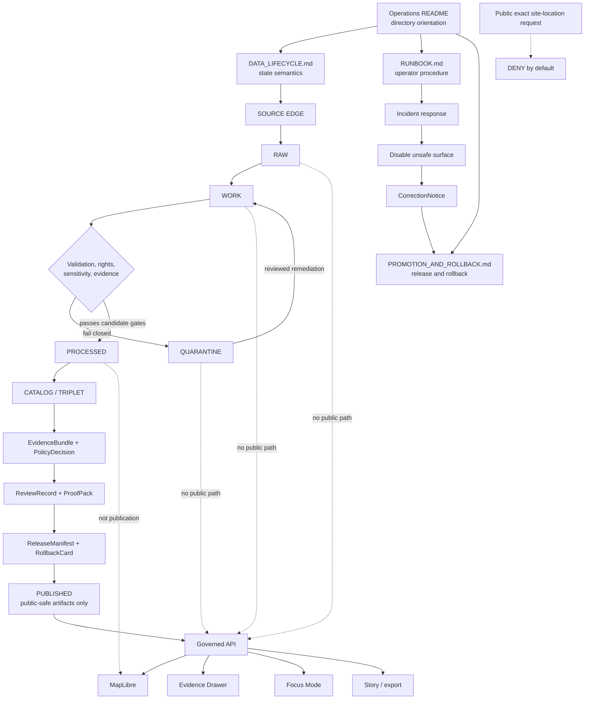

<!-- [KFM_META_BLOCK_V2]
doc_id: kfm://doc/NEEDS-VERIFICATION-docs-domains-archaeology-operations-readme
title: Archaeology Operations
type: standard
version: v1
status: draft
owners: TODO-NEEDS-OWNER
created: NEEDS-VERIFICATION-YYYY-MM-DD
updated: 2026-05-06
policy_label: NEEDS-VERIFICATION-public-or-restricted
related: [docs/domains/archaeology/README.md, docs/domains/archaeology/operations/DATA_LIFECYCLE.md, docs/domains/archaeology/operations/RUNBOOK.md, docs/domains/archaeology/operations/PROMOTION_AND_ROLLBACK.md, docs/domains/archaeology/architecture/ARCHITECTURE.md, docs/domains/archaeology/architecture/DOMAIN_MODEL.md, docs/domains/archaeology/governance/SENSITIVITY_AND_RIGHTS.md, docs/domains/archaeology/governance/VALIDATION_AND_POLICY.md, docs/domains/archaeology/governance/CATALOG_AND_PROOF_OBJECTS.md, docs/domains/archaeology/governance/FILE_MAP.md, docs/doctrine/lifecycle-law.md]
tags: [kfm, archaeology, operations, data-lifecycle, runbook, promotion, rollback, correction, release, evidence, sensitivity, rights, public-safe-geometry]
notes: [Created as the operations directory README. Target file existed but was empty in the inspected GitHub main branch. doc_id, owner, created date, policy label, CODEOWNERS, live source activation, executable validators, policy-as-code, workflow enforcement, release artifact homes, API/UI route names, and runtime behavior remain NEEDS VERIFICATION.]
[/KFM_META_BLOCK_V2] -->

<a id="top"></a>

# Archaeology Operations

Directory README for the archaeology operations docs: lifecycle, runbook, promotion, correction, and rollback guidance for high-sensitivity archaeology work.

<p align="center">
  
  
  
  
  
  
  
  
</p>

<p align="center">
  <a href="#scope">Scope</a> ·
  <a href="#repo-fit">Repo fit</a> ·
  <a href="#accepted-inputs">Inputs</a> ·
  <a href="#exclusions">Exclusions</a> ·
  <a href="#directory-tree">Tree</a> ·
  <a href="#operations-map">Map</a> ·
  <a href="#quickstart">Quickstart</a> ·
  <a href="#operating-contract">Contract</a> ·
  <a href="#review-gates">Gates</a> ·
  <a href="#definition-of-done">Done</a>
</p>

> [!IMPORTANT]
> **Status:** `active` documentation surface; this file remains `draft` until owners, policy label, document registry ID, and review state are verified.  
> **Owners:** `TODO-NEEDS-OWNER`  
> **Path:** `docs/domains/archaeology/operations/README.md`  
> **Owning root:** `docs/` — human-facing control-plane and domain operations documentation.  
> **Public posture:** exact archaeological site locations are `DENY` by default.  
> **Quick jump:** [Scope](#scope) · [Repo fit](#repo-fit) · [Inputs](#accepted-inputs) · [Exclusions](#exclusions) · [Directory tree](#directory-tree) · [Operations map](#operations-map) · [Quickstart](#quickstart) · [Operating contract](#operating-contract) · [Review gates](#review-gates)

> [!WARNING]
> This directory documents operations. It does **not** publish archaeology data, approve source activation, authorize exact public geometry, prove CI enforcement, or replace policy-as-code. Public archaeology release remains blocked unless evidence, rights, sensitivity, review, catalog/proof closure, correction, and rollback requirements pass.

---

## Scope

`docs/domains/archaeology/operations/` is the lane-local operations desk for archaeology work. It tells maintainers how to move archaeology material through KFM’s governed lifecycle without weakening provenance, exposing sensitive locations, or collapsing publication into a file move.

This directory covers:

- source-to-public lifecycle operations;
- safe first-run and incident-response procedure;
- promotion, correction, withdrawal, and rollback rules;
- public-safe geometry handling at release time;
- operations handoffs to governance docs, source descriptors, schemas, policies, fixtures, validators, release manifests, governed API payloads, MapLibre layers, Evidence Drawer payloads, Focus Mode, exports, and stories.

This directory does **not** own:

- RAW, WORK, QUARANTINE, PROCESSED, CATALOG, TRIPLET, or PUBLISHED data;
- source descriptor instances;
- JSON Schemas, semantic contracts, OpenAPI, or DTO definitions;
- executable policy;
- validator implementation;
- release manifests, proof packs, receipts, correction notices, or rollback cards;
- API routes, UI components, MapLibre style files, or model runtime adapters.

[Back to top](#top)

---

## Repo fit

| Relationship | Path | Status | Role |
|---|---|---:|---|
| Current file | `docs/domains/archaeology/operations/README.md` | `CONFIRMED path; prior file was empty` | Operations directory landing page |
| Lane landing page | [`../README.md`](../README.md) | `CONFIRMED` | Archaeology lane scope, trust rules, source-role posture, and public-location warning |
| Domain index | [`../../README.md`](../../README.md) | `CONFIRMED` | Cross-domain lane rules and documentation expectations |
| Docs landing | [`../../../README.md`](../../../README.md) | `NEEDS VERIFICATION` | Upstream documentation entry point |
| Root README | [`../../../../README.md`](../../../../README.md) | `CONFIRMED` | Repository-level KFM posture and responsibility-root orientation |
| Lifecycle operation | [`./DATA_LIFECYCLE.md`](./DATA_LIFECYCLE.md) | `CONFIRMED` | RAW → PUBLISHED semantics for archaeology material |
| Operator runbook | [`./RUNBOOK.md`](./RUNBOOK.md) | `CONFIRMED` | Safe first-run, incident response, public-layer disablement, and rollback checklist |
| Promotion and rollback | [`./PROMOTION_AND_ROLLBACK.md`](./PROMOTION_AND_ROLLBACK.md) | `CONFIRMED` | Release, correction, withdrawal, and rollback procedure |
| Architecture | [`../architecture/ARCHITECTURE.md`](../architecture/ARCHITECTURE.md) | `CONFIRMED` | Trust membrane, lifecycle, runtime, and public geometry boundary |
| Domain model | [`../architecture/DOMAIN_MODEL.md`](../architecture/DOMAIN_MODEL.md) | `CONFIRMED` | Archaeology object families, geometry profiles, and relationship grammar |
| Source registry guide | [`../governance/SOURCE_REGISTRY.md`](../governance/SOURCE_REGISTRY.md) | `CONFIRMED` | Source roles, descriptor minimums, and activation posture |
| Sensitivity and rights | [`../governance/SENSITIVITY_AND_RIGHTS.md`](../governance/SENSITIVITY_AND_RIGHTS.md) | `CONFIRMED` | Rights, cultural sensitivity, exact-location posture, and public geometry rules |
| Validation and policy | [`../governance/VALIDATION_AND_POLICY.md`](../governance/VALIDATION_AND_POLICY.md) | `CONFIRMED` | Gate matrix, finite outcomes, mandatory denials, and fixture expectations |
| Catalog and proof | [`../governance/CATALOG_AND_PROOF_OBJECTS.md`](../governance/CATALOG_AND_PROOF_OBJECTS.md) | `CONFIRMED` | EvidenceBundle, catalog, proof, release, correction, and rollback closure |
| File map | [`../governance/FILE_MAP.md`](../governance/FILE_MAP.md) | `CONFIRMED` | Archaeology documentation control map |
| Shared lifecycle doctrine | [`../../../doctrine/lifecycle-law.md`](../../../doctrine/lifecycle-law.md) | `CONFIRMED` | Cross-project lifecycle law and trust-path doctrine |
| Publication runbook | [`../../../runbooks/publication.md`](../../../runbooks/publication.md) | `NEEDS VERIFICATION` | Cross-domain publication procedure, where present |
| Sensitive-location ADR | [`../../../adr/ADR-0009-sensitive-location-policy.md`](../../../adr/ADR-0009-sensitive-location-policy.md) | `NEEDS VERIFICATION` | Cross-domain sensitive-location decision surface |
| Governed API architecture | [`../../../architecture/governed-api.md`](../../../architecture/governed-api.md) | `NEEDS VERIFICATION` | Runtime trust membrane and public envelope guidance |

### Upstream / downstream summary

| Direction | Surfaces | Rule |
|---|---|---|
| Upstream doctrine | Root README, domain index, lifecycle law, trust membrane, sensitive-location ADRs | Doctrine defines the boundary; implementation proof still requires repo evidence. |
| Same-lane governance | Architecture, domain model, source registry, sensitivity/rights, validation/policy, catalog/proof | Operations must stay synchronized with these docs. |
| Downstream machine surfaces | `data/registry/`, `schemas/`, `contracts/`, `policy/`, `fixtures/`, `tests/`, `tools/`, `release/`, `data/proofs/`, `data/receipts/`, `apps/` | All downstream homes remain `NEEDS VERIFICATION` until active repo convention and executable evidence confirm them. |
| Public consumers | Governed API, MapLibre, Evidence Drawer, Focus Mode, Story, export, catalog, search, graph, vector index | Public consumers may use only released, public-safe, evidence-backed artifacts and finite envelopes. |

### Directory Rules basis

This file belongs under `docs/domains/archaeology/operations/` because it is human-facing operations documentation for a domain lane. Domain-specific folders should not become root-level folders. Machine schemas, semantic contracts, executable policies, tests, fixtures, lifecycle data, receipts, proofs, release artifacts, validators, and runtime code belong under their responsibility roots.

[Back to top](#top)

---

## Accepted inputs

Use this directory for operations guidance that helps maintainers run the archaeology lane safely.

| Accepted input | Belongs here when it… | Examples |
|---|---|---|
| Lifecycle procedure | Explains how archaeology material moves through KFM states. | RAW intake, WORK transforms, QUARANTINE holds, PROCESSED candidates, CATALOG/TRIPLET closure, PUBLISHED release. |
| Safe operating sequence | Gives maintainers an ordered run path without activating sources by accident. | Fixture-first run, no-network validation, public DTO safety check. |
| Incident playbook | Defines first action and recovery path for unsafe exposure. | Exact-location leak, candidate-feature overclaim, rights failure, catalog mismatch, Focus Mode disclosure. |
| Promotion guidance | Names the evidence, policy, review, proof, release, correction, and rollback packet needed before publication. | ReleaseManifest, PolicyDecision, ReviewRecord, EvidenceBundle, rollback target. |
| Rollback and correction guidance | Explains how to withdraw, supersede, restrict, or restore public artifacts without erasing lineage. | CorrectionNotice, RollbackCard, alias retarget, public-safe rebuild. |
| Review checklist | Gives maintainers a gate list before merging or promoting. | Source descriptor, sensitivity class, transform receipt, catalog/proof closure, public payload safety. |

[Back to top](#top)

---

## Exclusions

| Does not belong here | Correct home | Reason |
|---|---|---|
| RAW source captures | `data/raw/archaeology/` or repo-confirmed lifecycle home | Operations docs must not store source-native data. |
| WORK transforms | `data/work/archaeology/` or repo-confirmed lifecycle home | WORK may contain unreviewed precise or sensitive material. |
| QUARANTINE material | `data/quarantine/archaeology/` or repo-confirmed lifecycle home | Quarantine requires reason-coded controlled storage. |
| PROCESSED candidates | `data/processed/archaeology/` or repo-confirmed lifecycle home | Validated candidates are still not public by default. |
| Source descriptor instances | `data/registry/`, `control_plane/`, or repo-confirmed registry home | Source activation requires machine-readable review state. |
| Machine schemas | `schemas/` or accepted schema home | Shape validation belongs in versioned schema roots. |
| Semantic object contracts | `contracts/` or accepted contract home | Object meaning belongs in semantic contract roots. |
| Policy-as-code | `policy/` or accepted policy home | Policy must be executable and tested. |
| Fixtures and tests | `fixtures/`, `tests/`, or accepted repo-native homes | Regression proof belongs in testable surfaces. |
| Validators and scripts | `tools/`, `scripts/`, `packages/`, or accepted implementation roots | This README may point to tools, not replace them. |
| Release manifests, proof packs, receipts, correction notices, rollback cards | `release/`, `data/proofs/`, `data/receipts/`, `data/catalog/`, or accepted emitted-object homes | Publication artifacts must remain auditable and separately validated. |
| API handlers or UI components | `apps/`, `web/`, `ui/`, or accepted runtime roots | Runtime consumers must remain downstream of governed release. |
| Exact restricted site coordinates, private access routes, burial/sacred context, steward-only records, collection-security details | Restricted data/review stores | Public documentation must not become a leakage vector. |
| Direct model output or private chain-of-thought | Governed AI envelopes/receipts only where policy allows | AI is interpretive and downstream of evidence, policy, and release state. |

[Back to top](#top)

---

## Directory tree

```text
docs/domains/archaeology/operations/
├── README.md
├── DATA_LIFECYCLE.md
├── PROMOTION_AND_ROLLBACK.md
└── RUNBOOK.md
```

| File | Operational responsibility |
|---|---|
| [`README.md`](./README.md) | Directory orientation, repo fit, file responsibilities, accepted inputs, exclusions, and review gates. |
| [`DATA_LIFECYCLE.md`](./DATA_LIFECYCLE.md) | How archaeology material moves through SOURCE EDGE, RAW, WORK, QUARANTINE, PROCESSED, CATALOG/TRIPLET, and PUBLISHED. |
| [`RUNBOOK.md`](./RUNBOOK.md) | Operator procedure for safe first runs, run modes, incident handling, public-layer disablement, rollback, and verification. |
| [`PROMOTION_AND_ROLLBACK.md`](./PROMOTION_AND_ROLLBACK.md) | Release-facing rules for promotion, correction, withdrawal, rollback, release packets, and public surface verification. |

[Back to top](#top)

---

## Operations map



[Back to top](#top)

---

## Quickstart

These checks are read-only orientation steps for maintainers working from the repository root.

```bash
# Confirm checkout state before changing operations docs.
git status --short
git branch --show-current || true
git rev-parse --show-toplevel || true

# Inspect the archaeology operations docs.
find docs/domains/archaeology/operations -maxdepth 1 -type f | sort

# Inspect adjacent archaeology documentation that operations docs depend on.
find docs/domains/archaeology -maxdepth 3 -type f | sort
```

After repo-native validator, fixture, schema, policy, and workflow homes are confirmed, adapt the commands below to the active toolchain.

```bash
# PROPOSED validation targets only — replace with repo-native commands after verification.
python tools/validators/archaeology/validate_source_descriptors.py
python tools/validators/archaeology/validate_lifecycle_transitions.py
python tools/validators/archaeology/validate_public_geometry_safety.py
python tools/validators/archaeology/validate_candidate_feature_boundary.py
python tools/validators/archaeology/validate_evidence_bundle_closure.py
python tools/validators/archaeology/validate_catalog_proof_closure.py
python tools/validators/archaeology/validate_release_manifest.py
python tools/validators/archaeology/validate_rollback_card.py

python -m pytest tests/domains/archaeology tests/fixtures/archaeology
```

> [!CAUTION]
> Do not activate live archaeology connectors, public layers, public exports, Focus Mode answers, or release aliases from documentation alone. Source descriptors, rights, sensitivity, steward review, policy gates, fixtures, validators, release manifests, correction paths, and rollback targets must be verified first.

[Back to top](#top)

---

## Operating contract

The archaeology operations contract is:

```text
SOURCE EDGE -> RAW -> WORK / QUARANTINE -> PROCESSED -> CATALOG / TRIPLET -> PUBLISHED
```

| Boundary | Operations obligation | Public posture |
|---|---|---|
| `SOURCE EDGE` | Confirm source role, rights, owner/steward, access mode, cadence, sensitivity defaults, citation expectations, and activation state. | Not public truth. |
| `RAW` | Preserve source-native capture, checksum/digest where practical, retrieval context, and intake receipt. | No public path. |
| `WORK` | Normalize, georeference, OCR, classify, transform, or review without public exposure. | No public path. |
| `QUARANTINE` | Hold invalid, unsafe, rights-unclear, steward-blocked, unsupported, or sensitivity-unclear material with reason codes. | No public path except approved public-safe status explanation. |
| `PROCESSED` | Store validated internal candidates and public-safe candidate derivatives awaiting release. | Not publication. |
| `CATALOG / TRIPLET` | Produce discovery, provenance, catalog, and relationship projections without turning derivatives into truth. | Conditional; not public authorization by itself. |
| `PUBLISHED` | Expose only release-backed public-safe artifacts through governed surfaces. | Governed API, layer, drawer, Focus, export, story, catalog, and correction state only. |

### Non-negotiable archaeology operations rules

| Rule | Required outcome |
|---|---|
| Public exact archaeological site locations are denied by default. | `DENY` exact public exposure unless a reviewed, policy-approved exception exists. |
| Candidate features are not confirmed sites. | Remote sensing, LiDAR, aerial, geophysical, model, or anomaly outputs remain candidate-only until evidence and review support stronger status. |
| Unknown rights fail closed. | `DENY` public release or hold in quarantine/review. |
| Unknown sensitivity fails closed. | `DENY` public release until classification and public geometry posture are resolved. |
| Public geometry transforms require receipts. | Generalization, suppression, aggregation, redaction, withholding, delay, or role-gating must be auditable. |
| Evidence must resolve. | Consequential public claims require `EvidenceRef -> EvidenceBundle`. |
| Promotion needs rollback. | Release candidates without rollback targets remain blocked. |
| Corrections are first-class. | Public defects use correction, withdrawal, supersession, or rollback lineage, never silent overwrite. |
| UI and AI are downstream. | MapLibre, Evidence Drawer, Focus Mode, stories, exports, graph/search/vector projections, and optional scenes consume governed payloads only. |

[Back to top](#top)

---

## Review gates

Use these gates before changing operations docs, source activation posture, lifecycle semantics, release wording, public layer behavior, Evidence Drawer payloads, Focus Mode behavior, export/story guidance, correction rules, or rollback procedure.

| Gate | Must prove | Failure outcome |
|---|---|---|
| Documentation fit | Change belongs in operations docs, not schema, policy, data, validator, runtime, or release artifact roots. | Move to correct responsibility root or mark `NEEDS VERIFICATION`. |
| Source descriptor readiness | Source role, rights, sensitivity defaults, owner/steward, cadence, access mode, citation expectations, and activation state are explicit. | `DENY` activation or hold source proposal. |
| Rights completeness | Public reuse, redistribution, export, citation, and attribution requirements are known. | `DENY` public release. |
| Sensitivity completeness | Exact-location, burial/human remains, sacred/cultural, private-land, collection-security, and looting-risk classes are evaluated. | `DENY` or `HOLD_FOR_REVIEW`. |
| Candidate-feature discipline | Candidate anomalies remain candidate-only unless evidence and review support stronger classification. | `DENY` confirmed-site claim. |
| Evidence closure | Public claims resolve `EvidenceRef -> EvidenceBundle`. | `ABSTAIN`, `DENY`, or `ERROR`. |
| Public geometry transform | Public-safe geometry has transform receipt and reconstruction-risk posture. | `DENY` release. |
| Public payload safety | API, layer, drawer, Focus, story, export, catalog, search, graph, vector, and screenshot payloads omit restricted data and internal refs. | `DENY` public response or release. |
| Catalog/proof closure | Catalog, provenance, evidence, proof, policy, review, release, correction, and rollback refs align. | `ERROR` or release blocked. |
| Review closure | Required domain, steward, cultural, rights, policy, security, UI trust, or release review is recorded. | `HOLD_FOR_REVIEW`. |
| Rollback readiness | Release candidate has rollback card or withdrawal target. | Promotion blocked. |
| Correction readiness | Public changes can be corrected, withdrawn, superseded, or narrowed without erasing history. | Promotion blocked. |

### Required negative cases

- [ ] Public exact archaeological site coordinate returns `DENY`.
- [ ] Burial, human remains, sacred site, or culturally sensitive exact coordinate in public payload returns `DENY`.
- [ ] Unknown-rights source in public release candidate returns `DENY`.
- [ ] Unknown-sensitivity candidate in public release candidate returns `DENY`.
- [ ] Candidate LiDAR/geophysical/model anomaly promoted as confirmed site returns `DENY`.
- [ ] Public generalized geometry without transform receipt returns `DENY`.
- [ ] Public DTO exposes RAW, WORK, QUARANTINE, internal canonical, graph-internal, vector-index, model-runtime, or restricted refs returns `DENY`.
- [ ] Evidence Drawer payload leaks restricted geometry, source row, access route, or collection-security detail returns `DENY`.
- [ ] Focus Mode reveals, infers, or reconstructs exact site location returns `DENY`.
- [ ] Release manifest without rollback target blocks promotion.
- [ ] Correction that silently overwrites a published release returns `ERROR`.

[Back to top](#top)

---

## Public surface checklist

Before public release, correction, rollback, or review closure, inspect every outward surface that can leak archaeology state.

| Surface | Check |
|---|---|
| Governed API | Uses only released, public-safe artifacts and finite envelopes. |
| MapLibre layer | Does not expose exact restricted geometry or reconstructable precision. |
| Evidence Drawer | Shows source role, rights/sensitivity posture, support, caveats, transform receipt, review state, release state, correction state, and rollback posture safely. |
| Focus Mode | Uses released evidence context; exact-location requests return `DENY`; unsupported claims return `ABSTAIN`; system failures return `ERROR`. |
| Story / dossier | Carries evidence, policy, sensitivity, release, and correction state without leaking restricted details. |
| Export / share | Preserves public-safe geometry and trust metadata. |
| Catalog | Does not leak restricted bounding boxes, centroids, source row IDs, filenames, URLs, or precision clues. |
| Search / graph / vector index | Cannot reconstruct restricted locations or source identities. |
| Screenshots and examples | Use synthetic or public-safe data only. |
| Logs and receipts exposed to users | Do not expose restricted geometry, credentials, internal paths, source secrets, or private reasoning. |

[Back to top](#top)

---

## Maintenance rules

Update this README when:

- an operations file is added, moved, renamed, deprecated, or deleted;
- `DATA_LIFECYCLE.md`, `RUNBOOK.md`, or `PROMOTION_AND_ROLLBACK.md` changes responsibility;
- a governance doc changes a rule that operations must enforce;
- public geometry posture changes;
- exact-location denial wording changes;
- source activation posture changes;
- release packet requirements change;
- correction, withdrawal, or rollback procedure changes;
- runtime public surfaces are confirmed or renamed;
- validation, policy, fixtures, or CI enforcement becomes confirmed.

Update adjacent docs when this README changes materially:

| Change in this README | Also check |
|---|---|
| Source role or activation posture | [`../governance/SOURCE_REGISTRY.md`](../governance/SOURCE_REGISTRY.md) |
| Rights or sensitivity posture | [`../governance/SENSITIVITY_AND_RIGHTS.md`](../governance/SENSITIVITY_AND_RIGHTS.md) |
| Gate or finite outcome language | [`../governance/VALIDATION_AND_POLICY.md`](../governance/VALIDATION_AND_POLICY.md) |
| Catalog/proof/release closure language | [`../governance/CATALOG_AND_PROOF_OBJECTS.md`](../governance/CATALOG_AND_PROOF_OBJECTS.md) |
| Lifecycle state wording | [`./DATA_LIFECYCLE.md`](./DATA_LIFECYCLE.md), [`../../../doctrine/lifecycle-law.md`](../../../doctrine/lifecycle-law.md) |
| Incident response or run sequence | [`./RUNBOOK.md`](./RUNBOOK.md) |
| Promotion, rollback, correction, withdrawal | [`./PROMOTION_AND_ROLLBACK.md`](./PROMOTION_AND_ROLLBACK.md) |
| Navigation or file ownership | [`../governance/FILE_MAP.md`](../governance/FILE_MAP.md), [`../CHANGELOG.md`](../CHANGELOG.md) |
| Open verification status | [`../governance/OPEN_QUESTIONS.md`](../governance/OPEN_QUESTIONS.md) |

[Back to top](#top)

---

## FAQ

### Does this README publish anything?

No. It is a directory landing page for operations docs. Publication requires release state, policy decision, review record, proof closure, correction path, and rollback target.

### Can public UI hide exact locations client-side?

No. Client-side hiding is not a safety boundary. Public DTOs, layers, tiles, drawer payloads, search results, graph edges, exports, stories, screenshots, and Focus context must already be public-safe before they reach the client.

### Can a LiDAR or geophysical anomaly become a site record?

Only after evidence and review support stronger classification. Until then, it remains a candidate feature and must not be promoted as a confirmed archaeological site.

### Does a catalog record authorize public release?

No. Catalog and triplet records support discovery, provenance, and relation projection. Public exposure still requires promotion, release, correction, and rollback controls.

### Can generated Focus Mode language become archaeology truth?

No. Focus Mode is interpretive and downstream of governed API, EvidenceBundle resolution, policy checks, release state, and citation validation.

[Back to top](#top)

---

## Definition of done

A revision to `docs/domains/archaeology/operations/README.md` is reviewable when:

- [ ] KFM Meta Block V2 is present and unresolved values are explicit placeholders.
- [ ] Impact block includes status, owners, badges, path, role, and quick jumps.
- [ ] Title and one-line purpose are present.
- [ ] Repo fit includes path, upstream links, downstream links, and responsibility-root basis.
- [ ] Accepted inputs and exclusions are explicit.
- [ ] Directory tree matches confirmed operations files.
- [ ] Mermaid diagram reflects real operations relationships and lifecycle boundaries.
- [ ] Exact public archaeological location `DENY` posture remains visible near the top.
- [ ] Source roles, rights, sensitivity, evidence, catalog/proof, promotion, correction, and rollback are not collapsed.
- [ ] Public API/UI, MapLibre, Evidence Drawer, Focus Mode, story, export, search, graph, and vector-index surfaces remain downstream of governed release.
- [ ] Machine/runtime paths are labeled `NEEDS VERIFICATION` unless verified in the active repo.
- [ ] Validation commands are labeled `PROPOSED` until repo-native tooling is confirmed.
- [ ] No RAW, WORK, QUARANTINE, restricted geometry, private source details, or exact sensitive locations are included.
- [ ] Related archaeology docs and changelog are updated or explicitly deferred.
- [ ] Open verification items remain visible.

[Back to top](#top)

---

## Open verification

| Item | Status | Why it matters |
|---|---:|---|
| Stable `doc_id` | `NEEDS VERIFICATION` | Required for document registry and durable cross-references. |
| Owner / CODEOWNERS | `TODO-NEEDS-OWNER` | Required for review, escalation, and release accountability. |
| Created date | `NEEDS VERIFICATION` | Should come from Git history or document registry. |
| Policy label | `NEEDS VERIFICATION` | Determines public/restricted handling of the operations directory. |
| Schema-home authority | `NEEDS VERIFICATION` | Prevents `contracts/` versus `schemas/` drift. |
| Source descriptor registry home | `NEEDS VERIFICATION` | Prevents duplicate source authority homes. |
| Policy runtime and path | `UNKNOWN` | Determines executable denial behavior. |
| Validator language and fixture roots | `UNKNOWN` | Commands must follow repo-native tools. |
| CI workflow coverage | `UNKNOWN` | Enforcement cannot be claimed from documentation alone. |
| Active archaeology source descriptors | `UNKNOWN` | Blocks claims about current source activation. |
| Steward, cultural, tribal, landowner, collection, and rights review process | `NEEDS VERIFICATION` | Required before sensitive source activation or public derivatives. |
| Public generalization thresholds | `NEEDS VERIFICATION` | Required before public map, export, story, or Focus release. |
| API and UI implementation paths | `UNKNOWN` | Prevents invented route/component claims. |
| Existing proof packs, release manifests, correction notices, and rollback cards | `UNKNOWN` | Publication maturity requires emitted-object evidence. |
| Runtime logs, dashboards, and deployments | `UNKNOWN` | Operational maturity cannot be inferred from docs. |

[Back to top](#top)

---

## Appendix

<details>
<summary><strong>Reviewer card</strong></summary>

| Review field | Entry |
|---|---|
| Target file | `docs/domains/archaeology/operations/README.md` |
| Change type | Directory README creation/revision |
| Owning root | `docs/` |
| Directory Rules basis | Domain operations documentation belongs under `docs/domains/<domain>/operations/`; machine surfaces stay in responsibility roots. |
| Default public exact-location posture | `DENY` |
| Primary related docs | `DATA_LIFECYCLE.md`, `RUNBOOK.md`, `PROMOTION_AND_ROLLBACK.md` |
| Requires schema change? | `No`, unless linked machine homes are modified separately. |
| Requires policy change? | `No`, unless denial logic changes. |
| Requires fixture/test change? | `Maybe`, when review gates or negative cases change. |
| Requires release artifact change? | `No`, unless public release procedure changes. |
| Rollback | Revert this README and restore prior operations directory index state. |
| Main risk | Overclaiming executable enforcement from documentation. |
| Required reviewer posture | Confirm labels, links, no sensitive detail, and no invented runtime claims. |

</details>

<details>
<summary><strong>Anti-patterns this README should prevent</strong></summary>

| Anti-pattern | Correct response |
|---|---|
| Adding root-level `archaeology/` for operations convenience | Reject; use responsibility roots. |
| Treating `PROCESSED` as public release | Block; require catalog/proof/policy/review/release/correction/rollback. |
| Publishing exact site coordinates because the source is public | Deny by default; public availability is not release clearance. |
| Letting a map layer become source truth | Require release-backed layer manifest and EvidenceBundle support. |
| Treating an anomaly as a confirmed site | Keep candidate-only until evidence and review support stronger claim. |
| Moving policy into prose | Put executable logic in policy roots and tests. |
| Relying on UI filtering for safety | Emit only public-safe payloads from governed surfaces. |
| Using Focus Mode to answer uncited archaeology claims | Abstain or deny; generated language is downstream of evidence. |
| Rolling back by deleting artifacts | Use correction and rollback lineage. |

</details>

[Back to top](#top)
