<!-- [KFM_META_BLOCK_V2]
doc_id: kfm://doc/TODO-NEEDS-UUID
title: Archaeology Runbook
type: standard
version: v1
status: draft
owners: TODO-archaeology-domain-steward
created: 2026-04-27
updated: 2026-05-06
policy_label: TODO-NEEDS-VERIFICATION
related: [../README.md, ../CHANGELOG.md, ../../README.md, ../../../../README.md, ../../../adr/ADR-0001-schema-home.md]
tags: [kfm, archaeology, operations, runbook, evidence-first, fail-closed, public-safety, rollback]
notes: [Created date follows the archaeology CHANGELOG companion-doc entry and should be verified against commit history. doc_id, owners, policy_label, validator paths, workflow names, source rights, steward process, and release enforcement remain NEEDS VERIFICATION. Exact archaeological site locations are DENY by default on public surfaces.]
[/KFM_META_BLOCK_V2] -->

<a id="top"></a>

# Archaeology Runbook

*Operate the KFM archaeology lane through evidence-bound, sensitivity-aware, fail-closed procedures from source admission to public rollback.*

<p>
  
  
  
  
  
</p>

> [!IMPORTANT]
> **Status:** draft  
> **Owners:** `TODO-archaeology-domain-steward`  
> **Path:** `docs/domains/archaeology/operations/RUNBOOK.md`  
> **Role:** human-facing operations runbook; not source data, not policy-as-code, not schema authority  
> **Quick jumps:** [Operating posture](#operating-posture) · [Repo fit](#repo-fit) · [Accepted inputs](#accepted-inputs) · [Exclusions](#exclusions) · [Triggers](#triggers) · [Prerequisites](#prerequisites) · [Safe first-run sequence](#safe-first-run-sequence) · [Run modes](#run-modes) · [Lifecycle sequence](#lifecycle-sequence) · [Validation gates](#validation-gates) · [Public API and UI safety](#public-api-and-ui-safety) · [Incident response](#incident-response) · [Emergency public-layer disablement](#emergency-public-layer-disablement) · [Rollback and correction](#rollback-and-correction) · [Verification checklist](#verification-checklist) · [Appendix](#appendix-a-illustrative-command-sheet)

> [!WARNING]
> Public archaeology is never “just a layer.” Exact archaeological site locations, burial contexts, sacred places, culturally sensitive knowledge, collection-security details, private landowner exposure, and looting-risk signals are **DENY by default** unless a reviewed, policy-approved, public-safe transform explicitly allows narrower disclosure.

---

## Operating posture

The archaeology lane must preserve archaeological evidence, cultural sensitivity, source rights, steward review, geometry precision, and public-release posture as separate operational concerns.

The runbook’s operating law is:

```text
SOURCE EDGE -> RAW -> WORK / QUARANTINE -> PROCESSED -> CATALOG / TRIPLET -> PUBLISHED
```

Promotion is a governed state transition, not a file move. Public clients consume governed APIs, released artifacts, public-safe layer manifests, resolved `EvidenceBundle` support, and finite runtime outcomes only.

### What this runbook protects

- exact locations from becoming public by accident;
- candidate features from being promoted as confirmed sites without review;
- rights-unclear sources from reaching public release;
- RAW, WORK, QUARANTINE, restricted, canonical, graph-internal, vector-index, or model-runtime material from leaking into public payloads;
- generated language from replacing evidence, review, policy, and release state;
- rollback and correction history from being silently overwritten.

### Truth labels used here

| Label | Meaning in this runbook |
|---|---|
| **CONFIRMED** | Verified from current repo files, current workspace inspection, or attached KFM doctrine inspected for this revision. |
| **PROPOSED** | Operational design or command/path expectation that fits KFM doctrine but is not yet proven as executable behavior. |
| **UNKNOWN** | Not verified because runtime logs, CI artifacts, dashboards, workflow execution, source terms, source registries, or live pipeline output were not inspected. |
| **NEEDS VERIFICATION** | Checkable before use as implementation fact. |
| **DENY / ABSTAIN / ERROR** | System outcomes, not prose style. Use them when evidence, policy, sensitivity, or runtime state blocks a safe answer or release. |

[Back to top](#top)

---

## Repo fit

| Relationship | Relative path | Status | Operational role |
|---|---|---:|---|
| Archaeology landing page | [../README.md](../README.md) | **CONFIRMED in repo** | Lane scope, exact-location denial posture, trust rules, source roles, lifecycle overview. |
| Archaeology changelog | [../CHANGELOG.md](../CHANGELOG.md) | **CONFIRMED in repo** | Human-readable archaeology documentation history. |
| Domain lanes index | [../../README.md](../../README.md) | **CONFIRMED in repo** | Directory-wide domain lane rules, source-role discipline, lifecycle posture. |
| Root README | [../../../../README.md](../../../../README.md) | **CONFIRMED in repo** | KFM root posture, trust law, responsibility roots, public-client guardrails. |
| Schema-home ADR | [../../../adr/ADR-0001-schema-home.md](../../../adr/ADR-0001-schema-home.md) | **CONFIRMED draft ADR** | Proposed `schemas/contracts/v1/` machine-contract home; enforcement still **NEEDS VERIFICATION**. |
| Source registry | `data/registry/archaeology/` | **PROPOSED / NEEDS VERIFICATION** | Source, dataset, sensitivity, public-profile, and verification backlog records. |
| Schemas | `schemas/contracts/v1/archaeology/` | **PROPOSED / NEEDS VERIFICATION** | Machine-checkable archaeology object, DTO, receipt, policy-input, and release schemas. |
| Policy | `policy/archaeology/` | **PROPOSED / NEEDS VERIFICATION** | Exact-location, rights, sensitivity, AI, catalog, source-role, and promotion deny gates. |
| Validators | `tools/validators/archaeology/` | **PROPOSED / NEEDS VERIFICATION** | Fixture-first validation for evidence, catalog closure, public DTO safety, and release readiness. |
| Tests and fixtures | `tests/domains/archaeology/` or repo-native equivalent | **PROPOSED / NEEDS VERIFICATION** | Positive and negative proof cases for public-safe behavior. |
| Governed API and UI | `apps/governed-api/`, `apps/explorer-web/`, or repo-native equivalent | **UNKNOWN / NEEDS VERIFICATION** | Runtime surfaces must be verified before route names or component paths are treated as fact. |

> [!NOTE]
> The current target file exists in the public repo, but this expanded runbook does **not** claim that validators, policies, workflows, release artifacts, or runtime behavior already exist. Those remain **NEEDS VERIFICATION** until repo-native files and execution evidence are inspected.

[Back to top](#top)

---

## Accepted inputs

This file accepts human-facing operational procedures for the archaeology lane.

| Accepted here | Examples | Gate |
|---|---|---|
| Source admission steps | Inventory source family, confirm source role, rights, sensitivity, steward review, and activation status. | Must point to source registry or mark registry path **PROPOSED**. |
| Fixture-first run steps | No-network validation, positive/negative fixtures, public DTO safety checks. | Must be testable or clearly marked **NEEDS VERIFICATION**. |
| Public-release precautions | Generalization, suppression, redaction, delayed access, role-gated access, transform receipts. | Must preserve exact-location denial by default. |
| Incident playbooks | Sensitive-location leak, rights failure, catalog closure failure, EvidenceBundle failure, public alias defect. | Must name immediate action, required record, and recovery path. |
| Rollback and correction procedures | Disable public layer, repoint release alias, issue correction notice, preserve proof trail. | Must avoid silent deletion or overwrite. |
| API/UI safety guidance | Evidence Drawer, Focus Mode, Story/Export, MapLibre layer payload constraints. | Must stay downstream of governed API and released artifacts. |

[Back to top](#top)

---

## Exclusions

| Does not belong here | Belongs instead | Reason |
|---|---|---|
| RAW source payloads | `data/raw/archaeology/` or repo-confirmed lifecycle home | RAW is immutable source capture, not documentation. |
| WORK candidates | `data/work/archaeology/` or repo-confirmed lifecycle home | WORK may contain unreviewed, precise, or failed candidates. |
| QUARANTINE records | `data/quarantine/archaeology/` or repo-confirmed lifecycle home | Quarantine must preserve reason-coded receipts. |
| Exact restricted coordinates | Restricted steward-controlled store | Public runbooks must not leak exact site, burial, sacred-place, or collection-security locations. |
| Live source credentials or private steward contacts | Secrets management or restricted operational documentation | Public repo docs must not expose access controls or private review channels. |
| Machine schemas | `schemas/contracts/v1/archaeology/` or accepted schema home | This runbook explains operations; it is not schema authority. |
| Policy-as-code | `policy/archaeology/` or accepted policy home | Deny/allow/restrict logic must be executable and testable. |
| Validator implementation | `tools/validators/archaeology/`, packages, pipelines, or repo-native equivalent | This runbook may point to validators, not replace them. |
| Generated public artifacts | catalog, release, published, or artifact roots | Public artifacts require release manifests, proof refs, correction paths, and rollback targets. |
| Direct model output or chain-of-thought | Governed AI receipts/envelopes only where policy allows | AI is interpretive support, not archaeological truth. |

[Back to top](#top)

---

## Triggers

Use this runbook when one of the following events occurs.

| Trigger | Required first action | Default outcome until checks pass |
|---|---|---|
| New archaeology source proposed | Create or update a source descriptor candidate with rights, source role, sensitivity, and steward-review posture. | **DENY** live activation. |
| Source descriptor changed | Re-run source-role, rights, sensitivity, cadence, public-profile, and citation checks. | **ABSTAIN** from release claims until revalidated. |
| Remote-sensing, LiDAR, geophysical, or model output added | Classify as candidate-feature evidence only. | **DENY** confirmed-site claims without review. |
| Fixture added or changed | Run no-network valid/invalid fixture validation. | **ERROR** if expected failures pass. |
| RAW payload fetched | Record immutable raw ref, digest, retrieval time, source snapshot, and access receipt. | **QUARANTINE** malformed, rights-unclear, or unsupported payloads. |
| Normalizer changed | Re-run geometry precision, temporal, source-key, rights, sensitivity, and evidence-link checks. | **ERROR** on unsupported mutation or missing transform receipt. |
| Public DTO or layer candidate emitted | Verify no restricted geometry, internal lifecycle path, or source-system side effect leaks. | **DENY** public release on any leak. |
| Evidence Drawer payload changed | Validate source role, rights, sensitivity, review state, transform receipt, correction state, and EvidenceBundle refs. | **ABSTAIN** or **DENY** unsupported claims. |
| Focus Mode behavior changed | Validate finite outcome, citation support, policy-safe context, and exact-location denial. | **DENY** exact-location requests; **ABSTAIN** unsupported answers. |
| Release candidate promoted | Confirm reviewer, proof objects, release manifest, rollback card, rights/sensitivity review, and catalog closure. | **ERROR** if promotion is only a copy or file move. |
| Correction or rollback requested | Locate release manifest, rollback card, public alias, affected EvidenceBundles, and correction notice. | **DENY** silent overwrite or history deletion. |

[Back to top](#top)

---

## Prerequisites

Before any archaeology operation moves beyond fixture-only mode, confirm:

- [ ] current branch and dirty state are recorded;
- [ ] this file and linked archaeology docs are present at expected paths;
- [ ] source descriptor contains source owner, access mode, source role, rights, terms, cadence, citation rules, sensitivity default, and activation state;
- [ ] exact-location, burial, sacred-site, cultural, private-landowner, collection-security, and looting-risk posture is explicit;
- [ ] schema-home status is checked against the current ADR;
- [ ] valid and invalid fixtures exist for the source family or operation;
- [ ] public geometry treatment is explicit: generalized, suppressed, redacted, role-gated, delayed, or denied;
- [ ] any public geometry transform has a transform receipt or a **PROPOSED** fixture proving the receipt shape;
- [ ] `EvidenceRef -> EvidenceBundle` resolution is possible before public explanation;
- [ ] catalog/provenance closure can be checked before promotion;
- [ ] public DTO, layer, Evidence Drawer, Focus, Story, and Export payloads can be checked for restricted-data leakage;
- [ ] release manifest and rollback target exist before publication;
- [ ] steward, cultural, rights, and policy review obligations are known or the operation remains blocked.

> [!CAUTION]
> Missing rights, missing sensitivity, ambiguous source role, unresolved steward review, exact-location exposure, unsupported public precision, unresolved EvidenceBundle, stale catalog closure, or missing rollback target blocks promotion.

[Back to top](#top)

---

## Safe first-run sequence

This expands the existing minimal runbook sequence while keeping the same fail-closed intent.

1. **Verify docs and source-registry scaffolding.**  
   Confirm `../README.md`, `../CHANGELOG.md`, this runbook, the source registry candidate, and the schema-home ADR status.

2. **Confirm no live connectors are enabled.**  
   Source discovery may run only if source terms, rights, sensitivity, and steward process are approved. Otherwise keep connector state `disabled`, `planned`, or `blocked`.

3. **Run fixture-based validation and policy checks.**  
   Use no-network fixtures first. Positive fixtures must pass. Negative fixtures for exact public location, rights-unknown release, candidate-feature overclaim, catalog mismatch, and uncited AI answer must fail.

4. **Validate public DTO safety.**  
   Public payloads must not include exact restricted geometry, RAW/WORK/QUARANTINE paths, private source refs, direct model outputs, restricted catalog refs, or graph/vector-index internals.

5. **Validate catalog/proof closure.**  
   Release candidates must align EvidenceBundle, catalog records, proof refs, validation reports, policy decisions, release manifest, and rollback target.

6. **Approve promotion only with completed review evidence.**  
   Reviewer, rights/sensitivity review, steward/cultural review where required, proof objects, release state, correction path, and rollback card must be complete.

7. **Serve only through governed surfaces.**  
   Public map, Evidence Drawer, Focus Mode, story, export, and API responses consume released artifacts and governed envelopes only.

8. **Record correction and rollback readiness.**  
   The first run is not complete until a rollback drill or rollback-card inspection succeeds.

[Back to top](#top)

---

## Run modes

| Mode | Use when | Network allowed? | May publish? | Required outcome |
|---|---|---:|---:|---|
| `fixture-dry-run` | PR validation, schema/policy/validator changes, first source admission. | No | No | `ValidationReport` or repo-native equivalent with valid/invalid fixture results. |
| `source-discovery` | Source descriptor, terms, or steward process needs review. | No by default | No | Source admission decision: planned, approved, active, blocked, or **NEEDS VERIFICATION**. |
| `live-candidate` | Source is approved and operational use is authorized. | Yes, if approved | No | RAW capture receipt, WORK candidate, validation report, quarantine or processed candidate. |
| `catalog-dry-run` | Processed candidate is ready for evidence/catalog closure. | No by default | No | Catalog/provenance/EvidenceBundle candidate and closure report. |
| `public-profile-dry-run` | Candidate public geometry or summary needs release evaluation. | No | No | Transform receipt, no-leak report, public-profile policy result. |
| `promotion-dry-run` | Release candidate needs gate evaluation. | No | No | `PromotionDecision` with `ANSWER`, `ABSTAIN`, `DENY`, or `ERROR` style finite outcome and reason codes. |
| `publish-release` | Steward/policy/release review has passed. | No by default | Yes | `ReleaseManifest`, proof refs, rollback card, and public alias. |
| `emergency-disable` | Sensitive-location leak or unsafe public artifact suspected. | No | Disables exposure | Public layer/API/export alias disabled; incident receipt created. |
| `rollback-drill` | Testing reversibility or responding to release defect. | No | Changes public alias only after review | Rollback receipt, correction/supersession note, updated release/correction state. |

[Back to top](#top)

---

## Lifecycle sequence

```mermaid
flowchart LR
    SD[SourceDescriptor<br/>role · rights · sensitivity · cadence] --> DISCOVER[DISCOVER<br/>admission review]
    DISCOVER --> RAW[RAW<br/>source-native capture · digest · receipt]
    RAW --> WORK[WORK<br/>normalize · preserve keys · preserve precision context]
    WORK --> CHECK{Validation + policy}
    CHECK -- fail --> Q[QUARANTINE<br/>reason-coded hold]
    CHECK -- pass --> PROC[PROCESSED<br/>candidate artifact]
    PROC --> CAT[CATALOG / TRIPLET<br/>STAC · DCAT · PROV · graph delta]
    CAT --> EV[EvidenceBundle<br/>support · policy · review · release context]
    EV --> PUBPROFILE{Public profile?}
    PUBPROFILE -- exact/sensitive/unreviewed --> DENY[DENY<br/>no public exact location]
    PUBPROFILE -- generalized/suppressed/reviewed --> TRANSFORM[Transform receipt<br/>generalize · suppress · redact]
    TRANSFORM --> PROMOTE{Promotion gate}
    PROMOTE -- deny/abstain/error --> DECISION[DecisionEnvelope<br/>reason codes · obligations]
    PROMOTE -- allow --> RELEASE[ReleaseManifest<br/>proof refs · rollback card]
    RELEASE --> PUBLISHED[PUBLISHED<br/>released artifacts only]
    PUBLISHED --> API[Governed API]
    API --> UI[MapLibre layer<br/>Evidence Drawer<br/>Focus Mode]
```



### Stage responsibilities

| Stage | Operator action | Required objects | Fail-closed behavior |
|---|---|---|---|
| DISCOVER | Verify source family, owner, source role, rights, sensitivity, cadence, public release intent, and steward process. | Source descriptor, source review note, verification backlog update. | **DENY** source activation if required fields are missing. |
| RAW | Capture source-native payload without mutation; record digest and retrieval context. | Raw ref, digest, source snapshot, access/run receipt. | **QUARANTINE** malformed or rights-unclear payloads. |
| WORK | Normalize while preserving source keys, geometry precision, time fields, method, source caveats, and review state. | WORK candidate, transform receipt, validation precheck. | **QUARANTINE** if source identity, support, or precision semantics are lost. |
| VALIDATE | Run schema, rights, sensitivity, evidence, geometry, candidate-feature, catalog, and public-path checks. | Validation report and policy decision candidate. | **DENY** release; **ERROR** if expected negative fixtures pass. |
| PROCESSED | Emit processed candidate only from validated WORK. | Dataset/candidate version, artifact refs, receipts. | **ERROR** if validation was bypassed. |
| CATALOG / TRIPLET | Emit catalog/provenance/graph candidates and link EvidenceRefs. | Catalog refs, triplet refs, CatalogMatrix or equivalent, EvidenceBundle candidate. | **DENY** promotion on closure failure. |
| PUBLIC PROFILE | Decide whether public output is denied, generalized, suppressed, redacted, delayed, or role-gated. | Public profile, transform receipt, policy decision. | **DENY** exact public location by default. |
| PROMOTION | Evaluate evidence, rights, sensitivity, validation, catalog, policy, review, release, and rollback readiness. | PromotionDecision, proof refs, release manifest candidate, rollback card. | **DENY / ABSTAIN / ERROR** with reason codes. |
| PUBLISHED | Materialize released artifacts and public aliases only after promotion. | ReleaseManifest, proof pack refs, correction path, rollback target. | **ERROR** if publication is only a copy or file move. |
| SERVE | Expose only released artifacts through governed API, layer manifests, Evidence Drawer, and Focus Mode. | Public DTOs, layer manifest, Evidence Drawer payload, Focus payload. | **DENY** direct RAW/WORK/QUARANTINE/restricted/model access. |
| CORRECT / ROLLBACK | Supersede, withdraw, or repoint release aliases while preserving lineage. | CorrectionNotice, rollback receipt, updated release refs. | **ERROR** if history is overwritten or rollback target is absent. |

[Back to top](#top)

---

## Validation gates

Validation is fixture-first and fail-closed. Actual validator commands remain **NEEDS VERIFICATION**.

| Gate | Proves | Expected negative case |
|---|---|---|
| Source descriptor validation | Source owner, role, rights, cadence, citation rules, sensitivity, access mode, and activation state exist. | Source missing rights, sensitivity, or source role. |
| Rights and sensitivity validation | Public release terms and public precision class are explicit. | Unknown rights or unresolved cultural/steward review. |
| Exact-location denial | Public artifacts do not expose restricted coordinates. | Public payload includes exact site geometry. |
| Candidate-feature discipline | LiDAR, aerial, satellite, geophysical, ML, or model outputs remain candidate features. | Candidate anomaly promoted as confirmed site. |
| EvidenceBundle closure | Consequential claim resolves to admissible support. | Claim lacks `EvidenceRef` or EvidenceBundle cannot be resolved. |
| Citation validation | Focus and public text can cite support. | AI answer or public summary without validated citation. |
| Catalog closure | Catalog, proof, release, EvidenceBundle, transform, and policy refs align. | Catalog digest mismatch or missing release manifest digest. |
| Public DTO safety | No RAW/WORK/QUARANTINE/restricted/canonical/vector-index/model-runtime references leak. | Public layer or drawer payload links to internal lifecycle store. |
| Transform receipt | Generalization, suppression, redaction, delayed release, or role-gated transform is recorded. | Public generalized layer lacks transform receipt. |
| Promotion readiness | Reviewer, proof objects, review record, rights/sensitivity review, release manifest, and rollback plan exist. | Release candidate lacks rollback card or steward review. |
| Rollback readiness | Published release has correction path and rollback target. | Release manifest without rollback target. |

### Required decision outcomes

| Outcome | Use when | Required content |
|---|---|---|
| `ANSWER` | Evidence, policy, review, and release state support the scoped answer or operation. | Evidence refs, scope, source role, policy label, release state, caveats. |
| `ABSTAIN` | Evidence is missing, stale, ambiguous, insufficient, or outside requested scope. | Reason code, evidence gap, narrowed safe scope if available. |
| `DENY` | Policy, rights, sensitivity, exact-location exposure, source role, steward review, or release state blocks exposure. | Reason code, obligation, review/policy ref where applicable. |
| `ERROR` | Validation, catalog, schema, runtime, integrity, or rollback failure prevents a reliable decision. | Failure class, artifact/run refs, recovery task. |

[Back to top](#top)

---

## Public API and UI safety

All route names, component names, and app paths are **NEEDS VERIFICATION** until confirmed in repo-native runtime files.

| Surface | Public-safe rule | Deny when |
|---|---|---|
| MapLibre archaeology layer | Uses released public artifacts only; generalized/suppressed geometry where required. | Layer source points to exact restricted coordinates, RAW/WORK/QUARANTINE, or unpublished candidate. |
| Evidence Drawer | Shows source role, rights/sensitivity posture, review state, transform receipt, EvidenceBundle, correction state, and release state. | Drawer reveals exact restricted geometry or private operational/source details. |
| Focus Mode | Uses governed API envelope, resolved EvidenceBundle, validated citations, and finite outcome. | User asks for exact site location, restricted context, uncited answer, or model-only claim. |
| Story / dossier | Public narrative carries evidence and sensitivity cues. | Story embeds restricted location, collection-security detail, or unreviewed candidate as fact. |
| Export / share | Preserves public-safe geometry, policy label, release state, and correction state. | Export drops trust cues or reveals internal/restricted refs. |
| Review console | Role-gated only; audit receipts required. | Review action lacks reviewer identity, role, reason, or receipt. |
| Public API | Serves public DTOs backed by released artifacts. | Response includes internal lifecycle paths, restricted geometry, or unresolved evidence. |

> [!IMPORTANT]
> Hiding a point on the map is not enough. Validate the layer descriptor, vector tile, drawer payload, search result, graph edge, Focus context, export, and catalog record together.

[Back to top](#top)

---

## Incident response

| Incident | Immediate action | Required record | Recovery path |
|---|---|---|---|
| Exact sensitive location appears publicly | Disable affected layer/API/export alias immediately. | Incident receipt, affected release refs, public alias state, steward notification. | Run rollback card, issue correction notice, add regression fixture, rerun public DTO safety validation. |
| Burial, sacred-site, cultural, or private-landowner detail leaks | Disable public exposure and notify steward/cultural review owner. | Incident receipt, restricted-data classification, reviewer action log. | Restrict or withdraw release, update sensitivity policy, rerun release gate. |
| Collection-security or looting-risk detail leaks | Disable public exposure and preserve evidence trail. | Incident receipt, affected artifact refs, no-delete preservation note. | Remove/repoint public alias, update policy, add negative fixture. |
| Unknown-rights source reaches release candidate | Stop promotion and quarantine candidate. | PromotionDecision `DENY`, rights review task. | Resolve terms or withdraw source; update source descriptor and coverage matrix. |
| Candidate-feature overclaim | Block claim and mark as candidate only. | Validation report and source-role failure. | Update domain model, fixture, and public wording. |
| EvidenceBundle cannot resolve | Abstain from public answer; block promotion if release candidate depends on it. | Evidence resolution report. | Rebuild EvidenceBundle from validated refs. |
| Catalog closure mismatch | Block promotion. | CatalogMatrix or equivalent failure report. | Repair catalog/provenance/release refs; rerun closure validation. |
| Public internal-path leak | Block release or disable existing public alias. | No-raw-public-path failure. | Replace with released refs; add regression fixture. |
| Focus Mode reveals restricted detail | Disable archaeology Focus behavior or enforce deny policy. | AI/runtime incident receipt, prompt/context refs where allowed. | Update AI policy, citation validation, exact-location deny test. |
| Release lacks rollback target | Block publication. | PromotionDecision `DENY`. | Create rollback card and run rollback drill. |
| Published artifact defect | Freeze or disable current alias depending on severity. | CorrectionNotice candidate and rollback receipt. | Repoint alias to prior release or publish corrected superseding release. |

[Back to top](#top)

---

## Emergency public-layer disablement

Use this path when there is credible risk of public exposure of exact site coordinates, culturally sensitive information, burial/sacred context, collection-security detail, private landowner detail, or looting-risk signal.

1. **Disable exposure first.**  
   Turn off the public layer, public API alias, export alias, Story node, or Focus context path. Do not wait for full root-cause analysis.

2. **Preserve the proof trail.**  
   Do not delete source, release, catalog, proof, or receipt objects. Restrict access if required, but preserve lineage.

3. **Notify required reviewers.**  
   Notify archaeology steward, rights reviewer, policy reviewer, and cultural/steward reviewer where applicable.

4. **Open incident receipt.**  
   Record affected `release_id`, layer ID, source descriptor, EvidenceBundle refs, catalog refs, public alias, discovery time, action time, and operator.

5. **Run public payload audit.**  
   Check layer source, tile payload, drawer payload, search index, graph/triplet output, Focus context, Story/export payload, catalog records, and release manifest.

6. **Apply rollback card.**  
   Repoint alias to a prior approved release or withdraw public artifact according to the rollback card.

7. **Publish correction notice when public impact occurred.**  
   State what changed, effective time, prior release ref, new release/withdrawal state, and safe public explanation.

8. **Add regression fixture.**  
   The leak class must become a negative fixture or policy test before re-release.

9. **Re-run release gate.**  
   Do not restore the public layer until validation, policy, review, catalog closure, and rollback readiness pass.

[Back to top](#top)

---

## Rollback and correction

Rollback restores or withdraws public exposure without erasing history.

### Rollback drill

1. Identify affected release, layer, API route/alias, catalog records, EvidenceBundles, public transforms, and correction scope.
2. Confirm rollback card points to an approved prior release or a withdrawal state.
3. Confirm rollback target has no restricted geometry or unresolved evidence.
4. Disable or repoint the public alias.
5. Emit rollback receipt.
6. Create or update correction notice.
7. Verify Evidence Drawer, Focus Mode, Story, search, export, and map payloads resolve the corrected state.
8. Update [../CHANGELOG.md](../CHANGELOG.md) and any repo-confirmed release/correction index.
9. Preserve old release artifacts, receipts, proofs, and review records as lineage unless policy requires restricted access.

### Correction classes

| Class | Use when | Public behavior |
|---|---|---|
| `supersede` | Corrected evidence, transform, public summary, or released artifact replaces prior release. | Show replacement ref and effective time. |
| `withdraw` | Release should no longer be used publicly. | Hide or mark withdrawn; preserve explanation and lineage. |
| `rollback` | Public alias returns to prior approved release. | Show rollback reason and prior/current release refs. |
| `narrow_scope` | Claim remains valid only under narrower spatial, temporal, semantic, or public-precision scope. | Update scope and require EvidenceBundle refresh. |
| `policy_restrict` | Rights, sensitivity, cultural/steward review, or location-risk posture changes exposure class. | Restrict or deny public access; record policy reason. |
| `candidate_only` | Prior output overstated a candidate feature. | Downgrade to candidate-feature language and require review for stronger claims. |

[Back to top](#top)

---

## Verification checklist

Run this checklist before changing source activation, validators, policy, public layers, Evidence Drawer payloads, Focus behavior, release manifests, or rollback cards.

### Phase 0 repo check

- [ ] Current branch recorded.
- [ ] Dirty state recorded.
- [ ] Target file path confirmed.
- [ ] Related archaeology docs still exist at linked paths.
- [ ] Schema-home ADR status checked.
- [ ] Package manager and test runner checked.
- [ ] Policy tooling checked.
- [ ] Workflow names checked.
- [ ] CODEOWNERS and steward review paths checked.
- [ ] Runtime route and UI component paths verified before naming them as current.

### Source admission

- [ ] `source_id` is immutable and unique.
- [ ] Source owner, steward, access mode, and cadence are explicit.
- [ ] Source role is declared and appropriate for intended claim type.
- [ ] Rights, redistribution constraints, and citation requirements are explicit.
- [ ] Sensitivity default is explicit.
- [ ] Public release default is explicit.
- [ ] Exact geometry handling is explicit.
- [ ] Cultural/steward, tribal, landowner, burial, sacred-site, and collection-security review requirements are explicit where applicable.
- [ ] Source activation state is one of `planned`, `disabled`, `blocked`, `approved`, or repo-native equivalent.
- [ ] Negative fixtures exist before live activation.

### Public output

- [ ] Public geometry is generalized, suppressed, redacted, delayed, role-gated, or denied.
- [ ] Transform receipt exists for public geometry treatment.
- [ ] Public DTO contains no restricted coordinates.
- [ ] Public DTO contains no RAW, WORK, QUARANTINE, internal canonical, model runtime, graph-internal, or vector-index refs.
- [ ] EvidenceBundle resolves.
- [ ] Source role and support class are visible in Evidence Drawer.
- [ ] Focus Mode exact-location requests return `DENY` or safe explanation.
- [ ] Catalog/proof/release digests align.
- [ ] Correction path and rollback card exist.

### Review and release

- [ ] Archaeology steward review recorded.
- [ ] Rights/sensitivity review recorded.
- [ ] Cultural/steward review recorded where applicable.
- [ ] Policy reviewer involved for public-impacting precision or exposure changes.
- [ ] Contract/schema reviewer involved for object meaning or shape changes.
- [ ] UI/shell reviewer involved for public payload or layer behavior changes.
- [ ] Changelog updated.
- [ ] Release manifest created.
- [ ] Rollback drill passed.
- [ ] Public alias points only to promoted release.

[Back to top](#top)

---

## Appendix A — Illustrative command sheet

> [!IMPORTANT]
> Commands are examples only. Replace them with repo-native commands after verifying package manager, validator framework, policy engine, workflow names, fixture paths, and release tooling.

<details>
<summary>Phase 0 read-only inventory</summary>

```bash
pwd
git status --short
git branch --show-current || true

find docs/domains/archaeology -maxdepth 4 -type f 2>/dev/null | sort

find docs contracts schemas policy tools tests fixtures apps packages pipelines pipeline_specs data release .github \
  -maxdepth 5 -type f 2>/dev/null \
  | grep -Ei 'archaeology|archaeological|heritage|site|artifact|provenience|stratigraphy|chronometric|EvidenceBundle|DecisionEnvelope|PromotionDecision|ReleaseManifest|CatalogMatrix|SourceDescriptor|rollback|correction' \
  | sort \
  | head -500 || true
```

</details>

<details>
<summary>Fixture-only validation sketch</summary>

```bash
# NEEDS VERIFICATION — replace with repo-native commands.
python -m pytest tests/domains/archaeology -q

# NEEDS VERIFICATION — illustrative only.
python tools/validators/archaeology/validate_source_registry.py \
  data/registry/archaeology/sources.yaml

python tools/validators/archaeology/validate_public_location_safety.py \
  tests/domains/archaeology/fixtures/public_payload_no_exact_location.valid.json

python tools/validators/archaeology/validate_catalog_closure.py \
  tests/domains/archaeology/fixtures/catalog_closure.valid.json

python tools/validators/archaeology/validate_ai_citations.py \
  tests/domains/archaeology/fixtures/focus_exact_location_deny.valid.json
```

</details>

<details>
<summary>Policy sketch</summary>

```bash
# NEEDS VERIFICATION — only after OPA/Conftest or repo-native policy tooling is installed and pinned.
conftest test tests/domains/archaeology/fixtures/policy_cases -p policy/archaeology
opa test policy/archaeology
```

</details>

<details>
<summary>Emergency disable sketch</summary>

```bash
# NEEDS VERIFICATION — placeholder names only.
python tools/validators/archaeology/disable_public_layer.py \
  --layer archaeology_public_summary \
  --reason exact_location_leak_suspected \
  --incident-receipt data/receipts/archaeology/incidents/TODO.json

python tools/validators/archaeology/validate_public_payloads.py \
  --release-id TODO-release-id \
  --fail-on-restricted-geometry
```

</details>

<details>
<summary>Release dry-run sketch</summary>

```bash
# NEEDS VERIFICATION — illustrative release gate only.
python tools/validators/archaeology/validate_release_candidate.py \
  --candidate data/processed/archaeology/release_candidates/TODO.json \
  --catalog-matrix data/catalog/archaeology/catalog_matrix/TODO.json \
  --evidence-bundle data/catalog/archaeology/evidence/TODO.json \
  --policy policy/archaeology \
  --dry-run
```

Expected dry-run result shape:

```json
{
  "outcome": "DENY",
  "release_candidate": "kfm://release-candidate/archaeology/TODO",
  "reason_codes": [
    "rollback_card_missing",
    "steward_review_missing",
    "public_geometry_transform_receipt_missing"
  ],
  "obligations": [
    "attach_rollback_card",
    "record_archaeology_steward_review",
    "attach_publication_transform_receipt"
  ]
}
```

</details>

[Back to top](#top)
