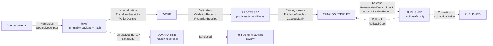
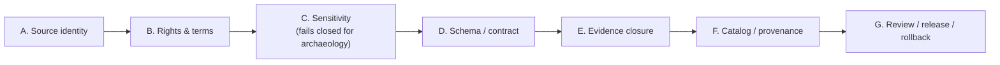

<!-- [KFM_META_BLOCK_V2]
doc_id: kfm://doc/PLACEHOLDER-uuid
title: Archaeology — Pipeline Shape (RAW → PUBLISHED)
type: standard
version: v1
status: draft
owners: <archaeology-domain-steward> (PLACEHOLDER — confirm)
created: 2026-05-28
updated: 2026-05-28
policy_label: public
related: [docs/domains/archaeology/README.md, docs/domains/archaeology/cross-lane-relations.md, docs/domains/archaeology/governed-ai-behavior.md, ai-build-operating-contract.md, directory-rules.md]
tags: [kfm, archaeology, pipeline, lifecycle, promotion, sensitive-domain]
notes: [CONTRACT_VERSION = "3.0.0" pinned; lifecycle CONFIRMED doctrine, lane application & paths PROPOSED, repo not mounted this session]
[/KFM_META_BLOCK_V2] -->

<a id="top"></a>

# 🏺 Archaeology — Pipeline Shape (RAW → PUBLISHED)

> How archaeological source material moves through the KFM lifecycle by **governed state transition**, not file movement — with sensitive geometry failing closed at every gate.


**Status:** `draft` · **Owners:** `<archaeology-domain-steward>` (PLACEHOLDER) · **Updated:** 2026-05-28

> [!CAUTION]
> **Sensitive domain.** Exact site coordinates, burial, human remains, sacred sites, collection-security detail, and looting-risk exposure **fail closed** at every lifecycle gate. No promotion through this pipeline authorizes exposing exact archaeological geometry. The sensitivity gate (Gate C) fails closed regardless of how complete the rest of the evidence is. Disposition is governed by `ai-build-operating-contract.md` §23.2.

---

## Quick jump

- [1. Scope](#1-scope)
- [2. Repo fit](#2-repo-fit)
- [3. The lifecycle invariant](#3-the-lifecycle-invariant)
- [4. Promotion is a governed state transition](#4-promotion-is-a-governed-state-transition)
- [5. Stage-by-stage shape](#5-stage-by-stage-shape)
- [6. Lifecycle diagram](#6-lifecycle-diagram)
- [7. Master gate reference](#7-master-gate-reference)
- [8. Promotion gates A–G](#8-promotion-gates-ag)
- [9. Watcher and candidate invariants](#9-watcher-and-candidate-invariants)
- [10. Open questions register](#open-questions-register)
- [11. Open verification backlog](#open-verification-backlog)
- [12. Changelog](#changelog-v0--v1)
- [13. Definition of done](#definition-of-done)
- [Related docs](#related-docs)

---

## 1. Scope

This document specifies the **pipeline shape** for the Archaeology / Cultural Heritage domain: how source material moves from `RAW` to `PUBLISHED`, what each stage handles, what gate each transition must pass, and what fails closed.

> [!NOTE]
> **Truth labels in this doc.** The lifecycle invariant (`RAW → WORK / QUARANTINE → PROCESSED → CATALOG / TRIPLET → PUBLISHED`) and "promotion is a governed state transition, not a file move" are `CONFIRMED` doctrine. The Archaeology **lane application** of that lifecycle — the per-stage gate statuses — is `PROPOSED` (Atlas §15.H marks every stage status `PROPOSED`). All repo paths are `PROPOSED` because no repository is mounted.

[↑ Back to top](#top)

---

## 2. Repo fit

| Aspect | Value | Status |
|---|---|---|
| Proposed path | `docs/domains/archaeology/pipeline-shape.md` | `PROPOSED` |
| Owning responsibility root | `docs/` (explains something to humans) | `CONFIRMED` rule |
| Domain segment | `archaeology` as a lane inside `docs/`, never a root | `CONFIRMED` rule |
| Data counterpart | `data/<phase>/archaeology/` — raw, work, quarantine, processed, catalog, triplets, published | `PROPOSED` |
| Pipeline counterpart | `pipelines/domains/archaeology/`, `pipeline_specs/archaeology/` | `PROPOSED` |
| Policy counterpart | `policy/sensitivity/archaeology/` | `PROPOSED` |
| Upstream (governs this doc) | `directory-rules.md`; `ai-build-operating-contract.md`; `[ENCY]` lifecycle doctrine | `CONFIRMED` rule / `PROPOSED` presence |

**Directory Rules basis.** A doc that *explains to humans* lives under `docs/`. The lifecycle **data** itself lives under `data/<phase>/<domain>/`, where the phase is named explicitly (raw, work, quarantine, processed, catalog, triplets, published) and `archaeology` is a segment, never a root.

[↑ Back to top](#top)

---

## 3. The lifecycle invariant

`CONFIRMED` doctrine (`[DIRRULES]`, `[ENCY]`). Every KFM domain — Archaeology included — follows one lifecycle:

```text
RAW → WORK / QUARANTINE → PROCESSED → CATALOG / TRIPLET → PUBLISHED
```

This lifecycle is the **trust membrane** that turns source material into public claims. Public clients and normal UI surfaces read governed interfaces over `PUBLISHED` artifacts — never canonical or internal stores, and never `RAW` / `WORK` / `QUARANTINE`.

[↑ Back to top](#top)

---

## 4. Promotion is a governed state transition

`CONFIRMED` doctrine. Promotion is a **decision recorded against evidence**, not an action against a filesystem. Moving a file does not promote it; a `PromotionDecision` (with passed gates, policy decision, and rollback target) does.

<details>
<summary><strong>PromotionDecision shape (PROPOSED)</strong></summary>

```text
PromotionDecision {
  promotion_id: stable_id,
  target_stage: PROCESSED | CATALOG | PUBLISHED,
  inputs: [EvidenceRef, ValidationReport, PolicyDecision, ...],
  gates_passed: [Gate A, ..., Gate G],
  gates_held:   [...],
  gates_denied: [...],
  release_target: ReleaseManifest.id (where applicable),
  rollback_target: prior_release_id (where applicable),
  steward: actor_id,
  reviewer: actor_id (where required),
  decision: ALLOW | DENY | HOLD,
  reason_codes: [...],
  spec_hash: <JCS + SHA-256 over canonicalized record>,
  timestamp_utc: ISO8601
}
```

</details>

> [!IMPORTANT]
> **Anti-collapse rule** (`CONFIRMED`). Catalogs, triplets, graph projections, PMTiles, layer manifests, model outputs, summaries, and UI answers are derivative or publication surfaces — they do **not** become root truth. Every Archaeology claim must remain traceable back through `EvidenceRef → EvidenceBundle`, receipts, policy decisions, and release records. A `CandidateFeature` is never silently promoted to a confirmed `Archaeological Site`.

[↑ Back to top](#top)

---

## 5. Stage-by-stage shape

`CONFIRMED` doctrine / `PROPOSED` lane application — Atlas §15.H. Every stage **status** is `PROPOSED` (no mounted repo confirms the implementation).

| Stage | Handling | Gate | Status |
|---|---|---|---|
| **RAW** | Capture immutable source payload or reference with source role, rights, sensitivity, citation, time, and hash. | `SourceDescriptor` exists. | `PROPOSED` |
| **WORK / QUARANTINE** | Normalize schema, geometry, time, identity, evidence, rights, and policy; hold failures. | Validation and policy gate pass, or quarantine reason is recorded. | `PROPOSED` |
| **PROCESSED** | Emit validated normalized objects, receipts, and public-safe candidates. | `EvidenceRef`, `ValidationReport`, and digest closure exist. | `PROPOSED` |
| **CATALOG / TRIPLET** | Emit catalog records, `EvidenceBundle`s, graph/triplet projections, and release candidates. | Catalog/proof closure passes. | `PROPOSED` |
| **PUBLISHED** | Serve released public-safe artifacts through governed APIs and manifests. | `ReleaseManifest`, correction path, rollback target, and review/policy state exist. | `PROPOSED` |

> [!WARNING]
> For Archaeology, the `WORK / QUARANTINE` stage is where sensitive geometry is caught. Material with unresolved rights, sacred/burial status, or cultural sensitivity is **quarantined with a recorded reason** — it never silently advances. `PROCESSED` emits *public-safe candidates*, meaning exact geometry has already been generalized or withheld with a `RedactionReceipt` by this point.

[↑ Back to top](#top)

---

## 6. Lifecycle diagram



> [!NOTE]
> `NEEDS VERIFICATION` — this diagram reflects **doctrine** (Atlas §15.H + master gate reference §24.6.1), not a verified runtime pipeline. Stage directories and transition mechanics are `PROPOSED` until a repo is inspected.

[↑ Back to top](#top)

---

## 7. Master gate reference

`CONFIRMED` doctrine — the universal lifecycle gates and the artifacts each requires (Atlas §24.6.1). Without the required artifact, the transition **fails closed**.

| Gate (transition) | Pre-condition | Required artifacts (PROPOSED minimum) | Fail-closed outcome |
|---|---|---|---|
| **Admission** (— → RAW) | Source identity + rights minimally established; source-role intent set. | `SourceDescriptor` (role, authority, rights, sensitivity, cadence); payload/reference hash. | Source not admitted; logged as candidate awaiting steward. |
| **Normalization** (RAW → WORK / QUARANTINE) | Schema, geometry, time, identity, evidence, rights, policy rules runnable. | `TransformReceipt`; `ValidationReport`; `PolicyDecision`; QUARANTINE for failures. | Quarantine with reason; never silently promotes. |
| **Validation** (WORK → PROCESSED) | Validators deterministic + fixture-tied; required receipts present. | `ValidationReport` pass; `RedactionReceipt` if sensitivity applies; `AggregationReceipt` if applies. | Stay in WORK; structured FAIL. |
| **Catalog closure** (PROCESSED → CATALOG / TRIPLET) | `EvidenceRef`s resolve; catalog matrix + digests close. | `CatalogMatrix` entry; `EvidenceBundle`; graph/triplet projections if applicable. | HOLD at PROCESSED; no public edge. |
| **Release** (CATALOG / TRIPLET → PUBLISHED) | Review state where required; release authority distinct from author when materiality applies. | `ReleaseManifest`; rollback target; correction path; `ReviewRecord` if required. | HOLD at CATALOG; no public surface change. |

> [!IMPORTANT]
> For Archaeology, the **Release** gate also requires the §23.2 reviewers — a tribal/cultural reviewer and rights-holder rep — beyond the domain steward, plus a `RedactionReceipt` and `MapReleaseManifest`. A release authority distinct from the original author is required when materiality applies.

[↑ Back to top](#top)

---

## 8. Promotion gates A–G

`CONFIRMED` doctrine — the minimum gate sequence the build preserves. Letter labels are conventional; the **sequence** is the doctrine (final letters may be ratified by ADR).

| Gate | Purpose | Required proof |
|---|---|---|
| **A. Source identity** | `SourceDescriptor` exists; source role and authority class known. | `SourceDescriptor` validation report. |
| **B. Rights and terms** | License / terms / contact / attribution obligations resolved. | `RightsReviewRecord`. |
| **C. Sensitivity** | Archaeology (and other sensitive) risks resolved — exact location, burial, sacred, cultural, private land, sovereignty. | `PolicyDecision` + transform receipts. |
| **D. Schema / contract** | Artifacts match schemas and API contracts. | `SchemaValidationReport`. |
| **E. Evidence closure** | `EvidenceRef` resolves to `EvidenceBundle`; citations valid. | `EvidenceBundle` + `CitationValidationReport`. |
| **F. Catalog / provenance** | STAC / DCAT / PROV and `CatalogMatrix` closed. | `CatalogMatrixReport`. |
| **G. Review / release / rollback** | `PromotionDecision`, release manifest, proof pack, rollback target, correction path. | `PromotionReceipt` + `ReleaseManifest` + `RollbackCard`. |



> [!WARNING]
> **Gate C is decisive for this lane.** A request can pass A, B, D, E, F and still be denied at C if exact location, burial, sacred, or unresolved cultural sensitivity is involved. Gate C does not negotiate with evidence completeness.

[↑ Back to top](#top)

---

## 9. Watcher and candidate invariants

`CONFIRMED` doctrine. Two invariants protect the Archaeology pipeline from silent promotion:

- **Watcher-as-non-publisher.** Watchers and drift detectors are *candidate producers*, not publishers. A watcher can say "something changed" and emit receipts; it cannot make a public release true by itself. Watcher output enters a `WORK` / candidate state, never `PUBLISHED`.
- **Candidate ≠ confirmed.** A `CandidateFeature` (e.g., a LiDAR or remote-sensing anomaly) is not a confirmed `Archaeological Site`. The distinction must survive every stage; `PROCESSED` "public-safe candidates" remain candidates until evidence and review close.

> [!TIP]
> Reading note for upgrades vs. downgrades: a transition *toward more public* always needs both a transform receipt and a review record; a transition *toward less public* (correction, rollback) never needs both — a `CorrectionNotice` alone is sufficient to restrict or withdraw.

[↑ Back to top](#top)

---

## Open questions register

| ID | Question | Owner role | Resolution path |
|---|---|---|---|
| OQ-ARCH-PIPE-01 | Which repo directories actually represent each lifecycle phase for archaeology (`data/<phase>/archaeology/`)? | data steward | repo inspection |
| OQ-ARCH-PIPE-02 | What gate sequence is mandatory for atlas publications vs. operational map releases? | release authority | ADR |
| OQ-ARCH-PIPE-03 | Are the Gate A–G letters ratified, or do they remain conventional? | docs steward | ADR |
| OQ-ARCH-PIPE-04 | What public geometry thresholds and transform profiles apply at the Validation gate? | archaeology steward | repo inspection / ADR |

## Open verification backlog

These items remain `NEEDS VERIFICATION` before promotion from `draft` to `published`:

1. Confirm `data/<phase>/archaeology/` directories exist for each phase.
2. Confirm the per-stage gate implementations (validators, policy gates) against the mounted repo.
3. Confirm `PromotionDecision` / `PromotionReceipt` schema homes and field sets.
4. Confirm the §23.2 Archaeology release reviewers and required receipts are wired into the Release gate.
5. Confirm the "exact sensitive geometry denial" and "catalog closure" tests exist (Atlas §15.K lists them as `PROPOSED`).

## Changelog v0 → v1

| Change | Type (per contract §37) | Reason |
|---|---|---|
| Initial draft of Archaeology pipeline shape | new | Synthesizes Atlas §15.H + §24.6.1 master gate reference + Promotion Gates A–G |
| Pinned `CONTRACT_VERSION = "3.0.0"` | clarification | Doctrine-adjacent doc requirement |

> **Backward compatibility.** New document; no prior anchors to preserve. Section anchors are stable for future revisions.

## Definition of done

This document is done enough to enter the repository when:

- it is placed according to Directory Rules (`docs/domains/archaeology/`);
- a docs steward and the archaeology domain steward review it;
- it is linked from the archaeology lane README and the doctrine index;
- it does not conflict with accepted ADRs;
- any conflict with current repo conventions is logged in `docs/registers/DRIFT_REGISTER.md`;
- the `GENERATED_RECEIPT.json` planned in Section 2 is wired into CI;
- future changes follow the operating contract's §37 lifecycle.

---

## Related docs

- `docs/domains/archaeology/README.md` — archaeology lane landing page (`PROPOSED`)
- `docs/domains/archaeology/cross-lane-relations.md` — sibling cross-lane doc (`PROPOSED`)
- `docs/domains/archaeology/governed-ai-behavior.md` — sibling governed-AI doc (`PROPOSED`)
- `directory-rules.md` — lifecycle phase placement authority
- `ai-build-operating-contract.md` — lifecycle, promotion, §23.2 sensitivity matrix (canonical)
- `policy/sensitivity/archaeology/` — fail-closed policy home (`PROPOSED`)

**Last updated:** 2026-05-28 · `CONTRACT_VERSION = "3.0.0"`

[↑ Back to top](#top)
