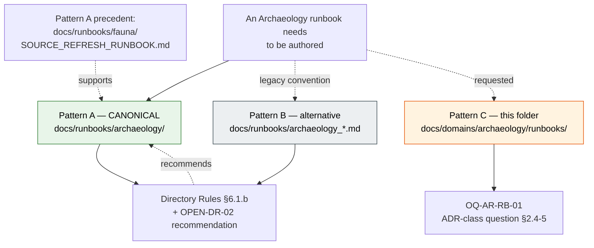

<!-- [KFM_META_BLOCK_V2]
doc_id: kfm://doc/docs-domains-archaeology-runbooks-readme
title: Archaeology Dossier — runbooks/ README
type: standard
version: v1
status: draft
owners: <TODO: archaeology-steward; docs-steward; sovereignty-review-liaison; release-steward>
created: 2026-05-27
updated: 2026-05-27
policy_label: public
related:
  - docs/doctrine/ai-build-operating-contract.md
  - docs/doctrine/directory-rules.md
  - docs/domains/archaeology/README.md
  - docs/domains/archaeology/VERIFICATION_BACKLOG.md
  - docs/domains/archaeology/CHANGELOG.md
  - docs/runbooks/README.md
  - docs/runbooks/fauna/SOURCE_REFRESH_RUNBOOK.md
  - docs/registers/DRIFT_REGISTER.md
  - docs/adr/README.md
  - policy/sensitivity/archaeology/
tags: [kfm, archaeology, runbooks, operations, dossier, governance, sensitive-domain]
notes:
  - CONTRACT_VERSION = "3.0.0" (pinned per ai-build-operating-contract.md §37).
  - Placement is PROPOSED Pattern C; canonical alternative is docs/runbooks/archaeology/ (Pattern A per Directory Rules §6.1.b + OPEN-DR-02).
  - ADR required per Directory Rules §2.4(5) before this folder hosts more than this README — see OQ-AR-RB-01.
  - Inherits Archaeology domain sensitivity envelope: T4 default for site coords, T4 forever for human remains / sacred sites.
[/KFM_META_BLOCK_V2] -->

# Archaeology Dossier — `runbooks/` README

> Per-folder README for an Archaeology-domain operational-procedures subfolder. Indexes the runbooks the domain requires (sovereignty review, emergency disablement, source refresh, correction / withdrawal, etc.) and surfaces the **canonical-home question** — `docs/runbooks/archaeology/` (Pattern A) versus `docs/domains/archaeology/runbooks/` (this folder, Pattern C).

<p align="left">
  
  
  
  
  
  
  
  
  
  <!-- TODO: replace with live Shields.io endpoints (CI status, last-updated, runbook authoring progress, sovereignty-review readiness) once verified against the mounted repo. -->
</p>

**Status:** draft · **Owners:** _TODO: archaeology-steward; docs-steward; sovereignty-review-liaison; release-steward_ · **Last updated:** 2026-05-27

> [!CAUTION]
> **Sensitivity inherited from the Archaeology domain.** Site coordinates default to **T4 (Denied)**; human remains and sacred sites are **T4 forever** (Atlas v1.1 Ch. 24.5.2). Every runbook authored under this folder MUST treat T4 content as a **deny-by-default operational class**: never include exact coordinates, site identifiers, oral-history transcripts, cultural-knowledge notes, or sovereignty-sensitive material as runbook examples or fixture inputs. Enforcement of Archaeology sensitivity lives in `policy/sensitivity/archaeology/`, not in runbooks. Runbooks **invoke** policy; they do not **encode** it.

> [!WARNING]
> **Placement is PROPOSED as Pattern C and is ADR-class.** The CONFIRMED canonical placement for domain runbooks is `docs/runbooks/<domain>/` (Pattern A) per Directory Rules §6.1.b — the fauna source-refresh runbook already lives at `docs/runbooks/fauna/SOURCE_REFRESH_RUNBOOK.md` (Pattern A precedent). This folder represents a **third pattern (Pattern C)** — runbooks under the domain dossier rather than under the canonical `docs/runbooks/` root. Directory Rules §2.4(5) flags parallel registry / operational homes as ADR-class. See [OQ-AR-RB-01](#10-open-questions-register) for the resolution path. **This folder MUST NOT host runbook content beyond this README until OPEN-DR-02 is resolved and OQ-AR-RB-01 has a filed ADR.**

---

## 0. Status & Authority

| Field | Value |
|---|---|
| **Document type** | Per-folder README under the §15 contract. |
| **Edition** | v1 draft. |
| **Proposed repo path** | `docs/domains/archaeology/runbooks/README.md` |
| **Folder class** | **Domain-internal subfolder (PROPOSED Pattern C).** Not a canonical root, not a compatibility root. Sits beneath the canonical responsibility root `docs/` and the canonical per-domain dossier `docs/domains/archaeology/`. |
| **Canonical alternative** | **`docs/runbooks/archaeology/` (Pattern A per Directory Rules §6.1.b + OPEN-DR-02).** Pattern A precedent: `docs/runbooks/fauna/SOURCE_REFRESH_RUNBOOK.md`. |
| **Placement basis** | **PROPOSED** — Directory Rules §4 Step 3 admits the parent dossier; the `runbooks/` subfolder under that dossier is **PROPOSED Pattern C** and **ADR-class** per §2.4(5). See OQ-AR-RB-01. |
| **Operating contract** | `ai-build-operating-contract.md` — `CONTRACT_VERSION = "3.0.0"`. |
| **Sensitivity envelope** | **T4 inherited** from the Archaeology domain (Atlas v1.1 Ch. 24.5.2). Sovereignty-review path required (Atlas v1.1 Ch. 24.13). |
| **Sensitivity enforcement home** | `policy/sensitivity/archaeology/` (PROPOSED canonical). Runbooks here **invoke** that policy; they never substitute for it. |
| **Authoring posture** | Operational only. Runbooks **explain how to operate** (Directory Rules §6.1.b); they do not encode policy (`policy/`) or object meaning (`contracts/`). |
| **Status of this file in any repo** | `draft` until reviewed and merged. AI-authored — `GENERATED_RECEIPT.json` required at merge per contract §34. |
| **Required reviewers** | Docs steward + Archaeology-domain steward + policy steward + sovereignty-review liaison + release steward + AI surface steward (receipt review per contract §33). |

---

## Contents

1. [Purpose and scope](#1-purpose-and-scope)
2. [Authority level and folder class (§15 contract)](#2-authority-level-and-folder-class-15-contract)
3. [What belongs here](#3-what-belongs-here)
4. [What does NOT belong here](#4-what-does-not-belong-here)
5. [Planned runbooks (index)](#5-planned-runbooks-index)
6. [Inputs, outputs, validation, review burden (§15 contract)](#6-inputs-outputs-validation-review-burden-15-contract)
7. [Relationship to `docs/runbooks/` (parallel-home discussion)](#7-relationship-to-docsrunbooks-parallel-home-discussion)
8. [Sensitivity envelope (inherited)](#8-sensitivity-envelope-inherited)
9. [Runbook authoring conventions](#9-runbook-authoring-conventions)
10. [Open questions register](#10-open-questions-register)
11. [Open verification backlog](#11-open-verification-backlog)
12. [Definition of done](#12-definition-of-done)
13. [Related docs and ADRs](#13-related-docs-and-adrs)

---

## 1. Purpose and scope

This folder, **if retained**, holds **operational runbooks for the Archaeology domain** — the procedural complement to the policy text in `policy/sensitivity/archaeology/`, the schemas in `schemas/contracts/v1/archaeology/` (or `schemas/contracts/v1/domains/archaeology/` per ADR-S-01), and the verification items in `docs/domains/archaeology/VERIFICATION_BACKLOG.md`.

### What runbooks are (CONFIRMED, Directory Rules §6.1.b)

Runbooks **explain how to operate**: source refresh, rollback drills, validation runs, incident response, evaluator workflows, steward review. They do not encode policy, object meaning, or schema shape.

### What Archaeology runbooks specifically must cover (CONFIRMED, Atlas v1.0 Ch. 15 §N)

The Atlas verification backlog names four open items, **each of which implies a runbook**:

1. Verify steward authority and confidentiality. → `STEWARD_AUTHORITY_VERIFICATION_RUNBOOK.md`.
2. Define public geometry thresholds and transform profiles. → `PUBLIC_GEOMETRY_THRESHOLD_RUNBOOK.md`.
3. Verify oral history / cultural knowledge protocol. → `SOVEREIGNTY_REVIEW_RUNBOOK.md`.
4. Verify emergency public-layer disablement and rollback drill. → `EMERGENCY_DISABLEMENT_RUNBOOK.md`.

Plus the standard cross-domain runbook set (Unified Implementation Build Manual §23) that every domain needs: source intake / source refresh, rights review, sensitivity review, correction / withdrawal.

### What this folder is NOT

- Not policy. `policy/sensitivity/archaeology/` is the deny-rule home.
- Not schema. `schemas/contracts/v1/archaeology/` (or `…/domains/archaeology/`) is the shape home.
- Not contracts. `contracts/archaeology/` is the meaning home.
- Not data. No site content lives here.
- Not a content store of any kind. Runbooks reference policy, schemas, fixtures, and review records — they do not contain T4-class material.

[↑ Back to top](#contents)

---

## 2. Authority level and folder class (§15 contract)

Per Directory Rules §15, every folder has a README declaring its class. This folder's declaration:

| §15 field | Value |
|---|---|
| **Purpose** | Operational procedures for the Archaeology domain (source refresh, sovereignty review, sensitivity review, emergency disablement, correction / withdrawal, etc.). |
| **Authority level** | **Domain-internal subfolder (PROPOSED Pattern C).** Not canonical. Not compatibility. Class is **PROPOSED**; canonical alternative is `docs/runbooks/archaeology/` (Pattern A). |
| **Compatibility class** (if compatibility) | N/A. |
| **Status** | **PROPOSED.** ADR-class per Directory Rules §2.4(5). OQ-AR-RB-01 pending. |
| **What belongs here** | See [§3](#3-what-belongs-here). |
| **What does NOT belong here** | See [§4](#4-what-does-not-belong-here). Broad and explicit. |
| **Inputs** | Atlas v1.0 Ch. 15 §N verification items; `policy/sensitivity/archaeology/` rules; `schemas/contracts/v1/.../archaeology/` schemas; `data/registry/sources/archaeology/` descriptors. Runbooks consume these as **references**; they do not own them. |
| **Outputs** | Steward-runnable procedure documents. Each runbook produces an audit trail (`ReviewRecord`, `RunReceipt`, `RollbackCard`, `CorrectionNotice`) — those audit artifacts live in `data/receipts/`, `release/rollback_cards/`, and `release/correction_notices/`, not here. |
| **Validation** | (PROPOSED) `tests/domains/archaeology/test_runbooks_no_t4_leak.py` — content scan asserting no runbook in this folder contains T4-class material. (PROPOSED) Lint pass asserting every runbook follows the §9 authoring conventions. |
| **Review burden** | Every PR touching this folder: docs steward + archaeology-domain steward + sovereignty-review liaison. Runbooks touching release / rollback procedures additionally require release steward. AI-authored PRs additionally require AI surface steward per contract §33. |
| **Related folders** | `docs/runbooks/` (canonical runbooks root — see §7), `docs/domains/archaeology/` (parent dossier), `policy/sensitivity/archaeology/` (enforcement), `release/rollback_cards/`, `release/correction_notices/`, `data/receipts/`. |
| **ADRs governing this folder** | **NEEDS** — ADR proposed for OQ-AR-RB-01 (Pattern A vs Pattern C); see also OPEN-DR-02 (Pattern A vs Pattern B). |
| **Last reviewed** | 2026-05-27. |

[↑ Back to top](#contents)

---

## 3. What belongs here

CONFIRMED narrow scope **pending OQ-AR-RB-01 resolution**. Until the ADR lands:

- **This README** (`README.md`) — the §15-contract README you are reading.
- **No runbook content yet.** Runbook drafting SHOULD land at `docs/runbooks/archaeology/` (Pattern A per OPEN-DR-02 recommendation) unless and until OQ-AR-RB-01 resolves Pattern C.

If OQ-AR-RB-01 resolves in favor of Pattern C (this folder), the following runbook classes belong here (full list in [§5](#5-planned-runbooks-index)):

- Source intake / source refresh runbooks (one per source family or grouped).
- Sovereignty review runbook (oral history / cultural knowledge protocol).
- Sensitivity review runbook (T4 enforcement; `RedactionReceipt` workflow).
- Public geometry threshold runbook (generalization profiles; T4 → T1 transitions).
- Emergency public-layer disablement runbook (Atlas v1.0 Ch. 15 §N item 4).
- Steward authority verification runbook (Atlas v1.0 Ch. 15 §N item 1).
- Correction / withdrawal runbook (`CorrectionNotice` + `RollbackCard` workflow for T4 leaks).
- Rollback drill runbook (paired with emergency disablement).

[↑ Back to top](#contents)

---

## 4. What does NOT belong here

EXPLICIT deny list. The §15 contract treats "what does NOT belong" as load-bearing as "what does belong."

**Sensitivity-class deny (T4-inherited, ABSOLUTE):**

- ❌ Archaeological site coordinates, exact or generalized — even as runbook examples.
- ❌ Site names, codes, or identifiers tied to a real location.
- ❌ Human remains location, burial site, or sacred-site information.
- ❌ Oral history transcripts or cultural-knowledge notes.
- ❌ Sovereignty-sensitive material of any kind (treaty, tribal-relationship, repatriation context).
- ❌ Private landowner details, collection-security details, looting-risk exposure.
- ❌ Real `CandidateFeature` records that have not cleared sovereignty review.
- ❌ Field-survey records, excavation records, provenience packets.
- ❌ Artifact / collection / repository records.
- ❌ Source-credential information (SHPO access tokens, lab-report credentials, etc.).

**Authority-class deny (runbooks invoke; never encode):**

- ❌ Policy text. Lives in `policy/sensitivity/archaeology/`. Runbooks reference policy by name and link; they do not restate or override it.
- ❌ Object-family contract text. Lives in `contracts/archaeology/`.
- ❌ Schema files. Live in `schemas/contracts/v1/.../archaeology/`.
- ❌ Source descriptors. Live in `data/registry/sources/archaeology/`. Runbooks may *cite* a descriptor by stable ID; they do not *contain* one.
- ❌ Release manifests, rollback cards, correction notices. Those are *emitted by* runbooks but *live in* `release/`.
- ❌ Receipts (`RunReceipt`, `AIReceipt`, `GENERATED_RECEIPT`, `RedactionReceipt`, `AggregationReceipt`). Live in `data/receipts/` or `release/`.
- ❌ Verification-backlog items. Live in `docs/domains/archaeology/VERIFICATION_BACKLOG.md` per-domain or `docs/registers/VERIFICATION_BACKLOG.md` cross-domain.

**Operational deny:**

- ❌ AI-drafted runbooks without `GENERATED_RECEIPT.json` per contract §34.
- ❌ Runbooks that bypass the trust membrane (e.g., describe direct queries against `data/raw/` or `data/processed/` from a public client). Runbooks that traverse the lifecycle MUST do so via governed APIs.
- ❌ Runbooks that present AI-generated language as steward-approved without an explicit `ReviewRecord` step.
- ❌ Runbooks that omit a `RollbackCard` step when the procedure changes public state.
- ❌ Filenames that themselves reveal sensitive identifiers.

> [!CAUTION]
> A runbook that needs T4-class material to demonstrate a procedure (e.g., "here is how the redaction transform looks on a real site record") MUST use a **synthetic, public-safe fixture** with `RealityBoundaryNote` and `RepresentationReceipt`, never real data. Synthetic-as-observed presentation is itself a §38 anti-pattern (contract §38 item 6).

[↑ Back to top](#contents)

---

## 5. Planned runbooks (index)

PROPOSED. Each row names a runbook this folder (or its Pattern A alternative at `docs/runbooks/archaeology/`) **should** carry. Atlas-anchored runbooks are CONFIRMED-needed (Ch. 15 §N); cross-domain-standard runbooks are CONFIRMED-needed (Unified Implementation Build Manual §23 set). All file paths and timing are PROPOSED.

| Filename (PROPOSED) | Purpose | Atlas / doctrine anchor | Status |
|---|---|---|---|
| `SOURCE_REFRESH_RUNBOOK.md` | Refresh of SHPO / state inventory, NRHP-like listings, survey forms, lab reports, historic maps. Mirrors fauna Pattern A precedent. | UIBM §23 "Source refresh"; Atlas Ch. 15 §D source families. | _not yet authored_ |
| `STEWARD_AUTHORITY_VERIFICATION_RUNBOOK.md` | Verify the domain steward's authority and confidentiality obligations are in force before any release. | **Atlas v1.0 Ch. 15 §N item 1.** | _not yet authored_ |
| `PUBLIC_GEOMETRY_THRESHOLD_RUNBOOK.md` | Define and apply generalization thresholds and transform profiles for T4 → T1 site-location releases. Emits `RedactionReceipt` + `ReviewRecord` + `PolicyDecision`. | **Atlas v1.0 Ch. 15 §N item 2.** | _not yet authored_ |
| `SOVEREIGNTY_REVIEW_RUNBOOK.md` | Oral history and cultural-knowledge protocol; handles tribal-relationship, treaty, repatriation, and rights-holder review for any record sourced from oral history / cultural knowledge. | **Atlas v1.0 Ch. 15 §N item 3** + Atlas Ch. 24.13 sovereignty-review notes. | _not yet authored_ |
| `EMERGENCY_DISABLEMENT_RUNBOOK.md` | Disable a public archaeology layer immediately on T4 leak detection; emit `CorrectionNotice` + `RollbackCard`; rollback drill cadence. | **Atlas v1.0 Ch. 15 §N item 4** (load-bearing). | _not yet authored_ |
| `SENSITIVITY_REVIEW_RUNBOOK.md` | Cross-domain sensitivity-review pattern applied to archaeology: T4 enforcement, `RedactionReceipt` lifecycle, steward sign-off. | UIBM §23 "Sensitivity review"; Atlas Ch. 24.5.2. | _not yet authored_ |
| `CORRECTION_AND_WITHDRAWAL_RUNBOOK.md` | Handle detected errors or new evidence requiring `CorrectionNotice`, `WithdrawalNotice`, derivative invalidation, and steward-approved supersession. | UIBM §23 "Correction/withdrawal"; contract §10.9 corrections-first-class. | _not yet authored_ |

> [!IMPORTANT]
> The **emergency disablement runbook** is the single most load-bearing artifact this folder will host. Atlas v1.0 Ch. 15 §N item 4 names it as a verification item; without a tested rollback drill, public Archaeology release is blocked. Any sequencing decision SHOULD prioritize this runbook first, regardless of whether it ultimately lands at Pattern A (`docs/runbooks/archaeology/`) or Pattern C (here).

[↑ Back to top](#contents)

---

## 6. Inputs, outputs, validation, review burden (§15 contract)

| §15 field | Detail |
|---|---|
| **Inputs** | Atlas v1.0 Ch. 15 §N verification items; `policy/sensitivity/archaeology/` rule names; `schemas/contracts/v1/.../archaeology/` schema names; `data/registry/sources/archaeology/` source descriptors (by stable ID only). No source-data inputs. No T4 content. |
| **Outputs** | Each runbook is a step-by-step procedure document. Procedures may **emit** governed artifacts (`ReviewRecord`, `RunReceipt`, `RollbackCard`, `CorrectionNotice`, `RedactionReceipt`), but those artifacts land in their canonical homes (`data/receipts/`, `release/rollback_cards/`, `release/correction_notices/`), not here. |
| **Validation** | (PROPOSED) `tests/domains/archaeology/test_runbooks_no_t4_leak.py` content scan against `policy/sensitivity/archaeology/` term lists. (PROPOSED) `tools/validators/runbook_lint.py` enforcing §9 authoring conventions (preconditions, steps, gates, rollback, receipts). Both validators are PROPOSED and depend on policy / tooling that itself is PROPOSED. |
| **Review burden** | Docs steward + archaeology-domain steward + sovereignty-review liaison on **every** PR touching this folder. Runbooks that change rollback / correction procedures additionally require release steward sign-off. PRs that introduce new runbook examples must include explicit acknowledgement that examples are synthetic (per §4). AI-authored PRs require AI surface steward review per contract §33. |
| **Related folders** | `docs/runbooks/` (canonical runbooks root; see §7), `docs/domains/archaeology/` (parent dossier), `policy/sensitivity/archaeology/` (enforcement home), `release/rollback_cards/`, `release/correction_notices/`, `data/receipts/`, `data/quarantine/`. |
| **ADRs governing this folder** | None yet accepted. ADRs proposed for OQ-AR-RB-01 (Pattern A vs Pattern C) and OPEN-DR-02 (Pattern A vs Pattern B, pre-existing). |
| **Last reviewed** | 2026-05-27. |

[↑ Back to top](#contents)

---

## 7. Relationship to `docs/runbooks/` (parallel-home discussion)

PROPOSED. The canonical runbooks home is `docs/runbooks/` (Directory Rules §6.1, §6.1.b). The fauna source-refresh runbook lives at `docs/runbooks/fauna/SOURCE_REFRESH_RUNBOOK.md` — Pattern A precedent. This folder represents a third pattern. The choice is **not yet resolved**.



| Pattern | Path shape | Status | Trade-offs |
|---|---|---|---|
| **A — CANONICAL (recommended)** | `docs/runbooks/archaeology/<RUNBOOK>.md` | CONFIRMED canonical per §6.1.b; recommended per OPEN-DR-02. | Co-locates archaeology runbooks with all other domain runbooks; standardizes review path; matches fauna precedent. Splits archaeology dossier content across `docs/domains/archaeology/` and `docs/runbooks/archaeology/`. |
| **B — flat** | `docs/runbooks/archaeology_<topic>.md` | PROPOSED in some legacy planning. | Simple for one-or-two-runbook domains. Filenames grow long as topics accumulate. Less preferred per OPEN-DR-02. |
| **C — this folder** | `docs/domains/archaeology/runbooks/<RUNBOOK>.md` | **PROPOSED** (this PR). ADR-class per §2.4(5). | Keeps all archaeology dossier content in one place; co-locates runbooks with `policy/sensitivity/archaeology/` references and `VERIFICATION_BACKLOG.md`. Creates a parallel operational home; complicates the §6.1.b canonical-home story; needs ADR. |

> [!IMPORTANT]
> **Recommended path forward:** author runbooks at `docs/runbooks/archaeology/<RUNBOOK>.md` (Pattern A) and retire this folder once OPEN-DR-02 freezes Pattern A. **Alternative path:** file ADR for OQ-AR-RB-01 proposing Pattern C as a per-domain-dossier extension; if accepted, amend Directory Rules §6.1.b to acknowledge the third pattern; if rejected, migrate any drafted content to Pattern A. **Until the ADR lands, no runbook content beyond this README MAY land in this folder.**

[↑ Back to top](#contents)

---

## 8. Sensitivity envelope (inherited)

CONFIRMED, Atlas v1.1 Ch. 24.5.2 + Atlas v1.0 Ch. 15 §I + Encyclopedia §11.1. The envelope flows into every runbook authored under this folder unchanged.

| Object class | Default tier | Allowed transforms | Required gates |
|---|---|---|---|
| Archaeological site location | **T4** | Steward + cultural review + generalized geometry (coarse cell) + `RedactionReceipt` → T2 / T1. | `RedactionReceipt` + `ReviewRecord` + `PolicyDecision`. |
| Human remains / sacred sites | **T4 forever** | No transform releases this to T0; T3 only under explicit named authorization. | Sovereignty review + `ReviewRecord` + `PolicyDecision`. |
| Oral history / cultural knowledge | Source-rights `NEEDS VERIFICATION`; sensitive joins fail closed. | Per source rights; default deny. | Source-rights review + steward review. |
| Private landowner / collection-security details | **T4** | None permit public release without policy + steward review. | `PolicyDecision` + `ReviewRecord`. |
| `CandidateFeature` (not yet promoted) | Held in WORK / QUARANTINE | Not public; promotion requires review. | Promotion gate; no PUBLISHED edge to WORK / QUARANTINE. |

**Runbook implication.** Every Archaeology runbook MUST:

- name the exact `policy/sensitivity/archaeology/` rule it depends on;
- name the exact `ReviewRecord`, `PolicyDecision`, `RedactionReceipt`, or `RollbackCard` it emits;
- specify the gate that fails closed if any of the above are missing;
- use synthetic fixtures for any example output;
- defer to the domain steward and sovereignty-review liaison on ambiguous cases.

> [!CAUTION]
> **A runbook that loosens sensitivity bounds in its procedure** — for example, by describing a "fast path" that skips sovereignty review for "low-risk" sites — is itself a doctrine drift. File such cases to `docs/registers/DRIFT_REGISTER.md` and route to steward review. T4 defaults do not have fast paths.

[↑ Back to top](#contents)

---

## 9. Runbook authoring conventions

PROPOSED. Every runbook authored under this folder (or the Pattern A alternative) SHOULD follow these conventions. The conventions are designed to be enforceable by the `runbook_lint.py` validator proposed in §6.

### Required runbook sections

```text
1. KFM Meta Block v2
2. Title + one-line purpose
3. Badge row (status, sensitivity envelope, last-rehearsed-date)
4. Status & Authority table
5. Preconditions (what MUST be true before the runbook runs)
6. Roles (who runs which step; CODEOWNERS-aligned)
7. Procedure (numbered, atomic steps)
8. Gates (which step requires which receipt / review / policy decision)
9. Emitted artifacts (RunReceipt, ReviewRecord, RollbackCard, CorrectionNotice, ...)
10. Rollback path (every public-state change MUST have one)
11. Failure modes and DENY conditions
12. Post-conditions (what MUST be true after the runbook completes)
13. Rehearsal cadence (drill schedule — at minimum annually for emergency runbooks)
14. Open questions register
15. Definition of done
16. Related docs and ADRs
```

### Required posture

- **Steward-driven, not AI-driven.** AI MAY draft the prose; the steward signs off on the procedure. `AIReceipt` and `GENERATED_RECEIPT.json` MUST be emitted for AI-drafted runbooks per contract §34.
- **Fail-closed everywhere.** Any step that cannot produce its required receipt halts the runbook and routes to steward review.
- **Receipt-emitting.** Every governed transition emits a receipt; receipts land in their canonical homes (`data/receipts/`, `release/`).
- **Rollback-bearing.** Every public-state change has a named `RollbackCard` and a tested drill.
- **Synthetic-only examples.** No real archaeological content in examples (§4 deny list).

### Forbidden patterns

- "Skip review if X" — no fast paths around steward / sovereignty / sensitivity gates.
- "AI summary is sufficient" — AI summaries are NOT review.
- "Cite the dashboard" — dashboards are not evidence (contract §38 item 27).
- "Backfill the receipt later" — backfilled receipts are anti-pattern (contract §38 item 28).
- "The map shows it, so it is true" — contract §38 item 1.

[↑ Back to top](#contents)

---

## 10. Open questions register

PROPOSED. Questions about this folder, distinct from Archaeology-domain verification items.

| ID | Question | Owner role | Resolution path |
|---|---|---|---|
| **OQ-AR-RB-01** | Should domain runbooks live at `docs/runbooks/<domain>/` (Pattern A, CONFIRMED canonical) or at `docs/domains/<domain>/runbooks/` (Pattern C, this folder)? §2.4(5) parallel-home concern. Resolution may also extend OPEN-DR-02. | Docs steward + Directory-Rules editor + archaeology-domain steward + release steward | ADR; alternatively a Directory Rules §6.1.b amendment to legitimize Pattern C as a per-domain-dossier extension. |
| **OQ-AR-RB-02** | If Pattern C is accepted by OQ-AR-RB-01, is it per-domain elective or repo-wide canonical? E.g., does archaeology choose Pattern C while fauna keeps Pattern A? Mixed conventions raise drift risk. | Docs steward + each domain steward | ADR; document outcome in Directory Rules §6.1.b. |
| **OQ-AR-RB-03** | Filename casing for runbooks: `UPPERCASE_WITH_UNDERSCORES` (the fauna `SOURCE_REFRESH_RUNBOOK.md` precedent) or another convention? Aligns with §6.1.a UPPERCASE_WITH_UNDERSCORES for KFM-coined topical docs. | Docs steward | Convention vote; codify in this README or Directory Rules §6.1.b. |
| **OQ-AR-RB-04** | Should the `runbook_lint.py` validator (§6 PROPOSED) be repo-wide and language-agnostic about which §15-style folder hosts the runbook, or domain-scoped? | Docs steward + tools owner | ADR if cross-domain. |
| **OQ-AR-RB-05** | Authoring order: which of the seven §5 runbooks lands first? §5 calls out `EMERGENCY_DISABLEMENT_RUNBOOK.md` as load-bearing; the steward roster may prefer to lead with `SOVEREIGNTY_REVIEW_RUNBOOK.md` to ground the steward authority chain before drill rehearsal. | Archaeology steward + sovereignty-review liaison | Steward roster decision; document in this README and in `docs/domains/archaeology/VERIFICATION_BACKLOG.md`. |

[↑ Back to top](#contents)

---

## 11. Open verification backlog

PROPOSED. Items that remain `NEEDS VERIFICATION` for this folder before promotion from `draft` to `published`.

1. Confirm placement at `docs/domains/archaeology/runbooks/README.md` exists (or land it there).
2. Confirm `docs/runbooks/README.md` (canonical runbooks root README) exists and that `docs/runbooks/archaeology/` either exists or is recognized as the Pattern A target.
3. Confirm `docs/runbooks/fauna/SOURCE_REFRESH_RUNBOOK.md` (Pattern A precedent) exists in the mounted repo; verify its conventions to template archaeology runbooks against.
4. Confirm `policy/sensitivity/archaeology/` exists with a term list that the proposed `test_runbooks_no_t4_leak.py` validator can scan against.
5. Confirm `release/rollback_cards/`, `release/correction_notices/`, and `data/receipts/` exist as canonical homes for emitted artifacts.
6. Confirm `archaeology-steward`, `docs-steward`, `sovereignty-review-liaison`, `release-steward`, `policy-steward`, and `AI-surface-steward` are roles defined in `CODEOWNERS`.
7. Confirm `GENERATED_RECEIPT.json` for this file's authorship is emitted at merge and references `CONTRACT_VERSION = "3.0.0"`.
8. Confirm OPEN-DR-02 status — its resolution materially constrains OQ-AR-RB-01.
9. Confirm any in-flight or accidentally-committed runbook drafts in this folder pass the §4 deny list. If not, quarantine immediately.

[↑ Back to top](#contents)

---

## 12. Definition of done

This README (and the folder it documents, if retained) is done enough to enter the repository when:

- the folder is placed at `docs/domains/archaeology/runbooks/` per Directory Rules §4 Step 3, **with this README at its root**;
- docs steward, archaeology-domain steward, policy steward, sovereignty-review liaison, and release steward have reviewed and approved it;
- **OQ-AR-RB-01 has at minimum been filed as a PROPOSED ADR** — the folder MAY land before the ADR is accepted, but MUST NOT host runbook content beyond this README until the ADR is accepted;
- it is linked from `docs/domains/archaeology/README.md` (when authored) and from `docs/runbooks/README.md` (so a reader at the canonical runbooks root can find this Pattern C location);
- any conflict between this folder and the Pattern A canonical (`docs/runbooks/archaeology/`) is logged in `docs/registers/DRIFT_REGISTER.md`;
- the PROPOSED validators from §6 are at least planned (issues exist), even if the tests are not yet written;
- the `GENERATED_RECEIPT.json` planned for AI authorship is wired into CI per contract §34 with `CONTRACT_VERSION = "3.0.0"`;
- no file in the folder, including this README, contains any T4-class archaeological content per §4;
- future changes follow contract §37 lifecycle.

[↑ Back to top](#contents)

---

## 13. Related docs and ADRs

PROPOSED links. All paths are PROPOSED until verified against a mounted repo.

- [`docs/doctrine/ai-build-operating-contract.md`](../../../doctrine/ai-build-operating-contract.md) — _TODO_ — operating contract v3.0; `CONTRACT_VERSION = "3.0.0"`.
- [`docs/doctrine/directory-rules.md`](../../../doctrine/directory-rules.md) — _TODO_ — placement, §6.1.b runbooks contract, OPEN-DR-02, §15 per-folder README contract.
- [`../README.md`](../README.md) — _TODO_ — Archaeology domain README (existence NEEDS VERIFICATION).
- [`../VERIFICATION_BACKLOG.md`](../VERIFICATION_BACKLOG.md) — _TODO_ — Archaeology verification backlog (per-domain).
- [`../CHANGELOG.md`](../CHANGELOG.md) — _TODO_ — Archaeology dossier changelog (PROPOSED; mirrors Agriculture pattern).
- [`../missing_or_planned_files/README.md`](../missing_or_planned_files/README.md) — sibling per-folder README; parallel governance posture for a different planning-vs-content concern.
- [`docs/runbooks/README.md`](../../../runbooks/README.md) — _TODO_ — canonical runbooks root README.
- [`docs/runbooks/fauna/SOURCE_REFRESH_RUNBOOK.md`](../../../runbooks/fauna/SOURCE_REFRESH_RUNBOOK.md) — _TODO_ — Pattern A precedent; template for archaeology source-refresh runbook.
- [`docs/registers/DRIFT_REGISTER.md`](../../../registers/DRIFT_REGISTER.md) — _TODO_ — drift entries (especially Pattern A vs Pattern C).
- [`docs/adr/README.md`](../../../adr/README.md) — _TODO_ — ADR index; OQ-AR-RB-01 to be filed here, alongside OPEN-DR-02.
- [`policy/sensitivity/archaeology/`](../../../../policy/sensitivity/archaeology/) — _TODO_ — sensitivity enforcement (canonical per Atlas v1.1 Ch. 24.13). Runbooks invoke; never substitute.
- [`release/rollback_cards/`](../../../../release/rollback_cards/) — _TODO_ — canonical home for `RollbackCard` artifacts emitted by runbooks.
- [`release/correction_notices/`](../../../../release/correction_notices/) — _TODO_ — canonical home for `CorrectionNotice` artifacts emitted by runbooks.

**ADRs governing this folder (when filed):**

- ADR-PROPOSED — Per-domain-dossier runbook placement (OQ-AR-RB-01); resolves Pattern A vs Pattern C.
- ADR-PROPOSED — Domain-runbook subfolder convention freeze (OPEN-DR-02); resolves Pattern A vs Pattern B.

---

> [!NOTE]
> **Last updated:** 2026-05-27 · **Edition:** v1 draft · **`CONTRACT_VERSION = "3.0.0"`** · **Folder class:** domain-internal subfolder (PROPOSED Pattern C) · **Sensitivity:** T4 inherited · **Authority:** Directory Rules §6.1.b runbooks placement contract + §15 per-folder README contract.

[↑ Back to top](#contents)
