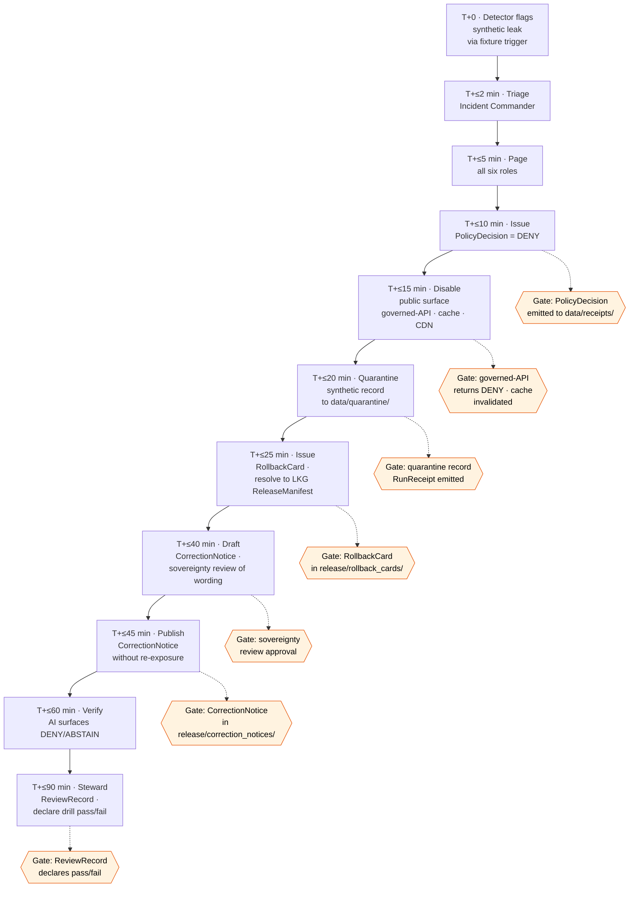

<!-- [KFM_META_BLOCK_V2]
doc_id: kfm://doc/docs-domains-archaeology-runbooks-rollback-drill
title: Archaeology — Rollback Drill Runbook
type: standard
version: v1.1
status: draft
owners: <TODO: archaeology-steward (incident commander); sovereignty-review-liaison; policy-steward; release-steward; docs-steward; AI-surface-steward>
created: 2026-05-27
updated: 2026-05-29
policy_label: public
related:
  - docs/doctrine/ai-build-operating-contract.md
  - docs/doctrine/directory-rules.md
  - docs/domains/archaeology/README.md
  - docs/domains/archaeology/ARCHITECTURE.md
  - docs/domains/archaeology/VERIFICATION_BACKLOG.md
  - docs/runbooks/README.md
  - docs/runbooks/archaeology/README.md
  - docs/runbooks/fauna/SOURCE_REFRESH_RUNBOOK.md
  - policy/sensitivity/archaeology/
  - release/rollback_cards/
  - release/correction_notices/
  - data/receipts/
  - data/quarantine/
tags: [kfm, archaeology, runbook, rollback, drill, emergency, sensitive-domain, T4]
notes:
  - CONTRACT_VERSION = "3.0.0" (pinned per ai-build-operating-contract.md §37 versioning + CONTRACT_VERSION pinning convention).
  - Atlas v1.0 Ch. 15 §N item 4 anchor — emergency public-layer disablement and rollback drill.
  - PLACEMENT CORRECTED in v1.1 — canonical home is docs/runbooks/archaeology/rollback-drill.md (Directory Rules §6.1.b Pattern A; OPEN-DR-02 recommends Pattern A). The earlier "Pattern C" (docs/domains/<domain>/runbooks/) is NOT a Directory-Rules-defined runbook home and would create a parallel root (§13.5). See §0 and OQ-AR-RB-DRILL-01.
  - Synthetic fixtures only; no T4-class content in this file, in drill inputs, or in drill outputs.
  - This file is steward-driven; AI MAY draft text, AI MUST NOT execute the procedure.
[/KFM_META_BLOCK_V2] -->

# Archaeology — Rollback Drill Runbook

> Scheduled drill that exercises the **emergency public-layer disablement and rollback procedure** for the Archaeology domain (Atlas v1.0 Ch. 15 §N item 4). Verifies that, given a synthetic T4 leak fixture, the domain can DENY, quarantine, rollback, correct, and review within a defined time budget — and that every required receipt actually emits.

<p align="left">
  
  
  
  
  
  
  
  
  
  
  <!-- TODO: replace with live Shields.io endpoints (last-rehearsed-date, last-pass/fail outcome, CI drill-validator status) once the drill has been run against a synthetic fixture in the mounted repo. -->
</p>

**Status:** draft · **Owners:** _TODO: archaeology-steward (incident commander); sovereignty-review-liaison; policy-steward; release-steward; docs-steward; AI-surface-steward_ · **Last updated:** 2026-05-29 · **Last rehearsed:** never (draft)

> [!CAUTION]
> **Sensitivity inherited from the Archaeology domain.** Site coordinates default to **T4 (Denied)** (T1 generalized only after steward review, Atlas §24.14); human remains and sacred sites are **T4 forever** (Atlas v1.1 §24.5.2). This runbook uses **synthetic fixtures only** — no real coordinates, no real site identifiers, no real oral-history or cultural-knowledge content in the fixture, in the drill execution, or in the drill output artifacts. If a real T4 record is encountered at any drill step, **STOP, escalate as a real incident**, and treat the encounter as a doctrine drift (file to `docs/registers/DRIFT_REGISTER.md`).

> [!IMPORTANT]
> **AI MUST NOT execute this procedure.** AI MAY draft the runbook text, summarize a completed drill, or assist the incident commander with read-only context — under `AIReceipt` discipline per contract §21. **The drill is steward-driven end-to-end.** Every gate requires a named human role.

> [!IMPORTANT]
> **Placement corrected in v1.1.** The canonical home for this runbook is **`docs/runbooks/archaeology/rollback-drill.md`** — Directory Rules §6.1.b establishes `docs/runbooks/` as the canonical home for operational procedures (source refresh, **rollback drills**, incident response, steward review), and OPEN-DR-02 recommends the **Pattern A** domain-segment subfolder (`docs/runbooks/<domain>/<topic>.md`), already in use by the fauna source-refresh runbook. The earlier draft placed this at `docs/domains/archaeology/runbooks/rollback-drill.md` ("Pattern C"), which is **not a Directory-Rules-defined runbook home** and would stand up a parallel runbook root under the domain dossier — the §13.5 "parallel home" / §3 "domain folder must not own a responsibility root" drift. Per change discipline, this revision prefers the canonical home and surfaces the conflict rather than entrenching the non-canonical one. See [OQ-AR-RB-DRILL-01](#12-open-questions-register).

---

## 0. Status & Authority

| Field | Value |
|---|---|
| **Document type** | Runbook (operational procedure). |
| **Runbook class** | **Drill** — paired with the (PROPOSED, not-yet-authored) `emergency-disablement.md` runbook that handles real incidents. |
| **Edition** | v1.1 draft (v1 → v1.1; placement correction + citation corrections; see [§15-style changelog note](#11-post-drill-review) and `OQ-AR-RB-DRILL-04`). |
| **Canonical repo path** | **`docs/runbooks/archaeology/rollback-drill.md`** (Directory Rules §6.1.b Pattern A; OPEN-DR-02 recommended). |
| **Non-canonical alternative (rejected in v1.1)** | `docs/domains/archaeology/runbooks/rollback-drill.md` ("Pattern C") — not a Directory-Rules-defined runbook home; would create a parallel root. |
| **Placement basis** | **CONFIRMED rule** — Directory Rules §6.1.b (`docs/runbooks/` is the canonical operational-procedure home); §4 Step 3 (domain is a segment inside the responsibility root); OPEN-DR-02 (Pattern A recommended pending ADR). |
| **Atlas anchor** | **Atlas v1.0 Ch. 15 §N item 4** — _"Verify emergency public-layer disablement and rollback drill."_ |
| **Operating contract** | `ai-build-operating-contract.md` v3.0; `CONTRACT_VERSION = "3.0.0"`. Contract §§10.1 (promotion is a governed state transition), 10.9 (corrections / rollback auditable — NEEDS VERIFICATION of exact subsection number), 21 (governed AI), 33 (separation of duties), 34 (`GENERATED_RECEIPT`), 37 (versioning), 38 (anti-patterns incl. negative-state expectation). |
| **Sensitivity envelope** | **T4 inherited** (Atlas v1.1 §24.5.2). Drill content is synthetic-only; real T4 encountered at any step ⇒ STOP + escalate. |
| **Sensitivity enforcement home** | `policy/sensitivity/archaeology/`. This runbook **invokes** policy; it does not encode it. |
| **Authoring posture** | Steward-driven. AI may draft; AI must not execute. |
| **Status of this file in any repo** | `draft` until rehearsed, reviewed, and merged. AI-authored — `GENERATED_RECEIPT.json` required per contract §34. |
| **Required reviewers** | Archaeology-domain steward (incident commander) + sovereignty-review liaison + policy steward + release steward + docs steward + AI surface steward. **All six** required for first acceptance. Subsequent rehearsal-only edits MAY use a reduced reviewer set per §10. |

---

## Contents

1. [Purpose and scope](#1-purpose-and-scope)
2. [Source authority](#2-source-authority)
3. [Preconditions](#3-preconditions)
4. [Roles](#4-roles)
5. [Drill procedure](#5-drill-procedure)
6. [Emitted artifacts](#6-emitted-artifacts)
7. [Gates (must-pass)](#7-gates-must-pass)
8. [Failure modes and DENY conditions](#8-failure-modes-and-deny-conditions)
9. [Synthetic fixture requirements](#9-synthetic-fixture-requirements)
10. [Rehearsal cadence](#10-rehearsal-cadence)
11. [Post-drill review](#11-post-drill-review)
12. [Open questions register](#12-open-questions-register)
13. [Open verification backlog](#13-open-verification-backlog)
14. [Definition of done](#14-definition-of-done)
15. [Related docs and ADRs](#15-related-docs-and-adrs)

---

## 1. Purpose and scope

This drill **exercises the procedure that would be used in a real T4 leak incident** — a scenario where exact archaeological coordinates, site identifiers, human-remains or sacred-site information, or sovereignty-sensitive material is detected on a public surface (`apps/governed-api/`, a PMTiles/COG layer, a generated UI scene, an AI Focus Mode answer, an Evidence Drawer payload, an exported artifact, etc.).

The drill verifies, on a scheduled cadence, that:

- **Detection signals** route to the right human in bounded time.
- **Disablement gates** can be invoked at the governed API, cache, and layer-manifest levels.
- **`PolicyDecision`** for DENY emits and propagates.
- **`RollbackCard`** points to a recoverable prior `ReleaseManifest`.
- **`CorrectionNotice`** can be issued publicly **without re-exposing** the leaked content.
- **Quarantine** isolates offending records to `data/quarantine/` with an audit trail.
- **Sovereignty review** is paged and reachable within the time budget.
- **Every required receipt actually emits** and lands in its canonical home.

### What this runbook is NOT

| Out of scope | Lives in |
|---|---|
| Real-incident execution | `docs/runbooks/archaeology/emergency-disablement.md` (PROPOSED, not yet authored) |
| Sensitivity policy text | `policy/sensitivity/archaeology/` |
| Schema for `RollbackCard` / `CorrectionNotice` | `schemas/contracts/v1/release/` |
| The actual rollback cards / correction notices | `release/rollback_cards/`, `release/correction_notices/` |
| Sovereignty-review protocol | `docs/runbooks/archaeology/sovereignty-review.md` (PROPOSED, not yet authored) |
| Source-refresh procedure | `docs/runbooks/archaeology/source-refresh.md` (PROPOSED) — cf. fauna precedent `docs/runbooks/fauna/SOURCE_REFRESH_RUNBOOK.md` |

[↑ Back to top](#contents)

---

## 2. Source authority

CONFIRMED:

1. **Atlas v1.0 Ch. 15 §N item 4** — _"Verify emergency public-layer disablement and rollback drill."_ Status: `NEEDS VERIFICATION`. This runbook is one of the artifacts that would help settle it (Atlas Ch. 15 §N evidence column: _"mounted repo files, schemas, registry entries, tests, logs, emitted artifacts, review records, or release manifests"_).
2. **Atlas v1.1 §24.5.2** — Archaeology sensitivity tier rows (T4 site coords; T4-forever human remains / sacred sites).
3. **Atlas v1.1 §24.6** — Master Pipeline Gate Reference: the **Correction** gate (PUBLISHED → PUBLISHED′) requires `CorrectionNotice` + derivative invalidation; rollback supported. (Exact subsection number NEEDS VERIFICATION.)
4. **Atlas v1.1 §24.8** — Stale-State and Supersession Reference. (Exact subsection number NEEDS VERIFICATION.)
5. **`ai-build-operating-contract.md` v3.0** — §10.1 (promotion is a governed state transition), §21 (governed AI), §33 (separation of duties), §34 (`GENERATED_RECEIPT`), §38 anti-patterns.
6. **Directory Rules** — §6.1.b runbooks placement contract; §4 placement protocol; §13.5 drift handling; §18.b OPEN-DR-02 (runbook subfolder pattern).

External sources consulted: **none**.

[↑ Back to top](#contents)

---

## 3. Preconditions

Before the drill begins, all of these MUST be true. If any precondition fails, the drill is **postponed** and the failure is logged as a drill-readiness gap (not a failed drill).

| ID | Precondition | Verification |
|---|---|---|
| **P-1** | Synthetic T4 leak fixture exists and is reviewed (see §9). | Fixture file present under `fixtures/domains/archaeology/no_network/rollback_drill/`; reviewed by archaeology-domain steward + sovereignty-review liaison. |
| **P-2** | Drill window declared and acknowledged by all six reviewer roles. | Calendar invite or paging-system acknowledgement; recorded in the drill plan. |
| **P-3** | Mounted repo + governed-API staging environment available. | Staging-environment health check passes. Drill is **never** run against production unless explicitly authorized as a production-rehearsal (separate ADR). |
| **P-4** | Last-known-good `ReleaseManifest` for the affected synthetic layer is identified and resolvable. | `release/manifests/<...>` resolves; `RollbackCard` template ready. |
| **P-5** | `policy/sensitivity/archaeology/` rule that the drill will trigger is named in advance. | Rule ID recorded in the drill plan; `PolicyDecision` template ready. |
| **P-6** | Sovereignty-review liaison is reachable for the drill duration (real-time, not async). | Confirmed in P-2 acknowledgement. |
| **P-7** | Communications channel for the drill is **distinct** from any external-facing channel. | Internal channel verified; no risk of accidental public broadcast. |
| **P-8** | AI surfaces (Focus Mode, Evidence Drawer) are in **drill-aware mode** so any AI assistance during the drill emits `AIReceipt` flagged `drill=true`. | AI surface steward verification. |
| **P-9** | Time budget set (default: see §7 gates). | Recorded in the drill plan. |

> [!IMPORTANT]
> Precondition failures are **not failures of the drill**. They are signals that the domain is not ready to rehearse. Treat them as priority work items in `docs/domains/archaeology/VERIFICATION_BACKLOG.md` and reschedule the drill when all preconditions are met.

[↑ Back to top](#contents)

---

## 4. Roles

CODEOWNERS-aligned. Each role MUST be filled by a named human for the drill window. AI MAY assist any role in read-only mode under `AIReceipt`; AI MUST NOT fill any role.

| Role | Responsibility during drill | Cannot be substituted by |
|---|---|---|
| **Incident commander** (archaeology-domain steward) | Owns the drill end-to-end; declares start, calls gates, declares pass/fail. | AI; another domain steward; release steward acting alone. |
| **Sovereignty-review liaison** | Verifies oral-history / cultural-knowledge / sovereignty rules are respected during simulated response. Required real-time, not async. | AI; deferred review. |
| **Policy steward** | Emits the `PolicyDecision` that denies the synthetic record; verifies `policy/sensitivity/archaeology/` rule fires. | AI; archaeology steward acting alone. |
| **Release steward** | Issues `RollbackCard`, `CorrectionNotice`; verifies `ReleaseManifest` is revocable and re-issuable. | AI; archaeology steward acting alone (separation of duties per contract §33). |
| **Detector** (rotating; can be a monitor, a reviewer, or any role given the trigger fixture) | Surfaces the synthetic leak per the fixture script; starts the time clock. | AI executing autonomously. AI may **flag** but the detector role is a human acting on the flag. |
| **AI surface steward** | Verifies Focus Mode / Evidence Drawer / governed-API AI paths return DENY / ABSTAIN on the synthetic record; emits `AIReceipt`. | Same role as policy steward; this role is distinct. |
| **Communications** (rotating; often docs steward) | Drafts the would-be public `CorrectionNotice` text **without re-exposing** synthetic content; verifies the wording with sovereignty liaison. | AI generating final wording without human sign-off. |
| **Observer / scribe** (rotating) | Records timing, gate outcomes, role utterances; produces the post-drill `RehearsalReceipt` and `DrillReport`. | Implicit AI logs alone (which may augment but not replace). |

> [!CAUTION]
> **Separation of duties** (contract §33): the role that authored the original release MUST NOT be the same person issuing the `RollbackCard` for that release. The drill verifies this separation holds in practice.

[↑ Back to top](#contents)

---

## 5. Drill procedure

The drill simulates a **discovered T4 leak** in a public surface. Steps are numbered, gated, and timed. Time targets are PROPOSED defaults — calibrate per drill via §3 P-9.



### Step-by-step

| Step | Time target | Owner role(s) | Action | Output |
|---|---|---|---|---|
| **0. Trigger** | T+0 | Detector | Activate the synthetic fixture per §9; introduce the simulated T4 record into the staging public surface; flag it through the normal detection channel. | `DrillTriggerLog` entry (synthetic, marked `drill=true`). |
| **1. Triage** | T+≤2 min | Incident commander | Verify the flag, classify severity, confirm the record is **synthetic** (per fixture manifest), declare drill in progress. | Triage note in `DrillReport` draft. |
| **2. Page** | T+≤5 min | Incident commander | Page **all six roles** (incident commander, sovereignty liaison, policy steward, release steward, AI surface steward, communications). Verify each acknowledges. | Paging-system acknowledgements. |
| **3. PolicyDecision** | T+≤10 min | Policy steward | Emit `PolicyDecision` with outcome `DENY` citing the named `policy/sensitivity/archaeology/` rule. Land it in `data/receipts/policy_decisions/`. | `PolicyDecision` artifact. **Gate 3.** |
| **4. Disable** | T+≤15 min | Release steward + AI surface steward | Disable the public surface: governed-API returns DENY for any query that would expose the record; cache invalidated; CDN purged; PMTiles / COG / LayerManifest references pulled. | Disablement confirmation in `DrillReport`. **Gate 4.** |
| **5. Quarantine** | T+≤20 min | Release steward + incident commander | Move the synthetic record to `data/quarantine/` with reason code `archaeology_t4_leak_drill_synthetic`. Emit `RunReceipt` capturing the move. | `RunReceipt` in `data/receipts/`. **Gate 5.** |
| **6. RollbackCard** | T+≤25 min | Release steward | Issue `RollbackCard` resolving to the last-known-good `ReleaseManifest` (P-4). Verify rollback target is recoverable. | `RollbackCard` in `release/rollback_cards/`. **Gate 6.** |
| **7. Sovereignty review** | T+≤40 min | Sovereignty-review liaison + communications | Draft the public `CorrectionNotice` text. Sovereignty liaison reviews wording to confirm it does NOT re-expose the synthetic content (no coordinates, no identifiers, no sensitive context). | Draft notice text + sovereignty approval. **Gate 7.** |
| **8. Publish CorrectionNotice** | T+≤45 min | Release steward + communications | Publish the `CorrectionNotice` to the staging public surface. Verify the published notice contains no re-exposure. | `CorrectionNotice` in `release/correction_notices/`. **Gate 8.** |
| **9. Verify AI surfaces** | T+≤60 min | AI surface steward | Query Focus Mode and Evidence Drawer with prompts that would have surfaced the leak. Confirm each returns `DENY` or `ABSTAIN` with `AIReceipt`. | `AIReceipt` collection. |
| **10. ReviewRecord** | T+≤90 min | Incident commander + all roles | All roles sign off on the `ReviewRecord`. Incident commander declares the drill **PASS** or **FAIL** based on §7 gates. | `ReviewRecord` in `data/receipts/review_records/`. **Gate 10.** |
| **11. Post-drill** | T+≤24 h | Observer / scribe + incident commander | Produce `RehearsalReceipt` and `DrillReport` per §11. | Final artifacts. |

> [!IMPORTANT]
> Time targets are **PROPOSED defaults**. Real archaeology incidents may have shorter windows (active sovereignty concern; press attention; tribal-relationship sensitivity). Future drills MAY tighten time budgets after the first PASS establishes baseline numbers (see `OQ-AR-RB-DRILL-05`).

[↑ Back to top](#contents)

---

## 6. Emitted artifacts

Every drill emits a set of artifacts. **Real-incident-shaped artifacts** are emitted in their canonical homes but **flagged with `drill=true`** so they cannot be mistaken for real-incident artifacts. **Drill-specific artifacts** land in a drill-only home.

| Artifact | Canonical home | Drill flag | Purpose |
|---|---|---|---|
| `PolicyDecision` | `data/receipts/policy_decisions/` | `drill=true` | Denies the synthetic record. Mirrors real-incident emission. |
| `RunReceipt` | `data/receipts/` | `drill=true` | Captures the quarantine move. |
| `RollbackCard` | `release/rollback_cards/` | `drill=true` | Names the rollback target. |
| `CorrectionNotice` | `release/correction_notices/` | `drill=true` | Public-facing notice text (synthetic). |
| `AIReceipt` | `data/receipts/ai_receipts/` | `drill=true` | Confirms AI surface DENY / ABSTAIN behavior. |
| `ReviewRecord` | `data/receipts/review_records/` | `drill=true` | All six roles' sign-off. |
| **`RehearsalReceipt`** (drill-specific, PROPOSED) | `data/receipts/rehearsals/archaeology/rollback_drill/` | always | Drill metadata: start time, end time, per-step timing, per-gate outcome, participating roles. |
| **`DrillReport`** (drill-specific, PROPOSED) | `docs/runbooks/archaeology/drill_reports/YYYY-MM-DD_rollback-drill.md` (PROPOSED — see [OQ-AR-RB-DRILL-02](#12-open-questions-register)) | always | Narrative report; lessons learned; recommendations for next drill. |

> [!CAUTION]
> **A drill artifact missing the `drill=true` flag is operationally indistinguishable from a real-incident artifact.** The drill validator (`tests/domains/archaeology/test_rollback_drill_artifacts.py`, PROPOSED) MUST enforce the flag on every emission. Failure to flag is a drill failure even if every other gate passes. Whether every receipt schema can carry the flag is tracked as `OQ-AR-RB-DRILL-07`.

[↑ Back to top](#contents)

---

## 7. Gates (must-pass)

PROPOSED. A drill PASSES if and only if **every gate** below passes within the time target. A single gate failure ⇒ drill FAILS ⇒ schedule a re-drill within 30 days plus open a remediation issue. Negative-state paths (DENY / ABSTAIN / ERROR) are first-class and MUST be exercised, not just the happy path (contract §38 negative-state expectation).

| Gate | Target | Pass criterion | Owner role |
|---|---|---|---|
| **G3 — PolicyDecision** | T+≤10 min | `PolicyDecision` with outcome `DENY` lands in `data/receipts/policy_decisions/` with `drill=true` flag and named rule ID. | Policy steward. |
| **G4 — Disablement** | T+≤15 min | Governed-API returns `DENY` for the simulated query; cache invalidated; CDN purged; LayerManifest pulled. Verified by AI surface steward independently. | Release steward + AI surface steward. |
| **G5 — Quarantine** | T+≤20 min | Synthetic record moved to `data/quarantine/`; `RunReceipt` emitted. | Release steward + incident commander. |
| **G6 — RollbackCard** | T+≤25 min | `RollbackCard` in `release/rollback_cards/`; resolves to a recoverable `ReleaseManifest`. | Release steward. |
| **G7 — Sovereignty review** | T+≤40 min | Sovereignty-review liaison approves the `CorrectionNotice` draft and confirms no re-exposure. | Sovereignty-review liaison. |
| **G8 — CorrectionNotice published** | T+≤45 min | `CorrectionNotice` published; content scan confirms no re-exposure of synthetic identifiers / coordinates. | Release steward + communications. |
| **G10 — ReviewRecord** | T+≤90 min | All six roles sign the `ReviewRecord`; incident commander declares PASS/FAIL. | Incident commander. |
| **G11 — Drill-flag integrity** | end-of-drill | All emitted artifacts carry `drill=true`; validator passes. | AI surface steward + observer. |
| **G12 — Separation of duties** | end-of-drill | The release steward issuing `RollbackCard` and `CorrectionNotice` is NOT the same person who authored the original (synthetic) release (contract §33). | Docs steward. |

[↑ Back to top](#contents)

---

## 8. Failure modes and DENY conditions

PROPOSED. The drill MUST fail-closed on any of these conditions. Failures are not embarrassments — they are the entire point of the drill.

| Failure mode | What it tells us | Remediation path |
|---|---|---|
| **Time budget exceeded on any gate** | Detection-to-disablement chain is too slow; in a real incident, the leak would persist. | Identify the slow step; either reduce hand-off latency or revise the time budget with steward justification. |
| **Receipt missing or in wrong home** | The audit trail won't reconstruct a real incident. | Fix the emission code path or the runbook step that produced the gap. |
| **`drill=true` flag missing** | Drill and real-incident artifacts cannot be told apart. **High severity.** | Block any further drill until the flagging mechanism is verified. |
| **Sovereignty liaison unreachable in window** | Real-incident response would stall at G7; sovereignty review cannot be skipped. | Resolve the reachability gap (paging, on-call rotation, named backup); reschedule. |
| **Re-exposure in `CorrectionNotice`** | The remediation itself leaked the content. **Highest severity.** | Treat as a real-incident drift; file to `DRIFT_REGISTER.md`; rewrite the runbook step on sovereignty-review wording. |
| **AI surface failed to DENY / ABSTAIN** | Focus Mode or Evidence Drawer would have re-exposed the record during the incident. | Tighten policy bindings; verify cite-or-abstain rule; consider model-runtime change requiring ADR. |
| **Separation of duties violated** | Release author rolled back their own release; no second pair of eyes. | Reassign roles; revise CODEOWNERS; possibly contract §33 amendment. |
| **Real T4 record encountered** | The drill fixture is not pure synthetic OR a real leak existed before the drill started. **STOP drill, escalate as real incident.** | File to `DRIFT_REGISTER.md`; pivot to the real-incident `emergency-disablement.md` runbook (when authored); never treat as a drill outcome. |

### DENY conditions (per `RuntimeResponseEnvelope` outcomes)

```text
DENY     — fixture content properly blocked at every gate.
ABSTAIN  — AI surface declined to answer; expected for queries about the synthetic record.
ERROR    — pipeline/tooling failure during drill; counts as drill failure unless caused by intentional fault-injection.
ANSWER   — unexpected at any gate touching the synthetic record; if seen, drill fails.
```

[↑ Back to top](#contents)

---

## 9. Synthetic fixture requirements

PROPOSED. The drill fixture lives at `fixtures/domains/archaeology/no_network/rollback_drill/` (PROPOSED path). It MUST be:

- **Pure synthetic.** No real coordinates (use cells in a clearly synthetic projection or fictional grid). No real site identifiers (use obviously synthetic IDs like `SYN-ARCH-001-DRILL`). No real oral-history text. No real cultural-knowledge content. No real landowner / collection-security details.
- **Plausibly shaped.** The fixture must look like the kind of record the system might emit in a real incident — same schema, same field types, same `SourceDescriptor` shape — so the drill exercises the real code paths.
- **Reviewer-approved.** Archaeology-domain steward + sovereignty-review liaison sign off on the fixture before any drill uses it. Sign-off recorded in `data/receipts/review_records/`.
- **Reusable but versioned.** The same fixture MAY be used across multiple drills; bump the fixture version when the schema or scenario changes; track in `fixtures/domains/archaeology/no_network/rollback_drill/CHANGELOG.md` (PROPOSED).
- **Marked everywhere.** Every field, every filename, every commit message references `synthetic` and `drill` so accidental promotion to a non-drill context is impossible.

> [!CAUTION]
> **If a contributor is tempted to use real data "just to make the drill realistic," stop.** Real archaeology data does not belong in a drill fixture, ever. The drill exercises **mechanism**, not **content**. A synthetic fixture exercises the mechanism perfectly; a real-data fixture creates a new T4 leak path.

[↑ Back to top](#contents)

---

## 10. Rehearsal cadence

PROPOSED. Until the first drill PASSES, the cadence is **as soon as preconditions allow**. After first PASS, the recommended cadence is:

| Frequency | Trigger | Required roles |
|---|---|---|
| **Quarterly** | Default scheduled rehearsal. | All six roles. |
| **After any material change** | Schema change to `archaeology` contracts; policy change to `policy/sensitivity/archaeology/`; governed-API route change touching archaeology; new source family admitted. | All six roles. |
| **After a real incident** | Always, within 30 days. The post-incident drill verifies that any remediation actually works. | All six roles + any new on-call participants from the incident. |
| **On reviewer turnover** | Whenever a new person fills any of the six roles, run a "familiarization drill" within 60 days. | All six roles; new participant runs at least one role (with backup). |
| **Tooling change** | Any change to validators, receipt schemas, or paging system. | At minimum incident commander + release steward + AI surface steward. |

> [!IMPORTANT]
> If a quarterly drill is skipped for more than two consecutive quarters without an accepted ADR justifying the skip, **archaeology public release SHOULD be paused** until a successful drill completes. Atlas v1.0 Ch. 15 §N item 4 makes the drill load-bearing for release readiness. (Whether this pause is automated via `control_plane/release_state_register.yaml` is `OQ-AR-RB-DRILL-06`.)

[↑ Back to top](#contents)

---

## 11. Post-drill review

PROPOSED. Within 24 hours of drill completion, the observer / scribe and incident commander produce:

1. **`RehearsalReceipt`** — machine artifact. Schema PROPOSED at `schemas/contracts/v1/receipts/rehearsal_receipt.schema.json`. Fields: drill ID, fixture version, start/end times, per-gate outcomes, per-role participation, declared pass/fail.
2. **`DrillReport`** — narrative document. Sections: scenario summary; per-step timing actual vs target; gate outcomes; failure modes encountered; lessons learned; recommendations; action items linked to `docs/domains/archaeology/VERIFICATION_BACKLOG.md`.
3. **Updates to this runbook** — if the drill surfaces procedural gaps, edit the runbook in the same PR; bump version per contract §37; record in the changelog (PROPOSED home — see [OQ-AR-RB-DRILL-04](#12-open-questions-register)).
4. **Updates to `docs/domains/archaeology/CHANGELOG.md`** (if/when authored) — one entry per drill.

### Lessons learned discipline

Lessons learned MUST be actionable. Bad: _"detection was slow."_ Good: _"detector role was paged at T+4 because the paging system has a 4-minute fan-out delay for the archaeology channel; action item: reduce fan-out delay or move detector role to direct page."_

### Changelog (inline; pending OQ-AR-RB-DRILL-04)

| Version | Date | Change | Type (§37) |
|---|---|---|---|
| v1 | 2026-05-27 | Initial draft. 15 sections; drill procedure, gates, failure modes, synthetic-fixture requirements, cadence, post-drill review, OQ register, verification backlog, DoD, related docs. Placed at "Pattern C" (`docs/domains/archaeology/runbooks/`). | new |
| v1.1 | 2026-05-29 | **Placement corrected** to canonical `docs/runbooks/archaeology/rollback-drill.md` (Directory Rules §6.1.b; OPEN-DR-02 Pattern A) — "Pattern C" is not a Directory-Rules-defined runbook home and would create a parallel root (§13.5). Corrected contract citations: governed AI §22 → §21; promotion/lifecycle §10.8 → §10.1; removed the invented §24 "Master Pipeline Gate Reference" subsection precision (→ Atlas §24.6 with NEEDS VERIFICATION). Labeled §23.2 matrix PROPOSED and added Atlas §24.14 site-coord tier. Reframed `OQ-AR-RB-DRILL-01` around the corrected placement. Added negative-state expectation note to §7. Pointed sibling runbooks/reports/fixtures to `docs/runbooks/archaeology/`. | PATCH/MINOR — placement + citation correction |

[↑ Back to top](#contents)

---

## 12. Open questions register

PROPOSED.

| ID | Question | Owner role | Resolution path |
|---|---|---|---|
| **OQ-AR-RB-DRILL-01** | **(Reframed in v1.1.)** This runbook's canonical home is `docs/runbooks/archaeology/rollback-drill.md` (Directory Rules §6.1.b Pattern A; OPEN-DR-02 recommends Pattern A). The earlier draft placed it at `docs/domains/archaeology/runbooks/rollback-drill.md` ("Pattern C"), which Directory Rules does not define as a runbook home and which would create a parallel root. Remaining decision: ratify Pattern A repo-wide via the OPEN-DR-02 ADR, and confirm no domain-dossier runbook subfolder is intended. | Docs steward + Directory-Rules editor + archaeology-domain steward | ADR for OPEN-DR-02 (Pattern A vs B under `docs/runbooks/`); migrate any "Pattern C" file to `docs/runbooks/archaeology/`. |
| **OQ-AR-RB-DRILL-02** | Where do per-drill `DrillReport` files live? PROPOSED `docs/runbooks/archaeology/drill_reports/YYYY-MM-DD_rollback-drill.md`. Alternative: `release/drill_reports/archaeology/` (treating drill reports as release-adjacent operational artifacts). | Release steward + docs steward | ADR if the canonical home is contested. |
| **OQ-AR-RB-DRILL-03** | Filename casing for this and sibling runbooks: `rollback-drill.md` (lowercase-with-hyphens; this file) versus the fauna `SOURCE_REFRESH_RUNBOOK.md` precedent (UPPERCASE_WITH_UNDERSCORES). This is Directory Rules §18.b OPEN-DR-04 (filename casing); connects to the casing conflict flagged in the sibling api-contracts doc (`OQ-AR-API-07`). | Docs steward | Convention decision; codify in `docs/runbooks/README.md` or Directory Rules §6.1.b. |
| **OQ-AR-RB-DRILL-04** | Where does this runbook's changelog live? Inline section (as added to §11 in v1.1) or external `docs/domains/archaeology/CHANGELOG.md` row? Both for safety? | Docs steward | Convention decision. |
| **OQ-AR-RB-DRILL-05** | Time-budget targets in §5 / §7 are PROPOSED defaults. What are the right targets for archaeology specifically? Tribal-relationship sensitivity may warrant tighter sovereignty-review SLAs. | Archaeology steward + sovereignty-review liaison | Calibrate after first PASS drill; document in §10. |
| **OQ-AR-RB-DRILL-06** | Should drill rehearsal cadence (§10) be encoded in `control_plane/release_state_register.yaml` so a missed cadence automatically pauses release readiness? Or is that overreach for a planning artifact? | Release steward + control-plane owner | ADR if control-plane integration is desired. |
| **OQ-AR-RB-DRILL-07** | Is the `drill=true` flag implementable on every receipt type emitted in §6, or do some receipt schemas not yet support it? Audit needed. | AI surface steward + release steward | Receipt-schema audit; potential schema-bump per contract §37 / §34.3. |

[↑ Back to top](#contents)

---

## 13. Open verification backlog

PROPOSED. Items that remain `NEEDS VERIFICATION` for this runbook before promotion from `draft` to `published`.

1. Confirm canonical placement at `docs/runbooks/archaeology/rollback-drill.md` (Directory Rules §6.1.b Pattern A) and file the OPEN-DR-02 ADR (`OQ-AR-RB-DRILL-01`); if a domain-dossier runbook subfolder is encountered, log the parallel-home drift to `DRIFT_REGISTER.md`.
2. Confirm `fixtures/domains/archaeology/no_network/rollback_drill/` exists with a reviewer-approved synthetic fixture per §9.
3. Confirm all six reviewer roles in §4 are defined in `CODEOWNERS` and have on-call rotations established.
4. Confirm `release/rollback_cards/` and `release/correction_notices/` exist as canonical homes.
5. Confirm `data/receipts/policy_decisions/`, `data/receipts/`, `data/receipts/ai_receipts/`, `data/receipts/review_records/`, `data/receipts/rehearsals/archaeology/rollback_drill/` exist (or land them). (Receipt-class subsegmentation is a cross-cutting question shared with the sibling docs.)
6. Confirm `schemas/contracts/v1/receipts/rehearsal_receipt.schema.json` (PROPOSED) exists or is in the schema backlog.
7. Confirm `tests/domains/archaeology/test_rollback_drill_artifacts.py` (PROPOSED) is at least planned.
8. Confirm a staging environment is available per P-3 and is **never** mistaken for production.
9. Confirm the `drill=true` flag mechanism is implementable on every receipt type per `OQ-AR-RB-DRILL-07`.
10. Confirm `GENERATED_RECEIPT.json` for this file's authorship is emitted at merge and references `CONTRACT_VERSION = "3.0.0"` (contract §34, §34.4 well-formedness gates).
11. Confirm OPEN-DR-02 status (Directory Rules §18.b) and the runbook-casing OPEN-DR-04.
12. Confirm sovereignty-review liaison is named and on-call before the first drill is scheduled.
13. Confirm the exact Atlas subsection numbers for the Correction gate (§24.6) and Stale-State reference (§24.8).

[↑ Back to top](#contents)

---

## 14. Definition of done

This runbook is done enough to enter the repository when:

- it is placed at `docs/runbooks/archaeology/rollback-drill.md` (Directory Rules §6.1.b Pattern A), **not** under the domain dossier;
- **the OPEN-DR-02 ADR is filed** (Pattern A vs B under `docs/runbooks/`) — the runbook MAY land before the ADR is accepted, but the ADR SHOULD be open at merge to legitimize the subfolder convention (`OQ-AR-RB-DRILL-01`);
- all six reviewer roles (archaeology-domain steward, sovereignty-review liaison, policy steward, release steward, docs steward, AI surface steward) have reviewed and approved;
- the synthetic fixture per §9 is reviewer-approved and present;
- the runbook does not contain any T4-class archaeological content;
- the runbook follows the authoring conventions of the `docs/runbooks/` placement contract (§6.1.b);
- the `GENERATED_RECEIPT.json` planned for AI authorship is wired into CI per contract §34 with `CONTRACT_VERSION = "3.0.0"`;
- the runbook is linked from `docs/runbooks/archaeology/README.md` and from `docs/domains/archaeology/ARCHITECTURE.md` §13 (publication/rollback);
- the runbook is linked from `docs/domains/archaeology/VERIFICATION_BACKLOG.md` as evidence partially settling Atlas v1.0 Ch. 15 §N item 4 (status remains `NEEDS VERIFICATION` until first PASS drill completes);
- §§12–13 (Open questions, Open verification backlog) are stable enough to merge as draft;
- a first drill is scheduled within 90 days of merge.

[↑ Back to top](#contents)

---

## 15. Related docs and ADRs

PROPOSED links. All paths are PROPOSED until verified against a mounted repo. Relative paths below assume the canonical location `docs/runbooks/archaeology/rollback-drill.md`.

- [`docs/doctrine/ai-build-operating-contract.md`](../../doctrine/ai-build-operating-contract.md) — _TODO_ — operating contract v3.0; §§10.1, 21, 33, 34, 37, 38.
- [`docs/doctrine/directory-rules.md`](../../doctrine/directory-rules.md) — _TODO_ — §6.1.b runbooks placement contract; §4 placement protocol; §13.5 drift; §18.b OPEN-DR-02 / OPEN-DR-04.
- [`./README.md`](./README.md) — _TODO_ — Archaeology runbooks-folder README (`docs/runbooks/archaeology/`).
- [`docs/runbooks/README.md`](../README.md) — _TODO_ — canonical runbooks root.
- [`docs/runbooks/fauna/SOURCE_REFRESH_RUNBOOK.md`](../fauna/SOURCE_REFRESH_RUNBOOK.md) — _TODO_ — Pattern A precedent.
- [`./emergency-disablement.md`](./emergency-disablement.md) — _TODO, not yet authored_ — real-incident runbook this drill rehearses.
- [`./sovereignty-review.md`](./sovereignty-review.md) — _TODO, not yet authored_ — sovereignty-review protocol invoked at G7.
- [`docs/domains/archaeology/ARCHITECTURE.md`](../../domains/archaeology/ARCHITECTURE.md) — Archaeology domain architecture; §13 publication/correction/rollback.
- [`docs/domains/archaeology/README.md`](../../domains/archaeology/README.md) — _TODO_ — Archaeology domain README.
- [`docs/domains/archaeology/VERIFICATION_BACKLOG.md`](../../domains/archaeology/VERIFICATION_BACKLOG.md) — _TODO_ — Archaeology verification backlog; the Atlas Ch. 15 §N item 4 entry should link this file.
- [`docs/domains/archaeology/CHANGELOG.md`](../../domains/archaeology/CHANGELOG.md) — _TODO_ — Archaeology dossier changelog (PROPOSED).
- [`docs/registers/DRIFT_REGISTER.md`](../../registers/DRIFT_REGISTER.md) — _TODO_ — drift entries (Pattern A vs the rejected Pattern C; filename casing; any re-exposure incident).
- [`docs/adr/README.md`](../../adr/README.md) — _TODO_ — ADR index; OPEN-DR-02 and the OQ-AR-RB-DRILL-* items to be filed here.
- [`policy/sensitivity/archaeology/`](../../../policy/sensitivity/archaeology/) — _TODO_ — sensitivity enforcement; the rule that fires at G3.
- [`release/rollback_cards/`](../../../release/rollback_cards/) — _TODO_ — emission home for G6.
- [`release/correction_notices/`](../../../release/correction_notices/) — _TODO_ — emission home for G8.
- [`data/receipts/`](../../../data/receipts/) — _TODO_ — emission home for `RunReceipt`, `PolicyDecision`, `AIReceipt`, `ReviewRecord`, `RehearsalReceipt`.
- [`data/quarantine/`](../../../data/quarantine/) — _TODO_ — destination for the quarantined synthetic record (G5).
- [`fixtures/domains/archaeology/no_network/rollback_drill/`](../../../fixtures/domains/archaeology/no_network/rollback_drill/) — _TODO_ — synthetic fixture home.

**ADRs governing this runbook (when filed):**

- ADR-PROPOSED — `docs/runbooks/` subfolder pattern (Directory Rules OPEN-DR-02 / `OQ-AR-RB-DRILL-01`); Pattern A vs Pattern B.
- ADR-PROPOSED — Runbook / standards filename casing (Directory Rules OPEN-DR-04 / `OQ-AR-RB-DRILL-03`).
- ADR-PROPOSED — Drill artifact `drill=true` flag schema bump (`OQ-AR-RB-DRILL-07`).
- ADR-PROPOSED — Drill cadence integration with `control_plane/release_state_register.yaml` (`OQ-AR-RB-DRILL-06`).

---

> [!NOTE]
> **Last updated:** 2026-05-29 · **Edition:** v1.1 draft · **`CONTRACT_VERSION = "3.0.0"`** · **Last rehearsed:** never (draft) · **Sensitivity:** T4 inherited · **Canonical placement:** `docs/runbooks/archaeology/rollback-drill.md` (Directory Rules §6.1.b Pattern A) · **Authority:** Atlas v1.0 Ch. 15 §N item 4 + Directory Rules §6.1.b + `ai-build-operating-contract.md` §§10.1, 21, 33, 34.

[↑ Back to top](#contents)
