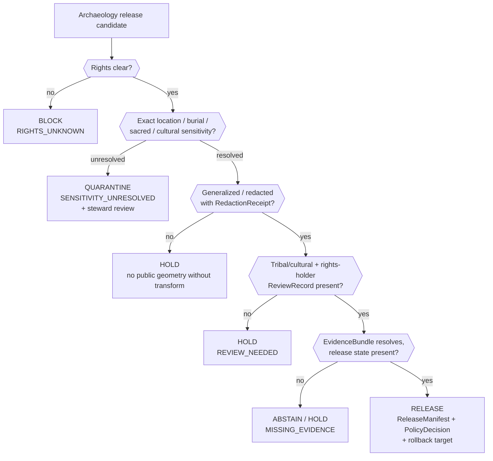

<!-- [KFM_META_BLOCK_V2]
doc_id: kfm://doc/PLACEHOLDER-uuid
title: Archaeology — Sensitivity and Publication Posture
type: standard
version: v1
status: draft
owners: <archaeology-domain-steward> + <rights-reviewer> (PLACEHOLDER — confirm)
created: 2026-05-28
updated: 2026-05-28
policy_label: public
related: [docs/domains/archaeology/README.md, docs/domains/archaeology/pipeline-shape.md, docs/domains/archaeology/governed-ai-behavior.md, docs/domains/archaeology/cross-lane-relations.md, ai-build-operating-contract.md, policy/sensitivity/archaeology/]
tags: [kfm, archaeology, sensitivity, publication, rights, sovereignty, sensitive-domain]
notes: [CONTRACT_VERSION = "3.0.0" pinned; fail-closed posture CONFIRMED doctrine, §23.2 defaults PROPOSED, paths PROPOSED, repo not mounted this session]
[/KFM_META_BLOCK_V2] -->

# 🏺 Archaeology — Sensitivity and Publication Posture

> What fails closed, what blocks public promotion, and what support a release must carry — for the most restricted lane in KFM.

**Status:** `draft` · **Owners:** `<archaeology-domain-steward>` + `<rights-reviewer>` (PLACEHOLDER) · **Updated:** 2026-05-28

> [!CAUTION]
> **Sensitive domain — fail closed.** Exact archaeological locations, burial, human remains, sacred sites, unresolved cultural sensitivity, collection security, private landowner details, and looting-risk exposure **fail closed**. This document describes the posture; it does **not** loosen it. Disposition is governed by `ai-build-operating-contract.md` §23.2; the most restrictive applicable row applies until stewards ratify defaults.

---

## Quick jump

- [1. Scope](#1-scope)
- [2. Repo fit](#2-repo-fit)
- [3. What fails closed](#3-what-fails-closed)
- [4. What blocks public promotion](#4-what-blocks-public-promotion)
- [5. The §23.2 disposition row](#5-the-232-disposition-row)
- [6. Deny-by-default register](#6-deny-by-default-register)
- [7. Publication support requirements](#7-publication-support-requirements)
- [8. Correction and rollback](#8-correction-and-rollback)
- [9. Sensitivity decision flow](#9-sensitivity-decision-flow)
- [10. Reason codes](#10-reason-codes)
- [11. Open questions register](#open-questions-register)
- [12. Open verification backlog](#open-verification-backlog)
- [13. Changelog](#changelog-v0--v1)
- [14. Definition of done](#definition-of-done)
- [Related docs](#related-docs)

---

## 1. Scope

This document specifies the **sensitivity and publication posture** for the Archaeology / Cultural Heritage domain: what categories of material fail closed, what conditions block public promotion, what transforms and reviews a release must carry, and how corrections and rollbacks work.

> [!NOTE]
> **Truth labels in this doc.** The fail-closed list and the universal blocking rule are `CONFIRMED` doctrine (Atlas §15.I). The §23.2 disposition defaults are `CONFIRMED` doctrine but `PROPOSED` as specific values until steward ratification. Publication/correction/rollback requirements are `CONFIRMED` doctrine / `PROPOSED` implementation (Atlas §15.M). All repo paths are `PROPOSED` (no repository mounted).

[↑ Back to top](#top)

---

## 2. Repo fit

| Aspect | Value | Status |
|---|---|---|
| Proposed path | `docs/domains/archaeology/sensitivity-and-publication-posture.md` | `PROPOSED` |
| Owning responsibility root | `docs/` (explains something to humans) | `CONFIRMED` rule |
| Domain segment | `archaeology` as a lane inside `docs/`, never a root | `CONFIRMED` rule |
| Policy counterpart (decisions) | `policy/sensitivity/archaeology/` | `PROPOSED` |
| Release counterpart | `release/` — `ReleaseManifest`, `CorrectionNotice`, `RollbackCard` | `PROPOSED` |
| Upstream (governs this doc) | `ai-build-operating-contract.md` §23.1–§23.2; `[ENCY]` publication doctrine | `CONFIRMED` rule / `PROPOSED` presence |

**Directory Rules basis.** A doc that *explains to humans* lives under `docs/`. The **decisions** themselves (allow / deny / restrict / abstain / review) live under `policy/`; **release** artifacts live under `release/`. This doc is navigational — the machine-readable policy and release objects govern actual decisions.

[↑ Back to top](#top)

---

## 3. What fails closed

`CONFIRMED` doctrine (Atlas §15.I). The following Archaeology material **fails closed** — denied, restricted, generalized, staged, or reviewed before any public exposure:

| Category | Why |
|---|---|
| Exact archaeological locations | Looting risk; irreversible site harm |
| Burial / human remains | Cultural, ethical, legal protection |
| Sacred sites | Sovereignty and cultural protection |
| Unresolved cultural sensitivity | Cannot assess harm without resolution |
| Collection security | Theft / loss prevention |
| Private landowner details | Privacy; rights |
| Looting-risk exposure | Direct enablement of harm |

> [!WARNING]
> "Fail closed" means the default is denial. Material does not become public by omission of a block; it becomes public only by an affirmative, reviewed, receipted release. Absence of a sensitivity flag is not clearance.

[↑ Back to top](#top)

---

## 4. What blocks public promotion

`CONFIRMED` doctrine (`[ENCY]`, `[DIRRULES]`). Independent of domain, **any** of these blocks public promotion. For Archaeology they apply with full force:

- Unclear rights
- Unresolved source role
- Missing evidence
- Unresolved sensitivity
- Absent release state

> [!IMPORTANT]
> These are *blocking* conditions, not warnings. A single unresolved item holds the artifact at its current pre-public state. The trust membrane forbids any public client, normal UI surface, or released AI surface from reaching `RAW`, `WORK`, `QUARANTINE`, canonical/internal stores, graph internals, vector indexes, source APIs, or direct model runtimes. `PUBLISHED` is the only state from which a governed API may emit `ANSWER`.

[↑ Back to top](#top)

---

## 5. The §23.2 disposition row

`CONFIRMED` doctrine; specific defaults `PROPOSED` until steward ratification (`ai-build-operating-contract.md` §23.2). The Archaeology — site locations row:

| Field | Value |
|---|---|
| Default disposition at public surface | `DENY` exact coordinates; generalize to county/region |
| Required transform before any release | Geometry generalization; redact precise UTM |
| Required reviewer beyond domain steward | Tribal/cultural reviewer; rights-holder rep |
| Required receipts/manifests | `RedactionReceipt`; `PolicyDecision`; `MapReleaseManifest` |

Adjacent rows that can apply to Archaeology joins (route to the **most restrictive** match):

- **Indigenous / cultural records** — `DENY` unless steward-approved; tribal/cultural reviewer; `PolicyDecision` + `ReviewRecord`.
- **Burial / sacred sites** — `DENY` exact location; buffer/generalize or full denial; cultural reviewer + rights-holder rep; `RedactionReceipt` + `PolicyDecision`.

> [!NOTE]
> When more than one row could match, the contract directs that the **most restrictive applicable row applies** until stewards ratify the specific defaults.

[↑ Back to top](#top)

---

## 6. Deny-by-default register

`CONFIRMED` doctrine (Atlas §20.5). The Archaeology entry in the cross-domain deny register:

| Domain/surface | Denied by default | Allowed only when |
|---|---|---|
| Archaeology | exact sites, burial, human remains, sacred sites, looting-risk detail | steward/cultural review **+** transform receipt **+** `EvidenceBundle` |

The "allowed only when" column is conjunctive: **all three** conditions — review, transform receipt, and evidence support — must hold. Any one missing keeps the material denied.

[↑ Back to top](#top)

---

## 7. Publication support requirements

`CONFIRMED` doctrine / `PROPOSED` implementation (Atlas §15.M; `[ENCY Appendix E]`). Archaeology publication requires, at minimum:

| Requirement | Object | Purpose |
|---|---|---|
| Release record | `ReleaseManifest` | Defines what was released and how to identify it (content-addressed by `spec_hash`) |
| Evidence support | `EvidenceBundle` | `EvidenceRef` resolves to released evidence |
| Validation / policy support | `ValidationReport` + `PolicyDecision` | Proves checks ran and recorded the decision |
| Review state where required | `ReviewRecord` | Tribal/cultural + rights-holder review for this lane |
| Transform receipt | `RedactionReceipt` | Records geometry generalization / field redaction |
| Correction path | `CorrectionNotice` (on demand) | Errors are correctable, not silently edited |
| Stale-state rule | supersession / stale badge | Out-of-date releases are marked, not hidden |
| Rollback target | `RollbackCard` | Reversibility is a trust feature |

> [!TIP]
> A release without a `ReleaseManifest` is "an undated, unsigned event." With one, the release is itself evidence in spirit: signable, gateable, citable. Consumers bind to the `ReleaseManifest` `spec_hash`, not to a floating "latest" pointer.

[↑ Back to top](#top)

---

## 8. Correction and rollback

`CONFIRMED` doctrine (Atlas §24.6.1). Corrections and rollbacks are governed transitions with their own required artifacts.

| Transition | Pre-condition | Required artifacts | Fail-closed outcome |
|---|---|---|---|
| **Correction** (PUBLISHED → PUBLISHED′) | Detected error or new evidence; downstream derivatives identified. | `CorrectionNotice`; `ReviewRecord`; invalidation list; `ReleaseManifest` update or supersession. | Stale-state announcement; **no silent edit**. |
| **Rollback** (PUBLISHED → prior release) | Failed release or post-publication failure; target prior release identified. | `RollbackCard`; `CorrectionNotice`; `ReleaseManifest` reverts to prior release; downstream derivative invalidation. | Held at current state until rollback validated. |

> [!IMPORTANT]
> Reading note (upgrade vs. downgrade asymmetry): a move *toward more public* always needs both a transform receipt **and** a review record; a move *toward less public* — correction or rollback — never needs both. A `CorrectionNotice` alone is sufficient to restrict or withdraw. **Rollback does not silently delete history**; it repoints the release and invalidates derivatives.

[↑ Back to top](#top)

---

## 9. Sensitivity decision flow

> [!NOTE]
> `NEEDS VERIFICATION` — this flow reflects **doctrine** (Atlas §15.I, §23.2, §24.6.1–§24.6.3), not a verified policy implementation. Reason codes and gate placement are `PROPOSED` until the policy engine is inspected.

[↑ Back to top](#top)

---

## 10. Reason codes

`PROPOSED` catalog (Atlas §24.6.3). The reason families most relevant to Archaeology disposition:

| Failure family | Reason code (PROPOSED) | Where it fires | Recovery path |
|---|---|---|---|
| Rights / sensitivity unresolved | `RIGHTS_UNKNOWN`, `SENSITIVITY_UNRESOLVED` | Admission / Validation / Catalog / Release | Steward review; rights resolution; tier reassignment |
| Missing required artifact | `MISSING_RECEIPT`, `MISSING_EVIDENCE`, `MISSING_REVIEW` | Normalization / Validation / Catalog / Release | Re-emit receipt; re-run review; re-validate |
| Review state inadequate | `REVIEW_NEEDED`, `REVIEW_INSUFFICIENT`, `REVIEW_REJECTED` | Catalog / Release | Run required review; supply `ReviewRecord` |
| Source-role collapse risk | `ROLE_COLLAPSE`, `ROLE_DOWNCAST_FORBIDDEN` | Validation / Catalog / Release | Restore source role; refuse upcast |
| Release infrastructure error | `RELEASE_MANIFEST_INVALID`, `ROLLBACK_TARGET_MISSING` | Release | Manifest fix; supply rollback target |

[↑ Back to top](#top)

---

## Open questions register

| ID | Question | Owner role | Resolution path |
|---|---|---|---|
| OQ-ARCH-SENS-01 | What public geometry thresholds and transform profiles define "generalized to county/region"? | archaeology steward | repo inspection / ADR |
| OQ-ARCH-SENS-02 | Who holds final release authority for Archaeology, distinct from the original author? | release authority | repo inspection |
| OQ-ARCH-SENS-03 | What is the oral-history / cultural-knowledge handling protocol? | tribal/cultural reviewer | steward ratification |
| OQ-ARCH-SENS-04 | Are the §23.2 Archaeology defaults ratified, or still PROPOSED? | archaeology steward | steward ratification |
| OQ-ARCH-SENS-05 | Is there an emergency public-layer disablement and rollback drill? | release authority | repo inspection |

## Open verification backlog

These items remain `NEEDS VERIFICATION` before promotion from `draft` to `published`:

1. Confirm `policy/sensitivity/archaeology/` exists and encodes the fail-closed list.
2. Confirm the §23.2 Archaeology defaults are ratified (currently `PROPOSED`).
3. Confirm `RedactionReceipt`, `MapReleaseManifest`, `RollbackCard`, `CorrectionNotice` schema homes.
4. Verify steward authority and confidentiality posture.
5. Confirm the "exact sensitive geometry denial" and "public no-leak" tests exist (Atlas §15.K lists them as `PROPOSED`).

## Changelog v0 → v1

| Change | Type (per contract §37) | Reason |
|---|---|---|
| Initial draft of Archaeology sensitivity & publication posture | new | Synthesizes Atlas §15.I, §15.M, §20.5, §24.6.1–§24.6.3 + contract §23.2 |
| Pinned `CONTRACT_VERSION = "3.0.0"` | clarification | Doctrine-adjacent doc requirement |

> **Backward compatibility.** New document; no prior anchors to preserve. Section anchors are stable for future revisions.

## Definition of done

This document is done enough to enter the repository when:

- it is placed according to Directory Rules (`docs/domains/archaeology/`);
- a docs steward, the archaeology domain steward, and a rights/cultural reviewer review it;
- it is linked from the archaeology lane README and the doctrine/sensitivity index;
- it does not conflict with accepted ADRs;
- any conflict with current repo conventions is logged in `docs/registers/DRIFT_REGISTER.md`;
- the `GENERATED_RECEIPT.json` planned in Section 2 is wired into CI;
- future changes follow the operating contract's §37 lifecycle.

---

## Related docs

- `docs/domains/archaeology/README.md` — archaeology lane landing page (`PROPOSED`)
- `docs/domains/archaeology/pipeline-shape.md` — sibling lifecycle doc (`PROPOSED`)
- `docs/domains/archaeology/governed-ai-behavior.md` — sibling governed-AI doc (`PROPOSED`)
- `docs/domains/archaeology/cross-lane-relations.md` — sibling cross-lane doc (`PROPOSED`)
- `ai-build-operating-contract.md` — §23.1–§23.2 sensitive-domain matrix (canonical)
- `policy/sensitivity/archaeology/` — fail-closed policy home (`PROPOSED`)

**Last updated:** 2026-05-28 · `CONTRACT_VERSION = "3.0.0"`

[↑ Back to top](#top)
