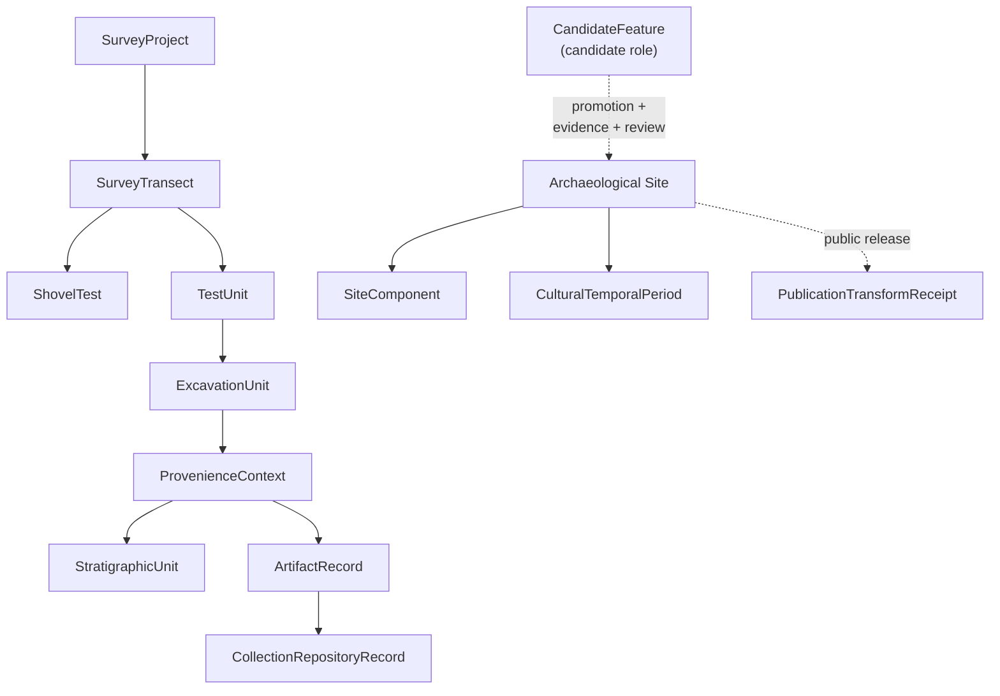

<!-- [KFM_META_BLOCK_V2]
doc_id: kfm://doc/PLACEHOLDER-uuid
title: Archaeology — Ubiquitous Language
type: standard
version: v1
status: draft
owners: <archaeology-domain-steward> (PLACEHOLDER — confirm)
created: 2026-05-28
updated: 2026-05-28
policy_label: public
related: [docs/domains/archaeology/README.md, docs/domains/archaeology/source-families.md, docs/domains/archaeology/sensitivity-and-publication-posture.md, docs/domains/archaeology/cross-lane-relations.md, ai-build-operating-contract.md, DomainDriven_Design_Reference.pdf]
tags: [kfm, archaeology, ubiquitous-language, glossary, DDD, sensitive-domain]
notes: [CONTRACT_VERSION = "3.0.0" pinned; terms CONFIRMED doctrine, field realization PROPOSED, repo not mounted this session]
[/KFM_META_BLOCK_V2] -->

# 🏺 Archaeology — Ubiquitous Language

> The bounded vocabulary of the Archaeology / Cultural Heritage lane — each term's meaning constrained by source role, evidence, time, and release state.

**Status:** `draft` · **Owners:** `<archaeology-domain-steward>` (PLACEHOLDER) · **Updated:** 2026-05-28

> [!CAUTION]
> **Sensitive domain.** Several terms below name objects whose exact geometry fails closed (sites, provenience, excavation units). Using a term correctly is part of the trust posture: a `CandidateFeature` is **not** an `Archaeological Site`. Disposition is governed by `ai-build-operating-contract.md` §23.2.

---

## Quick jump

- [1. Scope](#1-scope)
- [2. Repo fit](#2-repo-fit)
- [3. What the domain owns and does not own](#3-what-the-domain-owns-and-does-not-own)
- [4. The shared constraint on every term](#4-the-shared-constraint-on-every-term)
- [5. Glossary](#5-glossary)
- [6. Colloquial → formalized term mapping](#6-colloquial--formalized-term-mapping)
- [7. Term relationships](#7-term-relationships)
- [8. Identity and temporal rules](#8-identity-and-temporal-rules)
- [9. Open questions register](#open-questions-register)
- [10. Open verification backlog](#open-verification-backlog)
- [11. Changelog](#changelog-v0--v1)
- [12. Definition of done](#definition-of-done)
- [Related docs](#related-docs)

---

## 1. Scope

This document is the **ubiquitous language** for the Archaeology / Cultural Heritage domain: the defined terms, what the domain owns, what it explicitly does not own, and the single constraint that governs every term's meaning.

> [!NOTE]
> **Truth labels in this doc.** The term set and the scope/ownership statement are `CONFIRMED` doctrine (Atlas §15.B–§15.C). Each term is a `CONFIRMED` term with a `PROPOSED` field realization — the *name* is doctrine; the concrete schema fields are unverified. Identity rules are `PROPOSED`; temporal-separation rules are `CONFIRMED`. All repo paths are `PROPOSED` (no repository mounted).

The domain's one-line purpose (`CONFIRMED` doctrine / `PROPOSED` implementation): *govern archaeological sites, surveys, artifacts, contexts, excavation units, remote-sensing and LiDAR candidates, geophysics, 3D documentation, cultural/steward review, chronology, sensitivity transforms, and public-safe summaries.*

[↑ Back to top](#top)

---

## 2. Repo fit

| Aspect | Value | Status |
|---|---|---|
| Proposed path | `docs/domains/archaeology/ubiquitous-language.md` | `PROPOSED` |
| Owning responsibility root | `docs/` (explains something to humans) | `CONFIRMED` rule |
| Domain segment | `archaeology` as a lane inside `docs/`, never a root | `CONFIRMED` rule |
| Contract counterpart (meaning) | `contracts/domains/archaeology/` | `PROPOSED` |
| Schema counterpart (shape) | `schemas/contracts/v1/domains/archaeology/` | `PROPOSED` |
| Upstream | `ai-build-operating-contract.md`; `[DDD]` bounded-context doctrine; `[ENCY]` | `CONFIRMED` rule / `PROPOSED` presence |

**Directory Rules basis.** A doc that *explains to humans* lives under `docs/`. The **meaning** of each term is formalized in `contracts/`; the **machine shape** in `schemas/`. This glossary is navigational; the contracts and schemas govern actual field realization.

[↑ Back to top](#top)

---

## 3. What the domain owns and does not own

`CONFIRMED` doctrine (Atlas §15.B).

**Owns:** Archaeological Site; Survey; Artifact; Feature; Context; ExcavationUnit; Remote Sensing Anomaly; LiDAR Candidate; Geophysics Observation; 3D Documentation; Cultural Review; Steward Review; Collection Accession; Chronology Assertion; Sensitivity Transform.

> [!IMPORTANT]
> **Explicitly does not own.** Roads/Rail, People/Land, Geology, Hazards, and Spatial Foundation supply **context** but cannot confirm sites or bypass archaeological sensitivity. Context never overrides the sensitivity floor or substitutes for site-confirming evidence.

[↑ Back to top](#top)

---

## 4. The shared constraint on every term

`CONFIRMED` doctrine. Every term in this lane carries the same constraint: it *is used inside this domain with meaning constrained by source role, evidence, time, and release state.* In practice that means:

| Constraint dimension | What it requires |
|---|---|
| **Source role** | The term's instance carries its admitted role (observed / regulatory / modeled / aggregate / administrative / candidate / synthetic); the role is fixed and never upgraded. |
| **Evidence** | The instance resolves through `EvidenceRef → EvidenceBundle`; a term with no admissible evidence is not authoritative. |
| **Time** | Source, observed, valid, retrieval, release, and correction times stay distinct where material. |
| **Release state** | The instance's public meaning depends on whether it is released, and through what transform. |

[↑ Back to top](#top)

---

## 5. Glossary

`CONFIRMED` terms / `PROPOSED` field realization (Atlas §15.C). Definitions paraphrase the doctrine constraint; concrete fields await schema verification.

| Term | Meaning within Archaeology |
|---|---|
| **Archaeological Site** | A located archaeological site as evidence or released derivative; the most sensitivity-restricted object in the lane. |
| **SiteComponent** | A distinguishable component within a site. |
| **CulturalTemporalPeriod** | A chronological / cultural period assertion used to situate evidence in time. |
| **SurveyProject** | A bounded survey effort that produces coverage and observations. |
| **SurveyTransect** | A linear survey unit within a project. |
| **ShovelTest** | A discrete subsurface test point. |
| **TestUnit** | A controlled test excavation unit. |
| **ExcavationUnit** | A controlled excavation unit; high-sensitivity provenience. |
| **ProvenienceContext** | The spatial/stratigraphic context tying finds to their origin. |
| **StratigraphicUnit** | A defined stratigraphic layer or deposit. |
| **ArtifactRecord** | A record of a recovered artifact. |
| **CollectionRepositoryRecord** | A collection / repository accession record; collection-security sensitive. |
| **CandidateFeature** | A proposed feature (e.g., remote-sensing or LiDAR anomaly) **not yet confirmed** as a site. |
| **PublicationTransformReceipt** | The receipt recording a public-safe transform (generalization / redaction) applied before release. |

> [!WARNING]
> `CandidateFeature` is the load-bearing distinction in this lane. It carries the `candidate` source role: cited as candidate evidence in WORK/QUARANTINE, **never** appearing in `PUBLISHED` as a confirmed site without a separate, evidence-backed promotion.

[↑ Back to top](#top)

---

## 6. Colloquial → formalized term mapping

> [!NOTE]
> **`CONFLICTED` — surfaced for ADR resolution.** The scope statement (§15.B) uses colloquial nouns, while the glossary (§15.C) uses formalized term names. They appear to refer to the same concepts but are not identical strings. The likely mapping is below; confirm before treating either as canonical.

| §15.B colloquial term | §15.C formalized term | Status |
|---|---|---|
| Survey | `SurveyProject` (+ `SurveyTransect`) | `INFERRED` mapping |
| Artifact | `ArtifactRecord` | `INFERRED` mapping |
| Feature | `CandidateFeature` (when unconfirmed) | `INFERRED` mapping |
| Context | `ProvenienceContext` (+ `StratigraphicUnit`) | `INFERRED` mapping |
| Remote Sensing Anomaly / LiDAR Candidate | `CandidateFeature` | `INFERRED` mapping |
| Collection Accession | `CollectionRepositoryRecord` | `INFERRED` mapping |
| Chronology Assertion | `CulturalTemporalPeriod` | `INFERRED` mapping |
| Sensitivity Transform | `PublicationTransformReceipt` | `INFERRED` mapping |
| Geophysics Observation / 3D Documentation / Cultural Review / Steward Review | *(no §15.C glossary entry)* | `NEEDS VERIFICATION` |

[↑ Back to top](#top)

---

## 7. Term relationships

> [!NOTE]
> `NEEDS VERIFICATION` — this diagram reflects **conceptual** relationships among the §15.C terms, not a verified schema graph. The dashed `CandidateFeature → Archaeological Site` edge is a *governed promotion*, not an automatic upgrade.

[↑ Back to top](#top)

---

## 8. Identity and temporal rules

`PROPOSED` identity / `CONFIRMED` temporal (Atlas §15.E). Every object family in this lane shares one identity and one temporal rule:

- **Identity (`PROPOSED`):** deterministic basis = `source id + object role + temporal scope + normalized digest`.
- **Temporal (`CONFIRMED`):** source, observed, valid, retrieval, release, and correction times stay **distinct** where material — they are not flattened into a single timestamp.

> [!TIP]
> The temporal rule matters for archaeology specifically: when a site was *occupied*, when it was *observed*, when the record was *retrieved*, and when it was *released* are different times. Collapsing them produces false precision.

[↑ Back to top](#top)

---

## Open questions register

| ID | Question | Owner role | Resolution path |
|---|---|---|---|
| OQ-ARCH-UL-01 | Do the §15.B colloquial terms map to the §15.C formalized terms as in §6, or are they distinct concepts? | archaeology steward | ADR / contract authoring |
| OQ-ARCH-UL-02 | Where do Geophysics Observation, 3D Documentation, Cultural Review, and Steward Review get formalized term names? | archaeology steward | contract authoring |
| OQ-ARCH-UL-03 | What is the concrete field realization for each term (the schema)? | schema steward | repo inspection / ADR |
| OQ-ARCH-UL-04 | Is the identity basis (`source id + object role + temporal scope + normalized digest`) ratified? | schema steward | ADR |

## Open verification backlog

These items remain `NEEDS VERIFICATION` before promotion from `draft` to `published`:

1. Confirm the field realization (schema) for each of the 13 glossary terms.
2. Resolve the §15.B ↔ §15.C term mapping (CONFLICTED).
3. Confirm formalized names for the four unmapped owned concepts (§6 last row).
4. Confirm `contracts/domains/archaeology/` and `schemas/contracts/v1/domains/archaeology/` homes.
5. Confirm the identity basis against any ratifying ADR.

## Changelog v0 → v1

| Change | Type (per contract §37) | Reason |
|---|---|---|
| Initial draft of Archaeology ubiquitous language | new | Synthesizes Atlas §15.B–§15.C + §15.E identity/temporal rules |
| Surfaced §15.B ↔ §15.C term mapping as CONFLICTED | reconciliation | Colloquial vs. formalized names differ; flagged for ADR |
| Pinned `CONTRACT_VERSION = "3.0.0"` | clarification | Doctrine-adjacent doc requirement |

> **Backward compatibility.** New document; no prior anchors to preserve. Section anchors are stable for future revisions.

## Definition of done

This document is done enough to enter the repository when:

- it is placed according to Directory Rules (`docs/domains/archaeology/`);
- a docs steward and the archaeology domain steward review it;
- it is linked from the archaeology lane README and the doctrine/glossary index;
- it does not conflict with accepted ADRs;
- the §15.B ↔ §15.C term mapping (CONFLICTED) is resolved or logged in `docs/registers/DRIFT_REGISTER.md`;
- the `GENERATED_RECEIPT.json` planned in Section 2 is wired into CI;
- future changes follow the operating contract's §37 lifecycle.

---

## Related docs

- `docs/domains/archaeology/README.md` — archaeology lane landing page (`PROPOSED`)
- `docs/domains/archaeology/source-families.md` — sibling source doc (`PROPOSED`)
- `docs/domains/archaeology/sensitivity-and-publication-posture.md` — sibling sensitivity doc (`PROPOSED`)
- `docs/domains/archaeology/cross-lane-relations.md` — sibling cross-lane doc (`PROPOSED`)
- `ai-build-operating-contract.md` — source-role anti-collapse, §23.2 matrix (canonical)
- `contracts/domains/archaeology/` — term meaning home (`PROPOSED`)

**Last updated:** 2026-05-28 · `CONTRACT_VERSION = "3.0.0"`

[↑ Back to top](#top)
