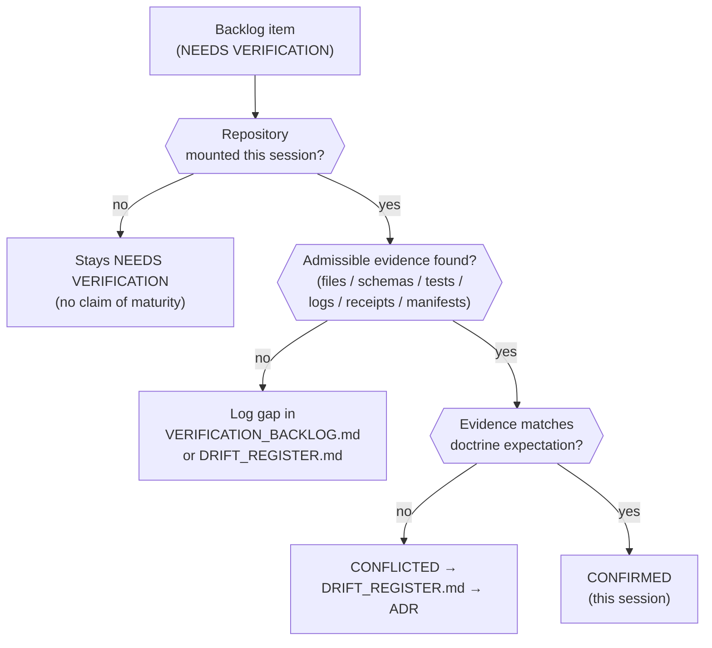

<!-- [KFM_META_BLOCK_V2]
doc_id: kfm://doc/PLACEHOLDER-uuid
title: Archaeology — Verification Backlog and Open Questions
type: standard
version: v2
status: draft
owners: <archaeology-domain-steward> (PLACEHOLDER — confirm)
created: 2026-05-28
updated: 2026-05-28
policy_label: public
related: [docs/domains/archaeology/README.md, docs/domains/archaeology/sensitivity-and-publication-posture.md, docs/domains/archaeology/pipeline-shape.md, docs/domains/archaeology/source-families.md, docs/domains/archaeology/governed-ai-behavior.md, docs/domains/archaeology/cross-lane-relations.md, docs/registers/VERIFICATION_BACKLOG.md, docs/registers/DRIFT_REGISTER.md, ai-build-operating-contract.md]
tags: [kfm, archaeology, verification, backlog, open-questions, ADR, sensitive-domain]
notes: [CONTRACT_VERSION = "3.0.0" pinned; every item NEEDS VERIFICATION by design, repo not mounted this session]
[/KFM_META_BLOCK_V2] -->

<a id="top"></a>

# 🏺 Archaeology — Verification Backlog and Open Questions

> What must be checked against a mounted repository before any Archaeology claim, control, or layer can be promoted from PROPOSED to CONFIRMED.


**Status:** `draft` · **Owners:** `<archaeology-domain-steward>` (PLACEHOLDER) · **Updated:** 2026-05-28

> [!IMPORTANT]
> **Everything in this document is `NEEDS VERIFICATION` by design.** No repository is mounted in this session. This backlog exists precisely so that no Archaeology control is asserted as implemented without evidence. The main project risk is not lack of ideas — it is overclaiming maturity before repo, runtime, rights, and proof-object evidence exists.

---

## Quick jump

- [1. Scope](#1-scope)
- [2. Repo fit](#2-repo-fit)
- [3. Doctrine verification backlog (§15.N)](#3-doctrine-verification-backlog-15n)
- [4. Validator and test backlog (§15.K)](#4-validator-and-test-backlog-15k)
- [5. API, governed-AI, and map-surface backlog](#5-api-governed-ai-and-map-surface-backlog)
- [6. Source rights and tier backlog](#6-source-rights-and-tier-backlog)
- [7. Open questions register](#7-open-questions-register)
- [8. Related ADR backlog items](#8-related-adr-backlog-items)
- [9. What "settled" means](#9-what-settled-means)
- [10. Verification flow](#10-verification-flow)
- [11. Promotion readiness checklist](#11-promotion-readiness-checklist)
- [12. Open verification backlog](#open-verification-backlog)
- [13. Changelog](#changelog-v1--v2)
- [14. Definition of done](#definition-of-done)
- [Related docs](#related-docs)

---

## 1. Scope

This document consolidates the **verification backlog and open questions** for the Archaeology / Cultural Heritage domain: the doctrine items that must be checked against a mounted repository, the validators that must be proven to exist and pass, the API / governed-AI / map surfaces awaiting confirmation, the source-rights and tier items, the open questions awaiting steward or ADR resolution, and what evidence would settle each.

> [!NOTE]
> **Truth labels in this doc.** The backlog items themselves are `CONFIRMED` doctrine (Atlas §15.J–§15.N, §24.5) — it is `CONFIRMED` that these are the open items. Each item's *resolution* is `NEEDS VERIFICATION` until checked against repository evidence. All repo paths are `PROPOSED`.

[↑ Back to top](#top)

---

## 2. Repo fit

| Aspect | Value | Status |
|---|---|---|
| Proposed path | `docs/domains/archaeology/verification-backlog.md` | `PROPOSED` |
| Owning responsibility root | `docs/` (explains something to humans) | `CONFIRMED` rule |
| Repo-wide register counterpart | `docs/registers/VERIFICATION_BACKLOG.md` | `PROPOSED` |
| Drift register | `docs/registers/DRIFT_REGISTER.md` | `PROPOSED` |
| Upstream | `ai-build-operating-contract.md`; `directory-rules.md` §2.5; `[ENCY]` | `CONFIRMED` rule / `PROPOSED` presence |

**Directory Rules basis.** A doc that *explains to humans* lives under `docs/`. This is the **domain-scoped** backlog; the repo-wide register is `docs/registers/VERIFICATION_BACKLOG.md`, and conflicts between doctrine and a mounted repo are logged in `docs/registers/DRIFT_REGISTER.md` per Directory Rules §2.5.

[↑ Back to top](#top)

---

## 3. Doctrine verification backlog (§15.N)

`CONFIRMED` doctrine (Atlas §15.N). Each item is `NEEDS VERIFICATION`; the evidence that would settle it is the same class for all: *mounted repo files, schemas, registry entries, tests, logs, emitted artifacts, review records, or release manifests.*

| ID | Item to verify | Why it matters | Status |
|---|---|---|---|
| **VB-ARCH-01** | Verify steward authority and confidentiality. | Determines who can authorize sensitive release and under what confidentiality. | `NEEDS VERIFICATION` |
| **VB-ARCH-02** | Define public geometry thresholds and transform profiles. | Without thresholds, "generalize to county/region" is undefined; redaction can't be validated. | `NEEDS VERIFICATION` |
| **VB-ARCH-03** | Verify oral history / cultural knowledge protocol. | Steward-controlled knowledge needs an explicit handling protocol before any use. | `NEEDS VERIFICATION` |
| **VB-ARCH-04** | Verify emergency public-layer disablement and rollback drill. | A sensitive lane must be able to pull a public layer fast and prove the rollback works. | `NEEDS VERIFICATION` |

> [!CAUTION]
> VB-ARCH-02 and VB-ARCH-04 are the highest-risk gaps: undefined generalization thresholds and an unproven disablement drill both expose the lane to exact-site leakage. These should block any public Archaeology layer until resolved.

[↑ Back to top](#top)

---

## 4. Validator and test backlog (§15.K)

`PROPOSED` (Atlas §15.K). These validators/tests are named in doctrine but unverified as implemented. Each must be proven to exist and to exercise its `DENY`/`ABSTAIN` paths, not just happy paths.

| ID | Validator / test | Negative state it must exercise | Status |
|---|---|---|---|
| **VT-ARCH-01** | EvidenceBundle-required tests | Claim without resolvable evidence → `ABSTAIN` | `PROPOSED` |
| **VT-ARCH-02** | Candidate-not-site tests | `CandidateFeature` queried as confirmed site → `DENY` | `PROPOSED` |
| **VT-ARCH-03** | Public no-leak tests | Exact geometry reaching a public surface → `DENY` | `PROPOSED` |
| **VT-ARCH-04** | Rights and cultural-review tests | Unresolved rights / missing cultural review → `HOLD`/`DENY` | `PROPOSED` |
| **VT-ARCH-05** | Exact sensitive geometry denial | Precise coordinates in any public output → `DENY` | `PROPOSED` |
| **VT-ARCH-06** | Catalog closure tests | Unresolved `EvidenceRef` / digest mismatch → `HOLD` | `PROPOSED` |
| **VT-ARCH-07** | AI exact-location denial | AI asked for exact location → `DENY` | `PROPOSED` |

> [!TIP]
> Negative-state coverage is the point. A validator that only proves the happy path does not satisfy the lane's fail-closed posture; each test above must demonstrate the `DENY`/`ABSTAIN`/`HOLD` branch.

[↑ Back to top](#top)

---

## 5. API, governed-AI, and map-surface backlog

`PROPOSED` governed surfaces (Atlas §15.J, §15.L, §15.G). These are named in doctrine; their routes, schema homes, and implementation are unverified.

| ID | Surface / behavior to verify | Expected outcomes / shape | Status |
|---|---|---|---|
| **VS-ARCH-01** | Archaeology feature/detail resolver route | `ArchaeologyDecisionEnvelope` → `ANSWER`/`ABSTAIN`/`DENY`/`ERROR` | `PROPOSED`; route `UNKNOWN` |
| **VS-ARCH-02** | Archaeology layer manifest resolver | `LayerManifest` → `ANSWER`/`DENY`/`ERROR`; public-safe release only | `PROPOSED` |
| **VS-ARCH-03** | Archaeology Evidence Drawer payload | `EvidenceDrawerPayload` + `EvidenceBundle` projection; evidence + policy filtered | `PROPOSED` |
| **VS-ARCH-04** | Archaeology Focus Mode answer | `RuntimeResponseEnvelope` + `AIReceipt`; AI never root truth | `PROPOSED` |
| **VS-ARCH-05** | Governed-AI behavior: summarize released bundles; `ABSTAIN` on insufficient evidence; `DENY` on policy/rights/sensitivity/release block | per §15.L | `PROPOSED` impl |
| **VS-ARCH-06** | Map/viewing products: public generalized site summaries; survey-coverage summaries; candidate-feature surfaces; remote-sensing anomaly surfaces; steward-only review maps; restricted exact-geometry review; chronology/context views; threat/risk views | per §15.G | `PROPOSED` |

> [!WARNING]
> VS-ARCH-06 includes "remote-sensing anomaly surfaces" and "candidate-feature surfaces." These MUST render as `candidate` role, never as confirmed sites — VT-ARCH-02 is the test that proves this surface does not leak a candidate as a site.

[↑ Back to top](#top)

---

## 6. Source rights and tier backlog

`CONFIRMED` doctrine / per-item `NEEDS VERIFICATION` (Atlas §15.D, §24.5).

| ID | Item to verify | Why it matters | Status |
|---|---|---|---|
| **VR-ARCH-01** | Rights and current terms for all eight source families (SHPO inventory, NRHP listings, field survey forms, excavation/provenience packets, artifact/collection records, lab reports, historic maps/plats/newspapers, oral history). | A source is not admitted to a public surface until its terms are resolved. | `NEEDS VERIFICATION` |
| **VR-ARCH-02** | `SourceDescriptor` schema home and source-role assignment per family. | Role is fixed at admission; collapse risk if unverified. | `NEEDS VERIFICATION` |
| **VR-ARCH-03** | Tier assignment for Archaeology objects (per §24.5 — see table below). | Sets default release tier and allowed transforms. | `NEEDS VERIFICATION` |

`CONFIRMED` doctrine (Atlas §24.5.2) — the Archaeology rows of the per-domain tier matrix. The tier *rules* are settled; their *enforcement* is `NEEDS VERIFICATION`:

| Object class | Default tier | Allowed transforms (PROPOSED) | Required gates |
|---|---|---|---|
| Site location | **T4** | Steward + cultural review + generalized geometry (coarse cell) + `RedactionReceipt` → T2 or T1 | `RedactionReceipt` + `ReviewRecord` + `PolicyDecision` |
| Human remains / sacred sites | **T4** | No transform releases to T0; T3 only under explicit named authorization | Sovereignty review + `ReviewRecord` + `PolicyDecision` |

> [!CAUTION]
> Human remains / sacred sites are **T4 with a hard ceiling**: no transform releases them to T0, and T3 is reachable only under explicit named authorization with sovereignty review. That ceiling is settled doctrine even while the tier *scheme* (ADR-S-05) is unratified.

[↑ Back to top](#top)

---

## 7. Open questions register

| ID | Question | Owner role | Resolution path |
|---|---|---|---|
| OQ-ARCH-VB-01 | Who holds final release authority for Archaeology, distinct from the author? | release authority | repo inspection / §15.N item 1 |
| OQ-ARCH-VB-02 | What are the numeric public geometry thresholds (buffer radius, generalization unit)? | archaeology steward | ADR / §15.N item 2 |
| OQ-ARCH-VB-03 | What is the oral-history / cultural-knowledge handling protocol and who ratifies it? | tribal/cultural reviewer | steward ratification / §15.N item 3 |
| OQ-ARCH-VB-04 | Is there an emergency disablement + rollback drill, and has it been exercised? | release authority | repo inspection / §15.N item 4 |
| OQ-ARCH-VB-05 | Are the §23.2 Archaeology defaults ratified or still PROPOSED? | archaeology steward | steward ratification |
| OQ-ARCH-VB-06 | Which field analyses (e.g., trowel-edge / terrain anomaly detection) require steward review before leaving WORK/QUARANTINE? | archaeology steward | repo inspection / ADR |
| OQ-ARCH-VB-07 | Do the VS-ARCH route names and `ArchaeologyDecisionEnvelope` schema exist, and where? | governed-ai + schema stewards | repo inspection |

[↑ Back to top](#top)

---

## 8. Related ADR backlog items

`PROPOSED` ADR backlog (corpus §24.12 / ADR-S series). These repo-wide ADRs directly affect Archaeology resolution:

| ADR (PROPOSED) | Decision needed | Archaeology impact |
|---|---|---|
| **ADR-S-05** | Sensitivity tier scheme (T0–T4) — adopt or revise | Sets the tier for sites, human remains, sacred sites (T4). |
| **ADR-S-11** | Cross-lane join policy + `most-restrictive-applicable` default | Governs Archaeology joins to Spatial Foundation, Roads/Rail, Settlements, Hazards. |
| **ADR-S-12** | Two-person-rule scope for T3/T4 promotion | Determines whether sensitive Archaeology release needs two-person sign-off. |
| **ADR-S-04** | Source-role enum + evolution rule | Fixes the roles Archaeology sources may carry. |
| **ADR-S-01** | Confirm `schemas/contracts/v1/...` schema home | Where Archaeology schemas + SourceDescriptor live. |
| **ADR-S-09** | Governed-AI provider-neutral adapter contract | Governs the Focus Mode / `AIReceipt` surface (VS-ARCH-04/05). |

> [!NOTE]
> `CONFIRMED` doctrine (corpus §24.5): for Archaeology human remains / sacred sites, **no transform releases them to T0**; T3 only under explicit named authorization, with sovereignty review. That tier rule is settled even while ADR-S-05 (the scheme's ratification) is open.

[↑ Back to top](#top)

---

## 9. What "settled" means

A backlog item moves from `NEEDS VERIFICATION` to `CONFIRMED` only when checked against **admissible evidence in a session where the repository is mounted**:

```text
mounted repo files · schemas · registry entries · tests ·
logs · emitted artifacts · review records · release manifests
```

> [!IMPORTANT]
> Cross-session memory is not evidence. "I verified this before" does not settle an item. Each item must be re-checked against current repository evidence; an attached PDF, a prior plan, or a workspace-only scan does not satisfy the rule.

[↑ Back to top](#top)

---

## 10. Verification flow



> [!NOTE]
> `NEEDS VERIFICATION` — this flow reflects the contract's verification threshold and memory rule, not a verified CI implementation.

[↑ Back to top](#top)

---

## 11. Promotion readiness checklist

Before any Archaeology public layer or claim is promoted from `PROPOSED`/`draft` to `published`:

- [ ] VB-ARCH-01 — steward authority and confidentiality confirmed
- [ ] VB-ARCH-02 — public geometry thresholds and transform profiles defined
- [ ] VB-ARCH-03 — oral-history / cultural-knowledge protocol verified
- [ ] VB-ARCH-04 — emergency disablement + rollback drill exercised
- [ ] VT-ARCH-01…07 — validators exist and exercise their `DENY`/`ABSTAIN`/`HOLD` paths
- [ ] VS-ARCH-01…06 — API, governed-AI, and map surfaces confirmed (routes, envelopes, candidate-not-site rendering)
- [ ] VR-ARCH-01…03 — source rights resolved, descriptor roles fixed, tier assignments enforced
- [ ] §23.2 Archaeology defaults ratified (or most-restrictive-row applied)
- [ ] §24.5 T4 ceiling for human remains / sacred sites enforced (no path to T0)
- [ ] ADR-S-05, ADR-S-11, ADR-S-12 resolved or their absence logged in `DRIFT_REGISTER.md`
- [ ] `ReleaseManifest`, correction path, and rollback target present

[↑ Back to top](#top)

---

## Open verification backlog

These items remain `NEEDS VERIFICATION` before this *document* is promoted from `draft` to `published`:

1. Confirm `docs/registers/VERIFICATION_BACKLOG.md` exists and whether per-domain backlogs roll up into it.
2. Confirm the VB-/VT-/VS-/VR- ID schemes used here match any repo-wide convention (or log the mismatch in `DRIFT_REGISTER.md`).
3. Confirm the ADR-S item numbers against the live ADR index.
4. Confirm the §24.5 tier assignments and the human-remains T4 ceiling are enforced in policy.
5. Confirm the §15.J route names and `ArchaeologyDecisionEnvelope` schema home.

## Changelog v1 → v2

| Change | Type (per contract §37) | Reason |
|---|---|---|
| Added §5 API / governed-AI / map-surface backlog (VS-ARCH-01…06) | gap closure | §15.J, §15.L, §15.G surfaces were unrepresented |
| Added §6 source-rights and tier backlog (VR-ARCH-01…03) + §24.5.2 Archaeology tier rows | gap closure | Settles the prior doc's "§24.5 tier assignments" open item |
| Added §10 verification flow diagram | clarification | Visualize the NEEDS VERIFICATION → CONFIRMED path; satisfies polish mandate |
| Expanded open questions (OQ-06, OQ-07) and ADR table (ADR-S-09) | gap closure | Cover anomaly-review and governed-AI adapter |
| Extended promotion checklist with VS-/VR- and the T4 ceiling | reconciliation | Keep checklist complete against new sections |
| Bumped version v1 → v2; meta `version` and changelog updated | housekeeping | Per contract §37 MINOR bump (additive, no anchor breakage) |

> **Backward compatibility.** All v1 section anchors are preserved (`#1-scope` … `#8-promotion-readiness-checklist` semantics retained; promotion checklist moved to §11, "what settled means" to §9 — anchors `#what-settled-means`, `#promotion-readiness-checklist` unchanged). New sections inserted as §5–§6 and §10; no v1 content removed. The VB-/VT-/VS-/VR- IDs are local to this doc and `NEEDS VERIFICATION` against any repo-wide scheme.

## Definition of done

This document is done enough to enter the repository when:

- it is placed according to Directory Rules (`docs/domains/archaeology/`);
- a docs steward and the archaeology domain steward review it;
- it is linked from the archaeology lane README and `docs/registers/VERIFICATION_BACKLOG.md`;
- it does not conflict with accepted ADRs;
- the VB-/VT-/VS-/VR- ID schemes are reconciled with any repo-wide convention or logged in `docs/registers/DRIFT_REGISTER.md`;
- the `GENERATED_RECEIPT.json` planned in Section 2 (Notes) is wired into CI;
- future changes follow the operating contract's §37 lifecycle.

---

## Related docs

- `docs/domains/archaeology/README.md` — archaeology lane landing page (`PROPOSED`)
- `docs/domains/archaeology/sensitivity-and-publication-posture.md` — sibling sensitivity doc (`PROPOSED`)
- `docs/domains/archaeology/pipeline-shape.md` — sibling lifecycle doc (`PROPOSED`)
- `docs/domains/archaeology/source-families.md` — sibling source doc (`PROPOSED`)
- `docs/domains/archaeology/governed-ai-behavior.md` — sibling governed-AI doc (`PROPOSED`)
- `docs/domains/archaeology/cross-lane-relations.md` — sibling cross-lane doc (`PROPOSED`)
- `docs/registers/VERIFICATION_BACKLOG.md` — repo-wide backlog register (`PROPOSED`)
- `ai-build-operating-contract.md` — verification threshold, §23.2 matrix, §24.5 tiers (canonical)

**Last updated:** 2026-05-28 · `CONTRACT_VERSION = "3.0.0"`

[↑ Back to top](#top)
