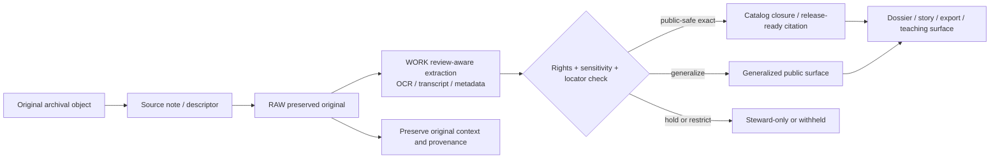

<!-- [KFM_META_BLOCK_V2]
doc_id: kfm://doc/NEEDS-VERIFICATION
title: Archives & Heritage
type: standard
version: v1
status: draft
owners: NEEDS VERIFICATION
created: YYYY-MM-DD
updated: YYYY-MM-DD
policy_label: NEEDS VERIFICATION
related: [NEEDS VERIFICATION]
tags: [kfm, archives, heritage, oral-history, public-memory]
notes: [Mounted repository tree was not directly visible in this session., Exact owners, related paths, and policy label need repo verification.]
[/KFM_META_BLOCK_V2] -->

# Archives & Heritage

Document-first lane index for archival, newspaper, oral-history, public-memory, and heritage materials in Kansas Frontier Matrix (KFM).

> [!NOTE]
> **Status:** draft  
> **Owners:** NEEDS VERIFICATION  
>      
> **Quick jumps:** [Scope](#scope) · [Repo fit](#repo-fit) · [Accepted inputs](#accepted-inputs) · [Exclusions](#exclusions) · [Directory tree](#directory-tree) · [Quickstart](#quickstart) · [Usage](#usage) · [Diagram](#diagram) · [Lane tables](#lane-tables) · [Task list](#task-list--definition-of-done) · [FAQ](#faq)  
> **Repo fit:** `docs/domains/archives-heritage/README.md` → upstream: **NEEDS VERIFICATION** · downstream: archival leaf docs, dossier/story/export surfaces, and review-aware evidence payloads **NEEDS VERIFICATION**

> [!IMPORTANT]
> This lane is for **documentary evidence and heritage context**, not for flattening archival material into decontextualized facts and not for turning narrative convenience into substitute truth.

> [!WARNING]
> Current-session workspace verification is **PDF-only**. Exact local file inventory, CODEOWNERS, workflow coverage, schema locations, and adjacent leaf paths remain **NEEDS VERIFICATION** until the mounted repository is directly inspected.

## Scope

This directory should function as the KFM lane index for:

- archival items and finding aids
- newspaper materials and clipping references
- oral-history records, transcripts, and audio-linked notes
- public-memory collections
- heritage documentation, registers, and interpretive source notes

The lane exists to keep **context, provenance, rights, locator quality, and publication burden** visible. It should help maintainers move material safely into downstream public surfaces such as dossiers, story nodes, exports, and teaching modules without letting extracted text, OCR, or narrative summary silently replace the original record.

This directory is **not** the owner of canonical truth for other lanes. A deed book used as documentary evidence here does not make this the land-tenure lane. A species mention in a newspaper does not make this the biodiversity lane. A historical flood article does not make this the hydrology lane. This lane owns the **documentary evidence handling**, not every domain claim that may later cite that evidence.

## Repo fit

This file should behave like a narrow routing surface: it explains what belongs here, what does not, and which review burdens must be satisfied before material is reused in public-safe KFM surfaces.

| Path or surface | Role | Relationship |
| --- | --- | --- |
| `docs/domains/archives-heritage/README.md` | this file | lane README requested in this task |
| domains hub README | likely parent routing surface | **NEEDS VERIFICATION** |
| archival leaf docs and subdirectories | likely lane-local leaves | **NEEDS VERIFICATION** |
| dossier / story / export surfaces | downstream public explanation surfaces | exact repo paths **NEEDS VERIFICATION** |
| governance / standards docs | policy boundary for rights, sensitivity, review, and release | exact repo paths **NEEDS VERIFICATION** |

### Current verification snapshot

| Item | Verified state | Notes |
| --- | --- | --- |
| `docs/domains/archives-heritage/README.md` | confirmed target path | requested explicitly in this task |
| Adjacent leaf docs or subdirectories | **NEEDS VERIFICATION** | not directly visible in the mounted workspace |
| Schemas, validators, workflows, tests | **UNKNOWN** | implementation files were not directly surfaced in this session |
| Lane doctrine and source-family expectations | **CONFIRMED** | visible in the attached KFM manuals and atlas |
| Exact owners, labels, and local links | **NEEDS VERIFICATION** | placeholders preserved intentionally |

This README should therefore prioritize **structure, routing, and lane-specific obligations** over claims about mature local implementation.

## Accepted inputs

Place material here when its primary role is **documentary / archival evidence** or **heritage context**, such as:

- scans, photographs, captions, and item descriptions
- newspaper references, clipping metadata, and issue/page locators
- oral-history transcripts, audio metadata, and quote-safe locator notes
- archival collection descriptions and finding-aid summaries
- map sheets, legends, captions, and archival cartographic context
- heritage register references and site/context notes
- item-level rights, reuse, and derivative-use constraints
- provenance notes needed before a record can be quoted, generalized, or routed into public-safe outputs

## Exclusions

Do **not** place the following here:

- uncited narrative synthesis presented as settled fact
- OCR output or transcript extracts that replace the preserved original
- exact sensitive locations when publication class, masking, or generalization is unresolved
- current ownership, parcel, or legal-description work whose primary lane is land / cadastral
- biodiversity, hydrology, hazards, or service-geography records when this directory is only being used as an incidental citation stop
- rights-unclear bulk dumps copied in for convenience
- unsupported “local history” claims with no quote-safe locator or source trail
- polished story text that belongs in downstream dossier, story, teaching, or export surfaces instead of documentary intake

## Directory tree

> [!NOTE]
> The tree below is a **proposed starter shape** based on KFM lane patterns and corpus evidence. It is not a confirmed mounted inventory.

```text
docs/
└── domains/
    └── archives-heritage/
        ├── README.md
        ├── references/
        │   └── source-families.md                 # NEEDS VERIFICATION
        ├── oral-histories/
        │   └── README.md                          # NEEDS VERIFICATION
        ├── newspapers/
        │   └── README.md                          # NEEDS VERIFICATION
        ├── heritage-registers/
        │   └── README.md                          # NEEDS VERIFICATION
        └── examples/
            └── source-descriptor.example.yaml     # NEEDS VERIFICATION
```

The intent is small and disciplined: one lane README, a few narrow sublanes if the repo truly has them, and one or two example contract artifacts rather than a large speculative tree.

## Quickstart

1. Start with the **original evidence object**, not the summary.
2. Record the source role before adding interpretation: documentary / archival, community-contributed, mirror / discovery, or another explicitly governed role.
3. Capture a **quote-safe locator** before extracting text: page, issue/date, item identifier, timestamp, folio, or equivalent.
4. Record rights, reuse, derivative-use, and sensitivity posture before drafting public-facing language.
5. Route OCR, transcript cleanup, summarization, or tagging into review-aware downstream artifacts rather than silently overwriting the original.
6. Publish only the representation that matches the resolved public-safe state: exact, generalized, summary-only, or withheld.

Illustrative starter fields for a documentary source note:

```yaml
# illustrative only — exact schema path and enum values NEEDS VERIFICATION
source_id: NEEDS VERIFICATION
source_role: documentary/archival
owner_or_steward: NEEDS VERIFICATION
access_mode: scan|repository|iiif|transcript|oral-history-program
rights_posture: NEEDS VERIFICATION
sensitivity_class: public|restricted|mixed
locator_strategy: page|issue-page|timecode|item-id|url
publication_intent: catalog-only|quotation|generalized-summary|steward-only
public_safe_representation: exact|generalized|withheld
notes: []
```

## Usage

### Add a source-family note

1. Name the steward or holding institution.
2. State the source role explicitly.
3. Record the minimum locator needed for quotation or later audit.
4. Record what kind of public-safe reuse is allowed.
5. Keep interpretive notes visibly separate from source description.

Minimal pattern:

```md
## Source Family — Example

**Source role:** documentary/archival  
**Steward:** NEEDS VERIFICATION  
**Typical materials:** scans, photographs, clippings, descriptions  
**Locator strategy:** page / issue-page / item-id / timecode  
**Rights posture:** NEEDS VERIFICATION  
**Public-safe use:** catalog-only / quotation / generalized summary / steward-only  

### Notes
- CONFIRMED:
- INFERRED:
- PROPOSED:
- NEEDS VERIFICATION:
```

### Add oral-history or transcript material

Use this lane when the item is still primarily a **documentary evidence object**.

1. Keep transcript and audio identity linked.
2. Capture speaker role if known.
3. Record quote-safe locators before summarizing.
4. Record derivative-use and redistribution limits.
5. Do not flatten testimony into unsupported domain fact without downstream evidence review.

### Add newspaper material

1. Prefer issue/date/page or stable item identifiers over informal citations.
2. Separate article facts from later interpretation.
3. Mark OCR uncertainty where it changes meaning.
4. Keep copyright and derivative-use posture explicit.

### Add heritage-register context

1. Preserve register identifiers, dates, and stewarding institution.
2. Keep register inclusion separate from broader interpretive claims.
3. Generalize or withhold location detail where site protection or sensitivity requires it.
4. Route domain-specific interpretation to the downstream lane that owns that claim.

## Diagram



[Back to top](#archives--heritage)

## Lane tables

### Status vocabulary used in this lane

| Label | Use here |
| --- | --- |
| **CONFIRMED** | Supported by directly visible KFM doctrine or by the target path explicitly named in the task |
| **INFERRED** | Conservative structural completion that fits KFM lane patterns but is not directly mounted |
| **PROPOSED** | Recommended local shape, workflow step, or file layout consistent with doctrine |
| **UNKNOWN** | Not verified strongly enough in the current session |
| **NEEDS VERIFICATION** | Review flag for local file inventory, ownership, workflow, policy label, or exact routing path |

### Source-role handling in this lane

| Source role | What belongs here | Main caution |
| --- | --- | --- |
| documentary / archival | scans, newspapers, archival descriptions, oral-history transcripts, photographs, maps, captions | preserve context; do not flatten interpretive material into decontextualized facts |
| community-contributed | oral-history contributions, local memory notes, civic submissions | treat as governed input with confidence, moderation, and rights handling — not automatic truth |
| mirror / discovery | discovery-friendly copies, index portals, aggregator search surfaces | provenance anchors only; do not let mirrors replace origin authorities |
| statutory / administrative | heritage registers, official designations, boundary or list references used as documentary context | legal or registry meaning is not the same as full historical interpretation |
| derivative convenience layer | OCR text, search extracts, summary indexes, embeddings | helpful for access, but must remain visibly derived from preserved originals |

### Representative source families

| Source family | Typical use in this lane | Main caution |
| --- | --- | --- |
| Kansas Historical Society / Kansas Memory | item records, scans, captions, public-memory collections | rights and locator quality vary by item |
| Chronicling America and local newspapers | press coverage, public-memory context, event reporting | OCR error, quotation accuracy, and reuse posture require review |
| Oral-history programs | testimony, memory, transcript/audio-linked evidence | speaker identity, locator quality, and derivative-use limits matter |
| University and local archives | manuscripts, maps, collections, photographs | item-level rights and access conditions may differ sharply |
| Heritage registers and heritage documentation | site references, designation context, descriptive background | registry presence is not the whole interpretive record |
| Archival cartographic materials | map sheets, legends, captions, place context | exact reproduction and derivative use may be constrained |

### Verification burdens before publication

| Burden | Why it matters | Minimum handling expectation |
| --- | --- | --- |
| Quote-safe locator | unsupported quotation destroys traceability | capture page, timecode, issue-page, item id, or equivalent |
| Transcript / audio identity | speaker ambiguity weakens evidence quality | keep transcript, recording, speaker role, and source context aligned |
| Rights and derivative-use posture | some materials can be viewed or quoted but not freely republished or remixed | record item-level or collection-level reuse constraints explicitly |
| Culturally sensitive or exact-location detail | public-safe delivery may require narrowing or masking | decide exact vs generalized vs withheld before public use |
| Original vs extracted text | OCR and extraction are useful but can mislead | preserve originals first and mark extracted layers as derived |
| Generalized-vs-precise comparison | steward review needs to see what changed | maintain a visible comparison path where location or identity is narrowed |

## Task list & definition of done

- [ ] Verify actual mounted directory inventory for this lane
- [ ] Resolve owners, created date, updated date, and policy label in the meta block
- [ ] Confirm upstream and downstream repo links
- [ ] Add or verify a source-family register for this lane
- [ ] Document quote-safe locator rules for newspapers, transcripts, and scans
- [ ] Document rights and derivative-use handling expectations
- [ ] Confirm where schemas, validators, or fixtures belong in the mounted repo
- [ ] Add at least one generalized-vs-precise publication example if this lane will feed public surfaces

Definition of done for a first trustworthy lane README:

| Gate | Requirement |
| --- | --- |
| Scope | The lane clearly states what belongs here and what does not |
| Routing | Upstream and downstream relationships match the mounted repo |
| Preservation | Original documentary objects are treated as primary evidence |
| Rights | Reuse, quotation, and derivative-use posture are recorded explicitly |
| Sensitivity | Public-safe representation rules are visible |
| Locator quality | Quote-safe locator guidance is present |
| Trust posture | Extracted or summarized material is visibly downstream of originals |
| Documentation | The README no longer relies on unresolved placeholders except where the repo truly has not decided yet |

## FAQ

### Why preserve originals before OCR or summarization?

Because OCR and summaries can accelerate reading, but they do not preserve the original object’s full context, locator quality, or rights posture on their own.

### Why is this lane separate from Story Nodes or dossiers?

Because narrative objects must stay downstream of evidence and policy. This lane handles documentary evidence routing and burdens; downstream public surfaces handle explanation.

### Why can a source be visible but not fully reusable?

Because some materials may allow viewing or limited quotation while still restricting derivative reuse, redistribution, or exact reproduction.

### When should a record move to another lane?

When the primary question becomes canonical land, hydrology, hazards, biodiversity, service geography, or another domain’s governed record rather than the documentary evidence object itself.

[Back to top](#archives--heritage)

## Appendix

<details>
<summary><strong>Appendix — illustrative starter field set for documentary evidence handling</strong></summary>

```yaml
documentary_evidence:
  source_id: NEEDS VERIFICATION
  source_role: documentary/archival
  steward: NEEDS VERIFICATION
  origin_url_or_locator: NEEDS VERIFICATION
  item_identifier: NEEDS VERIFICATION
  quote_safe_locator: NEEDS VERIFICATION
  rights_posture: NEEDS VERIFICATION
  derivative_use_notes: []
  sensitivity_class: public|restricted|mixed
  public_safe_representation: exact|generalized|withheld
  extracted_layers:
    - ocr
    - transcript
    - summary
  extracted_layers_must_remain_derived: true
```

</details>

<details>
<summary><strong>Appendix — current verification backlog</strong></summary>

- Confirm whether this lane already has leaf docs for newspapers, oral histories, or heritage registers.
- Confirm whether the repository uses a shared schema location, domain-local examples, or both.
- Confirm whether steward-only review payloads already exist elsewhere in the repo.
- Confirm exact governance paths for rights, sensitivity, and publication classes.
- Confirm whether a public-safe generalized-vs-precise comparison flow already exists for documentary or heritage material.
- Confirm whether this lane should be marked `public`, `restricted`, or a mixed publication class in repo metadata.

</details>

[Back to top](#archives--heritage)
