<!-- [KFM_META_BLOCK_V2]
doc_id: kfm://doc/TODO-ASSIGN-UUID
title: Atmosphere / Air Domain
type: standard
version: v1
status: draft
owners: TODO-VERIFY: atmosphere-air domain steward, data steward, policy steward
created: TODO-VERIFY-YYYY-MM-DD
updated: 2026-04-22
policy_label: TODO-VERIFY-public-or-restricted
related: [docs/domains/atmosphere/README.md, schemas/contracts/v1/atmosphere/, data/registry/atmosphere/]
tags: [kfm, atmosphere-air, air-quality, evidence, map-first, time-aware, governed-domain]
notes: [Target path requested as docs/domains/atmosphere-air/README.md; prior atmosphere architecture used docs/domains/atmosphere/ as the proposed domain path, so path reconciliation needs repo verification.]
[/KFM_META_BLOCK_V2] -->

# Atmosphere / Air Domain

Governed home for atmospheric observations, air-quality reports, model fields, smoke and aerosol context, advisories, source metadata, proof objects, and public-safe map delivery.

<a id="top"></a>

## Impact block


**Status:** experimental  
**Owners:** TODO-VERIFY: atmosphere-air domain steward, data steward, policy steward  
**Target path:** `docs/domains/atmosphere-air/README.md`  
**Repo evidence:** NEEDS VERIFICATION — this README is written from the attached KFM corpus and visible workspace evidence, not from a mounted checkout.

**Quick jumps:**  
[Scope](#scope) · [Repo fit](#repo-fit) · [Inputs](#accepted-inputs) · [Exclusions](#exclusions) · [Directory tree](#directory-tree) · [Knowledge characters](#knowledge-characters) · [Governed flow](#governed-flow) · [Validation gates](#validation-gates) · [Open verification](#open-verification)

> [!IMPORTANT]
> This lane must not become an “air-quality-only” or “smoke-only” slice. Atmospheric measurements, AQI reports, regulatory archives, model fields, smoke masks, anomaly surfaces, fusion products, advisories, and site metadata are different knowledge objects and must remain distinguishable at the point of use.

---

## Scope

This README orients maintainers to the **Atmosphere / Air** domain lane and the minimum governance contract for future implementation.

The lane covers:

| Family | What belongs here | Required posture |
|---|---|---|
| Sensor observations | PM2.5, PM10, ozone, NO2, SO2, CO, temperature, humidity, wind, pressure, visibility | Preserve raw value/unit, normalized value/unit, source payload hash, site metadata, and EvidenceRefs. |
| Public AQI reports | AQI, NowCast, agency index reports, advisory codes | Treat as report/index objects, not raw concentration. |
| Regulatory archives | Quality-assured or archival records such as AQS-like evidence | Use with historical/regulatory temporal caveats; do not imply live state. |
| Low-cost sensor networks | PurpleAir-like or equivalent contributor networks | Fail closed unless correction method, caveats, confidence, rights, and limitations are explicit. |
| Model fields | Forecast, reanalysis, hindcast, transport, aerosol, smoke, chemistry fields | Label as modeled; expose model card, source role, uncertainty, and temporal support. |
| Remote-sensing masks | Smoke plumes, AOD, fire hotspots, aerosol/cloud/haze masks | Treat as classification/support layers, not surface exposure measurements. |
| Fusion products | Interpolation, bias correction, consensus events, ensemble products | Keep `DERIVED_FUSION`; expose all input EvidenceRefs and uncertainty. |
| Advisories and alerts | Health notices, public recommendations, agency messaging | Keep distinct from observations and models; this lane is not an emergency alerting system. |
| Network and site context | Station IDs, siting caveats, instrument metadata, active/inactive state, health events, cadence | Required to interpret observations and freshness. |
| Baseline and temporal support | Normals, rolling baselines, freshness windows, persistence windows, hysteresis rules | Required to explain anomaly and freshness claims. |

### Non-goals

This README does not claim that the repository already contains the files, schemas, tests, routes, policies, or workflows listed below. It records the lane contract and review checklist for the first repo-grounded PR.

<p align="right"><a href="#top">Back to top ↑</a></p>

---

## Repo fit

| Surface | Status | Working path or relationship |
|---|---:|---|
| README requested by this task | PROPOSED | `docs/domains/atmosphere-air/README.md` |
| Prior architecture path family | NEEDS VERIFICATION | `docs/domains/atmosphere/README.md` |
| Domain docs family | PROPOSED | `docs/domains/atmosphere-air/*.md` or repo-verified equivalent |
| Machine schema home | PROPOSED | `schemas/contracts/v1/atmosphere/*.schema.json` |
| Source registry | PROPOSED | `data/registry/atmosphere/sources.yaml` |
| Parameter registry | PROPOSED | `data/registry/atmosphere/parameters.yaml` |
| Offline fixtures | PROPOSED | `data/fixtures/atmosphere/{valid,invalid}/` |
| Validators | PROPOSED | `tools/validators/atmosphere/` |
| Policy | PROPOSED | `policy/atmosphere/` |
| Tests | PROPOSED | `tests/atmosphere/` |
| Public UI consumers | PROPOSED | governed API envelopes, released layer descriptors, Evidence Drawer payloads, Focus envelopes |
| Internal lifecycle data | PROPOSED | `data/raw`, `data/work`, `data/quarantine`, `data/processed`, `data/catalog`, `data/receipts`, `data/proofs`, `data/published` under an atmosphere lane |

### Upstream links

| Upstream source | Relationship |
|---|---|
| `docs/README.md` | Root documentation landing page; should link to this lane after repo verification. |
| `docs/registers/AUTHORITY_LADDER.md` | Defines which documents, repo evidence, generated proof objects, and external sources outrank others. |
| `docs/sources/SOURCE_DESCRIPTOR_STANDARD.md` | Defines the required fields for source descriptors, including rights, verification status, and source role. |
| `docs/intake/IDEA_INTAKE.md` | Intake path for exploratory source or modeling ideas before they become lane work. |

### Downstream links

| Downstream consumer | Relationship |
|---|---|
| `schemas/contracts/v1/atmosphere/` | Machine-readable contracts for observations, sources, model fields, AQI reports, remote masks, fusion products, layer descriptors, receipts, and decisions. |
| `data/catalog/layers/atmosphere/` | Released layer descriptors consumed by the map shell. |
| `data/proofs/atmosphere/` | Candidate EvidenceBundles, catalog matrices, DecisionEnvelopes, and promotion proof objects. |
| MapLibre shell | Renders only released, governed descriptors and public-safe delivery artifacts. |
| Evidence Drawer | Explains source role, knowledge character, freshness, review state, rights, transformations, EvidenceRefs, and conflict state. |
| Focus Mode | Produces bounded `ANSWER`, `ABSTAIN`, `DENY`, or `ERROR` outcomes over admissible evidence only. |

> [!WARNING]
> `docs/domains/atmosphere-air/` and `docs/domains/atmosphere/` must not silently diverge. If both exist in the mounted repository, reconcile them through an ADR and compatibility note before expanding this lane.

<p align="right"><a href="#top">Back to top ↑</a></p>

---

## Accepted inputs

The lane accepts only source-grounded, lifecycle-aware, reviewable inputs.

| Input | Minimum required fields | First safe handling |
|---|---|---|
| `SourceDescriptor` | `source_id`, `source_role`, `knowledge_character`, `publisher`, `rights_spdx`, `verification_status`, `public_release_allowed`, `last_verified_at` | Registry record; public release blocked while rights or verification are UNKNOWN. |
| Parameter definition | `parameter_id`, raw unit set, normalized unit, conversion rule, knowledge character, caveats | Parameter registry + unit tests. |
| Observation fixture | source/site/parameter/time, raw value/unit, normalized value/unit, source payload hash, EvidenceRefs | Offline schema and QC tests. |
| Site fixture | provider/site ID, geometry or generalization rule, instrument metadata, station health, cadence | Offline schema and freshness tests. |
| Model field fixture | model source, variable, time basis, grid/geometry support, model card ref, uncertainty | Modeled-object schema; never observed. |
| Remote mask fixture | sensor/product, classification, time basis, confidence/caveats | Mask schema; never surface concentration by default. |
| AQI/advisory fixture | index/report code, issuer, method, temporal scope, public message source | AQI/report schema; never raw concentration. |
| Fusion fixture | input EvidenceRefs, method, uncertainty, transform hash, output scope | `DERIVED_FUSION`; proof and drawer disclosure. |
| Run receipt | run ID, inputs, outputs, transform spec hash, status, validator refs | Process memory; not release proof by itself. |
| EvidenceBundle candidate | EvidenceRefs, source roles, hashes, provenance, scope, review state | Proof candidate; promotion required before public use. |
| Layer descriptor | released source ID, delivery class, knowledge character, evidence route, policy/freshness/review state | Map shell candidate only after gate approval. |

---

## Exclusions

Do not put these in this domain README or its public-facing downstream surfaces:

- secrets, API keys, tokens, credentials, local-only config, or private endpoint details;
- live-source credentials or live source fetch behavior before rights, terms, quotas, endpoint schemas, and source roles are verified;
- raw, work, quarantine, or internal canonical data in public paths;
- public tiles, summaries, or UI payloads that bypass EvidenceBundle resolution;
- AQI treated as concentration;
- AOD treated as PM2.5;
- smoke masks treated as exposure measurement;
- model fields labeled as observations;
- climate anomalies labeled as emergency alerts without governed model-card support;
- fusion products that hide their inputs;
- direct model-runtime or MapLibre access to RAW, WORK, QUARANTINE, canonical stores, or unpublished candidate data;
- broad folder moves or schema-home changes without an ADR, migration note, compatibility fixture, and rollback path.

<p align="right"><a href="#top">Back to top ↑</a></p>

---

## Directory tree

NEEDS VERIFICATION: the mounted repository must confirm the final path convention. The tree below adapts the prior atmosphere plan to the requested `atmosphere-air` README path while preserving the machine-contract slug `atmosphere` until an ADR decides otherwise.

```text
docs/
  domains/
    atmosphere-air/
      README.md                    # this file
      ARCHITECTURE.md              # end-to-end trust path and bounded-context rules
      PRESERVATION_LEDGER.md       # retain / extend / migrate / quarantine history
      EXPANSION_BACKLOG.md         # follow-on PR lanes
      SOURCE_REGISTRY.md           # human-readable source registry posture
      PARAMETER_REGISTRY.md        # parameter, unit, and conversion rules
      KNOWLEDGE_CHARACTER.md       # knowledge-character taxonomy and anti-collapse rules
      DATA_LIFECYCLE.md            # RAW -> WORK/QUARANTINE -> ... -> PUBLISHED
      UNIT_CONVERSIONS.md          # raw/normalized unit discipline
      MAP_LAYERS.md                # layer descriptors and trust states
      API_CONTRACTS.md             # governed API envelope notes
      FOCUS_DRAWER_PAYLOADS.md     # Evidence Drawer and Focus payloads
      PROMOTION_AND_ROLLBACK.md    # gates, proof refs, rollback cards
      SECURITY_AND_RIGHTS.md       # rights, source terms, public-release posture
      VALIDATION_STATUS.md         # current validators, gaps, and last-known results
      OPEN_QUESTIONS.md            # unresolved repo, source, rights, and path questions
      RUNBOOK.md                   # dryrun, tests, validators, failure triage
      ADR-0001-atmosphere-air-lane.md
      ADR-0002-atmosphere-schema-compatibility.md
      ADR-0003-atmosphere-source-role-boundaries.md

schemas/
  contracts/v1/atmosphere/
    atmosphere_observation.schema.json
    atmosphere_site.schema.json
    atmosphere_source.schema.json
    atmosphere_model_field.schema.json
    atmosphere_aqi_report.schema.json
    atmosphere_remote_mask.schema.json
    atmosphere_anomaly_surface.schema.json
    atmosphere_fusion_product.schema.json
    atmosphere_layer_descriptor.schema.json
    atmosphere_evidence_bundle.schema.json
    atmosphere_run_receipt.schema.json
    atmosphere_decision_envelope.schema.json
    atmosphere_rollback_receipt.schema.json
    atmosphere_station_health_event.schema.json
    atmosphere_conflict_record.schema.json
    atmosphere_alert_advisory.schema.json
    atmosphere_baseline_context.schema.json
    atmosphere_visibility_context.schema.json
    atmosphere_emissions_context.schema.json

data/
  registry/atmosphere/
    sources.yaml
    parameters.yaml
  fixtures/atmosphere/
    valid/
    invalid/
  raw/atmosphere/          # not public
  work/atmosphere/         # not public
  quarantine/atmosphere/   # not public
  processed/atmosphere/
  catalog/
  receipts/
  proofs/
  published/

tools/
  validators/
    atmosphere/

policy/
  atmosphere/

tests/
  atmosphere/
```

<p align="right"><a href="#top">Back to top ↑</a></p>

---

## Knowledge characters

Every atmosphere object must declare **what kind of knowledge it is** before it can be interpreted, mapped, summarized, or promoted.

| Knowledge character | Boundary | Must never masquerade as |
|---|---|---|
| `OBSERVED_SENSOR` | Measured station or ground observation with site/instrument context. | Interpolated surface, AQI report, fusion product, or model field. |
| `PUBLIC_AQI_REPORT` | AQI, NowCast, public index, or agency report. | Raw concentration. |
| `REGULATORY_ARCHIVE` | Quality-assured archive or regulatory evidence. | Live state by default. |
| `LOW_COST_SENSOR` | Contributor or consumer sensor network with correction/caveat needs. | Regulatory truth or unrestricted public observation. |
| `ATMOSPHERIC_MODEL_FIELD` | Forecast, reanalysis, hindcast, transport, or chemistry model field. | Observed measurement. |
| `REMOTE_SENSING_MASK` | Smoke, AOD, fire, aerosol, haze, or cloud classification. | Surface PM2.5, exposure, or health concentration. |
| `CLIMATE_ANOMALY_CONTEXT` | Normals, anomalies, hindcasts, baselines, downscaling. | Emergency alert or live hazard state. |
| `DERIVED_FUSION` | Interpolation, consensus, bias correction, ensemble/fused product. | Canonical source observation. |
| `METEOROLOGICAL_CONTEXT` | Wind, temperature, humidity, pressure, boundary-layer and transport support. | Air-quality concentration unless measured as such. |
| `VISIBILITY_AND_AEROSOL_CONTEXT` | Visibility, haze, AOD, opacity, optical burden. | PM concentration without model and assumptions. |
| `FIRE_AND_EMISSIONS_CONTEXT` | Fire hotspots, smoke-source indicators, inventories, source attribution hints. | Exposure measurement. |
| `ALERT_AND_ADVISORY_CONTEXT` | Agency notices, health messages, public recommendations. | Sensor observation or model field. |
| `NETWORK_AND_SITE_CONTEXT` | Station metadata, provider IDs, cadence, instrument state, siting caveats. | Measurement value. |
| `BASELINE_AND_TEMPORAL_SUPPORT` | Climatologies, rolling baselines, persistence and freshness windows. | Claim by itself without a scoped target. |

> [!TIP]
> When in doubt, preserve the more specific character and let the UI show the nuance. KFM can explain uncertainty; it should not hide it by flattening everything into a map layer.

---

## Governed flow

```mermaid
flowchart LR
  source["SourceDescriptor<br/>source_role + knowledge_character<br/>rights + verification status"]
  raw["RAW<br/>source payloads<br/>not public"]
  work["WORK<br/>normalization<br/>unit discipline<br/>QC"]
  quarantine["QUARANTINE<br/>schema, rights, evidence,<br/>or policy failure"]
  processed["PROCESSED<br/>validated records<br/>raw + normalized retained"]
  catalog["CATALOG / TRIPLET<br/>STAC/DCAT/PROV candidates<br/>graph deltas"]
  proof["PROOF CANDIDATE<br/>EvidenceBundle<br/>catalog matrix<br/>DecisionEnvelope"]
  published["PUBLISHED<br/>released artifacts<br/>spec_hash / rollback target"]
  api["Governed API<br/>finite envelope<br/>ANSWER / ABSTAIN / DENY / ERROR"]
  ui["MapLibre shell<br/>Evidence Drawer<br/>Focus Mode"]

  source --> raw
  raw --> work
  work --> processed
  work --> quarantine
  quarantine -. correction or reviewed rework .-> work
  processed --> catalog
  catalog --> proof
  proof -->|promotion gate| published
  published --> api
  api --> ui

  ui -. no direct access .- raw
  ui -. no direct access .- work
  ui -. no direct access .- quarantine
```



### Flow rules

1. **Public clients never read RAW, WORK, QUARANTINE, or internal canonical stores.**
2. **Promotion is a governed state transition, not a file move.**
3. **Run receipts are process memory; proof bundles support release decisions.**
4. **Derived tiles, graph deltas, PMTiles, summaries, model outputs, and layer descriptors are rebuildable derivatives.**
5. **EvidenceBundle outranks generated language.**

<p align="right"><a href="#top">Back to top ↑</a></p>

---

## Validation gates

The first implementation PR should be small, offline, reversible, and reviewable.

| Gate | Required proof | Failure outcome |
|---|---|---|
| Ownership and source present | owner, `source_id`, `source_role`, `knowledge_character` | `DENY` |
| Schema valid | candidate records and descriptors validate | `ERROR` or `DENY` with reason code |
| Evidence complete | EvidenceRefs resolve to EvidenceBundle; payload and transform hashes present | `DENY` |
| Catalog closure | manifest, STAC/DCAT/PROV/catalog matrix align where applicable | `DENY` |
| Integrity checked | `spec_hash`, content digests, signatures where configured | `DENY` |
| Policy compliant | rights, source role, public-surface, fusion, and sensitivity policies pass | `DENY` or `ABSTAIN` |
| Review clean | reviewer summary, conflict state, drift register, rollback card complete | `DENY` until reviewed |

### Required denial codes

| Reason code | Denial condition |
|---|---|
| `ATMOS_MISSING_KNOWLEDGE_CHARACTER` | `knowledge_character` absent. |
| `ATMOS_MISSING_SOURCE_ROLE` | source descriptor or artifact lacks `source_role`. |
| `ATMOS_MISSING_RIGHTS` | rights absent or UNKNOWN for public release. |
| `ATMOS_MISSING_EVIDENCE_REFS` | consequential record lacks EvidenceRefs. |
| `ATMOS_MISSING_SOURCE_PAYLOAD_HASH` | normalized record cannot be traced to source payload. |
| `ATMOS_MISSING_TRANSFORM_HASH` | transform identity missing. |
| `ATMOS_PUBLIC_RELEASE_FALSE` | source descriptor blocks public release. |
| `ATMOS_LOW_COST_NO_CORRECTION` | low-cost sensor lacks correction method or caveats. |
| `ATMOS_MODEL_AS_OBSERVED` | model field labeled as observed. |
| `ATMOS_AQI_AS_CONCENTRATION` | AQI treated as concentration. |
| `ATMOS_AOD_AS_PM25` | AOD converted to PM2.5 without model and assumptions. |
| `ATMOS_ANOMALY_AS_ALERT` | climate anomaly promoted as emergency alert without model-card support. |
| `ATMOS_PUBLIC_INTERNAL_ACCESS` | public client requests RAW, WORK, QUARANTINE, or internal lifecycle zones. |
| `ATMOS_UNKNOWN_RIGHTS_PUBLIC` | public output requested while source rights remain UNKNOWN. |

---

## Quickstart

NEEDS VERIFICATION: commands below are placeholders for a future mounted checkout. Use the repo-native package manager, linter, test runner, and validator conventions if they differ.

```bash
# 1. Confirm this is the real repository before changing files.
git status --short
git branch --show-current

# 2. Inspect nearby documentation and path conventions.
find docs/domains -maxdepth 2 -type f | sort
find schemas contracts policy data tools tests -maxdepth 3 -type f 2>/dev/null | sort | head -200

# 3. Run offline atmosphere checks after validators and fixtures exist.
python tools/validators/atmosphere/validate_schemas.py \
  --schema-root schemas/contracts/v1/atmosphere \
  --fixture-root data/fixtures/atmosphere

python tools/validators/atmosphere/validate_source_registry.py \
  data/registry/atmosphere/sources.yaml

python tools/validators/atmosphere/validate_catalog_closure.py \
  build/atmosphere/dryrun

pytest -q tests/atmosphere

# 4. Optional only if the repo already uses Conftest/OPA.
conftest test build/atmosphere/dryrun/data/proofs/atmosphere \
  --policy policy/atmosphere
```

> [!CAUTION]
> Do not run live source fetchers, generate public tiles, bind public UI routes, or publish artifacts in the first PR. The first PR should prove source roles, contracts, fixtures, validators, policy denials, and dryrun shape only.

<p align="right"><a href="#top">Back to top ↑</a></p>

---

## Definition of done for the first PR

- [ ] CONFIRMED actual repo path convention for `docs/domains/atmosphere-air/` versus `docs/domains/atmosphere/`.
- [ ] Assigned real `doc_id`, owners, creation date, and policy label in the KFM Meta Block.
- [ ] Added or linked the lane docs without duplicating schema authority.
- [ ] Added source and parameter registry fixtures with UNKNOWN rights blocking public release by default.
- [ ] Added core schema set or linked to existing canonical schema home.
- [ ] Added valid and invalid offline fixtures.
- [ ] Added validators for schema, source registry, unit conversion, knowledge-character anti-collapse, policy denials, and catalog closure.
- [ ] Added no-network tests for IDs, units, AQI/AOD discipline, model-as-observation denial, unknown-rights denial, dryrun inventory, quarantine behavior, and compatibility.
- [ ] Added a dryrun artifact inventory that produces work, catalog candidate, receipt, proof candidate, layer descriptor, Evidence Drawer payload, and DecisionEnvelope candidates without publishing.
- [ ] Recorded rollback and migration behavior in `PROMOTION_AND_ROLLBACK.md` and `MIGRATION_HISTORY.md`.
- [ ] Kept live fetch, public promotion, API binding, MapLibre binding, PMTiles/COG generation, signing, and auto-publish deferred until repo conventions and rights are verified.

---

## FAQ

<details>
<summary>Why does this lane distinguish AQI from concentration?</summary>

AQI and NowCast-style reports are public reporting/index objects. They can be evidence, but they are not the same thing as raw concentration measurements. A KFM claim that uses AQI must keep issuer, method, temporal scope, and report semantics visible.
</details>

<details>
<summary>Can a smoke plume mask prove exposure?</summary>

No. A smoke, fire, AOD, or aerosol mask can support context, classification, or source-attribution reasoning. It is not surface breathing concentration unless a governed model or transformation explicitly supports that claim and exposes assumptions.
</details>

<details>
<summary>Can Focus Mode summarize this lane?</summary>

Yes, but only through a governed evidence pool. Focus Mode must return a finite outcome: `ANSWER`, `ABSTAIN`, `DENY`, or `ERROR`. It must not behave as a free-form chatbot or bypass EvidenceBundle resolution.
</details>

<details>
<summary>What happens when two sources disagree?</summary>

Do not force reconciliation into one truth. Emit an atmosphere conflict record, preserve source roles, show freshness and review state, and expose disagreement in the Evidence Drawer. A fusion product may summarize the disagreement only as `DERIVED_FUSION`.
</details>

---

## Open verification

| Item | Status | Why it matters |
|---|---:|---|
| Actual target path | NEEDS VERIFICATION | User requested `docs/domains/atmosphere-air/README.md`; prior atmosphere plan used `docs/domains/atmosphere/`. |
| Owners | TODO | Required for review, source activation, and policy changes. |
| Policy label | TODO | Determines public/restricted posture of this doc and downstream lane artifacts. |
| Schema home | NEEDS VERIFICATION | Avoid divergent `contracts/` and `schemas/contracts/v1/` definitions. |
| Package manager and test runner | UNKNOWN | Quickstart must become repo-native before commit. |
| OPA/Conftest/Cosign availability | UNKNOWN | Policy and promotion commands must not be claimed until verified. |
| Source rights and terms | UNKNOWN | Public release remains blocked for all source families until verified. |
| MapLibre/Evidence Drawer/Focus implementation | UNKNOWN | README defines payload pressure, not implementation state. |
| Promotion gate and proof-pack implementation | UNKNOWN | Promotion is blocked until repo proof objects and approval flow exist. |

<p align="right"><a href="#top">Back to top ↑</a></p>
