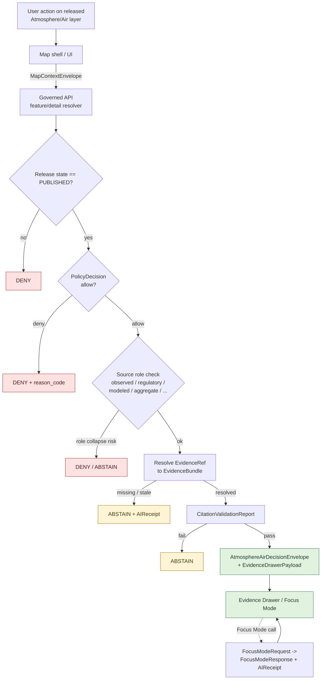

<!-- [KFM_META_BLOCK_V2]
doc_id: kfm://doc/domains/atmosphere/api-contracts
title: Atmosphere/Air — API & Contract Surfaces
type: standard
version: v1-draft
status: draft
owners: [TODO — Atmosphere/Air domain steward, API steward, Docs steward]
created: 2026-05-15
updated: 2026-05-15
policy_label: public
related:
  - docs/doctrine/directory-rules.md
  - docs/doctrine/trust-membrane.md
  - docs/architecture/contract-schema-policy-split.md
  - docs/domains/atmosphere/README.md
  - schemas/contracts/v1/air/
  - contracts/air/
tags: [kfm, domain, atmosphere, air, api, contracts, governed-api]
notes:
  - Repo not mounted in this session; all repo-shaped claims are PROPOSED.
  - Folder-name asymmetry: docs/domains/atmosphere/ vs schemas/contracts/v1/air/ — see §2.
[/KFM_META_BLOCK_V2] -->

# Atmosphere/Air — API & Contract Surfaces

> Governed API, DTO, and schema surfaces for the Atmosphere/Air domain — what shapes go out, what outcomes are finite, and what the trust membrane forbids.

<p align="left">
  
  
  
  
  
  
  
</p>

| | |
|---|---|
| **Status** | `draft` — section content based on project doctrine; implementation maturity not asserted |
| **Owners** | `TODO` — Atmosphere/Air domain steward · API steward · Docs steward |
| **Last updated** | 2026-05-15 |
| **Authority of this doc** | PROPOSED — supplements the domain README; not a substitute for `schemas/contracts/v1/`, `contracts/`, `policy/`, or accepted ADRs |
| **Repo evidence basis** | Doctrine only — repository not mounted in this session |

---

## 📑 Contents

1. [Purpose](#1-purpose)
2. [Repo fit and scope](#2-repo-fit-and-scope)
3. [Trust-membrane preamble](#3-trustmembrane-preamble)
4. [Atmosphere/Air API surface catalog](#4-atmosphereair-api-surface-catalog)
5. [Finite-outcome envelope semantics](#5-finiteoutcome-envelope-semantics)
6. [Request/response DTO and schema families](#6-requestresponse-dto-and-schema-families)
7. [Source-role anti-collapse (acute for this domain)](#7-sourcerole-anticollapse-acute-for-this-domain)
8. [Cross-lane interactions](#8-crosslane-interactions)
9. [Validators, tests, and fixtures](#9-validators-tests-and-fixtures)
10. [Governed AI behavior on this domain](#10-governed-ai-behavior-on-this-domain)
11. [End-to-end governed flow (diagram)](#11-endtoend-governed-flow-diagram)
12. [Open questions and verification backlog](#12-open-questions-and-verification-backlog)
13. [Related docs](#13-related-docs)

---

## 1. Purpose

This document is the **API and contract surface map** for the Atmosphere/Air domain inside the Kansas Frontier Matrix (KFM) trust membrane. It enumerates which governed API surfaces serve Atmosphere/Air content, which DTO and schema families they exchange, which finite outcomes they can return, and which DENY conditions are acute for this domain.

It is a **navigational reference**, not authority. The canonical sources for any shape, outcome, or policy decision remain `schemas/contracts/v1/...`, `contracts/...`, and accepted ADRs. Where this doc and a canonical source disagree, the canonical source wins and the disagreement is recorded in the drift register, not silently absorbed here.

> [!IMPORTANT]
> **Doctrine is CONFIRMED; implementation is PROPOSED.** The contract families and finite outcomes described below come from project doctrine (the Encyclopedia, the Domains Culmination Atlas v1.1, and Directory Rules). The repository was not mounted during the drafting of this file. Every implementation-shaped claim — exact routes, exact schema files, exact field names, exact test coverage — is PROPOSED until verified against mounted-repo evidence.

---

## 2. Repo fit and scope

### 2.1 This doc's home

| Aspect | Value |
|---|---|
| Path of this doc | `docs/domains/atmosphere/API_CONTRACTS.md` (as requested) |
| Responsibility root | `docs/` — domain-segment under `docs/domains/` per Directory Rules §12 |
| Domain segment (docs) | `atmosphere` |
| Domain segment (schemas/contracts) | `air` (PROPOSED, per Atlas v1.1 §24.13 row 11) |
| Sibling docs in this folder | `docs/domains/atmosphere/README.md` (PROPOSED), other domain docs as added |
| Parent doctrine | Directory Rules §12 (Domain Placement Law); Atlas v1.0 Ch. 11; Encyclopedia §11/§J |

> [!NOTE]
> **Folder-name asymmetry.** The Atlas v1.1 crosswalk maps Atmosphere/Air to `schemas/contracts/v1/air/` and `contracts/air/`, while doc-side conventions in this repo use `docs/domains/atmosphere/`. The Encyclopedia also proposes `docs/domains/atmosphere-air-and-climate/` in places. These three forms (`atmosphere`, `air`, `atmosphere-air-and-climate`) are PROPOSED domain segments. An ADR (or a Drift Register entry under `docs/registers/DRIFT_REGISTER.md`) should reconcile them before any of the three hardens into authority. This doc uses `atmosphere` for the docs path as supplied by the request.

### 2.2 What this doc covers

- Governed API surfaces that emit or accept Atmosphere/Air payloads.
- DTO and schema families exchanged across those surfaces.
- Finite outcome semantics (ANSWER / ABSTAIN / DENY / ERROR, plus HOLD / PASS / FAIL where validator-class).
- Source-role anti-collapse rules that are particularly acute here.
- Cross-lane interactions with Hazards, Hydrology, Agriculture, and biodiversity domains.
- Validator and test obligations tied to these surfaces.

### 2.3 What this doc does **not** cover

- Domain identity, ubiquitous language, object families, or sensitivity posture in narrative form — those live in `docs/domains/atmosphere/README.md` (PROPOSED) and the Encyclopedia §11.
- Canonical JSON Schema files — those live under `schemas/contracts/v1/air/...` (PROPOSED home).
- Canonical contract semantics in Markdown — those live under `contracts/air/...` (PROPOSED home).
- Policy bundles — those live under `policy/domains/air/...` or `policy/release/air/...` (PROPOSED).
- Release manifests, rollback cards, correction notices — those live under `release/...`.
- Pipeline definitions — `pipelines/domains/air/...` and `pipeline_specs/air/...` (PROPOSED).

[⬆ Back to top](#contents)

---

## 3. Trust-membrane preamble

Atmosphere/Air API surfaces sit **inside the KFM trust membrane**. They are not pass-through wrappers around upstream sensor APIs, model fields, or regulatory archives. Every public-shaped surface obeys the governed flow:

> released layer → user action → governed API → policy + source-role + release-state check → `EvidenceBundle` resolution → finite outcome (ANSWER / ABSTAIN / DENY / ERROR) → Evidence Drawer / Focus Mode

Atmosphere/Air **inherits** the universal trust-membrane invariants and adds domain-specific guardrails on top.

### 3.1 Inherited invariants (CONFIRMED doctrine)

| Invariant | What it forbids on Atmosphere/Air surfaces |
|---|---|
| No public RAW path | Public clients MUST NOT reach RAW / WORK / QUARANTINE Atmosphere/Air payloads. |
| No direct model client | Atmosphere/Air model fields (CAMS, HRRR-Smoke, etc.) MUST NOT be served as observations or as direct model outputs to public clients. They flow through `EvidenceBundle` with model identity and `RunReceipt` attached. |
| No canonical/internal client fetch | Map shells, UI components, and external integrators MUST NOT fetch canonical Atmosphere/Air stores; they consume released artifacts and governed APIs only. |
| No unreleased tile load | Atmosphere/Air tile artifacts (PMTiles, COG, MVT) load only when `LayerManifest`, `TileArtifactManifest`, `MapReleaseManifest`, `PolicyDecision`, and release status allow it. |
| No uncited export | Atmosphere/Air screenshots, exports, Focus Mode summaries, and badges carry citations, evidence IDs, version locks, and release manifest references. |
| Cite-or-abstain | When evidence is insufficient or citations cannot be validated, the surface MUST `ABSTAIN` — it MUST NOT fall back to generated prose. |

### 3.2 Atmosphere/Air–specific guardrails (CONFIRMED / PROPOSED)

- **AQI is not concentration.** Public AQI reports MUST NOT be served, joined, or summarized as raw concentration values, and vice versa.
- **AOD is not PM2.5.** Aerosol optical depth rasters MUST carry their own source-role and citation; they MUST NOT be served as ground-level particulate observations.
- **Model fields are not observations.** HRRR-Smoke, CAMS, ECMWF-family, and similar outputs carry `role_model_run_ref` and SHOULD render with model identity and uncertainty surfaced; they MUST NOT be relabeled as observed.
- **Low-cost sensors require caveats.** Public release of low-cost sensor data requires correction, caveats, confidence bounds, and limitations; release without these is a DENY.
- **KFM is never an alert authority.** Atmosphere/Air surfaces MUST NOT substitute for NWS, EPA, or other authoritative real-time alerting; emergency-alerting replacement is a DENY at the AI surface and a HOLD or DENY at publication where the framing implies alert authority.

[⬆ Back to top](#contents)

---

## 4. Atmosphere/Air API surface catalog

The catalog below restates the J-section of the Domains Culmination Atlas Ch. 11 (Atmosphere/Air) and aligns it with the master API surface table at Atlas §20.3. Every row is **PROPOSED implementation**; exact routes, route prefixes, and adapter names are UNKNOWN until verified against the mounted repo.

### 4.1 Per-domain surfaces (from Atlas Ch. 11 §J)

| # | Surface | DTO / schema family | Finite outcomes | Status |
|---|---|---|---|---|
| A1 | Atmosphere/Air feature/detail resolver — route TBD | `AtmosphereAirDecisionEnvelope` | ANSWER / ABSTAIN / DENY / ERROR | PROPOSED governed API surface; exact route UNKNOWN |
| A2 | Atmosphere/Air layer manifest resolver | `LayerManifest` / domain layer descriptor | ANSWER / DENY / ERROR | PROPOSED; public-safe release only |
| A3 | Atmosphere/Air Evidence Drawer payload | `EvidenceDrawerPayload` + `EvidenceBundle` projection | ANSWER / ABSTAIN / DENY / ERROR | PROPOSED; evidence- and policy-filtered |
| A4 | Atmosphere/Air Focus Mode answer | `RuntimeResponseEnvelope` + `AIReceipt` | ANSWER / ABSTAIN / DENY / ERROR | PROPOSED; AI is never root truth |
| A5 | Schema responsibility root | `schemas/contracts/v1/air/...` | finite validator outcomes (PASS / FAIL) | PROPOSED; verify against Directory Rules §7.4 and ADR-0001 |

### 4.2 Universal surfaces that also serve Atmosphere/Air (from Encyclopedia §J and Atlas §20.3)

These surfaces are domain-agnostic governed APIs; Atmosphere/Air is one of the domains they serve. Proposed shapes only — exact routes UNKNOWN.

| # | Surface | Proposed route shape | DTO / schema | Finite outcomes | Status |
|---|---|---|---|---|---|
| U1 | Domain feature lookup | `GET /api/v1/domains/{domain}/features/{id}` | `FeatureDTO` + `EvidenceRef` list | ANSWER / ABSTAIN / DENY / ERROR | PROPOSED |
| U2 | Evidence resolver | `GET /api/v1/evidence/{evidence_ref}` | `EvidenceBundle` | ANSWER / DENY / ERROR | PROPOSED |
| U3 | Layer manifest resolver | `GET /api/v1/layers/{layer_id}/manifest` | `LayerManifest` | ANSWER / DENY / ERROR | PROPOSED |
| U4 | Correction submit | `POST /api/v1/corrections` | `CorrectionNoticeCandidate` | ACCEPTED / DENY / ERROR | PROPOSED |
| U5 | Review decision | `POST /api/v1/review/{queue}/{id}/decision` | `ReviewRecord` | ALLOW / RESTRICT / DENY / ERROR | PROPOSED |
| U6 | Focus Mode runtime | route TBD | `RuntimeResponseEnvelope` + `AIReceipt` | ANSWER / ABSTAIN / DENY / ERROR | PROPOSED |

> [!NOTE]
> Route prefixes (`/api/v1/...`), domain segment naming (`atmosphere` vs `air`), and content-type negotiation are NOT asserted as repo facts. They are PROPOSED shapes pending verification.

[⬆ Back to top](#contents)

---

## 5. Finite-outcome envelope semantics

Every governed API surface above MUST return a finite outcome from a small, well-known set. The semantics are domain-agnostic and inherited from Atlas v1.1 §24.3; this section summarizes them as they apply to Atmosphere/Air.

### 5.1 Outcome classes

| Outcome | When (CONFIRMED doctrine) | Required artifacts | Public-surface effect on Atmosphere/Air |
|---|---|---|---|
| **ANSWER** | Evidence is sufficient; policy permits; release state allows; review state recorded where required. | `EvidenceBundle` resolved; `PolicyDecision = allow`; `ReleaseManifest` applies. | Substantive answer with Evidence Drawer payload and citation. |
| **ABSTAIN** | Evidence is insufficient or stale; citations cannot be validated; source roles conflict (e.g., requested observation but only modeled field available); temporal scope insufficient. | `AIReceipt` with reason; no claim emitted. | Non-substantive response with reason; never invents a value or a citation. |
| **DENY** | Policy, rights, sensitivity, or release state forbids the answer. Includes source-role-collapse attempts (§7). | `PolicyDecision = deny` + `reason_code`; `AIReceipt` records denial. | Denial reason returned; alternative non-restricted surface offered where possible. |
| **ERROR** | Governed API cannot evaluate — missing schema, malformed query, contract violation, infrastructure failure. | Error envelope with diagnostic code; no claim leakage. | Finite, actionable error; never silently routed to a different lane. |
| **HOLD** | Promotion / release / correction is paused pending steward, rights-holder, or policy review. | `ReviewRecord` pending; `PolicyDecision = hold`; no public claim emitted while held. | Surface remains in prior state; no silent rollback or replacement. |
| **PASS** *(validator-class)* | Admission or validation completed; input acceptable. | `ValidationReport` pass. | Internal only; does not directly emit a public answer. |
| **FAIL** *(validator-class)* | Admission or validation completed; input unacceptable. | `ValidationReport` with failure list. | Promotion blocked; quarantine where appropriate. |

### 5.2 Outcome × surface mapping (Atmosphere/Air)

| Surface | Allowed outcomes | Forbidden outcomes / behavior |
|---|---|---|
| Feature/detail resolver (A1, U1) | ANSWER / ABSTAIN / DENY / ERROR | Returning unreleased Atmosphere/Air candidates as ANSWER; exposing internal store identifiers; returning raw source bytes. |
| Layer manifest resolver (A2, U3) | ANSWER / DENY / ERROR | Returning an Atmosphere/Air layer that lacks a `ReleaseManifest`; serving WORK or CATALOG layers to public clients. |
| Evidence Drawer payload (A3) | ANSWER / ABSTAIN / DENY / ERROR | Returning an `EvidenceDrawerPayload` whose underlying `EvidenceBundle` is missing, stale, or restricted, without ABSTAIN/DENY framing. |
| Evidence resolver (U2) | ANSWER / DENY / ERROR | Returning a partial bundle without DENY when policy restricts it. |
| Focus Mode (A4, U6) | ANSWER / ABSTAIN / DENY / ERROR | Returning uncited prose; substituting generated text for `EvidenceBundle`; bypassing `AIReceipt`. |
| Correction submit (U4) | ACCEPTED / DENY / ERROR | Silently editing a published Atmosphere/Air record; bypassing `CorrectionNotice` creation. |
| Review decision (U5) | ALLOW / RESTRICT / DENY / ERROR | Author approving own release on a release-significant lane (separation-of-duties violation). |

[⬆ Back to top](#contents)

---

## 6. Request/response DTO and schema families

The DTO families below are **PROPOSED field-intent summaries**. They do not claim existing repo files. Canonical shape lives (PROPOSED home) under `schemas/contracts/v1/...`; canonical meaning under `contracts/...`.

### 6.1 `AtmosphereAirDecisionEnvelope` (PROPOSED)

Domain-specific decision envelope emitted by the feature/detail resolver (A1). PROPOSED to be a typed alias or composition over the universal `DecisionEnvelope` family, carrying:

| Field intent | Purpose | Status |
|---|---|---|
| `outcome` | One of ANSWER / ABSTAIN / DENY / ERROR. | PROPOSED |
| `feature_id` | Atmosphere/Air feature identifier (e.g., AirStation, AODRaster cell, AirObservation reading). | PROPOSED |
| `source_role` | Required role tag: `observed` / `regulatory` / `modeled` / `aggregate` / `administrative` / `candidate` / `synthetic`. Set at admission; never upgraded. | CONFIRMED doctrine / PROPOSED field |
| `evidence_refs` | Resolvable references to `EvidenceBundle`(s) supporting the feature. | PROPOSED |
| `temporal_scope` | Source / observed / valid / retrieval / release / correction times preserved distinctly where material. | CONFIRMED doctrine / PROPOSED fields |
| `policy_decision` | `PolicyDecision` allow / deny / restrict / abstain with reason codes. | PROPOSED |
| `release_state` | `PUBLISHED` is the only state from which the governed API may emit ANSWER. | CONFIRMED doctrine |
| `citation_validation` | Pass / fail from `CitationValidationReport`. | PROPOSED |
| `obligations` | Redactions, generalizations, public-safe transforms recorded on the bundle. | PROPOSED |
| `limitations` | Domain-specific limitations (e.g., "low-cost sensor — uncalibrated"; "AOD ≠ PM2.5"). | CONFIRMED doctrine / PROPOSED field |

### 6.2 Layer manifest family (A2, U3)

PROPOSED schema home: `schemas/contracts/v1/map/layer_manifest.schema.json`. Field intent (CONFIRMED doctrine for the universal shape):

```text
layer_id, title, geometry_type, source_id, source_layer,
evidence_ref_field, temporal_fields, policy_label, release_state
```

Atmosphere/Air-specific layer manifests are expected to declare layer class — observed sensor layer / public AQI report layer / regulatory archive layer / low-cost sensor caveat layer / model-field layer / remote-sensing mask layer / climate-anomaly context / derived fusion layer / advisory layer — so the source-role guard at the renderer side can fail closed on mismatches. PROPOSED.

### 6.3 Evidence Drawer payload (A3)

PROPOSED schema home: `schemas/contracts/v1/ui/evidence_drawer_payload.schema.json`. Field intent (CONFIRMED doctrine for the universal shape):

```text
feature_id, layer_id, evidence_bundle_refs, source summary,
citations, policy state, release state, limitations
```

For Atmosphere/Air, the payload SHOULD carry the source-role tag, the limitations string set, and (where applicable) a low-cost-sensor caveat banner identifier. PROPOSED.

### 6.4 `EvidenceBundle` (universal, applies to A3 / U2)

PROPOSED schema home: `schemas/contracts/v1/evidence/evidence_bundle.schema.json`. CONFIRMED doctrine for the field set:

```text
bundle_id, source_refs, claims, citations, spec_hash,
rights_status, sensitivity, limitations, receipts
```

The `EvidenceBundle` is **the truth-bearing object** for any Atmosphere/Air answer. AI text, generated summaries, map tiles, and graph projections are **derivative** of it. When `EvidenceBundle` and a generated string disagree, the bundle wins and the surface ABSTAINS or re-cites.

### 6.5 Focus Mode envelope (A4, U6)

PROPOSED schema homes (CONFIRMED doctrine for the universal shapes):

| DTO | Proposed home | Field intent |
|---|---|---|
| `FocusModeRequest` | `schemas/contracts/v1/ai/focus_mode_request.schema.json` | `question, map_context_envelope, evidence_refs, policy_context, user_role` |
| `FocusModeResponse` | `schemas/contracts/v1/ai/focus_mode_response.schema.json` | `outcome, answer, citations, abstain_reason, deny_reason, evidence_used, policy_decisions, ai_receipt_id` |
| `AIReceipt` | `schemas/contracts/v1/ai/ai_receipt.schema.json` | `receipt_id, model_provider, model_id, context_hash, evidence_ids, citation_report_id, policy_ids, runtime, outcome` |

`AIReceipt` is **mandatory** for every Focus Mode call on this domain, including ABSTAIN and DENY. `AIReceipt` does not store private chain-of-thought; it records the audit trail of model execution.

<details>
<summary>📦 Illustrative <code>AtmosphereAirDecisionEnvelope</code> response shape (PROPOSED, not a contract)</summary>

```json
{
  "object_type": "AtmosphereAirDecisionEnvelope",
  "schema_version": "v1",
  "outcome": "ANSWER",
  "feature_id": "air-station:US-KS-EXAMPLE:2026-05-15T12:00Z",
  "source_role": "observed",
  "evidence_refs": [
    "evidence://air/aqs/US-KS-EXAMPLE/2026-05-15"
  ],
  "temporal_scope": {
    "source_time": "2026-05-15T12:00Z",
    "observed_time": "2026-05-15T11:55Z",
    "valid_time": "2026-05-15T12:00Z",
    "retrieval_time": "2026-05-15T12:03Z",
    "release_time": "2026-05-15T12:30Z"
  },
  "policy_decision": {
    "outcome": "allow",
    "reason_codes": []
  },
  "release_state": "PUBLISHED",
  "citation_validation": {
    "verdict": "pass",
    "missing": [],
    "unsupported": []
  },
  "obligations": {
    "redactions": [],
    "generalizations": []
  },
  "limitations": [
    "PM2.5 hourly observation; not an AQI value; not a forecast."
  ]
}
```

**Illustrative only.** The actual envelope shape, field names, value vocabularies, and identifier schemes are governed by `schemas/contracts/v1/` and accepted ADRs, not by this example. NEEDS VERIFICATION against the mounted repo.

</details>

[⬆ Back to top](#contents)

---

## 7. Source-role anti-collapse (acute for this domain)

The Atlas v1.1 crosswalk (§24.13, row 11) calls out Atmosphere/Air as having an **acute** source-role anti-collapse problem. This domain routinely surfaces observed sensor readings, regulatory determinations (AQI reports, non-attainment rulings), modeled fields (HRRR-Smoke, CAMS), and aggregate publications (climate normals, decadal averages) **side by side** on the same map. Collapsing them is a primary trust failure mode here.

### 7.1 Source-role classes (CONFIRMED doctrine)

| Role | Atmosphere/Air examples | Allowed downstream role |
|---|---|---|
| **observed** | AQS hourly PM2.5 reading; AirNow ground sample; weather-station observation; precipitation gauge reading. | May feed modeled or aggregate products; never relabeled as `regulatory` or `administrative`. |
| **regulatory** | EPA non-attainment ruling; agency-issued AQI report; advisory issuance. | Cite as regulatory context; never labeled `observed` or `modeled`. |
| **modeled** | HRRR-Smoke surface; CAMS / ECMWF-family model field; smoke trajectory model; AODRaster derived product. | Cite with model identity, `RunReceipt`, and uncertainty bounds; never labeled an observation. |
| **aggregate** | Decadal climate normal; annual county average; air-quality summary tables. | Cite with aggregation receipt; never treated as a per-place observation. |
| **administrative** | Network site rosters; station metadata compilations. | Cite as administrative context; never collapsed with observation or regulation. |
| **candidate** | Quarantined connector output; unresolved sensor reading; unmerged duplicate. | May be cited as candidate evidence in WORK / QUARANTINE; MUST NOT appear in PUBLISHED without promotion. |
| **synthetic** | AI-drafted summary of an Atmosphere/Air `EvidenceBundle`; reconstructed historical surface. | Carries Reality Boundary Note and Representation Receipt; never queried as observed reality. |

### 7.2 DENY conditions (Atmosphere/Air-relevant subset)

| Collapse pattern | Denied outcome | Required guardrail |
|---|---|---|
| Modeled product labeled or queried as observed (HRRR-Smoke as ground PM2.5, AODRaster as PM2.5 observation). | **DENY at publication; ABSTAIN at AI surface.** | `RunReceipt` + uncertainty surface + role-preserving DTO field. |
| Regulatory zone (AQI category, non-attainment area) labeled as an observed concentration or an observed event. | **DENY publication of regulatory layer as event evidence.** | Separate regulatory-layer and observed-event lanes; banner in UI. |
| Aggregate (climate normal, decadal average) cited as a per-place truth at a specific station and timestamp. | **DENY join from aggregate cell to single record; ABSTAIN at AI.** | Aggregation receipt; geometry-scope guard; matrix-cell semantics preserved. |
| Candidate Atmosphere/Air record exposed on a public surface. | **DENY at trust membrane; route to QUARANTINE.** | Promotion gate; no PUBLISHED edge to WORK / QUARANTINE. |
| AI-drafted Atmosphere/Air summary presented as the evidence rather than as a synthesis of it. | **DENY publication; ABSTAIN at Focus Mode; `AIReceipt` mandatory.** | Cite-or-abstain rule; `AIReceipt`; release state required. |
| KFM Atmosphere/Air surface framed as an alert / advisory authority. | **DENY at AI surface; HOLD or DENY at publication where framing implies alert authority.** | Out-of-scope guardrail; deferral to NWS / EPA / agency authority. |

> [!CAUTION]
> **Promotion does not upgrade source role.** A modeled field never becomes an observation by being promoted to PUBLISHED. A candidate never becomes a regulatory determination by passing validation. Source role is set at admission (`SourceDescriptor`) and is preserved through every promotion. Corrections produce a new descriptor and a `CorrectionNotice`; they do not edit role in place.

### 7.3 PROPOSED `SourceDescriptor` fields for Atmosphere/Air

PROPOSED schema home: `schemas/contracts/v1/source/source-descriptor.json` (default per Directory Rules §7.4 / ADR-0001). Illustrative subset, NEEDS VERIFICATION against the mounted schema:

| Field | Required when | Notes |
|---|---|---|
| `source_role` | always | enum: `observed` / `regulatory` / `modeled` / `aggregate` / `administrative` / `candidate` / `synthetic` |
| `role_authority` | role ∈ {regulatory, modeled, aggregate} | Issuing body, model identity, or steward identity. |
| `role_aggregation_unit` | `source_role = aggregate` | Geometry-scope token (county, HUC, station-month, decade, etc.). |
| `role_model_run_ref` | `source_role = modeled` | `EvidenceRef → ModelRunReceipt`; pins inputs, parameters, version. |
| `role_synthetic_basis` | `source_role = synthetic` | `{ method, inputs, reality_boundary_note_ref }` |
| `role_candidate_disposition` | `source_role = candidate` | enum: `pending` / `merged` / `rejected` / `quarantined`. |

[⬆ Back to top](#contents)

---

## 8. Cross-lane interactions

Atmosphere/Air content frequently joins with adjacent domains. Every cross-lane relation **preserves ownership, source role, sensitivity, and `EvidenceBundle` support**. The Atmosphere/Air surface does not assert truth that belongs to another domain.

| This domain | Related lane | Relation type | Constraint |
|---|---|---|---|
| Atmosphere/Air | **Hazards** | Smoke, heat/cold, advisory, visibility, fire/emissions context. | Hazards owns emergency / hazard-event truth and life-safety context. KFM is never an alert authority on either side. |
| Atmosphere/Air | **Agriculture** | Heat, smoke, precipitation, vegetation stress. | Aggregate-vs-observation discipline; private-join denial defaults on Agriculture side. |
| Atmosphere/Air | **Hydrology** | Precipitation, drought, flood-weather forcing. | Modeled-vs-observed discipline; regulatory flood designations remain Hydrology's. |
| Atmosphere/Air | **Biodiversity domains** (Habitat, Fauna, Flora) | Phenology, smoke, fire, drought stress. | Cross-lane joins MUST NOT expose sensitive locations from the biodiversity side. |

[⬆ Back to top](#contents)

---

## 9. Validators, tests, and fixtures

The validator and test obligations below are **PROPOSED** (Atlas Ch. 11 §K plus Encyclopedia §K plus Atlas §20.4). Implementation maturity, file presence, and CI wiring are NEEDS VERIFICATION until checked against the mounted repo.

### 9.1 Universal test families (apply to Atmosphere/Air)

| Test family | Required negative case | Expected outcome |
|---|---|---|
| Schema validation | Malformed `AtmosphereAirDecisionEnvelope` / `LayerManifest` / `EvidenceDrawerPayload`. | FAIL / ERROR |
| Source descriptor validation | Missing or malformed `source_role`. | FAIL |
| Rights validation | `rights_status = unknown` on a public surface. | DENY |
| Sensitivity validation | Sensitive lane requested without redaction. | DENY |
| Evidence closure | `EvidenceRef` does not resolve to `EvidenceBundle`. | ABSTAIN / DENY |
| Temporal logic | Source / observed / valid / retrieval / release / correction times collapsed. | FAIL |
| Geometry validity | Invalid geometry on a published Atmosphere/Air layer. | FAIL |
| Policy deny tests | Restricted lane requested without steward review. | DENY |
| Citation validation | Atmosphere/Air answer with missing or unsupported citations. | ABSTAIN |
| Release manifest validation | Layer served without `ReleaseManifest` or with `release_state != PUBLISHED`. | DENY |
| Rollback drill | Atmosphere/Air release without rollback target. | FAIL at release gate |
| No-network fixtures | Atmosphere/Air pipeline reaches the public internet during a build. | FAIL |
| Non-regression | Prior Atmosphere/Air lineage regresses after a release. | FAIL |
| Lifecycle boundary | Public surface references RAW / WORK / QUARANTINE / internal store. | DENY / ERROR |
| Source-role anti-collapse | Regulatory / model / aggregate / admin source used as a different truth class. | DENY |

### 9.2 Atmosphere/Air-specific validator obligations (PROPOSED)

- Knowledge-character registry tests for `AIR_QUALITY_CONTEXT`, `WEATHER_CONTEXT`, `CLIMATE_CONTEXT`, `ALERT_AND_ADVISORY_CONTEXT`, `NETWORK_AND_SITE_CONTEXT`.
- Unit normalization tests (µg/m³, ppb, ppm, mm, °C / °F, m/s vs mph) with role-preserving conversions.
- AQI-as-concentration denial.
- AOD-as-PM2.5 denial.
- Model-as-observed denial (HRRR-Smoke, CAMS, ECMWF-family).
- Low-cost sensor caveat tests (caveat banner present; uncalibrated reading not served as authoritative).
- Dry-run no-live-fetch tests (connector / pipeline runs without reaching public internet).
- Public-safe redaction / generalization where Atmosphere/Air joins sensitive biodiversity or critical-infrastructure data.
- Stale-state handling tests (stale source header triggers ABSTAIN or DENY or stale badge).

> [!TIP]
> **Negative fixtures matter as much as positive fixtures.** A `stale-source` fixture proves the surface ABSTAINS rather than serving a stale value. A `model-as-observed` fixture proves the validator denies the relabel. The trust posture is enforced by failing closed on the bad cases, not by passing on the good ones.

[⬆ Back to top](#contents)

---

## 10. Governed AI behavior on this domain

CONFIRMED doctrine / PROPOSED implementation: AI on Atmosphere/Air surfaces is **interpretive, not authoritative**.

| AI behavior | Rule |
|---|---|
| **Allowed** | Summarize released Atmosphere/Air `EvidenceBundle`s; compare evidence; explain limitations (e.g., low-cost sensor caveats, AOD vs PM2.5); draft steward-review notes; suggest schema / validator improvements. |
| **Required ABSTAIN** | When `EvidenceBundle` is missing, when citations cannot be validated, when source roles conflict, when temporal scope is insufficient, or when the user requests unsupported inference. |
| **Required DENY** | Direct RAW / WORK / QUARANTINE access; sensitive-location exposure (e.g., precise low-population station coords where sensitivity flags require generalization); emergency-alerting replacement; uncited authoritative claims. |
| **Receipt** | Emit `AIReceipt` and `RuntimeResponseEnvelope` with `outcome ∈ {ANSWER, ABSTAIN, DENY, ERROR}`, `evidence_refs`, `policy_decision`, and `citation_validation`. |
| **Never** | Substitute generated language for `EvidenceBundle`; invent provenance; alter the governance posture of a feature; act as an alert authority. |

[⬆ Back to top](#contents)

---

## 11. End-to-end governed flow (diagram)

The diagram below summarizes how a click on an Atmosphere/Air layer flows through the governed API to a finite outcome. The shape is shared across KFM domains; the Atmosphere/Air specifics live in the policy and source-role checks.



> [!NOTE]
> **NEEDS VERIFICATION.** The exact step names, the placement of the citation check, the relationship between the feature resolver and the Evidence Drawer payload generator, and the wiring of Focus Mode to `AIReceipt` reflect doctrine, not mounted-repo evidence. Treat the diagram as a doctrinal flow, not as a route map.

[⬆ Back to top](#contents)

---

## 12. Open questions and verification backlog

| # | Item to verify | Evidence that would settle it | Status |
|---|---|---|---|
| Q1 | Canonical docs-side domain segment: `atmosphere` vs `air` vs `atmosphere-air-and-climate`. | Mounted-repo `docs/domains/` tree + ADR or Drift Register entry. | NEEDS VERIFICATION |
| Q2 | Schema-side domain segment: `schemas/contracts/v1/air/` vs `schemas/contracts/v1/atmosphere/`. | Mounted repo + ADR-0001 conformance check. | NEEDS VERIFICATION |
| Q3 | Existence and shape of `AtmosphereAirDecisionEnvelope` (typed alias vs composition over universal `DecisionEnvelope`). | Mounted schema file + contract Markdown + tests. | UNKNOWN |
| Q4 | Exact governed-API routes for feature, evidence, layer manifest, correction, review on this domain. | Mounted `apps/governed-api/src/routes/*` (path PROPOSED per the Whole-UI Expansion Report). | UNKNOWN |
| Q5 | `SourceDescriptor` field set: presence of `role_authority`, `role_aggregation_unit`, `role_model_run_ref`, etc., in the mounted schema. | `schemas/contracts/v1/source/source-descriptor.json`. | NEEDS VERIFICATION |
| Q6 | Atmosphere/Air-specific layer-class enumeration in `LayerManifest`. | Mounted layer manifest schema + Atmosphere/Air layer registry. | NEEDS VERIFICATION |
| Q7 | Validator coverage of AQI-as-concentration, AOD-as-PM2.5, and model-as-observed denials. | `tests/domains/air/*` or `tests/domains/atmosphere/*`. | NEEDS VERIFICATION |
| Q8 | Policy bundle home: `policy/domains/air/` vs `policy/domains/atmosphere/`. | Mounted `policy/` tree + ADR. | NEEDS VERIFICATION |
| Q9 | Release-significance separation-of-duties rules for Atmosphere/Air (which release lanes require a non-author reviewer). | Release policy + ADR + ReviewRecord schema. | NEEDS VERIFICATION |
| Q10 | Rollback drill coverage for Atmosphere/Air releases. | Release manifest history + rollback fixtures. | NEEDS VERIFICATION |

[⬆ Back to top](#contents)

---

## 13. Related docs

> Placeholder links — verify paths against mounted repo before merging.

- [Directory Rules](../../doctrine/directory-rules.md) — Domain Placement Law (§12), schema-home rule (§7.4).
- [Trust Membrane](../../doctrine/trust-membrane.md) — `TODO` verify path.
- [Lifecycle Law](../../doctrine/lifecycle-law.md) — RAW → PUBLISHED governed transitions; `TODO` verify path.
- [Contract / Schema / Policy Split](../../architecture/contract-schema-policy-split.md) — `TODO` verify path.
- [Atmosphere/Air domain README](./README.md) — `TODO` create or link.
- [Atmosphere/Air sensitivity & rights posture](./SENSITIVITY.md) — `TODO`.
- [Atmosphere/Air pipeline shape (RAW → PUBLISHED)](./PIPELINE.md) — `TODO`.
- [Hazards domain — cross-lane interactions](../hazards/README.md) — `TODO`.
- [Hydrology domain — cross-lane interactions](../hydrology/README.md) — `TODO`.
- [Agriculture domain — cross-lane interactions](../agriculture/README.md) — `TODO`.
- [Master API Surface Table (Atlas §20.3)](../../atlas/master-api-surface.md) — `TODO`.
- [Master Source-Role Anti-Collapse Register (Atlas §24.1)](../../atlas/source-role-anti-collapse.md) — `TODO`.
- [Master Decision Outcome Envelope Reference (Atlas §24.3)](../../atlas/decision-outcome-envelope.md) — `TODO`.

---

<sub>Atmosphere/Air — API & Contract Surfaces · status `draft` · version `v1-draft` · last updated 2026-05-15 · authority PROPOSED (verify against mounted repo, accepted ADRs, and `schemas/contracts/v1/`).</sub>

[⬆ Back to top](#contents)
