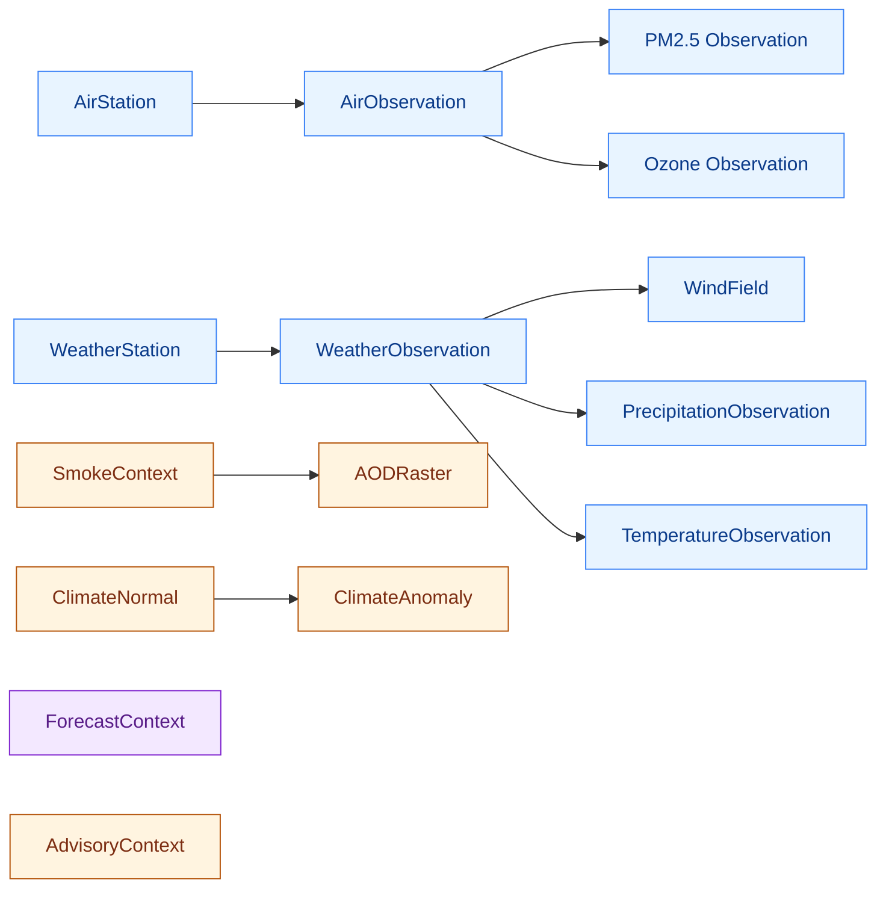
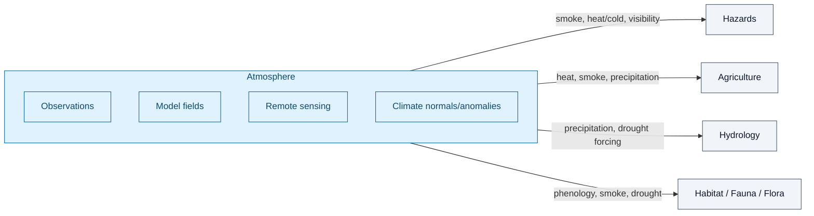
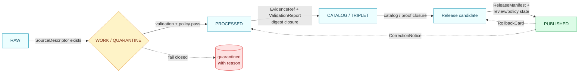
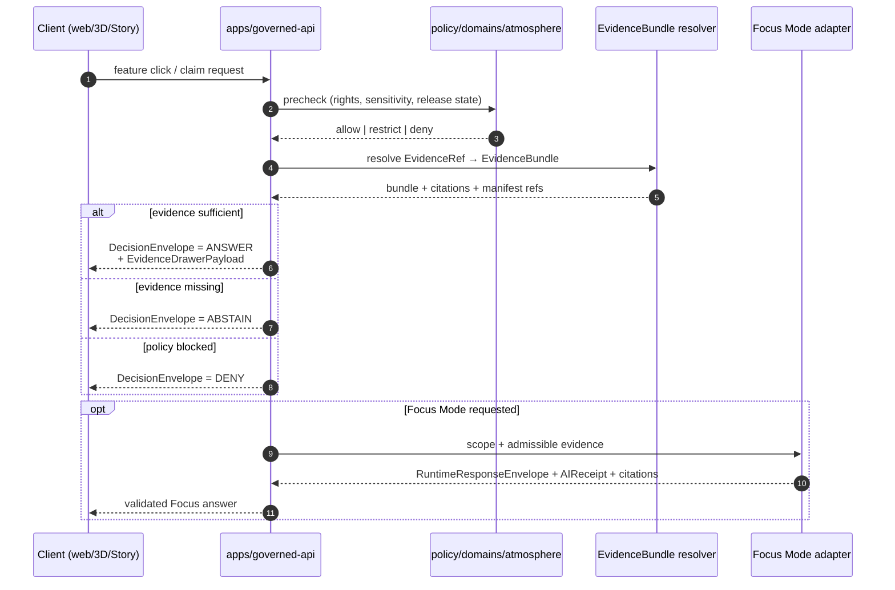

<!-- [KFM_META_BLOCK_V2]
doc_id: kfm://doc/domains-atmosphere-architecture
title: Atmosphere — Domain Architecture
type: standard
version: v1
status: draft
owners: <atmosphere-domain-stewards>  # PLACEHOLDER — assign in CODEOWNERS before review
created: 2026-05-15
updated: 2026-05-28
policy_label: public
contract_version: "3.0.0"
related:
  - ai-build-operating-contract.md
  - docs/domains/README.md
  - docs/doctrine/directory-rules.md
  - docs/architecture/governed-api.md
  - contracts/domains/atmosphere/
  - schemas/contracts/v1/domains/atmosphere/
  - policy/domains/atmosphere/
  - data/registry/sources/atmosphere/
tags: [kfm, domain, atmosphere, air, climate, weather]
notes:
  - "CONTRACT_VERSION pinned to 3.0.0 per ai-build-operating-contract.md."
  - "Directory Rules cited at v1.3 (current corpus version)."
  - "Implementation paths are PROPOSED until mounted-repo verification."
  - "Domain ownership and source rights still NEEDS VERIFICATION."
[/KFM_META_BLOCK_V2] -->

# Atmosphere — Domain Architecture

> Governed architecture for KFM's Atmosphere, Air, and Climate domain — air observations, AQI reports, regulatory archives, low-cost sensors, model fields, remote-sensing masks, climate normals/anomalies, smoke and weather context, and public-safe products.


<!-- Badge targets are placeholders; replace with Shields.io endpoints once CI, release, and registry surfaces are wired. -->

| Field | Value |
|---|---|
| **Status** | Draft (CONFIRMED doctrine / PROPOSED implementation) |
| **Owners** | `<atmosphere-domain-stewards>` — placeholder; assign in `CODEOWNERS` before review |
| **Operating contract** | `CONTRACT_VERSION = "3.0.0"` — `ai-build-operating-contract.md` |
| **Last reviewed** | 2026-05-28 |
| **Doctrinal anchor** | KFM Domains Culmination Atlas Ch. 11 (Atmosphere/Air); KFM Encyclopedia (Atmosphere/Air/Climate) |
| **Placement** | `docs/domains/atmosphere/ARCHITECTURE.md` (Directory Rules v1.3 §4 Step 3, §12) |

> [!IMPORTANT]
> Every path, schema home, route name, validator, package, and CI workflow named below is **PROPOSED** until verified against a mounted repository. Doctrine in this document is grounded in attached KFM sources; implementation maturity is not claimed. See [Verification backlog](#verification-backlog).

---

## 📑 Quick jump

- [1. Purpose and scope](#1-purpose-and-scope)
- [2. Repo fit](#2-repo-fit)
- [3. Mission and boundary](#3-mission-and-boundary)
- [4. Domain invariants](#4-domain-invariants)
- [5. Ubiquitous language](#5-ubiquitous-language)
- [6. Source families](#6-source-families)
- [7. Object families](#7-object-families)
- [8. Cross-lane relations](#8-cross-lane-relations)
- [9. Pipeline shape (RAW → PUBLISHED)](#9-pipeline-shape-raw--published)
- [10. Trust membrane and governed surfaces](#10-trust-membrane-and-governed-surfaces)
- [11. Domain lanes (placement)](#11-domain-lanes-placement)
- [12. Governed AI behavior](#12-governed-ai-behavior)
- [13. Validators, tests, fixtures](#13-validators-tests-fixtures)
- [14. Publication, correction, rollback](#14-publication-correction-rollback)
- [15. Sensitivity, rights, publication posture](#15-sensitivity-rights-publication-posture)
- [16. What does NOT belong here](#16-what-does-not-belong-here)
- [17. Related docs](#17-related-docs)
- [Verification backlog](#verification-backlog)
- [Appendix A — Full knowledge-character registry](#appendix-a--full-knowledge-character-registry)
- [Appendix B — Full object-family detail](#appendix-b--full-object-family-detail)

---

## 1. Purpose and scope

**CONFIRMED doctrine / PROPOSED implementation.** The Atmosphere domain governs *air observations, AQI reports, regulatory archives, low-cost sensors, model fields, remote-sensing masks, climate/anomaly context, fusion products, meteorological support, advisories, and public-safe products* across Kansas — as evidence-labeled observations, official contexts, or derived products, **not** emergency instructions and **not** life-safety advice.

The domain participates in the KFM trust membrane the same way every other lane does: every public claim resolves through a governed API, against an `EvidenceBundle`, with finite outcomes (`ANSWER` / `ABSTAIN` / `DENY` / `ERROR`), traceable to a `ReleaseManifest` and a rollback target.

> [!NOTE]
> "Atmosphere" here is the directory-lane name from Directory Rules §12 (Domain Placement Law) and the Domain Atlas Ch. 11; the Encyclopedia refers to the same scope as "Atmosphere, Air, and Climate." Both names cover the same bounded context. The exact Encyclopedia section anchor is **NEEDS VERIFICATION** — cite the chapter, not a pinned section number, until confirmed.

[⬆ Back to top](#-quick-jump)

---

## 2. Repo fit

**Doctrinal placement (Directory Rules v1.3 §4 Step 3, §12):** This file lives at `docs/domains/atmosphere/ARCHITECTURE.md`. The atmosphere domain is a *lane* under multiple responsibility roots — it is **not** a root folder. The placement is canonical for `docs/`; sibling lanes appear under `contracts/`, `schemas/`, `policy/`, `tests/`, `fixtures/`, `packages/`, `pipelines/`, `pipeline_specs/`, `data/`, `release/`. See [§11. Domain lanes](#11-domain-lanes-placement).

| Direction | Counterpart | Status |
|---|---|---|
| **Upstream doctrine** | `docs/doctrine/directory-rules.md`, `docs/doctrine/lifecycle-law.md`, `docs/doctrine/trust-membrane.md` | CONFIRMED doctrine; **PROPOSED** path realization |
| **Sibling docs** | `docs/domains/README.md`, `docs/architecture/governed-api.md`, `docs/sources/SOURCE_DESCRIPTOR_STANDARD.md` | **PROPOSED** paths |
| **Cross-domain peers** | `docs/domains/hazards/`, `docs/domains/agriculture/`, `docs/domains/hydrology/`, `docs/domains/{habitat,fauna,flora}/` | **PROPOSED** paths |
| **Contracts** | `contracts/domains/atmosphere/` | **PROPOSED** |
| **Schemas** | `schemas/contracts/v1/domains/atmosphere/` (per ADR-0001 default) | **PROPOSED** |
| **Policy** | `policy/domains/atmosphere/` | **PROPOSED**; `policy/` singular is canonical (ADR-0003, PROPOSED) |
| **Tests / fixtures** | `tests/domains/atmosphere/`, `fixtures/domains/atmosphere/` | **PROPOSED** |
| **Data lanes** | `data/{raw,work,quarantine,processed}/atmosphere/`, `data/catalog/domain/atmosphere/`, `data/published/layers/atmosphere/`, `data/registry/sources/atmosphere/`, `data/rollback/atmosphere/` | **PROPOSED** |
| **Release** | `release/candidates/atmosphere/` | **PROPOSED** |

> [!NOTE]
> **Receipts/proofs vs. release split (Directory Rules v1.3 §8.2, §9.1).** Trust-bearing receipts and proofs live under `data/receipts/...` and `data/proofs/...`; release *decisions* (manifests, correction notices, rollback cards) live under `release/`. Rollback lifecycle material itself lives under `data/rollback/<domain>/`. `artifacts/` is build/docs/qa/temporary only and MUST NOT hold any of these.

[⬆ Back to top](#-quick-jump)

---

## 3. Mission and boundary

### Owned objects

**CONFIRMED scope / PROPOSED field realization.** The Atmosphere domain owns these object families:

`AirStation` · `AirObservation` · `PM2.5 Observation` · `Ozone Observation` · `SmokeContext` · `AODRaster` · `WeatherStation` · `WeatherObservation` · `WindField` · `PrecipitationObservation` · `TemperatureObservation` · `ClimateNormal` · `ClimateAnomaly` · `ForecastContext` · `AdvisoryContext`.

See [§7. Object families](#7-object-families) and [Appendix B](#appendix-b--full-object-family-detail) for the full detail.

### Explicit non-ownership

> [!WARNING]
> **KFM Atmosphere is not an emergency alert system and must not provide life-safety instructions.** Watches, warnings, and advisories appear here *only as context*, with a clear redirect to the issuing authority.

The following are explicitly **not** owned by this domain:

| Concern | Owning lane | Why it sits there |
|---|---|---|
| Hazard event truth and life-safety context | `hazards/` | Hazards owns canonical event identity, declarations, impact areas. |
| Drought indicators as hydrological state | `hydrology/` | Atmosphere may carry climate/anomaly context; hydrologic drought is hydrology's call. |
| Crop and vegetation stress decisions | `agriculture/` | Atmosphere supplies inputs (heat, smoke, precipitation); agriculture interprets. |
| Phenology of taxa | `habitat/`, `fauna/`, `flora/` | Biodiversity lanes own taxon and habitat truth; atmosphere supplies climate/anomaly context. |
| Roads/rail visibility impacts | `roads-rail-trade/` | Transport lane owns network and operational claims. |

[⬆ Back to top](#-quick-jump)

---

## 4. Domain invariants

These four invariants distinguish atmospheric data discipline from generic geospatial data discipline. They are **CONFIRMED doctrine** in the Domain Atlas (Ch. 11 §I, "Sensitivity, rights, and publication posture") and **PROPOSED** as enforcement targets for validators and policy gates ([§13](#13-validators-tests-fixtures)).

> [!CAUTION]
> Each invariant has a corresponding validator that should **DENY** the conflated form before any release. Treat these as hard publication gates. They are also the acute source-role anti-collapse cases the Atlas flags for Atmosphere/Air.

| # | Invariant | Conflation to deny | Validator (PROPOSED) |
|---|---|---|---|
| **I-1** | **AQI is not concentration.** | Releasing AQI buckets as if they were µg/m³ or ppb values. | `aqi-as-concentration-denial` |
| **I-2** | **AOD is not PM2.5.** | Treating satellite Aerosol Optical Depth as a surface concentration. | `aod-as-pm25-denial` |
| **I-3** | **Model fields are not observations.** | Publishing CAMS/HRRR/forecast fields as observed truth. | `model-as-observed-denial` |
| **I-4** | **Low-cost sensors require correction, caveats, confidence, and limitations** before public release. | Releasing raw low-cost sensor readings without calibration context or trust state. | `low-cost-sensor-caveat-tests` |

A fifth, operational invariant rounds out the set:

| # | Invariant | Validator (PROPOSED) |
|---|---|---|
| **I-5** | **Dry-run validation must not perform live fetches** — no upstream API or sensor traffic during CI or validation. | `dryrun-no-live-fetch-tests` |

[⬆ Back to top](#-quick-jump)

---

## 5. Ubiquitous language

**CONFIRMED terms / PROPOSED field realization.** Atmosphere uses *knowledge characters* — typed labels that distinguish the epistemic role of a piece of evidence (an observed sensor reading is not a public AQI report; a regulatory archive entry is not a low-cost sensor reading; a model field is not a remote-sensing mask; etc.). The full set is in [Appendix A](#appendix-a--full-knowledge-character-registry). Highlights:

- **`OBSERVED_SENSOR`** — direct in-situ measurement at a known station.
- **`PUBLIC_AQI_REPORT`** — an authority's already-bucketed public index value; **not** a concentration.
- **`REGULATORY_ARCHIVE`** — finalized agency record (e.g., EPA AQS-like archive).
- **`LOW_COST_SENSOR`** — non-reference-grade observation; carries calibration context.
- **`ATMOSPHERIC_MODEL_FIELD`** — gridded model output (e.g., CAMS, HRRR-Smoke); **not** observed.
- **`REMOTE_SENSING_MASK`** — satellite-derived mask/raster (e.g., HMS smoke, AOD).
- **`CLIMATE_ANOMALY_CONTEXT`** — normals/anomalies as context, not real-time state.
- **`DERIVED_FUSION`** — outputs combining multiple sources; provenance must be intact.
- **`METEOROLOGICAL_CONTEXT`** — wind/precipitation/temperature framing for interpretation.
- **`ALERT_AND_ADVISORY_CONTEXT`** — official-source pointers; never a substitute for the issuing authority.
- **`NETWORK_AND_SITE_CONTEXT`** — station/network metadata: siting, instrument, exposure.

> [!NOTE]
> "Knowledge character" is itself a domain term (CONFIRMED in the Atlas Ch. 11 §C, "Ubiquitous language"). The PROPOSED *knowledge-character registry* will pin these values, their permitted source roles, and their downstream policy behavior. The registry is in the [verification backlog](#verification-backlog).

[⬆ Back to top](#-quick-jump)

---

## 6. Source families

**CONFIRMED candidates / NEEDS VERIFICATION rights.** Each source family below appears in the Domain Atlas Ch. 11 §D and the Encyclopedia. *Source role* assignments (authority / observation / context / model) must be recorded in a `SourceDescriptor` per `docs/sources/SOURCE_DESCRIPTOR_STANDARD.md` (**PROPOSED**) before public promotion. The Atlas records the role string for this domain as *"authority / observation / context / model as source role requires,"* with *rights and current terms NEEDS VERIFICATION; sensitive joins fail closed*.

| Source family | Typical role(s) | Knowledge character | Notes | Status |
|---|---|---|---|---|
| EPA AQS / AirData (archive) | authority · observation | `REGULATORY_ARCHIVE`, `OBSERVED_SENSOR` | Finalized agency record. | NEEDS VERIFICATION (rights, cadence) |
| AirNow / agency reporting | authority · observation | `PUBLIC_AQI_REPORT` | AQI buckets — invariant **I-1** applies. | NEEDS VERIFICATION |
| OpenAQ-like aggregators | observation · context | `OBSERVED_SENSOR` | Aggregator terms vary; redistribution rights gate publication. | NEEDS VERIFICATION |
| NOAA / NWS | authority · context · observation | `METEOROLOGICAL_CONTEXT`, `ALERT_AND_ADVISORY_CONTEXT` | Advisories are context only — invariant boundary with Hazards. | NEEDS VERIFICATION |
| Kansas Mesonet | observation | `OBSERVED_SENSOR`, `NETWORK_AND_SITE_CONTEXT` | Station-level KS meteorology. INFERRED source; confirm against registry. | NEEDS VERIFICATION |
| CAMS / ECMWF-family model fields | model | `ATMOSPHERIC_MODEL_FIELD` | Invariant **I-3** applies. | NEEDS VERIFICATION |
| HRRR-Smoke / NOAA smoke forecast | model | `ATMOSPHERIC_MODEL_FIELD`, `SmokeContext` | Forecast, not observation. | NEEDS VERIFICATION |
| HMS smoke | observation · context | `REMOTE_SENSING_MASK`, `SmokeContext` | Satellite-derived mask. | NEEDS VERIFICATION |
| GOES / ABI AOD | observation · model | `REMOTE_SENSING_MASK`, `AODRaster` | Invariant **I-2** applies. | NEEDS VERIFICATION |
| VIIRS fire / hotspot | observation | `REMOTE_SENSING_MASK` | Cross-lane relation to Hazards. | NEEDS VERIFICATION |
| Climate normals (e.g., NCEI) | context | `CLIMATE_ANOMALY_CONTEXT`, `ClimateNormal` | Reference periods must be cited. INFERRED source; confirm against registry. | NEEDS VERIFICATION |
| Low-cost sensor networks (e.g., PurpleAir-like) | observation | `LOW_COST_SENSOR` | Invariant **I-4** applies. | NEEDS VERIFICATION |

> [!IMPORTANT]
> **Sensitive joins fail closed.** A join that crosses into living-person, infrastructure-precision, or culturally restricted geometry without a redaction/generalization receipt is `DENY` by default.

[⬆ Back to top](#-quick-jump)

---

## 7. Object families

**CONFIRMED scope / PROPOSED field realization.** Full table in [Appendix B](#appendix-b--full-object-family-detail). Identity and temporal handling are uniform across the family:

- **Identity rule (PROPOSED, deterministic):** `source_id` + `object_role` + `temporal_scope` + `normalized_digest`.
- **Temporal handling (CONFIRMED):** source, observed, valid, retrieval, release, and correction times stay **distinct** where material. No collapsing into a single timestamp.

Object family quick map:



> [!NOTE]
> The diagram above shows family lineage, not data flow. Public exposure of any of these objects still flows through the trust membrane (§10), regardless of family. Family/role color-coding is illustrative; an object's actual `source_role` is set at admission per source, not by family.

[⬆ Back to top](#-quick-jump)

---

## 8. Cross-lane relations

**CONFIRMED / PROPOSED.** Atmosphere does not own these adjacent lanes; it *relates* to them. Every relation must preserve ownership, source role, sensitivity, and `EvidenceBundle` support (Atlas Ch. 11 §F).

| This domain | Related lane | Relation | Constraint |
|---|---|---|---|
| Atmosphere | Hazards | smoke, heat/cold, advisory, visibility, fire/emissions context | Preserve ownership; do not republish Hazards events as atmospheric truth. KFM is never an alert authority on either side. |
| Atmosphere | Agriculture | heat, smoke, precipitation, vegetation stress inputs | Pass typed context; agriculture decides interpretation. Aggregate-vs-observation discipline. |
| Atmosphere | Hydrology | precipitation, drought, flood-weather forcing | Hydrology owns hydrologic drought; atmosphere contributes meteorology. |
| Atmosphere | Biodiversity (habitat / fauna / flora) | phenology, smoke, fire, drought stress context | Never expose sensitive species locations; redact at the join. |



[⬆ Back to top](#-quick-jump)

---

## 9. Pipeline shape (RAW → PUBLISHED)

**CONFIRMED doctrine / PROPOSED lane application.** Atmosphere follows the universal KFM lifecycle (Directory Rules v1.3 §9.1, lifecycle law) with promotion as a *governed state transition*, never a file move.



Gate summary (per Atlas Ch. 11 §H, all stage realizations **PROPOSED**):

| Stage | Handling | Gate |
|---|---|---|
| **RAW** | Capture immutable source payload (or reference) with source role, rights, sensitivity, citation, time, hash. | `SourceDescriptor` exists. |
| **WORK / QUARANTINE** | Normalize schema, geometry, time, identity, evidence, rights, policy; hold failures. | Validation + policy pass, **or** quarantine reason recorded. |
| **PROCESSED** | Emit validated normalized objects, receipts, public-safe candidates. | `EvidenceRef`, `ValidationReport`, digest closure exist. |
| **CATALOG / TRIPLET** | Emit catalog records, `EvidenceBundle`s, graph/triplet projections, release candidates. | Catalog/proof closure passes. |
| **PUBLISHED** | Serve released public-safe artifacts through governed APIs and manifests. | `ReleaseManifest`, correction path, rollback target, review/policy state exist. |

> [!TIP]
> Connectors emit into `data/raw/atmosphere/` or `data/quarantine/atmosphere/` only. They do **not** publish (Directory Rules §13.5: *connector-publishes* anti-pattern). Watchers emit receipts and candidate decisions; they do not mutate canonical records (*watcher-as-non-publisher* invariant). A pipeline writing directly from `data/raw/` to `data/published/` is the *lifecycle-skip* anti-pattern (§13.5).

[⬆ Back to top](#-quick-jump)

---

## 10. Trust membrane and governed surfaces

**CONFIRMED doctrine / PROPOSED route names.** The Atmosphere lane crosses the public surface only via governed APIs that return a finite outcome envelope.



PROPOSED governed surfaces for this domain (exact routes UNKNOWN; verify against `apps/governed-api/` once mounted):

| Surface | DTO / schema | Finite outcomes | Status |
|---|---|---|---|
| Atmosphere feature/detail resolver | `AtmosphereAirDecisionEnvelope` | ANSWER / ABSTAIN / DENY / ERROR | **PROPOSED**; route UNKNOWN |
| Atmosphere layer manifest resolver | `LayerManifest` / domain layer descriptor | ANSWER / DENY / ERROR | **PROPOSED**; public-safe release only |
| Atmosphere Evidence Drawer payload | `EvidenceDrawerPayload` + `EvidenceBundle` projection | ANSWER / ABSTAIN / DENY / ERROR | **PROPOSED**; evidence- and policy-filtered |
| Atmosphere Focus Mode answer | `RuntimeResponseEnvelope` + `AIReceipt` | ANSWER / ABSTAIN / DENY / ERROR | **PROPOSED**; AI never root truth |
| Schema responsibility root | `schemas/contracts/v1/domains/atmosphere/` (per ADR-0001 default) | n/a | **PROPOSED**; verify with Directory Rules and ADR |

> [!WARNING]
> **No public RAW path.** Public clients and normal UI surfaces do not fetch RAW, WORK, QUARANTINE, unpublished candidates, direct source services, or canonical/internal stores for atmospheric data. MapLibre and any 3D renderer consume only released, manifest-bound artifacts via the governed API. A public route reading `data/processed/` directly is a trust-membrane anti-pattern (Directory Rules §13.5).

[⬆ Back to top](#-quick-jump)

---

## 11. Domain lanes (placement)

**CONFIRMED doctrine (Directory Rules v1.3 §4 Step 3, §12) / PROPOSED tree.** The atmosphere lane appears as a *segment* under each responsibility root, never as a root. The tree below is the standard domain placement law instantiated for `atmosphere`:

```text
docs/domains/atmosphere/                          # this file lives here
contracts/domains/atmosphere/                     # object meaning (Markdown)
schemas/contracts/v1/domains/atmosphere/          # machine shape (default per ADR-0001)
policy/domains/atmosphere/                        # allow / deny / restrict / abstain
tests/domains/atmosphere/                         # rule enforceability
fixtures/domains/atmosphere/                      # golden / valid / invalid samples
packages/domains/atmosphere/                      # shared atmosphere logic (if any)
pipelines/domains/atmosphere/                     # executable pipeline steps
pipeline_specs/atmosphere/                        # declarative specs
data/raw/atmosphere/                              # immutable source payloads
data/work/atmosphere/                             # in-flight normalization
data/quarantine/atmosphere/                       # failed-validation hold
data/processed/atmosphere/                        # validated normalized objects
data/catalog/domain/atmosphere/                   # catalog records + EvidenceBundles
data/published/layers/atmosphere/                 # released public-safe artifacts
data/registry/sources/atmosphere/                 # SourceDescriptor entries
data/rollback/atmosphere/                         # rollback lifecycle material
release/candidates/atmosphere/                    # release decision artifacts
```

> [!NOTE]
> The above tree is **PROPOSED** as the canonical placement *until mounted-repo inspection confirms it*. Per Directory Rules §4 Step 5, any path that no section justifies is marked **PROPOSED** or **NEEDS VERIFICATION** and tracked in `docs/registers/DRIFT_REGISTER.md` or `docs/registers/VERIFICATION_BACKLOG.md`. Receipts and proofs (process memory and evidence closure) are emitted *alongside* these lanes under `data/receipts/...` and `data/proofs/...`; release *decisions* live under `release/` — not in this domain's data lanes.

Cross-domain artifacts (e.g., a smoke validator that also serves Hazards and Agriculture) live under the **lowest common responsibility root** *without* an `atmosphere/` segment — e.g., `tools/validators/smoke/`, not `tools/validators/domains/atmosphere/smoke/` (Directory Rules, multi-domain / cross-cutting files).

[⬆ Back to top](#-quick-jump)

---

## 12. Governed AI behavior

**CONFIRMED doctrine / PROPOSED implementation.** AI in this domain is *interpretive*, not the root truth source.

| AI may | AI must ABSTAIN when | AI must DENY when |
|---|---|---|
| Summarize released Atmosphere `EvidenceBundle`s | Evidence is insufficient for a claim | Policy, rights, sensitivity, or release state blocks the request |
| Compare evidence across sources (with citations) | Citations fail validation | A request would expose unpublished or quarantined data |
| Explain limitations and uncertainty | Source role is unresolved | A request would conflate AQI with concentration, AOD with PM2.5, or model with observation (invariants I-1 to I-3) |
| Draft steward-review notes | A claim depends on unresolved knowledge character | Sensitive geometry is implicated; or the framing implies alert authority |

> [!IMPORTANT]
> **AI never root truth.** Focus Mode flow: define scope → policy precheck → retrieve admissible released evidence → resolve `EvidenceRef`s to `EvidenceBundle`s → call backend model adapter if allowed → validate citations → policy postcheck → return `RuntimeResponseEnvelope` and `AIReceipt`. No browser-side model call; no direct canonical-store fetch. An `AIReceipt` is mandatory for every Focus Mode call, including ABSTAIN and DENY.

[⬆ Back to top](#-quick-jump)

---

## 13. Validators, tests, fixtures

**PROPOSED.** All entries below are recommended targets; none are claimed to exist in the repo. Names are PROPOSED.

| Validator | Purpose | Invariant |
|---|---|---|
| `knowledge-character-registry-tests` | Pin the knowledge-character enum and its allowed source-role pairings. | §5, §6 |
| `unit-normalization-tests` | Enforce consistent units (µg/m³ vs ppb vs ppm, °C vs °F, m/s vs mph). | I-1 (indirectly) |
| `aqi-as-concentration-denial` | DENY any flow that releases AQI buckets as concentration values. | **I-1** |
| `aod-as-pm25-denial` | DENY any flow that treats AOD as a surface PM2.5 value. | **I-2** |
| `model-as-observed-denial` | DENY any flow that publishes model fields as observations. | **I-3** |
| `low-cost-sensor-caveat-tests` | Require correction, caveat, confidence, and limitation fields before release. | **I-4** |
| `dryrun-no-live-fetch-tests` | Assert no upstream fetches during CI/validation runs. | **I-5** |
| `sensitive-geometry-deny-tests` | DENY public release of restricted-location atmospheric joins. | §15 |
| `freshness-and-stale-state-tests` | Surface stale-state badges; deny stale-as-current claims. | §10 |
| `citation-validation-tests` | Every released claim resolves to citations; AI answers fail closed on missing citations. | §12 |

Fixtures should be **no-network** by default. Co-location windows (e.g., 2–6 weeks for low-cost sensor calibration) appear as validation metadata rather than implicit assumption.

> [!TIP]
> **Negative fixtures matter as much as positive fixtures.** A `model-as-observed` fixture proves the validator denies the relabel; a `stale-source` fixture proves the surface abstains rather than serving a stale value. The trust posture is enforced by failing closed on the bad cases.

[⬆ Back to top](#-quick-jump)

---

## 14. Publication, correction, rollback

**CONFIRMED doctrine / PROPOSED implementation.** Atmosphere publication requires every element of the release closure. Placement follows the Directory Rules v1.3 §8.2 / §9.1 split: process memory and evidence live under `data/`; release *decisions* live under `release/`.

- **`ReleaseManifest`** — the release decision artifact (lives under `release/`, **PROPOSED**).
- **`EvidenceBundle`** — resolved support package (lives under `data/proofs/evidence_bundle/`, **PROPOSED**).
- **Validation + policy support** — `ValidationReport` (`data/proofs/validation_report/`), `PolicyDecision`.
- **Review state where required** — `ReviewRecord` (**PROPOSED**).
- **Correction path** — `CorrectionNotice` (a release decision; lives under `release/`, **PROPOSED**).
- **Stale-state rule** — freshness/badge logic at the trust membrane.
- **Rollback target** — `RollbackCard` (a release decision; lives under `release/`, with rollback lifecycle material under `data/rollback/atmosphere/`, **PROPOSED**).

> [!CAUTION]
> A release without a rollback target is not a release. A correction without a `CorrectionNotice` is not a correction. A "promotion" that is just a file move is not promotion. (Receipts and manifests MUST NOT live in `artifacts/` — Directory Rules §8.2.)

[⬆ Back to top](#-quick-jump)

---

## 15. Sensitivity, rights, publication posture

**CONFIRMED doctrine.** Unclear rights, unresolved source role, missing evidence, unresolved sensitivity, or absent release state **blocks** public promotion. The domain operates under a public-safe-by-default posture.

| Concern | Default posture | Escape valve |
|---|---|---|
| Source rights / redistribution terms | DENY until recorded in `SourceDescriptor` | Steward-approved exception with explicit rights record |
| Living-person / health-adjacent joins | DENY public release; quarantine | Aggregated, de-identified release with review |
| Infrastructure-precision joins (e.g., sensor at private facility) | Redaction or generalization required | Coarsened geometry with transform receipt |
| Culturally sensitive geometry | DENY public release | Cultural/steward review and recorded consent |
| Stale data | Freshness badge + stale-state UI; abstain on staleness-dependent claims | Time-bounded release with explicit `valid_time` |
| Low-cost sensor data | Require correction, caveats, confidence, limitations | Calibration receipt + trust state in payload |

> [!IMPORTANT]
> Generalization, redaction, delay, and denial each produce a recorded transform — not a silent edit. Every transform leaves a `RedactionReceipt` (or equivalent transform receipt) that a `CorrectionNotice` can refer back to.

[⬆ Back to top](#-quick-jump)

---

## 16. What does NOT belong here

- **Life-safety instructions or emergency directives.** Refer to issuing authority; never substitute for it.
- **Hazard event truth.** Belongs in `hazards/`.
- **Direct canonical-store reads from public UI.** Always via the governed API.
- **Raw low-cost sensor payloads exposed as truth.** Calibration, caveat, confidence, and limitations are mandatory before release.
- **AQI rendered as a concentration.** Invariant **I-1** — fail closed.
- **AOD rendered as PM2.5.** Invariant **I-2** — fail closed.
- **Model fields displayed as observations.** Invariant **I-3** — fail closed.
- **Cross-domain truth claims.** Atmosphere supplies context; ownership belongs to the receiving lane.
- **Receipts, proofs, or release manifests in `artifacts/`.** Trust-bearing material lives under `data/` or `release/` (Directory Rules §8.2).
- **Anything written to `data/published/` without a `ReleaseManifest` + rollback target.** Lifecycle skip is an anti-pattern (Directory Rules §13.5).

[⬆ Back to top](#-quick-jump)

---

## 17. Related docs

> [!NOTE]
> All paths below are **PROPOSED** until mounted-repo verification. Resolve links once the corresponding docs land.

- [`ai-build-operating-contract.md`](../../../ai-build-operating-contract.md) — canonical operating contract `CONTRACT_VERSION = "3.0.0"` *(CONFIRMED present in project)*
- [`docs/domains/README.md`](../README.md) — domains landing page *(PROPOSED)*
- [`docs/doctrine/directory-rules.md`](../../doctrine/directory-rules.md) — placement law, v1.3 *(CONFIRMED present in project; PROPOSED in repo path)*
- [`docs/doctrine/lifecycle-law.md`](../../doctrine/lifecycle-law.md) — RAW → PUBLISHED lifecycle *(PROPOSED)*
- [`docs/doctrine/trust-membrane.md`](../../doctrine/trust-membrane.md) — governed surfaces *(PROPOSED)*
- [`docs/architecture/governed-api.md`](../../architecture/governed-api.md) — `apps/governed-api/` architecture *(PROPOSED)*
- [`docs/sources/SOURCE_DESCRIPTOR_STANDARD.md`](../../sources/SOURCE_DESCRIPTOR_STANDARD.md) — `SourceDescriptor` contract *(PROPOSED)*
- [`docs/standards/`](../../standards/) — external standards (STAC, DCAT, PROV, OAI-PMH, ISO-19115, PMTiles, OGC API Tiles) *(some entries CONFIRMED present; remaining PROPOSED)*
- Sibling domains: [`hazards/`](../hazards/) · [`agriculture/`](../agriculture/) · [`hydrology/`](../hydrology/) · [`habitat/`](../habitat/) · [`fauna/`](../fauna/) · [`flora/`](../flora/) *(PROPOSED)*

[⬆ Back to top](#-quick-jump)

---

## Verification backlog

These items are explicitly unresolved by this document and should be tracked in `docs/registers/VERIFICATION_BACKLOG.md` (**PROPOSED**).

| # | Item | Evidence that would settle it | Status |
|---|---|---|---|
| V-1 | Verify source rights and endpoint behavior for each source family in §6. | Mounted repo: `data/registry/sources/atmosphere/*`; license terms; current API surface. | **NEEDS VERIFICATION** |
| V-2 | Implement the knowledge-character registry and its tests. | `schemas/contracts/v1/domains/atmosphere/knowledge_character.schema.json` + fixtures + tests. | **NEEDS VERIFICATION** |
| V-3 | Verify catalog / proof / release closure for at least one Atmosphere thin slice. | A released artifact with full `EvidenceBundle`, `ReleaseManifest`, `RollbackCard`. | **NEEDS VERIFICATION** |
| V-4 | Verify MapLibre / Evidence Drawer / Focus Mode integration for an Atmosphere layer. | E2E test or runtime evidence of click → governed API → drawer payload → optional Focus answer. | **NEEDS VERIFICATION** |
| V-5 | Confirm canonical schema home for this domain (`schemas/contracts/v1/domains/atmosphere/`). | Mounted-repo inspection per ADR-0001 default. | **NEEDS VERIFICATION** |
| V-6 | Confirm `policy/` vs `policies/` canonical home for atmospheric gates. | Mounted-repo inspection + ADR-0003 confirmation (PROPOSED). | **NEEDS VERIFICATION** |
| V-7 | Assign atmosphere domain stewards in CODEOWNERS. | Repo-side `CODEOWNERS` plus governance register entry. | **UNKNOWN** |
| V-8 | Pin the knowledge-character enum values against the Atlas Ch. 11 §C list. | Validator + fixture suite proving exact membership. | **PROPOSED** |
| V-9 | Confirm the Encyclopedia section anchor for Atmosphere/Air/Climate (this doc avoids a pinned §number). | Mounted Encyclopedia table of contents. | **NEEDS VERIFICATION** |
| V-10 | Confirm whether `WeatherStation`/`PrecipitationObservation` casing matches the Atlas (which renders "Weather Station", "Precipitation Observation" with a space). | Mounted contract/schema for the object family. | **NEEDS VERIFICATION** |

[⬆ Back to top](#-quick-jump)

---

## Appendix A — Full knowledge-character registry

<details>
<summary><strong>Expand: knowledge-character registry (PROPOSED, sourced from Atlas Ch. 11 §C)</strong></summary>

> **Status:** CONFIRMED terms / **PROPOSED** field realization. Each entry below is "used inside this domain with meaning constrained by source role, evidence, time, and release state."

| Knowledge character | Definition (intent) | Typical source roles |
|---|---|---|
| `Knowledge character` | Meta-term: typed epistemic role of an atmospheric record. | n/a |
| `OBSERVED_SENSOR` | Direct in-situ measurement at a known station. | observation |
| `PUBLIC_AQI_REPORT` | Authority's bucketed public index value. Not a concentration. | authority |
| `REGULATORY_ARCHIVE` | Finalized agency record (e.g., EPA AQS-like archive). | authority · observation |
| `LOW_COST_SENSOR` | Non-reference-grade observation; carries calibration context. | observation |
| `ATMOSPHERIC_MODEL_FIELD` | Gridded model output (forecast/reanalysis); not observed. | model |
| `REMOTE_SENSING_MASK` | Satellite-derived mask/raster. | observation · model |
| `CLIMATE_ANOMALY_CONTEXT` | Normals/anomalies as context; not real-time. | context |
| `DERIVED_FUSION` | Outputs combining multiple sources; provenance intact. | derived |
| `METEOROLOGICAL_CONTEXT` | Wind/precipitation/temperature framing. | context · observation |
| `ALERT_AND_ADVISORY_CONTEXT` | Pointer to issuing authority advisories. Not life-safety instruction. | context · authority |
| `NETWORK_AND_SITE_CONTEXT` | Station/network metadata: siting, instrument, exposure. | context |

> The `Knowledge character`, `OBSERVED_SENSOR`, `PUBLIC_AQI_REPORT`, `REGULATORY_ARCHIVE`, `LOW_COST_SENSOR`, `ATMOSPHERIC_MODEL_FIELD`, `REMOTE_SENSING_MASK`, `CLIMATE_ANOMALY_CONTEXT`, `DERIVED_FUSION`, `METEOROLOGICAL_CONTEXT`, `ALERT_AND_ADVISORY_CONTEXT`, and `NETWORK_AND_SITE_CONTEXT` terms are CONFIRMED in the Atlas; the source-role pairings in the right column are PROPOSED and are exactly what V-8 must pin.

</details>

[⬆ Back to top](#-quick-jump)

---

## Appendix B — Full object-family detail

<details>
<summary><strong>Expand: object families (PROPOSED field realization)</strong></summary>

> All objects share the same identity rule and temporal-handling rule (see §7). Identity basis is the PROPOSED deterministic form `source id + object role + temporal scope + normalized digest`; the six time facets stay distinct where material (CONFIRMED).

| Object | Purpose | Knowledge character (typical) | Identity basis (PROPOSED) |
|---|---|---|---|
| `AirStation` | A monitoring station identity in the air observation network. | `OBSERVED_SENSOR`, `NETWORK_AND_SITE_CONTEXT` | source id + role + scope + digest |
| `AirObservation` | A measurement event at an `AirStation`. | `OBSERVED_SENSOR` | source id + role + scope + digest |
| `PM2.5 Observation` | PM2.5 reading; never conflated with AQI buckets. | `OBSERVED_SENSOR`, `LOW_COST_SENSOR` (when applicable) | source id + role + scope + digest |
| `Ozone Observation` | Ozone reading. | `OBSERVED_SENSOR` | source id + role + scope + digest |
| `SmokeContext` | Smoke presence / plume context. | `REMOTE_SENSING_MASK`, `ATMOSPHERIC_MODEL_FIELD` | source id + role + scope + digest |
| `AODRaster` | Satellite AOD field. Not a surface concentration (**I-2**). | `REMOTE_SENSING_MASK` | source id + role + scope + digest |
| `Weather Station` | Weather station identity. | `NETWORK_AND_SITE_CONTEXT` | source id + role + scope + digest |
| `Weather Observation` | Measurement event at a `Weather Station`. | `OBSERVED_SENSOR`, `METEOROLOGICAL_CONTEXT` | source id + role + scope + digest |
| `WindField` | Gridded wind product (observed or modeled). | `METEOROLOGICAL_CONTEXT`, `ATMOSPHERIC_MODEL_FIELD` | source id + role + scope + digest |
| `Precipitation Observation` | Precipitation observation. | `OBSERVED_SENSOR`, `METEOROLOGICAL_CONTEXT` | source id + role + scope + digest |
| `Temperature Observation` | Temperature observation. | `OBSERVED_SENSOR`, `METEOROLOGICAL_CONTEXT` | source id + role + scope + digest |
| `Climate Normal` | Reference-period normals. | `CLIMATE_ANOMALY_CONTEXT` | source id + role + scope + digest |
| `Climate Anomaly` | Departure from a `Climate Normal`. | `CLIMATE_ANOMALY_CONTEXT`, `DERIVED_FUSION` | source id + role + scope + digest |
| `Forecast Context` | Forecast model field as context. Not observation (**I-3**). | `ATMOSPHERIC_MODEL_FIELD` | source id + role + scope + digest |
| `Advisory Context` | Authority advisory as context. Not life-safety instruction. | `ALERT_AND_ADVISORY_CONTEXT` | source id + role + scope + digest |

> **Casing note (NEEDS VERIFICATION — V-10):** the Atlas renders several of these with a space (`Weather Station`, `Weather Observation`, `Precipitation Observation`, `Temperature Observation`, `Climate Normal`, `Climate Anomaly`, `Forecast Context`, `Advisory Context`, `PM2.5 Observation`, `Ozone Observation`). The compact forms used in §3 (`WeatherStation`, `PrecipitationObservation`, etc.) are PROPOSED identifier-friendly aliases. The mounted contract/schema is authoritative for the canonical spelling.

> **Temporal handling (CONFIRMED across the family):** source time, observed time, valid time, retrieval time, release time, and correction time stay distinct where material. Collapsing any two of these is a validation failure.

</details>

[⬆ Back to top](#-quick-jump)

---

## Footer

> [!NOTE]
> This document is **draft** and reflects CONFIRMED doctrine from the KFM Domains Culmination Atlas (Ch. 11), the KFM Encyclopedia (Atmosphere/Air/Climate), and Directory Rules v1.3. Implementation depth is **PROPOSED** until mounted-repo evidence is available. Operating contract `CONTRACT_VERSION = "3.0.0"`.

**Related docs:** [`ai-build-operating-contract.md`](../../../ai-build-operating-contract.md) · [`docs/domains/README.md`](../README.md) · [`docs/doctrine/directory-rules.md`](../../doctrine/directory-rules.md) · [`docs/architecture/governed-api.md`](../../architecture/governed-api.md) · sibling domains under [`docs/domains/`](../)

**Last reviewed:** 2026-05-28 · **Next review:** within 6 months (per Directory Rules §15 README contract: docs older than 6 months are flagged for review)

[⬆ Back to top](#-quick-jump)
