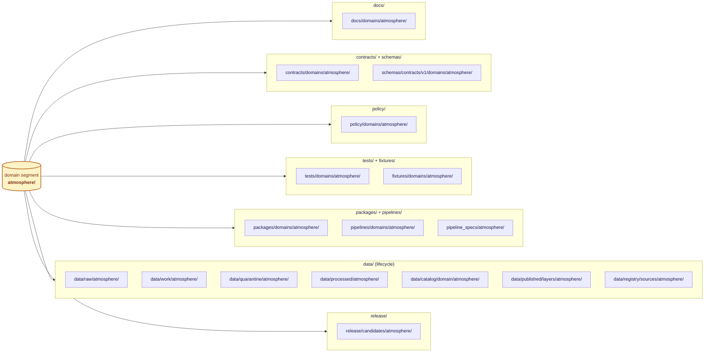

<!-- [KFM_META_BLOCK_V2]
doc_id: kfm://doc/atmosphere-canonical-paths
title: Atmosphere — Canonical Paths
type: standard
version: v1
status: draft
owners: TODO (atmosphere-domain-steward; docs-steward)
created: 2026-05-15
updated: 2026-05-28
policy_label: public
contract_version: "3.0.0"
related:
  - kfm://doc/ai-build-operating-contract
  - kfm://doc/directory-rules
  - kfm://doc/atlas/domains/atmosphere
  - kfm://doc/encyclopedia/atmosphere-air
  - kfm://doc/standards/PROV
  - kfm://doc/standards/ISO-19115
  - kfm://doc/standards/PMTILES
  - kfm://doc/standards/OGC-API-TILES
  - kfm://doc/standards/OAI-PMH
tags: [kfm, atmosphere, air, canonical-paths, directory-rules, domain-placement-law]
notes:
  - CONTRACT_VERSION pinned to 3.0.0 per ai-build-operating-contract.md.
  - Directory Rules cited at v1.3 (current corpus version).
  - All implementation paths are PROPOSED pending mounted-repo verification.
  - Domain segment (`atmosphere/` vs `air/`) is ADR-class — see §2.
[/KFM_META_BLOCK_V2] -->
# Atmosphere — Canonical Paths
> Canonical lane registry for the **Atmosphere / Air** domain — the one place that says where every Atmosphere-related file belongs across every responsibility root, derived from Directory Rules §12 (Domain Placement Law) and Atlas v1.0 Ch. 11. **PROPOSED** until verified against mounted-repo evidence.

  
  
  
  
  
  
  
  

**Status:** `draft` &nbsp;·&nbsp; **Owners:** `TODO (atmosphere-domain-steward; docs-steward)` &nbsp;·&nbsp; **Operating contract:** `CONTRACT_VERSION = "3.0.0"` &nbsp;·&nbsp; **Last reviewed:** `2026-05-28`
---
## Mini-TOC
1. [Purpose](#1-purpose)
2. [Naming and ADR posture](#2-naming-and-adr-posture)
3. [Lane map (visual)](#3-lane-map-visual)
4. [Lane registry — by responsibility root](#4-lane-registry--by-responsibility-root)
5. [Data lifecycle paths](#5-data-lifecycle-paths)
6. [Co-emitted and cross-cutting paths](#6-co-emitted-and-cross-cutting-paths)
7. [What does **not** belong in Atmosphere lanes](#7-what-does-not-belong-in-atmosphere-lanes)
8. [Cross-domain files involving Atmosphere](#8-cross-domain-files-involving-atmosphere)
9. [Path-placement protocol (for reviewers)](#9-path-placement-protocol-for-reviewers)
10. [Object families and their lane homes](#10-object-families-and-their-lane-homes)
11. [Open questions and verification backlog](#11-open-questions-and-verification-backlog)
12. [Changelog](#12-changelog)
13. [Definition of done](#13-definition-of-done)
14. [Related docs](#14-related-docs)
---
## 1. Purpose
This document is the **canonical placement registry** for files belonging to the Atmosphere / Air domain in the Kansas Frontier Matrix monorepo. It exists so that any contributor can answer a single question without re-deriving Directory Rules from scratch:
> *"For an Atmosphere file with responsibility X, where does it go?"*
It does **not** define object meaning (`contracts/`), object shape (`schemas/`), or admissibility decisions (`policy/`, `release/`). Those remain governed by their own canonical roots. This file operationalizes **Directory Rules §12 (Domain Placement Law)** for the single domain `atmosphere`. It is **navigational, not authoritative**: where this registry and Directory Rules disagree, Directory Rules wins and the divergence is logged in `docs/registers/DRIFT_REGISTER.md`.
> [!NOTE]
> Every implementation-layer path on this page is **PROPOSED**. No repository is mounted in the authoring session, so paths are doctrine-grounded plans, not statements of current repo state. Promotion of a path from PROPOSED to CONFIRMED requires mounted-repo evidence and, where applicable, an accepted ADR.
The Atmosphere domain governs *air observations, AQI reports, regulatory archives, low-cost sensors, model fields, remote-sensing masks, climate/anomaly context, fusion products, meteorological support, advisories, and public-safe products* — per Atlas v1.0 Ch. 11 §A (CONFIRMED doctrine / PROPOSED implementation).
[⬆ Back to top](#mini-toc)
---
## 2. Naming and ADR posture
A genuine doctrinal tension exists for the **domain segment** used in canonical paths:
| Source | Segment used | Status |
|---|---|---|
| Directory Rules §12 (Domain Placement Law enumeration) | `atmosphere` | CONFIRMED doctrine |
| Atlas v1.1 §24.13 (Atlas ↔ Dossier ↔ Responsibility-Root Crosswalk) | `air` (e.g., `schemas/contracts/v1/air/`, `contracts/air/`) | PROPOSED in Atlas |
| User-supplied path for this document | `docs/domains/atmosphere/...` | CONFIRMED in this session |
> [!WARNING]
> Directory Rules §2.4(5) treats parallel homes for schemas, contracts, policy, registries, or releases as **ADR-class** changes. The `atmosphere/` vs `air/` segment question therefore requires an ADR before any second segment is created on disk. This document uses **`atmosphere/`** uniformly as the PROPOSED canonical segment, matching Directory Rules §12 and the user-supplied doc path, and treats `air/` as a **drift candidate** unless and until an ADR establishes the inverse. This is consistent with the Atlas's own Chapter 24 authority rule: the crosswalk is navigational, not authoritative.
**PROPOSED ADR:** *"Atmosphere domain segment canonicalization — `atmosphere/` vs `air/`."* This intersects the Atlas Master Open-ADR Backlog (v1.1 §24.12). Until accepted, contributors should:
- Use `atmosphere/` for all new Atmosphere lane paths.
- Log any pre-existing `air/`-segmented paths in `docs/registers/DRIFT_REGISTER.md` (PROPOSED path) rather than silently parallel-evolving them.
- Avoid creating new files under both segments simultaneously.
[⬆ Back to top](#mini-toc)
---
## 3. Lane map (visual)
The diagram below illustrates how a single domain — `atmosphere` — fans out as a **segment** across responsibility roots, **never** as a root itself. This is Directory Rules §12 Domain Placement Law applied to Atmosphere.

> [!NOTE]
> The diagram is **doctrine-grounded** (Directory Rules §12). Whether each lane currently *exists* in the mounted repo is **NEEDS VERIFICATION** until inspected.
[⬆ Back to top](#mini-toc)
---
## 4. Lane registry — by responsibility root
The following lanes are PROPOSED canonical placements for Atmosphere-domain files. Each row carries: responsibility root, lane path, what belongs there, and lane status.
| Responsibility root | Canonical lane (PROPOSED) | What belongs here | Status |
|---|---|---|---|
| `docs/` | `docs/domains/atmosphere/` | Domain README, this CANONICAL_PATHS.md, lane diagrams, contributor notes, ADR pointers, glossary of Atmosphere knowledge characters. | PROPOSED |
| `contracts/` | `contracts/domains/atmosphere/` | Object **meaning** (semantic Markdown) for `AirStation`, `AirObservation`, `PM2.5 Observation`, `Ozone Observation`, `SmokeContext`, `AODRaster`, `Weather Station`, `Weather Observation`, `WindField`, `Precipitation Observation`, `Temperature Observation`, `Climate Normal`, `Climate Anomaly`, `Forecast Context`, `Advisory Context`. | PROPOSED |
| `schemas/` | `schemas/contracts/v1/domains/atmosphere/` | Machine-checkable **shape** (JSON Schema or equivalent) for each Atmosphere object family above; per ADR-0001 this is the canonical schema home (default `schemas/contracts/v1/<...>`). | PROPOSED |
| `policy/` | `policy/domains/atmosphere/` | Atmosphere-specific policy rules — knowledge-character anti-collapse (AQI ≠ concentration, AOD ≠ PM2.5, model ≠ observed), low-cost sensor caveat requirements, source-role gates. `policy/` singular is canonical (ADR-0003, PROPOSED). | PROPOSED |
| `tests/` | `tests/domains/atmosphere/` | Domain conformance tests — knowledge-character registry, unit normalization, AQI-as-concentration denial, AOD-as-PM2.5 denial, model-as-observed denial, low-cost sensor caveat, dry-run no-live-fetch. | PROPOSED |
| `fixtures/` | `fixtures/domains/atmosphere/` | Golden, valid, and invalid sample payloads for the tests above; deterministic and offline. | PROPOSED |
| `packages/` | `packages/domains/atmosphere/` | Shared, reusable Atmosphere-domain libraries used across pipelines, validators, and the governed API; never a single-pipeline helper. | PROPOSED |
| `pipelines/` | `pipelines/domains/atmosphere/` | Executable pipeline logic specific to Atmosphere (ingest orchestration, transforms, EvidenceRef generation). | PROPOSED |
| `pipeline_specs/` | `pipeline_specs/atmosphere/` | Declarative pipeline configuration — what should run, against which `SourceDescriptor`s, with which validators and gates. | PROPOSED |
| `connectors/` | `connectors/atmosphere/<source_id>/` | Source-specific fetcher/admitter packages (e.g., OpenAQ-like, EPA AQS-like, AirNow, CAMS/ECMWF, HRRR-Smoke, HMS smoke, GOES/ABI AOD, VIIRS fire/hotspot). **Connectors emit only to `data/raw/` or `data/quarantine/`** — never to `processed/` or `published/`. Whether connectors carry an `atmosphere/` segment or are top-level (`connectors/openaq/`) is NEEDS VERIFICATION (§11). | PROPOSED |
| `release/` | `release/candidates/atmosphere/` | Atmosphere release-candidate dossiers — the pre-promotion bundle that pairs with a `ReleaseManifest` in `release/manifests/`. | PROPOSED |
> [!IMPORTANT]
> **No new compatibility roots, no parallel authority.** Per Directory Rules §2.4(5) any new home for schemas, contracts, policy, sources, registries, releases, proofs, or receipts requires an ADR. Atmosphere lanes follow the canonical roots in the table above and create **no** parallel `air/` siblings without one.
[⬆ Back to top](#mini-toc)
---
## 5. Data lifecycle paths
`data/` is governed by the lifecycle invariant **RAW → WORK / QUARANTINE → PROCESSED → CATALOG / TRIPLET → PUBLISHED** (Directory Rules §9.1). Promotion is a **governed state transition**, not a file move. The Atmosphere lane fills each phase with an `atmosphere/` segment.
| Phase | Atmosphere lane (PROPOSED) | What lives here | Gate to leave (CONFIRMED doctrine) |
|---|---|---|---|
| `raw/` | `data/raw/atmosphere/<source_id>/<run_id>/` | Immutable source-edge captures with retrieval metadata, checksums, and rights citation. | `SourceDescriptor` exists. |
| `work/` | `data/work/atmosphere/<run_id>/` | Normalized intermediates and candidate assertions. | Validation + policy gate pass. |
| `quarantine/` | `data/quarantine/atmosphere/<reason>/<run_id>/` | Failed validation, unresolved rights/sensitivity, schema drift, or over-precise geometry. | Remediation recorded or terminal hold. |
| `processed/` | `data/processed/atmosphere/<dataset_id>/<version>/` | Validated canonical records with normalized objects, receipts, and public-safe candidates. | `EvidenceRef`, `ValidationReport`, digest closure exist. |
| `catalog/` | `data/catalog/domain/atmosphere/` | Domain catalog records (STAC/DCAT/PROV-aware), `EvidenceBundle` projections, and release-candidate references. | Catalog/proof closure passes. |
| `triplets/` | `data/triplets/graph_deltas/atmosphere/` `data/triplets/exports/atmosphere/` | Relationship/graph projections for Atmosphere claims (derived, not canonical truth). | (Co-emitted; not a promotion phase.) |
| `published/` | `data/published/layers/atmosphere/` `data/published/pmtiles/atmosphere/` `data/published/geoparquet/atmosphere/` `data/published/api_payloads/atmosphere/` | Released **artifacts** — public-safe outputs consumers read through the governed API. | `ReleaseManifest`, correction path, rollback target, review/policy state exist. |
> [!CAUTION]
> The lifecycle invariant is **governance, not storage organization**. A path-level move that bypasses validators, policy gates, EvidenceBundle creation, catalog closure, and release-decision recording is a violation regardless of which directory the bytes ended up in (Directory Rules §9.1).

<b>Atmosphere-specific lifecycle reminders (click to expand)</b>

- **`raw/` MUST NOT** serve any public client or AI surface. RAW Atmosphere payloads are source-edge captures, not browser-visible data.
- **`work/` MUST NOT** carry release aliases; intermediate normalization belongs here only.
- **`quarantine/`** is a holding lane, not a publishable staging area. Sources with unresolved rights (e.g., redistribution terms NEEDS VERIFICATION for OpenAQ-like aggregators, AirNow, CAMS/ECMWF, HRRR-Smoke, HMS, GOES/ABI, VIIRS — per Atlas v1.0 Ch. 11 §D) start here until resolved.
- **`processed/` MUST NOT** be assumed public; promotion to public requires release.
- **`published/` MUST NOT** contain raw, work, quarantine, or exact restricted geometry — only public-safe artifacts that pass Atmosphere knowledge-character anti-collapse rules (AQI ≠ concentration, AOD ≠ PM2.5, model ≠ observed; Atlas v1.0 Ch. 11 §I).

[⬆ Back to top](#mini-toc)
---
## 6. Co-emitted and cross-cutting paths
Receipts, proofs, registry, and rollback are emitted **alongside** lifecycle directories. They do not replace them (Directory Rules §4 Step 2; §9.1 phase-rules table). For Atmosphere:
| Co-emitted lane (PROPOSED) | Contents | Source authority |
|---|---|---|
| `data/receipts/ingest/atmosphere/` | Ingest-side capture and `TransformReceipt`. | Directory Rules §9.1; Atlas §24.2 |
| `data/receipts/validation/atmosphere/` | `ValidationReport` per dataset version. | Atlas v1.0 Ch. 11 §K |
| `data/receipts/pipeline/atmosphere/` | Pipeline run receipts (deterministic). | Directory Rules §9.1 |
| `data/receipts/ai/atmosphere/` | `AIReceipt` for any AI-touched Atmosphere answer. | Atlas v1.0 Ch. 11 §L (GAI) |
| `data/receipts/release/atmosphere/` | Release-side receipts (issued at PUBLISHED gate). | Directory Rules §9.1 |
| `data/proofs/evidence_bundle/atmosphere/` | Resolved `EvidenceBundle` artifacts for Atmosphere claims. | KFM Operating Law (Evidence hierarchy) |
| `data/proofs/proof_pack/atmosphere/` | `ProofPack` artifacts. | Directory Rules §9.1 |
| `data/proofs/validation_report/atmosphere/` | Validation-side proof artifacts (vs. receipts above). | Directory Rules §9.1 |
| `data/proofs/citation_validation/atmosphere/` | Citation-validation proofs supporting cite-or-abstain. | Atlas v1.0 Ch. 11 §I |
| `data/registry/sources/atmosphere/` | Append-only `SourceDescriptor` entries for Atmosphere sources (OpenAQ-like, AQS-like, AirNow, CAMS, HRRR-Smoke, HMS, GOES/ABI AOD, VIIRS). | Atlas v1.0 Ch. 11 §D |
| `data/registry/layers/atmosphere/` | Layer descriptors / `LayerManifest` entries for Atmosphere viewing products. | Atlas v1.0 Ch. 11 §G |
| `data/registry/rights/` (cross-domain) | Atmosphere-relevant rights records; **not** domain-segmented when the rights apply across domains. | Directory Rules §12 (Multi-domain) |
| `data/rollback/atmosphere/<release_id>/` | Alias-revert receipts when Atmosphere releases roll back (data plane). | Directory Rules §9.1 rollback row; §18 OPEN |
| `release/manifests/` | `ReleaseManifest` entries (release plane; **not** segmented by domain at this level). | Directory Rules §9.2 |
| `release/promotion_decisions/` | `PromotionDecision` records covering Atmosphere promotions. | Directory Rules §9.2 |
| `release/rollback_cards/` | Rollback decision artifacts referencing Atmosphere release IDs (release plane). | Directory Rules §9.2; §18 OPEN |
| `release/correction_notices/` | Public correction notices for Atmosphere claims. | Directory Rules §9.2; Atlas v1.0 Ch. 11 §M |
| `release/withdrawal_notices/` | Withdrawal records for Atmosphere artifacts. | Directory Rules §9.2 |
> [!NOTE]
> The split between **`data/published/`** (released artifacts) and **`release/`** (release decisions) is one of the Directory Rules drift patterns to avoid (§13.2). A PMTiles file goes in `data/published/pmtiles/atmosphere/`; the manifest that decided to release it lives in `release/manifests/`. Likewise, receipts and proofs live under `data/`, **never** in `artifacts/` (§8.2).
[⬆ Back to top](#mini-toc)
---
## 7. What does **not** belong in Atmosphere lanes
The "what does **not** go here" list is as important as the "what does." Per Atlas v1.0 Ch. 11 §B, Atmosphere explicitly **does not own**:
- **Hazard-event truth and life-safety context** — belongs in `data/<phase>/hazards/` and `contracts/domains/hazards/`. KFM Atmosphere is **not an alert authority**; advisories surface only as `Advisory Context` and `Forecast Context` knowledge characters.
- **Agriculture canonical claims** (heat, smoke, vegetation stress as agricultural state) — belongs in `data/<phase>/agriculture/`; Atmosphere supplies context only.
- **Hydrology canonical claims** (precipitation as flow forcing, drought as hydrologic state) — belongs in `data/<phase>/hydrology/`; Atmosphere supplies context only.
- **Habitat/Fauna/Flora canonical claims** (phenology, smoke-on-biota) — belong in their domain lanes; Atmosphere supplies context only.
- **Settlements/Infrastructure exposure claims** — belong in `data/<phase>/settlements/`.
Additionally, the **knowledge-character anti-collapse rules** (Atlas v1.0 Ch. 11 §I) bar these moves into any Atmosphere lane:
> [!WARNING]
> - **AQI is not concentration.** A file representing AQI MUST NOT be filed as a concentration object.
> - **AOD is not PM2.5.** A file representing AOD MUST NOT be filed as a particulate-mass object.
> - **Model fields are not observations.** `ATMOSPHERIC_MODEL_FIELD` MUST NOT be filed alongside `OBSERVED_SENSOR` records as if equivalent.
> - **Low-cost sensors require caveats.** Files representing `LOW_COST_SENSOR` data MUST carry correction, caveat, confidence, and limitations metadata before any publication path.
Source families MUST also stay separated by **source role** (Atlas v1.0 Ch. 11 §D): `authority`, `observation`, `context`, `model`. Filing a model-field record under an observation lane is a source-role collapse and a publication blocker.
> [!CAUTION]
> **Promotion never upgrades source role.** A modeled field does not become an observation by being promoted; a candidate does not become a regulatory determination by passing validation. Source role is set at admission in the `SourceDescriptor` and preserved through every promotion (Atlas §24.1).
[⬆ Back to top](#mini-toc)
---
## 8. Cross-domain files involving Atmosphere
Per Directory Rules §12 (*Multi-domain and cross-cutting files*), files that legitimately span Atmosphere and another domain live under the **lowest common responsibility root**, **without** a single-domain segment.
| Cross-domain relation (Atlas v1.0 Ch. 11 §F) | Recommended placement (PROPOSED) |
|---|---|
| Atmosphere ↔ Hazards (smoke, heat/cold, advisory, visibility, fire/emissions context) | Validator → `tools/validators/atmosphere_hazards/` Shared schema → `schemas/contracts/v1/cross/atmosphere_hazards/` |
| Atmosphere ↔ Agriculture (heat, smoke, precipitation, vegetation stress) | Validator → `tools/validators/atmosphere_agriculture/` Shared schema → `schemas/contracts/v1/cross/atmosphere_agriculture/` |
| Atmosphere ↔ Hydrology (precipitation, drought, flood-weather forcing) | Validator → `tools/validators/atmosphere_hydrology/` Shared schema → `schemas/contracts/v1/cross/atmosphere_hydrology/` |
| Atmosphere ↔ Biodiversity (phenology, smoke, fire, drought stress, sensitivity-aware) | Validator → `tools/validators/atmosphere_biodiversity/` Shared schema → `schemas/contracts/v1/cross/atmosphere_biodiversity/` |
| Atmosphere cross-domain doctrine (Markdown) | `docs/architecture/atmosphere_<topic>.md` — **not** `docs/domains/atmosphere/` |
> [!IMPORTANT]
> Atlas v1.0 Ch. 11 §F requires that every cross-lane relation **preserve ownership, source role, sensitivity, and EvidenceBundle support**. A cross-domain file MUST NOT silently move ownership of an object family across domains. The `tools/validators/cross/...` and `schemas/contracts/v1/cross/...` segment names are PROPOSED conventions; confirm against the mounted `tools/` and `schemas/` trees (§11).
[⬆ Back to top](#mini-toc)
---
## 9. Path-placement protocol (for reviewers)
The protocol below mirrors **Directory Rules §4 (Steps 1–5)**, specialized for Atmosphere. Reviewers SHOULD walk it for every Atmosphere PR that adds, moves, or renames a path.

<b>Step-by-step protocol (click to expand)</b>

**Step 1 — Identify the responsibility.** Pick exactly one primary responsibility from Directory Rules §4 Step 1 (explain to humans → `docs/`; define meaning → `contracts/`; define shape → `schemas/`; allow/deny → `policy/`; prove a rule → `tests/`; sample data → `fixtures/`; etc.). If the file legitimately carries two, split it.
**Step 2 — If under `data/`, identify the lifecycle phase.** Name it explicitly: `raw`, `work`, `quarantine`, `processed`, `catalog`, `triplets`, `published`, `receipts`, `proofs`, `registry`, `rollback`. Receipts/proofs/registry/rollback are *co-emitted alongside* lifecycle directories; they do not replace them.
**Step 3 — Confirm the domain segment.** For Atmosphere files, the segment is `atmosphere/` (per this document §2, pending ADR). The segment appears **inside** the responsibility root, never as a repo-root folder.
**Step 4 — Confirm authority.** The owning root MUST already exist, or be created in the same change with a per-root `README.md` that meets the §15 README contract. If the change requires a new canonical or compatibility root, or a new sibling under `data/`, an ADR (Directory Rules §2.4) is required first.
**Step 5 — Cite the rule.** Name the Directory Rules section that justifies the placement in the PR description. If no section justifies it, mark the path **PROPOSED** or **NEEDS VERIFICATION** and open an entry in `docs/registers/DRIFT_REGISTER.md` or `docs/registers/VERIFICATION_BACKLOG.md`.
**Reviewer's checklist (Directory Rules §16, Atmosphere-applied):**
- [ ] Responsibility maps to exactly one §4 Step 1 category.
- [ ] Chosen root matches that responsibility.
- [ ] Lifecycle phase correct (data files only); no phase skipping.
- [ ] Domain segment is `atmosphere/`, not a root, and not under a wrong root's domain folder.
- [ ] No new root introduced without an accepted ADR.
- [ ] No parallel `air/`-segmented sibling introduced.
- [ ] Affected folders have READMEs meeting §15.
- [ ] Receipts/proofs/manifests filed under `data/receipts/`, `data/proofs/`, or `release/` — **not** `artifacts/`.
- [ ] Public routes serve via `apps/governed-api/`, not directly off canonical stores.
- [ ] Atmosphere knowledge-character anti-collapse preserved (AQI ≠ concentration, AOD ≠ PM2.5, model ≠ observed).
- [ ] Source-role separation preserved (`authority`/`observation`/`context`/`model`).
- [ ] Cross-domain files placed under the lowest common responsibility root with no single-domain segment.
- [ ] Rule cited in the PR description (Step 5).

[⬆ Back to top](#mini-toc)
---
## 10. Object families and their lane homes
For convenience, the table below maps each CONFIRMED Atmosphere object family (Atlas v1.0 Ch. 11 §B and §E) to its lane homes across `contracts/`, `schemas/`, `data/processed/`, and `data/published/layers/`. All paths are PROPOSED.
| Object family | `contracts/` (meaning) | `schemas/` (shape) | `data/processed/` | `data/published/layers/` |
|---|---|---|---|---|
| `AirStation` | `contracts/domains/atmosphere/AirStation.md` | `schemas/contracts/v1/domains/atmosphere/AirStation.schema.json` | `data/processed/atmosphere/air_stations/<version>/` | `data/published/layers/atmosphere/air_stations/` |
| `AirObservation` | `contracts/domains/atmosphere/AirObservation.md` | `schemas/contracts/v1/domains/atmosphere/AirObservation.schema.json` | `data/processed/atmosphere/air_observations/<version>/` | `data/published/layers/atmosphere/air_observations/` |
| `PM2.5 Observation` | `contracts/domains/atmosphere/PM25Observation.md` | `schemas/contracts/v1/domains/atmosphere/PM25Observation.schema.json` | `data/processed/atmosphere/pm25/<version>/` | `data/published/layers/atmosphere/pm25/` |
| `Ozone Observation` | `contracts/domains/atmosphere/OzoneObservation.md` | `schemas/contracts/v1/domains/atmosphere/OzoneObservation.schema.json` | `data/processed/atmosphere/ozone/<version>/` | `data/published/layers/atmosphere/ozone/` |
| `SmokeContext` | `contracts/domains/atmosphere/SmokeContext.md` | `schemas/contracts/v1/domains/atmosphere/SmokeContext.schema.json` | `data/processed/atmosphere/smoke_context/<version>/` | `data/published/layers/atmosphere/smoke_context/` |
| `AODRaster` | `contracts/domains/atmosphere/AODRaster.md` | `schemas/contracts/v1/domains/atmosphere/AODRaster.schema.json` | `data/processed/atmosphere/aod/<version>/` | `data/published/layers/atmosphere/aod/` |
| `Weather Station` | `contracts/domains/atmosphere/WeatherStation.md` | `schemas/contracts/v1/domains/atmosphere/WeatherStation.schema.json` | `data/processed/atmosphere/weather_stations/<version>/` | `data/published/layers/atmosphere/weather_stations/` |
| `Weather Observation` | `contracts/domains/atmosphere/WeatherObservation.md` | `schemas/contracts/v1/domains/atmosphere/WeatherObservation.schema.json` | `data/processed/atmosphere/weather_observations/<version>/` | `data/published/layers/atmosphere/weather_observations/` |
| `WindField` | `contracts/domains/atmosphere/WindField.md` | `schemas/contracts/v1/domains/atmosphere/WindField.schema.json` | `data/processed/atmosphere/wind_field/<version>/` | `data/published/layers/atmosphere/wind_field/` |
| `Precipitation Observation` | `contracts/domains/atmosphere/PrecipitationObservation.md` | `schemas/contracts/v1/domains/atmosphere/PrecipitationObservation.schema.json` | `data/processed/atmosphere/precipitation/<version>/` | `data/published/layers/atmosphere/precipitation/` |
| `Temperature Observation` | `contracts/domains/atmosphere/TemperatureObservation.md` | `schemas/contracts/v1/domains/atmosphere/TemperatureObservation.schema.json` | `data/processed/atmosphere/temperature/<version>/` | `data/published/layers/atmosphere/temperature/` |
| `Climate Normal` | `contracts/domains/atmosphere/ClimateNormal.md` | `schemas/contracts/v1/domains/atmosphere/ClimateNormal.schema.json` | `data/processed/atmosphere/climate_normals/<version>/` | `data/published/layers/atmosphere/climate_normals/` |
| `Climate Anomaly` | `contracts/domains/atmosphere/ClimateAnomaly.md` | `schemas/contracts/v1/domains/atmosphere/ClimateAnomaly.schema.json` | `data/processed/atmosphere/climate_anomaly/<version>/` | `data/published/layers/atmosphere/climate_anomaly/` |
| `Forecast Context` | `contracts/domains/atmosphere/ForecastContext.md` | `schemas/contracts/v1/domains/atmosphere/ForecastContext.schema.json` | `data/processed/atmosphere/forecast_context/<version>/` | `data/published/layers/atmosphere/forecast_context/` |
| `Advisory Context` | `contracts/domains/atmosphere/AdvisoryContext.md` | `schemas/contracts/v1/domains/atmosphere/AdvisoryContext.schema.json` | `data/processed/atmosphere/advisory_context/<version>/` | `data/published/layers/atmosphere/advisory_context/` |
> [!NOTE]
> The Atlas object-family spelling uses spaces (`PM2.5 Observation`, `Weather Station`, `Precipitation Observation`, etc.); the filename stems above (`PM25Observation.md`, `WeatherStation.md`) are **PROPOSED** identifier-friendly forms. If repo convention prefers `air_station.md` / `air-station.md`, that is a per-root README (`docs/standards/README.md`-style) decision and not a Directory Rules-class change — but it MUST be applied uniformly across `contracts/` and `schemas/`. See §11 (NEEDS VERIFICATION).

<b>Knowledge-character vocabulary registry (click to expand)</b>

Atmosphere uses a fixed knowledge-character vocabulary (Atlas v1.0 Ch. 11 §C) that constrains how each object family carries source role, evidence, time, and release state. PROPOSED registry home: `data/registry/sources/atmosphere/knowledge_character.json` (or an equivalent schema under `schemas/contracts/v1/domains/atmosphere/registry/`). These terms are CONFIRMED in the Atlas; their field realization is PROPOSED.
| Knowledge character | Definition basis (CONFIRMED term / PROPOSED field) |
|---|---|
| `OBSERVED_SENSOR` | Direct sensor observation under known QA/QC. |
| `PUBLIC_AQI_REPORT` | Aggregated index intended for public consumption; **not** concentration. |
| `REGULATORY_ARCHIVE` | Quality-flagged regulatory archive (e.g., EPA AQS-like). |
| `LOW_COST_SENSOR` | Low-cost sensor; correction, caveats, confidence required for release. |
| `ATMOSPHERIC_MODEL_FIELD` | Model-derived field; **not** observation. |
| `REMOTE_SENSING_MASK` | EO-derived mask (e.g., GOES/ABI AOD, VIIRS hotspots). |
| `CLIMATE_ANOMALY_CONTEXT` | Anomaly relative to a normal; context, not observation. |
| `DERIVED_FUSION` | Fusion of multiple source roles; carries fusion lineage. |
| `METEOROLOGICAL_CONTEXT` | Background meteorology supporting another domain's claim. |
| `ALERT_AND_ADVISORY_CONTEXT` | Surfaced advisory text/state; **not** alert authority. |
| `NETWORK_AND_SITE_CONTEXT` | Station network and site metadata. |

[⬆ Back to top](#mini-toc)
---
## 11. Open questions and verification backlog
The following items are **NEEDS VERIFICATION** / **OPEN** in this session and should be settled by mounted-repo evidence, accepted ADRs, or registry entries before any Atmosphere path on this page is treated as CONFIRMED. They should be tracked in `docs/registers/VERIFICATION_BACKLOG.md`.
| Item | Evidence that would settle it | Status |
|---|---|---|
| Domain segment: `atmosphere/` (Directory Rules §12) vs `air/` (Atlas v1.1 §24.13 crosswalk). | Accepted ADR + per-root `README.md` declarations. | NEEDS VERIFICATION |
| Whether `connectors/atmosphere/<source_id>/` is the actual connectors lane shape, or whether connectors are top-level (e.g., `connectors/openaq/`) without a domain folder. | Mounted-repo `connectors/` tree + per-root README. | NEEDS VERIFICATION |
| Whether `data/triplets/` (plural) or `data/triplet/` (singular) is canonical (Directory Rules §18 OPEN). | One-line ADR freezing the form. | OPEN |
| Whether `data/rollback/atmosphere/` (data plane) and `release/rollback_cards/` (release plane) co-exist or merge (Directory Rules §18 OPEN). | ADR confirming or merging. | OPEN |
| Whether `data/manifests/` exists as a sibling of `data/proofs/` and `data/receipts/`, or whether all manifests live under `release/manifests/` (Directory Rules §18 OPEN). This doc treats `release/manifests/` as canonical. | ADR confirming the boundary. | OPEN |
| Whether Atmosphere `LayerManifest`s live per-layer in `data/published/layers/atmosphere/<layer_id>/manifest.json` or in `data/registry/layers/atmosphere/`. | Mounted-repo `data/published/` and `data/registry/` evidence. | NEEDS VERIFICATION |
| Atmosphere source rights and endpoint behavior (OpenAQ-like, AirNow, CAMS/ECMWF, HRRR-Smoke, HMS, GOES/ABI AOD, VIIRS — Atlas v1.0 Ch. 11 §N). | `data/registry/sources/atmosphere/*` entries with rights + cadence. | NEEDS VERIFICATION |
| Knowledge-character registry implementation home and tests. | Registry file + tests under `tests/domains/atmosphere/`. | NEEDS VERIFICATION |
| Atmosphere `governed-api` route name(s) (Atlas v1.0 Ch. 11 §J marks the exact route UNKNOWN). | Mounted `apps/governed-api/` route definitions. | UNKNOWN |
| MapLibre / Evidence Drawer / Focus Mode integration paths for Atmosphere layers. | Mounted `packages/maplibre-runtime/` (v1.3 rename from `packages/maplibre/`) and `apps/explorer-web/` evidence. | NEEDS VERIFICATION |
| Object-family filename casing (`AirStation.md` vs `air_station.md`). | `docs/standards/README.md`-style per-root decision; applied uniformly. | NEEDS VERIFICATION |
> [!NOTE]
> These OPEN items mirror Directory Rules §18 and the Atlas Master Open-ADR Backlog (§24.12). They are healthy questions ADRs resolve; they are **not** blockers for everyday placement decisions — every other rule on this page continues to apply.
[⬆ Back to top](#mini-toc)
---
## 12. Changelog

| Change | Type (per contract §37) | Reason |
|---|---|---|
| Pinned Directory Rules references to **v1.3** and Atlas crosswalk to **§24.13** | reconciliation | Match current corpus versions; the file previously cited "Atlas v1.0 §24.13" (§24 is v1.1). |
| Added CONTRACT_VERSION pin (badge, meta, footer, status line) | housekeeping | Doctrine-adjacent doc requirement. |
| Renamed `packages/maplibre/` → `packages/maplibre-runtime/` in §11 | reconciliation | Directory Rules v1.3 renamed the renderer adapter root. |
| Added Step 5 ("Cite the rule") to §9 protocol | gap closure | Directory Rules §4 is a five-step protocol; the file had four. |
| Adjusted §6 source-authority citations (removed unverifiable "Encyclopedia Appendix E" attributions, pointed to Directory Rules §9.1 / Atlas §24.2) | gap closure | Receipt/proof homes are Directory Rules §9.1; receipt catalog is Atlas §24.2. |
| Added source-role non-upgrade callout to §7 | clarification | Atlas §24.1 promotion-preserves-role doctrine. |
| Added companion sections (Changelog, Definition of done) | housekeeping | Doctrine-doc companion-section requirement. |
| Replaced emoji-laden Mermaid subgraph labels and `\n` newlines with GitHub-safe ` ` and plain labels | clarification | `\n` is not a Mermaid line break in GitHub rendering; emoji in subgraph IDs can break parsing. |

> **Backward compatibility.** All original section anchors §1–§10 preserved. New §12 (Changelog) and §13 (Definition of done) inserted before Related docs; the former "Related docs" section is now §14. Links targeting `#12-related-docs` will break and should be repointed to `#14-related-docs`.

## 13. Definition of done

This document is done enough to enter the repository when:

- it is placed at `docs/domains/atmosphere/CANONICAL_PATHS.md` per Directory Rules §12;
- a docs steward and the atmosphere domain steward review it;
- it is linked from `docs/domains/atmosphere/README.md` and the domains index;
- it does not conflict with accepted ADRs (notably ADR-0001 schema home and the pending segment-canonicalization ADR);
- the `atmosphere/` vs `air/` segment tension is logged in `docs/registers/DRIFT_REGISTER.md`;
- a `GENERATED_RECEIPT.json` is wired into CI for this artifact;
- future changes follow the operating contract's §37 lifecycle.

[⬆ Back to top](#mini-toc)
---
## 14. Related docs
- [`ai-build-operating-contract.md`](../../../ai-build-operating-contract.md) — canonical operating contract, `CONTRACT_VERSION = "3.0.0"`. *(CONFIRMED present in project; PROPOSED relative link.)*
- [`directory-rules.md`](../../../directory-rules.md) — Canonical placement and lifecycle doctrine (v1.3); **authoritative** for any path question this document leaves OPEN. *(CONFIRMED present in project; PROPOSED relative link.)*
- [`docs/domains/atmosphere/README.md`](./README.md) — Domain landing page (TODO; placeholder).
- [`docs/architecture/`](../../architecture/) — Cross-domain doctrine (placement target for any Atmosphere doctrine spanning multiple domains).
- [`docs/registers/DRIFT_REGISTER.md`](../../registers/DRIFT_REGISTER.md) — Where any observed `air/` vs `atmosphere/` divergence in mounted-repo evidence should be logged. *(PROPOSED.)*
- [`docs/adr/`](../../adr/) — Home of accepted ADRs, including the proposed *"Atmosphere domain segment canonicalization"* ADR referenced in §2. *(PROPOSED.)*
- [`docs/standards/PROV.md`](../../standards/PROV.md) — Provenance standard governing `EvidenceBundle` / `EvidenceRef` projections used by Atmosphere catalog records. *(Note: `PROV.md` vs `PROVENANCE.md` is OPEN-DR-01, pending ADR.)*
- [`docs/standards/ISO-19115.md`](../../standards/ISO-19115.md) — Geographic metadata crosswalk that Atmosphere catalog entries reference.
- [`docs/standards/PMTILES.md`](../../standards/PMTILES.md) — Tile container governance for Atmosphere PMTiles outputs.
- [`docs/standards/OGC-API-TILES.md`](../../standards/OGC-API-TILES.md) — Tile delivery profile for Atmosphere layers via the governed API.
- [`docs/standards/OAI-PMH.md`](../../standards/OAI-PMH.md) — Harvest conformance for Atmosphere catalog records.
---
Last updated: **2026-05-28** · Document status: **draft** · Conformance: **PROPOSED** (no mounted repo this session) · Path-segment basis: **Directory Rules v1.3 §12** · CONTRACT_VERSION: **3.0.0** · Naming ADR: **pending**.
[⬆ Back to top](#mini-toc)
