<!-- [KFM_META_BLOCK_V2]
doc_id: kfm://doc/domains/atmosphere/catalog-index
title: Atmosphere — Catalog Index
type: standard
version: v1
status: draft
owners: TODO (atmosphere-domain-steward; catalog-steward; docs-steward)
created: 2026-05-28
updated: 2026-05-28
policy_label: public
contract_version: "3.0.0"
related:
  - kfm://doc/ai-build-operating-contract
  - kfm://doc/directory-rules
  - kfm://doc/domains/atmosphere/architecture
  - kfm://doc/domains/atmosphere/canonical-paths
  - kfm://doc/domains/atmosphere/api-contracts
  - kfm://doc/standards/STAC
  - kfm://doc/standards/DCAT
  - kfm://doc/standards/PROV
  - kfm://doc/standards/ISO-19115
  - kfm://doc/standards/PMTILES
  - kfm://doc/standards/OGC-API-TILES
  - kfm://doc/standards/OAI-PMH
tags: [kfm, atmosphere, air, catalog, stac, dcat, prov, catalog-closure, discovery]
notes:
  - CONTRACT_VERSION pinned to 3.0.0 per ai-build-operating-contract.md.
  - Catalog index is a CATALOG/TRIPLET-phase navigational artifact; it is not a release authority.
  - All implementation paths and record counts are PROPOSED pending mounted-repo verification.
  - Domain segment (`atmosphere/` vs `air/`) is ADR-class — see Canonical Paths §2.
[/KFM_META_BLOCK_V2] -->

# Atmosphere — Catalog Index

> Discovery index for the **Atmosphere / Air** domain's catalog records — the navigational map from each released Atmosphere layer and dataset to its STAC item, DCAT dataset, PROV activity, and `EvidenceBundle`. Catalog closure is the last gate before publication; this index is how a human or a harvester finds what closed. **PROPOSED** until verified against mounted-repo evidence.

<p>
  
  
  
  
  
  
  
  
</p>

**Status:** `draft` &nbsp;·&nbsp; **Owners:** `TODO (atmosphere-domain-steward; catalog-steward; docs-steward)` &nbsp;·&nbsp; **Operating contract:** `CONTRACT_VERSION = "3.0.0"` &nbsp;·&nbsp; **Last reviewed:** `2026-05-28`

> [!IMPORTANT]
> This index is **navigational, not authoritative**. The canonical truth for any Atmosphere catalog record is the `EvidenceBundle` it references and the schemas under `schemas/contracts/v1/...`. A STAC item, DCAT dataset, PROV activity, or table row in this file that disagrees with its `EvidenceBundle` is a drift entry, not a correction. No record listed here is published truth by appearing here; publication state is carried by the `ReleaseManifest`, not by this index.

---

## 📑 Contents

1. [Purpose](#1-purpose)
2. [Where this index sits in the lifecycle](#2-where-this-index-sits-in-the-lifecycle)
3. [Catalog closure gate](#3-catalog-closure-gate)
4. [Catalog record families](#4-catalog-record-families)
5. [Catalog homes (paths)](#5-catalog-homes-paths)
6. [STAC / DCAT / PROV crosswalk for Atmosphere](#6-stac--dcat--prov-crosswalk-for-atmosphere)
7. [Layer / collection index (by viewing product)](#7-layer--collection-index-by-viewing-product)
8. [Object-family → catalog-record map](#8-objectfamily--catalogrecord-map)
9. [Source-role and sensitivity in the catalog](#9-sourcerole-and-sensitivity-in-the-catalog)
10. [Catalog QA and validators](#10-catalog-qa-and-validators)
11. [How to register a new Atmosphere record](#11-how-to-register-a-new-atmosphere-record)
12. [Open questions register](#12-open-questions-register)
13. [Open verification backlog](#13-open-verification-backlog)
14. [Changelog](#14-changelog)
15. [Definition of done](#15-definition-of-done)
16. [Related docs](#16-related-docs)

---

## 1. Purpose

This document is the **catalog discovery index** for the Atmosphere / Air domain. It answers one question:

> *"Which Atmosphere layers and datasets have passed catalog closure, and where are their STAC / DCAT / PROV records and `EvidenceBundle`s?"*

It does **not** define object meaning (`contracts/`), object shape (`schemas/`), admissibility (`policy/`), or the release decision (`release/`). It indexes the **CATALOG / TRIPLET** lifecycle phase: the records that link evidence, source role, policy, proof, release state, and rollback target so an artifact can be discovered and audited.

> [!NOTE]
> Every record path, identifier, and count on this page is **PROPOSED**. No repository is mounted in the authoring session. This index is the *shape* of the Atmosphere catalog as doctrine specifies it, not an inventory of records that currently exist. A row moves from PROPOSED to CONFIRMED only against mounted-repo evidence.

The Atmosphere domain catalogs *air observations, AQI reports, regulatory archives, low-cost sensors, model fields, remote-sensing masks, climate/anomaly context, fusion products, meteorological support, and advisories* (Atlas v1.0 Ch. 11 §A) — each carrying its source role and knowledge character through to the catalog record.

[⬆ Back to top](#contents)

---

## 2. Where this index sits in the lifecycle

Catalog records are emitted at the **CATALOG / TRIPLET** phase, after PROCESSED validation closes and before PUBLISHED release (Directory Rules §9.1; Atlas v1.0 Ch. 11 §H).

```mermaid
flowchart LR
  P[PROCESSED<br/>validated objects + receipts] -->|EvidenceRef +<br/>ValidationReport +<br/>digest closure| C[CATALOG / TRIPLET]
  subgraph C[CATALOG / TRIPLET — this index]
    direction TB
    STAC[STAC items + collections]
    DCAT[DCAT datasets + distributions]
    PROV[PROV activities]
    EB[EvidenceBundle projections]
    TRIP[graph / triplet projections]
  end
  C -->|catalog / proof closure passes| REL[Release candidate]
  REL -->|ReleaseManifest +<br/>rollback target +<br/>review/policy state| PUB[PUBLISHED]
  classDef stage fill:#ecfeff,stroke:#0891b2,color:#164e63;
  classDef cat fill:#eef2ff,stroke:#4338ca,color:#1e1b4b;
  classDef done fill:#dcfce7,stroke:#16a34a,color:#14532d;
  class P,REL stage
  class C,STAC,DCAT,PROV,EB,TRIP cat
  class PUB done
```



> [!CAUTION]
> A catalog record is **not** a release. Discovery indexing does not grant public exposure. An Atmosphere STAC item can exist in `data/catalog/domain/atmosphere/` while the underlying layer remains unpublished; only a `ReleaseManifest` moves it to PUBLISHED. Promotion is a governed state transition, not a file move (Directory Rules §9.1).

[⬆ Back to top](#contents)

---

## 3. Catalog closure gate

**CONFIRMED doctrine.** Public release requires **catalog closure** that links evidence, source role, policy, proof, release state, and rollback target. Closure **fails** if any source attribution, rights status, policy decision, release manifest, or rollback pointer is missing (Atlas catalog-closure doctrine; Pass-20 / Pass-10 STAC+DCAT+evidence-bundle shapes).

| Closure check | What it asserts | Failure outcome |
|---|---|---|
| Source attribution present | Every record resolves to a `SourceDescriptor` with a source role. | FAIL / quarantine |
| Rights status resolved | `rights_status` is not `unknown` on a public-bound record. | DENY |
| Policy decision recorded | A `PolicyDecision` (allow / restrict / deny) exists for the record. | FAIL |
| Evidence closure | `EvidenceRef` resolves to an `EvidenceBundle`; `spec_hash` present. | ABSTAIN / FAIL |
| STAC checksum closure | STAC item identifiers and asset checksums validate against the release-manifest digest. | FAIL |
| Release-state pointer | A `ReleaseManifest` (or release-candidate ref) is reachable. | FAIL |
| Rollback pointer | A `RollbackCard` / rollback target is reachable. | FAIL |
| Citation validation | Cite-or-abstain: claims carry validatable citations. | ABSTAIN |

> [!NOTE]
> Catalog closure is the **final discoverability and accountability gate before publication**. This index lists records that have, or are expected to have, passed it. Any record listed without a resolvable `EvidenceBundle`, `PolicyDecision`, and release/rollback pointer is marked PROPOSED and is not a publication candidate.

[⬆ Back to top](#contents)

---

## 4. Catalog record families

The Atmosphere catalog uses the KFM-wide profile set. STAC carries spatiotemporal assets; DCAT carries non-spatial datasets; PROV carries the activity that produced each; the `EvidenceBundle` is the content-addressed truth-bearer all three reference.

| Record family | Profile | Role for Atmosphere | Status |
|---|---|---|---|
| **STAC Item / Collection** | STAC | Spatiotemporal Atmosphere assets: sensor layers, AOD rasters, model fields, PMTiles, COG. Realtime and historical SHOULD split into separate collections (realtime collection + history collection; items partitioned by hourly window or sensor chunk). | PROPOSED |
| **DCAT Dataset / Distribution** | DCAT | Non-spatial Atmosphere records: rights records, source rosters, aggregate tables, the `EvidenceBundle` exposed as a `dcat:Distribution` with `mediaType: application/ld+json`. | PROPOSED |
| **PROV Activity** | W3C PROV | Fetch + normalization lineage: `prov:wasGeneratedBy` for each catalog entry, linking source, transform, and run receipt. | PROPOSED |
| **EvidenceBundle (JSON-LD)** | KFM evidence-bundle profile | Content-addressed (`kfm://entity-bundle/<sha256>` / `oci://` / `ipfs://`); holds entities, sources, run receipt, and computed `spec_hash`; surfaced in STAC as `kfm:evidence_ref`. | PROPOSED |
| **Graph / triplet projection** | KFM triplet profile | Derived relationship projections for Atmosphere claims (not canonical truth). | PROPOSED |
| **ISO 19115 metadata** | ISO 19115 | Geographic metadata crosswalk for Atmosphere catalog entries that need ISO-profile discovery. | PROPOSED |

> [!TIP]
> **Catalog writers emit DCAT, STAC, and PROV together.** Per the catalog-closure-writers pattern, each Atmosphere catalog entry SHOULD carry dataset DOI, harvest date, dataset version, license, `rightsHolder`, `datasetID`, and `EvidenceBundle` references across the STAC/DCAT/PROV triple — so a record is discoverable in a STAC browser, an open-data portal (DCAT), and a provenance graph (PROV) without re-deriving any field.

[⬆ Back to top](#contents)

---

## 5. Catalog homes (paths)

**PROPOSED** per Directory Rules §9.1 and the Atmosphere Canonical Paths registry. All paths use the `atmosphere/` segment (the `atmosphere/` vs `air/` question is ADR-class — see Canonical Paths §2).

```text
data/catalog/domain/atmosphere/          # domain catalog records + EvidenceBundle projections + release-candidate refs
data/catalog/stac/atmosphere/            # STAC items + collections (if STAC is co-located by domain)
data/catalog/dcat/atmosphere/            # DCAT datasets + distributions
data/catalog/prov/atmosphere/            # PROV activities
data/triplets/graph_deltas/atmosphere/   # graph projections (derived)
data/triplets/exports/atmosphere/        # triplet exports
data/proofs/evidence_bundle/atmosphere/  # resolved EvidenceBundle artifacts
data/proofs/citation_validation/atmosphere/  # citation-validation proofs
data/registry/layers/atmosphere/         # LayerManifest entries for viewing products
data/registry/sources/atmosphere/        # SourceDescriptor entries
```

> [!NOTE]
> Whether STAC/DCAT/PROV are sub-laned by domain (`data/catalog/stac/atmosphere/`) or held in a flat catalog with a `domain` property is **NEEDS VERIFICATION** against the mounted `data/catalog/` tree. The `data/catalog/domain/atmosphere/` home for domain catalog records is the form the Directory Rules `data/` tree shows; the per-profile sub-lanes above are PROPOSED.

[⬆ Back to top](#contents)

---

## 6. STAC / DCAT / PROV crosswalk for Atmosphere

The fields below are the **PROPOSED** crosswalk a catalog writer fills for an Atmosphere record. Field names follow the standards; KFM-specific fields use the `kfm:` prefix. Canonical shape lives under `schemas/contracts/v1/...`.

| Concept | STAC | DCAT | PROV | KFM evidence link |
|---|---|---|---|---|
| Identity | `id` | `dct:identifier` (`datasetID`) | activity `id` | `kfm:id` = `spec_hash` |
| Title | `title` | `dct:title` | — | — |
| Spatiotemporal extent | `bbox`, `datetime` / `start_datetime`+`end_datetime` | `dct:spatial`, `dct:temporal` | — | preserved time facets |
| Asset / distribution | `assets` (COG, PMTiles, GeoParquet) | `dcat:Distribution` (`accessURL`, `mediaType`) | — | — |
| Source attribution | `providers` | `dct:publisher`, `prov:wasAttributedTo` | `prov:used` (source) | `SourceDescriptor` ref |
| Rights | `license` | `dct:license`, `dct:rights`, `rightsHolder` | — | `rights_status` on bundle |
| Lineage | `kfm:run_receipt_ref` | — | `prov:wasGeneratedBy` | `RunReceipt` / `ModelRunReceipt` ref |
| Evidence pointer | `kfm:evidence_ref` | `dcat:Distribution` (`conformsTo` = KFM bundle profile) | activity output | `EvidenceBundle` (content-addressed) |
| Integrity | `checksum:*` (validated against release-manifest digest) | — | — | `spec_hash` (JCS + SHA-256) |
| Source role | `kfm:source_role` | — | — | `SourceDescriptor.source_role` |
| Knowledge character | `kfm:knowledge_character` | — | — | per §8 / §9 |
| Harvest / version | `kfm:harvest_date`, `kfm:dataset_version`, DOI | `dct:issued`, `dct:modified`, `adms:versionNotes` | activity time | — |

> [!IMPORTANT]
> **STAC for spatiotemporal, DCAT for everything else.** The corpus disposition is STAC for spatiotemporal Atmosphere data (sensor layers, AOD rasters, model fields) and DCAT for non-spatial records (rights records, aggregate tables, the bundle itself), with a bridge that mints a DCAT mirror of every STAC Collection for cross-catalog discovery. Which profile any given dataset class is canonical in, where STAC and DCAT overlap, is **NEEDS VERIFICATION** (an OPEN item carried from the catalog-profile corpus).

<details>
<summary>📦 Illustrative STAC item stub for an Atmosphere observed-sensor layer (PROPOSED, not a contract)</summary>

```json
{
  "type": "Feature",
  "stac_version": "1.0.0",
  "id": "atmosphere-pm25-us-ks-example-2026-05",
  "collection": "atmosphere-pm25-history",
  "bbox": [-102.05, 36.99, -94.59, 40.00],
  "properties": {
    "datetime": null,
    "start_datetime": "2026-05-01T00:00:00Z",
    "end_datetime": "2026-05-31T23:59:59Z",
    "kfm:source_role": "observed",
    "kfm:knowledge_character": "OBSERVED_SENSOR",
    "kfm:evidence_ref": "kfm://entity-bundle/<sha256>",
    "kfm:run_receipt_ref": "kfm://receipt/<id>",
    "kfm:dataset_version": "2026.05",
    "kfm:harvest_date": "2026-06-01",
    "license": "TODO — verify source terms (NEEDS VERIFICATION)"
  },
  "assets": {
    "pmtiles": {
      "href": "data/published/pmtiles/atmosphere/pm25/<version>.pmtiles",
      "type": "application/vnd.pmtiles",
      "checksum:multihash": "<digest validated against release manifest>"
    }
  },
  "links": []
}
```

**Illustrative only.** The actual STAC profile, required extensions, asset roles, and `kfm:` field set are governed by `schemas/contracts/v1/...` and accepted ADRs, not by this example. NEEDS VERIFICATION.

</details>

[⬆ Back to top](#contents)

---

## 7. Layer / collection index (by viewing product)

The Atmosphere domain's viewing products (Atlas v1.0 Ch. 11 §G, PROPOSED) each map to a STAC collection (or DCAT dataset) and a `LayerManifest`. Counts and concrete IDs are **PROPOSED** — this is the expected shape, not a current inventory.

| Viewing product (layer class) | Knowledge character | Profile | Collection / dataset (PROPOSED) | `LayerManifest` home |
|---|---|---|---|---|
| Observed sensor layers | `OBSERVED_SENSOR` | STAC (realtime + history split) | `atmosphere-observed-sensor-{realtime,history}` | `data/registry/layers/atmosphere/` |
| Public AQI report layers | `PUBLIC_AQI_REPORT` | STAC / DCAT | `atmosphere-aqi-report` | `data/registry/layers/atmosphere/` |
| Regulatory archive layers | `REGULATORY_ARCHIVE` | STAC / DCAT | `atmosphere-regulatory-archive` | `data/registry/layers/atmosphere/` |
| Low-cost sensor caveat layers | `LOW_COST_SENSOR` | STAC | `atmosphere-low-cost-sensor` | `data/registry/layers/atmosphere/` |
| Model-field layers | `ATMOSPHERIC_MODEL_FIELD` | STAC | `atmosphere-model-field` | `data/registry/layers/atmosphere/` |
| Remote-sensing mask layers | `REMOTE_SENSING_MASK` | STAC | `atmosphere-remote-sensing-mask` | `data/registry/layers/atmosphere/` |
| Climate / anomaly context | `CLIMATE_ANOMALY_CONTEXT` | STAC / DCAT | `atmosphere-climate-context` | `data/registry/layers/atmosphere/` |
| Derived fusion layers | `DERIVED_FUSION` | STAC | `atmosphere-derived-fusion` | `data/registry/layers/atmosphere/` |
| Advisory layers | `ALERT_AND_ADVISORY_CONTEXT` | STAC / DCAT | `atmosphere-advisory-context` | `data/registry/layers/atmosphere/` |

> [!CAUTION]
> **Low-cost sensor and model-field collections carry mandatory caveats.** A `LOW_COST_SENSOR` collection MUST expose correction, caveat, confidence, and limitation context in its records — never raw sensor certainty. A model-field collection (`ATMOSPHERIC_MODEL_FIELD`) MUST carry model identity and a `ModelRunReceipt` and MUST NOT be catalogued in an observed-sensor collection. These are the AQI≠concentration / AOD≠PM2.5 / model≠observed anti-collapse rules applied at the catalog layer (Atlas v1.0 Ch. 11 §I).

The cross-cutting viewing products (Evidence Drawer, time-aware state, trust badges, sensitivity-redacted view, correction/stale-state view, governed Focus Mode) are CONFIRMED doctrine and apply to every collection above; they are not themselves catalog records.

[⬆ Back to top](#contents)

---

## 8. Object-family → catalog-record map

Each CONFIRMED Atmosphere object family (Atlas v1.0 Ch. 11 §B/§E) produces catalog records of the families in §4. All paths PROPOSED.

| Object family | Typical catalog record | EvidenceBundle home (PROPOSED) |
|---|---|---|
| `AirStation` | STAC item (point) + DCAT roster | `data/proofs/evidence_bundle/atmosphere/air_stations/` |
| `AirObservation` | STAC item (time-series) | `data/proofs/evidence_bundle/atmosphere/air_observations/` |
| `PM2.5 Observation` | STAC item / collection (realtime + history) | `data/proofs/evidence_bundle/atmosphere/pm25/` |
| `Ozone Observation` | STAC item / collection | `data/proofs/evidence_bundle/atmosphere/ozone/` |
| `SmokeContext` | STAC item (raster/mask) | `data/proofs/evidence_bundle/atmosphere/smoke_context/` |
| `AODRaster` | STAC item (COG) | `data/proofs/evidence_bundle/atmosphere/aod/` |
| `Weather Station` | STAC item (point) + DCAT roster | `data/proofs/evidence_bundle/atmosphere/weather_stations/` |
| `Weather Observation` | STAC item (time-series) | `data/proofs/evidence_bundle/atmosphere/weather_observations/` |
| `WindField` | STAC item (gridded) | `data/proofs/evidence_bundle/atmosphere/wind_field/` |
| `Precipitation Observation` | STAC item (time-series) | `data/proofs/evidence_bundle/atmosphere/precipitation/` |
| `Temperature Observation` | STAC item (time-series) | `data/proofs/evidence_bundle/atmosphere/temperature/` |
| `Climate Normal` | DCAT dataset / STAC collection | `data/proofs/evidence_bundle/atmosphere/climate_normals/` |
| `Climate Anomaly` | STAC item / DCAT dataset | `data/proofs/evidence_bundle/atmosphere/climate_anomaly/` |
| `Forecast Context` | STAC item (model field) | `data/proofs/evidence_bundle/atmosphere/forecast_context/` |
| `Advisory Context` | DCAT dataset / STAC item | `data/proofs/evidence_bundle/atmosphere/advisory_context/` |

> [!NOTE]
> The six time facets (source, observed, valid, retrieval, release, correction) stay distinct in the catalog record where material (CONFIRMED). A STAC item that collapses observed-time and valid-time into one `datetime` fails the temporal-logic validator.

[⬆ Back to top](#contents)

---

## 9. Source-role and sensitivity in the catalog

Every Atmosphere catalog record carries its **source role** (`observed` / `regulatory` / `modeled` / `aggregate` / `administrative` / `candidate` / `synthetic`) as a first-class field. The catalog is a primary place source-role collapse is caught.

| Catalog rule | Effect |
|---|---|
| `kfm:source_role` is required on every record. | A record without it fails catalog closure. |
| Source role is set at admission and preserved. | Promotion to CATALOG/PUBLISHED never upgrades role (modeled stays modeled; candidate stays candidate). |
| `candidate` records MUST NOT have a PUBLISHED edge. | A candidate catalog record is discoverable only in WORK/QUARANTINE context, never as a released layer. |
| `synthetic` records carry a `RealityBoundaryNote`. | AI-drafted or reconstructed Atmosphere surfaces are flagged in the catalog, never indexed as observed. |
| Aggregate records carry an `AggregationReceipt` and geometry scope. | A climate normal is never catalogued as a per-place observation. |

> [!CAUTION]
> **Sensitive geometry is generalized or redacted before it reaches the catalog.** Where an Atmosphere record joins living-person, infrastructure-precision, or culturally restricted geometry, the catalog record MUST reference a `RedactionReceipt` and expose only the generalized form. Exact restricted geometry never appears in a public-bound catalog record. When rights, sensitivity, or source role is unresolved, the record stays in quarantine and is not indexed for release.

[⬆ Back to top](#contents)

---

## 10. Catalog QA and validators

**PROPOSED.** Catalog QA surfaces and validators that gate Atmosphere catalog closure. Names are PROPOSED; none are claimed present.

| Validator / QA surface | Checks | Outcome |
|---|---|---|
| `stac-projection-lint` | `proj:code`, `proj:bbox`, `proj:geometry`, `proj:shape`, `proj:transform` compliance on Atmosphere STAC items. | PASS / WARN / FAIL |
| `stac-checksum-closure` | STAC item IDs + asset checksums validate against the `ReleaseManifest` digest. | FAIL on mismatch |
| `catalog-qa-surface` | Missing license, missing providers, missing `stac_extensions`, broken links, JSON errors. | WARN / FAIL list |
| `dcat-distribution-validator` | `dcat:Distribution` `mediaType`, `accessURL`, `conformsTo` for the evidence bundle. | PASS / FAIL |
| `evidence-closure-validator` | `kfm:evidence_ref` resolves to an `EvidenceBundle`; `spec_hash` recomputes. | ABSTAIN / FAIL |
| `source-role-anti-collapse` | No model/regulatory/aggregate/admin record catalogued as a different truth class. | DENY |
| `rights-closure-validator` | `rights_status != unknown` on public-bound records. | DENY |
| `sensitivity-redaction-validator` | Sensitive-geometry records carry a `RedactionReceipt`; no exact restricted geometry. | DENY |
| `temporal-facet-validator` | Six time facets distinct where material. | FAIL on collapse |

> [!TIP]
> The catalog QA result SHOULD surface as a CI artifact for PR review (missing license / providers / extensions, broken links, JSON errors, warn/fail outcomes), so a reviewer sees catalog health before approving a release candidate.

[⬆ Back to top](#contents)

---

## 11. How to register a new Atmosphere record

The protocol below mirrors catalog closure (§3). All steps are PROPOSED workflow until the mounted pipeline confirms them.

1. **Confirm PROCESSED closure.** The object has an `EvidenceRef`, a `ValidationReport`, and digest closure. If not, it is not eligible for catalog.
2. **Set the source role and knowledge character.** From the `SourceDescriptor`. These flow into `kfm:source_role` and `kfm:knowledge_character`.
3. **Emit the STAC/DCAT/PROV triple.** Catalog writer fills the §6 crosswalk: identity (`spec_hash`), extent, assets, providers, license/`rightsHolder`, lineage (`prov:wasGeneratedBy`), `kfm:evidence_ref`, harvest date, dataset version, DOI.
4. **Reference the `EvidenceBundle` by content address.** `kfm://entity-bundle/<sha256>` (or `oci://` / `ipfs://`); never inline the bundle.
5. **Run catalog QA (§10).** STAC projection lint, checksum closure, DCAT validation, evidence closure, source-role anti-collapse, rights and sensitivity closure.
6. **Apply the sensitivity transform if needed.** Generalize/redact and reference a `RedactionReceipt` before any public-bound record exists.
7. **Place per §5.** Domain record in `data/catalog/domain/atmosphere/`; profile records in their lanes; bundle in `data/proofs/evidence_bundle/atmosphere/...`.
8. **Hand to release.** A passing catalog record becomes a release candidate (`release/candidates/atmosphere/`); the `ReleaseManifest` — not this index — grants PUBLISHED state.

> [!IMPORTANT]
> Registering a catalog record is **not** publishing. It is the closure gate that *makes a record eligible* for release. The watcher-as-non-publisher invariant still holds: catalog writers and watchers emit records and candidates; they do not publish.

[⬆ Back to top](#contents)

---

## 12. Open questions register

| ID | Question | Owner role | Resolution path |
|---|---|---|---|
| OQ-AIR-CAT-01 | Are STAC/DCAT/PROV sub-laned by domain (`data/catalog/stac/atmosphere/`) or flat with a `domain` property? | Catalog steward | Mounted `data/catalog/` tree + ADR |
| OQ-AIR-CAT-02 | STAC vs DCAT canonicality for dataset classes that are both spatiotemporal and open-data (e.g., AQI report tables). | Catalog steward | Catalog-profile ADR; STAC↔DCAT bridge spec |
| OQ-AIR-CAT-03 | Canonicalizer for the `EvidenceBundle` graph: JCS vs URDNA2015. | Schema steward | ADR (corpus leaves both open) |
| OQ-AIR-CAT-04 | Domain segment `atmosphere/` vs `air/` in catalog paths. | Docs + domain steward | Segment-canonicalization ADR (see Canonical Paths §2) |
| OQ-AIR-CAT-05 | Whether `LayerManifest`s live per-layer under `data/published/layers/atmosphere/<id>/` or in `data/registry/layers/atmosphere/`. | Catalog steward | Mounted-repo evidence |

## 13. Open verification backlog

These items remain `NEEDS VERIFICATION` before promotion from `draft` to `published`:

1. Actual `data/catalog/` sub-lane shape for Atmosphere (per-profile vs flat).
2. The KFM STAC profile + required extensions and the `kfm:` field set in `schemas/contracts/v1/...`.
3. The KFM DCAT profile `conformsTo` URI for evidence bundles.
4. Whether `data/catalog/stac/`, `/dcat/`, `/prov/` are domain-segmented at all.
5. Atmosphere source rights and licenses (each license cell in §6/§7 is NEEDS VERIFICATION).
6. Realtime vs historical STAC collection split for Atmosphere (ML-061-054 pattern) — confirm against mounted collections.
7. STAC checksum-closure wiring against the `ReleaseManifest` digest in CI.
8. Catalog QA CI surface existence and output format.
9. Whether ISO 19115 metadata is generated for Atmosphere records or only STAC/DCAT.

## 14. Changelog

| Change | Type (per contract §37) | Reason |
|---|---|---|
| Initial draft of Atmosphere Catalog Index | new | Indexes the CATALOG/TRIPLET phase for the Atmosphere domain; grounded in Atlas Ch. 11 §G/§H, catalog-closure doctrine, and the Pass-10 catalog-profile cards. |

> **Backward compatibility.** New document; no prior anchors to preserve.

## 15. Definition of done

This document is done enough to enter the repository when:

- it is placed at `docs/domains/atmosphere/CATALOG_INDEX.md` per Directory Rules §12;
- a catalog steward and the atmosphere domain steward review it;
- it is linked from the Atmosphere README and the domains/catalog index;
- it does not conflict with accepted ADRs (catalog-profile, schema home, segment canonicalization);
- the STAC/DCAT canonicality and canonicalizer questions (OQ-AIR-CAT-02, -03) are tracked in `docs/registers/VERIFICATION_BACKLOG.md`;
- the segment asymmetry is logged in `docs/registers/DRIFT_REGISTER.md`;
- a `GENERATED_RECEIPT.json` is wired into CI for this artifact;
- future changes follow the operating contract's §37 lifecycle.

[⬆ Back to top](#contents)

---

## 16. Related docs

> Placeholder links — verify paths against mounted repo before merging.

- [`ai-build-operating-contract.md`](../../../ai-build-operating-contract.md) — canonical operating contract, `CONTRACT_VERSION = "3.0.0"`. *(CONFIRMED present in project.)*
- [`directory-rules.md`](../../../directory-rules.md) — lifecycle (§9.1), release split (§9.2), placement law (§12). *(CONFIRMED present in project.)*
- [`docs/domains/atmosphere/ARCHITECTURE.md`](./ARCHITECTURE.md) — domain architecture. *(PROPOSED.)*
- [`docs/domains/atmosphere/CANONICAL_PATHS.md`](./CANONICAL_PATHS.md) — lane registry; segment ADR posture. *(PROPOSED.)*
- [`docs/domains/atmosphere/API_CONTRACTS.md`](./API_CONTRACTS.md) — governed API + Evidence Drawer surfaces. *(PROPOSED.)*
- [`docs/domains/atmosphere/README.md`](./README.md) — domain landing page. *(TODO.)*
- [`docs/standards/STAC.md`](../../standards/STAC.md) — STAC profile. *(PROPOSED; corpus lists STAC.md as likely-relevant, not yet authored.)*
- [`docs/standards/DCAT.md`](../../standards/DCAT.md) — DCAT profile. *(PROPOSED; not yet authored.)*
- [`docs/standards/PROV.md`](../../standards/PROV.md) — provenance standard. *(Note: `PROV.md` vs `PROVENANCE.md` is OPEN-DR-01.)*
- [`docs/standards/ISO-19115.md`](../../standards/ISO-19115.md) — geographic metadata crosswalk.
- [`docs/standards/PMTILES.md`](../../standards/PMTILES.md) — tile-container governance for Atmosphere STAC assets.
- [`docs/standards/OGC-API-TILES.md`](../../standards/OGC-API-TILES.md) — tile delivery profile.
- [`docs/standards/OAI-PMH.md`](../../standards/OAI-PMH.md) — harvest conformance for Atmosphere catalog records.

---

<sub>Atmosphere — Catalog Index · status `draft` · version `v1` · phase CATALOG/TRIPLET · CONTRACT_VERSION `3.0.0` · last updated 2026-05-28 · authority PROPOSED (verify against mounted repo, accepted ADRs, and `schemas/contracts/v1/`). Navigational, not authoritative — the `EvidenceBundle` governs.</sub>

[⬆ Back to top](#contents)
