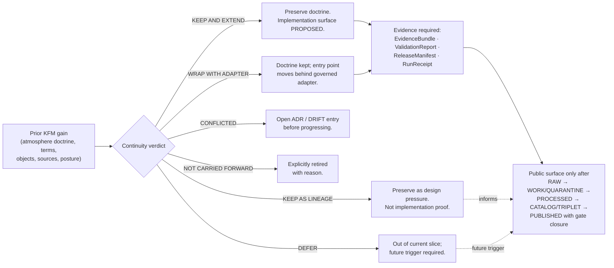
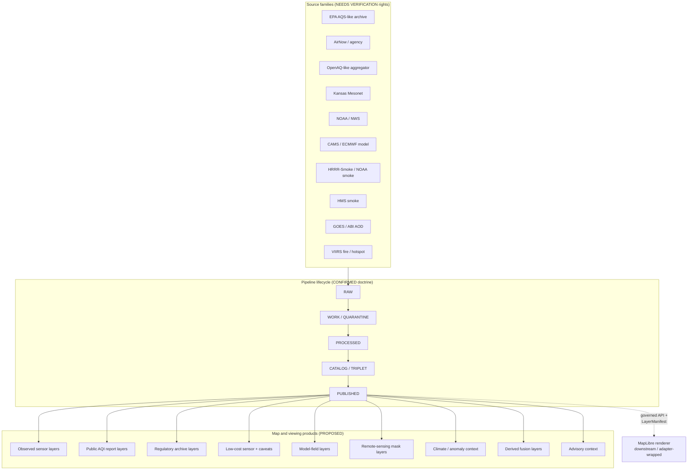
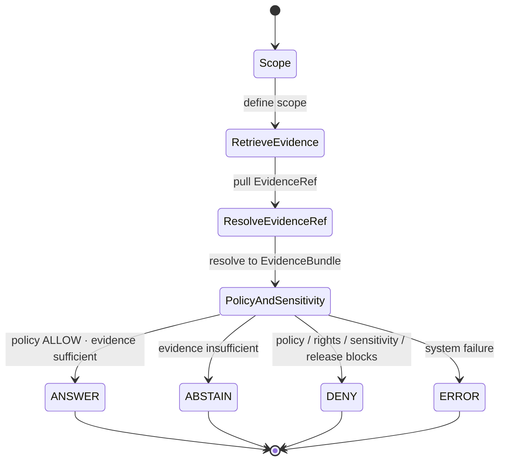

<!-- [KFM_META_BLOCK_V2]
doc_id: kfm://doc/docs-domains-atmosphere-continuity-inventory
title: Atmosphere / Air — Continuity Inventory
type: standard
version: v1-draft
status: draft
owners: TODO — Atmosphere/Air domain steward; Docs steward (co-review)
created: 2026-05-15
updated: 2026-05-28
policy_label: public
contract_version: "3.0.0"
related:
  - ai-build-operating-contract.md
  - docs/domains/atmosphere/README.md
  - docs/doctrine/directory-rules.md
  - docs/doctrine/lifecycle-law.md
  - docs/doctrine/trust-membrane.md
  - docs/registers/VERIFICATION_BACKLOG.md
  - docs/registers/DRIFT_REGISTER.md
tags: [kfm, domain, atmosphere, air, continuity, lineage, governance]
notes:
  - "CONTRACT_VERSION pinned to 3.0.0 per ai-build-operating-contract.md."
  - "Continuity inventory specialized for Atmosphere/Air per the continuity-inventory pattern in the KFM Whole-UI + Governed AI Expansion Report (exact section anchor NEEDS VERIFICATION)."
  - "Repo is not mounted in this session; all path-shaped claims are PROPOSED until verified."
  - "Carries forward prior atmosphere doctrine from KFM Domains Culmination Atlas Ch. 11 and the KFM Encyclopedia (Atmosphere/Air/Climate)."
[/KFM_META_BLOCK_V2] -->

# Atmosphere / Air — Continuity Inventory

> What KFM has already established for the Atmosphere/Air domain — and how each prior gain is carried forward, wrapped, deferred, or retained as lineage — before any implementation lane is opened.

<!-- Badges: placeholders until CI, ADR registers, and review state are wired -->

-lightgrey)

**Status:** draft &nbsp;·&nbsp; **Owners:** _TODO — Atmosphere/Air steward + Docs steward_ &nbsp;·&nbsp; **Operating contract:** `CONTRACT_VERSION = "3.0.0"` &nbsp;·&nbsp; **Last updated:** 2026-05-28

---

## Quick jump

- [1. Scope and purpose](#1-scope-and-purpose)
- [2. Repo fit and Directory Rules basis](#2-repo-fit-and-directory-rules-basis)
- [3. How to read this inventory](#3-how-to-read-this-inventory)
- [4. Continuity overview (decision posture)](#4-continuity-overview-decision-posture)
- [5. Prior gains — master continuity table](#5-prior-gains--master-continuity-table)
- [6. Doctrinal anchors carried forward](#6-doctrinal-anchors-carried-forward)
- [7. Ubiquitous language — knowledge-character terms](#7-ubiquitous-language--knowledge-character-terms)
- [8. Canonical object families](#8-canonical-object-families)
- [9. Source families and source roles](#9-source-families-and-source-roles)
- [10. Cross-lane relations preserved](#10-cross-lane-relations-preserved)
- [11. Map, viewing, and runtime products](#11-map-viewing-and-runtime-products)
- [12. Pipeline lifecycle and gate posture](#12-pipeline-lifecycle-and-gate-posture)
- [13. Validators, tests, and fixtures (planned)](#13-validators-tests-and-fixtures-planned)
- [14. Governed AI behavior for this domain](#14-governed-ai-behavior-for-this-domain)
- [15. Items deliberately deferred or not carried forward](#15-items-deliberately-deferred-or-not-carried-forward)
- [16. Verification backlog](#16-verification-backlog)
- [17. Changelog](#17-changelog)
- [18. Definition of done](#18-definition-of-done)
- [19. Related docs](#19-related-docs)
- [Appendix A — Evidence basis legend](#appendix-a--evidence-basis-legend)
- [Appendix B — Source pointers consulted](#appendix-b--source-pointers-consulted)

---

## 1. Scope and purpose

**CONFIRMED doctrine.** This document is the Atmosphere/Air specialization of the KFM **continuity inventory** pattern — the prior-gains carry-forward table format used in the *KFM Whole-UI + Governed AI Expansion Report*. Its job is to make explicit, for one domain, **what is being preserved from prior KFM work and how**, before any code, schema, policy, or release surface is opened. (The exact report section anchor for this pattern is **NEEDS VERIFICATION**; the *pattern* — Surface / Classification / Evidence basis / Preserved next behavior, with carry-forward states and "lineage is not stronger than source" — is CONFIRMED across the KFM corpus, including the MapLibre Master continuity-and-delta discipline.)

**Scope (this file):**

- Atmosphere/Air doctrine, terminology, object families, source families, knowledge-character labels, cross-lane relations, lifecycle posture, and governed-AI behavior already established in attached KFM doctrinal sources.
- The classification of each prior gain as **KEEP AND EXTEND**, **KEEP AS LINEAGE**, **WRAP WITH ADAPTER**, **DEFER**, **CONFLICTED**, or **NOT CARRIED FORWARD** (see §3 and Appendix A).

**Out of scope (this file):**

- Implementation maturity claims. The repo is **not mounted** in this session; any statement about routes, packages, modules, tests, CI, runtime, or deployment is bounded to PROPOSED / UNKNOWN / NEEDS VERIFICATION.
- Operational alerting. **KFM is not an emergency alert system** and Atmosphere/Air must not provide life-safety instructions (see §6, anchor A6).
- External standards normative text. Standards (EPA AQS, AirNow, NOAA/NWS, OGC) are referenced as **source families** for source-role purposes only; their authoritative content lives upstream.

> [!IMPORTANT]
> **Cite-or-abstain holds throughout.** Where evidence is thin, this document marks the claim with a status label rather than smoothing it into prose. Memory and plausibility are not evidence.

[Back to top](#quick-jump)

---

## 2. Repo fit and Directory Rules basis

| Aspect | Value | Status |
|---|---|---|
| Proposed path | `docs/domains/atmosphere/CONTINUITY_INVENTORY.md` | **PROPOSED** — not verified against mounted repo |
| Responsibility root | `docs/` (human-facing control plane) | **CONFIRMED** by Directory Rules §4 / §5 |
| Domain segment placement | `<root>/domains/atmosphere/<file>` | **CONFIRMED** by Directory Rules §12 Domain Placement Law |
| Authority class | Doctrine carry-forward / lineage register | **PROPOSED** doc-class label; conforms to §15 Required README Contract spirit |
| Sibling lanes (proposed) | `contracts/domains/atmosphere/`, `schemas/contracts/v1/domains/atmosphere/`, `policy/domains/atmosphere/`, `tests/domains/atmosphere/`, `fixtures/domains/atmosphere/`, `pipelines/domains/atmosphere/`, `pipeline_specs/atmosphere/`, `data/{raw,work,quarantine,processed}/atmosphere/`, `data/catalog/domain/atmosphere/`, `data/published/layers/atmosphere/`, `data/registry/sources/atmosphere/`, `release/candidates/atmosphere/` | **PROPOSED** lane pattern per Directory Rules §12 |
| Domain segment naming | `atmosphere/` vs `air/` (the Atlas v1.1 §24.13 crosswalk uses `air`) | **CONFLICTED → ADR-class** per Directory Rules §2.4(5) |
| Authority over schemas / contracts / policy | **None.** This file explains and indexes; it does not decide. | CONFIRMED by Directory Rules §2.3 |

> [!NOTE]
> Directory Rules §4 Step 5 requires citing the rule that justifies a placement. **Rule cited:** §12 Domain Placement Law — domains live as **segments inside responsibility roots**, never as root folders. Atmosphere/Air follows the same lane pattern as hydrology, fauna, soil, etc. The `atmosphere/` vs `air/` segment choice is ADR-class and is logged as a drift candidate (see §16, V9).

[Back to top](#quick-jump)

---

## 3. How to read this inventory

Each row in the master table (§5) and each entry in §§6–14 carries:

- **Surface or prior gain** — the doctrine, term, object, source family, cross-lane relation, or behavior that prior KFM work has established.
- **Classification** — one of the six continuity verdicts in Appendix A.
- **Evidence basis** — which attached source(s) support the gain.
- **Preserved next behavior** — the bounded shape in which it is carried forward into the implementation phase.

> [!TIP]
> A row classified **KEEP AS LINEAGE** is doctrine pressure, **not** repo proof. A row classified **KEEP AND EXTEND** is preserved doctrine; the *extension* itself is still PROPOSED until evidence ships. Prior master artifacts and scaffold reports are lineage and continuity evidence, never stronger than original sources.

**Truth labels used inline:** CONFIRMED · PROPOSED · INFERRED · UNKNOWN · NEEDS VERIFICATION · CONFLICTED · DEFERRED. Memory is not evidence; recollection and "likely behavior" do not satisfy CONFIRMED.

[Back to top](#quick-jump)

---

## 4. Continuity overview (decision posture)

> [!NOTE]
> The diagram above is **structural**, not implementation-bearing: it reflects the carry-forward decision flow defined by KFM doctrine (Whole-UI report continuity pattern; Atlas Ch. 11; Encyclopedia Atmosphere/Air/Climate). No live route, adapter file, or pipeline is claimed to exist in the repository.

[Back to top](#quick-jump)

---

## 5. Prior gains — master continuity table

This table consolidates the Atmosphere/Air continuity verdicts. Detailed rows live in §§6–14.

| # | Surface or prior gain | Classification | Evidence basis | Preserved next behavior |
|---|---|---|---|---|
| 1 | Atmosphere/Air domain identity and mission boundary (air quality, weather, smoke, climate, model context — **not** emergency alerting) | **KEEP AND EXTEND** | Encyclopedia (Atmosphere/Air/Climate); Atlas Ch. 11 §A–B | Domain owns observed/contextual/model air knowledge; emergency life-safety routing remains in Hazards. |
| 2 | Knowledge-character discipline (OBSERVED_SENSOR, PUBLIC_AQI_REPORT, REGULATORY_ARCHIVE, LOW_COST_SENSOR, ATMOSPHERIC_MODEL_FIELD, REMOTE_SENSING_MASK, CLIMATE_ANOMALY_CONTEXT, DERIVED_FUSION, METEOROLOGICAL_CONTEXT, ALERT_AND_ADVISORY_CONTEXT, NETWORK_AND_SITE_CONTEXT) | **KEEP AND EXTEND** | Atlas Ch. 11 §C | Knowledge-character field becomes a **PROPOSED** required schema attribute; public output labels character + freshness. |
| 3 | Canonical object families (AirStation, AirObservation, PM2.5 Observation, Ozone Observation, SmokeContext, AODRaster, Weather Station, Weather Observation, WindField, Precipitation Observation, Temperature Observation, Climate Normal, Climate Anomaly, Forecast Context, Advisory Context) | **KEEP AND EXTEND** | Encyclopedia (Atmosphere/Air/Climate); Atlas Ch. 11 §B/§E | Each family carries identity rule and distinct source/observed/valid/retrieval/release/correction times. |
| 4 | Source family ledger (EPA AQS-like archive, AirNow / agency reporting, OpenAQ-like aggregators, Kansas Mesonet, NOAA/NWS, CAMS / ECMWF-family model fields, HRRR-Smoke / NOAA smoke forecast, HMS smoke, GOES/ABI AOD, VIIRS fire/hotspot) | **KEEP AS LINEAGE** + **NEEDS VERIFICATION** for rights and current terms | Encyclopedia (Atmosphere/Air/Climate); Atlas Ch. 11 §D | Doctrinal source roles preserved; rights, terms, cadence, and attribution remain **NEEDS VERIFICATION** per source. |
| 5 | Non-interchangeability doctrine (AQI ≠ concentration; AOD ≠ PM2.5; model field ≠ observation; low-cost sensor requires caveats) | **KEEP AND EXTEND** | Atlas Ch. 11 §I; Encyclopedia (Atmosphere/Air/Climate) | Denial tests (PROPOSED) enforce non-substitution: AQI-as-concentration denial, AOD-as-PM2.5 denial, model-as-observed denial, low-cost-sensor caveat tests. |
| 6 | Cross-lane relations (Hazards, Agriculture, Hydrology, Biodiversity) | **KEEP AND EXTEND** | Atlas Ch. 11 §F | Relations must preserve ownership, source role, sensitivity, EvidenceBundle support; sensitive joins fail closed. |
| 7 | Map and viewing product family (observed sensor layers, public AQI report layers, regulatory archive layers, low-cost sensor caveat layers, model-field layers, remote-sensing mask layers, climate/anomaly context, derived fusion layers, advisory layers) | **KEEP AND EXTEND** / **WRAP WITH ADAPTER** for renderer boundary | Atlas Ch. 11 §G; MapLibre Master report | Layers ride through `LayerManifest`-style descriptor; MapLibre stays a renderer behind an adapter, never truth. |
| 8 | Pipeline lifecycle: RAW → WORK/QUARANTINE → PROCESSED → CATALOG/TRIPLET → PUBLISHED | **KEEP AND EXTEND** (CONFIRMED doctrine) | Directory Rules §9.1; Atlas Ch. 11 §H; Encyclopedia | Promotion is a governed state transition, never a file move. Each stage has its named gate. |
| 9 | Governed-AI behavior (ANSWER / ABSTAIN / DENY / ERROR; AI never root truth) | **KEEP AND EXTEND** | Encyclopedia (AI boundary); Atlas Ch. 11 §L | AI may summarize, compare, explain limitations, draft steward notes; ABSTAIN on insufficient evidence; DENY where policy/rights/sensitivity/release blocks. |
| 10 | Validator/test plan (knowledge-character registry tests, unit normalization tests, AQI/AOD/model denial tests, low-cost-sensor caveat tests, dry-run no-live-fetch tests) | **KEEP AS LINEAGE** → **PROPOSED** to implement | Atlas Ch. 11 §K | Carried forward as the initial PROPOSED test slice before any live fetch or public binding. |
| 11 | Publication / correction / rollback discipline (ReleaseManifest, EvidenceBundle, ValidationReport, ReviewRecord, CorrectionNotice, RollbackCard) | **KEEP AND EXTEND** (CONFIRMED doctrine) | Atlas Ch. 11 §M; Encyclopedia (Publication gate, Correction and rollback) | All five proof families required for public Atmosphere/Air release. |
| 12 | Sensitivity / rights / publication posture (unclear rights, unresolved source role, missing evidence, unresolved sensitivity, absent release state → blocks public promotion) | **KEEP AND EXTEND** (CONFIRMED doctrine) | Encyclopedia (Sensitivity and rights posture); Atlas Ch. 11 §I | Default-deny on unresolved rights or source role; fail-closed on sensitive joins. |
| 13 | First-PR posture (docs / registry / schema / fixture / validator / policy / dry-run only — no live fetch, no public promotion, no UI/API binding beyond typed contract notes) | **KEEP AND EXTEND** | Build Manual — Atmosphere/Air (first-PR posture; exact §number NEEDS VERIFICATION) | First-cut domain PR remains **no-network**, **no-public-route**; promotion comes later under gate closure. |
| 14 | Renderer boundary (MapLibre is downstream of trust; never publication, citation, or policy authority) | **WRAP WITH ADAPTER** | MapLibre Master report; Encyclopedia (Map-renderer boundary) | Atmosphere/Air layers reach the renderer only through governed APIs and `LayerManifest`. |
| 15 | Atmosphere domain scaffold report (`KFM_Atmosphere_Air_PDF_Only_Architecture_Report_2026-04-21.pdf`) | **KEEP AS LINEAGE** | MapLibre Master report SRC-030; Whole-UI report (domain scaffold reports) | Preserve path patterns, fixtures, validators, and rollback ideas as design pressure; **never** treat scaffold as repo implementation. |

[Back to top](#quick-jump)

---

## 6. Doctrinal anchors carried forward

| Anchor | Statement | Status | Source |
|---|---|---|---|
| A1 | **Inspectable claim** — Atmosphere/Air's durable public unit is a claim whose evidence, spatial/temporal scope, source role, policy posture, review state, release state, and correction lineage can be inspected. | CONFIRMED doctrine | Encyclopedia (Operating Law) |
| A2 | **Evidence hierarchy** — EvidenceBundle outranks generated language; source records and resolved evidence outrank maps, search indexes, summaries, and model outputs. | CONFIRMED doctrine | Encyclopedia (Operating Law) |
| A3 | **Lifecycle law** — RAW → WORK/QUARANTINE → PROCESSED → CATALOG/TRIPLET → PUBLISHED. Promotion is a governed state transition, not a file move. | CONFIRMED doctrine | Directory Rules §9.1; Encyclopedia |
| A4 | **Trust membrane** — Public clients use governed APIs and released artifacts, not canonical internal stores. | CONFIRMED doctrine | Encyclopedia; Directory Rules §13.5 |
| A5 | **AQI is not concentration; AOD is not PM2.5; model fields are not observations.** Low-cost sensor public release requires correction, caveats, confidence, and limitations. | CONFIRMED / PROPOSED | Atlas Ch. 11 §I; Encyclopedia (Atmosphere/Air/Climate) |
| A6 | **No emergency alerting.** Atmosphere/Air does not replace official advisories or emergency alerting. Hazards owns life-safety context. | CONFIRMED / PROPOSED | Encyclopedia (Atmosphere/Air/Climate); Atlas Ch. 11 §B |
| A7 | **Sensitivity / rights posture** — Unclear rights, unresolved source role, missing evidence, unresolved sensitivity, or absent release state blocks public promotion. | CONFIRMED doctrine | Encyclopedia; Atlas Ch. 11 §I |
| A8 | **AI boundary** — AI is interpretive, subordinate to evidence, policy, review, and release state. Outcomes are ANSWER, ABSTAIN, DENY, or ERROR. | CONFIRMED doctrine | Encyclopedia; Atlas Ch. 11 §L |
| A9 | **Map-renderer boundary** — MapLibre or any renderer is downstream of trust. It renders released artifacts and view state; it is never truth, policy, publication, or citation authority. | CONFIRMED doctrine | Encyclopedia; MapLibre Master report |

> [!CAUTION]
> Anchor **A6** is the single most operationally significant boundary for this domain. Any UI surface that nudges toward "what should I do right now" instead of "what does the evidence show" must route through Hazards and official sources, not through Atmosphere/Air.

[Back to top](#quick-jump)

---

## 7. Ubiquitous language — knowledge-character terms

The **knowledge character** is the discipline Atmosphere/Air uses to refuse epistemic collapse between observations, public reports, regulatory archives, low-cost sensors, model fields, masks, anomalies, and fusion products. Each term is **CONFIRMED as a term** in the Atlas Ch. 11 §C ledger; its **field realization** (schema attribute, validator behavior, badge text) is **PROPOSED** until repo evidence ships.

<strong>Click to expand — knowledge-character vocabulary (carried forward verbatim)</strong>

| Term | Carry-forward status | Preserved next behavior |
|---|---|---|
| **Knowledge character** (the discipline itself) | KEEP AND EXTEND | Becomes a PROPOSED required schema attribute on Atmosphere/Air observations and derivatives. |
| **OBSERVED_SENSOR** | KEEP AND EXTEND | Direct instrument observations carry sensor and method metadata. |
| **PUBLIC_AQI_REPORT** | KEEP AND EXTEND | Public-facing AQI reports are not treated as concentration measurements. |
| **REGULATORY_ARCHIVE** | KEEP AND EXTEND | Regulatory-archive data labels source authority and revision lineage. |
| **LOW_COST_SENSOR** | KEEP AND EXTEND | Caveats, correction, confidence, and limitations are required for public release (A5). |
| **ATMOSPHERIC_MODEL_FIELD** | KEEP AND EXTEND | Model fields are labeled as model fields and never substituted for observations. |
| **REMOTE_SENSING_MASK** | KEEP AND EXTEND | Smoke/AOD masks carry retrieval algorithm and quality flags. |
| **CLIMATE_ANOMALY_CONTEXT** | KEEP AND EXTEND | Climate normals and anomalies are released as context, not as point-in-time truth. |
| **DERIVED_FUSION** | KEEP AND EXTEND | Fusion products carry their constituent source roles and freshness. |
| **METEOROLOGICAL_CONTEXT** | KEEP AND EXTEND | Weather context labels station vs. mesonet vs. model lineage. |
| **ALERT_AND_ADVISORY_CONTEXT** | KEEP AND EXTEND | Advisory/alert context redirects to official-source authority; KFM does not issue alerts (A6). |
| **NETWORK_AND_SITE_CONTEXT** | KEEP AND EXTEND | Station/network metadata travels with observations. |

> [!TIP]
> Treat these terms as **non-renamable**. External standards may use overlapping vocabulary (e.g., "model output", "advisory"); the KFM term carries the source-role and release-state implications and must not be silently swapped for an external synonym.

[Back to top](#quick-jump)

---

## 8. Canonical object families

Object identity for Atmosphere/Air uses the PROPOSED deterministic basis: **`source id + object role + temporal scope + normalized digest`** (Atlas Ch. 11 §E). Temporal handling preserves **distinct** source / observed / valid / retrieval / release / correction times wherever material — this is **CONFIRMED doctrine** and must not be flattened.

| Object family | Carry-forward status | Identity rule | Temporal handling |
|---|---|---|---|
| `AirStation` | KEEP AND EXTEND | PROPOSED deterministic | CONFIRMED distinct times |
| `AirObservation` | KEEP AND EXTEND | PROPOSED deterministic | CONFIRMED distinct times |
| `PM2.5 Observation` | KEEP AND EXTEND | PROPOSED deterministic | CONFIRMED distinct times |
| `Ozone Observation` | KEEP AND EXTEND | PROPOSED deterministic | CONFIRMED distinct times |
| `SmokeContext` | KEEP AND EXTEND | PROPOSED deterministic | CONFIRMED distinct times |
| `AODRaster` | KEEP AND EXTEND | PROPOSED deterministic | CONFIRMED distinct times |
| `Weather Station` | KEEP AND EXTEND | PROPOSED deterministic | CONFIRMED distinct times |
| `Weather Observation` | KEEP AND EXTEND | PROPOSED deterministic | CONFIRMED distinct times |
| `WindField` | KEEP AND EXTEND | PROPOSED deterministic | CONFIRMED distinct times |
| `Precipitation Observation` | KEEP AND EXTEND | PROPOSED deterministic | CONFIRMED distinct times |
| `Temperature Observation` | KEEP AND EXTEND | PROPOSED deterministic | CONFIRMED distinct times |
| `Climate Normal` | KEEP AND EXTEND | PROPOSED deterministic | CONFIRMED distinct times |
| `Climate Anomaly` | KEEP AND EXTEND | PROPOSED deterministic | CONFIRMED distinct times |
| `Forecast Context` | KEEP AND EXTEND | PROPOSED deterministic | CONFIRMED distinct times |
| `Advisory Context` | KEEP AND EXTEND | PROPOSED deterministic | CONFIRMED distinct times (advisory context, never alert authority per A6) |

> [!NOTE]
> The Atlas renders these object families with spaces (`PM2.5 Observation`, `Weather Station`, `Precipitation Observation`, `Climate Normal`, etc.); identifier-friendly stems (`PM25Observation`, `WeatherStation`) are PROPOSED aliases pending the schema. Schema names, field names, and machine-checkable shape live under `schemas/contracts/v1/domains/atmosphere/` (**PROPOSED** per Directory Rules §12). This document does not author shape; it preserves family identity and temporal discipline.

[Back to top](#quick-jump)

---

## 9. Source families and source roles

Each family is doctrine-recognized as a candidate Atmosphere/Air source. The **source role** posture is the four-way distinction *authority / observation / context / model* (Atlas Ch. 11 §D). Rights and current terms are **NEEDS VERIFICATION** per family. (Kansas Mesonet and NOAA/NWS are INFERRED additions consistent with the Atlas source-family pattern; confirm against the source registry.)

| Source family | Doctrinal role(s) | Carry-forward status | Rights / sensitivity | Freshness |
|---|---|---|---|---|
| EPA AQS-like archive | authority / observation / context / model (as labeled) | KEEP AS LINEAGE | **NEEDS VERIFICATION** rights and current terms; sensitive joins fail closed | source-vintage or cadence specific |
| AirNow / agency reporting | authority / observation / context / model | KEEP AS LINEAGE | **NEEDS VERIFICATION** | source-vintage or cadence specific |
| OpenAQ-like aggregators | observation / context (as labeled) | KEEP AS LINEAGE | **NEEDS VERIFICATION** | source-vintage or cadence specific |
| Kansas Mesonet (INFERRED) | observation / context | KEEP AS LINEAGE | **NEEDS VERIFICATION** | source-vintage or cadence specific |
| NOAA / NWS (INFERRED) | authority / observation / context / model | KEEP AS LINEAGE | **NEEDS VERIFICATION** | source-vintage or cadence specific |
| CAMS / ECMWF-family model fields | model | KEEP AS LINEAGE | **NEEDS VERIFICATION** | source-vintage or cadence specific |
| HRRR-Smoke / NOAA smoke forecast | model | KEEP AS LINEAGE | **NEEDS VERIFICATION** | source-vintage or cadence specific |
| HMS smoke | context / observation (as labeled) | KEEP AS LINEAGE | **NEEDS VERIFICATION** | source-vintage or cadence specific |
| GOES / ABI AOD | observation / context (as labeled) | KEEP AS LINEAGE | **NEEDS VERIFICATION** | source-vintage or cadence specific |
| VIIRS fire / hotspot | observation / context (as labeled) | KEEP AS LINEAGE | **NEEDS VERIFICATION** | source-vintage or cadence specific |

> [!WARNING]
> **Source-role anti-collapse is doctrine-significant.** ADR-S-04 in the Master Open-ADR Backlog (Atlas v1.1 §24.12) covers the canonical source-role vocabulary; until that ADR is accepted, source-role enum text in any Atmosphere/Air schema or descriptor remains **PROPOSED**. Source role is set at admission and is never upgraded by promotion (Atlas §24.1).

[Back to top](#quick-jump)

---

## 10. Cross-lane relations preserved

| This domain | Related lane | Relation type (carried forward) | Constraint |
|---|---|---|---|
| Atmosphere / Air | Hazards | smoke, heat/cold, advisory, visibility, fire/emissions context | CONFIRMED / PROPOSED — relation must preserve ownership, source role, sensitivity, and EvidenceBundle support |
| Atmosphere / Air | Agriculture | heat, smoke, precipitation, vegetation stress | CONFIRMED / PROPOSED — same constraint |
| Atmosphere / Air | Hydrology | precipitation, drought, flood-weather forcing | CONFIRMED / PROPOSED — same constraint |
| Atmosphere / Air | Biodiversity domains (Fauna / Flora / Habitat) | phenology, smoke, fire, drought stress **without exposing sensitive locations** | CONFIRMED / PROPOSED — sensitive joins fail closed |

> [!IMPORTANT]
> Cross-lane joins are **inference-risk multipliers**. ADR-S-14 (Cross-lane join policy, Atlas v1.1 §24.12) is on the Master Open-ADR Backlog. Until that policy is accepted, Atmosphere/Air joins that touch sensitive lanes (Biodiversity occurrence locations, People/DNA, Archaeology) **fail closed**.

[Back to top](#quick-jump)

---

## 11. Map, viewing, and runtime products

| Product family | Carry-forward status | Preserved next behavior |
|---|---|---|
| Observed sensor layers | KEEP AND EXTEND | Layer manifest carries source role, observed/valid time, freshness, units; renderer is downstream. |
| Public AQI report layers | KEEP AND EXTEND | Labeled `PUBLIC_AQI_REPORT`, not concentration. |
| Regulatory archive layers | KEEP AND EXTEND | Labeled `REGULATORY_ARCHIVE`, with revision lineage. |
| Low-cost sensor caveat layers | KEEP AND EXTEND | Caveats, correction, confidence, limitations required (A5). |
| Model-field layers | KEEP AND EXTEND | Labeled `ATMOSPHERIC_MODEL_FIELD`; never substituted for observations. |
| Remote-sensing mask layers (smoke, AOD) | KEEP AND EXTEND | Labeled `REMOTE_SENSING_MASK`; algorithm + QC metadata travel. |
| Climate / anomaly context layers | KEEP AND EXTEND | Labeled `CLIMATE_ANOMALY_CONTEXT`; baseline period explicit. |
| Derived fusion layers | KEEP AND EXTEND | Labeled `DERIVED_FUSION`; constituent source roles preserved. |
| Advisory context layers | KEEP AND EXTEND | Redirect to official source; no in-app alerting (A6). |
| Cross-cutting: Evidence Drawer, time-aware state, trust badges, sensitivity-redacted view, correction/stale-state view, governed Focus Mode | **KEEP AND EXTEND** (CONFIRMED doctrine) | Atmosphere/Air inherits the whole-UI Evidence Drawer / Focus Mode posture from the Whole-UI continuity carry-forward table. |

> [!NOTE]
> The diagram is **structural**, derived from Atlas Ch. 11 §G + §H. No specific renderer file, layer manifest path, or governed-API route is verified in the repository. The renderer adapter root is `packages/maplibre-runtime/` (Directory Rules v1.3 rename from `packages/maplibre/`).

[Back to top](#quick-jump)

---

## 12. Pipeline lifecycle and gate posture

| Stage | Handling (CONFIRMED doctrine; PROPOSED implementation) | Gate (CONFIRMED doctrine; PROPOSED implementation) | Status |
|---|---|---|---|
| **RAW** | Capture immutable source payload or reference with source role, rights, sensitivity, citation, time, and hash. | `SourceDescriptor` exists. | PROPOSED |
| **WORK / QUARANTINE** | Normalize schema, geometry, time, identity, evidence, rights, and policy; hold failures. | Validation and policy gate pass, or quarantine reason is recorded. | PROPOSED |
| **PROCESSED** | Emit validated normalized objects, receipts, and public-safe candidates. | `EvidenceRef`, `ValidationReport`, and digest closure exist. | PROPOSED |
| **CATALOG / TRIPLET** | Emit catalog records, `EvidenceBundle`s, graph/triplet projections, and release candidates. | Catalog/proof closure passes. | PROPOSED |
| **PUBLISHED** | Serve released public-safe artifacts through governed APIs and manifests. | `ReleaseManifest`, correction path, rollback target, and review/policy state exist. | PROPOSED |

> [!IMPORTANT]
> The **lifecycle invariant is CONFIRMED doctrine** (Directory Rules §9.1). The **Atmosphere/Air application** of each stage's handling and gate is **PROPOSED** until repo, fixtures, validators, and policy ship. Promotion is a governed state transition, not a file move.

[Back to top](#quick-jump)

---

## 13. Validators, tests, and fixtures (planned)

Carried forward from Atlas Ch. 11 §K as the initial **no-network**, **no-public-route** PROPOSED slice (the Build Manual also names this first-PR posture; exact §number NEEDS VERIFICATION).

| Validator / test (PROPOSED) | Purpose | Status |
|---|---|---|
| Knowledge-character registry tests | Enforce that every Atmosphere/Air object carries a recognized knowledge character. | PROPOSED |
| Unit normalization tests | Enforce consistent unit handling (µg/m³, ppb, ppm, °C/°F, m/s, mm/h, etc.) with conversion receipts. | PROPOSED |
| AQI-as-concentration **denial** | Reject any release that treats a `PUBLIC_AQI_REPORT` value as a measured concentration (A5). | PROPOSED |
| AOD-as-PM2.5 **denial** | Reject any release that treats AOD as a PM2.5 surface (A5). | PROPOSED |
| Model-as-observed **denial** | Reject any release that mislabels an `ATMOSPHERIC_MODEL_FIELD` as observation (A5). | PROPOSED |
| Low-cost-sensor caveat tests | Require correction, caveats, confidence, and limitations on `LOW_COST_SENSOR` public release. | PROPOSED |
| Dry-run **no-live-fetch** tests | Prove that the first-PR slice does not require live source endpoints. | PROPOSED |

> [!TIP]
> These rows are **lineage / planning evidence**, not test files. A test does not exist until it lives in `tests/domains/atmosphere/` (PROPOSED path) and is executed by CI.

[Back to top](#quick-jump)

---

## 14. Governed AI behavior for this domain

| Behavior | Status | Detail |
|---|---|---|
| AI **may** summarize released Atmosphere/Air `EvidenceBundle`s. | CONFIRMED doctrine / PROPOSED implementation | Subject to citation validation. |
| AI **may** compare evidence across observations, regulatory archive, and model fields. | CONFIRMED doctrine / PROPOSED implementation | Knowledge-character labels must travel. |
| AI **may** explain limitations and draft steward-review notes. | CONFIRMED doctrine / PROPOSED implementation | Steward review state is the truth surface, not the AI draft. |
| AI **must ABSTAIN** when evidence is insufficient. | CONFIRMED doctrine | Finite outcome: ABSTAIN. |
| AI **must DENY** where policy, rights, sensitivity, or release state blocks the request. | CONFIRMED doctrine | Finite outcome: DENY with reason code. |
| AI **must not** be root truth, publication authority, citation authority, or policy authority. | CONFIRMED doctrine | Encyclopedia (AI boundary). |
| AI **must not** issue emergency advice or substitute for official alerts. | CONFIRMED doctrine | Anchor A6. |

[Back to top](#quick-jump)

---

## 15. Items deliberately deferred or not carried forward

| Item | Verdict | Reason | Future trigger |
|---|---|---|---|
| Live source connectors (EPA AQS, AirNow, OpenAQ, Mesonet, NOAA, CAMS, HRRR-Smoke, HMS, GOES/ABI, VIIRS) | **DEFER** | First-PR slice is **no-network**; rights, terms, quotas, attribution NEEDS VERIFICATION per source. | After per-source `SourceDescriptor`, rights review, and dry-run fixtures pass. |
| Public-facing Atmosphere/Air routes (`/atmosphere/...`) | **DEFER** | No mounted repo, no governed-API surface verified. | After governed-API skeleton, schemas, fixtures, and policy land. |
| Real-time emergency alerting | **NOT CARRIED FORWARD** | Anchor A6 — Atmosphere/Air is not an emergency alert system. Hazards owns life-safety context. | None. Permanent. |
| 3D atmospheric scenes (volumetric model rendering) | **DEFER** | 3D is conditional in KFM and admission-gated (ADR-S-07; Directory Rules §11 / maplibre-3d). Atmosphere/Air must satisfy 2D evidence continuity before any 3D handoff. | After `StoryManifest`, Evidence Drawer, and 3D admission policy pass in 2D. |
| Direct in-browser model adapters (Ollama / OpenAI / provider) | **DEFER** | Governed API is mandatory; no direct model call from browser. | After `MockAdapter` tests and security review pass. |
| Source-role enum text (canonical vocabulary) | **CONFLICTED → ADR required** | Source-role anti-collapse is doctrine-significant (ADR-S-04 backlog). | Acceptance of ADR-S-04. |
| Domain segment `atmosphere/` vs `air/` | **CONFLICTED → ADR required** | Atlas §24.13 crosswalk uses `air`; Directory Rules §12 enumeration uses `atmosphere`. ADR-class per §2.4(5). | Acceptance of segment-canonicalization ADR. |

[Back to top](#quick-jump)

---

## 16. Verification backlog

Carried forward from Atlas Ch. 11 §N and the Build Manual first-PR posture. Each row needs **mounted-repo evidence** — schemas, fixtures, validators, tests, workflows, logs, emitted artifacts, review records, or release manifests — to settle. These SHOULD be mirrored in `docs/registers/VERIFICATION_BACKLOG.md`.

| # | Item to verify | Evidence that would settle it | Status |
|---|---|---|---|
| V1 | Verify Atmosphere/Air source rights, terms, quotas, attribution, and endpoint behavior per source family. | Per-source `SourceDescriptor` + rights record + dry-run fixture. | NEEDS VERIFICATION |
| V2 | Implement knowledge-character registry. | Registry file + validator + tests in `tests/domains/atmosphere/`. | NEEDS VERIFICATION |
| V3 | Verify catalog / proof / release closure for Atmosphere/Air. | `EvidenceBundle` + `ReleaseManifest` + correction path + rollback target. | NEEDS VERIFICATION |
| V4 | Verify MapLibre / Evidence Drawer / Focus Mode integration for atmosphere layers. | Layer manifest + drawer payload schema + Focus Mode mock + fixture tests. | NEEDS VERIFICATION |
| V5 | Confirm sibling lane existence (`contracts/domains/atmosphere/`, `schemas/contracts/v1/domains/atmosphere/`, `policy/domains/atmosphere/`, …). | Directory inspection against Directory Rules §12 lane pattern. | NEEDS VERIFICATION |
| V6 | Confirm or amend source-role vocabulary (ADR-S-04). | Accepted ADR + schema enum update. | NEEDS VERIFICATION |
| V7 | Confirm sensitivity tier scheme (ADR-S-05, T0–T4) for Atmosphere/Air. | Accepted ADR + policy bundle. | NEEDS VERIFICATION |
| V8 | Confirm cross-lane join policy (ADR-S-14) for Atmosphere/Air ↔ Biodiversity, Hazards, Agriculture, Hydrology. | Accepted ADR + policy rule + tests. | NEEDS VERIFICATION |
| V9 | Resolve domain segment `atmosphere/` vs `air/`. | Segment-canonicalization ADR + DRIFT_REGISTER entry. | NEEDS VERIFICATION |
| V10 | Confirm the Whole-UI report continuity-inventory section anchor and the Build Manual Atmosphere/Air §number cited herein. | Mounted Whole-UI report + Build Manual table of contents. | NEEDS VERIFICATION |
| V11 | Confirm the Encyclopedia section anchor for Atmosphere/Air/Climate (this doc cites the chapter, not a pinned §number). | Mounted Encyclopedia table of contents. | NEEDS VERIFICATION |

[Back to top](#quick-jump)

---

## 17. Changelog

| Change | Type (per contract §37) | Reason |
|---|---|---|
| Pinned CONTRACT_VERSION = "3.0.0" (badge, meta, status line) | housekeeping | Doctrine-adjacent doc requirement. |
| Relaxed "Whole-UI report §6" and "Build Manual §6.10 / 30.10" to named-pattern references + NEEDS VERIFICATION (V10) | reconciliation | Section numbers not confirmable from this session's evidence; pattern is CONFIRMED. |
| Re-anchored Atlas/Encyclopedia citations from "§11 / §7.9" to "Ch. 11 §A–N" and "(Atmosphere/Air/Climate)" | reconciliation | Match the actual Atlas chapter structure (Ch. 11) and avoid an unverifiable Encyclopedia §number (V11). |
| Object-family casing aligned to Atlas spacing (`PM2.5 Observation`, `Weather Station`, etc.) with PROPOSED alias note | clarification | Atlas renders families with spaces; compact stems flagged as aliases. |
| Added `atmosphere/` vs `air/` CONFLICTED row (§2, §15) and V9 | gap closure | Atlas §24.13 crosswalk uses `air`; ADR-class tension was unstated. |
| Added companion sections (Changelog, Definition of done) and renumbered §17 Related → §19 | housekeeping | Doctrine-doc companion-section requirement. |
| Fixed back-to-top anchors to `#quick-jump` | clarification | Original links pointed to a slugified H1 that GitHub does not generate that way. |
| Added Directory Rules v1.3 renderer note (`packages/maplibre-runtime/`) and ADR-S-07 3D-admission reference | clarification | Match current Directory Rules and the 3D admission ADR. |

> **Backward compatibility.** Section bodies §1–§16 preserved. New §17 (Changelog) and §18 (Definition of done) inserted; the former §17 Related docs is now §19. Internal "Back to top" links repointed from the H1 slug to `#quick-jump`. Links targeting the old `#17-related-docs` should be repointed to `#19-related-docs`.

[Back to top](#quick-jump)

---

## 18. Definition of done

This document is done enough to enter the repository when:

- it is placed at `docs/domains/atmosphere/CONTINUITY_INVENTORY.md` per Directory Rules §12;
- the Atmosphere/Air domain steward and a docs steward co-review it;
- it is linked from the Atmosphere README and a domains/continuity index;
- it does not conflict with accepted ADRs (notably ADR-S-04 source-role, ADR-S-14 cross-lane join, and the segment-canonicalization ADR);
- the `atmosphere/` vs `air/` tension is logged in `docs/registers/DRIFT_REGISTER.md`;
- the open verification items (§16) are mirrored in `docs/registers/VERIFICATION_BACKLOG.md`;
- a `GENERATED_RECEIPT.json` is wired into CI for this artifact;
- future changes follow the operating contract's §37 lifecycle.

[Back to top](#quick-jump)

---

## 19. Related docs

- [`ai-build-operating-contract.md`](../../../ai-build-operating-contract.md) — canonical operating contract, `CONTRACT_VERSION = "3.0.0"`. *(CONFIRMED present in project.)*
- [`docs/domains/atmosphere/README.md`](./README.md) — Atmosphere/Air landing page (PROPOSED).
- [`docs/doctrine/directory-rules.md`](../../doctrine/directory-rules.md) — Directory Rules (v1.3); §12 Domain Placement Law governs this file's path.
- [`docs/doctrine/lifecycle-law.md`](../../doctrine/lifecycle-law.md) — RAW → PUBLISHED lifecycle invariant (PROPOSED canonical home).
- [`docs/doctrine/trust-membrane.md`](../../doctrine/trust-membrane.md) — Public clients use governed APIs, not canonical stores (PROPOSED canonical home).
- [`docs/doctrine/truth-posture.md`](../../doctrine/truth-posture.md) — Cite-or-abstain (PROPOSED canonical home).
- [`docs/registers/VERIFICATION_BACKLOG.md`](../../registers/VERIFICATION_BACKLOG.md) — Central verification backlog (PROPOSED canonical home).
- [`docs/registers/DRIFT_REGISTER.md`](../../registers/DRIFT_REGISTER.md) — Drift register for path/convention conflicts (PROPOSED canonical home).
- [`docs/architecture/governed-ai/`](../../architecture/governed-ai/) — Governed AI plan; Atmosphere/Air inherits ANSWER/ABSTAIN/DENY/ERROR finite outcomes (PROPOSED canonical home).
- [`docs/standards/`](../../standards/) — Standards conformance briefs (e.g., PROV, PMTILES, OGC-API-TILES, OAI-PMH, ISO-19115). External standards inform but do not outrank the trust membrane.

> [!NOTE]
> Several link targets above are **PROPOSED paths** consistent with Directory Rules §12 and §15 (Required README Contract). They are not verified against mounted-repo state.

[Back to top](#quick-jump)

---

## Appendix A — Evidence basis legend

| Verdict label | Meaning |
|---|---|
| **KEEP AND EXTEND** | Doctrine is preserved exactly. Implementation surface is PROPOSED; doctrine itself is CONFIRMED. |
| **KEEP AS LINEAGE** | Carried as design pressure and reference. Not treated as repo implementation under any condition. |
| **WRAP WITH ADAPTER** | Doctrine kept; the entry point moves behind a governed adapter (e.g., MapLibre renderer, AI provider). |
| **DEFER** | Out of current slice. Requires a named future trigger before reactivation. |
| **CONFLICTED** | Evidence or prior lineage indicates unresolved ambiguity. Requires ADR or DRIFT entry before progressing. |
| **NOT CARRIED FORWARD** | Explicitly retired with reason. |

| Truth label | Meaning in this file |
|---|---|
| **CONFIRMED** | Directly supported by attached KFM doctrinal sources. |
| **PROPOSED** | Design, path, schema, route, component, policy, or process not yet verified in implementation. |
| **INFERRED** | Reasonably derivable from visible evidence but not directly stated. |
| **UNKNOWN** | Not resolvable without more evidence (no mounted repo, runtime, logs, dashboards, or live source checks in this session). |
| **NEEDS VERIFICATION** | Concrete point that must be checked before being treated as current fact. |
| **CONFLICTED** | Sources indicate unresolved file-home or behavior ambiguity. |
| **DEFERRED** | Intentionally excluded from this slice until a later trigger. |

[Back to top](#quick-jump)

---

## Appendix B — Source pointers consulted

Attached KFM doctrinal sources used to ground this inventory. None of these prove mounted-repo state; they are doctrine and lineage.

| Pointer | Source | Used for |
|---|---|---|
| `directory-rules.md` (attached, v1.3) | Directory Rules | §4/§5/§12 placement law; §9.1 lifecycle; §13.5 anti-patterns; §15 Required README Contract; §2.4(5) ADR-class rule. |
| KFM Domains Culmination Atlas Ch. 11 (+ Ch. 24) | Atlas — Atmosphere/Air | Ubiquitous language (§C), object families (§B/§E), source families (§D), cross-lane relations (§F), viewing products (§G), lifecycle stage table (§H), sensitivity posture (§I), API/contract/schema surfaces (§J), validators/tests (§K), governed AI behavior (§L), publication/correction/rollback (§M), verification backlog (§N); Master Open-ADR Backlog (§24.12); source-role register (§24.1). |
| KFM Encyclopedia — Operating Law + Atmosphere/Air/Climate | Encyclopedia | Operating-law anchors (inspectable claim, evidence hierarchy, lifecycle, trust membrane, publication gate, correction/rollback, AI boundary, map-renderer boundary, sensitivity posture); mission/boundary; source families; canonical object families. Exact section anchor NEEDS VERIFICATION (V11). |
| KFM Whole-UI + Governed AI Expansion Report | Whole-UI report | Continuity-inventory pattern (Surface / Classification / Evidence basis / Preserved next behavior); domain-scaffold-as-lineage verdict; deferred-items pattern. Exact section anchor NEEDS VERIFICATION (V10). |
| KFM Unified Implementation Architecture Build Manual | Build Manual — Atmosphere/Air | First-PR posture (docs / registry / schema / fixture / validator / policy / dry-run only; no live fetch; no public promotion). Exact §number NEEDS VERIFICATION (V10). |
| Master MapLibre Components-Functions-Features (SRC-030) | MapLibre Master report | Renderer boundary; continuity-and-delta discipline; identifies `KFM_Atmosphere_Air_PDF_Only_Architecture_Report_2026-04-21.pdf` as the domain-scaffold lineage source (KEEP AS LINEAGE). |

> [!NOTE]
> **No external (web) sources were consulted** in producing this file. All claims are grounded in attached KFM doctrinal sources, with implementation status bounded per `<repository_preflight>`.

[Back to top](#quick-jump)

---

**Related docs:** [`ai-build-operating-contract.md`](../../../ai-build-operating-contract.md) · [`docs/domains/atmosphere/README.md`](./README.md) · [`docs/doctrine/directory-rules.md`](../../doctrine/directory-rules.md) · [`docs/registers/VERIFICATION_BACKLOG.md`](../../registers/VERIFICATION_BACKLOG.md)

**Last updated:** 2026-05-28 · **CONTRACT_VERSION:** 3.0.0 · **Authority:** doctrine carry-forward (this file does not decide schemas, policy, or release surfaces) · **Repo-verified:** NO (repo not mounted in this session)

[Back to top](#quick-jump)
