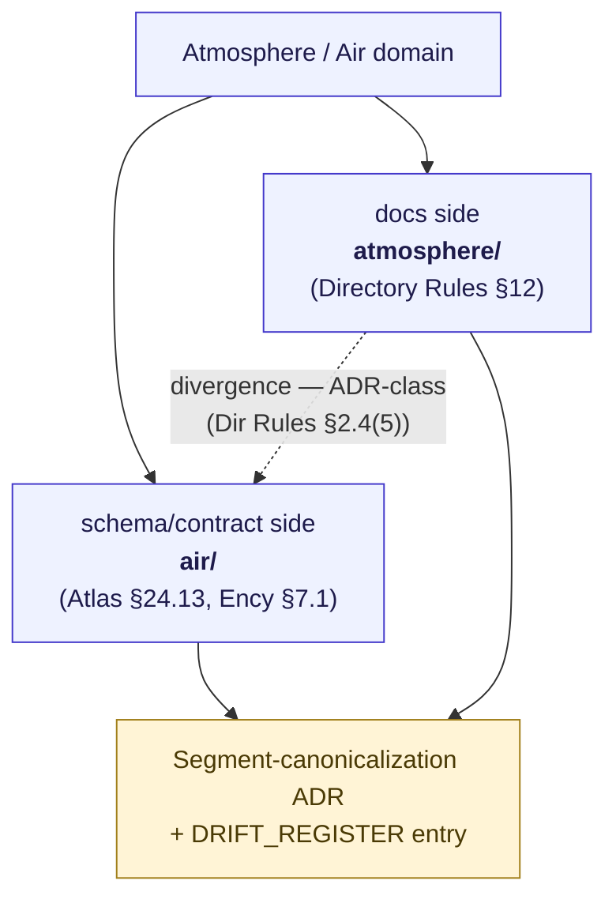

<!-- [KFM_META_BLOCK_V2]
doc_id: kfm://doc/domains/atmosphere/crosswalk
title: Atmosphere / Air — Crosswalk
type: standard
version: v1-draft
status: draft
owners: TODO — Atmosphere/Air domain steward; Docs steward (co-review)
created: 2026-05-28
updated: 2026-05-28
policy_label: public
contract_version: "3.0.0"
related:
  - ai-build-operating-contract.md
  - docs/doctrine/directory-rules.md
  - docs/domains/atmosphere/README.md
  - docs/domains/atmosphere/CANONICAL_PATHS.md
  - docs/domains/atmosphere/API_CONTRACTS.md
  - docs/domains/atmosphere/CATALOG_INDEX.md
  - docs/registers/DRIFT_REGISTER.md
  - docs/standards/ISO-19115.md
  - docs/standards/PROV.md
tags: [kfm, domain, atmosphere, air, crosswalk, atlas, responsibility-root, object-family, standards]
notes:
  - CONTRACT_VERSION pinned to 3.0.0 per ai-build-operating-contract.md.
  - Specializes Atlas v1.1 §24.13 (Atlas↔Dossier↔Root) and §24.14 (Object Family × Domain) for Atmosphere/Air.
  - Atlas crosswalk uses segment `air`; Directory Rules §12 uses `atmosphere`. Segment choice is ADR-class — see §3.
  - Repo not mounted; all path-shaped claims PROPOSED until verified.
[/KFM_META_BLOCK_V2] -->

# Atmosphere / Air — Crosswalk

> One row, every register. How the Atmosphere/Air domain maps across the KFM master atlases — Atlas chapter, source dossier, responsibility roots, object families, source roles, sensitivity tiers, decision outcomes, and external metadata standards — so a reviewer can trace any Atmosphere object from doctrine to repo home to catalog profile in a single place.

  
  
  
  
  
  
  
  
  

**Status:** `draft` &nbsp;·&nbsp; **Owners:** _TODO — Atmosphere/Air steward + Docs steward_ &nbsp;·&nbsp; **Operating contract:** `CONTRACT_VERSION = "3.0.0"` &nbsp;·&nbsp; **Last reviewed:** 2026-05-28

> [!IMPORTANT]
> This crosswalk is **navigational, not authoritative**. The Atlas Chapter 24 registers it specializes are themselves navigational; where this file disagrees with a v1.0 Atlas section or a mounted schema, the canonical source wins and the conflict is filed to `docs/registers/DRIFT_REGISTER.md` (Atlas conflict rule, Directory Rules §2.5). `EvidenceBundle` and the governing dossiers remain authoritative.

---

## 📑 Contents

1. [Purpose](#1-purpose)
2. [Canonical row (Atlas ↔ Dossier ↔ Root)](#2-canonical-row-atlas--dossier--root)
3. [Segment crosswalk: `atmosphere` vs `air`](#3-segment-crosswalk-atmosphere-vs-air)
4. [Responsibility-root crosswalk](#4-responsibilityroot-crosswalk)
5. [Object-family crosswalk (own / cite / sensitivity)](#5-objectfamily-crosswalk-own--cite--sensitivity)
6. [Knowledge-character ↔ source-role ↔ object crosswalk](#6-knowledgecharacter--sourcerole--object-crosswalk)
7. [Cross-lane relation crosswalk](#7-crosslane-relation-crosswalk)
8. [Sensitivity / rights tier crosswalk (T0–T4)](#8-sensitivity--rights-tier-crosswalk-t0t4)
9. [Decision-outcome and surface crosswalk](#9-decisionoutcome-and-surface-crosswalk)
10. [External standards crosswalk (ISO 19115 / DCAT / STAC / PROV)](#10-external-standards-crosswalk-iso-19115--dcat--stac--prov)
11. [Open-ADR crosswalk](#11-openadr-crosswalk)
12. [Open questions register](#12-open-questions-register)
13. [Open verification backlog](#13-open-verification-backlog)
14. [Changelog](#14-changelog)
15. [Definition of done](#15-definition-of-done)
16. [Related docs](#16-related-docs)

---

## 1. Purpose

This document is the **single-row crosswalk** for the Atmosphere/Air domain. It specializes two Atlas v1.1 Chapter 24 registers for this one lane:

- **§24.13 Atlas ↔ Dossier ↔ Responsibility-Root Crosswalk** — which Atlas chapter, which source dossier, which repo home.
- **§24.14 Object Family × Domain Reference Matrix** — which object families this domain owns, which other domains cite them, and their sensitivity defaults.

It also threads the related registers (§24.1 source roles, §24.5 sensitivity tiers, §24.3 decision outcomes) and the external metadata standards (ISO 19115, DCAT, STAC, W3C PROV) so a reviewer can answer, for any Atmosphere object:

> *"Which Atlas chapter, which dossier, which responsibility root, which object family, which source role, which sensitivity tier, which decision outcome, and which catalog profile does this belong to?"*

> [!NOTE]
> Every implementation-layer path on this page is **PROPOSED**. No repository is mounted in this session. This crosswalk is the doctrinal mapping, not an inventory of files that currently exist. A row moves from PROPOSED to CONFIRMED only against mounted-repo evidence.

[⬆ Back to top](#contents)

---

## 2. Canonical row (Atlas ↔ Dossier ↔ Root)

The Atmosphere/Air row of the §24.13 crosswalk, as carried in the Encyclopedia §7.1 cross-reference map (updated against Directory Rules v1.3):

| Atlas chapter | Domain | Source dossier | Primary responsibility root (PROPOSED) | Notes |
|---|---|---|---|---|
| **Ch. 11** | Atmosphere / Air | `[DOM-AIR]` | `schemas/contracts/v1/air/`, `contracts/air/` | Acute source-role anti-collapse lane (§24.1). |

> [!WARNING]
> **The canonical crosswalk uses the segment `air`, not `atmosphere`.** The Atlas §24.13 row and the Encyclopedia §7.1 map both render Atmosphere/Air's responsibility root as `schemas/contracts/v1/air/` and `contracts/air/`. Directory Rules §12 enumerates the domain segment as `atmosphere`. The doc-side path supplied for this file uses `atmosphere`. These three forms are an **ADR-class** divergence (§3). This document presents both and does not silently pick one.

[⬆ Back to top](#contents)

---

## 3. Segment crosswalk: `atmosphere` vs `air`

A genuine, ADR-class tension exists in the domain segment. Per Directory Rules §2.4(5), creating a second segment home for schemas/contracts/policy is ADR-class.

| Source | Segment | Where it appears | Status |
|---|---|---|---|
| Directory Rules §12 (Domain Placement Law enumeration) | `atmosphere` | `docs/domains/atmosphere/`, lane pattern | CONFIRMED doctrine (docs side) |
| Atlas v1.1 §24.13 crosswalk + Encyclopedia §7.1 map | `air` | `schemas/contracts/v1/air/`, `contracts/air/` | CONFIRMED in the Atlas/Encyclopedia (schema/contract side) |
| Doc path supplied for this file | `atmosphere` | `docs/domains/atmosphere/CROSSWALK.md` | CONFIRMED this session (request) |

**Posture pending ADR.** This crosswalk records the segment **as each source actually uses it** — `atmosphere/` for docs paths, `air/` for the schema/contract responsibility root — rather than forcing one form. Contributors should log the divergence in `docs/registers/DRIFT_REGISTER.md` and not create new files under both segments simultaneously. See §11 (OQ-AIR-XW-01).

[⬆ Back to top](#contents)

---

## 4. Responsibility-root crosswalk

The Atmosphere/Air lane across responsibility roots. Schema/contract roots follow the Atlas/Encyclopedia `air` segment; all other lanes follow the Directory Rules `atmosphere` segment pattern (this asymmetry is exactly OQ-AIR-XW-01). All paths **PROPOSED**.

| Responsibility | Root | Atmosphere/Air lane (PROPOSED) | Segment source |
|---|---|---|---|
| Explain to humans | `docs/` | `docs/domains/atmosphere/` | Dir Rules §12 (`atmosphere`) |
| Object meaning | `contracts/` | `contracts/air/` | Atlas §24.13 (`air`) |
| Object shape | `schemas/` | `schemas/contracts/v1/air/` | Atlas §24.13 (`air`) |
| Allow / deny / restrict / abstain | `policy/` | `policy/domains/air/` *(or `…/atmosphere/`)* | NEEDS VERIFICATION |
| Prove enforceability | `tests/` + `fixtures/` | `tests/domains/atmosphere/`, `fixtures/domains/atmosphere/` | Dir Rules §12 |
| Operate / validate | `pipelines/`, `pipeline_specs/`, `tools/` | `pipelines/domains/atmosphere/`, `pipeline_specs/atmosphere/` | Dir Rules §12 |
| Source fetch | `connectors/` | `connectors/atmosphere/<source_id>/` *(or top-level)* | NEEDS VERIFICATION |
| Lifecycle material | `data/<phase>/` | `data/{raw,work,quarantine,processed}/atmosphere/`, `data/catalog/domain/atmosphere/`, `data/published/layers/atmosphere/`, `data/registry/sources/atmosphere/`, `data/rollback/atmosphere/` | Dir Rules §9.1 |
| Release / rollback | `release/` | `release/candidates/atmosphere/` (decisions in `release/manifests/`, etc., not domain-segmented) | Dir Rules §9.2 |

> [!NOTE]
> The schema/contract `air` segment and the data/docs `atmosphere` segment are presented as the sources state them. Whether `policy/` and `connectors/` follow `air` or `atmosphere` is **NEEDS VERIFICATION** — the Atlas crosswalk only pins schema/contract; the rest is inferred from the §12 lane pattern. This is the heart of the segment ADR (§3).

[⬆ Back to top](#contents)

---

## 5. Object-family crosswalk (own / cite / sensitivity)

The §24.14 Object Family × Domain matrix specialized for Atmosphere/Air. Atmosphere/Air **owns** the families below; the citing-domains and sensitivity-default columns follow the §24.14 own/cite/sensitivity structure. Sensitivity defaults are **PROPOSED** (per the §24.14 supplement convention); most Atmosphere observations default **T0** (open), with low-cost-sensor and sensitive-join cases escalating.

| Object family (owned by Atmosphere/Air) | Citing domains | Sensitivity default (PROPOSED) | Notes |
|---|---|---|---|
| `AirStation` | Hazards; Agriculture; UI | T0 | Site roster vs reading — keep `administrative` vs `observed` distinct. |
| `AirObservation` | Hazards; Agriculture; Hydrology; Frontier Matrix | T0 | `observed`. |
| `PM2.5 Observation` | Hazards; Agriculture; UI | T0 | Not an AQI value (§6). |
| `Ozone Observation` | Hazards; Agriculture | T0 | Not an AQI value (§6). |
| `SmokeContext` | Hazards; Biodiversity; Agriculture | T0 | Modeled/mask — carries model/algorithm identity. |
| `AODRaster` | Hazards; Biodiversity | T0 | Not PM2.5 (§6). |
| `Weather Station` | Hydrology; Agriculture; Hazards | T0 | Roster vs reading distinct. |
| `Weather Observation` | Hydrology; Agriculture; Hazards; Frontier Matrix | T0 | `observed`. |
| `WindField` | Hazards; Hydrology; Planetary/3D | T0 | Modeled where derived. |
| `Precipitation Observation` | Hydrology; Agriculture; Hazards; Frontier Matrix | T0 | `observed`. |
| `Temperature Observation` | Hydrology; Agriculture; Hazards; Frontier Matrix | T0 | `observed`. |
| `Climate Normal` | Agriculture; Hydrology; Frontier Matrix | T0 | Aggregate — never per-place truth (§6). |
| `Climate Anomaly` | Agriculture; Hydrology; Hazards; Frontier Matrix | T0 | Aggregate/derived. |
| `Forecast Context` | Hazards; Agriculture; UI | T0 | Modeled; not observation; not an alert. |
| `Advisory Context` | Hazards; UI | T0 (regulatory framing) | Context only; KFM is never the alert authority. |

Atmosphere/Air also **cites** (does not own) cross-cutting families:

| Cited family | Owner | Atmosphere/Air's use |
|---|---|---|
| `GeographyVersion` | Spatial Foundation | Every Atmosphere spatial product carries a version. |
| `CoordinateReferenceProfile` | Spatial Foundation | All Atmosphere map producers. |
| `SourceDescriptor` | Source steward (cross-cutting) | Source role / rights / cadence for every Atmosphere source. |
| `EvidenceBundle` | ENCY doctrine (cross-cutting) | Truth-bearer for every Atmosphere public claim. |
| `HUC / Watershed / Reach` | Hydrology | When Atmosphere precipitation context joins hydrology. |

> [!CAUTION]
> **A sensitivity default of T0 is not a license to expose precise geometry.** Where an Atmosphere object joins living-person, infrastructure-precision, or culturally restricted geometry (e.g., a low-population station at a private facility), the **most restrictive applicable tier governs** and the record is generalized or redacted with a `RedactionReceipt` before publication. The T0 defaults above are for the open, non-joined case.

[⬆ Back to top](#contents)

---

## 6. Knowledge-character ↔ source-role ↔ object crosswalk

This is the anti-collapse heart of the domain: each knowledge character maps to a permitted source role and the object families that carry it. Knowledge-character terms are CONFIRMED (Atlas Ch. 11 §C); source roles are CONFIRMED (Atlas §24.1); pairings are PROPOSED until the registry ADR (ADR-S-04) lands.

| Knowledge character | Permitted source role(s) | Object families | Anti-collapse rule |
|---|---|---|---|
| `OBSERVED_SENSOR` | observed | `AirObservation`, `PM2.5 Observation`, `Ozone Observation`, `Weather Observation`, `Precipitation Observation`, `Temperature Observation` | Never relabeled regulatory or modeled. |
| `PUBLIC_AQI_REPORT` | regulatory / authority | (AQI report layer) | **AQI ≠ concentration.** |
| `REGULATORY_ARCHIVE` | regulatory | (regulatory archive layer) | Never labeled observed. |
| `LOW_COST_SENSOR` | observed (non-reference) | `PM2.5 Observation` (low-cost) | **Caveats / correction / confidence / limitations required** for public release. |
| `ATMOSPHERIC_MODEL_FIELD` | modeled | `WindField`, `Forecast Context`, `SmokeContext` (modeled) | **Model ≠ observation;** carries `ModelRunReceipt`. |
| `REMOTE_SENSING_MASK` | modeled / observed | `AODRaster`, `SmokeContext` (mask) | **AOD ≠ PM2.5;** carries algorithm + QC. |
| `CLIMATE_ANOMALY_CONTEXT` | aggregate | `Climate Normal`, `Climate Anomaly` | Aggregate ≠ per-place observation; carries `AggregationReceipt`. |
| `DERIVED_FUSION` | derived | (fusion layer) | Constituent source roles preserved. |
| `METEOROLOGICAL_CONTEXT` | observation / context | `WindField`, `Precipitation Observation`, `Temperature Observation` | Station vs mesonet vs model lineage labeled. |
| `ALERT_AND_ADVISORY_CONTEXT` | regulatory / context | `Advisory Context` | Context only; **KFM is never the alert authority.** |
| `NETWORK_AND_SITE_CONTEXT` | administrative | `AirStation`, `Weather Station` | Roster never collapsed with observation. |

> [!CAUTION]
> **Promotion never upgrades source role or knowledge character.** A `LOW_COST_SENSOR` reading does not become an `OBSERVED_SENSOR` reference measurement by passing validation; an `ATMOSPHERIC_MODEL_FIELD` does not become an `OBSERVED_SENSOR` by being published. Both are set at admission and preserved (Atlas §24.1).

[⬆ Back to top](#contents)

---

## 7. Cross-lane relation crosswalk

The §24.4 Cross-Lane Relation Atlas row for Atmosphere/Air (Atlas Ch. 11 §F). Every relation preserves ownership, source role, sensitivity, and `EvidenceBundle` support.

| Related lane | Atlas chapter | Relation type | Constraint |
|---|---|---|---|
| Hazards | Ch. 12 | smoke, heat/cold, advisory, visibility, fire/emissions context | Hazards owns life-safety/event truth; KFM is never an alert authority on either side. |
| Agriculture | Ch. 9 | heat, smoke, precipitation, vegetation stress | Aggregate-vs-observation discipline; private-join denial on the Agriculture side. |
| Hydrology | Ch. 4 | precipitation, drought, flood-weather forcing | Modeled-vs-observed discipline; regulatory flood designations remain Hydrology's. |
| Biodiversity (Habitat/Fauna/Flora) | Ch. 6/7/8 | phenology, smoke, fire, drought stress | Joins MUST NOT expose sensitive species locations; fail closed. |
| Spatial Foundation | Ch. 3 | projection, clipping, generalization tolerances | Atmosphere cites `GeographyVersion` / `CoordinateReferenceProfile`; does not redefine them. |

> [!IMPORTANT]
> Cross-lane joins are inference-risk multipliers. ADR-S-14 (Cross-lane join policy) governs which joins require steward review, which are denied, which are open. Until accepted, joins touching sensitive lanes (Biodiversity, People/DNA, Archaeology) fail closed.

[⬆ Back to top](#contents)

---

## 8. Sensitivity / rights tier crosswalk (T0–T4)

The §24.5 Sensitivity / Rights Tier Reference applied to Atmosphere/Air. Tiers are CONFIRMED as a scheme (ADR-S-05 governs adoption); per-case assignment is PROPOSED.

| Tier | Meaning (PROPOSED) | Atmosphere/Air examples | Disposition |
|---|---|---|---|
| **T0** | Open / public-safe | Most observed sensor readings, AQI reports, climate normals, model fields at published resolution | Publishable after closure. |
| **T1** | Caveat-required | Low-cost sensor readings | Require correction, caveats, confidence, limitations before release. |
| **T2** | Generalize | Precise station coords near low-population / private sites | Coarsen geometry; `RedactionReceipt`. |
| **T3** | Restricted / steward review | Atmosphere joins exposing sensitive biodiversity or critical-infrastructure locations | Steward review; deny default until cleared. |
| **T4** | Deny / quarantine | Unresolved rights, unresolved source role, sensitive cross-lane join without transform | DENY public; quarantine. |

> [!NOTE]
> Tier labels T0–T4 are the scheme proposed in Atlas §24.5; their exact definitions are ADR-S-05 (NEEDS VERIFICATION). The Atmosphere/Air mapping above is PROPOSED and should be confirmed against the accepted tier scheme and the domain policy bundle.

[⬆ Back to top](#contents)

---

## 9. Decision-outcome and surface crosswalk

The §24.3 Decision Outcome Envelope Reference applied to Atmosphere/Air governed surfaces (detail in `API_CONTRACTS.md`). All outcomes CONFIRMED doctrine; route names UNKNOWN.

| Surface | DTO / schema | Allowed outcomes |
|---|---|---|
| Feature/detail resolver | `AtmosphereAirDecisionEnvelope` / `DomainFeatureEnvelope`+`DecisionEnvelope` | ANSWER / ABSTAIN / DENY / ERROR |
| Layer manifest resolver | `LayerManifest` / `GeoManifest` | ANSWER / DENY / ERROR |
| Evidence Drawer payload | `EvidenceDrawerPayload` + `EvidenceBundle` | ANSWER / ABSTAIN / DENY / ERROR |
| Focus Mode answer | `RuntimeResponseEnvelope` + `AIReceipt` | ANSWER / ABSTAIN / DENY / ERROR |
| Validator harness | `ValidationReport` | PASS / FAIL / ERROR |
| Release queue | `ReleaseManifest` | ALLOW / HOLD / DENY / ERROR |
| Correction / rollback | `CorrectionNotice` / `RollbackCard` | ACCEPTED / HOLD / DENY / ERROR |

[⬆ Back to top](#contents)

---

## 10. External standards crosswalk (ISO 19115 / DCAT / STAC / PROV)

How Atmosphere/Air catalog records map to external metadata standards (detail in `CATALOG_INDEX.md`). Field names follow the standards; KFM fields use the `kfm:` prefix.

| KFM concept | STAC | DCAT | ISO 19115 | W3C PROV |
|---|---|---|---|---|
| Identity (`spec_hash`) | `id` | `dct:identifier` | `MD_Identifier` | activity `id` |
| Title | `title` | `dct:title` | `MD_DataIdentification.citation.title` | — |
| Spatiotemporal extent | `bbox` / `datetime` | `dct:spatial` / `dct:temporal` | `EX_Extent` | — |
| Asset (PMTiles/COG/GeoParquet) | `assets` | `dcat:Distribution` | `MD_Distribution` | — |
| Source attribution | `providers` | `dct:publisher` | `CI_ResponsibleParty` | `prov:wasAttributedTo` |
| Rights | `license` | `dct:license` / `rightsHolder` | `MD_LegalConstraints` | — |
| Lineage | `kfm:run_receipt_ref` | — | `LI_Lineage` | `prov:wasGeneratedBy` |
| Evidence pointer | `kfm:evidence_ref` | `dcat:Distribution` (`conformsTo`) | — | activity output |
| Integrity | `checksum:*` | — | — | — |
| Source role | `kfm:source_role` | — | — | — |
| Knowledge character | `kfm:knowledge_character` | — | — | — |

> [!IMPORTANT]
> **STAC for spatiotemporal, DCAT for everything else**, with a bridge that mints a DCAT mirror of every STAC Collection (the corpus disposition). ISO 19115 is a crosswalk target for portals that expect it; whether KFM generates ISO 19115 for Atmosphere records or only STAC/DCAT is **NEEDS VERIFICATION**. External standards inform discovery; they never outrank the `EvidenceBundle` or the trust membrane.

[⬆ Back to top](#contents)

---

## 11. Open-ADR crosswalk

Atmosphere/Air's intersections with the §24.12 Master Open-ADR Backlog. These are not blockers for everyday placement; they are the questions ADRs resolve.

| ADR-S | Topic | Atmosphere/Air relevance |
|---|---|---|
| ADR-S-01 | Confirm/amend ADR-0001 (schema home) | Atmosphere schema home `schemas/contracts/v1/air/`. |
| ADR-S-04 | Source-role vocabulary v1 | Acute for Atmosphere (observed/regulatory/modeled/aggregate). |
| ADR-S-05 | Sensitivity tier scheme T0–T4 | Governs §8 tier assignments. |
| ADR-S-06 | AI surface boundary | Focus Mode scope for Atmosphere. |
| ADR-S-09 | Reviewer separation-of-duties | Release-significant Atmosphere lanes. |
| ADR-S-14 | Cross-lane join policy | Atmosphere ↔ Biodiversity/Hazards/Agriculture/Hydrology joins. |
| (new) | Atmosphere segment canonicalization | `atmosphere/` vs `air/` (§3). |

[⬆ Back to top](#contents)

---

## 12. Open questions register

| ID | Question | Owner role | Resolution path |
|---|---|---|---|
| OQ-AIR-XW-01 | Domain segment: `atmosphere/` (docs/data, Dir Rules §12) vs `air/` (schema/contract, Atlas §24.13). | Docs + domain steward | Segment-canonicalization ADR + DRIFT_REGISTER |
| OQ-AIR-XW-02 | Do `policy/` and `connectors/` follow `air` or `atmosphere`? | API/policy steward | Mounted-repo inspection + ADR |
| OQ-AIR-XW-03 | Sensitivity-tier assignments (§8) against the accepted ADR-S-05 scheme. | Sensitivity steward | ADR-S-05 + domain policy bundle |
| OQ-AIR-XW-04 | Knowledge-character ↔ source-role pairings (§6) — exact permitted set. | Schema steward | ADR-S-04 + registry tests |
| OQ-AIR-XW-05 | Whether ISO 19115 is generated for Atmosphere records or only STAC/DCAT. | Catalog steward | Mounted catalog evidence |

## 13. Open verification backlog

These remain `NEEDS VERIFICATION` before promotion from `draft` to `published`:

1. The §24.13 row and §24.14 citing-domains list for Atmosphere/Air against the mounted Atlas.
2. Responsibility-root segment per lane (`air` vs `atmosphere`) in the mounted repo.
3. The §24.14 sensitivity defaults for Atmosphere object families (most asserted T0 here are PROPOSED).
4. The exact T0–T4 tier definitions (ADR-S-05).
5. The knowledge-character ↔ source-role permitted pairings (ADR-S-04).
6. Whether the Atlas crosswalk's `air` segment or Directory Rules' `atmosphere` is canonical (segment ADR).
7. ISO 19115 generation for Atmosphere catalog records.

## 14. Changelog

| Change | Type (per contract §37) | Reason |
|---|---|---|
| Initial draft of Atmosphere/Air Crosswalk | new | Specializes Atlas §24.13 + §24.14 (and §24.1/§24.3/§24.4/§24.5) for the Atmosphere/Air lane; threads external standards. |

> **Backward compatibility.** New document; no prior anchors to preserve.

## 15. Definition of done

This document is done enough to enter the repository when:

- it is placed at `docs/domains/atmosphere/CROSSWALK.md` per Directory Rules §12;
- a docs steward and the atmosphere domain steward review it;
- it is linked from the Atmosphere README and the domains index;
- it does not conflict with accepted ADRs (ADR-0001 schema home, ADR-S-04 source role, ADR-S-05 tiers, segment-canonicalization);
- the `atmosphere/` vs `air/` divergence is logged in `docs/registers/DRIFT_REGISTER.md`;
- the §13 verification items are mirrored in `docs/registers/VERIFICATION_BACKLOG.md`;
- a `GENERATED_RECEIPT.json` is wired into CI for this artifact;
- future changes follow the operating contract's §37 lifecycle.

[⬆ Back to top](#contents)

---

## 16. Related docs

> Placeholder links — verify paths against mounted repo before merging.

- [`ai-build-operating-contract.md`](../../../ai-build-operating-contract.md) — canonical operating contract, `CONTRACT_VERSION = "3.0.0"`. *(CONFIRMED present in project.)*
- [`directory-rules.md`](../../doctrine/directory-rules.md) — placement law §12; ADR-class rule §2.4(5); conflict rule §2.5. *(CONFIRMED present in project.)*
- [`docs/domains/atmosphere/README.md`](./README.md) — domain landing page. *(TODO.)*
- [`docs/domains/atmosphere/CANONICAL_PATHS.md`](./CANONICAL_PATHS.md) — lane registry; segment ADR posture. *(PROPOSED.)*
- [`docs/domains/atmosphere/API_CONTRACTS.md`](./API_CONTRACTS.md) — governed API + decision-outcome surfaces. *(PROPOSED.)*
- [`docs/domains/atmosphere/CATALOG_INDEX.md`](./CATALOG_INDEX.md) — STAC/DCAT/PROV catalog index. *(PROPOSED.)*
- [`docs/registers/DRIFT_REGISTER.md`](../../registers/DRIFT_REGISTER.md) — where the `air`/`atmosphere` divergence is logged. *(PROPOSED.)*
- [`docs/standards/ISO-19115.md`](../../standards/ISO-19115.md) — geographic-metadata crosswalk target.
- [`docs/standards/PROV.md`](../../standards/PROV.md) — provenance standard. *(`PROV.md` vs `PROVENANCE.md` is OPEN-DR-01.)*

---

Atmosphere / Air — Crosswalk · status `draft` · version `v1-draft` · Atlas Ch. 11 · dossier `[DOM-AIR]` · CONTRACT_VERSION `3.0.0` · last updated 2026-05-28 · authority PROPOSED — navigational, not authoritative; the `EvidenceBundle` and governing dossiers govern. Segment `atmosphere`/`air` is ADR-class.

[⬆ Back to top](#contents)
