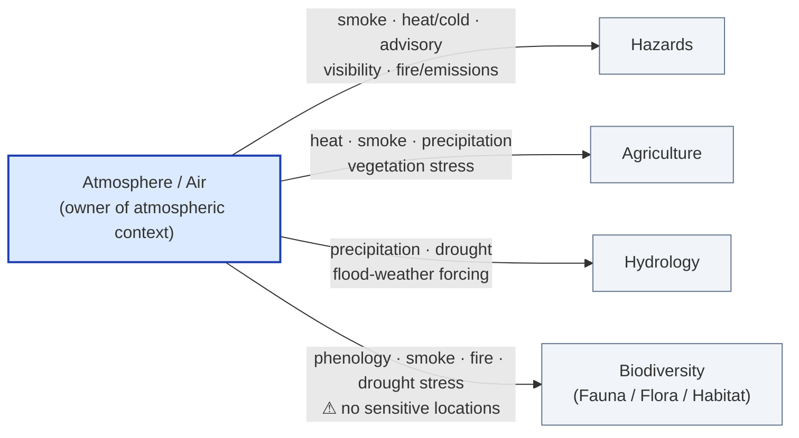

<!-- [KFM_META_BLOCK_V2]
doc_id: kfm://doc/atmosphere-cross-lane-relations
title: Atmosphere / Air — Cross-Lane Relations
type: standard
version: v1
status: draft
owners: <atmosphere-domain-steward> (PLACEHOLDER — assign before review)
created: 2026-05-28
updated: 2026-05-28
policy_label: public
related: [ai-build-operating-contract.md, directory-rules.md, docs/domains/atmosphere/README.md, docs/atlases/cross-lane-relation-atlas.md]
tags: [kfm, atmosphere, air, cross-lane, governance]
notes: [CONTRACT_VERSION = "3.0.0"; repo presence of every path below is PROPOSED until a mounted repo is inspected; schema/contract segment is "air/" while docs segment is "atmosphere/" — see Open Questions OQ-AIR-XL-02]
[/KFM_META_BLOCK_V2] -->

# 🌫️ Atmosphere / Air — Cross-Lane Relations

> How the Atmosphere / Air domain relates to neighboring KFM lanes — and the governance constraints every cross-lane join must preserve.

<!-- badges -->


**Status:** draft · **Owners:** `<atmosphere-domain-steward>` (PLACEHOLDER) · **Updated:** 2026-05-28
**Contract pin:** `CONTRACT_VERSION = "3.0.0"`

---

## Quick jump

- [1. Scope](#1-scope)
- [2. Repo fit](#2-repo-fit)
- [3. What a cross-lane relation is](#3-what-a-cross-lane-relation-is)
- [4. The four relation constraints](#4-the-four-relation-constraints)
- [5. Cross-lane relation map](#5-cross-lane-relation-map)
- [6. Relation diagram](#6-relation-diagram)
- [7. Source-role anti-collapse](#7-source-role-anti-collapse)
- [8. Sensitivity posture for joins](#8-sensitivity-posture-for-joins)
- [9. Worked join examples (illustrative)](#9-worked-join-examples-illustrative)
- [Open questions register](#open-questions-register)
- [Open verification backlog](#open-verification-backlog)
- [Changelog v0 → v1](#changelog-v0--v1)
- [Definition of done](#definition-of-done)
- [Related docs](#related-docs)

---

## 1. Scope

This document records the **cross-lane relations** that the Atmosphere / Air domain
participates in, and the governance constraints that any such relation MUST preserve. It
is the human-facing companion to the per-domain *F. Cross-lane relations* table for
Atmosphere / Air in the Domains Atlas.

> [!NOTE]
> **What this doc is.** A navigational governance document. It explains relationships and
> the rules that bind them. It is **not** authoritative over decisions — machine-readable
> contracts, schemas, and policies govern actual admission and release. `CONFIRMED` doctrine.

**In scope**
- The neighboring lanes Atmosphere / Air relates to.
- The relation type for each edge (what the neighbor may cite).
- The constraint every edge MUST satisfy (ownership, source role, sensitivity, `EvidenceBundle`).
- Source-role anti-collapse as it applies acutely to this domain.

**Out of scope**
- Object-family meaning → `contracts/air/` *(PROPOSED path)*.
- Field-level shape → `schemas/contracts/v1/air/` *(PROPOSED path)*.
- Allow/deny/restrict decisions → `policy/` *(PROPOSED)*.
- The canonical owner-by-owner master matrix → `docs/atlases/cross-lane-relation-atlas.md` *(PROPOSED)*.

[Back to top](#-atmosphere--air--cross-lane-relations)

---

## 2. Repo fit

`PROPOSED` placement, justified against **Directory Rules §4**:

| Step | Decision | Basis |
|---|---|---|
| 1 — Responsibility | Explains something to humans → `docs/` | Directory Rules §4 Step 1 (`CONFIRMED` rule) |
| 2 — Lifecycle phase | n/a (not under `data/`) | Directory Rules §4 Step 2 |
| 3 — Domain segment | `atmosphere` is a **segment**, never a root → `docs/domains/atmosphere/` | Directory Rules §3, §4 Step 3 (`CONFIRMED` rule) |
| 4 — Authority | Owning root `docs/` exists or is created with a per-root README | Directory Rules §4 Step 4 — `PROPOSED` until repo inspected |
| 5 — Cite the rule | This table | Directory Rules §4 Step 5 |

```text
docs/
└── domains/
    └── atmosphere/
        ├── README.md                 # domain landing page (PROPOSED neighbor)
        ├── CROSS_LANE_RELATIONS.md    # ← this file
        └── architecture/             # PROPOSED neighbor
```

> [!IMPORTANT]
> **Naming divergence flagged.** The Atlas crosswalk uses the schema/contract segment
> `air/` (`schemas/contracts/v1/air/`, `contracts/air/`), while this doc lives under the
> docs segment `atmosphere/`. Both are attested in the corpus; reconcile via
> [OQ-AIR-XL-02](#open-questions-register) before promotion. `CONFLICTED` until resolved.

**Upstream / downstream**
- **Upstream doctrine:** [`ai-build-operating-contract.md`](../../../ai-build-operating-contract.md) v3.0, [`directory-rules.md`](../../../directory-rules.md).
- **Sibling source:** Atmosphere / Air chapter *F. Cross-lane relations* in the Domains Atlas (`LINEAGE`).
- **Downstream consumer:** the master Cross-Lane Relation Atlas *(PROPOSED `docs/atlases/`)*.

[Back to top](#-atmosphere--air--cross-lane-relations)

---

## 3. What a cross-lane relation is

A **cross-lane relation** is an edge by which one domain (the *consumer*) cites a
public-safe surface owned by another domain (the *owner*). `CONFIRMED` doctrine: every
domain owns its objects and publishes interfaces that other domains **may cite, but never
modify**.

- Atmosphere / Air **owns** objects such as `AirStation`, `AirObservation`,
  `PM2.5 Observation`, `Ozone Observation`, `SmokeContext`, `AODRaster`, `Weather Station`,
  `Weather Observation`, `WindField`, `Precipitation Observation`,
  `Temperature Observation`, `Climate Normal`, `Climate Anomaly`, `Forecast Context`, and
  `Advisory Context`. `CONFIRMED / PROPOSED` per the domain scope section.
- Atmosphere / Air **explicitly does not own** emergency / hazard-event truth or
  life-safety context — that belongs to **Hazards**. `CONFIRMED / PROPOSED`.

> [!CAUTION]
> Atmosphere / Air is **never an alert authority.** Advisory and alert context is cited,
> not originated, and life-safety claims route to the Hazards lane. `CONFIRMED` doctrine.

[Back to top](#-atmosphere--air--cross-lane-relations)

---

## 4. The four relation constraints

Every Atmosphere / Air cross-lane edge carries the same constraint in the source tables:
the relation **must preserve ownership, source role, sensitivity, and `EvidenceBundle`
support**. `CONFIRMED / PROPOSED`.

| # | Constraint | What it means | Failure if violated |
|---|---|---|---|
| 1 | **Ownership** | The owning domain keeps meaning, lifecycle, and release authority; the consumer only cites. | A consumer silently redefines or "owns" another lane's object. |
| 2 | **Source role** | `observed` / `regulatory` / `modeled` / `aggregate` roles stay distinct across the join. | A modeled forecast is read as an observed measurement. |
| 3 | **Sensitivity** | The most-restrictive applicable tier governs the joined product. | A sensitive location is implied from joined geometry. |
| 4 | **`EvidenceBundle` support** | Each side resolves to its own `EvidenceBundle`; claims do not float free of evidence. | An uncited or weakly-supported claim is published as authoritative. |

> [!WARNING]
> **Source-role collapse is the most common silent failure.** It is a doctrine violation
> *even when the underlying data are correct*. See [§7](#7-source-role-anti-collapse).

[Back to top](#-atmosphere--air--cross-lane-relations)

---

## 5. Cross-lane relation map

The four edges below are sourced directly from the Atmosphere / Air *F. Cross-lane
relations* table. `CONFIRMED` as transcription of source doctrine; lane application
`PROPOSED`.

| Related lane | Relation type | Constraint |
|---|---|---|
| **Hazards** | smoke, heat/cold, advisory, visibility, fire/emissions context | Must preserve ownership, source role, sensitivity, and `EvidenceBundle` support. |
| **Agriculture** | heat, smoke, precipitation, vegetation stress | Must preserve ownership, source role, sensitivity, and `EvidenceBundle` support. |
| **Hydrology** | precipitation, drought, flood-weather forcing | Must preserve ownership, source role, sensitivity, and `EvidenceBundle` support. |
| **Biodiversity domains** (Fauna / Flora / Habitat) | phenology, smoke, fire, drought stress — **without exposing sensitive locations** | Must preserve ownership, source role, sensitivity, and `EvidenceBundle` support. |

> [!NOTE]
> **Direction of the edge.** In each row Atmosphere / Air is the **owner** of the cited
> atmospheric context; the neighboring lane is the **consumer** that joins it to its own
> canonical claims. The neighbor never modifies Atmosphere / Air objects.

[Back to top](#-atmosphere--air--cross-lane-relations)

---

## 6. Relation diagram

> [!NOTE]
> Diagram reflects the four `CONFIRMED`-transcribed edges in [§5](#5-cross-lane-relation-map).
> It is a relationship sketch, not a claim about implemented routes or code. `PROPOSED`
> for any runtime realization.



[Back to top](#-atmosphere--air--cross-lane-relations)

---

## 7. Source-role anti-collapse

For Atmosphere / Air the source-role anti-collapse rule is **acute** — the Atlas crosswalk
flags this lane specifically. `CONFIRMED` doctrine: observed, regulatory, modeled, and
aggregate roles must remain distinct on both sides of any join.

| Source role | Example Atmosphere / Air families | What it must NOT be silently read as |
|---|---|---|
| `observed` (sensor) | `AirObservation`, `PM2.5 Observation`, `Weather Observation` | A modeled or forecast value. |
| `regulatory` (archive) | EPA AQS-like archive records | A live observed measurement. |
| `modeled` (field) | `WindField`, CAMS/ECMWF-family fields, HRRR-Smoke forecast | An observation or a regulatory record. |
| `aggregate` | `Climate Normal`, `Climate Anomaly`, fusion products | A per-place observation. |

> [!CAUTION]
> The canonical collapse risk for this lane: **a modeled forecast read as an observed
> measurement.** Any Atmosphere × Hazards or Atmosphere × any-lane join MUST keep these
> roles labeled distinctly. `CONFIRMED` doctrine.

Time fields likewise stay distinct where material: `CONFIRMED` — source, observed, valid,
retrieval, release, and correction times do not collapse into one timestamp.

<details>
<summary><strong>Source families that feed these roles (reference)</strong></summary>

> Rights and current terms for each family are `NEEDS VERIFICATION`; sensitive joins fail
> closed. Roles are assigned per `SourceDescriptor`, not fixed by family name.

| Source family | Typical role(s) |
|---|---|
| OpenAQ-like aggregators | aggregate / observation context |
| EPA AQS-like archive | regulatory archive |
| AirNow / agency reporting | observation / advisory context |
| CAMS / ECMWF-family model fields | modeled field |
| HRRR-Smoke / NOAA smoke forecast | modeled field |
| HMS smoke | remote-sensing / context |
| GOES/ABI AOD | remote-sensing mask |
| VIIRS fire/hotspot | remote-sensing detection |

*Source-family role assignment is `CONFIRMED / PROPOSED` per the domain D. table.*

</details>

[Back to top](#-atmosphere--air--cross-lane-relations)

---

## 8. Sensitivity posture for joins

The **most-restrictive applicable** sensitivity tier governs a joined product. For
Atmosphere / Air the binding case is the **Biodiversity** edge.

> [!CAUTION]
> **Biodiversity join — no sensitive-location exposure.** Phenology, smoke, fire, and
> drought-stress context MAY be cited by Fauna / Flora / Habitat, but the join MUST NOT
> reveal sensitive species locations (nests, dens, roosts, hibernacula, spawning areas).
> Species sensitivity sets the tier; atmospheric geometry alone must not let a sensitive
> occurrence be inferred. Route disposition through the operating contract **§23.2**
> sensitive-domain matrix; on no clear match, **DENY public exact exposure → GENERALIZE →
> REDACT → QUARANTINE → require steward review → require `RedactionReceipt`**. `CONFIRMED`
> doctrine / `PROPOSED` implementation.

For the other three edges (Hazards, Agriculture, Hydrology), atmospheric context is
generally lower-sensitivity, but the joined product still inherits the **neighbor's**
tier where the neighbor contributes restricted geometry or identity. Link the relevant
`policy/sensitivity/` entry, or surface that one is missing. `PROPOSED` — the precise
`policy/sensitivity/air/` home is `NEEDS VERIFICATION`.

[Back to top](#-atmosphere--air--cross-lane-relations)

---

## 9. Worked join examples (illustrative)

> [!NOTE]
> Examples are **illustrative**, not sourced from a mounted repo. They show how the four
> constraints apply; they do not assert that any pipeline implements them. `PROPOSED`.

<details>
<summary><strong>Example A — Atmosphere × Hazards (smoke during a wildfire)</strong></summary>

```text
Consumer:  Hazards (Wildfire Detection / Warning Context)
Cites:     SmokeContext, AODRaster  (owner: Atmosphere / Air)

Constraint check:
  ownership          → Hazards cites SmokeContext; does not redefine it.        ✔
  source role        → HRRR-Smoke forecast labeled `modeled`, NOT observed.     ✔
  sensitivity        → no sensitive location exposed; T0 context.               ✔
  EvidenceBundle     → SmokeContext resolves to its own bundle.                 ✔

Forbidden:  presenting a modeled smoke plume as an observed measurement,
            or letting Atmosphere originate the life-safety alert.
```

</details>

<details>
<summary><strong>Example B — Atmosphere × Biodiversity (drought stress on a rare plant)</strong></summary>

```text
Consumer:  Flora (rare-plant lane)
Cites:     Climate Anomaly (drought)  (owner: Atmosphere / Air)

Constraint check:
  ownership          → Flora cites the anomaly; Atmosphere owns it.             ✔
  source role        → `aggregate` anomaly NOT read as per-site observation.    ✔
  sensitivity        → species sensitivity sets tier; join must NOT reveal
                       the rare-plant location → GENERALIZE / DENY exact.       ⚠ steward review
  EvidenceBundle     → anomaly + occurrence each resolve to their own bundle.   ✔

Disposition:  most-restrictive row (rare-species location) applies;
              RedactionReceipt required before any public release.
```

</details>

[Back to top](#-atmosphere--air--cross-lane-relations)

---

## Open questions register

| ID | Question | Owner role | Resolution path |
|---|---|---|---|
| OQ-AIR-XL-01 | Are all four edges (Hazards, Agriculture, Hydrology, Biodiversity) the complete set, or do additional edges (e.g., Spatial Foundation overlay primitives) belong here? | atmosphere steward | repo inspection + Atlas §24.4 check |
| OQ-AIR-XL-02 | Reconcile docs segment `atmosphere/` vs schema/contract segment `air/`. | docs steward + atmosphere steward | ADR |
| OQ-AIR-XL-03 | Confirm canonical home of `policy/sensitivity/` entry for atmosphere joins. | policy steward | Directory Rules check + repo inspection |
| OQ-AIR-XL-04 | Confirm canonical master atlas path (`docs/atlases/cross-lane-relation-atlas.md`?). | docs steward | repo inspection |

## Open verification backlog

These items remain `NEEDS VERIFICATION` before promotion from `draft` to `published`:

1. Every repo path in this doc (`docs/domains/atmosphere/`, `contracts/air/`, `schemas/contracts/v1/air/`, `policy/sensitivity/air/`).
2. The complete edge set for Atmosphere / Air (OQ-AIR-XL-01).
3. Owner field and any required reviewer roles.
4. The `air/` vs `atmosphere/` segment reconciliation (OQ-AIR-XL-02).
5. Rights/terms for each source family feeding the role table in §7.

## Changelog v0 → v1

| Change | Type (per contract §37) | Reason |
|---|---|---|
| Initial draft transcribing the Atmosphere / Air *F. Cross-lane relations* table | new | Stand up the human-facing cross-lane doc for this lane. |
| Added source-role anti-collapse section | gap closure | Atlas flags this lane's collapse risk as acute. |
| Added sensitivity posture for the Biodiversity edge | gap closure | Source table requires "without exposing sensitive locations." |

> **Backward compatibility.** New file; no prior anchors to preserve. Heading anchors are
> stable from v1 onward.

## Definition of done

This document is done enough to enter the repository when:

- it is placed according to Directory Rules (and OQ-AIR-XL-02 is resolved);
- a docs steward and the atmosphere domain steward review it;
- it is linked from the atmosphere domain index and the master cross-lane atlas;
- it does not conflict with accepted ADRs;
- any conflict with current repo conventions is logged in `docs/registers/DRIFT_REGISTER.md`;
- the `GENERATED_RECEIPT.json` planned in the PR is wired into CI;
- future changes follow the operating contract's §37 lifecycle.

---

## Related docs

- [`ai-build-operating-contract.md`](../../../ai-build-operating-contract.md) — operating contract v3.0 *(verify relative path)*
- [`directory-rules.md`](../../../directory-rules.md) — placement authority *(verify relative path)*
- `docs/domains/atmosphere/README.md` — domain landing page *(TODO — confirm exists)*
- `docs/atlases/cross-lane-relation-atlas.md` — master owner-by-owner matrix *(TODO — confirm path)*

**Last updated:** 2026-05-28 · [Back to top](#-atmosphere--air--cross-lane-relations)
