<!-- [KFM_META_BLOCK_V2]
doc_id: kfm://doc/domains/atmosphere/data-lifecycle
title: Atmosphere / Air — Data Lifecycle
type: standard
version: v1
status: draft
owners: Atmosphere/Air domain steward · Pipeline steward · Docs steward
created: 2026-05-15
updated: 2026-05-28
policy_label: public
related:
  - ai-build-operating-contract.md
  - docs/doctrine/lifecycle-law.md
  - docs/doctrine/directory-rules.md
  - docs/doctrine/trust-membrane.md
  - docs/doctrine/truth-posture.md
  - docs/domains/atmosphere/README.md
  - docs/domains/atmosphere/CROSS_LANE_RELATIONS.md
  - docs/architecture/governed-api.md
  - docs/standards/PROV.md
  - docs/standards/ISO-19115.md
tags: [kfm, domain, atmosphere, air, lifecycle, governance, publication]
notes:
  - CONTRACT_VERSION = "3.0.0" (doctrine-adjacent doc).
  - All repo-shaped paths are PROPOSED until verified against the mounted repository.
  - Atmosphere/Air does not replace official advisories or emergency alerting.
[/KFM_META_BLOCK_V2] -->

# Atmosphere / Air — Data Lifecycle

> The governed path that air-quality, smoke, weather, climate, and model evidence must traverse before any artifact reaches a public surface — from source admission to released, rollback-capable publication.

<p align="center">
  
  
  
  
  
  
  
  <!-- TODO: replace placeholder badges with CI / coverage / freshness endpoints once wired -->
</p>

| Status | Owners | Last updated |
|---|---|---|
| `draft` | Atmosphere/Air domain steward · Pipeline steward · Docs steward | 2026-05-28 |

> [!IMPORTANT]
> This document is **doctrine, applied to a domain**. The lifecycle invariant
> (`RAW → WORK / QUARANTINE → PROCESSED → CATALOG / TRIPLET → PUBLISHED`) is **CONFIRMED**.
> All file paths, route names, and validator names cited below are **PROPOSED** until verified
> against the mounted Kansas Frontier Matrix repository. Atmosphere/Air **is not** an emergency
> alerting system — it carries evidence-labeled context, not life-safety instructions.
> Pinned `CONTRACT_VERSION = "3.0.0"`.

---

## Contents

- [1. Scope and boundary](#1-scope-and-boundary)
- [2. The lifecycle at a glance](#2-the-lifecycle-at-a-glance)
- [3. Stage-by-stage handling](#3-stage-by-stage-handling)
- [4. Promotion gates](#4-promotion-gates)
- [5. Receipts × lifecycle phase](#5-receipts--lifecycle-phase)
- [6. Atmosphere knowledge-character rules](#6-atmosphere-knowledge-character-rules)
- [7. Sensitivity, rights, and publication posture](#7-sensitivity-rights-and-publication-posture)
- [8. Finite outcomes and fail-closed defaults](#8-finite-outcomes-and-fail-closed-defaults)
- [9. Cross-lane handoffs](#9-cross-lane-handoffs)
- [10. Validators, tests, and fixtures](#10-validators-tests-and-fixtures)
- [11. Correction and rollback](#11-correction-and-rollback)
- [12. Directory placement (PROPOSED)](#12-directory-placement-proposed)
- [Open questions register](#open-questions-register)
- [Open verification backlog](#open-verification-backlog)
- [Changelog v0 → v1](#changelog-v0--v1)
- [Definition of done](#definition-of-done)
- [Related docs](#related-docs)
- [Appendix A — Glossary](#appendix-a--glossary)

---

## 1. Scope and boundary

**CONFIRMED doctrine / PROPOSED implementation.** Atmosphere/Air owns the air-quality, smoke,
weather, climate-context, and atmospheric-model data lifecycle inside KFM: from source admission
through public-safe, rollback-capable publication. The domain serves **evidence-labeled
observations, official contexts, or derived products** — never emergency instructions.

| In scope | Out of scope |
|---|---|
| Station observations (AirStation, WeatherStation) | Issuing or replacing official advisories / watches / warnings |
| Air-quality parameters (PM2.5, ozone, etc.) | Life-safety routing, evacuation, or emergency alerting |
| Smoke / AOD context (SmokeContext, AODRaster) | Authoritative health guidance |
| Wind / precipitation / temperature surfaces | Hydrologic flood routing (owned by Hydrology) |
| Climate normals and anomalies | Wildfire ignition / suppression decisions (owned by Hazards) |
| Forecast and model fields (context only) | Sensitive joins that re-identify individuals |
| Advisory context with redirection to official source | Direct public access to `RAW`, `WORK`, or `QUARANTINE` |

> [!NOTE]
> Where a downstream domain (e.g., Hazards, Agriculture, Hydrology, Biodiversity) consumes
> atmosphere-derived context, the **source role, sensitivity, evidence support, and release
> state of the originating atmosphere artifact MUST be preserved** across the handoff. See
> [§9. Cross-lane handoffs](#9-cross-lane-handoffs) and the companion
> [`CROSS_LANE_RELATIONS.md`](./CROSS_LANE_RELATIONS.md) *(PROPOSED neighbor)*.

[Back to top](#contents)

---

## 2. The lifecycle at a glance

**CONFIRMED doctrine.** Every Atmosphere/Air artifact traverses the KFM lifecycle invariant.
Promotion between phases is a **governed state transition, not a file move**: a path-level move
that bypasses validators, policy gates, evidence-bundle creation, catalog closure, and
release-decision recording is a violation of the invariant regardless of which directory the
bytes ended up in.

```mermaid
flowchart LR
    SRC([Candidate source<br/>AQS · AirNow · NWS · Mesonet<br/>HRRR-Smoke · HMS · CAMS<br/>GOES/ABI · VIIRS · OpenAQ])
    RAW[RAW<br/>immutable capture]
    WORK[WORK<br/>normalization]
    QUAR[QUARANTINE<br/>defects held]
    PROC[PROCESSED<br/>validated, public-safe candidate]
    CAT[CATALOG / TRIPLET<br/>evidence + graph projection]
    PUB[PUBLISHED<br/>governed API · LayerManifest]

    SRC -->|Admission gate<br/>SourceDescriptor| RAW
    RAW -->|Normalization gate<br/>TransformReceipt + PolicyDecision| WORK
    RAW -.->|defects| QUAR
    WORK -->|Validation gate<br/>ValidationReport + Redaction/Aggregation| PROC
    WORK -.->|fail| QUAR
    PROC -->|Catalog closure<br/>EvidenceBundle + CatalogMatrix| CAT
    CAT -->|Release gate<br/>ReleaseManifest + RollbackCard + ReviewRecord| PUB
    PUB -.->|CorrectionNotice| PUB
    PUB -.->|RollbackCard| CAT

    classDef gov fill:#0aa,stroke:#055,color:#fff;
    classDef quar fill:#a55,stroke:#722,color:#fff;
    class RAW,WORK,PROC,CAT,PUB gov;
    class QUAR quar;
```



> [!TIP]
> Read the diagram as *gates*, not *folders*. A bytes-only move into `data/processed/atmosphere/`
> with no `ValidationReport`, `EvidenceRef`, and resolved policy decision is **not** a
> `PROCESSED` artifact — it is an ungoverned blob in the wrong place.

[Back to top](#contents)

---

## 3. Stage-by-stage handling

**CONFIRMED doctrine / PROPOSED implementation.** Each row below restates the universal
KFM stage (per the Atmosphere/Air *H. Pipeline shape* table) and adds the atmosphere-specific
handling burden. Implementation maturity for each stage in the mounted repository is **UNKNOWN**
in this session.

### 3.1 RAW — admitted source material under source identity

| Aspect | Specification |
|---|---|
| **Purpose** | Capture immutable source payload or reference with source role, rights, sensitivity, citation, time, and content hash. |
| **Gate (CONFIRMED doctrine)** | `SourceDescriptor` exists. |
| **Required artifact** | `SourceDescriptor` (role, authority, rights, sensitivity, cadence, ingest hash, time, citation); `RawCaptureReceipt`. |
| **Atmosphere specifics** | Pin **issue/expiry time**, **observed time**, **valid time**, **model run time**, and **units** at admission. Sensor channels and station network identity preserved verbatim. |
| **Public access** | **DENIED.** RAW is not a public surface. |
| **Failure mode** | Source not admitted; logged as candidate awaiting steward. |
| **Proposed home (PROPOSED)** | `data/raw/atmosphere/<source_id>/<run_id>/` |

### 3.2 WORK — transformation and candidate space

| Aspect | Specification |
|---|---|
| **Purpose** | Normalize schema, geometry, time, identity, evidence, rights, and policy. |
| **Gate (CONFIRMED doctrine)** | Validation and policy gate pass, or quarantine reason is recorded. |
| **Required artifacts** | `TransformReceipt`; working `ValidationReport`; `PolicyDecision`. |
| **Atmosphere specifics** | Unit conversions (e.g., µg/m³ ↔ ppb) emit `TransformReceipt` recording the conversion factor and reference. Station/network harmonization recorded. Low-cost sensor calibration and correction context attached (never silently flattened to "PM2.5"). |
| **Public access** | **DENIED.** |
| **Failure mode** | Quarantine with reason; **never silently promotes**. |
| **Proposed home (PROPOSED)** | `data/work/atmosphere/<run_id>/` |

### 3.3 QUARANTINE — governed holding state

| Aspect | Specification |
|---|---|
| **Purpose** | Hold material with rights, sensitivity, validation, source-role, evidence, temporal, or policy defects. |
| **Required artifacts** | `QuarantineRecord` (reason); references to failing `ValidationReport` or `PolicyDecision`. |
| **Atmosphere specifics** | Common triggers: unresolved low-cost-sensor calibration; stale source past freshness threshold; advisory text without authoritative source attribution; sensor channel divergence; impossible PM values; rights ambiguity for OpenAQ-like aggregators. |
| **Public access** | **DENIED.** Quarantine is **not** a publishable staging area. |
| **Exit path** | Steward decision → return to `WORK`, request source amendment, or retire candidate. |
| **Proposed home (PROPOSED)** | `data/quarantine/atmosphere/<reason>/<run_id>/` |

### 3.4 PROCESSED — validated, public-safe candidate

| Aspect | Specification |
|---|---|
| **Purpose** | Emit validated, normalized objects with receipts; produce public-safe candidates. |
| **Gate (CONFIRMED doctrine)** | `EvidenceRef`, `ValidationReport`, and digest closure exist. |
| **Required artifacts** | `ValidationReport` (pass); `RedactionReceipt` if sensitivity applies; `AggregationReceipt` if applies; resolvable `EvidenceRef`; digest closure. |
| **Atmosphere specifics** | Knowledge-character labels attached: `OBSERVATION`, `PUBLIC_AQI_REPORT`, `REGULATORY_ARCHIVE`, `MODEL_FIELD`, `REMOTE_SENSING_MASK`, `CLIMATE_NORMAL/ANOMALY`, `DERIVED_FUSION`, `ALERT_AND_ADVISORY_CONTEXT`, `NETWORK_AND_SITE_CONTEXT`. Stale-state flags computed against source cadence. |
| **Public access** | **DENIED** as canonical; public surfaces only see published derivatives. |
| **Failure mode** | Stay in `WORK`; structured `FAIL` outcome. |
| **Proposed home (PROPOSED)** | `data/processed/atmosphere/<dataset_id>/<version>/` |

### 3.5 CATALOG / TRIPLET — discovery, claim, and graph projection

| Aspect | Specification |
|---|---|
| **Purpose** | Emit catalog records, `EvidenceBundle`s, graph/triplet projections, and release candidates. |
| **Gate (CONFIRMED doctrine)** | Catalog / proof closure passes. |
| **Required artifacts** | `CatalogMatrix` entry; `EvidenceBundle`; graph/triplet projection where applicable; `ReviewRecord` if review is required. |
| **Atmosphere specifics** | Realtime and historical AQ products **split into distinct catalog collections** (different cadence, freshness, and rights). STAC items partition by hourly window or sensor chunk. PROV activities record fetch and normalization. |
| **Public access** | **DENIED.** No public edge until `PUBLISHED`. |
| **Failure mode** | Hold at `PROCESSED`; structured `FAIL`; no public surface change. |
| **Proposed home (PROPOSED)** | `data/catalog/domain/atmosphere/`; `data/triplets/graph_deltas/atmosphere/` |

### 3.6 PUBLISHED — released, rollback-capable public surface

| Aspect | Specification |
|---|---|
| **Purpose** | Serve released, policy-allowed, reviewable, rollback-capable artifacts through governed APIs and manifests. |
| **Gate (CONFIRMED doctrine)** | `ReleaseManifest`, correction path, rollback target, and review/policy state exist. |
| **Required artifacts** | `ReleaseManifest`; resolvable `EvidenceBundle`; `RollbackCard` (target); correction path; `ReviewRecord` (where required); policy posture recorded. |
| **Atmosphere specifics** | Public release of **low-cost sensor data requires correction, caveats, confidence, and limitations** on the surface. AdvisoryContext layers carry **redirection to the official source** rather than reproducing life-safety text. |
| **Public access** | **ALLOWED** through `apps/governed-api/` only — never direct reads of `data/processed/` or `data/catalog/`. |
| **Failure mode** | Hold at `CATALOG`; no public surface change. |
| **Proposed home (PROPOSED)** | `data/published/layers/atmosphere/`; `data/published/api_payloads/atmosphere/`; release decisions under `release/candidates/atmosphere/` and `release/manifests/`. |

> [!WARNING]
> Connectors **MUST NOT** write to `data/processed/`, `data/catalog/`, or `data/published/`.
> Watchers **MUST NOT** publish — they emit receipts and candidate decisions only. Both rules
> are derived from the trust-membrane and watcher-as-non-publisher invariants in KFM doctrine.

[Back to top](#contents)

---

## 4. Promotion gates

**CONFIRMED doctrine.** Each transition between phases is a *gate*, not a directory move.
Every gate has a pre-condition, required artifacts, and a **failure-closed outcome**: if the
required artifacts are not present, the artifact does not advance. For Atmosphere/Air the
gates are doctrinally identical to the KFM-wide Master Pipeline Gate Reference; the
**artifacts** that satisfy each gate are domain-shaped.

| Gate (transition) | Pre-condition | Required artifacts (PROPOSED minimum) | Atmosphere-flavored emphasis | Failure-closed outcome |
|---|---|---|---|---|
| **Admission** (— → `RAW`) | Source identity and rights minimally established; source-role intent set. | `SourceDescriptor`; payload or reference hash. | Authority vs. observation vs. context vs. model role explicit per source family. | Source not admitted; logged as candidate awaiting steward. |
| **Normalization** (`RAW` → `WORK` / `QUARANTINE`) | Schema, geometry, time, identity, evidence, rights, and policy rules are runnable. | `TransformReceipt`; working `ValidationReport`; `PolicyDecision`; `QUARANTINE` for failures. | Unit conversions and calibration corrections are receipts, not silent edits. | Quarantine with reason; never silently promotes. |
| **Validation** (`WORK` → `PROCESSED`) | Validators deterministic and tied to fixtures; required receipts present. | `ValidationReport` pass; `RedactionReceipt` if sensitivity applies; `AggregationReceipt` if applies. | Knowledge-character label attached; stale-state computed; AQI-vs-concentration / AOD-vs-PM2.5 / model-vs-observed checks pass. | Stay in `WORK`; structured `FAIL` outcome. |
| **Catalog closure** (`PROCESSED` → `CATALOG` / `TRIPLET`) | `EvidenceRef`s resolve; catalog matrix and digests close. | `CatalogMatrix` entry; `EvidenceBundle`; graph/triplet projections if applicable. | Realtime and historical AQ collections split; PROV activity recorded. | HOLD at `PROCESSED`; structured `FAIL`; no public edge. |
| **Release** (`CATALOG` / `TRIPLET` → `PUBLISHED`) | Review state where required; release authority distinct from author where materiality applies. | `ReleaseManifest`; rollback target; correction path; `ReviewRecord` (if required). | Low-cost sensor caveats present; advisory redirection in place; freshness badge accurate. | HOLD at `CATALOG`; no public surface change. |
| **Correction** (`PUBLISHED` → `PUBLISHED′`) | Detected error or new evidence; downstream derivatives identified. | `CorrectionNotice`; new `ReleaseManifest`; `RollbackCard` target; invalidates list. | Stale-source detection and operator-initiated corrections both flow through this gate. | Correction blocked; surface uncorrected with stale/contested badge until decision. |

> [!CAUTION]
> **Default-deny on missing evidence.** Promotion is denied unless every required artifact is
> present, resolvable, and policy-allowed for the target phase. Absence of evidence is not
> permission — it is a fail-closed signal.

[Back to top](#contents)

---

## 5. Receipts × lifecycle phase

**CONFIRMED doctrine.** A receipt is a structured, persisted record of a specific governed
operation, with enough context for audit and rollback. **If no receipt exists, the operation
did not happen in the governed sense.** Receipts created at earlier phases remain *referenced*
(not duplicated) at later phases via `EvidenceRef`.

The dots in the table below mean a receipt is normally **emitted, amended, or referenced** at
that phase for an Atmosphere/Air artifact. The set of receipt types is **PROPOSED** pending
verification against the repo's receipt catalog.

| Receipt | RAW | WORK / QUARANTINE | PROCESSED | CATALOG / TRIPLET | PUBLISHED |
|---|:---:|:---:|:---:|:---:|:---:|
| `SourceDescriptor` | • | • | • | • | • |
| `RawCaptureReceipt` | • |   |   |   |   |
| `RunReceipt` (fetch / pipeline run) | • | • | • | • | • |
| `TransformReceipt` (unit conv., projection, generalization) |   | • | • | • |   |
| `RedactionReceipt` |   | • | • | • |   |
| `AggregationReceipt` (decadal mean, county-year roll-up) |   | • | • | • |   |
| `ModelRunReceipt` (HRRR-Smoke, CAMS, fusion) |   | • | • | • |   |
| `RepresentationReceipt` (tile/PMTiles export) |   |   | • | • |   |
| `AIReceipt` |   |   |   | • | • (Focus Mode only) |
| `ReviewRecord` |   | • | • | • |   |
| `PolicyDecision` | • | • | • | • | • |
| `ValidationReport` |   | • | • | • |   |
| `ReleaseManifest` |   |   |   | • | • |
| `CorrectionNotice` |   |   |   |   | • |
| `RollbackCard` |   |   |   | • | • |
| `RealityBoundaryNote` (synthetic/reconstructed surfaces) |   |   | • | • | • |

> [!NOTE]
> **Atmosphere/Air receipts that warrant special attention:**
> `ModelRunReceipt` is required for any modeled smoke trajectory, AOD-derived surface, or
> fusion product; `AggregationReceipt` pins geometry and time scope for climate normals and
> anomaly surfaces; `RedactionReceipt` covers any public-safe transformation of sensor or
> network metadata; `TransformReceipt` covers unit conversions, projection, and generalization.

[Back to top](#contents)

---

## 6. Atmosphere knowledge-character rules

**CONFIRMED doctrine / PROPOSED field realization.** Atmosphere/Air is unusually prone to
**knowledge-character confusion** — different products look superficially similar but mean
fundamentally different things. The lifecycle enforces the distinctions through validator-level
denials and required labels.

> [!IMPORTANT]
> These are **non-negotiable, validator-enforceable denials** for the Atmosphere/Air lane
> (source: domain *I. Sensitivity, rights, and publication posture*):
>
> - **AQI is not concentration.** A claim that conflates a categorical Air Quality Index with
>   a measured concentration value is **DENIED**.
> - **AOD is not PM2.5.** Aerosol Optical Depth is a column-integrated optical property; it is
>   **not** a surface particulate concentration. A claim that treats AOD as PM2.5 is **DENIED**.
> - **Model fields are not observations.** Model output (HRRR-Smoke, CAMS, ECMWF-family) is
>   **MODEL_FIELD**, not **OBSERVATION**. A claim that promotes a model value to observed status
>   is **DENIED**.
> - **Low-cost sensor public release requires correction, caveats, confidence, and limitations.**
>   Uncorrected low-cost sensor output **MUST NOT** be published as direct truth.

### 6.1 Knowledge-character labels

| Label | Applies to | Lifecycle gate that asserts it |
|---|---|---|
| `OBSERVATION` | AirObservation, WeatherObservation, PM25Observation, OzoneObservation, PrecipitationObservation, TemperatureObservation | Validation gate |
| `PUBLIC_AQI_REPORT` | AirNow / agency AQI summaries | Validation gate |
| `REGULATORY_ARCHIVE` | EPA AQS-like archived station data | Validation gate |
| `MODEL_FIELD` | HRRR-Smoke, CAMS, ECMWF-family model output, ForecastContext | Validation gate |
| `REMOTE_SENSING_MASK` | HMS smoke, GOES/ABI AOD, VIIRS fire/hotspot | Validation gate |
| `CLIMATE_NORMAL_OR_ANOMALY` | ClimateNormal, ClimateAnomaly | Validation gate |
| `DERIVED_FUSION` | Multi-source fusion products | Validation gate |
| `ALERT_AND_ADVISORY_CONTEXT` | AdvisoryContext (with redirection to official source) | Validation gate |
| `NETWORK_AND_SITE_CONTEXT` | AirStation, WeatherStation, network metadata | Validation gate |

> [!TIP]
> The knowledge-character label is **part of the artifact's identity**, not decoration on the
> map. Two products with the same numbers and the same geometry but different labels are not
> interchangeable evidence.

[Back to top](#contents)

---

## 7. Sensitivity, rights, and publication posture

**CONFIRMED doctrine.** Unclear rights, unresolved source role, missing evidence, unresolved
sensitivity, or absent release state **blocks public promotion**. The Atmosphere/Air lane
applies this rule alongside domain-specific sensitivity considerations.

| Concern | Default posture | Required to relax default |
|---|---|---|
| Source rights / redistribution terms | **DENY public** when unknown or ambiguous. | Recorded `SourceDescriptor.rights`; license in allowlist; review record where required. |
| Low-cost sensor public exposure | **RESTRICT** until calibration/correction context attached. | `SensorCalibrationReceipt` (PROPOSED) with trust score, correction model, and QA flags; surface caveats. |
| Sensitive joins (e.g., facility-level pollutant ↔ small-population residence) | **DENY** by default. | `RedactionReceipt` with generalization, aggregation, or suppression; policy review. |
| Advisory / life-safety content | **NEVER** reproduced as authoritative. | Surface as `ALERT_AND_ADVISORY_CONTEXT` with redirection to official source only. |
| Stale source past freshness threshold | **ABSTAIN** or display stale badge. | Fresh fetch; new `RunReceipt`; updated catalog entry. |
| Synthetic or reconstructed surfaces | **DENY** if unlabeled. | `RealityBoundaryNote` published with the surface. |

> [!CAUTION]
> **Biodiversity handoff — no sensitive-location exposure.** Where phenology, smoke, fire, or
> drought-stress context is cited by Fauna / Flora / Habitat, the join MUST NOT reveal sensitive
> species locations. Route disposition through the operating contract **§23.2** sensitive-domain
> matrix; default chain is DENY exact → GENERALIZE → REDACT → QUARANTINE → steward review →
> `RedactionReceipt`. `CONFIRMED` doctrine / `PROPOSED` implementation.

> [!WARNING]
> **KFM Atmosphere/Air is not an emergency alert system.** It MUST NOT issue, replace, or
> simulate life-safety instructions. AdvisoryContext exists to *redirect* users to the
> authoritative emergency source, not to *substitute* for it.

[Back to top](#contents)

---

## 8. Finite outcomes and fail-closed defaults

**CONFIRMED doctrine.** Every governed API surface, validator, policy gate, and Focus Mode
answer for Atmosphere/Air returns a finite outcome from a small set. The runtime envelope
guarantees no out-of-band success or silent partial result.

| Outcome | Meaning | Typical cause in Atmosphere/Air |
|---|---|---|
| `ANSWER` | Evidence-supported, policy-allowed response with citation. | Released `PM25Observation` with resolvable `EvidenceBundle`. |
| `ABSTAIN` | Evidence insufficient or scope unresolvable. | Material temporal scope missing; stale beyond threshold; ambiguous knowledge character. |
| `DENY` | Policy, rights, sensitivity, or release state forbids the response. | Unknown rights; AQI-as-concentration request; uncorrected low-cost sensor in public path. |
| `ERROR` | System failure isolated from claim correctness. | Validator exception; retrieval timeout; downstream service unavailable. |

> [!NOTE]
> **`ABSTAIN ≠ ERROR`.** Abstention is an epistemic statement about the evidence; error is an
> operational statement about the system. Conflating the two erodes the truth posture.

[Back to top](#contents)

---

## 9. Cross-lane handoffs

**CONFIRMED / PROPOSED.** Atmosphere/Air evidence frequently flows into adjacent domains as
*context*, never as substitute truth. Each handoff **preserves ownership, source role,
sensitivity, and `EvidenceBundle` support** — the four-part constraint carried in the
domain's *F. Cross-lane relations* table.

| From Atmosphere/Air → To | Carried context | Constraint at handoff |
|---|---|---|
| Hazards | Smoke, heat/cold, advisory, visibility, fire-weather context | `SmokeContext` / `AdvisoryContext` retain authoring lane; Hazards does not relabel them as Hazard Events. |
| Agriculture | Heat, smoke, precipitation, vegetation-stress drivers | Aggregation scope and uncertainty preserved. |
| Hydrology | Precipitation, drought indicators, flood-weather forcing | Source role (observed vs. modeled) explicit; cadence and freshness recorded. |
| Biodiversity (Habitat, Fauna, Flora) | Phenology, smoke exposure, drought stress | Sensitive species locations **never** joined back; only public-safe geometry. |

> [!TIP]
> The cross-lane handoff is itself a governed operation. The receiving lane references the
> originating `EvidenceBundle` by `EvidenceRef` rather than copying values. Full edge detail
> lives in [`CROSS_LANE_RELATIONS.md`](./CROSS_LANE_RELATIONS.md) *(PROPOSED neighbor)*.

[Back to top](#contents)

---

## 10. Validators, tests, and fixtures

**PROPOSED.** The Atmosphere/Air lane carries the KFM-universal validator set plus
domain-specific knowledge-character validators (source: domain *K. Validators, tests,
fixtures*). Names and CI wiring are **PROPOSED** until verified against the mounted repository.

<details>
<summary><strong>Universal validator set (applies to all lanes)</strong></summary>

- Schema validation (`SourceDescriptor`, `LayerManifest`, `EvidenceBundle`, `RunReceipt`, `ReleaseManifest`, …)
- Source descriptor validation
- Rights validation
- Sensitivity validation
- Evidence closure (`EvidenceRef` resolves; bundle complete)
- Temporal logic (observed vs. valid vs. retrieval vs. release vs. correction time)
- Geometry validity
- Policy deny tests (negative fixtures)
- Citation validation
- Release manifest validation
- Rollback drill
- No-network fixtures (deterministic, offline)
- Non-regression tests for prior lineage

</details>

<details>
<summary><strong>Atmosphere/Air–specific validators (PROPOSED)</strong></summary>

- **Knowledge-character registry test** — every artifact carries a permitted label.
- **Unit normalization test** — receipts present for every unit conversion.
- **AQI-as-concentration denial** — negative fixture asserting denial.
- **AOD-as-PM2.5 denial** — negative fixture asserting denial.
- **Model-as-observed denial** — negative fixture asserting denial.
- **Low-cost sensor caveat test** — public surface includes correction, caveats, confidence, limitations.
- **Sensor sanity checks** — channel divergence and impossible PM values detected before publication.
- **Dry-run / no-live-fetch test** — pipeline runs deterministically without network.
- **Stale-source fixture** — stale beyond threshold triggers `ABSTAIN`/`DENY` or stale badge.
- **Advisory-redirection test** — `AdvisoryContext` surfaces redirect to authoritative source rather than reproduce life-safety text.

</details>

[Back to top](#contents)

---

## 11. Correction and rollback

**CONFIRMED doctrine / PROPOSED implementation.** Publication is reversible by design.
Atmosphere/Air corrections and rollbacks follow the KFM-wide pattern.

```mermaid
sequenceDiagram
    autonumber
    actor Steward as Steward
    participant CAT as CATALOG / TRIPLET
    participant PUB as PUBLISHED
    participant API as apps/governed-api/
    participant USER as Public surface

    Note over PUB: A correctable defect or new evidence arises.
    Steward->>PUB: Author CorrectionNotice + new ReleaseManifest
    PUB->>CAT: Record RollbackCard (release_id → rollback_to)
    Steward->>PUB: Invalidate listed derivatives
    PUB->>API: New release manifest takes effect
    API->>USER: Surface now reflects corrected state + correction lineage
    Note over USER: Prior release is rolled back, not deleted; lineage is preserved.
```

| Triggering condition | Required artifacts | Reversibility |
|---|---|---|
| Source error detected post-publication | `CorrectionNotice` + new `ReleaseManifest` + `ReviewRecord` | Yes — prior release retained as rollback target. |
| New authoritative evidence supersedes prior | `CorrectionNotice` + new `EvidenceBundle` + `ReleaseManifest` | Yes. |
| Validator regression in PUBLISHED layer | `RollbackCard` targeting last-known-good release | Yes. |
| Rights revocation by source authority | `CorrectionNotice` + `RedactionReceipt` + new `ReleaseManifest` | Yes — public surface demotes immediately. |

[Back to top](#contents)

---

## 12. Directory placement (PROPOSED)

**Source basis:** Directory Rules §6 (`docs/` and per-root trees), §9 (lifecycle phases under
`data/`), §12 (Domain Placement Law), and the §5 canonical root tree (CONFIRMED doctrine);
current repository inventory **UNKNOWN** in this session. Every path below is **PROPOSED**
until verified against mounted-repo evidence.

```text
docs/domains/atmosphere/                    # human-facing domain control plane (this file lives here)
contracts/domains/atmosphere/               # object-meaning Markdown (AirStation, AirObservation, …)
schemas/contracts/v1/domains/atmosphere/    # machine shapes (ADR-0001 canonical schema home)
policy/domains/atmosphere/                  # admissibility, sensitivity, release policy
tests/domains/atmosphere/                   # enforceability proof
fixtures/domains/atmosphere/                # golden / valid / invalid samples
packages/domains/atmosphere/                # shared atmosphere libraries
pipelines/domains/atmosphere/               # executable pipeline logic
pipeline_specs/atmosphere/                  # declarative pipeline configuration
data/raw/atmosphere/<source_id>/<run_id>/
data/work/atmosphere/<run_id>/
data/quarantine/atmosphere/<reason>/<run_id>/
data/processed/atmosphere/<dataset_id>/<version>/
data/catalog/domain/atmosphere/
data/triplets/graph_deltas/atmosphere/
data/published/layers/atmosphere/
data/published/api_payloads/atmosphere/
data/registry/sources/atmosphere/
data/receipts/{ingest,validation,pipeline,ai,release}/atmosphere/
data/proofs/{evidence_bundle,proof_pack,validation_report,citation_validation}/atmosphere/
data/rollback/atmosphere/<release_id>/
release/candidates/atmosphere/
```

> [!NOTE]
> **Directory Rules basis.** §12 (Domain Placement Law) requires the lane pattern: a domain
> MUST NOT become a root folder; it appears as a **segment** inside each responsibility root.
> §9 fixes the lifecycle phases under `data/`. ADR-0001 fixes `schemas/contracts/v1/...` as the
> canonical schema home. The schema/contract **segment name** for this lane is `air/` in the
> Atlas crosswalk (`schemas/contracts/v1/air/`) while the docs segment is `atmosphere/`; this
> divergence is flagged in [OQ-AIR-LC-01](#open-questions-register). `CONFLICTED` until resolved.

[Back to top](#contents)

---

## Open questions register

| ID | Question | Owner role | Resolution path |
|---|---|---|---|
| OQ-AIR-LC-01 | Reconcile docs segment `atmosphere/` vs schema/contract segment `air/`. | Docs steward + atmosphere steward | ADR |
| OQ-AIR-LC-02 | Is `SensorCalibrationReceipt` a real receipt type, or a sub-field of `TransformReceipt`? | Pipeline steward | Receipt-catalog inspection + ADR |
| OQ-AIR-LC-03 | Canonical home for the realtime-vs-historical AQ STAC collection split. | Catalog steward | repo inspection + ADR |
| OQ-AIR-LC-04 | Confirm `data/receipts/` and `data/proofs/` sub-segment names against the live tree. | Pipeline steward | mounted-repo inspection |

## Open verification backlog

These items remain `NEEDS VERIFICATION` before promotion from `draft` to `published`. Each
settles into `CONFIRMED` or `PROPOSED-with-fix` when checked against files, schemas, registry
entries, tests, logs, emitted artifacts, review records, or release manifests.

| Item to verify | Evidence that would settle it | Status |
|---|---|---|
| Existence and shape of atmosphere-lane directories under `data/`, `schemas/`, `policy/`, `tests/`, `pipelines/`. | Mounted-repo tree inspection. | **NEEDS VERIFICATION** |
| Live rights, terms, quotas, and attribution requirements per source family (AQS, AirNow, NWS, Mesonet, OpenAQ, CAMS, HRRR-Smoke, HMS, GOES/ABI, VIIRS). | `SourceDescriptor` entries with current license and terms. | **NEEDS VERIFICATION** |
| Implementation of the knowledge-character registry (label allowlist + enforcement). | Schema file + validator + negative fixtures. | **NEEDS VERIFICATION** |
| Validator exit-code contract for atmosphere validators. | `tools/validators/.../README.md` + ADR (open KFM-wide question OPEN-DR-03). | **NEEDS VERIFICATION** |
| Catalog / proof / release closure for at least one atmosphere thin-slice. | `EvidenceBundle` + `CatalogMatrix` + `ReleaseManifest` artifacts; CI logs. | **NEEDS VERIFICATION** |
| MapLibre / Evidence Drawer / Focus Mode integration for atmosphere layers. | `LayerManifest` + Evidence Drawer payload + `AIReceipt` examples. | **NEEDS VERIFICATION** |
| Realtime vs. historical AQ collection split in STAC. | STAC collection JSON. | **NEEDS VERIFICATION** |
| The receipt-type set in §5 (esp. `RunReceipt`, `ModelRunReceipt`, `SensorCalibrationReceipt`). | Repo receipt catalog / schemas. | **NEEDS VERIFICATION** |

## Changelog v0 → v1

| Change | Type (per contract §37) | Reason |
|---|---|---|
| Initial draft mapping the lifecycle invariant to the Atmosphere/Air lane | new | Stand up the domain lifecycle doctrine doc. |
| Added per-stage gate column matching the domain *H. Pipeline shape* table | clarification | Tie each stage to its CONFIRMED gate condition. |
| Added `RunReceipt` row to the receipts matrix | gap closure | §7 and Appendix referenced it; matrix omitted it. |
| Added doctrine companion sections (Open Qs, Changelog, DoD) | housekeeping | Required for doctrine-adjacent docs. |
| Pinned `CONTRACT_VERSION = "3.0.0"`; softened Directory Rules subsection citations (§9.1 → §9) | reconciliation | Cited subsection numbers not verified; corrected to verified sections. |

> **Backward compatibility.** Heading anchors for §§1–14 are preserved from the original draft;
> only tail companion sections were appended. The original Contents links remain valid.

## Definition of done

This document is done enough to enter the repository when:

- it is placed according to Directory Rules (and OQ-AIR-LC-01 is resolved);
- the Atmosphere/Air domain steward, pipeline steward, and a docs steward review it;
- it is linked from the atmosphere domain index and the lifecycle-law doctrine index;
- it does not conflict with accepted ADRs;
- any conflict with current repo conventions is logged in `docs/registers/DRIFT_REGISTER.md`;
- the `GENERATED_RECEIPT.json` planned in the PR is wired into CI;
- future changes follow the operating contract's §37 lifecycle.

[Back to top](#contents)

---

## Related docs

> Paths below are **PROPOSED** until verified.

- [`ai-build-operating-contract.md`](../../../ai-build-operating-contract.md) — operating contract v3.0 (canonical). *(Verify relative path.)*
- [`docs/doctrine/lifecycle-law.md`](../../doctrine/lifecycle-law.md) — CONFIRMED canonical statement of the lifecycle invariant.
- [`docs/doctrine/directory-rules.md`](../../doctrine/directory-rules.md) — Domain Placement Law and per-root authority.
- [`docs/doctrine/trust-membrane.md`](../../doctrine/trust-membrane.md) — Public surfaces consume governed APIs only.
- [`docs/doctrine/truth-posture.md`](../../doctrine/truth-posture.md) — Cite-or-abstain default.
- [`docs/domains/atmosphere/README.md`](./README.md) — Atmosphere/Air domain landing page. *(TODO if absent.)*
- [`docs/domains/atmosphere/CROSS_LANE_RELATIONS.md`](./CROSS_LANE_RELATIONS.md) — cross-lane relation detail. *(PROPOSED neighbor.)*
- [`docs/architecture/governed-api.md`](../../architecture/governed-api.md) — The only legitimate public path.
- [`docs/standards/PROV.md`](../../standards/PROV.md) — Provenance crosswalk used by atmosphere PROV activities.
- [`docs/standards/ISO-19115.md`](../../standards/ISO-19115.md) — Geographic metadata crosswalk.
- *TODO:* link to atmosphere SourceDescriptor README once published.
- *TODO:* link to ADR fixing realtime / historical STAC collection split once written.

---

## Appendix A — Glossary

<details>
<summary><strong>Click to expand glossary</strong></summary>

Terms used in this document, defined here for lifecycle disambiguation. Full definitions
live in `docs/doctrine/` and `contracts/`.

| Term | Definition (lifecycle-relevant) |
|---|---|
| **RAW** | Admitted source material under source identity; not a public surface. |
| **WORK** | Transformation and candidate space for material not yet `PROCESSED`. |
| **QUARANTINE** | Governed holding state for rights, sensitivity, validation, source-role, evidence, temporal, or policy defects. |
| **PROCESSED** | Normalized outputs that have passed transformation checks; not automatically public. |
| **CATALOG / TRIPLET** | Discovery, claim, relationship, graph, and publication-support surfaces downstream of evidence and processing. |
| **PUBLISHED** | Released, policy-allowed, reviewable, rollback-capable public or semi-public artifact state. |
| **Promotion** | A governed state transition between lifecycle phases. *Not* a file move. |
| **Trust membrane** | The boundary that prevents raw / unreviewed / model-generated / internal state from becoming public truth. Operational form: `apps/governed-api/`. |
| **SourceDescriptor** | Source identity, role, rights, sensitivity, cadence; anchors every downstream receipt. |
| **EvidenceRef / EvidenceBundle** | Stable reference to, and resolution of, the support package behind a claim. |
| **ReleaseManifest** | The release-decision artifact; pins contents, digests, evidence refs, rollback target. |
| **CorrectionNotice** | Public-facing record that a published claim was corrected. |
| **RollbackCard** | Rollback-decision artifact targeting a prior `ReleaseManifest`. |
| **Knowledge-character label** | Atmosphere/Air per-artifact label distinguishing observation, public report, regulatory archive, model field, remote-sensing mask, climate normal/anomaly, derived fusion, advisory context, network/site context. |
| **Knowledge-character confusion** | The class of errors prevented by the AQI ≠ concentration, AOD ≠ PM2.5, and model ≠ observed denials. |

</details>

---

**Related docs:** [`lifecycle-law.md`](../../doctrine/lifecycle-law.md) · [`directory-rules.md`](../../doctrine/directory-rules.md) · [`trust-membrane.md`](../../doctrine/trust-membrane.md) · [`CROSS_LANE_RELATIONS.md`](./CROSS_LANE_RELATIONS.md) *(PROPOSED)* · [`atmosphere/README.md`](./README.md) *(TODO)*

**Last updated:** 2026-05-28 · **Status:** draft · **Owners:** Atmosphere/Air domain steward · Pipeline steward · Docs steward

[Back to top](#contents)
