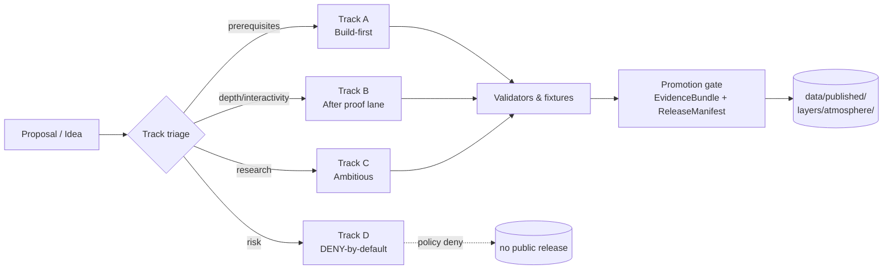
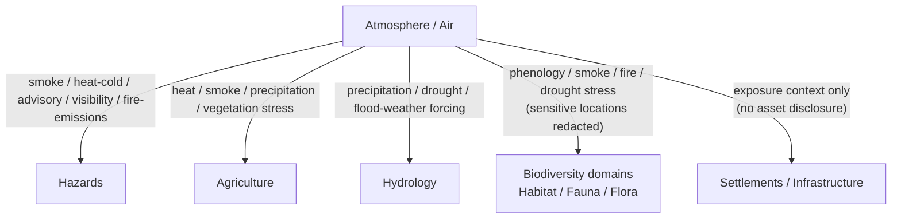

<!-- [KFM_META_BLOCK_V2]
doc_id: kfm://doc/atmosphere-expansion-backlog
title: Atmosphere / Air — Expansion Backlog
type: standard
version: v1-draft
status: draft
owners: <atmosphere-stewards> (TBD)
created: 2026-05-15
updated: 2026-05-29
policy_label: public
related:
  - docs/domains/atmosphere/README.md
  - docs/domains/atmosphere/SOURCES.md
  - docs/registers/VERIFICATION_BACKLOG.md
  - docs/registers/DRIFT_REGISTER.md
  - docs/adr/
  - ai-build-operating-contract.md
tags: [kfm, atmosphere, air, backlog, expansion, governance]
notes:
  # Path PROPOSED per Directory Rules §12 (Domain Placement Law) and §4 (placement quick check).
  # Item statuses align with [DOM-AIR] and [ENCY] §7.9 doctrine; implementation maturity remains PROPOSED until a mounted-repo scan confirms.
  # Doctrine-adjacent doc: pinned CONTRACT_VERSION = "3.0.0".
  # Meta Block v2 rule: no nested HTML comments inside this block; '#' annotations only.
[/KFM_META_BLOCK_V2] -->

# 🌬️ Atmosphere / Air — Expansion Backlog

> A governed, status-labeled backlog of expansion candidates for the **Atmosphere / Air** domain — covering sources, object families, knowledge-character registry, validators, map/AI surfaces, and cross-lane joins. Items here are **proposals, not commitments**; nothing on this list is treated as implemented until current-session repo evidence proves it.


| Field | Value |
|---|---|
| **Status** | `draft` — initial assembly from doctrine; not yet steward-reviewed |
| **Owners** | `<atmosphere-stewards>` *(PROPOSED — assign in `CODEOWNERS`)* |
| **Last updated** | `2026-05-29` |
| **Operating contract** | `CONTRACT_VERSION = "3.0.0"` *(per `ai-build-operating-contract.md`)* |
| **Implementation maturity** | `UNKNOWN` — repo not mounted in this session; no claim about live files, tests, routes, or releases |
| **Doctrinal anchors** | `[DOM-AIR]`, `[ENCY]` §7.9 + §11, `[UNIFIED]` §6.10, `[DIRRULES]` §12, `[ENCY]` Atlas §24.12 |

> [!IMPORTANT]
> **This file is a backlog, not a roadmap commitment.** Every item is labeled `PROPOSED`, `INFERRED`, `NEEDS VERIFICATION`, or `DENY` and must clear the standard KFM gates — `SourceDescriptor`, `EvidenceBundle`, `ValidationReport`, policy decision, `ReleaseManifest`, correction path, rollback target — before any element transitions from backlog to `data/published/layers/atmosphere/`.

---

## 📑 Contents

1. [Purpose & scope](#1-purpose--scope)
2. [How this backlog is organized](#2-how-this-backlog-is-organized)
3. [Lifecycle and promotion gate](#3-lifecycle-and-promotion-gate)
4. [Track A — Build-first (proof lane prerequisites)](#4-track-a--build-first-proof-lane-prerequisites)
5. [Track B — After proof lane (depth and interactivity)](#5-track-b--after-proof-lane-depth-and-interactivity)
6. [Track C — Ambitious / research (governed analytics)](#6-track-c--ambitious--research-governed-analytics)
7. [Track D — DENY-by-default (never on the normal public path)](#7-track-d--deny-by-default-never-on-the-normal-public-path)
8. [Source admission backlog](#8-source-admission-backlog)
9. [Object family realization backlog](#9-object-family-realization-backlog)
10. [Knowledge-character registry backlog](#10-knowledge-character-registry-backlog)
11. [Validator, test, and fixture backlog](#11-validator-test-and-fixture-backlog)
12. [Map, API, and AI-surface backlog](#12-map-api-and-ai-surface-backlog)
13. [Cross-lane integration backlog](#13-cross-lane-integration-backlog)
14. [Risk register (atmosphere-specific)](#14-risk-register-atmosphere-specific)
15. [Verification backlog and open questions](#15-verification-backlog-and-open-questions)
16. [Open ADR candidates](#16-open-adr-candidates)
17. [Triage and intake protocol](#17-triage-and-intake-protocol)
18. [Out of scope](#18-out-of-scope)
19. [Open questions register](#19-open-questions-register)
20. [Changelog](#20-changelog)
21. [Definition of done](#21-definition-of-done)
22. [Related docs](#22-related-docs)
23. [Appendix](#23-appendix)

---

## 1. Purpose & scope

**Purpose.** Track every Atmosphere / Air expansion candidate — sources, objects, validators, viewing products, AI surfaces, cross-lane joins, and risk controls — in one inspectable register that respects KFM's evidence-first, default-deny posture.

**Scope.** This backlog covers the object families and source roles the Atmosphere / Air domain owns per `[DOM-AIR]` and `[ENCY]` §11.B:

> *Owns:* `AirStation`, `AirObservation`, `PM2.5 Observation`, `Ozone Observation`, `SmokeContext`, `AODRaster`, `WeatherStation`, `WeatherObservation`, `WindField`, `PrecipitationObservation`, `TemperatureObservation`, `ClimateNormal`, `ClimateAnomaly`, `ForecastContext`, `AdvisoryContext`. `[DOM-AIR]` `[ENCY]`

**Out of ownership.** Emergency / hazard event truth and life-safety context belong to **Hazards**; canonical claims for hydrology, agriculture, habitat, settlements, etc., belong to their own lanes. This backlog never proposes the Atmosphere domain take those over. `[DOM-AIR]` `[ENCY]`

> [!NOTE]
> `SmokeContext` is a **shared object family**: it is named in the owned-family list of **both** Atmosphere / Air (`[DOM-AIR]` §B) **and** Hazards (`[DOM-HAZ]` §B). The boundary discipline is unchanged — Atmosphere supplies **observed / model smoke context**; Hazards owns **hazard-event truth and life-safety context**. Any cross-lane `SmokeContext` join MUST preserve that ownership split. `CONFLICTED → resolve via cross-lane join policy ADR (see §16, aligned to Atlas ADR-S-14).`

**Truth posture.** `CONFIRMED` doctrine; `PROPOSED` implementation. Live API rights, source schemas, attribution requirements, source cadence, and mounted-repo depth all remain `UNKNOWN / NEEDS VERIFICATION` per `[UNIFIED]` §6.10.

> [!NOTE]
> The Atmosphere domain is doctrinally subordinate to two cross-cutting laws that are **never relaxed** by anything in this backlog:
> 1. **Knowledge-character anti-collapse.** AQI is not concentration; AOD is not PM2.5; model fields are not observations; low-cost sensors require correction, caveats, confidence, and limitations before any public release. `[DOM-AIR]` `[ENCY]`
> 2. **Trust membrane.** Public clients read through governed APIs, not canonical stores. Promotion is a governed state transition, not a file move. `[DIRRULES]` `[GAI]`

[Back to top](#-contents)

---

## 2. How this backlog is organized

Items are grouped into **four tracks** matching the feature-backlog discipline in `[ENCY]` §7.9.L, plus six **thematic registers** that cut across tracks (sources, objects, knowledge characters, validators, surfaces, cross-lane joins). Every row carries a status label and a validation path.



> [!TIP]
> Status labels follow the KFM convention from `[DOM-AIR]` `[ENCY]`: `CONFIRMED`, `PROPOSED`, `INFERRED`, `UNKNOWN`, `NEEDS VERIFICATION`, `CONFLICTED`, `DENY`. Memory is not evidence — a sentence without one of these labels and a citation is treated as opinion, not fact.

| Label | Meaning in this backlog |
|---|---|
| `CONFIRMED` | Doctrine settled in `[DOM-AIR]` / `[ENCY]` / `[DIRRULES]`. |
| `PROPOSED` | Design or path consistent with doctrine; not yet verified in implementation. |
| `INFERRED` | Reasonably derivable from doctrine but not directly stated. |
| `NEEDS VERIFICATION` | Checkable against a mounted repo, source terms, or external spec — not yet checked. |
| `CONFLICTED` | Sources disagree, or doctrine and a proposed convention appear inconsistent; held until an ADR or drift entry resolves it. |
| `UNKNOWN` | Not resolvable without more evidence. |
| `DENY` | Policy-blocked on the normal public path; never promoted by default. |

[Back to top](#-contents)

---

## 3. Lifecycle and promotion gate

The Atmosphere / Air lane follows the canonical KFM lifecycle. Every backlog item names the **earliest stage it lives in** and the **gate that must pass** before it advances. `[DIRRULES]` `[DOM-AIR]` `[ENCY]`

| Stage | What lives here | Gate to advance |
|---|---|---|
| **RAW** | Immutable source payload or reference (with source role, rights, sensitivity, citation, time, hash). | `SourceDescriptor` exists. `[DOM-AIR]` |
| **WORK / QUARANTINE** | Normalized schema/geometry/time/identity/evidence; failures held. | Validation + policy gate pass, or quarantine reason recorded. `[DOM-AIR]` |
| **PROCESSED** | Validated normalized objects, receipts, public-safe candidates. | `EvidenceRef`, `ValidationReport`, digest closure exist. `[DOM-AIR]` |
| **CATALOG / TRIPLET** | Catalog records, `EvidenceBundle`s, graph/triplet projections, release candidates. | Catalog/proof closure passes. `[DOM-AIR]` |
| **PUBLISHED** | Released public-safe artifacts served through governed APIs and manifests. | `ReleaseManifest` + correction path + rollback target + review/policy state. `[DOM-AIR]` `[ENCY]` |

> [!WARNING]
> **Default deny.** Unclear rights, unresolved source role, missing evidence, unresolved sensitivity, or absent release state **blocks** public promotion. This is doctrinal and applies to every row in this backlog. `[ENCY]` `[DIRRULES]`

[Back to top](#-contents)

---

## 4. Track A — Build-first (proof lane prerequisites)

`PROPOSED` first PR for Atmosphere / Air is **docs/registry/schema/fixture/validator/policy/dry-run only**, with **no live fetch**, **no public promotion**, and **no UI/API binding** beyond typed contract notes. `[UNIFIED]` §6.10

| # | Item | Actor | Evidence needed | Risk | Validation path | Status |
|---|---|---|---|---|---|---|
| A-01 | First Atmosphere source registry + no-network synthetic fixture | steward / developer | `SourceDescriptor` + synthetic fixture | rights / source-role ambiguity | schema + source + rights validators | `PROPOSED` `[ENCY]` |
| A-02 | First Atmosphere `EvidenceBundle` for one feature (Evidence Drawer inspector candidate) | public / researcher / steward | `EvidenceBundle` for one station-time-series feature | uncited public claim | evidence-closure + citation tests | `PROPOSED` `[ENCY]` |
| A-03 | Knowledge-character registry seed (`OBSERVED_SENSOR`, `PUBLIC_AQI_REPORT`, `REGULATORY_ARCHIVE`, `LOW_COST_SENSOR`, `ATMOSPHERIC_MODEL_FIELD`, `REMOTE_SENSING_MASK`, `CLIMATE_ANOMALY_CONTEXT`, `DERIVED_FUSION`, `METEOROLOGICAL_CONTEXT`, `ALERT_AND_ADVISORY_CONTEXT`, `NETWORK_AND_SITE_CONTEXT`) | steward | registry file + tests | source-role collapse | knowledge-character registry tests | `PROPOSED` `[DOM-AIR]` `[ENCY]` |
| A-04 | Unit-normalization receipts (e.g., µg/m³ ↔ ppb; °F ↔ °C) and parameter registry | developer | receipt schema + golden fixtures | unit-conflation error | unit-normalization tests | `PROPOSED` `[DOM-AIR]` |
| A-05 | `dryrun` validator: no-live-fetch guard across all atmosphere connectors | developer | CI workflow + no-network fixtures | accidental live call in CI | dryrun tests | `PROPOSED` `[DOM-AIR]` |
| A-06 | Domain `policy/domains/atmosphere/` skeleton — deny rules for `AQI-as-concentration`, `AOD-as-PM2.5`, `model-as-observed`, missing `LOW_COST_SENSOR` caveats | steward | policy files + deny tests | knowledge-character collapse on public surface | policy deny tests | `PROPOSED` `[DOM-AIR]` |
| A-07 | Domain `docs/domains/atmosphere/SOURCES.md` register (source families, roles, rights status, freshness) | steward | doc + cross-link to `data/registry/sources/atmosphere/` | rights drift | manual review + lint | `PROPOSED` `[DIRRULES]` §12 |

> [!NOTE]
> Track A is the **trust spine** for Atmosphere. None of Tracks B, C, or D are allowed to consume Atmosphere data publicly until Track A closes. This mirrors the doctrine-wide ordering in `[ENCY]` §21 (Programming Possibilities Backlog) and the dependency graph in §21.1, where the spine is established before any domain proof lane runs.

[Back to top](#-contents)

---

## 5. Track B — After proof lane (depth and interactivity)

These items presume Track A has closed and the first released Atmosphere `EvidenceBundle` exists.

| # | Item | Actor | Evidence needed | Risk | Validation path | Status |
|---|---|---|---|---|---|---|
| B-01 | Atmosphere time slider and compare mode | researcher / steward | versioned observations + layer fixtures | false temporal alignment | temporal-logic tests | `PROPOSED` `[ENCY]` `[MAP-MASTER]` |
| B-02 | Station time-series Evidence Drawer payload (PM2.5 + ozone + freshness badge + non-emergency disclaimer) | steward | `EvidenceDrawerPayload` + `EvidenceBundle` | renderer treated as truth | drawer renderer tests | `PROPOSED` `[ENCY]` `[MAP-MASTER]` |
| B-03 | Climate-normal-departure layer (anomaly vs. baseline period) | researcher | `ClimateNormal` + `ClimateAnomaly` fixtures + baseline metadata | scenario confused with observed change | climate-anomaly validator | `PROPOSED` `[DOM-AIR]` |
| B-04 | Smoke-plume / AOD context layer with knowledge-character badges | steward | `SmokeContext` / `AODRaster` fixtures | AOD reported as PM2.5 | `AOD-as-PM2.5` denial test | `PROPOSED` `[DOM-AIR]` |
| B-05 | Wind / precipitation / temperature animated overlays with model-run-time stamps | developer | `WindField` + `PrecipitationObservation` + `TemperatureObservation` fixtures | model output presented as observation | `model-as-observed` denial test | `PROPOSED` `[DOM-AIR]` |
| B-06 | Atmosphere layer manifest resolver (governed API surface) | developer | `LayerManifest` schema + route stub | layer leaks through non-governed path | trust-membrane test | `PROPOSED` route `UNKNOWN` `[DOM-AIR]` `[DIRRULES]` |
| B-07 | Atmosphere feature/detail resolver returning `AtmosphereAirDecisionEnvelope` (finite outcomes: `ANSWER` / `ABSTAIN` / `DENY` / `ERROR`) | developer | `DecisionEnvelope` schema + tests | implicit `ANSWER` for missing evidence | finite-outcome contract tests | `PROPOSED` `[DOM-AIR]` `[GAI]` |
| B-08 | Advisory-context view with official-source redirection (no in-app emergency instructions) | steward | `AdvisoryContext` fixture + redirect policy | KFM mistaken for an alert authority | redirect + non-emergency disclaimer test | `PROPOSED` `[DOM-AIR]` `[DOM-HAZ]` |

[Back to top](#-contents)

---

## 6. Track C — Ambitious / research (governed analytics)

Track C items extend reach but **never** become root truth. AI may summarize released `EvidenceBundle`s, compare evidence, explain limitations, and draft steward-review notes; it must `ABSTAIN` when evidence is insufficient and `DENY` where policy, rights, sensitivity, or release state blocks the request. `[GAI]` `[DOM-AIR]` `[ENCY]`

| # | Item | Actor | Evidence needed | Risk | Validation path | Status |
|---|---|---|---|---|---|---|
| C-01 | Cross-domain Atmosphere analytics and graph queries (e.g., smoke × hazard × habitat phenology) | researcher / AI assistant | source-backed triples + model receipts | derivative becomes truth | graph-projection tests | `PROPOSED` `[ENCY]` |
| C-02 | Focus Mode answer template: "What was air quality at station X on date Y?" (returns `RuntimeResponseEnvelope` + `AIReceipt`) | AI assistant + steward | released `EvidenceBundle`s + citation fixtures | uncited / hallucinated claims | citation validator + AI-receipt presence rate | `PROPOSED` `[GAI]` `[DOM-AIR]` |
| C-03 | Drought × precipitation × soil-moisture join across Atmosphere ⨯ Hydrology ⨯ Agriculture lanes | researcher | cross-lane `EvidenceBundle`s + relation policy | sensitive-location leak via join | sensitivity-redaction join tests | `PROPOSED` `[DOM-AIR]` `[DOM-AG]` `[DOM-HYD]` |
| C-04 | Stale-data detection across heterogeneous freshness cadences (mesonet vs. satellite vs. archive) | developer | freshness-policy table + clock receipts | stale data presented as current | freshness-badge + stale-state tests | `PROPOSED` `[DOM-AIR]` `[ENCY]` |
| C-05 | Fusion-product registry (e.g., AOD + station observation + smoke mask blended layer) with `DERIVED_FUSION` knowledge-character | researcher | fusion lineage + uncertainty surface | fusion presented as observation | `DERIVED_FUSION` knowledge-character tests | `PROPOSED` `[DOM-AIR]` |
| C-06 | Scenario-vs-observed climate distinction (with `scenario_horizon` and `scenario_role` labels) | researcher | scenario-id + time-horizon + model-source + uncertainty note | scenario terms confused with observed change | scenario-label validator | `PROPOSED` `[INDEX-18]` (Pass 18 scenario card) |
| C-07 | AOD reanalysis archive integration (CAMS / ECMWF family) | developer | source rights + model-field knowledge character | reanalysis presented as truth | model-as-observed denial test | `PROPOSED` rights `NEEDS VERIFICATION` `[DOM-AIR]` |

> [!NOTE]
> Track C items are **research-grade carriers**, not truth sources. Search indexes, vector retrieval, and graph projections are derivative; they may not be cited as root authority. `EvidenceBundle` outranks generated language, renderer state, graph projections, and synthetic scenes. `[GAI]` `[ENCY]`

[Back to top](#-contents)

---

## 7. Track D — DENY-by-default (never on the normal public path)

These are recorded so the deny posture is **explicit, visible, and tested** — not so they become a quiet TODO. `[ENCY]` §7.9.L

| # | Item | Why deny | What would change it | Status |
|---|---|---|---|---|
| D-01 | Unreviewed exact sensitive Atmosphere locations or private data on the public surface | Privacy / public-safety harm | Policy approval + redaction receipt + steward review | `DENY` `[ENCY]` |
| D-02 | Live operational aviation guidance (B4UFLY-style real-time advisory as authoritative) | Liability + freshness / authority discipline | Authority handoff + `not_official_guidance` disclaimer + abstain default | `DENY` `[INDEX-18]` Pass 18 idea card on airspace advisory |
| D-03 | Life-safety / emergency instructions during active hazard | Hazards-lane ownership + KFM is not an alert system | Hazards-lane ADR + official-source redirect | `DENY` `[DOM-AIR]` `[DOM-HAZ]` |
| D-04 | Low-cost sensor PM2.5 as authoritative concentration | Sensor accuracy / correction discipline | Correction + caveat + confidence + limitations + steward review | `DENY` `[DOM-AIR]` `[ENCY]` |
| D-05 | AOD reported as PM2.5 concentration | Knowledge-character anti-collapse | Per-product correction model + steward review + `DERIVED_FUSION` labeling | `DENY` `[DOM-AIR]` `[ENCY]` |
| D-06 | Model-field grid (HRRR-Smoke, CAMS, etc.) presented as observation | Knowledge-character anti-collapse | `ATMOSPHERIC_MODEL_FIELD` label + model-run-time + ensemble caveat | `DENY` `[DOM-AIR]` |

> [!WARNING]
> Track D items are intentionally **bypass-resistant**: each must have a corresponding `policy/domains/atmosphere/` rule and a `tests/domains/atmosphere/` deny test. A backlog row alone is not enforcement. This mirrors the doctrine that named anti-patterns must be tested, not merely listed (`[ENCY]` §24.9). `[DIRRULES]` §13.5

[Back to top](#-contents)

---

## 8. Source admission backlog

Per `[DOM-AIR]` §D, source-family roles and rights all currently sit at `NEEDS VERIFICATION`. The Atlas source-family table records the role string as *"authority / observation / context / model as source role requires"* — i.e., a single family may serve different roles depending on the product, and the canonical role string itself is `NEEDS VERIFICATION`. Admission is gated by `SourceDescriptor` registration and rights review; **sensitive joins fail closed**. Source-role vocabulary stability is ADR-class (Atlas ADR-S-04). `[DOM-AIR]` `[ENCY]`

<details>
<summary><strong>Source families to admit (click to expand)</strong></summary>

| Source family | Proposed role(s) | Rights / sensitivity | Freshness cadence | Admission status |
|---|---|---|---|---|
| **EPA AQS / AirData** | `authority` / `observation` / `context` / `model` (per source role) | Rights + current terms `NEEDS VERIFICATION`; sensitive joins fail closed | source-vintage / cadence-specific | `PROPOSED` `[DOM-AIR]` |
| **AirNow / agency reporting** | `authority` / `observation` / `context` | Rights + terms `NEEDS VERIFICATION`; sensitive joins fail closed | near-real-time | `PROPOSED` `[DOM-AIR]` |
| **OpenAQ-like aggregators** | `aggregator` / `observation` (if rights allow) | Rights `NEEDS VERIFICATION`; redistribution class unresolved; sensitive joins fail closed | varies | `PROPOSED` `[DOM-AIR]` |
| **NOAA / NWS** | `authority` / `observation` / `model` / `advisory` | Public domain works typically permissive; per-product `NEEDS VERIFICATION` | hourly to sub-hourly | `PROPOSED` `[DOM-AIR]` |
| **Kansas Mesonet** | `observation` / `network-and-site-context` | Rights `NEEDS VERIFICATION` (institutional terms) | 5-min / hourly | `PROPOSED` `[ENCY]` §7.9 |
| **CAMS / ECMWF-family** | `model` | Rights + attribution `NEEDS VERIFICATION`; reanalysis vs. forecast must be labeled | run-cycle | `PROPOSED` `[DOM-AIR]` |
| **HRRR-Smoke (NOAA)** | `model` / `smoke-context` | Public domain typically; verify | hourly | `PROPOSED` `[DOM-AIR]` |
| **HMS smoke (NOAA)** | `analyst-context` / `smoke-context` | Public domain typically; verify | daily | `PROPOSED` `[DOM-AIR]` |
| **GOES / ABI AOD** | `remote-sensing-mask` / `observation` (per product) | Public domain typically; verify | sub-hourly | `PROPOSED` `[DOM-AIR]` |
| **VIIRS fire / hotspot** | `remote-sensing-mask` / `detection` | Public domain typically; verify | per-overpass | `PROPOSED` `[DOM-AIR]` |

</details>

> [!NOTE]
> Every entry above is `PROPOSED`. None has been verified against a mounted source registry (`data/registry/sources/atmosphere/`) in this session, so claims of "supported," "available," or "implemented" are intentionally absent.

[Back to top](#-contents)

---

## 9. Object family realization backlog

The Atmosphere / Air domain's owned object families per `[DOM-AIR]` §B / §E and `[ENCY]` §7.9.C. The Atlas confirms the identity rule for every family is the **PROPOSED deterministic basis: `source id + object role + temporal scope + normalized digest`**, and **CONFIRMS** that source / observed / valid / retrieval / release / correction times stay distinct where material. `[DOM-AIR]` §E

<details>
<summary><strong>Object families and realization status (click to expand)</strong></summary>

| Object family | Realization status | Notes |
|---|---|---|
| `AirStation` | `PROPOSED` — schema + fixture + identity rule pending | Network and site context preserved. |
| `AirObservation` | `PROPOSED` | Parameterized; unit-normalization receipt required. |
| `PM2.5Observation` | `PROPOSED` | Must distinguish reference-method vs. low-cost. |
| `OzoneObservation` | `PROPOSED` | Unit-conflation guard required. |
| `SmokeContext` | `PROPOSED` — **shared with Hazards** | Source roles: analyst (HMS), model (HRRR-Smoke), remote-sensing (GOES). Ownership split per §1 note. |
| `AODRaster` | `PROPOSED` | `REMOTE_SENSING_MASK` knowledge character; never collapse to PM2.5. |
| `WeatherStation` | `PROPOSED` | Mesonet vs. ASOS vs. cooperative-observer site context. |
| `WeatherObservation` | `PROPOSED` | Parameter registry shared with `AirObservation` where overlapping. |
| `WindField` | `PROPOSED` | Model-field knowledge character; run-time required. |
| `PrecipitationObservation` | `PROPOSED` | Cross-lane relation to Hydrology forcing context. |
| `TemperatureObservation` | `PROPOSED` | Heat / cold context shared with Hazards. |
| `ClimateNormal` | `PROPOSED` | Baseline period explicit. |
| `ClimateAnomaly` | `PROPOSED` | Departure-from-normal; scenario-vs-observed distinction. |
| `ForecastContext` | `PROPOSED` | Issue / expiry / model-run time distinct. |
| `AdvisoryContext` | `PROPOSED` | Non-authoritative; redirects to official source. |

</details>

[Back to top](#-contents)

---

## 10. Knowledge-character registry backlog

The Atmosphere domain treats **knowledge character** (per `[DOM-AIR]` §C) as a first-class field: AQI is not concentration; AOD is not PM2.5; model fields are not observations. Each term below is **CONFIRMED as ubiquitous-language doctrine** in the Atlas with **PROPOSED field realization** — meaning the vocabulary is settled but the machine-readable registry artifact is not yet built. `[DOM-AIR]` `[ENCY]`

| Knowledge character | Meaning (PROPOSED field realization) | Required guards | Status |
|---|---|---|---|
| `OBSERVED_SENSOR` | Direct sensor observation, reference or research-grade. | Calibration / QA metadata; unit receipts. | `CONFIRMED` term / `PROPOSED` realization `[DOM-AIR]` |
| `PUBLIC_AQI_REPORT` | Agency-published AQI summary (e.g., AirNow). | Not concentration; category metadata; freshness badge. | `CONFIRMED` term / `PROPOSED` realization `[DOM-AIR]` |
| `REGULATORY_ARCHIVE` | Archived regulatory dataset (e.g., EPA AQS historical). | Vintage label; archive lineage. | `CONFIRMED` term / `PROPOSED` realization `[DOM-AIR]` |
| `LOW_COST_SENSOR` | Consumer / community-grade sensor data. | Correction + caveats + confidence + limitations before any public release. | `CONFIRMED` term / `PROPOSED` realization `[DOM-AIR]` `[ENCY]` |
| `ATMOSPHERIC_MODEL_FIELD` | NWP, chemical-transport, or reanalysis model output. | Model run-time; ensemble caveat; "not observation" badge. | `CONFIRMED` term / `PROPOSED` realization `[DOM-AIR]` |
| `REMOTE_SENSING_MASK` | Satellite-derived raster / mask. | Retrieval algorithm + uncertainty surface. | `CONFIRMED` term / `PROPOSED` realization `[DOM-AIR]` |
| `CLIMATE_ANOMALY_CONTEXT` | Departure from a baseline normal. | Baseline period; reference dataset. | `CONFIRMED` term / `PROPOSED` realization `[DOM-AIR]` |
| `DERIVED_FUSION` | Multi-source blended product. | Lineage chain + per-input uncertainty + "derivative, not observation" badge. | `CONFIRMED` term / `PROPOSED` realization `[DOM-AIR]` |
| `METEOROLOGICAL_CONTEXT` | Supporting meteorology (e.g., boundary-layer height, mixing-layer). | Source-role label; not to be treated as the variable it forces. | `CONFIRMED` term / `PROPOSED` realization `[DOM-AIR]` |
| `ALERT_AND_ADVISORY_CONTEXT` | Public advisory context; **never** a substitute for the official alerting authority. | Redirect to official source; non-emergency disclaimer. | `CONFIRMED` term / `PROPOSED` realization `[DOM-AIR]` `[DOM-HAZ]` |
| `NETWORK_AND_SITE_CONTEXT` | Network / site metadata. | Operator + program + siting class. | `CONFIRMED` term / `PROPOSED` realization `[DOM-AIR]` |

> [!NOTE]
> Registry **placement** (`data/registry/` vs. `control_plane/`) is itself ADR-class per `[DIRRULES]` §2.4(5). See §16 ADR-AIR-03.

[Back to top](#-contents)

---

## 11. Validator, test, and fixture backlog

Per `[DOM-AIR]` §K and `[ENCY]` Appendix K, every validator below is `PROPOSED` until a mounted-repo scan locates it in `tools/validators/` or `tests/domains/atmosphere/`. The Atlas explicitly names V-01 through V-07 as PROPOSED for this domain; V-08 through V-12 are `INFERRED` from cross-cutting doctrine.

| # | Validator / test | Purpose | Status |
|---|---|---|---|
| V-01 | Knowledge-character registry tests | Ensure every Atmosphere object carries a knowledge character; reject unknowns. | `PROPOSED` `[DOM-AIR]` |
| V-02 | Unit-normalization tests | Round-trip µg/m³ ↔ ppb, °F ↔ °C, m/s ↔ mph; assert receipt presence. | `PROPOSED` `[DOM-AIR]` |
| V-03 | `AQI-as-concentration` denial | Block any public payload that labels an AQI number as a concentration. | `PROPOSED` `[DOM-AIR]` `[ENCY]` |
| V-04 | `AOD-as-PM2.5` denial | Block any public payload that equates AOD raster values to PM2.5. | `PROPOSED` `[DOM-AIR]` `[ENCY]` |
| V-05 | `model-as-observed` denial | Block any public payload where a model field is rendered as an observation. | `PROPOSED` `[DOM-AIR]` `[ENCY]` |
| V-06 | Low-cost sensor caveat tests | Verify correction + caveat + confidence + limitations are present before release. | `PROPOSED` `[DOM-AIR]` `[ENCY]` |
| V-07 | Dryrun no-live-fetch tests | CI must fail any connector that opens a live network socket in a dry run. | `PROPOSED` `[DOM-AIR]` |
| V-08 | Temporal-logic tests | Source / observed / valid / retrieval / release / correction times stay distinct where material. | `INFERRED` `[DOM-AIR]` `[ENCY]` |
| V-09 | Cross-lane sensitivity-redaction tests | Joins with Habitat / Fauna / Archaeology never expose sensitive locations. | `INFERRED` `[DOM-AIR]` `[ENCY]` |
| V-10 | Citation validator | Every public claim resolves to an `EvidenceBundle`; no uncited claim escapes. | `INFERRED` `[GAI]` `[ENCY]` |
| V-11 | Stale-state policy test | Freshness badge logic per source-family cadence. | `INFERRED` `[DOM-AIR]` |
| V-12 | Rollback drill (Atmosphere) | Release → rollback card → restored prior manifest. | `INFERRED` `[DOM-AIR]` `[ENCY]` Appendix E |

> [!IMPORTANT]
> Per `[DIRRULES]` §13.5 ("Test-only validator" anti-pattern), validator logic must live in `tools/validators/<topic>/...` and be **called** by tests, not authored inside test files. Cross-domain validators (e.g., a shared geometry or sensitivity validator) live in a **non-domain** segment — `tools/validators/<topic>/...`, never `tools/validators/domains/<picked-one>/...`. `[DIRRULES]` §12

[Back to top](#-contents)

---

## 12. Map, API, and AI-surface backlog

| Surface | DTO / schema | Finite outcomes | Status |
|---|---|---|---|
| Atmosphere / Air feature & detail resolver | `AtmosphereAirDecisionEnvelope` | `ANSWER` / `ABSTAIN` / `DENY` / `ERROR` | `PROPOSED`; exact route `UNKNOWN`. `[DOM-AIR]` |
| Atmosphere layer-manifest resolver | `LayerManifest` / domain layer descriptor | `ANSWER` / `DENY` / `ERROR` | `PROPOSED`; public-safe release only. `[DOM-AIR]` |
| Atmosphere Evidence Drawer payload | `EvidenceDrawerPayload` + `EvidenceBundle` projection | `ANSWER` / `ABSTAIN` / `DENY` / `ERROR` | `PROPOSED`; evidence + policy filtered. `[DOM-AIR]` `[MAP-MASTER]` |
| Atmosphere Focus Mode answer | `RuntimeResponseEnvelope` + `AIReceipt` | `ANSWER` / `ABSTAIN` / `DENY` / `ERROR` | `PROPOSED`; AI never root truth. `[GAI]` `[DOM-AIR]` |
| Shape home for Atmosphere contracts | `schemas/contracts/v1/<...>` *(default schema home per `[DIRRULES]` §3 / ADR-0001)* | n/a | `PROPOSED`; confirm domain segment via ADR (see §16). `[DIRRULES]` |
| Semantic home for Atmosphere contracts | `contracts/domains/atmosphere/` *(object-family meaning per `[DIRRULES]` §12 lane pattern)* | n/a | `PROPOSED`; `CONFLICTED` vs. Atlas §24.13 crosswalk (see §16). `[DIRRULES]` |

> [!NOTE]
> Public clients **must** consume Atmosphere data via the governed API surface — never directly from `data/processed/atmosphere/` or `data/published/layers/atmosphere/`. The trust membrane is non-negotiable. The Atlas records the **schema responsibility root** as `schemas/contracts/v1/` (`PROPOSED`; verify with Directory Rules and ADR). `[DIRRULES]` §13.5 `[DOM-AIR]` §J

> [!WARNING]
> **Naming conflict surfaced (do not silently resolve).** Directory Rules §12 places **semantic** object-family contracts under `contracts/domains/<domain>/` and **shape** under `schemas/contracts/v1/<...>`. The earlier draft of this backlog collapsed both into a single `schemas/contracts/v1/air/` path. Per `[DIRRULES]` §2.1 authority order (Directory Rules > Atlas crosswalks) and §2.5, this is logged as a `CONFLICTED` item pending ADR resolution rather than picked silently. See §16 ADR-AIR-01 and the open question in §19.

[Back to top](#-contents)

---

## 13. Cross-lane integration backlog

The Atmosphere / Air domain is one of the most join-heavy in KFM. Every cross-lane relation must preserve ownership, source role, sensitivity, and `EvidenceBundle` support. `[DOM-AIR]` §F



| # | Join | Constraint | Status |
|---|---|---|---|
| X-01 | Atmosphere ↔ Hazards (smoke, heat / cold, advisory, visibility, fire / emissions context) | Hazards owns hazard-event truth; Atmosphere supplies observed / model context. `SmokeContext` is shared (§1 note). | `PROPOSED` `[DOM-AIR]` `[DOM-HAZ]` |
| X-02 | Atmosphere ↔ Agriculture (heat, smoke, precipitation, vegetation stress) | Agriculture owns crop / field truth; Atmosphere supplies weather forcing. | `PROPOSED` `[DOM-AIR]` `[DOM-AG]` |
| X-03 | Atmosphere ↔ Hydrology (precipitation, drought, flood-weather forcing) | Hydrology owns water-body / gauge truth; Atmosphere supplies precip / climate forcing. | `PROPOSED` `[DOM-AIR]` `[DOM-HYD]` |
| X-04 | Atmosphere ↔ Biodiversity domains (phenology, smoke, fire, drought stress) | Sensitive locations redacted by default; joins must use generalized geometry. | `PROPOSED` `[DOM-AIR]` `[DOM-HF]` |
| X-05 | Atmosphere ↔ Settlements / Infrastructure (exposure context, not asset disclosure) | Critical-asset deny lane; Atmosphere never exposes precise infrastructure exposure. | `PROPOSED` `[DOM-AIR]` `[DOM-SETTLE]` |

> [!CAUTION]
> Cross-lane joins are **inference-risk multipliers** (Atlas ADR-S-14). A join with Habitat, Fauna, or Archaeology can re-expose a sensitive location even when each input layer was individually public-safe. Joins touching sensitive lanes MUST fail closed, use generalized geometry, and route through steward review with a `RedactionReceipt`. `[ENCY]` §23.2 `[DIRRULES]`

[Back to top](#-contents)

---

## 14. Risk register (atmosphere-specific)

Per `[ENCY]` §7.9.M; reproduced here as a backlog row so each risk has a tracked mitigation.

| Risk | Mitigation | Status |
|---|---|---|
| Rights uncertainty | Block public release until source terms and redistribution class are recorded. | `PROPOSED` `[ENCY]` |
| Sensitive location exposure | Default redaction / generalization; restricted views; geoprivacy transform receipts. | `PROPOSED` `[ENCY]` |
| False precision | Show uncertainty / support; scale and source-role badges; abstain on over-precise claims. | `PROPOSED` `[ENCY]` |
| Source-authority confusion | Source-role registry; separate observation / model / regulatory / legal / status contexts. | `PROPOSED` `[ENCY]` `[INDEX-18]` |
| Model hallucination on Focus Mode | Citation validation; finite outcomes; no direct model-to-public path. | `PROPOSED` `[GAI]` `[ENCY]` |
| Stale data | Freshness badges; retrieval / source / release time; stale-state policy. | `PROPOSED` `[ENCY]` |
| Rollback complexity | `ReleaseManifest` + `RollbackCard` + rollback drill per release. | `PROPOSED` `[ENCY]` Appendix E |
| Aviation / advisory liability | `not_official_guidance` disclaimer; abstain on operational guidance. | `PROPOSED` `[INDEX-18]` |

[Back to top](#-contents)

---

## 15. Verification backlog and open questions

Tracked in `docs/registers/VERIFICATION_BACKLOG.md` per `[DIRRULES]` §18. Reproduced here with Atmosphere-specific framing. The four Atlas `[DOM-AIR]` §N items (source rights, knowledge-character registry, catalog/proof/release closure, MapLibre integration) map to Q-01 through Q-04.

| # | Item to verify | Evidence that would settle it | Status |
|---|---|---|---|
| Q-01 | Verify source rights and endpoint behavior for every admitted source. | Mounted source-registry entries + license review + per-source descriptor. | `NEEDS VERIFICATION` `[DOM-AIR]` §N |
| Q-02 | Implement knowledge-character registry as a machine-readable artifact. | Mounted registry file in `data/registry/` or `control_plane/` + validator. | `NEEDS VERIFICATION` `[DOM-AIR]` §N |
| Q-03 | Verify catalog / proof / release closure for the first Atmosphere release candidate. | Emitted `EvidenceBundle` + `ValidationReport` + `ReleaseManifest`. | `NEEDS VERIFICATION` `[DOM-AIR]` §N |
| Q-04 | Verify MapLibre / Evidence Drawer / Focus Mode integration for at least one Atmosphere feature. | Mounted UI fixtures + drawer test + Focus Mode QA fixture. | `NEEDS VERIFICATION` `[DOM-AIR]` §N `[MAP-MASTER]` |
| Q-05 | Verify schema home and the `contracts/domains/atmosphere/` vs. `schemas/contracts/v1/<...>` split. | Mounted-repo schema inspection + ADR-0001 confirmation. | `NEEDS VERIFICATION` `[DIRRULES]` |
| Q-06 | Verify owners and CODEOWNERS entries for Atmosphere reviewers. | Mounted `CODEOWNERS` + per-root README listing reviewers. | `NEEDS VERIFICATION` `[DIRRULES]` §15 |
| Q-07 | Verify rollback-card template applies cleanly to a synthetic Atmosphere release. | Rollback dry-run record. | `NEEDS VERIFICATION` `[ENCY]` Appendix E |
| Q-08 | Verify climate-anomaly baseline period selection and source. | Baseline metadata + steward review. | `UNKNOWN` `[DOM-AIR]` |

[Back to top](#-contents)

---

## 16. Open ADR candidates

Per `[DIRRULES]` §2.4, certain decisions require an ADR before a path, schema, policy, or release surface is treated as canonical. The candidates below align with the Atlas v1.1 **Master Open-ADR Backlog (§24.12)**, whose canonical IDs are `ADR-S-NN`. The local `ADR-AIR-NN` IDs are working handles for this domain and are mapped to the Atlas IDs explicitly to avoid creating a parallel ADR namespace. `[DIRRULES]` `[ENCY]`

| Local # | Maps to Atlas | Question | Why ADR-class | Suggested ADR title (`PROPOSED`) |
|---|---|---|---|---|
| ADR-AIR-01 | ADR-S-01 | Confirm Atmosphere schema home (`schemas/contracts/v1/<...>`) and the semantic/shape split vs. `contracts/domains/atmosphere/`. | Schema-home rule is explicitly ADR-required per `[DIRRULES]` §2.4(3). | "Atmosphere schema home & contract/schema split (confirm/amend ADR-0001)." |
| ADR-AIR-02 | ADR-S-04 | Source-role enum for Atmosphere — canonical vocabulary and evolution rule. | Source-role anti-collapse is doctrine-significant; vocabulary stability matters. | "Atmosphere source-role vocabulary v1." |
| ADR-AIR-03 | ADR-S-03 (analogue) | Knowledge-character registry placement — `data/registry/` vs. `control_plane/`. | New parallel home is ADR-class per `[DIRRULES]` §2.4(5). | "Atmosphere knowledge-character registry placement." |
| ADR-AIR-04 | ADR-S-05 (analogue) | Low-cost sensor public-release contract: correction + caveat + confidence + limitations as a hard schema requirement. | Public-safety / accuracy posture; release-significant. | "Low-cost atmospheric sensor public-release contract." |
| ADR-AIR-05 | ADR-S-06 / ADR-S-14 | Advisory-context redirect contract: never substitute for the official alerting authority. | Trust membrane + ownership boundary with Hazards. | "Atmosphere advisory-context redirect contract." |
| ADR-AIR-06 | (new candidate) | Climate scenario vs. observed labeling discipline (`scenario_horizon`, `scenario_role`). | Confusing scenario with observed change is a known failure mode. | "Climate scenario labeling for Atmosphere layers." |

> [!NOTE]
> ADR-AIR-06 has no obvious Atlas §24.12 counterpart; it is surfaced here as a **new** ADR candidate for triage, not as a settled mapping. `INFERRED` from `[INDEX-18]` scenario-card doctrine.

[Back to top](#-contents)

---

## 17. Triage and intake protocol

How a new item enters this backlog.

1. **Submit** as a PR adding a row to the appropriate track (A / B / C / D) or thematic register (sources, objects, knowledge characters, validators, surfaces, cross-lane).
2. **Label** with the narrowest truthful status: `PROPOSED`, `INFERRED`, `NEEDS VERIFICATION`, `CONFLICTED`, `UNKNOWN`, or `DENY`. Memory is not evidence.
3. **Cite** doctrine: `[DOM-AIR]`, `[ENCY]` §7.9 / §11, `[DIRRULES]` §12, `[UNIFIED]` §6.10, `[MAP-MASTER]`, `[GAI]`, `[INDEX-18]`, as applicable.
4. **Identify the gate** the item must clear: `SourceDescriptor`, `ValidationReport`, `EvidenceBundle`, policy decision, `ReleaseManifest`, correction path, rollback target.
5. **Flag ADR-class** items per `[DIRRULES]` §2.4 and add them to §16 above, mapping to an Atlas §24.12 `ADR-S-NN` ID where one exists.
6. **Steward review** before promotion to a track that touches a public surface (B, C). Deny items (D) are reviewed but **not** scheduled.

> [!TIP]
> A backlog item with no citation, no gate, and no validation path is documentation drift, not a proposal. Reviewers may close such PRs and request the author resubmit with the missing fields. Conflicts between this backlog and the mounted repo open a `docs/registers/DRIFT_REGISTER.md` entry per `[DIRRULES]` §2.5 — they are not silently conformed.

[Back to top](#-contents)

---

## 18. Out of scope

This backlog **does not**:

- Decide what is "true." Truth is the responsibility of `EvidenceBundle`s + `ReleaseManifest`s, not this register.
- Authorize a public release. Release is governed by `release/` per `[DIRRULES]` §5 and the publication gate in `[DOM-AIR]` §M.
- Replace ADRs for canonical-root, schema-home, or lifecycle-phase decisions. Those still go through `docs/adr/`. `[DIRRULES]` §2.4
- Carry life-safety guidance. Atmosphere / Air is **not** an emergency alert system; Hazards owns hazard-event truth and KFM is not an alert authority. `[DOM-AIR]` `[DOM-HAZ]`
- Substitute for the `docs/registers/VERIFICATION_BACKLOG.md` register. Items here cross-reference that register but do not replace it. `[DIRRULES]` §18

[Back to top](#-contents)

---

## 19. Open questions register

| ID | Question | Owner role | Resolution path |
|---|---|---|---|
| OQ-AIR-01 | Is the Atmosphere schema home `schemas/contracts/v1/<...>` (shape) with semantics under `contracts/domains/atmosphere/`, or does the Atlas §24.13 crosswalk's `domains/`-omitting pattern govern? | docs steward + architecture owner | ADR-AIR-01 (→ ADR-S-01) + Directory Rules §2.1 authority order + repo inspection |
| OQ-AIR-02 | What is the canonical source-role enum for Atmosphere, given the Atlas role string is `NEEDS VERIFICATION`? | atmosphere steward | ADR-AIR-02 (→ ADR-S-04) |
| OQ-AIR-03 | Does the machine-readable knowledge-character registry live in `data/registry/` or `control_plane/`? | architecture owner | ADR-AIR-03 |
| OQ-AIR-04 | Which steward / reviewer signs off on the first public-safe Atmosphere proof slice, and is reviewer separation tooling-enforced? | release owner | ADR-S-09 (reviewer separation) + CODEOWNERS inspection |
| OQ-AIR-05 | Is `SmokeContext` modeled once and shared, or projected separately per owning lane (Atmosphere vs. Hazards)? | atmosphere + hazards stewards | Cross-lane join policy ADR (→ ADR-S-14) |

[Back to top](#-contents)

---

## 20. Changelog

| Change | Type (per contract §37) | Reason |
|---|---|---|
| Added companion sections (Open questions register, Changelog, Definition of done) | gap closure | Doctrine-adjacent doc completeness per operating-contract pattern. |
| Surfaced `schemas/contracts/v1/air/` → `contracts/domains/<domain>/` + `schemas/contracts/v1/<...>` split as `CONFLICTED` | reconciliation | Directory Rules §12 separates semantic (`contracts/`) from shape (`schemas/`); prior draft collapsed them. Authority order §2.1: Directory Rules > Atlas crosswalk. |
| Re-mapped local `ADR-AIR-NN` IDs to Atlas §24.12 `ADR-S-NN` backlog | reconciliation | Avoid creating a parallel ADR namespace; Atlas backlog is the canonical home. |
| Flagged `SmokeContext` as shared between Atmosphere and Hazards | clarification | Both `[DOM-AIR]` §B and `[DOM-HAZ]` §B list it as owned. |
| Relabeled knowledge-character rows as `CONFIRMED term / PROPOSED realization` | clarification | Atlas §C records terms as CONFIRMED ubiquitous language with PROPOSED field realization. |
| Split validator statuses into `PROPOSED` (Atlas-named V-01–V-07) vs. `INFERRED` (V-08–V-12) | clarification | Only V-01–V-07 are explicitly named PROPOSED in `[DOM-AIR]` §K. |
| Corrected §21 reference (Programming Possibilities Backlog) and §24.12 anchor | housekeeping | Atlas TOC places the backlog at §21, not §12. |
| Updated `updated:` and badge date to 2026-05-29; pinned `CONTRACT_VERSION = "3.0.0"` | housekeeping | Doctrine-adjacent doc requirement. |

> **Backward compatibility.** Section anchors §1–§18 are preserved; new sections (§19–§23) append at the tail. The schema-home path was **not** silently rewritten — it is held as `CONFLICTED` with both candidate paths shown, so no downstream reference is broken by an unreviewed rename.

[Back to top](#-contents)

---

## 21. Definition of done

This document is done enough to enter the repository when:

- it is placed according to Directory Rules (`docs/domains/atmosphere/EXPANSION_BACKLOG.md`, `PROPOSED` per §12);
- a docs steward and an atmosphere steward review it;
- it is linked from the docs index and the Atmosphere domain `README.md`;
- it does not conflict with accepted ADRs (ADR-AIR-01 / ADR-S-01 resolves the schema-home question);
- the `schemas/contracts/v1/<...>` vs. `contracts/domains/atmosphere/` conflict is logged in `docs/registers/DRIFT_REGISTER.md` until ADR-resolved;
- the `GENERATED_RECEIPT.json` planned for this artifact is wired into CI;
- future changes follow the operating contract's §37 lifecycle.

[Back to top](#-contents)

---

## 22. Related docs

> [!NOTE]
> Links below are repo-relative. Targets marked **`TODO`** are `PROPOSED` per Directory Rules §12 lane pattern but have not been verified to exist in a mounted repo this session.

- [`docs/domains/atmosphere/README.md`](./README.md) — domain README *(**TODO** — verify presence)*
- [`docs/domains/atmosphere/SOURCES.md`](./SOURCES.md) — source registry overview *(**TODO**)*
- [`docs/domains/atmosphere/CROSSWALK.md`](./CROSSWALK.md) — cross-lane relations *(**TODO**)*
- [`docs/registers/VERIFICATION_BACKLOG.md`](../../registers/VERIFICATION_BACKLOG.md) — master verification backlog *(**TODO**)*
- [`docs/registers/DRIFT_REGISTER.md`](../../registers/DRIFT_REGISTER.md) — drift register *(**TODO**)*
- [`docs/adr/`](../../adr/) — ADR home *(**TODO**)*
- [`contracts/domains/atmosphere/`](../../../contracts/domains/atmosphere/) — proposed semantic contract home *(**TODO** — confirm via ADR-AIR-01)*
- [`schemas/contracts/v1/`](../../../schemas/contracts/v1/) — default schema (shape) home *(**TODO** — confirm domain segment via ADR-AIR-01)*
- [`policy/domains/atmosphere/`](../../../policy/domains/atmosphere/) — proposed policy lane *(**TODO**)*
- [`tests/domains/atmosphere/`](../../../tests/domains/atmosphere/) — proposed test lane *(**TODO**)*
- [`data/registry/sources/atmosphere/`](../../../data/registry/sources/atmosphere/) — proposed source registry *(**TODO**)*
- [`ai-build-operating-contract.md`](../../../ai-build-operating-contract.md) — operating contract (`CONTRACT_VERSION = "3.0.0"`)

External (doctrinal) — names only; not links:

- `[DOM-AIR]` — Atmosphere / Air dossier (Atlas §11)
- `[DOM-HAZ]` — Hazards dossier (Atlas §12)
- `[ENCY]` — Domain & Capability Encyclopedia §7.9, §11, §21, §24.9, §24.12
- `[DIRRULES]` — Directory Rules (Domain Placement Law §12; §2.1 authority order; §2.4 ADR triggers; §13.5 anti-patterns)
- `[UNIFIED]` — Unified Implementation Architecture Build Manual §6.10
- `[MAP-MASTER]` — Master MapLibre Components-Functions-Features
- `[GAI]` — Governed AI doctrine
- `[INDEX-18]` — Pass 18 Idea Index / Category Atlas

[Back to top](#-contents)

---

## 23. Appendix

<details>
<summary><strong>A. Cross-reference: backlog item → doctrinal anchor (click to expand)</strong></summary>

| Backlog block | Primary anchor | Secondary anchors |
|---|---|---|
| Track A | `[ENCY]` §7.9.L | `[DOM-AIR]` §K, `[UNIFIED]` §6.10, `[ENCY]` §21.1 |
| Track B | `[ENCY]` §7.9.L | `[DOM-AIR]` §G, `[MAP-MASTER]` |
| Track C | `[ENCY]` §7.9.L | `[GAI]`, `[DOM-AIR]` §L |
| Track D | `[ENCY]` §7.9.L | `[DOM-AIR]` §I, `[INDEX-18]`, `[ENCY]` §24.9 |
| §8 Source admission | `[DOM-AIR]` §D | `[ENCY]` §7.9.B, ADR-S-04 |
| §9 Object families | `[DOM-AIR]` §B + §E | `[ENCY]` §7.9.C |
| §10 Knowledge characters | `[DOM-AIR]` §C | `[ENCY]` §11.C |
| §11 Validators | `[DOM-AIR]` §K | `[ENCY]` §7.9.K, `[DIRRULES]` §13.5 |
| §12 Surfaces | `[DOM-AIR]` §J | `[MAP-MASTER]`, `[GAI]`, `[DIRRULES]` §3 |
| §13 Cross-lane | `[DOM-AIR]` §F | per-domain dossiers, ADR-S-14 |
| §14 Risks | `[ENCY]` §7.9.M | `[INDEX-18]` |
| §15 Verification | `[DOM-AIR]` §N | `[DIRRULES]` §18 |
| §16 ADR candidates | `[DIRRULES]` §2.4 | `[ENCY]` §24.12 (`ADR-S-NN`) |

</details>

<details>
<summary><strong>B. Placement basis (Directory Rules §12 + §4 quick check) (click to expand)</strong></summary>

This file is `PROPOSED` at `docs/domains/atmosphere/EXPANSION_BACKLOG.md` because, running the §4 placement quick check:

1. **Identify the responsibility** (`[DIRRULES]` §4 Step 1): "Explains something to humans" → `docs/`.
2. **Identify the lifecycle phase** (Step 2): not lifecycle data → no `data/<phase>/` segment.
3. **Identify the domain** (Step 3 + §12): a domain MUST appear as a **segment inside** a responsibility root, never as a root. Hence `docs/domains/atmosphere/`, not `atmosphere/docs/`.
4. **Confirm authority** (Step 4): owning root `docs/` exists; per-root README expected.
5. **Cite the rule** (Step 5): Directory Rules §12 lane pattern; if the mounted repo differs, open a `DRIFT_REGISTER.md` entry rather than silently conforming (§2.5).

This is not a release decision (`release/`), not machine governance (`control_plane/`), not policy (`policy/`), not schema (`schemas/`), not semantic contract (`contracts/`). It is human-facing doctrine + backlog → `docs/`. It parallels `docs/domains/hydrology/`, `docs/domains/soil/`, etc.

</details>

<details>
<summary><strong>C. GENERATED_RECEIPT.json plan (Directory Rules / operating-contract §34) (click to expand)</strong></summary>

If this backlog is merged, it is an AI-authored artifact and `SHOULD` ship a `GENERATED_RECEIPT.json` with at minimum:

```json
{
  "receipt_id": "NEEDS-VERIFICATION",
  "contract_version": "3.0.0",
  "artifact_paths": ["docs/domains/atmosphere/EXPANSION_BACKLOG.md"],
  "artifact_hashes": { "docs/domains/atmosphere/EXPANSION_BACKLOG.md": "BLAKE3:NEEDS-VERIFICATION" },
  "model_identity": "NEEDS-VERIFICATION",
  "truth_labels": "PROPOSED (implementation) / CONFIRMED (doctrine)",
  "validation_gates": [
    { "name": "polish_checklist", "status": "PASS" },
    { "name": "truth_checklist", "status": "PASS" }
  ],
  "human_review": { "state": "pending" }
}
```

> Illustrative only. A receipt with `human_review.state == "pending"` is well-formed but **not mergeable** until review transitions to `approved`. `[contract §34]`

</details>

<details>
<summary><strong>D. Glossary (KFM terms used in this backlog) (click to expand)</strong></summary>

| Term | Meaning |
|---|---|
| `EvidenceBundle` | Resolved evidence package for a claim. `[ENCY]` |
| `EvidenceRef` | Reference that MUST resolve to an `EvidenceBundle` before public claim authority. `[ENCY]` |
| `SourceDescriptor` | Per-source identity + rights + sensitivity + citation + freshness record. `[DOM-AIR]` |
| `ValidationReport` | Output of validators against a candidate object or release. `[ENCY]` |
| `RunReceipt` | Tamper-evident record of what ran on what inputs at what time under what rights. `[ENCY]` |
| `DecisionEnvelope` | Finite-outcome envelope: `ANSWER` / `ABSTAIN` / `DENY` / `ERROR`. `[GAI]` |
| `LayerManifest` | Governed descriptor for a map layer + its evidence binding. `[MAP-MASTER]` |
| `ReleaseManifest` | Authoritative record of a release decision; references rollback target. `[ENCY]` Appendix E |
| `RollbackCard` | Rollback target + drill object; preserves history while repointing current release. `[ENCY]` Appendix E |
| `RedactionReceipt` | Record of a public-safe field or geometry transformation. `[ENCY]` |
| `RuntimeResponseEnvelope` | Finite answer envelope for AI and runtime surfaces. `[GAI]` |
| `AIReceipt` | Provenance receipt for an AI-generated answer. `[GAI]` |
| `Promotion` | Governed release transition; never a file move. `[DIRRULES]` |
| `Trust membrane` | Doctrine boundary preventing raw / unreviewed / restricted / generated state from becoming public truth. `[DIRRULES]` `[GAI]` |

</details>

---

**Last reviewed:** `2026-05-29` · **Doc id:** `kfm://doc/atmosphere-expansion-backlog` · **Contract:** `CONTRACT_VERSION = "3.0.0"` · **Anchors:** `[DOM-AIR]` `[ENCY]` §7.9 + §11 · `[DIRRULES]` §12 · `[UNIFIED]` §6.10

[Back to top](#-contents)
