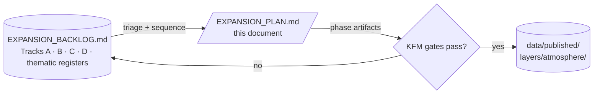
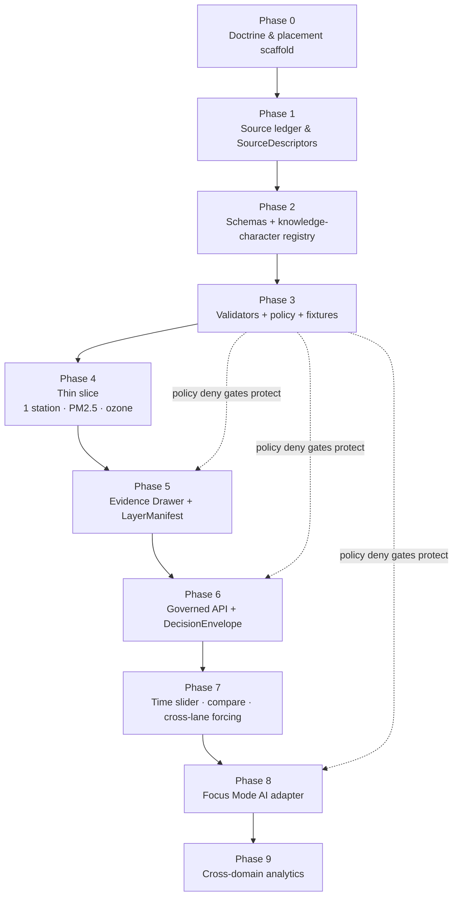

<!-- [KFM_META_BLOCK_V2]
doc_id: kfm://doc/atmosphere-expansion-plan
title: Atmosphere / Air — Expansion Plan
type: standard
version: v1-draft
status: draft
owners: <atmosphere-stewards> (TBD)
created: 2026-05-15
updated: 2026-05-29
policy_label: public
related:
  - docs/domains/atmosphere/EXPANSION_BACKLOG.md
  - docs/domains/atmosphere/README.md
  - docs/domains/atmosphere/SOURCES.md
  - docs/registers/VERIFICATION_BACKLOG.md
  - docs/adr/
  - ai-build-operating-contract.md
tags: [kfm, atmosphere, air, plan, roadmap, governance, sequencing]
notes:
  # Path PROPOSED per Directory Rules §12 (Domain Placement Law) and §4 (placement quick check).
  # Build order anchored to ai-build-operating-contract.md §30 (canonical 13-step build order); the "meaning -> shape -> ... -> AI" phrasing is a paraphrase of that backbone.
  # Domain-internal phases sit INSIDE the master roadmap's Phase 10 (Domain expansion, public-safe aggregates) per Atlas §21 / [ENCY] §23 — NOT Phase 5, which is the Hydrology proof slice.
  # Doctrine-adjacent doc: pinned CONTRACT_VERSION = "3.0.0".
  # Meta Block v2 rule: no nested HTML comments inside this block; '#' annotations only.
[/KFM_META_BLOCK_V2] -->

# 🌬️ Atmosphere / Air — Expansion Plan

> A sequenced, dependency-aware roadmap for bringing the **Atmosphere / Air** domain from doctrine into a public-safe proof slice and then outward — preserving the KFM trust membrane, knowledge-character anti-collapse, and default-deny posture at every step.


| Field | Value |
|---|---|
| **Status** | `draft` — initial assembly from doctrine; not yet steward-reviewed |
| **Owners** | `<atmosphere-stewards>` *(PROPOSED — assign in `CODEOWNERS`)* |
| **Last updated** | `2026-05-29` |
| **Operating contract** | `CONTRACT_VERSION = "3.0.0"` *(per `ai-build-operating-contract.md`)* |
| **Implementation maturity** | `UNKNOWN` — repo not mounted this session; no claim about live files, tests, routes, or releases |
| **Doctrinal anchors** | `[DOM-AIR]`, `[ENCY]` §7.9 + §23, Atlas §21, `[UNIFIED]`, `[DIRRULES]` §12, operating-contract §30 build order |
| **Master roadmap position** | Atmosphere expansion sits **inside Phase 10** (Domain expansion, public-safe aggregates) of the master roadmap. `[ENCY]` §23 / Atlas §21 |
| **Companion** | [EXPANSION_BACKLOG.md](./EXPANSION_BACKLOG.md) (unsorted item register) |

> [!IMPORTANT]
> **This plan is sequencing, not a release schedule.** No phase below is "done" until the corresponding KFM gates (`SourceDescriptor` → `EvidenceRef` → `EvidenceBundle` → `ValidationReport` → policy decision → `ReleaseManifest` → correction path → rollback target) pass for the artifacts that phase produced. `[UNIFIED]`

> [!WARNING]
> **Path posture.** This session inspected attached doctrine only; no repo was mounted. Every path below is `PROPOSED`; verify against the current repo, ADR index, and drift register before merge. *(operating-contract §7.3 path-bearing-artifact preamble.)*

---

## 📑 Contents

1. [Purpose and relation to the backlog](#1-purpose-and-relation-to-the-backlog)
2. [Plan principles](#2-plan-principles)
3. [Phase map and dependency flow](#3-phase-map-and-dependency-flow)
4. [Phase 0 — Doctrine and placement scaffold](#4-phase-0--doctrine-and-placement-scaffold)
5. [Phase 1 — Source ledger and `SourceDescriptor`s](#5-phase-1--source-ledger-and-sourcedescriptors)
6. [Phase 2 — Schemas, contracts, and knowledge-character registry](#6-phase-2--schemas-contracts-and-knowledge-character-registry)
7. [Phase 3 — Validators, policy gates, and fixtures](#7-phase-3--validators-policy-gates-and-fixtures)
8. [Phase 4 — Proof-bearing thin slice (single station)](#8-phase-4--proof-bearing-thin-slice-single-station)
9. [Phase 5 — Evidence Drawer and `LayerManifest`](#9-phase-5--evidence-drawer-and-layermanifest)
10. [Phase 6 — Governed API and `DecisionEnvelope`](#10-phase-6--governed-api-and-decisionenvelope)
11. [Phase 7 — Time slider, compare mode, cross-lane forcing](#11-phase-7--time-slider-compare-mode-cross-lane-forcing)
12. [Phase 8 — Governed AI Focus Mode adapter](#12-phase-8--governed-ai-focus-mode-adapter)
13. [Phase 9 — Cross-domain analytics and research surfaces](#13-phase-9--cross-domain-analytics-and-research-surfaces)
14. [Acceptance criteria](#14-acceptance-criteria)
15. [Risks and rollback per phase](#15-risks-and-rollback-per-phase)
16. [ADR dependencies](#16-adr-dependencies)
17. [Cross-lane handoff schedule](#17-cross-lane-handoff-schedule)
18. [Out of scope](#18-out-of-scope)
19. [Open questions register](#19-open-questions-register)
20. [Changelog](#20-changelog)
21. [Definition of done](#21-definition-of-done)
22. [Related docs](#22-related-docs)
23. [Appendix](#23-appendix)

---

## 1. Purpose and relation to the backlog

**Purpose.** Provide a sequenced, dependency-aware path from doctrine (`[DOM-AIR]`, `[ENCY]` §7.9) to a public-safe proof slice and then outward, while preserving every KFM invariant.

**Relation to the backlog.** This plan **consumes** items from [`EXPANSION_BACKLOG.md`](./EXPANSION_BACKLOG.md) and places them on a phase timeline:



> [!NOTE]
> The backlog is the **register**; the plan is the **sequence**. If a backlog item is unsequenced here, it is **not scheduled** — by design. New items enter via the backlog's triage protocol (backlog §17), not by being placed directly on this plan.

**Scope of this plan.** Atmosphere-internal sequencing only. It does not alter the master KFM phase order (`[ENCY]` §23 / Atlas §21); it sits **inside** the master roadmap's **Phase 10 (Domain expansion, public-safe aggregates)**, which the Atlas explicitly names as the phase where *"Agriculture/geology/air/hazards fixtures pass gates."* `[ENCY]` §23 / Atlas §21

> [!IMPORTANT]
> **Master-roadmap correction.** An earlier draft placed Atmosphere "inside Phase 5." Phase 5 of the master roadmap is the **Hydrology proof-bearing thin slice** (`HUC / gauge / NFHL` fixture); air, hazards, agriculture, and geology are sequenced at **Phase 10**. The phase numbers in §3–§13 below are **Atmosphere-internal** sub-phases of that master Phase 10 — they are not master-roadmap phase numbers. `CONFIRMED` Atlas §21 master roadmap table.

[Back to top](#-contents)

---

## 2. Plan principles

The sequencing below follows four doctrinal rules.

1. **Governance membrane first.** Responsibility-root skeleton, doctrine docs, source descriptors, schemas, no-network fixtures, validators, policy stubs, finite envelopes, release dry-run, and correction/rollback objects come **before** live connectors, broad UI expansion, or AI runtime integration. *(operating-contract §30; Atlas §21 "build the governance spine before public features.")*
2. **Earn outward.** Canonical build order (operating-contract §30) is `doctrine → object contract → schema → fixtures → validator → policy gate → source descriptor → no-network dry run → receipt → governed API → UI/map → release dry run → public release`. Compressed: `meaning → shape → examples → validators → policy → receipts → resolver → release → UI → AI`. Each step earns the next; nothing skips ahead.
3. **Smallest useful proof.** The first release proves one small trust path end-to-end — not broad feature coverage. The Atmosphere anchor is **one station time-series fixture with PM2.5 / ozone, unit-conversion receipt, freshness badge, and non-emergency disclaimer**. *(modeled on the Atlas Phase 5 Hydrology thin slice; `INFERRED` for Atmosphere.)*
4. **Default deny.** Every phase exit gate is a `DENY` until evidence proves otherwise. Unclear rights, unresolved source role, missing evidence, unresolved sensitivity, or absent release state **blocks** advancement. `[ENCY]` `[DIRRULES]`

> [!TIP]
> **Phases are not calendar dates.** Each phase concludes when its **exit criteria** are met for the artifacts it produced. Velocity is a function of evidence, not schedule pressure.

[Back to top](#-contents)

---

## 3. Phase map and dependency flow



> [!NOTE]
> These P0–P9 labels are **Atmosphere-internal** sub-phases. They sit inside master-roadmap Phase 10. Do not confuse them with the master roadmap's own Phase 0–13 numbering (Atlas §21).

| Phase | Outputs (`PROPOSED`) | Primary gate to exit |
|---|---|---|
| **0** | Domain `docs/`, `CODEOWNERS` lines, ADR queue | Doctrine assembled; per-root README present where applicable. `[DIRRULES]` §15 |
| **1** | `data/registry/sources/atmosphere/` entries; `SourceDescriptor`s for first source family | `SourceDescriptor` exists with rights/role/sensitivity/freshness. `[DOM-AIR]` |
| **2** | Object schemas; knowledge-character registry | Schemas pass shape validators; registry round-trips. `[DOM-AIR]` |
| **3** | Validators + policy + valid/invalid fixtures | Deny tests + dry-run no-live-fetch tests pass. `[DOM-AIR]` |
| **4** | One station time-series `EvidenceBundle`; unit-conversion receipt; freshness badge; non-emergency disclaimer | Catalog/proof closure passes; `ReleaseManifest` dry-run + `RollbackCard` produced. `[ENCY]` §7.9 |
| **5** | `EvidenceDrawerPayload`; `LayerManifest`; map tile | Trust-membrane test passes; drawer renders evidence without truth-claim drift. `[MAP-MASTER]` |
| **6** | governed-API resolver returning `AtmosphereAirDecisionEnvelope` | Finite outcomes (`ANSWER`/`ABSTAIN`/`DENY`/`ERROR`); contract tests pass. `[DOM-AIR]` `[GAI]` |
| **7** | Time slider; compare mode; precip / heat / smoke cross-lane forcing context | Temporal-logic + sensitivity-redaction join tests pass. `[ENCY]` |
| **8** | Focus Mode template + `AIReceipt` | Citation validator passes; ABSTAIN rate visibly tracked. `[GAI]` |
| **9** | Graph/triplet projections; fusion products; reanalysis joins | Graph-projection + `DERIVED_FUSION` knowledge-character tests pass. `[DOM-AIR]` |

[Back to top](#-contents)

---

## 4. Phase 0 — Doctrine and placement scaffold

> Establish the Atmosphere lane within the responsibility roots; assemble doctrine; queue ADRs.

**Inputs.** `[DOM-AIR]`, `[ENCY]` §7.9 + §11, `[DIRRULES]` §12, Atlas §24.13 crosswalk.

**Outputs (`PROPOSED`).**

- `docs/domains/atmosphere/README.md` — domain landing page.
- `docs/domains/atmosphere/EXPANSION_BACKLOG.md` — registered candidates.
- `docs/domains/atmosphere/EXPANSION_PLAN.md` — this document.
- `docs/domains/atmosphere/SOURCES.md` — source-family overview.
- `docs/domains/atmosphere/CROSSWALK.md` — cross-lane relations.
- `CODEOWNERS` lines naming Atmosphere stewards.
- ADR queue: ADR-AIR-01 (schema home & contract/schema split), ADR-AIR-02 (source-role enum), ADR-AIR-03 (knowledge-character registry placement). `[DIRRULES]` §2.4

**Exit criteria.** Per-root README contract satisfied for each created folder (`[DIRRULES]` §15). ADRs at least filed as `proposed`. No path-shaped claim outside the doctrinal anchors is treated as canonical.

**Rollback.** Revert PRs; preserve correction notes in `docs/registers/DRIFT_REGISTER.md` per `[DIRRULES]` §2.5. *(mirrors master-roadmap Phase 1 rollback: "revert doc PR and preserve correction note.")*

> [!NOTE]
> Phase 0 produces **no public artifact**. It is doctrine-only. Treat any claim that "the Atmosphere domain is live" at this point as drift.

[Back to top](#-contents)

---

## 5. Phase 1 — Source ledger and `SourceDescriptor`s

> Admit sources with rights, role, sensitivity, citation, time, and hash discipline — no live fetch.

**Inputs.** `[DOM-AIR]` §D source families (EPA AQS, AirNow, OpenAQ-like, NOAA / NWS, Kansas Mesonet, CAMS / ECMWF, HRRR-Smoke, HMS smoke, GOES / ABI AOD, VIIRS).

**Outputs (`PROPOSED`).**

- `data/registry/sources/atmosphere/` entries, each carrying:
  - source identity + role + rights + sensitivity + freshness cadence;
  - citation; hash for any cached payload;
  - synthetic no-network fixture.
- `docs/domains/atmosphere/SOURCES.md` populated from registry.

**Exit criteria.** For at least **one** source family, a complete `SourceDescriptor` exists with rights status recorded (`NEEDS VERIFICATION` permitted, opaque-fail permitted on the public path). Connectors do **not** open a live network socket in CI. `[DOM-AIR]` `[ENCY]`

**Rollback.** Remove source entry; restore prior `data/registry/sources/atmosphere/` snapshot. No public artifact depends on this phase, so rollback is local.

| Source family priority for Phase 1 | Why first | Rights posture |
|---|---|---|
| **Kansas Mesonet** *(candidate anchor)* | Regional mesonet provides the simplest one-station time-series fixture aligned with the thin-slice pattern in `[ENCY]` §7.9. | `NEEDS VERIFICATION` — usage policy must be reviewed; fail closed without recorded consent. *(Kansas Mesonet is named as connector-watcher candidate material in `New Ideas 4-14-26.pdf`, SRC-P23-003; treat that as planning evidence, not rights clearance.)* |
| **EPA AirNow / AQS** *(secondary)* | Validates the regulatory-vs-public-AQI knowledge-character split. | `NEEDS VERIFICATION` — verify bulk / API rate limits and attribution. |
| **NOAA / NWS** *(tertiary)* | Public-domain context for advisories; needed for `AdvisoryContext`. | Generally permissive; verify per product. |

> [!NOTE]
> A prior draft cited a `New_Ideas_5-8-26.pdf` for the Kansas Mesonet rights note. That filename could **not** be confirmed in indexed project knowledge this session; the corroborating reference located is `New Ideas 4-14-26.pdf` (SRC-P23-003). The `5-8-26` citation is marked `NEEDS VERIFICATION` and should not be treated as a confirmed source until checked against a mounted repo or source ledger.

[Back to top](#-contents)

---

## 6. Phase 2 — Schemas, contracts, and knowledge-character registry

> Realize the meaning layer: object schemas, the parameter / unit registry, and the knowledge-character vocabulary.

**Inputs.** `[DOM-AIR]` §C (knowledge characters), §E (object families); schema home default `schemas/contracts/v1/<...>` (`PROPOSED` pending ADR-AIR-01); object **meaning** under `contracts/domains/atmosphere/` per `[DIRRULES]` §12 placement protocol.

**Outputs (`PROPOSED`).**

- Object **shape** schemas under `schemas/contracts/v1/<...>`: `AirStation`, `AirObservation`, `PM25Observation`, `OzoneObservation`, `SmokeContext`, `AODRaster`, `WeatherStation`, `WeatherObservation`, `WindField`, `PrecipitationObservation`, `TemperatureObservation`, `ClimateNormal`, `ClimateAnomaly`, `ForecastContext`, `AdvisoryContext` (`.schema.json` each).
- Object **meaning** contracts under `contracts/domains/atmosphere/` (semantic prose for the same families).
- Knowledge-character registry covering `OBSERVED_SENSOR`, `PUBLIC_AQI_REPORT`, `REGULATORY_ARCHIVE`, `LOW_COST_SENSOR`, `ATMOSPHERIC_MODEL_FIELD`, `REMOTE_SENSING_MASK`, `CLIMATE_ANOMALY_CONTEXT`, `DERIVED_FUSION`, `METEOROLOGICAL_CONTEXT`, `ALERT_AND_ADVISORY_CONTEXT`, `NETWORK_AND_SITE_CONTEXT`.
- Parameter / unit registry with unit-conversion receipts (µg/m³ ↔ ppb; °F ↔ °C; m/s ↔ mph).

**Exit criteria.** All object schemas validate sample fixtures; knowledge-character registry round-trips through validators; unit-conversion receipts are emitted for representative units. `[DOM-AIR]`

**Rollback.** Remove schema wave; revert ADR if accepted; reopen ADR draft. *(mirrors master-roadmap Phase 2 rollback: "remove schema wave if ADR fails.")*

> [!WARNING]
> **Schema home is ADR-class, and shape ≠ meaning.** Per `[DIRRULES]` §2.4(3), the canonical schema home is decided by ADR (default `schemas/contracts/v1/`). Per the §9 placement protocol, **meaning goes to `contracts/`; shape goes to `schemas/contracts/v1/...`** — these are *different roots*. Collapsing both into a single `schemas/contracts/v1/air/` path (as an earlier draft did) is the **two-parallel-schema-homes / schema-authored-alongside-meaning** anti-pattern. Do **not** mirror schemas in `contracts/` (or vice versa) without an accepted ADR. Anti-pattern: `[DIRRULES]` §13.1; Atlas §24.9.1. `CONFLICTED → ADR-AIR-01.`

[Back to top](#-contents)

---

## 7. Phase 3 — Validators, policy gates, and fixtures

> Make every knowledge-character rule enforceable, not aspirational.

**Inputs.** `[DOM-AIR]` §K validator list; `[ENCY]` §7.9.K validator list; `[GAI]` finite-outcome envelopes.

**Outputs (`PROPOSED`).**

| Class | Examples |
|---|---|
| **Schema / shape validators** | `AirObservation` shape; unit-receipt presence; temporal-field separation. |
| **Source / rights validators** | `SourceDescriptor` completeness; rights-block-on-unclear-terms; freshness-cadence presence. |
| **Knowledge-character validators** | Knowledge-character registry round-trip; reject unknown classes. |
| **Deny tests** | `AQI-as-concentration` denial; `AOD-as-PM2.5` denial; `model-as-observed` denial; low-cost sensor caveat presence. |
| **Operational guards** | `dryrun` no-live-fetch tests; stale-state policy tests. |
| **Cross-lane sensitivity** | Redaction-receipt presence on joins with Habitat / Fauna / Archaeology. |
| **Citation validator** | Every public claim resolves to an `EvidenceBundle`. |

**Exit criteria.** All deny tests pass in CI with **reason-coded** `DENY` / `ABSTAIN` / `ERROR` / `HOLD` outcomes; `dryrun` connectors raise on any live-network attempt; citation validator passes on the fixture corpus. *(master-roadmap Phase 3 exit: "reason-coded DENY/ABSTAIN/ERROR/HOLD outcomes.")* `[DOM-AIR]` `[ENCY]`

**Rollback.** A validator may only be removed when a stronger gate replaces it. *(master-roadmap Phase 3 rollback: "disable only if stronger gate replaces.")*

> [!IMPORTANT]
> Validator code lives in `tools/validators/<topic>/...` and is **called** by tests. Test-only validator logic is a known anti-pattern. Cross-domain validators use a **non-domain** segment (`tools/validators/<topic>/...`), never `tools/validators/domains/<picked-one>/...`. `[DIRRULES]` §13.5, §12

[Back to top](#-contents)

---

## 8. Phase 4 — Proof-bearing thin slice (single station)

> **The Atmosphere proof slice.** One station time-series fixture with PM2.5 / ozone, unit-conversion receipt, freshness badge, non-emergency disclaimer.

**Inputs.** Phases 0–3 closed. One synthetic station fixture (no live fetch). Knowledge characters: `OBSERVED_SENSOR` + `PUBLIC_AQI_REPORT` (illustrative pairing).

**Outputs (`PROPOSED`).**

- `data/raw/atmosphere/<station>/<date>/...` — synthetic immutable payload (or reference).
- `data/work/atmosphere/<station>/...` — normalized observation objects.
- `data/processed/atmosphere/<station>/...` — validated, public-safe candidates.
- `data/catalog/domain/atmosphere/<station>/...` — `EvidenceBundle` for the time-series feature.
- `data/published/layers/atmosphere/<station>/...` — fixture-only release artifact (no live source).
- `release/candidates/atmosphere/<release-id>/ReleaseManifest.json`, `RollbackCard.json`.
- Drawer payload that renders source role, freshness, knowledge character, unit, citation, non-emergency disclaimer.

**Exit criteria** *(combined from `[UNIFIED]` acceptance rule + `[ENCY]` §7.9.M release gates; adapted from the master-roadmap Phase 5 Hydrology thin slice)*.

```text
✓ SourceDescriptor present and rights status recorded
✓ EvidenceRef resolves to EvidenceBundle
✓ ValidationReport produced and passing
✓ Policy decision recorded (ANSWER for this slice; DENY tests still pass)
✓ ReleaseManifest dry-run completes
✓ RollbackCard exists for this release
✓ Correction path identified
✓ Drawer payload renders without truth-claim drift
✓ Non-emergency disclaimer visible on the public surface
```

**Rollback.** Roll back to prior `ReleaseManifest`; **never** label any `AODRaster`, `SmokeContext`, or model-field artifact as an observed reading on the public path. *(adapts the master-roadmap Phase 5 rollback posture: "never label NFHL observed flood" → never label model/remote-sensing fields as observed.)*

> [!CAUTION]
> Phase 4 is the **most failure-prone** phase, because it is the first place doctrine meets concrete fixtures. Expect to discover schema gaps, missing receipts, and unspecified time-field semantics here. That is the point — surface them early; do not paper over. The Atlas is explicit that thin slices catch regressions well but first-time bugs poorly, and recommends **multiple thin slices** rather than one thick one.

[Back to top](#-contents)

---

## 9. Phase 5 — Evidence Drawer and `LayerManifest`

> Make trust visible in the map shell, without letting the renderer become the source of truth.

**Inputs.** Phase 4 closed. `[MAP-MASTER]` Evidence Drawer doctrine.

**Outputs (`PROPOSED`).**

- `EvidenceDrawerPayload` projection of the Phase 4 `EvidenceBundle`.
- `LayerManifest` for the single-station layer, served through the governed surface only.
- Map tile or vector tile bundle for the station point and (optionally) a small surrounding context layer.
- Renderer-boundary test fixtures (drawer renders evidence; map renders geometry; neither becomes authority). `[MAP-MASTER]`

**Exit criteria.** Trust-membrane test passes (public client reads `LayerManifest` through the governed API, not from `data/processed/atmosphere/`). Drawer renders source role, knowledge character, freshness, unit, citation, and non-emergency disclaimer. `[DIRRULES]` §13.5; `[MAP-MASTER]`

**Rollback.** Revert the layer-registry entry; the layer disappears from the shell. *(addresses the "renderer treated as truth" / "map shell consumes canonical store directly" anti-patterns, Atlas §24.9.2.)*

[Back to top](#-contents)

---

## 10. Phase 6 — Governed API and `DecisionEnvelope`

> Replace direct file reads with finite-outcome envelopes. `ANSWER` / `ABSTAIN` / `DENY` / `ERROR`.

**Inputs.** Phase 4 closed. `[DOM-AIR]` §J governed-API surfaces.

**Outputs (`PROPOSED`).**

- governed-API resolver (`apps/governed-api/`, name `PROPOSED`) for Atmosphere feature / detail returning `AtmosphereAirDecisionEnvelope`.
- Layer-manifest resolver returning `LayerManifest` with `ANSWER` / `DENY` / `ERROR`.
- Evidence Drawer payload resolver returning `EvidenceDrawerPayload` + `EvidenceBundle` projection.

**Exit criteria.** Contract tests cover all four finite outcomes for at least one route. ABSTAIN fires when evidence is incomplete; DENY fires on policy block; ERROR fires on infrastructure failure. Route names remain `PROPOSED` until reviewed via ADR. `[DOM-AIR]` `[GAI]`

**Rollback.** Disable the resolver route; clients fall back to a published static `LayerManifest` (still governed, just not interactive).

> [!NOTE]
> Per `[DIRRULES]` §13.5 and Atlas §24.9.2, no public route may read `data/processed/atmosphere/` or `data/published/layers/atmosphere/` directly. The trust membrane is the boundary; the governed API is the gate. A public client reading `RAW` / `WORK` / `QUARANTINE` is a named DENY-surface anti-pattern.

[Back to top](#-contents)

---

## 11. Phase 7 — Time slider, compare mode, cross-lane forcing

> Add depth without breaking knowledge-character anti-collapse.

**Inputs.** Phases 5 and 6 closed. `[DOM-AIR]` §F cross-lane relations.

**Outputs (`PROPOSED`).**

- Time slider over the station time series (uses source / observed / valid / retrieval / release / correction time fields kept distinct). `[DOM-AIR]` §E
- Compare mode: two snapshots, two stations, two knowledge characters.
- Precipitation forcing handoff to Hydrology *(read-only context; Atmosphere does not own water-body truth)*. `[DOM-AIR]` §F
- Heat / smoke context handoff to Hazards *(read-only context; Hazards owns hazard-event truth)*. `[DOM-AIR]` §F
- Phenology / drought-stress context handoff to Biodiversity domains *(sensitive locations redacted by default)*. `[DOM-AIR]` §F

**Exit criteria.** Temporal-logic tests pass (no false alignment across distinct time fields). Cross-lane sensitivity-redaction join tests pass. `[DOM-AIR]` `[ENCY]`

**Rollback.** Disable the cross-lane handoff first (it has the higher leak risk); preserve the in-domain time slider.

> [!CAUTION]
> `SmokeContext` is a **shared** object family between Atmosphere and Hazards (both list it as owned). On any smoke handoff, Atmosphere supplies observed / model context only; Hazards owns hazard-event truth. Joins touching Biodiversity / Archaeology fail closed and use generalized geometry. `[ENCY]` §23.2 cross-lane join policy.

[Back to top](#-contents)

---

## 12. Phase 8 — Governed AI Focus Mode adapter

> AI may summarize released `EvidenceBundle`s, never become root truth.

**Inputs.** Phase 6 closed. `[GAI]` Focus Mode + `AIReceipt` doctrine.

**Outputs (`PROPOSED`).**

- Focus Mode answer template for an Atmosphere question shape — e.g., *"What was air quality at station X on date Y?"*
- `RuntimeResponseEnvelope` with `AIReceipt` containing prompt + parameters + cited `EvidenceBundle`s.
- Citation validator on every emitted answer.
- ABSTAIN-rate-by-template tracking (very low ABSTAIN suggests over-fitting; very high suggests evidence gaps). `[ENCY]` Atlas §24.11.4

**Exit criteria.** Every emitted answer carries an `AIReceipt` resolving to at least one released `EvidenceBundle` (`AIReceipt` presence rate 100%). Synthetic-claim incidence approaches zero; never silently. Citation validator + finite-outcome tests pass. `[GAI]`

**Rollback.** Disable the AI adapter; the Focus panel returns to a static evidence-summary view.

> [!WARNING]
> AI is never root truth. If the citation validator cannot resolve a claim, the answer must be `ABSTAIN` — not a polished prose response that hides the gap. "AI returns uncited language" and "AI answers from RAW / WORK rather than `EvidenceBundle`" are both named DENY-surface anti-patterns. `[GAI]` Atlas §24.9.2

[Back to top](#-contents)

---

## 13. Phase 9 — Cross-domain analytics and research surfaces

> Reach without rewriting the rules.

**Inputs.** All prior phases closed.

**Outputs (`PROPOSED`).**

- Graph / triplet projections (Atmosphere ⨯ Hydrology ⨯ Agriculture for drought × precipitation × soil-moisture queries).
- Fusion-product registry entries carrying the `DERIVED_FUSION` knowledge character.
- Reanalysis archive integration (CAMS / ECMWF family) with `ATMOSPHERIC_MODEL_FIELD` knowledge character and ensemble caveat.
- Sustainability telemetry (energy / CO₂ estimate) on expensive build / tile pipelines, **if** the steward-reviewed precision is governance-useful without being misleading to public readers. *(`PROPOSED`; corroborating idea-card reference `NEEDS VERIFICATION` — see OQ-AIR-PLAN-04.)*

**Exit criteria.** Graph-projection tests pass without surfacing sensitive-location detail. `DERIVED_FUSION` outputs carry per-input uncertainty + lineage. Reanalysis joins never collapse to observations. `[DOM-AIR]` `[ENCY]`

**Rollback.** Disable the analytics surface; the underlying released `EvidenceBundle`s remain available through the governed API.

> [!NOTE]
> Graph projections, vector indexes, fusion products, and reanalysis layers are **derivative carriers**. `EvidenceBundle` outranks all of them. None may be cited as root authority. `[GAI]` `[ENCY]`

[Back to top](#-contents)

---

## 14. Acceptance criteria

The plan is **not complete** when Phase 9 ends — KFM uses an *acceptance-by-trust-spine* rule rather than a feature-checklist rule. `[UNIFIED]`

| Acceptance area | Good-enough criterion for Atmosphere | Status |
|---|---|---|
| **Source admission** | `SourceDescriptor` exists for every actively-used source; rights status recorded. | `PROPOSED` `[DOM-AIR]` |
| **Evidence resolution** | Every public claim about the Atmosphere domain resolves through `EvidenceRef` → `EvidenceBundle`. | `PROPOSED` `[GAI]` `[ENCY]` |
| **Policy decision** | Every governed-API outcome is one of `ANSWER` / `ABSTAIN` / `DENY` / `ERROR`. | `PROPOSED` `[DOM-AIR]` `[GAI]` |
| **Validation** | `ValidationReport`s exist for every promoted artifact; deny tests pass. | `PROPOSED` `[DOM-AIR]` |
| **Release state** | `ReleaseManifest` + correction path + rollback target present for every release. | `PROPOSED` `[ENCY]` Appendix E |
| **UI trust payload** | Drawer renders source role, knowledge character, freshness, citation, non-emergency disclaimer. | `PROPOSED` `[MAP-MASTER]` |
| **Correction path** | Public `CorrectionNotice` surface is documented and tested. | `PROPOSED` `[ENCY]` |
| **Rollback target** | Rollback drill executed for at least one Atmosphere release. | `PROPOSED` `[ENCY]` |

[Back to top](#-contents)

---

## 15. Risks and rollback per phase

Reuses the Atmosphere risk register from `[ENCY]` §7.9.M and aligns each row to the phase where it most plausibly materializes.

| Phase | Primary risks | Rollback / failure posture |
|---|---|---|
| 0 | Doctrine drift; placement mistakes. | Revert PR; drift register entry. `[DIRRULES]` §2.5 |
| 1 | Rights uncertainty; source-authority confusion. | Remove source entry; block public release until terms recorded. `[ENCY]` |
| 2 | Knowledge-character collapse at the schema layer; shape/meaning home collapse. | Schema wave revert; reopen ADR. `[DIRRULES]` §13.1 |
| 3 | Validator gaps or test-only validators. | Replace with stronger gate; never silently remove. `[DIRRULES]` §13.5 |
| 4 | False precision; stale data; rollback complexity. | Roll back to prior `ReleaseManifest`; never label model fields as observed. `[ENCY]` |
| 5 | Renderer treated as truth. | Revert layer registry; the layer disappears from the shell. `[MAP-MASTER]` |
| 6 | Direct canonical-store reads bypass the membrane. | Disable resolver; fall back to static governed manifest. `[DIRRULES]` §13.5 |
| 7 | False temporal alignment; cross-lane sensitive-location leak. | Disable cross-lane handoff first; preserve in-domain time slider. `[ENCY]` |
| 8 | Hallucination; uncited claims. | Disable AI adapter; revert to static evidence-summary view. `[GAI]` |
| 9 | Derivative becomes truth; fusion overconfidence. | Disable analytics surface; underlying `EvidenceBundle`s remain. `[ENCY]` |

[Back to top](#-contents)

---

## 16. ADR dependencies

Phases below cannot exit without their gating ADRs *(per `[DIRRULES]` §2.4)*. Local `ADR-AIR-NN` IDs map to the Atlas §24.12 Master Open-ADR Backlog (`ADR-S-NN`) to avoid a parallel ADR namespace.

| Phase | ADR(s) gating exit | Maps to Atlas | Notes |
|---|---|---|---|
| 2 | **ADR-AIR-01** — Atmosphere schema home + contract/schema (shape/meaning) split. | ADR-S-01 | Per `[DIRRULES]` §2.4(3); default `schemas/contracts/v1/<...>`; meaning under `contracts/`. |
| 2 | **ADR-AIR-02** — Source-role enum vocabulary. | ADR-S-04 | Source-role anti-collapse is doctrine-significant. |
| 2 | **ADR-AIR-03** — Knowledge-character registry placement (`data/registry/` vs. `control_plane/`). | ADR-S-03 (analogue) | Per `[DIRRULES]` §2.4(5); registry is a new home. |
| 3 | **ADR-AIR-04** — Low-cost sensor public-release contract. | ADR-S-05 (analogue) | Hard schema requirement for correction + caveat + confidence + limitations. |
| 5 | **ADR-AIR-05** — Advisory-context redirect contract. | ADR-S-06 / ADR-S-14 | Trust membrane + ownership boundary with Hazards. |
| 7 | **ADR-AIR-06** — Climate scenario vs. observed labeling. | (new candidate) | `scenario_horizon` + `scenario_role` discipline. |

Any other ADR introduced by a phase (e.g., a sensitivity-tier ADR per Atlas §24.12 ADR-S-05, or a cross-lane join-policy ADR per ADR-S-14) joins this table when filed.

[Back to top](#-contents)

---

## 17. Cross-lane handoff schedule

Cross-lane handoffs happen by phase. The Atmosphere domain **never** assumes a neighboring lane's truth and **never** exports sensitive-location precision into a neighboring lane. `[DOM-AIR]` §F

| Handoff | Earliest phase | Posture |
|---|---|---|
| Atmosphere → Hazards (smoke / heat-cold / advisory / visibility / fire-emissions context) | Phase 7 | Read-only context. Hazards owns hazard-event truth. `SmokeContext` shared. `[DOM-AIR]` `[DOM-HAZ]` |
| Atmosphere → Agriculture (heat / smoke / precipitation / vegetation-stress context) | Phase 7 | Read-only context. Agriculture owns crop / field truth. `[DOM-AIR]` `[DOM-AG]` |
| Atmosphere → Hydrology (precipitation / drought / flood-weather forcing) | Phase 7 | Read-only context. Hydrology owns water-body / gauge truth. `[DOM-AIR]` `[DOM-HYD]` |
| Atmosphere → Biodiversity (phenology / smoke / fire / drought-stress context) | Phase 7 | Sensitive locations redacted by default; use generalized geometry. `[DOM-AIR]` `[DOM-HF]` |
| Atmosphere → Settlements / Infrastructure (exposure context, never asset disclosure) | Phase 9 | Critical-asset deny lane; Atmosphere never exposes precise infrastructure exposure. `[DOM-AIR]` `[DOM-SETTLE]` |

[Back to top](#-contents)

---

## 18. Out of scope

This plan **does not**:

- Authorize public release. Release is governed by `release/` per `[DIRRULES]` §5 and the publication gate in `[DOM-AIR]` §M.
- Replace `docs/registers/VERIFICATION_BACKLOG.md`. Open verification items remain there. `[DIRRULES]` §18
- Override the master phase sequence. Atmosphere expansion sits **inside Phase 10 (Domain expansion, public-safe aggregates)** of the master KFM roadmap — **not** Phase 5, which is the Hydrology proof slice. `[ENCY]` §23 / Atlas §21
- Carry life-safety guidance. Atmosphere / Air is **not** an emergency alert system; Hazards owns hazard-event truth and KFM is not an alert authority. "KFM used as alert / instruction authority" is a named DENY-surface anti-pattern. `[DOM-AIR]` `[DOM-HAZ]`
- Set calendar dates. Phases close on **evidence**, not on schedule.

[Back to top](#-contents)

---

## 19. Open questions register

| ID | Question | Owner role | Resolution path |
|---|---|---|---|
| OQ-AIR-PLAN-01 | Is the Atmosphere schema home `schemas/contracts/v1/<...>` (shape) with semantics under `contracts/domains/atmosphere/`, confirming the shape/meaning split? | architecture owner + docs steward | ADR-AIR-01 (→ ADR-S-01) + repo inspection |
| OQ-AIR-PLAN-02 | What is the exact master-roadmap phase the Atmosphere lane attaches to — is "Phase 10, Domain expansion" stable across Atlas editions, or renumbered in a later pass? | release owner | Atlas §21 cross-check + repo roadmap inspection |
| OQ-AIR-PLAN-03 | Is the Kansas Mesonet rights note sourced from `New Ideas 4-14-26.pdf` (confirmed) or a `5-8-26` file (unconfirmed)? | atmosphere steward | source-ledger inspection |
| OQ-AIR-PLAN-04 | Does the sustainability-telemetry idea (Phase 9) have a confirmed `[INDEX-18]` card, or is it inferred? | atmosphere steward | Pass 18 idea-index inspection |
| OQ-AIR-PLAN-05 | Are `[UNIFIED]` §§4.4/4.5 and the Greenfield §§22–23 references accurate section numbers, or approximate? | docs steward | mounted-repo doc inspection |

[Back to top](#-contents)

---

## 20. Changelog

| Change | Type (per contract §37) | Reason |
|---|---|---|
| Corrected master-roadmap attachment from "Phase 5" to **Phase 10 (Domain expansion)** | reconciliation | Atlas §21 / `[ENCY]` §23: Phase 5 is the **Hydrology** proof slice; air/hazards/agriculture/geology are Phase 10. The prior claim conflated the two. |
| Re-anchored build order to operating-contract **§30** (13-step canonical order) | reconciliation | `[UNIFIED]`/"BLD-COMP §4" was a paraphrase; the authoritative build order is operating-contract §30. |
| Surfaced shape (`schemas/`) vs. meaning (`contracts/`) home split; flagged `schemas/contracts/v1/air/` collapse as `CONFLICTED` | reconciliation | `[DIRRULES]` §9 placement protocol + §13.1 anti-pattern: meaning and shape are different roots. |
| Demoted `New_Ideas_5-8-26.pdf` Kansas Mesonet citation to `NEEDS VERIFICATION`; noted `New Ideas 4-14-26.pdf` (SRC-P23-003) as the located reference | gap closure | The `5-8-26` filename could not be confirmed in indexed project knowledge. |
| Added `[UNIFIED]` §§4.4/4.5 and Greenfield §§22–23 to the open-questions register as approximate section numbers | clarification | Section numbers not verified against a mounted doc this session. |
| Re-mapped local `ADR-AIR-NN` to Atlas §24.12 `ADR-S-NN` | reconciliation | Avoid a parallel ADR namespace; Atlas backlog is canonical. |
| Added companion sections (Open questions, Changelog, Definition of done) and §7.3 path-posture preamble | gap closure | Doctrine-adjacent doc completeness per operating contract. |
| Updated `updated:` and badge date to 2026-05-29; pinned `CONTRACT_VERSION = "3.0.0"` | housekeeping | Doctrine-adjacent doc requirement. |

> **Backward compatibility.** Section anchors §1–§18 are preserved; new sections (§19–§23) append at the tail. No path was silently rewritten — the schema-home conflict is held `CONFLICTED` with both candidate roots shown.

[Back to top](#-contents)

---

## 21. Definition of done

This document is done enough to enter the repository when:

- it is placed according to Directory Rules (`docs/domains/atmosphere/EXPANSION_PLAN.md`, `PROPOSED` per §12);
- a docs steward and an atmosphere steward review it;
- it is linked from the docs index and the Atmosphere domain `README.md`, and cross-links its companion backlog;
- the master-roadmap phase attachment (Phase 10) is confirmed against the current Atlas edition (OQ-AIR-PLAN-02);
- it does not conflict with accepted ADRs (ADR-AIR-01 / ADR-S-01 resolves the schema-home question);
- the `schemas/` vs. `contracts/` split conflict is logged in `docs/registers/DRIFT_REGISTER.md` until ADR-resolved;
- the `GENERATED_RECEIPT.json` planned for this artifact is wired into CI;
- future changes follow the operating contract's §37 lifecycle.

[Back to top](#-contents)

---

## 22. Related docs

> [!NOTE]
> Links below are repo-relative. Targets marked **`TODO`** are `PROPOSED` per Directory Rules §12 lane pattern but have not been verified to exist in a mounted repo this session.

- [`docs/domains/atmosphere/README.md`](./README.md) — domain README *(**TODO**)*
- [`docs/domains/atmosphere/EXPANSION_BACKLOG.md`](./EXPANSION_BACKLOG.md) — companion unsorted register
- [`docs/domains/atmosphere/SOURCES.md`](./SOURCES.md) — source-family overview *(**TODO**)*
- [`docs/domains/atmosphere/CROSSWALK.md`](./CROSSWALK.md) — cross-lane relations *(**TODO**)*
- [`docs/registers/VERIFICATION_BACKLOG.md`](../../registers/VERIFICATION_BACKLOG.md) — master verification backlog *(**TODO**)*
- [`docs/registers/DRIFT_REGISTER.md`](../../registers/DRIFT_REGISTER.md) — drift register *(**TODO**)*
- [`docs/adr/`](../../adr/) — ADR home *(**TODO**)*
- [`contracts/domains/atmosphere/`](../../../contracts/domains/atmosphere/) — proposed semantic (meaning) home *(**TODO** — confirm via ADR-AIR-01)*
- [`schemas/contracts/v1/`](../../../schemas/contracts/v1/) — default schema (shape) home *(**TODO** — confirm domain segment via ADR-AIR-01)*
- [`policy/domains/atmosphere/`](../../../policy/domains/atmosphere/) — proposed policy lane *(**TODO**)*
- [`tests/domains/atmosphere/`](../../../tests/domains/atmosphere/) — proposed test lane *(**TODO**)*
- [`data/registry/sources/atmosphere/`](../../../data/registry/sources/atmosphere/) — proposed source registry *(**TODO**)*
- [`ai-build-operating-contract.md`](../../../ai-build-operating-contract.md) — operating contract (`CONTRACT_VERSION = "3.0.0"`; §30 build order)

External (doctrinal) — names only; not links:

- `[DOM-AIR]` — Atmosphere / Air dossier (Atlas §11)
- `[DOM-HAZ]` — Hazards dossier (Atlas §12)
- `[ENCY]` — Domain & Capability Encyclopedia §7.9, §11, §23 (implementation roadmap)
- `[DIRRULES]` — Directory Rules (Domain Placement Law §12; §9 placement protocol; §2.4 ADR triggers; §13 anti-patterns)
- `[UNIFIED]` — Unified Implementation Architecture Build Manual *(§§4.4–4.5 numbering `NEEDS VERIFICATION`)*
- `[MAP-MASTER]` — Master MapLibre Components-Functions-Features
- `[GAI]` — Governed AI doctrine
- `[INDEX-18]` — Pass 18 Idea Index / Category Atlas
- Greenfield Building Plan *(SRC-GREEN; §§22–23 phase numbering `NEEDS VERIFICATION`)*

[Back to top](#-contents)

---

## 23. Appendix

<details>
<summary><strong>A. Phase → backlog-track / register crosswalk (click to expand)</strong></summary>

Where each phase draws from the companion [`EXPANSION_BACKLOG.md`](./EXPANSION_BACKLOG.md).

| Plan phase | Backlog source(s) |
|---|---|
| Phase 0 | §17 Triage protocol; §22 Related docs |
| Phase 1 | §8 Source admission backlog; Track A items A-01, A-07 |
| Phase 2 | §9 Object family backlog; §10 Knowledge-character registry; Track A items A-03, A-04 |
| Phase 3 | §11 Validator / test backlog; Track A items A-05, A-06 |
| Phase 4 | Track A items A-01 → A-07 collectively; §3 Lifecycle table |
| Phase 5 | §12 Map / API / AI-surface backlog; Track B items B-02, B-06 |
| Phase 6 | §12 Map / API / AI-surface backlog; Track B items B-06, B-07 |
| Phase 7 | Track B items B-01, B-03, B-04, B-05, B-08; §13 Cross-lane backlog |
| Phase 8 | Track C item C-02; §11 V-10 Citation validator |
| Phase 9 | Track C items C-01, C-03, C-05, C-07 |

> Note: backlog section numbers reference the **revised** `EXPANSION_BACKLOG.md` (§22 Related docs in the revised edition; §19 in the original). Confirm against the merged backlog version.

</details>

<details>
<summary><strong>B. Build-order doctrine — operating-contract §30 (click to expand)</strong></summary>

The **canonical** KFM build order is `ai-build-operating-contract.md` §30 (13 steps). The compressed `meaning → … → AI` phrasing used in this plan is a paraphrase of that backbone.

```text
 1. Doctrine / ADR / placement decision
 2. Object contract            (meaning)
 3. Machine schema             (shape)
 4. Valid and invalid fixtures (examples)
 5. Validator
 6. Policy gate
 7. Source descriptor or mock source
 8. No-network dry run
 9. Receipt / proof / validation report
10. Governed API contract      (resolver)
11. UI or map surface
12. Release dry run
13. Public release only after gates pass
```

> Operating contract §30 closes with: *"An AI builder MUST NOT start with broad UI polish, live connectors, direct AI chat, public publication, or 3D/native expansions."*

| §30 step | Atmosphere plan phase |
|---|---|
| 1 Doctrine / placement | Phase 0 |
| 2 Object contract (meaning) | Phase 2 — `contracts/domains/atmosphere/` |
| 3 Machine schema (shape) | Phase 2 — `schemas/contracts/v1/<...>` |
| 4 Fixtures | Phase 2–3 |
| 5 Validator | Phase 3 |
| 6 Policy gate | Phase 3 |
| 7 Source descriptor / mock | Phase 1 |
| 8 No-network dry run | Phase 3 (dryrun guard) → Phase 4 (slice) |
| 9 Receipt / proof / report | Phase 4 — `EvidenceBundle` + unit-conversion receipts + `RunReceipt` |
| 10 Governed API contract | Phase 6 |
| 11 UI / map surface | Phase 5 |
| 12 Release dry run | Phase 4 — `ReleaseManifest` dry-run |
| 13 Public release | post–Phase 4 gate; live surface from Phase 6 |

</details>

<details>
<summary><strong>C. Placement basis (Directory Rules §12 + §4 quick check) (click to expand)</strong></summary>

This file is `PROPOSED` at `docs/domains/atmosphere/EXPANSION_PLAN.md` because, running the §4 placement quick check:

1. **Identify the responsibility** (Step 1): "Explains something to humans" → `docs/`.
2. **Identify the lifecycle phase** (Step 2): not lifecycle data → no `data/<phase>/` segment.
3. **Identify the domain** (Step 3 + §12): a domain MUST appear as a **segment inside** a responsibility root, never as a root. Hence `docs/domains/atmosphere/`, not `atmosphere/docs/`.
4. **Confirm authority** (Step 4): owning root `docs/` exists; per-root README expected.
5. **Cite the rule** (Step 5): Directory Rules §12 lane pattern; if the mounted repo differs, open a `DRIFT_REGISTER.md` entry rather than silently conforming (§2.5).

Not a release decision (`release/`), not machine governance (`control_plane/`), not policy (`policy/`), not schema (`schemas/`), not semantic contract (`contracts/`). It is human-facing doctrine + sequencing → `docs/`. Parallels `docs/domains/hydrology/`, `docs/domains/soil/`, etc.

</details>

<details>
<summary><strong>D. GENERATED_RECEIPT.json plan (operating-contract §34) (click to expand)</strong></summary>

If this plan is merged, it is an AI-authored artifact and `SHOULD` ship a `GENERATED_RECEIPT.json` with at minimum:

```json
{
  "receipt_id": "NEEDS-VERIFICATION",
  "contract_version": "3.0.0",
  "artifact_paths": ["docs/domains/atmosphere/EXPANSION_PLAN.md"],
  "artifact_hashes": { "docs/domains/atmosphere/EXPANSION_PLAN.md": "BLAKE3:NEEDS-VERIFICATION" },
  "model_identity": "NEEDS-VERIFICATION",
  "truth_labels": "PROPOSED (implementation) / CONFIRMED (doctrine)",
  "validation_gates": [
    { "name": "polish_checklist", "status": "PASS" },
    { "name": "truth_checklist", "status": "PASS" }
  ],
  "human_review": { "state": "pending" }
}
```

> Illustrative only. A receipt with `human_review.state == "pending"` is well-formed but **not mergeable** until review transitions to `approved`. `[contract §34]`

</details>

<details>
<summary><strong>E. Glossary (terms used in this plan) (click to expand)</strong></summary>

| Term | Meaning |
|---|---|
| `EvidenceBundle` | Resolved evidence package for a claim. `[ENCY]` |
| `EvidenceRef` | Reference that MUST resolve to an `EvidenceBundle` before public claim authority. `[ENCY]` |
| `SourceDescriptor` | Per-source identity + rights + sensitivity + citation + freshness record. `[DOM-AIR]` |
| `ValidationReport` | Output of validators against a candidate object or release. `[ENCY]` |
| `RunReceipt` | Tamper-evident record of what ran on what inputs at what time under what rights. `[ENCY]` |
| `DecisionEnvelope` | Finite-outcome envelope: `ANSWER` / `ABSTAIN` / `DENY` / `ERROR`. `[GAI]` |
| `LayerManifest` | Governed descriptor for a map layer + its evidence binding. `[MAP-MASTER]` |
| `ReleaseManifest` | Authoritative record of a release decision; references rollback target. `[ENCY]` Appendix E |
| `RollbackCard` | Rollback target + drill object; preserves history while repointing current release. `[ENCY]` Appendix E |
| `CorrectionNotice` | Makes corrections public and traceable. `[ENCY]` |
| `RuntimeResponseEnvelope` | Finite answer envelope for AI and runtime surfaces. `[GAI]` |
| `AIReceipt` | Provenance receipt for an AI-generated answer. `[GAI]` |
| `Promotion` | Governed release transition; never a file move. `[DIRRULES]` |
| `Trust membrane` | Doctrine boundary preventing raw / unreviewed / restricted / generated state from becoming public truth. `[DIRRULES]` `[GAI]` |

</details>

---

**Last reviewed:** `2026-05-29` · **Doc id:** `kfm://doc/atmosphere-expansion-plan` · **Contract:** `CONTRACT_VERSION = "3.0.0"` · **Anchors:** `[DOM-AIR]` `[ENCY]` §7.9 + §23 · Atlas §21 · `[DIRRULES]` §12 · operating-contract §30

[Back to top](#-contents)
