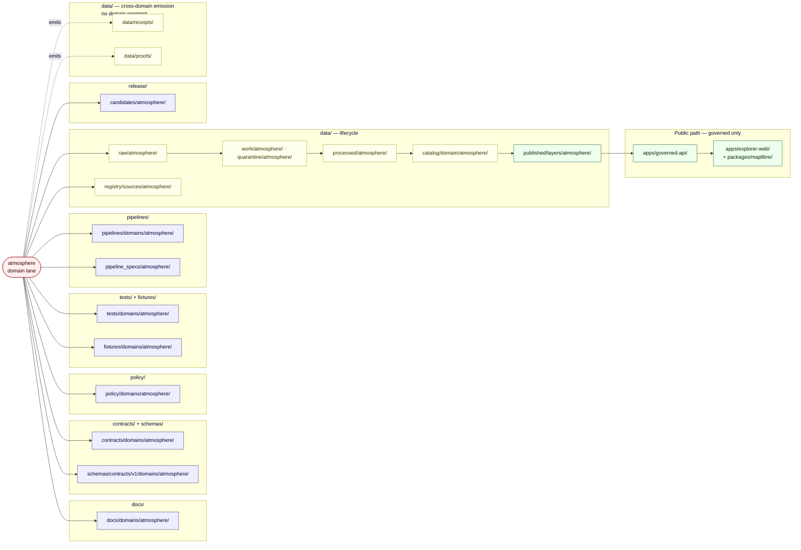
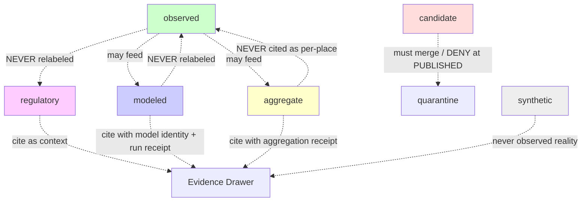

<!-- [KFM_META_BLOCK_V2]
doc_id: kfm://doc/domains/atmosphere/file-system-plan
title: Atmosphere / Air — File System Plan
type: standard
version: v1
status: draft
owners: <Atmosphere/Air domain steward — TBD>
created: 2026-05-15
updated: 2026-05-29
policy_label: public
related:
  - docs/domains/atmosphere/README.md
  - docs/domains/atmosphere/EXPANSION_BACKLOG.md
  - docs/domains/atmosphere/EXPANSION_PLAN.md
  - docs/doctrine/directory-rules.md
  - docs/adr/ADR-0001-schema-home.md
  - docs/registers/DRIFT_REGISTER.md
  - docs/registers/VERIFICATION_BACKLOG.md
  - ai-build-operating-contract.md
  - kfm://atlas/v1.1/ch11
  - kfm://atlas/v1.1/ch24.1
[/KFM_META_BLOCK_V2] -->

<!--
  KFM Meta Block v2 note: '#'-style inline annotations only; no nested HTML comments inside the block above.
  CONTRACT_VERSION = "3.0.0" (doctrine-adjacent doc).
  Plan-class doc: every concrete path is PROPOSED; repo not mounted this session.
  Surfaces folder/slug drift (atmosphere vs atmosphere-air-and-climate vs air) — see §2 and §16.
-->

# Atmosphere / Air — File System Plan

A **PROPOSED** repository-level layout for the Atmosphere / Air domain across every KFM responsibility root, written against Directory Rules §12 Domain Placement Law.


> **Status:** `draft` · **Owners:** `<Atmosphere/Air domain steward — TBD>` · **Updated:** `2026-05-29` · **Contract:** `CONTRACT_VERSION = "3.0.0"`

> [!IMPORTANT]
> This document is a **plan**, not a scaffold. Every file-path in this document is **PROPOSED** until verified against a mounted repository. No claim here implies that a path, schema, validator, route, layer, or release surface exists on disk today. Path placement follows `docs/doctrine/directory-rules.md` (Directory Rules) §12 Domain Placement Law; the schema home defaults to `schemas/contracts/v1/...` per ADR-0001.

> [!NOTE]
> **Companion documents.** This plan is the *placement* view of the domain. Its siblings are [`EXPANSION_BACKLOG.md`](./EXPANSION_BACKLOG.md) (the unsorted candidate register) and [`EXPANSION_PLAN.md`](./EXPANSION_PLAN.md) (the sequenced build roadmap). Where those documents say *what* and *when*, this one says *where*.

---

## 📑 Contents

1. [Scope](#1-scope)
2. [Repo fit](#2-repo-fit)
3. [Accepted inputs (what belongs in this lane)](#3-accepted-inputs-what-belongs-in-this-lane)
4. [Exclusions (what does not belong here)](#4-exclusions-what-does-not-belong-here)
5. [Proposed directory tree — Atmosphere / Air lane](#5-proposed-directory-tree--atmosphereair-lane)
6. [Lane → responsibility-root crosswalk](#6-lane--responsibility-root-crosswalk)
7. [Lane fan-out diagram](#7-lane-fan-out-diagram)
8. [Source-role channels (anti-collapse)](#8-source-role-channels-anti-collapse)
9. [Knowledge-character terms (ubiquitous language)](#9-knowledge-character-terms-ubiquitous-language)
10. [Object families and their proposed homes](#10-object-families-and-their-proposed-homes)
11. [Source families and their proposed homes](#11-source-families-and-their-proposed-homes)
12. [Lifecycle (RAW → PUBLISHED) gate map](#12-lifecycle-raw--published-gate-map)
13. [Cross-lane relations (where files do NOT go)](#13-cross-lane-relations-where-files-do-not-go)
14. [Validators, tests, fixtures](#14-validators-tests-fixtures)
15. [Publication, correction, rollback](#15-publication-correction-rollback)
16. [Drift, anti-patterns, and open ADRs](#16-drift-anti-patterns-and-open-adrs)
17. [Verification backlog](#17-verification-backlog)
18. [Open questions register](#18-open-questions-register)
19. [Changelog](#19-changelog)
20. [Definition of done](#20-definition-of-done)
21. [Related docs](#21-related-docs)
22. [Appendices](#22-appendices)

---

## 1. Scope

This plan covers **where every Atmosphere / Air file should live** across the KFM monorepo. It is the domain-specific application of:

- **Directory Rules §12 Domain Placement Law** — domains are *lanes inside responsibility roots*, never root folders. **CONFIRMED doctrine.**
- **Directory Rules §4 Placement Protocol** — five-step responsibility / lifecycle / domain / authority / rule-citation walk. **CONFIRMED doctrine.**
- **ADR-0001 Schema-home rule** — canonical machine-schema home is `schemas/contracts/v1/…`. **CONFIRMED doctrine; PROPOSED paths.**
- **Atlas v1.1 Ch. 11 Atmosphere / Air** — domain identity, ubiquitous language, object families, source families, lifecycle gates, publication posture. **CONFIRMED doctrine / PROPOSED implementation.**
- **Atlas v1.1 §24.1 Source-Role Anti-Collapse Register** — Atmosphere / Air is explicitly named as one of the lanes where the observed / regulatory / modeled / aggregate split is *acute*. **CONFIRMED doctrine.**

The plan **does not** assert that any of these paths exist today; it asserts where they should land **if and when** they are created or migrated.

> [!NOTE]
> The repository is **not mounted** in this session. Per Directory Rules §17 and the project's repository-preflight rule, every concrete path below is **PROPOSED** until inspected. Conflicts between this plan and the mounted repo are filed to `docs/registers/DRIFT_REGISTER.md` rather than silently reconciled.

[↑ Back to top](#-contents)

---

## 2. Repo fit

| Question | Answer | Truth label |
|---|---|---|
| Where does this document live? | `docs/domains/atmosphere/FILE_SYSTEM_PLAN.md` | **PROPOSED** path. |
| What governs it? | `docs/doctrine/directory-rules.md` §12 + §4; `docs/adr/ADR-0001-schema-home.md`; `ai-build-operating-contract.md` §§11–12. | **CONFIRMED** governance source; **PROPOSED** file presence. |
| Who reads it first? | Anyone proposing a new Atmosphere / Air file, validator, schema, layer, policy, fixture, pipeline, or release candidate. | **INFERRED** from doc role. |
| Upstream | Atlas v1.1 Ch. 11 (Atmosphere / Air); Atlas v1.1 §24.1 (Source-Role Anti-Collapse); `[ENCY]` §7.9; `[DOM-AIR]` dossier (PDF only). | **CONFIRMED** lineage. |
| Downstream | Atmosphere PR plans; `docs/domains/atmosphere/README.md`; the backlog and expansion plan; per-root READMEs touched by atmosphere-lane changes; ADR drafts. | **PROPOSED**. |

**Folder / slug drift to resolve.** Three names appear in supplied doctrine for this lane:

| Name | Source | Use | Truth label |
|---|---|---|---|
| `atmosphere/` | Directory Rules §12 uniform list ("hydrology, soil, fauna, flora, habitat, geology, **atmosphere**, …"). | **Authoritative** for `docs/domains/`, `contracts/domains/`, `schemas/contracts/v1/domains/`, `policy/domains/`, `tests/domains/`, `fixtures/domains/`, `data/<phase>/<domain>/`, etc. | **CONFIRMED** — §12 names `atmosphere` in the uniform domain list. |
| `atmosphere-air-and-climate/` | `[ENCY]` §7.9 / §10.I "PROPOSED file homes". | **DRIFT** vs. Directory Rules §12; file a drift entry rather than silently picking. | **CONFLICTED** — encyclopedia vs. §12. |
| `air/` | Atlas v1.1 §24.13 crosswalk row 11: `schemas/contracts/v1/air/; contracts/air/`. | **DRIFT** vs. §12 lane pattern (`schemas/contracts/v1/domains/atmosphere/`). | **CONFLICTED** — see resolution below. |

> [!IMPORTANT]
> **Schema-home resolution (this is the load-bearing reconciliation).** Directory Rules §12 lists the canonical lane pattern verbatim as `schemas/contracts/v1/domains/<domain>/` (e.g., `schemas/contracts/v1/domains/hydrology/`), and §13.1 names *"`contracts/<domain>/<x>.schema.json` vs. `schemas/contracts/v1/domains/<domain>/<x>.schema.json`"* as the two-parallel-homes anti-pattern. The Atlas §24.13 crosswalk row 11 shows the **shorter** `schemas/contracts/v1/air/; contracts/air/` form — but Atlas §24 states its master tables are **navigational, not authoritative**, and per `[DIRRULES]` §2.1 **authority order (Directory Rules > Atlas crosswalks)**, §12 wins. **This plan adopts `schemas/contracts/v1/domains/atmosphere/` (shape) + `contracts/domains/atmosphere/` (meaning), `CONFIRMED` against Directory Rules §12.** The Atlas `air/` row is flagged as drift for ADR-S-01 / a domain-folder-name ADR.

> [!NOTE]
> **Reconciliation with sibling docs.** Earlier drafts of `EXPANSION_BACKLOG.md` and `EXPANSION_PLAN.md` held the schema home as `CONFLICTED` between `schemas/contracts/v1/air/` and a `domains/`-segmented form. Directory Rules §12 settles it in favor of the **`domains/atmosphere/`-segmented** form used here. Those sibling docs should be updated to match, and a single drift entry should cover all three.

[↑ Back to top](#-contents)

---

## 3. Accepted inputs (what belongs in this lane)

Atlas v1.1 Ch. 11 §B (Scope and explicit non-ownership) lists what the Atmosphere / Air domain **owns**. The lane lifts these owned object families and the source families that feed them. **CONFIRMED / PROPOSED.**

**Owned object families** (Atlas v1.1 Ch. 11 §B): AirStation; AirObservation; PM2.5 Observation; Ozone Observation; SmokeContext; AODRaster; Weather Station; Weather Observation; WindField; Precipitation Observation; Temperature Observation; Climate Normal; Climate Anomaly; Forecast Context; Advisory Context.

**Source-role classes carried** (Atlas v1.1 §24.1.1; **acute** here per §24.13): `observed` · `regulatory` · `modeled` · `aggregate` · `administrative` · `candidate` · `synthetic`.

**Knowledge-character terms used inside the lane** (Atlas v1.1 Ch. 11 §C): `Knowledge character` · `OBSERVED_SENSOR` · `PUBLIC_AQI_REPORT` · `REGULATORY_ARCHIVE` · `LOW_COST_SENSOR` · `ATMOSPHERIC_MODEL_FIELD` · `REMOTE_SENSING_MASK` · `CLIMATE_ANOMALY_CONTEXT` · `DERIVED_FUSION` · `METEOROLOGICAL_CONTEXT` · `ALERT_AND_ADVISORY_CONTEXT` · `NETWORK_AND_SITE_CONTEXT`.

**Inputs by responsibility root:**

| Root | What atmosphere-lane files look like (PROPOSED) |
|---|---|
| `docs/domains/atmosphere/` | Markdown — README, plans, ADR drafts, runbook stubs, dossier index. |
| `contracts/domains/atmosphere/` | Markdown object-meaning notes for AirStation, AirObservation, etc. |
| `schemas/contracts/v1/domains/atmosphere/` | JSON Schema for each owned object family + the atmosphere DecisionEnvelope. |
| `policy/domains/atmosphere/` | Admissibility rules: source-role anti-collapse, low-cost sensor caveats, model-as-observed deny. |
| `tests/domains/atmosphere/` + `fixtures/domains/atmosphere/` | Conformance and deny-fixture tests, no-network fixtures. |
| `pipelines/domains/atmosphere/` + `pipeline_specs/atmosphere/` | Executable pipeline + declarative specs. |
| `data/raw/atmosphere/` · `data/work/atmosphere/` · `data/quarantine/atmosphere/` · `data/processed/atmosphere/` · `data/catalog/domain/atmosphere/` · `data/published/layers/atmosphere/` · `data/registry/sources/atmosphere/` | Lifecycle data. |
| `release/candidates/atmosphere/` | Release decisions for atmosphere artifacts. |
| `packages/domains/atmosphere/` *(optional)* | Shared in-process logic if atmosphere needs reusable code. |

[↑ Back to top](#-contents)

---

## 4. Exclusions (what does not belong here)

These are the most likely *misplacement* failure modes for atmosphere-lane work. **CONFIRMED doctrine (Directory Rules §§3, 12, 13; Atlas v1.1 §24.1); PROPOSED specifics.**

> [!CAUTION]
> Atmosphere / Air is named explicitly in Atlas v1.1 §24.13 as a lane where the **source-role anti-collapse rule is acute**. Misplaced files in this domain are not just a tidy-room issue — they enable observed/regulatory/modeled collapse, which is a documented **DENY** condition at publication and an **ABSTAIN** at the AI surface.

| Anti-pattern | What it would look like for atmosphere | Where it belongs instead |
|---|---|---|
| Domain-as-root | `atmosphere/` at repo root with `data/`, `schemas/`, `policy/`, `docs/` underneath. | Lane pattern in §5 below. **Directory Rules §12.** |
| Parallel schema home | `contracts/atmosphere/air-observation.schema.json` + `schemas/contracts/v1/domains/atmosphere/air-observation.schema.json`. | Single canonical home under `schemas/`; `contracts/domains/atmosphere/` keeps only `.md` meaning notes. **ADR-0001; §13.1.** |
| Trust content in `artifacts/` | Release manifests, EvidenceBundles, receipts for atmosphere layers in `artifacts/`. | `data/proofs/`, `data/receipts/`, `release/`. **§13.2.** |
| Public route reads canonical store | Map shell reads `data/processed/atmosphere/...` directly. | Reads go through `apps/governed-api/`. **§13.5 trust membrane.** |
| Connector publishes | An atmosphere connector writes to `data/processed/atmosphere/` or `data/published/layers/atmosphere/`. | Connectors emit to `data/raw/atmosphere/` or `data/quarantine/atmosphere/` only; pipelines promote. |
| Cross-domain file under a single domain | A shared smoke × wildfire validator under `tools/validators/domains/atmosphere/`. | Cross-domain validators live at the lowest common responsibility root **without** a domain segment, e.g. `tools/validators/smoke/`. **§12 multi-domain rule.** |
| Hazard truth here | Hazard Event, Warning Context life-safety statements treated as atmosphere truth. | `data/<phase>/hazards/` under the Hazards lane. **Atlas Ch. 11 §B explicit non-ownership; Atlas Ch. 12.** |
| Emergency/alert authority | Any Atmosphere file or layer behaving as life-safety guidance. | KFM is **not an alert authority**. The Atmosphere lane carries `ADVISORY_CONTEXT` as context only. **Atlas Ch. 11 §I; Ch. 12 §B.** |
| Synthetic-as-observed | A simulated AOD raster filed in `data/published/layers/atmosphere/observations/`. | Synthetic content carries a Reality Boundary Note and **never** appears as observed reality. **Atlas v1.1 §24.1.2.** |

[↑ Back to top](#-contents)

---

## 5. Proposed directory tree — Atmosphere / Air lane

The tree below is the literal application of Directory Rules §12 to the Atmosphere / Air domain. Every path is **PROPOSED**. Per-root READMEs (Directory Rules §15) are expected at each lane entry. **Status: PROPOSED.**

```text
docs/domains/atmosphere/
├── README.md                              # Lane index (purpose, scope, links)
├── FILE_SYSTEM_PLAN.md                    # ← this file
├── EXPANSION_BACKLOG.md                   # companion — candidate register
├── EXPANSION_PLAN.md                      # companion — sequenced roadmap
├── OBJECT_FAMILY_NOTES.md                 # PROPOSED — meaning notes (see contracts/)
├── KNOWLEDGE_CHARACTER_REGISTRY.md        # PROPOSED — ubiquitous-language registry
├── SOURCE_FAMILY_NOTES.md                 # PROPOSED — source families and roles
├── adr/
│   └── ADR-S-04-source-role-vocabulary.md # PROPOSED draft (atlas open-ADR)
└── runbooks/
    ├── atmosphere_validation.md           # PROPOSED
    └── atmosphere_rollback.md             # PROPOSED

contracts/domains/atmosphere/
├── README.md
├── air-station.md
├── air-observation.md
├── pm25-observation.md
├── ozone-observation.md
├── smoke-context.md
├── aod-raster.md
├── weather-station.md
├── weather-observation.md
├── wind-field.md
├── precipitation-observation.md
├── temperature-observation.md
├── climate-normal.md
├── climate-anomaly.md
├── forecast-context.md
└── advisory-context.md

schemas/contracts/v1/domains/atmosphere/    # ADR-0001 canonical home; §12 lane pattern
├── air-station.schema.json
├── air-observation.schema.json
├── pm25-observation.schema.json
├── ozone-observation.schema.json
├── smoke-context.schema.json
├── aod-raster.schema.json
├── weather-station.schema.json
├── weather-observation.schema.json
├── wind-field.schema.json
├── precipitation-observation.schema.json
├── temperature-observation.schema.json
├── climate-normal.schema.json
├── climate-anomaly.schema.json
├── forecast-context.schema.json
├── advisory-context.schema.json
└── atmosphere-decision-envelope.schema.json

policy/domains/atmosphere/
├── README.md
├── source-role-anti-collapse.rego          # observed ≠ modeled ≠ regulatory ≠ aggregate
├── aqi-not-concentration.rego              # PROPOSED — Ch. 11 §I deny rule
├── aod-not-pm25.rego                       # PROPOSED — Ch. 11 §I deny rule
├── low-cost-sensor-caveat.rego             # PROPOSED — caveat / confidence required
├── model-as-observed-deny.rego             # PROPOSED — Atlas §24.1.2 DENY
└── advisory-not-alert.rego                 # PROPOSED — Atlas Ch. 11 §B / Ch. 12 §B

tests/domains/atmosphere/
├── schema/
├── source-role/
├── knowledge-character/
├── unit-normalization/
├── policy-deny/
└── no-network-fixtures/

fixtures/domains/atmosphere/
├── valid/
│   ├── air-station/
│   ├── pm25-observation/
│   └── ...
└── invalid/
    ├── aqi-as-concentration/
    ├── aod-as-pm25/
    └── model-as-observed/

packages/domains/atmosphere/                # OPTIONAL — only if reusable code accrues
└── (TBD)

pipelines/domains/atmosphere/
├── ingest_air_observation/
├── ingest_pm25/
├── ingest_smoke_context/
├── ingest_aod/
└── ingest_weather/

pipeline_specs/atmosphere/
├── air-observation.spec.yaml
├── pm25.spec.yaml
├── smoke-context.spec.yaml
├── aod.spec.yaml
└── weather.spec.yaml

data/raw/atmosphere/                        # immutable source payloads + descriptors
data/work/atmosphere/                       # in-flight normalization
data/quarantine/atmosphere/                 # rights/sensitivity/validation/role holds
data/processed/atmosphere/                  # validated normalized records
data/catalog/domain/atmosphere/             # catalog records + triplet projection
data/published/layers/atmosphere/           # released, public-safe layers only
data/registry/sources/atmosphere/           # SourceDescriptors + SourceAuthorityRegister rows

release/candidates/atmosphere/              # release decisions per atmosphere artifact
```

> [!NOTE]
> Receipts (`data/receipts/`) and proofs (`data/proofs/`) are *cross-domain emission* directories and live **without** a domain segment (Directory Rules §13.2). Atmosphere-lane receipts and proofs land there alongside every other lane's.

[↑ Back to top](#-contents)

---

## 6. Lane → responsibility-root crosswalk

Per Directory Rules §4 Step 1: the **responsibility root wins over the topic name**. The table below maps every Atmosphere / Air file class to its responsibility root and authority status. **PROPOSED paths; CONFIRMED authority assignment.**

| File class | Responsibility root | Domain segment | Authority | Rule cite |
|---|---|---|---|---|
| Lane docs, plans, ADR drafts | `docs/` | `domains/atmosphere/` | Canonical | §6.1 |
| Object meaning (Markdown) | `contracts/` | `domains/atmosphere/` | Canonical | §6.3 |
| Machine schema (JSON Schema) | `schemas/` | `contracts/v1/domains/atmosphere/` | Canonical | §6.4, ADR-0001, §12 |
| Admissibility / deny rules | `policy/` | `domains/atmosphere/` | Canonical | §6.5 |
| Conformance + deny tests | `tests/` | `domains/atmosphere/` | Canonical | §4 Step 1 |
| Valid/invalid samples | `fixtures/` | `domains/atmosphere/` | Canonical | §4 Step 1 |
| Reusable code (if any) | `packages/` | `domains/atmosphere/` | Canonical | §4 Step 1 |
| Source-specific fetchers | `connectors/` | per-source (not per-domain) | Canonical | §4 Step 1 — connectors output to RAW/quarantine only |
| Executable pipeline logic | `pipelines/` | `domains/atmosphere/` | Canonical | §12 |
| Declarative pipeline configs | `pipeline_specs/` | `atmosphere/` | Canonical | §12 |
| Raw immutable payloads | `data/` | `raw/atmosphere/` | Canonical (lifecycle) | §6.4 / §12 |
| Work / quarantine | `data/` | `work/atmosphere/`, `quarantine/atmosphere/` | Canonical | §12 |
| Processed (validated) | `data/` | `processed/atmosphere/` | Canonical | §12 |
| Catalog + triplet projection | `data/` | `catalog/domain/atmosphere/` | Canonical | §12 |
| Published layers | `data/` | `published/layers/atmosphere/` | Canonical | §12 |
| Source registry rows | `data/` | `registry/sources/atmosphere/` | Canonical | §12 |
| Release decisions | `release/` | `candidates/atmosphere/` | Canonical | §12 |
| EvidenceBundle / receipt / proof | `data/` | *(no domain segment)* — `receipts/`, `proofs/` | Canonical (cross-domain emission) | §13.2 |
| Runtime adapters | `runtime/` | none | Canonical | §6, never public |
| Public route | `apps/governed-api/` | none | Canonical | §13.5 trust membrane |
| Map shell (renderer) | `apps/explorer-web/` + `packages/maplibre/` | none | Canonical | §11 |

[↑ Back to top](#-contents)

---

## 7. Lane fan-out diagram

The diagram shows how a single domain ("atmosphere") fans out into many responsibility roots — and how the **public path** is the governed API, not any canonical store. **CONFIRMED structure (Directory Rules §§5, 12, 13.5); PROPOSED specifics.**



> [!WARNING]
> The public path is `data/published/layers/atmosphere/` → `apps/governed-api/` → `apps/explorer-web/`. Reading directly from `data/processed/atmosphere/` (or earlier) from the map shell is the **public-route-reads-canonical-store** anti-pattern (Directory Rules §13.5; Atlas §24.9.2). **CONFIRMED doctrine.**

[↑ Back to top](#-contents)

---

## 8. Source-role channels (anti-collapse)

Atlas v1.1 §24.13 calls out Atmosphere / Air specifically: *"Source-role anti-collapse for observed/regulatory/modeled/aggregate is acute."* The file system must keep these roles **structurally** separated, because the lifecycle and the governed API both **fail closed** when they are conflated. **CONFIRMED doctrine (Atlas v1.1 §24.1.1, §24.1.2).**

`source_role` is set at admission on the `SourceDescriptor` and is preserved through every promotion — promotion does not upgrade a model to an observation, or an aggregate to a per-place record. **CONFIRMED doctrine.**

| Role | What it is (CONFIRMED definition) | Atmosphere example | Lane storage hint (PROPOSED) |
|---|---|---|---|
| `observed` | Direct reading / measurement tied to place and time. | AirStation PM2.5 raw reading; mesonet temperature obs. | `data/raw/atmosphere/observed/<source>/` → `data/processed/atmosphere/observed/` |
| `regulatory` | Authoritative determination by a governing body. | Air-quality non-attainment ruling; regulatory archive layer. | `data/raw/atmosphere/regulatory/<authority>/` → `data/processed/atmosphere/regulatory/` |
| `modeled` | Derived product from inputs + parameters; uncertainty preserved. | AODRaster; HRRR-Smoke field; CAMS analysis; ozone forecast. | `data/raw/atmosphere/modeled/<model>/` → `data/processed/atmosphere/modeled/` |
| `aggregate` | Summary over a unit (county, year, etc.); per-record fidelity lost. | Decadal climate normal; county-year PM2.5 average. | `data/raw/atmosphere/aggregate/<unit>/` → `data/processed/atmosphere/aggregate/` |
| `administrative` | Compiled agency record, not necessarily observed or regulatory. | Network roster; site metadata catalog. | `data/raw/atmosphere/administrative/` |
| `candidate` | Proposed record awaiting validation / review. | Low-cost sensor reading pending caveat resolution. | `data/quarantine/atmosphere/candidate/` (never PUBLISHED edge) |
| `synthetic` | Simulation, reconstruction, AI, interpolation — no first-hand observation. | Synthetic AOD reconstruction; AI-drafted summary. | Carries Reality Boundary Note; tagged `synthetic`; never relabeled. |

**Atmosphere-specific DENY conditions** (Atlas v1.1 §24.1.2; Atlas Ch. 11 §I): *AQI is not concentration*; *AOD is not PM2.5*; *model fields are not observations*; *low-cost sensor public release requires correction, caveats, confidence, and limitations*. Policy files in `policy/domains/atmosphere/` are the canonical home for these checks. **CONFIRMED doctrine / PROPOSED files.**



[↑ Back to top](#-contents)

---

## 9. Knowledge-character terms (ubiquitous language)

Atlas v1.1 Ch. 11 §C names twelve domain-specific knowledge-character terms. Each constrains a record's meaning by **source role, evidence, time, and release state**, and is intended to be enforced by the `KNOWLEDGE_CHARACTER_REGISTRY` (Atlas Ch. 11 §K and §N verification backlog). Each term is **CONFIRMED ubiquitous language / PROPOSED field realization** per the Atlas wording. **CONFIRMED terms / PROPOSED field realization.**

| Term | Lane meaning (CONFIRMED term) | Lane storage hint (PROPOSED) |
|---|---|---|
| `Knowledge character` | The umbrella label tagging each atmosphere record with its observational/regulatory/modeled/etc. character. | Field on records under `schemas/contracts/v1/domains/atmosphere/`. |
| `OBSERVED_SENSOR` | Direct sensor reading at a station. | `data/processed/atmosphere/observed/` |
| `PUBLIC_AQI_REPORT` | Public AQI report layer; **AQI ≠ concentration**. | `data/published/layers/atmosphere/aqi/` |
| `REGULATORY_ARCHIVE` | Archived regulatory determinations and reports. | `data/processed/atmosphere/regulatory/` |
| `LOW_COST_SENSOR` | Low-cost-sensor observation; **public release requires caveats and confidence**. | `data/quarantine/atmosphere/candidate/` until caveat closure. |
| `ATMOSPHERIC_MODEL_FIELD` | Model field (HRRR-Smoke, CAMS, etc.); **never an observation**. | `data/processed/atmosphere/modeled/` |
| `REMOTE_SENSING_MASK` | Satellite-derived mask (smoke, fire, AOD). | `data/processed/atmosphere/modeled/remote-sensing/` |
| `CLIMATE_ANOMALY_CONTEXT` | Climate normal / anomaly context. | `data/processed/atmosphere/aggregate/climate/` |
| `DERIVED_FUSION` | Fusion product across roles; preserves source-role provenance per input. | `data/processed/atmosphere/derived/` |
| `METEOROLOGICAL_CONTEXT` | Weather context layer. | `data/published/layers/atmosphere/meteorology/` |
| `ALERT_AND_ADVISORY_CONTEXT` | Advisory **context**, never life-safety authority. | `data/processed/atmosphere/advisory/` |
| `NETWORK_AND_SITE_CONTEXT` | Network/site metadata (rosters, equipment). | `data/registry/sources/atmosphere/` |

> [!TIP]
> The `KNOWLEDGE_CHARACTER_REGISTRY.md` is a **PROPOSED** companion to this plan and would live at `docs/domains/atmosphere/KNOWLEDGE_CHARACTER_REGISTRY.md`. It is listed in Atlas v1.1 Ch. 11 §K as a required validator and in §N as a verification-backlog item. Its machine-readable placement (`data/registry/` vs. `control_plane/`) is ADR-class — see §16 and ADR-S-03.

[↑ Back to top](#-contents)

---

## 10. Object families and their proposed homes

Object families are listed in Atlas v1.1 Ch. 11 §E. Each row carries the same **CONFIRMED temporal handling**: source, observed, valid, retrieval, release, and correction times stay distinct where material. Identity rules are **PROPOSED**: *source id + object role + temporal scope + normalized digest*. **CONFIRMED doctrine / PROPOSED specifics.**

| Object family | Meaning home (`contracts/`) | Schema home (`schemas/`) | Fixtures (`fixtures/`) |
|---|---|---|---|
| AirStation | `contracts/domains/atmosphere/air-station.md` | `schemas/contracts/v1/domains/atmosphere/air-station.schema.json` | `fixtures/domains/atmosphere/valid/air-station/` |
| AirObservation | `contracts/domains/atmosphere/air-observation.md` | `schemas/contracts/v1/domains/atmosphere/air-observation.schema.json` | `fixtures/domains/atmosphere/valid/air-observation/` |
| PM2.5 Observation | `contracts/domains/atmosphere/pm25-observation.md` | `schemas/contracts/v1/domains/atmosphere/pm25-observation.schema.json` | `fixtures/domains/atmosphere/valid/pm25-observation/` |
| Ozone Observation | `contracts/domains/atmosphere/ozone-observation.md` | `schemas/contracts/v1/domains/atmosphere/ozone-observation.schema.json` | `fixtures/domains/atmosphere/valid/ozone-observation/` |
| SmokeContext *(shared w/ Hazards)* | `contracts/domains/atmosphere/smoke-context.md` | `schemas/contracts/v1/domains/atmosphere/smoke-context.schema.json` | `fixtures/domains/atmosphere/valid/smoke-context/` |
| AODRaster | `contracts/domains/atmosphere/aod-raster.md` | `schemas/contracts/v1/domains/atmosphere/aod-raster.schema.json` | `fixtures/domains/atmosphere/valid/aod-raster/` |
| Weather Station | `contracts/domains/atmosphere/weather-station.md` | `schemas/contracts/v1/domains/atmosphere/weather-station.schema.json` | `fixtures/domains/atmosphere/valid/weather-station/` |
| Weather Observation | `contracts/domains/atmosphere/weather-observation.md` | `schemas/contracts/v1/domains/atmosphere/weather-observation.schema.json` | `fixtures/domains/atmosphere/valid/weather-observation/` |
| WindField | `contracts/domains/atmosphere/wind-field.md` | `schemas/contracts/v1/domains/atmosphere/wind-field.schema.json` | `fixtures/domains/atmosphere/valid/wind-field/` |
| Precipitation Observation | `contracts/domains/atmosphere/precipitation-observation.md` | `schemas/contracts/v1/domains/atmosphere/precipitation-observation.schema.json` | `fixtures/domains/atmosphere/valid/precipitation-observation/` |
| Temperature Observation | `contracts/domains/atmosphere/temperature-observation.md` | `schemas/contracts/v1/domains/atmosphere/temperature-observation.schema.json` | `fixtures/domains/atmosphere/valid/temperature-observation/` |
| Climate Normal | `contracts/domains/atmosphere/climate-normal.md` | `schemas/contracts/v1/domains/atmosphere/climate-normal.schema.json` | `fixtures/domains/atmosphere/valid/climate-normal/` |
| Climate Anomaly | `contracts/domains/atmosphere/climate-anomaly.md` | `schemas/contracts/v1/domains/atmosphere/climate-anomaly.schema.json` | `fixtures/domains/atmosphere/valid/climate-anomaly/` |
| Forecast Context | `contracts/domains/atmosphere/forecast-context.md` | `schemas/contracts/v1/domains/atmosphere/forecast-context.schema.json` | `fixtures/domains/atmosphere/valid/forecast-context/` |
| Advisory Context | `contracts/domains/atmosphere/advisory-context.md` | `schemas/contracts/v1/domains/atmosphere/advisory-context.schema.json` | `fixtures/domains/atmosphere/valid/advisory-context/` |

> [!NOTE]
> `SmokeContext` appears in the owned-family list of **both** Atmosphere / Air (Ch. 11 §B) **and** Hazards (Ch. 12 §B). The schema/meaning files above hold the **Atmosphere** projection (observed / model smoke context); Hazards owns hazard-event truth in its own lane. Confirm the shared-vs-projected modeling decision via the cross-lane join policy ADR (Atlas ADR-S-14).

[↑ Back to top](#-contents)

---

## 11. Source families and their proposed homes

Source families are listed in Atlas v1.1 Ch. 11 §D. Each row carries the same **NEEDS VERIFICATION** stance on rights and current terms, and **CONFIRMED** posture that *sensitive joins fail closed*. The `role` column shows the **set** of roles a source family can be admitted under — admission picks **one** role and freezes it on the descriptor. **CONFIRMED doctrine / PROPOSED specifics.**

| Source family | Admissible roles | Rights / sensitivity | Lane storage hint (PROPOSED) |
|---|---|---|---|
| OpenAQ-like aggregators | observed / aggregate / context | Source-vintage or cadence specific; rights NEEDS VERIFICATION. | `data/raw/atmosphere/<role>/openaq/` |
| EPA AQS-like archive | observed / regulatory / aggregate | Rights NEEDS VERIFICATION; archive context. | `data/raw/atmosphere/<role>/epa-aqs/` |
| AirNow / agency reporting | observed / regulatory / context | Reporting cadence; rights NEEDS VERIFICATION. | `data/raw/atmosphere/<role>/airnow/` |
| CAMS / ECMWF-family model fields | modeled | Model identity + run receipt required; rights NEEDS VERIFICATION. | `data/raw/atmosphere/modeled/cams/` |
| HRRR-Smoke / NOAA smoke forecast | modeled | Forecast cadence; rights NEEDS VERIFICATION. | `data/raw/atmosphere/modeled/hrrr-smoke/` |
| HMS smoke | observed (analyst-drawn) / context | Analyst attribution; rights NEEDS VERIFICATION. | `data/raw/atmosphere/observed/hms/` |
| GOES/ABI AOD | observed (remote-sensing) | Sensor product; rights NEEDS VERIFICATION. | `data/raw/atmosphere/observed/goes-abi/` |
| VIIRS fire/hotspot | observed (remote-sensing) | Sensor product; rights NEEDS VERIFICATION. | `data/raw/atmosphere/observed/viirs/` |

> [!NOTE]
> The Atlas role string for these families is recorded as *"authority / observation / context / model as source role requires"* with rights **NEEDS VERIFICATION** and *sensitive joins fail closed*. The role split shown above (e.g., classifying GOES/ABI AOD as `observed (remote-sensing)`) is an `INFERRED` reading of that string; the canonical source-role enum is itself ADR-class (ADR-S-04). The `[DOM-AIR]` domain dossier (`KFM_Atmosphere_Air_PDF_Only_Architecture_Report_2026-04-21.pdf`) is referenced in Atlas Ch. 11 but its text is **not present in this session's project knowledge**; any source-family detail beyond Atlas Ch. 11 §D is **UNKNOWN** until the dossier is consulted.

[↑ Back to top](#-contents)

---

## 12. Lifecycle (RAW → PUBLISHED) gate map

Atlas v1.1 Ch. 11 §H restates the **CONFIRMED** lifecycle doctrine and applies it to atmosphere as **PROPOSED** lane application. Promotion is a governed state transition, not a file move. **CONFIRMED doctrine / PROPOSED stage realization.**

| Stage | Handling | Required gate | Atmosphere lane home (PROPOSED) |
|---|---|---|---|
| **RAW** | Capture immutable source payload with source role, rights, sensitivity, citation, time, and hash. | `SourceDescriptor` exists. | `data/raw/atmosphere/<role>/<source>/` |
| **WORK / QUARANTINE** | Normalize schema, geometry, time, identity, evidence, rights, and policy; hold failures. | Validation and policy gate pass, *or* quarantine reason recorded. | `data/work/atmosphere/` · `data/quarantine/atmosphere/` |
| **PROCESSED** | Emit validated normalized objects, receipts, and public-safe candidates. | `EvidenceRef`, `ValidationReport`, and digest closure exist. | `data/processed/atmosphere/<role>/` |
| **CATALOG / TRIPLET** | Emit catalog records, EvidenceBundles, graph/triplet projections, and release candidates. | Catalog/proof closure passes. | `data/catalog/domain/atmosphere/` |
| **PUBLISHED** | Serve released public-safe artifacts via governed APIs and manifests. | `ReleaseManifest`, correction path, rollback target, and review/policy state exist. | `data/published/layers/atmosphere/` |

```mermaid
flowchart LR
    A[RAW<br/>data/raw/atmosphere/] -->|SourceDescriptor| B[WORK/QUARANTINE<br/>data/work · data/quarantine]
    B -->|validation + policy| C[PROCESSED<br/>data/processed/atmosphere/]
    C -->|catalog + proof closure| D[CATALOG/TRIPLET<br/>data/catalog/domain/atmosphere/]
    D -->|ReleaseManifest + review| E[PUBLISHED<br/>data/published/layers/atmosphere/]
    E -.governed API.-> F[apps/governed-api/]
    F -.renderer.-> G[apps/explorer-web/<br/>+ packages/maplibre/]
    style A fill:#fee
    style B fill:#ffe
    style C fill:#efe
    style D fill:#eef
    style E fill:#cfc
    style F fill:#dfd
    style G fill:#dfd
```



> [!CAUTION]
> A pipeline writing directly from `data/raw/atmosphere/` to `data/published/layers/atmosphere/` is the **lifecycle-skip** anti-pattern (Directory Rules §13.5). **All phases must run.** **CONFIRMED doctrine.**

[↑ Back to top](#-contents)

---

## 13. Cross-lane relations (where files do NOT go)

Atlas v1.1 Ch. 11 §F enumerates the cross-lane relations Atmosphere / Air participates in. **The relation is owned by whichever lane owns the canonical truth; cross-lane joins do not collapse ownership.** **CONFIRMED / PROPOSED relations.**

| Atmosphere relates to | Relation type | Files belong to | Constraint |
|---|---|---|---|
| **Hazards** | smoke, heat/cold, advisory, visibility, fire/emissions context. | `data/<phase>/hazards/` — Hazards owns the canonical hazard event. | Preserves ownership, source role, sensitivity, EvidenceBundle support. KFM is not an alert authority. `SmokeContext` shared. |
| **Agriculture** | heat, smoke, precipitation, vegetation stress. | `data/<phase>/agriculture/` for ag truth; atmosphere keeps its context layer. | Aggregation receipt required when joining to ag county totals. |
| **Hydrology** | precipitation, drought, flood-weather forcing. | `data/<phase>/hydrology/` for hydrology truth; atmosphere keeps weather context. | Source-role preserved across the join. |
| **Biodiversity lanes** (Fauna, Flora, Habitat) | phenology, smoke, fire, drought stress *without* exposing sensitive locations. | Each biodiversity lane keeps its own occurrences; atmosphere never re-publishes sensitive locations. | Sensitive joins fail closed; generalized geometry only. |

Cross-domain *files* (e.g., a shared smoke × wildfire validator) live at the lowest common responsibility root **without** a domain segment (Directory Rules §12 multi-domain rule):

- Shared validator → `tools/validators/smoke/`
- Cross-domain schema → `schemas/contracts/v1/smoke/`
- Cross-domain doctrine → `docs/architecture/smoke-atmosphere-hazards.md`

[↑ Back to top](#-contents)

---

## 14. Validators, tests, fixtures

Atlas v1.1 Ch. 11 §K lists the atmosphere-specific validator/test backlog. Generic KFM validators (schema, source descriptor, rights, sensitivity, evidence closure, temporal, geometry, policy deny, citation, release manifest, rollback drill, no-network fixtures, non-regression) apply uniformly. **CONFIRMED doctrine / PROPOSED files.**

| Validator / test | Purpose | Home (PROPOSED) | Status |
|---|---|---|---|
| Knowledge-character registry tests | Enforce `KNOWLEDGE_CHARACTER_REGISTRY` per Atlas Ch. 11 §C, §K, §N. | `tests/domains/atmosphere/knowledge-character/` | `PROPOSED` `[DOM-AIR]` §K |
| Unit normalization tests | Ensure unit conversion receipts and canonical-unit invariants. | `tests/domains/atmosphere/unit-normalization/` | `PROPOSED` `[DOM-AIR]` §K |
| AQI-as-concentration denial | DENY if `AQI` value is treated as a concentration. | `tests/domains/atmosphere/policy-deny/aqi-vs-concentration/` | `PROPOSED` `[DOM-AIR]` §K |
| AOD-as-PM2.5 denial | DENY if AOD is published as PM2.5. | `tests/domains/atmosphere/policy-deny/aod-vs-pm25/` | `PROPOSED` `[DOM-AIR]` §K |
| Model-as-observed denial | DENY if a model field is labeled as an observation. | `tests/domains/atmosphere/policy-deny/model-vs-observed/` | `PROPOSED` `[DOM-AIR]` §K |
| Low-cost sensor caveat tests | Require correction / caveat / confidence / limitations on public LCS layers. | `tests/domains/atmosphere/policy-deny/low-cost-sensor-caveat/` | `PROPOSED` `[DOM-AIR]` §K |
| Dry-run / no-live-fetch tests | Verify no-network execution paths. | `tests/domains/atmosphere/no-network-fixtures/` | `PROPOSED` `[DOM-AIR]` §K |

> [!IMPORTANT]
> Per Directory Rules §13.5, validator logic lives in `tools/validators/<topic>/...` and is **called** by tests — it is never authored inside the test files under `tests/domains/atmosphere/`. The directories above hold the tests and fixtures that *exercise* the validators, not the validator implementations.

[↑ Back to top](#-contents)

---

## 15. Publication, correction, rollback

Atlas v1.1 Ch. 11 §M restates the **CONFIRMED** publication doctrine: publication requires a `ReleaseManifest`, an `EvidenceBundle`, validation/policy support, review state where required, a correction path, a stale-state rule, and a rollback target. **CONFIRMED doctrine / PROPOSED file homes.**

| Decision / artifact | Home (PROPOSED) | Notes |
|---|---|---|
| Release candidate | `release/candidates/atmosphere/<layer-or-record>/` | Per Directory Rules §12. |
| `ReleaseManifest` | `release/candidates/atmosphere/<layer>/ReleaseManifest.json` *(PROPOSED — release decisions live under `release/` per §13.2; verify vs. a manifest-pairing convention)* | A prior draft placed the manifest under `data/published/.../manifest/`; Directory Rules §13.2 puts release **decisions** under `release/`. `CONFLICTED` → confirm via ADR. |
| `CorrectionNotice` | `release/corrections/atmosphere/` *(PROPOSED — `CorrectionNotice` meaning lives in `contracts/correction/`; the emitted notice is release-facing)* | Cross-domain emission also possible; ADR may be needed. |
| `RollbackCard` | `release/rollback/atmosphere/` *(PROPOSED — tied to a published `ReleaseManifest`)* | `RollbackCard` defines how to restore or withdraw a release. |
| `ReviewRecord` | `release/reviews/atmosphere/` *(PROPOSED)* | Meaning owned by `contracts/governance/`; shape under `schemas/contracts/v1/governance/`. |
| `EvidenceBundle` (per claim) | `data/proofs/` *(no domain segment — cross-domain emission)* | Atmosphere files emit here; bundle resolution is governed-API-side. |
| `AIReceipt` for atmosphere Focus Mode | `data/receipts/` *(no domain segment)* | Cite-or-abstain on atmosphere claims; ABSTAIN if evidence insufficient; DENY on policy/role/sensitivity. |

> [!WARNING]
> **Manifest-home conflict surfaced.** Whether the `ReleaseManifest` pairs with the published artifact (`data/published/.../manifest/`) or lives as a release **decision** under `release/` is not silently resolved here. Directory Rules §13.2 separates release decisions (`release/`) from lifecycle data (`data/`); the manifest is a decision artifact. Logged as `CONFLICTED` pending ADR — see §18 OQ-AIR-FS-03.

[↑ Back to top](#-contents)

---

## 16. Drift, anti-patterns, and open ADRs

The Atmosphere / Air lane inherits the generic anti-pattern list (Directory Rules §13; Atlas §24.9) and adds the **acute** source-role anti-collapse risk from Atlas v1.1 §24.13. **CONFIRMED doctrine / PROPOSED ADR drafts.**

### 16.1 Atmosphere-specific drift sources

| Drift | Source | Suggested resolution |
|---|---|---|
| Folder name: `atmosphere/` vs `atmosphere-air-and-climate/` vs `air/` | Directory Rules §12 vs `[ENCY]` §7.9 / §10.I vs Atlas v1.1 §24.13. | Adopt `atmosphere/` per §12; file drift entry; resolve via **ADR-S-04** (source-role vocabulary) and a sibling **ADR on domain-folder-name conventions**. |
| Schema home pattern: `schemas/contracts/v1/domains/atmosphere/` vs `schemas/contracts/v1/air/` | Directory Rules §12 lane pattern (CONFIRMED) vs Atlas v1.1 §24.13 navigational table. | Atlas §24 itself states tables are navigational; canonical is Directory Rules §12 + ADR-0001. **Adopt `…/domains/atmosphere/`** (this plan does); flag the atlas `air/` row. |
| Model-as-observed in derived layers | Failure mode in Atlas §24.1.2; named in Ch. 11 §K. | Separate `modeled/` and `observed/` lanes in `data/processed/atmosphere/`; enforce via `policy/domains/atmosphere/model-as-observed-deny.rego`. |
| AQI as concentration | Atlas Ch. 11 §I; Atlas §24.1.2 *aggregate cited as per-place truth*. | Separate `aqi/` from `concentration/` in published layers; enforce via policy. |
| Manifest home: `data/published/.../manifest/` vs `release/` | This plan §15 vs Directory Rules §13.2 (release decisions under `release/`). | Treat `ReleaseManifest` as a release decision; confirm via ADR (OQ-AIR-FS-03). |

> [!NOTE]
> **Sibling-doc drift.** The companion `EXPANSION_BACKLOG.md` and `EXPANSION_PLAN.md` (earlier drafts) used `schemas/contracts/v1/air/` and held the schema home `CONFLICTED`. This plan resolves it to `schemas/contracts/v1/domains/atmosphere/` per §12. A **single** drift entry should record the reconciliation across all three documents rather than three separate entries.

### 16.2 Open ADRs touching this lane

Atlas v1.1 §24.12 backlog (subset relevant here; canonical IDs are `ADR-S-NN`):

| ADR | Question | Why ADR-class |
|---|---|---|
| **ADR-S-01** | Confirm canonical schema home = `schemas/contracts/v1/…` (and the `domains/<domain>/` segment). | Directory Rules §2.4(3) — schema-home rule is explicitly ADR-required. |
| **ADR-S-03** | Receipt / registry class home (`data/registry/` vs. `control_plane/` vs. `schemas/contracts/v1/<domain>/receipts/`). | A new parallel home or split is ADR-class per §2.4(5). Governs the knowledge-character registry placement. |
| **ADR-S-04** | Source-role enum vocabulary and evolution rule. | Source-role anti-collapse is doctrine-significant; Atmosphere is named *acute*. |
| **ADR-S-05** | Sensitivity tier scheme (T0–T4) — adopt as canonical. | Sensitivity classes affect atmosphere LCS and advisory layers. |
| **ADR-S-14** | Cross-lane join policy (which joins require steward review, which are denied). | Governs the shared `SmokeContext` and Atmosphere↔Biodiversity joins. |

A **PROPOSED** atmosphere-internal ADR — *ADR-atmosphere-folder-name* — is also recommended to record `atmosphere/` (not `atmosphere-air-and-climate/`, not `air/`) as the canonical lane folder, mapping up to ADR-S-04 where the source-role/vocabulary decision is recorded.

[↑ Back to top](#-contents)

---

## 17. Verification backlog

From Atlas v1.1 Ch. 11 §N plus this plan's own preflight gaps. **All NEEDS VERIFICATION until inspected.**

| # | Item to verify | Evidence that would settle it |
|---|---|---|
| VB-AIR-01 | Source rights and endpoint behavior (OpenAQ, EPA AQS, AirNow, CAMS, HRRR-Smoke, HMS, GOES/ABI AOD, VIIRS). | Source agreements; current ToS; rights status fields in `SourceDescriptor`. |
| VB-AIR-02 | Implement `KNOWLEDGE_CHARACTER_REGISTRY` as a validator-backed registry. | Schema + registry tests + Atlas Ch. 11 §C terms enumerated. |
| VB-AIR-03 | Catalog / proof / release closure for atmosphere layers. | `CatalogRecord`, `EvidenceBundle`, `ReleaseManifest` for at least one published atmosphere layer. |
| VB-AIR-04 | MapLibre / Evidence Drawer / Focus Mode integration for atmosphere. | LayerManifest, Evidence Drawer payload schema, AIReceipt for atmosphere Focus Mode answers. |
| VB-AIR-05 | Mounted-repo confirmation that the canonical folder is `atmosphere/` and not `atmosphere-air-and-climate/` or `air/`. | `git ls-tree`-equivalent inspection of `docs/domains/`, `schemas/contracts/v1/domains/`, etc. |
| VB-AIR-06 | Per-root README presence for each atmosphere lane entry. | Directory Rules §15 README contract. |
| VB-AIR-07 | Drift entry filed in `docs/registers/DRIFT_REGISTER.md` for §16.1 items (single consolidated entry). | Register entry visible. |
| VB-AIR-08 | `ReleaseManifest` home (`release/` vs. `data/published/.../manifest/`). | ADR decision + mounted-repo inspection. |

[↑ Back to top](#-contents)

---

## 18. Open questions register

| ID | Question | Owner role | Resolution path |
|---|---|---|---|
| OQ-AIR-FS-01 | Is the canonical lane folder `atmosphere/`, and does the schema home carry the `domains/` segment (`schemas/contracts/v1/domains/atmosphere/`)? | architecture owner | ADR-S-01 + ADR-atmosphere-folder-name + repo inspection (VB-AIR-05) |
| OQ-AIR-FS-02 | What is the canonical source-role enum, and how does each Atmosphere source family map to exactly one frozen role? | atmosphere steward | ADR-S-04 + `[DOM-AIR]` dossier |
| OQ-AIR-FS-03 | Does the `ReleaseManifest` live under `release/` (decision) or pair with the published artifact under `data/published/.../manifest/`? | release owner | ADR + Directory Rules §13.2 reading |
| OQ-AIR-FS-04 | Where does the `KNOWLEDGE_CHARACTER_REGISTRY` machine artifact live — `data/registry/`, `control_plane/`, or a `schemas/.../receipts/`-style home? | architecture owner | ADR-S-03 |
| OQ-AIR-FS-05 | Is `SmokeContext` modeled once and shared, or projected separately per owning lane (Atmosphere vs. Hazards)? | atmosphere + hazards stewards | ADR-S-14 |

[↑ Back to top](#-contents)

---

## 19. Changelog

| Change | Type (per contract §37) | Reason |
|---|---|---|
| **Resolved** schema home to `schemas/contracts/v1/domains/atmosphere/` (shape) + `contracts/domains/atmosphere/` (meaning) | reconciliation | Directory Rules §12 lists `schemas/contracts/v1/domains/<domain>/` verbatim as the lane pattern; §13.1 names the parallel-home anti-pattern. Atlas §24.13 `air/` row is navigational, not authoritative (§2.1 authority order). |
| Added reconciliation note vs. sibling docs (`EXPANSION_BACKLOG.md`, `EXPANSION_PLAN.md`) that held the schema home `CONFLICTED` | reconciliation | This plan settles the conflict in favor of the `domains/`-segmented form; siblings should be updated and covered by one drift entry. |
| Surfaced `ReleaseManifest` home conflict (`release/` vs. `data/published/.../manifest/`) | reconciliation | Directory Rules §13.2 separates release decisions from lifecycle data. |
| Flagged `SmokeContext` as shared between Atmosphere and Hazards | clarification | Both Ch. 11 §B and Ch. 12 §B list it as owned. |
| Relabeled knowledge-character rows as `CONFIRMED term / PROPOSED field realization` | clarification | Matches the Atlas §C wording. |
| Demoted source-role split (e.g., GOES/ABI AOD → `observed (remote-sensing)`) to `INFERRED` | clarification | The Atlas role string is a set with rights `NEEDS VERIFICATION`; the canonical enum is ADR-S-04. |
| Added validator-implementation-vs-test note (§14) | clarification | Directory Rules §13.5 test-only-validator anti-pattern. |
| Added companion sections (Open questions, Changelog, Definition of done); pinned `CONTRACT_VERSION = "3.0.0"`; reflowed Meta Block annotations to `#` style | gap closure / housekeeping | Doctrine-adjacent doc completeness + Meta Block v2 no-nested-comment rule. |
| Added companion-doc links (backlog, expansion plan) to tree, related, and header | housekeeping | Cross-document navigability. |
| Updated `updated:` and badge to 2026-05-29 | housekeeping | Review date. |

> **Backward compatibility.** Section anchors §1–§17 are preserved; new sections (§18–§20) and the renumbered Related/Appendix tail append after them. No path was silently rewritten — the manifest-home and folder-name questions are held `CONFLICTED`/open with both candidates shown.

[↑ Back to top](#-contents)

---

## 20. Definition of done

This document is done enough to enter the repository when:

- it is placed according to Directory Rules (`docs/domains/atmosphere/FILE_SYSTEM_PLAN.md`, `PROPOSED` per §12);
- a docs steward and an atmosphere steward review it;
- it is linked from `docs/domains/atmosphere/README.md` and cross-links the backlog and expansion plan;
- the folder-name and schema-home questions are confirmed against the mounted repo (VB-AIR-05) and recorded in ADR-S-01 / ADR-atmosphere-folder-name;
- a single consolidated drift entry (VB-AIR-07) covers the §16.1 items across this plan and its siblings;
- the `ReleaseManifest` home (OQ-AIR-FS-03) is resolved by ADR;
- the `GENERATED_RECEIPT.json` planned for this artifact is wired into CI;
- future changes follow the operating contract's §37 lifecycle.

[↑ Back to top](#-contents)

---

## 21. Related docs

- `docs/doctrine/directory-rules.md` — Directory Rules, §§3–6, §12 Domain Placement Law, §13 anti-patterns, §15 README contract.
- `docs/adr/ADR-0001-schema-home.md` — canonical schema home.
- `docs/domains/atmosphere/README.md` — domain lane index *(PROPOSED)*.
- `docs/domains/atmosphere/EXPANSION_BACKLOG.md` — candidate register *(companion)*.
- `docs/domains/atmosphere/EXPANSION_PLAN.md` — sequenced roadmap *(companion)*.
- `docs/domains/atmosphere/KNOWLEDGE_CHARACTER_REGISTRY.md` *(PROPOSED)*.
- `docs/domains/atmosphere/OBJECT_FAMILY_NOTES.md` *(PROPOSED)*.
- `docs/registers/DRIFT_REGISTER.md`, `docs/registers/VERIFICATION_BACKLOG.md` — receive drift entries from §16.1 and items from §17.
- `ai-build-operating-contract.md` — operating contract (`CONTRACT_VERSION = "3.0.0"`; §§11–12 placement; §30 build order).
- `kfm://atlas/v1.1/ch11` — Atlas v1.1 Ch. 11 Atmosphere / Air (doctrinal anchor).
- `kfm://atlas/v1.1/ch24.1` — Atlas v1.1 §24.1 Source-Role Anti-Collapse Register.
- `kfm://atlas/v1.1/ch24.13` — Atlas v1.1 §24.13 Atlas ↔ Dossier ↔ Responsibility-Root Crosswalk.
- `[ENCY]` §7.9 — Atmosphere, Air, and Climate domain summary (encyclopedia).
- `[DOM-AIR]` — `KFM_Atmosphere_Air_PDF_Only_Architecture_Report_2026-04-21.pdf` *(dossier not in this session's project knowledge — NEEDS VERIFICATION when accessible)*.

[↑ Back to top](#-contents)

---

## 22. Appendices

<details>
<summary><strong>Appendix A — Full crosswalk: object family × responsibility-root path (PROPOSED)</strong></summary>

```text
AirStation
  contracts:        contracts/domains/atmosphere/air-station.md
  schema:           schemas/contracts/v1/domains/atmosphere/air-station.schema.json
  fixtures (valid): fixtures/domains/atmosphere/valid/air-station/
  fixtures (deny):  fixtures/domains/atmosphere/invalid/air-station/
  tests:            tests/domains/atmosphere/schema/air-station/

AirObservation
  contracts:        contracts/domains/atmosphere/air-observation.md
  schema:           schemas/contracts/v1/domains/atmosphere/air-observation.schema.json
  fixtures (valid): fixtures/domains/atmosphere/valid/air-observation/
  fixtures (deny):  fixtures/domains/atmosphere/invalid/air-observation/
  tests:            tests/domains/atmosphere/schema/air-observation/

PM2.5 Observation
  contracts:        contracts/domains/atmosphere/pm25-observation.md
  schema:           schemas/contracts/v1/domains/atmosphere/pm25-observation.schema.json
  policy-deny:      policy/domains/atmosphere/aod-not-pm25.rego (cross-object)
  tests:            tests/domains/atmosphere/policy-deny/aod-vs-pm25/

Ozone Observation
  contracts:        contracts/domains/atmosphere/ozone-observation.md
  schema:           schemas/contracts/v1/domains/atmosphere/ozone-observation.schema.json

SmokeContext  (shared object family with Hazards)
  contracts:        contracts/domains/atmosphere/smoke-context.md
  schema:           schemas/contracts/v1/domains/atmosphere/smoke-context.schema.json
  cross-lane note:  hazards smoke/hazard-event truth lives under data/<phase>/hazards/;
                    atmosphere keeps observed/model smoke context only (ADR-S-14)

AODRaster
  contracts:        contracts/domains/atmosphere/aod-raster.md
  schema:           schemas/contracts/v1/domains/atmosphere/aod-raster.schema.json
  policy-deny:      policy/domains/atmosphere/aod-not-pm25.rego

Weather Station / Observation / WindField / Precipitation / Temperature
  contracts:        contracts/domains/atmosphere/<name>.md
  schema:           schemas/contracts/v1/domains/atmosphere/<name>.schema.json

Climate Normal / Climate Anomaly
  contracts:        contracts/domains/atmosphere/climate-{normal,anomaly}.md
  schema:           schemas/contracts/v1/domains/atmosphere/climate-{normal,anomaly}.schema.json
  source role:      aggregate (per Atlas §24.1.1)
  storage hint:     data/processed/atmosphere/aggregate/climate/

Forecast Context / Advisory Context
  contracts:        contracts/domains/atmosphere/{forecast,advisory}-context.md
  schema:           schemas/contracts/v1/domains/atmosphere/{forecast,advisory}-context.schema.json
  policy-deny:      policy/domains/atmosphere/advisory-not-alert.rego
```

</details>

<details>
<summary><strong>Appendix B — Source-role anti-collapse DENY conditions for Atmosphere / Air</strong></summary>

Atlas v1.1 §24.1.2 names the failure modes; the atmosphere-relevant ones are reproduced below as a checklist for `policy/domains/atmosphere/`.

| Collapse pattern | Atmosphere example | Required guardrail |
|---|---|---|
| Modeled product labeled or queried as observed | CAMS analysis treated as a station observation. | Run receipt + uncertainty surface + role-preserving DTO field. DENY at publication; ABSTAIN at AI surface. |
| Regulatory zone labeled as an observed event | Air-quality non-attainment ruling treated as a measured exceedance. | Separate regulatory-layer and observed-event lanes; UI banner. DENY publication. |
| Aggregate cited as per-place truth | County-year PM2.5 average treated as a station reading. | Aggregation receipt; geometry-scope guard; matrix-cell semantics. DENY join from aggregate to single record. |
| Candidate record on public surface | Low-cost sensor reading not yet caveated, exposed publicly. | Promotion gate; no PUBLISHED edge to WORK / QUARANTINE. DENY at trust membrane. |
| Synthetic content as observed reality | AI-drafted air-quality narrative read as ground truth. | Reality Boundary Note; Representation Receipt; UI badge. DENY publication; HOLD for steward review. |
| AI text treated as evidence | Focus Mode answer cited without an `AIReceipt`. | Cite-or-abstain rule; AIReceipt mandatory; release state required. DENY publication; ABSTAIN at Focus Mode. |

</details>

<details>
<summary><strong>Appendix C — One-screen lane summary</strong></summary>

```text
Authoritative folder name:   atmosphere/   (Directory Rules §12)
Schema home (shape):          schemas/contracts/v1/domains/atmosphere/   (§12 + ADR-0001)
Meaning home:                 contracts/domains/atmosphere/   (§6.3)
Public path:                  data/published/layers/atmosphere/ → apps/governed-api/ → apps/explorer-web/
Acute anti-collapse risk:     observed / regulatory / modeled / aggregate   (Atlas §24.13)
Knowledge characters:         12 terms (Ch. 11 §C); see §9
Object families owned:        15 (Ch. 11 §B); see §10
Source families:               8 named (Ch. 11 §D); see §11
Hard deny rules:              AQI ≠ concentration; AOD ≠ PM2.5; model ≠ observation; LCS needs caveats
Not owned here:               Hazard events / life-safety / alerts (→ Hazards lane)
Atlas drift to resolve:       §24.13 shows air/ + contracts/air/ (navigational; §12 wins)
```

</details>

<details>
<summary><strong>Appendix D — GENERATED_RECEIPT.json plan (operating-contract §34)</strong></summary>

If this plan is merged, it is an AI-authored artifact and `SHOULD` ship a `GENERATED_RECEIPT.json`:

```json
{
  "receipt_id": "NEEDS-VERIFICATION",
  "contract_version": "3.0.0",
  "artifact_paths": ["docs/domains/atmosphere/FILE_SYSTEM_PLAN.md"],
  "artifact_hashes": { "docs/domains/atmosphere/FILE_SYSTEM_PLAN.md": "BLAKE3:NEEDS-VERIFICATION" },
  "model_identity": "NEEDS-VERIFICATION",
  "truth_labels": "PROPOSED (paths) / CONFIRMED (placement doctrine)",
  "validation_gates": [
    { "name": "polish_checklist", "status": "PASS" },
    { "name": "truth_checklist", "status": "PASS" }
  ],
  "human_review": { "state": "pending" }
}
```

> Illustrative only. `human_review.state == "pending"` is well-formed but **not mergeable** until `approved`.

</details>

---

**Last updated:** `2026-05-29` · **Status:** `draft` · **Contract:** `CONTRACT_VERSION = "3.0.0"` · **Owners:** `<Atmosphere/Air domain steward — TBD>`

[↑ Back to top](#-contents)
