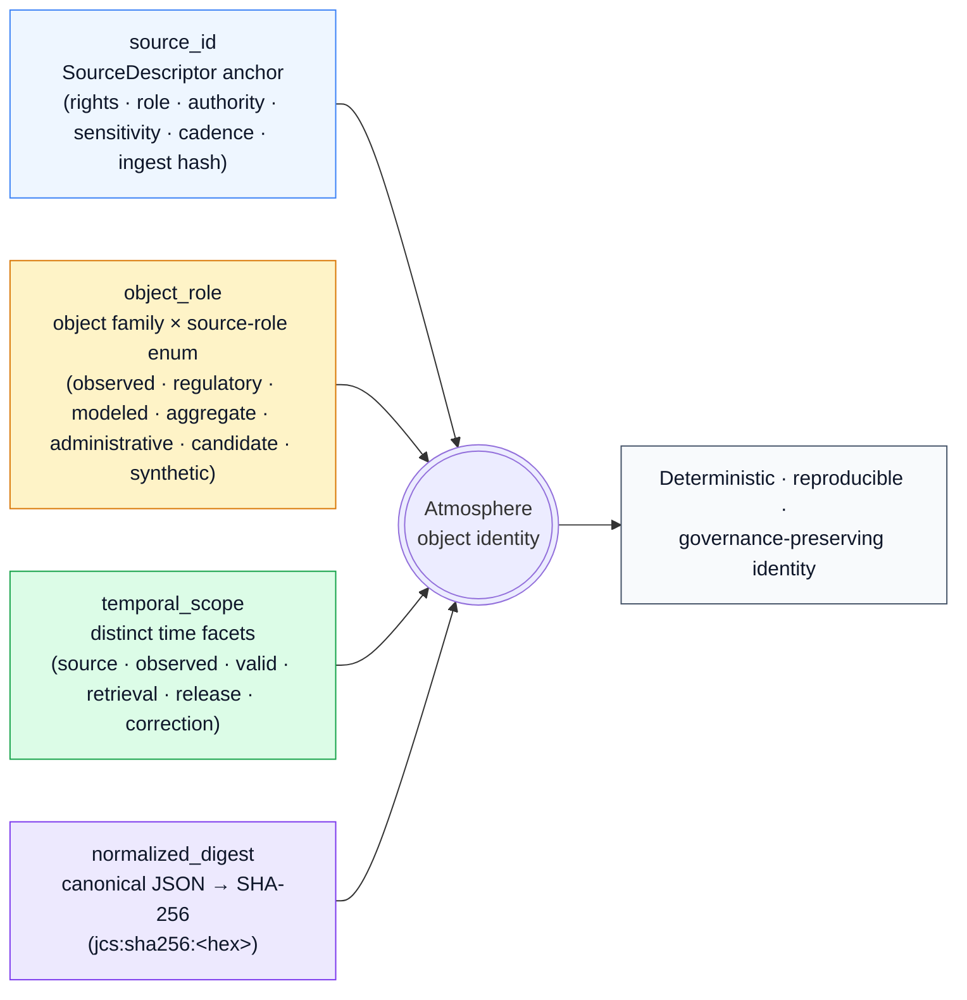
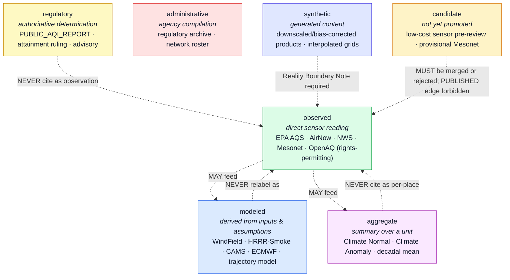
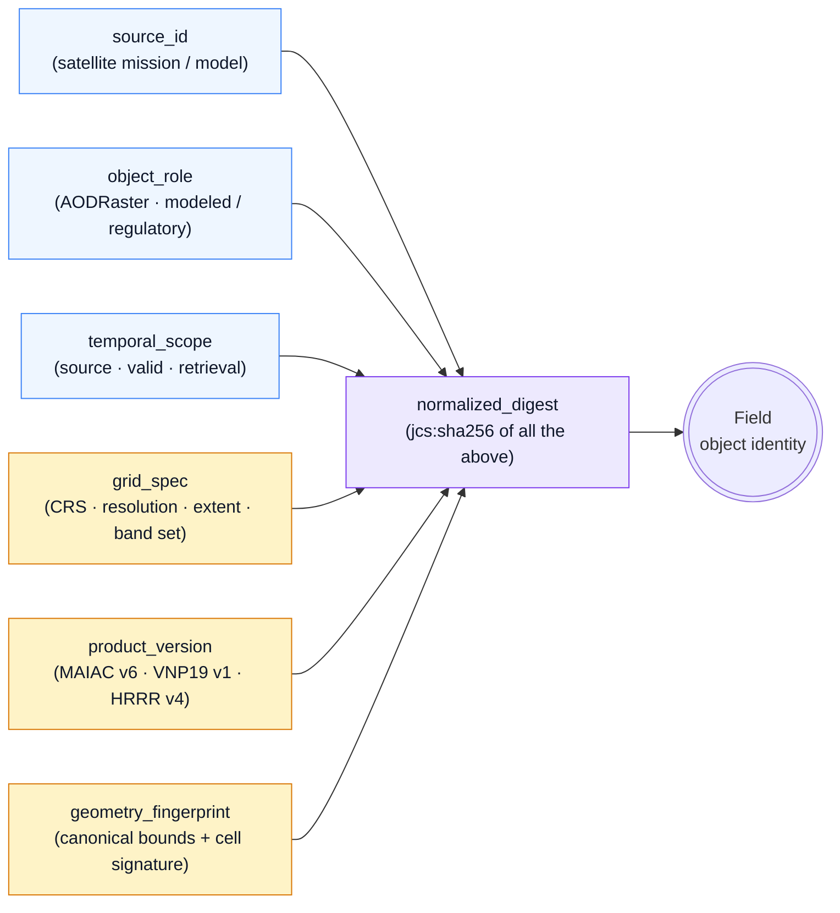

<!-- [KFM_META_BLOCK_V2]
doc_id: kfm://doc/atmosphere-identity-model
title: Atmosphere — Identity Model
type: standard
version: v1
status: draft
owners: DOM-AIR steward + Docs steward (PLACEHOLDER — NEEDS VERIFICATION)
created: 2026-05-16
updated: 2026-05-29
policy_label: public
related:
  - docs/domains/atmosphere/README.md            # PROPOSED — NEEDS VERIFICATION
  - docs/domains/atmosphere/CANONICAL_PATHS.md   # PROPOSED — NEEDS VERIFICATION
  - docs/domains/atmosphere/FILE_SYSTEM_PLAN.md  # companion — placement view
  - docs/domains/atmosphere/EXPANSION_BACKLOG.md # companion — candidate register
  - docs/doctrine/directory-rules.md             # CONFIRMED — this project
  - docs/doctrine/lifecycle-law.md               # PROPOSED — NEEDS VERIFICATION
  - docs/doctrine/truth-posture.md               # PROPOSED — NEEDS VERIFICATION
  - docs/architecture/contract-schema-policy-split.md # PROPOSED — NEEDS VERIFICATION
  - docs/standards/PROV.md                       # CONFIRMED — drafted in this project series
  - docs/adr/ADR-0001-schema-home.md             # CONFIRMED — cited by Directory Rules
  - ai-build-operating-contract.md               # CONFIRMED — operating contract
tags: [kfm, atmosphere, air, identity, evidence, governance, doctrine]
notes:
  # Implementation-layer claims are PROPOSED pending mounted-repo inspection.
  # Deterministic-identity basis ('source id + object role + temporal scope + normalized digest') is PROPOSED per Domains Culmination Atlas v1.1.
  # Source-role enum and spec_hash convention (JCS + SHA-256, recorded jcs:sha256:<hex>) are CONFIRMED doctrine (Pass-10 C1-02).
  # The specific bundle_id / evidence_ref_id base32 derivation is NEEDS VERIFICATION (not located in indexed project knowledge).
  # CONTRACT_VERSION = "3.0.0" (doctrine-adjacent doc).
  # Meta Block v2 rule: no nested HTML comments inside this block; '#' annotations only.
[/KFM_META_BLOCK_V2] -->

# Atmosphere — Identity Model

> **What it means for two Atmosphere objects to be the same thing — and what kinds of "sameness" the Atmosphere domain refuses to collapse.**

[](#) [](#) [](#) [](#) [](#) [](#) [](#)

**Status:** Draft · **Owners:** DOM-AIR steward + Docs steward *(PLACEHOLDER — NEEDS VERIFICATION)* · **Updated:** 2026-05-29 · **Contract:** `CONTRACT_VERSION = "3.0.0"`

---

<a id="contents"></a>

## Contents

1. [Scope and audience](#1-scope-and-audience)
2. [Doctrinal anchors](#2-doctrinal-anchors)
3. [The four-part identity basis](#3-the-four-part-identity-basis)
4. [Object families and identity composition](#4-object-families-and-identity-composition)
5. [Knowledge character: the source-role anti-collapse rule](#5-knowledge-character-the-source-role-anti-collapse-rule)
6. [Temporal discipline](#6-temporal-discipline)
7. [Identity in raster, grid, and field objects](#7-identity-in-raster-grid-and-field-objects)
8. [Identity through the lifecycle](#8-identity-through-the-lifecycle)
9. [`EvidenceRef` → `EvidenceBundle` resolution](#9-evidenceref--evidencebundle-resolution)
10. [Validators that touch identity](#10-validators-that-touch-identity)
11. [Anti-patterns the model is designed to prevent](#11-anti-patterns-the-model-is-designed-to-prevent)
12. [Open questions and verification backlog](#12-open-questions-and-verification-backlog)
13. [Changelog](#13-changelog)
14. [Definition of done](#14-definition-of-done)
15. [Reference appendices](#15-reference-appendices)
16. [Related docs](#16-related-docs)

---

## 1. Scope and audience

This document defines **how the Atmosphere domain identifies its objects** — what counts as "the same thing" across re-runs, re-publications, source updates, and re-projections; what counts as a *different* thing even when attributes overlap; and where identity sits relative to KFM's trust-membrane, evidence, and release controls.

It is **not** a schema. It is the *identity contract* that schemas, validators, policy bundles, and the governed API must respect. Field-level shape lives in `schemas/contracts/v1/domains/atmosphere/` *(PROPOSED path per Directory Rules §12 + ADR-0001 — confirmed as the §12 lane pattern; presence NEEDS VERIFICATION)*. Object meaning lives in `contracts/domains/atmosphere/` *(PROPOSED — NEEDS VERIFICATION)*. Admissibility lives in `policy/domains/atmosphere/` *(PROPOSED — NEEDS VERIFICATION)*.

**Primary readers:** atmosphere data stewards, schema authors, validator authors, policy authors, AI-receipt reviewers, release stewards.
**Secondary readers:** anyone consuming Atmosphere `EvidenceBundle`s or building cross-lane joins (Hazards, Agriculture, Hydrology, Biodiversity).

> [!IMPORTANT]
> **Identity is a governance attribute, not a storage concern.** Two records that share a deterministic Atmosphere identity must mean the same thing in the same source-role under the same temporal scope. Two records with different identity must remain distinguishable even when their attributes coincide. This restates the Domain-Driven Design entity rule — *the model must define what it means to be the same thing*, and *mistaken identity can lead to data corruption* (DDD Reference p. 11). Mistaken identity is treated here as a publication-blocking defect.

> [!NOTE]
> **Companion documents.** This is the *identity* view of the Atmosphere lane. Its siblings are [`FILE_SYSTEM_PLAN.md`](./FILE_SYSTEM_PLAN.md) (where files live), [`EXPANSION_BACKLOG.md`](./EXPANSION_BACKLOG.md) (candidate register), and [`EXPANSION_PLAN.md`](./EXPANSION_PLAN.md) (sequenced roadmap). Where those say *where* and *when*, this one says *what is the same thing*.

[Back to top ↑](#contents)

---

## 2. Doctrinal anchors

The Atmosphere identity model is a *specialization* of repo-wide doctrine; it does not invent new identity rules. Every claim in this document derives from one of the anchors below.

| # | Anchor | What it gives the model | Status |
|---|---|---|---|
| 1 | KFM lifecycle invariant — RAW → WORK / QUARANTINE → PROCESSED → CATALOG / TRIPLET → PUBLISHED | Identity must remain *stable* through governed state transitions; promotion is a state change, not a file move. | **CONFIRMED** doctrine *(Directory Rules; Atlas §11.H)* |
| 2 | Source-role anti-collapse rule | An observed reading, a regulatory determination, a modeled estimate, an aggregate, and an administrative compilation are **not interchangeable** — even when they describe the same place and time. | **CONFIRMED** doctrine *(Atlas §24.1)* |
| 3 | Cite-or-abstain truth posture | Identity must resolve to an `EvidenceBundle` for any claim that depends on evidence; orphan claims trigger ABSTAIN, then DENY at the trust membrane. | **CONFIRMED** doctrine |
| 4 | Atmosphere-specific knowledge-character denials | AQI ≠ concentration; AOD ≠ PM2.5; model ≠ observation; low-cost sensor public release requires correction, caveats, confidence, and limitations. | **CONFIRMED** doctrine *(Atlas §11.I)* |
| 5 | Domain-Driven Design entity / value-object distinction | Some Atmosphere concepts carry durable identity through changing attributes (entities); others should be treated as immutable value carriers (value objects). | **CONFIRMED** principle *(DDD Reference pp. 11–12)* |
| 6 | Deterministic, content-addressed identity for evidence — `spec_hash` via RFC 8785 JCS + SHA-256, recorded as `jcs:sha256:<hex>` | Reproducible identity for `EvidenceBundle` and `EvidenceRef` that survives re-runs, re-serialization, and storage moves. | **CONFIRMED** *(Pass-10 C1-02)* |
| 7 | Directory Rules §12 — Domain Placement Law | Atmosphere lives as a lane (`docs/domains/atmosphere/`, `schemas/contracts/v1/domains/atmosphere/`, …), never as a root folder. | **CONFIRMED** doctrine |
| 8 | Watcher-as-non-publisher invariant | Watchers and connectors emit candidates and receipts only; identity never gains publication status by file presence — only by governed promotion. | **CONFIRMED** doctrine |
| 9 | EvidenceRef resolution triad | Resolution supports deterministic `spec_hash` lookup, run-receipt lookup, and quarantine attestation for inputs crossing trust boundaries. | **CONFIRMED** doctrine *(Atlas KFM-P26-IDEA-0002)* |

[Back to top ↑](#contents)

---

## 3. The four-part identity basis

Across every KFM domain, the Domains Culmination Atlas records the same **PROPOSED deterministic basis** for object identity:

> **`source id` + `object role` + `temporal scope` + `normalized digest`**

Atmosphere inherits this basis without modification. Each part has a specific job, and *none* may be silently omitted.



| Part | What it anchors | Why it's required for Atmosphere | Status |
|---|---|---|---|
| **`source_id`** | The originating sensor / archive / model / advisory feed via `SourceDescriptor` — rights, source-role, authority, sensitivity, cadence, ingest hash. | Atmosphere mixes regulatory monitors, agency advisories, satellite products, and citizen-sensor networks. Identity must trace to an admissible source; orphan claims fail closed. | PROPOSED basis · **CONFIRMED** requirement |
| **`object_role`** | The Atmosphere object family (`AirStation`, `PM25Observation`, `AODRaster`, …) **plus** the source-role tag from §5. | A PurpleAir reading and an EPA AQS reading at the same coordinate at the same hour are not the same `PM25Observation`. A CAMS forecast value and a Mesonet observation are not the same `WeatherObservation`. Role-conflation is a DENY condition. | PROPOSED basis · **CONFIRMED** rule |
| **`temporal_scope`** | A bounded set of time facets material to the claim: source time, observed time, valid time, retrieval time, release time, correction time. | Atmosphere is the most time-sensitive lane in KFM — minutes matter for AQI, valid-time windows matter for forecasts, and stale-state must be visible. Collapsing facets is the most common atmosphere error mode. See §6. | PROPOSED basis · **CONFIRMED** temporal rule |
| **`normalized_digest`** | A `spec_hash` computed by RFC 8785 JCS canonicalization → SHA-256, recorded as `jcs:sha256:<hex>`. | Without canonicalization, a re-serialized payload would hash differently and break promotion gates, watchers, tombstones, and rollback. | **CONFIRMED** algorithm *(Pass-10 C1-02)* · PROPOSED for Atmosphere objects |

> [!NOTE]
> The Atlas labels this whole basis **PROPOSED** for every domain, including Atmosphere, because no current-session repo evidence proves all four parts are implemented in mounted schemas. Until verified, treat the basis as **doctrine the schema PR must satisfy**, not as a guarantee the schema already does. The Pass-1 atlas also notes a `sha256` fallback was used where `blake3` was unavailable — confirm the canonical hash choice (SHA-256 vs. BLAKE3 vs. dual-hash) before relying on a specific algorithm tag.

[Back to top ↑](#contents)

---

## 4. Object families and identity composition

The Atmosphere domain owns 15 object families per the Domains Culmination Atlas §11.B (CONFIRMED scope; PROPOSED implementation). Each is classified below by Domain-Driven Design posture (**INFERRED** per DDD Reference pp. 11–12, awaiting confirmation in `contracts/domains/atmosphere/`) and given the identity parts that most uniquely distinguish it.

> [!TIP]
> Read this table as the *identity-composition contract* for schema authors. The "Distinguishing temporal facet" and "Identity-critical attributes" columns are the parts that must end up inside the normalized payload that produces `spec_hash`; everything else is supporting.

### 4.1 Station and observation objects

| Object family | DDD posture *(INFERRED)* | Distinguishing temporal facet | Identity-critical attributes *(PROPOSED)* | Knowledge character |
|---|---|---|---|---|
| **AirStation** | **Entity** — physical sensor installation persists across readings | retrieval time + valid-from / valid-to of the station's metadata version | `source_id`, `station_native_id`, geometry fingerprint, network membership, parameter set, sensor class | typically `observed` infrastructure (regulatory vs. low-cost matters; see §5) |
| **AirObservation** | **Entity-observation** — discrete event with its own identity *(value-object–like in immutability, entity-like because separately citable / correctable)* | observed time + retrieval time | `source_id`, station ref, parameter, unit (post-normalization), aggregation interval, value, QA flags | `observed` (regulatory) or `observed` (low-cost — caveated) |
| **PM2.5 Observation** | Entity-observation | observed time + retrieval time | as `AirObservation` plus method (FRM / FEM / low-cost / model-proxy) | `observed` — must NEVER be derived from `AODRaster` and labeled `observed` |
| **Ozone Observation** | Entity-observation | observed time + retrieval time | as `AirObservation` plus averaging window (1-hr / 8-hr) | `observed` |
| **Weather Station** | **Entity** | retrieval time + valid-from / valid-to of station metadata | `source_id`, native station id, geometry, network (NWS / Mesonet / co-op), sensor inventory | `observed` infrastructure |
| **Weather Observation** | Entity-observation | observed time + retrieval time | station ref, parameter, unit, observation interval, value, QA | `observed` |
| **Precipitation Observation** | Entity-observation | observed time + retrieval time | station ref, accumulation window, unit, value, sensor type (gauge / disdrometer / radar-derived) | `observed`, with sensor-type disclosure required if radar-derived (which is technically `modeled` — see OQ-12) |
| **Temperature Observation** | Entity-observation | observed time + retrieval time | station ref, height, sensor type, unit, value | `observed` |

### 4.2 Public-AQI, advisory, and regulatory objects

| Object family | DDD posture *(INFERRED)* | Distinguishing temporal facet | Identity-critical attributes *(PROPOSED)* | Knowledge character |
|---|---|---|---|---|
| **PUBLIC_AQI_REPORT** *(term — Atlas §11.C)* | Entity-issuance | issuance time + valid-from / valid-to | issuing authority, geographic scope, AQI value, dominant pollutant, advisory text | `regulatory` reporting (NOT a concentration — see §5) |
| **REGULATORY_ARCHIVE** *(term — Atlas §11.C)* | Entity-versioned-record | release time + valid-from / valid-to of the archive vintage | issuing authority, archive name (e.g., AQS), parameter set, vintage tag | `regulatory` archive |
| **Advisory Context** | Entity-issuance | issuance time + valid-from / valid-to | issuing authority, event type, geographic scope, severity, source URI | `regulatory` context — DENY publication as `observed` event |

### 4.3 Field, raster, and model objects

These objects need extra care because they describe **spatial-temporal fields** rather than point events. See §7 for the field-specific identity discipline.

| Object family | DDD posture *(INFERRED)* | Distinguishing temporal facet | Identity-critical attributes *(PROPOSED)* | Knowledge character |
|---|---|---|---|---|
| **AODRaster** | Entity-grid | source time + valid time + retrieval time | `source_id`, product family (MAIAC MCD19 / VNP19 / GOES-ABI), grid spec (CRS, resolution, extent), time slice, version tag | `observed` remote-sensing mask *(NOT a PM2.5 value — see §5)* |
| **WindField** | Entity-grid | model-run time + valid time | `source_id`, model identity, grid spec, level, time slice, run tag | `modeled` field |
| **SmokeContext** *(shared w/ Hazards)* | Entity-issuance / Entity-grid | source time + valid time | source authority (HMS / HRRR-Smoke), product type (mask / forecast plume), time slice, geometry fingerprint | `regulatory` / `modeled` — never collapse with observed PM2.5 |
| **Forecast Context** | Entity-issuance | model-run time + valid time | issuing authority, forecast model, valid window, geographic scope | `modeled` context |
| **Climate Normal** | Entity-aggregate | period window (e.g., 1991–2020) + release time | issuing authority (NCEI / Mesonet), parameter, geographic unit, aggregation function, baseline period | `aggregate` — NEVER cite as a per-place event |
| **Climate Anomaly** | Entity-aggregate | reference period + comparison window + release time | parameter, geographic unit, anomaly method, both period anchors | `aggregate`, derived from `Climate Normal` — depend chain must be inspectable |

> [!NOTE]
> `SmokeContext` appears in the owned-family list of **both** Atmosphere / Air (Atlas §11.B) **and** Hazards (Atlas §12.B). This identity model governs the **Atmosphere** projection (observed / model smoke context); Hazards owns hazard-event truth in its own lane. Confirm the shared-vs-projected modeling decision via the cross-lane join policy ADR (Atlas ADR-S-14).

### 4.4 Value-object candidates (no durable identity)

Per the DDD value-object rule and the Pass-18 inventory cards, the following constructs **should be modeled as value objects** rather than entities — they describe characteristics, are immutable, and use side-effect-free operations:

- **`UnitValue`** — a normalized measurement value with explicit unit (`{ value, unit, sigfigs }`). The same numeric reading expressed in µg/m³ and ppb is the same `UnitValue` after normalization.
- **`CoordinateValue`** — a normalized point with explicit CRS.
- **`TimeIntervalValue`** — a `[start, end)` window in a declared timezone, normalized to UTC.
- **`DigestValue`** — a `jcs:sha256:<hex>` digest.
- **`CitationValue`** — a normalized citation string with source identifier.
- **`PolicyLabelValue`** — a closed-enum policy label.

> [!NOTE]
> Value-object classification is **INFERRED** for Atmosphere. The Pass-18 inventory (cited as KFM-P18-INV-268, KFM-P18-INV-267 — *exact card IDs NEEDS VERIFICATION*) proposes value-object treatment for these categories at the KFM-wide level; an Atmosphere-specific decision belongs in `contracts/domains/atmosphere/` and is **NEEDS VERIFICATION**.

[Back to top ↑](#contents)

---

## 5. Knowledge character: the source-role anti-collapse rule

The Atmosphere domain uses the term **knowledge character** *(Atlas §11.C, CONFIRMED term)* for what the rest of KFM calls source-role discipline. It is a first-class identity attribute — every Atmosphere object carries a `source_role` that participates in `object_role` for identity composition, and that **cannot be edited in place**.



### 5.1 Atmosphere-specific denials *(CONFIRMED doctrine — Atlas §11.I, §11.K)*

These collapses are explicitly enumerated by the Atmosphere chapter as **deny-by-default**:

| Collapse | What the denial protects | Validator / test *(PROPOSED)* |
|---|---|---|
| **AQI cited as concentration** | A `PUBLIC_AQI_REPORT` value (regulatory index) is not a µg/m³ or ppb concentration; conflating them is an epistemic and regulatory error. | `aqi-as-concentration-denial` |
| **AOD cited as PM2.5** | `AODRaster` is a column-integrated optical-depth retrieval, not a near-surface mass concentration; conflation drives misleading exposure claims. | `aod-as-pm25-denial` |
| **Model field cited as observation** | `WindField`, `SmokeContext` (forecast), and downscaled grids are derived products; an observation-labeled model breaks downstream policy gates. | `model-as-observed-denial` |
| **Low-cost sensor without caveat** | Public release of low-cost-sensor data without correction, caveats, confidence, and limitations is denied. | `low-cost-sensor-caveat-tests` |

> [!WARNING]
> **A correction is a new identity, not a mutation.** If a source revises a reading, the result is a new `AirObservation` (or `WeatherObservation`, etc.) with a new `spec_hash`, linked by a `CorrectionNotice`. The old identity is preserved and can be rolled back to. Editing the original record in place would break promotion idempotency, watcher change-detection, and rollback drills.

### 5.2 Role-to-descriptor-field crosswalk *(PROPOSED shape — Atlas §24.1; field names NEEDS VERIFICATION)*

| Descriptor field | Type / vocabulary | Required when | Atmosphere note |
|---|---|---|---|
| `source_role` | enum: `observed · regulatory · modeled · aggregate · administrative · candidate · synthetic` | MUST always | Set at admission. Correction → new descriptor + `CorrectionNotice`. Canonical enum is ADR-class (Atlas ADR-S-04). |
| `role_authority` | string (issuing body / model identity / steward) | MUST when role ∈ {regulatory, modeled, aggregate} | e.g., `EPA-AQS`, `NCEP-HRRR-Smoke-v4`, `NCEI-Climate-Normals-1991-2020` |
| `role_aggregation_unit` | geometry-scope token | MUST when `source_role = aggregate` | e.g., `kfm-county`, `huc12`, `nws-zone`, `climate-division` |
| `role_model_run_ref` | `EvidenceRef` → `ModelRunReceipt` | MUST when `source_role = modeled` | Pins inputs, parameters, model version for the grid or trajectory. |
| `role_synthetic_basis` | `{ method, inputs, reality_boundary_note_ref }` | MUST when `source_role = synthetic` | Required for downscaled / bias-corrected / interpolated products. |
| `role_candidate_disposition` | enum: `pending · merged · rejected · quarantined` | MUST when `source_role = candidate` | Low-cost-sensor pre-review path; PUBLISHED edge forbidden until merged. |

> [!NOTE]
> The descriptor **field names** above (`role_authority`, `role_model_run_ref`, etc.) are an `INFERRED` shape; the Atlas confirms the source-role *vocabulary* and the anti-collapse *rule*, but the exact descriptor field layout is `NEEDS VERIFICATION` against the mounted `SourceDescriptor` schema and is gated by ADR-S-04.

[Back to top ↑](#contents)

---

## 6. Temporal discipline

> [!IMPORTANT]
> **The Atmosphere domain has six distinct time facets, and identity respects every facet that is material to the claim.** Collapsing them is the single most common error mode for atmospheric data — and the easiest to hide behind a single "timestamp" field. *(CONFIRMED — Atlas §11.E temporal handling.)*

| Facet | Meaning | Atmosphere example | Identity participation |
|---|---|---|---|
| **source time** | The time recorded inside the source artifact (often the issuing system's local time). | `valid_at` inside an AirNow JSON payload, or a Mesonet observation's `obs_local`. | Always part of `temporal_scope`. |
| **observed time** | The physical moment the phenomenon occurred (normalized to UTC). | The minute a PM2.5 BAM cycle ended; the satellite overpass time. | Always part of `temporal_scope` for observation-class objects. |
| **valid time** | The window during which the claim is intended to hold (often = observed time for instruments; differs sharply for forecasts and advisories). | A 24-hour AQI value's 24-hour validity window; a wind-forecast valid time. | Distinct from observed time for `WindField`, `SmokeContext`, `Forecast Context`, `Advisory Context`. |
| **retrieval time** | The time KFM fetched the record (HTTP fetch / API call / file mtime at admission). | The watcher's `fetched_at` in the run-receipt. | Always part of `temporal_scope`. |
| **release time** | The time the object was promoted into PUBLISHED via a `ReleaseManifest`. | `release_manifest.released_at` for an atmosphere layer. | Always part of `temporal_scope` from PROCESSED onward. |
| **correction time** | The time a `CorrectionNotice` superseded a prior identity. | A retroactive QA-fail revision to an EPA AQS hour. | Part of `temporal_scope` for the **corrected** identity, not the original. |

### 6.1 Stale-state and time-collapse denials *(PROPOSED tests)*

- `timestamp-normalization-determinism` — same payload, same canonical UTC, regardless of timezone of fetcher.
- `time-facet-distinction` — observed / retrieval / release MUST be carried separately wherever they differ; a single `timestamp` field is insufficient.
- `ambiguous-or-malformed-timestamp` — fails validation or enters quarantine; never silently coerced.
- `stale-state-rule` — released objects carry a freshness badge derived from normalized timing fields; Focus Mode must ABSTAIN when the data is older than the per-source staleness threshold.

[Back to top ↑](#contents)

---

## 7. Identity in raster, grid, and field objects

`AODRaster`, `WindField`, `SmokeContext` (grid form), and other field-shaped objects need an identity composition that goes beyond the four-part basis, because the *grid itself* is part of what the identity must distinguish.



| Field-identity attribute | Why it matters for Atmosphere |
|---|---|
| `grid_spec` *(PROPOSED)* | A 1 km MAIAC AOD tile and a 9 km re-aggregation of it have different identities even if their `valid_time` is the same. |
| `product_version` *(PROPOSED)* | MAIAC MCD19A2 v6 and v6.1 are distinct identities; conflation would hide algorithm changes. |
| `geometry_fingerprint` *(PROPOSED — Spatial Foundation)* | The same bounding box at two CRSes is two identities; reprojections generate `TransformReceipt`s, not in-place edits. |
| `level / band set` *(PROPOSED)* | A 10 m WindField level and a 100 m level are distinct identities; multi-level products must declare their levels in identity. |
| `analysis-CRS vs. web-delivery-CRS distinction` *(CONFIRMED principle — Master MapLibre; exact ML card id NEEDS VERIFICATION)* | Identity is tied to the analysis CRS; web-delivery reprojections produce derived artifacts with their own identity and `TransformReceipt`. |

> [!CAUTION]
> **Cloud Optimized GeoTIFFs (COGs) and PMTiles are derived artifacts, not identity-bearing originals.** *(CONFIRMED principle — Master MapLibre; exact ML card id NEEDS VERIFICATION.)* The COG / PMTiles version of an `AODRaster` references the analysis-CRS identity via `EvidenceRef`; it does not replace it.

[Back to top ↑](#contents)

---

## 8. Identity through the lifecycle

**Identity does not change between lifecycle stages.** Promotion is a governed state transition, not a mutation. The same `spec_hash` that identifies an Atmosphere object in PROCESSED is the `spec_hash` that identifies it after PUBLISHED — what changes is the surrounding governance evidence (`ValidationReport`, `EvidenceBundle`, `PolicyDecision`, `PromotionDecision`, `ReleaseManifest`).

```mermaid
flowchart LR
    RAW["RAW<br/><i>immutable source<br/>payload + ingest hash</i>"]:::raw
    WQ["WORK / QUARANTINE<br/><i>normalize schema, geometry,<br/>time, identity, evidence, rights, policy</i>"]:::work
    PR["PROCESSED<br/><i>validated normalized objects<br/>+ EvidenceRef + ValidationReport<br/>+ digest closure</i>"]:::proc
    CT["CATALOG / TRIPLET<br/><i>catalog records + EvidenceBundles<br/>+ graph/triplet projections<br/>+ release candidates</i>"]:::cat
    PU["PUBLISHED<br/><i>released public-safe artifacts<br/>via governed APIs<br/>+ ReleaseManifest + RollbackCard</i>"]:::pub

    RAW -->|SourceDescriptor exists| WQ
    WQ -->|validation + policy pass<br/>OR quarantine reason recorded| PR
    PR -->|catalog / proof closure passes| CT
    CT -->|PromotionDecision + ReleaseManifest| PU
    PU -.->|CorrectionNotice creates<br/>new identity| PR
    PU -.->|RollbackCard reverts<br/>alias, not identity| CT

    classDef raw   fill:#f1f5f9,stroke:#64748b,color:#0f172a;
    classDef work  fill:#fef3c7,stroke:#d97706,color:#0f172a;
    classDef proc  fill:#e0f2fe,stroke:#0284c7,color:#0f172a;
    classDef cat   fill:#ede9fe,stroke:#7c3aed,color:#0f172a;
    classDef pub   fill:#dcfce7,stroke:#16a34a,color:#0f172a;
```



| Stage | What changes for identity | What stays the same |
|---|---|---|
| **RAW** | A `SourceDescriptor` is recorded with `source_role`, rights, sensitivity, citation, time, and ingest hash. Identity is *anchored* but not yet `spec_hash`-stable for the canonical object. | The source payload itself is immutable. |
| **WORK / QUARANTINE** | Geometry, time, units, source-role, evidence, and policy are normalized. The four-part identity basis becomes computable. Failures are held in QUARANTINE with a reason — they do not pass through. | The `source_id` and the source-role tag persist; identity drift would itself be a quarantine reason. |
| **PROCESSED** | The canonical `spec_hash` is computed via JCS + SHA-256; `EvidenceRef` and `ValidationReport` are emitted; the digest closes. | Identity now exists in its final form. |
| **CATALOG / TRIPLET** | The `EvidenceBundle` is assembled (graph fragment + run receipts + crosswalks + `spec_hash`) and content-addressed; STAC / DCAT / PROV records reference it. | The `spec_hash` is unchanged — the catalog refers to identity, it does not redefine it. |
| **PUBLISHED** | A `ReleaseManifest` names the `spec_hash` as released; clients access via the governed API. A `RollbackCard` names the target. | Identity is *exactly* the identity from PROCESSED. Publication adds release state; it does not change identity. |

> [!NOTE]
> **Correction creates a new identity.** A retroactive QA-fail revision to an EPA AQS hour produces a *new* `AirObservation` with a new `spec_hash`. A `CorrectionNotice` links the old and new identities and records the reason. The original identity remains discoverable for audit, rollback, and reproducibility.

[Back to top ↑](#contents)

---

## 9. `EvidenceRef` → `EvidenceBundle` resolution

Atmosphere claims that depend on evidence must resolve through the governed `EvidenceRef` → `EvidenceBundle` path. The Atlas confirms the **resolution triad** — deterministic `spec_hash` lookup, run-receipt lookup, and quarantine attestation for inputs crossing trust boundaries (KFM-P26-IDEA-0002) — and confirms the **bundle/ref schema field requirements**: an `EvidenceBundle` carries `bundle_id`, identity/`spec_hash`, inputs, parameters, artifacts, checks, integrity, and signatures (KFM-P26-PROG-0004); an `EvidenceRef` carries `ref_id`, target `spec_hash`, expected bundle digest, resolution, and policy metadata (KFM-P26-PROG-0005). **CONFIRMED doctrine.**

| Step | Behavior | Status |
|---|---|---|
| **Compute** | `spec_hash` over a normalized spec that includes `object_type`, `schema_version`, `source_refs`, `dataset_refs`, `evidence_refs`, `object_refs`, `policy_label`, `rights_status`, `sensitivity`, and any field that changes evidentiary meaning. Transport / runtime fields (timestamps, storage URLs, signatures, nonces) are excluded. | **CONFIRMED** approach *(Pass-10 C1-02; C4-04 content addressing)* |
| **Derive IDs** | IDs derive only from the normalized spec — no environment entropy — so two consumers compute the same id for the same logical content. | **CONFIRMED** principle; **specific `eb-`/`er-` base32-26 formula NEEDS VERIFICATION** *(see note)* |
| **Resolve** | Read `evidence_ref` target `spec_hash` → look up a bundle whose `spec_hash` equals the ref's target → verify the bundle's id recomputes from the same `spec_hash`. If not, **DENY**. | **CONFIRMED** triad *(KFM-P26-IDEA-0002)* |
| **Publication gate** | Promotion requires a matching `spec_hash`. Any mismatch triggers ABSTAIN at validation or DENY at policy, per the stage. | **CONFIRMED** posture |
| **Algorithm stability** | SHA-256 is fixed for v1; future migration requires an ADR and a dual-hash compatibility window. The BLAKE3-vs-SHA-256 question is itself open. | **CONFIRMED** need; algorithm choice **OPEN** |

> [!IMPORTANT]
> **Tampering, accidental substitution, and partial promotion are all detected by hash mismatch.** Two consumers fetching the same evidence reference must receive byte-identical bundles. This is what makes Atmosphere `EvidenceBundle`s portable across the broader geospatial tooling ecosystem (STAC, DCAT, JSON-LD). *(CONFIRMED — Pass-10 C4-01, C4-04; content-addressed URI form `kfm://entity-bundle/<sha256>`.)*

> [!WARNING]
> **ID-derivation formula is unverified.** The concrete scheme `bundle_id = "eb-" + base32(lowercase(SHA-256(spec_hash)))[:26]` / `evidence_ref_id = "er-" + ...` was attributed to `New_Ideas_5-8-26.pdf`, which is **not present in this session's indexed project knowledge**. What *is* confirmed is content-addressing from `spec_hash` (C4-04, URI form `kfm://entity-bundle/<sha256>`) and the required field set (KFM-P26-PROG-0004/0005). The exact `eb-`/`er-` base32-26 encoding is therefore **NEEDS VERIFICATION** and must be confirmed against a mounted `evidence_bundle.schema.json` / `evidence_ref.schema.json` before any tool relies on the literal id format. See §12 OQ-13.

[Back to top ↑](#contents)

---

## 10. Validators that touch identity

The Atlas §11.K backlog and the Atmosphere knowledge-character constraints imply the following identity-touching validators. **All PROPOSED — NEEDS VERIFICATION** against `tests/domains/atmosphere/` and `policy/domains/atmosphere/`:

| Validator | What identity property it protects |
|---|---|
| `knowledge-character-registry-tests` | Every Atmosphere object carries a valid `source_role`; unknown / missing roles fail closed. |
| `unit-normalization-tests` | Unit normalization is deterministic; same physical reading yields the same `spec_hash`-input regardless of inbound unit. |
| `aqi-as-concentration-denial` | An object asserting AQI cannot be cast as a µg/m³ or ppb concentration. |
| `aod-as-pm25-denial` | An `AODRaster` cannot be republished as a `PM2.5 Observation` field. |
| `model-as-observed-denial` | A `WindField`, `SmokeContext` forecast, or downscaled grid cannot be relabeled `observed`. |
| `low-cost-sensor-caveat-tests` | Public release of low-cost-sensor data without correction, caveats, confidence, and limitations is rejected. |
| `dryrun-no-live-fetch-tests` | Dry-run pipelines do not perform live fetches; identity computation is reproducible from fixtures. |
| `timestamp-normalization-determinism` | Identical payloads produce identical UTC normalizations across AQS, OpenAQ, PurpleAir, Mesonet, satellite products. *(principle CONFIRMED — Master MapLibre; exact card id NEEDS VERIFICATION.)* |
| `time-facet-distinction` | Source / observed / valid / retrieval / release / correction times are carried separately wherever they differ. |
| `digest-closure-tests` | The `EvidenceBundle` `spec_hash` recomputes from its declared id and from the reference that targets it. |
| `correction-creates-new-identity` | A `CorrectionNotice` produces a new `spec_hash`-bearing identity, not an in-place edit. |
| `release-manifest-identity-match` | The `spec_hash` in `ReleaseManifest` matches the `spec_hash` of the PROCESSED object exactly. |
| `rollback-replay-on-fixture` | A rollback drill on a saved Atmosphere fixture restores the prior released identity. |

> [!IMPORTANT]
> Per Directory Rules §13.5, validator **logic** lives in `tools/validators/<topic>/...` and is *called* by these tests; it is not authored inside the test files. The names above identify the tests/fixtures, not the validator implementations.

[Back to top ↑](#contents)

---

## 11. Anti-patterns the model is designed to prevent

| Anti-pattern | Identity consequence | Atmosphere example |
|---|---|---|
| Single `timestamp` field collapsing time facets | Observations and forecasts conflate; stale-state badges become unreliable | A 24-hour AQI report stored with one `timestamp` indistinguishable from a 1-hour observation |
| In-place mutation of a corrected reading | Watcher change-detection breaks; rollback target is destroyed | A late QA-fail flag rewriting an existing AQS hour rather than emitting a new identity |
| Relabeling a model output as observed | The trust-membrane DENY collapses; downstream policy gates can no longer separate truth posture | HRRR-Smoke surface-PM2.5 republished as an "observation" |
| AOD / PM2.5 conflation | Public exposure claims become misleading; regulatory comparability is lost | Tile recolored from `AODRaster` and labeled "PM2.5" |
| AQI / concentration conflation | An index masquerades as a concentration; risk math downstream is silently wrong | A `PUBLIC_AQI_REPORT` numeric pushed into a `PM25Observation` field |
| Low-cost sensor public release without caveats | Public AQ map shows uncorrected, uncalibrated values as authoritative | A PurpleAir tile rendered without correction / confidence / limitations layer |
| Grid identity ignored | Reprojections, resamplings, and re-binnings overwrite each other in the catalog | A 1 km MAIAC tile silently overwritten by a 9 km re-aggregation under the same identity |
| Aggregate cited per place | A county or HUC summary is interpreted as a point reading | A climate-normal value at a county centroid treated as a per-station observation |
| Candidate exposed on a public surface | Pre-review data leaks through the trust membrane | A pending Mesonet ingest visible to public clients before merge |

[Back to top ↑](#contents)

---

## 12. Open questions and verification backlog

| # | Item | Status | What would settle it |
|---|---|---|---|
| OQ-01 | Confirm `schemas/contracts/v1/domains/atmosphere/` is the live machine-schema home (vs. `contracts/domains/atmosphere/` carrying schemas in lineage). | **NEEDS VERIFICATION** *(Directory Rules §12 confirms the pattern; presence unverified)* | Mounted-repo inspection per ADR-0001. |
| OQ-02 | Confirm `source_role` enum shape and field name in mounted `SourceDescriptor`. | **NEEDS VERIFICATION** *(gated by ADR-S-04)* | Schema file inspection at `schemas/contracts/v1/.../source_descriptor.schema.json` (or equivalent). |
| OQ-03 | Confirm whether the Atmosphere `kfm:` namespace choice (`kfm:` vs. `ks-kfm:`) has been pinned by ADR. | **OPEN** *(Pass-10 C4-01)* | An accepted ADR or a `STAC_KFM_PROFILE.md` declaration. |
| OQ-04 | Confirm JCS vs. URDNA2015 canonicalization choice for Atmosphere `EvidenceBundle`s merged with non-KFM RDF. | **OPEN** *(Pass-10 C8-05 — JCS is the confirmed default; URDNA2015 reserved for RDF-semantic equivalence)* | ADR + canonicalization test vectors. |
| OQ-05 | Confirm `geometry_fingerprint` canonicalization rule for Atmosphere field objects (AODRaster, WindField). | **NEEDS VERIFICATION** | Spatial Foundation `GeometryFingerprint` contract + Atmosphere-specific fixtures. |
| OQ-06 | Confirm whether `Climate Normal` and `Climate Anomaly` require an `AggregationReceipt`; confirm its field shape. | **NEEDS VERIFICATION** | Mounted receipt schema and golden fixtures. |
| OQ-07 | Confirm DDD entity/value-object classification for each Atmosphere object family in `contracts/domains/atmosphere/`. | **NEEDS VERIFICATION** | Mounted contract Markdown declaring posture per family. |
| OQ-08 | Confirm low-cost-sensor caveat enforcement — exact validator names, fixture content, and policy bundle. | **NEEDS VERIFICATION** | `tests/domains/atmosphere/` + `policy/domains/atmosphere/` inspection. |
| OQ-09 | Confirm dryrun-no-live-fetch test presence and content for the Atmosphere PROPOSED first PR. | **NEEDS VERIFICATION** | Test inventory inspection. |
| OQ-10 | Resolve `PROV.md` vs. `PROVENANCE.md` naming for the standards profile (recurring open item across the project series). | **OPEN** | ADR or rename PR. |
| OQ-11 | Confirm `CODEOWNERS` for `docs/domains/atmosphere/IDENTITY_MODEL.md` and for the Atmosphere lane generally. | **NEEDS VERIFICATION** | `.github/CODEOWNERS` inspection. |
| OQ-12 | Confirm radar-derived precipitation handling — is radar-derived `Precipitation Observation` treated as `observed`, `modeled`, or split into a separate family? | **OPEN** | Atmosphere contract or ADR. |
| OQ-13 | Confirm the literal `bundle_id` / `evidence_ref_id` derivation (`eb-`/`er-` + base32-26) vs. the content-addressed `kfm://entity-bundle/<sha256>` form. | **NEEDS VERIFICATION** *(formula attributed to an unlocatable source; content-addressing CONFIRMED, exact encoding not)* | Mounted `evidence_bundle.schema.json` / `evidence_ref.schema.json`. |
| OQ-14 | Confirm canonical hash algorithm (SHA-256 vs. BLAKE3 vs. dual-hash) for Atmosphere `spec_hash`. | **OPEN** *(Pass-1 used sha256 fallback where blake3 unavailable)* | Hashing-policy ADR + build-environment confirmation. |
| OQ-15 | Confirm the `New_Ideas_5-8-26.pdf` source referenced for the resolution rule, Mesonet consent note, FIRMS thresholds, and SMAP cadence. | **NEEDS VERIFICATION** *(file not in indexed project knowledge; Kansas Mesonet corroborated only via `New Ideas 4-14-26.pdf`, SRC-P23-003)* | Source-ledger / mounted-repo confirmation of the file and its contents. |

[Back to top ↑](#contents)

---

## 13. Changelog

| Change | Type (per contract §37) | Reason |
|---|---|---|
| Confirmed `EvidenceRef` resolution triad and bundle/ref required-field sets against the Atlas | gap closure | Atlas KFM-P26-IDEA-0002 / PROG-0004 / PROG-0005 ground §9. |
| **Demoted** the literal `eb-`/`er-` base32-26 id-derivation formula to `NEEDS VERIFICATION` | reconciliation | Formula attributed to `New_Ideas_5-8-26.pdf`, which is not in indexed project knowledge; only content-addressing from `spec_hash` (C4-04) is CONFIRMED. |
| Flagged `New_Ideas_5-8-26.pdf` consistently as `NEEDS VERIFICATION` (resolution rule, Mesonet consent, FIRMS, SMAP) | clarification | Same unlocatable file flagged in the companion `FILE_SYSTEM_PLAN` / `EXPANSION_PLAN`; Kansas Mesonet is corroborated only via `New Ideas 4-14-26.pdf` (SRC-P23-003). |
| Softened Pass-18 (`KFM-P18-INV-267/268`) and Master MapLibre (`ML-061-09x`) card-id citations to "id NEEDS VERIFICATION" | clarification | Card-level ids not confirmed in this session; the underlying principles are confirmed. |
| Noted JCS-as-default / URDNA2015-reserved explicitly (C8-05) | clarification | The OQ on canonicalization had a confirmed default worth stating. |
| Added BLAKE3-vs-SHA-256 hash-algorithm open question (OQ-14) | gap closure | Pass-1 used a sha256 fallback where blake3 was unavailable; the choice is genuinely open. |
| Flagged `SmokeContext` as shared with Hazards | clarification | Atlas §11.B and §12.B both list it. |
| Added companion sections (Changelog, Definition of done) and `CONTRACT_VERSION = "3.0.0"` pin; reflowed Meta Block annotations to `#` style | gap closure / housekeeping | Doctrine-adjacent doc completeness + Meta Block v2 rule. |
| Added companion-doc cross-links (FILE_SYSTEM_PLAN, EXPANSION_BACKLOG/PLAN) | housekeeping | Cross-document navigability. |
| Renumbered tail (Reference appendices → §15, Related docs → §16) to seat new §13–§14 | housekeeping | Section insertion. |
| Updated `updated:` and badge to 2026-05-29 | housekeeping | Review date. |

> **Backward compatibility.** Section anchors §1–§11 are preserved; §12 retains its slot (re-IDed open-question rows as `OQ-NN` but kept the section number). New §13–§14 insert before the appendices, which move to §15–§16. The original used a single `#contents` anchor that GitHub generates from "Contents"; preserved.

[Back to top ↑](#contents)

---

## 14. Definition of done

This document is done enough to enter the repository when:

- it is placed according to Directory Rules (`docs/domains/atmosphere/IDENTITY_MODEL.md`, `PROPOSED` per §12);
- a DOM-AIR steward and a docs steward review it, and `CODEOWNERS` is confirmed (OQ-11);
- it is linked from `docs/domains/atmosphere/README.md` and cross-links the file-system plan, backlog, and expansion plan;
- the `source_role` enum (OQ-02 / ADR-S-04), the `spec_hash` algorithm (OQ-14), and the bundle/ref id-derivation (OQ-13) are confirmed against mounted schemas;
- the `PROV.md` vs. `PROVENANCE.md` naming (OQ-10) and the `kfm:`-namespace (OQ-03) questions are resolved by ADR;
- the `GENERATED_RECEIPT.json` planned for this artifact is wired into CI;
- future changes follow the operating contract's §37 lifecycle.

[Back to top ↑](#contents)

---

## 15. Reference appendices

<details>
<summary><strong>Appendix A — Receipt families that touch Atmosphere identity</strong> <em>(PROPOSED shape — Atlas §24.2; field shapes NEEDS VERIFICATION)</em></summary>

| Receipt | Purpose | When Atmosphere emits it |
|---|---|---|
| **`SourceDescriptor`** | Records source identity, rights, role, sensitivity, cadence at admission. Anchors every downstream receipt. | At RAW admission of every Atmosphere source family (EPA AQS, AirNow, NWS, Mesonet, OpenAQ, satellite products, model fields). |
| **`TransformReceipt`** *(projection / generalization)* | Records a spatial or attribute transform (reprojection, generalization, snap, simplification). | When an `AODRaster` or `WindField` is reprojected for web delivery; when a station point is generalized. |
| **`UnitConversionReceipt`** *(PROPOSED — Atmosphere-specific)* | Records the inbound unit, outbound unit, and conversion factor for a normalized observation. | When PM2.5 is normalized from ppb-equivalents, or AQI is computed from concentration. |
| **`AggregationReceipt`** | Records an aggregation step (county-year roll-up, decadal mean, climate-normal computation) and pins the geometry scope. | When `Climate Normal` or `Climate Anomaly` is computed; when matrix-cell summaries are published. |
| **`ModelRunReceipt`** | Pins inputs, parameters, model identity and version for any `modeled` source role. | When `WindField`, `SmokeContext` (forecast), or any downscaled product is admitted. |
| **`RedactionReceipt`** | Records a public-safe transformation (redaction, masking, fuzzing, withholding). | For low-cost-sensor caveat enforcement; for advisory-context redirection; for sensitive-location masking. |
| **`CitationValidationReport`** | Validates cite-or-abstain before display or export. | At Focus Mode response time for any Atmosphere claim. |
| **`PromotionDecision`** | Governed state transition into release. | At PUBLISHED transition for every Atmosphere release. |
| **`ReleaseManifest`** | The release decision artifact. | One per Atmosphere release. |
| **`CorrectionNotice`** | Public notice of a corrected claim. | Whenever a corrected identity supersedes a prior released identity. |
| **`RollbackCard`** | Rollback decision artifact. | One per Atmosphere release; rollback drill replays it. |
| **`AIReceipt`** | Audit trail for model execution at Focus Mode. | When AI summarizes a released Atmosphere `EvidenceBundle`. |

</details>

<details>
<summary><strong>Appendix B — Atmosphere source families and their default source-role</strong> <em>(PROPOSED — Atlas §11.D; role split INFERRED; rights NEEDS VERIFICATION)</em></summary>

| Source family | Default `source_role` *(INFERRED)* | Notes |
|---|---|---|
| EPA AQS-like archive | `regulatory` archive *(administrative compilation of `observed`)* | Vintage tag required; conflating versions is denied. |
| AirNow / agency reporting | `regulatory` reporting | Public AQI surfaces; not a concentration. |
| OpenAQ-like aggregators | `observed` *(rights-permitting)* | Rights NEEDS VERIFICATION; many entries are republished from regulatory or low-cost networks and inherit their role. |
| Kansas Mesonet | `observed` | Written data-usage consent reportedly required *(attributed to `New_Ideas_5-8-26.pdf` — NEEDS VERIFICATION; Mesonet corroborated only via `New Ideas 4-14-26.pdf`)*; fail-closed if rights unrecorded. |
| NWS / NOAA stations | `observed` | Standard meteorological networks. |
| Low-cost sensors (e.g., PurpleAir) | `observed` *(low-cost — caveated)* or `candidate` pre-review | Public release requires correction, caveats, confidence, and limitations. |
| GOES-ABI AOD | `observed` remote-sensing mask | Column-integrated; AOD ≠ PM2.5. |
| MAIAC MCD19 / VNP19 AOD | `observed` remote-sensing mask | Product version and validation status critical to identity. |
| VIIRS / MODIS fire / FIRMS | `observed` remote-sensing detection | FRP threshold rules attributed to `New_Ideas_5-8-26.pdf` — NEEDS VERIFICATION. |
| HMS smoke product | `regulatory` smoke context | Analyst-issued. |
| HRRR-Smoke / NOAA smoke forecast | `modeled` field | Forecast valid time distinct from run time. |
| CAMS / ECMWF-family model fields | `modeled` field | Run identity required. |
| SMAP L4 (soil-moisture context for Atmosphere joins) | `modeled` field | Cadence / staleness threshold attributed to `New_Ideas_5-8-26.pdf` — NEEDS VERIFICATION. |
| Forecast / advisory issuances | `regulatory` issuance | Authority + valid window required. |

</details>

<details>
<summary><strong>Appendix C — Identity composition cheat-sheet (PROPOSED)</strong></summary>

For schema authors, the minimum set of fields that participate in `spec_hash` per object family. **All PROPOSED — final shape lives in `schemas/contracts/v1/domains/atmosphere/`.**

```text
AirStation         { source_id, station_native_id, geometry_fingerprint,
                     parameter_set, sensor_class, station_metadata_version_window }

AirObservation     { source_id, station_ref, parameter, normalized_unit,
                     aggregation_interval, value, qa_flags,
                     observed_time, retrieval_time, source_role, source_role_qualifier }

PM2.5 Observation  { + method ∈ {FRM, FEM, low-cost, model-proxy} }

Ozone Observation  { + averaging_window ∈ {1-hr, 8-hr} }

Weather Station    { source_id, station_native_id, geometry_fingerprint,
                     sensor_inventory, station_metadata_version_window }

Weather/Precip/Temp Observation
                   { source_id, station_ref, parameter, normalized_unit,
                     observation_interval, value, qa_flags,
                     observed_time, retrieval_time, source_role }

AODRaster          { source_id, product_family, product_version, grid_spec,
                     geometry_fingerprint, valid_time, source_time, retrieval_time }

WindField          { source_id, model_identity, model_version, grid_spec,
                     level, valid_time, model_run_time, retrieval_time }

SmokeContext       { source_id, issuing_authority, product_type,
                     geometry_fingerprint, valid_time, issuance_time, retrieval_time }

Forecast Context   { source_id, issuing_authority, forecast_model,
                     geographic_scope, valid_window, model_run_time, retrieval_time }

Advisory Context   { source_id, issuing_authority, event_type, severity,
                     geographic_scope, valid_window, issuance_time, retrieval_time }

Climate Normal     { source_id, issuing_authority, parameter, geographic_unit,
                     aggregation_function, baseline_period, release_time }

Climate Anomaly    { source_id, parameter, geographic_unit, anomaly_method,
                     baseline_period, comparison_window, release_time,
                     climate_normal_ref }
```

Each object also carries (but does not include in `spec_hash`):
- transport / runtime fields (storage URLs, fetch headers, signatures, nonces);
- derived ids (e.g., `bundle_id`, `evidence_ref_id`) — *derivation formula NEEDS VERIFICATION, see §9 / OQ-13*.

`policy_label`, `rights_status`, and `sensitivity` **DO** participate in `spec_hash` per the resolution rule in §9.

</details>

<details>
<summary><strong>Appendix D — GENERATED_RECEIPT.json plan (operating-contract §34)</strong></summary>

If this identity model is merged, it is an AI-authored artifact and `SHOULD` ship a `GENERATED_RECEIPT.json`:

```json
{
  "receipt_id": "NEEDS-VERIFICATION",
  "contract_version": "3.0.0",
  "artifact_paths": ["docs/domains/atmosphere/IDENTITY_MODEL.md"],
  "artifact_hashes": { "docs/domains/atmosphere/IDENTITY_MODEL.md": "BLAKE3-or-SHA256:NEEDS-VERIFICATION" },
  "model_identity": "NEEDS-VERIFICATION",
  "truth_labels": "CONFIRMED (identity doctrine) / PROPOSED (implementation) / NEEDS VERIFICATION (id-derivation formula)",
  "validation_gates": [
    { "name": "polish_checklist", "status": "PASS" },
    { "name": "truth_checklist", "status": "PASS" }
  ],
  "human_review": { "state": "pending" }
}
```

> Illustrative only. `human_review.state == "pending"` is well-formed but **not mergeable** until `approved`.

</details>

[Back to top ↑](#contents)

---

## 16. Related docs

The following are **PROPOSED** sibling and ancestor documents per Directory Rules §6 and §12; presence and exact paths **NEEDS VERIFICATION** unless marked CONFIRMED.

- [`docs/domains/atmosphere/README.md`](./README.md) — Atmosphere lane overview *(PROPOSED)*
- [`docs/domains/atmosphere/FILE_SYSTEM_PLAN.md`](./FILE_SYSTEM_PLAN.md) — placement view *(companion)*
- [`docs/domains/atmosphere/EXPANSION_BACKLOG.md`](./EXPANSION_BACKLOG.md) — candidate register *(companion)*
- [`docs/domains/atmosphere/EXPANSION_PLAN.md`](./EXPANSION_PLAN.md) — sequenced roadmap *(companion)*
- [`docs/domains/atmosphere/CANONICAL_PATHS.md`](./CANONICAL_PATHS.md) — canonical-paths registry *(PROPOSED — drafted in prior project conversation)*
- [`docs/domains/atmosphere/SENSITIVITY.md`](./SENSITIVITY.md) — knowledge-character and low-cost-sensor caveat posture *(PROPOSED — TODO)*
- [`docs/domains/atmosphere/SOURCES.md`](./SOURCES.md) — Atmosphere source families and descriptors *(PROPOSED — TODO)*
- [`docs/doctrine/directory-rules.md`](../../doctrine/directory-rules.md) — Directory Rules *(CONFIRMED — this project)*
- [`docs/doctrine/lifecycle-law.md`](../../doctrine/lifecycle-law.md) — Lifecycle invariant *(PROPOSED — NEEDS VERIFICATION)*
- [`docs/doctrine/truth-posture.md`](../../doctrine/truth-posture.md) — Cite-or-abstain doctrine *(PROPOSED — NEEDS VERIFICATION)*
- [`docs/architecture/contract-schema-policy-split.md`](../../architecture/contract-schema-policy-split.md) — Meaning vs. shape vs. admissibility *(PROPOSED — NEEDS VERIFICATION)*
- [`docs/standards/PROV.md`](../../standards/PROV.md) — W3C PROV-O and PAV profile *(CONFIRMED — drafted in this project series; name vs. `PROVENANCE.md` is OQ-10)*
- [`docs/standards/PMTILES.md`](../../standards/PMTILES.md) — PMTiles v3 profile *(CONFIRMED — drafted in this project series)*
- [`docs/standards/OGC-API-TILES.md`](../../standards/OGC-API-TILES.md) — OGC API Tiles delivery *(CONFIRMED — drafted in this project series)*
- [`docs/standards/OAI-PMH.md`](../../standards/OAI-PMH.md) — OAI-PMH 2.0 harvest *(CONFIRMED — drafted in this project series)*
- [`docs/standards/ISO-19115.md`](../../standards/ISO-19115.md) — ISO 19115 crosswalk *(CONFIRMED — drafted in this project series)*
- [`docs/adr/ADR-0001-schema-home.md`](../../adr/ADR-0001-schema-home.md) — default machine-schema home *(CONFIRMED — cited by Directory Rules)*
- [`ai-build-operating-contract.md`](../../../ai-build-operating-contract.md) — operating contract *(CONFIRMED — `CONTRACT_VERSION = "3.0.0"`)*
- `schemas/contracts/v1/domains/atmosphere/` — Atmosphere machine-shape home *(PROPOSED — §12 lane pattern; presence NEEDS VERIFICATION)*
- `contracts/domains/atmosphere/` — Atmosphere object meaning *(PROPOSED — NEEDS VERIFICATION)*
- `policy/domains/atmosphere/` — Atmosphere admissibility / sensitivity bundles *(PROPOSED — NEEDS VERIFICATION)*

---

**Last updated:** 2026-05-29 · **Version:** v1 (draft) · **Status:** draft · **Contract:** `CONTRACT_VERSION = "3.0.0"` · **Doctrine:** CONFIRMED · **Implementation:** PROPOSED

[Back to top ↑](#contents)
