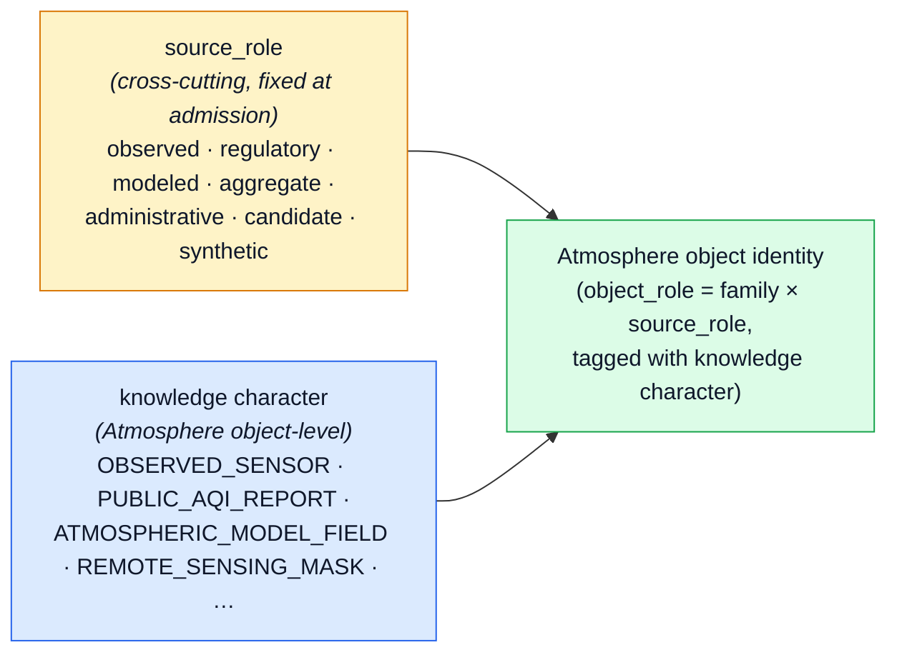
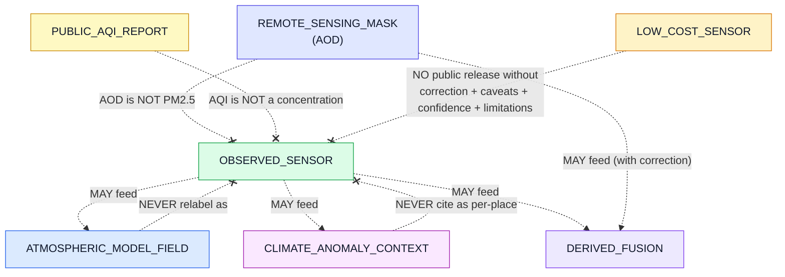

<!-- [KFM_META_BLOCK_V2]
doc_id: kfm://doc/domains/atmosphere/knowledge-characters
title: Atmosphere — Knowledge Characters
type: standard
version: v1
status: draft
owners: DOM-AIR steward + Docs steward (PLACEHOLDER — NEEDS VERIFICATION)
created: 2026-05-29
updated: 2026-05-29
policy_label: public
related:
  - docs/domains/atmosphere/README.md            # PROPOSED — NEEDS VERIFICATION
  - docs/domains/atmosphere/IDENTITY_MODEL.md     # companion — identity view
  - docs/domains/atmosphere/FILE_SYSTEM_PLAN.md   # companion — placement view
  - docs/domains/atmosphere/EXPANSION_BACKLOG.md  # companion — candidate register
  - docs/domains/atmosphere/SOURCES.md            # PROPOSED — NEEDS VERIFICATION
  - docs/doctrine/directory-rules.md              # CONFIRMED — this project
  - docs/adr/ADR-0001-schema-home.md              # CONFIRMED — cited by Directory Rules
  - ai-build-operating-contract.md                # CONFIRMED — operating contract
tags: [kfm, atmosphere, air, knowledge-character, source-role, anti-collapse, governance, doctrine]
notes:
  # The 12 knowledge-character terms and the "constrained by source role, evidence, time, and release state" definition pattern are CONFIRMED ubiquitous language (Atlas v1.1 Ch. 11 §C).
  # Plain-language glosses in this doc are INFERRED — the Atlas gives every term the same boilerplate definition; distinct prose meanings are not in the source.
  # The canonical knowledge-character ENUM VALUES are an open question (Atlas KFM-P1-IDEA-0051) — registry placement is ADR-class (ADR-S-03).
  # This doc is the registry referenced by the four sibling Atmosphere docs (variously as KNOWLEDGE_CHARACTERS.md / KNOWLEDGE_CHARACTER_REGISTRY.md — see §13 OQ).
  # CONTRACT_VERSION = "3.0.0" (doctrine-adjacent doc).
  # Meta Block v2 rule: no nested HTML comments inside this block; '#' annotations only.
[/KFM_META_BLOCK_V2] -->

# Atmosphere — Knowledge Characters

> **The controlled vocabulary that tags every Atmosphere object with *what kind of knowledge it is* — and the anti-collapse rule that forbids one kind from masquerading as another.**

[](#) [](#) [](#) [](#) [](#) [](#) [](#)

**Status:** Draft · **Owners:** DOM-AIR steward + Docs steward *(PLACEHOLDER — NEEDS VERIFICATION)* · **Updated:** 2026-05-29 · **Contract:** `CONTRACT_VERSION = "3.0.0"`

> [!IMPORTANT]
> **Knowledge character is a first-class, immutable identity attribute — not a display tag.** Every Atmosphere object carries one knowledge character; it participates in `object_role` for identity composition (see [`IDENTITY_MODEL.md`](./IDENTITY_MODEL.md) §3, §5); it is set at admission; and it **cannot be edited in place**. Re-characterizing a record produces a *new* identity with a `CorrectionNotice`, never a mutation. Collapsing one knowledge character into another is a publication-blocking **DENY** condition and an AI-surface **ABSTAIN** condition.

---

<a id="contents"></a>

## Contents

1. [Scope and audience](#1-scope-and-audience)
2. [What "knowledge character" means](#2-what-knowledge-character-means)
3. [Doctrinal anchors](#3-doctrinal-anchors)
4. [The twelve Atmosphere knowledge characters](#4-the-twelve-atmosphere-knowledge-characters)
5. [Knowledge character vs. source role](#5-knowledge-character-vs-source-role)
6. [The anti-collapse rule](#6-the-anti-collapse-rule)
7. [Knowledge character through the lifecycle](#7-knowledge-character-through-the-lifecycle)
8. [Registry shape (proposed)](#8-registry-shape-proposed)
9. [Validators and deny tests](#9-validators-and-deny-tests)
10. [Object family → knowledge character map](#10-object-family--knowledge-character-map)
11. [UI, API, and AI-surface exposure](#11-ui-api-and-ai-surface-exposure)
12. [Anti-patterns](#12-anti-patterns)
13. [Open questions and verification backlog](#13-open-questions-and-verification-backlog)
14. [Changelog](#14-changelog)
15. [Definition of done](#15-definition-of-done)
16. [Related docs](#16-related-docs)
17. [Appendices](#17-appendices)

---

## 1. Scope and audience

This document is the **knowledge-character registry** for the Atmosphere / Air domain. It enumerates the controlled vocabulary of knowledge characters the domain recognizes, defines the rule that keeps them from collapsing into one another, and specifies where the registry, its validators, and its enforcement live.

It is **not** a schema and **not** a source catalog. Field-level shape lives in `schemas/contracts/v1/domains/atmosphere/`; object meaning lives in `contracts/domains/atmosphere/`; source identity and rights live in `data/registry/sources/atmosphere/`. This document is the *vocabulary contract* those layers must agree on. *(Placement per Directory Rules §12; all paths PROPOSED — NEEDS VERIFICATION.)*

**Primary readers:** atmosphere data stewards, schema authors, policy authors, validator authors, release stewards, AI-receipt reviewers.
**Secondary readers:** anyone consuming Atmosphere `EvidenceBundle`s or building cross-lane joins where a knowledge character must be preserved across the boundary.

> [!NOTE]
> **Companion documents.** This registry is one of five Atmosphere lane docs. Its siblings are [`IDENTITY_MODEL.md`](./IDENTITY_MODEL.md) (what makes two objects the same thing), [`FILE_SYSTEM_PLAN.md`](./FILE_SYSTEM_PLAN.md) (where files live), [`EXPANSION_BACKLOG.md`](./EXPANSION_BACKLOG.md) (candidate register), and [`EXPANSION_PLAN.md`](./EXPANSION_PLAN.md) (sequenced roadmap). The identity model *uses* this vocabulary; this doc *defines* it.

[Back to top ↑](#contents)

---

## 2. What "knowledge character" means

**Knowledge character** is the Atmosphere domain's term for *what epistemic kind a record is* — whether it is a direct sensor reading, a regulatory determination, a model output, an aggregate, a satellite retrieval, an advisory, and so on. The Atlas defines the term and each of its values with one consistent constraint:

> A knowledge character "is used inside this domain with meaning constrained by **source role, evidence, time, and release state**." — Atlas v1.1 Ch. 11 §C **(CONFIRMED term / PROPOSED field realization)**

The domain's one-line purpose (Atlas §11.A) is built directly on these characters: to *"govern air observations, AQI reports, regulatory archives, low-cost sensors, model fields, remote-sensing masks, climate/anomaly context, fusion products, meteorological support, advisories, and public-safe products."* **(CONFIRMED.)**

> [!IMPORTANT]
> **Why it exists.** Atmospheric data is uniquely prone to authority collapse: an AQI index *looks* like a concentration, a satellite AOD raster *looks* like a ground PM2.5 field, a model forecast *looks* like an observation, and a county climate normal *looks* like a station reading. Knowledge character is the structural guard that keeps measurements, predictions, legal designations, and interpretations from being silently interchanged. *(CONFIRMED rationale — Atlas KFM-P1-IDEA-0051: "Prevents authority collapse between measurements, predictions, legal designations, and interpretations.")*

[Back to top ↑](#contents)

---

## 3. Doctrinal anchors

| # | Anchor | What it gives this registry | Status |
|---|---|---|---|
| 1 | Atlas v1.1 Ch. 11 §C — Ubiquitous language | The 12 knowledge-character terms and the shared "constrained by source role, evidence, time, and release state" definition. | **CONFIRMED** term / **PROPOSED** field realization |
| 2 | Atlas v1.1 Ch. 11 §I — Sensitivity & publication posture | The atmosphere-specific denials: AQI ≠ concentration; AOD ≠ PM2.5; model ≠ observation; low-cost sensor needs caveats. | **CONFIRMED** doctrine |
| 3 | Atlas v1.1 §24.1 / §24.13 — Source-role anti-collapse register | Names Atmosphere as a lane where observed / regulatory / modeled / aggregate collapse is *acute*. | **CONFIRMED** doctrine |
| 4 | Atlas KFM-P1-IDEA-0051 — Knowledge-character labels | Establishes explicit labels for observed / modeled / regulatory / inferred / interpreted / fused / candidate data; flags the canonical enum as an open question. | **CONFIRMED** doctrine / enum **OPEN** |
| 5 | Atlas Ch. 11 §K, §N — Validator + verification backlog | Knowledge-character registry tests are a required, not-yet-verified validator. | **CONFIRMED** requirement / **NEEDS VERIFICATION** implementation |
| 6 | Directory Rules §12 — Domain Placement Law | This registry lives in the Atmosphere lane, never as a root folder. | **CONFIRMED** doctrine |
| 7 | Cite-or-abstain truth posture | A record whose knowledge character cannot be resolved fails closed (ABSTAIN → DENY). | **CONFIRMED** doctrine |

[Back to top ↑](#contents)

---

## 4. The twelve Atmosphere knowledge characters

The Atlas §11.C names twelve terms: the umbrella term **`Knowledge character`** plus eleven specific characters. **All twelve are CONFIRMED ubiquitous language with PROPOSED field realization.** The Atlas gives every term the *same* boilerplate definition, so the "Working gloss" column below is **INFERRED** — a plain-language reading provided for authors, not a verbatim source definition. The "Required guards" column is drawn from §11.I / §24.1 where the Atlas is explicit, and INFERRED otherwise.

> [!TIP]
> Authors: the **Working gloss** orients you; the **Required guards** are what a schema, policy, or validator must enforce. Where a guard is INFERRED, treat it as a proposal for the registry PR, not settled doctrine.

| # | Knowledge character | Working gloss *(INFERRED)* | Typical source role | Required guards |
|---|---|---|---|---|
| 0 | **`Knowledge character`** *(umbrella)* | The field itself: every Atmosphere object MUST carry exactly one knowledge character. | n/a | Closed enum; unknown / missing value fails closed. |
| 1 | **`OBSERVED_SENSOR`** | A direct instrument reading at a station or platform. | `observed` | Calibration / QA metadata; unit-normalization receipt; method (FRM / FEM / low-cost) where applicable. |
| 2 | **`PUBLIC_AQI_REPORT`** | An agency-published air-quality index report. | `regulatory` reporting | **AQI ≠ concentration**; carry category metadata + issuing authority + freshness badge. *(CONFIRMED guard — §11.I.)* |
| 3 | **`REGULATORY_ARCHIVE`** | An archived regulatory dataset or determination (e.g., AQS historical). | `regulatory` / `administrative` | Vintage tag; archive lineage; version-conflation denied. |
| 4 | **`LOW_COST_SENSOR`** | A consumer / community-grade sensor reading. | `observed` (low-cost) or `candidate` | **Public release requires correction + caveats + confidence + limitations.** *(CONFIRMED guard — §11.I.)* |
| 5 | **`ATMOSPHERIC_MODEL_FIELD`** | NWP, chemical-transport, or reanalysis model output. | `modeled` | **Never an observation**; model run-time + identity + ensemble caveat. *(CONFIRMED guard — §11.I.)* |
| 6 | **`REMOTE_SENSING_MASK`** | A satellite-derived raster / mask (smoke, fire, AOD). | `observed` (remote-sensing) | Retrieval algorithm + product version + uncertainty surface; **AOD ≠ PM2.5**. *(CONFIRMED guard — §11.I.)* |
| 7 | **`CLIMATE_ANOMALY_CONTEXT`** | A departure-from-baseline climate context. | `aggregate` | Baseline period + reference dataset; **never cite as a per-place event**; scenario ≠ observed. |
| 8 | **`DERIVED_FUSION`** | A multi-source blended product. | `modeled` / `synthetic` | Per-input lineage + per-input uncertainty + "derivative, not observation" label. |
| 9 | **`METEOROLOGICAL_CONTEXT`** | Supporting meteorology (boundary-layer height, mixing layer, etc.). | `observed` / `modeled` | Source-role label; not to be treated as the variable it forces. |
| 10 | **`ALERT_AND_ADVISORY_CONTEXT`** | Public advisory context. | `regulatory` issuance | **Never a substitute for the official alerting authority**; redirect + non-emergency disclaimer. *(Boundary with Hazards — §11.B.)* |
| 11 | **`NETWORK_AND_SITE_CONTEXT`** | Network / site metadata (rosters, equipment, siting class). | `administrative` | Operator + program + siting class; metadata-version window. |

> [!NOTE]
> **The enum is not yet canonical.** Atlas KFM-P1-IDEA-0051 records the open question *"What canonical enum values should KFM use for knowledge-character labels?"* The twelve terms above are CONFIRMED as the Atmosphere ubiquitous language, but the exact machine enum (string casing, whether the umbrella term is a field name vs. a value, how `LOW_COST_SENSOR` relates to the `candidate` source role) is **OPEN** and ADR-class. See §13 OQ-01.

[Back to top ↑](#contents)

---

## 5. Knowledge character vs. source role

Knowledge character and **source role** are related but distinct axes, and both participate in identity. The Atlas keeps `source_role` as the cross-cutting admission attribute (fixed at admission, frozen on the `SourceDescriptor`), while **knowledge character** is the Atmosphere-domain expression of that discipline at the object level.



| Axis | What it answers | Where it is set | Mutability |
|---|---|---|---|
| **`source_role`** | "What authority kind does the *source* represent?" | At source admission, on the `SourceDescriptor`. | Frozen; correction → new descriptor. |
| **knowledge character** | "What epistemic kind is *this object*?" | At object normalization (WORK), carried through PROCESSED → PUBLISHED. | Frozen; re-characterization → new identity + `CorrectionNotice`. |

> [!NOTE]
> The two axes usually correlate (an `OBSERVED_SENSOR` object comes from an `observed` source) but are not identical. A `REMOTE_SENSING_MASK` is epistemically a satellite retrieval even though its source role is `observed`; a `DERIVED_FUSION` blends inputs of several source roles into a single `modeled`/`synthetic` object. The mapping in the §4 "Typical source role" column is **INFERRED** guidance, not a one-to-one rule, and is gated by the source-role-vocabulary ADR (Atlas ADR-S-04).

[Back to top ↑](#contents)

---

## 6. The anti-collapse rule

The core rule has one sentence: **a knowledge character may feed another, but may never be relabeled as another.** Observed data may *feed* a model or an aggregate; a model may never be *relabeled* observed; an aggregate may never be *cited* as a per-place reading.



### 6.1 The four explicit Atmosphere denials *(CONFIRMED — Atlas §11.I, §11.K)*

| Denial | What it protects | Outcome |
|---|---|---|
| **AQI cited as concentration** | A `PUBLIC_AQI_REPORT` index is not a µg/m³ or ppb value. | DENY at publication; ABSTAIN at AI surface. |
| **AOD cited as PM2.5** | A `REMOTE_SENSING_MASK` (column-integrated optical depth) is not a near-surface mass concentration. | DENY at publication; ABSTAIN at AI surface. |
| **Model field cited as observation** | An `ATMOSPHERIC_MODEL_FIELD` (or fusion / forecast) is a derived product. | DENY at publication; ABSTAIN at AI surface. |
| **Low-cost sensor without caveat** | Public release of `LOW_COST_SENSOR` data requires correction, caveats, confidence, and limitations. | DENY at publication until caveat closure. |

> [!WARNING]
> **Re-characterization is a new identity, never a mutation.** If review concludes a record was mis-characterized (e.g., a value first tagged `OBSERVED_SENSOR` is actually a `DERIVED_FUSION`), the fix is a *new* object with a new `spec_hash`, linked by a `CorrectionNotice` — not an in-place edit. In-place editing breaks promotion idempotency, watcher change-detection, and rollback. *(See [`IDENTITY_MODEL.md`](./IDENTITY_MODEL.md) §5, §8.)*

[Back to top ↑](#contents)

---

## 7. Knowledge character through the lifecycle

Knowledge character is assigned during normalization and is **invariant** thereafter — promotion never upgrades a character.

| Stage | Knowledge-character handling |
|---|---|
| **RAW** | Source admitted with a `source_role` on its `SourceDescriptor`; the object's knowledge character is not yet computed but is *constrained* by the source role. |
| **WORK / QUARANTINE** | Knowledge character is assigned during normalization. A record whose character cannot be resolved, or that would require a forbidden collapse, is **held in QUARANTINE** with a reason. |
| **PROCESSED** | Knowledge character is frozen and participates in the object's `spec_hash`. `EvidenceRef` / `ValidationReport` emitted. |
| **CATALOG / TRIPLET** | The character is carried into the `EvidenceBundle` and any STAC / DCAT / PROV projection so downstream consumers can read it. |
| **PUBLISHED** | The character is surfaced in the `LayerManifest`, Evidence Drawer payload, and any Focus Mode answer. Promotion does **not** change it. |

> [!CAUTION]
> A pipeline that *assigns* `OBSERVED_SENSOR` to a model-derived field, or that *upgrades* `candidate` low-cost data to a public observation without caveat closure, is a lifecycle-skip / authority-collapse defect — denied at the trust membrane. *(Atlas §24.9.2 trust-membrane anti-patterns.)*

[Back to top ↑](#contents)

---

## 8. Registry shape (proposed)

The machine-readable registry is **PROPOSED**. Its placement (`data/registry/`, `control_plane/`, or a `schemas/.../`-adjacent home) is ADR-class per Directory Rules §2.4(5) — see Atlas ADR-S-03 and §13 OQ-02.

```text
# PROPOSED — shape illustrative only; field names and home NEEDS VERIFICATION.
knowledge_characters:
  - id: OBSERVED_SENSOR
    label: "Observed sensor reading"
    typical_source_role: observed
    required_guards: [calibration_metadata, unit_normalization_receipt]
    public_release: allowed
  - id: LOW_COST_SENSOR
    label: "Low-cost / community sensor reading"
    typical_source_role: [observed_low_cost, candidate]
    required_guards: [correction, caveats, confidence, limitations]
    public_release: denied_until_caveat_closure
  - id: PUBLIC_AQI_REPORT
    label: "Agency AQI report"
    typical_source_role: regulatory
    required_guards: [issuing_authority, category_metadata, freshness_badge]
    forbidden: [cite_as_concentration]
    public_release: allowed
  - id: ATMOSPHERIC_MODEL_FIELD
    label: "Model field (NWP / CTM / reanalysis)"
    typical_source_role: modeled
    required_guards: [model_identity, model_run_time, ensemble_caveat]
    forbidden: [cite_as_observation]
    public_release: allowed_with_label
  - id: REMOTE_SENSING_MASK
    label: "Satellite-derived raster / mask"
    typical_source_role: observed_remote_sensing
    required_guards: [retrieval_algorithm, product_version, uncertainty_surface]
    forbidden: [cite_as_pm25]
    public_release: allowed_with_label
  # … REGULATORY_ARCHIVE, CLIMATE_ANOMALY_CONTEXT, DERIVED_FUSION,
  #    METEOROLOGICAL_CONTEXT, ALERT_AND_ADVISORY_CONTEXT, NETWORK_AND_SITE_CONTEXT
```

> [!NOTE]
> Every key above is illustrative. The Atlas confirms the *terms* and the *four explicit guards* (§11.I); the field structure (`required_guards`, `forbidden`, `public_release`) is an **INFERRED** proposal for the registry PR. Do not treat this YAML as an emitted schema until a mounted-repo file confirms it.

[Back to top ↑](#contents)

---

## 9. Validators and deny tests

The Atlas §11.K names the validator family; the table below maps each to the knowledge-character property it protects. **All PROPOSED — NEEDS VERIFICATION** against `tools/validators/...`, `tests/domains/atmosphere/`, and `policy/domains/atmosphere/`.

| Validator / test | Protects | Status |
|---|---|---|
| `knowledge-character-registry-tests` | Every object carries exactly one valid character; unknown / missing fails closed. | `PROPOSED` `[DOM-AIR]` §K |
| `aqi-as-concentration-denial` | `PUBLIC_AQI_REPORT` cannot be cast as a concentration. | `PROPOSED` `[DOM-AIR]` §I |
| `aod-as-pm25-denial` | `REMOTE_SENSING_MASK` (AOD) cannot be republished as a PM2.5 field. | `PROPOSED` `[DOM-AIR]` §I |
| `model-as-observed-denial` | `ATMOSPHERIC_MODEL_FIELD` / forecast / fusion cannot be relabeled `OBSERVED_SENSOR`. | `PROPOSED` `[DOM-AIR]` §I |
| `low-cost-sensor-caveat-tests` | `LOW_COST_SENSOR` public release requires correction + caveats + confidence + limitations. | `PROPOSED` `[DOM-AIR]` §I |
| `aggregate-not-per-place-denial` | `CLIMATE_ANOMALY_CONTEXT` (aggregate) cannot be cited as a per-place reading. | `INFERRED` `[DOM-AIR]` |
| `derived-fusion-lineage-tests` | `DERIVED_FUSION` carries per-input lineage + uncertainty + derivative label. | `INFERRED` `[DOM-AIR]` |
| `advisory-not-alert-denial` | `ALERT_AND_ADVISORY_CONTEXT` never acts as the official alerting authority. | `INFERRED` `[DOM-AIR]` `[DOM-HAZ]` |
| `re-characterization-creates-new-identity` | Changing a character produces a new `spec_hash`, not an in-place edit. | `INFERRED` `[DOM-AIR]` |

> [!IMPORTANT]
> Per Directory Rules §13.5, validator *logic* lives in `tools/validators/<topic>/...` and is **called** by these tests — never authored inside the test files. Cross-domain checks (e.g., a shared smoke validator spanning Atmosphere × Hazards) use a non-domain segment, `tools/validators/smoke/`, not `tools/validators/domains/atmosphere/`.

[Back to top ↑](#contents)

---

## 10. Object family → knowledge character map

Each owned Atmosphere object family (Atlas §11.B) carries a default knowledge character. **The family→character mapping is INFERRED** from the §11.A purpose statement and the object definitions; confirm per-family in `contracts/domains/atmosphere/`.

| Object family | Default knowledge character *(INFERRED)* | Notes |
|---|---|---|
| `AirStation` | `NETWORK_AND_SITE_CONTEXT` (station) + `OBSERVED_SENSOR` (its readings) | Station metadata vs. readings differ in character. |
| `AirObservation` | `OBSERVED_SENSOR` or `LOW_COST_SENSOR` | Low-cost path requires caveat closure. |
| `PM2.5 Observation` | `OBSERVED_SENSOR` | Method (FRM/FEM/low-cost) recorded; never from AOD. |
| `Ozone Observation` | `OBSERVED_SENSOR` | Averaging window recorded. |
| `SmokeContext` *(shared w/ Hazards)* | `REMOTE_SENSING_MASK` / `ATMOSPHERIC_MODEL_FIELD` / `ALERT_AND_ADVISORY_CONTEXT` | Character depends on product (HMS analyst mask vs. HRRR-Smoke forecast). |
| `AODRaster` | `REMOTE_SENSING_MASK` | AOD ≠ PM2.5. |
| `Weather Station` | `NETWORK_AND_SITE_CONTEXT` | |
| `Weather Observation` | `OBSERVED_SENSOR` / `METEOROLOGICAL_CONTEXT` | |
| `WindField` | `ATMOSPHERIC_MODEL_FIELD` | Model run-time required. |
| `Precipitation Observation` | `OBSERVED_SENSOR` | Radar-derived → arguably `ATMOSPHERIC_MODEL_FIELD` (open — see IDENTITY_MODEL OQ-12). |
| `Temperature Observation` | `OBSERVED_SENSOR` / `METEOROLOGICAL_CONTEXT` | |
| `Climate Normal` | `CLIMATE_ANOMALY_CONTEXT` (baseline) | Aggregate; never per-place. |
| `Climate Anomaly` | `CLIMATE_ANOMALY_CONTEXT` | Derived from Climate Normal. |
| `Forecast Context` | `ATMOSPHERIC_MODEL_FIELD` / `METEOROLOGICAL_CONTEXT` | Valid time ≠ run time. |
| `Advisory Context` | `ALERT_AND_ADVISORY_CONTEXT` | Redirect to official authority; non-emergency disclaimer. |

> [!NOTE]
> `SmokeContext` appears in the owned-family list of **both** Atmosphere (Atlas §11.B) and Hazards (Atlas §12.B). This registry governs the Atmosphere projection; Hazards owns hazard-event truth. The shared-vs-projected decision is gated by the cross-lane join policy ADR (Atlas ADR-S-14).

[Back to top ↑](#contents)

---

## 11. UI, API, and AI-surface exposure

Knowledge character is not just an internal tag — doctrine requires it be **exposed** so users never have to infer it. *(Atlas KFM-P1-IDEA-0051: "Layer manifests, API envelopes, and Evidence Drawer payloads should expose knowledge character rather than leaving users to infer it.")*

| Surface | How knowledge character appears | Failure mode if omitted |
|---|---|---|
| `LayerManifest` | A declared character per layer. | A model layer renders indistinguishably from an observation layer. |
| Governed-API `DecisionEnvelope` | Carried on the answer payload. | The consumer cannot tell a forecast from a reading. |
| Evidence Drawer | A visible badge alongside source role, freshness, citation. | The renderer becomes the implied authority. |
| Focus Mode answer + `AIReceipt` | The character is stated; AI **ABSTAINS** if it cannot resolve one. | Uncited prose collapses model/observation distinction. |

[Back to top ↑](#contents)

---

## 12. Anti-patterns

| Anti-pattern | Consequence | Atmosphere example |
|---|---|---|
| Missing / unknown knowledge character | Object fails closed; cannot promote | A normalized record with no character set reaching PROCESSED |
| Relabeling model as observed | Trust-membrane DENY collapses | HRRR-Smoke surface field tagged `OBSERVED_SENSOR` |
| AOD tagged / cited as PM2.5 | Misleading exposure claim | An `AODRaster` recolored and labeled a PM2.5 layer |
| AQI pushed into a concentration field | Downstream risk math silently wrong | A `PUBLIC_AQI_REPORT` value stored as `PM25Observation.value` |
| Low-cost sensor published raw | Uncalibrated values shown as authoritative | A PurpleAir tile with no correction / confidence / limitations |
| Aggregate cited per place | County summary read as a station reading | A `CLIMATE_ANOMALY_CONTEXT` value at a centroid treated as an observation |
| Fusion presented as observation | Derivative becomes truth | A `DERIVED_FUSION` blend served without lineage or derivative label |
| Advisory acting as alert authority | KFM mistaken for an emergency authority | An `ALERT_AND_ADVISORY_CONTEXT` layer issuing life-safety instructions |
| In-place re-characterization | Watcher / rollback break | Editing an existing object's character instead of emitting a new identity |

[Back to top ↑](#contents)

---

## 13. Open questions and verification backlog

| # | Item | Status | What would settle it |
|---|---|---|---|
| OQ-01 | Canonical knowledge-character **enum values** (casing, umbrella-term handling, `LOW_COST_SENSOR` vs. `candidate` relationship). | **OPEN** *(Atlas KFM-P1-IDEA-0051; gated by ADR-S-04)* | An accepted enum ADR + mounted registry. |
| OQ-02 | Registry **home** — `data/registry/`, `control_plane/`, or schema-adjacent. | **OPEN** *(ADR-class per §2.4(5); Atlas ADR-S-03)* | Placement ADR + mounted file. |
| OQ-03 | Per-family default knowledge character (the §10 map). | **NEEDS VERIFICATION** | `contracts/domains/atmosphere/` per-family declarations. |
| OQ-04 | Exact `required_guards` / `forbidden` field shape for the registry. | **NEEDS VERIFICATION** | Mounted registry schema + golden fixtures. |
| OQ-05 | Validator names and presence (the §9 list). | **NEEDS VERIFICATION** | `tools/validators/` + `tests/domains/atmosphere/` inspection. |
| OQ-06 | `SmokeContext` shared-vs-projected modeling between Atmosphere and Hazards. | **OPEN** *(ADR-S-14)* | Cross-lane join policy ADR. |
| OQ-07 | Radar-derived `Precipitation Observation` character (`OBSERVED_SENSOR` vs. `ATMOSPHERIC_MODEL_FIELD`). | **OPEN** | Atmosphere contract or ADR (mirrors IDENTITY_MODEL OQ-12). |
| OQ-08 | **Filename reconciliation** — sibling docs reference this file as both `KNOWLEDGE_CHARACTERS.md` and `KNOWLEDGE_CHARACTER_REGISTRY.md`. | **NEEDS VERIFICATION** | Pick one canonical filename; update the four sibling docs + a single drift entry. |
| OQ-09 | `CODEOWNERS` for this file and the Atmosphere lane. | **NEEDS VERIFICATION** | `.github/CODEOWNERS` inspection. |

> [!NOTE]
> **Filename note (OQ-08).** This document is delivered as `KNOWLEDGE_CHARACTERS.md` (the name requested). The companion `FILE_SYSTEM_PLAN.md` and `IDENTITY_MODEL.md` reference a `KNOWLEDGE_CHARACTER_REGISTRY.md`. These are the **same artifact**; the naming must be unified by ADR or rename PR and recorded in `docs/registers/DRIFT_REGISTER.md` rather than maintained as two files.

[Back to top ↑](#contents)

---

## 14. Changelog

| Change | Type (per contract §37) | Reason |
|---|---|---|
| Initial draft created | new | Requested companion to the four prior Atmosphere lane docs; referenced as PROPOSED across all of them. |
| Grounded the 12 terms in Atlas §11.C verbatim; labeled all plain-language glosses `INFERRED` | clarification | The Atlas gives every term the same boilerplate; distinct prose meanings are not in the source. |
| Flagged the canonical enum as OPEN (KFM-P1-IDEA-0051) and registry home as ADR-class (ADR-S-03) | gap closure | Both are genuine open ADR items, not settled. |
| Flagged `SmokeContext` shared with Hazards; radar-precipitation character open | clarification | Consistent with the sibling docs' reconciliations. |
| Recorded filename reconciliation (KNOWLEDGE_CHARACTERS vs. _REGISTRY) as OQ-08 | reconciliation | Sibling docs use both names for one artifact. |

> **Backward compatibility.** New file; no anchors to preserve. Cross-links point at the established sibling docs.

[Back to top ↑](#contents)

---

## 15. Definition of done

This document is done enough to enter the repository when:

- it is placed according to Directory Rules (`docs/domains/atmosphere/KNOWLEDGE_CHARACTERS.md`, `PROPOSED` per §12);
- the filename is reconciled with the sibling docs (OQ-08) and a single drift entry recorded;
- a DOM-AIR steward and a docs steward review it; `CODEOWNERS` confirmed (OQ-09);
- the canonical enum (OQ-01) and registry home (OQ-02) are settled by ADR and the machine registry is mounted;
- it is linked from `docs/domains/atmosphere/README.md` and cross-links the identity model, file-system plan, backlog, and expansion plan;
- the §9 validators exist in `tools/validators/` and are exercised by `tests/domains/atmosphere/`;
- the `GENERATED_RECEIPT.json` planned for this artifact is wired into CI;
- future changes follow the operating contract's §37 lifecycle.

[Back to top ↑](#contents)

---

## 16. Related docs

- [`docs/domains/atmosphere/README.md`](./README.md) — Atmosphere lane overview *(PROPOSED)*
- [`docs/domains/atmosphere/IDENTITY_MODEL.md`](./IDENTITY_MODEL.md) — identity view; *uses* this vocabulary *(companion)*
- [`docs/domains/atmosphere/FILE_SYSTEM_PLAN.md`](./FILE_SYSTEM_PLAN.md) — placement view *(companion)*
- [`docs/domains/atmosphere/EXPANSION_BACKLOG.md`](./EXPANSION_BACKLOG.md) — candidate register *(companion)*
- [`docs/domains/atmosphere/EXPANSION_PLAN.md`](./EXPANSION_PLAN.md) — sequenced roadmap *(companion)*
- [`docs/domains/atmosphere/SOURCES.md`](./SOURCES.md) — source families and descriptors *(PROPOSED — TODO)*
- [`docs/doctrine/directory-rules.md`](../../doctrine/directory-rules.md) — Directory Rules §12, §13.5 *(CONFIRMED — this project)*
- [`docs/adr/ADR-0001-schema-home.md`](../../adr/ADR-0001-schema-home.md) — default schema home *(CONFIRMED)*
- [`ai-build-operating-contract.md`](../../../ai-build-operating-contract.md) — operating contract *(CONFIRMED — `CONTRACT_VERSION = "3.0.0"`)*
- `policy/domains/atmosphere/` — admissibility / anti-collapse bundles *(PROPOSED — NEEDS VERIFICATION)*
- `tests/domains/atmosphere/` + `fixtures/domains/atmosphere/` — validator tests + fixtures *(PROPOSED — NEEDS VERIFICATION)*

External (doctrinal) — names only; not links:

- `[DOM-AIR]` — Atmosphere / Air dossier (Atlas Ch. 11) *(dossier PDF not in this session's project knowledge — NEEDS VERIFICATION when accessible)*
- `[ENCY]` — Domain & Capability Encyclopedia §7.9
- `[DIRRULES]` — Directory Rules (Domain Placement Law §12)
- `[GAI]` — Governed AI doctrine

---

**Last updated:** 2026-05-29 · **Version:** v1 (draft) · **Status:** draft · **Contract:** `CONTRACT_VERSION = "3.0.0"` · **Doctrine:** CONFIRMED · **Implementation:** PROPOSED

[Back to top ↑](#contents)
