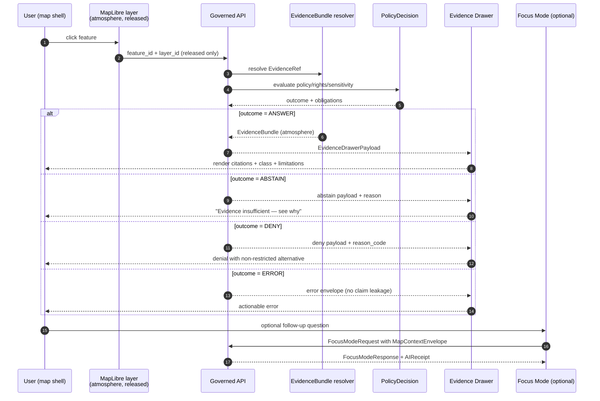
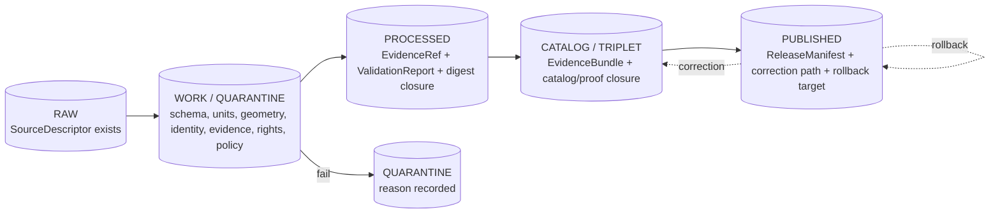

<!-- [KFM_META_BLOCK_V2]
doc_id: kfm://doc/atmosphere/map-ui-contracts
title: Atmosphere/Air — Map & UI Contracts
type: standard
version: v0.1
status: draft
owners: <atmosphere-air domain steward> + <map-ui contract steward>  # PLACEHOLDER — assign in repo
created: 2026-05-16
updated: 2026-05-29
policy_label: public
related:
  - docs/domains/atmosphere/README.md            # PROPOSED — verify presence
  - docs/domains/atmosphere/KNOWLEDGE_CHARACTERS.md   # companion — knowledge-character registry
  - docs/domains/atmosphere/IDENTITY_MODEL.md         # companion — identity view
  - docs/domains/atmosphere/FILE_SYSTEM_PLAN.md       # companion — placement view
  - docs/domains/atmosphere/EXPANSION_BACKLOG.md      # companion — candidate register
  - docs/architecture/map-shell.md               # PROPOSED — verify presence
  - docs/architecture/governed-api.md            # PROPOSED — verify presence
  - docs/adr/ADR-0001-schema-home.md             # CONFIRMED doctrine; verify file presence
  - ai-build-operating-contract.md               # CONFIRMED — operating contract
  - schemas/contracts/v1/map/                    # PROPOSED — verify presence per ADR-0001
  - schemas/contracts/v1/ui/                     # PROPOSED — verify presence per ADR-0001
  - schemas/contracts/v1/ai/                     # PROPOSED — verify presence per ADR-0001
tags: [kfm, atmosphere, air, map, ui, contracts, evidence-drawer, focus-mode, knowledge-character]
notes:
  # Lane name "atmosphere/" CONFIRMED from directory-rules.md §12 (Domain Placement Law uniform list).
  # Lane-name / schema-home conflict with Atlas crosswalk "air/" surfaced in §14 — RESOLVED in favor of atmosphere/ + schemas/contracts/v1/domains/atmosphere/ per Directory Rules §2.1 authority order (Directory Rules > Atlas crosswalks).
  # All twelve map/UI contracts are CONFIRMED Master MapLibre objects ([MAP-MASTER]); atmosphere-specific field additions are PROPOSED.
  # CONTRACT_VERSION = "3.0.0" (doctrine-adjacent doc).
  # Meta Block v2 rule: no nested HTML comments inside this block; '#' annotations only.
[/KFM_META_BLOCK_V2] -->

# Atmosphere/Air — Map & UI Contracts

> Defines how Atmosphere/Air objects bind to the KFM map shell, Evidence Drawer, Focus Mode, and release manifests — and the knowledge-character discipline that public surfaces must enforce before render.

<!-- Badges: placeholders until CI/owners are confirmed in the mounted repo -->


**Status:** draft · **Owners:** `<atmosphere-air steward>` + `<map-ui contract steward>` *(placeholder — assign)* · **Updated:** 2026-05-29 · **Contract:** `CONTRACT_VERSION = "3.0.0"`

---

## Contents

1. [Scope and boundary](#1-scope-and-boundary)
2. [Authority hierarchy and source posture](#2-authority-hierarchy-and-source-posture)
3. [Contract surface (KFM map/UI object families)](#3-contract-surface-kfm-mapui-object-families)
4. [Atmosphere/Air layer families and knowledge-character labels](#4-atmosphereair-layer-families-and-knowledge-character-labels)
5. [LayerManifest atmosphere-specific expectations](#5-layermanifest-atmosphere-specific-expectations)
6. [Trust-visible state, badges, and freshness](#6-trust-visible-state-badges-and-freshness)
7. [Click resolution and the Evidence Drawer](#7-click-resolution-and-the-evidence-drawer)
8. [Focus Mode and MapContextEnvelope for atmosphere](#8-focus-mode-and-mapcontextenvelope-for-atmosphere)
9. [Finite outcomes on public map surfaces](#9-finite-outcomes-on-public-map-surfaces)
10. [Lifecycle, promotion gates, and rollback](#10-lifecycle-promotion-gates-and-rollback)
11. [Anti-collapse rules — knowledge-character denials](#11-anti-collapse-rules--knowledge-character-denials)
12. [Cross-lane relations](#12-cross-lane-relations)
13. [Validators, tests, fixtures](#13-validators-tests-fixtures)
14. [Open questions and verification backlog](#14-open-questions-and-verification-backlog)
15. [Changelog](#15-changelog)
16. [Definition of done](#16-definition-of-done)
17. [Related docs](#17-related-docs)

---

## 1. Scope and boundary

> [!IMPORTANT]
> This document is a **map/UI contract specification** for the Atmosphere/Air lane. It governs how atmospheric objects bind to KFM's released map artifacts and trust-visible UI surfaces. It is not an emergency-alert system, an advisory authority, or a substitute for the official sources it carries.

**In scope.** CONFIRMED doctrine / PROPOSED implementation:

- How Atmosphere/Air objects map onto the KFM `LayerManifest`, `StyleManifest`, `TileArtifactManifest`, `MapReleaseManifest`, `EvidenceDrawerPayload`, `MapContextEnvelope`, `FocusModeRequest/Response`, and `AIReceipt` contracts.
- Required knowledge-character labels on every air-quality, smoke, model-field, and remote-sensing layer.
- Trust-visible state expectations (freshness, stale/degraded, redaction posture, denial reasons).
- Finite-outcome semantics on every governed surface that touches an atmosphere layer.
- Cross-lane boundaries with Hazards, Hydrology, Agriculture, and biodiversity domains.

**Out of scope.** CONFIRMED / PROPOSED:

- **Not** an emergency-alert authority; KFM never replaces NOAA/NWS, KDHE, AirNow, or other official advisory issuers. [DOM-AIR][ENCY]
- **Not** a source-onboarding spec — that lives with the source descriptor catalogs, not here.
- **Not** a renderer build guide — MapLibre toolchain, style authoring, and tile generation are owned by the map shell and packages docs.
- **Not** a schema definition — JSON Schemas live under `schemas/contracts/v1/...` per ADR-0001; this doc describes intent and atmosphere-specific bindings.
- **Not** the knowledge-character vocabulary definition — that is the companion [`KNOWLEDGE_CHARACTERS.md`](./KNOWLEDGE_CHARACTERS.md); this doc *consumes* it and binds it to UI surfaces.

> [!NOTE]
> **Companion documents.** This is the *map/UI binding* view of the Atmosphere lane. Its siblings are [`KNOWLEDGE_CHARACTERS.md`](./KNOWLEDGE_CHARACTERS.md) (the vocabulary this doc renders), [`IDENTITY_MODEL.md`](./IDENTITY_MODEL.md) (what makes two objects the same thing), [`FILE_SYSTEM_PLAN.md`](./FILE_SYSTEM_PLAN.md) (where files live), [`EXPANSION_BACKLOG.md`](./EXPANSION_BACKLOG.md), and [`EXPANSION_PLAN.md`](./EXPANSION_PLAN.md).

[↑ Back to top](#contents)

---

## 2. Authority hierarchy and source posture

> [!NOTE]
> The Atmosphere/Air domain is doctrinally subordinate to (a) KFM trust-membrane invariants, (b) Directory Rules, and (c) the Master MapLibre operating architecture for renderer behavior. This file refines map/UI binding details for atmosphere only; it never overrides upstream doctrine.

CONFIRMED authority hierarchy for atmosphere map/UI surfaces:

| # | Authority | What it owns | Citation |
|---|---|---|---|
| 0 | **`ai-build-operating-contract.md` v3.0** | Canonical operating law; truth labels; invariants. `CONTRACT_VERSION = "3.0.0"`. | (operating contract) |
| 1 | **Directory Rules** | Responsibility-root placement; lane = `atmosphere/`. | [DIRRULES] §5, §12 |
| 2 | **DOM-AIR dossier + Encyclopedia §7.9** | Atmosphere/Air knowledge-character discipline; object families; source roles. | [DOM-AIR][ENCY] |
| 3 | **Master MapLibre architecture / UIAI-MAP** | Renderer boundary; Evidence Drawer; Focus Mode; finite outcomes. | [MAP-MASTER][UIAI-MAP] |
| 4 | **Governed AI dossier** | AIReceipt, citation validation, cite-or-abstain posture. | [GAI] |
| 5 | **This file** | Atmosphere-specific binding rules on the contract surfaces above. | (this doc) |

**Source-role posture (CONFIRMED / PROPOSED).** Atmosphere/Air source families include EPA AQS-like archive, AirNow / agency reporting, OpenAQ-like aggregators, NOAA/NWS, Kansas Mesonet, CAMS / ECMWF-family model fields, HRRR-Smoke, HMS smoke, GOES/ABI AOD, VIIRS fire/hotspot, and PurpleAir-class low-cost sensors with EPA correction. Each family is admitted with a single source role — `authority`, `observation`, `context`, or `model` — and **roles are never silently collapsed** at the UI layer. [DOM-AIR][ENCY]

> [!NOTE]
> **Source-role vocabulary is ADR-class.** The Atlas records the Atmosphere source-role string as a set (`authority / observation / context / model`) with rights `NEEDS VERIFICATION`. The canonical enum is governed by Atlas ADR-S-04; the four-value set used here is the Atlas wording but the frozen enum is not yet pinned. This binds to the same `source_role` discipline used in the companion [`IDENTITY_MODEL.md`](./IDENTITY_MODEL.md) §5 and [`KNOWLEDGE_CHARACTERS.md`](./KNOWLEDGE_CHARACTERS.md) §5.

[↑ Back to top](#contents)

---

## 3. Contract surface (KFM map/UI object families)

CONFIRMED doctrine: every atmosphere layer renders through this fixed set of contracts — all twelve are confirmed Master MapLibre objects with the field roles shown. PROPOSED implementation: all schema-home paths below resolve under `schemas/contracts/v1/...` per ADR-0001 and remain UNKNOWN until verified in a mounted repo.

| Contract | Role in atmosphere map UI | Required atmosphere bindings | PROPOSED schema home |
|---|---|---|---|
| `SourceDescriptor` | Admits an air/weather/smoke source with role, rights, sensitivity, cadence, limitations. | `source_role` ∈ {authority, observation, context, model}; `cadence`; `rights_status`. | `schemas/contracts/v1/sources/source_descriptor.schema.json` |
| `LayerManifest` | Binds a UI layer to source/evidence/policy/release. | `evidence_ref_field`; `temporal_fields`; `policy_label`; `release_state`; **atmosphere-specific** knowledge-character label (§5). | `schemas/contracts/v1/map/layer_manifest.schema.json` |
| `StyleManifest` | Versioned style identity, sprites, glyphs, digest. | Style validation; only references released atmosphere `layer_ids`. | `schemas/contracts/v1/map/style_manifest.schema.json` |
| `TileArtifactManifest` | Binds PMTiles/MVT/MLT/COG bytes to digest + range/CORS. | Atmosphere rasters (e.g., AOD, model fields) carry COG layout + NODATA + CRS proof. | `schemas/contracts/v1/map/tile_artifact_manifest.schema.json` |
| `MapReleaseManifest` | Complete published map release. | Atmosphere layers grouped by knowledge-character class; `rollback_target` required. | `schemas/contracts/v1/map/map_release_manifest.schema.json` |
| `EvidenceBundle` | Truth-bearing evidence object. | `domain: "atmosphere"`; `observation_basis`; `units`; `temporal_basis`. | `schemas/contracts/v1/evidence/evidence_bundle.schema.json` |
| `EvidenceDrawerPayload` | Click-resolution payload. | Atmosphere-class limitations (e.g., "low-cost sensor; EPA Barkjohn correction applied"). | `schemas/contracts/v1/ui/evidence_drawer_payload.schema.json` |
| `MapContextEnvelope` | Bounded map context for Focus Mode (released context only). | Includes `visible_layers` with knowledge-character class so Focus Mode never crosses classes silently. | `schemas/contracts/v1/ui/map_context_envelope.schema.json` |
| `FocusModeRequest` / `Response` | Governed AI question/answer over atmosphere context. | Finite outcome required; atmosphere-specific abstain reasons enumerated. | `schemas/contracts/v1/ai/focus_mode_*.schema.json` |
| `AIReceipt` | Audit trail for model execution. | Records evidence used + atmosphere policy decisions. | `schemas/contracts/v1/ai/ai_receipt.schema.json` |
| `CitationValidationReport` | Cite-or-abstain enforcement. | Atmosphere AI answers fail closed when citation refs don't resolve. | `schemas/contracts/v1/evidence/citation_validation_report.schema.json` |
| `PolicyDecision` | Atmosphere policy verdict and obligations. | Carries obligations like *show freshness warning*, *show source-role label*, *generalize geometry*. | `schemas/contracts/v1/policy/policy_decision.schema.json` |
| `PromotionDecision` | Governed transition to PUBLISHED. | Includes atmosphere-specific gates (units, AQI vs. concentration, model vs. observed). | `schemas/contracts/v1/policy/promotion_decision.schema.json` |

> [!NOTE]
> Contract field lists above reflect the Master MapLibre object-map (**CONFIRMED doctrine** from [MAP-MASTER]: `LayerManifest` carries layer_id, title, source refs, source-layer, geometry class, evidence dependency, policy class, stale rules; `MapContextEnvelope` carries camera, bounds, time, visible layers, clicked feature, **released context only**; `MapReleaseManifest` carries the rollback target and no-file-move promotion). Atmosphere-specific bindings are **PROPOSED** additions; all field-level additions require schema and ADR confirmation in the mounted repo. The atmosphere `Runtime Response Envelope`/`FocusModeResponse` pairing matches the per-domain J-table pattern (`AtmosphereAirDecisionEnvelope`, route UNKNOWN) used across the Atlas.

[↑ Back to top](#contents)

---

## 4. Atmosphere/Air layer families and knowledge-character labels

CONFIRMED doctrine: atmosphere layers split into **non-interchangeable knowledge-character classes**. PROPOSED implementation: each class becomes a `LayerManifest.knowledge_character` value (or equivalent enum); public surfaces must display the label and never collapse classes. [DOM-AIR][ENCY]

> [!NOTE]
> **Canonical vocabulary lives in the companion.** The class labels below are the *map-UI rendering* of the twelve knowledge characters defined in [`KNOWLEDGE_CHARACTERS.md` §4](./KNOWLEDGE_CHARACTERS.md). The UI label strings here are a presentation layer over that vocabulary; the canonical enum is OPEN (Atlas KFM-P1-IDEA-0051) and must be reconciled with the registry rather than independently invented.

```mermaid
flowchart LR
  subgraph CLASS["Atmosphere/Air knowledge-character classes (PROPOSED)"]
    OBS["observed_sensor<br/>(regulatory & reference monitors)"]
    AQI["public_aqi_report<br/>(AirNow-class index)"]
    REG["regulatory_archive<br/>(EPA AQS-class QA/QC)"]
    LCS["low_cost_sensor<br/>(PurpleAir-class; correction applied)"]
    MODEL["model_field<br/>(HRRR-Smoke, CAMS, forecast)"]
    EO["remote_sensing<br/>(GOES/ABI AOD, VIIRS hotspot, HMS mask)"]
    CLIM["climate_context<br/>(normals, anomalies)"]
    FUSION["derived_fusion<br/>(multi-source synthesis)"]
    ADV["advisory_context<br/>(redirect to official issuer)"]
  end
  CLASS --> LM["LayerManifest<br/>knowledge_character label"]
  LM --> DRAWER["Evidence Drawer<br/>shows class + limitations"]
  LM --> FOCUS["Focus Mode<br/>refuses cross-class claims w/o evidence"]
```



| Class | Map family | Knowledge-character label | Source-role binding | Sensitivity default |
|---|---|---|---|---|
| `observed_sensor` | Air-quality stations, weather stations, mesonet points. | "Observation" | observation | public |
| `public_aqi_report` | Public AQI report layers. | "Public AQI report (index, not concentration)" | authority / context | public |
| `regulatory_archive` | EPA AQS-class regulatory archive. | "Regulatory archive (QA/QC)" | authority | public |
| `low_cost_sensor` | PurpleAir-class community sensors. | "Low-cost sensor — correction applied; see limitations" | observation (corrected) | public-with-caveat |
| `model_field` | HRRR-Smoke, CAMS, ECMWF forecasts. | "Model field — not an observation" | model | public-with-caveat |
| `remote_sensing` | GOES/ABI AOD, VIIRS, HMS smoke. | "Remote sensing — derivative; not in-situ" | observation (remote) | public-with-caveat |
| `climate_context` | Climate normals, anomalies. | "Climate context — long-record reference" | context | public |
| `derived_fusion` | Multi-source synthesis (e.g., PM2.5 fusion outputs). | "Derived fusion — uncertainty inherited" | derived | public-with-caveat |
| `advisory_context` | Advisory layer with redirect to official issuer. | "Advisory context — not a KFM-issued advisory" | context | public |

> [!NOTE]
> The map-UI uses **nine** rendering classes; the canonical vocabulary in [`KNOWLEDGE_CHARACTERS.md`](./KNOWLEDGE_CHARACTERS.md) names **eleven** characters (plus the umbrella). The mapping is many-to-one in places (e.g., `METEOROLOGICAL_CONTEXT` and `NETWORK_AND_SITE_CONTEXT` fold into `observed_sensor`/`climate_context` rendering). This collapse is a *presentation* choice and is `INFERRED` — confirm it does not erase a denial-bearing distinction. See §14 OQ-11.

> [!CAUTION]
> The label is **load-bearing UI state**, not decoration. A `model_field` layer that loses its class label and appears as a generic point measurement is a knowledge-character violation regardless of geometry correctness. CI must include a regression that asserts each atmosphere layer in a `MapReleaseManifest` carries a populated knowledge-character label. [PROPOSED]

[↑ Back to top](#contents)

---

## 5. LayerManifest atmosphere-specific expectations

PROPOSED additions to `LayerManifest` for atmosphere layers, layered on the CONFIRMED Master MapLibre field set (`layer_id`, `title`, `geometry_type`, `source_id`, `source_layer`, `evidence_ref_field`, `temporal_fields`, `policy_label`, `release_state`, stale rules):

| Field (PROPOSED) | Purpose | Example | Validator behavior |
|---|---|---|---|
| `knowledge_character` | Class label from §4 enum. | `"model_field"` | FAIL CLOSED if missing or unknown enum. |
| `parameter` | Pollutant / weather parameter. | `"PM2.5"`, `"O3"`, `"AOD550"`, `"wind_10m"` | FAIL CLOSED if missing on `observed_sensor` / `regulatory_archive` / `low_cost_sensor`. |
| `unit` | Reported unit (no implicit conversion). | `"µg/m³"`, `"ppb"`, `"dimensionless"` | FAIL CLOSED if missing for measurement parameters. |
| `correction_method` | Required for low-cost sensors. | `"EPA Barkjohn v1"` | FAIL CLOSED on `low_cost_sensor` without method. |
| `model_run_time` | Required for `model_field`. | ISO-8601 | FAIL CLOSED on `model_field` without run time. |
| `valid_time_window` | Validity period for model/forecast layers. | `[start, end]` ISO-8601 | FAIL CLOSED if absent on `model_field` / `advisory_context`. |
| `temporal_basis` | Aggregation basis. | `"hourly"`, `"daily_summary"`, `"24h_avg"` | FAIL CLOSED on regulatory/observed layers. |
| `source_role_label` | Display string echoing the source role. | `"observation"`, `"authority"`, `"model"`, `"context"` | FAIL CLOSED if not consistent with `SourceDescriptor.source_role`. |
| `freshness_policy` | Stale/degraded thresholds for this layer. | `{"warn_after_minutes": 90, "stale_after_minutes": 240}` | Used by §6 trust-visible state machine. |
| `redaction_profile` | Reference to redaction receipt if applicable. | `"kfm://redaction/<id>"` | FAIL CLOSED if `sensitivity != public` and no profile. |
| `advisory_redirect` | Required for `advisory_context`. | `{"issuer": "...", "url": "..."}` | FAIL CLOSED on `advisory_context` without redirect. |

> [!TIP]
> `temporal_fields` (CONFIRMED Master MapLibre field) on atmosphere layers must enumerate distinct **source time**, **observed time**, **valid time**, **retrieval time**, **release time**, and **correction time** where material. CONFIRMED doctrine: these times stay distinct on every atmosphere object — see [`IDENTITY_MODEL.md` §6](./IDENTITY_MODEL.md#6-temporal-discipline). [DOM-AIR §E][ENCY]

<details>
<summary><strong>Illustrative LayerManifest excerpt (PROPOSED; illustrative only)</strong></summary>

```json
{
  "object_type": "LayerManifest",
  "schema_version": "v1",
  "layer_id": "atmosphere.pm25.observed.airnow.hourly",
  "title": "PM2.5 — AirNow public report (hourly)",
  "geometry_type": "Point",
  "source_id": "<source_descriptor_id>",
  "source_layer": "pm25_airnow_hourly",
  "knowledge_character": "public_aqi_report",
  "parameter": "PM2.5",
  "unit": "µg/m³",
  "temporal_basis": "hourly",
  "source_role_label": "authority",
  "evidence_ref_field": "evidence_ref",
  "temporal_fields": {
    "observed_time": "observed_at",
    "valid_time": "valid_at",
    "retrieval_time": "retrieved_at",
    "release_time": "released_at"
  },
  "policy_label": "public",
  "release_state": "PUBLISHED",
  "freshness_policy": { "warn_after_minutes": 90, "stale_after_minutes": 240 }
}
```

This snippet is **illustrative only**. Field names and enum values are PROPOSED and must be confirmed against the actual `schemas/contracts/v1/map/layer_manifest.schema.json` in the mounted repo.

> Note: the example pairs `knowledge_character: "public_aqi_report"` with `parameter: "PM2.5"` and `unit: "µg/m³"`. A reviewer should confirm whether an AirNow PM2.5 hourly *report* is being rendered as a concentration (`observed_sensor`) or as a public index (`public_aqi_report`) — these are different knowledge characters with different denials (§11). The example deliberately surfaces that ambiguity; it is not a settled binding.
</details>

[↑ Back to top](#contents)

---

## 6. Trust-visible state, badges, and freshness

CONFIRMED doctrine (Master MapLibre): the MapLibre shell **must** show released layer state, stale/degraded badges, evidence resolution, denial/abstain reasons, and correction/rollback visibility — **without exposing raw watcher state, unreleased tile URLs, direct model output, or canonical/internal stores**. Atmosphere/Air refines this with class-aware badges.

### 6.1 Required trust-visible states per atmosphere class

| State | Triggered when | UI rendering | Click behavior |
|---|---|---|---|
| `fresh` | Within `freshness_policy.warn_after_minutes`. | Default badge. | Opens Evidence Drawer. |
| `warn` | Past `warn_after_minutes`, before `stale_after_minutes`. | Distinct warn badge; tooltip with last-update time. | Opens Evidence Drawer with freshness banner. |
| `stale` | Past `stale_after_minutes`. | Distinct stale badge; reduced visual emphasis. | Opens Evidence Drawer; Focus Mode flags as stale evidence. |
| `degraded_stream` | Source stream falling back to polling, sparse updates. | Stream-degraded badge. | Evidence Drawer notes streaming posture. |
| `correction_applied` | Low-cost sensor with correction. | Correction badge. | Evidence Drawer shows correction method + caveat. |
| `redacted_or_generalized` | Sensitivity transform applied. | Redaction badge with transform reason. | Evidence Drawer surfaces redaction receipt (without restricted geometry). |
| `quarantined_excluded` | AOD or other gate excluded this source from a fusion product. | Not rendered on public layer; appears only in steward views. | n/a on public surface. |

### 6.2 Anti-patterns

> [!WARNING]
> The following are **trust violations** regardless of technical correctness:
>
> - **Badge as proof substitute.** A badge that decorates a tile without resolving to a receipt or `EvidenceBundle`. [MAP-MASTER]
> - **Popup as Evidence Drawer substitute.** Popups may summarize; only the Evidence Drawer resolves evidence and trust state. [MAP-MASTER]
> - **Sensitive geometry hidden only by style.** Style toggling never substitutes for upstream redaction/generalization with a recorded receipt. *(CONFIRMED — Master MapLibre: "Sensitive geometry must be transformed before rendering, not hidden only by style.")*
> - **Visual sameness across knowledge-character classes.** `observed_sensor` and `model_field` must not render identically; the user must see they're different epistemic kinds. [DOM-AIR]
> - **Source-role mismatch in display.** A `model_field` layer must never be labeled or described as an observation. [DOM-AIR][ENCY]

[↑ Back to top](#contents)

---

## 7. Click resolution and the Evidence Drawer

CONFIRMED doctrine (Master MapLibre):
> *released layer → user click → governed API → EvidenceBundle → Evidence Drawer → Focus Mode answer / abstain / deny / error*

This is the only path. Public clients **never** read RAW, WORK, QUARANTINE, candidate, or canonical/internal stores — atmosphere included.



### 7.1 EvidenceDrawerPayload — atmosphere-specific surfaces

CONFIRMED Master MapLibre fields (`clicked feature`, `feature_id`, `evidence refs`, citations, source state, policy messages, correction links, plus run/prov IDs). Atmosphere PROPOSED additions:

- **Knowledge-character chip.** Class label from §4, rendered prominently.
- **Parameter + unit chip.** e.g., `PM2.5 · µg/m³` — never elided into a unitless number.
- **Source-role chip.** `observation` / `authority` / `model` / `context` — must agree with `SourceDescriptor.source_role`.
- **Temporal chip(s).** Distinguished `observed_time` / `valid_time` / `model_run_time` / `release_time` per class.
- **Correction chip.** For `low_cost_sensor`: correction method + version.
- **Stale / degraded chip.** From §6 state machine.
- **Limitations panel.** Required for `low_cost_sensor`, `model_field`, `remote_sensing`, `derived_fusion`. Free-text bounded by the layer's `EvidenceBundle.limitations`.
- **Advisory redirect.** For `advisory_context` only: link to the official issuer (NOAA/NWS, KDHE, AirNow, etc.); KFM never paraphrases the advisory.

[↑ Back to top](#contents)

---

## 8. Focus Mode and MapContextEnvelope for atmosphere

CONFIRMED doctrine (UIAI-MAP, GAI): Focus Mode is bounded — it answers, abstains, denies, or errors over **released atmosphere context only**. It never substitutes for evidence and never reaches RAW/WORK/QUARANTINE.

### 8.1 MapContextEnvelope rules

The envelope passed to Focus Mode must:

1. **Enumerate visible atmosphere layers with their knowledge-character class.** Focus Mode reasoning that crosses classes without explicit evidence is treated as ABSTAIN. [DOM-AIR §L][GAI]
2. **Carry only EvidenceRefs** — never raw features or restricted geometry. *(CONFIRMED — Master MapLibre: `MapContextEnvelope` carries "released context only".)*
3. **Include the time window** that the user has actually scoped (timeline state), not the model's preferred window.
4. **Include selected_features** as IDs only; evidence resolves through the governed API.
5. **Include freshness state** from §6 so the model can refuse to claim "current PM2.5" over stale evidence.

### 8.2 Atmosphere-specific abstain and deny patterns

CONFIRMED doctrine / PROPOSED enumeration of reason codes for atmosphere:

| Outcome | reason_code (PROPOSED) | When |
|---|---|---|
| ABSTAIN | `atmosphere.evidence_insufficient` | Question requires evidence not present in the envelope. |
| ABSTAIN | `atmosphere.evidence_stale` | Layer is `stale`; no released alternative is available. |
| ABSTAIN | `atmosphere.knowledge_character_cross_class` | Answering would require mixing `model_field` and `observed_sensor` claims as one. |
| ABSTAIN | `atmosphere.citation_unresolved` | One or more EvidenceRefs failed to resolve. |
| DENY | `atmosphere.alert_authority_substitution` | User asks Focus Mode to issue an advisory or life-safety instruction. |
| DENY | `atmosphere.exact_location_restricted` | Cross-lane request would expose a restricted location (e.g., sensitive species locality from biodiversity). |
| DENY | `atmosphere.unit_collapse` | User asks for AQI as concentration or AOD as PM2.5 (see §11). |
| DENY | `atmosphere.model_as_observed` | User asks the model to assert a forecast as if it were observed. |
| DENY | `atmosphere.rights_unresolved` | Source rights are NEEDS VERIFICATION; output blocked until resolved. |
| ERROR | `atmosphere.contract_violation` | Malformed envelope, schema violation, or missing required field. |

> [!IMPORTANT]
> Focus Mode must never **silently** rephrase a question that would otherwise hit one of the DENY codes above. The path is: detect → DENY with `reason_code` → offer a non-restricted alternative where possible. [GAI][DOM-AIR §L]

[↑ Back to top](#contents)

---

## 9. Finite outcomes on public map surfaces

CONFIRMED doctrine: every governed surface returns a finite outcome from a small, well-known set. PROPOSED atmosphere binding (mirrors the Atlas §J per-domain table for Atmosphere/Air, where the feature/detail resolver returns an `AtmosphereAirDecisionEnvelope` and the route is UNKNOWN):

| Surface | Outcomes | Forbidden behavior |
|---|---|---|
| Atmosphere feature/detail resolver | `ANSWER` / `ABSTAIN` / `DENY` / `ERROR` | Returning unreleased candidate as ANSWER; exposing internal store IDs. |
| Atmosphere layer manifest resolver | `ANSWER` / `DENY` / `ERROR` | Serving a layer that lacks a `ReleaseManifest`; serving WORK/CATALOG-stage layers. |
| Atmosphere Evidence Drawer payload | `ANSWER` / `ABSTAIN` / `DENY` / `ERROR` | Returning raw bytes; bypassing policy filter. |
| Atmosphere Focus Mode | `ANSWER` / `ABSTAIN` / `DENY` / `ERROR` | Treating model output as observation; uncited claims. |
| Promotion gate (internal) | `PASS` / `FAIL` / `HOLD` | Promoting without unit/parameter validation; without knowledge-character label. |

[↑ Back to top](#contents)

---

## 10. Lifecycle, promotion gates, and rollback

CONFIRMED doctrine: Atmosphere/Air follows the KFM invariant `RAW → WORK / QUARANTINE → PROCESSED → CATALOG / TRIPLET → PUBLISHED`. Promotion is a governed state transition, not a file move. [DIRRULES][DOM-AIR][ENCY]



### 10.1 Atmosphere-specific publication gates (PROPOSED)

Promotion to `PUBLISHED` requires all of:

- [ ] `SourceDescriptor` present with explicit `source_role`.
- [ ] Parameter and unit validation passed (no implicit unit conversion).
- [ ] Knowledge-character label assigned and matches source role.
- [ ] Freshness state computable (`temporal_fields` complete enough for §6).
- [ ] `EvidenceBundle` closure: `evidence_refs` resolve; `spec_hash` set; `rights_status` ≠ `unknown`; `sensitivity` set.
- [ ] `PolicyDecision = allow` with any obligations recorded on the layer.
- [ ] `ReleaseManifest` present with `rollback_target`.
- [ ] For `low_cost_sensor`: correction method + version recorded.
- [ ] For `model_field` / `remote_sensing`: limitations text present in the bundle.
- [ ] No-network / dry-run fixture passes (no live fetch on publication path).

> [!CAUTION]
> Unclear rights, unresolved source role, missing evidence, unresolved sensitivity, or absent release state **blocks** public promotion. CONFIRMED doctrine. [ENCY][DIRRULES]

### 10.2 Rollback and correction

- **Rollback**: `RollbackCard` repoints current released state to a prior `ReleaseManifest`; history is preserved, not destroyed.
- **Correction**: a published claim is corrected via `CorrectionNotice` and a new `ReleaseManifest`, with the correction lineage carried forward. The Evidence Drawer surfaces `correction_state` so users see when a layer was corrected. *(A re-characterization — changing a layer's knowledge character — is a new identity, not an edit; see [`IDENTITY_MODEL.md` §8](./IDENTITY_MODEL.md#8-identity-through-the-lifecycle).)*

[↑ Back to top](#contents)

---

## 11. Anti-collapse rules — knowledge-character denials

CONFIRMED doctrine (DOM-AIR §I, Encyclopedia §7.9): these denials are the **core trust posture** of the Atmosphere/Air lane in any UI. They must be enforced before render, before drawer display, and before any Focus Mode answer. The first four are the explicit Atlas §11.I denials; the last two are `INFERRED` extensions of the same rule.

| Denial rule | Rationale | Required outcome | Status |
|---|---|---|---|
| **AQI is not concentration.** | AQI is a public index, not µg/m³ or ppb. Treating them as the same number is a category error. | DENY (`atmosphere.unit_collapse`) any UI/API path that returns AQI as concentration or vice versa. | CONFIRMED [DOM-AIR §I] |
| **AOD is not PM2.5.** | Aerosol optical depth is a column-integrated optical property; PM2.5 is a surface concentration. | DENY (`atmosphere.unit_collapse`) any UI/API path that elides AOD into PM2.5. | CONFIRMED [DOM-AIR §I] |
| **Model fields are not observations.** | Forecast/analysis fields are model output regardless of how realistic they appear. | DENY (`atmosphere.model_as_observed`) any UI/API path that labels a `model_field` layer as observation. | CONFIRMED [DOM-AIR §I] |
| **Low-cost sensor public release requires correction, caveats, confidence, limitations.** | PurpleAir-class outputs without EPA-style correction are not equivalent to regulatory monitors. | ABSTAIN or DENY in absence of `correction_method` + limitations on the layer. | CONFIRMED [DOM-AIR §I] |
| **Smoke masks ≠ smoke exposure.** | A satellite smoke mask shows column-detected smoke; surface exposure requires HRRR-Smoke-class fields and ground evidence. | ABSTAIN when a UI/API path would conflate them. | INFERRED [DOM-AIR] |
| **KFM is never an alert authority.** | KFM carries advisories as context only; users are redirected to official issuers. | DENY (`atmosphere.alert_authority_substitution`) for any path that would issue or paraphrase an advisory. | CONFIRMED [DOM-AIR §B][DOM-HAZ] |

> [!IMPORTANT]
> These rules apply uniformly across the map shell, click flow, Evidence Drawer, Focus Mode, exports, screenshots, and downstream APIs. A denial that fires only on one surface is a leak. *(This is the same enforcement-everywhere posture stated in [`KNOWLEDGE_CHARACTERS.md` §6](./KNOWLEDGE_CHARACTERS.md#6-the-anti-collapse-rule).)*

[↑ Back to top](#contents)

---

## 12. Cross-lane relations

CONFIRMED / PROPOSED: atmosphere joins with adjacent lanes must preserve ownership, source role, sensitivity, and `EvidenceBundle` support on both sides. [DOM-AIR §F][ENCY]

| Counterpart lane | Atmosphere relation | UI/contract constraint |
|---|---|---|
| **Hazards** | Smoke, heat/cold, advisory, visibility, fire/emissions context. | Atmosphere never asserts hazard alerts; hazards never replace atmosphere observations. Map shell renders each in its lane with its own `LayerManifest`. **`SmokeContext` is a shared object family** (owned by both lanes — Atlas §11.B, §12.B); render the Atmosphere projection here, Hazards owns hazard-event truth. |
| **Hydrology** | Precipitation, drought signals, flood-weather forcing. | Joined views must cite both lanes' EvidenceBundles; no silent unit harmonization. |
| **Agriculture** | Heat, smoke, precipitation, vegetation stress. | Joins emit a derived layer with its own knowledge-character class (`derived_fusion`) and combined limitations. |
| **Biodiversity** (Fauna / Flora / Habitat) | Phenology, smoke, fire, drought stress. | **No exposure of sensitive species locations** via atmosphere overlay tricks. Generalize or deny per biodiversity sensitivity profile before render. |

[↑ Back to top](#contents)

---

## 13. Validators, tests, fixtures

PROPOSED test catalog for atmosphere map/UI contracts. CONFIRMED doctrine: every public-surface invariant must be enforced by a fixture or fail-closed gate; cite-or-abstain and no-network-on-publish are non-negotiable. The Master MapLibre validation list (schema validation, no public RAW/WORK/QUARANTINE path, no unreleased tile load, proof/signature checks, source-layer validity, Range/CORS/CDN probes, visual regression, keyboard accessibility, Focus Mode cite/abstain/deny, rollback restore, cache-invalidation record) applies in full. [DOM-AIR §K][ENCY][MAP-MASTER]

> [!IMPORTANT]
> Per Directory Rules §13.5, validator *logic* lives in `tools/validators/<topic>/...` and is **called** by the tests below — never authored inside the test files. Cross-lane checks (e.g., a shared smoke validator) use a non-domain segment, `tools/validators/smoke/`.

### 13.1 Schema / contract tests

- [ ] `LayerManifest` schema validation, including atmosphere PROPOSED additions (§5).
- [ ] `StyleManifest` digest stability; only references released atmosphere `layer_ids`.
- [ ] `TileArtifactManifest` digest / range / CORS validation; COG layout/NODATA for raster atmosphere layers.
- [ ] `MapReleaseManifest` rollback-target presence; supersedes-chain coherence; no-file-move promotion.
- [ ] `EvidenceBundle` closure: `evidence_refs` resolve, `spec_hash` deterministic, atmosphere extensions present.
- [ ] `EvidenceDrawerPayload` includes knowledge-character chip + parameter/unit chip + source-role chip.
- [ ] `MapContextEnvelope` carries `visible_layers` with knowledge-character class; released context only.

### 13.2 Negative / anti-pattern fixtures

| Fixture (PROPOSED) | Expected outcome |
|---|---|
| `aqi_as_concentration.json` | DENY |
| `aod_as_pm25.json` | DENY |
| `model_as_observed.json` | DENY |
| `low_cost_sensor_no_correction.json` | DENY |
| `missing_units.json` | DENY |
| `missing_knowledge_character.json` | FAIL CLOSED on promotion |
| `stale_air_window.json` | ABSTAIN |
| `raw_path_exposure.json` | DENY |
| `invalid_spec_hash.json` | DENY |
| `dryrun_live_fetch.json` | FAIL CLOSED |
| `alert_authority_substitution.json` | DENY |
| `cross_lane_sensitive_location_leak.json` | DENY |
| `popup_as_evidence_drawer.json` | FAIL CLOSED on UI snapshot test |
| `badge_without_receipt.json` | FAIL CLOSED on badge-binding test |
| `sensitive_geometry_style_hidden_only.json` | FAIL CLOSED (must be transformed, not style-hidden) |

### 13.3 Accessibility, UX, and visual regression

CONFIRMED Master MapLibre expectation: trust-visible states require keyboard, contrast, badge-state, and screen-reader checks. PROPOSED atmosphere additions:

- Knowledge-character chip is reachable by keyboard and announced by screen readers.
- Stale / degraded / correction badges have distinct visual treatments and ARIA labels.
- Evidence Drawer renders correctly with each atmosphere class fixture.

[↑ Back to top](#contents)

---

## 14. Open questions and verification backlog

| # | Item | Status | What would resolve it |
|---|---|---|---|
| 1 | Atlas crosswalk uses `schemas/contracts/v1/air/`; Directory Rules §12 uses `atmosphere/` as the lane and `schemas/contracts/v1/domains/atmosphere/` as the schema home. | **RESOLVED in favor of `atmosphere/` + `…/domains/atmosphere/`** *(Directory Rules §2.1 authority order: Directory Rules > Atlas crosswalk; §12 lists `schemas/contracts/v1/domains/<domain>/` verbatim)* — pending ADR-S-01 ratification + a single drift entry. | ADR-S-01 acceptance + `docs/registers/DRIFT_REGISTER.md` entry. |
| 2 | Exact schema file homes under `schemas/contracts/v1/...` for atmosphere additions to `LayerManifest`. | PROPOSED | Inspect mounted repo `schemas/contracts/v1/map/` and `schemas/contracts/v1/ui/`. |
| 3 | Whether `knowledge_character` belongs on `LayerManifest` directly or on a sidecar `AtmosphereLayerProfile`. | PROPOSED | ADR after schema-team review. |
| 4 | Exact route names for atmosphere feature/detail/layer manifest/Focus Mode resolvers. | UNKNOWN | Inspect mounted `apps/governed-api/` routes. |
| 5 | Source rights / terms / quotas for OpenAQ, AirNow, EPA AQS, NOAA, Mesonet, PurpleAir, CAMS, HRRR-Smoke, HMS, GOES/ABI, VIIRS. | NEEDS VERIFICATION | Source-onboarding receipts and the source registry under `data/registry/sources/atmosphere/`. |
| 6 | Whether `low_cost_sensor` correction is gated to EPA Barkjohn-class methods only. | PROPOSED | Policy gate decision + ADR. |
| 7 | Whether smoke advisories ever render as a dedicated atmosphere advisory layer or always defer to Hazards (shared `SmokeContext`). | NEEDS VERIFICATION | Cross-lane ADR with Hazards (Atlas ADR-S-14). |
| 8 | Whether badge/automation payloads are in scope here or only on the Master MapLibre badge contracts. | PROPOSED | Confirm shared `packages/maplibre/` placement and reference from this doc rather than redefining. |
| 9 | Whether atmosphere `EvidenceBundle` extensions (`observation_basis`, `units`, `temporal_basis`) are typed in the bundle schema or in a domain sidecar. | PROPOSED | Schema-team ADR. |
| 10 | MLT (next-gen tile) pilot applicability to atmosphere rasters (AOD, model fields). | UNKNOWN | Map-shell pilot results; not a blocker for v0.1. |
| 11 | The §4 nine-class **UI rendering** set vs. the eleven canonical knowledge characters in `KNOWLEDGE_CHARACTERS.md` — does the many-to-one collapse erase any denial-bearing distinction? | NEEDS VERIFICATION | Reconcile §4 with the canonical registry; confirm no `METEOROLOGICAL_CONTEXT` / `NETWORK_AND_SITE_CONTEXT` distinction is lost. |
| 12 | Source-role enum casing/values (`authority/observation/context/model` vs. the seven-value `observed/regulatory/modeled/aggregate/administrative/candidate/synthetic` set used in `IDENTITY_MODEL.md`). | OPEN | Atlas ADR-S-04 — the two docs use different role vocabularies and must be reconciled. |

[↑ Back to top](#contents)

---

## 15. Changelog

| Change | Type (per contract §37) | Reason |
|---|---|---|
| Confirmed all twelve map/UI contracts against Master MapLibre object-map | gap closure | [MAP-MASTER] confirms `LayerManifest`/`StyleManifest`/`TileArtifactManifest`/`MapReleaseManifest`/`EvidenceDrawerPayload`/`MapContextEnvelope`/Focus Mode field roles verbatim. |
| **Resolved** the `air/` vs `atmosphere/` schema-home conflict in §14 OQ-01 | reconciliation | Directory Rules §12 lists `schemas/contracts/v1/domains/<domain>/`; §2.1 authority order puts Directory Rules above the Atlas crosswalk. Consistent with the sibling FILE_SYSTEM_PLAN / IDENTITY_MODEL revisions. |
| Surfaced source-role vocabulary mismatch between this doc (4-value) and `IDENTITY_MODEL.md` (7-value) as OQ-12 | reconciliation | The two docs use different role enums; ADR-S-04 must unify them. |
| Surfaced the §4 nine-UI-class vs. eleven-character collapse as OQ-11 | clarification | Avoid silently erasing a denial-bearing distinction. |
| Flagged `SmokeContext` as shared with Hazards (§12, OQ-07) | clarification | Atlas §11.B and §12.B both own it. |
| Labeled the two non-Atlas-explicit denials (`smoke mask ≠ exposure`) as INFERRED in §11 | clarification | Only the four §11.I denials are CONFIRMED verbatim. |
| Added a reviewer note to the §5 example flagging the `public_aqi_report` + PM2.5 µg/m³ pairing | clarification | The example itself risks an AQI/concentration ambiguity; surfaced rather than presented as settled. |
| Added companion sections (Changelog, Definition of done); pinned `CONTRACT_VERSION = "3.0.0"`; added the operating contract as authority row 0 | gap closure / housekeeping | Doctrine-adjacent doc completeness. |
| Added reciprocal companion-doc links (KNOWLEDGE_CHARACTERS, IDENTITY_MODEL, FILE_SYSTEM_PLAN, EXPANSION_*) | housekeeping | Cross-document navigability. |
| Added `sensitive_geometry_style_hidden_only` negative fixture | gap closure | Master MapLibre names "hidden only by style" as a violation; it lacked a fixture. |
| Updated `updated:` and badge to 2026-05-29 | housekeeping | Review date. |

> **Backward compatibility.** Section anchors §1–§14 preserved; §15–§17 append after them (the prior trailing "Related docs" block is consolidated into §17). OQ rows 1–10 keep their numbers; 11–12 are new.

[↑ Back to top](#contents)

---

## 16. Definition of done

This document is done enough to enter the repository when:

- it is placed according to Directory Rules (`docs/domains/atmosphere/MAP_UI_CONTRACTS.md`, `PROPOSED` per §12);
- the lane-name / schema-home resolution (OQ-01) is ratified by ADR-S-01 and recorded in `docs/registers/DRIFT_REGISTER.md`;
- the source-role vocabulary (OQ-12) is unified with `IDENTITY_MODEL.md` via ADR-S-04, and the §4 UI-class collapse (OQ-11) is reconciled with `KNOWLEDGE_CHARACTERS.md`;
- the atmosphere `LayerManifest` additions (§5) are confirmed against the mounted `schemas/contracts/v1/map/layer_manifest.schema.json` (or a sidecar, OQ-03);
- an atmosphere-air steward and a map-UI contract steward review it; `CODEOWNERS` confirmed;
- it is linked from `docs/domains/atmosphere/README.md` and cross-links the four sibling lane docs;
- the §13 validators exist in `tools/validators/` and are exercised by `tests/domains/atmosphere/`;
- the `GENERATED_RECEIPT.json` planned for this artifact is wired into CI;
- future changes follow the operating contract's §37 lifecycle.

[↑ Back to top](#contents)

---

## 17. Related docs

> [!NOTE]
> All paths below are **PROPOSED** until confirmed in the mounted repo unless marked CONFIRMED. They follow Directory Rules placement.

- `docs/domains/atmosphere/README.md` — atmosphere lane landing page *(PROPOSED; verify)*.
- [`docs/domains/atmosphere/KNOWLEDGE_CHARACTERS.md`](./KNOWLEDGE_CHARACTERS.md) — knowledge-character vocabulary this doc renders *(companion)*.
- [`docs/domains/atmosphere/IDENTITY_MODEL.md`](./IDENTITY_MODEL.md) — identity model; temporal + source-role discipline *(companion)*.
- [`docs/domains/atmosphere/FILE_SYSTEM_PLAN.md`](./FILE_SYSTEM_PLAN.md) — lane placement *(companion)*.
- [`docs/domains/atmosphere/EXPANSION_BACKLOG.md`](./EXPANSION_BACKLOG.md) — candidate register *(companion)*.
- [`docs/domains/atmosphere/EXPANSION_PLAN.md`](./EXPANSION_PLAN.md) — sequenced roadmap *(companion)*.
- `docs/domains/atmosphere/SOURCES.md` — atmosphere source families and roles *(PROPOSED)*.
- `docs/domains/atmosphere/POLICY.md` — atmosphere sensitivity, rights, publication posture *(PROPOSED)*.
- `docs/architecture/map-shell.md` — map shell operating architecture *(PROPOSED; verify)*.
- `docs/architecture/governed-api.md` — trust-membrane and finite-outcome contract *(PROPOSED; verify)*.
- `docs/adr/ADR-0001-schema-home.md` — `schemas/contracts/v1` as canonical schema home *(CONFIRMED doctrine; verify file)*.
- `ai-build-operating-contract.md` — operating contract *(CONFIRMED — `CONTRACT_VERSION = "3.0.0"`)*.
- `docs/standards/PROV.md` — provenance profile *(CONFIRMED file from project state; name vs. `PROVENANCE.md` is an open item)*.
- `docs/runbooks/atmosphere/SOURCE_REFRESH_RUNBOOK.md` — atmosphere refresh runbook *(PROPOSED; not yet authored)*.
- `schemas/contracts/v1/map/layer_manifest.schema.json` — `LayerManifest` schema *(PROPOSED home per ADR-0001)*.
- `schemas/contracts/v1/ui/evidence_drawer_payload.schema.json` — `EvidenceDrawerPayload` schema *(PROPOSED home)*.
- `schemas/contracts/v1/ai/focus_mode_request.schema.json` / `focus_mode_response.schema.json` — Focus Mode contracts *(PROPOSED home)*.

---

### Citation key (Atlas short-names)

- **[DIRRULES]** — Directory Rules.
- **[ENCY]** — KFM Domain and Capability Encyclopedia.
- **[DOM-AIR]** — Atmosphere/Air dossier (`KFM_Atmosphere_Air_PDF_Only_Architecture_Report_2026-04-21.pdf` — *not in this session's project knowledge; NEEDS VERIFICATION for dossier-specific detail*).
- **[DOM-HAZ]** — Hazards dossier.
- **[MAP-MASTER]** — Master MapLibre Components-Functions-Features.
- **[UIAI-MAP]** — KFM MapLibre Operating Architecture (Governed UI/AI Interaction Manual).
- **[GAI]** — Governed AI dossier.

---

**Related docs:** see [§17](#17-related-docs) · **Last updated:** 2026-05-29 · **Version:** v0.1 (draft) · **Contract:** `CONTRACT_VERSION = "3.0.0"` · [↑ Back to top](#contents)
