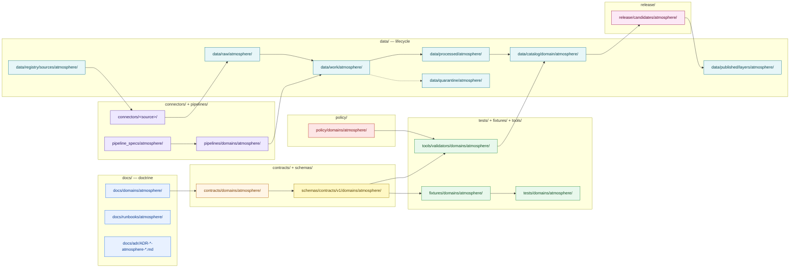
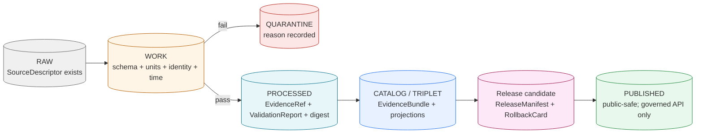

<!-- [KFM_META_BLOCK_V2]
doc_id: kfm://doc/atmosphere/missing-or-planned-files
title: Atmosphere/Air — Missing or Planned Files Register
type: standard
version: v2
status: draft
owners: TODO-atmosphere-domain-steward, TODO-docs-steward
created: 2026-05-16
updated: 2026-05-29
policy_label: public
contract_version: 3.0.0
related:
  - docs/domains/atmosphere/README.md
  - docs/domains/README.md
  - docs/doctrine/directory-rules.md
  - ai-build-operating-contract.md
  - docs/adr/README.md
  - docs/registers/VERIFICATION_BACKLOG.md
  - docs/registers/DRIFT_REGISTER.md
tags: [kfm, atmosphere, air, planning, register, directory-rules, proposed-paths]
notes:
  - CONTRACT_VERSION 3.0.0 pinned; doctrine-adjacent register.
  - PROPOSED register. No mounted repo verified this session.
  - Every path below is PROPOSED until inspected against current repo state.
  - Companion to the Atmosphere/Air domain README and the cross-repo verification backlog.
  - Meta Block v2 carries no nested HTML comments; inline annotation uses # only.
[/KFM_META_BLOCK_V2] -->

# Atmosphere/Air — Missing or Planned Files Register

> Inventory of files the Atmosphere/Air domain is **expected to need** but whose existence in the current repository has not been verified this session. Each entry is **PROPOSED** until checked against mounted-repo evidence or an accepted ADR. This register does not create files; it makes the gap visible and reviewable.

[](#)
[](./README.md)
[](#4-verification-posture)
[](#7-pipeline-shape-and-promotion-gates)
[](#4-verification-posture)
[](#)
[](#footer)

> **Status:** draft · **Owners:** TODO-atmosphere-domain-steward · TODO-docs-steward · **Updated:** 2026-05-29 · **CONTRACT_VERSION = "3.0.0"**

---

## Table of Contents

- [1. Scope and Purpose](#1-scope-and-purpose)
- [2. How to Read This Register](#2-how-to-read-this-register)
- [3. Repo Fit and Domain Placement Law](#3-repo-fit-and-domain-placement-law)
- [4. Verification Posture](#4-verification-posture)
- [5. Domain Lane Map (Diagram)](#5-domain-lane-map-diagram)
- [6. Planned Files by Responsibility Root](#6-planned-files-by-responsibility-root)
  - [6.1 `docs/domains/atmosphere/` — domain doctrine surface](#61-docsdomainsatmosphere--domain-doctrine-surface)
  - [6.2 `contracts/domains/atmosphere/` — object meaning](#62-contractsdomainsatmosphere--object-meaning)
  - [6.3 `schemas/contracts/v1/domains/atmosphere/` — machine shape](#63-schemascontractsv1domainsatmosphere--machine-shape)
  - [6.4 `policy/domains/atmosphere/` — allow / deny / restrict / abstain](#64-policydomainsatmosphere--allow--deny--restrict--abstain)
  - [6.5 `tests/domains/atmosphere/` and `fixtures/domains/atmosphere/`](#65-testsdomainsatmosphere-and-fixturesdomainsatmosphere)
  - [6.6 `tools/validators/domains/atmosphere/` — domain validators](#66-toolsvalidatorsdomainsatmosphere--domain-validators)
  - [6.7 `connectors/`, `pipelines/`, `pipeline_specs/`](#67-connectors-pipelines-pipeline_specs)
  - [6.8 `data/` lifecycle homes](#68-data-lifecycle-homes)
  - [6.9 `release/candidates/atmosphere/`](#69-releasecandidatesatmosphere)
  - [6.10 `packages/domains/atmosphere/` (deferred)](#610-packagesdomainsatmosphere-deferred)
  - [6.11 `docs/runbooks/atmosphere/`](#611-docsrunbooksatmosphere)
  - [6.12 ADRs](#612-adrs)
- [7. Pipeline Shape and Promotion Gates](#7-pipeline-shape-and-promotion-gates)
- [8. PR Sequencing — Smallest Useful First](#8-pr-sequencing--smallest-useful-first)
- [9. Domain-Specific Verification Backlog](#9-domain-specific-verification-backlog)
- [10. Anti-Patterns to Refuse](#10-anti-patterns-to-refuse)
- [11. Sensitivity and Publication Posture](#11-sensitivity-and-publication-posture)
- [Open questions register](#open-questions-register)
- [Open verification backlog](#open-verification-backlog)
- [Changelog v1 → v2](#changelog-v1--v2)
- [Definition of done](#definition-of-done)
- [Related Docs](#related-docs)
- [Footer](#footer)

---

## 1. Scope and Purpose

> [!NOTE]
> This register is doctrine-grounded planning, not a creation order. Listing a path here does **not** create it, reserve it, or imply it exists. A path becomes real only via an accepted PR that ties the file to a contract, schema, fixture, validator, policy, or runbook, with truth labels intact.

**This register covers.** Files the Atmosphere/Air domain is expected to require to satisfy the **RAW → WORK / QUARANTINE → PROCESSED → CATALOG / TRIPLET → PUBLISHED** lifecycle for atmosphere/air objects — observations, regulatory archives, low-cost sensors, model fields, remote-sensing masks, climate context, and derived fusion — under cite-or-abstain, deny-by-default, and watcher-as-non-publisher invariants.

**This register does not cover.**

- Files outside the `atmosphere/` segment of any responsibility root.
- Hazards-owned emergency / advisory truth, which is the **Hazards** lane's responsibility (Atmosphere/Air carries `ALERT_AND_ADVISORY_CONTEXT` and `AdvisoryContext` only as context, not as life-safety claims). The Atlas confirms Hazards owns `emergency/hazard event truth and life-safety context`. **[CONFIRMED — Atlas §11.B]**
- Generic doctrine that lives at the repository root or under `docs/doctrine/` (e.g., Directory Rules, trust membrane, lifecycle law).
- Concrete source endpoints, rights wording, or quotas — those live in `data/registry/sources/atmosphere/` once verified, never inferred.

[Back to top](#table-of-contents)

---

## 2. How to Read This Register

Every entry below uses these columns:

| Column | Meaning |
|---|---|
| **Path** | PROPOSED location under the appropriate KFM responsibility root, applying Domain Placement Law (`<root>/domains/atmosphere/...`). |
| **Object / purpose** | What the file is expected to do. Mapped to a KFM object family or function where possible. |
| **Truth label** | CONFIRMED, INFERRED, PROPOSED, UNKNOWN, NEEDS VERIFICATION. Implementation-layer claims are PROPOSED at minimum until a mounted-repo check confirms them. |
| **Depends on** | Upstream files, ADRs, or schema decisions that block this file. |
| **Blocks** | Downstream surfaces (UI, governed API, Focus Mode) that cannot proceed until this file lands. |
| **Notes** | Tradeoffs, sensitivity hooks, drift risks, ADR triggers. |

> [!IMPORTANT]
> **Recurring qualifier — do not strip when copying entries:** Each row's `Path` is **PROPOSED**, and adopting it requires a Directory Rules path-validation pass (responsibility root, lifecycle phase, domain segment, README presence, no parallel authority). When repo evidence contradicts a row, open a **DRIFT_REGISTER** entry rather than silently conforming. This mirrors Directory Rules §2.5 (do not silently conform; open a drift entry; propose a resolution).

[Back to top](#table-of-contents)

---

## 3. Repo Fit and Domain Placement Law

Atmosphere/Air is a **domain**, not a root. Under KFM Directory Rules §3 and §12, a domain appears as a **segment** inside a responsibility root, never as a root of its own. The placement protocol (Directory Rules §4) requires identifying the responsibility root, the lifecycle phase (data only), and the domain segment, then citing the rule in the PR. **[CONFIRMED — Directory Rules §3, §4, §12]**

```text
docs/domains/atmosphere/                  # human-facing doctrine, registers, runbooks
contracts/domains/atmosphere/             # object meaning (semantic markdown / DTO docs)
schemas/contracts/v1/domains/atmosphere/  # machine shape (default per ADR-0001)
policy/domains/atmosphere/                # allow / deny / restrict / abstain
tests/domains/atmosphere/                 # tests proving doctrine is enforceable
fixtures/domains/atmosphere/              # golden / valid / invalid samples
tools/validators/domains/atmosphere/      # domain-specific validator entry points
connectors/<source>/                      # source-specific fetch + admission
pipelines/domains/atmosphere/             # executable pipeline logic
pipeline_specs/atmosphere/                # declarative pipeline config
data/<phase>/atmosphere/                  # raw, work, quarantine, processed, …
data/catalog/domain/atmosphere/           # catalog records keyed by domain
data/published/layers/atmosphere/         # released MapLibre / tile layers
data/registry/sources/atmosphere/         # source descriptors and rights records
release/candidates/atmosphere/            # release candidates awaiting promotion
packages/domains/atmosphere/              # shared library code (only after proof lane)
docs/runbooks/atmosphere/                 # ops procedures, rollback drills (subfolder style)
docs/adr/                                 # cross-cutting ADRs (atmosphere-specific titled)
```

> [!WARNING]
> **Do not** create `atmosphere/` at the repository root (Directory Rules §3 explicitly names `atmosphere` as a domain that must live as a lane), and **do not** create a parallel `schemas/atmosphere/` outside `schemas/contracts/v1/...`. Either is a Directory Rules §2.4 (ADR-required) and §13.1 (drift) violation and requires an ADR before merging. If the mounted repo already contains such a structure, raise it as a **DRIFT_REGISTER** entry rather than treating it as canon.

> [!NOTE]
> **Registry sub-lane choice.** Directory Rules §4 Step 3 lists **both** `data/registry/<domain>/` **and** `data/registry/sources/<domain>/` as valid registry homes. This register uses `data/registry/sources/atmosphere/` for source descriptors specifically; whether non-source registry records (e.g., a parameter registry) also live under `data/registry/atmosphere/` is **NEEDS VERIFICATION** and tracked in §9.

[Back to top](#table-of-contents)

---

## 4. Verification Posture

> [!NOTE]
> **NEEDS VERIFICATION (repository state).** The repository was not mounted during the authoring of this register. Every "exists / does not exist" claim below is therefore an inference from doctrine and indexed project artifacts, not a repo fact. Once a mounted-repo inspection is performed, this register **MUST** be regenerated and rows reclassified:
>
> - **CONFIRMED** if the path exists and conforms to Directory Rules.
> - **DRIFT** (linked to `docs/registers/DRIFT_REGISTER.md`) if the path exists but conflicts with Rules.
> - **PROPOSED** if the path is still planned-only.
> - **NOT NEEDED** if doctrine has since superseded the requirement.

Doctrine sources used to derive this register, all CONFIRMED in indexed project knowledge this session:

- **Directory Rules** — domain placement law (§3, §12), placement protocol (§4), ADR-class changes (§2.4), repo-conflict handling (§2.5), drift register (§13.1), required per-root README (§9). **[CONFIRMED]**
- **`ai-build-operating-contract.md` v3.0** — operating law, truth labels, sensitive-domain matrix (§23.2), untrusted-content rule (§12). **[CONFIRMED — canonical operating contract; CONTRACT_VERSION = "3.0.0"]**
- **KFM Domains Culmination Atlas §11 (Atmosphere/Air)** — ubiquitous language, source families, object families, cross-lane relations, pipeline shape, governed-AI behavior, publication/correction/rollback, verification backlog. **[CONFIRMED]**
- **KFM Domains Culmination Atlas §12 (Hazards)** — confirms Hazards owns a `SmokeContext` object and `Advisory Context`, establishing the cross-lane boundary. **[CONFIRMED]**
- **KFM Domain and Capability Encyclopedia** — Atmosphere/Air mission, sources, object families. **[CONFIRMED via Atlas cross-citation]**

External research was **not** consulted for this register; KFM-specific paths and doctrine are governed by project knowledge alone, per `<external_research>` containment rules.

[Back to top](#table-of-contents)

---

## 5. Domain Lane Map (Diagram)



> [!NOTE]
> **Diagram status:** PROPOSED — the diagram reflects the responsibility-root + domain-segment pattern required by Directory Rules §4/§12. Actual repo topology **NEEDS VERIFICATION**.

[Back to top](#table-of-contents)

---

## 6. Planned Files by Responsibility Root

All rows below are **PROPOSED**. Treat each table as a candidate path inventory subject to the path-validation checklist before any PR proposes creation.

### 6.1 `docs/domains/atmosphere/` — domain doctrine surface

| Path | Object / purpose | Truth label | Depends on | Blocks | Notes |
|---|---|---|---|---|---|
| `docs/domains/atmosphere/README.md` | Atmosphere/Air domain landing page; declares scope, ownership, non-ownership, ubiquitous language, source families, governed-AI posture. | PROPOSED | Directory Rules §9 per-root README contract | All other atmosphere docs | Required by `docs/domains/README.md` listing; declares authority class and review burden. |
| `docs/domains/atmosphere/UBIQUITOUS_LANGUAGE.md` | Stable definitions for `OBSERVED_SENSOR`, `PUBLIC_AQI_REPORT`, `REGULATORY_ARCHIVE`, `LOW_COST_SENSOR`, `ATMOSPHERIC_MODEL_FIELD`, `REMOTE_SENSING_MASK`, `CLIMATE_ANOMALY_CONTEXT`, `DERIVED_FUSION`, `METEOROLOGICAL_CONTEXT`, `ALERT_AND_ADVISORY_CONTEXT`, `NETWORK_AND_SITE_CONTEXT`. | PROPOSED | README | Contracts, schemas, validators | Vocabulary CONFIRMED in Atlas §11.C; field realization PROPOSED. |
| `docs/domains/atmosphere/OBJECT_FAMILY_MAP.md` | Per-object table: AirStation, AirObservation, PM2.5 Observation, Ozone Observation, SmokeContext, AODRaster, Weather Station, Weather Observation, WindField, Precipitation Observation, Temperature Observation, Climate Normal, Climate Anomaly, Forecast Context, Advisory Context. | PROPOSED | Ubiquitous language | Schemas, fixtures | Object roster CONFIRMED in Atlas §11.B/§11.E; crosswalks to `contracts/OBJECT_MAP.md`. |
| `docs/domains/atmosphere/SOURCE_FAMILIES.md` | Source-family roster with role / rights / freshness columns: OpenAQ-like, EPA AQS-like, AirNow / agency, CAMS / ECMWF-family, HRRR-Smoke, HMS smoke, GOES/ABI AOD, VIIRS fire/hotspot, NWS, Kansas Mesonet, climate normals. | PROPOSED | Atlas §11.D | Source descriptors; connector READMEs | All entries `NEEDS VERIFICATION` for rights / cadence / endpoint (Atlas §11.D marks rights NEEDS VERIFICATION; sensitive joins fail closed). |
| `docs/domains/atmosphere/KNOWLEDGE_CHARACTERS.md` | Knowledge-character registry doc — what counts as observation vs report vs model vs mask vs fusion vs context. | PROPOSED | Ubiquitous language | Validators (AQI / AOD / model denials) | Backstop for `AQI-is-not-concentration`, `AOD-is-not-PM2.5`, `model-is-not-observation` denials. |
| `docs/domains/atmosphere/CROSS_LANE_RELATIONS.md` | How Atmosphere/Air relates to Hazards, Agriculture, Hydrology, Biodiversity, Settlements — with the boundary that life-safety belongs to Hazards. | PROPOSED | README | Policy bindings | Relation set CONFIRMED in Atlas §11.F. |
| `docs/domains/atmosphere/PUBLICATION_POSTURE.md` | Sensitivity, rights, low-cost-sensor caveats, AQI-vs-concentration disclosure rules. | PROPOSED | Knowledge characters | Release manifest gate | Atlas §11.I, §11.M. |
| `docs/domains/atmosphere/MISSING_OR_PLANNED_FILES.md` | **This file.** | CONFIRMED (this file) | Directory Rules; Atlas §11 | n/a | Self-referential anchor. |

### 6.2 `contracts/domains/atmosphere/` — object meaning

> [!NOTE]
> Per Directory Rules §13.1 and ADR-0001, `contracts/` owns object **meaning** in semantic Markdown; `schemas/contracts/v1/...` owns machine **shape**. Both layers are required; neither replaces the other. **[CONFIRMED — Directory Rules §13.1]**

| Path | Object / purpose | Truth label | Depends on | Blocks |
|---|---|---|---|---|
| `contracts/domains/atmosphere/AirStation.md` | Semantic contract for AirStation (network/site context, identity, temporal fields). | PROPOSED | Object family map | Schema, fixtures |
| `contracts/domains/atmosphere/AirObservation.md` | Semantic contract for AirObservation. | PROPOSED | Ubiquitous language | Schema, fixtures |
| `contracts/domains/atmosphere/PM25Observation.md` | Semantic contract for PM2.5 Observation. | PROPOSED | Knowledge-character registry | Validators |
| `contracts/domains/atmosphere/OzoneObservation.md` | Semantic contract for Ozone Observation. | PROPOSED | Knowledge-character registry | Validators |
| `contracts/domains/atmosphere/SmokeContext.md` | Semantic contract for SmokeContext (HMS / HRRR-Smoke source role) — **atmospheric reading only**; see cross-lane deconfliction OQ. | PROPOSED | Ubiquitous language; Hazards SmokeContext boundary | Schemas, hazards crosswalk |
| `contracts/domains/atmosphere/AODRaster.md` | Semantic contract for AODRaster (GOES/ABI source role). | PROPOSED | Knowledge characters | AOD-is-not-PM2.5 denial |
| `contracts/domains/atmosphere/WeatherStation.md` | Semantic contract for Weather Station. | PROPOSED | Object family map | Schemas |
| `contracts/domains/atmosphere/WeatherObservation.md` | Semantic contract for Weather Observation. | PROPOSED | Ubiquitous language | Schemas |
| `contracts/domains/atmosphere/WindField.md` | Semantic contract for WindField. | PROPOSED | Knowledge characters | Schemas |
| `contracts/domains/atmosphere/PrecipitationObservation.md` | Semantic contract for Precipitation Observation. | PROPOSED | Knowledge characters | Schemas |
| `contracts/domains/atmosphere/TemperatureObservation.md` | Semantic contract for Temperature Observation. | PROPOSED | Knowledge characters | Schemas |
| `contracts/domains/atmosphere/ClimateNormal.md` | Semantic contract for ClimateNormal. | PROPOSED | Source families (climate normals) | Schemas |
| `contracts/domains/atmosphere/ClimateAnomaly.md` | Semantic contract for ClimateAnomaly. | PROPOSED | ClimateNormal | Schemas |
| `contracts/domains/atmosphere/ForecastContext.md` | Semantic contract for ForecastContext (model-as-context, never as observation). | PROPOSED | Knowledge characters | Model-is-not-observation denial |
| `contracts/domains/atmosphere/AdvisoryContext.md` | Semantic contract for AdvisoryContext (referral-only; **not** life-safety). | PROPOSED | Hazards lane | Policy: no life-safety output |
| `contracts/domains/atmosphere/AtmosphereAirDecisionEnvelope.md` | Decision envelope for Atmosphere/Air feature/detail resolver: ANSWER / ABSTAIN / DENY / ERROR. | PROPOSED | `RuntimeResponseEnvelope` contract | Governed-API route |

### 6.3 `schemas/contracts/v1/domains/atmosphere/` — machine shape

> [!NOTE]
> Default schema home is `schemas/contracts/v1/...` per ADR-0001 (Directory Rules §13.1). **NEEDS VERIFICATION** that this is the live authority in the mounted repo. If `contracts/<...>.schema.json` is used instead, raise a drift entry; do not duplicate. **[CONFIRMED rule / NEEDS VERIFICATION repo presence]**

| Path | Schema | Truth label | Notes |
|---|---|---|---|
| `schemas/contracts/v1/domains/atmosphere/air_station.schema.json` | AirStation | PROPOSED | Identity rule: `source_id + object_role + temporal_scope + normalized_digest` (Atlas §11.E identity rule). |
| `schemas/contracts/v1/domains/atmosphere/air_observation.schema.json` | AirObservation | PROPOSED | Time fields: source, observed, valid, retrieval, release, correction (kept distinct — CONFIRMED Atlas §11.E temporal handling). |
| `schemas/contracts/v1/domains/atmosphere/pm25_observation.schema.json` | PM2.5 Observation | PROPOSED | Units canonical; AQI never aliased to concentration. |
| `schemas/contracts/v1/domains/atmosphere/ozone_observation.schema.json` | Ozone Observation | PROPOSED | Units canonical. |
| `schemas/contracts/v1/domains/atmosphere/smoke_context.schema.json` | SmokeContext | PROPOSED | Source role required (HMS analysis vs HRRR-Smoke forecast). |
| `schemas/contracts/v1/domains/atmosphere/aod_raster.schema.json` | AODRaster | PROPOSED | Tagged as remote-sensing mask, not PM2.5. |
| `schemas/contracts/v1/domains/atmosphere/weather_station.schema.json` | Weather Station | PROPOSED | — |
| `schemas/contracts/v1/domains/atmosphere/weather_observation.schema.json` | Weather Observation | PROPOSED | — |
| `schemas/contracts/v1/domains/atmosphere/wind_field.schema.json` | WindField | PROPOSED | Model vs observation roles distinct. |
| `schemas/contracts/v1/domains/atmosphere/precipitation_observation.schema.json` | Precipitation Observation | PROPOSED | Units canonical. |
| `schemas/contracts/v1/domains/atmosphere/temperature_observation.schema.json` | Temperature Observation | PROPOSED | Units canonical. |
| `schemas/contracts/v1/domains/atmosphere/climate_normal.schema.json` | ClimateNormal | PROPOSED | Reference period required. |
| `schemas/contracts/v1/domains/atmosphere/climate_anomaly.schema.json` | ClimateAnomaly | PROPOSED | Anchored to a ClimateNormal. |
| `schemas/contracts/v1/domains/atmosphere/forecast_context.schema.json` | ForecastContext | PROPOSED | Model field; never observation. |
| `schemas/contracts/v1/domains/atmosphere/advisory_context.schema.json` | AdvisoryContext | PROPOSED | Referral object; redirects to authoritative source. |
| `schemas/contracts/v1/domains/atmosphere/parameter_registry.schema.json` | Atmospheric parameter / unit registry | PROPOSED | Drives unit-normalization tests. Cross-domain placement is an OPEN question (§OQ). |
| `schemas/contracts/v1/domains/atmosphere/knowledge_character.schema.json` | Knowledge-character enum + binding | PROPOSED | Drives AQI/AOD/model denials. |
| `schemas/contracts/v1/domains/atmosphere/atmosphere_air_decision_envelope.schema.json` | AtmosphereAirDecisionEnvelope | PROPOSED | ANSWER / ABSTAIN / DENY / ERROR. |

### 6.4 `policy/domains/atmosphere/` — allow / deny / restrict / abstain

> [!CAUTION]
> Canonical singular is `policy/` per Directory Rules (`policies/` is named as a compatibility-root mirror in §13). If `policies/` exists, treat as compatibility/mirror and do not evolve independently. **[CONFIRMED — Directory Rules §3, §13]**

| Path | Policy intent | Truth label | Notes |
|---|---|---|---|
| `policy/domains/atmosphere/README.md` | Per-root folder contract per §9. | PROPOSED | Declares authority class. |
| `policy/domains/atmosphere/source_role_required.rego` (or equivalent) | Deny on missing source role for any Atmosphere/Air object. | PROPOSED | Validator counterpart in `tools/`. |
| `policy/domains/atmosphere/aqi_is_not_concentration.rego` | Deny when AQI is presented as concentration. | PROPOSED | Backed by knowledge-character registry test. |
| `policy/domains/atmosphere/aod_is_not_pm25.rego` | Deny when AOD raster is presented as PM2.5. | PROPOSED | — |
| `policy/domains/atmosphere/model_is_not_observation.rego` | Deny when ForecastContext / model field is presented as observation. | PROPOSED | — |
| `policy/domains/atmosphere/low_cost_sensor_caveats_required.rego` | Restrict public release of low-cost sensor data without correction/caveat/confidence/limitation fields. | PROPOSED | — |
| `policy/domains/atmosphere/advisory_no_life_safety.rego` | Deny life-safety instructional output from AdvisoryContext; redirect to authoritative source. | PROPOSED | Hazards lane boundary (CONFIRMED Atlas §11.B). |
| `policy/domains/atmosphere/freshness_gate.rego` | Stale-state policy keyed to source cadence. | PROPOSED | Pairs with stale-state UI badge; emits `SOURCE_STALE`. |
| `policy/domains/atmosphere/dryrun_no_live_fetch.rego` | Deny live-fetch during dryrun pipelines and fixture tests. | PROPOSED | Required by no-network fixture pattern. |

### 6.5 `tests/domains/atmosphere/` and `fixtures/domains/atmosphere/`

> [!IMPORTANT]
> Negative-state validation is required: validators MUST exercise DENY / ABSTAIN / ERROR paths, not only happy paths. Each invalid fixture below pairs with a denial test.

| Path | Test / fixture purpose | Truth label | Notes |
|---|---|---|---|
| `tests/domains/atmosphere/test_knowledge_character_registry.py` | Validate registry coverage and category distinctness. | PROPOSED | Atlas §11.K. |
| `tests/domains/atmosphere/test_unit_normalization.py` | Round-trip unit conversions; reject ambiguous units. | PROPOSED | — |
| `tests/domains/atmosphere/test_aqi_as_concentration_denied.py` | Negative test: AQI presented as concentration → DENY. | PROPOSED | — |
| `tests/domains/atmosphere/test_aod_as_pm25_denied.py` | Negative test: AOD presented as PM2.5 → DENY. | PROPOSED | — |
| `tests/domains/atmosphere/test_model_as_observed_denied.py` | Negative test: model field as observation → DENY. | PROPOSED | — |
| `tests/domains/atmosphere/test_low_cost_sensor_caveat_required.py` | Reject public release without caveats. | PROPOSED | — |
| `tests/domains/atmosphere/test_dryrun_no_live_fetch.py` | Pipeline dryrun must not perform live HTTP. | PROPOSED | — |
| `tests/domains/atmosphere/test_advisory_no_life_safety.py` | AdvisoryContext output never contains imperative life-safety language. | PROPOSED | — |
| `tests/domains/atmosphere/test_temporal_fields_distinct.py` | source, observed, valid, retrieval, release, correction must not collapse. | PROPOSED | CONFIRMED requirement Atlas §11.E. |
| `tests/domains/atmosphere/test_decision_envelope_finite_outcomes.py` | Envelope responses are exactly one of {ANSWER, ABSTAIN, DENY, ERROR}. | PROPOSED | — |
| `fixtures/domains/atmosphere/sources/SourceDescriptor.no_network.json` | Synthetic SourceDescriptor for offline tests. | PROPOSED | First-PR fixture. |
| `fixtures/domains/atmosphere/objects/AirObservation.valid.json` | Valid AirObservation fixture. | PROPOSED | — |
| `fixtures/domains/atmosphere/objects/AirObservation.invalid.aqi_as_concentration.json` | Invalid fixture: AQI as concentration. | PROPOSED | — |
| `fixtures/domains/atmosphere/objects/AODRaster.valid.json` | Valid AODRaster mask. | PROPOSED | — |
| `fixtures/domains/atmosphere/objects/AODRaster.invalid.tagged_as_pm25.json` | Invalid fixture: AOD tagged as PM2.5. | PROPOSED | — |
| `fixtures/domains/atmosphere/objects/ForecastContext.invalid.tagged_as_observed.json` | Invalid fixture: model field tagged as observation. | PROPOSED | — |
| `fixtures/domains/atmosphere/bundles/EvidenceBundle.air_observation.example.json` | Example EvidenceBundle resolving an AirObservation EvidenceRef. | PROPOSED | — |

### 6.6 `tools/validators/domains/atmosphere/` — domain validators

> [!NOTE]
> Validators belong under `tools/` (repo-wide validator/generator/checker, Directory Rules §4 Step 1). One-off helpers under `scripts/` graduate to `tools/` once trust-bearing. **[CONFIRMED — Directory Rules §4]**

| Path | Validator | Truth label |
|---|---|---|
| `tools/validators/domains/atmosphere/validate_air_observation.py` | Run AirObservation schema + knowledge-character + unit checks; emit finite outcomes. | PROPOSED |
| `tools/validators/domains/atmosphere/validate_aod_raster.py` | Validate AODRaster source-role tag and forbid PM2.5 aliasing. | PROPOSED |
| `tools/validators/domains/atmosphere/validate_smoke_context.py` | Validate SmokeContext source role (HMS analysis vs HRRR-Smoke forecast). | PROPOSED |
| `tools/validators/domains/atmosphere/validate_forecast_context.py` | Enforce model-vs-observation separation. | PROPOSED |
| `tools/validators/domains/atmosphere/validate_low_cost_sensor_caveats.py` | Enforce caveat / confidence / limitation fields. | PROPOSED |
| `tools/validators/domains/atmosphere/validate_parameter_units.py` | Parameter-registry-driven unit normalization. | PROPOSED |
| `tools/validators/domains/atmosphere/validate_atmosphere_decision_envelope.py` | Envelope structural + outcome closure. | PROPOSED |

### 6.7 `connectors/`, `pipelines/`, `pipeline_specs/`

> [!IMPORTANT]
> **Connectors do not publish.** Output goes to `data/raw/atmosphere/<source_id>/<run_id>/` or `data/quarantine/atmosphere/<reason>/<run_id>/`. Watchers do not publish either (watcher-as-non-publisher invariant). First Atmosphere/Air PR is **docs/registry/schema/fixture/validator/policy/dryrun only** — no live fetch, no public promotion, no UI/API binding beyond typed contract notes.

| Path | Purpose | Truth label | Notes |
|---|---|---|---|
| `connectors/epa_aqs/` | EPA AQS-like archive connector. | PROPOSED | Rights NEEDS VERIFICATION (Atlas §11.D). |
| `connectors/airnow/` | AirNow / agency reporting connector. | PROPOSED | Rights NEEDS VERIFICATION. |
| `connectors/openaq/` | OpenAQ-like aggregator connector (if rights allow). | PROPOSED | Rights NEEDS VERIFICATION; quarantine if unclear. |
| `connectors/nws/` | NOAA / NWS observation + advisory connector. | PROPOSED | AdvisoryContext only, not life-safety. |
| `connectors/kansas_mesonet/` | Kansas Mesonet weather observation connector. | PROPOSED | — |
| `connectors/hms_smoke/` | NOAA HMS smoke analysis connector. | PROPOSED | Source role = remote-sensing analysis. |
| `connectors/hrrr_smoke/` | NOAA HRRR-Smoke forecast connector. | PROPOSED | Source role = model field. |
| `connectors/goes_abi_aod/` | GOES/ABI AOD connector. | PROPOSED | Mask, not PM2.5. |
| `connectors/viirs_hotspot/` | VIIRS fire / hotspot connector. | PROPOSED | Cross-lane: Hazards primary use. |
| `pipelines/domains/atmosphere/normalize/` | Schema + unit + knowledge-character normalization. | PROPOSED | Emits to `data/work/atmosphere/`. |
| `pipelines/domains/atmosphere/validate/` | Validator entry orchestration. | PROPOSED | — |
| `pipelines/domains/atmosphere/catalog/` | Catalog record emission for atmosphere objects. | PROPOSED | — |
| `pipelines/domains/atmosphere/publish/` | Release candidate emission (dryrun first). | PROPOSED | — |
| `pipeline_specs/atmosphere/normalize.yaml` | Declarative spec for normalize stage. | PROPOSED | — |
| `pipeline_specs/atmosphere/validate.yaml` | Declarative spec for validate stage. | PROPOSED | — |
| `pipeline_specs/atmosphere/catalog.yaml` | Declarative spec for catalog stage. | PROPOSED | — |
| `pipeline_specs/atmosphere/publish.yaml` | Declarative spec for publish stage. | PROPOSED | — |

### 6.8 `data/` lifecycle homes

> [!WARNING]
> A path-level move that bypasses validators, policy gates, EvidenceBundle creation, catalog closure, and release-decision recording is a Directory Rules violation **regardless** of which directory the bytes end up in. Promotion is a governed state transition, not a `mv`. **[CONFIRMED — Directory Rules; Promotion is a governed release transition, not file movement]**

| Path | Lifecycle phase | Truth label | Notes |
|---|---|---|---|
| `data/registry/sources/atmosphere/README.md` | Domain source-descriptor index. | PROPOSED | Required for every source family in §6.1. |
| `data/registry/sources/atmosphere/<source_id>.source_descriptor.json` | Per-source descriptors (one per OpenAQ-like, EPA AQS, AirNow, etc.). | PROPOSED | Rights / cadence / sensitivity per source. |
| `data/raw/atmosphere/<source_id>/<run_id>/` | RAW immutable captures. | PROPOSED | Connector output only. |
| `data/work/atmosphere/<run_id>/` | Normalized work-in-progress. | PROPOSED | — |
| `data/quarantine/atmosphere/<reason>/<run_id>/` | Held failures with quarantine reason. | PROPOSED | — |
| `data/processed/atmosphere/<dataset_id>/<version>/` | Validated normalized objects + receipts. | PROPOSED | — |
| `data/catalog/domain/atmosphere/` | Catalog records (STAC / DCAT / PROV / domain projection). | PROPOSED | — |
| `data/published/layers/atmosphere/` | Released, public-safe MapLibre / tile layers. | PROPOSED | Read by `apps/governed-api/` only. |
| `data/receipts/atmosphere/` (if domain-scoped) | Domain-scoped receipts; default global home is `data/receipts/`. | PROPOSED | **NEEDS VERIFICATION:** confirm whether receipts are global-only or also per-domain (Directory Rules §2.4(4) governs phase splits). |
| `data/proofs/atmosphere/` (if domain-scoped) | Domain-scoped proofs. | PROPOSED | Same NEEDS VERIFICATION as above. |

### 6.9 `release/candidates/atmosphere/`

| Path | Purpose | Truth label |
|---|---|---|
| `release/candidates/atmosphere/README.md` | Candidate folder contract. | PROPOSED |
| `release/candidates/atmosphere/<release_id>/ReleaseManifest.json` | Per-release manifest. | PROPOSED |
| `release/candidates/atmosphere/<release_id>/RollbackCard.json` | Per-release rollback target. | PROPOSED |
| `release/candidates/atmosphere/<release_id>/CorrectionNotice.template.md` | Template for correction issuance. | PROPOSED |

### 6.10 `packages/domains/atmosphere/` (deferred)

> [!NOTE]
> **Deferred.** Code only graduates to `packages/` once it is reusable across deployables (Directory Rules §3 names `shared/` without `packages/` as a root anti-pattern; package code is the reusable-library home). The first Atmosphere/Air PR is doctrine-only; package code is **deferred** until the no-network proof slice clears.

| Path | Purpose | Truth label |
|---|---|---|
| `packages/domains/atmosphere/README.md` | Package-level scope (when created). | DEFERRED |
| `packages/domains/atmosphere/src/` | Shared Atmosphere/Air helpers (unit conversion, knowledge-character helpers). | DEFERRED |

### 6.11 `docs/runbooks/atmosphere/`

> [!NOTE]
> **Subfolder runbook style.** This register uses the subfolder convention `docs/runbooks/<domain>/<RUNBOOK>.md` (matching the Fauna domain's `docs/runbooks/fauna/SOURCE_REFRESH_RUNBOOK.md`). Some prior planning artifacts use a flat prefix style (`docs/runbooks/ui_LOCAL_DEV.md`). The flat-prefix vs subfolder choice is **ADR-class** and **NEEDS VERIFICATION**; pending an ADR, the subfolder style is preferred for domain-scoped runbooks.

| Path | Purpose | Truth label |
|---|---|---|
| `docs/runbooks/atmosphere/SOURCE_REFRESH_RUNBOOK.md` | Cadence-driven refresh procedure per Atmosphere/Air source family. | PROPOSED |
| `docs/runbooks/atmosphere/VALIDATION_RUNBOOK.md` | How to run Atmosphere/Air validators offline and in CI. | PROPOSED |
| `docs/runbooks/atmosphere/RELEASE_RUNBOOK.md` | Release-candidate → published procedure with gates. | PROPOSED |
| `docs/runbooks/atmosphere/ROLLBACK_RUNBOOK.md` | Rollback drill using ReleaseManifest + RollbackCard. | PROPOSED |
| `docs/runbooks/atmosphere/CORRECTION_RUNBOOK.md` | Issuing a CorrectionNotice for an already-published claim. | PROPOSED |
| `docs/runbooks/atmosphere/STALE_STATE_RUNBOOK.md` | Stale-state markers (freshness expired vs corrected). | PROPOSED |

### 6.12 ADRs

| Path | Decision recorded | Truth label |
|---|---|---|
| `docs/adr/ADR-XXXX-atmosphere-schema-home.md` | Confirm `schemas/contracts/v1/domains/atmosphere/` as the live atmosphere schema home, or document the exception. | PROPOSED — ADR-class per Rules §2.4(3). |
| `docs/adr/ADR-XXXX-atmosphere-knowledge-character-vocabulary.md` | Freeze the knowledge-character enum v1 (observed sensor, public AQI report, regulatory archive, low-cost sensor, atmospheric model field, remote-sensing mask, climate anomaly context, derived fusion, meteorological context, alert/advisory context, network/site context). | PROPOSED — anti-collapse vocabulary. |
| `docs/adr/ADR-XXXX-atmosphere-advisory-non-life-safety.md` | Record that AdvisoryContext is referral-only; no life-safety output from Atmosphere/Air. | PROPOSED — boundary with Hazards (CONFIRMED Atlas §11.B). |
| `docs/adr/ADR-XXXX-atmosphere-hazards-smokecontext-ownership.md` | Resolve that Atmosphere/Air owns the atmospheric **reading** of smoke, Hazards owns the **event/impact projection** — the same `SmokeContext` name appears in both lanes per Atlas §11.B and §12.E. | PROPOSED — cross-lane name collision. |
| `docs/adr/ADR-XXXX-runbook-subfolder-convention.md` | Resolve `docs/runbooks/<domain>/...` subfolder vs flat prefix. | PROPOSED — cross-cutting; not Atmosphere-only. |

[Back to top](#table-of-contents)

---

## 7. Pipeline Shape and Promotion Gates



Per Atlas §11.H and §11.M, each transition is a **governed state change**, never a file move. The Atlas gate table lists: RAW requires a SourceDescriptor; WORK/QUARANTINE requires validation/policy pass or a recorded quarantine reason; PROCESSED requires EvidenceRef + ValidationReport + digest closure; CATALOG/TRIPLET requires catalog/proof closure; PUBLISHED requires ReleaseManifest, EvidenceBundle, validation/policy support, review state where required, correction path, stale-state rule, and rollback target. **[CONFIRMED doctrine / PROPOSED lane application — Atlas §11.H, §11.M]**

[Back to top](#table-of-contents)

---

## 8. PR Sequencing — Smallest Useful First

Recommended PR order, modeled on the cross-domain Encyclopedia roadmap and constrained to Atmosphere/Air. Each PR is small, reversible, and tied to validators or contracts — consistent with the change-discipline preference for the smallest useful reversible change.

<details>
<summary><strong>Click to expand: 10-PR Atmosphere/Air sequence (PROPOSED)</strong></summary>

| # | PR | Why this order | Acceptance |
|---|---|---|---|
| 1 | Add `docs/domains/atmosphere/README.md`, `MISSING_OR_PLANNED_FILES.md` (this), `UBIQUITOUS_LANGUAGE.md`, `KNOWLEDGE_CHARACTERS.md` | Stabilizes vocabulary before code. | Doc link check; KFM Meta Block v2 valid (no nested comments). |
| 2 | Add `data/registry/sources/atmosphere/README.md` + first **synthetic** `SourceDescriptor` fixture | Source identity before any fetch. | Schema validates; no live fetch. |
| 3 | Add `schemas/contracts/v1/domains/atmosphere/knowledge_character.schema.json` + `parameter_registry.schema.json` | Backstops AQI / AOD / model denials. | Negative fixtures DENY. |
| 4 | Add AirStation, AirObservation, PM2.5 Observation schemas + valid/invalid fixtures | Smallest object set to exercise gates. | Validators pass on valid, DENY on invalid. |
| 5 | Add `policy/domains/atmosphere/aqi_is_not_concentration.rego`, `aod_is_not_pm25.rego`, `model_is_not_observation.rego`, `low_cost_sensor_caveats_required.rego`, `dryrun_no_live_fetch.rego` | Anti-collapse policy spine. | Policy tests fail closed. |
| 6 | Add `tools/validators/domains/atmosphere/validate_air_observation.py` and friends | Validator entry points. | Round-trip + negative-path tests pass. |
| 7 | Add `release/candidates/atmosphere/README.md` + `ReleaseManifest`/`RollbackCard` templates | Release machinery before any release. | Schema validates. |
| 8 | Add `docs/runbooks/atmosphere/{SOURCE_REFRESH,VALIDATION,RELEASE,ROLLBACK,CORRECTION,STALE_STATE}_RUNBOOK.md` | Ops procedures before live data. | Runbook link check. |
| 9 | Add `pipeline_specs/atmosphere/{normalize,validate,catalog,publish}.yaml` (dryrun-only) | Declarative spec wired to no-network fixtures. | Dryrun no-live-fetch test passes. |
| 10 | Open ADRs: schema home, knowledge-character vocabulary, advisory non-life-safety, SmokeContext ownership, runbook subfolder convention | Lock the doctrine the above codifies. | ADRs accepted; supersession recorded. |

</details>

> [!TIP]
> Only after PR-10 should connectors, pipelines (executable), or governed-API routes be opened. Until then, the Atmosphere/Air lane is dryrun-only.

[Back to top](#table-of-contents)

---

## 9. Domain-Specific Verification Backlog

Mirrors Atlas §11.N and adds path-level items surfaced by this register.

| Item to verify | Evidence that would settle it | Status |
|---|---|---|
| Verify source rights and endpoint behavior for OpenAQ-like, EPA AQS, AirNow, CAMS / ECMWF, HRRR-Smoke, HMS, GOES/ABI AOD, VIIRS, NWS, Kansas Mesonet, climate normals. | Source-descriptor registry entries; live terms-of-use text on file; review records. | NEEDS VERIFICATION |
| Implement knowledge-character registry and confirm enum stability. | `knowledge_character.schema.json`, `KNOWLEDGE_CHARACTERS.md`, accepted ADR. | NEEDS VERIFICATION |
| Verify catalog / proof / release closure for at least one Atmosphere/Air object. | EvidenceBundle, ValidationReport, ReleaseManifest, RollbackCard for a dryrun release. | NEEDS VERIFICATION |
| Verify MapLibre / Evidence Drawer / Focus Mode integration. | Released LayerManifest + tile asset under `data/published/layers/atmosphere/` + Drawer fixture. | NEEDS VERIFICATION |
| Confirm `schemas/contracts/v1/...` is the live schema home in the mounted repo. | `git ls-tree` of `schemas/` and `contracts/`; ADR-0001 acceptance. | NEEDS VERIFICATION |
| Resolve runbook subfolder vs flat-prefix convention. | Accepted ADR. | NEEDS VERIFICATION |
| Confirm receipts/proofs are global-only or also domain-scoped. | Per-root README declarations + drift register check. | NEEDS VERIFICATION |
| Confirm `policy/` (singular) is the live policy home; if `policies/` exists, classify as compatibility. | `git ls-tree`; per-root README. | NEEDS VERIFICATION |
| Confirm the registry sub-lane — `data/registry/atmosphere/` vs `data/registry/sources/atmosphere/` — for non-source registry records (e.g., parameter registry). | Directory Rules §4 Step 3 lists both; per-root README + repo inspection. | NEEDS VERIFICATION |
| Resolve `SmokeContext` ownership between Atmosphere/Air and Hazards (same name in Atlas §11.B and §12.E). | Accepted ADR clarifying atmospheric reading vs event/impact projection. | NEEDS VERIFICATION |
| Confirm Atmosphere/Air domain steward and release authority. | CODEOWNERS entry; `docs/governance/`. | NEEDS VERIFICATION |

[Back to top](#table-of-contents)

---

## 10. Anti-Patterns to Refuse

> [!CAUTION]
> The following are **not acceptable** Atmosphere/Air paths or behaviors, regardless of how convenient they look:

- **Root-level `atmosphere/`** — domain at root violates Rules §3 and §12 (Domain Placement Law); `atmosphere` is explicitly named as a domain that must live as a lane.
- **Parallel schema home** — `schemas/atmosphere/` outside `schemas/contracts/v1/...` requires an ADR (§2.4(3), §13.1).
- **Connector writes to `data/processed/atmosphere/`** — connectors emit only to `raw/` or `quarantine/`.
- **Watcher / worker publishes to `data/published/layers/atmosphere/`** — watcher-as-non-publisher invariant.
- **Lifecycle skip from RAW → PUBLISHED** — promotion is a governed state transition; every gate runs.
- **`AdvisoryContext` rendered as life-safety instruction** — Atmosphere/Air is **not** an emergency alert system; redirect to the authoritative source (Hazards owns life-safety, CONFIRMED Atlas §11.B).
- **AQI displayed as concentration**, **AOD displayed as PM2.5**, **ForecastContext displayed as observation** — knowledge-character collapse.
- **Low-cost sensor public release without caveats / confidence / limitations.**
- **Live fetch during dryrun pipelines or fixture tests.**
- **Browser direct access to RAW / WORK / QUARANTINE / canonical stores or model runtimes** — trust membrane breach (Directory Rules §24.9.2 trust-membrane anti-patterns).
- **Treating `data/published/layers/atmosphere/` as sovereign truth** — released tiles are downstream carriers, not the inspectable claim.

[Back to top](#table-of-contents)

---

## 11. Sensitivity and Publication Posture

> [!CAUTION]
> **Sensitive-domain handling applies (operating contract §23.2).** Atmosphere/Air is not itself a high-sensitivity domain, but several of its products touch sensitive matrix rows and MUST route through the most restrictive applicable row:
>
> - **Precise station / site coordinates** (`NETWORK_AND_SITE_CONTEXT`, AirStation, Weather Station) — exact-location exposure can implicate private land and infrastructure. Prefer generalization before publication; do not publish exact site coordinates without steward review.
> - **VIIRS fire/hotspot and HMS/HRRR smoke** cross into Hazards and may touch infrastructure and rare-species habitat indirectly — sensitive joins fail closed (Atlas §11.D).
> - **Low-cost sensor data** requires correction / caveat / confidence / limitation fields before any public release.
>
> Default disposition when no row clearly matches: DENY exact exposure → GENERALIZE → REDACT → QUARANTINE uncertain source material → REQUIRE steward review → REQUIRE transform receipt (`RedactionReceipt`) → ABSTAIN when support is inadequate. Link the relevant `policy/sensitivity/` entry, or surface that one is missing.

[Back to top](#table-of-contents)

---

## Open questions register

| ID | Question | Owner role | Resolution path |
|---|---|---|---|
| OQ-AIR-01 | Should `AODRaster` schema include a mandatory `not_pm25: true` marker, or is source-role enum enforcement sufficient? | atmosphere-domain-steward | ADR + schema decision |
| OQ-AIR-02 | Cardinality of `data/registry/sources/atmosphere/` — one descriptor per source family, or per endpoint within a family? | source steward | Directory Rules §4 check + ADR |
| OQ-AIR-03 | Does `parameter_registry.schema.json` belong under `schemas/contracts/v1/domains/atmosphere/` or a cross-domain `schemas/contracts/v1/registries/`? Lean cross-domain if Soil / Hydrology / Hazards reuse it (Directory Rules cross-domain placement rule). | docs-steward + domain stewards | ADR |
| OQ-AIR-04 | Should `ClimateNormal` / `ClimateAnomaly` be modeled inside Atmosphere/Air or split into a `climate/` sub-segment within the domain? Atlas §11.B places them inside Atmosphere/Air. | atmosphere-domain-steward | repo inspection + ADR if split |
| OQ-AIR-05 | How does `SmokeContext` deconflict ownership with the Hazards `SmokeContext` object (same name in Atlas §11.B and §12.E)? Suggested resolution: Atmosphere/Air owns the atmospheric reading; Hazards owns the event/impact projection. | atmosphere + hazards stewards | ADR (`ADR-XXXX-atmosphere-hazards-smokecontext-ownership`) |
| OQ-AIR-06 | Which registry sub-lane — `data/registry/atmosphere/` vs `data/registry/sources/atmosphere/` — owns non-source registry records? | source steward | Directory Rules §4 Step 3 + repo inspection |
| OQ-AIR-07 | Do any of the paths above already exist in the mounted repo? If yes, classify CONFIRMED or DRIFT; if no, keep PROPOSED. | docs-steward | mounted-repo inspection |

## Open verification backlog

These items remain `NEEDS VERIFICATION` before promotion from `draft` to `published`:

1. Repository mounting and a full path-by-path reclassification of §6 (CONFIRMED / DRIFT / PROPOSED / NOT NEEDED).
2. ADR-0001 confirmation that `schemas/contracts/v1/...` is the live schema home.
3. Acceptance of the five PROPOSED ADRs in §6.12.
4. Source rights / cadence / endpoint verification for every family in §6.1 / Atlas §11.D.
5. Confirmation of `policy/` (singular) as the live policy home and classification of any `policies/` mirror.
6. Confirmation of receipts/proofs global-vs-domain scoping.
7. CODEOWNERS / governance confirmation of the Atmosphere/Air domain steward and release authority.

## Changelog v1 → v2

| Change | Type (per contract §37) | Reason |
|---|---|---|
| Pinned `CONTRACT_VERSION = "3.0.0"`; added `contract_version` to meta block and a badge | reconciliation | Doctrine-adjacent doc must pin the operating contract. |
| Removed nested-comment risk from Meta Block v2; added explicit note that inline annotation uses `#` only | housekeeping | Meta Block v2 must never contain nested HTML comments. |
| Added companion sections (Open Questions register, Open verification backlog, Changelog, Definition of done) | gap closure | Required for doctrine-adjacent docs. |
| Added §11 Sensitivity and Publication Posture with `> [!CAUTION]` callout and §23.2 routing | gap closure | Station coordinates, smoke/fire, and low-cost-sensor products touch sensitive rows. |
| Added SmokeContext cross-lane ownership ADR (§6.12) and OQ-AIR-05; marked Hazards-owned SmokeContext CONFIRMED from Atlas §12.E | reconciliation | Same object name appears in both lanes. |
| Added registry sub-lane note (§3, §6.8) and OQ-AIR-06; clarified Directory Rules §4 permits both registry homes | clarification | Avoid asserting a single registry home without evidence. |
| Added inline `[CONFIRMED]` / `[NEEDS VERIFICATION]` doctrine citations to §1, §3, §4, §6, §7 | clarification | Separate CONFIRMED doctrine from PROPOSED placement. |
| Bumped version to v2; `updated` to 2026-05-29; status remains `draft` | housekeeping | Reflects completion pass. |

> **Backward compatibility.** All section anchors from v1 are preserved; new content was added (§11, companion sections, ADR row) rather than renaming existing sections. The TOC was extended, not reordered. No v1 anchor is broken.

## Definition of done

This document is done enough to enter the repository when:

- it is placed at `docs/domains/atmosphere/MISSING_OR_PLANNED_FILES.md` per Directory Rules;
- a docs steward and the atmosphere-domain steward review it;
- it is linked from `docs/domains/atmosphere/README.md` and `docs/domains/README.md`;
- it does not conflict with accepted ADRs (and the five PROPOSED ADRs are at least filed);
- any conflict with current repo conventions is logged in `docs/registers/DRIFT_REGISTER.md`;
- the `GENERATED_RECEIPT.json` planned in the PR (CONTRACT_VERSION `3.0.0`, BLAKE3/SHA-256 artifact hash, model identity, truth labels, validation gates, `human_review.state`) is wired into CI;
- future changes follow the operating contract's §37 lifecycle.

[Back to top](#table-of-contents)

---

## Related Docs

- `docs/domains/atmosphere/README.md` — domain landing page (TODO if not present).
- `docs/domains/atmosphere/UBIQUITOUS_LANGUAGE.md` — knowledge-character vocabulary (TODO).
- `docs/domains/atmosphere/SOURCE_FAMILIES.md` — source roster (TODO).
- `docs/domains/README.md` — domain lane index across KFM.
- `docs/doctrine/directory-rules.md` — placement law and ADR-class changes.
- `ai-build-operating-contract.md` — canonical operating contract (CONTRACT_VERSION 3.0.0).
- `docs/registers/VERIFICATION_BACKLOG.md` — cross-repo verification items.
- `docs/registers/DRIFT_REGISTER.md` — record path conflicts here, not as new authority.
- `docs/adr/README.md` — ADR index.
- `docs/runbooks/atmosphere/` — domain runbooks (TODO).
- `docs/standards/PROV.md` — provenance profile.
- `docs/standards/PMTILES.md` — tile delivery profile.
- `docs/standards/OGC-API-TILES.md` — tile API integration.
- `docs/standards/OAI-PMH.md` — harvest governance.
- `docs/standards/ISO-19115.md` — metadata crosswalk.

---

## Footer

---

**Related:** [README](./README.md) · [Domains Index](../README.md) · [Directory Rules](../../doctrine/directory-rules.md) · [Operating Contract](../../../ai-build-operating-contract.md) · [Verification Backlog](../../registers/VERIFICATION_BACKLOG.md) · [Drift Register](../../registers/DRIFT_REGISTER.md)

**Last updated:** 2026-05-29 · **Version:** v2 · **Status:** draft · **CONTRACT_VERSION = "3.0.0"**

[⤴ Back to top](#table-of-contents)
