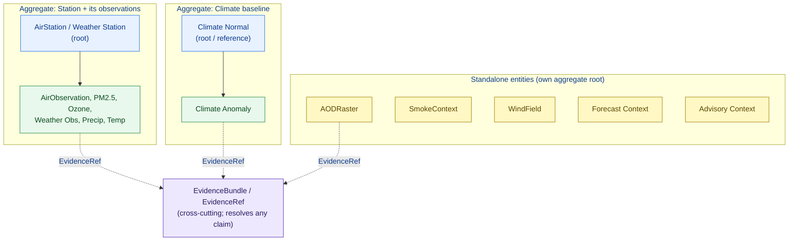

<!-- [KFM_META_BLOCK_V2]
doc_id: kfm://doc/atmosphere/object-family-notes
title: Atmosphere/Air — Object Family Notes
type: standard
version: v1
status: draft
owners: TODO-atmosphere-domain-steward, TODO-docs-steward
created: 2026-05-29
updated: 2026-05-29
policy_label: public
contract_version: 3.0.0
related:
  - docs/domains/atmosphere/OBJECT_FAMILY_MAP.md
  - docs/domains/atmosphere/UBIQUITOUS_LANGUAGE.md
  - docs/domains/atmosphere/KNOWLEDGE_CHARACTERS.md
  - docs/domains/atmosphere/README.md
  - docs/domains/atmosphere/MISSING_OR_PLANNED_FILES.md
  - contracts/domains/atmosphere/
  - schemas/contracts/v1/domains/atmosphere/
  - docs/doctrine/directory-rules.md
  - ai-build-operating-contract.md
tags: [kfm, atmosphere, air, object-family, ddd, rationale, design-notes]
notes:
  - CONTRACT_VERSION 3.0.0 pinned; doctrine-adjacent design-notes companion.
  - Companion to OBJECT_FAMILY_MAP.md - this file is the rationale, that file is the reference table.
  - DDD classifications are PROPOSED applications of the DDD Reference to KFM; not yet ratified.
  - No mounted repo this session; every contract/schema path is PROPOSED.
  - Meta Block v2 carries no nested HTML comments; inline annotation uses # only.
[/KFM_META_BLOCK_V2] -->

# Atmosphere/Air — Object Family Notes

> The rationale companion to the [Object Family Map](./OBJECT_FAMILY_MAP.md): why each Atmosphere/Air object family is modeled the way it is — DDD classification, identity and aggregate boundaries, modeling tradeoffs, edge cases, and the open design questions that contracts and schemas must resolve.

> **Status:** draft · **Owners:** TODO-atmosphere-domain-steward · TODO-docs-steward · **Updated:** 2026-05-29 · **CONTRACT_VERSION = "3.0.0"**

---

## Table of Contents

- [1. Scope and Relationship to the Object Family Map](#1-scope-and-relationship-to-the-object-family-map)
- [2. Truth Posture and Method](#2-truth-posture-and-method)
- [3. DDD Classification of Atmosphere/Air Objects](#3-ddd-classification-of-atmosphereair-objects)
- [4. Aggregate Boundaries](#4-aggregate-boundaries)
- [5. Identity Notes — Why `object_role` Is in the Key](#5-identity-notes--why-object_role-is-in-the-key)
- [6. Per-Object Modeling Notes](#6-per-object-modeling-notes)
  - [6.1 AirStation and Weather Station](#61-airstation-and-weather-station)
  - [6.2 AirObservation, PM2.5, Ozone](#62-airobservation-pm25-ozone)
  - [6.3 AODRaster and SmokeContext](#63-aodraster-and-smokecontext)
  - [6.4 Weather Observation, WindField, Precipitation, Temperature](#64-weather-observation-windfield-precipitation-temperature)
  - [6.5 Climate Normal and Climate Anomaly](#65-climate-normal-and-climate-anomaly)
  - [6.6 Forecast Context and Advisory Context](#66-forecast-context-and-advisory-context)
- [7. Edge Cases and Anti-Patterns](#7-edge-cases-and-anti-patterns)
- [8. Decisions Deferred to ADRs](#8-decisions-deferred-to-adrs)
- [Open questions register](#open-questions-register)
- [Open verification backlog](#open-verification-backlog)
- [Changelog](#changelog)
- [Definition of done](#definition-of-done)
- [Related Docs](#related-docs)
- [Footer](#footer)

---

## 1. Scope and Relationship to the Object Family Map

The [Object Family Map](./OBJECT_FAMILY_MAP.md) is the **reference table**: the roster, knowledge-character binding, identity rule, temporal handling, and contract/schema crosswalk. This file is the **rationale**: it records *why* those choices were made, the DDD reasoning behind entity/value-object/aggregate classification, the modeling tradeoffs, and the design questions still open.

The two are meant to be read together. The Map answers "what is the object and where does it live?"; these Notes answer "why is it shaped that way, and what could break it?"

> [!NOTE]
> If the Map and these Notes ever disagree on a roster fact (object name, ownership, knowledge character), the **Map wins** and these Notes are corrected — the Map is the reference surface. These Notes never introduce a new owned object that the Map does not list.

[Back to top](#table-of-contents)

---

## 2. Truth Posture and Method

> [!IMPORTANT]
> The object roster is CONFIRMED (Atlas §11.B). The **DDD classifications, aggregate boundaries, and modeling rationale in this file are PROPOSED** — they apply the patterns from the Domain-Driven Design Reference to KFM objects, following the v2.1 DDD Pattern Crosswalk, but the Atlas does not itself assign DDD stereotypes to Atmosphere/Air objects. No mounted repository was inspected this session, so all contract/schema paths are PROPOSED.

DDD patterns used here, from the Domain-Driven Design Reference (Eric Evans, CC-BY 4.0):

- **Entity** — an object defined by identity that runs through time, not by its attributes. **[EXTERNAL — DDD Reference]**
- **Value Object** — an object defined by its attributes, with no thread of identity through time. **[EXTERNAL — DDD Reference]**
- **Aggregate** — a cluster of associated objects treated as a unit for data change, with one entity as the root; external objects hold references to the root only. **[EXTERNAL — DDD Reference]**
- **Factory** — encapsulates creation of a complex aggregate or value object, enforcing invariants at construction. **[EXTERNAL — DDD Reference]**
- **Anti-Corruption Layer** — an isolating translation layer that stops an external model from corrupting the domain model; in KFM, source watchers/connectors play this role. **[CONFIRMED application — v2.1 DDD Crosswalk]**

> [!NOTE]
> The DDD Reference is an external CC-BY work used here only to supply generic pattern definitions. It does **not** override KFM doctrine, and the KFM-specific application of each pattern is governed by project knowledge (the v2.1 DDD Crosswalk), not by the reference.

[Back to top](#table-of-contents)

---

## 3. DDD Classification of Atmosphere/Air Objects

PROPOSED classification. Observations are **entities** in KFM because they carry a thread of identity (`source_id + object_role + temporal_scope + normalized_digest`) and a six-time temporal lifecycle, including a `correction_time` — i.e., the same logical reading persists through corrections rather than being replaced. Purely descriptive, attribute-only constructs are **value objects**.

| Object | DDD stereotype (PROPOSED) | Why |
|---|---|---|
| AirStation | Entity | Persistent site identity; observations attach to it over time. |
| Weather Station | Entity | Same as AirStation. |
| AirObservation | Entity | Identity + six-time lifecycle + correction thread. |
| PM2.5 Observation | Entity | Same; carries knowledge-character role. |
| Ozone Observation | Entity | Same. |
| Weather Observation | Entity | Same. |
| WindField | Entity | Identity persists across corrections; role (obs/model) is part of identity. |
| Precipitation Observation | Entity | Same. |
| Temperature Observation | Entity | Same. |
| AODRaster | Entity | A released raster derivative with identity and release/correction times. |
| SmokeContext | Entity | Identity + source-role + correction thread. |
| Climate Normal | Entity (reference object) | A baseline of record that other objects anchor to; stable identity. |
| Climate Anomaly | Entity | Anchored to a Climate Normal; carries its own release/correction lifecycle. |
| Forecast Context | Entity | A modeled field with identity, valid-time, and release lifecycle. |
| Advisory Context | Entity (referral) | A referral object with identity and release/correction times. |
| *(field-level)* parameter + unit | Value Object | Attribute-only; no identity thread. Lives in the parameter registry. |
| *(field-level)* Citation, time interval | Value Object | Attribute-only descriptive parts of an entity. |

> [!NOTE]
> Every Atmosphere/Air *object family* is modeled as an **entity** because each must survive correction and supersession (operating contract invariant: corrections are first-class). Value objects appear only at the field level (units, citations, intervals). This mirrors the v2.1 DDD Crosswalk, which classifies KFM manifests/receipts/bundles as entities with `identity = id + version + spec_hash` and treats `Citation`, `GeographyVersion`, etc. as value objects.

[Back to top](#table-of-contents)

---

## 4. Aggregate Boundaries

PROPOSED aggregates. An aggregate clusters objects that change together under one root; external references point at the root only.

Notes on the boundaries:

- **Station aggregate.** A station and the observations taken at it change together at ingest; the station is the natural root. External objects (e.g., a layer) reference the station, not individual observations. **[PROPOSED]**
- **Climate baseline aggregate.** A Climate Anomaly is meaningless without its Climate Normal, so they form one aggregate rooted at the Normal. **[PROPOSED]**
- **Standalone entities.** Raster/model/referral objects (AODRaster, SmokeContext, WindField, Forecast Context, Advisory Context) are large or independently released; each is its own aggregate root rather than nested under a station. **[PROPOSED]**
- **EvidenceBundle is not nested.** Per KFM doctrine, `EvidenceRef` resolves to a cross-cutting `EvidenceBundle`; it is a shared reference, not a member of any Atmosphere/Air aggregate. The v2.1 DDD Crosswalk treats `EvidenceRef` and the trust-membrane invariants as the **shared kernel** between contexts. **[CONFIRMED application]**

> [!CAUTION]
> The DDD Reference warns that a shared kernel only works between teams in close coordination. KFM's "team" is the doctrine itself rather than people, so the `EvidenceRef` shared kernel needs the per-domain translator discipline that connectors (anti-corruption layers) provide. This is flagged as OPEN-DDD-02 in the MapLibre report and echoed here as OQ-AIRNOTE-04.

[Back to top](#table-of-contents)

---

## 5. Identity Notes — Why `object_role` Is in the Key

The Atlas identity rule is `source_id + object_role + temporal_scope + normalized_digest` (PROPOSED). The presence of `object_role` is deliberate and load-bearing:

- The **same physical reading** admitted under two knowledge characters (e.g., a PM2.5 value as `OBSERVED_SENSOR` from a reference monitor vs. `PUBLIC_AQI_REPORT` from an agency feed) yields **two distinct identities**. This is intended: it prevents an aggregate-as-source-role-upgrade, where a report is silently re-presented as a raw observation.
- `temporal_scope` (not a single timestamp) keeps the six distinct times from collapsing into the key. A correction issued later produces a new `normalized_digest` but the same logical thread, which is how corrections stay first-class.
- `normalized_digest` is computed **after** normalization (units, geometry, time), so two byte-different source payloads that mean the same thing collapse to one identity, while two same-looking payloads with different roles do not.

> [!IMPORTANT]
> The digest algorithm (BLAKE3 vs SHA-256) and the exact normalization input are **NEEDS VERIFICATION** — they are repo-wide decisions, not Atmosphere/Air-local ones. Until fixed by ADR, identity is PROPOSED.

[Back to top](#table-of-contents)

---

## 6. Per-Object Modeling Notes

All rationale below is PROPOSED unless a CONFIRMED doctrine point is cited.

### 6.1 AirStation and Weather Station

Modeled as entities and aggregate roots. Their sensitivity hook is `NETWORK_AND_SITE_CONTEXT`: exact siting coordinates can implicate private land or infrastructure, so coordinates are generalized before public release (operating contract §23.2 default disposition). The two are kept as **separate** object families rather than one "Station" type because air-quality and meteorological networks have different source families, cadences, and rights — merging them would blur the source-role boundary.

### 6.2 AirObservation, PM2.5, Ozone

`AirObservation` is the general case; `PM2.5 Observation` and `Ozone Observation` are modeled as **distinct families** rather than parameterized instances of AirObservation because each carries pollutant-specific anti-collapse rules and canonical units, and because the Atlas §11.B owns-list names them separately. The dominant edge case is **AQI vs concentration**: an AQI is a `PUBLIC_AQI_REPORT`, never an `OBSERVED_SENSOR` concentration (CONFIRMED §11.I). Low-cost-sensor readings take the `LOW_COST_SENSOR` role and require caveat/confidence/limitation fields before any public release.

### 6.3 AODRaster and SmokeContext

`AODRaster` is a `REMOTE_SENSING_MASK` — a satellite proxy, **not** a PM2.5 measurement (CONFIRMED §11.I). Modeled as a standalone entity because rasters are large and released independently of any station. `SmokeContext` is the trickiest object in the lane: its knowledge character is **source-dependent** — `REMOTE_SENSING_MASK` for an HMS analysis, `ATMOSPHERIC_MODEL_FIELD` for an HRRR-Smoke forecast — so a single schema must carry a required source-role discriminator. It is also the **cross-lane collision point**: Hazards owns a `SmokeContext` too. The PROPOSED split is that Atmosphere/Air owns the *atmospheric reading* and Hazards owns the *event/impact projection*; this is unresolved (OQ-AIRNOTE-01, mirrors the Map's OQ-AIROBJ-03).

### 6.4 Weather Observation, WindField, Precipitation, Temperature

All entities. `WindField` is role-ambiguous (observed station wind vs modeled wind field), so like SmokeContext it needs a source-role discriminator and a `model_is_not_observation` denial when modeled. Precipitation and Temperature are straightforward observations whose main discipline is canonical units. Weather Observation can act as `METEOROLOGICAL_CONTEXT` (supporting another domain's claim) rather than a primary claim; that role must be tagged so context is not presented as a primary measurement.

### 6.5 Climate Normal and Climate Anomaly

These form one aggregate rooted at the Normal. A Climate Normal is a **reference object** (a baseline of record, e.g., a 30-year normal) and must carry its reference period. A Climate Anomaly is meaningless without anchoring to a specific Normal, so the schema MUST require that anchor; an anomaly presented without its baseline is an anti-pattern. Both are `CLIMATE_ANOMALY_CONTEXT`, never observations.

> [!NOTE]
> **Placement edge case.** Whether Climate Normal/Anomaly stay inside Atmosphere/Air or split into a `climate/` sub-segment is an open question; the Atlas §11.B places them inside Atmosphere/Air, so this file keeps them here pending ADR (mirrors the planned-files register OQ).

### 6.6 Forecast Context and Advisory Context

`Forecast Context` is an `ATMOSPHERIC_MODEL_FIELD` — modeled, never observed; the `model_is_not_observation` denial is its core guard. `Advisory Context` is `ALERT_AND_ADVISORY_CONTEXT` and is **referral-only**: it points to an authoritative advisory and MUST NOT emit life-safety instructions. Life-safety belongs to Hazards, which itself "is not an emergency alert system" (CONFIRMED Atlas §11.B / §12.B). This is the strongest publication guard in the lane.

[Back to top](#table-of-contents)

---

## 7. Edge Cases and Anti-Patterns

| Edge case | Risk | Guard |
|---|---|---|
| AQI shown as concentration | Misleads public on actual pollutant levels | `aqi_is_not_concentration` denial; distinct knowledge characters in identity |
| AOD raster read as PM2.5 | Satellite proxy mistaken for ground truth | `aod_is_not_pm25` denial; `REMOTE_SENSING_MASK` tag |
| Forecast/model field shown as observation | Model presented as measured reality | `model_is_not_observation` denial; role in identity key |
| SmokeContext name collision with Hazards | Two lanes' objects merged; ownership ambiguity | Keep separate; resolve by ADR (OQ-AIRNOTE-01) |
| Climate Anomaly without its Normal | Anomaly meaningless / misread | Schema requires Normal anchor |
| Low-cost sensor released without caveats | Uncalibrated data presented as reference-grade | Caveat/confidence/limitation fields required |
| Station coordinates exposed | Private-land / infrastructure exposure | Generalize coordinates; §23.2 routing |
| Source-role upgrade by paraphrase | Aggregate quoted as per-place fact | Cite-or-abstain; AIReceipt; `object_role` in identity |

[Back to top](#table-of-contents)

---

## 8. Decisions Deferred to ADRs

These modeling choices are recorded here as PROPOSED and are deferred to ADRs rather than settled in this file:

- **Knowledge-character binding** — freeze the object → character mapping, including role-dependent objects (`ADR-XXXX-atmosphere-knowledge-character-vocabulary`).
- **SmokeContext ownership split** — Atmosphere/Air reading vs Hazards event/impact (`ADR-XXXX-atmosphere-hazards-smokecontext-ownership`).
- **Identity digest** — algorithm and normalization input (repo-wide ADR).
- **Climate sub-segment** — whether Climate Normal/Anomaly split into `climate/` within the domain.
- **Aggregate boundaries** — ratify the station and climate aggregates above, or revise.

[Back to top](#table-of-contents)

---

## Open questions register

| ID | Question | Owner role | Resolution path |
|---|---|---|---|
| OQ-AIRNOTE-01 | Resolve SmokeContext ownership between Atmosphere/Air (reading) and Hazards (event/impact). | atmosphere + hazards stewards | `ADR-XXXX-atmosphere-hazards-smokecontext-ownership` |
| OQ-AIRNOTE-02 | Ratify the PROPOSED aggregate boundaries (station aggregate, climate aggregate, standalone entities). | atmosphere-domain-steward | ADR + schema review |
| OQ-AIRNOTE-03 | Confirm every Atmosphere/Air object family is an entity (vs any modeled as value objects). | atmosphere-domain-steward | DDD review + schema decision |
| OQ-AIRNOTE-04 | Does the `EvidenceRef` shared kernel need per-domain translator layers, given DDD's shared-kernel caution? | docs-steward + domain stewards | Mirrors OPEN-DDD-02; ADR |
| OQ-AIRNOTE-05 | `OBJECT_FAMILY_NOTES.md` is not yet listed in the planned-files register §6.1. Add it. | docs-steward | Update `MISSING_OR_PLANNED_FILES.md` §6.1 |

## Open verification backlog

These items remain `NEEDS VERIFICATION` before promotion from `draft` to `published`:

1. Add `OBJECT_FAMILY_NOTES.md` to the planned-files register §6.1 docs surface.
2. Ratify DDD entity/value-object/aggregate classifications via ADR or schema review.
3. Resolve the SmokeContext cross-lane ownership ADR.
4. Confirm the identity-digest algorithm and normalization input.
5. Repository mounting and reclassification of every `contracts/`/`schemas/` path referenced.

## Changelog

| Change | Type (per contract §37) | Reason |
|---|---|---|
| Initial creation of the Atmosphere/Air Object Family Notes | new | Rationale companion to OBJECT_FAMILY_MAP; records DDD classification and modeling tradeoffs. |

> **Backward compatibility.** New file; no anchors to preserve.

## Definition of done

This document is done enough to enter the repository when:

- it is placed at `docs/domains/atmosphere/OBJECT_FAMILY_NOTES.md` per Directory Rules;
- it is added to the planned-files register §6.1 (OQ-AIRNOTE-05);
- a docs steward and the atmosphere-domain steward review it;
- it is linked from `docs/domains/atmosphere/README.md` and from `OBJECT_FAMILY_MAP.md`;
- it does not conflict with accepted ADRs (and OQ-AIRNOTE-01/02 are at least filed);
- any conflict with current repo conventions is logged in `docs/registers/DRIFT_REGISTER.md`;
- the `GENERATED_RECEIPT.json` planned in the PR (CONTRACT_VERSION `3.0.0`) is wired into CI;
- future changes follow the operating contract's §37 lifecycle.

[Back to top](#table-of-contents)

---

## Related Docs

- `docs/domains/atmosphere/OBJECT_FAMILY_MAP.md` — the reference table this file annotates.
- `docs/domains/atmosphere/UBIQUITOUS_LANGUAGE.md` — knowledge-character vocabulary (TODO).
- `docs/domains/atmosphere/KNOWLEDGE_CHARACTERS.md` — knowledge-character registry (TODO).
- `docs/domains/atmosphere/README.md` — domain landing page (TODO if not present).
- `docs/domains/atmosphere/MISSING_OR_PLANNED_FILES.md` — planned-files register.
- `contracts/domains/atmosphere/` — semantic object contracts.
- `docs/doctrine/directory-rules.md` — placement law.
- `ai-build-operating-contract.md` — canonical operating contract (CONTRACT_VERSION 3.0.0).

---

## Footer

---

**Related:** [Object Family Map](./OBJECT_FAMILY_MAP.md) · [README](./README.md) · [Ubiquitous Language](./UBIQUITOUS_LANGUAGE.md) · [Knowledge Characters](./KNOWLEDGE_CHARACTERS.md) · [Planned Files](./MISSING_OR_PLANNED_FILES.md) · [Directory Rules](../../doctrine/directory-rules.md)

**Last updated:** 2026-05-29 · **Version:** v1 · **Status:** draft · **CONTRACT_VERSION = "3.0.0"**

[⤴ Back to top](#table-of-contents)
