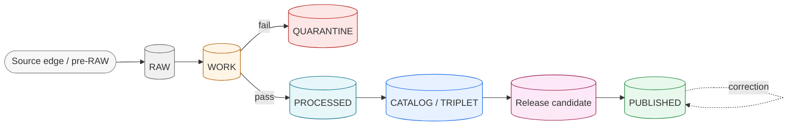
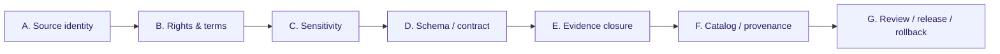
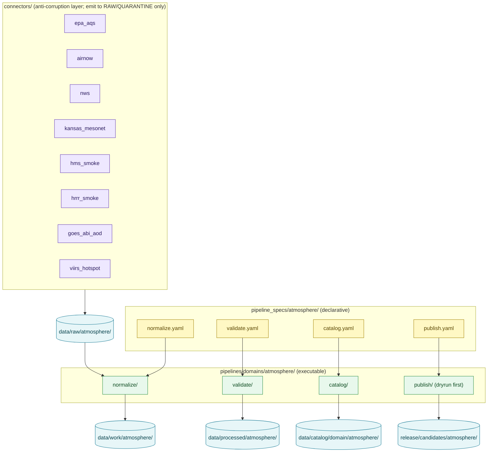

<!-- [KFM_META_BLOCK_V2]
doc_id: kfm://doc/atmosphere/pipeline
title: Atmosphere/Air — Pipeline (RAW → PUBLISHED)
type: standard
version: v1
status: draft
owners: TODO-atmosphere-domain-steward, TODO-pipeline-steward, TODO-docs-steward
created: 2026-05-29
updated: 2026-05-29
policy_label: public
contract_version: 3.0.0
related:
  - docs/domains/atmosphere/README.md
  - docs/domains/atmosphere/OBJECT_FAMILY_MAP.md
  - docs/domains/atmosphere/SOURCE_FAMILIES.md
  - docs/domains/atmosphere/PUBLICATION_POSTURE.md
  - docs/domains/atmosphere/MISSING_OR_PLANNED_FILES.md
  - pipeline_specs/atmosphere/
  - pipelines/domains/atmosphere/
  - connectors/
  - docs/doctrine/directory-rules.md
  - ai-build-operating-contract.md
tags: [kfm, atmosphere, air, pipeline, lifecycle, promotion-gates, dryrun]
notes:
  - CONTRACT_VERSION 3.0.0 pinned; doctrine-adjacent pipeline doc.
  - Lifecycle law and gate A-G sequence are CONFIRMED doctrine; lane application is PROPOSED.
  - No mounted repo this session; every path, route, and runtime claim is PROPOSED.
  - First Atmosphere/Air pipeline is dryrun-only - no live fetch, no public promotion.
  - Meta Block v2 carries no nested HTML comments; inline annotation uses # only.
[/KFM_META_BLOCK_V2] -->

# Atmosphere/Air — Pipeline (RAW → PUBLISHED)

> How Atmosphere/Air evidence moves from a source capture to a public-safe release: the lifecycle stages, the promotion gates each transition must pass, the connectors and specs that drive it, and the fail-closed rules that keep the trust membrane intact.

[](#)
[](./README.md)
[](#3-lifecycle-stages)
[](#5-promotion-gates-ag)
[](#7-connectors-specs-and-execution)
[](#)
[](#footer)

> **Status:** draft · **Owners:** TODO-atmosphere-domain-steward · TODO-pipeline-steward · TODO-docs-steward · **Updated:** 2026-05-29 · **CONTRACT_VERSION = "3.0.0"**

---

## Table of Contents

- [1. Scope and Purpose](#1-scope-and-purpose)
- [2. Truth Posture and Evidence Basis](#2-truth-posture-and-evidence-basis)
- [3. Lifecycle Stages](#3-lifecycle-stages)
- [4. Stage Gate Table](#4-stage-gate-table)
- [5. Promotion Gates A–G](#5-promotion-gates-ag)
- [6. Promotion Is a Governed State Transition](#6-promotion-is-a-governed-state-transition)
- [7. Connectors, Specs, and Execution](#7-connectors-specs-and-execution)
- [8. Data Homes by Stage](#8-data-homes-by-stage)
- [9. Anti-Collapse and Fail-Closed Rules](#9-anti-collapse-and-fail-closed-rules)
- [10. Correction, Stale-State, and Rollback](#10-correction-stale-state-and-rollback)
- [11. Dryrun-First Rollout](#11-dryrun-first-rollout)
- [Open questions register](#open-questions-register)
- [Open verification backlog](#open-verification-backlog)
- [Changelog](#changelog)
- [Definition of done](#definition-of-done)
- [Related Docs](#related-docs)
- [Footer](#footer)

---

## 1. Scope and Purpose

This document is the executable-flow reference for the Atmosphere/Air lane. It describes how the domain's objects — AirObservation, PM2.5, AODRaster, SmokeContext, Forecast Context, and the rest of the [object family map](./OBJECT_FAMILY_MAP.md) — travel the canonical KFM lifecycle and what each promotion gate requires.

**This document covers** the stage-by-stage handling, the gate artifacts, the connectors and pipeline specs that drive the flow, the data homes at each stage, and the correction/rollback path.

**This document does not cover** source rights and cadence (see [SOURCE_FAMILIES](./SOURCE_FAMILIES.md) and `data/registry/sources/atmosphere/`), object meaning/shape (see contracts and schemas), or publication sensitivity rules in depth (see [PUBLICATION_POSTURE](./PUBLICATION_POSTURE.md)). It references all of them.

> [!IMPORTANT]
> The first Atmosphere/Air pipeline PR is **dryrun-only**: no live fetch, no public promotion, no UI/API binding beyond typed contract notes. Connectors and executable pipelines come only after the docs/registry/schema/fixture/validator/policy slice clears (see §11).

[Back to top](#table-of-contents)

---

## 2. Truth Posture and Evidence Basis

> [!NOTE]
> The **lifecycle law** (`RAW → WORK / QUARANTINE → PROCESSED → CATALOG / TRIPLET → PUBLISHED`) and the **A–G gate sequence** are CONFIRMED doctrine. Their **application to the Atmosphere/Air lane** is PROPOSED. No mounted repository was inspected this session, so every path, route name, runtime behavior, and enforcement claim is PROPOSED or NEEDS VERIFICATION.

Evidence used, all CONFIRMED in indexed project knowledge:

- **Atlas §11.H** — the Atmosphere/Air per-stage gate table (RAW→PUBLISHED). **[CONFIRMED doctrine / PROPOSED lane application]**
- **Atlas §11.I** — publication posture and anti-collapse rules. **[CONFIRMED]**
- **Atlas §11.M** — publication, correction, rollback requirements. **[CONFIRMED doctrine / PROPOSED implementation]**
- **Build Manual §6.1 / §6.2** — lifecycle layer table and promotion gates A–G with required proof. **[CONFIRMED]**
- **Doctrine Synthesis §6–§8** — lifecycle stages, promotion-as-decision, `PromotionDecision` record, gates A–G. **[CONFIRMED]**
- **Directory Rules** — connector/pipeline/data placement and the watcher-as-non-publisher rule. **[CONFIRMED]**
- **`ai-build-operating-contract.md` v3.0** — invariants (promotion is a governed transition; cite-or-abstain; fail-closed). **[CONFIRMED — CONTRACT_VERSION 3.0.0]**

[Back to top](#table-of-contents)

---

## 3. Lifecycle Stages



| Stage | What lives here (Atmosphere/Air) | Must NOT contain |
|---|---|---|
| **Pre-RAW** | Watcher/event envelopes for AirNow/Mesonet/NWS/HMS source changes; admission decisions. | Public exposure. |
| **RAW** | Immutable source captures with source role, rights, sensitivity, citation, time, hash. | Normalized or public claims. |
| **WORK** | Schema/unit/identity/time normalization of observations and rasters. | Unvalidated public candidates. |
| **QUARANTINE** | Held failures (bad units, missing source role, unresolved rights) with reason codes. | Silent promotion. |
| **PROCESSED** | Validated objects + receipts + public-safe candidates; `EvidenceRef` resolves. | RAW/WORK leakage. |
| **CATALOG / TRIPLET** | Catalog records (STAC/DCAT/PROV), `EvidenceBundle`, projections, release candidates. | Uncited claims. |
| **PUBLISHED** | Released public-safe MapLibre/tile layers served via governed API only. | RAW/WORK/QUARANTINE/exact restricted geometry/model runtimes. |

> [!TIP]
> **Watchers and connectors are candidate producers, not publishers.** A watcher can emit "something changed" plus a receipt; it cannot make a public release true. Connector output goes only to `data/raw/atmosphere/...` or `data/quarantine/atmosphere/...`.

[Back to top](#table-of-contents)

---

## 4. Stage Gate Table

The Atmosphere/Air per-stage gates, from Atlas §11.H. Each transition **fails closed** — on any missing artifact it holds the prior stage rather than promoting.

| Stage | Handling | Gate (required to leave) | Status |
|---|---|---|---|
| **RAW** | Capture immutable source payload/reference with source role, rights, sensitivity, citation, time, hash. | `SourceDescriptor` exists. | PROPOSED |
| **WORK / QUARANTINE** | Normalize schema, geometry, time, identity, evidence, rights, policy; hold failures. | Validation + policy gate pass, **or** quarantine reason recorded. | PROPOSED |
| **PROCESSED** | Emit validated normalized objects, receipts, public-safe candidates. | `EvidenceRef`, `ValidationReport`, and digest closure exist. | PROPOSED |
| **CATALOG / TRIPLET** | Emit catalog records, `EvidenceBundle`s, graph/triplet projections, release candidates. | Catalog/proof closure passes. | PROPOSED |
| **PUBLISHED** | Serve released public-safe artifacts through governed APIs and manifests. | `ReleaseManifest`, correction path, rollback target, review/policy state exist. | PROPOSED |

[Back to top](#table-of-contents)

---

## 5. Promotion Gates A–G

The universal KFM gate sequence (Build Manual §6.2, Doctrine Synthesis §8), specialized for Atmosphere/Air. Letter labels are conventional; the **sequence is the doctrine** and may be finalized by ADR.



| Gate | Atmosphere/Air specialization | Required proof |
|---|---|---|
| **A. Source identity** | SourceDescriptor for the source family (OpenAQ-like, EPA AQS, AirNow, NWS, Mesonet, HMS, HRRR-Smoke, GOES/ABI AOD, VIIRS, CAMS, climate normals); source role set (observation / report / model / mask). | `SourceDescriptor` validation report. |
| **B. Rights & terms** | Source rights/terms resolved — **all atmosphere source rights are NEEDS VERIFICATION per Atlas §11.D**; sensitive joins fail closed. | `RightsReviewRecord`. |
| **C. Sensitivity** | Station-coordinate generalization (`NETWORK_AND_SITE_CONTEXT`); low-cost-sensor caveats; no precise location exposure. | `PolicyDecision` + `RedactionReceipt` where applicable. |
| **D. Schema / contract** | Object validates against `schemas/contracts/v1/domains/atmosphere/...`; knowledge-character tag present; units canonical. | `SchemaValidationReport`. |
| **E. Evidence closure** | `EvidenceRef` resolves to `EvidenceBundle`; citations valid; AQI/AOD/model anti-collapse checks pass. | `EvidenceBundle` + `CitationValidationReport`. |
| **F. Catalog / provenance** | STAC/DCAT/PROV + CatalogMatrix closed for the atmosphere object. | `CatalogMatrixReport`. |
| **G. Review / release / rollback** | `PromotionDecision`, `ReleaseManifest`, rollback target, correction path; release authority distinct from author when materiality applies. | `PromotionReceipt` + `ReleaseManifest` + `RollbackCard`. |

> [!IMPORTANT]
> Missing any required artifact, an unresolved `EvidenceRef`, or an unrecorded `PolicyDecision` **MUST fail the transition closed** and preserve the prior lifecycle state (Doctrine Synthesis / Pipeline Gate Reference).

[Back to top](#table-of-contents)

---

## 6. Promotion Is a Governed State Transition

Promotion is a **decision recorded against evidence**, not a file move. The Atmosphere/Air pipeline records a `PromotionDecision` at each promoting transition:

```text
PromotionDecision {
  promotion_id: stable_id,
  target_stage: PROCESSED | CATALOG | PUBLISHED,
  domain: "atmosphere",
  inputs: [EvidenceRef, ValidationReport, PolicyDecision, ...],
  gates_passed: [A, B, ..., G],
  gates_held:   [...],
  gates_denied: [...],
  release_target: ReleaseManifest.id,        # where applicable
  rollback_target: prior_release_id,         # where applicable
  steward: actor_id,
  reviewer: actor_id,                        # where required
  decision: ALLOW | DENY | HOLD,
  reason_codes: [...],
  spec_hash: <JCS + SHA-256 over canonicalized record>,
  timestamp_utc: ISO8601
}
```

> [!CAUTION]
> **Anti-collapse rule (CONFIRMED).** Catalog records, triplets, graph projections, PMTiles, layer manifests, model outputs, summaries, and UI answers are derivative or publication surfaces — **they do not become root truth**. Every atmosphere claim must trace back through `EvidenceRef` → `EvidenceBundle` → receipts → `PolicyDecision` → release records.

[Back to top](#table-of-contents)

---

## 7. Connectors, Specs, and Execution

Per Directory Rules, source fetch/admission lives in `connectors/<source>/`, executable logic in `pipelines/domains/atmosphere/`, and declarative config in `pipeline_specs/atmosphere/`. **Connectors do not publish.** All PROPOSED.



| Source family | Connector (PROPOSED) | Source role | Note |
|---|---|---|---|
| EPA AQS-like archive | `connectors/epa_aqs/` | regulatory archive / observation | Rights NEEDS VERIFICATION. |
| AirNow / agency | `connectors/airnow/` | public AQI report | AQI ≠ concentration. |
| NWS | `connectors/nws/` | observation + advisory | AdvisoryContext only, not life-safety. |
| Kansas Mesonet | `connectors/kansas_mesonet/` | observation | — |
| NOAA HMS | `connectors/hms_smoke/` | remote-sensing analysis | `REMOTE_SENSING_MASK`. |
| NOAA HRRR-Smoke | `connectors/hrrr_smoke/` | model field | `ATMOSPHERIC_MODEL_FIELD`. |
| GOES/ABI AOD | `connectors/goes_abi_aod/` | remote-sensing mask | AOD ≠ PM2.5. |
| VIIRS fire/hotspot | `connectors/viirs_hotspot/` | observation/detection | Cross-lane: Hazards primary use. |

> [!NOTE]
> Connectors act as the **anti-corruption layer** (DDD): they translate each external source's model into KFM objects so an external schema never corrupts the domain model. They write to RAW or QUARANTINE only.

[Back to top](#table-of-contents)

---

## 8. Data Homes by Stage

PROPOSED homes per Directory Rules Domain Placement Law. A move that skips validators, policy gates, EvidenceBundle creation, catalog closure, or release recording is a violation **regardless of directory** — promotion is not a `mv`.

| Stage | Path (PROPOSED) |
|---|---|
| Source descriptors | `data/registry/sources/atmosphere/` |
| RAW | `data/raw/atmosphere/<source_id>/<run_id>/` |
| WORK | `data/work/atmosphere/<run_id>/` |
| QUARANTINE | `data/quarantine/atmosphere/<reason>/<run_id>/` |
| PROCESSED | `data/processed/atmosphere/<dataset_id>/<version>/` |
| CATALOG / TRIPLET | `data/catalog/domain/atmosphere/` |
| Release candidate | `release/candidates/atmosphere/<release_id>/` |
| PUBLISHED | `data/published/layers/atmosphere/` (read by `apps/governed-api/` only) |
| Receipts / proofs | `data/receipts/...` / `data/proofs/...` (domain-scoping NEEDS VERIFICATION) |

[Back to top](#table-of-contents)

---

## 9. Anti-Collapse and Fail-Closed Rules

Per Atlas §11.I (CONFIRMED), the pipeline MUST enforce these at the WORK→PROCESSED and CATALOG gates via `policy/domains/atmosphere/`:

- **AQI is not concentration** — `aqi_is_not_concentration` DENY.
- **AOD is not PM2.5** — `aod_is_not_pm25` DENY.
- **Model is not observation** — `model_is_not_observation` DENY (Forecast Context, WindField model role, SmokeContext forecast role).
- **Low-cost sensor** public release requires correction, caveats, confidence, limitations.
- **Advisory is not life-safety** — `advisory_no_life_safety` DENY; redirect to authoritative source.
- **Dryrun no live fetch** — `dryrun_no_live_fetch` DENY during dryrun pipelines and fixture tests.
- **Unclear rights, unresolved source role, missing evidence, unresolved sensitivity, or absent release state blocks public promotion** (CONFIRMED §11.I).

> [!IMPORTANT]
> Each DENY rule MUST be exercised by a negative-path test (DENY/ABSTAIN/ERROR), not only a happy-path test. See the validator/fixture rows in the planned-files register §6.5.

[Back to top](#table-of-contents)

---

## 10. Correction, Stale-State, and Rollback

Per Atlas §11.M (CONFIRMED doctrine / PROPOSED implementation), an Atmosphere/Air publication requires a `ReleaseManifest`, `EvidenceBundle`, validation/policy support, review state where required, a correction path, a stale-state rule, and a rollback target.

| Concern | Mechanism | Note |
|---|---|---|
| **Correction** | `CorrectionNotice` (PUBLISHED → PUBLISHED'); downstream derivatives identified and invalidated. | A correction may demote a published object back to a held tier. |
| **Stale-state** | `freshness_gate` policy keyed to source cadence; emits `SOURCE_STALE`. | Pairs with a stale-state UI badge; freshness-expired ≠ corrected. |
| **Rollback** | `RollbackCard` records prior release ID, replacement release ID, invalidation target. | Rollback repoints current release state while preserving history. |

> [!CAUTION]
> Corrections are first-class: withdrawals, supersessions, rollback targets, and lineage MUST stay inspectable. A correction that does not invalidate downstream derivatives (graphs, exports, tiles) is an anti-pattern.

[Back to top](#table-of-contents)

---

## 11. Dryrun-First Rollout

The pipeline is built dryrun-only until the doctrine/registry/schema/validator/policy slice clears. PROPOSED order, consistent with the planned-files register §8:

1. SourceDescriptor README + synthetic no-network fixture.
2. Knowledge-character + parameter-registry schemas.
3. Core object schemas (AirStation, AirObservation, PM2.5) + valid/invalid fixtures.
4. Anti-collapse policies (`aqi_is_not_concentration`, `aod_is_not_pm25`, `model_is_not_observation`, `low_cost_sensor_caveats_required`, `dryrun_no_live_fetch`).
5. Validators with negative-path tests.
6. `pipeline_specs/atmosphere/*.yaml` wired to no-network fixtures (`dryrun_no_live_fetch` passes).
7. Release machinery templates (`ReleaseManifest`, `RollbackCard`).
8. Only after the above: executable pipelines, connectors with live fetch, governed-API routes.

> [!TIP]
> Until step 8, no connector performs a live HTTP fetch and nothing reaches `data/published/layers/atmosphere/`.

[Back to top](#table-of-contents)

---

## Open questions register

| ID | Question | Owner role | Resolution path |
|---|---|---|---|
| OQ-AIRPIPE-01 | Add `PIPELINE.md` to the planned-files register §6.1 docs surface (currently unlisted). | docs-steward | Update `MISSING_OR_PLANNED_FILES.md` §6.1 |
| OQ-AIRPIPE-02 | Finalize the A–G gate letter labels and the `PromotionDecision` schema home. | pipeline-steward | ADR |
| OQ-AIRPIPE-03 | Confirm whether receipts/proofs are global-only or also `data/{receipts,proofs}/atmosphere/`. | pipeline-steward | Per-root README + repo inspection |
| OQ-AIRPIPE-04 | Resolve SmokeContext source-role discriminator (HMS analysis vs HRRR-Smoke forecast) and Hazards ownership split. | atmosphere + hazards stewards | `ADR-XXXX-atmosphere-hazards-smokecontext-ownership` |
| OQ-AIRPIPE-05 | Fix the identity/`spec_hash` digest algorithm (BLAKE3 vs SHA-256) used in PromotionDecision. | docs-steward + domain stewards | Repo-wide ADR |
| OQ-AIRPIPE-06 | Confirm the governed-API route name for the Atmosphere/Air resolver (Atlas marks route UNKNOWN). | pipeline-steward | Repo inspection |

## Open verification backlog

These items remain `NEEDS VERIFICATION` before promotion from `draft` to `published`:

1. Add `PIPELINE.md` to the planned-files register §6.1.
2. Source rights/terms verification for every source family (Atlas §11.D, all NEEDS VERIFICATION).
3. ADR finalizing gate letters and `PromotionDecision` schema home.
4. Confirmation of receipts/proofs scoping.
5. Repository mounting and reclassification of every connector/pipeline/spec/data path.
6. Verification that anti-collapse denials are realized as `policy/domains/atmosphere/` rules with negative tests.
7. Governed-API route name confirmation.

## Changelog

| Change | Type (per contract §37) | Reason |
|---|---|---|
| Initial creation of the Atmosphere/Air pipeline doc | new | Consolidates the lane's lifecycle, gates, connectors, and rollout into one reference. |

> **Backward compatibility.** New file; no anchors to preserve.

## Definition of done

This document is done enough to enter the repository when:

- it is placed at `docs/domains/atmosphere/PIPELINE.md` per Directory Rules;
- it is added to the planned-files register §6.1 (OQ-AIRPIPE-01);
- a docs steward, the atmosphere-domain steward, and a pipeline steward review it;
- it is linked from `docs/domains/atmosphere/README.md`;
- it does not conflict with accepted ADRs (and OQ-AIRPIPE-02/04 are at least filed);
- any conflict with current repo conventions is logged in `docs/registers/DRIFT_REGISTER.md`;
- the `GENERATED_RECEIPT.json` planned in the PR (CONTRACT_VERSION `3.0.0`) is wired into CI;
- future changes follow the operating contract's §37 lifecycle.

[Back to top](#table-of-contents)

---

## Related Docs

- `docs/domains/atmosphere/README.md` — domain landing page (TODO if not present).
- `docs/domains/atmosphere/OBJECT_FAMILY_MAP.md` — object roster the pipeline carries.
- `docs/domains/atmosphere/SOURCE_FAMILIES.md` — source roster and rights (TODO).
- `docs/domains/atmosphere/PUBLICATION_POSTURE.md` — sensitivity/rights/release rules (TODO).
- `docs/domains/atmosphere/MISSING_OR_PLANNED_FILES.md` — planned-files register.
- `pipeline_specs/atmosphere/` · `pipelines/domains/atmosphere/` · `connectors/` — execution surfaces.
- `docs/doctrine/directory-rules.md` — placement law.
- `ai-build-operating-contract.md` — canonical operating contract (CONTRACT_VERSION 3.0.0).

---

## Footer

---

**Related:** [README](./README.md) · [Object Family Map](./OBJECT_FAMILY_MAP.md) · [Source Families](./SOURCE_FAMILIES.md) · [Publication Posture](./PUBLICATION_POSTURE.md) · [Planned Files](./MISSING_OR_PLANNED_FILES.md) · [Directory Rules](../../doctrine/directory-rules.md)

**Last updated:** 2026-05-29 · **Version:** v1 · **Status:** draft · **CONTRACT_VERSION = "3.0.0"**

[⤴ Back to top](#table-of-contents)
