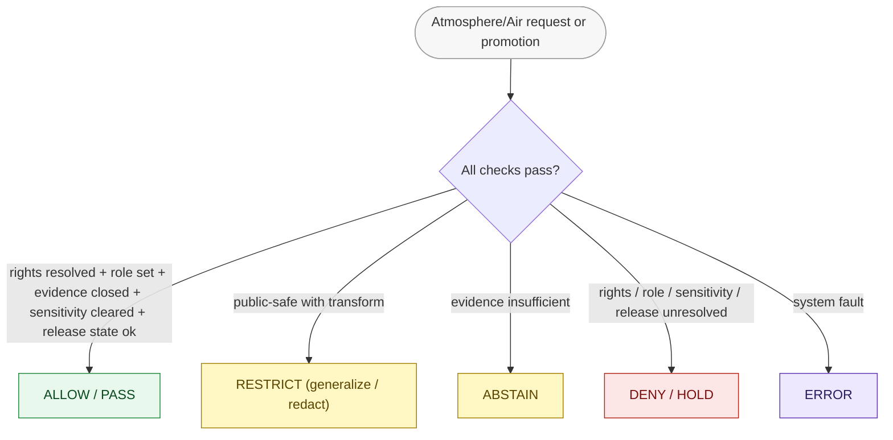
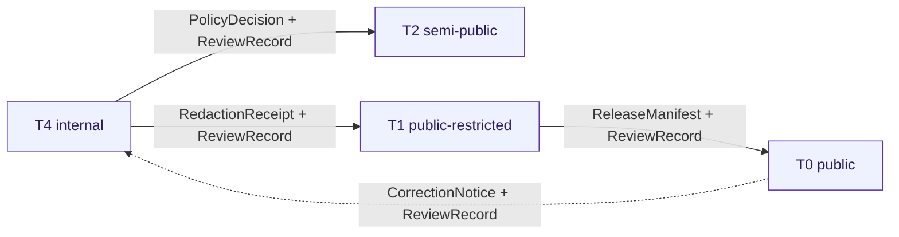

<!-- [KFM_META_BLOCK_V2]
doc_id: kfm://doc/atmosphere/policy
title: Atmosphere/Air — Policy Doctrine (Allow / Deny / Restrict / Abstain)
type: standard
version: v1
status: draft
owners: TODO-atmosphere-domain-steward, TODO-policy-steward, TODO-docs-steward
created: 2026-05-29
updated: 2026-05-29
policy_label: public
contract_version: 3.0.0
related:
  - docs/domains/atmosphere/README.md
  - docs/domains/atmosphere/PIPELINE.md
  - docs/domains/atmosphere/OBJECT_FAMILY_MAP.md
  - docs/domains/atmosphere/PUBLICATION_POSTURE.md
  - docs/domains/atmosphere/MISSING_OR_PLANNED_FILES.md
  - policy/domains/atmosphere/
  - policy/sensitivity/
  - docs/doctrine/directory-rules.md
  - ai-build-operating-contract.md
tags: [kfm, atmosphere, air, policy, allow-deny-restrict-abstain, fail-closed, sensitivity]
notes:
  - CONTRACT_VERSION 3.0.0 pinned; doctrine-adjacent policy doc.
  - This is the human-facing policy doctrine; enforceable bundles live in policy/domains/atmosphere/.
  - Anti-collapse rules are CONFIRMED (Atlas 11.I); rego file paths are PROPOSED.
  - No mounted repo this session; every policy path and enforcement claim is PROPOSED.
  - Meta Block v2 carries no nested HTML comments; inline annotation uses # only.
[/KFM_META_BLOCK_V2] -->

# Atmosphere/Air — Policy Doctrine (Allow / Deny / Restrict / Abstain)

> The human-facing policy doctrine for the Atmosphere/Air lane: what gets allowed, denied, restricted, or abstained, the fail-closed rules that protect against knowledge-character collapse and sensitive exposure, and the crosswalk to the enforceable bundles under `policy/domains/atmosphere/`.

> **Status:** draft · **Owners:** TODO-atmosphere-domain-steward · TODO-policy-steward · TODO-docs-steward · **Updated:** 2026-05-29 · **CONTRACT_VERSION = "3.0.0"**

---

## Table of Contents

- [1. Scope and Purpose](#1-scope-and-purpose)
- [2. Truth Posture and Evidence Basis](#2-truth-posture-and-evidence-basis)
- [3. Policy Posture](#3-policy-posture)
- [4. Decision Outcomes](#4-decision-outcomes)
- [5. Anti-Collapse Policies (Knowledge Character)](#5-anti-collapse-policies-knowledge-character)
- [6. Sensitivity, Rights, and Tiering](#6-sensitivity-rights-and-tiering)
- [7. Enforceable Bundle Crosswalk](#7-enforceable-bundle-crosswalk)
- [8. Policy Across the Pipeline Gates](#8-policy-across-the-pipeline-gates)
- [9. Negative-State Testing Requirement](#9-negative-state-testing-requirement)
- [10. Anti-Patterns to Refuse](#10-anti-patterns-to-refuse)
- [Open questions register](#open-questions-register)
- [Open verification backlog](#open-verification-backlog)
- [Changelog](#changelog)
- [Definition of done](#definition-of-done)
- [Related Docs](#related-docs)
- [Footer](#footer)

---

## 1. Scope and Purpose

This document states the **policy doctrine** for Atmosphere/Air: the allow/deny/restrict/abstain rules the lane must enforce, why each exists, and how they map to enforceable policy bundles. It is the human-readable companion to the machine-checkable Rego under `policy/domains/atmosphere/`.

**This document covers** the policy posture, decision outcomes, anti-collapse rules, sensitivity/rights handling, the gate-by-gate policy obligations, and the negative-test requirement.

**This document does not cover** the Rego source itself (that lives in `policy/domains/atmosphere/`), the lifecycle mechanics (see [PIPELINE](./PIPELINE.md)), or object meaning/shape (see contracts and schemas). It references all of them.

> [!IMPORTANT]
> This doc under `docs/` explains policy; it does **not** enforce it. Enforcement lives in `policy/` (canonical singular) and is proven by tests under `tests/policy/` and `policy/tests/`. A rule described here without a bundle and a negative test is **PROPOSED**, not enforced.

[Back to top](#table-of-contents)

---

## 2. Truth Posture and Evidence Basis

> [!NOTE]
> The **anti-collapse rules** (AQI≠concentration, AOD≠PM2.5, model≠observation, low-cost-sensor caveats, advisory≠life-safety) are CONFIRMED doctrine (Atlas §11.I). The **policy posture** (deny-by-default, fail-closed) is CONFIRMED operating-contract doctrine. Every **rego file path** and enforcement-maturity claim is PROPOSED — no mounted repository was inspected this session.

Evidence used, all CONFIRMED in indexed project knowledge:

- **Atlas §11.I** — Atmosphere/Air sensitivity, rights, and publication posture; the anti-collapse rules. **[CONFIRMED]**
- **Directory Rules §6.5** — `policy/` canonical structure (`bundles/`, `fixtures/`, `tests/`, `runtime/`, `promotion/`, `sensitivity/`, `rights/`, `domains/`). **[CONFIRMED rule / PROPOSED presence]**
- **Repository Structure Guiding Document** — `policy/` README contract (purpose, authority level, inputs/outputs, validation, review burden). **[CONFIRMED]**
- **Atlas §24.6 / Master Capability Matrix** — PolicyDecision outcomes (`PASS/HOLD/DENY/ERROR`; review `ALLOW/RESTRICT/DENY/ERR`) and the sensitivity-tier transition matrix (T0–T4). **[CONFIRMED]**
- **Pass 28 policy cards** — Rego v1 default-deny bundle discipline; Mesonet license-enforcement fail-closed gate. **[CONFIRMED doctrine / PROPOSED implementation]**
- **`ai-build-operating-contract.md` v3.0** — policy-aware fail-safe defaults; deny-by-default for unclear rights/sensitivity. **[CONFIRMED — CONTRACT_VERSION 3.0.0]**

[Back to top](#table-of-contents)

---

## 3. Policy Posture

Atmosphere/Air policy is **deny-by-default and fail-closed**. When rights, source role, evidence, sensitivity, or release state is unclear, the default outcome is deny, quarantine, redact, generalize, delay, or abstain — never silent allow.

> [!CAUTION]
> **Mesonet-style rights gate (CONFIRMED doctrine).** Ingest for a source with missing written permission, usage-policy status, or unmet source obligations MUST fail closed. This applies to every Atmosphere/Air source family whose rights are NEEDS VERIFICATION (Atlas §11.D — all of them, currently).

[Back to top](#table-of-contents)

---

## 4. Decision Outcomes

PolicyDecision emits a finite outcome. Authoring/runtime outcomes are distinct from review outcomes.

| Outcome | Used at | Meaning |
|---|---|---|
| `ALLOW` / `PASS` | ingest, validation, promotion | All applicable checks passed. |
| `RESTRICT` | review, publication | Permitted only after a transform (generalize/redact) with a receipt. |
| `ABSTAIN` | runtime, evidence resolution | Evidence insufficient to answer; no claim made. |
| `DENY` / `HOLD` | any gate | Blocked; prior lifecycle state preserved. |
| `ERROR` | any gate | System fault; treated as fail-closed. |

> [!NOTE]
> Runtime surfaces (Evidence Drawer, Focus Mode, governed-API resolver) return the finite envelope `ANSWER / ABSTAIN / DENY / ERROR`. Policy decisions feed those outcomes; they do not bypass them.

[Back to top](#table-of-contents)

---

## 5. Anti-Collapse Policies (Knowledge Character)

These are CONFIRMED doctrine (Atlas §11.I) and form the policy spine of the lane. Each MUST be a Rego bundle with a negative test.

| Policy intent | Rule | Knowledge character guarded |
|---|---|---|
| **AQI is not concentration** | DENY when a `PUBLIC_AQI_REPORT` is presented as an `OBSERVED_SENSOR` concentration. | `PUBLIC_AQI_REPORT` |
| **AOD is not PM2.5** | DENY when a `REMOTE_SENSING_MASK` (AODRaster) is presented as a PM2.5 measurement. | `REMOTE_SENSING_MASK` |
| **Model is not observation** | DENY when an `ATMOSPHERIC_MODEL_FIELD` (Forecast Context, WindField model role, SmokeContext forecast role) is presented as an observation. | `ATMOSPHERIC_MODEL_FIELD` |
| **Source role required** | DENY any Atmosphere/Air object missing a source role / knowledge-character tag. | all |
| **Low-cost sensor caveats** | RESTRICT public release of `LOW_COST_SENSOR` data lacking correction / caveat / confidence / limitation fields. | `LOW_COST_SENSOR` |
| **Advisory is not life-safety** | DENY life-safety instructional output from `Advisory Context`; redirect to the authoritative source. | `ALERT_AND_ADVISORY_CONTEXT` |
| **Freshness gate** | Emit `SOURCE_STALE` / RESTRICT when a value is past its source-cadence freshness window. | all (cadence-keyed) |
| **Dryrun no live fetch** | DENY live HTTP during dryrun pipelines and fixture tests. | n/a (operational) |

[Back to top](#table-of-contents)

---

## 6. Sensitivity, Rights, and Tiering

Atmosphere/Air is not a high-sensitivity domain, but several products touch sensitive rows and route through `policy/sensitivity/` and the operating contract §23.2 matrix.

| Concern | Object(s) | Disposition |
|---|---|---|
| **Exact station siting** | AirStation, Weather Station (`NETWORK_AND_SITE_CONTEXT`) | GENERALIZE coordinates before public release; private-land/infrastructure exposure risk. |
| **Smoke / fire cross-lane** | SmokeContext, AODRaster, VIIRS hotspot | Sensitive joins fail closed (Atlas §11.D); coordinate with Hazards lane. |
| **Low-cost sensor** | AirObservation, PM2.5 (`LOW_COST_SENSOR`) | RESTRICT without caveat/confidence/limitation fields. |
| **Unresolved rights** | all source families | DENY/HOLD until `RightsReviewRecord` resolves (Mesonet-style gate). |

**Tier transitions (CONFIRMED, §24.6 matrix).** A tier upgrade toward more public always needs **both** a transform receipt and a review record; a downgrade toward less public never needs both — a `CorrectionNotice` alone suffices.

> [!NOTE]
> Tier labels (T0–T4) follow the Atlas sensitivity-tier scheme (ADR-S-05, PROPOSED). The exact Atmosphere/Air default tier per object is NEEDS VERIFICATION.

[Back to top](#table-of-contents)

---

## 7. Enforceable Bundle Crosswalk

Doctrine here → enforceable Rego under `policy/domains/atmosphere/` (canonical singular `policy/`; if `policies/` exists it is a legacy mirror). All paths PROPOSED. Rego bundles follow **v1 default-deny** discipline with versioned, testable shared helpers.

<strong>Click to expand: policy intent → bundle → test crosswalk</strong>

| Policy intent | Bundle (PROPOSED) | Test (PROPOSED) |
|---|---|---|
| Folder contract | `policy/domains/atmosphere/README.md` | — |
| Source role required | `policy/domains/atmosphere/source_role_required.rego` | `tests/domains/atmosphere/test_source_role_required.py` |
| AQI ≠ concentration | `policy/domains/atmosphere/aqi_is_not_concentration.rego` | `test_aqi_as_concentration_denied.py` |
| AOD ≠ PM2.5 | `policy/domains/atmosphere/aod_is_not_pm25.rego` | `test_aod_as_pm25_denied.py` |
| Model ≠ observation | `policy/domains/atmosphere/model_is_not_observation.rego` | `test_model_as_observed_denied.py` |
| Low-cost sensor caveats | `policy/domains/atmosphere/low_cost_sensor_caveats_required.rego` | `test_low_cost_sensor_caveat_required.py` |
| Advisory ≠ life-safety | `policy/domains/atmosphere/advisory_no_life_safety.rego` | `test_advisory_no_life_safety.py` |
| Freshness gate | `policy/domains/atmosphere/freshness_gate.rego` | `test_freshness_gate.py` |
| Dryrun no live fetch | `policy/domains/atmosphere/dryrun_no_live_fetch.rego` | `test_dryrun_no_live_fetch.py` |
| Sensitivity / siting | `policy/sensitivity/` (cross-cutting) + atmosphere binding | `test_station_coordinate_generalized.py` |
| Rights enforcement | `policy/rights/` (cross-cutting) + atmosphere binding | `test_source_rights_required.py` |

> [!IMPORTANT]
> Sensitivity and rights logic that is **not** Atmosphere/Air-specific belongs under the cross-cutting `policy/sensitivity/` and `policy/rights/`, not duplicated under `policy/domains/atmosphere/`. Creating a parallel sensitivity/rights home is a Directory Rules anti-pattern (needs an ADR).

[Back to top](#table-of-contents)

---

## 8. Policy Across the Pipeline Gates

Policy is evaluated at multiple gates (see [PIPELINE](./PIPELINE.md) §5). Which checks fire where:

| Gate | Policy obligation | Fail-closed outcome |
|---|---|---|
| **A. Source identity** | Source role / knowledge-character set. | DENY — not admitted. |
| **B. Rights & terms** | Rights resolved (Mesonet-style gate). | DENY/HOLD — quarantine. |
| **C. Sensitivity** | Station-coordinate generalization; low-cost caveats; no precise-location exposure. | RESTRICT or DENY; `RedactionReceipt`. |
| **D. Schema / contract** | Anti-collapse tags present; units canonical. | DENY — stay in WORK. |
| **E. Evidence closure** | AQI/AOD/model anti-collapse checks pass; `EvidenceRef` resolves. | DENY — HOLD at PROCESSED. |
| **G. Review / release** | RESTRICT decisions carry transform receipts; release authority distinct when material. | HOLD at CATALOG. |

[Back to top](#table-of-contents)

---

## 9. Negative-State Testing Requirement

> [!IMPORTANT]
> Every policy here MUST be proven by a **negative-path** test that exercises DENY / RESTRICT / ABSTAIN / ERROR — not only the happy path. A bundle with only allow-path coverage does not satisfy this doctrine. This mirrors the operating contract's negative-state validation requirement and the planned-files register §6.5 fixtures.

Minimum negative fixtures (PROPOSED, under `fixtures/domains/atmosphere/`):

- `AirObservation.invalid.aqi_as_concentration.json` → DENY
- `AODRaster.invalid.tagged_as_pm25.json` → DENY
- `ForecastContext.invalid.tagged_as_observed.json` → DENY
- a low-cost-sensor object lacking caveats → RESTRICT
- a source object lacking rights resolution → DENY/HOLD
- a live-fetch attempt during dryrun → DENY

[Back to top](#table-of-contents)

---

## 10. Anti-Patterns to Refuse

> [!CAUTION]
> These policy behaviors are not acceptable, regardless of convenience:

- **Silent allow on unclear rights/role/sensitivity** — posture is deny-by-default.
- **AQI as concentration, AOD as PM2.5, model as observation** — knowledge-character collapse.
- **Advisory rendered as a life-safety instruction** — referral-only; life-safety is Hazards'.
- **Low-cost sensor public release without caveats.**
- **Parallel sensitivity/rights home** under `policy/domains/atmosphere/` duplicating `policy/sensitivity/` or `policy/rights/` — Directory Rules anti-pattern.
- **`policies/` (plural) evolved as authority** — it is a legacy mirror; canonical is `policy/`.
- **Policy `.rego` files placed in `release/`** — policy logic belongs in `policy/`.
- **Allow-path-only test coverage** — negative states must be exercised.

[Back to top](#table-of-contents)

---

## Open questions register

| ID | Question | Owner role | Resolution path |
|---|---|---|---|
| OQ-AIRPOL-01 | Add `POLICY.md` to the planned-files register §6.1 docs surface (currently the register names only the rego files in §6.4). | docs-steward | Update `MISSING_OR_PLANNED_FILES.md` |
| OQ-AIRPOL-02 | Confirm the default sensitivity tier (T0–T4) per Atmosphere/Air object. | policy-steward | ADR-S-05 + repo inspection |
| OQ-AIRPOL-03 | Decide policy framework: Rego/OPA vs alternative; confirm Rego v1 readiness. | policy-steward | `ADR-XXXX` policy vocabulary |
| OQ-AIRPOL-04 | Confirm `policy/` (singular) is the live policy home; classify any `policies/` mirror. | policy-steward | `git ls-tree` + per-root README |
| OQ-AIRPOL-05 | Resolve whether SmokeContext/AODRaster sensitivity joins belong in `policy/sensitivity/` or a Hazards-shared bundle. | atmosphere + hazards stewards | ADR |

## Open verification backlog

These items remain `NEEDS VERIFICATION` before promotion from `draft` to `published`:

1. Add `POLICY.md` to the planned-files register docs surface.
2. Confirm each anti-collapse rule is realized as a Rego bundle with a negative test.
3. Confirm default sensitivity tiers per object (ADR-S-05).
4. Confirm `policy/` singular is live; classify any `policies/` mirror.
5. Verify source-rights gates for every source family (Atlas §11.D, all NEEDS VERIFICATION).
6. Repository mounting and reclassification of every `policy/` path referenced.

## Changelog

| Change | Type (per contract §37) | Reason |
|---|---|---|
| Initial creation of the Atmosphere/Air policy doctrine doc | new | Human-facing companion to `policy/domains/atmosphere/` bundles. |

> **Backward compatibility.** New file; no anchors to preserve.

## Definition of done

This document is done enough to enter the repository when:

- it is placed at `docs/domains/atmosphere/POLICY.md` per Directory Rules;
- it is added to the planned-files register (OQ-AIRPOL-01);
- a docs steward, the atmosphere-domain steward, and a policy steward review it;
- it is linked from `docs/domains/atmosphere/README.md` and references the live `policy/domains/atmosphere/` bundles;
- it does not conflict with accepted ADRs (and OQ-AIRPOL-02/03 are at least filed);
- any conflict with current repo conventions is logged in `docs/registers/DRIFT_REGISTER.md`;
- the `GENERATED_RECEIPT.json` planned in the PR (CONTRACT_VERSION `3.0.0`) is wired into CI;
- future changes follow the operating contract's §37 lifecycle.

[Back to top](#table-of-contents)

---

## Related Docs

- `docs/domains/atmosphere/README.md` — domain landing page (TODO if not present).
- `docs/domains/atmosphere/PIPELINE.md` — lifecycle and gate flow.
- `docs/domains/atmosphere/OBJECT_FAMILY_MAP.md` — object roster and knowledge characters.
- `docs/domains/atmosphere/PUBLICATION_POSTURE.md` — sensitivity/rights/release rules (TODO).
- `docs/domains/atmosphere/MISSING_OR_PLANNED_FILES.md` — planned-files register.
- `policy/domains/atmosphere/` — enforceable Rego bundles.
- `policy/sensitivity/` · `policy/rights/` — cross-cutting sensitivity and rights logic.
- `docs/doctrine/directory-rules.md` — placement law (§6.5 `policy/`).
- `ai-build-operating-contract.md` — canonical operating contract (CONTRACT_VERSION 3.0.0).

---

## Footer

---

**Related:** [README](./README.md) · [Pipeline](./PIPELINE.md) · [Object Family Map](./OBJECT_FAMILY_MAP.md) · [Publication Posture](./PUBLICATION_POSTURE.md) · [Planned Files](./MISSING_OR_PLANNED_FILES.md) · [Directory Rules](../../doctrine/directory-rules.md)

**Last updated:** 2026-05-29 · **Version:** v1 · **Status:** draft · **CONTRACT_VERSION = "3.0.0"**

[⤴ Back to top](#table-of-contents)
