<!-- [KFM_META_BLOCK_V2]
doc_id: kfm://doc/atmosphere/preservation-matrix
title: Atmosphere/Air — Preservation Matrix
type: standard
version: v2
status: draft
owners: TODO-atmosphere-domain-steward, TODO-sensitivity-reviewer, TODO-release-authority, TODO-docs-steward
created: 2026-05-16
updated: 2026-05-29
policy_label: public
contract_version: 3.0.0
related:
  - docs/domains/atmosphere/README.md
  - docs/domains/atmosphere/OBJECT_FAMILY_MAP.md
  - docs/domains/atmosphere/PIPELINE.md
  - docs/domains/atmosphere/POLICY.md
  - docs/domains/atmosphere/MISSING_OR_PLANNED_FILES.md
  - docs/doctrine/directory-rules.md
  - ai-build-operating-contract.md
  - schemas/contracts/v1/source/source-descriptor.json
tags: [kfm, atmosphere, air, doctrine, preservation, source-role, knowledge-character, sensitivity, lifecycle, anti-collapse]
notes:
  - CONTRACT_VERSION 3.0.0 pinned; doctrine-adjacent register.
  - Document name PRESERVATION_MATRIX.md is PROPOSED; no pre-existing KFM artifact uses this exact name.
  - All implementation-layer claims (schemas, validators, policies, routes) are PROPOSED until verified against a mounted repo.
  - "Atmosphere / Air" is the canonical domain identity in Atlas v1.1 11; "atmosphere" is the directory slug per Directory Rules 12.
  - Meta Block v2 carries no nested HTML comments; inline annotation uses # only.
[/KFM_META_BLOCK_V2] -->

# Atmosphere/Air — Preservation Matrix

> What must be **preserved**, in what state, and with what evidence, so any Atmosphere/Air artifact can move from **RAW → PUBLISHED** without losing source role, knowledge character, temporal fidelity, sensitivity posture, calibration trust, or correction lineage.

[](#)
[](./README.md)
[](#3-authority-chain)
[](#4-the-preservation-matrix-at-a-glance)
[](#8-sensitivity-rights-and-tier-preservation)
[](#)
[](# "CI badge target unverified — placeholder")
[](#footer)

| Status | Owners | Last updated |
|---|---|---|
| Draft | _TODO — Atmosphere domain steward · Sensitivity reviewer · Release authority · Docs steward_ | 2026-05-29 |

> **CONTRACT_VERSION = "3.0.0"**

---

## Contents

- [1. Purpose & scope](#1-purpose--scope)
- [2. What "preservation" means in this matrix](#2-what-preservation-means-in-this-matrix)
- [3. Authority chain](#3-authority-chain)
- [4. The Preservation Matrix at a glance](#4-the-preservation-matrix-at-a-glance)
- [5. Source-role preservation (Atmosphere/Air specialization)](#5-source-role-preservation-atmosphereair-specialization)
- [6. Knowledge-character preservation](#6-knowledge-character-preservation)
- [7. Temporal-role preservation](#7-temporal-role-preservation)
- [8. Sensitivity, rights, and tier preservation](#8-sensitivity-rights-and-tier-preservation)
- [9. Unit, parameter, and calibration preservation](#9-unit-parameter-and-calibration-preservation)
- [10. Cross-lane boundary preservation](#10-cross-lane-boundary-preservation)
- [11. Staleness, supersession, and lineage preservation](#11-staleness-supersession-and-lineage-preservation)
- [12. Receipt and audit preservation](#12-receipt-and-audit-preservation)
- [13. Anti-collapse failure modes (DENY conditions)](#13-anti-collapse-failure-modes-deny-conditions)
- [14. Validators, gates, and tests](#14-validators-gates-and-tests)
- [Open questions register](#open-questions-register)
- [Open verification backlog](#open-verification-backlog)
- [Changelog v1 → v2](#changelog-v1--v2)
- [Definition of done](#definition-of-done)
- [16. Related docs](#16-related-docs)
- [Appendix A — Glossary of preservation terms](#appendix-a--glossary-of-preservation-terms)
- [Appendix B — Worked examples](#appendix-b--worked-examples)
- [Footer](#footer)

---

## 1. Purpose & scope

**Purpose.** The Atmosphere/Air Preservation Matrix is a domain-specific reference that names, in one place, **what must be preserved** for an Atmosphere/Air artifact to survive promotion from `RAW` through `PUBLISHED` without losing the trust properties on which KFM depends: source identity, source role, knowledge character, temporal fidelity, sensitivity posture, calibration trust, evidence closure, review state, and correction lineage. **[CONFIRMED doctrine — Atlas v1.1 §11; ENCY §7.9; DIRRULES §3]**

**Scope.** This document covers the Atmosphere/Air domain only. It specializes — it does not replace — the cross-cutting registers in Atlas v1.1 Chapter 24 (Source-Role Anti-Collapse, Sensitivity Tier Reference, Pipeline Gate Reference, Stale-State Reference, Receipt Catalog) and the encyclopedia's §7.9 domain section. Cross-lane edges (Hazards, Hydrology, Agriculture, Biodiversity domains) are referenced where they intersect Atmosphere/Air responsibilities. **[CONFIRMED doctrine — Atlas v1.1 §11.F; §24.1; §24.4]**

**Out of scope.**

- Emergency alerting and life-safety instructions. KFM Atmosphere/Air is contextual; advisory redirection is required. **[CONFIRMED doctrine — DOM-AIR; ENCY §7.9]**
- Truth claims about hydrology, hazards, agriculture, biodiversity, settlements, archaeology, or people — those are governed by their owning lanes. **[CONFIRMED doctrine — Atlas v1.1 §11.B]**
- Public client UI affordances. Those are governed by `apps/explorer-web/` and `packages/maplibre/`, not by this document. **[CONFIRMED doctrine — DIRRULES §11; MAP-MASTER]**

> [!IMPORTANT]
> **Truth posture.** Every claim in this document is labeled. Implementation-layer claims (schemas, validators, exact paths, routes, policies) are **PROPOSED** until verified against a mounted repository. The document name `PRESERVATION_MATRIX.md` and its placement under `docs/domains/atmosphere/` are also **PROPOSED** under Directory Rules §12 (Domain Placement Law) — see §3 and the Open Questions register.

[Back to top](#contents)

---

## 2. What "preservation" means in this matrix

In KFM, *preservation* is not an archival concern about disk storage. It is a **governance discipline** that keeps the meaning of an Atmosphere/Air artifact intact across every state transition. A reading that started as an EPA AQS-monitored sample at a regulatory station MUST still be recognizable as an *observed regulatory-grade sample at that station, on that day, in those units* when the public API surfaces it — not as an unlabeled "AQI value," a "modeled estimate," or a "fused product." **[CONFIRMED doctrine — Atlas v1.1 §24.1.1; ENCY §7.9]**

The matrix names **seven preservation axes** that, together, define the doctrine. Each axis has its own anti-collapse rule, its own receipt(s), its own gate(s), and its own DENY conditions.

| # | Preservation axis | What it preserves | Primary governing doctrine |
|---|---|---|---|
| 1 | **Source role** | observation ≠ regulatory ≠ modeled ≠ aggregate ≠ administrative ≠ candidate ≠ synthetic | Atlas v1.1 §24.1 Source-Role Anti-Collapse |
| 2 | **Knowledge character** | OBSERVED_SENSOR, PUBLIC_AQI_REPORT, REGULATORY_ARCHIVE, LOW_COST_SENSOR, ATMOSPHERIC_MODEL_FIELD, REMOTE_SENSING_MASK, CLIMATE_ANOMALY_CONTEXT, DERIVED_FUSION, METEOROLOGICAL_CONTEXT, ALERT_AND_ADVISORY_CONTEXT, NETWORK_AND_SITE_CONTEXT | Atlas v1.1 §11.C (Atmosphere ubiquitous language) |
| 3 | **Temporal role** | source / observed / valid / retrieval / release / correction times stay distinct where material | Atlas v1.1 §11.E; ENCY §7.9.D |
| 4 | **Sensitivity & rights** | T0–T4 tiering; deny-by-default lanes; rights changes propagate | Atlas v1.1 §24.5; ENCY §13; §20.5 |
| 5 | **Unit · parameter · calibration** | AQI is not concentration; AOD is not PM2.5; low-cost ≠ reference; correction version is pinned | Atlas v1.1 §11.I; ENCY §7.9; Pass 10 / SRC-060 / SRC-061 |
| 6 | **Lineage & supersession** | every claim resolves to a SourceDescriptor and an EvidenceBundle; stale-state markers are visible | Atlas v1.1 §24.8; ENCY Appendix E |
| 7 | **Audit & correction path** | receipts, ReleaseManifest, CorrectionNotice, RollbackCard are reachable from any PUBLISHED Atmosphere claim | Atlas v1.1 §11.M; §24.2; §24.6; ENCY |

> [!NOTE]
> The phrase **"Preservation Matrix"** is a **PROPOSED** consolidating name for this document. The seven axes are each grounded in CONFIRMED KFM doctrine; the matrix that pulls them together is an **INFERRED** synthesis assembled here for the Atmosphere/Air domain. No pre-existing KFM artifact uses this exact name in the indexed corpus (see Open Questions OQ-AIRPM-01).

[Back to top](#contents)

---

## 3. Authority chain

This document is **derivative** of higher doctrine. When it disagrees with the doctrine it cites, the doctrine wins, and the disagreement is filed against `docs/registers/DRIFT_REGISTER.md` (PROPOSED path) per Directory Rules §2.5.

| Tier | Source | Status of cited doctrine | Relation to this doc |
|---|---|---|---|
| 1 | KFM core invariants (lifecycle, trust membrane, cite-or-abstain, watcher-as-non-publisher) | CONFIRMED | This doc preserves them; never bends them. |
| 2 | `ai-build-operating-contract.md` v3.0 (operating law; CONTRACT_VERSION 3.0.0) | CONFIRMED | Canonical operating contract; governs truth labels and §23.2 sensitivity routing. |
| 3 | Directory Rules §12 (Domain Placement Law) | CONFIRMED | Justifies `docs/domains/atmosphere/` as the home. |
| 4 | Encyclopedia §7.9 (Atmosphere, Air, and Climate) | CONFIRMED doctrine / PROPOSED implementation | Domain mission, object families, deny register. |
| 5 | Atlas Ch. 11 (Atmosphere and Air) — A–N sections | CONFIRMED doctrine / PROPOSED implementation | Per-domain spine retained verbatim in v1.1. |
| 6 | Atlas v1.1 Chapter 24 master registers (§24.1, §24.2, §24.5, §24.6, §24.8) | CONFIRMED purpose / PROPOSED schema homes | Cross-cutting consolidations this doc specializes. |
| 7 | ADRs amending Directory Rules or schema homes | CONFIRMED when accepted | Override silent default; not currently inspected. |
| 8 | Per-root `README.md` files | CONFIRMED for whatever they refine | UNKNOWN here; not currently inspected. |
| 9 | This document | PROPOSED draft | Refines but cannot contradict (1)–(6). |

> [!WARNING]
> This document does **not** carry release authority. The PUBLISHED state of any Atmosphere/Air claim depends on the gates in [§14](#14-validators-gates-and-tests) and on a valid ReleaseManifest with rollback target. A summary in this Markdown is **never** a substitute for an EvidenceBundle. **[CONFIRMED doctrine — Atlas §0 cover guidance; ENCY §20]**

**Directory Rules basis for the proposed path.** Per Directory Rules §12, a domain MUST NOT become a root folder; it appears as a segment inside a responsibility root. Atmosphere is named explicitly in the §3/§12 enumeration. The human-facing control plane (`docs/`) is the canonical responsibility root for doctrine artifacts of this kind. Therefore `docs/domains/atmosphere/PRESERVATION_MATRIX.md` is **PROPOSED CONFORMING** to §12. **[CONFIRMED rule — DIRRULES §3, §12; PROPOSED path until repo-verified]**

[Back to top](#contents)

---

## 4. The Preservation Matrix at a glance

The matrix runs **seven axes** of preservation through **five lifecycle gates**. Every cell answers two questions: *what must be present for this axis at this gate?* and *what fails closed if it is not?*

```mermaid
flowchart LR
  classDef axis fill:#eef6ff,stroke:#5b8def,color:#0b3a82,stroke-width:1px;
  classDef gate fill:#eafaf1,stroke:#27ae60,color:#1d6b41,stroke-width:1px;
  classDef deny fill:#fdecea,stroke:#c0392b,color:#7b1d12,stroke-width:1px,stroke-dasharray: 4 2;

  subgraph AXES["Preservation axes (what is preserved)"]
    A1[Source role]:::axis
    A2[Knowledge character]:::axis
    A3[Temporal role]:::axis
    A4[Sensitivity and rights tier]:::axis
    A5[Unit · parameter · calibration]:::axis
    A6[Lineage and supersession]:::axis
    A7[Audit and correction path]:::axis
  end

  subgraph LIFECYCLE["Lifecycle gates (where it is preserved)"]
    direction LR
    L1[RAW]:::gate --> L2[WORK / QUARANTINE]:::gate
    L2 --> L3[PROCESSED]:::gate
    L3 --> L4[CATALOG / TRIPLET]:::gate
    L4 --> L5[PUBLISHED]:::gate
  end

  AXES -. gate at every stage .-> LIFECYCLE
  LIFECYCLE -. anti-collapse violations .-> D[DENY / ABSTAIN / HOLD]:::deny
```



**The matrix (compact form).** Cells show the minimum artifact that must exist at the gate for that axis. Cells marked "—" mean the axis does not generate a new artifact at that gate, but a prior artifact MUST still resolve.

| Axis ↓ \ Gate → | RAW | WORK / QUARANTINE | PROCESSED | CATALOG / TRIPLET | PUBLISHED |
|---|---|---|---|---|---|
| **Source role** | `SourceDescriptor.source_role` set at admission | role preserved; refuse upcast | role preserved on normalized object | role preserved on catalog record | role preserved in DTO and citation |
| **Knowledge character** | knowledge-character label on raw payload | character preserved through normalization | character preserved on object family | character carried into EvidenceBundle | character visible in Evidence Drawer + AI cite |
| **Temporal role** | source / observed / retrieval times captured | + valid time; quarantine if collapsed | + release-candidate time, distinct | + correction time (if applicable) | all five times queryable; never silently merged |
| **Sensitivity & rights** | sensitivity + rights stamped on SourceDescriptor | quarantine on unresolved rights | T0–T4 tier assigned | tier preserved; transforms recorded | only safe tier exposed via governed API |
| **Unit · parameter · calibration** | raw units captured | unit normalization receipt | parameter code + AQI/AOD ≠ concentration rule applied | calibration receipts attached (low-cost paired with reference) | corrected + uncorrected pair queryable; AQI ≠ µg/m³ enforced |
| **Lineage & supersession** | source ingest hash | supersession entry if replacing prior | EvidenceRef → EvidenceBundle resolvable | supersession links + freshness cadence recorded | stale-state markers visible; supersession chain navigable |
| **Audit & correction path** | admission record (PolicyDecision) | ValidationReport | TransformReceipt / AggregationReceipt / ModelRunReceipt | catalog/proof closure | ReleaseManifest + CorrectionNotice + RollbackCard reachable |

*Sources for cell content: Atlas §11.H pipeline shape; §24.1 source-role; §24.2 receipt ↔ phase mapping; §24.5 tier scheme; §24.6 gate reference; §24.8 stale-state; ENCY §7.9.H knowledge systems; ENCY §13 deny register.*

> [!CAUTION]
> Every cell in this matrix is **fail-closed**. A missing artifact at any cell means the artifact above the cell remains in its current state — **promotion to the next lifecycle stage is denied**. There is no "best effort" path through this matrix.

[Back to top](#contents)

---

## 5. Source-role preservation (Atmosphere/Air specialization)

Source role is a first-class identity attribute set at admission and **preserved through every promotion**. KFM never upgrades a role through movement: a *modeled* smoke trajectory does not become *observed* by passing through PROCESSED; an *aggregate* climate normal does not become a *per-station truth* by being indexed. **[CONFIRMED doctrine — Atlas v1.1 §24.1.1; §24.9.3]**

### 5.1 The seven roles, specialized for Atmosphere/Air

| Role | Typical Atmosphere/Air example | Allowed downstream cite | Forbidden re-label |
|---|---|---|---|
| **Observed** | EPA AQS hourly PM2.5 sample at monitor 20-091-0007; Kansas Mesonet 5-minute wind reading; PurpleAir corrected channel reading | observed sensor reading with station + sensor identity | regulatory determination; modeled estimate |
| **Regulatory** | EPA non-attainment designation; air-quality alert from designated authority; AirNow public AQI report | regulatory context with issuing-authority identity | observed sample; modeled estimate |
| **Modeled** | HRRR-Smoke trajectory; CAMS / ECMWF aerosol field; BlueSky smoke product; AODRaster derived from GOES/ABI | modeled product with model id + run receipt + uncertainty | observation; regulatory ruling |
| **Aggregate** | Decadal climate normal; county-month AQI summary; PM2.5 county-year median | aggregate with `role_aggregation_unit` (county, year, decade, HUC) | per-station observation; per-day truth |
| **Administrative** | Monitor roster; site decommission log; agency station-network inventory | administrative context | observation event; regulation |
| **Candidate** | Quarantined connector output (e.g., a PurpleAir sensor batch whose Barkjohn correction version is undefined) | candidate evidence in WORK/QUARANTINE only | PUBLISHED edge forbidden |
| **Synthetic** | AI-drafted summary of an AirObservation EvidenceBundle; reconstructed smoke scene; gap-fill surface from a generator | synthetic content with Reality Boundary Note + RepresentationReceipt | observed reality |

*Source: Atlas v1.1 §24.1.1, specialized with Atmosphere/Air examples from ENCY §7.9.B and Atlas §11.D.*

### 5.2 Required SourceDescriptor fields (PROPOSED schema)

The cross-cutting Atlas v1.1 §24.1.3 names the SourceDescriptor surface that carries source role. The fields below are **PROPOSED** shape; canonical schema home defaults to `schemas/contracts/v1/source/source-descriptor.json` per Directory Rules §7.4 / ADR-0001. **NEEDS VERIFICATION:** field presence in mounted repo.

<details>
<summary><strong>SourceDescriptor field surface (PROPOSED, illustrative)</strong></summary>

```json
{
  "source_id": "epa_aqs.station.20-091-0007",
  "source_role": "observed",
  "role_authority": "EPA AQS",
  "role_aggregation_unit": null,
  "role_model_run_ref": null,
  "role_synthetic_basis": null,
  "role_candidate_disposition": null,
  "domain": "atmosphere",
  "rights_status": "public",
  "sensitivity": "T0",
  "cadence": "hourly",
  "ingest_hash": "blake3:…",
  "citation": "EPA AQS, station 20-091-0007, 2026-05-15"
}
```

| Field | Required when | Purpose |
|---|---|---|
| `source_role` | always (MUST) | Set at admission; never edited in place; corrections produce a new descriptor + CorrectionNotice. |
| `role_authority` | role ∈ {regulatory, modeled, aggregate} | Disambiguates the issuing body / model identity for cite text. |
| `role_aggregation_unit` | role = aggregate | Pins geometry-scope token (county, HUC, tract, year, decade) — prevents geometry-scope drift. |
| `role_model_run_ref` | role = modeled | EvidenceRef → ModelRunReceipt pinning inputs, parameters, version. |
| `role_synthetic_basis` | role = synthetic | Records method, inputs, and Reality Boundary Note ref. |
| `role_candidate_disposition` | role = candidate | Tracks promotion state; PUBLISHED edge forbidden until merged. |

*Field set: Atlas v1.1 §24.1.3 (PROPOSED descriptor surface).*
</details>

### 5.3 Preservation rule

> [!IMPORTANT]
> **Promotion never upgrades a source role.** An observation cannot be promoted to a regulation; a modeled product cannot be promoted to an observation; an aggregate cannot be promoted to a per-place truth; a candidate cannot be promoted to PUBLISHED without a governed merge. Each is a **separate governed transition** with its own evidence and review requirements. **[CONFIRMED doctrine — Atlas v1.1 §24.1 reading note; §24.9.3]**

[Back to top](#contents)

---

## 6. Knowledge-character preservation

The Atmosphere/Air domain's ubiquitous language in Atlas §11.C names **eleven knowledge-character classes**. A knowledge-character label MUST be carried on every Atmosphere/Air object from admission through publication, and the label MUST be visible in the Evidence Drawer and in any AI-drafted citation. **[CONFIRMED doctrine — Atlas §11.C; MAP-MASTER]**

| Knowledge character | What it labels | Status |
|---|---|---|
| `OBSERVED_SENSOR` | Direct sensor readings at a station / monitor (AQS, Mesonet, PurpleAir corrected channel). | CONFIRMED term · PROPOSED field realization |
| `PUBLIC_AQI_REPORT` | An agency-published AQI value (AirNow). Not a concentration; not an observation. | CONFIRMED term · PROPOSED field realization |
| `REGULATORY_ARCHIVE` | Archived regulatory determinations and historical AQS records. | CONFIRMED term · PROPOSED field realization |
| `LOW_COST_SENSOR` | Community sensor output (e.g., uncorrected PurpleAir). Requires calibration and trust context. | CONFIRMED term · PROPOSED field realization |
| `ATMOSPHERIC_MODEL_FIELD` | Modeled atmospheric fields (HRRR-Smoke, CAMS, ECMWF). Modeled, not observed. | CONFIRMED term · PROPOSED field realization |
| `REMOTE_SENSING_MASK` | Satellite-derived masks (GOES/ABI AOD, VIIRS hot-spots, HMS smoke). | CONFIRMED term · PROPOSED field realization |
| `CLIMATE_ANOMALY_CONTEXT` | Departures from normals; analysis products with explicit baseline. | CONFIRMED term · PROPOSED field realization |
| `DERIVED_FUSION` | Products fusing two or more sources. Source roles of inputs preserved. | CONFIRMED term · PROPOSED field realization |
| `METEOROLOGICAL_CONTEXT` | Wind, precipitation, temperature context layers from weather stations / mesonet / models. | CONFIRMED term · PROPOSED field realization |
| `ALERT_AND_ADVISORY_CONTEXT` | Advisory context with official-source redirection; never used as life-safety guidance. | CONFIRMED term · PROPOSED field realization |
| `NETWORK_AND_SITE_CONTEXT` | Station / sensor / network metadata. Administrative, not observational. | CONFIRMED term · PROPOSED field realization |

> [!NOTE]
> **Knowledge character is not source role.** A `LOW_COST_SENSOR` reading is still source role *observed* — it is the **character of the observation** (low-cost, requires correction) that constrains its public-safe use. The two labels are orthogonal and both must be preserved. (See [OBJECT_FAMILY_MAP](./OBJECT_FAMILY_MAP.md) §4 for the per-object binding.)

**Cross-collapse rules (Atmosphere/Air specifics):**

1. `PUBLIC_AQI_REPORT` is **not** a concentration. Joining AQI ↔ µg/m³ on a public surface without a documented transform is **DENY**. **[CONFIRMED — Atlas §11.I]**
2. `REMOTE_SENSING_MASK` (AOD) is **not** PM2.5. A correlation does not authorize a substitution. **[CONFIRMED — Atlas §11.I]**
3. `ATMOSPHERIC_MODEL_FIELD` is **not** an observation, even when the model is anchored to observations. **[CONFIRMED — Atlas §11.I; §24.1.2]**
4. `LOW_COST_SENSOR` public release requires correction, caveats, confidence, and limitations — never a bare value. **[CONFIRMED — Atlas §11.I; Pass 10 C10-01; SRC-060 / SRC-061]**

[Back to top](#contents)

---

## 7. Temporal-role preservation

Atmosphere/Air work has more clock dimensions than most domains because monitors, models, and reports do not share a single timeline. **Five temporal roles** stay distinct where material; the encyclopedia phrases it as: *track source freshness, issue/expiry time, observed time, valid time, model run time, units and conversion receipts.* **[CONFIRMED doctrine — ENCY §7.9.D; Atlas §11.E temporal handling row; §24.1.1 reading note]**

| Temporal role | What it captures | Atmosphere/Air example |
|---|---|---|
| **Source time** | When the source admitted or last reported the record. | EPA AQS API response timestamp; PurpleAir API `last_seen`. |
| **Observed time** | When the phenomenon was sampled by the sensor / instrument. | PM2.5 reading's sample interval start / end. |
| **Valid time** | The time the record is taken to be valid for (may differ from observed time for daily summaries, climate normals). | Daily summary covering 2026-05-15 00:00–24:00 local. |
| **Retrieval time** | When KFM fetched the record. | Connector run timestamp at admission. |
| **Release time** | When KFM published the record to the governed API. | ReleaseManifest timestamp. |
| **Correction time** | When KFM applied a CorrectionNotice (if any). | CorrectionNotice timestamp. |
| **Model run time** | Only for `ATMOSPHERIC_MODEL_FIELD` / `REMOTE_SENSING_MASK` outputs. | HRRR-Smoke run initialization timestamp. |
| **Issue / expiry time** | Only for `ALERT_AND_ADVISORY_CONTEXT`. | Advisory issue and expiry timestamps. |

**Anti-collapse rules:**

- **Daily summary ≠ hourly observation.** A daily AQS summary has a `valid_time` window; it must not be cited as a per-hour observation.
- **Model run time is not observed time.** A 06:00 UTC HRRR-Smoke run that estimates 12:00 UTC fields has both timestamps; both must be queryable.
- **Forecast valid time is not observation time.** A forecast NWS field for *today at 18:00* observed at *today at 06:00* is still a model field.
- **Retrieval and release are not the source's clocks.** They are KFM's clocks; they exist for audit and freshness, never for representing the data's validity.

> [!TIP]
> A reader who cannot tell, from an Atmosphere/Air payload alone, which timestamp answers "when did it happen?" vs. "what is it valid for?" vs. "when did the model run?" is looking at a **temporal-role collapse** — quarantine the record and require disambiguation before promotion.

[Back to top](#contents)

---

## 8. Sensitivity, rights, and tier preservation

Atmosphere/Air is largely T0 (Open) by default — observed AQS samples, AirNow AQI, NWS station data, and climate normals are normally public-safe. The preservation discipline is therefore mostly about **rights and re-use terms**, **low-cost sensor caveats**, **station-siting exposure**, and the **emergency-alert boundary**. Tiers follow the cross-cutting scheme in Atlas v1.1 §24.5. **[CONFIRMED doctrine — Atlas v1.1 §24.5.1; ENCY §13]**

> [!CAUTION]
> **Sensitive-domain handling applies (operating contract §23.2).** While Atmosphere/Air is mostly T0, three product classes touch sensitive matrix rows and route through the most restrictive applicable row: (1) **exact station/sensor siting** (`NETWORK_AND_SITE_CONTEXT`) — generalize coordinates before public release, as precise siting can implicate private land or infrastructure; (2) **smoke/fire/AOD layers** crossing into Hazards and potentially near rare-species habitat or infrastructure — sensitive joins fail closed; (3) **rights-unresolved third-party feeds** — quarantine until resolved. Default disposition when no row clearly matches: DENY exact exposure → GENERALIZE → REDACT → QUARANTINE → steward review → `RedactionReceipt` → ABSTAIN. Link the relevant `policy/sensitivity/` entry or surface that one is missing.

### 8.1 Tier defaults for Atmosphere/Air

| Object / surface | Default tier | Allowed transforms | Required gates | Citation |
|---|---|---|---|---|
| EPA AQS observation (regulatory monitor) | T0 (Open) | — | SourceDescriptor + ValidationReport + ReleaseManifest | [DOM-AIR] |
| AirNow PUBLIC_AQI_REPORT | T0 | — | + advisory-context disclaimer | [DOM-AIR] |
| NWS / Kansas Mesonet observation | T0 | — | SourceDescriptor + ValidationReport | [DOM-AIR] |
| PurpleAir LOW_COST_SENSOR (corrected) | T0 with mandatory caveat | Barkjohn-version pin + corrected/uncorrected pair preserved | + SensorCalibrationReceipt + caveat layer | [DOM-AIR] · Pass 10 C10-01 |
| HRRR-Smoke / CAMS / ECMWF model field | T0 with `ATMOSPHERIC_MODEL_FIELD` label | — | + ModelRunReceipt + uncertainty surface | [DOM-AIR] |
| GOES/ABI AOD raster | T0 with `REMOTE_SENSING_MASK` label | — | + uncertainty + role-preserving DTO | [DOM-AIR] |
| Climate normal / anomaly aggregate | T0 with aggregation receipt | — | + AggregationReceipt + role_aggregation_unit | [DOM-AIR] · [Atlas §24.1] |
| Exact station / sensor coordinates | T1 (Generalized) by default | coordinate generalization | + RedactionReceipt + steward review | [DOM-AIR] · §23.2 |
| Rights-unresolved third-party feed | **T4 until resolved** | none until rights resolved | quarantine + steward review | [ENCY §13] |
| Source under restrictive license (no redistribution) | T2 / T4 per terms | only the allowed derivative | rights register + attribution + no public derivative if barred | [ENCY §13 — source-rights-limited] |
| Atmosphere × Hazards life-safety request | **DENY** | not allowed as KFM authority | redirect to official-source | [DOM-AIR] · [DOM-HAZ] · [ENCY §13] |

*Source: Atlas v1.1 §24.5 tier scheme; ENCY §13 Deny-by-Default Register; Atlas §11.I; operating contract §23.2.*

> [!NOTE]
> Tier labels (T0–T4) follow the Atlas sensitivity-tier scheme (ADR-S-05, PROPOSED). Per-object Atmosphere/Air default tiers are NEEDS VERIFICATION (Open Questions OQ-AIRPM-10).

### 8.2 Rights preservation rules

1. **Source rights are stamped at admission** and travel with the SourceDescriptor. A rights change at the source is a **stale-state event** (see [§11](#11-staleness-supersession-and-lineage-preservation)) and may force tier downgrade. **[CONFIRMED — Atlas v1.1 §24.8.1]**
2. **License-bearing feeds (e.g., proprietary sensor networks, paywalled archives) cannot be silently re-emitted.** Rights and attribution travel with the published derivative. **[CONFIRMED — ENCY §13 source-rights-limited; ML-061-053]**
3. **API keys and secrets are not preserved in catalog / tile / DCAT / STAC metadata.** Keys belong in secrets / environment; they MUST NOT appear in published artifacts. **[CONFIRMED evidence — ML-061-049]**
4. **Emergency-alert boundary is non-negotiable.** KFM Atmosphere/Air must never be used as a life-safety instruction surface. Public surfaces must redirect to the official authority. **[CONFIRMED doctrine — ENCY §13 emergency-alert-misuse; DOM-AIR mission row]**

[Back to top](#contents)

---

## 9. Unit, parameter, and calibration preservation

Atmosphere/Air carries the largest unit/parameter surface area of any KFM domain. PM2.5 alone has multiple channel and variant semantics; AQI is a derived index, not a concentration; AOD is an optical depth, not a particulate concentration; daily summaries are not hourly samples; corrections like Barkjohn are themselves versioned. Preservation here is concrete.

### 9.1 Unit & parameter rules

| Rule | Anti-collapse content | Status |
|---|---|---|
| **Units are explicit on every numeric field.** Missing units fail the validator closed. | `units` field required; the air validator fails closed when units are missing | CONFIRMED idea — New Ideas 5-15-26 (Air validator) |
| **AQI is not concentration.** AQI ↔ µg/m³ requires a documented transform receipt. | `PUBLIC_AQI_REPORT` ≠ concentration | CONFIRMED doctrine — Atlas §11.I |
| **AOD is not PM2.5.** Correlation does not authorize substitution. | `REMOTE_SENSING_MASK` ≠ PM2.5 | CONFIRMED doctrine — Atlas §11.I |
| **Daily summary is not an hourly observation.** Aggregation receipt + `role_aggregation_unit` required. | `temporal_basis` ∈ {hourly, daily_summary, monthly, normal} | CONFIRMED — New Ideas 5-15-26 EvidenceBundle.Air; Atlas §24.1.2 |
| **Pollutant codes are validated.** Invalid pollutant code → DENY. | Air validator fails closed on invalid pollutant code | CONFIRMED — New Ideas 5-15-26 |
| **Monitor IDs are mandatory.** Absent monitor IDs → ERROR. | Air validator fails closed on missing monitor IDs | CONFIRMED — New Ideas 5-15-26 |
| **Observation / regulatory distinction is mandatory.** Absence → DENY. | Air validator fails closed when distinction absent | CONFIRMED — New Ideas 5-15-26 |

### 9.2 Calibration preservation (low-cost sensors)

Low-cost networks (e.g., PurpleAir) are valuable for coverage but cannot be published raw. The KFM convention from Pass 10 (Kansas air stack, C10-01) is to **preserve the corrected-and-uncorrected pair** so the correction is reversible and auditable. The Barkjohn correction is the published regression that reconciles PurpleAir to regulatory monitors; it is **itself versioned**, and the version in use is recorded in the run receipt. **[CONFIRMED evidence — Pass 10 C10-01; KFM-P12-PROG-0028; KFM-P30-IDEA-0001/0002; SRC-060 / SRC-061]**

| Calibration concern | Required preservation | Required artifact |
|---|---|---|
| Correction reversibility | Corrected and uncorrected values preserved as a pair | `SensorCalibrationReceipt` (PROPOSED) carrying both values |
| Correction version | Barkjohn (or current EPA regression) **version pinned** | Receipt field `correction_version`; ADR if changed |
| Channel / variant semantics | PurpleAir exposes multiple PM2.5 variants and channel behaviors; the field and algorithm variant used MUST be stored | Schema field documenting variant + channel |
| Sensor sanity checks | Channel divergence and impossible-PM detection runs **before** corrected PM2.5 is published | CI fixture-driven negative gate |
| Co-location windows | 2–6 week reference co-location windows treated as validation metadata; absent → `NEEDS VERIFICATION` | Validator requires co-location evidence or marks the record |
| Trust / confidence | Sensor trust scores integrate accuracy, stability, responsiveness, consensus; **never** rendered as proof | UI badge linked to receipt; drawer carries calibration context |
| Adaptive recalibration | Treat low-cost calibration as a governed adaptive QA lane, not a one-time static correction | Trust-score-driven recalibration trigger (PROPOSED) |
| Humidity / aerosol regime | Kansas / Midwest humidity transferability is an explicit caveat on air-layer metadata, tooltips, and Evidence Drawer | Caveat layer + metadata field |
| Smoke nonlinearity | PurpleAir nonlinear response at high PM2.5 (smoke) requires smoke-aware correction + uncertainty before fused surfaces | Smoke-aware correction guard (PROPOSED) |
| Reference-monitor primacy | AQS regulatory monitors outrank low-cost sensors for calibration claims | Trust-membrane test: no public path treats them as equal |

> [!CAUTION]
> **Public clients MUST NOT see raw low-cost sensor values as direct truth.** A PurpleAir popup on the public map without correction context, calibration receipt, or caveat is an **anti-pattern** and DENIES at publication. **[CONFIRMED doctrine — MapLibre anti-pattern register "raw low-cost PM2.5 sensor values as public truth"; SRC-061]**

[Back to top](#contents)

---

## 10. Cross-lane boundary preservation

Atmosphere/Air ties into four other lanes. **Preservation across the boundary** means: cross-lane relations cite each other, but neither side rewrites the other's source role, knowledge character, sensitivity tier, or evidence. **[CONFIRMED doctrine — Atlas §11.F; §24.4]**

| Related lane | Relation type | Preservation requirement |
|---|---|---|
| **Hazards** | smoke, heat/cold, advisory, visibility, fire/emissions context | Atmosphere/Air provides context layers; Hazards owns hazard-event truth. KFM is never the alert authority. Ownership, source role, sensitivity, and EvidenceBundle support preserved on both sides. **SmokeContext appears in both lanes** — Atmosphere/Air owns the atmospheric reading; Hazards owns the event/impact projection (cross-lane ADR pending). |
| **Agriculture** | heat, smoke, precipitation, vegetation stress | Atmosphere/Air supplies meteorological / smoke context; Agriculture owns crop / pest / yield claims. Aggregate joins fall under `role_aggregation_unit` rules. |
| **Hydrology** | precipitation, drought, flood-weather forcing | Atmosphere/Air supplies precipitation / drought indicators; Hydrology owns gauge / NHD / NFHL truth. Source-role anti-collapse is shared (NFHL regulatory ≠ observed event; both lanes enforce). |
| **Biodiversity domains** (Fauna, Flora, Habitat) | phenology, smoke, fire, drought stress | Atmosphere/Air provides context **without** exposing sensitive locations (nests, dens, roosts, hibernacula, spawning sites). T4 sensitive content from biodiversity is **never** unmasked by an atmosphere join. |

**Cross-lane DENY conditions (specific to Atmosphere/Air):**

- KFM used as the operational alert authority on a Hazards × Atmosphere surface → **DENY**. **[ENCY §13 emergency-alert-misuse]**
- An atmosphere context layer used as authority to *re-publish* sensitive biodiversity locations → **DENY**. **[ENCY §13; DOM-FAUNA / DOM-FLORA]**
- Hydrology NFHL regulatory zone joined to a real-time observed flood layer through atmosphere precipitation forcing without role labels → **DENY**. **[Atlas §24.1.2 row "regulatory zone labeled as observed flood / event"]**

[Back to top](#contents)

---

## 11. Staleness, supersession, and lineage preservation

Atmosphere/Air is the most **freshness-sensitive** lane in KFM. Observations age in hours; advisories expire; AQI reports update; rights and source terms can change quietly. The cross-cutting stale-state markers (Atlas v1.1 §24.8.1) apply directly. **[CONFIRMED doctrine]**

| Marker | Triggered by | UI signal | Required action (Atmosphere/Air) |
|---|---|---|---|
| **Source freshness expired** | Cadence in SourceDescriptor passed without admission (e.g., AQS hourly cadence missed for N intervals) | Stale source badge in Evidence Drawer | Re-admit; or supersede; or mark dependent claims stale. |
| **Time-scope outside support** | Claim's temporal scope falls outside data support window | Time-out-of-support indicator | Mark stale; do not refresh silently. |
| **Model version superseded** | `ModelRunReceipt` references an older HRRR-Smoke / CAMS / Barkjohn version than current | Model-version badge with new model identity | Re-run; supersede; or mark stale. |
| **Schema version drift** | Object schema upgraded past the published claim's schema version | Schema-drift badge; show migration ADR if any | Migrate, re-validate, re-release; or mark stale. |
| **Rights status changed** | Rights change in SourceDescriptor (e.g., PurpleAir terms-of-service update) | Rights-changed badge | Re-evaluate tier; potentially downgrade; emit CorrectionNotice. |
| **Policy version changed** | Policy referenced by `PolicyDecision` superseded | Policy-version badge | Re-run gate; potentially supersede release. |
| **Review aged out** | `ReviewRecord` older than the review cadence for the lane | Review-aged badge | Trigger steward review. |

**Supersession chain (Atmosphere/Air specifics):**

- `SourceDescriptor` for an AQS station replaced (e.g., monitor decommission, methodology change) → old descriptor retained with `superseded_by` link.
- `EvidenceBundle` for an air observation replaced after correction → old bundle retained for audit; CorrectionNotice issued.
- Climate normal `GeographyVersion` replaced → both versions remain queryable; matrix-cell semantics apply per Atlas v1.1 §24.8.2.

> [!NOTE]
> **Stale ≠ wrong.** A stale observation is one whose evidence, source freshness, or context has aged past tolerance; a wrong observation has incorrect substance. Both have visible markers and traceable lifecycles. Stale claims are not silently refreshed. **[CONFIRMED doctrine — Atlas v1.1 §24.8 preamble; ML-061-058]**

[Back to top](#contents)

---

## 12. Receipt and audit preservation

A consequential operation without a receipt **did not happen in the governed sense**. Atmosphere/Air uses a subset of the cross-cutting Receipt Catalog (Atlas v1.1 §24.2) plus calibration-specific receipts. **[CONFIRMED doctrine — Atlas v1.1 §24.2 preamble]**

| Receipt | Triggered in Atmosphere/Air by | Required fields (PROPOSED shape) |
|---|---|---|
| `SourceDescriptor` | Admission of any AQS / AirNow / NWS / Mesonet / PurpleAir / model field / AOD source | source_id, source_role, role_authority, rights_status, sensitivity, cadence, ingest_hash, citation |
| `TransformReceipt` | Unit conversion (e.g., ppm ↔ µg/m³ with documented MW / T / P), geometry generalization | input_hash, output_hash, transform, parameters, tolerance, time, actor |
| `AggregationReceipt` | Daily / monthly / decadal aggregations; county-year summaries; climate normals | geometry_scope, time_scope, aggregation_method, input_source_refs, suppression_rule, output_unit |
| `ModelRunReceipt` | HRRR-Smoke / CAMS / BlueSky / AOD model outputs | model_id, model_version, inputs[], parameters, run_time, uncertainty_surface_ref, validation_ref |
| `SensorCalibrationReceipt` *(PROPOSED, Atmosphere-specific)* | PurpleAir Barkjohn correction; any low-cost sensor correction | correction_method, correction_version, reference_monitor_ref, co_location_window_ref, corrected_value, uncorrected_value, trust_score |
| `ValidationReport` | Air-validator runs (units, monitor IDs, pollutant code, observation/regulatory distinction, trailing-window completeness, AQI computation present, EvidenceRef resolves) | validator_id, target, passes[], failures[], time, deterministic_inputs |
| `PolicyDecision` | Every governed gate (rights, sensitivity, release) | policy_id, target_object, decision, reason_code, time, evidence_refs[] |
| `ReleaseManifest` | PUBLISHED transition | release_id, contents[], digests, evidence_refs[], rollback_target, time |
| `CorrectionNotice` | Post-publication correction (e.g., AQS revision, Barkjohn version change with retroactive effect) | claim_ref, prior_release_ref, change_summary, invalidates[], review_ref, time |
| `RollbackCard` | Failed release; correction requiring reversal | release_id, rollback_to, reason, invalidates[], review_ref, time |
| `AIReceipt` | Focus Mode answer summarizing Atmosphere/Air evidence | prompt_scope, evidence_refs[], policy_ref, outcome, reason_code, model_id, time |

**EPA AQS / AirNow run-receipt shape (illustrative, PROPOSED).** A worked example from current ideas (New Ideas 5-15-26) for the air watcher / pre-RAW edge:

```json
{
  "object_type": "RunReceipt",
  "schema_version": "v1",
  "layer": "air",
  "county_fips": "20091",
  "source_uri": "https://aqs.epa.gov/api/...",
  "window_days": 7,
  "trigger_reason": "pm25_spike",
  "latest_pm25": 31.2,
  "trailing_median_pm25": 22.7,
  "aqi_monitor_count_gt100": 2,
  "spec_hash": "blake3:..."
}
```

> [!NOTE]
> The shape above is **PROPOSED** and illustrative; it is drawn from the current-ideas dossier (New Ideas 5-15-26). The canonical schema home and field names await ADR / repo confirmation.

[Back to top](#contents)

---

## 13. Anti-collapse failure modes (DENY conditions)

The matrix is **fail-closed** by design. Every anti-collapse rule below denies promotion at the indicated surface. **[CONFIRMED doctrine — Atlas v1.1 §24.1.2; §24.9.2; ENCY §13]**

| Collapse pattern (Atmosphere/Air-specific) | Denied at | Required guardrail |
|---|---|---|
| Modeled product (HRRR-Smoke, CAMS, AOD) labeled or queried as observed | Publication; AI surface | Run receipt + uncertainty surface + role-preserving DTO field |
| Regulatory air-quality designation rendered as an observed event | Publication | Separate regulatory-layer and observed-event lanes; UI banner |
| Aggregate (county-year, climate normal) cited as per-place truth | Join; AI surface | AggregationReceipt + geometry-scope guard |
| Administrative monitor roster cited as observation timeline | Publication | Source-role tag preserved; named LifeEvent / AdminEvent types |
| Candidate (quarantined connector output) exposed on public surface | Trust membrane | Promotion gate; no PUBLISHED edge to WORK / QUARANTINE |
| Synthetic content (AI summary of an AirObservation bundle) presented as observed reality | Publication; AI | RealityBoundaryNote + RepresentationReceipt + UI badge |
| AI text treated as evidence on an atmosphere claim | Focus Mode | Cite-or-abstain rule; AIReceipt; release state required |
| AQI ↔ concentration substitution without transform | Publication | Knowledge-character label; transform receipt |
| AOD ↔ PM2.5 substitution | Publication | Knowledge-character label; uncertainty |
| Raw low-cost PM2.5 (uncorrected) as public truth | Publication | SensorCalibrationReceipt + caveat layer |
| Static calibration for low-cost PM2.5 (no humidity / temperature / drift handling) | Publication | Calibration receipt with regime caveat; co-location evidence |
| Daily summary rendered as hourly observation | Publication; join | Temporal-role separation; `temporal_basis` field |
| Forecast field surfaced without `model_run_time` and `valid_time` | Publication | Both timestamps queryable; not silently merged |
| Rights-unresolved third-party feed pushed to PROCESSED | Validation gate | Quarantine; steward review; rights resolution |
| Exact station/sensor coordinates exposed without generalization | Publication | RedactionReceipt; coordinate generalization; §23.2 |
| KFM used as the operational emergency-alert authority on an atmosphere surface | Publication; UI; AI | Redirect to official source; advisory-context disclaimer |
| PurpleAir API keys present in STAC / DCAT / catalog metadata | Build / release | Secret scanning; manifest schema check |

> [!WARNING]
> A DENY is not a failure of the document — it is a **success of the membrane**. The matrix exists so that these collapses are detected and rejected before any public client can see them.

[Back to top](#contents)

---

## 14. Validators, gates, and tests

Each preservation axis has at least one validator at one or more lifecycle gates. The list below is **PROPOSED** for the Atmosphere/Air lane and aligns with Atlas §11.K, the cross-cutting Validator Catalogue (§20.4), and the current-ideas dossier. Negative-state coverage (DENY / ABSTAIN / ERROR) is mandatory.

### 14.1 Atmosphere/Air validator surface (PROPOSED)

| Validator family | Gate | Expected outcome on negative fixture |
|---|---|---|
| Knowledge-character registry test | WORK → PROCESSED | DENY if any object lacks a registered knowledge-character label |
| Unit normalization test | WORK → PROCESSED | DENY on missing or invalid units |
| AQI-as-concentration denial test | PROCESSED → CATALOG | DENY if any DTO presents AQI as µg/m³ |
| AOD-as-PM2.5 denial test | PROCESSED → CATALOG | DENY if any DTO presents AOD as a concentration |
| Model-as-observed denial test | PROCESSED → CATALOG | DENY if a `source_role = modeled` object is presented without ModelRunReceipt |
| Low-cost sensor caveat test | PROCESSED → CATALOG | DENY if a `LOW_COST_SENSOR` object lacks SensorCalibrationReceipt + caveat |
| Source-role anti-collapse test | All gates | DENY on role downcast / upcast; ABSTAIN at AI surface |
| Trailing-window completeness test | PROCESSED → CATALOG | ABSTAIN if trailing window incomplete (e.g., AQI 7-day) |
| EvidenceRef resolution test | CATALOG → PUBLISHED | DENY if any EvidenceRef does not resolve |
| Dry-run / no-live-fetch test | CI gate | DENY if a "dry run" attempts a live source fetch |
| Lifecycle-boundary test | Trust membrane | DENY any public-surface reference to RAW / WORK / QUARANTINE / internal store |
| Station-coordinate generalization test | PROCESSED → CATALOG | DENY exact coordinates without RedactionReceipt |
| Emergency-alert authority test | UI / API | DENY any phrasing that positions KFM as the alert authority |
| Secret scanning on catalog metadata | Release | DENY if API keys appear in STAC / DCAT / DTO |

*Sources: Atlas §11.K (Atmosphere validator list); §20.4 (cross-cutting catalog); New Ideas 5-15-26 (Air validator close-list); Pass 10 / SRC-060 / SRC-061 (calibration & rights tests).*

### 14.2 Reason-coded outcomes

Every governed Atmosphere/Air API surface returns one of the finite outcomes below. **[CONFIRMED doctrine — Atlas §11.J; §20.3]**

```text
ANSWER  — evidence resolved; policy allowed; release state valid
ABSTAIN — evidence insufficient or trailing window incomplete
DENY    — policy / rights / sensitivity / release state blocks
ERROR   — infrastructure or schema failure
```

[Back to top](#contents)

---

## Open questions register

| ID | Question | Owner role | Resolution path |
|---|---|---|---|
| OQ-AIRPM-01 | Is `PRESERVATION_MATRIX.md` the right artifact name, or should this content split between `SOURCE_ROLE_REGISTER.md`, `CALIBRATION_GOVERNANCE.md`, `SENSITIVITY_TIER.md`? Also add it to the planned-files register §6.1. | docs-steward | Mounted-repo inspection of sibling-domain patterns + ADR |
| OQ-AIRPM-02 | Does `docs/domains/atmosphere/` exist today and what files live alongside? | docs-steward | `git ls-tree`-equivalent inspection |
| OQ-AIRPM-03 | Does the SourceDescriptor schema carry the §24.1.3 field surface (`source_role`, `role_authority`, …)? | atmosphere-domain-steward | Inspect `schemas/contracts/v1/source/source-descriptor.json` |
| OQ-AIRPM-04 | Is `SensorCalibrationReceipt` cataloged under `schemas/contracts/v1/receipts/` or `…/domains/atmosphere/receipts/`? | atmosphere-domain-steward | ADR-S-03 + schema PR |
| OQ-AIRPM-05 | Barkjohn correction version-pinning policy and re-evaluation cadence when EPA publishes a revised regression. | atmosphere-domain-steward | ADR — Calibration-Version Policy (Pass 10 C10-01 open question) |
| OQ-AIRPM-06 | Current source rights/endpoint behavior for every Atmosphere/Air source family. | source steward | Source-rights register + steward review |
| OQ-AIRPM-07 | Knowledge-character registry implementation (file location, allowed-label schema, validator). | atmosphere-domain-steward | Repo inspection + schema PR (Atlas §11.N) |
| OQ-AIRPM-08 | Routes and DTO names for the Atmosphere/Air resolver, layer-manifest resolver, Evidence Drawer payload, Focus Mode answer. | pipeline-steward | API design ADR (Atlas §11.J marks route UNKNOWN) |
| OQ-AIRPM-09 | Does `release/candidates/atmosphere/` exist as the candidate-release home? | release-authority | Repo inspection |
| OQ-AIRPM-10 | Adoption of sensitivity tier scheme T0–T4 (ADR-S-05) and source-role vocabulary v1 (ADR-S-04); per-object default tiers. | sensitivity reviewer | ADR-S-04 + ADR-S-05 acceptance |
| OQ-AIRPM-11 | Atmosphere × Hazards advisory-boundary enforcement — exact UI/API patterns for advisory redirection. | atmosphere + hazards stewards | UI/API design + cross-lane policy ADR |
| OQ-AIRPM-12 | Pre-RAW admission edge (`event_envelope`, `prefilter_output`, `event_run_receipt`) for live air feeds. | pipeline-steward | Pre-RAW design ADR |

## Open verification backlog

These items remain `NEEDS VERIFICATION` before promotion from `draft` to `published`:

1. Repository mounting and confirmation that `docs/domains/atmosphere/` exists and what siblings it has.
2. SourceDescriptor §24.1.3 field-surface presence in the live schema.
3. `SensorCalibrationReceipt` schema home (ADR-S-03).
4. Barkjohn version-pinning policy and re-evaluation cadence.
5. Source rights/endpoint behavior for all source families (Atlas §11.D, all NEEDS VERIFICATION).
6. Knowledge-character registry implementation (Atlas §11.N).
7. Resolver routes/DTO names (Atlas §11.J — route UNKNOWN).
8. `release/candidates/atmosphere/` presence.
9. ADR-S-04 (source-role vocabulary) and ADR-S-05 (tier scheme) acceptance.
10. Add `PRESERVATION_MATRIX.md` to the planned-files register §6.1.

## Changelog v1 → v2

| Change | Type (per contract §37) | Reason |
|---|---|---|
| Pinned `CONTRACT_VERSION = "3.0.0"`; added to meta block, badge, and status line | reconciliation | Doctrine-adjacent doc must pin the operating contract. |
| Moved KFM Meta Block v2 to the very top of the file; removed nested-comment risk; added `#`-only annotation note | housekeeping | Meta Block placement and the no-nested-comment rule. |
| Normalized doc_id to `kfm://doc/atmosphere/preservation-matrix` (domain-scoped) | clarification | Aligns with sibling atmosphere docs' id scheme. |
| Added operating contract v3.0 to the authority chain (new Tier 2) | reconciliation | Contract is canonical operating law above this doc. |
| Added the four doctrine companion sections (Open Questions register, Open verification backlog, Changelog, Definition of done); migrated former §15 backlog into them | gap closure | Required for doctrine-adjacent docs. |
| Added §23.2 sensitive-domain `> [!CAUTION]` callout to §8 and a station-coordinate T1 tier row + DENY/validator rows | gap closure | Station siting, smoke/fire, rights-unresolved feeds touch sensitive rows. |
| Strengthened calibration citations to Pass 10 C10-01, KFM-P12-PROG-0028, KFM-P30-IDEA-0001/0002, SRC-060/061; added adaptive-recalibration and smoke-nonlinearity rows | clarification | Newly corroborated this session; replaced thinner "C10-02 / 5-15-26" placeholders with grounded citations. |
| Added SmokeContext cross-lane note to §10 | reconciliation | Same object name in Atmosphere/Air and Hazards. |
| Bumped version v1 → v2; `updated` 2026-05-16 → 2026-05-29; owners as labeled `TODO-*` | housekeeping | Reflects completion pass. |

> **Backward compatibility.** All v1 section anchors (`#1-purpose--scope` … `#16-related-docs`, both appendices) are preserved. The former §15 ("Open questions & verification backlog") content is retained and reorganized into the companion sections; its anchor is replaced by `#open-questions-register` and `#open-verification-backlog` — the only anchor change, flagged here.

## Definition of done

This document is done enough to enter the repository when:

- it is placed at `docs/domains/atmosphere/PRESERVATION_MATRIX.md` per Directory Rules (or split per OQ-AIRPM-01 if the ADR so decides);
- it is added to the planned-files register §6.1;
- a docs steward, the atmosphere-domain steward, a sensitivity reviewer, and a release authority review it;
- it is linked from `docs/domains/atmosphere/README.md`;
- it does not conflict with accepted ADRs (and ADR-S-03/04/05 plus the calibration-version ADR are at least filed);
- any conflict with current repo conventions is logged in `docs/registers/DRIFT_REGISTER.md`;
- the `GENERATED_RECEIPT.json` planned in the PR (CONTRACT_VERSION `3.0.0`) is wired into CI;
- future changes follow the operating contract's §37 lifecycle.

[Back to top](#contents)

---

## 16. Related docs

> [!NOTE]
> All path values below are **PROPOSED** under Directory Rules §12 and the responsibility-root pattern. Mounted-repo presence is not asserted. Replace `TODO` with verified entries on first review.

- `docs/domains/atmosphere/README.md` *(landing page; PROPOSED · NEEDS VERIFICATION)*
- `docs/domains/atmosphere/OBJECT_FAMILY_MAP.md` *(object roster + knowledge characters; PROPOSED)*
- `docs/domains/atmosphere/PIPELINE.md` *(lifecycle + gates; PROPOSED)*
- `docs/domains/atmosphere/POLICY.md` *(allow/deny/restrict/abstain; PROPOSED)*
- `docs/domains/atmosphere/MISSING_OR_PLANNED_FILES.md` *(planned-files register)*
- `docs/doctrine/directory-rules.md` *(placement law; PROPOSED canonical home)*
- `ai-build-operating-contract.md` *(canonical operating contract; CONTRACT_VERSION 3.0.0)*
- `docs/atlases/source-role-anti-collapse.md` *(specializes Atlas §24.1; PROPOSED)*
- `docs/atlases/sensitivity-tier-reference.md` *(extends Atlas §24.5; PROPOSED)*
- `docs/atlases/pipeline-gate-reference.md` *(consolidates Atlas §24.6; PROPOSED)*
- `docs/atlases/stale-state-reference.md` *(Atlas §24.8; PROPOSED)*
- `docs/atlases/receipt-catalog.md` *(Atlas §24.2; PROPOSED)*
- `docs/standards/PROV.md` *(W3C PROV-O profile; CONFIRMED prior delivery in this project context)*
- `docs/standards/PMTILES.md` *(PMTiles v3 profile; CONFIRMED prior delivery)*
- `docs/standards/OGC-API-TILES.md` *(OGC API Tiles; CONFIRMED prior delivery)*
- `docs/standards/OAI-PMH.md` *(OAI-PMH 2.0; CONFIRMED prior delivery)*
- `docs/standards/ISO-19115.md` *(ISO 19115 crosswalk; CONFIRMED prior delivery)*
- `docs/registers/DRIFT_REGISTER.md` *(file conflicts here; PROPOSED)*
- `docs/registers/VERIFICATION_BACKLOG.md` *(unresolved items; PROPOSED)*
- `schemas/contracts/v1/source/source-descriptor.json` *(PROPOSED per Directory Rules §7.4 / ADR-0001)*
- `schemas/contracts/v1/receipts/` *(receipt class home; ADR-S-03 open)*
- `policy/domains/atmosphere/` *(atmosphere policy lane; PROPOSED)*
- `tests/domains/atmosphere/` *(atmosphere test lane; PROPOSED)*
- `fixtures/domains/atmosphere/` *(atmosphere fixture lane; PROPOSED)*
- `pipelines/domains/atmosphere/` *(atmosphere pipeline lane; PROPOSED)*
- `data/registry/sources/atmosphere/` *(source registry lane; PROPOSED)*

[Back to top](#contents)

---

## Appendix A — Glossary of preservation terms

<details>
<summary><strong>Click to expand glossary</strong></summary>

| Term | Definition (CONFIRMED unless marked) | Citation |
|---|---|---|
| **Source role** | A first-class identity attribute set at admission; one of observed, regulatory, modeled, aggregate, administrative, candidate, synthetic. Never changed by promotion. | Atlas v1.1 §24.1.1 |
| **Knowledge character** | A domain-specific class describing the epistemic kind of a record (`OBSERVED_SENSOR`, `PUBLIC_AQI_REPORT`, etc.). Atmosphere/Air defines eleven. Orthogonal to source role. | Atlas §11.C |
| **Temporal role** | A label distinguishing source / observed / valid / retrieval / release / correction / model-run / issue-expiry times. Roles stay distinct where material. | Atlas §11.E; ENCY §7.9.D |
| **Sensitivity tier** | T0 Open · T1 Generalized · T2 Reviewer · T3 Restricted · T4 Denied. Cross-cutting scheme; Atmosphere/Air defaults are mostly T0 with rights-driven exceptions. | Atlas v1.1 §24.5.1 |
| **EvidenceBundle** | The citation substrate for any public claim. Resolves from EvidenceRef. Outranks generated language. | ENCY; GAI |
| **EvidenceRef** | Pointer that must resolve to an EvidenceBundle at runtime; failure to resolve → ABSTAIN or DENY. | GAI; ENCY |
| **SourceDescriptor** | Anchoring record at admission carrying source identity, role, rights, sensitivity, cadence, ingest hash, citation. | Atlas v1.1 §24.2.1 |
| **RunReceipt** | Structured persisted record of a specific governed run (e.g., a watcher invocation, a pipeline run). | New Ideas 5-15-26 |
| **AggregationReceipt** | Records an aggregation step and pins geometry/time scope. Required for any aggregate publication. | Atlas v1.1 §24.2.1 |
| **ModelRunReceipt** | Records modeled outputs: model identity, version, inputs, parameters, uncertainty, validation. | Atlas v1.1 §24.2.1 |
| **SensorCalibrationReceipt** *(PROPOSED, Atmosphere)* | Records a low-cost sensor correction: method, version, reference monitor, co-location window, corrected/uncorrected pair, trust score. | Atmosphere specialization; INFERRED from Pass 10 C10-01 + SRC-060/061 |
| **ReleaseManifest** | Records contents, signatures, evidence refs, and rollback target for a release. | Atlas v1.1 §24.2.1 |
| **CorrectionNotice** | Records a post-publication correction and what derivatives are invalidated. | Atlas v1.1 §24.2.1 |
| **RollbackCard** | Records a rollback decision and the targeted prior release. | Atlas v1.1 §24.2.1 |
| **RealityBoundaryNote** | Public-facing statement that a carrier is synthetic or reconstructed and not direct evidence. | Atlas v1.1 §24.2.1 |
| **Stale ≠ wrong** | A stale claim is aged past tolerance; a wrong claim has incorrect substance. Both are tracked but treated differently. | Atlas v1.1 §24.8 preamble |
| **Trust membrane** | The discipline that ensures public clients only see PUBLISHED artifacts through governed APIs, never RAW / WORK / QUARANTINE or canonical stores. | Atlas v1.1 §24.9.2; DIRRULES §11 |

</details>

[Back to top](#contents)

---

## Appendix B — Worked examples

<details>
<summary><strong>Click to expand worked examples</strong></summary>

**Example 1 — EPA AQS hourly PM2.5 sample reaches PUBLISHED.**

1. **RAW.** Connector emits SourceDescriptor: `source_id=epa_aqs.station.20-091-0007`, `source_role=observed`, `role_authority=EPA AQS`, `rights_status=public`, `sensitivity=T0`, ingest_hash, citation, source time. *Knowledge character:* `OBSERVED_SENSOR` and (for the AirNow-derived AQI) `PUBLIC_AQI_REPORT` carried separately on the AQI object.
2. **WORK.** Validator runs: units present (µg/m³), monitor IDs present, pollutant code valid (88101), observation/regulatory distinction set, source-role anti-collapse pass.
3. **PROCESSED.** Normalized AirObservation emitted with source / observed / valid / retrieval times distinct; AggregationReceipt **not** emitted (single sample, not aggregate); TransformReceipt emitted only if any unit conversion ran.
4. **CATALOG / TRIPLET.** EvidenceBundle resolves; catalog/proof closure passes; freshness cadence recorded as hourly.
5. **PUBLISHED.** ReleaseManifest references the bundle; rollback target set; CorrectionNotice path active. Governed API surface returns `ANSWER` with the observation, its knowledge-character label, freshness state, and citation.

**Example 2 — PurpleAir low-cost sensor reading admitted with Barkjohn correction.**

1. **RAW.** Connector emits SourceDescriptor with `source_role=observed`, knowledge character `LOW_COST_SENSOR`. PurpleAir API key passed by header only, **never** persisted in catalog metadata.
2. **WORK.** Validator confirms units, channel/variant fields, monitor / sensor IDs. Sensor sanity check runs: channel divergence within bounds; PM values within plausible range.
3. **PROCESSED.** Corrected and uncorrected values **preserved as a pair**. `SensorCalibrationReceipt` emitted: `correction_method=Barkjohn`, `correction_version=<pinned>`, `reference_monitor_ref=<nearest_AQS>`, `co_location_window_ref=<2-6-week-eval>`, `trust_score=<computed>`. Humidity/aerosol-regime caveat attached as metadata.
4. **CATALOG / TRIPLET.** EvidenceBundle includes the calibration receipt. Caveat layer indexed.
5. **PUBLISHED.** Public client sees a corrected value **with** trust badge, calibration receipt link, humidity caveat, and Evidence Drawer access. Raw uncorrected value remains queryable for steward audit. Reference-monitor (AQS) layer outranks for any AI claim that requires regulatory-grade evidence (Focus Mode `ABSTAIN`s if asked to treat them as equal).

**Example 3 — DENY: HRRR-Smoke field queried as observed smoke.**

1. Request asks Focus Mode whether "smoke was observed over Ellsworth County at 18:00 UTC."
2. The available evidence is an `ATMOSPHERIC_MODEL_FIELD` from HRRR-Smoke with `source_role=modeled`, `role_model_run_ref` set.
3. Source-role anti-collapse validator denies the publication-equivalent answer; Focus Mode returns `ABSTAIN` with reason `MODEL_AS_OBSERVED_FORBIDDEN`.
4. UI may render the model field clearly labeled, but the answer to "was it observed" remains ABSTAIN. The Evidence Drawer offers a path to nearest VIIRS detections (`REMOTE_SENSING_MASK`, also modeled) and nearest AQS PM2.5 samples (`OBSERVED_SENSOR`) — but neither becomes a stand-in for direct observed smoke.

*All three examples are illustrative; no claim is made that the mounted repo currently implements them end-to-end.*

</details>

[Back to top](#contents)

---

## Footer

---

**Related:** [README](./README.md) · [Object Family Map](./OBJECT_FAMILY_MAP.md) · [Pipeline](./PIPELINE.md) · [Policy](./POLICY.md) · [Planned Files](./MISSING_OR_PLANNED_FILES.md) · [Directory Rules](../../doctrine/directory-rules.md) · [Operating Contract](../../../ai-build-operating-contract.md) — _all PROPOSED paths; NEEDS VERIFICATION_

**Last updated:** 2026-05-29 · **Doc id:** `kfm://doc/atmosphere/preservation-matrix` · **Version:** v2 · **Status:** Draft · **CONTRACT_VERSION = "3.0.0"**

[⤴ Back to top](#contents)
