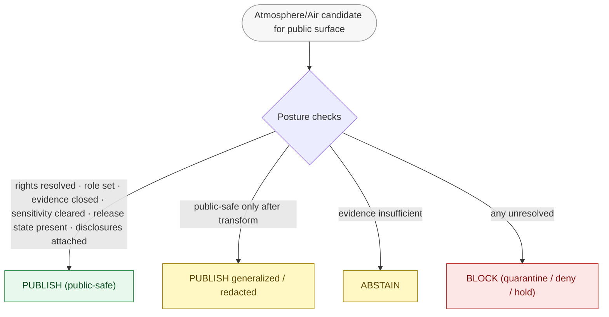

<!-- [KFM_META_BLOCK_V2]
doc_id: kfm://doc/atmosphere/publication-posture
title: Atmosphere/Air — Publication Posture
type: standard
version: v1
status: draft
owners: TODO-atmosphere-domain-steward, TODO-sensitivity-reviewer, TODO-release-authority, TODO-docs-steward
created: 2026-05-29
updated: 2026-05-29
policy_label: public
contract_version: 3.0.0
related:
  - docs/domains/atmosphere/README.md
  - docs/domains/atmosphere/PIPELINE.md
  - docs/domains/atmosphere/POLICY.md
  - docs/domains/atmosphere/PRESERVATION_MATRIX.md
  - docs/domains/atmosphere/OBJECT_FAMILY_MAP.md
  - docs/domains/atmosphere/MISSING_OR_PLANNED_FILES.md
  - policy/sensitivity/
  - docs/doctrine/directory-rules.md
  - ai-build-operating-contract.md
tags: [kfm, atmosphere, air, publication, sensitivity, rights, release, advisory, public-safe]
notes:
  - CONTRACT_VERSION 3.0.0 pinned; doctrine-adjacent posture doc.
  - Publication posture statement is CONFIRMED (Atlas 11.I); implementation paths are PROPOSED.
  - No mounted repo this session; routes, DTOs, and enforcement maturity are PROPOSED/UNKNOWN.
  - Atmosphere/Air is NOT an emergency-alert authority; advisory redirection is required.
  - Meta Block v2 carries no nested HTML comments; inline annotation uses # only.
[/KFM_META_BLOCK_V2] -->

# Atmosphere/Air — Publication Posture

> What may reach a public surface, in what form, with what disclosures, and what blocks release: the rights, sensitivity, knowledge-character, and release-state rules that govern every public-facing Atmosphere/Air artifact.

[](#)
[](./README.md)
[](#3-the-publication-posture-statement)
[](#5-tier-and-rights-posture)
[](#7-the-advisory--life-safety-boundary)
[](#)
[](#footer)

> **Status:** draft · **Owners:** TODO-atmosphere-domain-steward · TODO-sensitivity-reviewer · TODO-release-authority · TODO-docs-steward · **Updated:** 2026-05-29 · **CONTRACT_VERSION = "3.0.0"**

---

## Table of Contents

- [1. Scope and Purpose](#1-scope-and-purpose)
- [2. Truth Posture and Evidence Basis](#2-truth-posture-and-evidence-basis)
- [3. The Publication Posture Statement](#3-the-publication-posture-statement)
- [4. What May Be Published](#4-what-may-be-published)
- [5. Tier and Rights Posture](#5-tier-and-rights-posture)
- [6. Required Disclosures on Public Surfaces](#6-required-disclosures-on-public-surfaces)
- [7. The Advisory / Life-Safety Boundary](#7-the-advisory--life-safety-boundary)
- [8. Release Requirements (PUBLISHED Gate)](#8-release-requirements-published-gate)
- [9. Governed Surfaces and Finite Outcomes](#9-governed-surfaces-and-finite-outcomes)
- [10. Correction, Stale-State, and Rollback on Public Surfaces](#10-correction-stale-state-and-rollback-on-public-surfaces)
- [11. What Blocks Publication](#11-what-blocks-publication)
- [Open questions register](#open-questions-register)
- [Open verification backlog](#open-verification-backlog)
- [Changelog](#changelog)
- [Definition of done](#definition-of-done)
- [Related Docs](#related-docs)
- [Footer](#footer)

---

## 1. Scope and Purpose

This document states the **publication posture** for the Atmosphere/Air lane: the conditions under which an artifact may reach a public or semi-public surface, the disclosures it must carry, and the conditions that block release. It is the public-facing companion to [POLICY](./POLICY.md) (the allow/deny rules), [PIPELINE](./PIPELINE.md) (how an artifact gets to PUBLISHED), and [PRESERVATION_MATRIX](./PRESERVATION_MATRIX.md) (what must survive the journey).

**This document covers** the publish/withhold posture, tier and rights handling, mandatory public-surface disclosures, the advisory/life-safety boundary, the PUBLISHED-gate requirements, governed-surface outcomes, and the correction/stale-state/rollback obligations.

**This document does not cover** the enforceable Rego (see POLICY and `policy/domains/atmosphere/`), the lifecycle mechanics (see PIPELINE), or object meaning/shape (see contracts and schemas). It references all of them.

> [!IMPORTANT]
> Atmosphere/Air is **contextual**, not authoritative for life safety. KFM must never be used as an emergency-alert surface; public advisory content redirects to the official authority (see §7).

[Back to top](#table-of-contents)

---

## 2. Truth Posture and Evidence Basis

> [!NOTE]
> The **publication-posture statement** and the **block-on-unresolved rule** are CONFIRMED doctrine (Atlas §11.I). The **release requirements** are CONFIRMED doctrine (Atlas §11.M). Every **route, DTO, and enforcement-maturity claim** is PROPOSED or UNKNOWN — the Atlas marks the exact resolver route UNKNOWN, and no mounted repository was inspected this session.

Evidence used, all CONFIRMED in indexed project knowledge:

- **Atlas §11.I** — sensitivity, rights, and publication posture (the verbatim anti-collapse + block statement). **[CONFIRMED]**
- **Atlas §11.G** — viewing products + cross-cutting Evidence Drawer, time-aware state, trust badges, sensitivity-redacted view, correction/stale-state view, governed Focus Mode. **[CONFIRMED]**
- **Atlas §11.J** — governed-API surfaces (resolver, layer-manifest resolver, Evidence Drawer payload, Focus Mode) with finite outcomes; route UNKNOWN. **[CONFIRMED doctrine / PROPOSED implementation]**
- **Atlas §11.M** — publication requires ReleaseManifest, EvidenceBundle, validation/policy support, review state where required, correction path, stale-state rule, rollback target. **[CONFIRMED doctrine / PROPOSED implementation]**
- **Atlas §11.L** — governed AI behavior (summarize released bundles; ABSTAIN/DENY). **[CONFIRMED]**
- **MapLibre SRC-061** — badges are not proof substitutes; stale-source UI state; reference-monitor primacy; Focus Mode abstains without calibration/citation. **[CONFIRMED evidence]**
- **`ai-build-operating-contract.md` v3.0** — trust membrane, §23.2 sensitivity routing, public-safe-only invariant. **[CONFIRMED — CONTRACT_VERSION 3.0.0]**

[Back to top](#table-of-contents)

---

## 3. The Publication Posture Statement

The Atlas §11.I posture statement, stated verbatim in doctrine and binding on this lane:

> [!IMPORTANT]
> **AQI is not concentration; AOD is not PM2.5; model fields are not observations; low-cost sensor public release requires correction, caveats, confidence, and limitations.** And: **unclear rights, unresolved source role, missing evidence, unresolved sensitivity, or absent release state blocks public promotion.** **[CONFIRMED doctrine — Atlas §11.I]**

Everything else in this document specializes that statement into concrete publish/withhold decisions.



[Back to top](#table-of-contents)

---

## 4. What May Be Published

Per Atlas §11.G, the lane's public viewing products. Each is publishable **only** with its knowledge-character label and required disclosures intact.

| Public viewing product | Knowledge character | Publish condition |
|---|---|---|
| Observed sensor layers | `OBSERVED_SENSOR` | units canonical; monitor IDs present; observation/regulatory distinction set |
| Public AQI report layers | `PUBLIC_AQI_REPORT` | labeled AQI, not concentration; advisory disclaimer |
| Regulatory archive layers | `REGULATORY_ARCHIVE` | issuing-authority identity; not rendered as observed event |
| Low-cost sensor caveat layers | `LOW_COST_SENSOR` | correction + caveat + confidence + limitations; calibration receipt |
| Model-field layers | `ATMOSPHERIC_MODEL_FIELD` | model run receipt + uncertainty; not rendered as observation |
| Remote-sensing mask layers | `REMOTE_SENSING_MASK` | AOD labeled as mask, not PM2.5; uncertainty |
| Climate / anomaly context | `CLIMATE_ANOMALY_CONTEXT` | aggregation receipt; baseline period stated |
| Derived fusion layers | `DERIVED_FUSION` | input source roles preserved; fusion method disclosed |
| Advisory layers | `ALERT_AND_ADVISORY_CONTEXT` | referral-only; redirect to official source; **not** life-safety |

> [!NOTE]
> Cross-cutting viewing products apply to every layer above: Evidence Drawer, time-aware state, trust badges, sensitivity-redacted view, correction/stale-state view, and governed Focus Mode (Atlas §11.G).

[Back to top](#table-of-contents)

---

## 5. Tier and Rights Posture

Atmosphere/Air is largely **T0 (Open)** by default, but T0 is **rights-gated**: no source publishes until its rights are resolved. Tiers follow the cross-cutting scheme (Atlas §24.5).

| Surface | Default tier | Posture |
|---|---|---|
| EPA AQS / AirNow / NWS / Mesonet observations | T0 | Public-safe once rights resolved + validated. |
| Model fields (HRRR-Smoke / CAMS / ECMWF) | T0 with model label | Public-safe with ModelRunReceipt + uncertainty. |
| GOES/ABI AOD raster | T0 with mask label | Public-safe; AOD ≠ PM2.5. |
| Climate normal / anomaly | T0 with aggregation receipt | Public-safe; baseline stated. |
| Low-cost sensor (PurpleAir, corrected) | T0 with mandatory caveat | Public-safe only with calibration receipt + caveat. |
| Exact station / sensor coordinates | T1 (Generalized) | Generalize before public release. |
| Rights-unresolved third-party feed | **T4 until resolved** | Quarantine; no public surface. |
| Restrictive-license source (no redistribution) | T2 / T4 per terms | Only the allowed derivative; attribution travels. |

> [!CAUTION]
> **Sensitive-domain handling (operating contract §23.2).** Although mostly T0, three product classes route through the most restrictive applicable row: exact station siting (`NETWORK_AND_SITE_CONTEXT` → generalize), smoke/fire/AOD layers near sensitive habitat or infrastructure (sensitive joins fail closed), and rights-unresolved feeds (quarantine). Default disposition: DENY exact exposure → GENERALIZE → REDACT → QUARANTINE → steward review → `RedactionReceipt` → ABSTAIN.

[Back to top](#table-of-contents)

---

## 6. Required Disclosures on Public Surfaces

Every public Atmosphere/Air surface MUST carry the disclosures appropriate to its knowledge character. A popup or badge is **never** a substitute for the Evidence Drawer.

| Disclosure | Applies to | Why |
|---|---|---|
| Knowledge-character label | all | Prevents observation/model/AQI/AOD collapse. |
| Freshness / stale-state chip | all (cadence-keyed) | Source cadence, retrieval window, sensor `last_seen` drive visible stale state. |
| AQI-vs-concentration disclaimer | `PUBLIC_AQI_REPORT` | AQI is an index, not µg/m³. |
| Calibration caveat + trust state | `LOW_COST_SENSOR` | Correction version, humidity regime, confidence, limitations. |
| Uncertainty surface | model / mask | Model fields and AOD carry uncertainty, not point truth. |
| Advisory redirect notice | `ALERT_AND_ADVISORY_CONTEXT` | KFM is not the alert authority. |
| Evidence Drawer access | all | Click-to-truth resolution to the EvidenceBundle. |

> [!IMPORTANT]
> **Badges are not proof.** Trust badges, attestation chips, and stale-state markers expose state visibly but do not substitute for the Evidence Drawer or the EvidenceBundle. An attestation badge MUST be backed by a receipt, not visual trust theater (MapLibre SRC-061). **[CONFIRMED evidence]**

[Back to top](#table-of-contents)

---

## 7. The Advisory / Life-Safety Boundary

> [!CAUTION]
> **KFM Atmosphere/Air is not an emergency-alert system and must not provide life-safety instructions.** `Advisory Context` (`ALERT_AND_ADVISORY_CONTEXT`) is **referral-only**: it surfaces that an advisory exists and redirects to the official authority. It never issues, paraphrases as imperative, or substitutes for an official life-safety directive. Life-safety event truth belongs to the **Hazards** lane, which is itself not an emergency-alert system. **[CONFIRMED doctrine — Atlas §11.B; §11.I; ENCY §13 emergency-alert-misuse]**

Boundary rules:

- A public advisory surface MUST carry an advisory-context disclaimer and a redirect to the authoritative source.
- AI/Focus Mode MUST NOT generate life-safety instructions from Atmosphere/Air evidence; it ABSTAINs or redirects.
- KFM positioned as the operational alert authority on any surface → **DENY**.

[Back to top](#table-of-contents)

---

## 8. Release Requirements (PUBLISHED Gate)

Per Atlas §11.M, an Atmosphere/Air publication requires all of the following present and resolvable. Missing any one fails the PUBLISHED transition closed.

| Requirement | Artifact |
|---|---|
| Release record | `ReleaseManifest` |
| Evidence closure | `EvidenceBundle` (resolved from `EvidenceRef`) |
| Validation/policy support | `ValidationReport` + `PolicyDecision` |
| Review state where required | `ReviewRecord` |
| Correction path | `CorrectionNotice` template active |
| Stale-state rule | freshness cadence + stale markers |
| Rollback target | `RollbackCard` |

> [!NOTE]
> Promotion to PUBLISHED is a **governed state transition**, not a file move (see [PIPELINE](./PIPELINE.md) §6). Public clients read only released, public-safe artifacts through the governed API — never RAW / WORK / QUARANTINE / canonical stores / model runtimes (trust membrane).

[Back to top](#table-of-contents)

---

## 9. Governed Surfaces and Finite Outcomes

Per Atlas §11.J, every governed Atmosphere/Air surface returns a finite outcome. Routes and DTO names are PROPOSED; the exact resolver route is **UNKNOWN** in the Atlas.

| Surface | DTO / schema (PROPOSED) | Outcomes |
|---|---|---|
| Feature/detail resolver | `AtmosphereAirDecisionEnvelope` | ANSWER / ABSTAIN / DENY / ERROR |
| Layer manifest resolver | `LayerManifest` / domain layer descriptor | ANSWER / DENY / ERROR (public-safe release only) |
| Evidence Drawer payload | `EvidenceDrawerPayload` + EvidenceBundle projection | ANSWER / ABSTAIN / DENY / ERROR (evidence + policy filtered) |
| Focus Mode answer | `RuntimeResponseEnvelope` + `AIReceipt` | ANSWER / ABSTAIN / DENY / ERROR (AI never root truth) |

```text
ANSWER  — evidence resolved; policy allowed; release state valid
ABSTAIN — evidence insufficient (e.g., no calibration/citation support; incomplete trailing window)
DENY    — policy / rights / sensitivity / release state blocks
ERROR   — infrastructure or schema failure
```

> [!NOTE]
> Focus Mode ABSTAINs when air evidence lacks calibration or citation support, and never equal-weights low-cost sensors with regulatory monitors (reference-monitor primacy). **[CONFIRMED evidence — MapLibre SRC-061]**

[Back to top](#table-of-contents)

---

## 10. Correction, Stale-State, and Rollback on Public Surfaces

A published Atmosphere/Air claim remains correctable and reversible after release.

| Concern | Public-surface behavior |
|---|---|
| **Correction** | A `CorrectionNotice` updates the claim and invalidates downstream derivatives (tiles, exports, graphs); a correction may demote a published claim to a held tier. |
| **Stale-state** | Source cadence / retrieval window / sensor `last_seen` drive a visible stale chip; decommissioned or offline sensors render as stale or inactive. Stale ≠ wrong. |
| **Rollback** | A `RollbackCard` repoints current release state to a prior release while preserving history. |

> [!CAUTION]
> Stale claims are **not** silently refreshed, and corrections are first-class: withdrawals, supersessions, rollback targets, and lineage stay inspectable from any PUBLISHED surface.

[Back to top](#table-of-contents)

---

## 11. What Blocks Publication

Per Atlas §11.I, any of the following blocks public promotion (fail-closed):

- **Unclear rights** — source rights/terms unresolved (quarantine).
- **Unresolved source role** — observation/regulatory/model/aggregate not set.
- **Missing evidence** — `EvidenceRef` does not resolve to an `EvidenceBundle`.
- **Unresolved sensitivity** — exact siting, sensitive joins, or restricted-source fields not cleared.
- **Absent release state** — no `ReleaseManifest` / rollback target / correction path.

Plus the anti-collapse blocks: AQI-as-concentration, AOD-as-PM2.5, model-as-observation, raw low-cost sensor without caveats, advisory rendered as life-safety, and any public-surface reference to RAW/WORK/QUARANTINE/canonical stores.

[Back to top](#table-of-contents)

---

## Open questions register

| ID | Question | Owner role | Resolution path |
|---|---|---|---|
| OQ-AIRPUB-01 | Confirm per-object default sensitivity tiers (T0–T4) and the station-coordinate generalization default. | sensitivity reviewer | ADR-S-05 + repo inspection |
| OQ-AIRPUB-02 | Confirm the governed-API resolver route name and DTO (Atlas §11.J marks route UNKNOWN). | pipeline-steward | API design ADR + repo inspection |
| OQ-AIRPUB-03 | Confirm the exact advisory-redirect UI/API pattern for the Atmosphere × Hazards boundary. | atmosphere + hazards stewards | UI/API design + cross-lane policy ADR |
| OQ-AIRPUB-04 | Confirm required-disclosure set is enforced (label, freshness, caveat, uncertainty, drawer) as schema/policy, not UI-only. | atmosphere-domain-steward | Schema + policy PR |
| OQ-AIRPUB-05 | Confirm source rights/terms for every source family before any public release. | source steward | Source-rights register + steward review |

## Open verification backlog

These items remain `NEEDS VERIFICATION` before promotion from `draft` to `published`:

1. Per-object default tier confirmation (ADR-S-05).
2. Governed-API route/DTO confirmation (Atlas §11.J UNKNOWN).
3. Advisory-redirect pattern for the Hazards boundary.
4. Disclosure enforcement as schema/policy rather than UI-only.
5. Source rights/terms for all source families (Atlas §11.D, all NEEDS VERIFICATION).
6. Repository mounting and reclassification of every path referenced.

## Changelog

| Change | Type (per contract §37) | Reason |
|---|---|---|
| Initial creation of the Atmosphere/Air publication posture doc | new | Named in the planned-files register §6.1; public-facing companion to POLICY/PIPELINE/PRESERVATION_MATRIX. |

> **Backward compatibility.** New file; no anchors to preserve.

## Definition of done

This document is done enough to enter the repository when:

- it is placed at `docs/domains/atmosphere/PUBLICATION_POSTURE.md` per Directory Rules;
- a docs steward, the atmosphere-domain steward, a sensitivity reviewer, and a release authority review it;
- it is linked from `docs/domains/atmosphere/README.md`;
- it does not conflict with accepted ADRs (and OQ-AIRPUB-01/02/03 are at least filed);
- any conflict with current repo conventions is logged in `docs/registers/DRIFT_REGISTER.md`;
- the `GENERATED_RECEIPT.json` planned in the PR (CONTRACT_VERSION `3.0.0`) is wired into CI;
- future changes follow the operating contract's §37 lifecycle.

[Back to top](#table-of-contents)

---

## Related Docs

- `docs/domains/atmosphere/README.md` — domain landing page (TODO if not present).
- `docs/domains/atmosphere/PIPELINE.md` — how an artifact reaches PUBLISHED.
- `docs/domains/atmosphere/POLICY.md` — allow/deny/restrict/abstain rules.
- `docs/domains/atmosphere/PRESERVATION_MATRIX.md` — what must survive promotion.
- `docs/domains/atmosphere/OBJECT_FAMILY_MAP.md` — object roster and knowledge characters.
- `docs/domains/atmosphere/MISSING_OR_PLANNED_FILES.md` — planned-files register.
- `policy/sensitivity/` — cross-cutting sensitivity logic.
- `docs/doctrine/directory-rules.md` — placement law.
- `ai-build-operating-contract.md` — canonical operating contract (CONTRACT_VERSION 3.0.0).

---

## Footer

---

**Related:** [README](./README.md) · [Pipeline](./PIPELINE.md) · [Policy](./POLICY.md) · [Preservation Matrix](./PRESERVATION_MATRIX.md) · [Object Family Map](./OBJECT_FAMILY_MAP.md) · [Directory Rules](../../doctrine/directory-rules.md)

**Last updated:** 2026-05-29 · **Version:** v1 · **Status:** draft · **CONTRACT_VERSION = "3.0.0"**

[⤴ Back to top](#table-of-contents)
