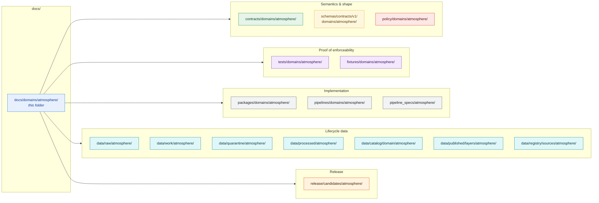
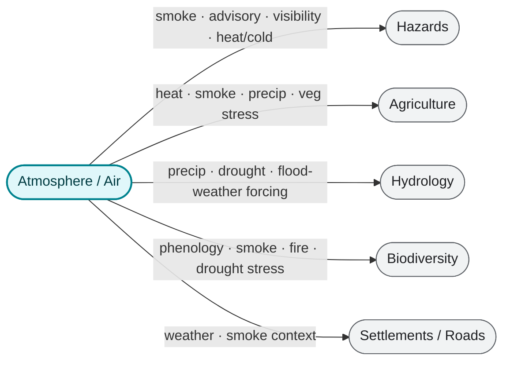
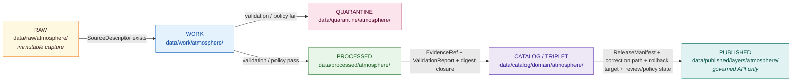

<!-- [KFM_META_BLOCK_V2]
doc_id: kfm://doc/domains/atmosphere/readme
title: Atmosphere · Domain Lane README
type: readme
version: v0.2
status: draft
owners: TBD (domain steward: Atmosphere/Air); TBD (governance reviewer)
created: 2026-05-15
updated: 2026-05-29
policy_label: public
related: [docs/domains/README.md, docs/doctrine/directory-rules.md, docs/domains/atmosphere/SOURCE_REGISTRY.md, docs/domains/atmosphere/UBIQUITOUS_LANGUAGE.md, docs/domains/atmosphere/VERIFICATION_BACKLOG.md, control_plane/domain_lane_register.yaml, schemas/contracts/v1/domains/atmosphere/, policy/domains/atmosphere/, release/candidates/atmosphere/, ai-build-operating-contract.md]
tags: [kfm, domain, atmosphere, air, climate, weather]
notes: [CONTRACT_VERSION pinned 3.0.0 # domain doctrine CONFIRMED via Domains Atlas v1.1 §11 and Encyclopedia §7 # all lane filesystem paths PROPOSED until repo verification # source rights NEEDS VERIFICATION # schema/contract slug drift air vs atmosphere is CONFLICTED → ATM-OQ-09]
[/KFM_META_BLOCK_V2] -->

# 🌬️ Atmosphere · Domain Lane

> Governed, evidence-first orientation surface for the **Atmosphere / Air / Climate** domain — air-quality observations, weather, smoke, AOD, climate normals/anomalies, and model context — explicitly **not** an emergency advisory or life-safety system.

**Status:** `draft` · **Authority level:** `canonical` (domain explanation) · **Owners:** TBD (Atmosphere steward), TBD (governance reviewer) — see [Review burden](#17-review-burden) · **Updated:** 2026-05-29 · `CONTRACT_VERSION = "3.0.0"`

> [!IMPORTANT]
> KFM Atmosphere is **not** an emergency alert system. It carries air-quality, weather, smoke, AOD, climate, and model-field **context** as evidence-labeled observations, archives, and derived products. Emergency advisories and life-safety direction belong to the **Hazards** lane and must redirect to the **official issuing authority**. See [§15 — Sensitivity, Rights, and Publication Posture](#15-sensitivity-rights-and-publication-posture).

---

## Contents

1. [Purpose](#1-purpose)
2. [Scope and boundary](#2-scope-and-boundary)
3. [Authority level](#3-authority-level)
4. [Status](#4-status)
5. [Repo fit — domain lane map](#5-repo-fit--domain-lane-map)
6. [What belongs here](#6-what-belongs-here)
7. [What does NOT belong here](#7-what-does-not-belong-here)
8. [Canonical object families](#8-canonical-object-families)
9. [Key source families and source roles](#9-key-source-families-and-source-roles)
10. [Cross-lane relations](#10-cross-lane-relations)
11. [Pipeline shape — RAW → PUBLISHED](#11-pipeline-shape--raw--published)
12. [Inputs](#12-inputs)
13. [Outputs](#13-outputs)
14. [Validation](#14-validation)
15. [Sensitivity, rights, and publication posture](#15-sensitivity-rights-and-publication-posture)
16. [Governed AI behavior](#16-governed-ai-behavior)
17. [Review burden](#17-review-burden)
18. [Open verification items](#18-open-verification-items)
19. [Lane document set](#19-lane-document-set)
20. [Related folders and docs](#20-related-folders-and-docs)
21. [ADRs](#21-adrs)
22. [Appendix A — Ubiquitous language (knowledge characters)](#appendix-a--ubiquitous-language-knowledge-characters)
23. [Last reviewed](#last-reviewed)

---

## 1. Purpose

**CONFIRMED doctrine / PROPOSED implementation.** This folder is the **human-facing control surface for the Atmosphere / Air / Climate domain** inside `docs/`. It explains what the Atmosphere lane *owns*, what it *does not own*, how its evidence flows through the KFM lifecycle, and where the matching lanes live in the rest of the repo under each responsibility root.

The Atmosphere lane governs:

- **Air-quality observations**: stations, parameters (PM2.5, O₃, NO₂, etc.), AQI report context, regulatory archives, low-cost sensor caveats.
- **Smoke / aerosol context**: smoke-plume polygons, AOD rasters, fire/hotspot context as **context**, never as life-safety alerting.
- **Weather and mesonet observations**: weather stations, mesonet stations, wind, precipitation, temperature.
- **Climate context**: normals, anomalies, departures.
- **Model and advisory context**: forecast/model fields, NWS / agency advisory context with official-source redirection.
- **Public-safe derived products**: caveat-aware, evidence-backed layers, time-series and Evidence Drawer payloads.

The folder is a **lane README**, not an implementation index. It cites doctrine and points at the responsibility-root lanes — it does **not** carry schemas, policy rules, fixtures, code, or data.

[↑ Back to top](#top)

---

## 2. Scope and boundary

### 2.1 What this lane owns (CONFIRMED scope · PROPOSED implementation)

> Source: Domains Culmination Atlas v1.1 §11 `[DOM-AIR]`; Encyclopedia §7.

`AirStation`, `AirObservation`, `PM25Observation`, `OzoneObservation`, `SmokeContext`, `AODRaster`, `WeatherStation`, `WeatherObservation`, `WindField`, `PrecipitationObservation`, `TemperatureObservation`, `ClimateNormal`, `ClimateAnomaly`, `ForecastContext`, `AdvisoryContext`.

### 2.2 What this lane explicitly does not own (CONFIRMED boundary)

| Boundary | Owner lane | Rule |
|---|---|---|
| Emergency / hazard event truth and life-safety context | **Hazards** | Atmosphere may carry **context** (smoke, heat, advisory) under `AdvisoryContext`/`SmokeContext` only with official-source redirection. |
| Agricultural canonical claims (crop, yield, suitability) | **Agriculture** | Atmosphere supplies inputs (heat, smoke, precipitation); it does not assert crop or field facts. |
| Hydrologic canonical claims (gauges, NHD, NFHL) | **Hydrology** | Atmosphere supplies precipitation/drought forcing; canonical hydrology stays with Hydrology. |
| Habitat / fauna / flora canonical claims | **Biodiversity domains** | Atmosphere may provide phenology / smoke / drought context **without** exposing sensitive locations. |
| Settlements, infrastructure, roads canonical claims | **Settlements / Roads** | Atmosphere is not a built-environment or transport authority. |

> [!NOTE]
> **CONFIRMED doctrinal denials** for this lane (atlas §11.I): *AQI is not concentration; AOD is not PM2.5; model fields are not observations; low-cost sensor public release requires correction, caveats, confidence, and limitations.* These denials drive the validator set in [§14](#14-validation).

[↑ Back to top](#top)

---

## 3. Authority level

**Canonical** (human explanation surface). This README is the doctrinal entry point for the Atmosphere lane and is authoritative for *explanation*, not for *truth*. Truth lives in `EvidenceBundle`s, `ReleaseManifest`s, `LayerManifest`s, `SourceDescriptor`s, `ValidationReport`s, and other knowledge-system objects emitted by the lanes listed in [§5](#5-repo-fit--domain-lane-map). Documentation does not replace verification.

[↑ Back to top](#top)

---

## 4. Status

| Aspect | Status | Notes |
|---|---|---|
| Domain doctrine | **CONFIRMED** | Atlas v1.1 §11 `[DOM-AIR]`, Encyclopedia §7, project knowledge. |
| Object-family spine | **CONFIRMED** | 15 canonical families enumerated in [§8](#8-canonical-object-families). |
| Lane filesystem layout (under each responsibility root) | **PROPOSED** | Repo not mounted this session; mirror lanes pending verification per Directory Rules §12. |
| Schema/contract path slug (`air` vs `atmosphere`) | **CONFLICTED** | Atlas §24.13 uses `…/v1/air/`; Directory Rules §12 uses `…/v1/domains/atmosphere/`. ADR required — see [§18](#18-open-verification-items). |
| Source descriptors, rights, endpoint behavior | **NEEDS VERIFICATION** | Atlas §11.N backlog item. |
| Knowledge-character registry implementation | **NEEDS VERIFICATION** | Atlas §11.N backlog item. |
| Catalog / proof / release closure | **NEEDS VERIFICATION** | Atlas §11.N backlog item. |
| MapLibre / Evidence Drawer / Focus Mode integration | **NEEDS VERIFICATION** | Atlas §11.N backlog item. |
| Owners / CODEOWNERS for this lane | **UNKNOWN** | TBD; see [§17](#17-review-burden). |

[↑ Back to top](#top)

---

## 5. Repo fit — domain lane map

The Atmosphere domain follows **Domain Placement Law** (Directory Rules §12): a domain is a *segment inside a responsibility root*, never a root folder. Every lane below is **PROPOSED** until inspected in a mounted repo.

> [!CAUTION]
> **Schema/contract slug is CONFLICTED.** This README uses the Directory Rules §12 lane form (`schemas/contracts/v1/domains/atmosphere/`, `contracts/domains/atmosphere/`) because **Directory Rules outranks Atlas crosswalks** in the authority order. The Atlas §24.13 crosswalk instead lists `schemas/contracts/v1/air/` and `contracts/air/` (the `air` slug, no `domains/` segment). This is confirmed slug drift, in the same class as Roads (`transport`) and Settlements (`settlement`). Do not treat either path as canonical until an ADR resolves it; log the chosen path in `DRIFT_REGISTER.md`. See [§18](#18-open-verification-items) and [§21](#21-adrs).

### 5.1 Lane diagram (PROPOSED layout)

### 5.2 Lane path matrix (PROPOSED until verified)

| Responsibility root | Atmosphere lane (PROPOSED) | What lives here |
|---|---|---|
| `docs/` | `docs/domains/atmosphere/` | This README; domain explanations, runbooks, ADR pointers. |
| `contracts/` | `contracts/domains/atmosphere/` | Object-family **meaning** in Markdown (`AirStation.md`, `PM25Observation.md`, …). |
| `schemas/` | `schemas/contracts/v1/domains/atmosphere/` | Machine-checkable **shape** (`*.schema.json` per object family). Canonical schema home per **ADR-0001**. Slug CONFLICTED — see §5 caution. |
| `policy/` | `policy/domains/atmosphere/` | Admissibility & release policy (AQI-vs-concentration, AOD-vs-PM2.5, low-cost sensor caveats, advisory passthrough). |
| `tests/` | `tests/domains/atmosphere/` | Enforceability proofs for the validators in [§14](#14-validation). |
| `fixtures/` | `fixtures/domains/atmosphere/` | Golden / valid / invalid no-network fixtures. |
| `packages/` | `packages/domains/atmosphere/` | Shared library code (parsers, unit conversion, AQI/parameter context, freshness rules). |
| `pipelines/` | `pipelines/domains/atmosphere/` | Executable pipeline logic for RAW → PUBLISHED. |
| `pipeline_specs/` | `pipeline_specs/atmosphere/` | Declarative pipeline configuration. |
| `data/` (RAW) | `data/raw/atmosphere/` | Immutable source captures (AQS dumps, AirNow snapshots, mesonet pulls, satellite tiles). |
| `data/` (WORK) | `data/work/atmosphere/` | Normalization scratch. |
| `data/` (QUARANTINE) | `data/quarantine/atmosphere/` | Held captures failing validation / policy. |
| `data/` (PROCESSED) | `data/processed/atmosphere/` | Validated normalized objects + receipts. |
| `data/` (CATALOG) | `data/catalog/domain/atmosphere/` | Catalog records and graph/triplet projections. |
| `data/` (PUBLISHED) | `data/published/layers/atmosphere/` | Public-safe layer artifacts served via the governed API. |
| `data/` (REGISTRY) | `data/registry/sources/atmosphere/` | Source registry rows: AQS, AirNow, NWS, Mesonet, MAIAC, VIIRS, HRRR-Smoke, HMS, GOES/ABI, CAMS. |
| `release/` | `release/candidates/atmosphere/` | Atmosphere release candidates with manifests, rollback cards, correction notices. |

> [!NOTE]
> Public clients **MUST** consume Atmosphere data through `apps/governed-api/` (the **trust membrane**), not directly from `data/processed/` or `data/published/`. This is a repo-wide invariant — see Directory Rules §7.1 and §13.5 ("Public route reads canonical store" anti-pattern).

[↑ Back to top](#top)

---

## 6. What belongs here

This folder (`docs/domains/atmosphere/`) holds **human-facing documentation** for the Atmosphere lane only:

- **This README** — lane orientation, doctrine cross-links, lane map.
- **Domain explanation pages** — see the lane document set in [§19](#19-lane-document-set) for the docs already authored.
- **Runbook pointers** — links to `docs/runbooks/atmosphere/*` for ingest, rollback drill, source-rights review.
- **ADR pointers** — links to ADRs that govern this lane (see [§21](#21-adrs)).
- **Source family briefs** — short context on AQS, AirNow, NWS, Mesonet, MAIAC, HRRR-Smoke, etc., **with rights status visible** (full register: [`SOURCE_REGISTRY.md`](SOURCE_REGISTRY.md)).
- **Verification backlog notes** — see [`VERIFICATION_BACKLOG.md`](VERIFICATION_BACKLOG.md) and the items in [§18](#18-open-verification-items).

[↑ Back to top](#top)

---

## 7. What does NOT belong here

> [!CAUTION]
> Putting any of the following under `docs/domains/atmosphere/` is a **drift candidate** and SHOULD be moved to its real owning root.

| Misplaced kind | Real home |
|---|---|
| JSON Schemas | `schemas/contracts/v1/domains/atmosphere/` |
| Object-family contracts (machine-significant) | `contracts/domains/atmosphere/` |
| Policy rules / decision tables | `policy/domains/atmosphere/` |
| Tests, validators, conformance proofs | `tests/domains/atmosphere/` |
| Fixtures (golden / valid / invalid) | `fixtures/domains/atmosphere/` |
| Source data (RAW / WORK / PROCESSED) | `data/<phase>/atmosphere/` |
| Released layer artifacts (PMTiles, GeoJSON, etc.) | `data/published/layers/atmosphere/` |
| Release manifests, rollback cards, correction notices | `release/candidates/atmosphere/` |
| Source registry rows (machine-readable descriptors) | `data/registry/sources/atmosphere/` |
| Build outputs, generated reports | `artifacts/` (compatibility, scoped) |
| Cross-domain validators or schemas | non-domain segment of the relevant root (Directory Rules §12) |
| Emergency-alert content / life-safety direction | **not in KFM** — redirect to official issuing authority |

[↑ Back to top](#top)

---

## 8. Canonical object families

**CONFIRMED spine / PROPOSED implementation.** All identity rules are PROPOSED (deterministic basis: `source_id + object_role + temporal_scope + normalized_digest`); temporal handling is CONFIRMED to keep `source / observed / valid / retrieval / release / correction` times distinct where material.

| Object family | Purpose | Carries (representative) | Status |
|---|---|---|---|
| `AirStation` | Air-quality monitoring station identity | site metadata, network membership, instrument list | CONFIRMED spine / PROPOSED impl |
| `AirObservation` | Generic air-quality observation | parameter, value, unit, QA flag, observed/valid time | CONFIRMED spine / PROPOSED impl |
| `PM25Observation` | Particulate matter ≤ 2.5 µm observation | µg/m³, method, QA, freshness | CONFIRMED spine / PROPOSED impl |
| `OzoneObservation` | Surface ozone observation | ppb/ppm, method, averaging window | CONFIRMED spine / PROPOSED impl |
| `SmokeContext` | Smoke/plume polygon as **context only** | density class, source model, validity time | CONFIRMED spine / PROPOSED impl |
| `AODRaster` | Aerosol Optical Depth raster | grid spec, QA, satellite source, retrieval time | CONFIRMED spine / PROPOSED impl |
| `WeatherStation` | Weather / mesonet station identity | site metadata, network, sensor list | CONFIRMED spine / PROPOSED impl |
| `WeatherObservation` | Generic weather observation | parameter, value, unit, QA | CONFIRMED spine / PROPOSED impl |
| `WindField` | Wind raster/model field | grid spec, run time, valid time, source model | CONFIRMED spine / PROPOSED impl |
| `PrecipitationObservation` | Precipitation observation | type, amount, period, method | CONFIRMED spine / PROPOSED impl |
| `TemperatureObservation` | Air temperature observation | value, unit, height, method | CONFIRMED spine / PROPOSED impl |
| `ClimateNormal` | Climatological normal | window (e.g., 1991–2020), basis, parameter | CONFIRMED spine / PROPOSED impl |
| `ClimateAnomaly` | Departure from normal | reference normal, value, window | CONFIRMED spine / PROPOSED impl |
| `ForecastContext` | Forecast / model field context | model id, run time, valid time, source | CONFIRMED spine / PROPOSED impl |
| `AdvisoryContext` | Official advisory **context** (with redirection) | issuing authority, issue/expiry time, source URL | CONFIRMED spine / PROPOSED impl |

> [!NOTE]
> **Naming variance NEEDS VERIFICATION.** The Encyclopedia uses `PM25Observation` (PascalCase, no dot); the Atlas v1.1 prose uses `PM2.5 Observation` and `Weather Station` with spaces. This README adopts the Encyclopedia PascalCase form for consistency with the rest of the spine, pending an ADR or correction notice that picks a canonical form. This is the same drift class as the slug question in [§5](#5-repo-fit--domain-lane-map).

[↑ Back to top](#top)

---

## 9. Key source families and source roles

**CONFIRMED doctrine / NEEDS VERIFICATION rights & endpoints.** Every source carries an explicit **source role** (authority / observation / context / model), fixed at admission and never upgraded by promotion. Rights, current terms, and freshness cadence must be recorded in the source registry before public promotion. Full detail: [`SOURCE_REGISTRY.md`](SOURCE_REGISTRY.md).

| Source family | Typical role | Rights / sensitivity | Freshness | Status |
|---|---|---|---|---|
| **EPA AQS / AirData** | regulatory archive (validated) | terms NEEDS VERIFICATION | months-lagged | source-vintage specific |
| **EPA AirNow** | public AQI report (preliminary) | bulk-access NEEDS VERIFICATION; **PRELIMINARY / policy-gated** | near-real-time | cadence specific |
| **NOAA / NWS** | observation / advisory context | API terms NEEDS VERIFICATION | per-feed | cadence specific |
| **Kansas Mesonet** | in-situ Kansas observation | **written consent required** (`kansas-wdl@k-state.edu`); fail-closed if absent | sub-hourly to daily | cadence specific |
| **OpenAQ-like aggregators** | observation aggregation | if rights allow | per-feed | NEEDS VERIFICATION |
| **MAIAC (MCD19A2) / VIIRS aerosol** | satellite AOD observation | NASA terms NEEDS VERIFICATION | daily / sub-daily | source-vintage specific |
| **GOES / ABI AOD** | satellite AOD observation | NOAA terms NEEDS VERIFICATION | sub-hourly | cadence specific |
| **HRRR-Smoke / BlueSky** | smoke model forecast | NOAA terms NEEDS VERIFICATION | hourly runs | model-run specific |
| **HMS smoke** | smoke detection / polygon | NOAA terms NEEDS VERIFICATION | daily | cadence specific |
| **VIIRS fire / hotspot** | fire detection context | NASA terms NEEDS VERIFICATION | sub-daily | cadence specific |
| **CAMS / ECMWF-family** | atmospheric model fields | terms NEEDS VERIFICATION | per-run | model-run specific |
| **Climate normals (NOAA NCEI)** | reference normal | public; attribution NEEDS VERIFICATION | per-window | static per release |
| **PurpleAir (with EPA Barkjohn correction)** | low-cost sensor observation | DENY public without correction + caveats; ToS has changed (re-check) | near-real-time | NEEDS VERIFICATION |

> [!WARNING]
> **Source-role discipline is mandatory.** `AdvisoryContext` MUST NOT be re-served as authority; `ForecastContext` MUST NOT be re-served as `WeatherObservation`; `AODRaster` MUST NOT be re-served as `PM25Observation`. The validator set in [§14](#14-validation) enforces these denials.

[↑ Back to top](#top)

---

## 10. Cross-lane relations

**CONFIRMED / PROPOSED.** Every cross-lane relation MUST preserve ownership, source role, sensitivity, and `EvidenceBundle` support — Atmosphere supplies context, not authority, over other lanes.

| Related lane | Relation | What Atmosphere supplies | Constraint |
|---|---|---|---|
| **Hazards** | smoke, heat/cold, advisory, visibility, fire/emissions context | `SmokeContext`, `AdvisoryContext`, heat/cold derived context | No life-safety instructions; official-source redirection. |
| **Agriculture** | heat, smoke, precipitation, vegetation stress | `TemperatureObservation`, `PrecipitationObservation`, `SmokeContext`, anomaly context | Agriculture owns crop/yield claims. |
| **Hydrology** | precipitation, drought, flood-weather forcing | `PrecipitationObservation`, drought indicators, model forcing | Hydrology owns NHD/NFHL/gauges. |
| **Biodiversity domains** (habitat, fauna, flora) | phenology, smoke, fire, drought stress | derived stress context | No exposure of sensitive species locations. |
| **Settlements / Roads** | weather / smoke context for exposure or routing analytics | observation summaries | Settlements/Roads own canonical built-environment truth. |

[↑ Back to top](#top)

---

## 11. Pipeline shape — RAW → PUBLISHED

**CONFIRMED doctrine / PROPOSED lane application.** Atmosphere follows the KFM lifecycle invariant: `RAW → WORK / QUARANTINE → PROCESSED → CATALOG / TRIPLET → PUBLISHED`. Promotion is a **governed state transition**, never a file move; watchers and connectors emit receipts and candidates only.

### 11.1 Stage gates

| Stage | Handling | Gate | Status |
|---|---|---|---|
| **RAW** | Capture immutable source payload or reference with source role, rights, sensitivity, citation, time, hash. | `SourceDescriptor` exists. | PROPOSED |
| **WORK / QUARANTINE** | Normalize schema, geometry, time, identity, evidence, rights, policy; hold failures. | Validation & policy gate pass, or quarantine reason recorded. | PROPOSED |
| **PROCESSED** | Emit validated normalized objects, receipts, and public-safe candidates. | `EvidenceRef`, `ValidationReport`, and digest closure exist. | PROPOSED |
| **CATALOG / TRIPLET** | Emit catalog records, `EvidenceBundle`s, graph/triplet projections, release candidates. | Catalog / proof closure passes. | PROPOSED |
| **PUBLISHED** | Serve released public-safe artifacts through governed APIs and manifests. | `ReleaseManifest`, correction path, rollback target, and review/policy state exist. | PROPOSED |

[↑ Back to top](#top)

---

## 12. Inputs

| Input | From | How it lands here |
|---|---|---|
| Source captures (AQS dumps, AirNow snapshots, NWS pulls, Mesonet CSV, MAIAC tiles, HRRR-Smoke fields, HMS polygons, VIIRS hotspots, CAMS fields, climate normals) | `connectors/` → `data/raw/atmosphere/` | Connectors emit immutable captures with `SourceDescriptor`. |
| Pipeline runs | `pipelines/domains/atmosphere/` → `data/work/`, `data/processed/`, `data/catalog/` | Promotes captures along lifecycle stages. |
| Schemas, contracts, policy | `schemas/`, `contracts/`, `policy/` | Govern normalization, validation, and admissibility. |
| Doctrinal updates | `docs/doctrine/`, `docs/architecture/`, ADRs | Govern this lane's framing. |

> [!NOTE]
> **Connector-as-publisher is forbidden.** Connectors MUST emit to `data/raw/` or `data/quarantine/`. They MUST NOT write to `data/processed/`, `data/published/`, `data/catalog/`, or `release/`. See Directory Rules §13.5.

[↑ Back to top](#top)

---

## 13. Outputs

| Output | Where | Audience |
|---|---|---|
| Released layer artifacts (PMTiles, GeoJSON, time-series JSON) | `data/published/layers/atmosphere/` (served via `apps/governed-api/`) | Public map clients, researchers. |
| `LayerManifest` descriptors | with each released layer | Map shell, catalog, third-party clients. |
| `EvidenceBundle`s & `EvidenceDrawerPayload`s | resolved by `packages/evidence-resolver/` | Evidence Drawer, Focus Mode, audit. |
| `ReleaseManifest`, `CorrectionNotice`, `RollbackCard` | `release/candidates/atmosphere/` and `release/manifests/`, `release/correction_notices/`, `release/rollback_cards/` | Stewards, release reviewers. |
| `RunReceipt`, `ValidationReport`, `ReviewRecord` | `data/receipts/`, `data/proofs/` | Audit, governance, drift register. |
| Graph / triplet projections | `data/catalog/domain/atmosphere/` | Cross-domain analytics, governed AI retrieval. |
| `RuntimeResponseEnvelope` outcomes (`ANSWER` / `ABSTAIN` / `DENY` / `ERROR`) | governed API runtime | Public clients. |

[↑ Back to top](#top)

---

## 14. Validation

The validators below are **PROPOSED** (per atlas §11.K) and live in `tests/domains/atmosphere/` once implemented. They enforce the doctrinal denials in [§2.2](#22-what-this-lane-explicitly-does-not-own) and the source-role discipline in [§9](#9-key-source-families-and-source-roles).

| # | Validator | What it proves | Status |
|---|---|---|---|
| 1 | Knowledge-character registry tests | All admitted Atmosphere objects carry a registered knowledge character. | PROPOSED |
| 2 | Unit normalization tests | All observations carry units; conversions emit `RunReceipt`s. | PROPOSED |
| 3 | **AQI-as-concentration denial** | An AQI value cannot be promoted as a concentration measurement. | PROPOSED |
| 4 | **AOD-as-PM2.5 denial** | `AODRaster` cannot be promoted as `PM25Observation`. | PROPOSED |
| 5 | **Model-as-observed denial** | `ForecastContext` / `WindField` model fields cannot be promoted as observations. | PROPOSED |
| 6 | Low-cost sensor caveat tests | Low-cost sensor public release requires correction, caveats, confidence, limitations; Barkjohn correction-version pinned; FILTER-style QA label present. | PROPOSED |
| 7 | Dry-run / no-network fixture tests | Pipelines run reproducibly against fixtures without external network. | PROPOSED |
| 8 | Source-role mismatch denial | Authority / observation / context / model roles cannot be silently swapped. | PROPOSED |
| 9 | Public-safe redaction & generalization tests | Sensitive joins fail closed; redaction emits receipts. | PROPOSED |
| 10 | Citation validation | Public claims resolve to `EvidenceBundle`; uncited claims fail. | PROPOSED |
| 11 | Stale-state and freshness tests | Layers/observations expose freshness state; stale releases blocked or labeled. | PROPOSED |
| 12 | Release manifest validation | `ReleaseManifest` exists with correction path and rollback target. | PROPOSED |
| 13 | Rollback drill | Releases can be rolled back to a known target with `RollbackCard`. | PROPOSED |
| 14 | Non-regression for prior lineage | Lineage continuity preserved across releases. | PROPOSED |

> [!TIP]
> Validator naming, exit-code contract, and CI-binding remain **NEEDS VERIFICATION** pending the open ADR on validator exit-code contract referenced in `tools/README.md` (PROPOSED). The full row-level backlog lives in [`VERIFICATION_BACKLOG.md`](VERIFICATION_BACKLOG.md).

[↑ Back to top](#top)

---

## 15. Sensitivity, rights, and publication posture

**CONFIRMED doctrine.** The Atmosphere lane is policy-aware and **default-deny** for any release whose support is incomplete.

> [!WARNING]
> Unclear rights, unresolved source role, missing `EvidenceBundle`, unresolved sensitivity, or absent release state **MUST** block public promotion. AQI is not concentration; AOD is not PM2.5; model fields are not observations; low-cost sensor public release requires correction, caveats, confidence, and limitations.

| Risk | Mitigation |
|---|---|
| Rights uncertainty | Block public release until source terms and redistribution class are recorded in `data/registry/sources/atmosphere/`. |
| Sensitive location exposure (joined biodiversity context) | Default redaction / generalization; restricted views with geoprivacy transform receipts. |
| False precision | Show uncertainty / support, scale and source-role badges; AI abstains on over-precise claims. |
| Source authority confusion | Source-role registry separates observation / model / regulatory / legal / status contexts. |
| Model hallucination | Citation validation; finite outcomes (`ANSWER` / `ABSTAIN` / `DENY` / `ERROR`); no direct model-to-public path. |
| Stale data | Freshness badges; retrieval / source / release time visible; stale-state policy. |
| Rollback complexity | `ReleaseManifest` + `RollbackCard` + rollback drill for every release. |
| Emergency-instruction misuse | Atmosphere never issues life-safety instructions; advisory passthrough redirects to official authority. |

**Deny-by-default examples** (PROPOSED policy tests):

- Unreviewed exact sensitive locations (e.g., joined sensitive species + smoke) → `DENY`.
- AQI re-served as a concentration measurement → `DENY`.
- `ForecastContext` re-served as `WeatherObservation` → `DENY`.
- Live-fetch from a non-dryrun-allowed source in a sealed pipeline → `DENY`.

[↑ Back to top](#top)

---

## 16. Governed AI behavior

**CONFIRMED doctrine / PROPOSED implementation.** AI is interpretive, not the root truth source. For this lane:

- AI **MAY** summarize released Atmosphere `EvidenceBundle`s, compare evidence across sources, explain limitations, and draft steward-review notes.
- AI **MUST ABSTAIN** when evidence is insufficient or unsupportable at the asked precision.
- AI **MUST DENY** where policy, rights, sensitivity, or release state blocks the request.
- AI **MUST NOT** generate Atmosphere claims that bypass the trust membrane or substitute for `EvidenceBundle` resolution.

Outcomes are wrapped in `RuntimeResponseEnvelope` with one of `ANSWER` / `ABSTAIN` / `DENY` / `ERROR` and accompanied by an `AIReceipt`.

[↑ Back to top](#top)

---

## 17. Review burden

| Role | Responsibility |
|---|---|
| **Atmosphere domain steward** *(TBD)* | Owns object families, source-role discipline, public-safe transforms, validator coverage; approves promotion. |
| **Governance reviewer** *(TBD)* | Reviews release candidates, separation of duties, correction & rollback paths. |
| **Rights reviewer** *(TBD)* | Confirms source terms and redistribution class before public release. |
| **CODEOWNERS entries** | UNKNOWN — see `CODEOWNERS` for this path once the file is mounted. |

> [!NOTE]
> CODEOWNERS bindings for `docs/domains/atmosphere/`, `schemas/contracts/v1/domains/atmosphere/`, `policy/domains/atmosphere/`, and `release/candidates/atmosphere/` are **PROPOSED** placeholders pending repo verification.

[↑ Back to top](#top)

---

## 18. Open verification items

From Domains Culmination Atlas v1.1 §11.N and inferred for this lane. Row-level tracking lives in [`VERIFICATION_BACKLOG.md`](VERIFICATION_BACKLOG.md).

- [ ] **Resolve schema/contract slug drift** — Atlas §24.13 (`…/v1/air/`, `contracts/air/`) vs Directory Rules §12 (`…/v1/domains/atmosphere/`). **ADR required; CONFLICTED.** *(tracked as ATM-OQ-09)*
- [ ] **Verify source rights and endpoint behavior** for AQS, AirNow, NWS, Mesonet, MAIAC, GOES/ABI, HRRR-Smoke, HMS, VIIRS, CAMS. *(NEEDS VERIFICATION)*
- [ ] **Implement knowledge-character registry** (`OBSERVED_SENSOR`, `PUBLIC_AQI_REPORT`, `REGULATORY_ARCHIVE`, `LOW_COST_SENSOR`, `ATMOSPHERIC_MODEL_FIELD`, `REMOTE_SENSING_MASK`, `CLIMATE_ANOMALY_CONTEXT`, `DERIVED_FUSION`, `METEOROLOGICAL_CONTEXT`, `ALERT_AND_ADVISORY_CONTEXT`, `NETWORK_AND_SITE_CONTEXT`). *(NEEDS VERIFICATION)*
- [ ] **Verify catalog / proof / release closure** for Atmosphere candidate releases. *(NEEDS VERIFICATION)*
- [ ] **Verify MapLibre / Evidence Drawer / Focus Mode integration** for Atmosphere layers. *(NEEDS VERIFICATION)*
- [ ] **Resolve `PM25Observation` vs `PM2.5 Observation` naming variance** via ADR or correction notice. *(NEEDS VERIFICATION — flagged in [§8](#8-canonical-object-families))*
- [ ] **Resolve validator exit-code contract** (referenced in `tools/README.md`, PROPOSED). *(NEEDS VERIFICATION)*
- [ ] **Record Kansas Mesonet written-consent artifact** (`kansas-wdl@k-state.edu`); one-time vs per-deployment renewal. *(NEEDS VERIFICATION)*
- [ ] **Bind CODEOWNERS** for all Atmosphere lanes. *(UNKNOWN)*
- [ ] **Inventory existing `docs/domains/atmosphere/` content** once the repo is mounted; reconcile with this README and the lane document set in [§19](#19-lane-document-set). *(UNKNOWN)*

Open items SHOULD be mirrored in `docs/registers/VERIFICATION_BACKLOG.md`.

[↑ Back to top](#top)

---

## 19. Lane document set

Companion docs already authored for this lane (all under `docs/domains/atmosphere/`, all `draft`):

| Doc | Role | Status |
|---|---|---|
| `README.md` (this file) | Lane orientation and repo map. | draft |
| [`UBIQUITOUS_LANGUAGE.md`](UBIQUITOUS_LANGUAGE.md) | Shared vocabulary / knowledge-character glossary (Atlas §11.C). | draft |
| [`SOURCE_REGISTRY.md`](SOURCE_REGISTRY.md) | Source admission & authority-control surface. | draft |
| [`VERIFICATION_BACKLOG.md`](VERIFICATION_BACKLOG.md) | Domain-scoped checkable items (ATM-* rows). | draft |

> [!IMPORTANT]
> **Source-doc factoring is unsettled (OQ-AIR-REG-01).** Earlier drafts produced several overlapping source docs (`SOURCE_INDEX.md`, `SOURCE_FAMILIES.md`, `SOURCES.md`, `SOURCE_REGISTRY.md`). The canonical set for the lane SHOULD be fixed by ADR before this README's links are treated as final. This table lists only the docs intended to survive that decision; adjust once the ADR lands.

[↑ Back to top](#top)

---

## 20. Related folders and docs

**External to this folder, inside the repo (PROPOSED paths):**

- [`docs/domains/README.md`](../README.md) — domain index *(TODO link target)*.
- [`docs/doctrine/directory-rules.md`](../../doctrine/directory-rules.md) — placement law and README contract *(TODO link target)*.
- [`ai-build-operating-contract.md`](../../../ai-build-operating-contract.md) — operating law (`CONTRACT_VERSION = "3.0.0"`).
- [`docs/doctrine/trust-membrane.md`](../../doctrine/trust-membrane.md) — public-route-through-governed-API invariant *(TODO link target)*.
- [`docs/doctrine/lifecycle-law.md`](../../doctrine/lifecycle-law.md) — RAW → PUBLISHED governance *(TODO link target)*.
- [`docs/architecture/governed-api.md`](../../architecture/governed-api.md) — `RuntimeResponseEnvelope`, ANSWER/ABSTAIN/DENY/ERROR *(TODO link target)*.
- [`docs/standards/PROV.md`](../../standards/PROV.md) — W3C PROV-O / PAV crosswalk for evidence and receipts.
- [`docs/standards/PMTILES.md`](../../standards/PMTILES.md) — tile artifact profile for Atmosphere layers.
- [`docs/standards/OGC-API-TILES.md`](../../standards/OGC-API-TILES.md) — OGC Tiles integration for Atmosphere layers.
- [`docs/standards/OAI-PMH.md`](../../standards/OAI-PMH.md) — harvest conformance brief.
- [`docs/standards/ISO-19115.md`](../../standards/ISO-19115.md) — geographic metadata crosswalk.
- [`docs/domains/hazards/README.md`](../hazards/README.md) — adjacent lane that owns life-safety context *(TODO link target)*.
- [`docs/domains/hydrology/README.md`](../hydrology/README.md) — precipitation / drought relation *(TODO link target)*.
- [`docs/domains/agriculture/README.md`](../agriculture/README.md) — heat / smoke / precipitation relation *(TODO link target)*.
- [`control_plane/domain_lane_register.yaml`](../../../control_plane/domain_lane_register.yaml) — machine-readable lane register *(TODO link target)*.
- [`docs/registers/VERIFICATION_BACKLOG.md`](../../registers/VERIFICATION_BACKLOG.md) — repo-wide open items *(TODO link target)*.

[↑ Back to top](#top)

---

## 21. ADRs

| ADR | Subject | Status |
|---|---|---|
| **ADR-0001** | Schema home (`schemas/contracts/v1/...` canonical) | accepted *(per Directory Rules §13.1)* |
| **ADR-TBD (ADR-AIR-PATH)** | `air` vs `atmosphere` schema/contract slug + `domains/` segment | PROPOSED — CONFLICTED, blocks §5 paths |
| **ADR-TBD** | `PM25Observation` vs `PM2.5 Observation` canonical form | PROPOSED |
| **ADR-TBD** | Validator exit-code contract for `tests/domains/atmosphere/` | PROPOSED |
| **ADR-TBD** | Low-cost sensor admission criteria (correction + caveats + confidence + limitations; Barkjohn version pin) | PROPOSED |
| **ADR-TBD** | `AdvisoryContext` redirection contract (issuing-authority passthrough) | PROPOSED |
| **ADR-TBD (OQ-AIR-REG-01)** | Canonical atmosphere source-doc set / naming | PROPOSED |

[↑ Back to top](#top)

---

## Appendix A — Ubiquitous language (knowledge characters)

> Full glossary: [`UBIQUITOUS_LANGUAGE.md`](UBIQUITOUS_LANGUAGE.md). Summarized here for orientation.

<strong>Knowledge characters defined for the Atmosphere lane</strong> (CONFIRMED terms / PROPOSED field realization — Atlas v1.1 §11.C)

| Term | Meaning (constrained by source role, evidence, time, release state) |
|---|---|
| `OBSERVED_SENSOR` | Direct in-situ sensor observation (e.g., AQS validated monitor, Mesonet station). |
| `PUBLIC_AQI_REPORT` | Public AQI report context (e.g., AirNow), preliminary by nature. |
| `REGULATORY_ARCHIVE` | Validated regulatory archive (e.g., EPA AQS), months-lagged. |
| `LOW_COST_SENSOR` | Low-cost sensor observation requiring correction, caveats, confidence, limitations. |
| `ATMOSPHERIC_MODEL_FIELD` | Model field (e.g., HRRR, CAMS, ECMWF); never re-served as observation. |
| `REMOTE_SENSING_MASK` | Satellite-derived mask (e.g., AOD, smoke); never re-served as in-situ. |
| `CLIMATE_ANOMALY_CONTEXT` | Departure from a stated climate normal with window/basis cited. |
| `DERIVED_FUSION` | Fusion product combining sources; carries fusion-method receipt. |
| `METEOROLOGICAL_CONTEXT` | Generic meteorological context supporting other domains. |
| `ALERT_AND_ADVISORY_CONTEXT` | Passthrough advisory context with official-source redirection; never life-safety instruction. |
| `NETWORK_AND_SITE_CONTEXT` | Station / network metadata supporting interpretation. |
| `Knowledge character` | Generic registry tag binding an Atmosphere object to its source role, evidence, time, and release state. |

<strong>Doctrinal denial cheat-sheet</strong>

- **AQI ≠ concentration.** AQI is a categorical index over an averaging window; it cannot be promoted as µg/m³ or ppb.
- **AOD ≠ PM2.5.** AOD is a column optical property, not a surface mass concentration.
- **Model fields ≠ observations.** Forecast / reanalysis fields are model output; only `OBSERVED_SENSOR` / `REMOTE_SENSING_MASK` may carry observation-class claims (with their own caveats).
- **Low-cost sensors require correction.** Public release of low-cost sensor data without correction, caveats, confidence, and limitations is denied.
- **Atmosphere ≠ emergency authority.** Advisory passthrough redirects to the official issuing authority; KFM does not issue life-safety instructions.

[↑ Back to top](#top)

---

## Last reviewed

**2026-05-29** — v0.2 revision: meta block normalized to inline form; `CONTRACT_VERSION` pinned; schema-slug drift (`air` vs `atmosphere`) surfaced as CONFLICTED with §24.13-vs-§12 evidence; lane document set (§19) added; Mesonet consent and source-doc-factoring items added to backlog. Flag for review per Directory Rules README-freshness rule.

---

### Related docs (footer)

- [`UBIQUITOUS_LANGUAGE.md`](UBIQUITOUS_LANGUAGE.md) · [`SOURCE_REGISTRY.md`](SOURCE_REGISTRY.md) · [`VERIFICATION_BACKLOG.md`](VERIFICATION_BACKLOG.md)
- [`docs/domains/README.md`](../README.md) *(TODO)*
- [`docs/doctrine/directory-rules.md`](../../doctrine/directory-rules.md) *(TODO)*
- [`ai-build-operating-contract.md`](../../../ai-build-operating-contract.md)
- [`docs/domains/hazards/README.md`](../hazards/README.md) *(TODO)*

**Last updated:** 2026-05-29 · `CONTRACT_VERSION = "3.0.0"` · [↑ Back to top](#top)
