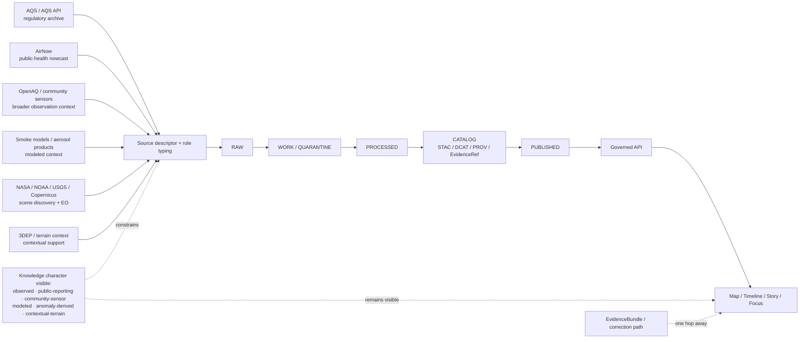

<!-- [KFM_META_BLOCK_V2]
doc_id: kfm://doc/NEEDS-VERIFICATION
title: KFM Atmosphere Domain
type: standard
version: v1
status: draft
owners: @bartytime4life
created: YYYY-MM-DD
updated: YYYY-MM-DD
policy_label: public
related: [../README.md, ../air/README.md, ../hydrology/README.md, ../../analyses/remote-sensing/README.md, ../../governance/ROOT_GOVERNANCE.md]
tags: [kfm, atmosphere, air, climate, smoke, earth-observation, elevation]
notes: [Created from an empty public-main placeholder; doc_id and dates still need direct repo verification.]
[/KFM_META_BLOCK_V2] -->

# KFM Atmosphere Domain

Kansas-first umbrella lane README for air quality, smoke, climate context, earth observation, elevation support, and other atmosphere-adjacent scientific surfaces under KFM’s governed evidence model.

> [!NOTE]
> **Status:** experimental · **Doc state:** draft · **Owners:** `@bartytime4life`  
>       
> **Quick jumps:** [Scope](#scope) · [Repo fit](#repo-fit) · [Accepted inputs](#inputs) · [Exclusions](#exclusions) · [Directory tree](#directory-tree) · [Quickstart](#quickstart) · [Usage](#usage) · [Diagram](#diagram) · [Tables](#tables) · [Task list / definition of done](#task-list--definition-of-done) · [FAQ](#faq) · [Appendix](#appendix)  
> **Repo fit:** `docs/domains/atmosphere/README.md` → parent [`../README.md`](../README.md) · specialized sibling [`../air/README.md`](../air/README.md) · neighboring lane [`../hydrology/README.md`](../hydrology/README.md) · adjacent method surface [`../../analyses/remote-sensing/README.md`](../../analyses/remote-sensing/README.md) · governance anchor [`../../governance/ROOT_GOVERNANCE.md`](../../governance/ROOT_GOVERNANCE.md)  
> **Accepted inputs:** lane-boundary notes, source-role rules, source-family matrices, publication-burden guidance, atmosphere-to-air/climate/EO routing notes, and trust-visible rules for public-safe atmosphere outputs.  
> **Exclusions:** unlabeled modeled outputs, silent source blending, generic EO tutorials, emergency-alert logic, unverified connector claims, and arbitrary runtime/path assertions not grounded in visible repo or governing corpus evidence.

> [!IMPORTANT]
> This README is intentionally an **umbrella lane contract**, not a duplicate of the air-domain README and not a promise that current connector code, workflows, manifests, or tests already exist under this folder.

> [!CAUTION]
> In KFM, atmosphere is not one undifferentiated data bucket. Regulatory archive, public AQI reporting, community sensors, smoke products, climate anomalies, EO scene catalogs, and terrain support only belong together when their **knowledge character**, **time basis**, **method**, and **release posture** remain visible at the point of use.

## Scope

The atmosphere lane exists to hold the **broader burden-bearing rules** for:

- air quality and smoke context
- public-health reporting vs regulatory archive distinctions
- climate and anomaly context that informs other lanes
- atmosphere-relevant earth observation and scene discovery
- elevation and terrain context when it supports atmospheric, hazard, or hydrologic interpretation
- scientific-extension material that still has to remain evidence-led, source-typed, and policy-visible

This directory is the right place for lane-level rules such as:

- how to distinguish **observed**, **public-reporting**, **community-sensor**, **modeled**, and **derived** outputs
- how to route material between atmosphere, air, remote sensing, hydrology, and hazards
- how to keep atmospheric context useful without flattening unlike sources into one synthetic “truth layer”

This directory is **not** the right place for:

- a second copy of the detailed air-domain README
- a generic climate-science encyclopedia
- raw scene dumps or notebook-style source inventories
- hidden implementation claims about live APIs, jobs, tests, or manifests that are not directly verified

### Reading posture

| Item | Status | Meaning here |
| --- | --- | --- |
| Broader atmosphere lane as a KFM operating lane | **CONFIRMED** | The attached KFM manuals explicitly treat atmosphere as part of the Kansas operating-lane structure. |
| Current public path `docs/domains/atmosphere/README.md` | **CONFIRMED** | The file path exists on public main. |
| Current public substance under this exact path | **CONFIRMED** | The public-main file was empty before this revision. |
| `../air/README.md` as the current specialized companion | **CONFIRMED** | The current public repo already treats air as an air-facing slice of the broader atmosphere lane. |
| `knowledge_character` as a useful normalization field | **INFERRED** | Strongly implied by the governing corpus and kept explicit here as a reviewable lane contract. |
| Child docs, connector code, tests, workflows, and manifests under this folder | **UNKNOWN** | Do not imply they exist until directly verified. |
| Future sub-pages for climate, smoke, scene discovery, or terrain context | **PROPOSED** | Useful future split candidates, but not current repo fact. |

[Back to top](#kfm-atmosphere-domain)

## Repo fit

| Path | Role in the repo | How this file should relate |
| --- | --- | --- |
| [`../README.md`](../README.md) | domain-lane hub | Inherit cross-domain lane framing and stay consistent with sibling lane contracts. |
| [`../air/README.md`](../air/README.md) | specialized air-facing companion | Keep detailed air-source handling there; keep umbrella lane rules here. |
| [`../hydrology/README.md`](../hydrology/README.md) | neighboring first-proof lane | Reference it when atmospheric context becomes water-forcing, drought, flood, or watershed support. |
| [`../../analyses/remote-sensing/README.md`](../../analyses/remote-sensing/README.md) | adjacent method surface | Route EO method detail there; keep atmosphere focused on lane burden and source-role rules. |
| [`../../governance/ROOT_GOVERNANCE.md`](../../governance/ROOT_GOVERNANCE.md) | governing trust/path anchor | Inherit truth path, trust membrane, release discipline, and public-safe behavior from here. |
| [`../../governance/ETHICS.md`](../../governance/ETHICS.md) | ethics guardrail | Use when atmospheric products intersect public-health claims, access, or representation risks. |
| [`../../governance/SOVEREIGNTY.md`](../../governance/SOVEREIGNTY.md) | sensitivity/sovereignty guardrail | Use when atmospheric or EO context intersects protected, restricted, or culturally sensitive places. |

### Current public role of this README

This file should do three things well:

1. define the **umbrella lane boundary**
2. route detailed material to the right neighbor docs
3. state what must stay visible before any atmosphere-facing output can be treated as trustworthy

It should **not** try to simulate a full implementation inventory that has not been directly verified.

[Back to top](#kfm-atmosphere-domain)

## Inputs

### Accepted inputs

| Source family or artifact class | Status in this README | What belongs here | What must stay visible |
| --- | --- | --- | --- |
| EPA AQS / AQS API | **CONFIRMED source family** | Regulatory historical archive, monitor metadata, method-bearing ambient-air records | Pollutant, unit, monitor role, method, QA/QC posture, non-real-time character |
| AirNow | **CONFIRMED source family** | Current-condition / public-health AQI reporting and nowcast context | Preliminary/public-reporting semantics; not a substitute for regulatory archive |
| OpenAQ | **CONFIRMED source family** | Broader observation discovery and multi-network comparison context | Aggregator role, provider heterogeneity, licensing variation, non-regulatory status |
| PurpleAir where admitted | **CONFIRMED source family** | Raw or corrected community-sensor lane when calibration and uncertainty are explicit | Sensor algorithm choice, correction basis, uncertainty, admission limits |
| Kansas Mesonet atmospheric or environmental context | **CONFIRMED source family** | Kansas-facing station roster, activity, most-recent, and time-windowed observation context where admitted | Cadence, data-use limits, station coverage, degraded/healthy network state |
| Smoke / atmospheric transport products | **CONFIRMED lane family** | Smoke masks, plume context, modeled transport, analyst-reviewed smoke surfaces | Detection vs analyst polygon vs forecast vs modeled fill |
| NASA / NOAA / USGS / Copernicus EO scene discovery | **CONFIRMED source family** | Acquisition-aware scene discovery, atmospheric context rasters, AOD / aerosol / smoke-support products | Acquisition date, processing level, QA flags, scene-vs-derived distinction |
| 3DEP / USGS elevation and terrain support | **CONFIRMED source family** | Terrain and elevation context when it materially supports atmospheric, hazard, or hydrologic reasoning | DEM vs DSM vs DTM distinction; contextual-terrain role rather than “air observation” |
| Climate anomaly or downscaled forcing layers | **INFERRED lane member** | Derived climate-context layers that inform hazards, hydrology, and explanatory surfaces | Modeled / anomaly-derived labeling, valid time, support semantics, correction lineage |

### Minimal source-admission questions

Before a new atmosphere-facing input is admitted, this README expects the maintainer to answer:

1. What kind of thing is it: **observation, public report, community sensor, model, anomaly layer, scene catalog, or terrain context**?
2. What time is actually being expressed: **observation**, **issue**, **valid**, **acquisition**, or **as-of**?
3. What spatial support exists: **point**, **station network**, **raster grid**, **swath**, **tile**, or **terrain grid**?
4. What calibration, correction, assimilation, or quality filtering is being applied?
5. What public-safe statement is allowed downstream, and what must remain withheld, generalized, or visibly uncertain?

## Exclusions

| Do not put this here | Why not | Route it instead |
| --- | --- | --- |
| A duplicate of the detailed air-domain README | Creates drift and two competing “owners” for the same lane burden | [`../air/README.md`](../air/README.md) |
| Generic EO-method tutorials | This lane is about source-role and publication burden, not broad method instruction | [`../../analyses/remote-sensing/README.md`](../../analyses/remote-sensing/README.md) |
| Silent blends of AQS, AirNow, OpenAQ, PurpleAir, and modeled products | KFM explicitly rejects flattening unlike knowledge classes into one synthetic truth layer | Separate derived package with explicit provenance, weights, and burden notes |
| Operational public-warning or emergency-alert logic | This README is not an emergency operations product | hazard / operations surfaces with their own review and response rules |
| Raw scene dumps, bucket notes, or untyped data drops | Source onboarding is a contract, not a download | RAW / WORK / QUARANTINE with descriptors and receipts |
| Climate-model or anomaly outputs presented as direct observation | Violates lane burden and source-role discipline | derived climate-context packaging with visible modeled status |
| Terrain products treated as atmosphere truth by default | Elevation is often contextual support, not a substitute for air or climate observation | route as contextual terrain support with explicit method notes |
| Unverified repo shape, job names, route families, or API claims | The governing manuals explicitly reject smoothing unknown implementation into “fact” | keep as **UNKNOWN** or **PROPOSED** until directly verified |

[Back to top](#kfm-atmosphere-domain)

## Directory tree

### Verified current public tree around this lane

```text
docs/
├── analyses/
│   └── remote-sensing/
│       └── README.md
└── domains/
    ├── air/
    │   └── README.md
    ├── atmosphere/
    │   └── README.md
    └── hydrology/
        └── README.md
```

Only `README.md` is currently verified inside `docs/domains/atmosphere/` on public main.

<details>
<summary><strong>Proposed future split (not current repo fact)</strong></summary>

```text
docs/domains/atmosphere/
├── README.md
├── source-families.md
├── knowledge-character.md
├── smoke-and-aerosol-context.md
├── climate-context.md
└── terrain-and-scene-support.md
```

Use this only as a planning sketch. Do not create or reference these pages as if they already exist without direct repo verification.

</details>

## Quickstart

### When adding atmosphere-lane material

1. Classify the source with a visible knowledge character.
2. Record the real time basis.
3. Record support semantics: point, network, raster, swath, scene, or terrain grid.
4. Make calibration, correction, assimilation, or uncertainty explicit.
5. Route the artifact through KFM’s truth path:
   `Source edge → RAW → WORK / QUARANTINE → PROCESSED → CATALOG → PUBLISHED`
6. Ensure the public surface stays one hop away from evidence, not one hop away from a cached conclusion.

### Illustrative descriptor shape

```json
{
  "lane": "atmosphere",
  "source_id": "NEEDS_VERIFICATION",
  "knowledge_character": "observed | public-reporting | community-sensor | modeled | assimilated | anomaly-derived | contextual-terrain",
  "time_basis": "observation_time | acquisition_time | issue_time | valid_time | as_of_time",
  "spatial_support": "point | station_network | raster_grid | swath | tile | terrain_grid",
  "calibration_or_correction": "Describe method, admission rule, or say none.",
  "rights_posture": "public | review-bearing | restricted",
  "evidence_ref": "kfm://evidence/NEEDS-VERIFICATION"
}
```

> [!TIP]
> Treat the shape above as an **illustrative starter**, not as a claim that a mounted schema already exists at this exact path or under this exact field naming.

### Fast maintainer check

- Can a reader tell what was **measured** versus **modeled**?
- Does public AQI context stay separate from the regulatory archive?
- Are community sensors admitted only with visible calibration/correction notes?
- Are smoke detections, analyst polygons, and forecasts kept distinct?
- Does any EO layer carry acquisition date, QA context, and processing meaning?
- If terrain appears, is it clearly contextual rather than silently atmospheric?
- Could the result survive a correction notice without hiding the old lineage?

[Back to top](#kfm-atmosphere-domain)

## Usage

### 1. Use this file as the umbrella lane contract

This README should answer questions like:

- What belongs in the broader atmosphere lane?
- What distinctions must remain visible?
- Which neighboring README should own the detailed workflow?
- What public-safe statement is allowed, and what must remain conditional?

It should not be the only file a maintainer reads for air-quality specifics. For detailed air-lane handling, use [`../air/README.md`](../air/README.md).

### 2. Keep public-health and regulatory roles separate

The lane must preserve the difference between:

- **regulatory historical archive**
- **public-health / current-condition reporting**
- **community-sensor context**
- **modeled atmospheric context**
- **derived anomaly context**

AQS, AirNow, OpenAQ, PurpleAir, and atmospheric models can all appear in the same analytical neighborhood, but not as if they meant the same thing.

### 3. Keep smoke products decomposed

Smoke and aerosol work often mixes unlike objects:

- detection rasters
- analyst-reviewed plume polygons
- model transport fields
- near-term forecasts
- downstream AQI or PM summaries

This README treats those as adjacent but not interchangeable. Any public surface should let a reviewer tell whether the user is seeing a **detection**, a **reviewed mask**, a **model**, or a **public-facing current-condition summary**.

### 4. Treat climate context as modeled or derived unless proved otherwise

Climate anomalies, bias-corrected forcings, and downscaled layers can be highly valuable, especially when they support hydrology, hazards, or explanatory surfaces. They still must remain visibly:

- modeled
- anomaly-derived
- support-bearing
- time-scoped
- corrigible

They are not direct substitutes for measured current conditions.

### 5. Route atmosphere-coupled EO and terrain carefully

EO and terrain belong here only when the atmosphere-facing burden matters. Examples:

- aerosol or smoke-support scene discovery
- acquisition-aware context for air / smoke interpretation
- terrain support that materially changes atmospheric, smoke, hydrologic, or hazard reasoning

This lane should not swallow the whole remote-sensing method stack. Keep method-heavy EO detail in [`../../analyses/remote-sensing/README.md`](../../analyses/remote-sensing/README.md).

### 6. Preserve trust-visible runtime behavior

If atmosphere material reaches a user-facing surface, the public experience should still inherit KFM’s standard trust-visible behavior:

- visible time scope
- visible freshness or stale-state cues
- visible modeled / observed / generalized state
- evidence one hop away
- bounded answer outcomes rather than overconfident synthesis

That rule does not change merely because the lane includes scientific or atmospheric material.

## Diagram



## Tables

### Knowledge-character matrix

| Knowledge character | Typical examples | Safe role in KFM | Must not be mistaken for |
| --- | --- | --- | --- |
| **observed** | regulatory monitor rows, direct station observations | measured current or historical evidence | model output or public-health rollup |
| **public-reporting** | AQI / public-health current-condition surfaces | explainable public-facing situational context | regulatory archive |
| **community-sensor** | raw or corrected low-cost sensor streams | neighborhood context, gradient hints, comparative signals | authoritative regulatory truth |
| **modeled** | smoke transport, atmospheric fills, forecast fields | contextual reasoning, gap support, scenario aid | direct observation |
| **assimilated** | blended or fused atmospheric products | support-bearing composite context with declared method | untouched source truth |
| **anomaly-derived** | climate anomaly layers, bias-corrected context grids | derived explanatory context | real-time current condition |
| **contextual-terrain** | DEM / terrain support, relief-derived context | reasoning aid for smoke, hazard, hydrology, and exposure interpretation | atmosphere measurement |

### Routing matrix

| If the material is mainly about… | Put the lane burden here | Put the detailed workflow or method here |
| --- | --- | --- |
| air-quality source roles and public-health distinctions | this README + [`../air/README.md`](../air/README.md) | [`../air/README.md`](../air/README.md) |
| EO acquisition rules, scene quality, and remote-sensing method | this README for lane burden only | [`../../analyses/remote-sensing/README.md`](../../analyses/remote-sensing/README.md) |
| climate forcing used inside water / flood / drought products | this README for source-role distinctions | [`../hydrology/README.md`](../hydrology/README.md) or hazard-facing docs |
| smoke impacts inside public-service continuity or severe-weather context | this README for atmosphere burden | hazard-facing docs and public-safe surface rules |
| elevation/terrain support that materially changes interpretation | this README for contextual-terrain rule | remote-sensing / hazard / hydrology workflows as appropriate |

### Publication-burden reminders

| Burden | Why it matters in atmosphere |
| --- | --- |
| Time basis | observation, issue, valid, acquisition, and as-of times can diverge materially |
| Calibration / correction | community-sensor and fused products become misleading when correction basis is hidden |
| Method visibility | modeled, assimilated, and anomaly-derived products need visible method status |
| Source-role clarity | regulatory archive, public reporting, aggregator, and model layers answer different questions |
| Terrain support honesty | elevation can sharpen interpretation without becoming the atmospheric truth object |
| Correction path | preliminary or later-corrected atmospheric products need visible supersession and rollback behavior |

[Back to top](#kfm-atmosphere-domain)

## Task list / definition of done

- [ ] The file clearly distinguishes the broader atmosphere lane from the detailed air-domain README.
- [ ] Every accepted source family is described by role, not just by name.
- [ ] The README never collapses AQS, AirNow, OpenAQ, community sensors, models, and anomaly layers into one truth class.
- [ ] The directory tree shows only what is currently verified.
- [ ] At least one Mermaid diagram explains real lane structure.
- [ ] Quickstart guidance is usable without pretending current implementation depth.
- [ ] Exclusions are explicit enough to prevent this folder from becoming a catch-all science notebook.
- [ ] Proposed future splits are visibly marked as proposed.
- [ ] The file remains consistent with KFM’s truth path, evidence-first posture, and trust-visible runtime behavior.
- [ ] Any future edits update this README in the same review stream as adjacent lane docs and supporting governance notes.

## FAQ

### Why have an atmosphere README if `docs/domains/air/README.md` already exists?

Because `air/README.md` is the detailed air-facing slice. This file owns the broader **umbrella lane** where air quality, smoke, climate context, EO scene support, and terrain support must be kept coherent without being flattened into one source class.

### Is this the place for climate projection or anomaly detail?

Only at the lane-burden level. The broader rule is that anomaly, bias-corrected, downscaled, or projected climate layers must remain visibly modeled or derived. Do not present them here as direct observation.

### Are scene catalogs and terrain really part of atmosphere?

Sometimes. They belong here when they materially support atmospheric interpretation, smoke reasoning, or adjacent hydrology/hazard analysis. They do not belong here as a generic remote-sensing dump.

### Does this lane outrank hydrology or hazards in thin-slice priority?

No. Hydrology remains the preferred first proof lane. Atmosphere is a strong adjacent lane, especially where air, smoke, drought, climate context, and EO support matter.

### Does this README prove current connectors, tests, workflows, or manifests already exist?

No. It is intentionally written to avoid that claim. Treat implementation depth under this folder as **UNKNOWN** unless directly verified from the mounted repo and emitted proof artifacts.

## Appendix

<details>
<summary><strong>Current public snapshot</strong></summary>

| Snapshot item | Current posture |
| --- | --- |
| `docs/domains/atmosphere/README.md` path | verified |
| current public content at that exact path before this revision | empty placeholder |
| `docs/domains/air/README.md` | verified specialized companion |
| `docs/analyses/remote-sensing/README.md` | verified adjacent method surface |
| child docs under `docs/domains/atmosphere/` beyond `README.md` | not verified |
| connector code / tests / workflow YAML / manifests specifically tied to this lane | not verified |

</details>

<details>
<summary><strong>Suggested future companions (all PROPOSED)</strong></summary>

These are useful next candidates if the lane needs to expand without becoming flat:

- `source-families.md` for role-by-role source admission
- `knowledge-character.md` for machine-readable source-role vocabulary
- `smoke-and-aerosol-context.md` for plume, mask, AOD, and model separation
- `climate-context.md` for anomaly and forcing rules
- `terrain-and-scene-support.md` for 3DEP and EO-support boundaries

Create them only after direct repo verification and only when they reduce ambiguity rather than duplicate sibling docs.

</details>

<details>
<summary><strong>Short maintainer rule</strong></summary>

When this lane changes, update it in the same governed stream as:

- the neighboring lane docs it now routes to
- the governance docs whose burden it inherits
- any validated source descriptors, contracts, or proof objects that make the new rule real

A scientifically impressive layer that cannot explain its role, time basis, and evidence route is still a trust failure.

</details>

[Back to top](#kfm-atmosphere-domain)
