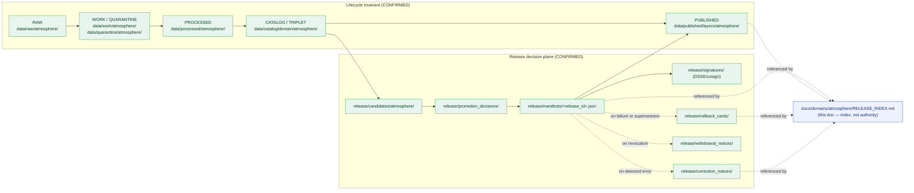

<!-- [KFM_META_BLOCK_V2]
doc_id: kfm://doc/atmosphere/release-index
title: Atmosphere/Air — Release Index
type: standard
version: v2
status: draft
owners: TODO-atmosphere-domain-steward, TODO-release-steward, TODO-docs-steward
created: 2026-05-16
updated: 2026-05-29
policy_label: public
contract_version: 3.0.0
related:
  - docs/domains/atmosphere/README.md
  - docs/domains/atmosphere/PIPELINE.md
  - docs/domains/atmosphere/PUBLICATION_POSTURE.md
  - docs/domains/atmosphere/PRESERVATION_MATRIX.md
  - docs/domains/atmosphere/MISSING_OR_PLANNED_FILES.md
  - release/README.md
  - data/published/layers/atmosphere/README.md
  - docs/doctrine/directory-rules.md
  - ai-build-operating-contract.md
tags: [kfm, atmosphere, air, release, governance, index]
notes:
  - CONTRACT_VERSION 3.0.0 pinned; doctrine-adjacent navigation index.
  - Human-facing navigation index for atmosphere releases.
  - Not a release decision authority. Authority lives in release/manifests/.
  - All implementation-layer claims are PROPOSED pending mounted-repo verification.
  - Meta Block v2 carries no nested HTML comments; inline annotation uses # only.
[/KFM_META_BLOCK_V2] -->

# Atmosphere/Air — Release Index

> Navigable index to all governed releases, release candidates, and published layers for the **Atmosphere/Air** domain. Authority for any individual release lives in `release/manifests/<release_id>.json`; this document points at it, explains it, and tracks its state.

<p align="left">
  <a href="#"></a>
  <a href="./README.md"></a>
  <a href="#8-sensitivity-rights-and-freshness-posture"></a>
  <a href="#4-release-flow-visual"></a>
  <a href="#2-how-this-index-works"></a>
  <a href="#3-where-atmosphere-releases-live"></a>
  <a href="#"></a>
  <!-- # TODO: replace placeholder badge below with live CI/release endpoint once available -->
  <a href="#"></a>
  <a href="#footer"></a>
</p>

| Field | Value |
|---|---|
| **Owners** | `TODO-atmosphere-domain-steward` · `TODO-release-steward` *(placeholder, NEEDS VERIFICATION)* |
| **Authority** | Human-facing navigation index. Not a release decision authority. |
| **Canonical release home** | `release/manifests/`, `release/candidates/atmosphere/`, `release/promotion_decisions/`, `release/rollback_cards/`, `release/correction_notices/`, `release/withdrawal_notices/` |
| **Canonical artifact home** | `data/published/layers/atmosphere/` |
| **Schema (ReleaseManifest)** | `schemas/contracts/v1/release/release_manifest.schema.json` *(PROPOSED path; verify via ADR-0001 + repo)* |
| **CONTRACT_VERSION** | `3.0.0` |
| **Last reviewed** | 2026-05-29 |

---

## Table of Contents

1. [Purpose & Scope](#1-purpose--scope)
2. [How this index works](#2-how-this-index-works)
3. [Where atmosphere releases live](#3-where-atmosphere-releases-live)
4. [Release flow (visual)](#4-release-flow-visual)
5. [Release lifecycle states](#5-release-lifecycle-states)
6. [Release surface — layer families and artifact kinds](#6-release-surface--layer-families-and-artifact-kinds)
7. [Atmosphere-specific source-role discipline](#7-atmosphere-specific-source-role-discipline)
8. [Sensitivity, rights, and freshness posture](#8-sensitivity-rights-and-freshness-posture)
9. [Release-ID and naming conventions](#9-release-id-and-naming-conventions)
10. [Release register (PROPOSED template)](#10-release-register-proposed-template)
11. [Correction and rollback index](#11-correction-and-rollback-index)
12. [Validation gates and required closure](#12-validation-gates-and-required-closure)
13. [Atmosphere-specific anti-patterns](#13-atmosphere-specific-anti-patterns)
14. [Open questions register](#open-questions-register)
- [Open verification backlog](#open-verification-backlog)
- [Changelog v1 → v2](#changelog-v1--v2)
- [Definition of done](#definition-of-done)
15. [Related docs](#15-related-docs)
- [Footer](#footer)

---

## 1. Purpose & Scope

This document is the **human-facing index** for everything the Atmosphere/Air domain publishes or proposes to publish. It exists so a steward, reviewer, or maintainer can answer four questions quickly:

1. *What atmosphere releases exist or are pending?*
2. *What state is each release in, and what artifacts back it?*
3. *Where do its canonical decision records live in the repository?*
4. *What governance and posture applies to atmosphere publication?*

It does **not** decide releases. Release decisions live in `release/` (manifests, promotion decisions, rollback cards, correction notices, withdrawal notices) and conform to the `ReleaseManifest` schema. This index points to those records and explains them in prose.

> [!NOTE]
> **CONFIRMED doctrine:** ReleaseManifest is the release decision artifact and lives in `release/manifests/`; CorrectionNotice in `release/correction_notices/`; RollbackCard in `release/rollback_cards/`. Released artifacts (PMTiles, STAC records, GeoJSON, Parquet) live under `data/published/layers/atmosphere/`. Mixing release decisions with released artifacts is one of the named drift patterns in [Directory Rules](../../doctrine/directory-rules.md) §9.2 / §10.

**Scope (what this index covers):**

- All Atmosphere/Air **ReleaseManifest** entries (DRAFT, REVIEW, PUBLISHED, REVOKED, SUPERSEDED).
- All **release candidates** for the domain (`release/candidates/atmosphere/`).
- Cross-references to the **PromotionDecision**, **RollbackCard**, **CorrectionNotice**, and **withdrawal notice** records that bind each release.
- Atmosphere-specific publication posture (source-role discipline, sensitivity tiers, freshness rules).

**Out of scope (covered elsewhere):**

- Object families, ubiquitous language, and pipeline shape → see [`./README.md`](./README.md), [`./OBJECT_FAMILY_MAP.md`](./OBJECT_FAMILY_MAP.md), and [`./PIPELINE.md`](./PIPELINE.md).
- Source descriptors, rights, cadence → see [`./SOURCE_FAMILIES.md`](./SOURCE_FAMILIES.md) *(PROPOSED neighbor doc)*.
- Catalog records and STAC closure → see the catalog index *(PROPOSED neighbor doc)*.
- Publish/withhold posture and disclosures → see [`./PUBLICATION_POSTURE.md`](./PUBLICATION_POSTURE.md).

[⬆ Back to top](#table-of-contents)

---

## 2. How this index works

This file is **navigation, not authority**. Every row in every table here should resolve to an artifact under `release/`, `data/published/`, `data/catalog/`, or `data/proofs/`. If a row cannot resolve, mark it `PROPOSED` or `NEEDS VERIFICATION` and either remove it or open a verification entry.

**Reading the rows.** Each release entry should list, at minimum:

- `release_id` (stable identifier, deterministic where possible)
- `release_state` (DRAFT | REVIEW | PUBLISHED | REVOKED | SUPERSEDED) — CONFIRMED from the `ReleaseManifest` schema
- `spec_hash` (content-addressed identity; never substituted by a mutable path)
- `policy_label` / `rights_status` / `sensitivity`
- `artifacts` (pmtiles | stac | geojson | parquet | cog | model | manifest | receipt) — CONFIRMED enum
- Links to the manifest, evidence refs, attestations, correction lineage, and rollback target

**Maintenance discipline.** Updates to this index are routine PRs (no ADR). Adding a new layer family, retiring one, or changing a sensitivity default is **doctrine-significant** and warrants either a domain ADR or a note in `docs/registers/DRIFT_REGISTER.md`.

> [!IMPORTANT]
> **Watcher-as-non-publisher invariant** (CONFIRMED). Workers, watchers, and pipelines write candidates and receipts; they do not publish. Watcher output enters a work-candidate state, never PUBLISHED directly. Publication is a governed state transition recorded in `release/promotion_decisions/` and reflected here only after the fact. This index never *causes* a release; it *reflects* one.

[⬆ Back to top](#table-of-contents)

---

## 3. Where atmosphere releases live

The release surface for Atmosphere/Air is distributed across the canonical responsibility roots described in [Directory Rules](../../doctrine/directory-rules.md) §9.2. The `release/` subfolders below are CONFIRMED in the Directory Rules `release/` tree.

| Role | Canonical home (PROPOSED path) | What it owns |
|---|---|---|
| **Release decisions** | `release/manifests/<release_id>.json` | The `ReleaseManifest` for each atmosphere release. CONFIRMED that this is the decision authority. |
| **Release candidates** | `release/candidates/atmosphere/` | Pre-publication dossiers; not yet promoted. |
| **Promotion decisions** | `release/promotion_decisions/` | `PromotionDecision` records binding gates → release. |
| **Rollback cards** | `release/rollback_cards/` | `RollbackCard` artifacts; rollback drills target these. |
| **Correction notices** | `release/correction_notices/` | Public correction notices superseding prior releases. |
| **Withdrawal notices** | `release/withdrawal_notices/` | Withdrawal records when a release is pulled (REVOKED). |
| **Signatures** | `release/signatures/` | DSSE / Sigstore attestations over manifests and receipts. |
| **Changelog** | `release/changelog/` | Release-level changelog. |
| **Released artifacts** | `data/published/layers/atmosphere/` | PMTiles / GeoJSON / Parquet / COG public-safe outputs. |
| **Catalog records** | `data/catalog/domain/atmosphere/` | STAC / DCAT / PROV catalog closure entries. |
| **Proofs** | `data/proofs/atmosphere/` *(PROPOSED segment)* | `EvidenceBundle`, `ProofPack`, integrity bundles. |
| **Receipts** | `data/receipts/atmosphere/` *(PROPOSED segment)* | `RunReceipt`, validation receipts, AI receipts. |
| **Source registry** | `data/registry/sources/atmosphere/` | Append-only `SourceDescriptor` entries. |

> [!CAUTION]
> **Do not** place release manifests in `data/published/layers/atmosphere/`, and do not place published PMTiles bundles in `release/`. The decision and the artifact are different objects and live in different homes ([Directory Rules](../../doctrine/directory-rules.md) §9.2: `data/published/` owns released **artifacts**; `release/` owns release **decisions**). Mixing them is one of the four drift patterns in §10.

[⬆ Back to top](#table-of-contents)

---

## 4. Release flow (visual)



> [!NOTE]
> The lifecycle invariant and the release-decision plane are **CONFIRMED doctrine**. The specific path segments under `data/` and `release/` are **PROPOSED** per the Domain Placement Law and require mounted-repo verification.

[⬆ Back to top](#table-of-contents)

---

## 5. Release lifecycle states

The `release_state` enum is CONFIRMED from the `ReleaseManifest` schema. Atmosphere releases follow these states without exception.

| State | Meaning | Visible to public clients? | Required transitions out |
|---|---|---|---|
| **DRAFT** | Manifest exists; gates have not yet passed. | No. | Pass gates → `REVIEW`, or fail closed. |
| **REVIEW** | Manifest under steward review (required for material domains). | No. | Approve → `PUBLISHED`; reject → quarantine. |
| **PUBLISHED** | Public-safe release; artifacts served via governed surfaces. | Yes (via governed API only — never canonical store reads). | `SUPERSEDED` on next release; `REVOKED` on policy/rights/correction trigger. |
| **REVOKED** | Release pulled; rollback target restored; withdrawal notice recorded. | No. | Terminal; lineage retained. |
| **SUPERSEDED** | Replaced by a newer release; lineage retained for audit. | No (current pointer is the new release). | Terminal; superseded manifest retained. |

> [!IMPORTANT]
> **Default-deny promotion** (CONFIRMED). A release cannot advance to `PUBLISHED` unless its `EvidenceBundle`, `PolicyDecision`, `PromotionDecision`, validation report, rollback target, and (where required) `ReviewRecord` all resolve. Missing any of these means the gate fails closed and the prior state is preserved.

[⬆ Back to top](#table-of-contents)

---

## 6. Release surface — layer families and artifact kinds

The Atmosphere/Air domain owns the object families listed in the encyclopedia and the domain dossier (see [`./OBJECT_FAMILY_MAP.md`](./OBJECT_FAMILY_MAP.md)). Each family may translate into one or more public-safe release layers, **only** after lifecycle, validation, and policy gates close. The list below is the **PROPOSED catalog** of layer families likely to appear in atmosphere releases; rows are not claims of current implementation.

| Layer family (PROPOSED) | Source-role posture | Default artifact kinds | Typical sensitivity | Status |
|---|---|---|---|---|
| AirStation network points | observation / authority (regulatory) | `pmtiles`, `geojson`, `stac` | T0 public (T1 if siting sensitive) | PROPOSED |
| PM2.5 / Ozone observation time series | observation | `parquet`, `stac` | T0 / T1 (caveats for low-cost sensors) | PROPOSED |
| Public AQI report layer | authority (advisory) | `geojson`, `stac` | T0 with **non-emergency** disclaimer | PROPOSED |
| Low-cost sensor layer | observation (with correction receipt) | `geojson`, `stac` | T1 generalized; caveats required | PROPOSED |
| SmokeContext / HMS polygons | observation / model | `pmtiles`, `geojson`, `stac` | T0 with model-vs-observed badge | PROPOSED |
| HRRR-Smoke / model field overlays | **model** (must not be presented as observation) | `pmtiles` (raster) / `parquet`, `stac` | T0 with model badge | PROPOSED |
| GOES/ABI AOD raster | observation (remote sensing) | `pmtiles` (raster), `cog`, `stac` | T0 with AOD-vs-PM2.5 caveat | PROPOSED |
| Climate Normal / Anomaly grids | derived / context | `pmtiles` (raster), `cog`, `stac` | T0 | PROPOSED |
| Forecast / Advisory context | context (redirect to official) | `geojson`, `stac` | T0 with official-source redirection | PROPOSED |

> [!WARNING]
> Atmosphere has four standing **knowledge-character** rules (CONFIRMED — Atlas §11.I):
> 1. **AQI is not concentration.** A PM2.5 AQI of 100 is not "100 µg/m³".
> 2. **AOD is not PM2.5.** Aerosol optical depth is a column property, not a surface concentration.
> 3. **Model fields are not observations.** A HRRR-Smoke plume is a forecast, not a measurement.
> 4. **Low-cost sensors require correction receipts and visible caveats** before public release.
> Releases that present any of these as their opposite must fail closed and never reach `PUBLISHED`.

[⬆ Back to top](#table-of-contents)

---

## 7. Atmosphere-specific source-role discipline

CONFIRMED doctrine: every source carries a `source_role` (authority / observation / context / model). Atmosphere is unusually exposed to role-collapse risk because regulatory archives, real-time aggregators, satellite proxies, model forecasts, and citizen sensors all describe overlapping phenomena. The release gate must enforce these distinctions.

| Source family | Role | Typical rights | Cadence | Status |
|---|---|---|---|---|
| EPA AQS-like archive | authority + observation (validated) | NEEDS VERIFICATION (terms) | regulatory lag, daily/monthly | PROPOSED |
| AirNow / agency reporting | authority + observation (preliminary) | NEEDS VERIFICATION | near-real-time | PROPOSED |
| Kansas Mesonet | observation | attribution required; NEEDS VERIFICATION | 5-min / hourly | PROPOSED |
| OpenAQ-like aggregators | observation (aggregated) | upstream-terms-bound; NEEDS VERIFICATION | varies | PROPOSED |
| CAMS / ECMWF-family model fields | model | NEEDS VERIFICATION | model-run cadence | PROPOSED |
| HRRR-Smoke / NOAA smoke forecast | model | public; NEEDS VERIFICATION | hourly model run | PROPOSED |
| HMS smoke | observation (analyst-curated) | public; NEEDS VERIFICATION | daily | PROPOSED |
| GOES/ABI AOD | observation (remote sensing) | public; NEEDS VERIFICATION | near-real-time | PROPOSED |
| VIIRS fire / hotspot | observation (remote sensing) | public; NEEDS VERIFICATION | overpass cadence | PROPOSED |
| Low-cost sensor networks (e.g. PurpleAir-like) | observation (uncorrected) | terms vary; NEEDS VERIFICATION | minute-level | PROPOSED |

> [!NOTE]
> **Role-collapse is a release-blocking error.** A `PromotionDecision` for an atmosphere release must reject (`ROLE_COLLAPSE`, `ROLE_DOWNCAST_FORBIDDEN`) any candidate that upcasts an observation to authority, a model to observation, or a context to authority. These are CONFIRMED gate-failure reason codes applicable across domains (Atlas §24.6.3 reason-code catalog).

[⬆ Back to top](#table-of-contents)

---

## 8. Sensitivity, rights, and freshness posture

Atmosphere is overwhelmingly a **T0 (public)** domain. Sensitivity escalation is rare but not impossible — examples include sensitive joins (e.g., air observation × residential location for a small monitoring cohort), embargoed advisory previews, exact station siting, and low-cost networks whose terms forbid bulk redistribution.

> [!CAUTION]
> **Sensitive-domain handling applies (operating contract §23.2).** Where exact station/sensor siting (`NETWORK_AND_SITE_CONTEXT`), sensitive cohort joins, or rights-unresolved feeds are involved, route through the most restrictive applicable row: DENY exact exposure → GENERALIZE → REDACT → QUARANTINE → steward review → `RedactionReceipt` → ABSTAIN. A release that cannot clear this routing does not reach `PUBLISHED`.

| Concern | Default posture (PROPOSED) | Required artifact when escalated |
|---|---|---|
| Public AQI / concentration layers | T0; freshness badge required | none beyond standard release |
| Low-cost sensor public release | T0 conditional on **CorrectionReceipt** | `SensorCalibrationReceipt` / `CorrectionReceipt` + caveat string in `EvidenceDrawerPayload` |
| Exact station / sensor coordinates | T1 generalized | `RedactionReceipt` + `ReviewRecord` |
| Sensitive cohort × air observation joins | T1 or T2 with generalization | `RedactionReceipt` + `ReviewRecord` |
| Embargoed advisory previews | T2 (reviewers/stewards only) | `ReviewRecord` + named-audience policy decision |
| Model-as-observed framing | Blocked (gate failure) | not releasable; correct framing first |

**Freshness markers** (CONFIRMED stale-state catalogue applied to atmosphere):

| Marker | Trigger | UI signal | Action |
|---|---|---|---|
| Source freshness expired | `SourceDescriptor` cadence passed without admission | Stale source badge | Re-admit or supersede; mark dependents stale |
| Schema version drift | Atmosphere object schema upgraded past published claim | Schema-drift badge | Migrate, re-validate, re-release |
| Model version superseded | `ModelRunReceipt` references prior model | Model-version badge | Re-run; supersede |
| Rights status changed | Source rights/terms changed | Rights-changed badge | Re-evaluate tier; emit `CorrectionNotice` if needed |
| Review aged out | `ReviewRecord` older than tier cadence | Review-aged badge | Steward review; possible tier downgrade |

[⬆ Back to top](#table-of-contents)

---

## 9. Release-ID and naming conventions

> [!NOTE]
> The pattern below is **PROPOSED**. Adopt or amend via a release-naming ADR before treating it as binding.

**PROPOSED `release_id` pattern:**

```text
rel-atmosphere-<scope>-<yyyy>-<NNN>
```

Where:

| Segment | Meaning | Example |
|---|---|---|
| `rel-` | Literal prefix; CONFIRMED convention from existing schema examples. | `rel-` |
| `atmosphere` | Domain segment; matches `docs/domains/atmosphere/`. | `atmosphere` |
| `<scope>` | Optional layer-family scope. Omit for full-domain release. | `pm25`, `ozone`, `smoke`, `aod`, `mesonet` |
| `<yyyy>` | Calendar year of the release. | `2026` |
| `<NNN>` | Zero-padded monotonically increasing counter, scoped to (atmosphere, year). | `001`, `002` |

**Example (PROPOSED, illustrative only):**

```text
rel-atmosphere-pm25-2026-001
rel-atmosphere-smoke-2026-001
rel-atmosphere-2026-014        # full-domain release
```

> [!IMPORTANT]
> `release_id` is **not** a content hash. The content-addressed identity is `spec_hash` (CONFIRMED required field on `ReleaseManifest`; consumers bind to the manifest's `spec_hash`, not to floating "latest" pointers). Catalog and proof indexing should key on `spec_hash` first and `release_id` second; never on mutable paths.

[⬆ Back to top](#table-of-contents)

---

## 10. Release register (PROPOSED template)

The table below is the **template form** for the per-release register. Each row should resolve to a `ReleaseManifest` under `release/manifests/`. Today, the register is intentionally empty pending mounted-repo verification.

| release_id | release_state | spec_hash | policy_label | rights_status | sensitivity | artifacts | rollback_supported | evidence_refs | promotion_decision | manifest_path | status |
|---|---|---|---|---|---|---|---|---|---|---|---|
| *(no entries verified in this session)* | — | — | — | — | — | — | — | — | — | — | NEEDS VERIFICATION |

<details>
<summary><b>Worked example — illustrative only, NOT a real release</b></summary>

```json
{
  "object_type": "ReleaseManifest",
  "schema_version": "v1",
  "release_id": "rel-atmosphere-pm25-2026-001",
  "created": "2026-05-29T00:00:00Z",
  "spec_hash": "b3:atmosphere-pm25:placeholder",
  "release_state": "DRAFT",
  "policy_label": "public",
  "rights_status": "unknown",
  "sensitivity": "public",
  "artifacts": [
    {
      "artifact_id": "tiles-atmosphere-pm25-2026",
      "kind": "pmtiles",
      "path": "data/published/layers/atmosphere/pm25_2026.pmtiles",
      "sha256": "sha256-PLACEHOLDER",
      "blake3": "blake3-PLACEHOLDER"
    },
    {
      "artifact_id": "stac-atmosphere-pm25-2026",
      "kind": "stac",
      "path": "data/catalog/domain/atmosphere/pm25_2026/collection.json",
      "sha256": "sha256-PLACEHOLDER"
    }
  ],
  "evidence_refs": [
    "data/proofs/atmosphere/pm25_2026/evidence_bundle.json",
    "data/receipts/atmosphere/pm25_2026/validation_report.json"
  ],
  "attestations": [],
  "correction_lineage": [],
  "rollback": {
    "rollback_supported": true,
    "previous_release": null,
    "rollback_plan_ref": "release/rollback_cards/rel-atmosphere-pm25-2026-001.card.json"
  }
}
```

This example is **illustrative only**. The field set is CONFIRMED from the `ReleaseManifest` schema (a single, signed, hashable JSON object listing every dataset/bundle/tile by stable ID / `spec_hash`); the values, paths, and digests are placeholders. It is not a real release and must not be treated as one.

</details>

[⬆ Back to top](#table-of-contents)

---

## 11. Correction and rollback index

Atmosphere releases must carry a visible correction path and a resolvable rollback target before they may be treated as safely publishable (CONFIRMED doctrine in the publication, correction, and rollback model — Atlas §11.M, §24.6).

| Concern | Where it lives | What it does |
|---|---|---|
| **CorrectionNotice** | `release/correction_notices/<notice_id>.json` | Public notice of a corrected claim; supersedes or annotates a prior `release_id`. Never silently rewrites. |
| **RollbackCard** | `release/rollback_cards/<release_id>.card.json` | Rollback decision artifact; preserves history while repointing the current release pointer to a prior release. |
| **Withdrawal notice** | `release/withdrawal_notices/<notice_id>.json` | Records a release withdrawal (REVOKED); lineage retained. |
| **Supersession chain** | `correction_lineage` array on `ReleaseManifest` | Ordered references to prior releases this one supersedes. CONFIRMED schema field. |
| **Rollback drill** | `docs/runbooks/atmosphere/ROLLBACK_RUNBOOK.md` | Periodic drill restoring a prior release; receipt emitted to `data/receipts/atmosphere/`. *PROPOSED path; runbook may not yet exist.* |

> [!CAUTION]
> **Corrections never erase lineage.** A CorrectionNotice supersedes; it does not delete. Rollback shifts the **current** pointer; the prior `ReleaseManifest` remains queryable for audit. CONFIRMED doctrine.

[⬆ Back to top](#table-of-contents)

---

## 12. Validation gates and required closure

Every atmosphere release must close the following gates before transitioning to `PUBLISHED`. The list reflects CONFIRMED doctrine from the universal closure rules (Atlas §24.6.2) and the atmosphere-specific validator list (Atlas §11.K); the implementation maturity of each test is UNKNOWN without mounted-repo evidence.

| Gate | Required artifact | Atmosphere-specific tests (PROPOSED) |
|---|---|---|
| **Identity & integrity** | `spec_hash` present and matched across receipts | knowledge-character registry test; unit-normalization test |
| **Schema validation** | `ValidationReport.outcome == ANSWER` | AirObservation / PM2.5 / Ozone / SmokeContext / AODRaster schema validation |
| **Rights & sensitivity** | resolved `policy_label`, `rights_status`, `sensitivity` | source-rights-unknown denial; low-cost-sensor terms check; station-coordinate generalization |
| **Source-role discipline** | `SourceDescriptor` resolved; role not upcast | AQI-as-concentration denial; AOD-as-PM2.5 denial; model-as-observed denial |
| **Evidence closure** | `EvidenceRef → EvidenceBundle` resolves | citation validation; per-claim evidence test |
| **Policy gate** | `PolicyDecision` recorded | non-emergency disclaimer assertion; advisory redirection test |
| **Promotion** | `PromotionDecision` with rollback target | gate completeness check |
| **Release infrastructure** | `ReleaseManifest` valid; `RollbackCard` present; signatures attached | manifest integrity; DSSE / cosign verification |
| **No-live-fetch** | dry-run fixture passes without external calls | dry-run no-live-fetch test (atmosphere fixtures) |
| **Stale-state** | freshness rule active | stale source badge / abstain test |

> [!IMPORTANT]
> **Public clients reach `PUBLISHED` only through governed surfaces.** Atmosphere releases must not be addressable from `data/raw/`, `data/work/`, `data/quarantine/`, canonical/internal stores, or model runtimes. The trust membrane is the only public route (CONFIRMED doctrine — Atlas §24.6.2).

[⬆ Back to top](#table-of-contents)

---

## 13. Atmosphere-specific anti-patterns

| Anti-pattern | Why it fails the gate |
|---|---|
| Treating AQI tile values as concentration | Knowledge-character collapse; release must fail closed. |
| Treating AOD raster as PM2.5 surface | Knowledge-character collapse; column ≠ surface concentration. |
| Presenting HRRR-Smoke or other model fields without a model badge | Source-role collapse; model upcast to observation. |
| Publishing low-cost sensor data without a correction receipt and caveat string | Required correction-and-caveat artifact missing. |
| Routing public clients directly to PMTiles in `data/work/atmosphere/` | Trust membrane violation; public path must traverse governed API. |
| Acting as an emergency alert system | Atmosphere domain explicitly **does not own** life-safety advisories; advisory layers redirect to official sources. |
| Hiding sensitive joins via style filter only | Style filters are not redaction; release must include `RedactionReceipt`. |
| Treating a STAC catalog record as proof of release | Catalog record supports discovery, not release authority. |
| Publishing without a resolvable rollback target | `ReleaseManifest` invariant; default-deny. |
| Placing a release manifest in `data/published/` or a PMTiles bundle in `release/` | Decision-vs-artifact drift pattern (Directory Rules §9.2 / §10). |

[⬆ Back to top](#table-of-contents)

---

## 14. Open questions register

| ID | Question | Owner role | Resolution path |
|---|---|---|---|
| OQ-AIRREL-01 | Confirm canonical schema path for `ReleaseManifest` (`schemas/contracts/v1/release/release_manifest.schema.json`). | release-steward | Mounted repo + ADR-0001 |
| OQ-AIRREL-02 | Confirm Atmosphere source rights and endpoint terms for AQS, AirNow, Mesonet, OpenAQ-like, HRRR-Smoke, HMS, GOES/ABI AOD, VIIRS. | source steward | Source registry + steward review |
| OQ-AIRREL-03 | Confirm presence of atmosphere-specific knowledge-character registry tests. | atmosphere-domain-steward | Mounted `tests/domains/atmosphere/` |
| OQ-AIRREL-04 | Verify path segments `data/proofs/atmosphere/` and `data/receipts/atmosphere/` (receipts/proofs domain-scoping). | release-steward | Mounted repo + per-root README |
| OQ-AIRREL-05 | Confirm `ROLLBACK_RUNBOOK.md` for atmosphere exists or is planned under `docs/runbooks/atmosphere/`. | release-steward | Mounted repo |
| OQ-AIRREL-06 | Confirm a `release_id` naming ADR exists or is needed. | release-steward | `docs/adr/` review |
| OQ-AIRREL-07 | Verify Evidence Drawer / Focus Mode integration for atmosphere releases. | atmosphere-domain-steward | Mounted repo + UI tests |
| OQ-AIRREL-08 | Confirm a `release_state_register` (e.g., under `control_plane/`) includes atmosphere entries. | release-steward | Mounted `control_plane/` |
| OQ-AIRREL-09 | Resolve `PROV.md` ↔ `PROVENANCE.md` naming discrepancy (cross-doc). | docs-steward | ADR |
| OQ-AIRREL-10 | Add `RELEASE_INDEX.md` to the planned-files register §6.1 docs surface (currently unlisted). | docs-steward | Update `MISSING_OR_PLANNED_FILES.md` |

## Open verification backlog

These items remain `NEEDS VERIFICATION` before promotion from `draft` to `published`:

1. Canonical `ReleaseManifest` schema path (ADR-0001).
2. Source rights/endpoint terms for every source family (Atlas §11.D, all NEEDS VERIFICATION).
3. Atmosphere knowledge-character registry tests present in `tests/domains/atmosphere/`.
4. `data/proofs/atmosphere/` and `data/receipts/atmosphere/` segment confirmation.
5. `docs/runbooks/atmosphere/ROLLBACK_RUNBOOK.md` presence.
6. `release_id` naming ADR.
7. Evidence Drawer / Focus Mode integration for atmosphere releases.
8. `release_state_register` atmosphere entries.
9. Add `RELEASE_INDEX.md` to the planned-files register §6.1.

## Changelog v1 → v2

| Change | Type (per contract §37) | Reason |
|---|---|---|
| Pinned `CONTRACT_VERSION = "3.0.0"` in meta block, badge, and field table | reconciliation | Doctrine-adjacent doc must pin the operating contract. |
| Moved KFM Meta Block v2 to the top of the file; converted the one nested HTML comment to a `#`-style annotation | housekeeping | Meta Block placement + no-nested-comment rule. |
| Normalized `doc_id` to `kfm://doc/atmosphere/release-index` (domain-scoped) | clarification | Aligns with sibling atmosphere docs. |
| Added `release/withdrawal_notices/` and `release/changelog/` lanes (§3) and the withdrawal-notice row (§11); added a REVOKED→withdrawal note (§5) and a withdrawal edge to the flow diagram (§4) | gap closure | These lanes are CONFIRMED in the Directory Rules `release/` tree but were omitted in v1. |
| Corrected Directory Rules citations: release-vs-artifact distinction is §9.2 (drift patterns in §10), not "§10 / §13.2" | reconciliation | Verified against Directory Rules §9.2 and the Repo Structure Guiding Doc `release/` contract. |
| Added §23.2 sensitive-domain `> [!CAUTION]` callout and a T1 station-coordinate row to §8; added a station-coordinate generalization test to §12 and a decision-vs-artifact drift row to §13 | gap closure | Station siting and sensitive joins touch §23.2 rows. |
| Added the four doctrine companion sections (Open Questions register `OQ-AIRREL-NN`, Open verification backlog, Changelog, Definition of done); migrated former §14 backlog into them | gap closure | Required for doctrine-adjacent docs. |
| Strengthened ReleaseManifest description with the CONFIRMED "single, signed, hashable JSON object … consumers bind to the manifest, not floating latest pointers" framing (§10) | clarification | Newly corroborated this session (KFM-P7-PROG-0003). |
| Bumped version v1 → v2; `updated` 2026-05-16 → 2026-05-29; owners as labeled `TODO-*` | housekeeping | Reflects completion pass. |

> **Backward compatibility.** All v1 numbered section anchors (`#1-purpose--scope` … `#13-atmosphere-specific-anti-patterns`, `#15-related-docs`) are preserved. The former §14 ("Open questions and verification backlog") content is retained and reorganized into the companion sections; its `#14-open-questions-and-verification-backlog` anchor is replaced by `#open-questions-register` + `#open-verification-backlog` — the only anchor change, flagged here.

## Definition of done

This document is done enough to enter the repository when:

- it is placed at `docs/domains/atmosphere/RELEASE_INDEX.md` per Directory Rules;
- it is added to the planned-files register §6.1 (OQ-AIRREL-10);
- a docs steward, the atmosphere-domain steward, and a release steward review it;
- it is linked from `docs/domains/atmosphere/README.md` and `release/README.md`;
- it does not conflict with accepted ADRs (and OQ-AIRREL-01/06 are at least filed);
- any conflict with current repo conventions is logged in `docs/registers/DRIFT_REGISTER.md`;
- the `GENERATED_RECEIPT.json` planned in the PR (CONTRACT_VERSION `3.0.0`) is wired into CI;
- future changes follow the operating contract's §37 lifecycle.

[⬆ Back to top](#table-of-contents)

---

## 15. Related docs

- [`./README.md`](./README.md) — Atmosphere/Air domain README *(PROPOSED neighbor)*
- [`./OBJECT_FAMILY_MAP.md`](./OBJECT_FAMILY_MAP.md) — object roster and knowledge characters
- [`./PIPELINE.md`](./PIPELINE.md) — lifecycle and promotion gates
- [`./PUBLICATION_POSTURE.md`](./PUBLICATION_POSTURE.md) — publish/withhold posture and disclosures
- [`./PRESERVATION_MATRIX.md`](./PRESERVATION_MATRIX.md) — what must survive promotion
- [`./SOURCE_FAMILIES.md`](./SOURCE_FAMILIES.md) — Atmosphere source roster *(PROPOSED neighbor)*
- [`../README.md`](../README.md) — `docs/domains/` landing
- [`../../doctrine/directory-rules.md`](../../doctrine/directory-rules.md) — Directory Rules (§9.2 release, §12 Domain Placement, §10 anti-patterns)
- [`../../../ai-build-operating-contract.md`](../../../ai-build-operating-contract.md) — canonical operating contract (CONTRACT_VERSION 3.0.0)
- [`../../standards/PROV.md`](../../standards/PROV.md) — Provenance profile *(name pending ADR — see open questions)*
- [`../../standards/PMTILES.md`](../../standards/PMTILES.md) — PMTiles governance profile
- [`../../standards/OGC-API-TILES.md`](../../standards/OGC-API-TILES.md) — Tile delivery standard
- [`../../runbooks/atmosphere/`](../../runbooks/atmosphere/) — Atmosphere runbooks *(PROPOSED subfolder)*
- [`../../../release/README.md`](../../../release/README.md) — `release/` root README
- [`../../../data/published/layers/atmosphere/README.md`](../../../data/published/layers/atmosphere/README.md) — Published atmosphere layers README *(PROPOSED path)*

[⬆ Back to top](#table-of-contents)

---

## Footer

---

**Related:** [README](./README.md) · [Pipeline](./PIPELINE.md) · [Publication Posture](./PUBLICATION_POSTURE.md) · [Preservation Matrix](./PRESERVATION_MATRIX.md) · [Directory Rules](../../doctrine/directory-rules.md) · [Operating Contract](../../../ai-build-operating-contract.md) · [release/](../../../release/README.md)

**Last reviewed:** 2026-05-29 · **Doc type:** Release index (human-facing navigation; not a release decision authority) · **Authority anchor:** Directory Rules §9.2, §12 · **Truth posture:** cite-or-abstain · **Version:** v2 · **CONTRACT_VERSION = "3.0.0"**

[⬆ Back to top](#table-of-contents)
