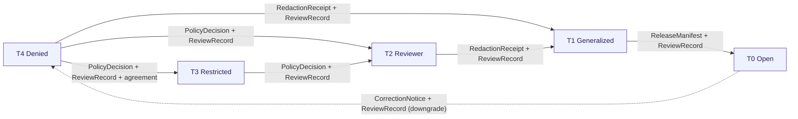

<!-- [KFM_META_BLOCK_V2]
doc_id: kfm://doc/atmosphere/sensitivity
title: Atmosphere/Air — Sensitivity & Tiering
type: standard
version: v1
status: draft
owners: TODO-atmosphere-domain-steward, TODO-sensitivity-reviewer, TODO-docs-steward
created: 2026-05-29
updated: 2026-05-29
policy_label: public
contract_version: 3.0.0
related:
  - docs/domains/atmosphere/README.md
  - docs/domains/atmosphere/PUBLICATION_POSTURE.md
  - docs/domains/atmosphere/POLICY.md
  - docs/domains/atmosphere/PRESERVATION_MATRIX.md
  - docs/domains/atmosphere/OBJECT_FAMILY_MAP.md
  - docs/domains/atmosphere/MISSING_OR_PLANNED_FILES.md
  - policy/sensitivity/
  - docs/doctrine/directory-rules.md
  - ai-build-operating-contract.md
tags: [kfm, atmosphere, air, sensitivity, tiering, redaction, geoprivacy, deny-by-default]
notes:
  - CONTRACT_VERSION 3.0.0 pinned; doctrine-adjacent sensitivity reference.
  - Canonical per-object tier-and-redaction reference for the lane; PUBLICATION_POSTURE/POLICY/PRESERVATION_MATRIX reference it.
  - Tier scheme T0-T4 and transition matrix are CONFIRMED doctrine; per-object tiers are PROPOSED.
  - No mounted repo this session; every policy path is PROPOSED.
  - Meta Block v2 carries no nested HTML comments; inline annotation uses # only.
[/KFM_META_BLOCK_V2] -->

# Atmosphere/Air — Sensitivity & Tiering

> The canonical sensitivity reference for the Atmosphere/Air lane: how each object is tiered (T0–T4), what transforms move it between tiers, what must never be exposed, and which receipts and reviews a tier change requires.

> **Status:** draft · **Owners:** TODO-atmosphere-domain-steward · TODO-sensitivity-reviewer · TODO-docs-steward · **Updated:** 2026-05-29 · **CONTRACT_VERSION = "3.0.0"**

---

## Table of Contents

- [1. Scope and Purpose](#1-scope-and-purpose)
- [2. Truth Posture and Evidence Basis](#2-truth-posture-and-evidence-basis)
- [3. The Tier Scheme (T0–T4)](#3-the-tier-scheme-t0t4)
- [4. Where Atmosphere/Air Sits](#4-where-atmosphereair-sits)
- [5. Per-Object Tier Matrix](#5-per-object-tier-matrix)
- [6. Tier Transitions](#6-tier-transitions)
- [7. Deny-by-Default Register (Atmosphere/Air)](#7-deny-by-default-register-atmosphereair)
- [8. Redaction and Generalization Profiles](#8-redaction-and-generalization-profiles)
- [9. The Advisory / Life-Safety Boundary](#9-the-advisory--life-safety-boundary)
- [10. Sensitive Cross-Lane Joins](#10-sensitive-cross-lane-joins)
- [11. Enforcement Crosswalk](#11-enforcement-crosswalk)
- [Open questions register](#open-questions-register)
- [Open verification backlog](#open-verification-backlog)
- [Changelog](#changelog)
- [Definition of done](#definition-of-done)
- [Related Docs](#related-docs)
- [Footer](#footer)

---

## 1. Scope and Purpose

This document is the **canonical sensitivity-and-tiering reference** for the Atmosphere/Air lane. It is the deepest treatment of tiers, tier transitions, and redaction profiles; the lane's other docs reference it: [PUBLICATION_POSTURE](./PUBLICATION_POSTURE.md) for the publish/withhold posture, [POLICY](./POLICY.md) for the allow/deny rules, and [PRESERVATION_MATRIX](./PRESERVATION_MATRIX.md) §8 for the preservation axis.

**This document covers** the T0–T4 tier scheme as applied to Atmosphere/Air, per-object default tiers, the governed tier-transition rules and required artifacts, the deny-by-default register for the lane, redaction/generalization profiles, the advisory/life-safety boundary, and sensitive cross-lane joins.

**This document does not cover** the cross-cutting tier scheme definition (that is doctrine in Atlas §24.5, summarized here), object meaning/shape (see contracts/schemas), or the enforceable Rego (see POLICY and `policy/sensitivity/` + `policy/domains/atmosphere/`).

> [!IMPORTANT]
> Atmosphere/Air is **mostly T0 (Open)**, but T0 is **rights-gated** and several object classes escalate (exact station siting, low-cost sensors, sensitive joins, advisory). This doc names each case.

[Back to top](#table-of-contents)

---

## 2. Truth Posture and Evidence Basis

> [!NOTE]
> The **T0–T4 tier scheme** and the **tier-transition matrix** are CONFIRMED doctrine (Atlas §24.5). The Atmosphere/Air **default tier** ("observed → T0/T1; stale-state badge + operational disclaimer") is CONFIRMED in the per-domain matrix. **Per-object** tier assignments below are PROPOSED specializations. No mounted repository was inspected; every `policy/` path is PROPOSED.

Evidence used, all CONFIRMED in indexed project knowledge:

- **Atlas §24.5.1** — tier scheme T0 Open / T1 Generalized / T2 Reviewer / T3 Restricted / T4 Denied, with definitions and default audiences. **[CONFIRMED]**
- **Atlas §24.5.2** — per-domain tier matrix, including the Atmosphere/Air row (T0/T1; stale-state badge; operational disclaimer). **[CONFIRMED]**
- **Atlas §24.5.3** — tier-transition matrix (required artifacts, reviewers, reversibility; upgrade needs transform + review, downgrade needs only correction). **[CONFIRMED]**
- **Atlas §20.5** — Deny-by-Default Register, including the Air emergency-alert boundary. **[CONFIRMED]**
- **Atlas §11.I** — Atmosphere/Air anti-collapse + block-on-unresolved-sensitivity. **[CONFIRMED]**
- **Pass 10 C6-01 / C6-02** — sensitivity rubric (0–5) and named redaction profiles (radius mask, grid, jitter, centroid, DP), deterministic and reproducible. **[CONFIRMED]**
- **`ai-build-operating-contract.md` v3.0** — §23.2 sensitive-domain matrix and default disposition. **[CONFIRMED — CONTRACT_VERSION 3.0.0]**

[Back to top](#table-of-contents)

---

## 3. The Tier Scheme (T0–T4)

The cross-cutting KFM tier scheme (Atlas §24.5.1), binding on this lane. **[CONFIRMED]**

| Tier | Name | Definition | Default audience |
|---|---|---|---|
| **T0** | Open | Public-safe with no transformations required; no rights/sensitivity/steward gating beyond standard release. | Any public client via governed API. |
| **T1** | Generalized | Public-safe only after generalization, fuzzing, aggregation, or redaction; transform reviewed and recorded. | Any public client via governed API. |
| **T2** | Reviewer | Released only to authenticated reviewers or domain stewards; policy-bounded; correction path active. | Stewards, reviewers, named research collaborators. |
| **T3** | Restricted | Released only under named agreement (rights, sovereignty, consent) and recorded. | Named authorized parties only. |
| **T4** | Denied | Not released to any audience; existence of a record may be released only as steward review permits. | — |

[Back to top](#table-of-contents)

---

## 4. Where Atmosphere/Air Sits

Per the Atlas §24.5.2 per-domain matrix, the Atmosphere/Air default is **T0/T1**, with the allowed transform "stale-state badge; operational disclaimer" and the required gate "stale-state policy." Atmosphere/Air is among the most-open KFM lanes — the discipline is mostly rights, low-cost-sensor caveats, exact-siting generalization, and the advisory boundary, rather than broad denial. **[CONFIRMED — Atlas §24.5.2]**

> [!CAUTION]
> **Sensitive-domain handling applies (operating contract §23.2).** Even at T0, route exact station siting, sensitive joins, and rights-unresolved feeds through the most restrictive applicable row. Default disposition: DENY exact exposure → GENERALIZE → REDACT → QUARANTINE → steward review → `RedactionReceipt` → ABSTAIN.

[Back to top](#table-of-contents)

---

## 5. Per-Object Tier Matrix

PROPOSED per-object specialization of the Atmosphere/Air T0/T1 default. Objects from [OBJECT_FAMILY_MAP](./OBJECT_FAMILY_MAP.md).

| Object / class | Default tier | Allowed transforms | Required gates |
|---|---|---|---|
| AirObservation / PM2.5 / Ozone (regulatory monitor) | T0 | none beyond standard release | SourceDescriptor + ValidationReport + ReleaseManifest |
| Public AQI report (AirNow) | T0 | none | + non-emergency advisory disclaimer |
| Weather Observation / Precipitation / Temperature / WindField (obs) | T0 | none | standard release |
| Climate Normal / Climate Anomaly | T0 | none | + AggregationReceipt |
| Forecast Context / model fields (HRRR-Smoke, CAMS) | T0 with model label | none | + ModelRunReceipt + uncertainty |
| AODRaster / SmokeContext (mask/analysis) | T0 with mask label | none | + uncertainty; AOD ≠ PM2.5 |
| **Low-cost sensor (PurpleAir, corrected)** | **T0 with mandatory caveat** | correction + caveat + confidence + limitations | + SensorCalibrationReceipt + caveat layer |
| **Exact AirStation / Weather Station coordinates** | **T1 (Generalized)** | coordinate generalization | + RedactionReceipt + ReviewRecord |
| **Sensitive cohort × air observation join** (small monitoring cohort) | **T1 / T2** | generalization / aggregation | + RedactionReceipt + ReviewRecord |
| **Embargoed advisory preview** | **T2 (Reviewer)** | — | + ReviewRecord + named-audience PolicyDecision |
| **Rights-unresolved third-party feed** | **T4 until resolved** | none until rights resolved | quarantine + steward review |
| **Restrictive-license source (no redistribution)** | **T2 / T4 per terms** | only the allowed derivative | rights register + attribution; no public derivative if barred |
| **KFM as emergency-alert authority** | **T4 forever** | none — boundary holds | deny at runtime; redirect to official source |

> [!NOTE]
> The advisory-as-life-safety case is **T4 forever** by analogy to the Atlas Hazards "KFM as alert authority" row (no transform permits it). Atmosphere/Air `Advisory Context` is referral-only (see §9).

[Back to top](#table-of-contents)

---

## 6. Tier Transitions

Tier changes are **governed motions** with required artifacts (Atlas §24.5.3). **[CONFIRMED]**

| From → To | Required artifact | Required reviewer | Reversibility |
|---|---|---|---|
| T4 → T3 | PolicyDecision + ReviewRecord + agreement | Steward + rights-holder where applicable | Agreement revocation returns to T4 with CorrectionNotice. |
| T4 → T2 | PolicyDecision + ReviewRecord | Steward | Review revocation returns to T4. |
| T4 → T1 | RedactionReceipt + ReviewRecord | Steward | Redaction re-evaluable; correction may demote a published T1 to T4. |
| T3 → T2 | PolicyDecision + ReviewRecord | Steward | Reversible. |
| T2 → T1 | RedactionReceipt + ReviewRecord | Steward | Reversible. |
| T1 → T0 | ReleaseManifest + ReviewRecord | Steward + release authority | Reversible via RollbackCard. |
| Any tier → T4 (downgrade) | CorrectionNotice + ReviewRecord | Steward + rights-holder where applicable | Always permitted; precedes derivative invalidation. |

> [!IMPORTANT]
> **Reading rule (CONFIRMED).** A tier **upgrade** (toward more public) always needs **both** a transform receipt and a review record. A tier **downgrade** (toward less public) never needs both — a `CorrectionNotice` alone is sufficient to remove or restrict.

[Back to top](#table-of-contents)

---

## 7. Deny-by-Default Register (Atmosphere/Air)

Per Atlas §20.5, the lane's deny-by-default surfaces. Each is denied unless its "allowed only when" condition is met.

| Surface | Denied by default | Allowed only when |
|---|---|---|
| **Emergency-alert / life-safety instruction** | KFM used as the alert authority | Not allowed as KFM authority — redirect to official source (T4 forever). |
| **Exact station/sensor coordinates** | precise siting exposure | Generalized geometry + RedactionReceipt + ReviewRecord (→ T1). |
| **Low-cost sensor raw values** | uncorrected PurpleAir as public truth | Correction + caveat + confidence + limitations + SensorCalibrationReceipt. |
| **Sensitive cohort joins** | air observation × small residential cohort | Generalization/aggregation + RedactionReceipt + ReviewRecord. |
| **Rights-unresolved feeds** | publication before rights resolution | Rights resolved + RightsReviewRecord. |
| **Restricted-source redistribution** | re-emitting a no-redistribution feed | Only the allowed derivative; attribution travels. |
| **RAW/WORK/QUARANTINE via public surface** | any public-client reach into pre-publish state | Never — trust membrane forbids it. |

[Back to top](#table-of-contents)

---

## 8. Redaction and Generalization Profiles

When a transform is required (e.g., station-coordinate generalization), it must be a **named, deterministic, reproducible** profile, not improvised at the edge. Per Pass 10 C6-01/C6-02, redaction references a named profile that specifies the strategy, parameters, seeding rule, and any embargo. **[CONFIRMED doctrine — Pass 10 C6-01, C6-02]**

| Concern | Profile family (PROPOSED) | Note |
|---|---|---|
| Exact station siting | radius mask / grid / centroid (e.g., `point_10km_hex_seeded_v1`) | Generalize to a coarse cell; seeded for reproducibility. |
| Small-cohort joins | aggregation (county/tract) + k-anonymity | Aggregate before public release; DP aggregate where appropriate. |
| Embargoed advisory | time-bucketing / embargo timestamp | Render-time suppression until embargo lifts. |

> [!NOTE]
> Profiles MUST be versioned (e.g., `...@v1`), ship a verifier that re-runs the transform from the receipt's parameters and checks determinism, and be referenced by stable id rather than inline parameters. The canonical profile catalog home is cross-cutting (`policy/sensitivity/` or a profile catalog), not duplicated per-domain. **[CONFIRMED — Pass 10 C6-02]**

> [!CAUTION]
> **Style filters are not redaction.** Hiding sensitive geometry with a MapLibre style filter does not satisfy the redaction requirement — a release must include a `RedactionReceipt` from a real transform.

[Back to top](#table-of-contents)

---

## 9. The Advisory / Life-Safety Boundary

> [!CAUTION]
> **KFM Atmosphere/Air is never an emergency-alert authority (T4 forever).** No transform permits it. `Advisory Context` (`ALERT_AND_ADVISORY_CONTEXT`) is referral-only: it surfaces that an advisory exists and redirects to the official authority; it never issues, paraphrases as imperative, or substitutes for an official life-safety directive. Life-safety event truth belongs to Hazards, which itself is not an emergency-alert system. **[CONFIRMED doctrine — Atlas §20.5; §24.5.2 (Hazards alert row); §11.B]**

[Back to top](#table-of-contents)

---

## 10. Sensitive Cross-Lane Joins

Atmosphere/Air context must never **unmask** another lane's sensitive content via a join.

| Join | Risk | Rule |
|---|---|---|
| Air observation × small residential cohort | re-identification of a monitored household | Generalize/aggregate; RedactionReceipt + ReviewRecord. |
| Smoke / AOD / VIIRS × Biodiversity sensitive locations | exposing nests/dens/roosts/hibernacula/spawning sites | T4 biodiversity content is **never** unmasked by an atmosphere join (Atlas §11.F constraint). |
| Atmosphere precipitation forcing × Hydrology NFHL regulatory zone | regulatory zone read as observed flood | Preserve source roles; no upcast (cross-lane role discipline). |
| Air × People/Land parcel | private person-parcel exposure | People/Land owns the deny-default; atmosphere join cannot relax it. |

[Back to top](#table-of-contents)

---

## 11. Enforcement Crosswalk

Sensitivity doctrine here → enforceable bundles and receipts. All paths PROPOSED.

| Concern | Enforcement (PROPOSED) | Receipt |
|---|---|---|
| Station-coordinate generalization | `policy/sensitivity/` profile + `policy/domains/atmosphere/` binding | `RedactionReceipt` |
| Low-cost caveats | `policy/domains/atmosphere/low_cost_sensor_caveats_required.rego` | `SensorCalibrationReceipt` |
| Advisory non-life-safety | `policy/domains/atmosphere/advisory_no_life_safety.rego` | `PolicyDecision` |
| Rights gate | `policy/rights/` + atmosphere binding | `RightsReviewRecord` |
| Tier transition | promotion gate + review | `PolicyDecision` + `ReviewRecord` + (`RedactionReceipt`/`ReleaseManifest`) |

> [!IMPORTANT]
> Every sensitivity rule MUST be proven by a negative-path test (DENY / ABSTAIN / ERROR), not only a happy path. See POLICY §9 and the planned-files register §6.5.

[Back to top](#table-of-contents)

---

## Open questions register

| ID | Question | Owner role | Resolution path |
|---|---|---|---|
| OQ-AIRSEN-01 | Add `SENSITIVITY.md` to the planned-files register §6.1 docs surface (currently unlisted). | docs-steward | Update `MISSING_OR_PLANNED_FILES.md` |
| OQ-AIRSEN-02 | Confirm per-object default tiers (this matrix) and the station-coordinate T1 default. | sensitivity reviewer | ADR-S-05 + repo inspection |
| OQ-AIRSEN-03 | Confirm the named redaction-profile catalog home and the station-siting profile/parameters. | sensitivity reviewer | Pass 10 C6-02 + ADR + `policy/sensitivity/` |
| OQ-AIRSEN-04 | Reconcile the 0–5 sensitivity rubric (Pass 10 C6-01) with the T0–T4 tier scheme — one scale or a documented mapping? | sensitivity reviewer | ADR (rubric ↔ tier mapping) |
| OQ-AIRSEN-05 | Confirm `policy/sensitivity/` vs `policy/domains/atmosphere/` ownership split for atmosphere-specific sensitivity bindings. | policy-steward | Directory Rules check + ADR |

## Open verification backlog

These items remain `NEEDS VERIFICATION` before promotion from `draft` to `published`:

1. Add `SENSITIVITY.md` to the planned-files register §6.1.
2. Per-object default tier confirmation (ADR-S-05).
3. Named redaction-profile catalog and station-siting profile parameters.
4. Rubric (0–5) ↔ tier (T0–T4) reconciliation.
5. `policy/sensitivity/` vs `policy/domains/atmosphere/` binding split.
6. Source rights for every source family (Atlas §11.D, all NEEDS VERIFICATION).

## Changelog

| Change | Type (per contract §37) | Reason |
|---|---|---|
| Initial creation of the Atmosphere/Air sensitivity & tiering doc | new | Canonical per-object tier-and-redaction reference; referenced by PUBLICATION_POSTURE/POLICY/PRESERVATION_MATRIX. |

> **Backward compatibility.** New file; no anchors to preserve.

## Definition of done

This document is done enough to enter the repository when:

- it is placed at `docs/domains/atmosphere/SENSITIVITY.md` per Directory Rules;
- it is added to the planned-files register §6.1 (OQ-AIRSEN-01);
- a docs steward, the atmosphere-domain steward, and a sensitivity reviewer review it;
- it is linked from `docs/domains/atmosphere/README.md` and from PUBLICATION_POSTURE/POLICY/PRESERVATION_MATRIX;
- it does not conflict with accepted ADRs (and OQ-AIRSEN-02/03/04 are at least filed);
- any conflict with current repo conventions is logged in `docs/registers/DRIFT_REGISTER.md`;
- the `GENERATED_RECEIPT.json` planned in the PR (CONTRACT_VERSION `3.0.0`) is wired into CI;
- future changes follow the operating contract's §37 lifecycle.

[Back to top](#table-of-contents)

---

## Related Docs

- `docs/domains/atmosphere/README.md` — domain landing page (TODO if not present).
- `docs/domains/atmosphere/PUBLICATION_POSTURE.md` — publish/withhold posture (references this doc).
- `docs/domains/atmosphere/POLICY.md` — allow/deny/restrict/abstain (references this doc).
- `docs/domains/atmosphere/PRESERVATION_MATRIX.md` — preservation axis §8 (references this doc).
- `docs/domains/atmosphere/OBJECT_FAMILY_MAP.md` — object roster.
- `docs/domains/atmosphere/MISSING_OR_PLANNED_FILES.md` — planned-files register.
- `policy/sensitivity/` · `policy/domains/atmosphere/` — enforceable sensitivity bundles.
- `docs/doctrine/directory-rules.md` — placement law.
- `ai-build-operating-contract.md` — canonical operating contract (CONTRACT_VERSION 3.0.0; §23.2 matrix).

---

## Footer

---

**Related:** [README](./README.md) · [Publication Posture](./PUBLICATION_POSTURE.md) · [Policy](./POLICY.md) · [Preservation Matrix](./PRESERVATION_MATRIX.md) · [Object Family Map](./OBJECT_FAMILY_MAP.md) · [Directory Rules](../../doctrine/directory-rules.md)

**Last updated:** 2026-05-29 · **Version:** v1 · **Status:** draft · **CONTRACT_VERSION = "3.0.0"**

[⤴ Back to top](#table-of-contents)
