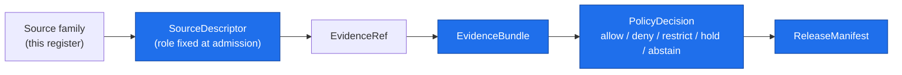

<!-- [KFM_META_BLOCK_V2]
doc_id: kfm://doc/atmosphere-sources
title: Atmosphere / Air — Source Families & Descriptors
type: standard
version: v1
status: draft
owners: KFM Atmosphere/Air domain stewards  # PLACEHOLDER — confirm steward roster
created: 2026-05-29
updated: 2026-05-29
policy_label: public
related: [ai-build-operating-contract.md, directory-rules.md, docs/domains/atmosphere/README.md, docs/sources/README.md, schemas/contracts/v1/source/source-descriptor.json]
tags: [kfm]
notes: [CONTRACT_VERSION pinned 3.0.0; repo-state claims PROPOSED/NEEDS VERIFICATION pending mounted-repo inspection; placement vs docs/sources/ flagged OQ-AIR-SRC-01]
[/KFM_META_BLOCK_V2] -->

<a id="top"></a>

# 🌫️ Atmosphere / Air — Source Families & Descriptors

> Canonical register of source families that the Atmosphere / Air domain admits, the source-role and rights posture each carries, and the descriptor discipline that governs admission, transformation, and publication.


**Status:** `draft` · **Owners:** Atmosphere / Air domain stewards *(placeholder — confirm roster)* · **Updated:** 2026-05-29 · `CONTRACT_VERSION = "3.0.0"`

---

## Quick jump

- [1. Scope](#1-scope)
- [2. Repo fit](#2-repo-fit)
- [3. What belongs here](#3-what-belongs-here)
- [4. What does not belong here](#4-what-does-not-belong-here)
- [5. Source families](#5-source-families)
- [6. Source roles and descriptor fields](#6-source-roles-and-descriptor-fields)
- [7. Admission flow (RAW → PUBLISHED)](#7-admission-flow-raw--published)
- [8. Sensitivity and cross-lane handling](#8-sensitivity-and-cross-lane-handling)
- [9. Source-role anti-collapse rules](#9-source-role-anti-collapse-rules)
- [Open questions register](#open-questions-register)
- [Open verification backlog](#open-verification-backlog)
- [Changelog](#changelog-v0--v1)
- [Definition of done](#definition-of-done)
- [Related docs](#related-docs)

---

## 1. Scope

This document is the source register for the **Atmosphere / Air** domain. Its job is to name the **source families** the domain admits, record the **source role**, **rights/sensitivity posture**, and **freshness** of each, and pin the **descriptor discipline** that every admitted source MUST satisfy before it can support a claim.

> [!NOTE]
> This is a **source register**, not a connector manifest and not a schema. It records *which sources exist and what role they may play*. The machine shape of a descriptor lives in `schemas/`, source-specific fetch/admit logic lives in `connectors/`, and admissibility decisions live in `policy/`. (`directory-rules.md` §4 responsibility split.)

The Atmosphere / Air domain governs: air observations, AQI reports, regulatory archives, low-cost sensors, atmospheric model fields, remote-sensing masks, climate/anomaly context, fusion products, meteorological support, and advisory context. *(CONFIRMED doctrine / PROPOSED implementation — `[DOM-AIR]` `[ENCY]`.)*

[↑ Back to top](#top)

---

## 2. Repo fit

| Aspect | Value | Status |
|---|---|---|
| This file | `docs/domains/atmosphere/SOURCES.md` | PROPOSED — see OQ-AIR-SRC-01 |
| Owning root | `docs/` (human-facing control plane) | CONFIRMED (`directory-rules.md` §6.1) |
| Domain segment | `atmosphere/` lane inside `docs/domains/` | CONFIRMED (`directory-rules.md` §12, domains are lane segments) |
| Upstream (meaning) | `contracts/domains/atmosphere/` | PROPOSED — NEEDS VERIFICATION |
| Upstream (shape) | `schemas/contracts/v1/source/source-descriptor.json` | PROPOSED (Atlas §24.1.3; `directory-rules.md` §7.4 / ADR-0001) |
| Sibling (global sources) | `docs/sources/` | CONFIRMED home for source-descriptor standards / source families (`directory-rules.md` §6.1) |
| Policy | `policy/sensitivity/` entries for sensitive joins | NEEDS VERIFICATION |

> [!IMPORTANT]
> **Placement is not yet frozen.** `directory-rules.md` §6.1 names `docs/sources/` as "source-descriptor standards, source families" — a *global* home. This file assumes a **per-domain** register under `docs/domains/atmosphere/SOURCES.md`, parallel to other per-domain docs. Whether per-domain source registers are canonical, or whether atmosphere sources should live as a section under `docs/sources/`, is an open ADR question (**OQ-AIR-SRC-01**). Until resolved, treat this path as **PROPOSED**.

[↑ Back to top](#top)

---

## 3. What belongs here

- Named **source families** the Atmosphere / Air domain admits or may admit.
- The **source role** each family may carry (observed, regulatory, modeled, aggregate, context).
- **Rights / sensitivity** posture and **freshness / cadence** notes per family.
- **Descriptor discipline** rules: what a `SourceDescriptor` MUST record before fetch, transform, or publication.
- Pointers to the canonical **schema home** and **policy** entries.

## 4. What does not belong here

| Belongs elsewhere | Correct home | Rule |
|---|---|---|
| Machine shape of `SourceDescriptor` | `schemas/contracts/v1/source/` | `directory-rules.md` §7.4 / ADR-0001 |
| Object **meaning** definitions | `contracts/domains/atmosphere/` | `directory-rules.md` §6.3 |
| Allow / deny / restrict / abstain decisions | `policy/` | `directory-rules.md` §6.5 |
| Source-specific fetcher / admitter code | `connectors/` | `directory-rules.md` §4 |
| Lifecycle data (raw payloads, processed objects) | `data/<phase>/atmosphere/` | `directory-rules.md` §12 |
| Operational refresh procedures | `docs/runbooks/` (subfolder convention OPEN-DR-02) | `directory-rules.md` §6.1.b |

> [!WARNING]
> Do **not** create a parallel source registry, schema home, or policy home here. A source register *names and documents*; it does not *define shape* or *decide admissibility*. Creating a competing home requires an ADR (`directory-rules.md` §2.4).

[↑ Back to top](#top)

---

## 5. Source families

The following source families are recorded for the Atmosphere / Air domain. Every entry is **CONFIRMED doctrine** as a named family in the Domains Atlas; each one's **rights/current terms** is **NEEDS VERIFICATION**, and **sensitive joins fail closed** by default. *(`[DOM-AIR]` `[ENCY]`.)*

> [!NOTE]
> "Role" below shows the *permitted role space* — `authority / observation / context / model as source role requires`. The **fixed role** for a specific admitted instance is set at admission in its `SourceDescriptor` and is **never upgraded by promotion** (see [§9](#9-source-role-anti-collapse-rules)).

| Source family | Permitted role space | Rights / sensitivity | Freshness | Status |
|---|---|---|---|---|
| **OpenAQ-like aggregators** | authority / observation / context / model as role requires | rights & terms NEEDS VERIFICATION; sensitive joins fail closed | source-vintage or cadence specific | `[DOM-AIR]` `[ENCY]` |
| **EPA AQS-like archive** | authority / observation / context / model as role requires | rights & terms NEEDS VERIFICATION; sensitive joins fail closed | source-vintage or cadence specific | `[DOM-AIR]` `[ENCY]` |
| **AirNow / agency reporting** | authority / observation / context / model as role requires | rights & terms NEEDS VERIFICATION; sensitive joins fail closed | source-vintage or cadence specific | `[DOM-AIR]` `[ENCY]` |
| **CAMS / ECMWF-family model fields** | authority / observation / context / model as role requires | rights & terms NEEDS VERIFICATION; sensitive joins fail closed | source-vintage or cadence specific | `[DOM-AIR]` `[ENCY]` |
| **HRRR-Smoke / NOAA smoke forecast** | authority / observation / context / model as role requires | rights & terms NEEDS VERIFICATION; sensitive joins fail closed | source-vintage or cadence specific | `[DOM-AIR]` `[ENCY]` |
| **HMS smoke** | authority / observation / context / model as role requires | rights & terms NEEDS VERIFICATION; sensitive joins fail closed | source-vintage or cadence specific | `[DOM-AIR]` `[ENCY]` |
| **GOES / ABI AOD** | authority / observation / context / model as role requires | rights & terms NEEDS VERIFICATION; sensitive joins fail closed | source-vintage or cadence specific | `[DOM-AIR]` `[ENCY]` |
| **VIIRS fire / hotspot** | authority / observation / context / model as role requires | rights & terms NEEDS VERIFICATION; sensitive joins fail closed | source-vintage or cadence specific | `[DOM-AIR]` `[ENCY]` |

<details>
<summary><strong>Object families these sources support</strong> (reference)</summary>

The domain owns the following object families, any of which an admitted source may support as evidence or released derivative *(CONFIRMED / PROPOSED — `[DOM-AIR]` `[ENCY]`)*:

`AirStation` · `AirObservation` · `PM2.5 Observation` · `Ozone Observation` · `SmokeContext` · `AODRaster` · `Weather Station` · `Weather Observation` · `WindField` · `Precipitation Observation` · `Temperature Observation` · `Climate Normal` · `Climate Anomaly` · `Forecast Context` · `Advisory Context`

PROPOSED identity rule for each: *source id + object role + temporal scope + normalized digest*. CONFIRMED temporal rule: source, observed, valid, retrieval, release, and correction times stay distinct where material.

</details>

[↑ Back to top](#top)

---

## 6. Source roles and descriptor fields

Every admitted source MUST have a `SourceDescriptor` recording **identity, role, rights posture, update cadence, authority scope, and verification obligations**. Descriptors SHOULD be validated **before fetch, before transformation, and before publication** so source authority does not collapse into generic data availability. *(PROPOSED — `KFM-P1-PROG-0007`.)*



> [!NOTE]
> The descriptor surface below is **PROPOSED and illustrative**, drawn from Atlas §24.1.3. Actual field names and presence in the mounted `SourceDescriptor` schema are **NEEDS VERIFICATION**. The canonical schema home defaults to `schemas/contracts/v1/source/source-descriptor.json` per `directory-rules.md` §7.4 / ADR-0001, unless an accepted ADR relocates it.

| Field | Type / vocabulary | Required? | Notes |
|---|---|---|---|
| `source_role` | enum: `observed` \| `regulatory` \| `modeled` \| `aggregate` \| `administrative` \| `candidate` \| `synthetic` | MUST | Set at admission. Never edited in place; corrections produce a **new descriptor** + `CorrectionNotice`. |
| `role_authority` | string (issuing body / model identity / steward) | MUST when role ∈ {regulatory, modeled, aggregate} | Disambiguates the authoring authority for cite text. |
| `role_aggregation_unit` | geometry-scope token (county, HUC, tract, year, decade…) | MUST when `source_role = aggregate` | Prevents geometry-scope drift on join. |
| `role_model_run_ref` | `EvidenceRef → ModelRunReceipt` | MUST when `source_role = modeled` | Pins inputs, parameters, version that produced the value. |
| `role_synthetic_basis` | `{ method, inputs, reality_boundary_note_ref }` | MUST when `source_role = synthetic` | Records what is and is not real in the carrier. |
| `role_candidate_disposition` | enum: `pending` \| `merged` \| `rejected` \| `quarantined` | MUST when `source_role = candidate` | Tracks promotion state; `PUBLISHED` edge forbidden until merged. |

**Atmosphere-specific role mapping** *(PROPOSED — derived from §5 families):*

- Sensor networks and agency reporting (OpenAQ-like, AirNow) → typically `observed`.
- EPA AQS-like archive → `regulatory` where it functions as the regulatory record; `observed` only where it carries direct measurements (do not conflate).
- CAMS / ECMWF, HRRR-Smoke → `modeled` (require `role_model_run_ref`).
- HMS smoke, GOES/ABI AOD, VIIRS → `observed` remote-sensing or `context` masks per use.

[↑ Back to top](#top)

---

## 7. Admission flow (RAW → PUBLISHED)

Atmosphere / Air follows the canonical lifecycle, with **promotion as a governed state transition**, not a file move. *(CONFIRMED doctrine / PROPOSED lane application — `[DIRRULES]` `[DOM-AIR]` `[ENCY]`.)*

```text
RAW → WORK / QUARANTINE → PROCESSED → CATALOG / TRIPLET → PUBLISHED
```

| Stage | Handling | Gate | Status |
|---|---|---|---|
| **RAW** | Capture immutable source payload or reference with source role, rights, sensitivity, citation, time, and hash. | `SourceDescriptor` exists. | PROPOSED |
| **WORK / QUARANTINE** | Normalize schema, geometry, time, identity, evidence, rights, policy; hold failures. | Validation + policy gate pass, **or** quarantine reason recorded. | PROPOSED |
| **PROCESSED** | Emit validated normalized objects, receipts, and public-safe candidates. | `EvidenceRef`, `ValidationReport`, and digest closure exist. | PROPOSED |
| **CATALOG / TRIPLET** | Resolve to `EvidenceBundle`; catalog and graph projection. | Bundle resolves; catalog/graph are not proof by themselves. | PROPOSED |
| **PUBLISHED** | Public-safe release via governed interface. | `ReleaseManifest` + rollback target + correction path. | PROPOSED |

> [!CAUTION]
> No public client or normal UI surface may read `RAW`, `WORK`, or `QUARANTINE`, or reach canonical/internal stores, source APIs, or model runtimes directly. Publication is a governed state transition gated on `EvidenceBundle`, `PolicyDecision`, and `ReleaseManifest`. *(CONFIRMED doctrine — `[ENCY]` `[GAI]` `[DIRRULES]`.)*

[↑ Back to top](#top)

---

## 8. Sensitivity and cross-lane handling

Most Atmosphere / Air content is public-safe. Sensitivity enters chiefly through **cross-lane joins** and **advisory / life-safety adjacency**.

| Related lane | Relation type | Constraint |
|---|---|---|
| **Hazards** | smoke, heat/cold, advisory, visibility, fire/emissions context | relation MUST preserve ownership, source role, sensitivity, and `EvidenceBundle` support |
| **Agriculture** | heat, smoke, precipitation, vegetation stress | same constraint |
| **Hydrology** | precipitation, drought, flood-weather forcing | same constraint |
| **Biodiversity domains** | phenology, smoke, fire, drought stress | **without exposing sensitive locations** |

> [!CAUTION]
> **KFM is never an alert or instruction authority.** Atmosphere / Air may *cite* advisory context; it MUST NOT present governed evidence as life-safety guidance. Hazards owns emergency/hazard event truth. *(CONFIRMED — `[DOM-HAZ]` `[DOM-AIR]` `[ENCY]`.)*

Default sensitive-domain disposition (per `ai-build-operating-contract.md` §23.2; no row strongly matches a public sensor reading, so the conservative default governs uncertain joins):

```text
DENY public exact exposure where uncertain
GENERALIZE before publication
QUARANTINE uncertain source material
REQUIRE steward review for biodiversity-location joins
ABSTAIN when support is inadequate
```

A `policy/sensitivity/` entry SHOULD govern any join that could surface a sensitive species location through smoke/fire/drought context. **NEEDS VERIFICATION:** presence of such an entry in the mounted repo.

[↑ Back to top](#top)

---

## 9. Source-role anti-collapse rules

Source role is **fixed at admission and never upgraded by promotion**. These rules are CONFIRMED doctrine; the validators that enforce them are PROPOSED. *(`[ENCY]` Atlas §24.9.2; `[DOM-AIR]`.)*

| Anti-pattern | What goes wrong | Counter-rule |
|---|---|---|
| Regulatory archive cited as observed event evidence | regulatory-vs-observed lane collapse | Separate regulatory and observed lanes; UI banner. `[DOM-AIR]` `[DOM-HAZ]` |
| Modeled field (CAMS, HRRR-Smoke) presented as observation | model becomes truth source | `role_model_run_ref` required; preserve `modeled` role. |
| Aggregate (decadal normal) cited as a per-place truth | geometry-scope drift | DENY aggregate→single-record join; ABSTAIN at AI. `[DOM-AG]` `[DOM-AIR]` |
| `modeled → observed` "upgrade" on promotion | source-role collapse | Role is fixed at admission; never upgraded. `[ENCY]` |
| Low-cost sensor reading presented without caveat | over-trust of uncalibrated data | Carry caveat layer; preserve source role. `[DOM-AIR]` |

[↑ Back to top](#top)

---

## Open questions register

| ID | Question | Owner role | Resolution path |
|---|---|---|---|
| OQ-AIR-SRC-01 | Do per-domain source registers (`docs/domains/atmosphere/SOURCES.md`) coexist with the global `docs/sources/`, or should atmosphere sources live under `docs/sources/`? | Docs steward + Directory Rules owner | ADR / `directory-rules.md` §6.1 check |
| OQ-AIR-SRC-02 | What is the canonical `SourceDescriptor` schema home and actual field set in the mounted repo? | Schema owner | Repo inspection vs. Atlas §24.1.3 / ADR-0001 |
| OQ-AIR-SRC-03 | Which `policy/sensitivity/` entry governs atmosphere × biodiversity-location joins? | Sensitivity reviewer | `policy/` inspection |
| OQ-AIR-SRC-04 | Confirmed rights / current terms for each named source family. | Atmosphere stewards | Per-source license review |

## Open verification backlog

These items remain `NEEDS VERIFICATION` before promotion from `draft` to `published`:

1. Mounted-repo path for this file and whether per-domain `SOURCES.md` is the canonical pattern (OQ-AIR-SRC-01).
2. Actual `SourceDescriptor` schema home, field names, and required-field logic (OQ-AIR-SRC-02).
3. Rights / current terms for OpenAQ-like, EPA AQS-like, AirNow, CAMS/ECMWF, HRRR-Smoke, HMS, GOES/ABI AOD, VIIRS.
4. Presence of `policy/sensitivity/` entries governing cross-lane biodiversity-location joins.
5. Existence of connectors and validators implementing the admission gates in [§7](#7-admission-flow-raw--published).
6. Steward roster / owner values in the meta block.

## Changelog v0 → v1

| Change | Type (per contract §37) | Reason |
|---|---|---|
| Initial source register authored | new | First-pass Atmosphere / Air source documentation. |
| Source families table populated from Atlas | gap closure | Ground families in `[DOM-AIR]` evidence. |
| Source-role descriptor surface imported (PROPOSED) | clarification | Align with Atlas §24.1.3 role-to-field mapping. |

> **Backward compatibility.** New file; no anchors to preserve. Stable anchors introduced here (`#source-families`, `#source-roles-and-descriptor-fields`, `#admission-flow-raw--published`) SHOULD be preserved on future edits.

## Definition of done

This document is done enough to enter the repository when:

- it is placed according to Directory Rules (OQ-AIR-SRC-01 resolved);
- a docs steward and the Atmosphere / Air domain steward review it;
- it is linked from `docs/domains/atmosphere/README.md` and a docs/sources index;
- it does not conflict with accepted ADRs (schema-home, source-register placement);
- any conflict with current repo conventions is logged in `docs/registers/DRIFT_REGISTER.md`;
- the `GENERATED_RECEIPT.json` planned in the PR is wired into CI;
- future changes follow the operating contract's §37 lifecycle.

---

## Related docs

- [`ai-build-operating-contract.md`](../../../ai-build-operating-contract.md) — operating law (`CONTRACT_VERSION = "3.0.0"`)
- [`directory-rules.md`](../../doctrine/directory-rules.md) — placement doctrine *(path PROPOSED — verify)*
- [`docs/domains/atmosphere/README.md`](./README.md) — domain landing page *(NEEDS VERIFICATION)*
- [`docs/sources/README.md`](../../sources/README.md) — global source-descriptor standards *(NEEDS VERIFICATION)*
- `schemas/contracts/v1/source/source-descriptor.json` — descriptor shape *(PROPOSED)*

---

**Last updated:** 2026-05-29 · `CONTRACT_VERSION = "3.0.0"` · Status: `draft`

[↑ Back to top](#top)
