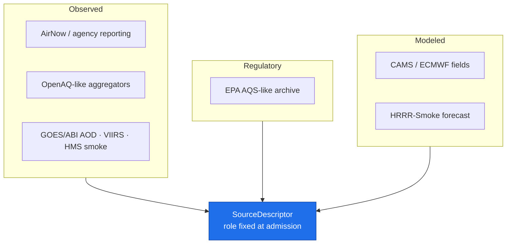

<!-- [KFM_META_BLOCK_V2]
doc_id: kfm://doc/atmosphere-source-families
title: Atmosphere / Air — Key Source Families
type: standard
version: v1
status: draft
owners: KFM Atmosphere/Air domain stewards  # PLACEHOLDER — confirm steward roster
created: 2026-05-29
updated: 2026-05-29
policy_label: public
related: [ai-build-operating-contract.md, directory-rules.md, docs/domains/atmosphere/SOURCES.md, docs/domains/atmosphere/README.md, schemas/contracts/v1/source/source-descriptor.json]
tags: [kfm]
notes: [CONTRACT_VERSION pinned 3.0.0; this file = Atlas Ch.11 §D source-family catalog; descriptor discipline + admission flow live in SOURCES.md; relationship flagged OQ-AIR-SF-01]
[/KFM_META_BLOCK_V2] -->

# 🌫️ Atmosphere / Air — Key Source Families

> The catalog of source families the Atmosphere / Air domain admits — their permitted role space, rights/sensitivity posture, and freshness — derived from the Domains Atlas Ch. 11 §D.

**Status:** `draft` · **Owners:** Atmosphere / Air domain stewards *(placeholder — confirm roster)* · **Updated:** 2026-05-29 · `CONTRACT_VERSION = "3.0.0"`

---

## Quick jump

- [1. Scope and relationship to SOURCES.md](#1-scope-and-relationship-to-sourcesmd)
- [2. Repo fit](#2-repo-fit)
- [3. What a "source family" is](#3-what-a-source-family-is)
- [4. The source-family catalog](#4-the-source-family-catalog)
- [5. Role space and family typing](#5-role-space-and-family-typing)
- [6. Rights, sensitivity, and freshness posture](#6-rights-sensitivity-and-freshness-posture)
- [7. Objects these families support](#7-objects-these-families-support)
- [Open questions register](#open-questions-register)
- [Open verification backlog](#open-verification-backlog)
- [Changelog](#changelog-v0--v1)
- [Definition of done](#definition-of-done)
- [Related docs](#related-docs)

---

## 1. Scope and relationship to SOURCES.md

This file is the **source-family catalog** for the Atmosphere / Air domain. It corresponds directly to **§D "Key source families"** of the domain's Atlas chapter (Ch. 11). Its single job is to enumerate the families, their **permitted role space**, **rights/sensitivity** posture, and **freshness** — nothing more.

> [!IMPORTANT]
> **Two adjacent files, deliberately split.** `SOURCE_FAMILIES.md` (this file) is the **catalog of families**. [`SOURCES.md`](./SOURCES.md) is the **governance layer** — descriptor discipline, the `SourceDescriptor` field surface, the RAW→PUBLISHED admission flow, and source-role anti-collapse rules. The catalog answers *"which families exist?"*; the governance doc answers *"how is any one of them admitted and kept honest?"* Whether both files should coexist, or whether one should subsume the other, is open (**OQ-AIR-SF-01**).

The Atmosphere / Air domain governs air observations, AQI reports, regulatory archives, low-cost sensors, atmospheric model fields, remote-sensing masks, climate/anomaly context, fusion products, meteorological support, and advisory context. *(CONFIRMED doctrine / PROPOSED implementation — `[DOM-AIR]` `[ENCY]`.)*

[↑ Back to top](#top)

---

## 2. Repo fit

| Aspect | Value | Status |
|---|---|---|
| This file | `docs/domains/atmosphere/SOURCE_FAMILIES.md` | PROPOSED — see OQ-AIR-SF-01 |
| Owning root | `docs/` (human-facing control plane) | CONFIRMED (`directory-rules.md` §6.1) |
| Domain segment | `atmosphere/` lane inside `docs/domains/` | CONFIRMED (`directory-rules.md` §12) |
| Sibling (governance) | [`docs/domains/atmosphere/SOURCES.md`](./SOURCES.md) | PROPOSED |
| Sibling (global sources) | `docs/sources/` | CONFIRMED home for source-descriptor standards / source families (`directory-rules.md` §6.1) |
| Descriptor shape | `schemas/contracts/v1/source/source-descriptor.json` | PROPOSED (Atlas §24.1.3; `directory-rules.md` §7.4 / ADR-0001) |

> [!NOTE]
> `directory-rules.md` §6.1 names `docs/sources/` as the global home for "source-descriptor standards, source families." A **per-domain** family catalog under `docs/domains/atmosphere/` is the assumption here, parallel to other per-domain docs, but its canonical status is unconfirmed. Treat the path as **PROPOSED** until OQ-AIR-SF-01 is resolved by ADR.

[↑ Back to top](#top)

---

## 3. What a "source family" is

A **source family** is a named class of upstream provider or dataset lineage (e.g., "AirNow / agency reporting") rather than a single fetch endpoint. A family is a documentation-level grouping; a specific admitted instance becomes a `SourceDescriptor` with its **role fixed at admission**.

> [!NOTE]
> A source family does **not** carry a fixed role by itself. The catalog records the *permitted role space* (`authority / observation / context / model as source role requires`); the concrete role is set per admitted instance in its `SourceDescriptor` and is **never upgraded by promotion**. See [§5](#5-role-space-and-family-typing) and `SOURCES.md` §9. *(`[ENCY]` Atlas §24.9.2.)*

[↑ Back to top](#top)

---

## 4. The source-family catalog

Every entry below is **CONFIRMED doctrine** as a named family in the Domains Atlas Ch. 11 §D. For each one, **rights/current terms** is **NEEDS VERIFICATION**, and **sensitive joins fail closed** by default. *(`[DOM-AIR]` `[ENCY]`.)*

| Source family | Permitted role space | Rights / sensitivity | Freshness | Status |
|---|---|---|---|---|
| **OpenAQ-like aggregators** | authority / observation / context / model as role requires | rights & terms NEEDS VERIFICATION; sensitive joins fail closed | source-vintage or cadence specific | `[DOM-AIR]` `[ENCY]` |
| **EPA AQS-like archive** | authority / observation / context / model as role requires | rights & terms NEEDS VERIFICATION; sensitive joins fail closed | source-vintage or cadence specific | `[DOM-AIR]` `[ENCY]` |
| **AirNow / agency reporting** | authority / observation / context / model as role requires | rights & terms NEEDS VERIFICATION; sensitive joins fail closed | source-vintage or cadence specific | `[DOM-AIR]` `[ENCY]` |
| **CAMS / ECMWF-family model fields** | authority / observation / context / model as role requires | rights & terms NEEDS VERIFICATION; sensitive joins fail closed | source-vintage or cadence specific | `[DOM-AIR]` `[ENCY]` |
| **HRRR-Smoke / NOAA smoke forecast** | authority / observation / context / model as role requires | rights & terms NEEDS VERIFICATION; sensitive joins fail closed | source-vintage or cadence specific | `[DOM-AIR]` `[ENCY]` |
| **HMS smoke** | authority / observation / context / model as role requires | rights & terms NEEDS VERIFICATION; sensitive joins fail closed | source-vintage or cadence specific | `[DOM-AIR]` `[ENCY]` |
| **GOES / ABI AOD** | authority / observation / context / model as role requires | rights & terms NEEDS VERIFICATION; sensitive joins fail closed | source-vintage or cadence specific | `[DOM-AIR]` `[ENCY]` |
| **VIIRS fire / hotspot** | authority / observation / context / model as role requires | rights & terms NEEDS VERIFICATION; sensitive joins fail closed | source-vintage or cadence specific | `[DOM-AIR]` `[ENCY]` |

> [!WARNING]
> This list is the **Atlas-grounded set**. It is not asserted to be exhaustive of every source the live domain may eventually admit. Additions require a `SourceDescriptor`, a rights determination, and (for sensitive joins) a `policy/sensitivity/` entry before admission.

[↑ Back to top](#top)

---

## 5. Role space and family typing

The catalog records a role *space*; the table below is a **PROPOSED, INFERRED** typing of each family's likely concrete role, derived from the family description. It is guidance for descriptor authors, not an admission decision.

| Family | Likely concrete role | Required extra descriptor field | Basis |
|---|---|---|---|
| AirNow / agency reporting | `observed` | — | direct sensor reporting |
| OpenAQ-like aggregators | `observed` (aggregator of measurements) | watch for `aggregate` framing | INFERRED |
| EPA AQS-like archive | `regulatory` where it is the regulatory record; `observed` only for direct measurements | `role_authority` | do not conflate regulatory and observed |
| CAMS / ECMWF fields | `modeled` | `role_model_run_ref` | model output |
| HRRR-Smoke / NOAA smoke forecast | `modeled` | `role_model_run_ref` | forecast model |
| HMS smoke | `observed` / `context` mask | — | analyst-drawn smoke product |
| GOES / ABI AOD | `observed` (remote sensing) | — | satellite retrieval |
| VIIRS fire / hotspot | `observed` (remote sensing) | — | satellite detection |

> [!CAUTION]
> Modeled fields (CAMS, HRRR-Smoke) MUST NOT be presented as observation, and the regulatory archive MUST NOT be cited as observed-event evidence. These are source-role-collapse anti-patterns; full counter-rules live in `SOURCES.md` §9. *(`[ENCY]` Atlas §24.9.2; `[DOM-AIR]` `[DOM-HAZ]`.)*

[↑ Back to top](#top)

---

## 6. Rights, sensitivity, and freshness posture

- **Rights / terms** — `NEEDS VERIFICATION` for every family until a per-source license review is recorded. A source MAY NOT be admitted public-safe with rights unknown. *(`[DOM-AIR]` `[ENCY]`; descriptor discipline in `SOURCES.md` §6.)*
- **Sensitive joins fail closed** — atmosphere content is largely public-safe, but joins that could surface a sensitive biodiversity location through smoke/fire/drought context default to DENY/GENERALIZE/steward review. *(operating contract §23.2 conservative default.)*
- **Freshness** — each family is `source-vintage or cadence specific`; cadence is a descriptor field, not a global constant. Stale sources surface as `SOURCE_STALE` at runtime.

> [!CAUTION]
> **KFM is never an alert or instruction authority.** Advisory and forecast families (HRRR-Smoke, agency advisories) may be *cited as context* but MUST NOT be presented as life-safety guidance. Hazards owns emergency/hazard event truth. *(CONFIRMED — `[DOM-HAZ]` `[DOM-AIR]` `[ENCY]`.)*

[↑ Back to top](#top)

---

## 7. Objects these families support

A family admitted at the proper role may support one or more of the domain's object families as evidence or released derivative.

<strong>Atmosphere / Air object families</strong> (reference)

`AirStation` · `AirObservation` · `PM2.5 Observation` · `Ozone Observation` · `SmokeContext` · `AODRaster` · `Weather Station` · `Weather Observation` · `WindField` · `Precipitation Observation` · `Temperature Observation` · `Climate Normal` · `Climate Anomaly` · `Forecast Context` · `Advisory Context`

*(CONFIRMED / PROPOSED — `[DOM-AIR]` `[ENCY]`.)*

PROPOSED identity rule for each object: *source id + object role + temporal scope + normalized digest*. CONFIRMED temporal rule: source, observed, valid, retrieval, release, and correction times stay distinct where material.

Illustrative family → object alignment *(PROPOSED, INFERRED)*:

| Family | Plausible objects supported |
|---|---|
| AirNow / agency reporting | `AirObservation`, `PM2.5 Observation`, `Ozone Observation`, `AirStation` |
| EPA AQS-like archive | `AirObservation`, regulatory-archive layer |
| CAMS / ECMWF fields | `AODRaster`, model-field context |
| HRRR-Smoke / NOAA smoke | `SmokeContext`, `Forecast Context` |
| HMS smoke | `SmokeContext` |
| GOES / ABI AOD | `AODRaster` |
| VIIRS fire / hotspot | `SmokeContext` (fire context) |

[↑ Back to top](#top)

---

## Open questions register

| ID | Question | Owner role | Resolution path |
|---|---|---|---|
| OQ-AIR-SF-01 | Should `SOURCE_FAMILIES.md` and `SOURCES.md` coexist, or should one subsume the other? Is per-domain family cataloging canonical vs. living under `docs/sources/`? | Docs steward + Directory Rules owner | ADR / `directory-rules.md` §6.1 check |
| OQ-AIR-SF-02 | Confirmed rights / current terms for each named family. | Atmosphere stewards | Per-source license review |
| OQ-AIR-SF-03 | Are the concrete-role typings in §5 correct against actual admitted descriptors? | Schema owner + stewards | Repo `SourceDescriptor` inspection |
| OQ-AIR-SF-04 | Is the family list complete for the live domain, or are families missing? | Atmosphere stewards | Source-survey review |

## Open verification backlog

These items remain `NEEDS VERIFICATION` before promotion from `draft` to `published`:

1. Canonical placement of this file and its relationship to `SOURCES.md` (OQ-AIR-SF-01).
2. Rights / current terms for each of the eight named families.
3. Correctness of the §5 concrete-role typings against mounted descriptors.
4. Completeness of the family list.
5. Presence of `policy/sensitivity/` entries for cross-lane biodiversity-location joins.
6. Steward roster / owner values in the meta block.

## Changelog v0 → v1

| Change | Type (per contract §37) | Reason |
|---|---|---|
| Initial source-family catalog authored | new | First-pass Atmosphere / Air §D catalog. |
| Families imported from Atlas Ch. 11 §D | gap closure | Ground families in `[DOM-AIR]` evidence. |
| Role-typing and family→object tables added (PROPOSED) | clarification | Aid descriptor authors without asserting admission decisions. |
| Split scope from `SOURCES.md` recorded | clarification | Prevent duplication between catalog and governance layers. |

> **Backward compatibility.** New file; no anchors to preserve. If OQ-AIR-SF-01 merges this into `SOURCES.md`, redirect anchors `#the-source-family-catalog` and `#role-space-and-family-typing` accordingly.

## Definition of done

This document is done enough to enter the repository when:

- it is placed according to Directory Rules and OQ-AIR-SF-01 is resolved;
- a docs steward and the Atmosphere / Air domain steward review it;
- it is linked from `docs/domains/atmosphere/README.md` and cross-linked with `SOURCES.md`;
- it does not conflict with accepted ADRs;
- any conflict with current repo conventions is logged in `docs/registers/DRIFT_REGISTER.md`;
- the `GENERATED_RECEIPT.json` planned in the PR is wired into CI;
- future changes follow the operating contract's §37 lifecycle.

---

## Related docs

- [`SOURCES.md`](./SOURCES.md) — descriptor discipline, admission flow, anti-collapse rules *(PROPOSED)*
- [`docs/domains/atmosphere/README.md`](./README.md) — domain landing page *(NEEDS VERIFICATION)*
- [`ai-build-operating-contract.md`](../../../ai-build-operating-contract.md) — operating law (`CONTRACT_VERSION = "3.0.0"`)
- [`directory-rules.md`](../../doctrine/directory-rules.md) — placement doctrine *(path PROPOSED — verify)*
- `schemas/contracts/v1/source/source-descriptor.json` — descriptor shape *(PROPOSED)*

---

**Last updated:** 2026-05-29 · `CONTRACT_VERSION = "3.0.0"` · Status: `draft`

[↑ Back to top](#top)
