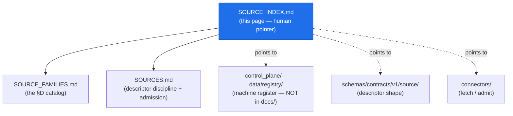

<!-- [KFM_META_BLOCK_V2]
doc_id: kfm://doc/atmosphere-source-index
title: Atmosphere / Air — Source Index
type: standard
version: v1
status: draft
owners: KFM Atmosphere/Air domain stewards  # PLACEHOLDER — confirm steward roster
created: 2026-05-29
updated: 2026-05-29
policy_label: public
related: [ai-build-operating-contract.md, directory-rules.md, docs/domains/atmosphere/SOURCE_FAMILIES.md, docs/domains/atmosphere/SOURCES.md, docs/domains/atmosphere/README.md, control_plane/]
tags: [kfm]
notes: [CONTRACT_VERSION pinned 3.0.0; this file is a HUMAN-FACING POINTER PAGE under docs/ — it indexes/links, it is NOT the machine-readable control_plane register; three-file relationship flagged OQ-AIR-IDX-01]
[/KFM_META_BLOCK_V2] -->

# 🌫️ Atmosphere / Air — Source Index

> The single navigational entry point for everything about Atmosphere / Air sources: the family catalog, the governance/descriptor layer, where descriptors and connectors live, and which registers track them.

**Status:** `draft` · **Owners:** Atmosphere / Air domain stewards *(placeholder — confirm roster)* · **Updated:** 2026-05-29 · `CONTRACT_VERSION = "3.0.0"`

---

## Quick jump

- [1. What this page is (and is not)](#1-what-this-page-is-and-is-not)
- [2. Repo fit](#2-repo-fit)
- [3. The three source docs at a glance](#3-the-three-source-docs-at-a-glance)
- [4. Source index by family](#4-source-index-by-family)
- [5. Where the machine artifacts live](#5-where-the-machine-artifacts-live)
- [6. How to read this index](#6-how-to-read-this-index)
- [Open questions register](#open-questions-register)
- [Open verification backlog](#open-verification-backlog)
- [Changelog](#changelog-v0--v1)
- [Definition of done](#definition-of-done)
- [Related docs](#related-docs)

---

## 1. What this page is (and is not)

This is a **human-facing pointer page**. Its job is orientation: it tells a reader *where to go* for any Atmosphere / Air source question and links the pieces together. It carries no source data, no descriptor shape, and no admissibility logic of its own.

> [!IMPORTANT]
> **`docs/` explains; `control_plane/` indexes.** This file lives under `docs/` and is therefore an *explanatory* index — a map for humans. It is **not** the machine-readable source register. Any machine-readable "what governs what" map for sources belongs under `control_plane/` (or `data/registry/`), never here. *(CONFIRMED doctrine — `directory-rules.md` §6: "`docs/` explains; `control_plane/` indexes".)*

[↑ Back to top](#top)

---

## 2. Repo fit

| Aspect | Value | Status |
|---|---|---|
| This file | `docs/domains/atmosphere/SOURCE_INDEX.md` | PROPOSED — see OQ-AIR-IDX-01 |
| Owning root | `docs/` (human-facing control plane) | CONFIRMED (`directory-rules.md` §6.1) |
| Responsibility | Explains / indexes for humans | CONFIRMED — `docs/` explains, not `control_plane/` indexes |
| Domain segment | `atmosphere/` lane inside `docs/domains/` | CONFIRMED (`directory-rules.md` §12) |
| Sibling (catalog) | [`SOURCE_FAMILIES.md`](./SOURCE_FAMILIES.md) | PROPOSED |
| Sibling (governance) | [`SOURCES.md`](./SOURCES.md) | PROPOSED |
| Machine register (elsewhere) | `control_plane/` and/or `data/registry/` | CONFIRMED root; per-source register presence NEEDS VERIFICATION |

[↑ Back to top](#top)

---

## 3. The three source docs at a glance

Three atmosphere source docs now exist, each with a distinct job. This page exists partly to keep them from drifting into one another.

| Doc | Question it answers | Layer |
|---|---|---|
| [`SOURCE_FAMILIES.md`](./SOURCE_FAMILIES.md) | *Which source families exist, and what role space / rights / freshness does each carry?* | Catalog (Atlas Ch. 11 §D) |
| [`SOURCES.md`](./SOURCES.md) | *How is any source admitted, described, gated, and kept honest?* | Governance / descriptor discipline |
| `SOURCE_INDEX.md` (this) | *Where do I go for any of the above, and where do the machine artifacts live?* | Navigation / pointer |

> [!WARNING]
> If a future ADR decides three files is one too many (see **OQ-AIR-IDX-01**), this pointer page is the most likely merge candidate — its content is links, not source-of-truth. Do not duplicate catalog or governance content here; **link to it**.

[↑ Back to top](#top)

---

## 4. Source index by family

Quick index of the Atlas-grounded families, each pointing to its catalog entry. Families and their CONFIRMED status as named families come from the Domains Atlas Ch. 11 §D; rights/terms remain `NEEDS VERIFICATION` per family. *(`[DOM-AIR]` `[ENCY]`.)*

| Source family | Catalog entry | Likely role *(PROPOSED)* | Descriptor | Connector |
|---|---|---|---|---|
| OpenAQ-like aggregators | [§4 catalog](./SOURCE_FAMILIES.md#4-the-source-family-catalog) | observed | NEEDS VERIFICATION | NEEDS VERIFICATION |
| EPA AQS-like archive | [§4 catalog](./SOURCE_FAMILIES.md#4-the-source-family-catalog) | regulatory / observed | NEEDS VERIFICATION | NEEDS VERIFICATION |
| AirNow / agency reporting | [§4 catalog](./SOURCE_FAMILIES.md#4-the-source-family-catalog) | observed | NEEDS VERIFICATION | NEEDS VERIFICATION |
| CAMS / ECMWF-family model fields | [§4 catalog](./SOURCE_FAMILIES.md#4-the-source-family-catalog) | modeled | NEEDS VERIFICATION | NEEDS VERIFICATION |
| HRRR-Smoke / NOAA smoke forecast | [§4 catalog](./SOURCE_FAMILIES.md#4-the-source-family-catalog) | modeled | NEEDS VERIFICATION | NEEDS VERIFICATION |
| HMS smoke | [§4 catalog](./SOURCE_FAMILIES.md#4-the-source-family-catalog) | observed / context | NEEDS VERIFICATION | NEEDS VERIFICATION |
| GOES / ABI AOD | [§4 catalog](./SOURCE_FAMILIES.md#4-the-source-family-catalog) | observed | NEEDS VERIFICATION | NEEDS VERIFICATION |
| VIIRS fire / hotspot | [§4 catalog](./SOURCE_FAMILIES.md#4-the-source-family-catalog) | observed | NEEDS VERIFICATION | NEEDS VERIFICATION |

> [!NOTE]
> The "Descriptor" and "Connector" columns are **NEEDS VERIFICATION** placeholders. They will resolve to concrete `SourceDescriptor` IDs and `connectors/` paths once a repo is mounted and inspected. Role values restate the PROPOSED typing in `SOURCE_FAMILIES.md` §5 and are not admission decisions.

[↑ Back to top](#top)

---

## 5. Where the machine artifacts live

This page points; it does not hold. The canonical homes:

| Artifact | Canonical home | Status |
|---|---|---|
| Descriptor **shape** | `schemas/contracts/v1/source/source-descriptor.json` | PROPOSED (Atlas §24.1.3; `directory-rules.md` §7.4 / ADR-0001) |
| Descriptor **meaning** | `contracts/domains/atmosphere/` | PROPOSED — NEEDS VERIFICATION |
| Admissibility decisions | `policy/` (incl. `policy/sensitivity/`) | NEEDS VERIFICATION |
| Source fetch / admit code | `connectors/` (output → `data/raw/` or `data/quarantine/`) | CONFIRMED rule (`directory-rules.md`); per-source presence NEEDS VERIFICATION |
| Machine-readable source register | `control_plane/` and/or `data/registry/` | CONFIRMED roots; per-source entries NEEDS VERIFICATION |
| Lifecycle data | `data/<phase>/atmosphere/` | CONFIRMED pattern (`directory-rules.md` §12) |

> [!CAUTION]
> Connectors **do not publish**. Their output lands in `data/raw/` or `data/quarantine/` and advances only through governed promotion. No public client or normal UI surface reads RAW/WORK/QUARANTINE or reaches source APIs directly. *(CONFIRMED — `directory-rules.md`; `[ENCY]` `[GAI]`.)*

[↑ Back to top](#top)

---

## 6. How to read this index

1. **Need to know which sources exist?** → [`SOURCE_FAMILIES.md`](./SOURCE_FAMILIES.md).
2. **Need to admit, describe, or gate a source?** → [`SOURCES.md`](./SOURCES.md).
3. **Need the descriptor shape or a connector?** → [§5](#5-where-the-machine-artifacts-live) for canonical homes.
4. **Need the machine register?** → `control_plane/` / `data/registry/`, **not** this page.

> [!NOTE]
> Every path on this page is **PROPOSED** or **NEEDS VERIFICATION** until checked against a mounted repository. This index does not assert that any linked file or directory currently exists.

[↑ Back to top](#top)

---

## Open questions register

| ID | Question | Owner role | Resolution path |
|---|---|---|---|
| OQ-AIR-IDX-01 | Are three atmosphere source docs (`SOURCE_INDEX`, `SOURCE_FAMILIES`, `SOURCES`) the right factoring, or should the index merge into a README / one of the others? | Docs steward + Directory Rules owner | ADR / `directory-rules.md` §6.1 check |
| OQ-AIR-IDX-02 | Should a machine-readable source register exist under `control_plane/` or `data/registry/`, and should this page link to it once it does? | Governance steward | `control_plane/` inspection |
| OQ-AIR-IDX-03 | Concrete `SourceDescriptor` IDs and `connectors/` paths per family (the placeholder columns in §4). | Schema owner + stewards | Repo inspection |
| OQ-AIR-IDX-04 | Should this pointer page instead be the domain `README.md`, given README-like docs are the canonical orientation surface? | Docs steward | `directory-rules.md` README-like convention |

## Open verification backlog

These items remain `NEEDS VERIFICATION` before promotion from `draft` to `published`:

1. Whether three source docs is the canonical factoring (OQ-AIR-IDX-01).
2. Existence and home of a machine-readable source register (OQ-AIR-IDX-02).
3. Concrete descriptor IDs and connector paths for the §4 table.
4. Whether this page duplicates the role of `README.md` (OQ-AIR-IDX-04).
5. Validity of all relative links once the repo is mounted.
6. Steward roster / owner values in the meta block.

## Changelog v0 → v1

| Change | Type (per contract §37) | Reason |
|---|---|---|
| Initial source index / pointer page authored | new | First-pass navigation surface for Atmosphere / Air sources. |
| Three-doc relationship table added | clarification | Prevent drift among `SOURCE_INDEX` / `SOURCE_FAMILIES` / `SOURCES`. |
| Machine-artifact homes table added | gap closure | Point readers to canonical homes without holding data here. |

> **Backward compatibility.** New file; no anchors to preserve. If merged per OQ-AIR-IDX-01, redirect `#source-index-by-family` to the surviving doc.

## Definition of done

This document is done enough to enter the repository when:

- it is placed according to Directory Rules and OQ-AIR-IDX-01 / OQ-AIR-IDX-04 are resolved;
- a docs steward and the Atmosphere / Air domain steward review it;
- it is linked from `docs/domains/atmosphere/README.md`;
- all relative links resolve against the mounted repo;
- it does not conflict with accepted ADRs;
- any conflict with current repo conventions is logged in `docs/registers/DRIFT_REGISTER.md`;
- the `GENERATED_RECEIPT.json` planned in the PR is wired into CI;
- future changes follow the operating contract's §37 lifecycle.

---

## Related docs

- [`SOURCE_FAMILIES.md`](./SOURCE_FAMILIES.md) — the family catalog *(PROPOSED)*
- [`SOURCES.md`](./SOURCES.md) — descriptor discipline + admission flow *(PROPOSED)*
- [`docs/domains/atmosphere/README.md`](./README.md) — domain landing page *(NEEDS VERIFICATION)*
- [`ai-build-operating-contract.md`](../../../ai-build-operating-contract.md) — operating law (`CONTRACT_VERSION = "3.0.0"`)
- [`directory-rules.md`](../../doctrine/directory-rules.md) — placement doctrine *(path PROPOSED — verify)*

---

**Last updated:** 2026-05-29 · `CONTRACT_VERSION = "3.0.0"` · Status: `draft`

[↑ Back to top](#top)
