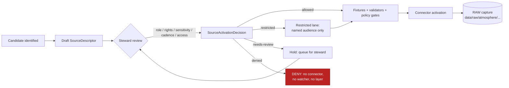

<!-- [KFM_META_BLOCK_V2]
doc_id: kfm://doc/atmosphere-source-registry
title: Atmosphere — Source Registry
type: standard
version: v1
status: draft
owners: TBD — atmosphere-domain-steward (placeholder)
created: 2026-05-16
updated: 2026-05-29
policy_label: public
related: [docs/domains/atmosphere/README.md, docs/domains/atmosphere/SOURCE_INDEX.md, docs/domains/atmosphere/SOURCE_FAMILIES.md, docs/domains/atmosphere/SOURCES.md, docs/standards/PROV.md, data/registry/sources/atmosphere/, schemas/contracts/v1/source/source-descriptor.json, policy/sensitivity/atmosphere/, ai-build-operating-contract.md]
tags: [kfm, atmosphere, source-registry, source-admission, governance]
notes: [CONTRACT_VERSION pinned 3.0.0 # PROPOSED placement per Directory Rules §3 Step 3 and §12 # doctrinal artifact only; canonical machine-readable registry lives under data/registry/sources/atmosphere/ # filename reconciliation with sibling source docs flagged OQ-AIR-REG-01]
[/KFM_META_BLOCK_V2] -->

<a id="top"></a>

# 🌬️ Atmosphere — Source Registry

> Domain source-admission and authority-control surface for the Kansas Frontier Matrix
> **Atmosphere / Air** lane. Records which sources may shape public Atmosphere claims, at
> what source role, under what rights and sensitivity posture, and through which gates —
> before connectors, watchers, or layers are activated.

[](#-scope-and-one-line-purpose)
[](#-scope-and-one-line-purpose)
[](#-pipeline-shape-raw--published)
[](#-sensitivity-rights-and-publication-posture)
[](#-source-activation-flow)
[](#-schema-and-contract-anchors)
[](#authority)
[](#%EF%B8%8F-validators-tests-and-fixtures)

| Field | Value |
|---|---|
| **Status** | `draft` (PROPOSED) |
| **Owners** | `TBD — atmosphere-domain-steward` (placeholder; pending assignment) |
| **Last updated** | 2026-05-29 |
| **Contract** | `CONTRACT_VERSION = "3.0.0"` |
| **Lifecycle phase covered** | Source admission (pre-RAW) through PUBLISHED |
| **Repo fit** | `docs/domains/atmosphere/SOURCE_REGISTRY.md` (PROPOSED) |
| **Companion register** | `data/registry/sources/atmosphere/` (PROPOSED) |

---

## Mini-TOC

1. [Scope and one-line purpose](#-scope-and-one-line-purpose)
2. [Repo fit and sibling docs](#-repo-fit-and-sibling-docs)
3. [What belongs in this registry](#-what-belongs-in-this-registry)
4. [What does not belong here](#-what-does-not-belong-here)
5. [Source families (Atmosphere)](#%EF%B8%8F-source-families-atmosphere)
6. [Source-role anti-collapse register](#-source-role-anti-collapse-register)
7. [Knowledge-character vocabulary](#%EF%B8%8F-knowledge-character-vocabulary)
8. [Source activation flow](#-source-activation-flow)
9. [Pipeline shape (RAW → PUBLISHED)](#-pipeline-shape-raw--published)
10. [Sensitivity, rights, and publication posture](#%EF%B8%8F-sensitivity-rights-and-publication-posture)
11. [Schema and contract anchors](#-schema-and-contract-anchors)
12. [Validators, tests, and fixtures](#%EF%B8%8F-validators-tests-and-fixtures)
13. [Governed AI behavior](#-governed-ai-behavior)
14. [Companion machine-readable locations](#%EF%B8%8F-companion-machine-readable-locations)
15. [Open questions register](#-open-questions-register)
16. [Open verification backlog](#-open-verification-backlog)
17. [Changelog](#-changelog-v0--v1)
18. [Definition of done](#-definition-of-done)
19. [Related docs](#-related-docs)

---

## 🎯 Scope and one-line purpose

> **CONFIRMED doctrine / PROPOSED implementation.** This registry governs the *admission*
> and *authority control* of every source that may shape an Atmosphere/Air claim in KFM —
> air observations, AQI reports, regulatory archives, low-cost sensors, model fields,
> remote-sensing masks, climate/anomaly context, fusion products, meteorological support,
> and advisory context. It is **not** a bibliography. [DOM-AIR] [ENCY]

The Atmosphere domain answers air, weather, smoke, and climate questions through
evidence-labeled observations, official contexts, and derived products — never as
emergency instructions and never by collapsing source roles. **AQI is not concentration;
AOD is not PM2.5; model fields are not observations**; low-cost sensors require correction,
caveats, confidence, and limitations before any public surface. [DOM-AIR] [ENCY]

The registry is a **trust-membrane gate**: a source cannot become a connector input,
watcher target, layer, or AI-visible record until it carries an admitted
`SourceDescriptor`, a `SourceActivationDecision`, and the validators/policy gates that
make its source-role enforceable. *(CONFIRMED doctrine; implementation PROPOSED.)*

<a id="authority"></a>
> [!NOTE]
> **Authority.** This document operates under `ai-build-operating-contract.md`
> (`CONTRACT_VERSION = "3.0.0"`) and `directory-rules.md`. Where this registry and the
> contract appear to conflict, the contract wins and the conflict becomes a `CONFLICTED`
> candidate for ADR resolution.

[↑ Back to top](#top)

---

## 🧭 Repo fit and sibling docs

This document is the human-facing doctrinal surface for Atmosphere source admission.
It pairs with — but does not replace — the canonical machine-readable register and the
domain-segment paths defined by **Directory Rules §3** (Placement Protocol), **§7.4**
(schema-home), and **§12** (Domain Placement Law). [DIRRULES]

> [!IMPORTANT]
> **Sibling-doc reconciliation needed (OQ-AIR-REG-01).** This lane now has several
> source-related docs in flight: `SOURCE_INDEX.md` (pointer page), `SOURCE_FAMILIES.md`
> (the Atlas §D catalog), `SOURCES.md` (descriptor discipline + admission flow), and this
> `SOURCE_REGISTRY.md` (admission + authority-control surface). Their scopes overlap.
> An ADR SHOULD fix the canonical set and naming before the pattern is replicated across
> domains. Until then, this file treats itself as the **admission/authority-control
> registry** and links the others rather than duplicating them.

```text
docs/                                           ← human-facing control plane (CANONICAL)
└── domains/
    └── atmosphere/
        ├── README.md                           ← domain landing (PROPOSED)
        ├── SOURCE_INDEX.md                     ← pointer page (PROPOSED)
        ├── SOURCE_FAMILIES.md                  ← §D family catalog (PROPOSED)
        ├── SOURCES.md                          ← descriptor discipline (PROPOSED)
        ├── SOURCE_REGISTRY.md                  ← THIS FILE
        ├── PIPELINE.md                          ← PROPOSED future
        └── VERIFICATION_BACKLOG.md             ← PROPOSED future

data/                                           ← lifecycle data + emitted proof (CANONICAL)
├── raw/atmosphere/<source_id>/<run_id>/
├── work/atmosphere/<run_id>/
├── quarantine/atmosphere/<reason>/<run_id>/
├── processed/atmosphere/<dataset_id>/<version>/
├── catalog/domain/atmosphere/
├── published/layers/atmosphere/
└── registry/
    └── sources/
        └── atmosphere/                         ← machine-readable companion (PROPOSED)

schemas/contracts/v1/                           ← machine-checkable shape (ADR-0001)
├── source/source-descriptor.json               ← cross-cutting SourceDescriptor (PROPOSED)
└── domains/atmosphere/                         ← Atmosphere-specific schemas (PROPOSED)

policy/                                         ← admissibility (CANONICAL)
├── domains/atmosphere/                         ← PROPOSED
└── sensitivity/atmosphere/                     ← PROPOSED

contracts/domains/atmosphere/                   ← object-family meaning (PROPOSED)
tests/domains/atmosphere/                       ← enforceability proof (PROPOSED)
fixtures/domains/atmosphere/                    ← golden / valid / invalid inputs (PROPOSED)
connectors/                                     ← source-specific fetchers (CANONICAL root)
```

> [!NOTE]
> **NEEDS VERIFICATION.** Every specific repo path above is PROPOSED until inspected
> against the mounted repository. Status of the *rules* (Directory Rules §3, §7.4, §12,
> ADR-0001): **CONFIRMED**. Status of any specific path's presence: **PROPOSED**.
> [DIRRULES §5]

[↑ Back to top](#top)

---

## ✅ What belongs in this registry

- Source identity, role, and authority for any input that may shape an Atmosphere claim.
- Rights posture: license, attribution, redistribution class, terms-of-service state.
- Sensitivity classification and default tier.
- Access method and credential class (no secrets are stored here — only their handling rule).
- Cadence, freshness expectation, and stale-state rule.
- Steward, contact, and named review/escalation path.
- Public-release class and the gates required to promote to that class.
- Knowledge-character label (observed sensor, public AQI report, regulatory archive,
  low-cost sensor, model field, remote-sensing mask, climate anomaly context, derived
  fusion, meteorological context, advisory context, network/site context). [DOM-AIR] [ENCY]
- Reference to the `SourceActivationDecision` and its current state (`allowed`,
  `restricted`, `denied`, `needs-review`).

## 🚫 What does not belong here

| Excluded item | Where it lives instead |
|---|---|
| Raw bytes or live payloads | `data/raw/atmosphere/<source_id>/<run_id>/` (no public access) |
| Quarantined captures with unresolved rights/role | `data/quarantine/atmosphere/<reason>/<run_id>/` |
| Connector implementation code | `connectors/<provider>/` |
| Pipeline executables | `pipelines/` (with declarative spec in `pipeline_specs/atmosphere/`) |
| Machine-readable source descriptor instances | `data/registry/sources/atmosphere/` |
| Source-descriptor **schema** (shape) | `schemas/contracts/v1/source/source-descriptor.json` |
| Source-descriptor **meaning** (semantics) | `contracts/source/source_descriptor.md` |
| Admission policy bundles | `policy/runtime/` and `policy/sensitivity/atmosphere/` |
| API keys or secrets | Never in repo — environment / secret store only |
| A bibliography or citations index | Not here — this is an admission surface, not a reading list. |

> [!IMPORTANT]
> This document is doctrinal, not authoritative-by-display. The authoritative artifacts
> are the **EvidenceBundle**, the schemas under `schemas/contracts/v1/...`, and the
> source dossiers. A row in this README that disagrees with a mounted descriptor is a
> **drift entry** — not a correction. [ENCY] [DIRRULES]

[↑ Back to top](#top)

---

## 🛰️ Source families (Atmosphere)

The Atmosphere domain admits the following source families. Each family **MUST** carry a
`SourceDescriptor` and `SourceActivationDecision` before a connector or watcher is
activated; rights and current terms are **NEEDS VERIFICATION** until a steward records
them with evidence. Cross-domain rule: **source role cannot be inferred from
convenience**. [DOM-AIR] [ENCY]

| Source family | Typical knowledge character | Default source role(s) | Rights / sensitivity (default) | Freshness expectation | Status |
|---|---|---|---|---|---|
| **EPA AQS / AirData** | Regulatory archive | `regulatory`, `observed` | Public; redistribution NEEDS VERIFICATION | Periodic; lagged QA/QC | PROPOSED [DOM-AIR] [ENCY] |
| **EPA AirNow** | Public AQI report | `regulatory` (AQI authority), `observed` | API-key gated; **PRELIMINARY / policy-gated until reviewed** | Near real-time; lag ~hour | PROPOSED [DOM-AIR] [C10-02] [KFM-P28-IDEA-0005] |
| **KDHE bulletins** | Advisory context | `administrative`, `regulatory` (state) | Public; attribution required | Episodic | PROPOSED [DOM-AIR] [C10-02] |
| **PurpleAir (low-cost network)** | Low-cost sensor | `observed` (community), never `regulatory` | API ToS NEEDS VERIFICATION (ToS has changed — re-check before bulk ingestion); keys never in catalog metadata | Sub-hourly | PROPOSED [DOM-AIR] [C10-02] |
| **OpenAQ-like aggregators** | Aggregated observation | `aggregate`, `observed` | Terms NEEDS VERIFICATION | Source-vintage / cadence specific | PROPOSED [DOM-AIR] [ENCY] [KFM-P13-PROG-0032] |
| **NOAA / NWS** | Meteorological / advisory context | `regulatory` (advisory authority), `observed` | Public; redistribution per NOAA terms | Operational | PROPOSED [DOM-AIR] [ENCY] |
| **Kansas Mesonet** | Network and site context | `observed` | **Written consent required** (`kansas-wdl@k-state.edu`); fail-closed if absent | Sub-hourly | PROPOSED [DOM-AIR] |
| **HRRR-Smoke / NOAA smoke forecast** | Atmospheric model field | `modeled` | Public; redistribution per NOAA terms | Hourly model run | PROPOSED [DOM-AIR] [ENCY] [C10-02] |
| **CAMS / ECMWF-family model fields** | Atmospheric model field | `modeled` | Terms NEEDS VERIFICATION | Model-run specific | PROPOSED [DOM-AIR] [ENCY] |
| **HMS smoke** | Remote-sensing mask | `observed` (analyst-derived) | Public; attribution required | Daily | PROPOSED [DOM-AIR] [ENCY] |
| **GOES / ABI AOD** | Remote-sensing mask / fusion | `observed` (sensor), `modeled` (retrieval) | Public; per-product terms | Sub-hourly | PROPOSED [DOM-AIR] [ENCY] |
| **MAIAC AOD (MCD19 / VNP19)** | Remote-sensing mask | `observed` (sensor), `modeled` (retrieval) | NASA Earthdata terms | Daily | PROPOSED [DOM-AIR] |
| **VIIRS / MODIS fire / hotspot (FIRMS)** | Remote-sensing mask | `observed` (NRT detection) | NASA Earthdata terms | ~3 h NRT | PROPOSED (Hazards co-uses) [DOM-AIR] [ENCY] |
| **Climate normals / anomalies** | Climate anomaly context | `aggregate` (multi-decadal) | Public per NCEI terms | Period-specific | PROPOSED [DOM-AIR] [ENCY] |
| **Forecast / advisory context** | Alert and advisory context | `administrative`, `regulatory` (issuing body) | Public; **not a life-safety carrier** | Issue/expiry bounded | PROPOSED [DOM-AIR] [DOM-HAZ] |

> [!WARNING]
> **AQI is not concentration. AOD is not PM2.5. Model fields are not observations.**
> Low-cost sensor public release requires correction (the EPA **Barkjohn** regression for
> PurpleAir), caveats, confidence, and limitations — and KFM preserves the
> **corrected-and-uncorrected pair** so the correction stays reversible and auditable.
> Releasing any of these as the other is a **DENY** at the trust membrane.
> [DOM-AIR] [ENCY] [C10-02]

[↑ Back to top](#top)

---

## 🔒 Source-role anti-collapse register

KFM treats **source role** as a first-class identity attribute. An observed reading is
not interchangeable with a modeled estimate; a regulatory determination is not
interchangeable with an administrative compilation; a candidate record is not a
publishable observation. Source role is **fixed at admission and never upgraded by
promotion**. The Atlas §24.1 maps each source role to mandatory SourceDescriptor fields.
[ENCY §24.1]

| Source role | Atmosphere-typical example | Required descriptor fields (PROPOSED) | DENY condition |
|---|---|---|---|
| `observed` | AQS regulatory monitor; Mesonet station | `role_authority` (operator/network) | Treating a model field or AQI report as an observed reading. |
| `regulatory` | AirNow AQI; NWS advisory | `role_authority` (issuing body) | Publishing a regulatory archive as observed event evidence. |
| `modeled` | HRRR-Smoke; CAMS; AOD retrieval | `role_authority`, `role_model_run_ref` → `ModelRunReceipt` | Publishing a model field as an observation; ABSTAIN at AI. |
| `aggregate` | Climate normal; OpenAQ rollup | `role_authority`, `role_aggregation_unit` (county / HUC / period) | Joining an aggregate cell back to a single record. |
| `administrative` | KDHE bulletin; state advisory compilation | `role_authority` | Citing an administrative compilation as observation. |
| `candidate` | Pre-review low-cost sensor record | `role_candidate_disposition` (`pending` / `merged` / `rejected` / `quarantined`) | Any PUBLISHED edge from `candidate` before merge. |
| `synthetic` | Generated fusion surface for illustration | `role_synthetic_basis` + `reality_boundary_note_ref` | Presenting synthetic content as observed reality. |

> [!NOTE]
> **NEEDS VERIFICATION.** Field names above mirror Atlas §24.1.3's PROPOSED descriptor
> surface and are not asserted as present in any mounted schema. Canonical schema home
> defaults to `schemas/contracts/v1/source/source-descriptor.json` per Directory Rules
> §7.4 / ADR-0001. [DIRRULES] [ENCY §24.1.3]

[↑ Back to top](#top)

---

## 🗣️ Knowledge-character vocabulary

Each admitted Atmosphere source carries a **knowledge-character label** that constrains
how the source may appear in layers, drawers, exports, and AI answers. The vocabulary
is CONFIRMED in v1.0 §11; field realization is PROPOSED. [DOM-AIR] [ENCY]

| Label | Meaning (PROPOSED) | Public-release caveat |
|---|---|---|
| `OBSERVED_SENSOR` | Direct sensor reading from an operator network. | Unit normalization receipt required. |
| `PUBLIC_AQI_REPORT` | Agency-issued AQI summary (e.g., AirNow). | AQI is not concentration. |
| `REGULATORY_ARCHIVE` | QA/QC'd regulatory record (e.g., AQS). | Lag and provisional/final state visible. |
| `LOW_COST_SENSOR` | Community/low-cost sensor stream. | Correction + caveat + confidence required; FILTER-style QA label. |
| `ATMOSPHERIC_MODEL_FIELD` | Numerical model output (e.g., HRRR-Smoke). | Not an observation. `ModelRunReceipt` required. |
| `REMOTE_SENSING_MASK` | Satellite/airborne mask product (e.g., HMS, AOD). | AOD ≠ PM2.5; retrieval algorithm pinned. |
| `CLIMATE_ANOMALY_CONTEXT` | Departure from climate normal. | Aggregation unit/period visible. |
| `DERIVED_FUSION` | Multi-source derived surface. | Source-list and weights visible. |
| `METEOROLOGICAL_CONTEXT` | Wind/precip/temp context. | Stale-state badge if past cadence. |
| `ALERT_AND_ADVISORY_CONTEXT` | Issued advisory/forecast text. | **Not life-safety**; official redirection required. |
| `NETWORK_AND_SITE_CONTEXT` | Station/network metadata. | Sensitive site fields per policy. |

> [!TIP]
> **FILTER-style QA labels (PROPOSED).** Low-cost sensor records SHOULD be labeled
> `high` / `good` / `other` after range, outlier, spatial-correlation, and similarity
> checks before any public surface, alongside the Barkjohn correction and NowCast-bucket
> alignment. [KFM-P27-PROG-0021] [KFM-P12-PROG-0028]

[↑ Back to top](#top)

---

## 🔄 Source activation flow

A source moves from candidate to active **only** through a recorded
`SourceActivationDecision`. Connectors and watchers remain inactive until that decision,
the fixtures, the validators, and the policy gates exist.



> [!NOTE]
> **CONFIRMED cross-domain rule.** Source role cannot be inferred from convenience.
> A community-science sensor is not a legal-status authority; AirNow AQI is not a
> concentration observation; an HRRR-Smoke forecast is not an observed plume.
> [DOM-AIR] [ENCY]

[↑ Back to top](#top)

---

## 🧪 Pipeline shape (RAW → PUBLISHED)

Atmosphere follows the KFM lifecycle invariant. Promotion is a **governed state
transition**, not a file move. [DIRRULES] [DOM-AIR] [ENCY]

| Stage | Handling | Required artifact (PROPOSED minimum) | Failure-closed outcome |
|---|---|---|---|
| **RAW** | Capture immutable source payload (or reference) with source role, rights, sensitivity, citation, time, hash. | `SourceDescriptor`; payload hash; `RawCaptureReceipt`. | Source not admitted; logged as candidate. |
| **WORK / QUARANTINE** | Normalize schema, geometry, time, identity, evidence, rights, policy; hold failures. | `TransformReceipt`; `ValidationReport`; `PolicyDecision`; `QuarantineRecord` for failures. | Quarantine with reason; never silently promotes. |
| **PROCESSED** | Emit validated normalized objects, receipts, and public-safe candidates. | `EvidenceRef` resolves; `ValidationReport` pass; digest closure; `RedactionReceipt` if sensitivity applies. | Stay in WORK; structured FAIL. |
| **CATALOG / TRIPLET** | Emit catalog records, `EvidenceBundle`s, graph/triplet projections, release candidates. | `CatalogMatrix` entry; `EvidenceBundle`; graph/triplet projection if applicable. | HOLD at PROCESSED; no public edge. |
| **PUBLISHED** | Serve released public-safe artifacts through governed APIs and manifests. | `ReleaseManifest`; correction path; rollback target; `ReviewRecord` where required. | HOLD at CATALOG; no public surface change. |

> [!CAUTION]
> **Watcher-as-non-publisher invariant.** Watchers observe and record; they never
> promote. A connector or watcher that writes to `data/processed/`, `data/catalog/`,
> or `data/published/` is a Directory Rules §13 violation regardless of intent.
> [DIRRULES §13.4-§13.5]

[↑ Back to top](#top)

---

## 🛡️ Sensitivity, rights, and publication posture

**Default tier for Atmosphere observations and climate context: T0** (open, public-safe).
**Default tier for sensitive joins** (e.g., precise low-cost sensor location revealing a
residence, infrastructure exposure correlations): **T2 or higher**, fail-closed.
*(Tier scheme PROPOSED pending ADR-S-05 — see backlog.)* [ENCY §24.5] [DOM-AIR] [DOM-SETTLE]

| Class | Default tier | Allowed transforms (PROPOSED) | Required gates |
|---|---|---|---|
| Public regulatory archive (AQS) | T0 | None required. | `ReleaseManifest`. |
| Public AQI report (AirNow) | T0 | None for AQI surface; concentration claim requires source-role separation. | `PolicyDecision` (AQI-vs-concentration); preliminary-posture gate. |
| Model field (HRRR-Smoke, CAMS) | T0 (manifest) | None on model surface; **DENY** as observation. | `ModelRunReceipt` resolves. |
| Low-cost sensor (PurpleAir) | T1 (corrected) | Apply versioned Barkjohn correction; preserve uncorrected pair; surface confidence band + FILTER QA label. | Correction-version pinned in receipt. |
| Sensor-precise location for residence | T4 default | Aggregation / generalization → T1. | `RedactionReceipt` + `ReviewRecord`. |
| Critical-infrastructure exposure join | T4 default | Generalized footprint → T1; named-party detail → T3 only. | Steward review + `RedactionReceipt`. |
| Operational warning replacement | **T4 forever** | None — KFM is **not an alert authority**. | Policy boundary; deny at runtime. [DOM-HAZ] |

> [!IMPORTANT]
> **Cite-or-abstain is the default truth posture.** Unclear rights, unresolved source
> role, missing evidence, unresolved sensitivity, or absent release state **blocks
> public promotion** automatically. [ENCY] [DIRRULES]

[↑ Back to top](#top)

---

## 🧱 Schema and contract anchors

| Concern | PROPOSED home (per ADR-0001) | Status |
|---|---|---|
| Source descriptor **shape** (JSON Schema) | `schemas/contracts/v1/source/source-descriptor.json` | PROPOSED; **NEEDS VERIFICATION** in mounted repo. [DIRRULES §7.4] [ENCY §24.1.3] |
| Source descriptor **meaning** (semantic Markdown) | `contracts/source/source_descriptor.md` | PROPOSED. |
| Atmosphere object-family schemas | `schemas/contracts/v1/domains/atmosphere/` | PROPOSED. |
| Atmosphere object-family contracts | `contracts/domains/atmosphere/` | PROPOSED. |
| Source-role enum vocabulary | Cross-cutting; subject to **ADR-S-04** (open). | PROPOSED. [ENCY §24.12] |
| Receipt schemas (run/transform/redaction/correction) | `schemas/contracts/v1/runtime/...` or `schemas/contracts/v1/correction/...` (split open under **ADR-S-03**). | PROPOSED. [ENCY §24.12] |
| Sensitivity policy bundles | `policy/sensitivity/atmosphere/` | PROPOSED. |
| Runtime admission policy | `policy/runtime/` | PROPOSED. |

> [!NOTE]
> Anchoring rule: **MUST NOT** maintain divergent definitions in both `schemas/` and
> `contracts/`. ADR-0001 names `schemas/contracts/v1/...` canonical.
> [DIRRULES §6.4, §13.1]

[↑ Back to top](#top)

---

## ✔️ Validators, tests, and fixtures

| Validator family | PROPOSED test | Status |
|---|---|---|
| Schema validation | `SourceDescriptor`, `EvidenceBundle`, `LayerManifest`, `RunReceipt` schemas pass on valid fixtures and fail on invalids. | PROPOSED |
| Source-role mismatch denial | `AQI as concentration → DENY`; `AOD as PM2.5 → DENY`; `model field as observation → DENY`. | PROPOSED [DOM-AIR] [ENCY] |
| Low-cost sensor caveat | Public release requires Barkjohn correction-version-pinned receipt; uncorrected pair preserved; FILTER QA label present. | PROPOSED [C10-02] [KFM-P27-PROG-0021] |
| Knowledge-character registry | Every admitted source carries a knowledge-character label; cross-domain join respects it. | PROPOSED [DOM-AIR] |
| Unit normalization | Conversion receipt recorded; mixed-unit join fails closed. | PROPOSED [DOM-AIR] |
| Rights / terms posture | `SourceActivationDecision` exists before any connector activation; ToS-changed sources (e.g., PurpleAir) fail closed. | PROPOSED |
| AirNow preliminary posture | AirNow output stays PRELIMINARY / policy-gated until API-key handling, regulatory context, and use obligations are reviewed. | PROPOSED [KFM-P28-IDEA-0005] |
| Stale-state | Sources past cadence display stale badge; AI ABSTAINs without fresh evidence. | PROPOSED [DOM-AIR] |
| Dry-run / no-live-fetch | First-PR fixtures and validators run with **no network**; receipts emitted deterministically. | PROPOSED [DOM-AIR] |
| Sensitive-geometry deny | Exact precision near residences or critical assets fails closed unless generalized. | PROPOSED [DOM-SETTLE] |
| Policy deny / abstain | OPA / Conftest equivalents return finite outcomes for unknown rights and uncertified providers. | PROPOSED |
| Citation validation | Public Atmosphere claims resolve to an `EvidenceBundle`; uncited claims ABSTAIN. | PROPOSED [GAI] [ENCY] |
| Rollback drill | Replaying a release manifest re-emits identical receipts; rollback restores prior manifest. | PROPOSED [ENCY] |

> [!TIP]
> **First implementation slice is doctrinal-first**: registry + schema + fixture +
> validator + policy + dry-run only — no live fetch, no public promotion, no UI/API
> binding beyond typed contract notes.

[↑ Back to top](#top)

---

## 🤖 Governed AI behavior

| AI behavior | Rule |
|---|---|
| Allowed | Summarize released Atmosphere `EvidenceBundle`s; compare evidence; explain limitations; draft steward-review notes. [GAI] [DOM-AIR] |
| Required `ABSTAIN` | Missing `EvidenceBundle`; citations unvalidated; conflicting source roles; insufficient temporal scope; unsupported inference. |
| Required `DENY` | Direct `RAW` / `WORK` / `QUARANTINE` access; uncited authoritative claim; emergency-alerting replacement; sensitive-location exposure; restricted personal/DNA inference. |
| Receipt | Emit `AIReceipt` and `RuntimeResponseEnvelope` with finite outcome (`ANSWER` / `ABSTAIN` / `DENY` / `ERROR`), `evidence_refs`, `policy_decision`, `citation_validation`. [GAI] |

[↑ Back to top](#top)

---

## 🗂️ Companion machine-readable locations

<details>
<summary><strong>Expand: companion paths (all PROPOSED until repo inspection)</strong></summary>

```text
data/registry/sources/atmosphere/
  ├── README.md                                 ← directory README (per Directory Rules §9)
  ├── airnow.source-descriptor.json             ← per-source instance
  ├── aqs.source-descriptor.json
  ├── purpleair.source-descriptor.json
  ├── kansas-mesonet.source-descriptor.json
  ├── noaa-nws.source-descriptor.json
  ├── hrrr-smoke.source-descriptor.json
  ├── cams.source-descriptor.json
  ├── hms-smoke.source-descriptor.json
  ├── goes-abi-aod.source-descriptor.json
  ├── maiac-aod.source-descriptor.json
  └── firms.source-descriptor.json              ← (Hazards co-owns; cited only here)

connectors/
  ├── epa/                                      ← AQS, AirNow
  ├── noaa/                                     ← NWS, HRRR-Smoke, HMS
  ├── ksu-mesonet/                              ← Kansas Mesonet
  ├── purpleair/                                ← low-cost network
  └── nasa-earthdata/                           ← MAIAC, FIRMS, GOES/ABI

policy/
  ├── domains/atmosphere/
  └── sensitivity/atmosphere/

tests/domains/atmosphere/
fixtures/domains/atmosphere/
pipeline_specs/atmosphere/
```

> Every path above is **PROPOSED** and **NEEDS VERIFICATION** in the mounted repo.
> Inclusion here is doctrinal — the canonical authority for any specific file's
> presence is `git ls-tree`-equivalent inspection, not this README.
> [DIRRULES §5] [DIRRULES §18]

</details>

[↑ Back to top](#top)

---

## ❓ Open questions register

| ID | Question | Owner role | Resolution path |
|---|---|---|---|
| OQ-AIR-REG-01 | What is the canonical set and naming of atmosphere source docs (`SOURCE_INDEX` / `SOURCE_FAMILIES` / `SOURCES` / `SOURCE_REGISTRY`)? Which is canonical, which merge? | Docs steward + Directory Rules owner | ADR / Directory Rules §6.1 check |
| OQ-AIR-REG-02 | Current rights and terms of every Atmosphere source family. | Atmosphere steward | Steward-recorded rights register + `SourceActivationDecision` per family |
| OQ-AIR-REG-03 | PurpleAir API ToS posture and Barkjohn correction-version pin. | Atmosphere steward | Current ToS read + correction-version policy entry [C10-02] |
| OQ-AIR-REG-04 | Kansas Mesonet written-consent record on file. | Atmosphere steward | Steward record with contact `kansas-wdl@k-state.edu` |
| OQ-AIR-REG-05 | Source-role enum stability and evolution rule. | Schema owner | ADR-S-04 [ENCY §24.12] |
| OQ-AIR-REG-06 | Receipt schema split (cross-cutting vs per-domain). | Schema owner | ADR-S-03 [ENCY §24.12] |
| OQ-AIR-REG-07 | Sensitivity tier scheme (T0–T4) adopted as canonical. | Governance steward | ADR-S-05 [ENCY §24.12] |
| OQ-AIR-REG-08 | Atmosphere governed-API route surface and route names. | API owner | Mounted `apps/governed-api/` inspection [DOM-AIR] |

## 📋 Open verification backlog

These items remain `NEEDS VERIFICATION` before promotion from `draft` to `published`:

1. Canonical atmosphere source-doc set and this file's name vs. siblings (OQ-AIR-REG-01).
2. Rights and current terms of every Atmosphere source family (OQ-AIR-REG-02).
3. PurpleAir ToS posture and Barkjohn correction-version pin (OQ-AIR-REG-03). [C10-02]
4. Kansas Mesonet written-consent record (OQ-AIR-REG-04).
5. Knowledge-character registry exists in repo with validator + fixtures + CI green. [DOM-AIR]
6. `SourceDescriptor` schema home (`schemas/contracts/v1/source/source-descriptor.json`). [DIRRULES §7.4]
7. Dry-run / no-live-fetch CI gate in place for Atmosphere.
8. Sensitive-geometry deny tests for Atmosphere joins (residences, critical assets). [DOM-SETTLE]
9. Steward / owner assignment for the meta block.

> Open ADRs blocking promotion: **ADR-S-03** (receipt schema split), **ADR-S-04**
> (source-role enum), **ADR-S-05** (sensitivity tier scheme). [ENCY §24.12]

## 📝 Changelog v0 → v1

| Change | Type (per contract §37) | Reason |
|---|---|---|
| Initial Atmosphere source registry authored | new | First-pass admission/authority-control surface. |
| Meta Block v2 normalized to inline lists; nested-comment risk removed | housekeeping | Conform to Meta Block v2 rule (no nested HTML comments). |
| `CONTRACT_VERSION = "3.0.0"` pinned; authority note added | clarification | Doctrine-adjacent doc requirement. |
| Barkjohn correction + corrected/uncorrected-pair rule cited | gap closure | Ground low-cost-sensor caveat in [C10-02]. |
| AirNow PRELIMINARY posture + FILTER QA labels added | gap closure | Ground in [KFM-P28-IDEA-0005], [KFM-P27-PROG-0021]. |
| Sibling-doc reconciliation surfaced (OQ-AIR-REG-01) | reconciliation | Multiple overlapping source docs now exist in the lane. |
| Companion sections (Open Qs, Verification, Changelog, DoD) added | gap closure | Doctrine-doc companion-section requirement. |

> **Backward compatibility.** Anchors changed: the original "Back to top" target
> `#-atmosphere--source-registry` is replaced by `#top`; section emoji-anchors are
> preserved. Update any external backlinks to the back-to-top target.

## ✅ Definition of done

This document is done enough to enter the repository when:

- it is placed according to Directory Rules and OQ-AIR-REG-01 is resolved;
- a docs steward and the Atmosphere / Air domain steward review it;
- it is linked from `docs/domains/atmosphere/README.md` and the source `SOURCE_INDEX.md`;
- it does not conflict with accepted ADRs (ADR-0001, and ADR-S-03/04/05 once resolved);
- any conflict with current repo conventions is logged in `docs/registers/DRIFT_REGISTER.md`;
- the `GENERATED_RECEIPT.json` planned in the PR is wired into CI;
- future changes follow the operating contract's §37 lifecycle.

[↑ Back to top](#top)

---

## 📎 Related docs

- `docs/domains/atmosphere/README.md` — domain landing (TODO; placeholder link).
- `docs/domains/atmosphere/SOURCE_INDEX.md` — source pointer page.
- `docs/domains/atmosphere/SOURCE_FAMILIES.md` — Atlas §D family catalog.
- `docs/domains/atmosphere/SOURCES.md` — descriptor discipline + admission flow.
- `docs/standards/PROV.md` — W3C PROV-O / PAV provenance standards profile.
- `docs/standards/PMTILES.md` — PMTiles v3 governance and conformance profile.
- `docs/standards/OGC-API-TILES.md` — OGC API Tiles delivery standard integration.
- `docs/standards/OAI-PMH.md` — OAI-PMH 2.0 harvest governance.
- `docs/standards/ISO-19115.md` — ISO 19115 crosswalk and conformance profile.
- `ai-build-operating-contract.md` — operating law (`CONTRACT_VERSION = "3.0.0"`).
- `directory-rules.md` — repository placement law (governs paths cited here).
- `docs/registers/DRIFT_REGISTER.md` — drift entries (TODO; placeholder).
- `docs/registers/VERIFICATION_BACKLOG.md` — open verification items (TODO; placeholder).
- Project knowledge: **KFM Domains Culmination Atlas v1.1** §§11 (Atmosphere/Air), §24.1
  (Source-Role Anti-Collapse), §24.5 (Sensitivity / Rights Tiers), §24.12 (Master Open-ADR
  Backlog); **KFM Domain and Capability Encyclopedia**; **KFM Unified Implementation
  Architecture Build Manual**; **KFM Components Pass 10** C10-02 (Air Quality Stack).

---

<sub>**Last updated:** 2026-05-29 · **Doc id:** `kfm://doc/atmosphere-source-registry` ·
**Version:** v1 (draft) · `CONTRACT_VERSION = "3.0.0"` · [↑ Back to top](#top)</sub>
