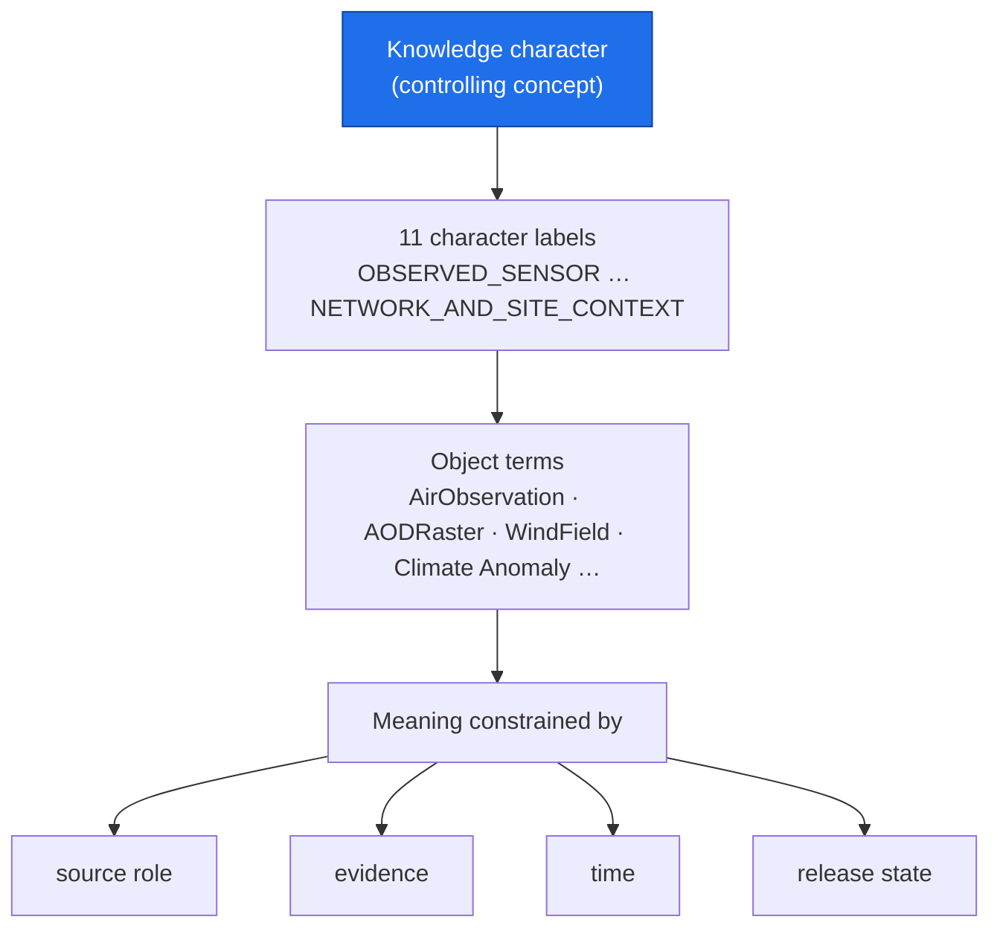

<!-- [KFM_META_BLOCK_V2]
doc_id: kfm://doc/atmosphere-ubiquitous-language
title: Atmosphere / Air — Ubiquitous Language
type: standard
version: v1
status: draft
owners: KFM Atmosphere/Air domain stewards  # PLACEHOLDER — confirm steward roster
created: 2026-05-29
updated: 2026-05-29
policy_label: public
related: [ai-build-operating-contract.md, directory-rules.md, docs/domains/atmosphere/README.md, docs/domains/atmosphere/SOURCE_FAMILIES.md, docs/domains/atmosphere/SOURCE_REGISTRY.md, contracts/domains/atmosphere/]
tags: [kfm]
notes: [CONTRACT_VERSION pinned 3.0.0 # terms from Atlas Ch.11 §C; CONFIRMED as terms, field realization PROPOSED # DDD ubiquitous-language framing per DomainDriven Design Reference]
[/KFM_META_BLOCK_V2] -->

# 🌬️ Atmosphere / Air — Ubiquitous Language

> The shared vocabulary of the Atmosphere / Air bounded context: every term whose meaning is fixed inside this domain, so docs, schemas, contracts, policy, and AI answers all use it the same way.

**Status:** `draft` · **Owners:** Atmosphere / Air domain stewards *(placeholder — confirm roster)* · **Updated:** 2026-05-29 · `CONTRACT_VERSION = "3.0.0"`

---

## Quick jump

- [1. Purpose](#1-purpose)
- [2. Repo fit](#2-repo-fit)
- [3. How to read this glossary](#3-how-to-read-this-glossary)
- [4. The meaning-constraint rule](#4-the-meaning-constraint-rule)
- [5. Knowledge-character vocabulary](#5-knowledge-character-vocabulary)
- [6. Object and concept terms](#6-object-and-concept-terms)
- [7. Cross-context terms (use, don't redefine)](#7-cross-context-terms-use-dont-redefine)
- [8. Term relationships](#8-term-relationships)
- [Open questions register](#open-questions-register)
- [Open verification backlog](#open-verification-backlog)
- [Changelog](#changelog-v0--v1)
- [Definition of done](#definition-of-done)
- [Related docs](#related-docs)

---

## 1. Purpose

This is the **ubiquitous language** for the Atmosphere / Air bounded context — the single agreed vocabulary used by stewards, contract authors, schema authors, policy authors, and the governed AI runtime. A ubiquitous language is a language structured around the domain model and used by everyone within a bounded context to connect the team's activity with the software. *(DDD framing — `[DDD]`.)*

> [!NOTE]
> KFM treats the glossary as **load-bearing**, not decorative. The operating contract requires KFM-specific terms to be preserved exactly — never silently renamed into generic industry language. A term defined here means *this*, here, and translation across the bounded-context boundary must be explicit, not assumed.

[↑ Back to top](#top)

---

## 2. Repo fit

| Aspect | Value | Status |
|---|---|---|
| This file | `docs/domains/atmosphere/UBIQUITOUS_LANGUAGE.md` | PROPOSED |
| Owning root | `docs/` (human-facing control plane) | CONFIRMED (`directory-rules.md` §6.1) |
| Domain segment | `atmosphere/` lane inside `docs/domains/` | CONFIRMED (`directory-rules.md` §12) |
| Term **meaning** (semantic contracts) | `contracts/domains/atmosphere/` | PROPOSED — NEEDS VERIFICATION |
| Term **shape** (schemas) | `schemas/contracts/v1/domains/atmosphere/` | PROPOSED — NEEDS VERIFICATION |
| Term source | Atlas Ch. 11 §C "Ubiquitous language" | CONFIRMED |

> [!IMPORTANT]
> This glossary **explains**; it does not define machine shape or admissibility. Field realization for each term lives in `contracts/` (meaning) and `schemas/` (shape); admissibility lives in `policy/`. A term here that disagrees with a mounted contract or schema is a **drift entry**, not a correction. *(`directory-rules.md` §4 split.)*

[↑ Back to top](#top)

---

## 3. How to read this glossary

Every Atmosphere term is **CONFIRMED as a term** in the Atlas; its **field realization is PROPOSED** until a mounted contract/schema confirms it. The label pattern below is doctrinal and applies to every entry. *(`[DOM-AIR]` `[ENCY]`.)*

| Column | Meaning |
|---|---|
| **Term** | The exact KFM-specific token. Casing and compounding are normative — preserve them. |
| **Status** | `CONFIRMED term / PROPOSED field realization` for every Atmosphere term. |
| **Meaning is constrained by** | Every term's meaning is bounded by **source role, evidence, time, and release state** — the four-way constraint that keeps the term honest. |

[↑ Back to top](#top)

---

## 4. The meaning-constraint rule

> [!IMPORTANT]
> **Every Atmosphere term means what it means only as constrained by source role, evidence, time, and release state.** *(CONFIRMED doctrine — `[DOM-AIR]` `[ENCY]`.)*

A worked reading of the constraint:

- **Source role** — the same number is a different thing depending on whether it is `observed`, `regulatory`, `modeled`, or `aggregate`. An AQI report term is not a concentration-observation term.
- **Evidence** — a term applies to a claim only when that claim resolves to an `EvidenceBundle`; otherwise the runtime ABSTAINs.
- **Time** — source, observed, valid, retrieval, release, and correction times stay distinct where material; a term carries its temporal scope.
- **Release state** — a term may name a candidate, a processed object, or a published derivative; the same word does not silently promote across the trust membrane.

[↑ Back to top](#top)

---

## 5. Knowledge-character vocabulary

`Knowledge character` is the controlling concept of the Atmosphere bounded context: a label every admitted source carries that constrains how it may appear in layers, drawers, exports, and AI answers. The labels below are the CONFIRMED Atmosphere vocabulary. *(`[DOM-AIR]` `[ENCY]`.)*

| Term | Meaning (field realization PROPOSED) | Reading constraint |
|---|---|---|
| `Knowledge character` | The classifying attribute attached to every admitted source. | The parent concept for all labels below. |
| `OBSERVED_SENSOR` | A direct sensor reading from an operator network. | An observation, not an AQI report or model field. |
| `PUBLIC_AQI_REPORT` | An agency-issued AQI summary. | **AQI is not concentration.** |
| `REGULATORY_ARCHIVE` | A QA/QC'd regulatory record. | Provisional/final state and lag are material. |
| `LOW_COST_SENSOR` | A community / low-cost sensor stream. | Requires correction, caveat, confidence before public surface. |
| `ATMOSPHERIC_MODEL_FIELD` | Numerical model output. | **A model field is not an observation.** |
| `REMOTE_SENSING_MASK` | A satellite / airborne mask product. | **AOD is not PM2.5;** retrieval algorithm is part of meaning. |
| `CLIMATE_ANOMALY_CONTEXT` | A departure from a climate normal. | Aggregation unit and period are part of meaning. |
| `DERIVED_FUSION` | A multi-source derived surface. | Source list and weights are part of meaning. |
| `METEOROLOGICAL_CONTEXT` | Wind / precipitation / temperature context. | Carries a stale-state badge past cadence. |
| `ALERT_AND_ADVISORY_CONTEXT` | Issued advisory / forecast text. | **Not a life-safety carrier;** KFM is not an alert authority. |
| `NETWORK_AND_SITE_CONTEXT` | Station / network metadata. | Sensitive site fields are policy-controlled. |

> [!CAUTION]
> The three identity rules — **AQI ≠ concentration, AOD ≠ PM2.5, model field ≠ observation** — are not stylistic preferences. Using one term where another is meant is a source-role collapse and a **DENY** at the trust membrane. *(`[DOM-AIR]` `[ENCY]`.)*

[↑ Back to top](#top)

---

## 6. Object and concept terms

The domain's object families, named as terms. Each is a CONFIRMED term with PROPOSED field realization, meaning constrained by source role, evidence, time, and release state. *(`[DOM-AIR]` `[ENCY]`.)*

| Term | What it names |
|---|---|
| `AirStation` | A fixed air-monitoring station identity. |
| `AirObservation` | A measured air reading from a station. |
| `PM2.5 Observation` | A fine-particulate concentration measurement. |
| `Ozone Observation` | An ozone concentration measurement. |
| `SmokeContext` | A smoke-presence context layer (observed or modeled per role). |
| `AODRaster` | An aerosol-optical-depth raster product. |
| `Weather Station` | A fixed meteorological station identity. |
| `Weather Observation` | A measured meteorological reading. |
| `WindField` | A wind vector field (observed or modeled per role). |
| `Precipitation Observation` | A measured precipitation reading. |
| `Temperature Observation` | A measured temperature reading. |
| `Climate Normal` | A multi-decadal aggregate baseline. |
| `Climate Anomaly` | A departure from a climate normal. |
| `Forecast Context` | A forecast-derived context surface. |
| `Advisory Context` | Issued advisory text as context, never as instruction. |

> [!NOTE]
> PROPOSED identity basis for each object: *source id + object role + temporal scope + normalized digest*. CONFIRMED temporal rule: source, observed, valid, retrieval, release, and correction times stay distinct where material. *(`[DOM-AIR]` `[ENCY]`.)*

[↑ Back to top](#top)

---

## 7. Cross-context terms (use, don't redefine)

These terms originate in KFM's cross-cutting doctrine. Atmosphere **uses** them with their canonical meaning and MUST NOT redefine them locally. They are listed so the glossary is self-contained for a reader. *(`[ENCY]`; preserve casing exactly.)*

| Term | Canonical meaning (summary) | Owning context |
|---|---|---|
| `SourceDescriptor` | Names a source's identity, role, rights, cadence, sensitivity, verification state. | Cross-cutting source doctrine |
| `EvidenceRef` | A stable pointer from a claim to a source locator with spatial/temporal scope and digest. | Cross-cutting evidence doctrine |
| `EvidenceBundle` | The resolved support object a claim must resolve to before display. | Cross-cutting evidence doctrine |
| `PolicyDecision` | `allow` / `deny` / `restrict` / `hold` / `abstain` with reasons and obligations. | Policy doctrine |
| `ModelRunReceipt` | Pins the inputs, parameters, and version of a modeled value. | Receipt doctrine |
| `RedactionReceipt` | Records a sensitivity transform and its reason. | Sensitivity doctrine |
| `ReleaseManifest` | The artifact authorizing a public-safe release. | Release doctrine |
| `RuntimeResponseEnvelope` | Finite runtime output: `ANSWER` / `ABSTAIN` / `DENY` / `ERROR`. | Governed-AI / runtime doctrine |

> [!WARNING]
> If a cross-context term ever needs an Atmosphere-specific nuance, that is an ADR/contract change in the owning context — not a local redefinition here. A bounded context borrows shared terms; it does not fork their meaning silently. *(`[DDD]` bounded-context discipline.)*

[↑ Back to top](#top)

---

## 8. Term relationships

How the controlling concept binds the object terms and the constraint axes.

[↑ Back to top](#top)

---

## Open questions register

| ID | Question | Owner role | Resolution path |
|---|---|---|---|
| OQ-AIR-UL-01 | Field realization of each term in `contracts/` / `schemas/` — what are the actual field names? | Schema owner | Repo inspection vs. Atlas Ch. 11 §C |
| OQ-AIR-UL-02 | Is `PM2.5 Observation` a distinct object term or a typed `AirObservation`? | Atmosphere steward + contract author | `contracts/domains/atmosphere/` inspection |
| OQ-AIR-UL-03 | Should the knowledge-character labels be a shared enum (cross-cutting) or Atmosphere-local? | Schema owner | ADR (relates to source-role enum ADR-S-04) |
| OQ-AIR-UL-04 | Confirm casing/compounding of each term against mounted contracts (e.g., `AODRaster` vs `AOD Raster`). | Docs steward | Repo inspection |

## Open verification backlog

These items remain `NEEDS VERIFICATION` before promotion from `draft` to `published`:

1. Field realization of every term in mounted `contracts/` and `schemas/` (OQ-AIR-UL-01).
2. Whether `PM2.5 Observation` / `Ozone Observation` are distinct objects or typed observations (OQ-AIR-UL-02).
3. Scope of the knowledge-character enum — shared vs. local (OQ-AIR-UL-03).
4. Exact casing/compounding of each term against the mounted source of truth (OQ-AIR-UL-04).
5. Steward / owner assignment for the meta block.

## Changelog v0 → v1

| Change | Type (per contract §37) | Reason |
|---|---|---|
| Initial Atmosphere ubiquitous-language glossary authored | new | First-pass §C vocabulary surface. |
| Knowledge-character vocabulary + object terms imported from Atlas | gap closure | Ground terms in `[DOM-AIR]` evidence. |
| Meaning-constraint rule made explicit | clarification | Surface the source-role/evidence/time/release constraint per term. |
| Cross-context "use, don't redefine" section added | clarification | Prevent local redefinition of shared terms (DDD bounded-context discipline). |

> **Backward compatibility.** New file; no anchors to preserve. Term casing introduced here is normative and SHOULD be preserved on future edits.

## Definition of done

This document is done enough to enter the repository when:

- it is placed according to Directory Rules;
- a docs steward and the Atmosphere / Air domain steward review it;
- it is linked from `docs/domains/atmosphere/README.md`;
- term casing/compounding matches mounted `contracts/` and `schemas/` (OQ-AIR-UL-01, OQ-AIR-UL-04);
- it does not conflict with accepted ADRs;
- any conflict with current repo conventions is logged in `docs/registers/DRIFT_REGISTER.md`;
- the `GENERATED_RECEIPT.json` planned in the PR is wired into CI;
- future changes follow the operating contract's §37 lifecycle.

---

## Related docs

- [`docs/domains/atmosphere/README.md`](./README.md) — domain landing page *(NEEDS VERIFICATION)*
- [`docs/domains/atmosphere/SOURCE_FAMILIES.md`](./SOURCE_FAMILIES.md) — source-family catalog
- [`docs/domains/atmosphere/SOURCE_REGISTRY.md`](./SOURCE_REGISTRY.md) — source admission & knowledge-character use
- [`ai-build-operating-contract.md`](../../../ai-build-operating-contract.md) — operating law (`CONTRACT_VERSION = "3.0.0"`)
- `contracts/domains/atmosphere/` — term meaning (field realization) *(PROPOSED)*
- `schemas/contracts/v1/domains/atmosphere/` — term shape *(PROPOSED)*

---

**Last updated:** 2026-05-29 · `CONTRACT_VERSION = "3.0.0"` · Status: `draft`

[↑ Back to top](#top)
